# StockStat — Programmable Financial Instrument Statistical Computing Platform Design Report

> **Version**: v1.6  
> **Date**: 2026-07-17  
> **Status**: Implemented (including backtest subsystem, pluggable execution model, visualization layer, analysis tools)

---

## Table of Contents

1. [Project Overview](#1-project-overview)
2. [Overall Architecture](#2-overall-architecture)
3. [Storage Backend Design](#3-storage-backend-design)
4. [Computation Frontend Design](#4-computation-frontend-design)
5. [Scripting Language Design](#5-scripting-language-design)
6. [API Specification](#6-api-specification)
7. [Test Cases](#7-test-cases)
8. [Technology Stack](#8-technology-stack)
9. [Deployment](#9-deployment)
10. [Project Structure](#10-project-structure)
11. [Development Roadmap](#11-development-roadmap)
12. [Backtest Subsystem Design](#12-backtest-subsystem-design)
    - 12.1 Design Goals & Principles
    - 12.2 Top-Level Architecture
    - 12.3 Module Layout
    - 12.4 Core Interface Signatures
    - 12.5 Multi-Timeframe Alignment & Lookahead Protection
    - 12.6 Cost & Fill Models
    - 12.7 Position Sizing Algorithms
    - 12.8 Performance Metrics
    - 12.9 Integration with Existing Modules
    - 12.10 Built-in Example Strategies
    - 12.11 Dependency Declaration
    - 12.12 Pluggable Execution Model
    - 12.13 Backtest Visualization
    - 12.14 Analysis Tools & Batch Backtesting
- [Appendix A: Data Source Compatibility Matrix](#appendix-a-data-source-compatibility-matrix)
- [Appendix B: OHLCV Data Volume Estimation](#appendix-b-ohlcv-data-volume-estimation)
- [Appendix C: Backtest Phase Documentation Index](#appendix-c-backtest-phase-documentation-index)

---

## 1. Project Overview

### 1.1 Project Goals

Build a **user-programmable** stock/cryptocurrency statistical computing platform with core capabilities including:

- **Unified data access**: Compatible with multiple data sources (stock exchanges, crypto exchanges, third-party APIs), exposing a unified interface to the upper layer
- **Programmable computation**: Users can write statistical computation logic via Python library or custom DSL
- **Frontend-backend separation**: Storage backend as an independently deployable service; computation frontend as a library with configurable connections
- **Extensibility**: Data source adapters and indicator algorithms are plugin-based designs

### 1.2 Design Principles

| Principle | Description |
|-----------|-------------|
| **Data-computation separation** | Storage backend handles data ingestion, storage, and querying only; all computation logic runs in the frontend library |
| **Unified abstraction** | Data from different sources is normalized to a consistent OHLCV model |
| **Programmability first** | No built-in fixed strategies; rich primitives let users compose freely |
| **Progressive complexity** | Simple queries via DSL one-liner; complex analysis via full-featured Python library |
| **Reproducibility** | Each computation can record data snapshot version and parameters for reproducible results |

### 1.3 Core Feature List

```
□ Multi-source data access (yfinance / Alpha Vantage / Tushare / ccxt / custom)
□ OHLCV normalized storage (TimescaleDB)
□ Unified REST API querying
□ Python computation library (pandas/numpy integration)
□ Expression DSL (SQL-like statistical query language)
□ Built-in technical indicator library (MA / EMA / RSI / MACD / ATR / Beta / Sharpe …)
□ Custom indicator registration mechanism
□ Computation result export (JSON / CSV / DataFrame)
□ Optional visualization layer (protocol-based design, matplotlib as optional extras, zero core dependency)
□ Data caching and incremental updates
```

---

## 2. Overall Architecture

### 2.1 Architecture Overview

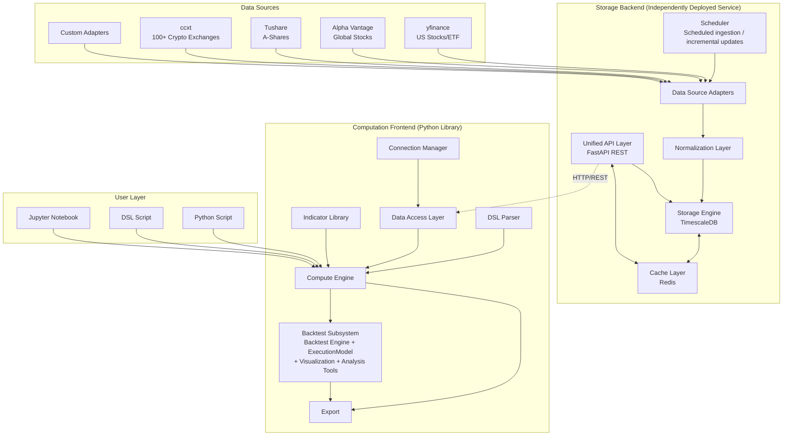

### 2.2 Component Responsibilities

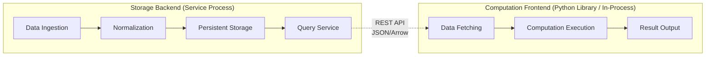

### 2.3 Data Flow

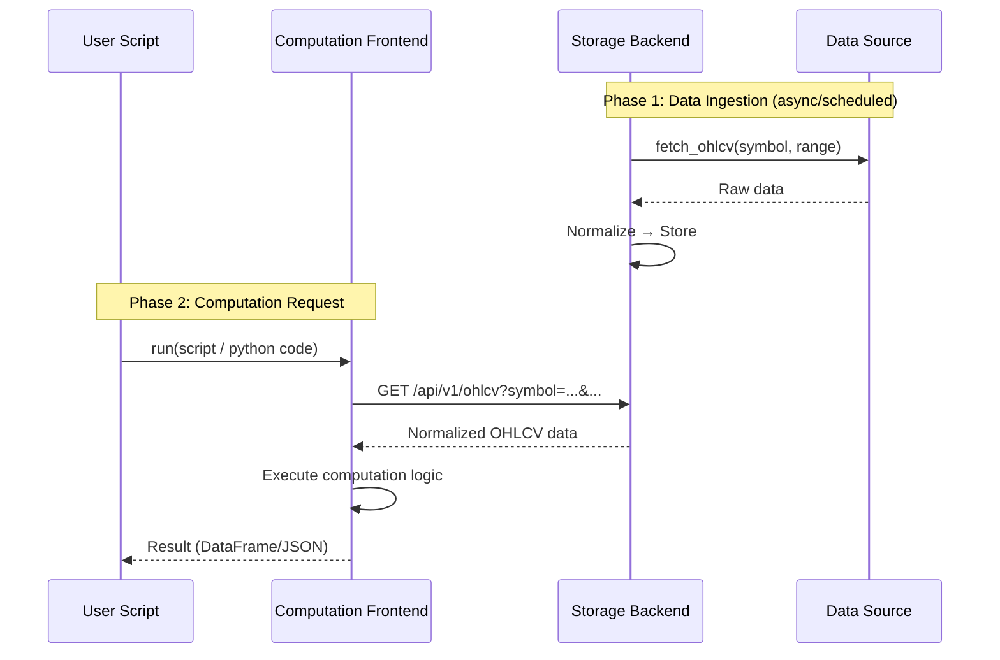

---

## 3. Storage Backend Design

### 3.1 Data Source Adapter Layer

Data source adapters use a **plugin-based** design, each implementing a unified interface with hot-registration support.

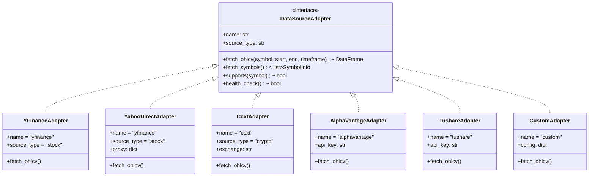

**Adapter Registration Mechanism**:

```python
# Storage backend config example (config.yaml)
data_sources:
  - name: yfinance
    type: stock
    enabled: true
    
  - name: binance
    type: crypto
    adapter: ccxt
    config:
      exchange: binance
      rate_limit: 10  # requests/second
    
  - name: alphavantage
    type: stock
    enabled: true
    config:
      api_key: ${ALPHA_VANTAGE_KEY}
    
  - name: tushare
    type: stock
    enabled: true
    config:
      api_key: ${TUSHARE_TOKEN}
      market: A-Share
```

### 3.1.1 Proxy Support

The storage backend supports configuring HTTP/SOCKS5 proxies for all data source adapters, **disabled by default**. When enabled, all outbound data ingestion requests (yfinance, ccxt, etc.) are forwarded through the proxy.

| Design Constraint | Description |
|-------------------|-------------|
| **Disabled by default** | When `STOCKSTAT_PROXY_ENABLED` is unset or false, all adapters connect directly |
| **Dual-protocol support** | Supports both `http` and `socks5` proxy types |
| **Default addresses** | HTTP defaults to `http://127.0.0.1:8889`; SOCKS5 defaults to `socks5://127.0.0.1:1089` |
| **Unified injection** | Proxy config injected at adapter instantiation, transparent to upper layers |

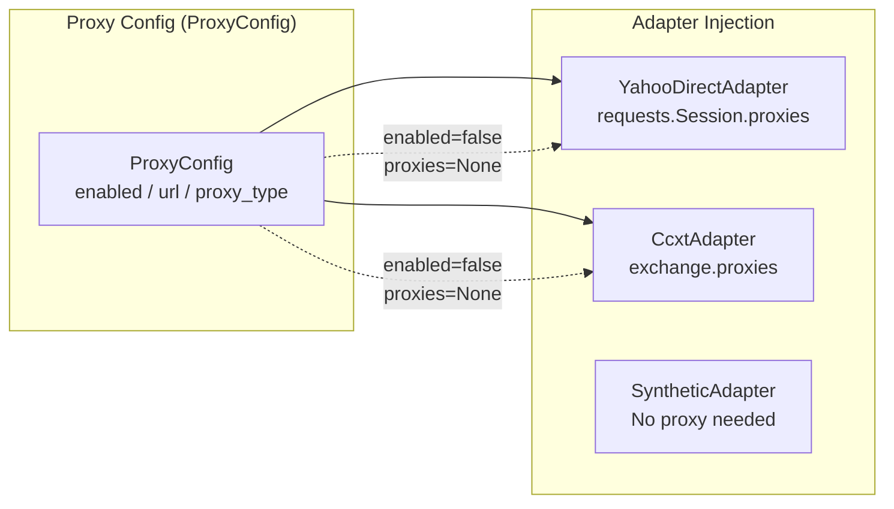

**Environment Variable Configuration**:

| Environment Variable | Default | Description |
|---------------------|---------|-------------|
| `STOCKSTAT_PROXY_ENABLED` | `false` | Enable proxy |
| `STOCKSTAT_PROXY_TYPE` | `http` | Proxy type: `http` or `socks5` |
| `STOCKSTAT_PROXY_URL` | (auto-filled by type) | Proxy address; uses default if unset |

```bash
# Enable HTTP proxy (default address)
export STOCKSTAT_PROXY_ENABLED=true
export STOCKSTAT_PROXY_TYPE=http
# STOCKSTAT_PROXY_URL defaults to http://127.0.0.1:8889

# Enable SOCKS5 proxy (default address)
export STOCKSTAT_PROXY_ENABLED=true
export STOCKSTAT_PROXY_TYPE=socks5
# STOCKSTAT_PROXY_URL defaults to socks5://127.0.0.1:1089

# Custom proxy address
export STOCKSTAT_PROXY_ENABLED=true
export STOCKSTAT_PROXY_URL=http://192.168.1.100:8080
```

**REST API Proxy Status Query**:

```
GET /api/v1/proxy
→ {"enabled": true, "url": "http://127.0.0.1:8889", "proxy_type": "http"}

GET /api/v1/health
→ {"status": "ok", "proxy": {"enabled": true, "url": "http://127.0.0.1:8889", "proxy_type": "http"}}
```

### 3.2 Normalization Layer

Different data sources produce varying raw formats; the normalization layer unifies them into an internal canonical format.


**Unified Data Model**:

| Field | Type | Description |
|-------|------|-------------|
| `symbol` | `VARCHAR` | Unified symbol identifier, e.g. `BTC/USDT`, `AAPL`, `600000.SH` |
| `ts` | `TIMESTAMPTZ` | UTC timestamp |
| `open` | `NUMERIC` | Open price |
| `high` | `NUMERIC` | High price |
| `low` | `NUMERIC` | Low price |
| `close` | `NUMERIC` | Close price |
| `volume` | `NUMERIC` | Volume |
| `source` | `VARCHAR` | Data source identifier |
| `timeframe` | `VARCHAR` | Time period `1m/5m/15m/1h/4h/1d/1w` |

**Symbol Mapping Table**:

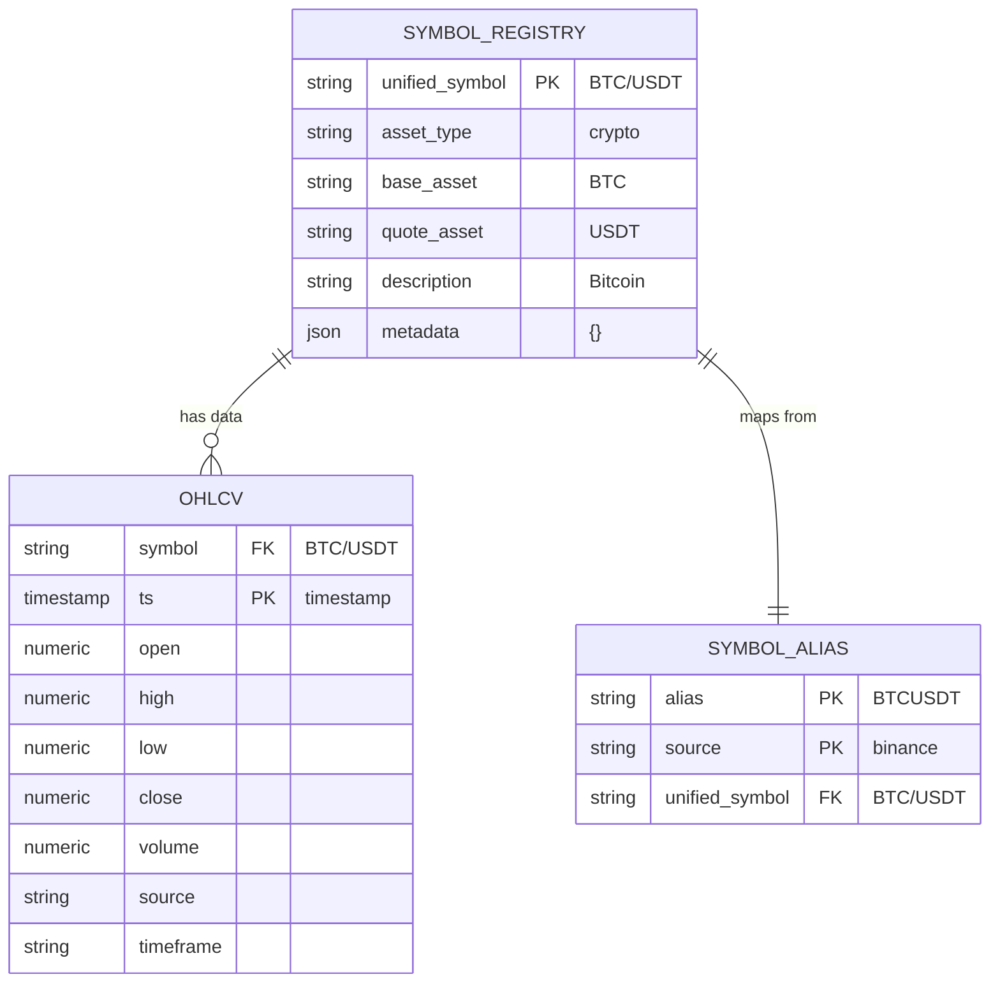

### 3.3 Storage Engine

**TimescaleDB** (PostgreSQL time-series extension) is chosen for the following reasons:

- Native SQL, mature ecosystem
- Hypertable auto-partitions by time for efficient queries
- Supports Continuous Aggregates for precomputing common timeframes
- Seamless integration with Python ecosystem (pandas/SQLAlchemy)


**Hypertable Creation DDL**:

```sql
-- Create hypertable
CREATE TABLE ohlcv (
    symbol      VARCHAR(50)  NOT NULL,
    ts          TIMESTAMPTZ  NOT NULL,
    open        NUMERIC(20,8),
    high        NUMERIC(20,8),
    low         NUMERIC(20,8),
    close       NUMERIC(20,8),
    volume      NUMERIC(20,8),
    source      VARCHAR(50)  NOT NULL,
    timeframe   VARCHAR(10)  NOT NULL DEFAULT '1d',
    ingested_at TIMESTAMPTZ  DEFAULT NOW(),
    PRIMARY KEY (symbol, ts, timeframe)
);

SELECT create_hypertable('ohlcv', 'ts');

-- Indexes
CREATE INDEX idx_ohlcv_symbol_ts ON ohlcv (symbol, ts DESC);
CREATE INDEX idx_ohlcv_timeframe ON ohlcv (timeframe);

-- Continuous aggregate: daily level
CREATE MATERIALIZED VIEW ohlcv_1d
WITH (timescaledb.continuous) AS
SELECT
    symbol,
    time_bucket('1 day', ts) AS day,
    first(open, ts) AS open,
    max(high) AS high,
    min(low) AS low,
    last(close, ts) AS close,
    sum(volume) AS volume,
    source
FROM ohlcv
WHERE timeframe = '1m'
GROUP BY symbol, day, source;
```

### 3.4 Scheduler


### 3.5 Caching Strategy

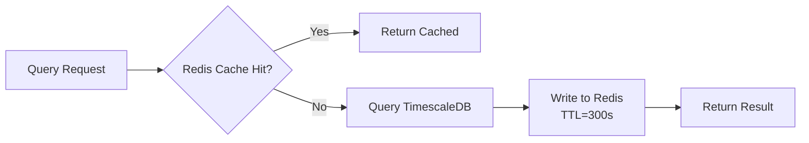

---

## 4. Computation Frontend Design

### 4.1 Client Architecture

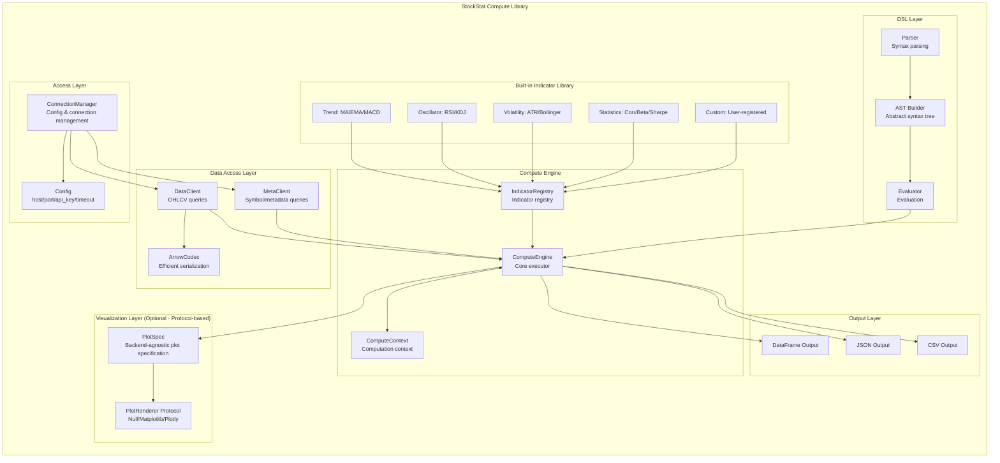

### 4.2 Connection Management

```python
from stockstat import StockStatClient

# Option 1: Config file
client = StockStatClient.from_config("stockstat.yaml")

# Option 2: Direct configuration
client = StockStatClient(
    host="localhost",
    port=8000,
    api_key="optional-key",
    timeout=30,
    cache_enabled=True
)

# Option 3: Environment variables
client = StockStatClient.from_env()
```

### 4.3 Data Access Layer

```python
# Fetch OHLCV data, returns pandas DataFrame
data = client.ohlcv(
    symbol="PAXG/USDT",
    source="binance",
    start="2022-01-01",
    end="2024-12-31",
    timeframe="1d"
)
# DataFrame columns: open, high, low, close, volume (DatetimeIndex)

# Batch fetch
data = client.ohlcv_batch(
    symbols=["BTC/USDT", "ETH/USDT", "PAXG/USDT"],
    start="2024-01-01",
    timeframe="1d"
)

# List available symbols
symbols = client.symbols(asset_type="crypto", source="binance")
```

### 4.4 Compute Engine & Indicator Registration

```python
from stockstat import indicator, ComputeContext

# Use built-in indicators
sma = client.compute.ma(data.close, window=20)
rsi = client.compute.rsi(data.close, window=14)
beta = client.compute.beta(asset="AAPL", benchmark="^GSPC", window=60)

# Register custom indicator
@indicator(name="weekend_gain_loss_corr", category="custom")
def weekend_monday_gain_loss(data: pd.DataFrame) -> dict:
    """
    Compute the independent correlation between PAXG weekend return
    and Monday max gain / max loss. Records both independently to
    avoid selection bias.
    """
    df = data.copy()
    df['weekday'] = df.index.weekday  # 0=Mon ... 6=Sun

    fridays = df[df.weekday == 4][['close']]
    sundays = df[df.weekday == 6][['close']]
    mondays = df[df.weekday == 0][['open', 'high', 'low', 'close']]

    pairs = []
    for mon_date, mon_row in mondays.iterrows():
        prev_fri = fridays.loc[:mon_date].tail(1)
        prev_sun = sundays.loc[:mon_date].tail(1)
        if len(prev_fri) > 0 and len(prev_sun) > 0:
            fri_c = prev_fri['close'].iloc[0]
            sun_c = prev_sun['close'].iloc[0]
            weekend_ret = (sun_c - fri_c) / fri_c
            mon_open = mon_row['open']
            max_gain = (mon_row['high'] - mon_open) / mon_open
            max_loss = (mon_row['low'] - mon_open) / mon_open
            pairs.append({'weekend_return': weekend_ret,
                          'max_gain': max_gain, 'max_loss': max_loss})

    result_df = pd.DataFrame(pairs)
    r_gain = result_df['weekend_return'].corr(result_df['max_gain'])
    r_loss = result_df['weekend_return'].corr(result_df['max_loss'])

    return {"r_gain": r_gain, "r_loss": r_loss, "n_samples": len(result_df)}

# Execute custom indicator
result = client.compute.call("weekend_gain_loss_corr", data=data)
```

### 4.5 Visualization & matplotlib Adaptation Design

#### 4.5.1 Design Goals

The visualization layer follows the **zero hard dependency** principle: the core computation library does not depend on matplotlib or any plotting library; when the user installs matplotlib, enhanced plotting capabilities are automatically activated.

| Design Constraint | Description |
|-------------------|-------------|
| **Zero hard dependency** | `import stockstat` does not trigger any plotting library import; `pyproject.toml` core dependencies exclude matplotlib |
| **Protocol abstraction** | Defines `PlotRenderer` protocol, multiple backends pluggable (matplotlib / plotly / null renderer) |
| **Data-rendering separation** | Compute engine produces backend-agnostic `PlotSpec` (plot specification), rendered by a renderer |
| **Lazy import** | matplotlib is only `import`ed on first render call; gracefully degrades if missing |
| **Optional extras** | Pull plotting dependencies via `pip install stockstat[matplotlib]` |

#### 4.5.2 Class Design

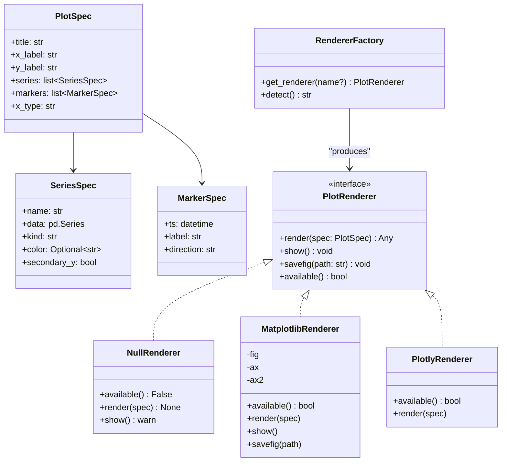

#### 4.5.3 Module Organization & Lazy Import

```
stockstat/
└── plot/
    ├── __init__.py          # Exposes PlotSpec / plot() / get_renderer()
    ├── base.py              # PlotRenderer protocol + NullRenderer default
    └── matplotlib_backend.py # matplotlib adapter (lazy import within module)
```

`matplotlib_backend.py` uses lazy import internally to ensure the core library import chain is not polluted:

```python
# stockstat/plot/matplotlib_backend.py
from .base import PlotRenderer, PlotSpec

class MatplotlibRenderer(PlotRenderer):
    def __init__(self):
        self._plt = None   # Deferred until first render

    def available(self) -> bool:
        try:
            import matplotlib  # noqa: F401
            return True
        except ImportError:
            return False

    def render(self, spec: PlotSpec):
        import matplotlib.pyplot as plt   # Only imported here
        self._plt = plt
        fig, ax = plt.subplots()
        for s in spec.series:
            if s.kind == "line":
                ax.plot(s.data.index, s.data.values, label=s.name, color=s.color)
            elif s.kind == "bar":
                ax.bar(s.data.index, s.data.values, label=s.name, color=s.color)
        ax.set_title(spec.title)
        ax.legend()
        self.fig, self.ax = fig, ax
        return fig
```

#### 4.5.4 Auto-Detection & Graceful Degradation

`RendererFactory.detect()` probes installed backends by priority; if all are missing, returns `NullRenderer` which only warns instead of raising exceptions.

```python
# stockstat/plot/__init__.py
from .base import NullRenderer, PlotSpec

def get_renderer(name: str | None = None) -> "PlotRenderer":
    if name is None:
        name = RendererFactory.detect()
    if name == "matplotlib":
        from .matplotlib_backend import MatplotlibRenderer
        return MatplotlibRenderer()
    if name == "plotly":
        from .plotly_backend import PlotlyRenderer
        return PlotlyRenderer()
    return NullRenderer()   # Safe fallback, zero-dependency usable
```

#### 4.5.5 Usage

```python
from stockstat import StockStatClient

client = StockStatClient(host="localhost", port=8000)
data = client.ohlcv("BTC/USDT", start="2024-01-01", timeframe="1d")

# Option A: Protocol-based plotting (recommended, backend-agnostic)
spec = client.plot.spec(
    title="BTC/USDT 2024",
    series=[
        {"name": "close", "data": data.close, "kind": "line"},
        {"name": "ma20",  "data": data.close.rolling(20).mean(), "kind": "line"},
    ],
)
renderer = client.plot.get_renderer()     # Auto-detect; NullRenderer if missing
renderer.render(spec)
renderer.savefig("btc.png")               # Works when matplotlib is present

# Option B: Hand computation results directly to matplotlib (user manages dependency)
import matplotlib.pyplot as plt           # User imports
plt.plot(data.index, data.close)
plt.title("BTC/USDT")
plt.show()

# Option C: Retrieve backend-agnostic data, use any plotting library
payload = spec.to_dict()                  # Pure dict / JSON serializable
```

#### 4.5.6 Dependency Declaration

`pyproject.toml` uses optional extras; core installation does not pull matplotlib:

```toml
[project]
name = "stockstat"
dependencies = [
    "pandas>=2.0",
    "numpy>=1.24",
    "httpx>=0.27",
    "pyarrow>=15.0",
]

[project.optional-dependencies]
matplotlib = ["matplotlib>=3.8"]
plotly     = ["plotly>=5.20"]
plot       = ["stockstat[matplotlib]", "stockstat[plotly]"]
```

---

## 5. Scripting Language Design

Provides **dual-mode** programmable interface: Python library (full-featured) + DSL (lightweight declarative).

### 5.1 Mode Comparison

```mermaid
graph TB
    subgraph "Python Library Mode (Full-featured)"
        direction TB
        P1["✅ Full pandas/numpy ecosystem"]
        P2["✅ Arbitrary complex logic"]
        P3["✅ Debuggable / breakpointable"]
        P4["⚠️ Requires Python environment"]
        P5["⚠️ Security is user's responsibility"]
    end
    
    subgraph "DSL Mode (Lightweight Declarative)"
        direction TB
        D1["✅ One-liner for common statistics"]
        D2["✅ Sandboxed execution"]
        D3["✅ Serializable / storable / reproducible"]
        D4["✅ Non-Python-user friendly"]
        D5["⚠️ Limited expressiveness"]
    end
```

### 5.2 Python Library Mode

Full Python API for complex analysis scenarios:

```python
from stockstat import StockStatClient
import pandas as pd

client = StockStatClient(host="localhost", port=8000)

# Fetch data
paxg = client.ohlcv("PAXG/USDT", start="2022-01-01", timeframe="1d")

# Free-form computation
df = paxg.copy()
df['ret'] = df['close'].pct_change()
df['vol_20'] = df['ret'].rolling(20).std()
df['ma50'] = df['close'].rolling(50).mean()

# Arbitrary pandas operations
result = df[df['vol_20'] > df['vol_20'].quantile(0.9)]
```

### 5.3 DSL Mode

Designed as a **SQL-like declarative statistical query language**, with syntax close to analyst intuition.

#### 5.3.1 Syntax Design

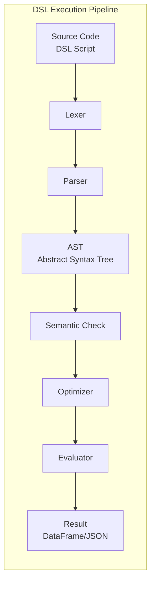

#### 5.3.2 Grammar Specification

```
# DSL Grammar BNF Overview

query       ::= SELECT select_expr (',' select_expr)*
                 FROM source
                 [WHERE condition]
                 [GROUP BY group_expr]
                 [ORDER BY order_expr]
                 [LIMIT n]

source      ::= ohlcv '(' symbol ',' timeframe ')'
              | ohlcv '(' symbol ',' timeframe ',' start ',' end ')'

select_expr ::= expr [AS alias]

expr        ::= function '(' expr (',' expr)* ')'
              | field
              | literal
              | expr operator expr

field       ::= 'open' | 'high' | 'low' | 'close' | 'volume'
              | 'returns' | 'log_returns'

function    ::= 'ma' | 'ema' | 'rsi' | 'macd' | 'std' | 'corr'
              | 'max' | 'min' | 'mean' | 'sum' | 'count'
              | 'rolling' | 'shift' | 'rank' | 'beta'
              | 'weekend_filter' | 'weekday_filter'
```

#### 5.3.3 DSL Examples

```sql
-- Example 1: Compute 20-day MA and close price
SELECT 
    close,
    ma(close, 20) AS ma20,
    ema(close, 12) AS ema12
FROM ohlcv("AAPL", "1d", "2024-01-01", "2024-12-31")

-- Example 2: Compute RSI overbought/oversold signals
SELECT 
    close,
    rsi(close, 14) AS rsi,
    CASE WHEN rsi(close, 14) > 70 THEN 'overbought'
         WHEN rsi(close, 14) < 30 THEN 'oversold'
         ELSE 'neutral' END AS signal
FROM ohlcv("BTC/USDT", "1d", "2024-01-01", "2024-12-31")

-- Example 3: PAXG weekend return vs Monday high-low spread correlation
SELECT 
    corr(
        returns(close, filter=weekend_filter),
        spread(high, low, filter=weekday_filter(0))
    ) AS weekend_monday_corr
FROM ohlcv("PAXG/USDT", "1d", "2022-01-01", "2024-12-31")

-- Example 4: Multi-asset Beta calculation
SELECT 
    beta(close, benchmark="^GSPC", window=60) AS beta_60d
FROM ohlcv("AAPL", "1d", "2024-01-01", "2024-12-31")
```

#### 5.3.4 DSL Built-in Function List

| Category | Function | Description |
|----------|----------|-------------|
| **Trend** | `ma(x, n)` | Simple moving average |
| | `ema(x, n)` | Exponential moving average |
| | `macd(x, fast, slow, signal)` | MACD |
| **Oscillator** | `rsi(x, n)` | Relative Strength Index |
| | `kdj(high, low, close, n)` | KDJ indicator |
| **Volatility** | `std(x, n)` | Rolling standard deviation |
| | `atr(high, low, close, n)` | Average True Range |
| | `bollinger(x, n, k)` | Bollinger Bands |
| **Statistics** | `corr(x, y)` | Correlation coefficient |
| | `beta(x, benchmark)` | Beta coefficient |
| | `sharpe(returns, rf)` | Sharpe ratio |
| | `max_drawdown(cumret)` | Maximum drawdown |
| **Transform** | `returns(x)` | Percentage returns |
| | `log_returns(x)` | Log returns |
| | `rolling(x, n, func)` | Rolling window |
| | `shift(x, n)` | Shift |
| | `rank(x)` | Ranking |
| **Filter** | `weekend_filter` | Weekend filter |
| | `weekday_filter(n)` | Specific weekday filter |
| | `spread(high, low)` | High-low spread |

---

## 6. API Specification

### 6.1 REST API Overview

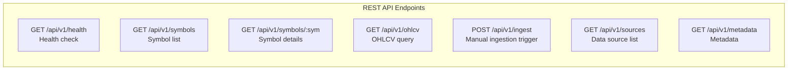

### 6.2 Core API Definitions

#### GET /api/v1/ohlcv

Fetch OHLCV data with support for multiple response formats.

**Request Parameters**:

| Parameter | Type | Required | Description |
|-----------|------|----------|-------------|
| `symbol` | string | Yes | Unified symbol, e.g. `PAXG/USDT` |
| `source` | string | No | Specify data source |
| `start` | string (ISO date) | No | Start time |
| `end` | string (ISO date) | No | End time |
| `timeframe` | string | No | Time period, default `1d` |
| `limit` | int | No | Max rows to return |
| `format` | string | No | `json` / `arrow` / `csv`, default `json` |

**Response Example** (JSON):

```json
{
  "symbol": "PAXG/USDT",
  "source": "binance",
  "timeframe": "1d",
  "count": 731,
  "data": [
    {
      "ts": "2022-01-01T00:00:00Z",
      "open": 1812.50,
      "high": 1820.00,
      "low": 1805.00,
      "close": 1818.00,
      "volume": 15234.5
    }
  ]
}
```

**Apache Arrow Format** (efficient transfer):

```
GET /api/v1/ohlcv?symbol=PAXG/USDT&format=arrow
Accept: application/vnd.apache.arrow.file

→ Returns Arrow IPC binary stream; frontend can zero-copy convert to DataFrame
```

#### GET /api/v1/symbols

```json
{
  "count": 2,
  "symbols": [
    {
      "unified_symbol": "PAXG/USDT",
      "asset_type": "crypto",
      "base_asset": "PAXG",
      "quote_asset": "USDT",
      "sources": ["binance", "coinbase"],
      "description": "PAX Gold"
    },
    {
      "unified_symbol": "AAPL",
      "asset_type": "stock",
      "base_asset": "AAPL",
      "sources": ["yfinance", "alphavantage"],
      "description": "Apple Inc."
    }
  ]
}
```

### 6.3 Error Handling

```json
{
  "error": {
    "code": "SYMBOL_NOT_FOUND",
    "message": "Symbol 'XXX/USDT' not found in registry",
    "details": {
      "symbol": "XXX/USDT"
    }
  }
}
```

| HTTP Code | Error Code | Description |
|-----------|-----------|-------------|
| 400 | `INVALID_PARAMS` | Parameter validation failed |
| 404 | `SYMBOL_NOT_FOUND` | Symbol not found |
| 404 | `DATA_NOT_FOUND` | No data available |
| 429 | `RATE_LIMITED` | Rate limited |
| 500 | `INTERNAL_ERROR` | Internal server error |

---

## 7. Test Cases

### 7.1 Classic Stock Statistics Test Cases

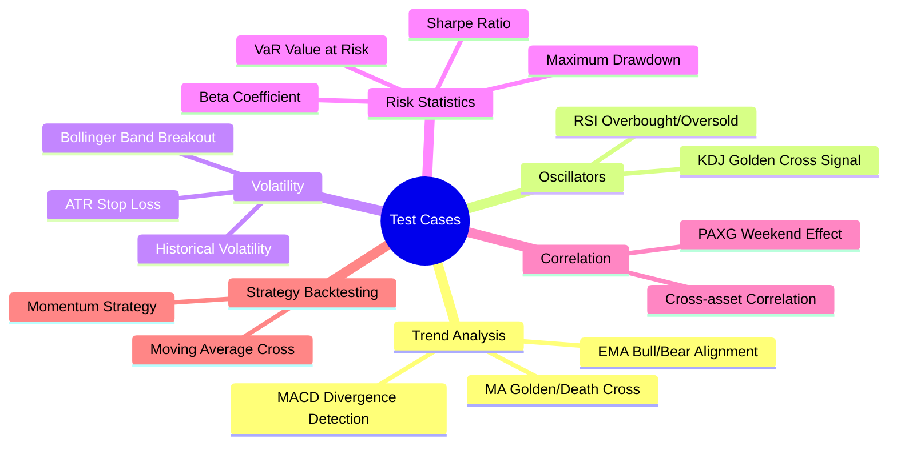

#### Case 1: Moving Average Golden/Death Cross

```python
"""Test MA golden/death cross signal correctness"""
client = StockStatClient(host="localhost", port=8000)
data = client.ohlcv("AAPL", start="2024-01-01", timeframe="1d")

ma_short = data.close.rolling(5).mean()
ma_long = data.close.rolling(20).mean()

# Golden cross: short MA crosses above long MA
golden_cross = (ma_short > ma_long) & (ma_short.shift(1) <= ma_long.shift(1))
# Death cross: short MA crosses below long MA
death_cross = (ma_short < ma_long) & (ma_short.shift(1) >= ma_long.shift(1))

assert golden_cross.sum() >= 0  # At least no error
assert death_cross.sum() >= 0
# Verify: average short-term return after golden cross should be positive
```

#### Case 2: RSI Overbought/Oversold Detection

```python
"""RSI range [0, 100], >70 overbought, <30 oversold"""
data = client.ohlcv("BTC/USDT", start="2024-01-01", timeframe="1d")
rsi = client.compute.rsi(data.close, window=14)

assert rsi.between(0, 100).all()
assert rsi.isna().sum() == 14  # First 14 are NaN
# Verify: known large up-days should have high RSI
```

#### Case 3: Beta Coefficient Calculation

```python
"""Beta = Cov(Ri, Rm) / Var(Rm)"""
stock = client.ohlcv("AAPL", start="2023-01-01", timeframe="1d")
market = client.ohlcv("^GSPC", start="2023-01-01", timeframe="1d")

beta = client.compute.beta(
    asset=stock.close.pct_change(),
    benchmark=market.close.pct_change(),
    window=60
)

# AAPL's Beta typically ranges 1.0~1.3
assert 0.5 < beta.dropna().mean() < 2.0
```

#### Case 4: Maximum Drawdown

```python
"""Max Drawdown = max(1 - P_t / max(P_0..P_t))"""
data = client.ohlcv("BTC/USDT", start="2023-01-01", timeframe="1d")
cumret = data.close / data.close.iloc[0]
running_max = cumret.cummax()
drawdown = (cumret - running_max) / running_max
max_dd = drawdown.min()

assert max_dd <= 0  # Drawdown should be negative
assert max_dd >= -1  # Drawdown should not exceed -100%
```

#### Case 5: Sharpe Ratio

```python
"""Sharpe = (E[R] - Rf) / std(R) * sqrt(252)"""
data = client.ohlcv("BTC/USDT", start="2023-01-01", timeframe="1d")
returns = data.close.pct_change().dropna()

sharpe = client.compute.sharpe(returns, risk_free=0.02, annualize=True)
# Sharpe for high-volatility assets typically ranges -1 ~ 3
assert -5 < sharpe < 10
```

#### Case 6: Bollinger Band Breakout

```python
"""Bollinger Bands = MA ± k * std"""
data = client.ohlcv("ETH/USDT", start="2024-01-01", timeframe="1d")
upper, mid, lower = client.compute.bollinger(data.close, window=20, k=2)

# Upper band should always be >= mid >= lower
assert (upper >= mid).all()
assert (mid >= lower).all()
# Breakout frequency above upper band should be low (<10%)
breakout = (data.close > upper).sum() / len(data)
assert breakout < 0.15
```

#### Case 7: Cross-Asset Correlation

```python
"""BTC and ETH should be highly positively correlated"""
btc = client.ohlcv("BTC/USDT", start="2024-01-01", timeframe="1d")
eth = client.ohlcv("ETH/USDT", start="2024-01-01", timeframe="1d")

corr = btc.close.pct_change().corr(eth.close.pct_change())
assert corr > 0.7  # BTC/ETH daily return correlation typically > 0.7
```

### 7.2 PAXG Weekend Return vs Monday Independent Gain/Loss Correlation

> **Custom test case**: Computes the independent correlation between PAXG (PAX Gold, gold-pegged token) weekend return and Monday max gain `(high-open)/open` and max loss `(low-open)/open`. Both are recorded independently to avoid selection bias from choosing extremes based on signal direction.

#### 7.2.1 Analysis Logic

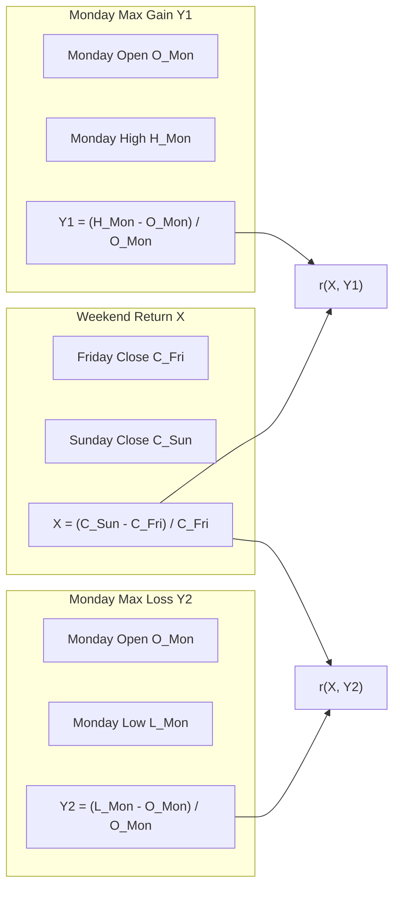

**Hypothesis**: PAXG is gold-pegged; traditional gold markets are closed on weekends. If PAXG's weekend price deviates, it may moderately predict Monday intraday extremes. By independently recording gain and loss, selection bias from choosing extremes based on signal direction is avoided.

#### 7.2.2 Python Implementation

```python
"""
PAXG weekend return vs Monday independent gain/loss correlation test.
Records both (high-open)/open and (low-open)/open.
"""
import pandas as pd
from scipy import stats
from stockstat import StockStatClient

client = StockStatClient(host="localhost", port=8000)

# ── 1. Fetch PAXG daily data ──
paxg = client.ohlcv(
    symbol="PAXG/USDT", source="binance",
    start="2022-01-01", end="2024-12-31", timeframe="1d"
)

# ── 2. Label weekday ──
df = paxg.copy()
df['weekday'] = df.index.weekday

# ── 3. Extract Friday close, Sunday close, Monday OHLC ──
fridays = df[df['weekday'] == 4][['close']].rename(columns={'close': 'fri_close'})
sundays = df[df['weekday'] == 6][['close']].rename(columns={'close': 'sun_close'})
mondays = df[df['weekday'] == 0][['open', 'high', 'low', 'close']].copy()

# ── 4. Build weekend-Monday pairs ──
pairs = []
for mon_date, mon_row in mondays.iterrows():
    prev_fri = fridays.loc[:mon_date].tail(1)
    prev_sun = sundays.loc[:mon_date].tail(1)
    if len(prev_fri) > 0 and len(prev_sun) > 0:
        fri_close = prev_fri['fri_close'].iloc[0]
        sun_close = prev_sun['sun_close'].iloc[0]
        weekend_return = (sun_close - fri_close) / fri_close
        mon_open = mon_row['open']
        max_gain = (mon_row['high'] - mon_open) / mon_open
        max_loss = (mon_row['low'] - mon_open) / mon_open
        pairs.append({'weekend_return': weekend_return,
                      'max_gain': max_gain, 'max_loss': max_loss})

result_df = pd.DataFrame(pairs)

# ── 5. Compute independent correlations ──
r_gain = result_df['weekend_return'].corr(result_df['max_gain'])
r_loss = result_df['weekend_return'].corr(result_df['max_loss'])
p_gain = stats.pearsonr(result_df['weekend_return'], result_df['max_gain'])[1]
p_loss = stats.pearsonr(result_df['weekend_return'], result_df['max_loss'])[1]

# ── 6. Group comparison ──
up = result_df[result_df['weekend_return'] > 0]
dn = result_df[result_df['weekend_return'] < 0]

print(f"Samples:    {len(result_df)} (up={len(up)}, dn={len(dn)})")
print(f"r(gain):    {r_gain:.4f}  p={p_gain:.4f}")
print(f"r(loss):    {r_loss:.4f}  p={p_loss:.4f}")
print(f"Signal>0: gain={up['max_gain'].mean()*100:.4f}%, loss={up['max_loss'].mean()*100:.4f}%")
print(f"Signal<0: gain={dn['max_gain'].mean()*100:.4f}%, loss={dn['max_loss'].mean()*100:.4f}%")
```

#### 7.2.3 Expected Output

```
Samples:    156 (up=76, dn=65)
r(gain):    0.2303  p=0.0038
r(loss):    -0.2004  p=0.0121
Signal>0: gain=0.7099%, loss=-0.9070%
Signal<0: gain=0.5940%, loss=-0.7435%
```

#### 7.2.4 Test Assertions

```python
def test_paxg_weekend_gain_loss(client):
    """PAXG weekend return vs Monday independent gain/loss test"""
    result = compute_paxg_gain_loss(client)
    
    assert result['n_samples'] > 50, "Insufficient samples"
    assert -1 <= result['r_gain'] <= 1, "r(gain) out of range"
    assert -1 <= result['r_loss'] <= 1, "r(loss) out of range"
    
    # PAXG volatility should be small (gold-pegged)
    assert abs(result['up_gain_mean']) < 0.05
    assert abs(result['dn_loss_mean']) < 0.05
```

---

## 8. Technology Stack

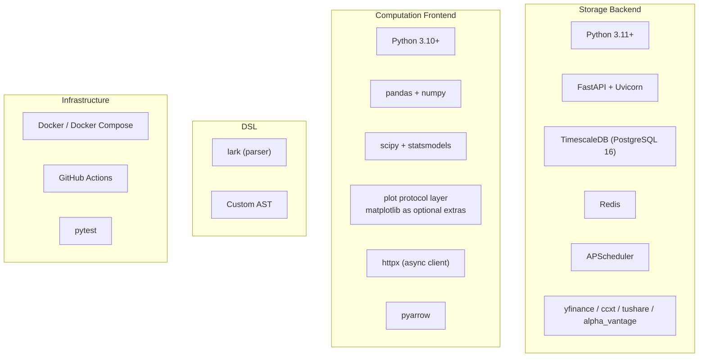

| Layer | Technology | Rationale |
|-------|-----------|-----------|
| Backend framework | FastAPI | Native async, auto-generates OpenAPI docs, high performance |
| Time-series database | TimescaleDB | PostgreSQL-compatible, Hypertable for efficient time-series queries, continuous aggregates |
| Cache | Redis | High-speed query result caching, reduces DB load |
| Compute core | pandas + numpy | De facto standard, richest ecosystem |
| Statistical extensions | scipy + statsmodels | Hypothesis testing, regression analysis |
| DSL parser | lark | Most mature parser in Python ecosystem, EBNF-friendly |
| Data transfer | Apache Arrow | Zero-copy columnar transfer, seamless pandas integration |
| Visualization | matplotlib (optional extras) | Protocol-based adapter, lazy import, zero core dependency, graceful degradation |
| Deployment | Docker Compose | One-command backend service stack deployment |

---

## 9. Deployment

### 9.1 Storage Backend Independent Deployment

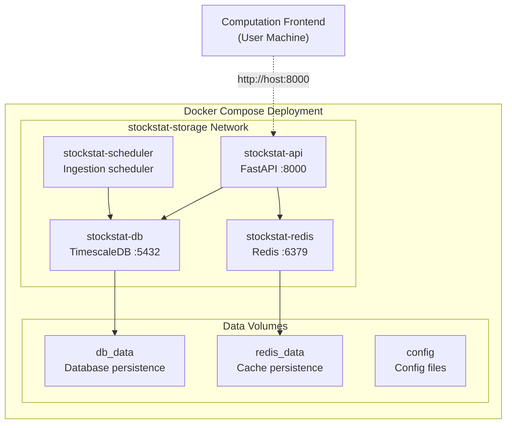

**docker-compose.yml Core Structure**:

```yaml
version: "3.9"
services:
  db:
    image: timescale/timescaledb:latest-pg16
    environment:
      POSTGRES_DB: stockstat
      POSTGRES_USER: stockstat
      POSTGRES_PASSWORD: ${DB_PASSWORD}
    ports:
      - "5432:5432"
    volumes:
      - db_data:/var/lib/postgresql/data

  redis:
    image: redis:7-alpine
    ports:
      - "6379:6379"
    volumes:
      - redis_data:/data

  api:
    build: ./backend
    ports:
      - "8000:8000"
    environment:
      DATABASE_URL: postgresql://stockstat:${DB_PASSWORD}@db:5432/stockstat
      REDIS_URL: redis://redis:6379/0
    depends_on:
      - db
      - redis

  scheduler:
    build: ./backend
    command: python -m stockstat.scheduler
    environment:
      DATABASE_URL: postgresql://stockstat:${DB_PASSWORD}@db:5432/stockstat
    depends_on:
      - db

volumes:
  db_data:
  redis_data:
```

### 9.2 Computation Frontend Installation

```bash
# Install computation frontend library
pip install stockstat

# Configure connection
export STOCKSTAT_HOST=localhost
export STOCKSTAT_PORT=8000

# To access real data sources via proxy (configure on backend machine)
export STOCKSTAT_PROXY_ENABLED=true
export STOCKSTAT_PROXY_TYPE=http
export STOCKSTAT_PROXY_URL=http://127.0.0.1:8889
```

```python
# Or configure in code
from stockstat import StockStatClient
client = StockStatClient(host="your-server.com", port=8000)
```

---

## 10. Project Structure

```
StockStatistic/
├── backend/                         # Storage backend service
│   ├── stockstat_backend/
│   │   ├── __init__.py
│   │   ├── app.py                   # FastAPI application entry
│   │   ├── config.py                # Configuration management
│   │   ├── api/
│   │   │   ├── __init__.py
│   │   │   ├── routes_ohlcv.py      # OHLCV query routes
│   │   │   ├── routes_symbols.py    # Symbol management routes
│   │   │   └── routes_health.py     # Health check routes
│   │   ├── adapters/                # Data source adapters
│   │   │   ├── __init__.py
│   │   │   ├── base.py              # Adapter base class
│   │   │   ├── yfinance.py
│   │   │   ├── ccxt_adapter.py
│   │   │   ├── alphavantage.py
│   │   │   └── tushare.py
│   │   ├── models/                  # Data models
│   │   │   ├── __init__.py
│   │   │   ├── ohlcv.py
│   │   │   └── symbol.py
│   │   ├── storage/                 # Storage layer
│   │   │   ├── __init__.py
│   │   │   ├── database.py          # DB connection
│   │   │   ├── repository.py        # Data repository
│   │   │   └── cache.py             # Redis cache
│   │   ├── normalizer/              # Data normalization
│   │   │   ├── __init__.py
│   │   │   ├── symbol_mapper.py
│   │   │   └── timeframe.py
│   │   └── scheduler/               # Scheduler
│   │       ├── __init__.py
│   │       └── ingest.py
│   ├── alembic/                     # Database migrations
│   ├── tests/
│   ├── Dockerfile
│   └── pyproject.toml
│
├── frontend/                        # Computation frontend library
│   ├── stockstat/
│   │   ├── __init__.py
│   │   ├── client.py                # StockStatClient main entry
│   │   ├── config.py                # Connection config
│   │   ├── connection.py            # Connection manager
│   │   ├── data_access/             # Data access layer
│   │   │   ├── __init__.py
│   │   │   ├── ohlcv.py
│   │   │   └── metadata.py
│   │   ├── compute/                 # Compute engine
│   │   │   ├── __init__.py
│   │   │   ├── engine.py            # Core engine
│   │   │   ├── context.py           # Computation context
│   │   │   └── registry.py          # Indicator registry
│   │   ├── backtest/                # Backtest subsystem
│   │   │   ├── __init__.py          # Exports BacktestEngine/Strategy/IntrabarMixin/...
│   │   │   ├── engine.py            # BacktestEngine main loop (with execution_model param)
│   │   │   ├── execution_model.py   # ExecutionModel ABC + NextBarExecution + IntrabarExecution
│   │   │   ├── context.py           # BacktestContext (with intrabar_submit)
│   │   │   ├── data_feed.py         # DataFeed + Universe (with intrabar_slice)
│   │   │   ├── strategy.py          # Strategy base + @strategy + IntrabarMixin
│   │   │   ├── orders.py            # Order/Fill (with exit_reason/priority/sub_bar_ts)
│   │   │   ├── broker.py            # SimulatedBroker (with submit_oco/submit_oco_mutual)
│   │   │   ├── portfolio.py         # Portfolio/Position
│   │   │   ├── cost_model.py        # CostModel + MakerTaker/Binance (4 presets)
│   │   │   ├── fill_model.py        # FillModel + IntrabarLimitFill + IntrabarFillModel
│   │   │   ├── intrabar.py          # IntrabarSimulator (standalone tool)
│   │   │   ├── sizing.py            # Position sizing algorithms
│   │   │   ├── metrics.py           # Performance aggregation
│   │   │   ├── result.py            # BacktestResult (with exit_reason_stats)
│   │   │   ├── benchmark.py         # buy_and_hold / dca_equity
│   │   │   ├── analyzer.py          # BacktestAnalyzer
│   │   │   ├── batch_runner.py      # StrategyBatchRunner
│   │   │   ├── fee_sweep.py         # fee_sweep / maker_taker_sweep
│   │   │   ├── optimizer.py         # Parameter grid/optuna (optional)
│   │   │   ├── walkforward.py       # Walk-forward analysis (optional)
│   │   │   ├── montecarlo.py        # Monte Carlo (optional)
│   │   │   ├── plot_adapter.py      # equity/trades → PlotSpec (backward compatible)
│   │   │   ├── chart_spec.py        # BacktestChartSpec dedicated spec
│   │   │   ├── chart_registry.py    # Backtest chart registry
│   │   │   ├── chart_factory.py     # detect + get_chart_renderer
│   │   │   ├── null_charts.py       # NullBacktestRenderer (zero-dependency fallback)
│   │   │   └── matplotlib_charts.py # MatplotlibBacktestRenderer (lazy import)
│   │   ├── indicators/              # Built-in indicator library
│   │   │   ├── __init__.py
│   │   │   ├── trend.py             # MA/EMA/MACD
│   │   │   ├── oscillator.py        # RSI/KDJ
│   │   │   ├── volatility.py        # ATR/Bollinger
│   │   │   ├── statistics.py        # Corr/Beta/Sharpe
│   │   │   └── custom.py            # Custom indicator base
│   │   ├── dsl/                     # DSL parser
│   │   │   ├── __init__.py
│   │   │   ├── grammar.lark         # Grammar file
│   │   │   ├── parser.py            # Parser
│   │   │   ├── ast_nodes.py         # AST nodes
│   │   │   └── evaluator.py         # Evaluator
│   │   ├── plot/                     # Visualization layer (optional · protocol-based)
│   │   │   ├── __init__.py          # PlotSpec / get_renderer()
│   │   │   ├── base.py              # PlotRenderer protocol + NullRenderer
│   │   │   └── matplotlib_backend.py # matplotlib adapter (lazy import)
│   │   └── export/                  # Result export
│   │       ├── __init__.py
│   │       └── serializers.py
│   ├── tests/
│   │   ├── test_indicators.py
│   │   ├── test_dsl.py
│   │   ├── test_paxg_weekend.py     # PAXG weekend correlation test
│   │   ├── test_classic_stats.py    # Classic statistics test
│   │   ├── test_backtest_iface.py   # Backtest interface skeleton test (BT-0)
│   │   ├── test_backtest_mvp.py     # Backtest MVP test (BT-1)
│   │   ├── test_backtest_portfolio.py # Multi-asset/short test (BT-2)
│   │   ├── test_backtest_multitf.py # Multi-timeframe test (BT-3)
│   │   ├── test_backtest_cost.py    # Cost model test (BT-4)
│   │   ├── test_backtest_metrics.py # Performance metrics test (BT-5)
│   │   ├── test_backtest_optimize.py # Optimizer test (BT-6)
│   │   ├── test_backtest_strategies.py # 12 strategies full test (BT-7)
│   │   ├── test_backtest_viz_iface.py    # Backtest viz interface test (BT-V0)
│   │   ├── test_backtest_viz_mpl.py      # Backtest viz matplotlib test (BT-V1)
│   │   ├── test_backtest_viz_advanced.py # Backtest viz advanced charts test (BT-V2)
│   │   ├── test_backtest_viz_dashboard.py # Backtest viz dashboard test (BT-V3)
│   │   └── test_backtest_viz_online.py   # Backtest viz online real-data test (BT-V Online)
│   └── pyproject.toml
│
├── docker-compose.yml               # Backend deployment orchestration
├── docs/
│   └── DESIGN.md                    # This design report
└── README.md
```

---

## 11. Development Roadmap

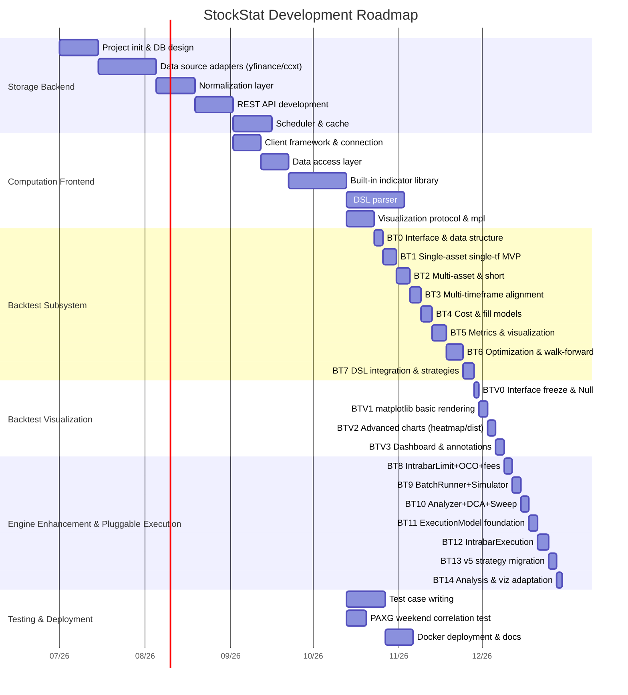

### Development Phases

| Phase | Content | Deliverable |
|-------|---------|-------------|
| **P0** | Storage backend MVP | DB + yfinance/ccxt adapters + basic API |
| **P1** | Computation frontend MVP | Client + data access + 5 core indicators |
| **P2** | DSL parser | Grammar file + evaluator + 10 built-in functions |
| **P3** | Full indicator library | Trend/oscillator/volatility/statistics full set |
| **P4** | Visualization layer | PlotSpec + PlotRenderer protocol + matplotlib adapter (optional extras) |
| **P5** | Testing & deployment | All test cases + Docker + documentation |
| **BT-0** | Backtest interface freeze | Core dataclasses + abstract base class signatures + interface skeleton tests |
| **BT-1** | Single-asset MVP | DataFeed/Portfolio/Broker/Context/Engine/Result + dual-MA strategy |
| **BT-2** | Multi-asset portfolio | Universe + short selling + limit/stop orders + sizing + pair trading |
| **BT-3** | Multi-timeframe | {sym:{tf:df}} alignment + lookahead audit + multi-tf resonance strategy |
| **BT-4** | Cost models | Commission/slippage/stamp duty/funding rate + price limits + partial fills |
| **BT-5** | Performance & reporting | Sharpe/Sortino/Calmar + drawdown + trade details + PlotSpec visualization |
| **BT-6** | Optimization & walk-forward | Grid search + optuna + Walk-forward + Monte Carlo (optional extras) |
| **BT-7** | DSL integration | Signal.from_dsl + 12 strategies full test + documentation |
| **BT-V0** | Visualization interface freeze | BacktestChartSpec + Renderer protocol + Null fallback |
| **BT-V1** | matplotlib basic rendering | line/fill/scatter/subplots + equity/drawdown/trades charts |
| **BT-V2** | Advanced charts | histogram/heatmap/bar + returns distribution/monthly heatmap/parameter heatmap |
| **BT-V3** | Dashboard | dashboard subplots + trade annotations + batch savefig |
| **BT-8** | Engine enhancement P0 | IntrabarLimitFill + MakerTakerCost + BinanceCost + OCO |
| **BT-9** | Engine enhancement P1 | IntrabarSimulator + StrategyBatchRunner + exit_reason_stats |
| **BT-10** | Engine enhancement P2 | BacktestAnalyzer + DCA benchmark + fee_sweep |
| **BT-11** | Pluggable execution | ExecutionModel ABC + IntrabarFillModel + Fill/Order field extensions |
| **BT-12** | Intrabar engine | IntrabarExecution + IntrabarMixin + OCO mutual + order priority |
| **BT-13** | Strategy migration validation | v5's 33 strategies × 4 fees = 132 runs, PnL error < 0.1% |
| **BT-14** | Analysis adaptation | Visualization and analysis tools adapted for intrabar execution results |

---

## 12. Backtest Subsystem Design

> The backtest subsystem is an optional enhancement module of the computation frontend, located at `frontend/stockstat/backtest/`, implemented purely in the frontend without modifying the storage backend. This section covers the complete design of the backtest engine core, pluggable execution model, visualization layer, analysis tools, and batch backtesting.

### 12.1 Design Goals & Principles

| Goal | Description |
|------|-------------|
| **Configurable** | Custom strategy functions, multi-instrument trading groups, multi-timeframe bars, reuse compute library indicators |
| **Programmability first** | No built-in fixed strategies; provides Strategy base class + `@strategy` function decorator + `IntrabarMixin` at three granularity levels |
| **Data-computation separation** | Backtest runs purely in frontend; data fetched via `DataClient` and injected into `DataFeed` |
| **Zero hard dependency** | Core depends only on pandas/numpy; optuna/matplotlib via extras |
| **Lookahead protection** | Strategy `on_bar(t)` can only access `≤ t` data; orders fill at `t+1` open by default; intrabar mode masks parent bar close/high/low |
| **Reproducible** | seed + data snapshot version recorded in `BacktestResult` |
| **Pluggable execution** | `ExecutionModel` ABC supports `NextBarExecution` (default) and `IntrabarExecution` (intrabar sub-bar matching) |
| **Backward compatible** | All new parameters have defaults; default behavior = existing behavior; zero changes to existing code |

### 12.2 Top-Level Architecture

```mermaid
graph TB
    subgraph "User Strategy Code"
        US["on_bar(ctx):<br/>ctx.compute.rsi(...)<br/>ctx.broker.submit(...)<br/>ctx.intrabar_submit(...)<br/>define_exits(fill, ctx)"]
    end

    subgraph "Backtest Core: BacktestEngine"
        CTX["BacktestContext<br/>get/intrabar_submit<br/>compute/portfolio/history"]
        BRK["SimulatedBroker<br/>submit/cancel/submit_oco<br/>submit_oco_mutual"]
        DF["DataFeed + Universe<br/>Multi-symbol multi-tf alignment<br/>intrabar_slice()"]
        PF["Portfolio<br/>cash / positions<br/>apply_fill / mark_to_market"]
        EM["ExecutionModel<br/>NextBarExecution (default)<br/>IntrabarExecution (intrabar sub-bar matching)"]
        RES["BacktestResult<br/>fills / equity / metrics<br/>chart() / render() / exit_reason_stats()"]
    end

    subgraph "Cost & Fill Models"
        CM["CostModel<br/>Percent/Fixed/Tiered/StampDuty<br/>MakerTaker/Binance (4 presets)"]
        FM["FillModel<br/>NextOpen/NextClose/VWAP<br/>IntrabarLimit/IntrabarFillModel"]
    end

    subgraph "Visualization Layer (zero hard dependency · lazy activation)"
        VIZ["BacktestChartSpec<br/>chart_registry / chart_factory<br/>Null / Matplotlib renderer"]
    end

    subgraph "Analysis Tools"
        ANA["BacktestAnalyzer<br/>subperiod / regime / rolling<br/>StrategyBatchRunner / fee_sweep"]
    end

    US -->|read| CTX
    US -->|write orders| BRK
    US -->|intrabar orders| EM
    CTX -->|aligned bars| US
    BRK -->|push fills| PF
    EM -->|match| BRK
    DF --> CTX
    DF --> EM
    PF --> CTX
    CM --> BRK
    FM --> EM
    RES --> VIZ
    RES --> ANA
```

### 12.3 Module Layout

```
frontend/stockstat/backtest/
├── __init__.py              # Public exports
├── engine.py                # BacktestEngine: main loop, event dispatch, execution_model param
├── execution_model.py       # ExecutionModel ABC + NextBarExecution + IntrabarExecution
├── context.py               # BacktestContext: strategy's view + intrabar_submit()
├── data_feed.py             # DataFeed + Universe + intrabar_slice()
├── strategy.py              # Strategy base, @strategy decorator, IntrabarMixin
├── orders.py                # Order/Fill dataclasses (with exit_reason, priority, sub_bar_ts)
├── broker.py                # SimulatedBroker (with submit_oco / submit_oco_mutual)
├── portfolio.py             # Portfolio/Position
├── cost_model.py            # CostModel + Percent/Fixed/Tiered/StampDuty/MakerTaker/Binance
├── fill_model.py            # FillModel + NextOpen/Close/VWAP/IntrabarLimit/IntrabarFillModel
├── intrabar.py              # IntrabarSimulator (standalone tool)
├── sizing.py                # Position sizing algorithms
├── metrics.py               # Performance aggregation
├── result.py                # BacktestResult + exit_reason_stats()
├── benchmark.py             # buy_and_hold / dca_equity
├── analyzer.py              # BacktestAnalyzer: subperiod/regime/rolling
├── batch_runner.py          # StrategyBatchRunner + BatchResults
├── fee_sweep.py             # fee_sweep() / maker_taker_sweep()
├── optimizer.py             # Parameter optimization (optional extras)
├── walkforward.py           # Walk-forward analysis (optional)
├── montecarlo.py            # Monte Carlo (optional)
├── plot_adapter.py          # equity/trades → PlotSpec (backward compatible)
├── chart_spec.py            # BacktestChartSpec dedicated spec
├── chart_registry.py        # Chart type registry
├── chart_factory.py         # detect + get_chart_renderer
├── null_charts.py           # NullBacktestRenderer (zero-dependency fallback)
└── matplotlib_charts.py     # MatplotlibBacktestRenderer (lazy import)
```

### 12.4 Core Interface Signatures

```python
# strategy.py
class Strategy:
    """Strategy base class. Subclasses override hooks."""
    def on_start(self, ctx: BacktestContext) -> None: ...
    def on_bar(self, ctx: BacktestContext) -> None: ...        # Main entry
    def on_bar_close(self, ctx: BacktestContext) -> None: ...
    def on_fill(self, fill: Fill, ctx: BacktestContext) -> None: ...

class IntrabarMixin:
    """Optional mixin: declares intrabar execution support + define_exits."""
    def define_exits(self, entry_fill: Fill, ctx: BacktestContext) -> list[Order]: ...

def strategy(fn=None, *, name: str | None = None):
    """Function-style strategy decorator: def on_bar(ctx) shorthand."""

# execution_model.py
class ExecutionModel(ABC):
    """Execution model: decides how orders fill within a bar."""
    def execute(self, engine, ctx, t, pending_orders) -> list[Fill]: ...
    @property
    def is_intrabar(self) -> bool: ...

class NextBarExecution(ExecutionModel):
    """Default: submit at t → fill at t+1 bar."""
    is_intrabar = False

class IntrabarExecution(ExecutionModel):
    """Intrabar: match orders within a parent bar's sub-bar sequence."""
    def __init__(self, intrabar_tf: str, parent_tf: str | None = None,
                 fill_model: IntrabarFillModel | None = None): ...
    def register_oco_mutual(self, order_a: Order, order_b: Order): ...
    is_intrabar = True

# context.py
class BacktestContext:
    now: pd.Timestamp
    current_bar: dict[str, pd.Series]
    def get(self, symbol: str, timeframe: str = "1d",
            lookback: int | None = None) -> pd.DataFrame: ...
    def intrabar_submit(self, order: Order) -> str: ...         # intrabar order
    def intrabar_submit_oco_mutual(self, a: Order, b: Order) -> tuple[str, str]: ...
    @property
    def compute(self) -> ComputeEngine: ...
    @property
    def broker(self) -> Broker: ...
    @property
    def portfolio(self) -> Portfolio: ...
    @property
    def history(self) -> ContextHistory: ...

# orders.py
@dataclass
class Order:
    symbol: str
    side: Literal["buy", "sell"]
    qty: float
    order_type: Literal["market","limit","stop","stop_limit","trailing_stop"] = "market"
    limit_price: float | None = None
    stop_price: float | None = None
    time_in_force: Literal["day","gtc","ioc"] = "gtc"
    tag: str = ""
    exit_reason: str = ""
    priority: int = 99          # 0=highest (SL), 99=default lowest

@dataclass
class Fill:
    order_id: str
    symbol: str
    side: OrderSide | str
    qty: float
    price: float
    commission: float = 0.0
    slippage_cost: float = 0.0
    ts: object = None
    tag: str = ""
    exit_reason: str = ""
    sub_bar_ts: object = None   # intrabar fill sub-bar timestamp
    sub_bar_index: int = -1     # sub-bar sequence position

# engine.py
class BacktestEngine:
    def __init__(self, *,
                 data: dict[str, dict[str, pd.DataFrame]],  # {symbol: {tf: df}}
                 strategy: Strategy,
                 initial_cash: float = 1_000_000.0,
                 cost_model: CostModel = PercentCost(commission=0.0003, slippage=0.0002),
                 fill_model: FillModel = NextOpenFill(),
                 execution_model: ExecutionModel | None = None,  # default NextBarExecution
                 benchmark: str | None = None,
                 trade_on: Literal["open","close"] = "open",
                 allow_short: bool = False,
                 lookahead_audit: bool = False,
                 seed: int = 0,
                 periods_per_year: int | None = None): ...
    def run(self) -> BacktestResult: ...
```

### 12.5 Multi-Timeframe Alignment & Lookahead Protection

The **finest timeframe** drives the cursor `t`; higher-tf bars are `asof/ffill`-aligned to `t`:

```python
# DataFeed internals
master_index = union_of_all timestamps at finest tf
aligned[sym][tf] = df[sym][tf].reindex(master_index, method="ffill")

# Context.get(symbol, tf, lookback) returns ≤ t slice (closed interval)
df = aligned[sym][tf].loc[:t]
return df.iloc[-lookback:] if lookback else df
```

- **Lookahead protection**: Strategy `on_bar(t)` can only access `≤ t` data; orders fill at `t+1` open by default (`NextOpenFill`)
- **lookahead_audit**: Optional runtime detection; accessing `> t` data raises `LookaheadError`
- Indicator computation based on `≤ t` slice to avoid lookahead

### 12.6 Cost & Fill Models

**Cost models** (`CostModel` ABC):

| Model | Description |
|-------|-------------|
| `PercentCost` | Default: percentage commission + percentage slippage (bps) |
| `FixedCost` | Fixed fee per fill |
| `TieredCost` | Tiered commission by trade value |
| `MinCost` | Minimum fee floor |
| `StampDutyCost` | Stamp duty (stock sell side) |
| `ZeroCost` | Zero cost (for testing) |
| `MakerTakerCost` | Maker/Taker differentiation: LIMIT→maker_rate, MARKET/STOP→taker_rate |
| `BinanceCost` | Binance spot/futures × BNB discount (4 presets: `BINANCE_SPOT`/`_BNB`/`FUTURES`/`_BNB`) |

**Fill models** (`FillModel` ABC):

| Model | Description |
|-------|-------------|
| `NextOpenFill` | Default: fill at next bar open, strongest lookahead protection |
| `NextCloseFill` / `ThisCloseFill` | Other fill timings (`ThisCloseFill` has warning) |
| `VWAPFill` / `WorstPriceFill` | Simulate market impact |
| `IntrabarLimitFill` | Fills limit orders when intrabar price crosses limit level (checks next_bar high/low) |
| `IntrabarFillModel` | Sub-bar sequence scanning fill, returns `IntrabarFillResult` (with `sub_bar_ts`/`sub_bar_index`); inherits `IntrabarLimitFill` |

### 12.7 Position Sizing Algorithms

`fixed_size / fixed_amount / percent_equity / kelly / atr_risk_budget`, computed by the strategy before calling `ctx.broker.submit(order)`, or via `sizing` helper functions.

### 12.8 Performance Metrics

Reuses `indicators.statistics` and new `metrics.py`:

Total return, annualized return, Sharpe, Sortino, Calmar, Omega, information ratio, maximum drawdown, drawdown duration/recovery time, win rate, profit factor, expectancy, consecutive wins/losses, monthly/yearly heatmaps, return distribution, VaR.

### 12.9 Integration with Existing Modules

| Integration Point | Method |
|-------------------|--------|
| `ComputeEngine` | `Context.compute` directly holds the client's ComputeEngine |
| Custom indicators | `ctx.compute.register("divergence", fn)` → `ctx.compute.call(...)` |
| DSL | `Signal.from_dsl("SELECT ... WHERE rsi<30")` signal generation (BT-7) |
| `indicators.statistics` | `metrics.py` calls sharpe/max_drawdown/var/returns |
| `plot` protocol | `result.plot_equity()` returns PlotSpec, rendered by any renderer |
| `export` | `result.to_csv()/to_json()` reuses serializers |
| `data_access` | `DataFeed` accepts DataFrame or client lazy-loading |

### 12.10 Built-in Example Strategies

12 strategies covering simple to complex, each with corresponding `test_backtest_strategies.py` test case:

| # | Strategy | Instruments | tf | Indicators/Design | Validation Target |
|---|----------|-------------|-----|-------------------|-------------------|
| 1 | Dual-MA crossover | Single | Single | ma(5)×ma(20) | MVP loop |
| 2 | Bollinger breakout | Single | Single | bollinger | Limit orders/stops |
| 3 | RSI overbought/oversold | Single | Single | rsi | Reverse entry/TP |
| 4 | MACD divergence | Single | Single | macd + custom indicator | register() |
| 5 | ATR channel breakout | Single | Single | atr + Donchian | ATR risk budget |
| 6 | Grid trading | Single | Single | Price tiers | Multi-order/fund buckets |
| 7 | Pair trading | Multi(2) | Single | beta/corr + z-score | Multi-asset/short hedging |
| 8 | Risk parity | Multi(N) | Single | beta/std | Periodic rebalancing |
| 9 | Momentum rotation | Multi(N) | Single | 6-month momentum ranking | Top-K rebalancing |
| 10 | Multi-tf resonance | Single | Multi | Daily MA + hourly breakout | Multi-tf alignment |
| 11 | PAXG weekend effect | Single | Single | weekday signal | Event-driven |
| 12 | Martingale | Single | Single | Loss doubling | Position limits/risk warning |

### 12.11 Dependency Declaration

```toml
[project.optional-dependencies]
backtest = ["stockstat"]                  # Core backtest (includes ExecutionModel + IntrabarExecution)
optimize = ["optuna>=3.5"]                # Parameter optimization
backtest_viz = ["stockstat[backtest]", "matplotlib>=3.8"]   # Backtest visualization
backtest_full = ["stockstat[backtest]", "stockstat[optimize]",
                 "stockstat[matplotlib]", "matplotlib>=3.8"]
```

Backtest core has zero hard dependency on matplotlib. All enhancements are pure Python + pandas/numpy.

---

### 12.12 Pluggable Execution Model

`ExecutionModel` is the core abstraction of the backtest engine — it decides how orders fill within a bar. Injected into `BacktestEngine` via composition, it supports two execution modes **without adding a new engine class**.

**Design motivation**: Intrabar sub-bar execution needs to resolve 5 structural gaps — fill timing tracking (Gap-1), same-bar entry+exit (Gap-2), post-entry exit scanning (Gap-3), dual-fill→dual-cancel (Gap-4), same-bar SL priority over TP (Gap-5).

```mermaid
graph TB
    subgraph "BacktestEngine (single engine class)"
        ENG["execution_model param<br/>default: NextBarExecution"]
        EM["ExecutionModel ABC"]
        NB["NextBarExecution<br/>default: t→t+1 fill"]
        IB["IntrabarExecution<br/>intrabar sub-bar matching"]
    end

    subgraph "IntrabarExecution Internals"
        FILL["IntrabarFillModel<br/>sub-bar scan + timing"]
        SCAN["_scan_sub_bars<br/>pre-scan→OCO check→apply→exit scan"]
        EXIT["_scan_exits<br/>limit/stop per-bar + market close at session end"]
        OCO["register_oco_mutual<br/>both fill → both cancel"]
    end

    subgraph "Strategy Layer (duck typing)"
        STR["Strategy base class (unchanged)"]
        MIX["IntrabarMixin (optional)<br/>define_exits()"]
    end

    ENG --> EM
    EM --> NB
    EM --> IB
    IB --> FILL
    IB --> SCAN
    SCAN --> EXIT
    SCAN --> OCO
    STR -.-> MIX
```

**5 Gap Resolutions**:

| Gap | Solution |
|-----|----------|
| Gap-1 | `Fill.sub_bar_ts` + `Fill.sub_bar_index` + `IntrabarFillModel.fill_with_timing()` |
| Gap-2 | `IntrabarExecution` completes entry→exit lifecycle within a parent bar |
| Gap-3 | Duck-typed `define_exits()` detection + `_scan_exits()` forward scan |
| Gap-4 | `register_oco_mutual()` + pre-scan detects dual fills |
| Gap-5 | `Order.priority` field + sort (SL priority=0 > TP priority=1) |

**Backward compatibility**: `execution_model=None` defaults to `NextBarExecution` = existing behavior. `ctx.intrabar_submit()` degrades to `broker.submit` + warning in non-intrabar mode. Existing strategy code requires zero changes.

---

### 12.13 Backtest Visualization

The backtest visualization subsystem adds a **zero hard dependency** visualization layer on top of the backtest core: the backtest core does not depend on matplotlib, but when installed, rich backtest-specific charts are automatically activated.

**Design principles**:

| Principle | Description |
|-----------|-------------|
| **Backtest core zero hard dependency** | `backtest/` package import does not trigger matplotlib; `import stockstat.backtest` always succeeds |
| **Dedicated spec layer** | `BacktestChartSpec` (backtest-specific), parallel to generic `PlotSpec`, mutually non-polluting |
| **Lazy activation** | matplotlib activated via lazy import in `matplotlib_charts` module after installation |
| **Protocol-based** | `BacktestChartRenderer` protocol, Null/Matplotlib multi-backend pluggable |

**Architecture**:

```mermaid
graph TB
    subgraph "Backtest Core backtest/ (zero matplotlib dependency)"
        RES["BacktestResult"]
        ADAPTER["plot_adapter.py<br/>basic PlotSpec builder"]
        CHARTSPEC["chart_spec.py<br/>BacktestChartSpec dedicated spec"]
        REG["chart_registry.py<br/>chart registry"]
    end

    subgraph "Generic plot Protocol (existing)"
        PS["PlotSpec"]
        PR["PlotRenderer<br/>Null/Matplotlib"]
    end

    subgraph "Backtest Visualization Backend (lazy import · optional)"
        BCMPL["matplotlib_charts.py<br/>MatplotlibBacktestRenderer<br/>(activated only when matplotlib installed)"]
        BCNULL["null_charts.py<br/>NullBacktestRenderer"]
        FACTORY["chart_factory.py<br/>detect + get_chart_renderer"]
    end

    RES --> ADAPTER --> PS
    RES --> CHARTSPEC
    CHARTSPEC --> REG
    REG --> FACTORY
    FACTORY --> BCMPL
    FACTORY --> BCNULL
    BCMPL -.->|lazy import| PR
```

**Chart type list** (9 types):

| Chart | Type | Purpose |
|-------|------|---------|
| `equity_curve` | multi-line + benchmark | Equity curve comparison |
| `drawdown` | line + fill | Drawdown filled area |
| `trades_overlay` | line + scatter annotation | Trade point overlay |
| `returns_distribution` | histogram | Return distribution |
| `monthly_heatmap` | heatmap | Monthly return heatmap |
| `yearly_returns` | bar | Annual return comparison |
| `parameter_heatmap` | heatmap | Grid search parameter heatmap |
| `underwater_curve` | fill | Underwater curve (drawdown duration) |
| `dashboard` | multi-subplot combo | Comprehensive dashboard |

**Usage**:

```python
res = BacktestEngine(...).run()

# One-liner render (auto-detect matplotlib, graceful degradation if unavailable)
res.render("equity_curve", path="equity.png")
res.render("dashboard", path="dashboard.png")

# Batch save all charts
out = res.render_all("./charts")

# Backward compatible — generic PlotSpec (works without matplotlib)
spec = res.plot_equity()
```

---

### 12.14 Analysis Tools & Batch Backtesting

**BacktestAnalyzer** — post-backtest analysis:

| Method | Purpose |
|--------|---------|
| `subperiod_metrics(result, split_dates)` | Split equity curve by split_dates and compute subperiod metrics |
| `regime_conditional_metrics(result, regime_series)` | Group by regime series and compute metrics |
| `rolling_metric(result, metric, window)` | Rolling Sharpe/volatility/drawdown/return |
| `trade_analysis_by_exit(result)` | Trade statistics grouped by exit reason |

**StrategyBatchRunner** — multi-strategy batch backtesting:

```python
runner = StrategyBatchRunner(data=data, initial_cash=10000, cost_model=BINANCE_SPOT)
results = runner.run_all({"ma_cross": s1, "rsi": s2})         # multi-strategy
results = runner.run_all_fees({"ma_cross": s1}, fee_models)    # multi-strategy × multi-fee
df = results.to_dataframe()                                    # summary DataFrame
ranked = results.rank("sharpe")                                # rank by Sharpe
```

**Fee sweep**:

- `fee_sweep(data, strategy, commissions=[...])` — uniform fee rate sweep
- `maker_taker_sweep(data, strategy, maker_rates=[...], taker_rates=[...])` — Maker×Taker grid sweep

**Benchmarks**:

- `buy_and_hold(initial_cash, prices)` — buy and hold
- `dca_equity(initial_cash, prices, schedule="weekly")` — dollar-cost-average benchmark (auto/weekly/monthly)

---

## Appendix A: Data Source Compatibility Matrix

| Data Source | Asset Type | Free Quota | Real-time Support | Historical Depth | Adapter Difficulty |
|-------------|-----------|-----------|-------------------|-----------------|-------------------|
| yfinance | US Stocks/ETF | Free | 15-min delayed | 10+ years | Low |
| Alpha Vantage | Global Stocks | 25 req/day | 15-min delayed | 20+ years | Low |
| Tushare | A-Shares | Credit-based | End-of-day | 10+ years | Medium |
| ccxt (Binance) | Crypto | Free | Real-time | Full history | Low |
| ccxt (Coinbase) | Crypto | Free | Real-time | Full history | Low |

## Appendix B: OHLCV Data Volume Estimation

| Instrument Scope | # Instruments | Daily Data | Annual Data | Storage Estimate |
|-----------------|---------------|-----------|------------|-----------------|
| US Top 500 | 500 | 500 rows | 125K rows | ~10 MB |
| A-Share full market | 5000 | 5000 rows | 1.25M rows | ~100 MB |
| Crypto Top 200 | 200 | 200 rows | 50K rows | ~5 MB |
| Crypto 1-min data (200 instruments) | 200 | 288K rows | 73M rows | ~5 GB |

> TimescaleDB compression can reduce this to 10%~20% of the raw volume.

## Appendix C: Backtest Phase Documentation Index

The backtest core (BT-0–BT-14) and backtest visualization (BT-V0–BT-V3 + online validation) phase docs are indexed below under `docs/backtest/`:

### C.1 Backtest Core (BT series)

| Phase | Document | Code | Tests |
|-------|----------|------|-------|
| BT-0 | [docs/backtest/BT0.md](docs/backtest/BT0.md) | `backtest/` skeleton + dataclasses | `test_backtest_iface.py` |
| BT-1 | [docs/backtest/BT1.md](docs/backtest/BT1.md) | MVP five modules | `test_backtest_mvp.py` |
| BT-2 | [docs/backtest/BT2.md](docs/backtest/BT2.md) | multi-asset/short/orders | `test_backtest_portfolio.py` |
| BT-3 | [docs/backtest/BT3.md](docs/backtest/BT3.md) | multi-tf alignment/audit | `test_backtest_multitf.py` |
| BT-4 | [docs/backtest/BT4.md](docs/backtest/BT4.md) | cost/fill models | `test_backtest_cost.py` |
| BT-5 | [docs/backtest/BT5.md](docs/backtest/BT5.md) | metrics/report/viz | `test_backtest_metrics.py` |
| BT-6 | [docs/backtest/BT6.md](docs/backtest/BT6.md) | optimization/walk-forward/MC | `test_backtest_optimize.py` |
| BT-7 | [docs/backtest/BT7.md](docs/backtest/BT7.md) | DSL integration/12 strategies | `test_backtest_strategies.py` |
| BT-8 | [docs/backtest/BT8.md](docs/backtest/BT8.md) | P0 fixes: IntrabarLimitFill + MakerTakerCost + OCO | `test_backtest_p0.py` |
| BT-9 | [docs/backtest/BT9.md](docs/backtest/BT9.md) | P1 enhancements: BinanceCost + IntrabarSimulator + BatchRunner + exit_reason | `test_backtest_p1.py` |
| BT-10 | [docs/backtest/BT10.md](docs/backtest/BT10.md) | P2 analysis: annualization + DCA + Analyzer + fee_sweep | `test_backtest_p2.py` |
| BT-11 | [docs/backtest/BT11_BT14_CN.md](docs/backtest/BT11_BT14_CN.md) | ExecutionModel ABC + IntrabarFillModel + Fill/Order field extensions | `test_backtest_intrabar.py` |
| BT-12 | same | IntrabarExecution + IntrabarMixin + OCO mutual + priority | `test_backtest_intrabar.py` |
| BT-13 | same | v5 strategy migration (33 strategies × 4 fees = 132 runs validated) | `run_redo.py` |
| BT-14 | same | Analysis & visualization adaptation | `plots_redo.py` |

### C.2 Backtest Visualization (BT-V series + online validation)

| Phase | Document | Code | Tests |
|-------|----------|------|-------|
| BT-V0 | [docs/backtest/BTV0.md](docs/backtest/BTV0.md) | `chart_spec.py` + `chart_registry.py` + `null_charts.py` + `chart_factory.py` | `test_backtest_viz_iface.py` |
| BT-V1 | [docs/backtest/BTV1.md](docs/backtest/BTV1.md) | `matplotlib_charts.py` basic rendering | `test_backtest_viz_mpl.py` |
| BT-V2 | [docs/backtest/BTV2.md](docs/backtest/BTV2.md) | histogram/heatmap/bar advanced charts | `test_backtest_viz_advanced.py` |
| BT-V3 | [docs/backtest/BTV3.md](docs/backtest/BTV3.md) | dashboard combo + annotations | `test_backtest_viz_dashboard.py` |
| BT-V Online | [docs/backtest/BT_VIZ_ONLINE_REPORT.md](docs/backtest/BT_VIZ_ONLINE_REPORT.md) | real-data online validation + 13 images | `test_backtest_viz_online.py` |

---

*This design document will be continuously updated as the project iterates.*
