# StockStat — Programmable Financial Instrument Statistical Computing Platform Design Report

> **Version**: v1.7
> **Date**: 2026-07-17
> **Status**: Implemented (storage backend, computation frontend, DSL, signal processing & nonlinear dynamics module, backtest subsystem, pluggable execution model, visualization layer, analysis tools)

---

## Table of Contents

1. [Project Overview](#1-project-overview)
2. [Overall Architecture](#2-overall-architecture)
3. [Storage Backend Design](#3-storage-backend-design)
4. [Computation Frontend Design](#4-computation-frontend-design)
5. [Scripting Language Design](#5-scripting-language-design)
6. [API Specification](#6-api-specification)
7. [Test Cases](#7-test-cases)
8. [Technology Stack](#8-technology-stack)
9. [Deployment](#9-deployment)
10. [Project Structure](#10-project-structure)
11. [Development Roadmap](#11-development-roadmap)
12. [Backtest Subsystem Design](#12-backtest-subsystem-design)
- [Appendix A: Data Source Compatibility Matrix](#appendix-a-data-source-compatibility-matrix)
- [Appendix B: OHLCV Data Volume Estimation](#appendix-b-ohlcv-data-volume-estimation)
- [Appendix C: Backtest Phase Documentation Index](#appendix-c-backtest-phase-documentation-index)

---

## 1. Project Overview

### 1.1 Project Goals

Build a **user-programmable** stock/cryptocurrency statistical computing platform with the following core capabilities:

- **Unified data access**: Compatible with multiple data sources (stock APIs, crypto exchanges, synthetic data) through a single unified interface
- **Programmable computation**: Users write statistical computation logic via a Python library or a custom DSL
- **Frontend-backend separation**: Storage backend as an independently deployable service; computation frontend as a library with configurable connections
- **Extensibility**: Both data source adapters and indicator algorithms follow a plugin-based design

### 1.2 Design Principles

| Principle | Description |
|-----------|-------------|
| **Data-computation separation** | The storage backend only handles ingestion, storage, and querying; all computation runs in the frontend library |
| **Unified abstraction** | Data from different sources is normalized into a consistent OHLCV model exposed to the upper layer |
| **Programmability first** | No built-in fixed strategies; rich primitives let users compose freely |
| **Progressive complexity** | Simple queries are one-liners via DSL; complex analysis uses the full-featured Python library |
| **Reproducibility** | Each computation can record the data snapshot version and parameters for reproducible results |
| **Zero hard dependency in core** | The computation/backtest core depends only on pandas/numpy/scipy; matplotlib, optuna, PyWavelets, and lark are optional extras |

### 1.3 Core Feature List

The following features are all implemented:

- Multi-source data access (yfinance direct / ccxt [Binance, Coinbase] / synthetic data)
- OHLCV normalized storage (default SQLite, optional TimescaleDB via Docker)
- Unified REST API querying (JSON / CSV)
- Python computation library (pandas/numpy/scipy integration)
- Expression DSL (SQL-like declarative query language based on lark)
- Built-in technical indicator library (MA / EMA / MACD / RSI / KDJ / ATR / Bollinger / Beta / Sharpe / VaR ...)
- Signal processing & nonlinear dynamics module (CWT / spectral entropy / grey relation / GM(1,1) / transfer entropy / Hurst / sample entropy / permutation entropy)
- Custom indicator registration mechanism
- Computation result export (JSON / CSV / DataFrame)
- Optional visualization layer (protocol-based design, matplotlib as optional extra, zero core dependency; supports heatmap / log axes / subplots)
- Backtest subsystem (multi-instrument / multi-timeframe / pluggable execution model / visualization / analysis tools / batch backtesting)
- In-memory cache (TTL=300s)

---

## 2. Overall Architecture

### 2.1 Architecture Overview

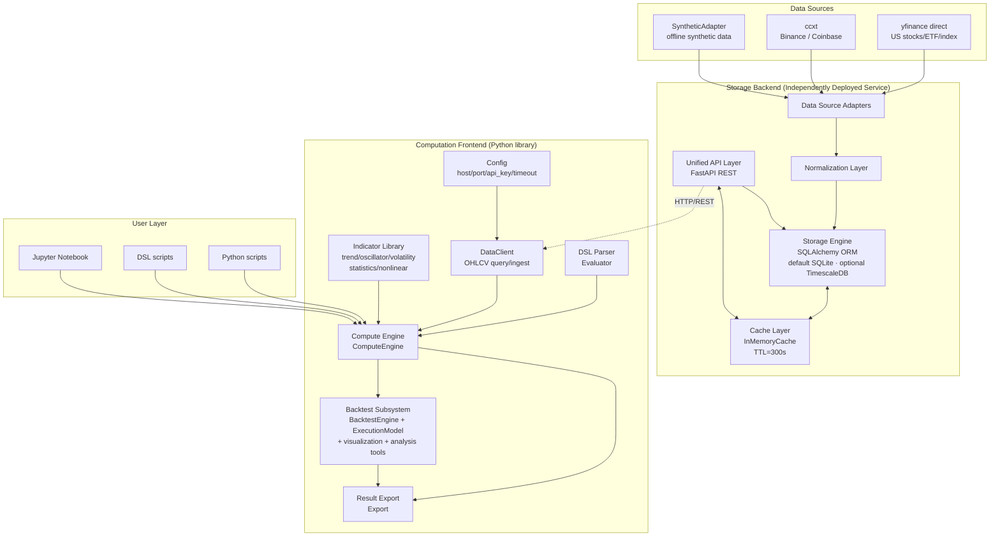

> **Note**: The default deployment uses SQLite + InMemoryCache, runnable with zero external dependencies; Docker production deployment can switch to TimescaleDB + Redis (see §9). The scheduler is currently a placeholder stub, planned for the future (see §3.6).

### 2.2 Component Responsibilities

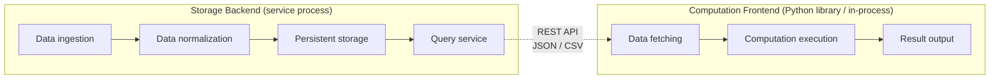

### 2.3 Data Flow

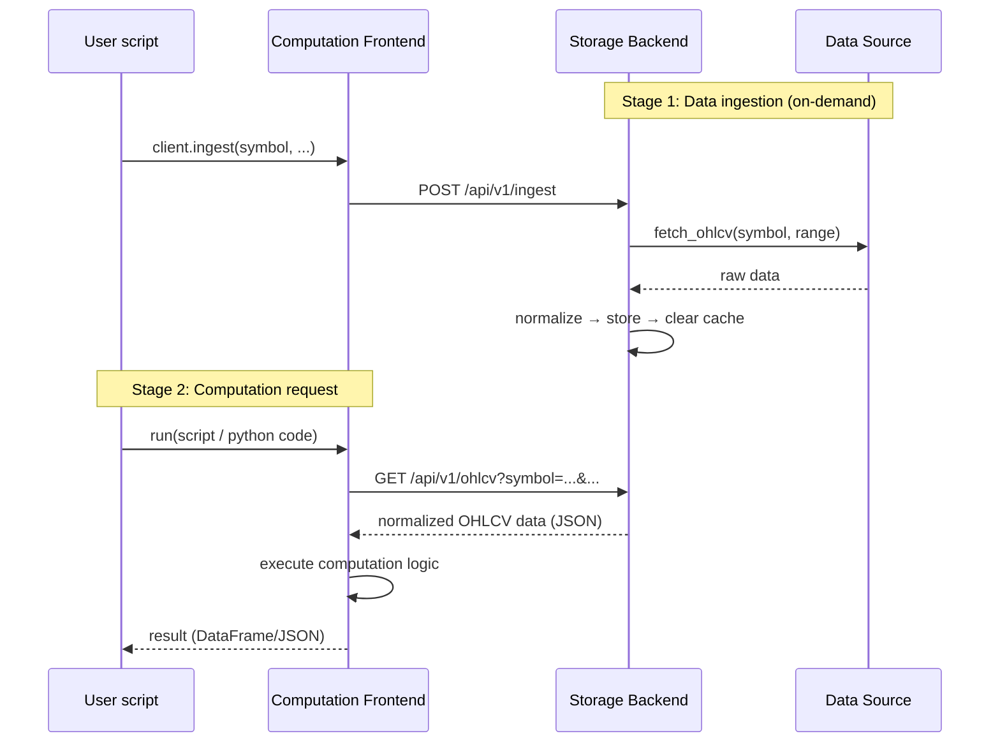

---

## 3. Storage Backend Design

### 3.1 Data Source Adapter Layer

Data source adapters follow a **plugin-based** design. Each adapter subclasses the `DataSourceAdapter` abstract base class with a unified interface.

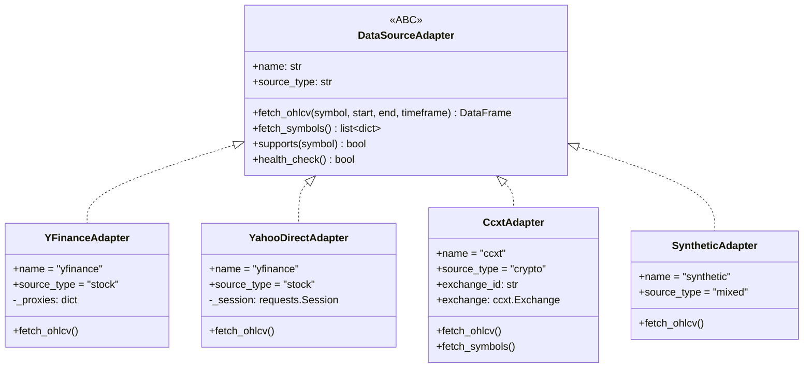

**Adapter list**:

| Adapter | name | source_type | Network | Purpose |
|---------|------|-------------|---------|---------|
| `YahooDirectAdapter` | `yfinance` | stock | yes | Direct Yahoo Finance API access (bypasses yfinance library cookie/crumb issues); default for the route |
| `YFinanceAdapter` | `yfinance` | stock | yes | Alternative implementation based on the `yfinance` library |
| `CcxtAdapter` | `ccxt` | crypto | yes | Accesses Binance / Coinbase via ccxt; constructed with `exchange_id` |
| `SyntheticAdapter` | `synthetic` | mixed | no | Reproducible synthetic data generated by geometric Brownian motion (fixed seed) for offline testing |

> **Route aliases**: The API layer accepts `source=binance` / `source=coinbase`, internally mapped to `CcxtAdapter("binance")` / `CcxtAdapter("coinbase")`. `source=synthetic` maps to `SyntheticAdapter`. When `source` is omitted, it is auto-detected from the symbol: symbols containing `/` are treated as crypto (binance); otherwise as stocks (yfinance).

**Adapter instantiation** (`api/routes.py`):

```python
def _get_adapter(source: str):
    if source not in _adapters:
        proxies = settings.proxy.proxies
        if source == "yfinance":
            _adapters[source] = YahooDirectAdapter(proxy=proxies)
        elif source == "binance":
            _adapters[source] = CcxtAdapter("binance", proxies=proxies)
        elif source == "coinbase":
            _adapters[source] = CcxtAdapter("coinbase", proxies=proxies)
        elif source == "synthetic":
            _adapters[source] = SyntheticAdapter()
        else:
            raise HTTPException(status_code=400, detail=f"Unknown source: {source}")
    return _adapters[source]
```

### 3.2 Proxy Support

The storage backend supports configuring HTTP/SOCKS5 proxies for all data source adapters, **disabled by default**. When enabled, all outbound data ingestion requests (yfinance, ccxt, etc.) are forwarded through the proxy.

| Design constraint | Description |
|-------------------|-------------|
| **Disabled by default** | When `STOCKSTAT_PROXY_ENABLED` is unset or false, all adapters connect directly |
| **Dual-protocol support** | Supports both `http` and `socks5` proxy types |
| **Default addresses** | HTTP defaults to `http://127.0.0.1:8889`; SOCKS5 defaults to `socks5://127.0.0.1:1089` |
| **Uniform injection** | Proxy config is injected at adapter instantiation (via the `proxies` parameter), transparent to upper layers |

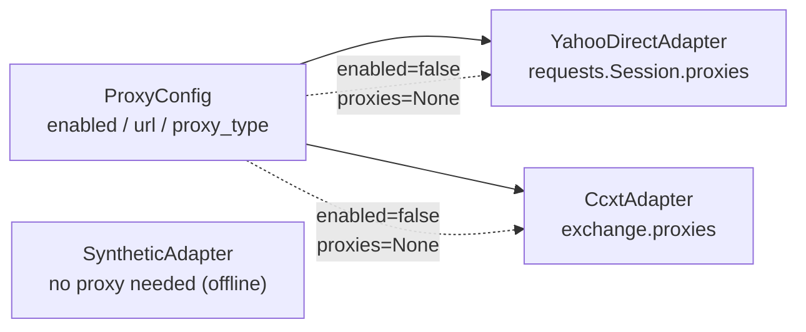

**Environment variable configuration**:

| Environment variable | Default | Description |
|----------------------|---------|-------------|
| `STOCKSTAT_PROXY_ENABLED` | `false` | Whether to enable the proxy |
| `STOCKSTAT_PROXY_TYPE` | `http` | Proxy type: `http` or `socks5` |
| `STOCKSTAT_PROXY_URL` | (auto-filled by type) | Proxy URL; uses default when unset |

```bash
# Enable HTTP proxy (default address)
export STOCKSTAT_PROXY_ENABLED=true
export STOCKSTAT_PROXY_TYPE=http
# STOCKSTAT_PROXY_URL defaults to http://127.0.0.1:8889

# Enable SOCKS5 proxy (default address)
export STOCKSTAT_PROXY_ENABLED=true
export STOCKSTAT_PROXY_TYPE=socks5
# STOCKSTAT_PROXY_URL defaults to socks5://127.0.0.1:1089

# Custom proxy address
export STOCKSTAT_PROXY_ENABLED=true
export STOCKSTAT_PROXY_URL=http://192.168.1.100:8080
```

**Query proxy status via REST API**:

```
GET /api/v1/proxy
→ {"enabled": true, "url": "http://127.0.0.1:8889", "proxy_type": "http"}

GET /api/v1/health
→ {"status": "ok", "proxy": {"enabled": true, "url": "http://127.0.0.1:8889", "proxy_type": "http"}}
```

### 3.3 Data Normalization Layer

Raw data formats vary across sources. The normalization layer (`normalizer/normalizer.py`) unifies them into the internal canonical format.

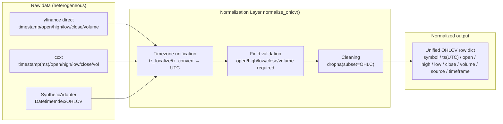

**Unified data model** (SQLAlchemy ORM `OHLCV` table):

| Field | Type | Description |
|-------|------|-------------|
| `id` | `Integer PK` | Auto-increment primary key |
| `symbol` | `String(50)` | Unified symbol, e.g. `BTC/USDT`, `AAPL`, `^GSPC` |
| `ts` | `DateTime(tz=True)` | UTC timestamp |
| `open` | `Float` | Open price |
| `high` | `Float` | High price |
| `low` | `Float` | Low price |
| `close` | `Float` | Close price |
| `volume` | `Float` | Volume |
| `source` | `String(50)` | Data source identifier |
| `timeframe` | `String(10)` | Period: `1m/5m/15m/1h/4h/1d/1w` |
| `ingested_at` | `DateTime(tz=True)` | Ingestion timestamp |

**Unique constraint**: `(symbol, ts, timeframe, source)` composite unique, ensuring upsert idempotency for the same source and time window.
**Indexes**: `(symbol, ts)` composite index + single-column indexes on `symbol` and `ts`.

**Symbol registry** (`SymbolRegistry` table):

| Field | Type | Description |
|-------|------|-------------|
| `unified_symbol` | `String(50) PK` | Unified symbol, e.g. `BTC/USDT` |
| `asset_type` | `String(20)` | `crypto` / `stock` |
| `base_asset` | `String(30)` | Base asset, e.g. `BTC` |
| `quote_asset` | `String(30)` | Quote asset, e.g. `USDT` (empty for stocks) |
| `description` | `String(200)` | Description |
| `sources` | `String(200)` | Data source list (CSV string, e.g. `"binance,coinbase"`) |

> **Simplification note**: A standalone `SYMBOL_ALIAS` alias table is not currently implemented; multi-source support for a symbol is stored as CSV in the `sources` field. If fine-grained per-source alias mapping is needed later (e.g. `BTCUSDT@binance ↔ BTC/USDT`), an alias table can be introduced.

### 3.4 Storage Engine

The storage layer is built on **SQLAlchemy 2.0 ORM** and switches backends via `DATABASE_URL`:

| Deployment mode | `DATABASE_URL` | Characteristics |
|-----------------|----------------|-----------------|
| **Default (local dev)** | `sqlite:///stockstat.db` | Zero external dependency, file-based DB, `check_same_thread=False` |
| **Docker production** | `postgresql://...@db:5432/stockstat` | PostgreSQL-compatible + TimescaleDB extension via `timescale/timescaledb:latest-pg16` image |

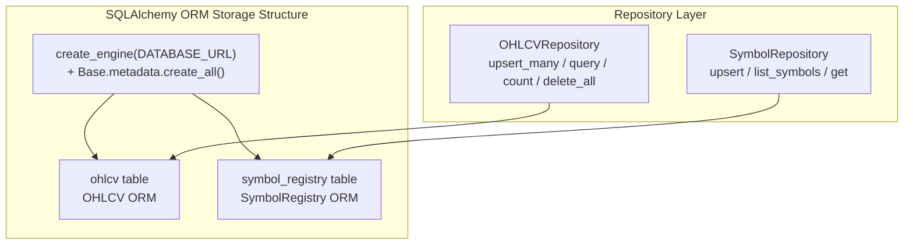

**Session management** (`storage/database.py`):

- Module-level singletons `_engine` + `_SessionLocal`, lazily initialized on first access
- `get_session()` context manager: auto commit / rollback on exception / close
- `reset_engine()` used for test isolation

**OHLCV table DDL** (auto-generated by ORM; equivalent SQL):

```sql
CREATE TABLE ohlcv (
    id          INTEGER  PRIMARY KEY AUTOINCREMENT,
    symbol      VARCHAR(50)  NOT NULL,
    ts          DATETIME     NOT NULL,
    open        FLOAT,
    high        FLOAT,
    low         FLOAT,
    close       FLOAT,
    volume      FLOAT,
    source      VARCHAR(50)  NOT NULL,
    timeframe   VARCHAR(10)  NOT NULL DEFAULT '1d',
    ingested_at DATETIME     DEFAULT CURRENT_TIMESTAMP,
    UNIQUE (symbol, ts, timeframe, source)
);
CREATE INDEX ix_ohlcv_symbol_ts ON ohlcv (symbol, ts);
```

> **TimescaleDB deployment note**: Docker deployment uses the `timescale/timescaledb:latest-pg16` image, providing PostgreSQL 16 + the TimescaleDB extension. The current ORM model does not enable Hypertables or Continuous Aggregates. For time-series optimization on large 1-minute datasets, after deploying on PostgreSQL you can manually run `create_hypertable('ohlcv','ts')` and create continuous-aggregate views; the application layer requires no changes.

### 3.5 Cache Strategy

The default is an **in-process memory cache** (`InMemoryCache`) with no external dependencies:

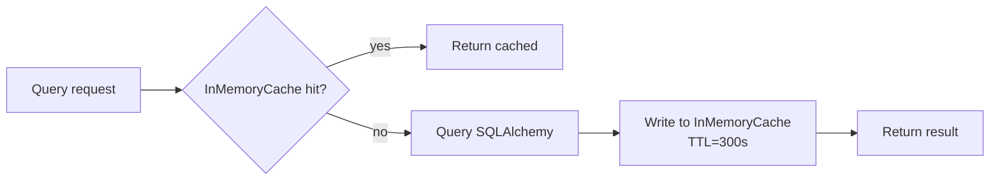

- **Key**: MD5 hash of the serialized `(symbol, source, start, end, timeframe, limit)` tuple
- **TTL**: 300 seconds (configurable via `Settings.cache_ttl`)
- **Invalidation**: `cache.clear()` is called after a successful `POST /api/v1/ingest`, clearing the entire cache

> **Redis note**: `docker-compose.yml` starts a `redis:7-alpine` container for production use, and `pyproject.toml` lists `redis>=5.0` as an optional extra. The current `storage/cache.py` only implements `InMemoryCache`. To use a distributed cache, extend `cache.py` to integrate Redis (the `get/set/clear` interface is already aligned).

### 3.6 Scheduler

The scheduler module (`stockstat_backend/scheduler/`) is currently a **placeholder stub**. Automated scheduled ingestion, incremental updates, continuous-aggregate refresh, data integrity checks, and old-data archiving are not implemented.

In `docker-compose.yml`, the `scheduler` service runs `python -c "import time; print('Scheduler stub - implement APScheduler here'); time.sleep(3600)"` — purely a placeholder.

**Current ingestion mode**: on-demand — users explicitly request ingestion via `POST /api/v1/ingest` or `client.ingest(...)`.

**Planned capabilities** (not implemented; see roadmap in §11):

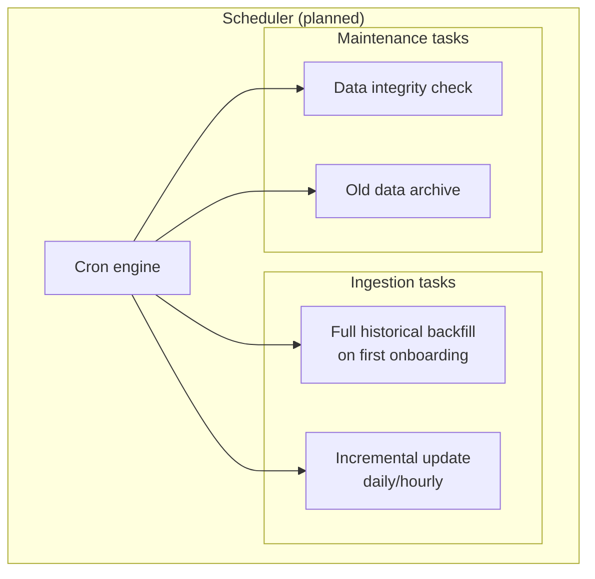

---

## 4. Computation Frontend Design

### 4.1 Client Architecture

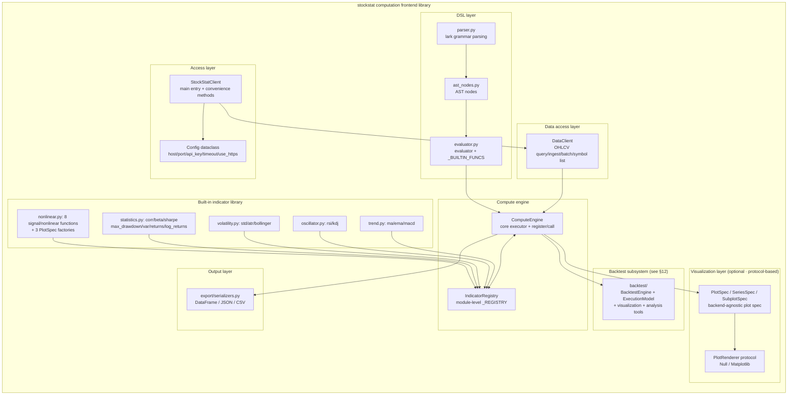

### 4.2 Connection Management

`StockStatClient` is the single user entry point and offers three construction styles:

```python
from stockstat import StockStatClient

# Style 1: direct configuration (most common)
client = StockStatClient(
    host="localhost",
    port=8000,
    api_key="optional-key",
    timeout=30,
    cache_enabled=True,
    use_https=False,
)

# Style 2: environment variables
client = StockStatClient.from_env()
#   reads STOCKSTAT_HOST / STOCKSTAT_PORT / STOCKSTAT_API_KEY
#         STOCKSTAT_TIMEOUT / STOCKSTAT_USE_HTTPS

# Style 3: dict configuration
client = StockStatClient.from_dict({
    "host": "your-server.com", "port": 8000, "timeout": 30,
})
```

The `Config` dataclass holds connection parameters; the `base_url` property builds `http(s)://host:port` based on `use_https`.

### 4.3 Data Access Layer

`DataClient` (`data_access/ohlcv.py`) calls the backend REST API via `httpx` and returns pandas DataFrames:

```python
# Fetch OHLCV data; returns pandas DataFrame (DatetimeIndex + OHLCV columns)
data = client.ohlcv(
    symbol="PAXG/USDT",
    source="binance",
    start="2022-01-01",
    end="2024-12-31",
    timeframe="1d",
)

# Batch fetch (returns dict[str, DataFrame])
data = client.ohlcv_batch(
    symbols=["BTC/USDT", "ETH/USDT", "PAXG/USDT"],
    start="2024-01-01",
    timeframe="1d",
)

# Trigger backend ingestion
client.ingest("AAPL", source="yfinance", start="2024-01-01", end="2024-12-31")

# List registered symbols
symbols = client.symbols(asset_type="crypto")

# Data source list & health check
client.sources()
client.health()
```

> **Data transfer format**: The frontend currently only parses JSON (`/api/v1/ohlcv` returns JSON by default). `pyarrow` is in the dependency list but Arrow IPC binary-stream transport is not enabled; to add zero-copy optimization, extend the `format=arrow` endpoint and add an `ArrowCodec`.

### 4.4 Compute Engine & Indicator Registration

`ComputeEngine` (`compute/engine.py`) exposes all built-in indicators as methods and supports custom indicators via `register`/`call`:

```python
# Built-in indicators
sma = client.compute.ma(data.close, window=20)
rsi = client.compute.rsi(data.close, window=14)
upper, mid, lower = client.compute.bollinger(data.close, window=20, k=2.0)
beta = client.compute.beta(asset_returns, benchmark_returns, window=60)
sharpe = client.compute.sharpe(returns, risk_free=0.02, annualize=True)
dd = client.compute.max_drawdown(data.close)

# Register a custom indicator — Style A: pass the function directly
def weekend_monday_gain_loss(data):
    # ... computation logic ...
    return {"r_gain": 0.23, "r_loss": -0.20, "n_samples": 156}

client.compute.register("weekend_gain_loss_corr", weekend_monday_gain_loss, category="custom")
result = client.compute.call("weekend_gain_loss_corr", data=data)

# Register a custom indicator — Style B: decorator style
@client.compute.register("my_indicator", category="custom")
def my_indicator(data):
    return data.close.mean()
```

> **API note**: `client.compute.register(name, func=None, category="custom")` doubles as direct registration and a decorator factory. The module-level `compute/registry.py` also provides an `@indicator(name, category)` decorator, but it is not exported at the package top level; `client.compute.register` is the recommended approach.

### 4.5 Visualization & matplotlib Adaptation Design

#### 4.5.1 Design Goals

The visualization layer follows the **zero hard dependency in core** principle: the core computation library does not depend on matplotlib or any plotting library; when the user installs matplotlib, enhanced plotting is automatically enabled.

| Design constraint | Description |
|-------------------|-------------|
| **Zero hard dependency** | `import stockstat` does not trigger any plotting-library import; core deps are only pandas/numpy/scipy/httpx/pyarrow |
| **Protocol abstraction** | Defines a `PlotRenderer` protocol with pluggable backends (matplotlib / Null; plotly planned) |
| **Data-render separation** | The compute engine produces backend-agnostic `PlotSpec` (plot specifications) that a renderer interprets into concrete graphics |
| **Lazy import** | matplotlib is only `import`-ed on the user's first render call; on absence it gracefully degrades to `NullRenderer` (warns, never raises) |
| **Optional extra** | Pull plotting deps via `pip install stockstat[matplotlib]` |

#### 4.5.2 Class Design

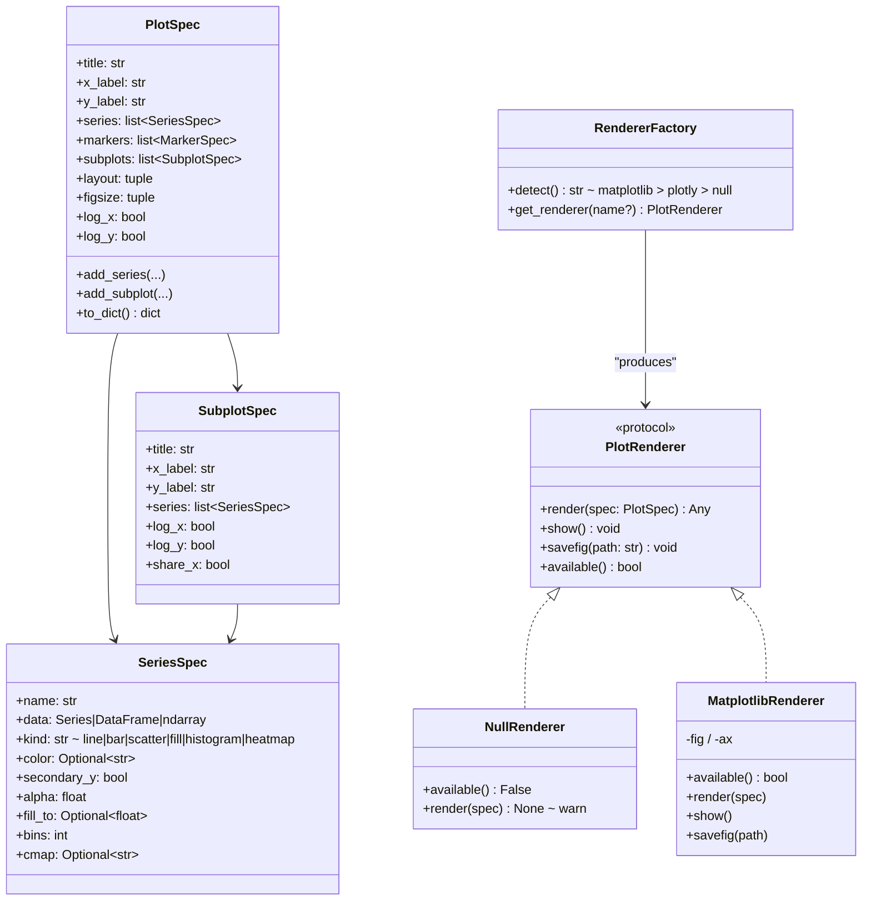

#### 4.5.3 Module Layout & Lazy Import

```
stockstat/
└── plot/
    ├── __init__.py          # exposes PlotSpec / get_renderer()
    ├── base.py              # PlotRenderer protocol + NullRenderer + RendererFactory + PlotSpec/SeriesSpec/SubplotSpec
    └── matplotlib_backend.py # matplotlib adapter (lazy import matplotlib inside the module)
```

`matplotlib_backend.py` uses lazy imports internally so the core import chain is never polluted:

```python
# stockstat/plot/matplotlib_backend.py
class MatplotlibRenderer(PlotRenderer):
    def available(self) -> bool:
        try:
            import matplotlib  # noqa: F401
            return True
        except ImportError:
            return False

    def render(self, spec: PlotSpec):
        import matplotlib.pyplot as plt   # imported only here
        # ... rendering logic (supports line/bar/scatter/fill/histogram/heatmap/subplots/log axes) ...
```

#### 4.5.4 Auto-detection & Graceful Degradation

`RendererFactory.detect()` probes installed backends in priority order (matplotlib → plotly → null); if all are missing, it returns `NullRenderer`, which only warns on call instead of raising.

```python
def get_renderer(name: str | None = None) -> PlotRenderer:
    if name is None:
        name = RendererFactory.detect()
    if name == "matplotlib":
        from .matplotlib_backend import MatplotlibRenderer
        return MatplotlibRenderer()
    if name == "plotly":
        try:
            from .plotly_backend import PlotlyRenderer  # file not yet implemented; falls back on ImportError
            return PlotlyRenderer()
        except ImportError:
            return NullRenderer()
    return NullRenderer()   # safe fallback, works with zero deps
```

> **Plotly status**: `RendererFactory` already reserves an entry point for plotly, but the `plot/plotly_backend.py` file is not yet implemented; the `plot` extra in `pyproject.toml` currently includes only matplotlib. Installing plotly triggers an `ImportError` that degrades to `NullRenderer`.

#### 4.5.5 PlotSpec Enhancements (v1.7)

To support visualization of the signal processing & nonlinear dynamics module, `PlotSpec` received **backward-compatible enhancements** so all modules (indicators, nonlinear, backtest) share one rich plotting protocol:

| New capability | Field | Purpose |
|----------------|-------|---------|
| **heatmap** | `SeriesSpec.kind="heatmap"` + `cmap` | CWT scalogram, parameter-grid heatmaps |
| **log axes** | `PlotSpec.log_x` / `log_y` | DFA log-log plots, PSD log plots |
| **subplots** | `PlotSpec.subplots` + `SubplotSpec` + `layout` | Multi-panel dashboards |
| **fill** | `SeriesSpec.kind="fill"` + `fill_to` | Drawdown fill plots |
| **histogram** | `SeriesSpec.kind="histogram"` + `bins` | Return-distribution histograms |
| **figsize** | `PlotSpec.figsize` | Custom canvas size |

`BacktestChartSpec` (backtest-specific; see §12.13) remains independent, but new code can use the enhanced `PlotSpec` directly.

#### 4.5.6 Usage

```python
from stockstat import StockStatClient

client = StockStatClient(host="localhost", port=8000)
data = client.ohlcv("BTC/USDT", start="2024-01-01", timeframe="1d")

# Style A: protocol-based plotting (recommended, backend-agnostic)
spec = client.plot.spec(
    title="BTC/USDT 2024",
    x_label="Date", y_label="Price",
    series=[
        {"name": "close", "data": data.close, "kind": "line"},
        {"name": "ma20",  "data": data.close.rolling(20).mean(), "kind": "line"},
    ],
)
renderer = client.plot.get_renderer()     # auto-detect; NullRenderer if missing
renderer.render(spec)
renderer.savefig("btc.png")               # effective only when matplotlib is present

# Style B: hand computation results to matplotlib directly (user manages deps)
import matplotlib.pyplot as plt
plt.plot(data.index, data.close)
plt.title("BTC/USDT"); plt.show()

# Style C: retrieve backend-agnostic data and use any plotting library
payload = spec.to_dict()                  # pure dict / JSON-serializable
```

#### 4.5.7 Dependency Declaration

`pyproject.toml` uses optional extras; the core install does not pull matplotlib:

```toml
[project]
dependencies = [
    "pandas>=2.0",
    "numpy>=1.24",
    "httpx>=0.27",
    "pyarrow>=15.0",
    "scipy>=1.11",
]

[project.optional-dependencies]
matplotlib = ["matplotlib>=3.8"]
plotly     = ["plotly>=5.20"]
plot       = ["stockstat[matplotlib]"]
dsl        = ["lark>=1.1"]
dev        = ["pytest>=7.0"]
signal_processing = ["PyWavelets>=1.1"]
nonlinear  = ["stockstat[signal_processing]"]
```

### 4.6 Signal Processing & Nonlinear Dynamics Module

#### 4.6.1 Design Motivation

Research on the PAXG weekend-to-Monday pattern found that the scalar-compression paradigm of classical statistics discards the path's frequency-domain structure, shape information, and nonlinear dependence. To address this, the frontend library adds the `stockstat.indicators.nonlinear` submodule, providing 8 signal processing & nonlinear dynamics functions.

#### 4.6.2 Module Architecture

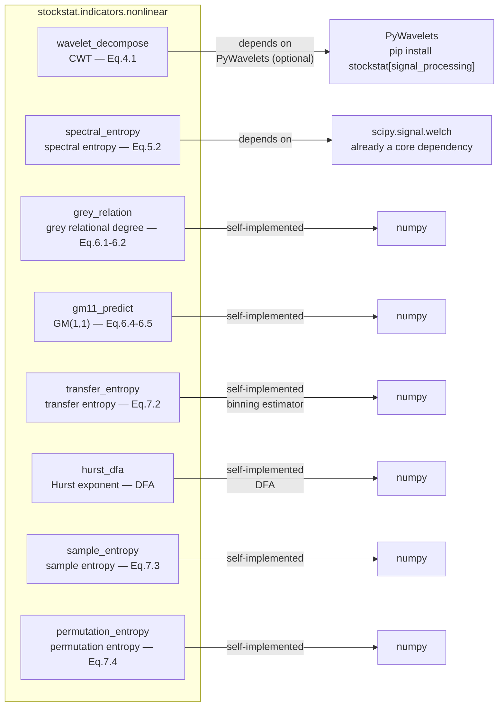

#### 4.6.3 Function List

Mapping between method names exposed on `ComputeEngine` and module-level functions in `nonlinear.py`:

| `client.compute.*` method | `nonlinear.py` function | Formula | Dependency | Degradation behavior |
|---------------------------|-------------------------|---------|------------|----------------------|
| `wavelet_decompose(signal, scales, wavelet)` | `wavelet_decompose` | CWT (Eq. 4.1) | PyWavelets (optional) | Falls back to a self-implemented FFT Morlet when absent |
| `spectral_entropy(signal, fs, nperseg)` | `spectral_entropy` | Spectral entropy (Eq. 5.2) | scipy.signal.welch | — |
| `grey_relation(x0, xi, rho)` | `grey_relation` | Grey relational degree (Eq. 6.1–6.2) | numpy (self-implemented) | — |
| `gm11_predict(sequence)` | `gm11_predict` | GM(1,1) forecast (Eq. 6.4–6.5) | numpy (self-implemented) | — |
| `transfer_entropy(x, y, k, n_bins)` | `transfer_entropy` | Transfer entropy (Eq. 7.2) | numpy (self-implemented binning estimator) | — |
| `hurst_dfa(signal)` | `hurst_dfa` | Hurst exponent (DFA) | numpy (self-implemented) | — |
| `sample_entropy(signal, m, r)` | `sample_entropy` | Sample entropy (Eq. 7.3) | numpy (self-implemented) | — |
| `permutation_entropy(signal, m, tau)` | `permutation_entropy` | Permutation entropy (Eq. 7.4) | numpy (self-implemented) | — |

#### 4.6.4 Dependency Declaration

| Component | Core dependency | Optional dependency |
|-----------|-----------------|---------------------|
| `spectral_entropy` | scipy (already a core dep) | — |
| `wavelet_decompose` | numpy (FFT fallback) | PyWavelets ≥ 1.1 |
| Other 6 functions | numpy (self-implemented) | — |

```bash
# Install full signal-processing capability
pip install stockstat[signal_processing]

# Or install the full suite that bundles PyWavelets
pip install stockstat[nonlinear]
```

#### 4.6.5 PlotSpec Factory Functions

`nonlinear.py` provides 3 factory functions returning `PlotSpec`, exposed under different method names on `ComputeEngine`:

| `nonlinear.py` module-level function | `client.compute.*` method | Returns | Purpose |
|--------------------------------------|---------------------------|---------|---------|
| `wavelet_scalogram_spec(coef, scales, title, cmap)` | `wavelet_scalogram(coef, scales, title, cmap)` | `PlotSpec` (heatmap) | CWT time-frequency heatmap |
| `dfa_fit_spec(signal, title)` | `dfa_fit(signal, title)` | `PlotSpec` (log-log scatter+line) | DFA log-log fit plot + Hurst annotation |
| `psd_spec(signal, fs, nperseg, title)` | `psd_plot(signal, fs, nperseg, title)` | `PlotSpec` (log-log line) | Welch PSD spectrum plot |

```python
# Example: render a CWT scalogram in one line
coef, scales = client.compute.wavelet_decompose(signal, scales=np.arange(1, 25))
spec = client.compute.wavelet_scalogram(coef, scales)  # returns a PlotSpec
fig = client.plot.render(spec)  # auto-detects matplotlib
```

#### 4.6.6 Test Strategy

`tests/test_nonlinear.py` contains 37 unit tests covering:

- **Known-property verification**: white-noise Hurst ≈ 0.5, pure-tone spectral entropy < 1.0, constant-sequence sample entropy = 0
- **Boundary conditions**: short sequences (≤3 points), constant sequences, empty input
- **ComputeEngine integration**: verifies 11 methods are accessible on `client.compute`
- **PlotSpec factories**: wavelet_scalogram / dfa_fit / psd_plot return correct PlotSpecs
- **Enhanced PlotSpec**: heatmap, subplots, log axes, backward compatibility
- **MatplotlibRenderer**: heatmap rendering, subplot rendering

---

## 5. Scripting Language Design

A **dual-mode** programmable interface is provided: Python library (full-featured) + DSL (lightweight declarative).

### 5.1 Mode Comparison

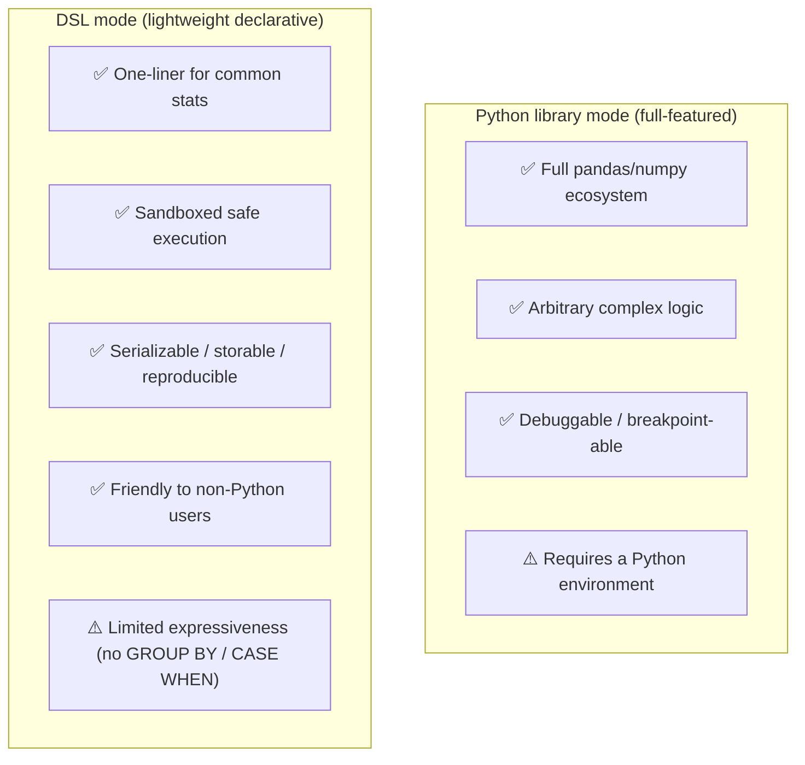

### 5.2 Python Library Mode

The full Python API, suited to complex analysis scenarios:

```python
from stockstat import StockStatClient
import pandas as pd

client = StockStatClient(host="localhost", port=8000)

# Fetch data
paxg = client.ohlcv("PAXG/USDT", start="2022-01-01", timeframe="1d")

# Compute freely
df = paxg.copy()
df['ret'] = df['close'].pct_change()
df['vol_20'] = df['ret'].rolling(20).std()
df['ma50'] = df['close'].rolling(50).mean()

# Arbitrary pandas operations
result = df[df['vol_20'] > df['vol_20'].quantile(0.9)]
```

### 5.3 DSL Mode

Designed as a **SQL-like declarative statistical query language**, built on the `lark` parser (requires `pip install stockstat[dsl]`).

#### 5.3.1 Grammar Design

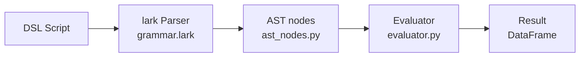

#### 5.3.2 Grammar Specification (actual implemented BNF summary)

```
# frontend/stockstat/dsl/grammar.lark

start       : query
query       : "SELECT" select_list "FROM" source ("WHERE" condition)? ("LIMIT" INT)?
select_list : select_expr ("," select_expr)*
select_expr : expr ("AS" NAME)?
source      : "ohlcv" "(" string ("," string)* ")"
?expr       : expr OP expr       -> binop
            | func_call
            | NAME               -> name_ref
            | NUMBER             -> number
            | STRING             -> literal_string
func_call   : NAME "(" (expr ("," expr)*)? ("," kwarg)* ")"
kwarg       : NAME "=" expr
condition   : expr COMP expr

OP    : "+" | "-" | "*" | "/"
COMP  : ">" | "<" | ">=" | "<=" | "==" | "!="
```

> **Capability boundary**: The current DSL only supports `SELECT ... FROM ... WHERE ... LIMIT`. It does **not** support `GROUP BY`, `ORDER BY`, `CASE WHEN`, or subqueries. `WHERE` is a row-level boolean filter; aggregations must be done in Python library mode.

#### 5.3.3 DSL Examples

```sql
-- Example 1: compute the 20-day MA together with close
SELECT
    close,
    ma(close, 20) AS ma20,
    ema(close, 12) AS ema12
FROM ohlcv("AAPL", "1d", "2024-01-01", "2024-12-31")

-- Example 2: RSI overbought filter (row-level WHERE)
SELECT close, rsi(close, 14) AS rsi
FROM ohlcv("BTC/USDT", "1d", "2024-01-01", "2024-12-31")
WHERE rsi(close, 14) > 70
LIMIT 30

-- Example 3: Bollinger bands triplet
SELECT
    close,
    bollinger(close, 20, 2.0) AS bands
FROM ohlcv("ETH/USDT", "1d", "2024-01-01", "2024-12-31")
LIMIT 50

-- Example 4: keyword arguments (kwarg syntax)
SELECT
    close,
    ma(close, window=20) AS ma20
FROM ohlcv("BTC/USDT", "1d", "2024-01-01", "2024-12-31")
```

#### 5.3.4 DSL Built-in Function List

Functions actually registered in `_BUILTIN_FUNCS` of `evaluator.py`:

| Category | Function | Description |
|----------|----------|-------------|
| **Trend** | `ma(x, window)` | Simple moving average |
| | `ema(x, window)` | Exponential moving average |
| | `macd(x, fast, slow, signal)` | MACD (returns a 3-tuple) |
| **Oscillator** | `rsi(x, window)` | Relative Strength Index |
| **Volatility** | `std(x, window)` | Rolling standard deviation |
| | `atr(high, low, close, window)` | Average True Range |
| | `bollinger(x, window, k)` | Bollinger Bands (returns a 3-tuple) |
| **Statistics** | `corr(x, y)` | Pearson correlation |
| **Transform** | `returns(x)` | Percentage returns series |
| | `log_returns(x)` | Log returns series |
| **Aggregation** | `max(x)` / `min(x)` / `mean(x)` / `sum(x)` / `count(x)` | Scalar aggregation |

> **Field references**: `open` / `high` / `low` / `close` / `volume` select columns directly; `returns` / `log_returns` as field names are equivalent to `returns(close)` / `log_returns(close)`.
> **Indicators not exposed in the DSL**: `kdj` / `beta` / `sharpe` / `max_drawdown` / `rolling` / `shift` / `rank` / `weekend_filter` / `weekday_filter` / `spread` are currently available only in Python library mode; DSL integration is future work.

---

## 6. API Specification

### 6.1 REST API Overview

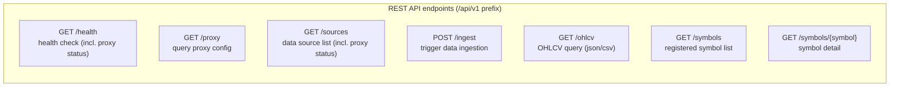

### 6.2 Core API Definitions

#### GET /api/v1/ohlcv

Fetches OHLCV data, supporting both JSON and CSV response formats.

**Request parameters**:

| Parameter | Type | Required | Description |
|-----------|------|----------|-------------|
| `symbol` | string | yes | Unified symbol, e.g. `PAXG/USDT` |
| `source` | string | no | Data source; auto-detected from symbol when omitted |
| `start` | string (ISO date) | no | Start time |
| `end` | string (ISO date) | no | End time |
| `timeframe` | string | no | Period; defaults to `1d` |
| `limit` | int | no | Max number of rows returned |
| `format` | string | no | `json` (default) / `csv` |

**Response example** (JSON):

```json
{
  "symbol": "PAXG/USDT",
  "source": "binance",
  "timeframe": "1d",
  "count": 731,
  "data": [
    {
      "ts": "2022-01-01T00:00:00Z",
      "open": 1812.50,
      "high": 1820.00,
      "low": 1805.00,
      "close": 1818.00,
      "volume": 15234.5
    }
  ]
}
```

**CSV format**:

```
GET /api/v1/ohlcv?symbol=PAXG/USDT&format=csv
→ Response(media_type="text/csv"); first line is the column header
```

> **Arrow format note**: `format=arrow` is not currently implemented; only `json` and `csv` are available. The `pyarrow` dependency in `pyproject.toml` is used by the computation frontend; backend response serialization has not yet enabled Arrow IPC.

#### POST /api/v1/ingest

Triggers the backend to ingest and store OHLCV data from a data source.

**Request parameters** (Query):

| Parameter | Type | Required | Description |
|-----------|------|----------|-------------|
| `symbol` | string | yes | Unified symbol |
| `source` | string | no | Data source; auto-detected when omitted |
| `start` | string | no | Start time |
| `end` | string | no | End time |
| `timeframe` | string | no | Defaults to `1d` |

**Response**:

```json
{"symbol": "AAPL", "source": "yfinance", "ingested": 250}
```

On successful ingestion the cache is cleared (`cache.clear()`).

#### GET /api/v1/symbols

```json
{
  "count": 2,
  "symbols": [
    {
      "unified_symbol": "PAXG/USDT",
      "asset_type": "crypto",
      "base_asset": "PAXG",
      "quote_asset": "USDT",
      "sources": ["binance"],
      "description": null
    },
    {
      "unified_symbol": "AAPL",
      "asset_type": "stock",
      "base_asset": "AAPL",
      "quote_asset": null,
      "sources": ["yfinance"],
      "description": null
    }
  ]
}
```

### 6.3 Error Handling

Errors are returned in FastAPI's default `{"detail": "..."}` form:

| HTTP code | Trigger scenario | Description |
|-----------|------------------|-------------|
| 400 | `UNKNOWN_SOURCE` / adapter does not support the symbol | Parameter validation failure |
| 404 | Queried symbol has no data / symbol not registered | `DATA_NOT_FOUND` / `SYMBOL_NOT_FOUND` |
| 502 | Adapter `fetch_ohlcv` raises | Upstream data source failure |

```python
# Example: querying a symbol that has never been ingested
GET /api/v1/ohlcv?symbol=XXX/USDT
→ 404 {"detail": "No data for 'XXX/USDT'. Try POST /api/v1/ingest first."}
```

---

## 7. Test Cases

### 7.1 Test Organization

| Test file | Coverage | Run condition |
|-----------|----------|---------------|
| `backend/tests/test_backend.py` | Backend API, adapters, storage, cache, proxy | Some require network (real data) |
| `frontend/tests/test_frontend.py` | Built-in indicators (trend/oscillator/volatility/statistics), DSL, visualization protocol, serialization | Offline |
| `frontend/tests/test_nonlinear.py` | 8 nonlinear functions + 3 PlotSpec factories + enhanced PlotSpec | Offline (37 cases) |
| `frontend/tests/test_integration.py` | Classic statistics + PAXG weekend correlation (real data) | Requires backend + network |
| `frontend/tests/test_matplotlib_charts.py` | matplotlib chart generation (outputs to `docs/images/`) | Requires matplotlib |
| `frontend/tests/test_backtest_*.py` | Full backtest subsystem (see §12 and Appendix C) | Some require network |

### 7.2 Classic Stock Statistics Cases

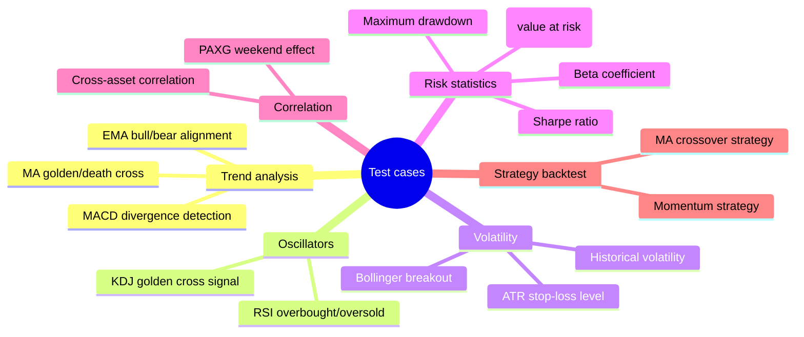

The following cases correspond to `test_frontend.py` and `test_integration.py`:

#### Case 1: MA Golden/Death Cross

```python
"""Verify the correctness of MA golden/death cross signals."""
client = StockStatClient(host="localhost", port=8000)
data = client.ohlcv("AAPL", start="2024-01-01", timeframe="1d")

ma_short = data.close.rolling(5).mean()
ma_long = data.close.rolling(20).mean()

# Golden cross: short MA crosses above long MA
golden_cross = (ma_short > ma_long) & (ma_short.shift(1) <= ma_long.shift(1))
# Death cross: short MA crosses below long MA
death_cross = (ma_short < ma_long) & (ma_short.shift(1) >= ma_long.shift(1))

assert golden_cross.sum() >= 0  # at least no error
assert death_cross.sum() >= 0
```

#### Case 2: RSI Overbought/Oversold Detection

```python
"""RSI range is [0, 100]; >70 overbought, <30 oversold."""
data = client.ohlcv("BTC/USDT", start="2024-01-01", timeframe="1d")
rsi = client.compute.rsi(data.close, window=14)

assert rsi.between(0, 100).all()
assert rsi.isna().sum() == 14  # first 14 are NaN
```

#### Case 3: Beta Coefficient

```python
"""Beta = Cov(Ri, Rm) / Var(Rm)"""
stock = client.ohlcv("AAPL", start="2023-01-01", timeframe="1d")
market = client.ohlcv("^GSPC", start="2023-01-01", timeframe="1d")

beta = client.compute.beta(
    asset=stock.close.pct_change(),
    benchmark=market.close.pct_change(),
    window=60
)
assert 0.5 < beta.dropna().mean() < 2.0  # AAPL Beta is typically 1.0~1.3
```

#### Case 4: Maximum Drawdown

```python
"""Max drawdown = max(1 - P_t / max(P_0..P_t))"""
data = client.ohlcv("BTC/USDT", start="2023-01-01", timeframe="1d")
cumret = data.close / data.close.iloc[0]
running_max = cumret.cummax()
drawdown = (cumret - running_max) / running_max
max_dd = drawdown.min()

assert -1 <= max_dd <= 0
```

#### Case 5: Sharpe Ratio

```python
"""Sharpe = (E[R] - Rf) / std(R) * sqrt(252)"""
data = client.ohlcv("BTC/USDT", start="2023-01-01", timeframe="1d")
returns = data.close.pct_change().dropna()

sharpe = client.compute.sharpe(returns, risk_free=0.02, annualize=True)
assert -5 < sharpe < 10
```

#### Case 6: Bollinger Breakout

```python
"""Bollinger Bands = MA ± k * std"""
data = client.ohlcv("ETH/USDT", start="2024-01-01", timeframe="1d")
upper, mid, lower = client.compute.bollinger(data.close, window=20, k=2)

assert (upper >= mid).all()
assert (mid >= lower).all()
breakout = (data.close > upper).sum() / len(data)
assert breakout < 0.15
```

#### Case 7: Cross-Asset Correlation

```python
"""BTC and ETH should be highly positively correlated."""
btc = client.ohlcv("BTC/USDT", start="2024-01-01", timeframe="1d")
eth = client.ohlcv("ETH/USDT", start="2024-01-01", timeframe="1d")

corr = btc.close.pct_change().corr(eth.close.pct_change())
assert corr > 0.7
```

### 7.3 PAXG Weekend Return vs Monday Independent Gain/Loss Correlation

> **Core research case**: Statistics on the correlation between PAXG (PAX Gold, a gold-pegged token) weekend return and Monday's max gain `(high-open)/open` and max loss `(low-open)/open`. Both are recorded independently to avoid selection bias from choosing the extreme in the signal direction. Corresponds to `test_integration.py`.

#### 7.3.1 Analysis Logic

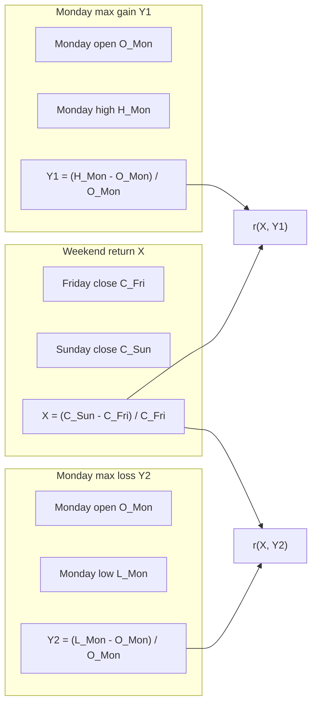

**Hypothesis**: PAXG is gold-pegged; the traditional gold market is closed on weekends. If PAXG's weekend price deviates, it may modestly predict Monday's intraday extremes. By recording gain and loss independently, we avoid selection bias from picking the extreme in the signal direction.

#### 7.3.2 Python Implementation

```python
"""
PAXG weekend return vs Monday independent gain/loss correlation test.
Records both (high-open)/open and (low-open)/open.
"""
import pandas as pd
from scipy import stats
from stockstat import StockStatClient

client = StockStatClient(host="localhost", port=8000)

# ── 1. Fetch PAXG daily data ──
paxg = client.ohlcv(
    symbol="PAXG/USDT", source="binance",
    start="2022-01-01", end="2024-12-31", timeframe="1d"
)

# ── 2. Label weekday ──
df = paxg.copy()
df['weekday'] = df.index.weekday

# ── 3. Extract Friday close, Sunday close, Monday OHLC ──
fridays = df[df['weekday'] == 4][['close']].rename(columns={'close': 'fri_close'})
sundays = df[df['weekday'] == 6][['close']].rename(columns={'close': 'sun_close'})
mondays = df[df['weekday'] == 0][['open', 'high', 'low', 'close']].copy()

# ── 4. Build weekend-Monday pairs ──
pairs = []
for mon_date, mon_row in mondays.iterrows():
    prev_fri = fridays.loc[:mon_date].tail(1)
    prev_sun = sundays.loc[:mon_date].tail(1)
    if len(prev_fri) > 0 and len(prev_sun) > 0:
        fri_close = prev_fri['fri_close'].iloc[0]
        sun_close = prev_sun['sun_close'].iloc[0]
        weekend_return = (sun_close - fri_close) / fri_close
        mon_open = mon_row['open']
        max_gain = (mon_row['high'] - mon_open) / mon_open
        max_loss = (mon_row['low'] - mon_open) / mon_open
        pairs.append({'weekend_return': weekend_return,
                      'max_gain': max_gain, 'max_loss': max_loss})

result_df = pd.DataFrame(pairs)

# ── 5. Compute independent correlations ──
r_gain = result_df['weekend_return'].corr(result_df['max_gain'])
r_loss = result_df['weekend_return'].corr(result_df['max_loss'])
p_gain = stats.pearsonr(result_df['weekend_return'], result_df['max_gain'])[1]
p_loss = stats.pearsonr(result_df['weekend_return'], result_df['max_loss'])[1]

# ── 6. Group comparison ──
up = result_df[result_df['weekend_return'] > 0]
dn = result_df[result_df['weekend_return'] < 0]

print(f"Samples:    {len(result_df)} (up={len(up)}, dn={len(dn)})")
print(f"r(gain):    {r_gain:.4f}  p={p_gain:.4f}")
print(f"r(loss):    {r_loss:.4f}  p={p_loss:.4f}")
print(f"signal>0: gain={up['max_gain'].mean()*100:.4f}%, loss={up['max_loss'].mean()*100:.4f}%")
print(f"signal<0: gain={dn['max_gain'].mean()*100:.4f}%, loss={dn['max_loss'].mean()*100:.4f}%")
```

#### 7.3.3 Expected Output (real data, 2022-2024)

```
Samples:    156 (up=76, dn=65)
r(gain):    0.2303  p=0.0038
r(loss):    -0.2004  p=0.0121
signal>0: gain=0.7099%, loss=-0.9070%
signal<0: gain=0.5940%, loss=-0.7435%
```

#### 7.3.4 Test Assertions

```python
def test_paxg_weekend_gain_loss(client):
    """PAXG weekend return vs Monday independent gain/loss test."""
    result = compute_paxg_gain_loss(client)

    assert result['n_samples'] > 50, "Insufficient samples"
    assert -1 <= result['r_gain'] <= 1, "r(gain) out of range"
    assert -1 <= result['r_loss'] <= 1, "r(loss) out of range"

    # PAXG volatility should be small (gold-pegged)
    assert abs(result['up_gain_mean']) < 0.05
    assert abs(result['dn_loss_mean']) < 0.05
```

---

## 8. Technology Stack

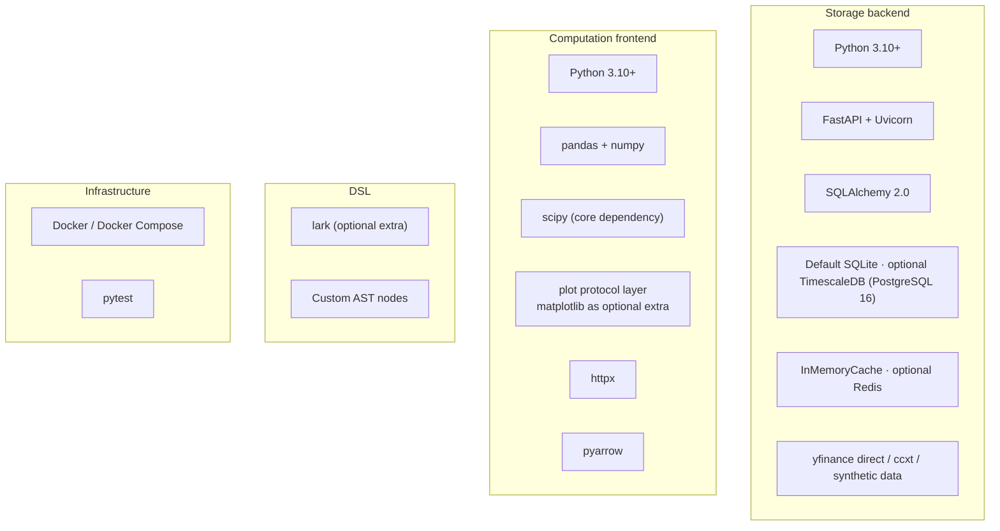

| Layer | Technology | Rationale |
|-------|------------|-----------|
| Backend framework | FastAPI | Native async, auto-generated OpenAPI docs, high performance |
| ORM | SQLAlchemy 2.0 | Multi-backend switching (SQLite/PostgreSQL), declarative models |
| Default database | SQLite | Zero external dependency, ready for local development |
| Production database | TimescaleDB (PostgreSQL 16) | Docker deployment, time-series optimizations (Hypertable optional) |
| Cache | InMemoryCache (default) / Redis (optional) | Zero dependency by default; Redis attachable in production |
| Compute core | pandas + numpy | De-facto standard, richest ecosystem |
| Statistics extension | scipy | Spectral entropy, hypothesis testing (core dependency) |
| DSL parser | lark | Mature Python parser, EBNF-friendly (optional extra) |
| Data transfer | JSON / CSV | Currently implemented; Arrow IPC planned |
| Visualization | matplotlib (optional extra) | Protocol-based adapter, lazy import, zero core dependency, graceful degradation on absence |
| Deployment | Docker Compose | One-command deployment of the backend stack |

---

## 9. Deployment

### 9.1 Local Development Deployment (default SQLite, zero external deps)

```bash
# 1. Install the backend
cd backend && pip install -e .

# 2. (Optional) Enable a proxy to access real data sources
export STOCKSTAT_PROXY_ENABLED=true
export STOCKSTAT_PROXY_TYPE=http
export STOCKSTAT_PROXY_URL=http://127.0.0.1:8889

# 3. Start the API service (default sqlite:///stockstat.db)
python -m uvicorn stockstat_backend.app:app --host 0.0.0.0 --port 8000

# 4. Install the frontend library (another terminal)
cd frontend && pip install -e .
```

### 9.2 Docker Production Deployment (TimescaleDB + Redis)

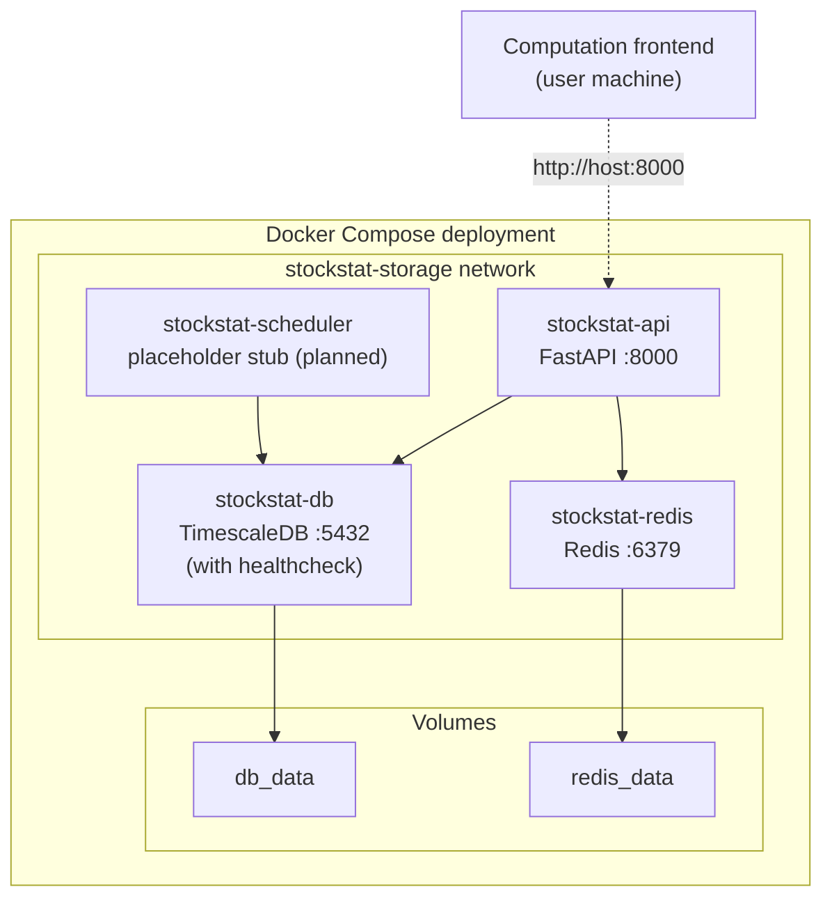

**docker-compose.yml core structure** (matches the actual repo file):

```yaml
version: "3.9"
services:
  db:
    image: timescale/timescaledb:latest-pg16
    environment:
      POSTGRES_DB: stockstat
      POSTGRES_USER: stockstat
      POSTGRES_PASSWORD: ${DB_PASSWORD:-stockstat123}
    ports: ["5432:5432"]
    volumes: [db_data:/var/lib/postgresql/data]
    healthcheck:
      test: ["CMD-SHELL", "pg_isready -U stockstat"]
      interval: 10s
      timeout: 5s
      retries: 5

  redis:
    image: redis:7-alpine
    ports: ["6379:6379"]
    volumes: [redis_data:/data]

  api:
    build: ./backend
    ports: ["8000:8000"]
    environment:
      DATABASE_URL: postgresql://stockstat:${DB_PASSWORD:-stockstat123}@db:5432/stockstat
      REDIS_URL: redis://redis:6379/0
      STOCKSTAT_PROXY_ENABLED: ${PROXY_ENABLED:-false}
      STOCKSTAT_PROXY_TYPE: ${PROXY_TYPE:-http}
      STOCKSTAT_PROXY_URL: ${PROXY_URL:-http://127.0.0.1:8889}
    depends_on:
      db: { condition: service_healthy }
      redis: { condition: service_started }

  scheduler:
    build: ./backend
    command: python -c "import time; print('Scheduler stub - implement APScheduler here'); time.sleep(3600)"
    environment:
      DATABASE_URL: postgresql://stockstat:${DB_PASSWORD:-stockstat123}@db:5432/stockstat
    depends_on:
      db: { condition: service_healthy }

volumes:
  db_data:
  redis_data:
```

> **Note**: The `api` service code currently uses `InMemoryCache`; even when `REDIS_URL` is configured it does not automatically use Redis (extending `storage/cache.py` is required). The `scheduler` service is a placeholder process with no real scheduling logic implemented.

### 9.3 Frontend Library Installation

```bash
# Core library
pip install stockstat

# Optional extras
pip install stockstat[matplotlib]         # visualization
pip install stockstat[dsl]                # DSL parsing (lark)
pip install stockstat[signal_processing]  # PyWavelets
pip install stockstat[backtest_full]      # full backtest suite (matplotlib + optuna)

# Configure connection
export STOCKSTAT_HOST=localhost
export STOCKSTAT_PORT=8000
```

```python
# Or configure in code
from stockstat import StockStatClient
client = StockStatClient(host="your-server.com", port=8000)
```

---

## 10. Project Structure

The following is the actual repository file tree (one-to-one with the code):

```
StockStatistic/
├── backend/                              # Storage backend service
│   ├── stockstat_backend/
│   │   ├── __init__.py
│   │   ├── app.py                        # FastAPI application entry
│   │   ├── config.py                     # Settings + ProxyConfig (env-driven)
│   │   ├── api/
│   │   │   ├── __init__.py
│   │   │   └── routes.py                 # All REST routes (/health /proxy /sources /ingest /ohlcv /symbols)
│   │   ├── adapters/                     # Data source adapters
│   │   │   ├── __init__.py
│   │   │   ├── base.py                   # DataSourceAdapter ABC
│   │   │   ├── yfinance.py               # Based on the yfinance library
│   │   │   ├── yahoo_direct.py           # Direct Yahoo Finance API (route default)
│   │   │   ├── ccxt_adapter.py           # Generic ccxt adapter (Binance/Coinbase)
│   │   │   └── synthetic.py              # Synthetic data (offline testing)
│   │   ├── models/
│   │   │   ├── __init__.py
│   │   │   └── ohlcv.py                  # OHLCV + SymbolRegistry ORM
│   │   ├── storage/
│   │   │   ├── __init__.py
│   │   │   ├── database.py               # engine/session singletons
│   │   │   ├── repository.py             # OHLCVRepository + SymbolRepository
│   │   │   └── cache.py                  # InMemoryCache
│   │   ├── normalizer/
│   │   │   ├── __init__.py
│   │   │   └── normalizer.py             # normalize_ohlcv()
│   │   └── scheduler/                    # Placeholder directory (empty, planned)
│   ├── tests/
│   │   └── test_backend.py
│   ├── Dockerfile
│   └── pyproject.toml
│
├── frontend/                             # Computation frontend library
│   ├── stockstat/
│   │   ├── __init__.py                   # exports StockStatClient
│   │   ├── client.py                     # StockStatClient main entry + PlotAPI
│   │   ├── config.py                     # Config dataclass
│   │   ├── data_access/
│   │   │   ├── __init__.py
│   │   │   └── ohlcv.py                  # DataClient (httpx)
│   │   ├── compute/
│   │   │   ├── __init__.py
│   │   │   ├── engine.py                 # ComputeEngine (8 nonlinear methods + 3 PlotSpec factories)
│   │   │   └── registry.py               # register / call_indicator / @indicator
│   │   ├── indicators/
│   │   │   ├── __init__.py
│   │   │   ├── trend.py                  # ma / ema / macd
│   │   │   ├── oscillator.py             # rsi / kdj
│   │   │   ├── volatility.py             # std / atr / bollinger
│   │   │   ├── statistics.py             # corr / beta / sharpe / max_drawdown / var / returns / log_returns
│   │   │   └── nonlinear.py              # 8 nonlinear functions + 3 PlotSpec factories
│   │   ├── dsl/
│   │   │   ├── __init__.py
│   │   │   ├── grammar.lark              # lark EBNF grammar
│   │   │   ├── parser.py                 # parser
│   │   │   ├── ast_nodes.py              # AST nodes
│   │   │   └── evaluator.py              # evaluator + _BUILTIN_FUNCS
│   │   ├── plot/                         # Visualization layer (optional · protocol-based)
│   │   │   ├── __init__.py
│   │   │   ├── base.py                   # PlotSpec/SeriesSpec/SubplotSpec + PlotRenderer protocol + NullRenderer + RendererFactory
│   │   │   └── matplotlib_backend.py     # MatplotlibRenderer (lazy import)
│   │   ├── backtest/                     # Backtest subsystem (see §12)
│   │   │   ├── __init__.py
│   │   │   ├── engine.py
│   │   │   ├── execution_model.py
│   │   │   ├── context.py
│   │   │   ├── data_feed.py
│   │   │   ├── strategy.py
│   │   │   ├── orders.py
│   │   │   ├── broker.py
│   │   │   ├── portfolio.py
│   │   │   ├── cost_model.py
│   │   │   ├── fill_model.py
│   │   │   ├── intrabar.py
│   │   │   ├── sizing.py
│   │   │   ├── metrics.py
│   │   │   ├── result.py
│   │   │   ├── benchmark.py
│   │   │   ├── analyzer.py
│   │   │   ├── batch_runner.py
│   │   │   ├── fee_sweep.py
│   │   │   ├── optimizer.py
│   │   │   ├── walkforward.py
│   │   │   ├── montecarlo.py
│   │   │   ├── plot_adapter.py
│   │   │   ├── chart_spec.py
│   │   │   ├── chart_registry.py
│   │   │   ├── chart_factory.py
│   │   │   ├── null_charts.py
│   │   │   └── matplotlib_charts.py
│   │   └── export/
│   │       ├── __init__.py
│   │       └── serializers.py
│   ├── tests/
│   │   ├── test_frontend.py              # indicators / DSL / viz protocol / serialization
│   │   ├── test_nonlinear.py             # signal processing & nonlinear dynamics (37 cases)
│   │   ├── test_integration.py           # classic stats + PAXG weekend (real data)
│   │   ├── test_matplotlib_charts.py     # chart generation
│   │   ├── test_backtest_iface.py        # BT-0 interface skeleton
│   │   ├── test_backtest_mvp.py          # BT-1 MVP
│   │   ├── test_backtest_portfolio.py    # BT-2 multi-instrument/short
│   │   ├── test_backtest_multitf.py      # BT-3 multi-tf
│   │   ├── test_backtest_cost.py         # BT-4 cost model
│   │   ├── test_backtest_metrics.py      # BT-5 metrics
│   │   ├── test_backtest_optimize.py     # BT-6 optimizer
│   │   ├── test_backtest_strategies.py   # BT-7 12 strategies
│   │   ├── test_backtest_p0.py           # BT-8
│   │   ├── test_backtest_p1.py           # BT-9
│   │   ├── test_backtest_p2.py           # BT-10
│   │   ├── test_backtest_intrabar.py     # BT-11/12 intrabar
│   │   ├── test_backtest_viz_iface.py    # BT-V0
│   │   ├── test_backtest_viz_mpl.py      # BT-V1
│   │   ├── test_backtest_viz_advanced.py # BT-V2
│   │   ├── test_backtest_viz_dashboard.py # BT-V3
│   │   └── test_backtest_viz_online.py   # BT-V Online
│   └── pyproject.toml
│
├── docker-compose.yml                    # Backend deployment orchestration
├── docs/
│   ├── USAGE.md / USAGE_CN.md            # Usage guide
│   ├── backtest/                         # Backtest phase docs (see Appendix C)
│   └── images/                           # Chart output
├── reports/                              # Test reports
├── working/                              # Research working directory (not version-controlled)
├── DESIGN.md / DESIGN_CN.md              # Design report (EN/CN)
├── README.md / README_CN.md              # Project README
└── LICENSE                               # GPLv3
```

---

## 11. Development Roadmap

> The following is a retrospective of the completed roadmap. As of v1.7 (2026-07-17), the storage backend, computation frontend, DSL, visualization, signal processing & nonlinear dynamics module, and backtest subsystem (BT-0~BT-14 + BT-V0~V3) are all implemented and passing tests. The scheduler, Arrow transport, and Plotly backend are future work.

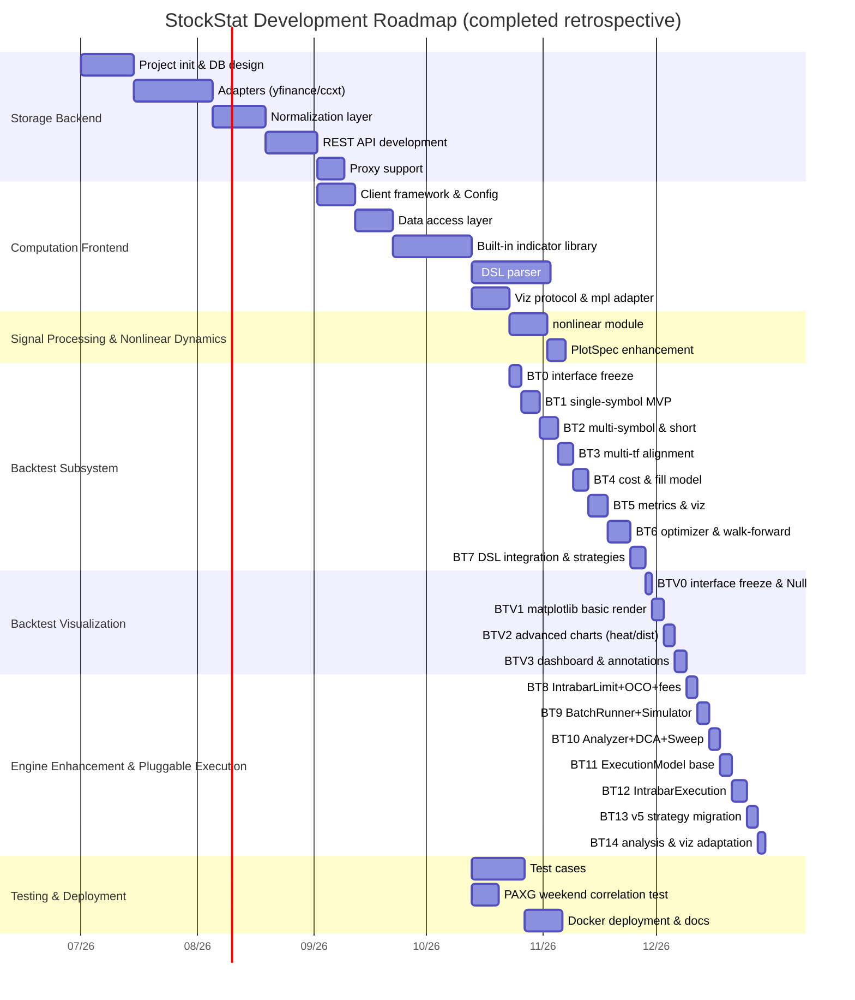

### Development Phases

| Phase | Content | Output | Status |
|-------|---------|--------|--------|
| **P0** | Storage backend MVP | SQLAlchemy ORM + yfinance/ccxt/synthetic adapters + basic API + InMemoryCache | ✅ |
| **P1** | Computation frontend MVP | StockStatClient + DataClient + 5 core indicators | ✅ |
| **P2** | DSL parser | grammar.lark + parser + evaluator + 15 built-in functions | ✅ |
| **P3** | Full indicator library | trend / oscillator / volatility / statistics complete set | ✅ |
| **P4** | Visualization layer | PlotSpec + PlotRenderer protocol + matplotlib adapter (optional extra) | ✅ |
| **P5** | Testing & deployment | all test cases + Docker + docs | ✅ |
| **NL** | Signal processing & nonlinear dynamics | 8 functions + 3 PlotSpec factories + PlotSpec enhancements | ✅ |
| **BT-0** | Backtest interface freeze | core dataclasses + abstract base class signatures + interface skeleton tests | ✅ |
| **BT-1** | Single-symbol MVP | DataFeed/Portfolio/Broker/Context/Engine/Result + MA-cross strategy | ✅ |
| **BT-2** | Multi-symbol portfolio | Universe + short selling + limit/stop orders + sizing + pair trading | ✅ |
| **BT-3** | Multi-timeframe | {sym:{tf:df}} alignment + lookahead audit + multi-tf resonance strategy | ✅ |
| **BT-4** | Cost model | commission/slippage/stamp duty + MakerTaker + Binance 4 presets + price limits | ✅ |
| **BT-5** | Performance & reporting | Sharpe/Sortino/Calmar + drawdown + trade detail + PlotSpec visualization | ✅ |
| **BT-6** | Optimization & walk-forward | grid search + optuna + walk-forward + Monte Carlo (optional extras) | ✅ |
| **BT-7** | DSL integration | 12-strategy full test suite + docs | ✅ |
| **BT-V0~V3** | Backtest visualization | BacktestChartSpec + Renderer protocol + 9 charts + dashboard | ✅ |
| **BT-8~10** | Engine enhancement P0/P1/P2 | IntrabarLimitFill + BatchRunner + Analyzer + DCA + fee_sweep | ✅ |
| **BT-11~14** | Pluggable execution | ExecutionModel ABC + IntrabarExecution + IntrabarMixin + strategy migration validation | ✅ |
| **Future** | Scheduler / Arrow / Plotly / TimescaleDB Hypertable | see "planned" notes in respective sections | ⏳ |

---

## 12. Backtest Subsystem Design

> The backtest subsystem is an optional enhancement module of the computation frontend, located at `frontend/stockstat/backtest/`. It is a pure-frontend implementation and does not modify the storage backend. This section covers the complete design of the backtest engine core, pluggable execution model, visualization layer, analysis tools, and batch backtesting.

### 12.1 Design Goals & Principles

| Goal | Description |
|------|-------------|
| **Configurable** | Custom strategy functions, multi-instrument trading groups, multi-timeframe bars, reuse of compute-library indicators |
| **Programmability first** | No built-in fixed strategies; provides three granularities — `Strategy` base class + `@strategy` function decorator + `IntrabarMixin` |
| **Data-computation separation** | Backtests run purely in the frontend; data is pulled via `DataClient` and injected into `DataFeed` |
| **Zero hard dependency** | Core depends only on pandas/numpy; optuna/matplotlib are extras |
| **Lookahead protection** | Strategy `on_bar(t)` can only access `≤ t` data; orders fill at `t+1` open by default; in intrabar mode the parent bar's close/high/low are masked |
| **Reproducibility** | seed + data snapshot version recorded in `BacktestResult` |
| **Pluggable execution** | `ExecutionModel` ABC supports `NextBarExecution` (default) and `IntrabarExecution` (intrabar sub-bar matching) |
| **Backward compatibility** | All new parameters have defaults; default behavior = existing behavior; existing code requires no modification |

### 12.2 Top-Level Architecture

```mermaid
graph TB
    subgraph "User Strategy Code Strategy"
        US["on_bar(ctx):<br/>ctx.compute.rsi(...)<br/>ctx.broker.submit(...)<br/>ctx.intrabar_submit(...)<br/>define_exits(fill, ctx)"]
    end

    subgraph "Backtest Core BacktestEngine"
        CTX["BacktestContext<br/>get/intrabar_submit<br/>compute/portfolio/history"]
        BRK["SimulatedBroker<br/>submit/cancel/submit_oco<br/>submit_oco_mutual"]
        DF["DataFeed + Universe<br/>multi-symbol multi-tf alignment<br/>intrabar_slice()"]
        PF["Portfolio<br/>cash / positions<br/>apply_fill / mark_to_market"]
        EM["ExecutionModel<br/>NextBarExecution (default)<br/>IntrabarExecution (intrabar sub-bar matching)"]
        RES["BacktestResult<br/>fills / equity / metrics<br/>chart() / render() / exit_reason_stats()"]
    end

    subgraph "Cost & Fill Models"
        CM["CostModel<br/>Percent/Fixed/Tiered/StampDuty<br/>MakerTaker/Binance (4 presets)"]
        FM["FillModel<br/>NextOpen/NextClose/VWAP<br/>IntrabarLimit/IntrabarFillModel"]
    end

    subgraph "Visualization Layer (zero hard dep · lazy activation)"
        VIZ["BacktestChartSpec<br/>chart_registry / chart_factory<br/>Null / Matplotlib renderer"]
    end

    subgraph "Analysis Tools"
        ANA["BacktestAnalyzer<br/>subperiod / regime / rolling<br/>StrategyBatchRunner / fee_sweep"]
    end

    US -->|read| CTX
    US -->|write orders| BRK
    US -->|intrabar orders| EM
    CTX -->|provide aligned bars| US
    BRK -->|push fills| PF
    EM -->|match| BRK
    DF --> CTX
    DF --> EM
    PF --> CTX
    CM --> BRK
    FM --> EM
    RES --> VIZ
    RES --> ANA
```

### 12.3 Module Layout

```
frontend/stockstat/backtest/
├── __init__.py              # public exports
├── engine.py                # BacktestEngine: main loop, event dispatch, execution_model param
├── execution_model.py       # ExecutionModel ABC + NextBarExecution + IntrabarExecution
├── context.py               # BacktestContext: strategy-visible world + intrabar_submit()
├── data_feed.py             # DataFeed + Universe + intrabar_slice()
├── strategy.py              # Strategy base, @strategy decorator, IntrabarMixin
├── orders.py                # Order/Fill dataclasses (incl. exit_reason, priority, sub_bar_ts)
├── broker.py                # SimulatedBroker (incl. submit_oco / submit_oco_mutual)
├── portfolio.py             # Portfolio/Position
├── cost_model.py            # CostModel + Percent/Fixed/Tiered/StampDuty/MakerTaker/Binance
├── fill_model.py            # FillModel + NextOpen/Close/VWAP/IntrabarLimit/IntrabarFillModel
├── intrabar.py              # IntrabarSimulator (standalone tool)
├── sizing.py                # position-sizing algorithms
├── metrics.py               # performance aggregation
├── result.py                # BacktestResult + exit_reason_stats()
├── benchmark.py             # buy_and_hold / dca_equity
├── analyzer.py              # BacktestAnalyzer: subperiod/regime/rolling
├── batch_runner.py          # StrategyBatchRunner + BatchResults
├── fee_sweep.py             # fee_sweep() / maker_taker_sweep()
├── optimizer.py             # parameter optimization (optional extra)
├── walkforward.py           # walk-forward analysis (optional)
├── montecarlo.py            # Monte Carlo (optional)
├── plot_adapter.py          # equity/trades → PlotSpec (backward compatible)
├── chart_spec.py            # BacktestChartSpec specialized spec
├── chart_registry.py        # chart-type registry
├── chart_factory.py         # detect + get_chart_renderer
├── null_charts.py           # NullBacktestRenderer (zero-dependency fallback)
└── matplotlib_charts.py     # MatplotlibBacktestRenderer (lazy import)
```

### 12.4 Core Interface Signatures

```python
# strategy.py
class Strategy:
    """Strategy base class. Subclasses override hooks."""
    def on_start(self, ctx: BacktestContext) -> None: ...
    def on_bar(self, ctx: BacktestContext) -> None: ...        # main entry
    def on_bar_close(self, ctx: BacktestContext) -> None: ...
    def on_fill(self, fill: Fill, ctx: BacktestContext) -> None: ...

class IntrabarMixin:
    """Optional mixin: declares the strategy supports intrabar execution + define_exits."""
    def define_exits(self, entry_fill: Fill, ctx: BacktestContext) -> list[Order]: ...

def strategy(fn=None, *, name: str | None = None):
    """Function-style strategy decorator: shorthand for def on_bar(ctx)."""

# execution_model.py
class ExecutionModel(ABC):
    """Order execution model: decides how orders fill within a bar."""
    def execute(self, engine, ctx, t, pending_orders) -> list[Fill]: ...
    @property
    def is_intrabar(self) -> bool: ...

class NextBarExecution(ExecutionModel):
    """Default: submitted at t → filled on the t+1 bar."""
    is_intrabar = False

class IntrabarExecution(ExecutionModel):
    """intrabar: sub-bar sequence matching inside the parent bar."""
    def __init__(self, intrabar_tf: str, parent_tf: str | None = None,
                 fill_model: IntrabarFillModel | None = None): ...
    def register_oco_mutual(self, order_a: Order, order_b: Order): ...
    is_intrabar = True

# context.py
class BacktestContext:
    now: pd.Timestamp
    current_bar: dict[str, pd.Series]
    def get(self, symbol: str, timeframe: str = "1d",
            lookback: int | None = None) -> pd.DataFrame: ...
    def intrabar_submit(self, order: Order) -> str: ...         # intrabar order submission
    def intrabar_submit_oco_mutual(self, a: Order, b: Order) -> tuple[str, str]: ...
    @property
    def compute(self) -> ComputeEngine: ...
    @property
    def broker(self) -> Broker: ...
    @property
    def portfolio(self) -> Portfolio: ...
    @property
    def history(self) -> ContextHistory: ...

# orders.py
@dataclass
class Order:
    symbol: str
    side: Literal["buy", "sell"]
    qty: float
    order_type: Literal["market","limit","stop","stop_limit","trailing_stop"] = "market"
    limit_price: float | None = None
    stop_price: float | None = None
    time_in_force: Literal["day","gtc","ioc"] = "gtc"
    tag: str = ""
    exit_reason: str = ""
    priority: int = 99          # 0=highest (SL), 99=default lowest

@dataclass
class Fill:
    order_id: str
    symbol: str
    side: OrderSide | str
    qty: float
    price: float
    commission: float = 0.0
    slippage_cost: float = 0.0
    ts: object = None
    tag: str = ""
    exit_reason: str = ""
    sub_bar_ts: object = None   # sub-bar timestamp of intrabar fill
    sub_bar_index: int = -1     # sub-bar sequence position

# engine.py
class BacktestEngine:
    def __init__(self,
                 data: dict,                            # {symbol: {tf: df}} or Universe
                 strategy: Strategy,
                 initial_cash: float = 1_000_000.0,
                 cost_model: Optional[CostModel] = None,    # defaults to PercentCost()
                 fill_model: Optional[FillModel] = None,    # defaults to NextOpenFill()
                 benchmark: Optional[str] = None,
                 trade_on: str = "open",                    # "open" | "close"
                 allow_short: bool = False,
                 lookahead_audit: bool = False,
                 seed: int = 0,
                 compute_engine: Optional[ComputeEngine] = None,  # defaults to an empty ComputeEngine
                 periods_per_year: Optional[int] = None,
                 execution_model: Optional[ExecutionModel] = None):  # defaults to NextBarExecution
        ...
    def run(self) -> BacktestResult: ...
```

### 12.5 Multi-Timeframe Alignment & Lookahead Protection

The **finest timeframe** drives the cursor `t`; higher-tf bars are aligned to `t` via `asof/ffill`:

```python
# Inside DataFeed
master_index = union_of_all timestamps at finest tf
aligned[sym][tf] = df[sym][tf].reindex(master_index, method="ffill")

# Context.get(symbol, tf, lookback) returns the ≤ t slice (closed interval)
df = aligned[sym][tf].loc[:t]
return df.iloc[-lookback:] if lookback else df
```

- **Lookahead protection**: strategy `on_bar(t)` can only access `≤ t` data; orders fill at `t+1` open by default (`NextOpenFill`)
- **lookahead_audit**: optional runtime check; accessing `> t` data raises `LookaheadError`
- Indicator computation is based on the `≤ t` slice, avoiding lookahead

### 12.6 Cost & Fill Models

**Cost models** (`CostModel` ABC):

| Model | Description |
|-------|-------------|
| `PercentCost` | Default: percentage commission + percentage slippage (bps) |
| `FixedCost` | Fixed per-trade fee |
| `TieredCost` | Tiered fee (by notional) |
| `MinCost` | Minimum commission floor |
| `StampDutyCost` | Stamp duty (stock seller side) |
| `ZeroCost` | Zero cost (for testing) |
| `MakerTakerCost` | Maker/Taker distinction: LIMIT→maker_rate, MARKET/STOP→taker_rate |
| `BinanceCost` | Binance spot/futures × BNB discount (4 presets: `BINANCE_SPOT`/`_BNB`/`FUTURES`/`_BNB`) |

**Fill models** (`FillModel` ABC):

| Model | Description |
|-------|-------------|
| `NextOpenFill` | Default: fills at next bar's open, strongest lookahead protection |
| `NextCloseFill` / `ThisCloseFill` | Other fill timings (`ThisCloseFill` warns) |
| `VWAPFill` / `WorstPriceFill` | Simulate market impact |
| `IntrabarLimitFill` | Limit order fills when the intrabar price crosses the limit level (checks next_bar high/low) |
| `IntrabarFillModel` | Sub-bar sequence scanning fill, returns `IntrabarFillResult` (with `sub_bar_ts`/`sub_bar_index`); inherits `IntrabarLimitFill` |

### 12.7 Position-Sizing Algorithms

`fixed_size / fixed_amount / percent_equity / kelly / atr_risk_budget`, computed by the strategy before calling `ctx.broker.submit(order)` to determine `qty`, or via the `sizing` helper functions.

### 12.8 Performance Metrics

Reuses `indicators.statistics` and the new `metrics.py`:

Total return, annualized return, Sharpe, Sortino, Calmar, Omega, information ratio, max drawdown, drawdown duration/recovery time, win rate, profit-loss ratio, profit factor, expectancy, consecutive wins/losses, monthly/yearly heatmaps, return distribution, VaR.

### 12.9 Integration with Existing Modules

| Integration point | Mechanism |
|-------------------|-----------|
| `ComputeEngine` | `Context.compute` directly holds the client's ComputeEngine; `BacktestEngine` accepts a `compute_engine` parameter |
| Custom indicators | `ctx.compute.register("divergence", fn)` → `ctx.compute.call(...)` |
| DSL | `Signal.from_dsl("SELECT ... WHERE rsi<30")` signal generation (BT-7) |
| `indicators.statistics` | `metrics.py` calls sharpe/max_drawdown/var/returns |
| `plot` protocol | `result.plot_equity()` returns a PlotSpec renderable by any renderer |
| `export` | `result.to_csv()/to_json()` reuses serializers |
| `data_access` | `DataFeed` accepts DataFrames or lazy-loads via client |

### 12.10 Built-in Example Strategy List

12 strategies ranging from simple to complex, each corresponding to a `test_backtest_strategies.py` case:

| # | Strategy | Instruments | tf | Indicators/design points | Verification target |
|---|----------|-------------|----|-------------------------|---------------------|
| 1 | Dual-MA crossover | single | single | ma(5)×ma(20) | MVP loop |
| 2 | Bollinger breakout | single | single | bollinger | limit/stop orders |
| 3 | RSI overbought/oversold | single | single | rsi | reverse entry/take-profit |
| 4 | MACD divergence | single | single | macd + custom indicator | register() |
| 5 | ATR channel breakout | single | single | atr + Donchian | ATR risk budget |
| 6 | Grid trading | single | single | price tiers | multi-orders/capital buckets |
| 7 | Pair trading | multi(2) | single | beta/corr + z-score | multi-instrument/short hedge |
| 8 | Risk parity | multi(N) | single | beta/std | periodic rebalance |
| 9 | Momentum rotation | multi(N) | single | 6-month momentum rank | Top-K rebalance |
| 10 | Multi-tf resonance | single | multi | daily MA + hourly breakout | multi-tf alignment |
| 11 | PAXG weekend effect | single | single | weekday signal | event-driven |
| 12 | Martingale | single | single | double on loss | position limit/risk warning |

### 12.11 Dependency Declaration

```toml
[project.optional-dependencies]
backtest = ["stockstat"]                  # core backtest (incl. ExecutionModel + IntrabarExecution)
optimize = ["optuna>=3.5"]                # parameter optimization
backtest_viz = ["stockstat[backtest]", "matplotlib>=3.8"]   # backtest visualization
backtest_full = ["stockstat[backtest]", "stockstat[optimize]",
                 "stockstat[matplotlib]", "matplotlib>=3.8"]
```

The backtest core has zero hard dependency on matplotlib. All enhancements are pure Python + pandas/numpy.

### 12.12 Pluggable Execution Model

`ExecutionModel` is the core abstraction of the backtest engine — it decides how orders fill within a bar. It is injected into `BacktestEngine` via composition, supporting two execution modes **without adding a new engine class**.

**Design motivation**: intrabar sub-bar execution needs to close 5 structural gaps — fill-time tracking (Gap-1), same-bar entry+exit (Gap-2), post-fill exit scan (Gap-3), both-fill→double-cancel (Gap-4), and SL-before-TP within a bar (Gap-5).

```mermaid
graph TB
    subgraph "BacktestEngine (single engine class)"
        ENG["execution_model param<br/>defaults to NextBarExecution"]
        EM["ExecutionModel ABC"]
        NB["NextBarExecution<br/>default: t→t+1 fill"]
        IB["IntrabarExecution<br/>intrabar sub-bar matching"]
    end

    subgraph "Inside IntrabarExecution"
        FILL["IntrabarFillModel<br/>sub-bar scan + time tracking"]
        SCAN["_scan_sub_bars<br/>prescan→OCO detect→apply→exit scan"]
        EXIT["_scan_exits<br/>limit/stop per bar + market close at close"]
        OCO["register_oco_mutual<br/>both-fill→double cancel"]
    end

    subgraph "Strategy layer (duck typing)"
        STR["Strategy base (unchanged)"]
        MIX["IntrabarMixin (optional)<br/>define_exits()"]
    end

    ENG --> EM
    EM --> NB
    EM --> IB
    IB --> FILL
    IB --> SCAN
    SCAN --> EXIT
    SCAN --> OCO
    STR -.-> MIX
```

**Resolution of the 5 gaps**:

| Gap | Resolution |
|-----|------------|
| Gap-1 | `Fill.sub_bar_ts` + `Fill.sub_bar_index` + `IntrabarFillModel.fill_with_timing()` |
| Gap-2 | `IntrabarExecution` completes the entry→exit lifecycle within a parent bar |
| Gap-3 | duck-typed detection of `define_exits()` + forward `_scan_exits()` scan |
| Gap-4 | `register_oco_mutual()` + prescan detecting both fills |
| Gap-5 | `Order.priority` field + sorting (SL priority=0 > TP priority=1) |

**Backward compatibility**: `execution_model=None` defaults to `NextBarExecution` = existing behavior. `ctx.intrabar_submit()` degrades to `broker.submit` + warning in non-intrabar mode. Existing strategy code requires no modification.

### 12.13 Backtest Visualization

The backtest visualization subsystem layers a **zero hard dependency** visualization layer on top of the backtest core: the backtest core does not depend on matplotlib, but installing it auto-activates rich backtest-specific charts.

**Design principles**:

| Principle | Description |
|-----------|-------------|
| **Backtest core zero hard dep** | Importing the `backtest/` package does not trigger matplotlib; `import stockstat.backtest` always succeeds |
| **Dedicated spec layer** | `BacktestChartSpec` (backtest-specific), parallel to the generic `PlotSpec`, mutually non-polluting |
| **Lazy activation** | matplotlib is lazily imported via the `matplotlib_charts` module after installation |
| **Protocol-based** | `BacktestChartRenderer` protocol with pluggable Null/Matplotlib backends |

> **Relationship with the generic PlotSpec**: The v1.7-enhanced generic `PlotSpec` already provides heatmap / log axes / subplots / fill / histogram capabilities (see §4.5.5), theoretically sufficient for all backtest-chart needs. `BacktestChartSpec` is retained as a historical interface for backward compatibility; new code can use the enhanced `PlotSpec` directly.

**Architecture**:

```mermaid
graph TB
    subgraph "Backtest core backtest/ (zero matplotlib dependency)"
        RES["BacktestResult"]
        ADAPTER["plot_adapter.py<br/>basic PlotSpec builder"]
        CHARTSPEC["chart_spec.py<br/>BacktestChartSpec specialized spec"]
        REG["chart_registry.py<br/>chart registry"]
    end

    subgraph "Generic plot protocol (existing)"
        PS["PlotSpec"]
        PR["PlotRenderer<br/>Null/Matplotlib"]
    end

    subgraph "Backtest visualization backend (lazy import · optional)"
        BCMPL["matplotlib_charts.py<br/>MatplotlibBacktestRenderer<br/>(activates only when matplotlib is installed)"]
        BCNULL["null_charts.py<br/>NullBacktestRenderer"]
        FACTORY["chart_factory.py<br/>detect + get_chart_renderer"]
    end

    RES --> ADAPTER --> PS
    RES --> CHARTSPEC
    CHARTSPEC --> REG
    REG --> FACTORY
    FACTORY --> BCMPL
    FACTORY --> BCNULL
    BCMPL -.->|lazy import| PR
```

**Chart type list** (9 types):

| Chart | Type | Purpose |
|-------|------|---------|
| `equity_curve` | multi-line + benchmark | equity curve comparison |
| `drawdown` | line + fill | drawdown fill area |
| `trades_overlay` | line + scatter annotation | trade-point overlay |
| `returns_distribution` | histogram | return distribution |
| `monthly_heatmap` | heatmap | monthly return heatmap |
| `yearly_returns` | bar | yearly return comparison |
| `parameter_heatmap` | heatmap | grid-search parameter heatmap |
| `underwater_curve` | fill | underwater curve (drawdown duration) |
| `dashboard` | multi-subplot composite | comprehensive dashboard |

**Usage**:

```python
res = BacktestEngine(...).run()

# One-line render (auto-detects matplotlib; graceful degradation when unavailable)
res.render("equity_curve", path="equity.png")
res.render("dashboard", path="dashboard.png")

# Batch-save all charts
out = res.render_all("./charts")

# Backward compatible — generic PlotSpec (works without matplotlib)
spec = res.plot_equity()
```

### 12.14 Analysis Tools & Batch Backtesting

**BacktestAnalyzer** — post-backtest analysis:

| Method | Purpose |
|--------|---------|
| `subperiod_metrics(result, split_dates)` | Splits the equity curve by `split_dates` and computes sub-period metrics |
| `regime_conditional_metrics(result, regime_series)` | Groups by regime series and computes metrics |
| `rolling_metric(result, metric, window)` | Rolling Sharpe/volatility/drawdown/return |
| `trade_analysis_by_exit(result)` | Groups trades by exit reason |

**StrategyBatchRunner** — multi-strategy batch backtesting:

```python
runner = StrategyBatchRunner(data=data, initial_cash=10000, cost_model=BINANCE_SPOT)
results = runner.run_all({"ma_cross": s1, "rsi": s2})         # multi-strategy
results = runner.run_all_fees({"ma_cross": s1}, fee_models)    # multi-strategy × multi-fee
df = results.to_dataframe()                                    # summary DataFrame
ranked = results.rank("sharpe")                                # rank by Sharpe
```

**Fee sweep**:

- `fee_sweep(data, strategy, commissions=[...])` — uniform fee sweep
- `maker_taker_sweep(data, strategy, maker_rates=[...], taker_rates=[...])` — Maker×Taker grid sweep

**Benchmarks**:

- `buy_and_hold(initial_cash, prices)` — buy and hold
- `dca_equity(initial_cash, prices, schedule="weekly")` — DCA benchmark (auto/weekly/monthly)

---

## Appendix A: Data Source Compatibility Matrix

| Data source | Asset type | Network | Implementation status | History depth | Notes |
|-------------|------------|---------|----------------------|---------------|-------|
| yfinance direct (YahooDirectAdapter) | US stocks/ETF/index | yes | ✅ Implemented | 10+ years | Route default; bypasses yfinance library cookie/crumb issues |
| yfinance library (YFinanceAdapter) | US stocks/ETF/index | yes | ✅ Implemented | 10+ years | Alternative implementation |
| ccxt - Binance (CcxtAdapter) | crypto | yes | ✅ Implemented | full history | `source=binance` |
| ccxt - Coinbase (CcxtAdapter) | crypto | yes | ✅ Implemented | full history | `source=coinbase` |
| SyntheticAdapter | mixed | no | ✅ Implemented | on-demand | Fixed-seed synthetic data |
| Alpha Vantage | global stocks | yes | ❌ Planned | — | Adapter class not implemented |
| Tushare | A-shares | yes | ❌ Planned | — | Adapter class not implemented |

## Appendix B: OHLCV Data Volume Estimation

| Scope | Time granularity | Rows (1 year) | Storage estimate |
|-------|------------------|---------------|------------------|
| 1 symbol | daily | ~250 | ~2 KB |
| 1 symbol | 1-minute | ~525,000 | ~15 MB |
| Binance USDT pairs (1,479) | daily | ~370,000 | ~3 MB |
| Binance USDT pairs (1,479) | 1-minute | ~776M | ~22 GB |
| Coinbase USD pairs (528) | daily | ~132,000 | ~1 MB |
| Coinbase USD pairs (528) | 1-minute | ~277M | ~8 GB |

> SQLite is suitable for small single-machine workloads (tens of thousands to millions of rows). When 1-minute full-market data reaches the GB scale, switch to TimescaleDB (Docker deployment) and enable Hypertable compression, which can reduce the size to 10%~20% of the original.

## Appendix C: Backtest Phase Documentation Index

The phase docs for the backtest core (BT-0~BT-14) and backtest visualization (BT-V0~BT-V3 + online validation) are indexed below and stored under `docs/backtest/`:

### C.1 Backtest Core (BT series)

| Phase | Doc | Code | Test |
|-------|-----|------|------|
| BT-0 | [docs/backtest/BT0_CN.md](docs/backtest/BT0_CN.md) | `backtest/` package skeleton + dataclasses | `test_backtest_iface.py` |
| BT-1 | [docs/backtest/BT1_CN.md](docs/backtest/BT1_CN.md) | MVP five modules | `test_backtest_mvp.py` |
| BT-2 | [docs/backtest/BT2_CN.md](docs/backtest/BT2_CN.md) | multi-symbol/short/order extensions | `test_backtest_portfolio.py` |
| BT-3 | [docs/backtest/BT3_CN.md](docs/backtest/BT3_CN.md) | multi-tf alignment/audit | `test_backtest_multitf.py` |
| BT-4 | [docs/backtest/BT4_CN.md](docs/backtest/BT4_CN.md) | cost/fill model | `test_backtest_cost.py` |
| BT-5 | [docs/backtest/BT5_CN.md](docs/backtest/BT5_CN.md) | metrics/report/viz | `test_backtest_metrics.py` |
| BT-6 | [docs/backtest/BT6_CN.md](docs/backtest/BT6_CN.md) | optimizer/walk-forward/Monte Carlo | `test_backtest_optimize.py` |
| BT-7 | [docs/backtest/BT7_CN.md](docs/backtest/BT7_CN.md) | DSL integration/12 strategies | `test_backtest_strategies.py` |
| BT-8 | [docs/backtest/BT8_CN.md](docs/backtest/BT8_CN.md) | P0 critical fix: IntrabarLimitFill + MakerTakerCost + OCO | `test_backtest_p0.py` |
| BT-9 | [docs/backtest/BT9_CN.md](docs/backtest/BT9_CN.md) | P1 enhancement: IntrabarSimulator + BatchRunner + exit_reason | `test_backtest_p1.py` |
| BT-10 | [docs/backtest/BT10_CN.md](docs/backtest/BT10_CN.md) | P2 analysis tools: DCA + Analyzer + fee_sweep | `test_backtest_p2.py` |
| BT-11 | [docs/backtest/BT11_BT14_CN.md](docs/backtest/BT11_BT14_CN.md) | ExecutionModel ABC + IntrabarFillModel + Fill/Order field extensions | `test_backtest_intrabar.py` |
| BT-12 | same as above | IntrabarExecution + IntrabarMixin + OCO mutual + priority | `test_backtest_intrabar.py` |
| BT-13 | same as above | v5 strategy migration (33 strategies × 4 fees = 132 backtest validation) | `run_redo.py` |
| BT-14 | same as above | analysis & visualization adaptation | `plots_redo.py` |

### C.2 Backtest Visualization (BT-V series + online validation)

| Phase | Doc | Code | Test |
|-------|-----|------|------|
| BT-V0 | [docs/backtest/BTV0_CN.md](docs/backtest/BTV0_CN.md) | `chart_spec.py` + `chart_registry.py` + `null_charts.py` + `chart_factory.py` | `test_backtest_viz_iface.py` |
| BT-V1 | [docs/backtest/BTV1_CN.md](docs/backtest/BTV1_CN.md) | `matplotlib_charts.py` basic rendering | `test_backtest_viz_mpl.py` |
| BT-V2 | [docs/backtest/BTV2_CN.md](docs/backtest/BTV2_CN.md) | histogram/heatmap/bar advanced charts | `test_backtest_viz_advanced.py` |
| BT-V3 | [docs/backtest/BTV3_CN.md](docs/backtest/BTV3_CN.md) | dashboard composite + trade annotation | `test_backtest_viz_dashboard.py` |
| BT-V Online | [docs/backtest/BT_VIZ_ONLINE_REPORT_CN.md](docs/backtest/BT_VIZ_ONLINE_REPORT_CN.md) | real-data online validation + 13 images | `test_backtest_viz_online.py` |

---

*This design document is updated as the project evolves; the code implementation is authoritative.*
