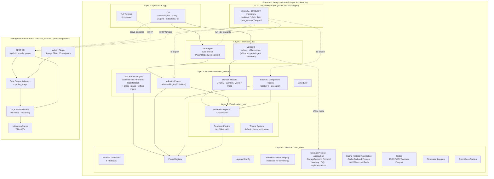
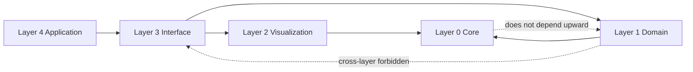
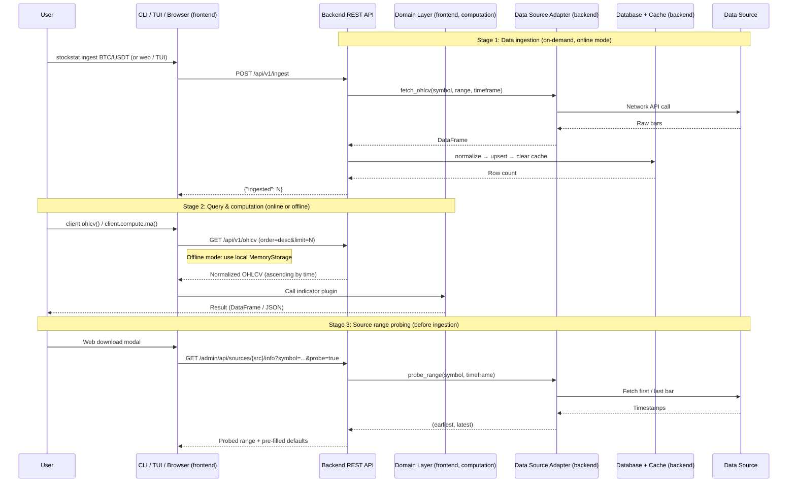
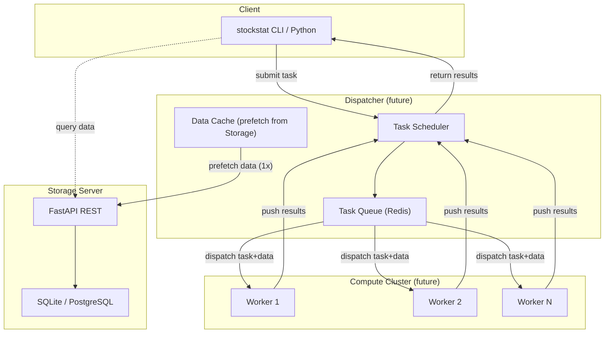

# StockStat — Programmable Financial Instrument Statistical Computing Platform Design Report

> **Version**: v2.1
> **Date**: 2026-07-18
> **Status**: Implemented (five-layer architecture + standalone storage backend + DSL v2.0 integration + offline mode direct data download + distributed compute reservation)

---

## Table of Contents

1. [Project Overview](#1-project-overview)
2. [Overall Architecture](#2-overall-architecture)
3. [Layer 0: Universal Core `_core`](#3-layer-0-universal-core-_core)
4. [Layer 1: Financial Domain `_domain`](#4-layer-1-financial-domain-_domain)
5. [Layer 2: Visualization `_viz`](#5-layer-2-visualization-_viz)
6. [Layer 3: Interface `_api`](#6-layer-3-interface-_api)
7. [Layer 4: Application `app`](#7-layer-4-application-app)
8. [Storage Backend Design](#8-storage-backend-design)
9. [Scripting Language Design](#9-scripting-language-design)
10. [API Specification](#10-api-specification)
11. [Backtest Subsystem Design](#11-backtest-subsystem-design)
12. [Management Interfaces](#12-management-interfaces)
13. [Test System](#13-test-system)
14. [Technology Stack](#14-technology-stack)
15. [Deployment](#15-deployment)
16. [Distributed Compute Reservation](#16-distributed-compute-reservation)
17. [Project Structure](#17-project-structure)
18. [Development Roadmap](#18-development-roadmap)
- [Appendix A: Data Source Compatibility Matrix](#appendix-a-data-source-compatibility-matrix)
- [Appendix B: OHLCV Data Volume Estimation](#appendix-b-ohlcv-data-volume-estimation)
- [Appendix C: v1.7 vs v2.0 Comparison](#appendix-c-v17-vs-v20-comparison)
- [Appendix D: Backtest Phase Documentation Index](#appendix-d-backtest-phase-documentation-index)

---

## 1. Project Overview

### 1.1 Project Goals

Build a **user-programmable** stock / cryptocurrency statistical computing platform with core capabilities:

- **Unified data access**: Compatible with multiple data sources through a single unified interface
- **Programmable computation**: Users write logic via the Python library or a custom DSL
- **Compute-storage separation**: Storage backend (`stockstat_backend`) as an independently deployable service; computation frontend (`stockstat`) as a library with configurable connections; reserved for future distributed compute offload
- **Plugin-based extensibility**: Data sources, indicators, cost models, fill models, execution models, and renderers are all plugins with auto-discovery
- **Offline mode**: Frontend can run without a backend, using local storage directly; **v2.1: offline mode can directly download data from sources (via `PluginRegistry` adapters) and read existing SQLite database files**
- **Visual management**: Built-in TUI and web admin interface — ingest, browse, and view K-lines without writing code

### 1.2 Design Principles

| Principle | Description |
|-----------|-------------|
| **Universal base** | The core layer (`_core`) is domain-agnostic and reusable for any time-series scenario |
| **Domain layering** | Financial logic (`_domain`) builds on the universal base; never depends upward on the interface layer |
| **Plugin-first** | All extension points go through a unified `PluginRegistry` with `entry_points` auto-discovery |
| **Protocol-first** | Layers communicate via `Protocol`s; implementations are replaceable with no hardcoded `if-else` |
| **Zero hard dependency in core** | Compute / backtest core depends only on pandas / numpy / scipy; matplotlib, optuna, PyWavelets, lark, rich are optional extras |
| **Compute-storage separation** | Frontend library does not bind to a specific storage backend; accesses data via HTTP or local Storage protocol |
| **Backward compatibility** | v1.7 public API works with zero modifications; `_core` / `_domain` / `_viz` / `_api` are internal (underscore-prefixed) |

### 1.3 Core Feature List

All features implemented:

- Multi-source data access (yfinance direct / ccxt [Binance, Coinbase] / synthetic data)
- OHLCV normalized storage (default SQLite, optional TimescaleDB via Docker)
- Unified REST API querying (JSON / CSV; supports `order=asc/desc` bidirectional pagination)
- Python computation library (pandas / numpy / scipy integration)
- Expression DSL (SQL-like, based on lark; **v2.0 `DslEngine` integrated — auto-reflects from `PluginRegistry`**)
- Built-in technical indicator library (MA / EMA / MACD / RSI / KDJ / ATR / Bollinger / Beta / Sharpe / VaR …, 23 in total)
- Signal processing & nonlinear dynamics module (CWT / spectral entropy / grey relation / GM(1,1) / transfer entropy / Hurst / sample entropy / permutation entropy)
- Custom indicator registration (v2.0 unified as `IndicatorPlugin` protocol)
- Computation result export (JSON / CSV / DataFrame)
- Optional visualization layer (protocol-based, unified `PlotSpec` + `ChartProfile`; supports heatmap / log axes / subplots / themes)
- Backtest subsystem (multi-instrument / multi-tf / pluggable execution model / visualization / analysis tools / batch backtesting)
- **CLI** (serve / ingest / query / plugins / indicators / tui)
- **TUI terminal management interface** (based on `rich`, falls back to plain text)
- **Web admin interface** (Admin Plugin: 5-page SPA with lazy-loading K-line chart, download modal, source range probing)
- **Offline mode** (`V2Client` with local Storage, no HTTP needed; v2.1 supports offline `ingest()` direct download from sources + `SQLStorage` reading existing SQLite files)

### 1.4 Package Structure and Deployment

The project contains **two independent pip packages** supporting flexible deployment topologies:

| Package | Location | Responsibility | Independently deployable? |
|---------|----------|---------------|--------------------------|
| `stockstat-backend` | `backend/` | Storage backend service (FastAPI + SQLAlchemy + data source adapters) | ✅ Separate process |
| `stockstat` | `frontend/` | Computation frontend library (ComputeEngine + backtest + DSL + viz + CLI/TUI) | ✅ User machine / compute node |

---

## 2. Overall Architecture

### 2.1 Architecture Overview

The project uses a **dual-package + five-layer** architecture: `stockstat_backend` (storage backend) and `stockstat` (frontend computation library, internally divided into five layers).



### 2.2 v1.7 Compatibility Layer and v2.0 Integration

| Compatibility module | v2.0 integration status | Description |
|---------------------|------------------------|-------------|
| `client.py` → `run_dsl()` | ✅ **Integrated** | Prefers `_api/dsl/DslEngine` (auto-reflects 23 functions from `PluginRegistry`), falls back to v1.7 `Evaluator` (15 hardcoded functions) |
| `client.py` → `ohlcv()` | ✅ **Enhanced** | Added `order` parameter, forwards to `DataClient` → HTTP |
| `client.py` → `compute` | ⚠️ v1.7 direct call | `ComputeEngine` directly calls `indicators/*` functions |
| `client.py` → `backtest()` | ⚠️ v1.7 direct call | `BacktestEngine` imperative loop (stable, 277 tests) |
| `client.py` → `plot` | ⚠️ v1.7 direct call | Uses v1.7 `plot/base.PlotSpec`; `_viz/specs.PlotSpec` exists as parallel capability |
| `dsl/evaluator.py` | ⚠️ Retained as fallback | v1.7 `Evaluator` + `_BUILTIN_FUNCS`, used when v2.0 layer unavailable |

**Design decision**: The backtest engine remains imperative (not event-driven) because the imperative implementation is stable with 277 test coverage, and event-driven refactoring is a massive effort. `EventBus` + `EventReplay` are implemented and reserved for future real-time streaming.

### 2.3 Inter-Layer Dependency Rules



**Iron rules**:

1. Upper layers depend on lower layers; lower layers are unaware of upper layers
2. Layers communicate via `Protocol`s; no concrete implementation imports
3. Cross-layer forbidden: domain cannot call api directly
4. v1.7 compatibility layer keeps public API unchanged; internally gradually forwards to v2.0 architecture
5. **Compute-storage separation**: `stockstat` (frontend) and `stockstat_backend` (backend) are two independent packages
   - **Online mode**: Frontend calls backend REST API via HTTP
   - **Offline mode**: Frontend `V2Client` uses Layer 0's `MemoryStorage` / `SQLStorage`, no backend needed; v2.1 supports offline `ingest()` via `PluginRegistry` adapters to download directly from data sources
   - Frontend `_domain/sources/` and `_core/_compat.py` use `try/except ImportError` for graceful degradation when backend is not installed

### 2.4 Data Flow



---

## 3. Layer 0: Universal Core `_core`

### 3.1 Protocol Contracts `contracts/`

| Protocol | Responsibility |
|----------|---------------|
| `Plugin` | Universal plugin protocol (name / version / category / initialize / shutdown / health_check) |
| `StorageBackend` | Storage backend (query / write / upsert / delete / count / schema / health_check) |
| `CacheBackend` | Cache backend (get / set / delete / exists / clear / health_check) |
| `Codec` | Serialization codec (encode / decode / media_type) |
| `Renderer` | Renderer (render / show / savefig / available) |
| `EventSubscriber` / `EventPublisher` | Event subscribe / publish |

### 3.2 Plugin Registry `plugin/`

46 built-in plugins across 6 namespaces: sources (4) / indicators (23) / cost_models (8) / fill_models (7) / execution_models (2) / renderers (2).

**Integration status**:
- ✅ `DslEngine` auto-reflects indicator functions from `PluginRegistry` (integrated into `StockStatClient.run_dsl()`)
- ✅ CLI `stockstat plugins` / `stockstat indicators` commands query the registry
- ⚠️ `ComputeEngine`'s 40+ methods still directly call `indicators/*` functions (not via registry dispatch)
- ⚠️ `entry_points` auto-discovery implemented but not enabled (`discover()` never called)

### 3.3 Layered Configuration `config/`

Configuration sources merged in priority: built-in defaults → config file (`stockstat.toml`) → environment variables → runtime kwargs. All v1.7 environment variables 100% compatible.

### 3.4 Event Bus + Data Stream `events/`

| Component | Status |
|-----------|--------|
| `EventBus` | ✅ Implemented |
| `Event` | ✅ Implemented |
| `EventReplay` | ✅ Implemented |

**Integration status**: `EventBus` + `EventReplay` are implemented but **not used by the backtest engine**. The backtest engine uses an imperative `for` loop (stable, 277 tests). Event bus is reserved for future real-time streaming and event-driven backtest refactoring.

### 3.5 Storage Protocol Abstraction `storage/`

| Implementation | Use case | Status |
|---------------|---------|--------|
| `MemoryStorage` | Testing / tiny datasets / offline mode | ✅ Implemented |
| `SQLStorage` | Default (SQLite / PostgreSQL), bridges backend SQLAlchemy ORM via `_compat.py` | ✅ Implemented |
| `TimescaleStorage` | Massive time-series (Docker, Hypertable) | ❌ Planned |
| `ParquetStorage` | Offline analysis (read-only snapshots) | ❌ Planned |

> `SQLStorage` delegates to backend `ohlcv_repo` via `_compat.py`, which uses `try/except ImportError` for graceful degradation — when backend is not installed, it auto-creates tables with standalone SQLAlchemy.

### 3.6 Cache Protocol Abstraction `cache/`

| Implementation | Description |
|---------------|-------------|
| `NullCache` | No caching (testing) |
| `MemoryCache` | In-process TTL cache (default, TTL=300s) |
| `RedisCache` | Distributed cache (auto-selected by `config.cache.backend`) |

### 3.7 Codec `codec/`

| Codec | media_type |
|-------|------------|
| `JsonCodec` | `application/json` |
| `CsvCodec` | `text/csv` |
| `ArrowCodec` | `application/vnd.apache.arrow.file` |
| `ParquetCodec` | `application/vnd.apache.parquet` |

### 3.8 Logging & Errors

`StructuredLogger` (JSON structured logging with context binding) / `AppError` (exception base with error code, context, recoverable flag) / 7 error subclasses.

---

## 4. Layer 1: Financial Domain `_domain`

### 4.1 Domain Models `models/`

`OHLCV` / `Symbol` / `Quote` / `Trade` — pure-Python dataclasses (not ORM-bound). Provides `df_to_ohlcv_list()` / `ohlcv_list_to_df()` bidirectional conversion.

### 4.2 Data Source Plugins `sources/`

`DataSourcePlugin` wraps data source adapters, registered to `sources` namespace. Uses **backend-first + frontend-local fallback** strategy:

1. **Backend installed**: Uses full backend adapters (with `fetch_symbols` / `probe_range` / `health_check`)
2. **Backend not installed**: Auto-registers frontend-local adapters (`_LazySourcePlugin` lazy instantiation):
   - `synthetic`: `_local_synthetic.py` (pure Python, zero deps)
   - `yfinance`: Frontend-local Yahoo API adapter (depends on `requests`, lazy import)
   - `binance` / `coinbase`: Frontend-local ccxt adapter (depends on `ccxt`, lazy import)

| Adapter | name | Symbol catalog | Timeframes |
|---------|------|----------------|------------|
| `YahooDirectAdapter` | `yfinance` | 85 curated + manual input | 12 |
| `CcxtAdapter("binance")` | `binance` | 4,498 (full market) | 16 |
| `CcxtAdapter("coinbase")` | `coinbase` | 1,183 (full market) | 7 |
| `SyntheticAdapter` | `synthetic` | 5 examples | 9 |

**`probe_range()` protocol**: Each adapter implements `probe_range(symbol, timeframe) -> (earliest_iso, latest_iso)`.

**`_LazySourcePlugin`**: Used when backend not installed. Adapter instance created on first `fetch_ohlcv()` call (lazy import of ccxt/requests). Missing optional deps don't cause errors at registration time.

**Offline `ingest()` capability** (v2.1 new): `V2Client(mode="offline")` `ingest()` no longer raises `RuntimeError`. Instead: `registry.get("sources", source)` → `adapter.fetch_ohlcv()` → normalize → `storage.upsert()`, downloading data directly to local storage.

### 4.3 Indicator Plugins `indicators/`

23 built-in indicators auto-registered: trend (ma/ema/macd) / oscillator (rsi/kdj) / volatility (std/atr/bollinger) / statistics (corr/beta/sharpe/max_drawdown/var) / transform (returns/log_returns) / nonlinear (8 functions).

**Integration status**: ✅ `DslEngine` auto-reflects all 23 indicators as DSL functions. ⚠️ `ComputeEngine` still directly calls `indicators/*` module functions.

### 4.4 Backtest Component Plugins `backtest/`

8 cost models / 7 fill models / 2 execution models, all registered to respective namespaces.

### 4.5 Scheduler `scheduler/`

Functional implementation: on-demand / cron / incremental scheduling.

---

## 5. Layer 2: Visualization `_viz`

### 5.1 Unified Spec System

`PlotSpec` + `ChartProfile` presets with 6 built-in profiles: equity_curve / drawdown / trades_overlay / returns_distribution / monthly_heatmap / dashboard.

**Integration status**: `_viz` is implemented but **not used by `StockStatClient` main path**. Currently `client.plot` uses v1.7 `plot/base.PlotSpec` (without `theme` field); backtest visualization uses `backtest/chart_spec.py`'s `BacktestChartSpec`. `_viz` exists as a parallel capability for future unification.

### 5.2 Renderer Plugins

`NullRenderer` (zero-dependency fallback) / `MatplotlibRenderer` (lazy import) / `PlotlyRenderer` (planned).

### 5.3 Theme System

3 built-in themes: `default` / `dark` / `publication`. Supports `register_theme()` for custom themes.

---

## 6. Layer 3: Interface `_api`

### 6.1 DSL Auto-Reflection `dsl/` (Integrated)

`DslEngine` auto-loads all registered indicators from `PluginRegistry` as DSL functions, replacing v1.7's manually-maintained `_BUILTIN_FUNCS` dict.

**Integration path**: `StockStatClient.run_dsl()` → prefers `_dsl_v2` (`DslEngine`, 23 functions) → falls back to `_dsl` (v1.7 `Evaluator`, 15 functions).

### 6.2 V2Client (Online + Offline)

```python
# Online mode (connects to backend HTTP)
client = V2Client(mode="online", host="192.168.1.100", port=8000)

# Offline mode — in-memory storage
client = V2Client(mode="offline", storage=MemoryStorage())

# Offline mode — read existing SQLite database file
client = V2Client(mode="offline", storage=SQLStorage(database_url="sqlite:///stockstat.db"))
```

In offline mode, all features run locally:

| Feature | Online mode | Offline mode |
|---------|-------------|--------------|
| `ohlcv()` | HTTP → backend REST API | `storage.query()` local |
| `ingest()` | HTTP → backend ingestion | **`registry` adapter → `fetch_ohlcv()` → `storage.upsert()` (v2.1 new)** |
| `compute` | Backend-agnostic | Local `ComputeEngine` |
| `run_dsl()` | `DslEngine` (HTTP data fetch) | `DslEngine` (local Storage data fetch) |
| `backtest()` | Backend-agnostic | Local `BacktestEngine` |
| `plot` | Backend-agnostic | Local `PlotAPI` |

**Offline `ingest()` data flow**:
```
client.ingest("BTC/USDT", source="binance")
  → registry.get("sources", "binance")     # Get adapter from PluginRegistry
  → adapter.fetch_ohlcv(symbol, ...)       # Direct Binance API call
  → normalize → storage.upsert("ohlcv", records)  # Write to local MemoryStorage / SQLStorage
  → return {"ingested": N}
```

**`SQLStorage` reading existing database**: `SQLStorage(database_url="sqlite:///path/to/stockstat.db")` can directly read SQLite files created by the backend, via `_compat.py` delegating to `ohlcv_repo.query()`. When backend not installed, `_compat.py` auto-creates tables with standalone SQLAlchemy.

---

## 7. Layer 4: Application `app`

### 7.1 CLI

```bash
stockstat serve --host 0.0.0.0 --port 8000
stockstat ingest BTC/USDT --source binance
stockstat query BTC/USDT --limit 5
stockstat plugins --namespace indicators
stockstat indicators --category nonlinear
stockstat tui --host 192.168.1.100
```

### 7.2 TUI Terminal Management Interface

Based on `rich` (optional), falls back to plain text.

### 7.3 Server Entry

`stockstat serve` is equivalent to `python -m uvicorn stockstat_backend.app:app`, conditionally mounting Admin Plugin.

---

## 8. Storage Backend Design

### 8.1 Data Source Adapter Layer

Adapters subclass `DataSourceAdapter` ABC with `fetch_ohlcv` / `fetch_symbols` / `supports` / `health_check` / `probe_range` methods.

### 8.2 Proxy Support

| Env var | Default | Description |
|---------|---------|-------------|
| `STOCKSTAT_PROXY_ENABLED` | `false` | Enable proxy |
| `STOCKSTAT_PROXY_TYPE` | `http` | `http` or `socks5` |
| `STOCKSTAT_PROXY_URL` | (auto) | Proxy URL |

### 8.3 Data Normalization

`normalize_ohlcv()` unifies raw data: timezone to UTC, field validation, dropna cleaning. Unique constraint: `(symbol, ts, timeframe, source)`.

### 8.4 Storage Engine

| Deployment mode | `DATABASE_URL` | Characteristics |
|-----------------|----------------|-----------------|
| Default (local dev) | `sqlite:///stockstat.db` | Zero dependency, persists across restarts |
| Custom path | `sqlite:////data/stockstat.db` | Custom database file location |
| Docker production | `postgresql://...@db:5432/stockstat` | TimescaleDB + volume persistence |

### 8.5 Query & Cache Strategy

`order` parameter supports bidirectional pagination. Cache key includes `order` for independent caching.

---

## 9. Scripting Language Design

### 9.1 DSL Grammar

```
query       : "SELECT" select_list "FROM" source ("WHERE" condition)? ("LIMIT" INT)?
source      : "ohlcv" "(" string ("," string)* ")"
?expr       : expr OP expr | func_call | NAME | NUMBER | STRING
func_call   : NAME "(" (expr ("," expr)*)? ("," kwarg)* ")"
```

### 9.2 DSL Functions (v2.0 Auto-Reflection)

`StockStatClient.run_dsl()` prefers v2.0 `DslEngine`, auto-reflecting all 23 registered indicators (8 more than v1.7's 15, including nonlinear functions). Falls back to v1.7 `Evaluator` when v2.0 layer unavailable.

---

## 10. API Specification

### 10.1 REST API Overview

| Endpoint | Method | Description |
|----------|--------|-------------|
| `/api/v1/health` | GET | Health check (includes proxy status) |
| `/api/v1/proxy` | GET | Get proxy configuration |
| `/api/v1/sources` | GET | List data sources |
| `/api/v1/ingest` | POST | Trigger data ingestion |
| `/api/v1/ohlcv` | GET | Query OHLCV data (json/csv; supports `order`) |
| `/api/v1/symbols` | GET | List registered symbols |
| `/api/v1/symbols/{symbol}` | GET | Symbol detail |

### 10.2 Core API — `GET /api/v1/ohlcv`

| Parameter | Type | Required | Description |
|-----------|------|----------|-------------|
| `symbol` | string | yes | Unified symbol |
| `source` | string | no | Data source; auto-detected when omitted |
| `start` / `end` | string | no | Time range |
| `timeframe` | string | no | Default `1d` |
| `limit` | int | no | Max rows |
| `order` | string | no | `asc` (default) / `desc` |
| `format` | string | no | `json` (default) / `csv` |

Python library `StockStatClient.ohlcv()` also supports `order` parameter.

---

## 11. Backtest Subsystem Design

### 11.1 Design Goals

Configurable / programmability first / zero hard dependency / lookahead protection / pluggable execution / backward compatible.

### 11.2 Engine Model

The backtest engine uses an **imperative `for` loop** to iterate bars, not event-driven. This design decision is based on: (1) imperative implementation is stable with 277 test coverage, (2) event-driven refactoring is massive, (3) `EventBus` + `EventReplay` are reserved for future use.

### 11.3 Cost & Fill Models

8 cost models / 7 fill models / 2 execution models.

### 11.4 Pluggable Execution Model

`IntrabarExecution` resolves 5 structural gaps: same-bar entry+exit, fill-time tracking, SL before TP, etc.

### 11.5 Backtest Visualization

9 chart types: equity_curve / drawdown / trades_overlay / returns_distribution / monthly_heatmap / yearly_returns / parameter_heatmap / underwater_curve / dashboard.

---

## 12. Management Interfaces

### 12.1 TUI Terminal Management Interface

`stockstat tui` — interactive terminal interface based on `rich` (optional), falls back to plain text.

### 12.2 Web Admin Interface (Admin Plugin)

Pluggable independent plugin (`plugins/admin/`), mounted via `AdminPlugin.mount(app)`. 42KB SPA HTML with 5 pages. Features: lazy-loading K-line chart, download modal with `probe_range`, manual symbol input.

---

## 13. Test System

| Test file | Coverage | Count |
|-----------|----------|-------|
| `test_v2_core.py` | Core layer | 49 |
| `test_v2_domain.py` | Domain layer | 27 |
| `test_v2_viz.py` | Visualization layer | 23 |
| `test_v2_api.py` | Interface layer | 17 |
| `test_frontend.py` | v1.7 indicators / DSL / viz | 31 |
| `test_nonlinear.py` | Nonlinear functions | 38 |
| `test_backtest_*.py` (17 files) | Full backtest suite | 277 |
| `test_backend.py` | Backend API / adapters / storage | 15 |
| `test_integration.py` | Classic stats + PAXG correlation | 19 |
| `test_matplotlib_charts.py` | matplotlib chart generation | 10 |
| **Total** | | **506** |

---

## 14. Technology Stack

| Layer | Technology | Rationale |
|-------|------------|-----------|
| Backend framework | FastAPI | Native async, OpenAPI docs |
| ORM | SQLAlchemy 2.0 | Multi-backend switching |
| Default database | SQLite | Zero dependency |
| Production database | TimescaleDB (PostgreSQL 16) | Time-series optimization |
| Cache | InMemoryCache / Redis | Zero-dependency default |
| Compute core | pandas + numpy | De-facto standard |
| Statistics extension | scipy | Spectral entropy, hypothesis testing |
| DSL parser | lark | EBNF-friendly (optional extra) |
| Data transfer | JSON / CSV / Arrow / Parquet | Codec protocol unified |
| Visualization | matplotlib (optional) | Protocol-based adapter |
| K-line chart | lightweight-charts 4.2 | CDN, lazy loading |
| TUI rendering | rich (optional) | Colored tables, plain text fallback |
| Deployment | Docker Compose | One-command stack |

---

## 15. Deployment

### 15.1 Local Development

```bash
cd backend && pip install -e .
cd frontend && pip install -e .
stockstat serve --host 0.0.0.0 --port 8000
```

### 15.2 Compute-Storage Separation

Backend deployed independently; frontend accesses via HTTP:

```python
from stockstat import StockStatClient
client = StockStatClient(host="192.168.1.100", port=8000)
```

### 15.3 Offline Mode (no backend needed)

```python
from stockstat._api.client import V2Client
from stockstat._core.storage import MemoryStorage, SQLStorage

# Option 1: Download to memory
client = V2Client(mode="offline", storage=MemoryStorage())
client.ingest("BTC/USDT", source="binance", start="2024-01-01")  # Direct Binance download
df = client.ohlcv("BTC/USDT")

# Option 2: Read existing SQLite database file
client = V2Client(mode="offline", storage=SQLStorage(database_url="sqlite:///stockstat.db"))
df = client.ohlcv("BTC/USDT")

# Option 3: Download + persist to SQLite
client = V2Client(mode="offline", storage=SQLStorage(database_url="sqlite:///my_data.db"))
client.ingest("AAPL", source="yfinance", start="2024-01-01")
```

All features (`ingest` / `ohlcv` / `compute` / `run_dsl` / `backtest` / `plot`) run locally without HTTP.

### 15.4 Docker Production

```bash
docker compose up -d
```

---

## 16. Distributed Compute Reservation

> See [reports/COMPUTE_OFFLOAD_PLAN_CN.md](reports/COMPUTE_OFFLOAD_PLAN_CN.md) and [reports/COMPUTE_OFFLOAD_PLAN_V2_CN.md](reports/COMPUTE_OFFLOAD_PLAN_V2_CN.md)

### 16.1 Design Goals

Offload heavy computation (grid search, Monte Carlo, large-scale backtests) to network compute nodes: async submission / parallel acceleration / resource isolation / fault isolation.

### 16.2 Three-Role Separation Architecture



### 16.3 Current Architecture and Distributed Compute

The current architecture reserves for distributed compute:
- **Compute-storage separation**: Frontend queries backend via HTTP; Workers can do the same
- **`StockStatClient` reusable in Workers**: Workers install `stockstat` package for full compute capability
- **`V2Client` offline mode**: Workers can use local `MemoryStorage` for Dispatcher-distributed data
- **Codec protocol**: Arrow/Parquet serialization for efficient data transfer
- **Plugin-based**: Workers auto-discover indicator/backtest component plugins

### 16.4 Deployment Scenario Evolution

| Scenario | Description | Current support |
|----------|-------------|-----------------|
| A. Single-machine full stack | Storage + Client + compute in same process | ✅ |
| B. Compute-storage separation | Client queries Storage remotely, computes locally | ✅ |
| C. Offline mode | Client uses local Storage, no backend | ✅ |
| D. Three-role separation + single compute node | Client → Dispatcher → Worker → Storage | ⏳ Planned |
| E. Compute cluster | Client → Dispatcher → [Workers] → Storage | ⏳ Planned |

---

## 17. Project Structure

```
StockStatistic/
├── backend/                              # Storage backend service (independently deployable)
│   ├── stockstat_backend/
│   │   ├── app.py                        # FastAPI entry
│   │   ├── config.py                     # Settings + ProxyConfig
│   │   ├── api/                          # REST routes + adapter management
│   │   ├── adapters/                     # Data source adapters (+ probe_range)
│   │   ├── models/ohlcv.py               # ORM
│   │   ├── storage/                      # database / repository / cache
│   │   ├── normalizer/                   # Data normalization
│   │   ├── plugins/admin/                # Web admin interface plugin
│   │   └── scheduler/                    # Scheduler (stub)
│   ├── tests/                            # 15 tests
│   └── pyproject.toml
│
├── frontend/                             # Computation frontend library
│   ├── stockstat/
│   │   ├── client.py                     # v1.7 facade (run_dsl integrated to v2.0)
│   │   ├── compute/                      # ComputeEngine
│   │   ├── indicators/                   # Indicator implementations
│   │   ├── backtest/                     # Backtest engine (28 files, imperative)
│   │   ├── plot/                         # Visualization (v1.7 PlotSpec)
│   │   ├── dsl/                          # DSL parser (v1.7 Evaluator, fallback)
│   │   ├── data_access/                  # DataClient (httpx → REST, + order)
│   │   ├── _core/                        # Layer 0: Universal Core
│   │   ├── _domain/                      # Layer 1: Financial Domain
│   │   ├── _viz/                         # Layer 2: Visualization (parallel capability)
│   │   ├── _api/                         # Layer 3: Interface (DslEngine integrated)
│   │   └── app/                          # Layer 4: Application (CLI + TUI)
│   ├── tests/                            # 491 tests
│   └── pyproject.toml
│
├── docker-compose.yml
├── docs/                                 # Usage docs + backtest phase docs + images
├── reports/                              # Test reports + compute offload plans
├── working/                              # PAXG research (v1~v7)
├── DESIGN.md / DESIGN_CN.md
├── README.md / README_CN.md
└── LICENSE                               # GPLv3
```

---

## 18. Development Roadmap

| Phase | Content | Status |
|-------|---------|--------|
| **P0~P4** | Storage backend + computation frontend + DSL + indicators + visualization | ✅ |
| **NL** | Signal processing & nonlinear dynamics | ✅ |
| **BT-0~14** | Backtest subsystem | ✅ |
| **BT-V0~V3** | Backtest visualization | ✅ |
| **v2.0 Phase 1~4** | Five-layer architecture implementation | ✅ |
| **DSL integration** | `StockStatClient.run_dsl()` → `DslEngine` auto-reflection | ✅ |
| **order parameter** | Bidirectional pagination (REST API + Python library) | ✅ |
| **Offline ingest** | `V2Client` offline mode direct download from sources + `SQLStorage` read existing DB | ✅ |
| **Admin Plugin** | Web admin + lazy K-line + probe_range | ✅ |
| **ComputeEngine integration** | `ComputeEngine` methods forward to `PluginRegistry` | ⏳ |
| **Visualization unification** | `client.plot` switch to `_viz/specs.PlotSpec` | ⏳ |
| **Event-driven backtest** | `BacktestEngine` refactored to `EventBus` + `EventReplay` | ⏳ |
| **entry_points enable** | Third-party plugin auto-discovery | ⏳ |
| **Distributed compute** | Dispatcher + Worker cluster | ⏳ Planned |

---

## Appendix A: Data Source Compatibility Matrix

| Data source | Asset type | Network | Symbol catalog | Timeframes | Range probing |
|-------------|------------|---------|----------------|------------|---------------|
| yfinance direct | Stocks / ETF / index / commodity / FX | Yes | 85 curated + manual input | 12 | ✅ Yahoo API probed |
| ccxt - Binance | Crypto | Yes | 4,498 (1,479 USDT pairs) | 16 | ✅ First/last bar probed |
| ccxt - Coinbase | Crypto | Yes | 1,183 (528 USD pairs) | 7 | ✅ First/last bar probed |
| SyntheticAdapter | Mixed | No | 5 examples | 9 | ✅ Fixed range |

## Appendix B: OHLCV Data Volume Estimation

| Scope | Timeframe | Rows (1 year) | Storage estimate |
|-------|-----------|---------------|------------------|
| 1 symbol | daily | ~250 | ~2 KB |
| 1 symbol | 1-minute | ~525,000 | ~15 MB |
| 1 symbol | 1-second (Binance) | ~31,536,000 | ~900 MB |
| Binance USDT pairs (1,479) | 1-minute | ~776M | ~22 GB |

## Appendix C: v1.7 vs v2.0 Comparison

| Dimension | v1.7 | v2.0 |
|-----------|------|------|
| **Layering** | 2 layers (backend / frontend) | Dual-package + five-layer |
| **DSL** | `_BUILTIN_FUNCS` hardcoded 15 | `DslEngine` auto-reflects 23 from `PluginRegistry` (integrated) |
| **Query** | asc only | `order=asc/desc` bidirectional pagination (REST + Python) |
| **Plugin mechanism** | Adapter if-elif / indicator dict | Unified PluginRegistry (46 built-in) |
| **Storage** | Direct SQLAlchemy ORM | StorageBackend Protocol (Memory / SQL) |
| **Cache** | InMemoryCache only | CacheBackend Protocol (Null / Memory / Redis) |
| **CLI** | None | serve / ingest / query / plugins / indicators / tui |
| **Management interface** | None | TUI + Web Admin Plugin |
| **Offline mode** | Must connect to HTTP | V2Client local Storage + offline ingest direct download + SQLStorage read existing DB |
| **Distributed reservation** | None | Compute-storage separation + Codec + plugins |
| **Backward compatibility** | — | v1.7 public API zero modification |

## Appendix D: Backtest Phase Documentation Index

| Phase | Doc | Test |
|-------|-----|------|
| BT-0~7 | [docs/backtest/BT0_CN.md](docs/backtest/BT0_CN.md) ~ [BT7_CN.md](docs/backtest/BT7_CN.md) | test_backtest_iface ~ strategies |
| BT-8~10 | [docs/backtest/BT8_CN.md](docs/backtest/BT8_CN.md) ~ [BT10_CN.md](docs/backtest/BT10_CN.md) | test_backtest_p0 / p1 / p2 |
| BT-11~14 | [docs/backtest/BT11_BT14_CN.md](docs/backtest/BT11_BT14_CN.md) | test_backtest_intrabar |
| BT-V0~V3 | [docs/backtest/BTV0_CN.md](docs/backtest/BTV0_CN.md) ~ [BTV3_CN.md](docs/backtest/BTV3_CN.md) | test_backtest_viz_* |
| BT-V Online | [docs/backtest/BT_VIZ_ONLINE_REPORT_CN.md](docs/backtest/BT_VIZ_ONLINE_REPORT_CN.md) | test_backtest_viz_online |

---

*v2.0 design document; the code implementation is authoritative.*
