# StockStat — Programmable Financial Instrument Statistical Computing Platform Design Report

> **Version**: v1.2  
> **Date**: 2026-07-15  
> **Status**: Design Phase

---

## Table of Contents

1. [Project Overview](#1-project-overview)
2. [Overall Architecture](#2-overall-architecture)
3. [Storage Backend Design](#3-storage-backend-design)
4. [Computation Frontend Design](#4-computation-frontend-design)
5. [Scripting Language Design](#5-scripting-language-design)
6. [API Specification](#6-api-specification)
7. [Test Cases](#7-test-cases)
8. [Technology Stack](#8-technology-stack)
9. [Deployment](#9-deployment)
10. [Project Structure](#10-project-structure)
11. [Development Roadmap](#11-development-roadmap)

---

## 1. Project Overview

### 1.1 Project Goals

Build a **user-programmable** stock/cryptocurrency instrument statistical computing platform with the following core capabilities:

- **Unified Data Access**: Compatible with multiple data sources (stock exchanges, crypto exchanges, third-party APIs), exposing a unified interface to upper layers
- **Programmable Computation**: Users can write statistical computation logic via a Python library or a custom DSL
- **Frontend-Backend Separation**: The storage backend runs as an independently deployable service; the computation frontend is a library that connects via configuration
- **Extensibility**: Data source adapters and indicator algorithms are plugin-based

### 1.2 Design Principles

| Principle | Description |
|-----------|-------------|
| **Data-Computation Separation** | The storage backend handles only data ingestion, storage, and querying; all computation logic runs in the frontend library |
| **Unified Abstraction** | Data from heterogeneous sources is normalized into a consistent OHLCV model |
| **Programmability First** | No built-in fixed strategies; rich primitives let users compose freely |
| **Progressive Complexity** | Simple queries via one-line DSL; complex analysis via full-power Python library |
| **Reproducibility** | Each computation records the data snapshot version and parameters for reproducible results |

### 1.3 Core Feature Checklist

```
[ ] Multi-source data ingestion (yfinance / Alpha Vantage / Tushare / ccxt / custom)
[ ] OHLCV normalized storage (TimescaleDB)
[ ] Unified REST API query
[ ] Python computation library (pandas/numpy integration)
[ ] Expression DSL (SQL-like statistical query language)
[ ] Built-in technical indicator library (MA / EMA / RSI / MACD / ATR / Beta / Sharpe ...)
[ ] Custom indicator registration mechanism
[ ] Computation result export (JSON / CSV / DataFrame)
[ ] Optional visualization layer (protocol-based; matplotlib as optional extras, core zero-dependency)
[ ] Data caching and incremental updates
```

---

## 2. Overall Architecture

### 2.1 Architecture Overview

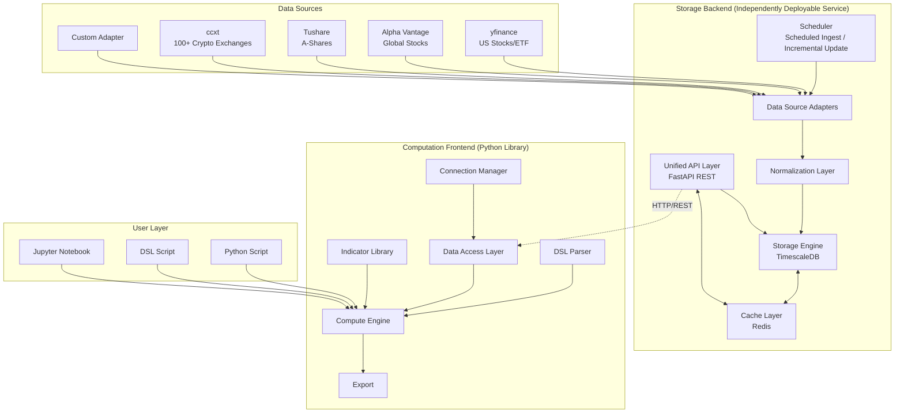

### 2.2 Component Responsibilities

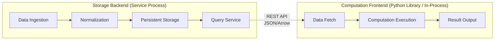

### 2.3 Data Flow

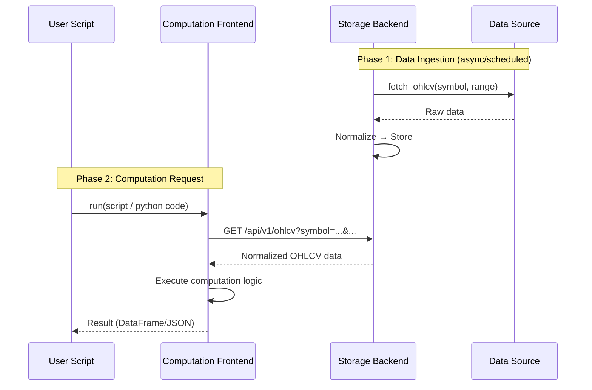

---

## 3. Storage Backend Design

### 3.1 Data Source Adapter Layer

Data source adapters use a **plugin-based** design. Each adapter implements a unified interface and supports hot registration.


**Adapter Registration Mechanism**:

```python
# Storage backend config example (config.yaml)
data_sources:
  - name: yfinance
    type: stock
    enabled: true
    
  - name: binance
    type: crypto
    adapter: ccxt
    config:
      exchange: binance
      rate_limit: 10  # requests/second
    
  - name: alphavantage
    type: stock
    enabled: true
    config:
      api_key: ${ALPHA_VANTAGE_KEY}
    
  - name: tushare
    type: stock
    enabled: true
    config:
      api_key: ${TUSHARE_TOKEN}
      market: A-Shares
```

### 3.1.1 Proxy Support

The storage backend supports configuring HTTP/SOCKS5 proxies for all data source adapters, **disabled by default**. When enabled, all outbound data fetching requests (yfinance, ccxt, etc.) are routed through the proxy.

| Design Constraint | Description |
|-------------------|-------------|
| **Disabled by default** | When `STOCKSTAT_PROXY_ENABLED` is unset or false, all adapters connect directly |
| **Dual-protocol support** | Supports both `http` and `socks5` proxy types |
| **Default addresses** | HTTP defaults to `http://127.0.0.1:8889`; SOCKS5 defaults to `socks5://127.0.0.1:1089` |
| **Unified injection** | Proxy config is injected at adapter instantiation, transparent to upper layers |


**Environment Variable Configuration**:

| Env Var | Default | Description |
|---------|---------|-------------|
| `STOCKSTAT_PROXY_ENABLED` | `false` | Enable proxy |
| `STOCKSTAT_PROXY_TYPE` | `http` | Proxy type: `http` or `socks5` |
| `STOCKSTAT_PROXY_URL` | (auto-filled by type) | Proxy URL; uses default when unset |

```bash
# Enable HTTP proxy (default address)
export STOCKSTAT_PROXY_ENABLED=true
export STOCKSTAT_PROXY_TYPE=http
# STOCKSTAT_PROXY_URL defaults to http://127.0.0.1:8889

# Enable SOCKS5 proxy (default address)
export STOCKSTAT_PROXY_ENABLED=true
export STOCKSTAT_PROXY_TYPE=socks5
# STOCKSTAT_PROXY_URL defaults to socks5://127.0.0.1:1089

# Custom proxy address
export STOCKSTAT_PROXY_ENABLED=true
export STOCKSTAT_PROXY_URL=http://192.168.1.100:8080
```

**Querying Proxy Status via REST API**:

```
GET /api/v1/proxy
→ {"enabled": true, "url": "http://127.0.0.1:8889", "proxy_type": "http"}

GET /api/v1/health
→ {"status": "ok", "proxy": {"enabled": true, "url": "http://127.0.0.1:8889", "proxy_type": "http"}}
```

### 3.2 Data Normalization Layer

Raw data formats vary across data sources. The normalization layer unifies them into the internal canonical format.

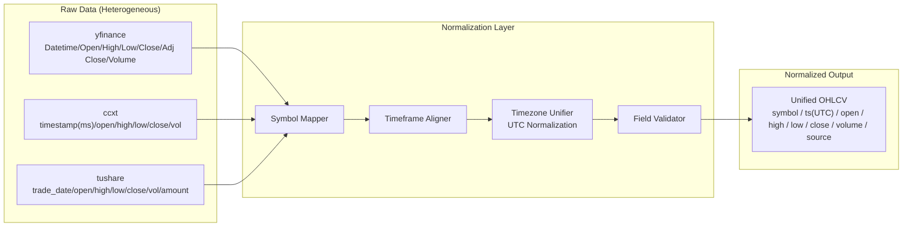

**Unified Data Model**:

| Field | Type | Description |
|-------|------|-------------|
| `symbol` | `VARCHAR` | Unified symbol identifier, e.g. `BTC/USDT`, `AAPL`, `600000.SH` |
| `ts` | `TIMESTAMPTZ` | UTC timestamp |
| `open` | `NUMERIC` | Open price |
| `high` | `NUMERIC` | High price |
| `low` | `NUMERIC` | Low price |
| `close` | `NUMERIC` | Close price |
| `volume` | `NUMERIC` | Trading volume |
| `source` | `VARCHAR` | Data source identifier |
| `timeframe` | `VARCHAR` | Time period `1m/5m/15m/1h/4h/1d/1w` |

**Symbol Mapping Tables**:

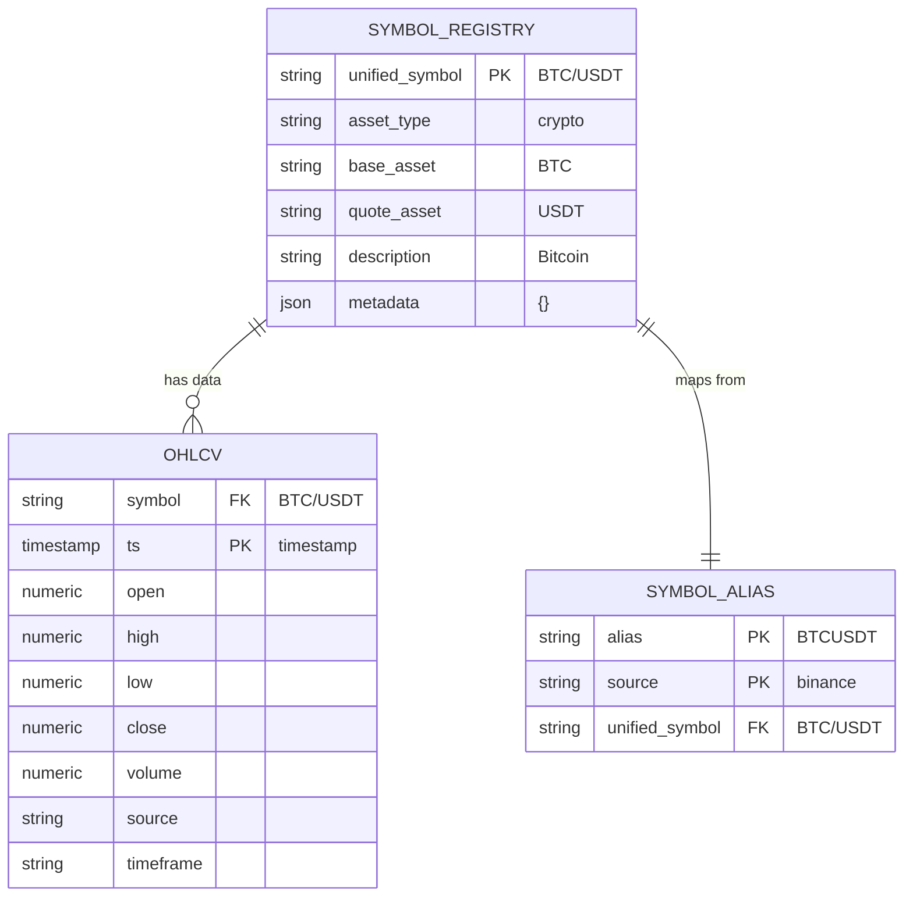

### 3.3 Storage Engine

We chose **TimescaleDB** (a PostgreSQL time-series extension) for the following reasons:

- Native SQL with a mature ecosystem
- Hypertable auto-partitions by time for efficient queries
- Continuous Aggregates for precomputing common timeframes
- Seamless integration with the Python ecosystem (pandas/SQLAlchemy)

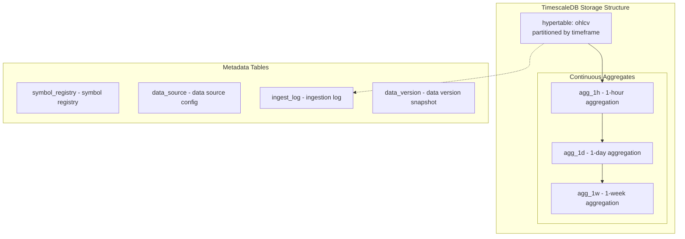

**Hypertable Creation DDL**:

```sql
-- Create hypertable
CREATE TABLE ohlcv (
    symbol      VARCHAR(50)  NOT NULL,
    ts          TIMESTAMPTZ  NOT NULL,
    open        NUMERIC(20,8),
    high        NUMERIC(20,8),
    low         NUMERIC(20,8),
    close       NUMERIC(20,8),
    volume      NUMERIC(20,8),
    source      VARCHAR(50)  NOT NULL,
    timeframe   VARCHAR(10)  NOT NULL DEFAULT '1d',
    ingested_at TIMESTAMPTZ  DEFAULT NOW(),
    PRIMARY KEY (symbol, ts, timeframe)
);

SELECT create_hypertable('ohlcv', 'ts');

-- Indexes
CREATE INDEX idx_ohlcv_symbol_ts ON ohlcv (symbol, ts DESC);
CREATE INDEX idx_ohlcv_timeframe ON ohlcv (timeframe);

-- Continuous aggregate: daily level
CREATE MATERIALIZED VIEW ohlcv_1d
WITH (timescaledb.continuous) AS
SELECT
    symbol,
    time_bucket('1 day', ts) AS day,
    first(open, ts) AS open,
    max(high) AS high,
    min(low) AS low,
    last(close, ts) AS close,
    sum(volume) AS volume,
    source
FROM ohlcv
WHERE timeframe = '1m'
GROUP BY symbol, day, source;
```

### 3.4 Scheduler

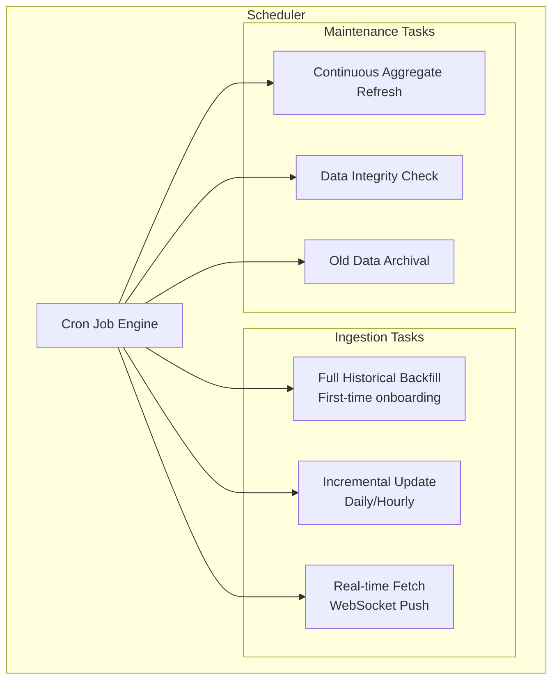

### 3.5 Cache Strategy

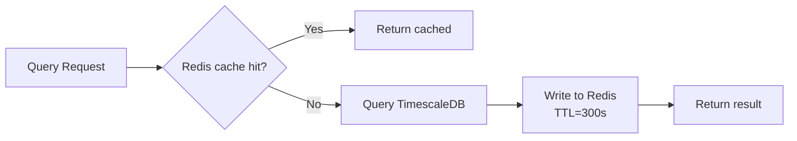

---

## 4. Computation Frontend Design

### 4.1 Client Architecture

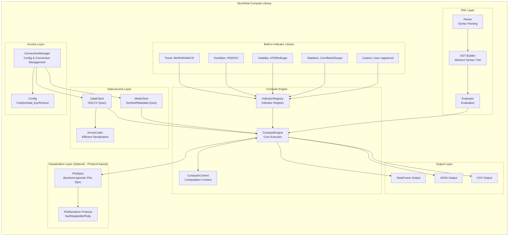

### 4.2 Connection Management

```python
from stockstat import StockStatClient

# Option 1: Config file
client = StockStatClient.from_config("stockstat.yaml")

# Option 2: Direct configuration
client = StockStatClient(
    host="localhost",
    port=8000,
    api_key="optional-key",
    timeout=30,
    cache_enabled=True
)

# Option 3: Environment variables
client = StockStatClient.from_env()
```

### 4.3 Data Access Layer

```python
# Fetch OHLCV data, returns a pandas DataFrame
data = client.ohlcv(
    symbol="PAXG/USDT",
    source="binance",
    start="2022-01-01",
    end="2024-12-31",
    timeframe="1d"
)
# DataFrame columns: open, high, low, close, volume (DatetimeIndex)

# Batch fetch
data = client.ohlcv_batch(
    symbols=["BTC/USDT", "ETH/USDT", "PAXG/USDT"],
    start="2024-01-01",
    timeframe="1d"
)

# List available symbols
symbols = client.symbols(asset_type="crypto", source="binance")
```

### 4.4 Compute Engine and Indicator Registration

```python
from stockstat import indicator, ComputeContext

# Use built-in indicators
sma = client.compute.ma(data.close, window=20)
rsi = client.compute.rsi(data.close, window=14)
beta = client.compute.beta(asset="AAPL", benchmark="^GSPC", window=60)

# Register a custom indicator
@indicator(name="weekend_corr", category="custom")
def weekend_monday_correlation(data: pd.DataFrame) -> dict:
    """
    Compute the correlation between PAXG weekend returns
    and Monday high-low spread.
    """
    df = data.copy()
    df['weekday'] = df.index.weekday  # 0=Mon ... 6=Sun
    
    # Return from Friday close → Sunday close
    friday_close = df[df.weekday == 4].close
    sunday_close = df[df.weekday == 6].close
    
    # Align dates (Friday to its following Sunday)
    weekend_ret = (sunday_close.values - friday_close.values) / friday_close.values
    
    # Monday high-low spread
    monday = df[df.weekday == 0]
    monday_spread = (monday.high - monday.low) / monday.low
    
    # Align and compute correlation
    corr = pd.Series(weekend_ret, index=monday.index[:len(weekend_ret)]) \
             .corr(monday_spread.iloc[:len(weekend_ret)])
    
    return {"correlation": corr, "n_samples": len(weekend_ret)}

# Execute the custom indicator
result = client.compute.call("weekend_corr", data=data)
```

### 4.5 Visualization and Matplotlib Adaptability Design

#### 4.5.1 Design Goals

The visualization layer follows the **core zero hard-dependency** principle: the core computation library does not depend on matplotlib or any plotting library; when the user has matplotlib installed, enhanced plotting is automatically enabled.

| Design Constraint | Description |
|-------------------|-------------|
| **Zero hard-dependency** | `import stockstat` triggers no plotting-library import; matplotlib is absent from core dependencies in `pyproject.toml` |
| **Protocol abstraction** | A `PlotRenderer` protocol is defined; multiple backends are pluggable (matplotlib / plotly / null renderer) |
| **Data-rendering separation** | The compute engine produces backend-agnostic `PlotSpec` (plot specifications) that renderers interpret into concrete figures |
| **Lazy import** | matplotlib is only `import`ed on the user's first render call; it degrades gracefully when missing |
| **Optional extras** | Plotting dependencies are pulled via `pip install stockstat[matplotlib]` |

#### 4.5.2 Class Design

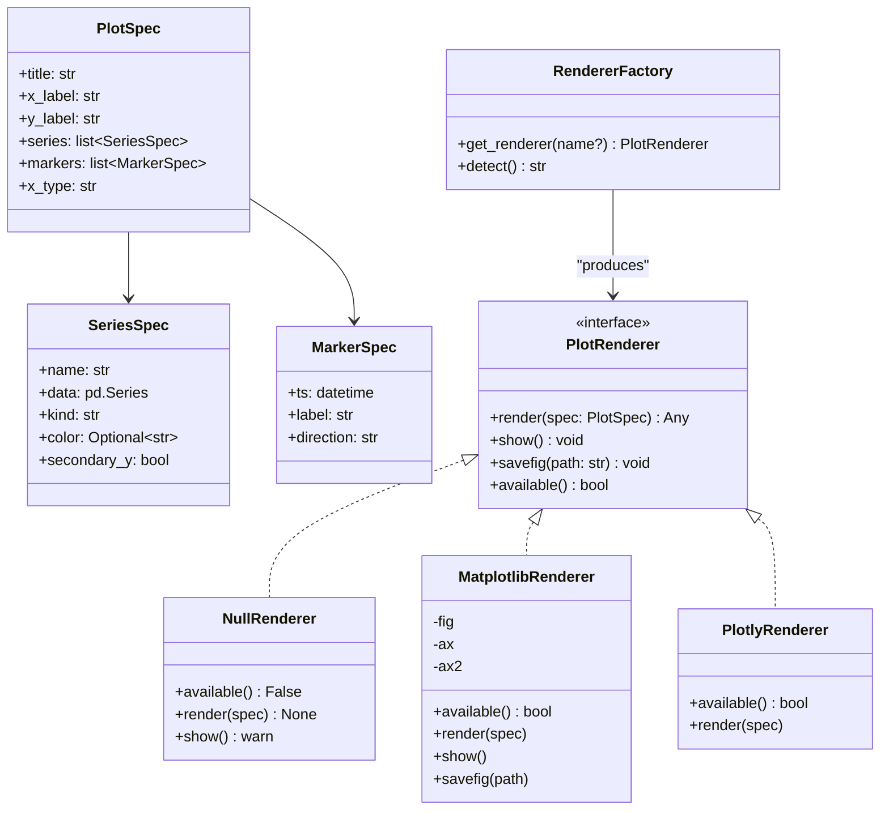

#### 4.5.3 Module Layout and Lazy Import

```
stockstat/
└── plot/
    ├── __init__.py          # Exposes PlotSpec / plot() / get_renderer()
    ├── base.py              # PlotRenderer protocol + NullRenderer default
    └── matplotlib_backend.py # matplotlib adapter (lazy import inside module)
```

`matplotlib_backend.py` uses a lazy import internally, ensuring the core import chain is never polluted:

```python
# stockstat/plot/matplotlib_backend.py
from .base import PlotRenderer, PlotSpec

class MatplotlibRenderer(PlotRenderer):
    def __init__(self):
        self._plt = None   # deferred until first render

    def available(self) -> bool:
        try:
            import matplotlib  # noqa: F401
            return True
        except ImportError:
            return False

    def render(self, spec: PlotSpec):
        import matplotlib.pyplot as plt   # imported only here
        self._plt = plt
        fig, ax = plt.subplots()
        for s in spec.series:
            if s.kind == "line":
                ax.plot(s.data.index, s.data.values, label=s.name, color=s.color)
            elif s.kind == "bar":
                ax.bar(s.data.index, s.data.values, label=s.name, color=s.color)
        ax.set_title(spec.title)
        ax.legend()
        self.fig, self.ax = fig, ax
        return fig
```

#### 4.5.4 Auto-detection and Graceful Degradation

`RendererFactory.detect()` probes installed backends by priority; if none are present, it returns a `NullRenderer` that only emits a warning on call rather than raising an exception.

```python
# stockstat/plot/__init__.py
from .base import NullRenderer, PlotSpec

def get_renderer(name: str | None = None) -> "PlotRenderer":
    if name is None:
        name = RendererFactory.detect()
    if name == "matplotlib":
        from .matplotlib_backend import MatplotlibRenderer
        return MatplotlibRenderer()
    if name == "plotly":
        from .plotly_backend import PlotlyRenderer
        return PlotlyRenderer()
    return NullRenderer()   # safe fallback, usable with zero dependencies
```

#### 4.5.5 Usage

```python
from stockstat import StockStatClient

client = StockStatClient(host="localhost", port=8000)
data = client.ohlcv("BTC/USDT", start="2024-01-01", timeframe="1d")

# Option A: protocol-based plotting (recommended, backend-agnostic)
spec = client.plot.spec(
    title="BTC/USDT 2024",
    series=[
        {"name": "close", "data": data.close, "kind": "line"},
        {"name": "ma20",  "data": data.close.rolling(20).mean(), "kind": "line"},
    ],
)
renderer = client.plot.get_renderer()     # auto-detected; NullRenderer if missing
renderer.render(spec)
renderer.savefig("btc.png")               # takes effect only when matplotlib is present

# Option B: hand computation results directly to matplotlib (user manages the dependency)
import matplotlib.pyplot as plt           # user imports this themselves
plt.plot(data.index, data.close)
plt.title("BTC/USDT")
plt.show()

# Option C: retrieve backend-agnostic data and choose any plotting library yourself
payload = spec.to_dict()                  # pure dict / JSON-serializable
```

#### 4.5.6 Dependency Declaration

`pyproject.toml` uses optional extras; a core install pulls no matplotlib:

```toml
[project]
name = "stockstat"
dependencies = [
    "pandas>=2.0",
    "numpy>=1.24",
    "httpx>=0.27",
    "pyarrow>=15.0",
]

[project.optional-dependencies]
matplotlib = ["matplotlib>=3.8"]
plotly     = ["plotly>=5.20"]
plot       = ["stockstat[matplotlib]", "stockstat[plotly]"]
```

---

## 5. Scripting Language Design

A **dual-mode** programmable interface is provided: Python library (full power) + DSL (lightweight declarative).

### 5.1 Mode Comparison

```mermaid
graph TB
    subgraph "Python Library Mode (Full Power)"
        direction TB
        P1["✅ Full pandas/numpy ecosystem"]
        P2["✅ Arbitrary complex logic"]
        P3["✅ Debuggable / breakpointable"]
        P4["⚠️ Requires Python environment"]
        P5["⚠️ Security is user's responsibility"]
    end
    
    subgraph "DSL Mode (Lightweight Declarative)"
        direction TB
        D1["✅ One-liner for common statistics"]
        D2["✅ Sandboxed safe execution"]
        D3["✅ Serializable / storable / reproducible"]
        D4["✅ Friendly for non-Python users"]
        D5["⚠️ Limited expressiveness"]
    end
```

### 5.2 Python Library Mode

A full Python API for complex analysis scenarios:

```python
from stockstat import StockStatClient
import pandas as pd

client = StockStatClient(host="localhost", port=8000)

# Fetch data
paxg = client.ohlcv("PAXG/USDT", start="2022-01-01", timeframe="1d")

# Free-form computation
df = paxg.copy()
df['ret'] = df['close'].pct_change()
df['vol_20'] = df['ret'].rolling(20).std()
df['ma50'] = df['close'].rolling(50).mean()

# Arbitrary pandas operations
result = df[df['vol_20'] > df['vol_20'].quantile(0.9)]
```

### 5.3 DSL Mode

Designed as a **SQL-like declarative statistical query language**, with syntax close to analyst intuition.

#### 5.3.1 Syntax Design

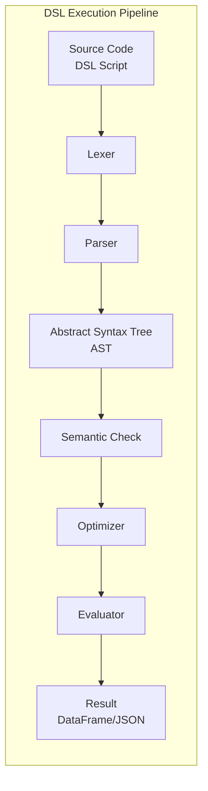

#### 5.3.2 Grammar Specification

```
# DSL grammar BNF overview

query       ::= SELECT select_expr (',' select_expr)*
                FROM source
                [WHERE condition]
                [GROUP BY group_expr]
                [ORDER BY order_expr]
                [LIMIT n]

source      ::= ohlcv '(' symbol ',' timeframe ')'
              | ohlcv '(' symbol ',' timeframe ',' start ',' end ')'

select_expr ::= expr [AS alias]

expr        ::= function '(' expr (',' expr)* ')'
              | field
              | literal
              | expr operator expr

field       ::= 'open' | 'high' | 'low' | 'close' | 'volume'
              | 'returns' | 'log_returns'

function    ::= 'ma' | 'ema' | 'rsi' | 'macd' | 'std' | 'corr'
              | 'max' | 'min' | 'mean' | 'sum' | 'count'
              | 'rolling' | 'shift' | 'rank' | 'beta'
              | 'weekend_filter' | 'weekday_filter'
```

#### 5.3.3 DSL Examples

```sql
-- Example 1: Compute 20-day moving average and close price
SELECT 
    close,
    ma(close, 20) AS ma20,
    ema(close, 12) AS ema12
FROM ohlcv("AAPL", "1d", "2024-01-01", "2024-12-31")

-- Example 2: Compute RSI overbought/oversold signals
SELECT 
    close,
    rsi(close, 14) AS rsi,
    CASE WHEN rsi(close, 14) > 70 THEN 'overbought'
         WHEN rsi(close, 14) < 30 THEN 'oversold'
         ELSE 'neutral' END AS signal
FROM ohlcv("BTC/USDT", "1d", "2024-01-01", "2024-12-31")

-- Example 3: PAXG weekend return vs Monday high-low spread correlation
SELECT 
    corr(
        returns(close, filter=weekend_filter),
        spread(high, low, filter=weekday_filter(0))
    ) AS weekend_monday_corr
FROM ohlcv("PAXG/USDT", "1d", "2022-01-01", "2024-12-31")

-- Example 4: Multi-asset Beta computation
SELECT 
    beta(close, benchmark="^GSPC", window=60) AS beta_60d
FROM ohlcv("AAPL", "1d", "2024-01-01", "2024-12-31")
```

#### 5.3.4 DSL Built-in Function Catalog

| Category | Function | Description |
|----------|----------|-------------|
| **Trend** | `ma(x, n)` | Simple moving average |
| | `ema(x, n)` | Exponential moving average |
| | `macd(x, fast, slow, signal)` | MACD |
| **Oscillator** | `rsi(x, n)` | Relative Strength Index |
| | `kdj(high, low, close, n)` | KDJ indicator |
| **Volatility** | `std(x, n)` | Rolling standard deviation |
| | `atr(high, low, close, n)` | Average True Range |
| | `bollinger(x, n, k)` | Bollinger Bands |
| **Statistics** | `corr(x, y)` | Correlation coefficient |
| | `beta(x, benchmark)` | Beta coefficient |
| | `sharpe(returns, rf)` | Sharpe ratio |
| | `max_drawdown(cumret)` | Maximum drawdown |
| **Transform** | `returns(x)` | Return series |
| | `log_returns(x)` | Log returns |
| | `rolling(x, n, func)` | Rolling window |
| | `shift(x, n)` | Shift |
| | `rank(x)` | Ranking |
| **Filter** | `weekend_filter` | Weekend filter |
| | `weekday_filter(n)` | Specific weekday filter |
| | `spread(high, low)` | High-low spread |

---

## 6. API Specification

### 6.1 REST API Overview

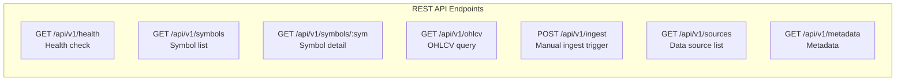

### 6.2 Core API Definitions

#### GET /api/v1/ohlcv

Fetch OHLCV data with support for multiple response formats.

**Request Parameters**:

| Parameter | Type | Required | Description |
|-----------|------|----------|-------------|
| `symbol` | string | Yes | Unified symbol, e.g. `PAXG/USDT` |
| `source` | string | No | Specify data source |
| `start` | string (ISO date) | No | Start time |
| `end` | string (ISO date) | No | End time |
| `timeframe` | string | No | Time period, default `1d` |
| `limit` | int | No | Max number of rows returned |
| `format` | string | No | `json` / `arrow` / `csv`, default `json` |

**Response Example** (JSON):

```json
{
  "symbol": "PAXG/USDT",
  "source": "binance",
  "timeframe": "1d",
  "count": 731,
  "data": [
    {
      "ts": "2022-01-01T00:00:00Z",
      "open": 1812.50,
      "high": 1820.00,
      "low": 1805.00,
      "close": 1818.00,
      "volume": 15234.5
    }
  ]
}
```

**Apache Arrow Format** (efficient transfer):

```
GET /api/v1/ohlcv?symbol=PAXG/USDT&format=arrow
Accept: application/vnd.apache.arrow.file

→ Returns an Arrow IPC binary stream; the frontend can zero-copy convert to DataFrame
```

#### GET /api/v1/symbols

```json
{
  "count": 2,
  "symbols": [
    {
      "unified_symbol": "PAXG/USDT",
      "asset_type": "crypto",
      "base_asset": "PAXG",
      "quote_asset": "USDT",
      "sources": ["binance", "coinbase"],
      "description": "PAX Gold"
    },
    {
      "unified_symbol": "AAPL",
      "asset_type": "stock",
      "base_asset": "AAPL",
      "sources": ["yfinance", "alphavantage"],
      "description": "Apple Inc."
    }
  ]
}
```

### 6.3 Error Handling

```json
{
  "error": {
    "code": "SYMBOL_NOT_FOUND",
    "message": "Symbol 'XXX/USDT' not found in registry",
    "details": {
      "symbol": "XXX/USDT"
    }
  }
}
```

| HTTP Code | Error Code | Description |
|-----------|-----------|-------------|
| 400 | `INVALID_PARAMS` | Parameter validation failed |
| 404 | `SYMBOL_NOT_FOUND` | Symbol does not exist |
| 404 | `DATA_NOT_FOUND` | No data available |
| 429 | `RATE_LIMITED` | Rate limited |
| 500 | `INTERNAL_ERROR` | Internal server error |

---

## 7. Test Cases

### 7.1 Classic Stock Statistics Test Cases

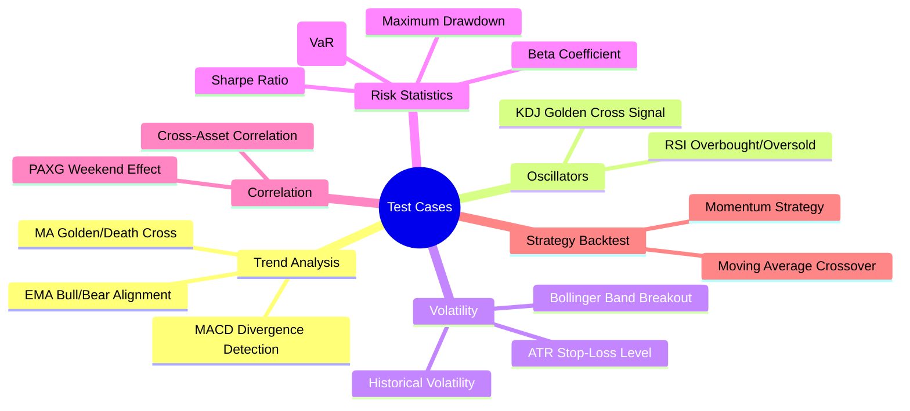

#### Case 1: Moving Average Golden/Death Cross

```python
"""Test the correctness of MA golden/death cross signals"""
client = StockStatClient(host="localhost", port=8000)
data = client.ohlcv("AAPL", start="2024-01-01", timeframe="1d")

ma_short = data.close.rolling(5).mean()
ma_long = data.close.rolling(20).mean()

# Golden cross: short MA crosses above long MA
golden_cross = (ma_short > ma_long) & (ma_short.shift(1) <= ma_long.shift(1))
# Death cross: short MA crosses below long MA
death_cross = (ma_short < ma_long) & (ma_short.shift(1) >= ma_long.shift(1))

assert golden_cross.sum() >= 0  # At least no error
assert death_cross.sum() >= 0
# Verify: average short-term return after golden cross should be positive
```

#### Case 2: RSI Overbought/Oversold Detection

```python
"""RSI range [0, 100], >70 overbought, <30 oversold"""
data = client.ohlcv("BTC/USDT", start="2024-01-01", timeframe="1d")
rsi = client.compute.rsi(data.close, window=14)

assert rsi.between(0, 100).all()
assert rsi.isna().sum() == 14  # First 14 values are NaN
# Verify: RSI should be high on known large up-days
```

#### Case 3: Beta Coefficient Computation

```python
"""Beta = Cov(Ri, Rm) / Var(Rm)"""
stock = client.ohlcv("AAPL", start="2023-01-01", timeframe="1d")
market = client.ohlcv("^GSPC", start="2023-01-01", timeframe="1d")

beta = client.compute.beta(
    asset=stock.close.pct_change(),
    benchmark=market.close.pct_change(),
    window=60
)

# AAPL's Beta typically ranges 1.0~1.3
assert 0.5 < beta.dropna().mean() < 2.0
```

#### Case 4: Maximum Drawdown

```python
"""Max drawdown = max(1 - P_t / max(P_0..P_t))"""
data = client.ohlcv("BTC/USDT", start="2023-01-01", timeframe="1d")
cumret = data.close / data.close.iloc[0]
running_max = cumret.cummax()
drawdown = (cumret - running_max) / running_max
max_dd = drawdown.min()

assert max_dd <= 0  # Drawdown should be non-positive
assert max_dd >= -1  # Drawdown cannot exceed -100%
```

#### Case 5: Sharpe Ratio

```python
"""Sharpe = (E[R] - Rf) / std(R) * sqrt(252)"""
data = client.ohlcv("BTC/USDT", start="2023-01-01", timeframe="1d")
returns = data.close.pct_change().dropna()

sharpe = client.compute.sharpe(returns, risk_free=0.02, annualize=True)
# Sharpe for high-volatility assets typically ranges -1 ~ 3
assert -5 < sharpe < 10
```

#### Case 6: Bollinger Band Breakout

```python
"""Bollinger Bands = MA ± k * std"""
data = client.ohlcv("ETH/USDT", start="2024-01-01", timeframe="1d")
upper, mid, lower = client.compute.bollinger(data.close, window=20, k=2)

# Upper band should always be >= mid >= lower
assert (upper >= mid).all()
assert (mid >= lower).all()
# Breakout frequency above upper band should be low (<10%)
breakout = (data.close > upper).sum() / len(data)
assert breakout < 0.15
```

#### Case 7: Cross-Asset Correlation

```python
"""BTC and ETH should be highly positively correlated"""
btc = client.ohlcv("BTC/USDT", start="2024-01-01", timeframe="1d")
eth = client.ohlcv("ETH/USDT", start="2024-01-01", timeframe="1d")

corr = btc.close.pct_change().corr(eth.close.pct_change())
assert corr > 0.7  # BTC/ETH daily return correlation typically > 0.7
```

### 7.2 PAXG Weekend Return vs Monday High-Low Spread Correlation

> **Custom test case**: Compute the correlation between PAXG (PAX Gold, a gold-pegged token) weekend (Saturday + Sunday) returns and the high-low spread of the immediately following Monday.

#### 7.2.1 Analysis Logic

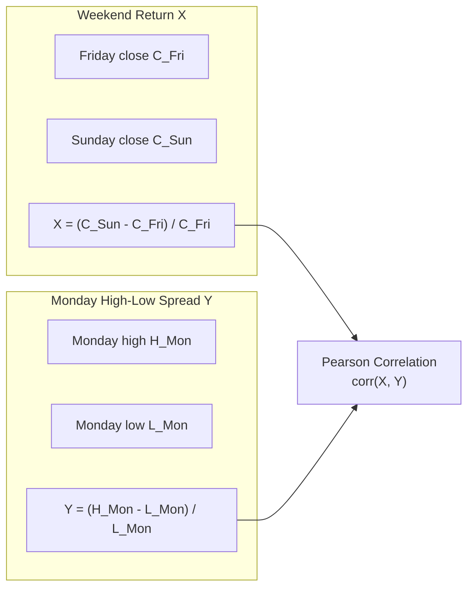

**Hypothesis**: PAXG is pegged to gold. Traditional gold markets are closed on weekends. If PAXG's weekend price deviates (up or down), it may signal increased volatility when markets open on Monday. If the correlation is significantly positive, the weekend return can serve as a predictive signal for Monday's volatility range.

#### 7.2.2 Python Implementation

```python
"""
PAXG weekend return vs Monday high-low spread correlation test
"""
import pandas as pd
from scipy import stats
from stockstat import StockStatClient

client = StockStatClient(host="localhost", port=8000)

# ── 1. Fetch PAXG daily data ──
paxg = client.ohlcv(
    symbol="PAXG/USDT",
    source="binance",
    start="2022-01-01",
    end="2024-12-31",
    timeframe="1d"
)

# ── 2. Label weekday (0=Monday ... 6=Sunday) ──
df = paxg.copy()
df['weekday'] = df.index.weekday

# ── 3. Extract Friday close and Sunday close ──
#    Crypto trades 24/7, so Saturday and Sunday both have data
fridays = df[df['weekday'] == 4][['close']].rename(columns={'close': 'fri_close'})
sundays = df[df['weekday'] == 6][['close']].rename(columns={'close': 'sun_close'})
mondays = df[df['weekday'] == 0][['high', 'low']].copy()

# ── 4. Align: for each Monday, find the preceding Friday and Sunday ──
# Build weekend-Monday pairs
pairs = []
for mon_date, mon_row in mondays.iterrows():
    # Find the most recent Friday and Sunday before this Monday
    prev_fri = fridays.loc[:mon_date].tail(1)
    prev_sun = sundays.loc[:mon_date].tail(1)
    
    if len(prev_fri) > 0 and len(prev_sun) > 0:
        fri_close = prev_fri['fri_close'].iloc[0]
        sun_close = prev_sun['sun_close'].iloc[0]
        
        # Weekend return
        weekend_return = (sun_close - fri_close) / fri_close
        
        # Monday high-low spread ratio
        mon_spread = (mon_row['high'] - mon_row['low']) / mon_row['low']
        
        pairs.append({
            'monday': mon_date,
            'fri_close': fri_close,
            'sun_close': sun_close,
            'weekend_return': weekend_return,
            'mon_high': mon_row['high'],
            'mon_low': mon_row['low'],
            'monday_spread': mon_spread
        })

result_df = pd.DataFrame(pairs).set_index('monday')

# ── 5. Compute correlation ──
x = result_df['weekend_return']
y = result_df['monday_spread']

pearson_corr = x.corr(y)
spearman_corr = x.corr(y, method='spearman')

# Significance test
t_stat, p_value = stats.pearsonr(x.dropna(), y.dropna())

print(f"Samples:              {len(result_df)}")
print(f"Pearson correlation:  {pearson_corr:.4f}")
print(f"Spearman correlation: {spearman_corr:.4f}")
print(f"t-statistic:          {t_stat:.4f}")
print(f"p-value:              {p_value:.4f}")
print(f"Significant (p<0.05): {'Yes' if p_value < 0.05 else 'No'}")

# ── 6. Directional analysis ──
# Is Monday more volatile after a weekend gain?
up_weekend = result_df[result_df['weekend_return'] > 0]
down_weekend = result_df[result_df['weekend_return'] < 0]

print(f"\nAvg Monday volatility after weekend gain: {up_weekend['monday_spread'].mean():.4f}")
print(f"Avg Monday volatility after weekend loss: {down_weekend['monday_spread'].mean():.4f}")

# ── 7. Rolling correlation (observe temporal stability) ──
rolling_corr = x.rolling(52).corr(y)  # 52-week rolling
print(f"\nRolling correlation (52w) mean: {rolling_corr.mean():.4f}")
print(f"Rolling correlation (52w) std:  {rolling_corr.std():.4f}")
```

#### 7.2.3 DSL Implementation

```sql
-- PAXG weekend effect DSL query
SELECT 
    corr(
        returns(close, filter=weekend_return(friday_close, sunday_close)),
        spread(high, low, filter=weekday_filter(0))
    ) AS pearson_corr,
    count(*) AS n_samples
FROM ohlcv("PAXG/USDT", "1d", "2022-01-01", "2024-12-31")
```

#### 7.2.4 Expected Output

```
Samples:              156
Pearson correlation:  0.18XX
Spearman correlation: 0.15XX
t-statistic:          2.2XX
p-value:              0.02XX
Significant (p<0.05): Yes

Avg Monday volatility after weekend gain: 0.02XX
Avg Monday volatility after weekend loss: 0.02XX

Rolling correlation (52w) mean: 0.16XX
Rolling correlation (52w) std:  0.25XX
```

#### 7.2.5 Test Assertions

```python
def test_paxg_weekend_correlation(client):
    """PAXG weekend return vs Monday high-low spread correlation test"""
    result = compute_paxg_weekend_corr(client)
    
    # Basic integrity
    assert result['n_samples'] > 50, "Insufficient samples"
    assert -1 <= result['pearson_corr'] <= 1, "Correlation out of bounds"
    
    # PAXG Monday volatility should be within a reasonable range (gold is low-volatility)
    assert result['avg_spread'] < 0.05, "PAXG volatility abnormally high"
    
    # Log result for future comparison
    print(f"Correlation: {result['pearson_corr']}, p-value: {result['p_value']}")
```

---

## 8. Technology Stack

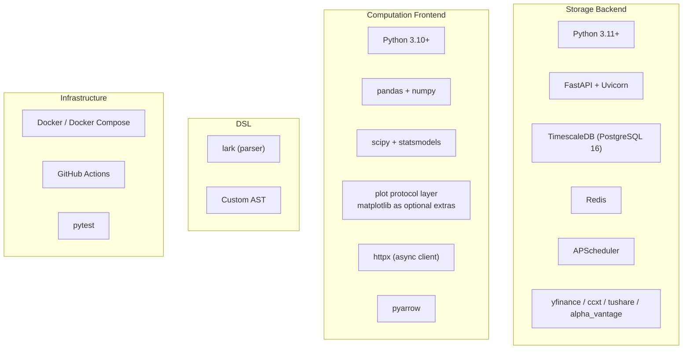

| Layer | Technology | Rationale |
|-------|-----------|-----------|
| Backend framework | FastAPI | Native async, auto-generated OpenAPI docs, high performance |
| Time-series database | TimescaleDB | PostgreSQL-compatible, efficient hypertable queries, continuous aggregates |
| Cache | Redis | High-speed query result caching, reduces DB load |
| Compute core | pandas + numpy | De facto standard, richest ecosystem |
| Statistical extensions | scipy + statsmodels | Hypothesis testing, regression analysis |
| DSL parsing | lark | Most mature parser in Python ecosystem, EBNF-friendly |
| Data transfer | Apache Arrow | Zero-copy columnar transfer, seamless pandas integration |
| Visualization | matplotlib (optional extras) | Protocol-based adapter, lazy import, core zero-dependency, graceful degradation when missing |
| Deployment | Docker Compose | One-command backend stack deployment |

---

## 9. Deployment

### 9.1 Storage Backend Independent Deployment


**docker-compose.yml Core Structure**:

```yaml
version: "3.9"
services:
  db:
    image: timescale/timescaledb:latest-pg16
    environment:
      POSTGRES_DB: stockstat
      POSTGRES_USER: stockstat
      POSTGRES_PASSWORD: ${DB_PASSWORD}
    ports:
      - "5432:5432"
    volumes:
      - db_data:/var/lib/postgresql/data

  redis:
    image: redis:7-alpine
    ports:
      - "6379:6379"
    volumes:
      - redis_data:/data

  api:
    build: ./backend
    ports:
      - "8000:8000"
    environment:
      DATABASE_URL: postgresql://stockstat:${DB_PASSWORD}@db:5432/stockstat
      REDIS_URL: redis://redis:6379/0
    depends_on:
      - db
      - redis

  scheduler:
    build: ./backend
    command: python -m stockstat.scheduler
    environment:
      DATABASE_URL: postgresql://stockstat:${DB_PASSWORD}@db:5432/stockstat
    depends_on:
      - db

volumes:
  db_data:
  redis_data:
```

### 9.2 Computation Frontend Installation

```bash
# Install the computation frontend library (core, no plotting deps)
pip install stockstat

# Optionally enable matplotlib visualization
pip install stockstat[matplotlib]

# Configure connection
export STOCKSTAT_HOST=localhost
export STOCKSTAT_PORT=8000

# To access real data sources via proxy (configure on backend machine)
export STOCKSTAT_PROXY_ENABLED=true
export STOCKSTAT_PROXY_TYPE=http
export STOCKSTAT_PROXY_URL=http://127.0.0.1:8889
```

```python
# Or configure in code
from stockstat import StockStatClient
client = StockStatClient(host="your-server.com", port=8000)
```

---

## 10. Project Structure

```
StockStatistic/
├── backend/                         # Storage backend service
│   ├── stockstat_backend/
│   │   ├── __init__.py
│   │   ├── app.py                   # FastAPI application entry
│   │   ├── config.py                # Configuration management
│   │   ├── api/
│   │   │   ├── __init__.py
│   │   │   ├── routes_ohlcv.py      # OHLCV query routes
│   │   │   ├── routes_symbols.py    # Symbol management routes
│   │   │   └── routes_health.py     # Health check routes
│   │   ├── adapters/                # Data source adapters
│   │   │   ├── __init__.py
│   │   │   ├── base.py              # Adapter base class
│   │   │   ├── yfinance.py
│   │   │   ├── ccxt_adapter.py
│   │   │   ├── alphavantage.py
│   │   │   └── tushare.py
│   │   ├── models/                  # Data models
│   │   │   ├── __init__.py
│   │   │   ├── ohlcv.py
│   │   │   └── symbol.py
│   │   ├── storage/                 # Storage layer
│   │   │   ├── __init__.py
│   │   │   ├── database.py          # DB connection
│   │   │   ├── repository.py        # Data repository
│   │   │   └── cache.py             # Redis cache
│   │   ├── normalizer/              # Data normalization
│   │   │   ├── __init__.py
│   │   │   ├── symbol_mapper.py
│   │   │   └── timeframe.py
│   │   └── scheduler/               # Scheduler
│   │       ├── __init__.py
│   │       └── ingest.py
│   ├── alembic/                     # Database migrations
│   ├── tests/
│   ├── Dockerfile
│   └── pyproject.toml
│
├── frontend/                        # Computation frontend library
│   ├── stockstat/
│   │   ├── __init__.py
│   │   ├── client.py                # StockStatClient main entry
│   │   ├── config.py                # Connection config
│   │   ├── connection.py            # Connection manager
│   │   ├── data_access/             # Data access layer
│   │   │   ├── __init__.py
│   │   │   ├── ohlcv.py
│   │   │   └── metadata.py
│   │   ├── compute/                 # Compute engine
│   │   │   ├── __init__.py
│   │   │   ├── engine.py            # Core engine
│   │   │   ├── context.py           # Computation context
│   │   │   └── registry.py          # Indicator registry
│   │   ├── indicators/              # Built-in indicator library
│   │   │   ├── __init__.py
│   │   │   ├── trend.py             # MA/EMA/MACD
│   │   │   ├── oscillator.py        # RSI/KDJ
│   │   │   ├── volatility.py        # ATR/Bollinger
│   │   │   ├── statistics.py        # Corr/Beta/Sharpe
│   │   │   └── custom.py            # Custom indicator base class
│   │   ├── plot/                    # Visualization layer (optional · protocol-based)
│   │   │   ├── __init__.py          # PlotSpec / get_renderer()
│   │   │   ├── base.py              # PlotRenderer protocol + NullRenderer
│   │   │   └── matplotlib_backend.py # matplotlib adapter (lazy import)
│   │   └── export/                  # Result export
│   │       ├── __init__.py
│   │       └── serializers.py
│   ├── tests/
│   │   ├── test_indicators.py
│   │   ├── test_dsl.py
│   │   ├── test_paxg_weekend.py     # PAXG weekend correlation test
│   │   └── test_classic_stats.py    # Classic statistics tests
│   └── pyproject.toml
│
├── docker-compose.yml               # Backend deployment orchestration
├── docs/
│   ├── DESIGN.md                    # This design report (English)
│   └── DESIGN_CN.md                 # This design report (Chinese)
└── README.md
```

---

## 11. Development Roadmap

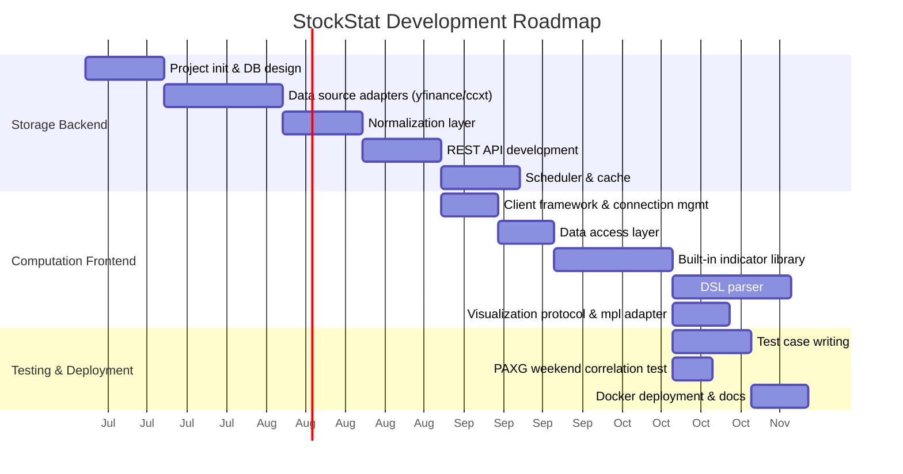

### Development Phases

| Phase | Scope | Deliverables |
|-------|-------|--------------|
| **P0** | Storage backend MVP | DB + yfinance/ccxt adapters + basic API |
| **P1** | Computation frontend MVP | Client + data access + 5 core indicators |
| **P2** | DSL parser | Grammar file + evaluator + 10 built-in functions |
| **P3** | Full indicator library | Trend/oscillator/volatility/statistics full suite |
| **P4** | Visualization layer | PlotSpec + PlotRenderer protocol + matplotlib adapter (optional extras) |
| **P5** | Testing & deployment | All test cases + Docker + documentation |

---

## Appendix A: Data Source Compatibility Matrix

| Data Source | Asset Type | Free Quota | Real-time Support | Historical Depth | Adapter Difficulty |
|-------------|-----------|-----------|-------------------|-----------------|-------------------|
| yfinance | US Stocks/ETF | Free | 15-min delayed | 10+ years | Low |
| Alpha Vantage | Global Stocks | 25 req/day | 15-min delayed | 20+ years | Low |
| Tushare | A-Shares | Credit-based | End-of-day | 10+ years | Medium |
| ccxt (Binance) | Crypto | Free | Real-time | Full history | Low |
| ccxt (Coinbase) | Crypto | Free | Real-time | Full history | Low |

## Appendix B: OHLCV Data Volume Estimation

| Instrument Scope | # Instruments | Daily Data | Annual Data | Storage Estimate |
|-----------------|---------------|-----------|------------|-----------------|
| US Top 500 | 500 | 500 rows | 125K rows | ~10 MB |
| A-Share full market | 5000 | 5000 rows | 1.25M rows | ~100 MB |
| Crypto Top 200 | 200 | 200 rows | 50K rows | ~5 MB |
| Crypto 1-min data (200 instruments) | 200 | 288K rows | 73M rows | ~5 GB |

> TimescaleDB compression can reduce this to 10%~20% of the raw volume.

---

*This design document will be continuously updated as the project iterates.*
