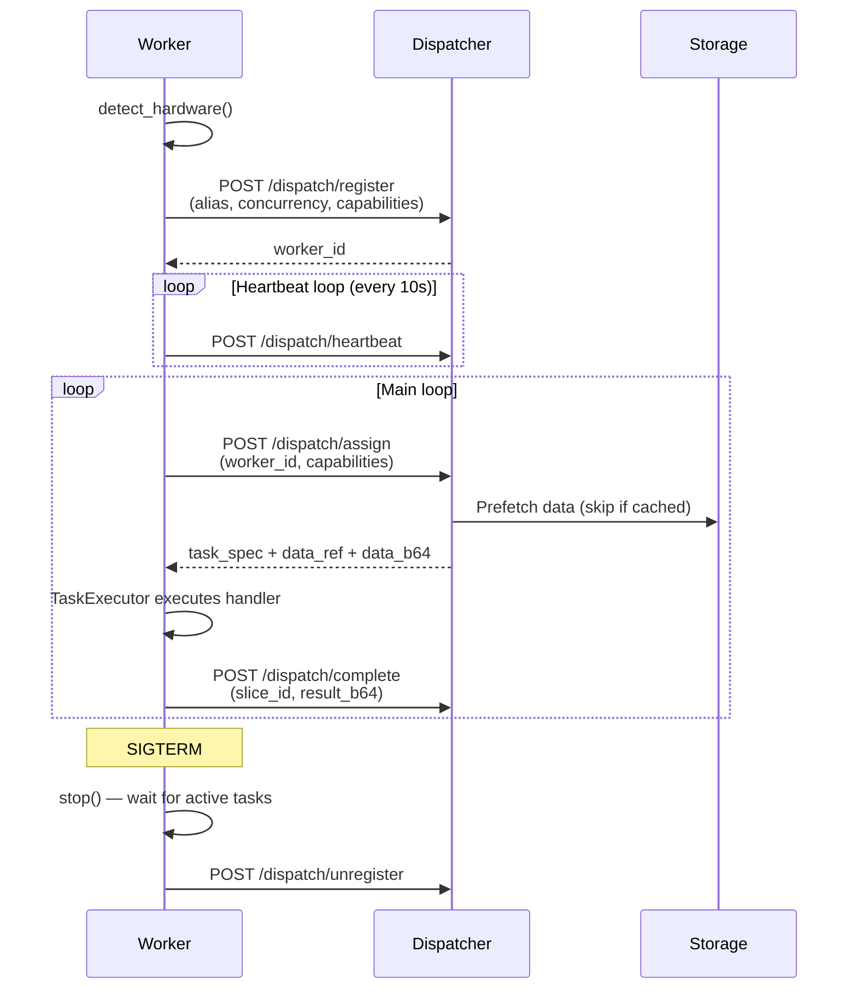
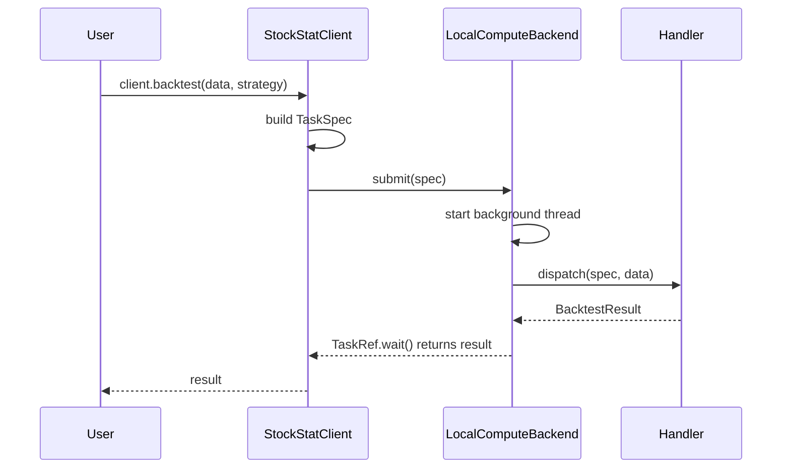
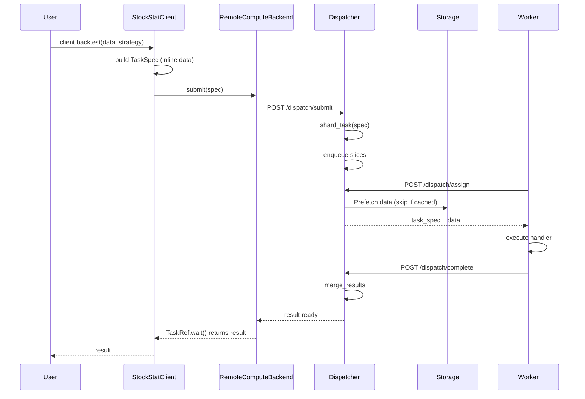
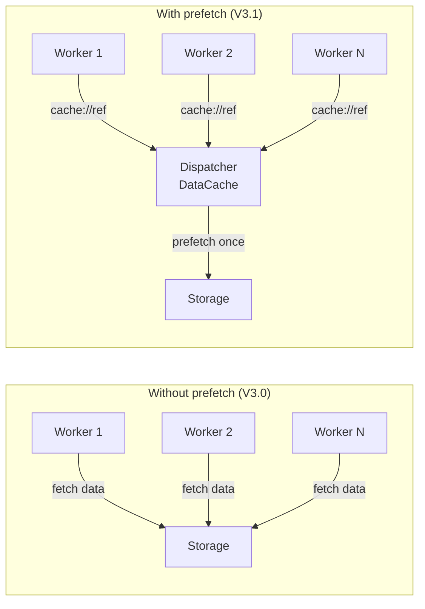
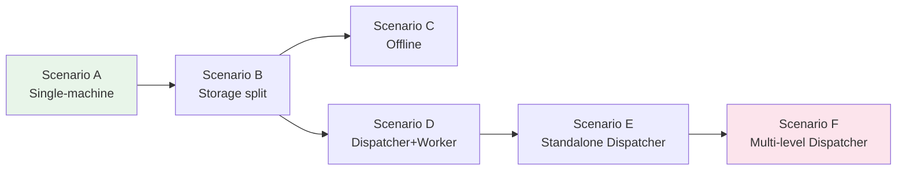

# StockStat V3.1 Architecture Design

> **Version**: v3.1 (complete rewrite)
> **Date**: 2026-07-26
> **Status**: Implemented (882 tests passed + 1 skipped)
> **Related**: [README.md](README.md) | [USAGE.md](docs/USAGE.md) | [V31design/](V31design/)

---

## Table of Contents

1. [Design Goals and Principles](#1-design-goals-and-principles)
2. [Five-Module Architecture Overview](#2-five-module-architecture-overview)
3. [Foundation Layer](#3-foundation-layer)
4. [Invocation — User Entry](#4-invocation--user-entry)
5. [Dispatcher](#5-dispatcher)
6. [Storage](#6-storage)
7. [Compute](#7-compute)
8. [Communication Protocol](#8-communication-protocol)
9. [38 Atomic Tasks](#9-38-atomic-tasks)
10. [Key Data Flows](#10-key-data-flows)
11. [Deployment Scenarios](#11-deployment-scenarios)
12. [Test System](#12-test-system)
13. [Capability Provenance Mapping (Legend)](#13-capability-provenance-mapping-legend)

---

## 1. Design Goals and Principles

### 1.1 Design Goals

The core goal of StockStat V3.1 is to distill the computational capabilities that recur in quantitative finance research into a **programmable, distributable capability substrate**. Researchers only need to declare "what data is needed, what computation to run, and how to dispatch it"; the platform routes the task specification to an appropriate compute node, handling data prefetch, sharding, merging, and fault tolerance along the way.

| Goal | Realization |
|------|-------------|
| Invocation—Dispatcher—{Storage, N×Compute} separable deployment | 5 independent module packages; any combination deployable; smooth evolution from single-machine to multi-level clusters |
| Full-pipeline quantitative research coverage | 38 task_types covering backtesting / statistics / signal / nonlinear / grey / ML / portfolio risk |
| Modular incremental implementation | Foundation protocol substrate + 4 business modules evolving independently without mutual intrusion |
| Smooth migration of legacy client code | Functional-equivalent migration; V2 API wrapped via `_compat.py`; legacy code requires zero changes |
| Zero-protocol-change extension | Adding a capability = adding a handler + registering it; protocol, transport, and dispatch layers unchanged |
| Single-machine and distributed API consistency | Same `StockStatClient` API; backend switch does not change calling code |

### 1.2 Design Principles

| Principle | Description |
|-----------|-------------|
| **Protocol-first** | All cross-process communication goes through the Foundation protocol layer; business modules never assemble raw bytes directly |
| **Three-layer separation** | Codec / Message / Transport are independently replaceable; orthogonal composition |
| **Module independence** | 5 independent packages; unidirectional dependency (business → Foundation) |
| **Compute–Invocation separation** | Invocation contains no compute logic; decoupled via `ComputeBackend` Protocol |
| **Data-path / control-path separation** | Dispatcher prefetches data once and caches it; Storage is idle during computation |
| **Atomic taskization** | 38 task_types; each handler is self-contained; new capabilities don't affect existing ones |
| **Protocol is business-agnostic** | The protocol only moves bytes; it doesn't care about task_type semantics; handlers own the semantics |
| **Graceful degradation** | Optional dependency missing → automatic fallback (e.g., PyWavelets → self-implemented Morlet) |

### 1.3 Key Differences from V3.0

V3.1 is a complete rewrite, not an incremental improvement over V3.0. The table below compares the two versions:

| Dimension | V3.0 | V3.1 |
|-----------|------|------|
| Rewrite scope | Core zero-intrusion | **Complete rewrite** (re-implemented from scratch) |
| Compatibility | Preserved v1.7/v2 behavior | **No backward compatibility**; functional-equivalent migration |
| BacktestEngine location | Inside frontend package | **Compute module** (re-implemented, event-driven) |
| Package structure | Two packages (frontend + backend) | **Five independent module packages** |
| task_type count | 6 | **38** |
| ComputeBackend | Compatibility layer (optional) | **The only path** (mandatory) |
| Dispatcher | Storage plugin (embedded) | **Independent package**, loosely coupled to Storage |
| Foundation | Embedded in frontend `_core` | **Independent package** `stockstat-foundation` |
| Data prefetch | None | **DataCache LRU prefetch**; Storage accessed only once |
| Task sharding | None | **4 strategies** (param/symbol/time/none) |

---

## 2. Five-Module Architecture Overview

V3.1 slices the system into "one protocol substrate + four business modules." Foundation is Layer 0 — it has zero business dependencies and only provides communication primitives and contracts. The four business modules each handle a class of responsibilities and interact through Foundation's Protocol contracts.


```mermaid
graph LR
    subgraph Found["Foundation protocol substrate (Layer 0)"]
        F1["Envelope / TaskSpec"]
        F2["7 codecs / 5 transports"]
        F3["7 Protocol contracts"]
        F4["13 exceptions / Config / Plugin"]
    end
    subgraph Inv["Invocation — user entry"]
        I1["StockStatClient"]
        I2["ComputeAPI"]
        I3["DSL / CLI / Viz"]
    end
    subgraph Disp["Dispatcher"]
        D1["TaskQueue / DataCache"]
        D2["WorkerRegistry"]
        D3["shard / merge"]
    end
    subgraph Stor["Storage"]
        S1["ORM / REST API"]
        S2["3 Adapters"]
        S3["Admin / Scheduler"]
    end
    subgraph Comp["Compute"]
        C1["Worker process"]
        C2["38 handlers"]
        C3["BacktestEngine"]
    end
    Inv -->|"ComputeBackend contract"| Comp
    Inv -->|"HTTP / StorageBackend contract"| Stor
    Disp -->|"HTTP"| Stor
    Comp -->|"HTTP"| Disp
    Found -.->|"contract binding"| Inv
    Found -.->|"contract binding"| Disp
    Found -.->|"contract binding"| Stor
    Found -.->|"contract binding"| Comp
```

### Module Responsibilities

| Module | Package | Responsibility | Does NOT contain |
|--------|---------|----------------|------------------|
| Foundation | `stockstat-foundation` | Protocol / transport / contracts / errors / config | Business logic |
| Invocation | `stockstat` | Client SDK / CLI / DSL / visualization | BacktestEngine / compute logic |
| Dispatcher | `stockstat-dispatcher` | Task scheduling / data prefetch / sharding / merging | Compute logic / data persistence |
| Storage | `stockstat-backend` | OHLCV storage / query / ingestion | Compute logic / task scheduling |
| Compute | `stockstat-compute` | Worker / 38 handlers / BacktestEngine | Task scheduling / data persistence |

### Module Boundary Iron Rules

Dependencies are strictly unidirectional. Violating any rule breaks module independence:

> - **Foundation has zero business dependencies**: does not import any business module (`stockstat` / `stockstat_compute` / `stockstat_backend` / `stockstat_dispatcher`).
> - **Four business modules must depend on Foundation**: interact through Protocol contracts; never access each other's internals directly.
> - **Invocation and Compute do not depend on each other**: decoupled via the `ComputeBackend` Protocol. Invocation only defines "what to do"; Compute only implements "how to do it."
> - **Dispatcher and Storage are loosely coupled**: Dispatcher accesses Storage via HTTP or the `StorageBackend` Protocol, not via Storage's ORM implementation.

---

## 3. Foundation Layer

Foundation is the protocol substrate for the entire platform. It contains no business logic — only the full set of primitives needed for cross-process communication: message envelopes, task specifications, codecs, transports, contracts, errors, and configuration.

### 3.1 Internal Structure

```
stockstat_foundation/
├── contracts/          # 7 Protocol contracts
│   ├── compute.py      # ComputeBackend / TaskRef / TaskInfo / TaskState / TaskPriority
│   ├── transport.py    # Transport Protocol
│   ├── storage.py      # StorageBackend Protocol
│   ├── cache.py        # Cache Protocol
│   ├── codec.py        # Codec Protocol
│   ├── plugin.py       # Plugin Protocol
│   ├── renderer.py     # Renderer Protocol
│   └── events.py       # Event / EventSubscriber
├── protocol/           # message layer
│   ├── envelope.py     # Envelope + Headers (JSON/Msgpack auto-detect)
│   ├── messages.py     # 28 message types + TYPE_TO_PATH
│   ├── task.py         # TaskSpec three-part (DataSpec + ComputeSpec + DispatchSpec)
│   └── retry.py        # RetryPolicy (exponential backoff)
├── codec/              # 7 codecs
│   ├── json_codec.py   # default encoding, human-readable
│   ├── arrow_codec.py  # columnar binary, suited for OHLCV
│   ├── parquet_codec.py# file-level columnar storage
│   ├── csv_codec.py    # tabular text
│   ├── cloudpickle_codec.py # Python object serialization (strategies / models)
│   ├── msgpack_codec.py# compact binary, high performance
│   └── raw_codec.py    # passthrough bytes
├── transport/          # 5 transports
│   ├── in_process.py   # InProcessTransport + make_pair (single-machine default)
│   ├── http.py         # HttpTransport (httpx, distributed default)
│   ├── shared_memory.py# SharedMemoryTransport (mmap zero-copy)
│   ├── redis.py        # RedisTransport (LPUSH/BRPOP, cross-process persistence)
│   └── tcp.py          # TcpTransport (length-prefixed skeleton)
├── errors.py           # 13 exception classes (AppError + 12 subclasses)
├── config.py           # Config + 18 env vars
├── logging.py          # trace_id propagation (contextvars)
├── plugin/             # PluginRegistry
└── utils/              # estimate_data_size / choose_data_dispatch / Timeout / now_iso
```

### 3.2 Envelope

All inter-node communication is wrapped in an `Envelope`. The Envelope carries the protocol identifier, message type, unique ID, reply address, headers, and payload:

```python
@dataclass
class Envelope:
    protocol: str = "stockstat-rpc"
    version: str = "1.0"
    type: str = ""                              # message type, e.g. "task.submit"
    id: str = field(default_factory=lambda: str(uuid.uuid4()))
    reply_to: Optional[str] = None              # target envelope ID for replies
    headers: Headers = field(default_factory=Headers)
    payload: Any = None
```

`Headers` carries transport metadata: `content_type` / `data_codec` / `strategy_codec` / `encoding` / `priority` / `timeout` / `trace_id` / `data_ref` / `retry_count` / `protocol_version` / `accepted_codecs` / `accepted_encodings`.

Encoding rules:
- JSON by default; msgpack optional (switch via `headers.encoding`).
- `bytes` payload is automatically base64-encoded and marked with `_payload_b64`.
- decode auto-detects: tries JSON first, falls back to msgpack on failure.

`Envelope.reply()` builds a reply envelope, automatically setting `reply_to` to the current envelope's ID and propagating `trace_id` and `protocol_version` for full-chain tracing.

### 3.3 TaskSpec Three-Part Spec

`TaskSpec` is the unified format for task specifications, composed of three parts — describing what data is needed, what computation to run, and how to dispatch:

```python
@dataclass
class TaskSpec:
    task_id: str
    data_spec: DataSpec           # what data is needed
    compute_spec: ComputeSpec     # what computation to run
    dispatch_spec: DispatchSpec   # how to dispatch
    trace_id: str = ""
    created_at: datetime = field(default_factory=datetime.utcnow)
    created_by: str = ""
```

| Part | Fields (selected) | Description |
|------|-------------------|-------------|
| `DataSpec` | symbols / timeframe / start / end / source | Describes data needs; `cache_key()` uses first 32 bytes of sha256 as cache key |
| `ComputeSpec` | task_type / strategy_ref / params / initial_cash / cost_model / param_grid / ... | Describes computation; `params` dict carries task_type-specific parameters |
| `DispatchSpec` | split_strategy / max_workers / priority / timeout / retry_count / preemptable | Describes dispatch strategy; `split_strategy` determines sharding |

`TaskSpec` provides `to_dict()` / `from_dict()` / `to_json()` / `from_json()` for full roundtrip, ensuring serialization consistency across process boundaries.

### 3.4 Codec Layer

7 codecs implement the unified `Codec` Protocol (`encode(data) -> bytes` / `decode(raw) -> data`):

| Codec | Use case | Dependency |
|-------|----------|------------|
| `JsonCodec` | Default encoding, human-readable, REST API | none |
| `ArrowCodec` | OHLCV columnar data, zero-copy | pyarrow |
| `ParquetCodec` | File-level columnar storage | pyarrow |
| `CsvCodec` | Tabular text export | pandas |
| `CloudpickleCodec` | Python objects (strategy functions / ML models) | cloudpickle |
| `MsgpackCodec` | Compact binary, high-performance messaging | msgpack |
| `RawCodec` | Passthrough bytes, no processing | none |

`get_codec(name)` and `get_codec_for_content_type(content_type)` provide factory methods.

### 3.5 Transport Layer

5 transports implement the unified `Transport` Protocol (`send(envelope)` / `receive()` / `close()`):

| Transport | Use case | Characteristics |
|-----------|----------|-----------------|
| `InProcessTransport` | Single-machine full-stack (Scenario A) | `queue.Queue` based; `make_pair()` returns sender/receiver pair |
| `HttpTransport` | Distributed default (Scenario D/E/F) | Based on httpx, REST-style |
| `SharedMemoryTransport` | Same-machine cross-process large files | mmap zero-copy |
| `RedisTransport` | Cross-process persistent queue | LPUSH/BRPOP, supports multiple consumers |
| `TcpTransport` | Custom protocol skeleton | length-prefixed framing |

`build_transport(kind, **kwargs)` provides a unified factory.

### 3.6 Error System

13 exception classes, all inheriting from `AppError`. Each exception carries a `code` / `message` / `context` / `recoverable` quadruple, transmissible across processes via `to_dict()` / `from_dict()`:

| Exception | code | recoverable | Trigger |
|-----------|------|-------------|---------|
| `AppError` | INTERNAL_ERROR | False | Base class |
| `TaskError` | TASK_FAILED | False | Task execution failed |
| `TaskNotReadyError` | TASK_NOT_READY | True | Result not ready |
| `TaskCancelledError` | TASK_CANCELLED | False | Task cancelled |
| `TaskTimeoutError` | TASK_TIMEOUT | True | Task timed out |
| `TaskNotFoundError` | TASK_NOT_FOUND | False | Task not found |
| `ProtocolMismatchError` | PROTOCOL_MISMATCH | False | Protocol version mismatch |
| `TransportError` | TRANSPORT_ERROR | True | Transport error |
| `DispatcherUnavailableError` | DISPATCHER_UNAVAILABLE | True | Dispatcher unreachable |
| `WorkerCapabilityError` | WORKER_CAPABILITY_INSUFFICIENT | True | Worker doesn't support this task_type |
| `StorageError` | STORAGE_ERROR | True | Storage error |
| `ComputeError` | COMPUTE_FAILED | False | Compute error |
| `ConfigError` | CONFIG_ERROR | False | Configuration error |

### 3.7 Config

The `Config` dataclass merges environment variables and config files (JSON / TOML), providing `from_env()` / `from_file()` / `copy(**overrides)` / `to_dict()` methods. 18 environment variables cover all config items — see [Usage Guide §20 Environment Variables](docs/USAGE.md#20-environment-variables).

### 3.8 PluginRegistry

`PluginRegistry` provides plugin registration and lookup, supporting extension points like Storage's Admin panel and Dispatcher plugins.

---

## 4. Invocation — User Entry

Invocation is the only module users face directly. It provides three entry points — Python SDK, CLI, and DSL — but contains no compute logic itself. All computation is delegated to `ComputeBackend`.

### 4.1 StockStatClient (Pure Caller)

The V3.1 Client **only calls** — it does not contain BacktestEngine. Its responsibilities are data access, compute submission, and result consumption:

```python
client = StockStatClient()
result = client.backtest(data, strategy)
# Internal: build TaskSpec → submit to ComputeBackend → wait → return
```

At construction, the Client selects a backend based on `Config.default_backend`:
- `local` → `LocalComputeBackend` (background thread, transparent sync)
- `remote` → `RemoteComputeBackend` (HTTP → Dispatcher)
- `auto` → `AutoComputeBackend` (routes by task type)

The Client provides three categories of methods:
- **Data access** (pass-through to `DataClient`): `ohlcv()` / `ingest()` / `list_symbols()`
- **Compute convenience methods**: `backtest()` / `grid_search()` / `batch_backtest()` / `run_dsl()`
- **Cluster info**: `cluster_info()`

### 4.2 ComputeAPI

`client.compute` returns a `ComputeAPI` instance, providing 40+ indicator convenience methods and advanced task submission:

```python
client.compute.ma(data.close, window=20)           # local immediate
client.compute.rsi(data.close, window=14)
client.compute.macd(data.close, fast=12, slow=26, signal=9)
client.compute.remote("grid_search", data=data)     # async submit, returns TaskRef
client.compute.cluster_info()                        # cluster topology
```

Under the local backend, `_dispatch_indicator` calls `ComputeEngine` directly (bypassing TaskSpec for performance). Under the remote backend, it builds an `indicator` TaskSpec and submits it.

Advanced statistical tasks (`correlation` / `hypothesis_test` / `spectral_analysis` / `transfer_entropy`, etc.) are submitted synchronously via `_submit_sync`.

### 4.3 DataClient

`DataClient` accesses Storage's REST API via HTTP, supporting OHLCV query (Arrow response decoding), ingestion, and symbol listing. It has a built-in in-process cache (`cache_enabled=True`) to avoid redundant queries.

### 4.4 DSL Engine

`DslEngine` provides a strategy-expression DSL supporting `func(arg1, arg2, key=value)` form. Built-in strategies include `buy_and_hold()` and `ma_cross(short=N, long=N)`; unknown function names are treated as indicator calls:

```python
result = client.run_dsl("ma_cross(short=5, long=20)", data=data)
```

The DSL parser (`DslParser`) generates AST nodes (`CallNode` / `NumberNode` / `StringNode` / `IdentifierNode`); the evaluator (`DslEngine._eval`) recursively evaluates. Strategies are compiled to cloudpickle references via `compile_strategy()`.

### 4.5 Visualization and Export

- **ChartSpec + MatplotlibRenderer**: declarative charts. `ChartSpec(title, chart_type, data)` → `MatplotlibRenderer().render(spec)` returns PNG bytes. `NullRenderer` for environments without matplotlib.
- **plot module**: `plot_equity_curve(equity_curve)` / `plot_drawdown(equity_curve)` convenience functions.
- **ResultSerializer**: `to_json()` / `to_csv()` / `to_arrow()` / `to_parquet()` / `save(path, format)` multi-format export.

### 4.6 V2 Migration Helper

`_compat.py` wraps V2's top-level API (`grid_search` / `batch_backtest` / `BacktestEngine` / `ComputeEngine`) as calls to the V3.1 Client, enabling legacy code to migrate with zero changes.

---

## 5. Dispatcher

The Dispatcher is the task scheduling hub for distributed scenarios. It receives TaskSpecs submitted by Clients, shards them by strategy, distributes them to idle Workers, collects results, and merges them for return.

### 5.1 Core Components

```
Dispatcher
├── TaskQueue          # task queue (Memory / Redis), 3-level priority
├── WorkerRegistry     # Worker register/heartbeat/timeout/stats/label filter
├── DataCache          # LRU data prefetch cache + hit-rate stats
├── shard_task         # task sharding (4 strategies)
├── merge_results      # result merging (DataFrame concat / first)
├── routes             # 14 REST endpoints
├── cluster            # multi-level Dispatcher topology
├── autoscaler         # Autoscaler metrics (scale_up/down recommendation)
└── history            # task history (latest 1000)
```

### 5.2 TaskQueue

Two implementations, selected via `build_queue(backend, redis_url)`:

| Implementation | Backend | Priority | Persistent | Use case |
|----------------|---------|----------|------------|----------|
| `MemoryTaskQueue` | `queue.PriorityQueue` | 3 levels (HIGH/NORMAL/LOW) | No | Single-process Dispatcher |
| `RedisTaskQueue` | Redis LPUSH/BRPOP | 3 levels (3 keys polled) | Yes | Multi-process / persistence |

Priority is controlled by `DispatchSpec.priority`: negative = HIGH, zero = NORMAL, positive = LOW.

### 5.3 WorkerRegistry

Manages the Worker lifecycle:

- **Registration**: On startup, Worker calls `POST /dispatch/register` with alias / concurrency / hardware / capabilities / labels / preemptable.
- **Heartbeat**: Worker sends `POST /dispatch/heartbeat` every 10s, updating `last_heartbeat`.
- **Timeout**: A background thread checks every 10s; Workers exceeding `offline_timeout` (default 30s) are marked offline, and their tasks are re-enqueued.
- **Stats**: `active_tasks` / `completed_tasks` / `failed_tasks` / `avg_task_duration_s`.
- **Capability filtering**: `assign_task` matches task_type against the `capabilities` list.

### 5.4 DataCache (Data Prefetch)

Before dispatching a task, the Dispatcher prefetches the required data from Storage and caches it. This is V3.1's key optimization — reducing Storage bandwidth from ×N to ×1:

Data source priority:
1. **Cache hit**: `cache_key` matches; return `cache://key` reference.
2. **Inline data**: `ComputeSpec.params._inline_data` exists; encode and cache.
3. **Storage fetch**: `DataSpec.symbols` non-empty; fetch from Storage via HTTP (Arrow encoded).
4. **No data**: encode `None`.

The cache supports `cache://` / `inline://` / `shm://` / `redis://` reference protocols. LRU eviction triggers when `max_size_mb` (default 512MB) is exceeded.

### 5.5 Data-Path / Control-Path Separation

| Path | Content | Bandwidth | Frequency |
|------|---------|-----------|-----------|
| Control plane (C ↔ D) | TaskSpec / status queries | KB-level | Multiple |
| Data plane (D ↔ S) | OHLCV data | MB–GB-level | **Once** (reused after caching) |
| Dispatch plane (D ↔ W) | Task + data shards | MB-level | N times (once per Worker) |

Storage bandwidth drops from ×N (each Worker fetches independently) to ×1 (Dispatcher prefetches once), greatly reducing Storage pressure.

### 5.6 shard_task (Task Sharding)

`shard_task(spec)` splits a TaskSpec into multiple slices based on `DispatchSpec.split_strategy`:

| Strategy | Behavior | Applicable task_types |
|----------|----------|-----------------------|
| `none` / `auto` | No sharding; returns original spec | All (default) |
| `param_wise` | Shard by parameter combinations | `grid_search` (param_grid Cartesian product) / `batch_backtest` (strategy×fee) / `monte_carlo` (n_simulations split) |
| `symbol_wise` | Shard by symbol | Multi-symbol tasks |
| `time_wise` | Shard by time segment | Long-period tasks (simplified implementation) |

Each slice's `task_id` gets a `-s{i}` suffix; parent tasks are traced back via `rsplit("-s", 1)`.

### 5.7 merge_results (Result Merging)

`merge_results(state)` merges N slices' partial results:

- **DataFrame type** (`grid_search` / `batch_backtest` / `monte_carlo` / `bootstrap` / `permutation_test`): `pd.concat(decoded, ignore_index=True)`.
- **Mixed types**: returns a list.
- **Default**: takes the first slice's result.

The merged result is encoded to bytes via `CloudpickleCodec` and stored in `state.merged_result_bytes`.

### 5.8 REST Endpoints

The Dispatcher exposes 14 REST endpoints (`create_dispatcher_router`), organized into four groups:

| Group | Endpoint | Method | Description |
|-------|----------|--------|-------------|
| Client API | `/dispatch/submit` | POST | Submit task |
| | `/dispatch/status/{task_id}` | GET | Query status |
| | `/dispatch/result/{task_id}` | GET | Get result (base64 cloudpickle) |
| | `/dispatch/cancel/{task_id}` | POST | Cancel task |
| | `/dispatch/cluster` | GET | Cluster topology |
| | `/dispatch/autoscaler` | GET | Autoscaler metrics |
| | `/dispatch/tasks/history` | GET | Task history |
| Worker API | `/dispatch/register` | POST | Worker registration |
| | `/dispatch/heartbeat` | POST | Heartbeat |
| | `/dispatch/unregister/{worker_id}` | POST | Deregistration |
| | `/dispatch/assign` | POST | Pull task |
| | `/dispatch/complete` | POST | Return result |
| | `/dispatch/fail` | POST | Return failure |
| | `/dispatch/partial` | POST | Streaming partial result |

### 5.9 Multi-level Dispatcher and Autoscaler

- **cluster.py**: Supports multi-level Dispatcher topologies (Scenario F); child Dispatchers register with parent Dispatchers, forming a tree-shaped scheduling structure.
- **autoscaler.py**: `autoscaler_metrics()` outputs `queue_depth` / `active_tasks` / `total_concurrency` / `available_concurrency` / `scale_up_recommended` / `scale_down_recommended` for external Autoscaler decision-making.

---

## 6. Storage

Storage is responsible for OHLCV data persistence, querying, and ingestion. It is a standalone FastAPI service that exposes a REST API.

### 6.1 Data Models

Two SQLAlchemy ORM models:

- **OHLCV**: Composite primary key `(symbol, timeframe, timestamp)` + 2 indexes (`ix_ohlcv_symbol_tf_ts` / `ix_ohlcv_ts`). Fields: `open` / `high` / `low` / `close` / `volume`.
- **SymbolMetadata**: Single primary key `(symbol)`. Fields: `name` / `exchange` / `asset_class` (crypto/stock/forex/commodity) / `first_seen` / `last_updated` / `metadata_json`.

The database defaults to SQLite (WAL mode, for development); PostgreSQL is supported for production.

### 6.2 StorageBackendImpl + QueryCache

- **StorageBackendImpl**: Wraps ORM operations, providing `fetch_ohlcv()` / `ingest_ohlcv()` / `list_symbols()` / `stats()`.
- **QueryCache**: Query cache to avoid redundant DB queries.

### 6.3 REST API

Storage exposes 5 groups of REST endpoints:

| Endpoint | Method | Description | Response format |
|----------|--------|-------------|-----------------|
| `/api/v1/ohlcv` | GET | Query OHLCV (supports comma-separated multi-symbol) | Arrow / JSON |
| `/api/v1/ohlcv` | POST | Write OHLCV (symbol/timeframe via headers) | JSON |
| `/api/v1/ohlcv/stats` | GET | OHLCV data statistics | JSON |
| `/api/v1/symbols` | GET | Symbol list | JSON |
| `/api/v1/ingest` | POST | Ingest from data source | JSON |
| `/health` | GET | Health check | JSON |

GET `/api/v1/ohlcv` returns Arrow IPC binary by default (`application/vnd.apache.arrow.file`); switch to JSON via `?format=json`.

### 6.4 Data Source Adapters

3 adapters implement the unified `DataSource` interface (`fetch_ohlcv(symbol, timeframe, start, end) -> DataFrame`):

| Adapter | name | Source | Dependency |
|---------|------|--------|------------|
| `BinanceAdapter` | binance | Binance klines API | httpx |
| `YFinanceAdapter` | yfinance | Yahoo Finance | yfinance (optional) |
| `SyntheticAdapter` | synthetic | GBM simulated data | numpy |

`get_adapter(name)` is the factory function. `SyntheticAdapter` generates simulated candles via geometric Brownian motion, suitable for development and testing.

### 6.5 Normalizer

`Normalizer` handles field mapping and timezone alignment, unifying column names from different data sources to `timestamp` / `open` / `high` / `low` / `close` / `volume`.

### 6.6 ScheduledCollector

`ScheduledCollector` provides scheduled collection capability, periodically pulling the latest data from sources and writing it to the database according to configured cron expressions. Enabled via `Config.scheduler_enabled`.

### 6.7 Admin Panel

`plugins/admin/` provides a web management panel, enabled via `Config.admin_enabled`. Supports viewing data statistics, disk usage, Dispatcher status, etc.

---

## 7. Compute

Compute is the carrier of computational capabilities. It contains the BacktestEngine, ComputeEngine, 38 handlers, and the Worker process — the "heaviest" module in the platform.

### 7.1 BacktestEngine (V3.1 Re-implementation)

The V3.1 BacktestEngine is an event-driven, bar-by-bar backtesting engine, fully re-implemented within the Compute module (V3.0 had it inside frontend):

```
BacktestEngine
├── Strategy / StrategyBase / Signal   # strategy interface
├── Portfolio                          # cash + multiple Positions
├── Broker                             # coordinates Portfolio + CostModel + FillModel
├── CostModel                          # 10 predefined fee models
├── FillModel                          # 5 fill models + slippage
├── ExecutionModel                     # next_bar / intrabar
└── Metrics                            # 18 backtest metrics
```

**Execution flow**:
1. Data normalization (column mapping, time sorting).
2. Infer `periods_per_year` (by timeframe frequency).
3. Bar-by-bar progression: call `strategy.on_bar(i, bar, data, ctx)` to get Signal.
4. Broker places orders per Signal: CostModel computes fees, FillModel determines fill price, ExecutionModel determines trigger timing.
5. Portfolio updates positions and equity.
6. Compute 18 metrics: `total_return` / `annual_return` / `sharpe` / `sortino` / `max_drawdown` / `calmar` / `volatility` / `win_rate` / `profit_factor` / `n_trades` / `n_winning` / `n_losing` / `avg_win` / `avg_loss` / `avg_trade` / `initial_cash` / `final_equity` / `periods_per_year`.

**CostModel (10 predefined fee models)**:

| Name | Rate | Description |
|------|------|-------------|
| `default` | 0.1% | Default |
| `zero` | 0% | No fee |
| `F1_SpotNoBNB` | 0.1% | Spot without BNB |
| `F2_SpotBNB` | 0.075% | Spot with BNB |
| `F3_FutNoBNB` | 0.04% | Futures without BNB |
| `F4_FutBNB` | 0.018% | Futures with BNB |
| `binance_spot` | 0.1% | Binance spot |
| `binance_futures_bnb` | 0.018% | Binance futures BNB |
| `binance_futures` | 0.04% | Binance futures |
| `stock` | 0.05% | US stocks (min $5) |

`get_cost_model(name)` also accepts a numeric string as a custom rate.

**FillModel (5 fill models)**:

| Name | Fill price | Description |
|------|------------|-------------|
| `next_open` | Next bar's open | Default |
| `this_close` | Current bar's close | |
| `next_close` | Next bar's close | |
| `intrabar_fill` | Next bar's (H+L+C)/3 | Approximate VWAP |
| `signal_price` | Signal price | Limit order |

`market` / `limit` are aliases. All models support `slippage_bps` (slippage in basis points; adds to buys, subtracts from sells).

### 7.2 ComputeEngine

`ComputeEngine` provides 40+ technical indicator convenience methods, dispatching internally through the `IndicatorRegistry`:

```python
engine = ComputeEngine()
sma = engine.ma(data.close, window=20)
macd_df = engine.macd(data.close, fast=12, slow=26, signal=9)
```

`IndicatorRegistry` is a class-level registry. The `register_indicator(name, func)` decorator registers indicator functions; `get(name)` looks them up. `compute(name, *args, **params)` is the universal call entry.

Indicators are organized into 5 modules:
- **trend.py**: MA/EMA/WMA/DEMA/TEMA/HMA/MACD/ADX/DPO/TRIX
- **oscillator.py**: RSI/KD/Williams%R/CCI/STOCH
- **volatility.py**: Bollinger/ATR/Keltner/Donchian/StdDev
- **statistics.py**: rolling_corr/rolling_beta/zscore/percentile/rolling_std/rolling_mean
- **nonlinear.py**: hurst_rs/sample_entropy/permutation_entropy

### 7.3 Three ComputeBackends

| Implementation | Scenario | Behavior |
|----------------|----------|----------|
| `LocalComputeBackend` | Single-machine (Scenario A/B/C) | `submit()` executes in background thread; `wait()` blocks; equivalent to direct call |
| `RemoteComputeBackend` | Distributed (Scenario D/E/F) | HTTP submit to Dispatcher → Worker executes; `TaskRef.wait()` polls for result |
| `AutoComputeBackend` | Hybrid | `HEAVY_TYPES` → remote; data size over threshold → remote; rest → local; falls back to local when remote unreachable |

`AutoComputeBackend.HEAVY_TYPES` = `{grid_search, batch_backtest, monte_carlo, bootstrap, permutation_test, walkforward, walkforward_cv, ml_train, deep_learning}`.

### 7.4 Worker Process

The Worker is a standalone compute node. Its lifecycle:


```mermaid
sequenceDiagram
    participant W as Worker
    participant D as Dispatcher
    participant S as Storage

    W->>W: detect_hardware()
    W->>D: POST /dispatch/register<br/>(alias, concurrency, capabilities)
    D-->>W: worker_id
    
    loop Heartbeat loop (every 10s)
        W->>D: POST /dispatch/heartbeat
    end
    
    loop Main loop
        W->>D: POST /dispatch/assign<br/>(worker_id, capabilities)
        D->>S: Prefetch data (skip if cached)
        D-->>W: task_spec + data_ref + data_b64
        W->>W: TaskExecutor executes handler
        W->>D: POST /dispatch/complete<br/>(slice_id, result_b64)
    end
    
    Note over W: SIGTERM
    W->>W: stop() — wait for active tasks
    W->>D: POST /dispatch/unregister
```

Internally, the Worker uses a `ThreadPoolExecutor` (`max_workers=concurrency`) to execute multiple tasks concurrently. `TaskExecutor` handles data decoding, handler invocation, result encoding, and exception handling. It supports an `on_progress` callback for streaming progress via `POST /dispatch/partial`.

### 7.5 TaskExecutor and CheckpointStore

- **TaskExecutor**: The Worker's internal task executor, encapsulating the full flow of data decoding, handler invocation, result encoding, and exception handling.
- **CheckpointStore**: Checkpoint storage for long-running tasks, supporting resume from breakpoints (e.g., monte_carlo can recover via partial results).

### 7.6 38 Handlers

Handlers are the concrete implementations of the 38 task_types. Each handler is a function decorated with `@register("task_type")`, receiving `(spec, data, *, on_progress=None)` and returning any serializable result.

The handler registry `HANDLERS` is a global dict; `dispatch(spec, data, worker=on_progress)` routes by `task_type`. `is_stream_aware(handler)` checks whether the handler signature declares a `Stream` parameter — if so, data is passed as a `Stream` object (supporting iteration and `collect()` modes).

Handlers are organized into 7 sub-packages by category — see [§9 38 Atomic Tasks](#9-38-atomic-tasks).

---

## 8. Communication Protocol

### 8.1 Three-Layer Protocol Stack

```
Layer 3: Transport    HTTP / InProcess / SHM / Redis / TCP
Layer 2: Message      Envelope (protocol/version/type/id/headers/payload)
Layer 1: Codec        JSON / Arrow / Parquet / CSV / Cloudpickle / Msgpack / Raw
```

The three layers are orthogonal: any layer can be replaced independently. Swap the transport without touching the message format; swap the codec without touching the transport; swap the message type without touching the codec.

### 8.2 28 Message Types

Foundation defines 28 message type constants, grouped into four categories by responsibility:

| Category | Count | Message types |
|----------|-------|---------------|
| Control plane (C ↔ D) | 11 | `task.submit` / `task.ack` / `task.status` / `task.status.reply` / `task.result` / `task.result.reply` / `task.cancel` / `task.progress` / `task.error` / `cluster.info` / `cluster.info.reply` |
| Dispatch plane (D ↔ W) | 12 | `dispatch.assign` / `dispatch.ack` / `dispatch.complete` / `dispatch.partial` / `dispatch.fail` / `dispatch.heartbeat` / `dispatch.register` / `dispatch.unregister` / `dispatch.drain` / `dispatch.preempt` / `dispatch.resume` / `dispatch.preempt_rejected` |
| Data plane | 3 | `data.fetch` / `data.stream` / `data.ref` |
| Service discovery | 2 | `cluster.discover` / `cluster.discover.reply` |

`TYPE_TO_PATH` maps message types to REST paths. `is_control(t)` / `is_dispatch(t)` / `is_data(t)` provide classification helpers.

### 8.3 RetryPolicy

`RetryPolicy` defines retry strategy: max retry count, exponential backoff base, max backoff time, retryable error code set. On `on_fail`, the Dispatcher checks `error.retryable` and retries per policy (up to 3 times).

---

## 9. 38 Atomic Tasks

The platform decomposes quantitative research computational capabilities into 38 independent `task_type`s, organized into 7 tiers by category. Each handler is self-contained; adding a capability only requires decorating a function with `@register("new_type")` and placing it in the appropriate sub-package:

| Tier | Category | Count | task_type | Default sharding strategy |
|------|----------|-------|-----------|---------------------------|
| 1 | Backtesting | 6 | `indicator` `backtest` `grid_search` `batch_backtest` `monte_carlo` `walkforward` | none / param_wise / time_wise |
| 2 | Classical stat tests | 8 | `correlation` `hypothesis_test` `bootstrap` `permutation_test` `chow_test` `survival_analysis` `ecdf` `multiple_testing` | none / param_wise |
| 3 | Signal processing | 5 | `spectral_analysis` `wavelet` `spectral_entropy` `cross_spectrum` `filter_design` | none |
| 4 | Nonlinear dynamics | 7 | `mutual_information` `transfer_entropy` `hurst_exponent` `sample_entropy` `permutation_entropy` `rqa` `recurrence_plot` | none |
| 5 | Grey systems | 3 | `grey_relation` `gm11_predict` `grey_cluster` | none |
| 6 | Machine learning | 7 | `ml_train` `ml_predict` `feature_importance` `walkforward_cv` `clustering` `dimension_reduction` `classification_metrics` | none / time_wise |
| 7 | Portfolio risk | 2 | `risk_metrics` `regime_detection` | none |

> **Zero-protocol-change extension**: Adding a task_type = adding a handler file + `@register` decoration. The protocol, transport, and dispatch layers remain unchanged. Workers declare which task_types they support via the `capabilities` list; the Dispatcher matches and distributes accordingly.

---

## 10. Key Data Flows

### 10.1 Single-Machine Backtest (Scenario A)


```mermaid
sequenceDiagram
    participant U as User
    participant C as StockStatClient
    participant L as LocalComputeBackend
    participant H as Handler

    U->>C: client.backtest(data, strategy)
    C->>C: build TaskSpec
    C->>L: submit(spec)
    L->>L: start background thread
    L->>H: dispatch(spec, data)
    H-->>L: BacktestResult
    L-->>C: TaskRef.wait() returns result
    C-->>U: result
```

### 10.2 Distributed Backtest (Scenario E)


```mermaid
sequenceDiagram
    participant U as User
    participant C as StockStatClient
    participant R as RemoteComputeBackend
    participant D as Dispatcher
    participant S as Storage
    participant W as Worker

    U->>C: client.backtest(data, strategy)
    C->>C: build TaskSpec (inline data)
    C->>R: submit(spec)
    R->>D: POST /dispatch/submit
    D->>D: shard_task(spec)
    D->>D: enqueue slices
    
    W->>D: POST /dispatch/assign
    D->>S: Prefetch data (skip if cached)
    D-->>W: task_spec + data
    
    W->>W: execute handler
    W->>D: POST /dispatch/complete
    
    D->>D: merge_results
    D-->>R: result ready
    R-->>C: TaskRef.wait() returns result
    C-->>U: result
```

### 10.3 Data Prefetch Optimization


```mermaid
graph LR
    subgraph NoPrefetch["Without prefetch (V3.0)"]
        W1["Worker 1"] -->|"fetch data"| S1["Storage"]
        W2["Worker 2"] -->|"fetch data"| S1
        W3["Worker N"] -->|"fetch data"| S1
    end
    subgraph WithPrefetch["With prefetch (V3.1)"]
        D2["Dispatcher<br/>DataCache"] -->|"prefetch once"| S2["Storage"]
        W4["Worker 1"] -->|"cache://ref"| D2
        W5["Worker 2"] -->|"cache://ref"| D2
        W6["Worker N"] -->|"cache://ref"| D2
    end
```

---

## 11. Deployment Scenarios

V3.1 supports six deployment scenarios, from single-machine to multi-level clusters:

| Scenario | Client | Dispatcher | Storage | Worker | Use case |
|----------|--------|-----------|---------|--------|----------|
| A Single-machine | in-process | — | — | — | Dev / research |
| B Storage split | remote HTTP | — | standalone | Client local | Shared team data |
| C Offline | local | — | local | Client local | No-network env |
| D Dispatcher+Worker | remote HTTP | co-located w/ Storage | standalone | remote | Small cluster |
| E Standalone Dispatcher | remote HTTP | standalone | standalone | multi-node | Production cluster |
| F Multi-level Dispatcher | remote HTTP | parent+child | standalone | multi-level | Large-scale cluster |


```mermaid
graph LR
    A["Scenario A<br/>Single-machine"] --> B["Scenario B<br/>Storage split"]
    B --> C["Scenario C<br/>Offline"]
    B --> D["Scenario D<br/>Dispatcher+Worker"]
    D --> E["Scenario E<br/>Standalone Dispatcher"]
    E --> F["Scenario F<br/>Multi-level Dispatcher"]
    style A fill:#e8f5e9
    style F fill:#fce4ec
```

For specific configuration and startup commands per scenario, see [Usage Guide §17 Deployment Scenarios](docs/USAGE.md#17-deployment-scenarios).

---

## 12. Test System

Tests are organized by module; each module has its own `tests/` directory:

| Level | Test count | Coverage |
|-------|------------|----------|
| Foundation unit | 184 | Envelope / TaskSpec / Codec / Transport / Errors / Config / Plugin |
| Storage unit | 98 + 1 skipped | Models / Backend / API / Adapter / Normalizer / Scheduler |
| Compute unit | 235 | Indicators / Backtest / handlers / LocalBackend / RemoteBackend / Worker |
| Invocation unit | 119 | Client / ComputeAPI / DSL / Export / Viz / Compat |
| Dispatcher unit | 129 | Queue / Workers / Dispatcher / shard / merge / REST / Plugin |
| Demo tests | 117 | Indicators / Backtest / Advanced analysis / Distributed / Chart generation |
| **Total** | **882 + 1 skipped** | yfinance is an optional dependency; its tests are skipped when not installed |

---

## 13. Capability Provenance Mapping (Legend)

The table below serves as a legend recording each Tier's capability provenance scenario for traceability. This mapping is for reference only; the platform's design and implementation do not depend on any specific research project.

| Provenance scenario | Research content | task_type |
|---------------------|------------------|-----------|
| v1 | Pearson/Spearman correlation | correlation |
| v3 | 2×2 chi-square | hypothesis_test |
| v4 | Permutation test / bootstrap / Chow | permutation_test / bootstrap / chow_test |
| v5 | Batch backtesting | batch_backtest |
| v6 | Survival analysis / ECDF | survival_analysis / ecdf |
| v7-W | CWT / wavelet coherence | wavelet |
| v7-E | Welch PSD / spectral entropy | spectral_analysis / spectral_entropy |
| v7-G | Grey relation / GM(1,1) | grey_relation / gm11_predict |
| v7-N1 | Mutual information | mutual_information |
| v7-N2 | Transfer entropy | transfer_entropy |
| v7-N3 | Hurst exponent | hurst_exponent |
| v7-N4 | Sample entropy / permutation entropy | sample_entropy / permutation_entropy |
| v7-N5 | Recurrence quantification analysis | rqa / recurrence_plot |
| v7-F | ML fusion / walk-forward | ml_train / walkforward_cv / feature_importance |

---

*V3.1 Architecture Design Document. For detailed module design and phased implementation reports, see [V31design/](V31design/).*
