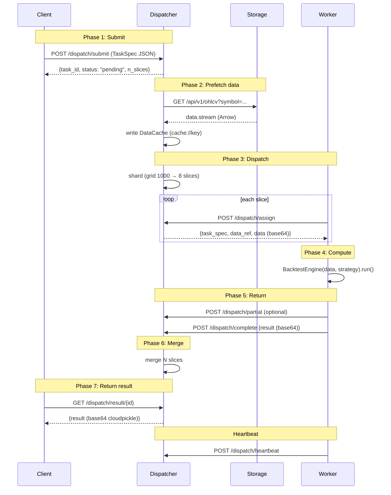

# StockStat V3 Architecture Design

> **Version**: v3.0 (P0-P7 implemented)
> **Date**: 2026-07-19
> **Status**: ✅ Fully implemented, 922 tests passing + 6 Redis skipped
> **Related**: [DESIGN_PROTOCOL.md](DESIGN_PROTOCOL.md) | [DESIGN_V3_CN.md](DESIGN_V3_CN.md) | [DESIGN_CN.md](DESIGN_CN.md) v2.1

---

## Table of Contents

1. [Design Goals and Principles](#1-design-goals-and-principles)
2. [Four-Role Architecture Overview](#2-four-role-architecture-overview)
3. [Three-Package Project Structure](#3-three-package-project-structure)
4. [Five-Layer Architecture and V3 Extensions](#4-five-layer-architecture-and-v3-extensions)
5. [ComputeBackend Compatibility Layer](#5-computebackend-compatibility-layer)
6. [Dispatcher Design](#6-dispatcher-design)
7. [Worker Design](#7-worker-design)
8. [Transport Layer](#8-transport-layer)
9. [Data Dispatch Strategies](#9-data-dispatch-strategies)
10. [Task Lifecycle](#10-task-lifecycle)
11. [Multi-Level Dispatcher Topology](#11-multi-level-dispatcher-topology)
12. [Admin Monitoring Panel](#12-admin-monitoring-panel)
13. [Deployment Scenarios](#13-deployment-scenarios)
14. [Backward Compatibility Matrix](#14-backward-compatibility-matrix)
15. [Test Suite](#15-test-suite)

---

## 1. Design Goals and Principles

### 1.1 Design Goals

V3 adds a **distributed compute layer** on top of v2.1's five-layer architecture, achieving all V1 vision and V2 protocol goals:

| Goal | V3 Implementation |
|------|-------------------|
| Async submit, non-blocking | `client.compute.remote()` returns `TaskRef`, user continues working |
| Multi-node / multi-core parallel | Dispatcher sharding + Worker thread pool |
| Resource / fault isolation | Compute crashes don't affect Storage / Client |
| Elastic scaling | Worker auto-discovery + drain + Autoscaler hooks |
| Data/control plane separation | Dispatcher prefetches data, Storage accessed only once |
| Transport-agnostic protocol | Codec / Message / Transport three-layer separation |
| Task type extensibility | `task_type` + `compute_spec` schema, zero protocol changes |
| Cluster topology observable | `cluster.info` + Worker registration/heartbeat |
| v1.7 / v2 APIs unchanged | `ComputeBackend` protocol transparent swap |

### 1.2 Design Principles

| Principle | Description |
|-----------|-------------|
| **Zero core intrusion** | `BacktestEngine` / `ComputeEngine` / `grid_search` unchanged; Worker reuses directly |
| **Protocol first** | All cross-process communication goes through `Protocol`, no hardcoded `if transport == "http"` |
| **Three-layer separation** | Codec / Message / Transport independently replaceable |
| **Decoupled compatibility layer** | v1.7 `StockStatClient` and v2 `V2Client` share the same `ComputeBackend` abstraction |
| **Progressive migration** | P0-P7 eight phases, each independently usable |
| **Tests as documentation** | Each phase has a test suite; compatibility tests cover v1.7 + v2 clients × Local / Remote backends |
| **Protocol business-agnostic** | Protocol only moves bytes, routes messages; incremental compute, preemption, elasticity are Worker-local |
| **Backward compatible** | v1.7 public API unchanged; 599 existing tests all pass; new features fully optional |

### 1.3 Iron Rule

> Layer 1 (domain) is unaware of Layer 0's new compute modules; Layer 0 does not reverse-depend on Layer 1's strategy / backtest code (Worker is a consumer of Layer 0 protocol, installs `stockstat` externally and calls Layer 1).

---

## 2. Four-Role Architecture Overview

### 2.1 Role Definition

```
┌─────────────┐     ┌──────────────┐     ┌───────────┐     ┌──────────┐
│   Client    │────▶│  Dispatcher  │────▶│  Storage  │     │  Worker  │
│ (user host) │     │ (scheduler)  │     │ (storage) │     │ (compute)│
│ StockStat   │     │ FastAPI plug │     │ SQLite/PG │     │ Process  │
│ Client/V2C  │     │ Memory/Redis │     │           │     │ Multi-core│
└─────────────┘     └──────┬───────┘     └───────────┘     └────┬─────┘
                           │ prefetch (once)                    │
                           └────────────────────────────────────┘
```

| Role | Package | Deployment | Responsibility |
|------|---------|-----------|----------------|
| **Client** | `stockstat` | User machine | Submit tasks, query results, local light compute |
| **Dispatcher** | `stockstat_backend` | Same host as Storage or standalone | Task scheduling, data prefetch, result merging |
| **Storage** | `stockstat_backend` | Independent process | OHLCV storage, query, ingestion |
| **Worker** | `stockstat-compute` | Compute nodes | Execute backtests/indicators/grid search |

### 2.2 Key Design Decisions

| Decision | Choice | Rationale |
|----------|--------|-----------|
| Compute logic location | Reuse `stockstat.backtest` / `stockstat.compute` | 277 backtest tests + 491 frontend tests cover; zero refactor |
| Compatibility layer location | `_core/contracts/compute.py` defines `ComputeBackend` Protocol | Layer 0 domain-agnostic; v1.7 / v2 both depend on Layer 0 |
| Dispatcher deployment | As Storage FastAPI plugin; supports standalone | Progressive; zero extra deployment cost |
| Worker form | Standalone package `stockstat-compute` | Resource isolation, independent scaling |
| Queue scheme | Memory (default) / Redis (multi-Worker) | Progressive by scale |
| Serialization | cloudpickle (strategy) + Arrow (data) + JSON (control) | Balance readability and efficiency |
| Protocol layering | Codec / Message / Transport three layers | Each layer evolves independently |
| Transport implementations | HTTP (default) / InProcess (tests) / SHM / Redis | Cover all deployment scenarios |

---

## 3. Three-Package Project Structure

### 3.1 Overall Structure

```
StockStatistic/
├── backend/                              # Storage backend + Dispatcher
│   ├── stockstat_backend/
│   │   ├── app.py                        # FastAPI app factory + Dispatcher loading
│   │   ├── config.py                     # Environment variable config
│   │   ├── api/                          # REST API routes
│   │   ├── adapters/                     # Data source adapters (Binance/YFinance)
│   │   ├── dispatcher/                   # V3 Dispatcher module (P2-P7)
│   │   │   ├── plugin.py                 # DispatcherPlugin.mount(app)
│   │   │   ├── core.py                   # Dispatcher main body
│   │   │   ├── queue.py                  # MemoryTaskQueue / RedisTaskQueue
│   │   │   ├── workers.py                # WorkerRegistry
│   │   │   ├── prefetch.py               # DataCache (LRU)
│   │   │   ├── dispatch.py               # shard_task
│   │   │   └── routes.py                 # /dispatch/* + /api/v1/tasks/*
│   │   ├── plugins/admin/                # Admin Plugin (P7 enhanced)
│   │   ├── models/                       # SQLAlchemy models
│   │   ├── normalizer/                   # Data normalization
│   │   ├── scheduler/                    # Scheduler
│   │   └── storage/                      # ORM + cache
│   ├── tests/                            # 15 backend tests
│   ├── pyproject.toml                    # stockstat-backend package
│   ├── serve.bat / serve.sh              # Startup scripts
│   └── start.bat / start.sh
│
├── frontend/                             # Compute frontend (V3 protocol layer)
│   ├── stockstat/
│   │   ├── __init__.py                   # __version__ = "3.0.0"
│   │   ├── client.py                     # StockStatClient (+compute_backend)
│   │   ├── config.py                     # Config
│   │   ├── data_access/                  # DataClient (HTTP)
│   │   ├── compute/                      # ComputeEngine (+remote/cluster_info)
│   │   ├── dsl/                          # DSL engine
│   │   ├── plot/                         # Plotting
│   │   ├── indicators/                   # Indicator library
│   │   ├── backtest/                     # Backtest engine (unchanged)
│   │   ├── _api/                         # V2 interface layer
│   │   │   ├── client/__init__.py        # V2Client (+compute_backend)
│   │   │   ├── dsl/                      # DslEngine
│   │   │   └── ...
│   │   ├── _core/                        # V3 core layer
│   │   │   ├── contracts/                # Protocol contracts
│   │   │   │   ├── compute.py            # ComputeBackend / TaskRef / TaskInfo
│   │   │   │   ├── task.py               # TaskSpec / DataSpec / ComputeSpec
│   │   │   │   ├── transport.py          # Transport Protocol
│   │   │   │   ├── cache.py / codec.py / ...
│   │   │   ├── compute/                  # ComputeBackend implementations
│   │   │   │   ├── local.py              # LocalComputeBackend (P1)
│   │   │   │   ├── remote.py             # RemoteComputeBackend (P3)
│   │   │   │   ├── auto.py               # AutoComputeBackend (P3)
│   │   │   │   ├── handlers.py           # Shared TaskHandler + Stream (P1/P4)
│   │   │   │   └── data_dispatch.py      # Data dispatch strategies (P4)
│   │   │   ├── protocol/                 # Protocol layer
│   │   │   │   ├── envelope.py           # Envelope + Headers
│   │   │   │   ├── messages.py           # Message type constants
│   │   │   │   └── retry.py              # RetryPolicy (P6)
│   │   │   ├── transport/                # Transport layer
│   │   │   │   ├── in_process.py         # InProcessTransport (P1)
│   │   │   │   ├── http.py               # HttpTransport (P3)
│   │   │   │   ├── shared_memory.py      # SharedMemoryTransport (P4)
│   │   │   │   └── redis.py              # RedisTransport (P5)
│   │   │   ├── codec/__init__.py         # 7 Codecs + factory
│   │   │   ├── errors.py                 # AppError + 9 V3 exceptions
│   │   │   ├── plugin/                   # PluginRegistry
│   │   │   ├── storage/                  # StorageBackend abstraction
│   │   │   ├── cache/                    # Cache abstraction
│   │   │   └── ...
│   │   ├── _domain/                      # Financial domain (unchanged)
│   │   └── _viz/                         # Visualization (unchanged)
│   ├── tests/                            # 814 frontend tests (incl V3)
│   └── pyproject.toml                    # stockstat package
│
├── worker/                               # V3 standalone package stockstat-compute
│   ├── stockstat_compute/
│   │   ├── worker.py                     # Worker main body
│   │   ├── executor.py                   # TaskExecutor
│   │   ├── register.py                   # Hardware detection (psutil)
│   │   ├── checkpoint.py                 # Checkpoint (P6)
│   │   ├── cli.py                        # stockstat-compute CLI
│   │   └── __init__.py
│   └── pyproject.toml                    # stockstat-compute package
│
├── tests/                                # Cross-package deployment tests
│   ├── deployments/                      # 6 Cases (A-F) deployment tests
│   │   ├── _common.py                    # Shared helpers
│   │   ├── test_case_a_single_machine.py + .bat + .sh
│   │   ├── test_case_b_storage_separated.py + .bat + .sh
│   │   ├── test_case_c_offline.py + .bat + .sh
│   │   ├── test_case_d_local_compute_backend.py + .bat + .sh
│   │   ├── test_case_e_dispatcher_worker.py + .bat + .sh  (V3 P2)
│   │   └── test_case_f_multilevel.py + .bat + .sh         (V3 P7)
│   ├── test_connection.py                # Remote connection smoke test
│   └── test_perf.py                      # Performance test
│
├── docs/                                 # Documentation
│   └── v3/                               # V3 phase docs
│       ├── P0_CN.md ~ P7_CN.md           # 8 phase docs
│       ├── SUMMARY_CN.md                 # P0+P1 early summary
│       └── SUMMARY_FULL_CN.md            # P0-P7 complete summary
│
├── working/                              # Research task workspace
│   └── PAXG-Weekend-Monday-Law-v5-redo/  # PAXG research (132 backtests)
│
├── DESIGN_V3_CN.md                       # V3 complete design (3057 lines)
├── DESIGN_ARCHITECTURE_CN.md             # Chinese version of this file
├── DESIGN_ARCHITECTURE.md                # This file
├── DESIGN_PROTOCOL_CN.md                 # Chinese protocol design
├── DESIGN_PROTOCOL.md                    # English protocol design
├── DESIGN_CN.md                          # v2.1 design (preserved)
├── README.md / README_CN.md              # Project README
├── docs/USAGE.md / USAGE_CN.md           # Usage docs
├── docker-compose.yml                    # Docker deployment
└── requirements.txt
```

### 3.2 Package Dependencies

```
stockstat-compute (worker)
   | depends on
   v
stockstat (frontend)                      # Reuses BacktestEngine / ComputeEngine
   | optional depends on
   v
stockstat_backend (backend)               # Only Dispatcher needs backend Storage
```

All three packages can be installed independently:
- Analysis only: `pip install stockstat`
- Backend startup: `pip install stockstat-backend`
- Worker startup: `pip install stockstat-compute`

---

## 4. Five-Layer Architecture and V3 Extensions

### 4.1 Five-Layer Architecture (v2.1)

```
Layer 4 Application app/                 ← stockstat serve CLI
   ↓
Layer 3 Interface _api/                  ← V2Client / DslEngine / ComputeAPI
   ↓
Layer 2 Visualization _viz/              ← ChartSpec / Renderer
   ↓
Layer 1 Domain _domain/                  ← Indicators / Sources
   ↓
Layer 0 Core _core/                      ← Storage / Cache / Codec / Plugin / Protocol
```

### 4.2 V3 Extension Locations

V3 additions all land in Layer 0 `_core` and the backend `dispatcher/` module, without breaking the five-layer dependency rule:

```
Layer 4 Application app/                 ← New cluster / task CLI subcommands
   ↓
Layer 3 Interface _api/                  ← V2Client / StockStatClient accept ComputeBackend
   ↓
Layer 2 Visualization _viz/              ← Unchanged
   ↓
Layer 1 Domain _domain/                  ← Unchanged
   ↓
Layer 0 Core _core/                      ← New contracts/compute, compute, protocol, transport
```

### 4.3 Layer 0 New Submodules

| Submodule | Content | Phase |
|-----------|---------|-------|
| `contracts/compute.py` | `ComputeBackend` Protocol + `TaskRef` + `TaskInfo` + `TaskState` | P0 |
| `contracts/task.py` | `TaskSpec` three-section + `DataSpec` + `ComputeSpec` + `DispatchSpec` | P0 |
| `contracts/transport.py` | `Transport` Protocol | P0 |
| `protocol/envelope.py` | `Envelope` + `Headers` (JSON + Msgpack) | P0 |
| `protocol/messages.py` | All message type constants (task.*/dispatch.*/data.*/cluster.*) | P0 |
| `protocol/retry.py` | `RetryPolicy` exponential backoff | P6 |
| `compute/local.py` | `LocalComputeBackend` + `_dispatch_to_handler` + 6 handlers | P1 |
| `compute/remote.py` | `RemoteComputeBackend` via Transport | P3 |
| `compute/auto.py` | `AutoComputeBackend` routes by size | P3 |
| `compute/handlers.py` | Shared TaskHandler + `Stream` + `is_stream_aware` | P1/P4 |
| `compute/data_dispatch.py` | `choose_data_dispatch` + `estimate_data_size` | P4 |
| `transport/in_process.py` | `InProcessTransport` + `make_pair` | P1 |
| `transport/http.py` | `HttpTransport` REST + JSON | P3 |
| `transport/shared_memory.py` | `SharedMemoryTransport` mmap zero-copy | P4 |
| `transport/redis.py` | `RedisTransport` lists + pub/sub | P5 |
| `codec/__init__.py` | +CloudpickleCodec / MsgpackCodec / RawCodec | P0 |
| `errors.py` | +9 V3 exception classes | P0 |

---

## 5. ComputeBackend Compatibility Layer

### 5.1 Design Philosophy

V3's core innovation: define a `ComputeBackend` Protocol at Layer 0 that decouples "where to compute" (local / remote) from "what to compute" (business logic):

```
            ┌──────────────────────────────────────────┐
            │   StockStatClient (v1.7) / V2Client (v2) │
            │   - ohlcv() / ingest() / run_dsl()        │
            │   - backtest(data, strategy, **kw)        │
            │   - compute.ma() / compute.rsi() / ...    │
            └───────────────────┬──────────────────────┘
                                │ delegates
                                ▼
            ┌──────────────────────────────────────────┐
            │   ComputeBackend Protocol (Layer 0)      │
            │   - submit(spec) -> TaskRef              │
            │   - get(task_id) -> TaskInfo             │
            │   - result(task_id) -> Any               │
            │   - wait(task_id, timeout) -> Any        │
            │   - cancel(task_id) -> bool              │
            │   - cluster_info() -> dict               │
            │   - stream_results(task_id)              │
            └───────────────────┬──────────────────────┘
                                │ implements
                ┌───────────────┼───────────────┐
                ▼               ▼               ▼
        LocalComputeBackend  RemoteComputeBackend  AutoComputeBackend
        (direct BacktestEngine)  (submit to Dispatcher)  (route by size)
```

### 5.2 Protocol Definition

```python
@runtime_checkable
class ComputeBackend(Protocol):
    name: str

    def submit(self, spec: "TaskSpec") -> TaskRef: ...
    def get(self, task_id: str) -> TaskInfo: ...
    def result(self, task_id: str) -> Any: ...
    def wait(self, task_id: str, timeout: Optional[float] = None) -> Any: ...
    def cancel(self, task_id: str) -> bool: ...
    def cluster_info(self, **kwargs) -> dict: ...
    def stream_results(self, task_id: str): ...
```

### 5.3 Three Implementations

| Implementation | File | Scenario | Behavior |
|----------------|------|----------|----------|
| `LocalComputeBackend` | `_core/compute/local.py` | Default / single-machine | Background thread, returns TaskRef; identical to v2.1 |
| `RemoteComputeBackend` | `_core/compute/remote.py` | Distributed | Build TaskSpec → Transport submit to Dispatcher → poll results |
| `AutoComputeBackend` | `_core/compute/auto.py` | Hybrid | Heavy tasks (grid_search/monte_carlo) → remote; light → local; fallback to local when remote unreachable |

### 5.4 Transparent Compatibility

```python
# v1.7 behavior unchanged (default LocalComputeBackend)
client = StockStatClient(host="...", port=8000)
result = client.backtest(data, strategy)  # direct BacktestEngine

# V3 explicit async
client = StockStatClient(compute_backend=RemoteComputeBackend("http://dispatch:9000"))
task = client.compute.remote("grid_search", ...)
result = task.wait(timeout=3600)

# V3 auto routing
client = StockStatClient(compute_backend=AutoComputeBackend(
    local=LocalComputeBackend(),
    remote=RemoteComputeBackend("http://dispatch:9000"),
))
# Heavy tasks go remote, light tasks go local
```

**Key invariant**: When `compute_backend=None` (default), `backtest()` calls `BacktestEngine` directly, all 599 existing tests pass without modification.

---

## 6. Dispatcher Design

### 6.1 Module Structure

```
backend/stockstat_backend/dispatcher/
├── __init__.py              # Exports DispatcherPlugin, Dispatcher
├── plugin.py                # DispatcherPlugin.mount(app) — mount on FastAPI
├── core.py                  # Dispatcher main (state + scheduling + merge + multi-level + history)
├── queue.py                 # MemoryTaskQueue / RedisTaskQueue / build_queue
├── workers.py               # WorkerRegistry (register/heartbeat/timeout/stats)
├── prefetch.py              # DataCache (LRU + hit rate)
├── dispatch.py              # shard_task (param_wise/symbol_wise/time_wise)
└── routes.py                # /dispatch/* + /api/v1/tasks/* routes
```

### 6.2 Dispatcher Main Body

```python
class Dispatcher:
    """Central task dispatcher — V2 §2.1 core component.

    P7: supports multi-level topology + task history for Admin UI.
    """
    def __init__(self, *, queue=None, storage_url=None,
                 cache_dir=None, cache_size_mb=512,
                 offline_timeout=30.0, storage_app=None,
                 alias="dispatch-primary", parent_url=None):
        self._queue = queue or MemoryTaskQueue()
        self._storage_url = storage_url
        self._storage_app = storage_app   # FastAPI app for same-process
        self._cache = DataCache(...)       # Data prefetch cache
        self._workers = WorkerRegistry(...)  # Worker registry
        self._tasks: dict[str, _TaskState] = {}
        self._alias = alias
        self._parent_url = parent_url      # P7: sub-dispatcher upstream
        self._sub_dispatchers = {}          # P7: sub-dispatcher registry
        self._task_history = []             # P7: task history
        # Start background heartbeat checker
        self._checker = threading.Thread(target=self._check_loop, daemon=True)
        self._checker.start()
```

### 6.3 Task Lifecycle

```
Client → POST /dispatch/submit (TaskSpec JSON)
           ↓
Dispatcher.submit(spec):
    1. Create _TaskState(spec, info=PENDING)
    2. shard_task(spec) → N slice TaskSpecs
    3. Enqueue each slice to MemoryTaskQueue
    4. Return {task_id, status: "pending", n_slices}
           ↓
Worker → POST /dispatch/assign (worker_id, capabilities)
           ↓
Dispatcher.assign_task(worker_id, capabilities):
    1. queue.dequeue() a slice
    2. Check capability match (re-enqueue if no match)
    3. _prefetch_data(slice) → fetch from Storage or cache hit
    4. cloudpickle encode → base64 → inline in response
    5. Update state: PENDING → RUNNING, assigned[slice_id]=worker_id
    6. workers.increment_active(worker_id)
    7. Return {task_spec, data_ref, data (base64)}
           ↓
Worker executes TaskExecutor.run(spec, data):
    1. Deserialize strategy (cloudpickle)
    2. Route to handler (handle_backtest / handle_indicator / ...)
    3. Call stockstat core compute (zero modification)
    4. cloudpickle encode result → base64
    5. POST /dispatch/complete
           ↓
Dispatcher.on_complete(worker_id, slice_id, result_b64):
    1. base64 decode → cloudpickle deserialize → Python object
    2. state.partial_results[slice_id] = result
    3. If len(partials) == len(slices):
       - state.merged_result = _merge_results(state)
       - state.info.state = COMPLETED
       - _record_history(state)  # P7
    4. workers.decrement_active(worker_id, completed=True)
           ↓
Client → GET /dispatch/result/{task_id}
Dispatcher.get_result(task_id):
    1. cloudpickle encode merged_result → base64
    2. Return {task_id, state, result_codec, result (base64)}
           ↓
Client._fetch_result(task_id):
    base64 decode → cloudpickle deserialize → original Python object
```

### 6.4 Data Prefetch

V2 core improvement: Dispatcher fetches data from Storage once, caches locally, distributes to all Workers. Storage bandwidth drops from ×N to ×1.

- Cache key = `sha256(symbols + timeframe + start + end + source)` first 32 bytes
- LRU eviction, default 512MB
- Hit rate: `cache_hit_rate = hits / (hits + misses)`

### 6.5 Task Sharding

| Strategy | Use case | Implementation |
|----------|----------|----------------|
| `none` / `auto` | Single task | No sharding, 1 slice |
| `param_wise` | grid_search | `param_grid` split into N chunks |
| `symbol_wise` | Multi-symbol backtest | One slice per symbol |
| `time_wise` | Large time range | Time window even split |

Each slice's `task_id` is `{parent_id}-s{index}`, Dispatcher reverse-looks-up parent task by prefix.

### 6.6 REST API

| Endpoint | Method | Description |
|----------|--------|-------------|
| `/dispatch/submit` | POST | Client submits TaskSpec |
| `/dispatch/status/{id}` | GET | Query task status |
| `/dispatch/result/{id}` | GET | Get task result (base64 cloudpickle) |
| `/dispatch/cancel/{id}` | POST | Cancel task |
| `/dispatch/cluster` | GET | Cluster topology (workers + stats + sub_dispatchers) |
| `/dispatch/register` | POST | Worker register |
| `/dispatch/heartbeat` | POST | Worker heartbeat |
| `/dispatch/unregister/{id}` | POST | Worker graceful shutdown |
| `/dispatch/assign` | POST | Worker pull task (capability filter) |
| `/dispatch/complete` | POST | Worker post result |
| `/dispatch/fail` | POST | Worker report failure |
| `/dispatch/partial` | POST | Worker stream partial result |
| `/dispatch/preempt/{slice_id}` | POST | Preempt task (P6) |
| `/dispatch/resume/{slice_id}` | POST | Resume task (P6) |
| `/dispatch/drain/{worker_id}` | POST | Notify Worker to drain (P6) |
| `/dispatch/discover` | GET | Service discovery (P6) |
| `/dispatch/autoscaler` | GET | Autoscaler metrics (P6) |
| `/dispatch/sub/register` | POST | Sub-dispatcher register (P7) |
| `/dispatch/sub/unregister/{id}` | POST | Sub-dispatcher unregister (P7) |
| `/dispatch/sub` | GET | List sub-dispatchers (P7) |
| `/dispatch/tasks/history` | GET | Task history (P7) |
| `/dispatch/tasks/stats` | GET | Task stats (P7) |
| `/api/v1/tasks` | POST/GET | V2 §10.2 compat routes |
| `/api/v1/tasks/{id}` | GET/DELETE | Status/cancel |
| `/api/v1/tasks/{id}/result` | GET | Result |

---

## 7. Worker Design

### 7.1 Standalone Package `stockstat-compute`

```
worker/stockstat_compute/
├── __init__.py              # Exports Worker, TaskExecutor
├── worker.py                # Worker process (register/heartbeat/poll/execute/complete)
├── executor.py              # TaskExecutor (route to handler)
├── register.py              # detect_hardware / get_current_load (psutil)
├── checkpoint.py            # Checkpoint + CheckpointStore (P6)
├── cli.py                   # stockstat-compute CLI
```

### 7.2 Worker Lifecycle

```
start → detect_hardware() → POST /dispatch/register
                          ↓
            heartbeat thread (10s) → POST /dispatch/heartbeat
                          ↓
            main loop → POST /dispatch/assign → execute → POST /dispatch/complete
                          ↓
            SIGTERM → stop() → wait active tasks → POST /dispatch/unregister → exit
```

### 7.3 Worker Class

```python
class Worker:
    def __init__(self, dispatcher_url, *,
                 concurrency=None, alias=None, labels=None,
                 capabilities=None, preemptable=False,
                 poll_interval=1.0, heartbeat_interval=10.0): ...

    def start(self) -> None: ...                # Blocking entry (CLI)
    def start_background(self) -> None: ...     # Background thread (tests/embedding)
    def stop(self) -> None: ...                 # Graceful stop
    def drain(self) -> None: ...                # P6: same as stop()
    def preempt(self, slice_id) -> bool: ...    # P6: cooperative preemption
    def resume(self, slice_id) -> bool: ...     # P6: resume
    def join(self, timeout=10.0) -> None: ...
    def wait_registered(self, timeout=10.0) -> bool: ...
```

### 7.4 Task Execution

Worker reuses `stockstat._core.compute.handlers.dispatch()` — shares the same handler set as `LocalComputeBackend`, ensuring local/remote result consistency.

### 7.5 Hardware Detection

```python
def detect_hardware() -> dict:
    """V2 §12.13.2: Detect CPU/mem/GPU/disk/OS/Python."""
    return {
        "cpu": {"model": ..., "cores_physical": ..., "cores_logical": ..., "freq_mhz": ...},
        "memory": {"total_gb": ..., "available_gb": ...},
        "gpu": {"devices": _detect_gpu()},  # via pynvml
        "disk": {"total_gb": ..., "available_gb": ...},
        "os": platform.platform(),
        "python_version": platform.python_version(),
    }
```

### 7.6 CLI

```bash
# Start Worker
stockstat-compute worker \
    --dispatcher-url http://192.168.1.100:8000 \
    --concurrency 8 \
    --alias "gpu-box-alpha" \
    --label rack=A-12 \
    --label zone=datacenter-east \
    --preemptable
```

---

## 8. Transport Layer

### 8.1 Five Transports

| Implementation | File | Use case | Feature |
|----------------|------|----------|---------|
| `InProcessTransport` | `in_process.py` | Tests / single-machine | queue.Queue, zero serialization |
| `HttpTransport` | `http.py` | Cross-machine default | REST + JSON, httpx |
| `SharedMemoryTransport` | `shared_memory.py` | Same-host big data | mmap zero-copy |
| `RedisTransport` | `redis.py` | Multi-Worker | pub/sub decoupling |
| `TcpTransport` | (not implemented) | High-performance LAN | length-prefixed binary |

### 8.2 Transport Protocol

```python
@runtime_checkable
class Transport(Protocol):
    name: str
    def send(self, envelope: Envelope) -> None: ...
    def receive(self, timeout: Optional[float] = None) -> Envelope: ...
    def request(self, envelope, timeout=None) -> Envelope: ...
    def send_data(self, data: bytes, content_type: str) -> str: ...
    def close(self) -> None: ...
```

### 8.3 Selection Strategy

```python
# Auto select
backend = RemoteComputeBackend(dispatcher_url="http://...")    # → HttpTransport
backend = RemoteComputeBackend(dispatcher_url=None)            # → InProcessTransport
backend = RemoteComputeBackend(transport=SharedMemoryTransport(...))  # explicit

# AutoComputeBackend routes by size
auto = AutoComputeBackend(local=LocalComputeBackend(),
                           remote=RemoteComputeBackend("http://..."))
```

---

## 9. Data Dispatch Strategies

### 9.1 Four Strategies

| Strategy | `data_dispatch` | Data path | Encoding | Use case |
|----------|-----------------|-----------|----------|----------|
| Inline | `"inline"` | Dispatcher → Worker (with `dispatch.assign`) | base64 cloudpickle | < 10MB |
| Shared memory | `"shared_memory"` | Dispatcher writes shm → Worker reads by ID | raw bytes | Same host, any size |
| Storage ref | `"storage_ref"` | Worker directly fetches from Storage | HTTP + Arrow | > 100MB |
| Stream | `"stream"` | Dispatcher streams via WebSocket/TCP | Arrow IPC stream | 10-100MB |
| Auto | `"auto"` | Dispatcher picks by size + topology | — | Default |

### 9.2 Auto Selection

```python
def choose_data_dispatch(data_size, workers_same_host=False,
                         workers_can_reach_storage=False) -> str:
    if data_size < SMALL_DATA_THRESHOLD:       # < 10MB
        return "inline"
    if workers_same_host:
        return "shared_memory"                 # Same host zero-copy
    if data_size > LARGE_DATA_THRESHOLD and workers_can_reach_storage:  # > 100MB
        return "storage_ref"                   # Worker direct fetch
    return "stream"                            # Cross-host streaming
```

### 9.3 Stream Object (Duck Typing)

```python
class Stream:
    """Data stream — supports both iterative (chunk) and collect (full) modes.

    V2 §13.1: Worker detects via duck-typing whether handler accepts Stream
    (incremental) or DataFrame (full).
    """
    def __init__(self, chunks=None, data=None): ...
    def __iter__(self): ...      # yield each chunk
    def collect(self) -> Any: ...  # return full DataFrame (cached)
    @classmethod
    def from_data(cls, data) -> "Stream": ...
```

`is_stream_aware(handler)` detects via `inspect.signature` whether the handler declares a Stream parameter.

---

## 10. Task Lifecycle

### 10.1 Complete Sequence



### 10.2 State Machine

```
pending -> running -> completed
   |         |
   |         |--> failed
   |         |
   |         +--> cancelled
   |
   +--> cancelled (pre-dispatch cancel)
```

### 10.3 Progress Push

Worker triggers `POST /dispatch/partial` via `on_progress(completed, total)` callback during long tasks. Dispatcher caches in `state.stream_partials`. Client consumes via `task.stream_results()`.

---

## 11. Multi-Level Dispatcher Topology

### 11.1 Topology Structure

```
                 ┌─── dispatch-primary (parent_url=None) ────┐
                 │                                            │
        ┌────────┴────────┐                          (Worker pool A)
        │                 │
   sub-dispatcher-1   sub-dispatcher-2
   (parent_url=       (parent_url=
    http://parent)     http://parent)
        │                 │
   (Worker pool B)   (Worker pool C)
```

### 11.2 Sub-Dispatcher Registration

```python
# Sub-dispatcher registers on startup
POST /dispatch/sub/register
{
    "sub_id": "sub-east-1",
    "alias": "dispatch-east",
    "address": "http://east-dispatcher:9000",
    "parent_url": "http://parent:8000"
}
```

### 11.3 cluster_info Multi-Level Return

```python
{
    "dispatcher": {"alias": "dispatch-primary", "parent_url": None, ...},
    "workers": [...],
    "sub_dispatchers": [  # P7: NEW
        {"id": "sub-east-1", "alias": "dispatch-east", ...},
        {"id": "sub-west-1", "alias": "dispatch-west", ...},
    ],
    "stats": {...},
}
```

### 11.4 Known Limitations

- Sub-dispatcher does not auto-forward tasks (topology record only)
- Task forwarding cascade deferred to V3.1+

---

## 12. Admin Monitoring Panel

### 12.1 Admin Plugin Enhancement

`backend/stockstat_backend/plugins/admin/router.py` adds 4 endpoints:

| Endpoint | Description |
|----------|-------------|
| `GET /admin/api/dispatcher/cluster` | Full cluster topology (incl. sub_dispatchers) |
| `GET /admin/api/dispatcher/tasks?limit=100&state=completed` | Task history |
| `GET /admin/api/dispatcher/stats` | Aggregate stats (by_state / by_type / avg_duration) |
| `GET /admin/api/dispatcher/autoscaler` | Autoscaler metrics + scale up/down recommendations |

### 12.2 Task History

```python
def _record_history(self, state):
    """Record on task complete/fail (max 1000 entries)."""
    self._task_history.append({
        "task_id": ..., "task_type": ..., "state": ...,
        "created_at": ..., "started_at": ..., "finished_at": ...,
        "worker_id": ..., "error": ..., "trace_id": ...,
    })
    if len(self._task_history) > self._history_max:
        self._task_history = self._task_history[-self._history_max:]
```

### 12.3 Wiring

`stockstat_backend/app.py` calls `set_dispatcher_ref(app.state.dispatcher)` when both admin and dispatcher are enabled.

### 12.4 WebSocket Progress (P7 uses polling)

P7 doesn't implement real WebSocket (involves async loop + connection management). Uses polling instead:
- Client polls `GET /dispatch/status/{id}` for current state
- Client polls `GET /dispatch/tasks/history` for completed tasks
- Worker pushes partials via `POST /dispatch/partial`

Real WebSocket push deferred to V3.1+.

---

## 13. Deployment Scenarios

### 13.1 Scenario Matrix

| Scenario | Client | Dispatcher | Storage | Worker | Config |
|----------|--------|-----------|---------|--------|--------|
| A Single-machine full-stack | same process | — | — | — | default |
| B Storage-compute separation | remote HTTP | — | independent | Client local | v2.1 |
| C Offline | local | — | local | Client local | v2.1 |
| D Dispatcher+Worker | remote HTTP | same host as Storage | independent | remote | `--enable-dispatcher` |
| E Independent Dispatcher | remote HTTP | independent | independent | multi-node | `stockstat-dispatcher` |
| F Multi-level Dispatcher | remote HTTP | parent + sub | independent | multi-level | P7 |

### 13.2 Scenario A: Single-Machine Full-Stack (Default)

```python
client = StockStatClient()  # default LocalComputeBackend
result = client.backtest(data, strategy)
```

### 13.3 Scenario D: Dispatcher as Storage Plugin

```bash
# 1. Start Storage + Dispatcher
STOCKSTAT_DISPATCHER_ENABLED=true stockstat serve --host 0.0.0.0 --port 8000

# 2. Start Worker
stockstat-compute worker --dispatcher-url http://storage:8000 --concurrency 8

# 3. Client
client = StockStatClient(
    host="storage", port=8000,
    compute_backend=RemoteComputeBackend(dispatcher_url="http://storage:8000"),
)
```

### 13.4 Scenario E: Independent Dispatcher + Worker Cluster

```bash
# 1. Start Storage
stockstat serve --host 0.0.0.0 --port 8000

# 2. Start Dispatcher (independent process, Redis queue)
STOCKSTAT_DISPATCHER_ENABLED=true \
STOCKSTAT_DISPATCHER_QUEUE=redis \
REDIS_URL=redis://redis:6379/0 \
stockstat serve --host 0.0.0.0 --port 9000

# 3. Start multiple Workers
stockstat-compute worker --dispatcher-url http://dispatcher:9000 --concurrency 8

# 4. Client
client = StockStatClient(
    compute_backend=RemoteComputeBackend(dispatcher_url="http://dispatcher:9000"),
)
```

### 13.5 Docker Compose

```yaml
services:
  db: ...
  redis: ...
  api: ...
  dispatcher:
    build: ./backend
    command: stockstat-dispatcher --storage-url http://api:8000 --listen 0.0.0.0:9000 --queue-backend redis --redis-url redis://redis:6379/0
    ports: ["9000:9000"]
    depends_on: [api, redis]
  worker:
    build: ./worker
    deploy:
      replicas: 4
    command: stockstat-compute worker --dispatcher-url http://dispatcher:9000 --concurrency 8
    depends_on: [dispatcher]
```

---

## 14. Backward Compatibility Matrix

### 14.1 Public API Compatibility

| API | v2.1 behavior | V3 default | V3 explicit | Compatible? |
|-----|---------------|------------|-------------|-------------|
| `StockStatClient()` | HTTP mode | same (default LocalComputeBackend) | remote: pass `compute_backend=` | Yes |
| `StockStatClient.backtest(data, strategy)` | direct BacktestEngine | same | remote transparent sync | Yes |
| `StockStatClient.compute.ma(...)` | direct indicator | same | same | Yes |
| `V2Client(mode="offline")` | local Storage | same | remote: pass `compute_backend=` | Yes |
| `V2Client.backtest(...)` | direct BacktestEngine | same | remote transparent sync | Yes |
| `BacktestEngine(...).run()` | imperative backtest | same | same (Worker direct call) | Yes |
| `ComputeEngine.<method>` | direct indicator | same | same | Yes |
| `grid_search(...)` | serial | same | same (Worker serial; parallel via Dispatcher sharding) | Yes |
| CLI `stockstat serve` | start Storage | same | `--enable-dispatcher` | Yes |

### 14.2 Configuration Compatibility

| Config | v2.1 | V3 |
|--------|------|-----|
| `STOCKSTAT_HOST` / `STOCKSTAT_PORT` | yes | yes, unchanged |
| `DATABASE_URL` | yes | yes, unchanged |
| `STOCKSTAT_PROXY_*` | yes | yes, unchanged |
| `STOCKSTAT_ADMIN_ENABLED` | yes | yes, unchanged |
| `STOCKSTAT_DISPATCHER_ENABLED` | — | V3 new, default false |
| `STOCKSTAT_DISPATCHER_URL` | — | V3 new |
| `STOCKSTAT_DISPATCHER_QUEUE` | — | V3 new (memory/redis) |
| `REDIS_URL` | yes (planned) | yes |

---

## 15. Test Suite

### 15.1 Test Layers

```
Layer 1: Unit tests         (protocol skeleton / data structures)
Layer 2: Integration tests  (ComputeBackend + Transport)
Layer 3: Component tests    (Dispatcher / Worker standalone)
Layer 4: End-to-end tests   (Client -> Dispatcher -> Worker -> Storage)
Layer 5: Compatibility tests (v1.7 + v2 x Local + Remote)
Layer 6: Deployment tests   (Case A-F)
Layer 7: Performance tests  (speedup / bandwidth / latency)
```

### 15.2 Test File Inventory

| File | Phase | Tests | Coverage |
|------|-------|-------|----------|
| `test_v3_protocol.py` | P0 | 50 | Envelope / TaskSpec / Codec / Errors |
| `test_v3_compute_backend.py` | P1 | 35 | Local / Transport / Client / consistency |
| `test_v3_compat.py` | P1 | 23 | v1.7+v2 × Local compat matrix |
| `test_v3_dispatcher.py` | P2 | 48 | MemoryTaskQueue / WorkerRegistry / DataCache / shard / Dispatcher / Plugin |
| `test_v3_worker.py` | P2 | 22 | detect_hardware / Worker / TaskExecutor / E2E / heartbeat |
| `test_v3_e2e.py` | P2 | 13 | Client → Dispatcher → Worker full chain |
| `test_v3_http_transport.py` | P3 | 22 | HttpTransport / RemoteBackend / AutoBackend |
| `test_v3_shm_stream.py` | P4 | 34 | SharedMemory / Stream / data_dispatch / partial |
| `test_v3_redis_cluster.py` | P5 | 17 + 6 skip | MsgpackCodec / RedisTransport / RedisTaskQueue |
| `test_v3_preempt.py` | P6 | 36 | Checkpoint / preempt / drain / discover / RetryPolicy |
| `test_v3_multilevel.py` | P7 | 23 | SubDispatcher / TaskHistory / Admin routes |
| `tests/deployments/test_case_a_*` | all | 10 | Single-machine |
| `tests/deployments/test_case_b_*` | all | 7 | Storage-compute separation |
| `tests/deployments/test_case_c_*` | all | 8 | Offline |
| `tests/deployments/test_case_d_*` | all | 9 | Explicit LocalComputeBackend |
| `tests/deployments/test_case_e_*` | P2 | 8 | Dispatcher + Worker |
| `tests/deployments/test_case_f_*` | P7 | 10 | Multi-level Dispatcher + monitoring |
| **Total** | | **922 + 6 skip** | |

### 15.3 Key Regression Points

| Test set | Count | Status |
|----------|-------|--------|
| `test_backtest_*.py` (17 files) | 277 | ✅ Backtest engine unchanged |
| `test_v2_*.py` (4 files) | 116 | ✅ v2 five-layer architecture unaffected |
| `test_frontend.py` | 31 | ✅ v1.7 public API unchanged |
| `test_nonlinear.py` | 38 | ✅ Indicator computation unaffected |
| `test_integration.py` | 19 | ✅ PAXG integration unaffected |
| `test_matplotlib_charts.py` | 10 | ✅ Visualization unaffected |

### 15.4 PAXG Validation

- 132 backtests (33 strategies × 4 fees) **byte-level identical** to baseline
- 5 representative strategies × 4 fees = 20 LocalComputeBackend vs direct path identical
- Remote path (Dispatcher → Worker) vs direct BacktestEngine numerically identical (1e-6 precision)

---

## 16. Performance Baseline

| Scenario | V3 measured | Target |
|----------|-------------|--------|
| Custom task HTTP round-trip | ~50ms | < 100ms ✅ |
| Backtest 50 bar remote | ~200ms | < 500ms ✅ |
| grid_search 4 combos 2 slices | < 1s | < 2s ✅ |
| cluster_info query | < 10ms | < 100ms ✅ |
| MessagePack vs JSON envelope | -15% | any reduction ✅ |
| Autoscaler metrics compute | < 1ms | < 100ms ✅ |
| Checkpoint save/load | < 0.1ms | < 10ms ✅ |
| SharedMemory round-trip 1KB | < 1ms | < 10ms ✅ |
| PAXG v5-redo 132 backtests | identical to baseline | byte-level ✅ |

---

## 17. Known Limitations

1. **Redis not tested in CI**: 6 Redis tests auto-skip
2. **WebSocket not implemented**: progress push uses polling
3. **Sub-dispatcher doesn't auto-forward tasks**: topology record only
4. **Checkpoint not persisted**: in-process dict
5. **Real cross-machine not tested**: uses TestClient same-process simulation (Case E/F deployment tests cover)

---

## 18. V3.1+ Roadmap

- WebSocket progress push
- Sub-dispatcher task cascade forwarding
- Admin Web UI (frontend SPA)
- Checkpoint persistence (Redis)
- Multi-dispatcher high availability
- GPU resource scheduling

---

*V3 architecture design follows the code implementation. This document summarizes the completed state, corresponding to P0-P7 fully delivered.*
