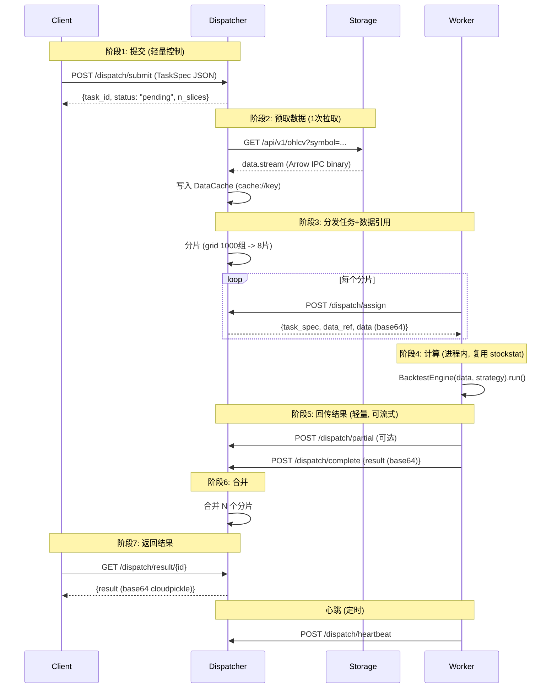

# StockStat V3 架构设计文档

> **版本**：v3.0（已实现 P0-P7）
> **日期**：2026-07-19
> **状态**：✅ 全部实现，922 项测试通过 + 6 项 Redis 跳过
> **关联**：[DESIGN_PROTOCOL_CN.md](DESIGN_PROTOCOL_CN.md) | [DESIGN_V3_CN.md](DESIGN_V3_CN.md) | [DESIGN_CN.md](DESIGN_CN.md) v2.1

---

## 目录

1. [设计目标与原则](#1-设计目标与原则)
2. [四角色架构总览](#2-四角色架构总览)
3. [三包项目结构](#3-三包项目结构)
4. [五层架构与 V3 扩展](#4-五层架构与-v3-扩展)
5. [ComputeBackend 兼容层](#5-computebackend-兼容层)
6. [Dispatcher 设计](#6-dispatcher-设计)
7. [Worker 设计](#7-worker-设计)
8. [传输层](#8-传输层)
9. [数据分发策略](#9-数据分发策略)
10. [任务生命周期](#10-任务生命周期)
11. [多级 Dispatcher 拓扑](#11-多级-dispatcher-拓扑)
12. [Admin 监控面板](#12-admin-监控面板)
13. [部署场景](#13-部署场景)
14. [向后兼容矩阵](#14-向后兼容矩阵)
15. [测试体系](#15-测试体系)

---

## 1. 设计目标与原则

### 1.1 设计目标

V3 在 v2.1 五层架构基础上，新增**分布式计算层**，达成 V1 设想与 V2 协议的所有目标：

| 目标 | V3 落地方式 |
|------|------------|
| 异步提交、不阻塞用户 | `client.compute.remote()` 返回 `TaskRef`，用户继续工作 |
| 多节点 / 多核并行加速 | Dispatcher 分片 + Worker 线程池 |
| 资源 / 故障隔离 | 计算崩溃不影响 Storage / Client |
| 弹性扩展 | Worker 自动发现 + drain + Autoscaler 钩子 |
| 数据路径与控制路径分离 | Dispatcher 预取数据，Storage 仅被访问 1 次 |
| 协议传输无关 | Codec / Message / Transport 三层分离 |
| 任务类型可扩展 | `task_type` + `compute_spec` schema，协议零改动 |
| 集群拓扑可观测 | `cluster.info` + Worker 注册/心跳 |
| v1.7 / v2 接口零修改可用 | `ComputeBackend` 协议透明替换 |

### 1.2 设计原则

| 原则 | 说明 |
|------|------|
| **核心零侵入** | `BacktestEngine` / `ComputeEngine` / `grid_search` 等核心计算逻辑零修改；Worker 直接复用 |
| **协议优先** | 所有跨进程通信走 `Protocol`，无硬编码 `if transport == "http"` |
| **三层分离** | Codec（编码）/ Message（消息）/ Transport（传输）独立可替换 |
| **可脱耦兼容层** | v1.7 `StockStatClient` 与 v2 `V2Client` 共享同一 `ComputeBackend` 抽象，互不感知 |
| **渐进式迁移** | P0-P7 八阶段交付，每阶段可独立使用 |
| **测试即文档** | 每个 Phase 配套测试套件；兼容性测试覆盖 v1.7 + v2 双客户端 × Local / Remote 双后端 |
| **协议不感知业务** | 协议只搬运字节、路由消息；增量计算、抢占、弹性由 Worker 本地逻辑决定 |
| **向后兼容** | v1.7 公共 API 零修改；599 项已有测试全部通过；新增功能全部可选 |

### 1.3 铁律

> Layer 1（领域层）不感知 Layer 0 的新增 compute 模块；Layer 0 不反向依赖 Layer 1 的策略 / 回测代码（Worker 是 Layer 0 协议的消费者，从外部安装 `stockstat` 后调用 Layer 1）。

---

## 2. 四角色架构总览

### 2.1 角色定义

```
┌─────────────┐     ┌──────────────┐     ┌───────────┐     ┌──────────┐
│   Client    │────▶│  Dispatcher  │────▶│  Storage  │     │  Worker  │
│ (用户机器)   │     │ (任务调度)    │     │ (数据存储) │     │ (计算节点)│
│ StockStat   │     │ FastAPI插件  │     │ SQLite/PG │     │ 独立进程  │
│ Client/V2C  │     │ Memory/Redis │     │           │     │ 多核并行  │
└─────────────┘     └──────┬───────┘     └───────────┘     └────┬─────┘
                           │ 预取数据(1次)                     │
                           └──────────────────────────────────┘
```

| 角色 | 包 | 部署 | 职责 |
|------|---|------|------|
| **Client** | `stockstat` | 用户机器 | 提交任务、查询结果、本地轻量计算 |
| **Dispatcher** | `stockstat_backend` | Storage 同机或独立 | 任务调度、数据预取、结果合并 |
| **Storage** | `stockstat_backend` | 独立进程 | OHLCV 存储、查询、采集 |
| **Worker** | `stockstat-compute` | 计算节点 | 执行回测/指标/网格搜索 |

### 2.2 关键设计决策

| 决策 | 选择 | 理由 |
|------|------|------|
| 计算逻辑位置 | **复用 `stockstat.backtest` / `stockstat.compute`** | 已有 277 项回测测试 + 491 项前端测试覆盖；零重构 |
| 兼容层位置 | `_core/contracts/compute.py` 定义 `ComputeBackend` Protocol | Layer 0 与领域无关；v1.7 / v2 都依赖 Layer 0 |
| Dispatcher 部署 | **作为 Storage FastAPI 插件**；支持独立部署 | 渐进式；零额外部署成本 |
| Worker 形态 | **独立包 `stockstat-compute`** | 资源隔离、独立扩展；依赖 `stockstat` 复用计算逻辑 |
| 队列方案 | Memory（默认）/ Redis（多 Worker） | 按规模渐进 |
| 序列化 | cloudpickle（策略）+ Arrow（数据）+ JSON（控制面） | 平衡可读性与效率 |
| 协议分层 | Codec / Message / Transport 三层 | 各层独立演化 |
| 传输实现 | HTTP（默认）/ InProcess（测试）/ SHM / Redis | 覆盖所有部署场景 |

---

## 3. 三包项目结构

### 3.1 整体结构

```
StockStatistic/
├── backend/                              # 存储后端服务 + Dispatcher
│   ├── stockstat_backend/
│   │   ├── app.py                        # FastAPI app 工厂 + Dispatcher 加载
│   │   ├── config.py                     # 环境变量配置
│   │   ├── api/                          # REST API 路由
│   │   ├── adapters/                     # 数据源适配器（Binance/YFinance）
│   │   ├── dispatcher/                   # V3 Dispatcher 模块（P2-P7）
│   │   │   ├── plugin.py                 # DispatcherPlugin.mount(app)
│   │   │   ├── core.py                   # Dispatcher 主体
│   │   │   ├── queue.py                  # MemoryTaskQueue / RedisTaskQueue
│   │   │   ├── workers.py                # WorkerRegistry
│   │   │   ├── prefetch.py               # DataCache (LRU)
│   │   │   ├── dispatch.py               # shard_task 分片
│   │   │   └── routes.py                 # /dispatch/* + /api/v1/tasks/*
│   │   ├── plugins/admin/                # Admin Plugin (P7 增强)
│   │   ├── models/                       # SQLAlchemy 模型
│   │   ├── normalizer/                   # 数据规范化
│   │   ├── scheduler/                    # 调度器
│   │   └── storage/                      # ORM + 缓存
│   ├── tests/                            # 15 项后端测试
│   ├── pyproject.toml                    # stockstat-backend 包
│   ├── serve.bat / serve.sh              # 启动脚本
│   └── start.bat / start.sh
│
├── frontend/                             # 计算前端库（V3 协议层）
│   ├── stockstat/
│   │   ├── __init__.py                   # __version__ = "3.0.0"
│   │   ├── client.py                     # StockStatClient (+compute_backend)
│   │   ├── config.py                     # Config
│   │   ├── data_access/                  # DataClient (HTTP)
│   │   ├── compute/                      # ComputeEngine (+remote/cluster_info)
│   │   ├── dsl/                          # DSL 引擎
│   │   ├── plot/                         # 绘图
│   │   ├── indicators/                   # 指标库
│   │   ├── backtest/                     # 回测引擎（不变）
│   │   ├── _api/                         # V2 接口层
│   │   │   ├── client/__init__.py        # V2Client (+compute_backend)
│   │   │   ├── dsl/                      # DslEngine
│   │   │   └── ...
│   │   ├── _core/                        # V3 核心层
│   │   │   ├── contracts/                # Protocol 契约
│   │   │   │   ├── compute.py            # ComputeBackend / TaskRef / TaskInfo
│   │   │   │   ├── task.py               # TaskSpec / DataSpec / ComputeSpec
│   │   │   │   ├── transport.py          # Transport Protocol
│   │   │   │   ├── cache.py / codec.py / ...
│   │   │   ├── compute/                  # ComputeBackend 实现
│   │   │   │   ├── local.py              # LocalComputeBackend (P1)
│   │   │   │   ├── remote.py             # RemoteComputeBackend (P3)
│   │   │   │   ├── auto.py               # AutoComputeBackend (P3)
│   │   │   │   ├── handlers.py           # 共享 TaskHandler + Stream (P1/P4)
│   │   │   │   └── data_dispatch.py      # 数据分发策略 (P4)
│   │   │   ├── protocol/                 # 协议层
│   │   │   │   ├── envelope.py           # Envelope + Headers
│   │   │   │   ├── messages.py           # 消息类型常量
│   │   │   │   └── retry.py              # RetryPolicy (P6)
│   │   │   ├── transport/                # 传输层
│   │   │   │   ├── in_process.py         # InProcessTransport (P1)
│   │   │   │   ├── http.py               # HttpTransport (P3)
│   │   │   │   ├── shared_memory.py      # SharedMemoryTransport (P4)
│   │   │   │   └── redis.py              # RedisTransport (P5)
│   │   │   ├── codec/__init__.py         # 7 个 Codec + 工厂
│   │   │   ├── errors.py                 # AppError + 9 个 V3 异常
│   │   │   ├── plugin/                   # PluginRegistry
│   │   │   ├── storage/                  # StorageBackend 抽象
│   │   │   ├── cache/                    # Cache 抽象
│   │   │   └── ...
│   │   ├── _domain/                      # 金融领域层（不变）
│   │   └── _viz/                         # 可视化层（不变）
│   ├── tests/                            # 814 项前端测试（含 V3）
│   └── pyproject.toml                    # stockstat 包
│
├── worker/                               # V3 独立包 stockstat-compute
│   ├── stockstat_compute/
│   │   ├── worker.py                     # Worker 主体
│   │   ├── executor.py                   # TaskExecutor
│   │   ├── register.py                   # 硬件检测 (psutil)
│   │   ├── checkpoint.py                 # Checkpoint (P6)
│   │   ├── cli.py                        # stockstat-compute CLI
│   │   └── __init__.py
│   └── pyproject.toml                    # stockstat-compute 包
│
├── tests/                                # 跨包部署测试
│   ├── deployments/                      # 6 个 Case (A-F) 部署测试
│   │   ├── _common.py                    # 共享辅助
│   │   ├── test_case_a_single_machine.py + .bat + .sh
│   │   ├── test_case_b_storage_separated.py + .bat + .sh
│   │   ├── test_case_c_offline.py + .bat + .sh
│   │   ├── test_case_d_local_compute_backend.py + .bat + .sh
│   │   ├── test_case_e_dispatcher_worker.py + .bat + .sh  (V3 P2)
│   │   └── test_case_f_multilevel.py + .bat + .sh         (V3 P7)
│   ├── test_connection.py                # 远程连接冒烟测试
│   └── test_perf.py                      # 性能测试
│
├── docs/                                 # 文档
│   └── v3/                               # V3 阶段文档
│       ├── P0_CN.md ~ P7_CN.md           # 8 个阶段文档
│       ├── SUMMARY_CN.md                 # P0+P1 早期总结
│       └── SUMMARY_FULL_CN.md            # P0-P7 完整总结
│
├── working/                              # 研究任务工作目录
│   └── PAXG-Weekend-Monday-Law-v5-redo/  # PAXG 研究（132 次回测）
│
├── DESIGN_V3_CN.md                       # V3 完整设计（3057 行）
├── DESIGN_ARCHITECTURE_CN.md             # 本文件
├── DESIGN_PROTOCOL_CN.md                 # V3 协议设计
├── DESIGN_CN.md / DESIGN.md              # v2.1 设计（保留）
├── README.md / README_CN.md              # 项目说明
├── docs/USAGE.md / USAGE_CN.md           # 使用说明
├── docker-compose.yml                    # Docker 部署
└── requirements.txt
```

### 3.2 包依赖关系

```
stockstat-compute (worker)
   | depends on
   v
stockstat (frontend)                      # 复用 BacktestEngine / ComputeEngine
   | optional depends on
   v
stockstat_backend (backend)               # 仅 Dispatcher 需要后端 Storage

stockstat_backend
   | optional depends on
   v
stockstat                                 # 仅 _compat.py 优雅降级时需要
```

三个包都可独立安装：
- 用户只做分析：`pip install stockstat`
- 用户启动后端：`pip install stockstat-backend`
- 用户启动 Worker：`pip install stockstat-compute`

### 3.3 可选依赖

```toml
# frontend/pyproject.toml
[project.optional-dependencies]
compute = ["cloudpickle>=3.0", "psutil>=5.9"]           # V3 本地后端
distributed = ["stockstat[compute]", "redis>=5.0", "msgpack>=1.0"]  # V3 分布式
```

未安装时：
- `LocalComputeBackend` 不可用（ImportError）
- `RemoteComputeBackend` 默认用 `HttpTransport`（不需 cloudpickle）
- `RedisTransport` / `MsgpackCodec` 优雅降级

---

## 4. 五层架构与 V3 扩展

### 4.1 五层架构（v2.1 已实现）

```
Layer 4 应用层 app/                  ← stockstat serve CLI
   ↓
Layer 3 接口层 _api/                 ← V2Client / DslEngine / ComputeAPI
   ↓
Layer 2 可视化层 _viz/               ← ChartSpec / Renderer
   ↓
Layer 1 领域层 _domain/              ← Indicators / Sources
   ↓
Layer 0 核心层 _core/                ← Storage / Cache / Codec / Plugin / Protocol
```

### 4.2 V3 扩展位置

V3 新增内容**全部落在 Layer 0 `_core`** 与**后端独立模块 `dispatcher/`**，不破坏五层依赖规则：

```
Layer 4 应用层 app/                  ← 新增 cluster / task CLI 子命令
   ↓
Layer 3 接口层 _api/                 ← V2Client / StockStatClient 接入 ComputeBackend
   ↓
Layer 2 可视化层 _viz/               ← 不变
   ↓
Layer 1 领域层 _domain/              ← 不变
   ↓
Layer 0 核心层 _core/                ← 新增 contracts/compute、compute、protocol、transport
```

### 4.3 Layer 0 新增子模块

| 子模块 | 内容 | 阶段 |
|--------|------|------|
| `contracts/compute.py` | `ComputeBackend` Protocol + `TaskRef` + `TaskInfo` + `TaskState` | P0 |
| `contracts/task.py` | `TaskSpec` 三段式 + `DataSpec` + `ComputeSpec` + `DispatchSpec` | P0 |
| `contracts/transport.py` | `Transport` Protocol | P0 |
| `protocol/envelope.py` | `Envelope` + `Headers`（JSON + Msgpack） | P0 |
| `protocol/messages.py` | 全部消息类型常量（task.*/dispatch.*/data.*/cluster.*） | P0 |
| `protocol/retry.py` | `RetryPolicy` 指数退避 | P6 |
| `compute/local.py` | `LocalComputeBackend` + `_dispatch_to_handler` + 6 handlers | P1 |
| `compute/remote.py` | `RemoteComputeBackend` via Transport | P3 |
| `compute/auto.py` | `AutoComputeBackend` 按规模路由 | P3 |
| `compute/handlers.py` | 共享 TaskHandler + `Stream` + `is_stream_aware` | P1/P4 |
| `compute/data_dispatch.py` | `choose_data_dispatch` + `estimate_data_size` | P4 |
| `transport/in_process.py` | `InProcessTransport` + `make_pair` | P1 |
| `transport/http.py` | `HttpTransport` REST + JSON | P3 |
| `transport/shared_memory.py` | `SharedMemoryTransport` mmap 零拷贝 | P4 |
| `transport/redis.py` | `RedisTransport` 列表 + pub/sub | P5 |
| `codec/__init__.py` | +CloudpickleCodec / MsgpackCodec / RawCodec | P0 |
| `errors.py` | +9 个 V3 异常类 | P0 |

---

## 5. ComputeBackend 兼容层

### 5.1 设计理念

V3 的核心创新：在 Layer 0 定义 `ComputeBackend` Protocol，将"在哪算"（本地 / 远程）与"算什么"（业务逻辑）解耦：

```
            ┌──────────────────────────────────────────┐
            │   StockStatClient（v1.7） / V2Client（v2）│
            │   - ohlcv() / ingest() / run_dsl()        │
            │   - backtest(data, strategy, **kw)        │
            │   - compute.ma() / compute.rsi() / ...    │
            └───────────────────┬──────────────────────┘
                                │ 委托
                                ▼
            ┌──────────────────────────────────────────┐
            │   ComputeBackend Protocol (Layer 0)      │
            │   - submit(spec) -> TaskRef              │
            │   - get(task_id) -> TaskInfo             │
            │   - result(task_id) -> Any               │
            │   - wait(task_id, timeout) -> Any        │
            │   - cancel(task_id) -> bool              │
            │   - cluster_info() -> dict               │
            │   - stream_results(task_id)              │
            └───────────────────┬──────────────────────┘
                                │ 实现
                ┌───────────────┼───────────────┐
                ▼               ▼               ▼
        LocalComputeBackend  RemoteComputeBackend  AutoComputeBackend
        （直接调用 BacktestEngine）  （提交到 Dispatcher）  （按规模路由）
```

### 5.2 Protocol 定义

```python
@runtime_checkable
class ComputeBackend(Protocol):
    name: str

    def submit(self, spec: "TaskSpec") -> TaskRef: ...
    def get(self, task_id: str) -> TaskInfo: ...
    def result(self, task_id: str) -> Any: ...
    def wait(self, task_id: str, timeout: Optional[float] = None) -> Any: ...
    def cancel(self, task_id: str) -> bool: ...
    def cluster_info(self, **kwargs) -> dict: ...
    def stream_results(self, task_id: str): ...
```

### 5.3 三种实现

| 实现 | 文件 | 场景 | 行为 |
|------|------|------|------|
| `LocalComputeBackend` | `_core/compute/local.py` | 默认 / 单机 | 后台线程执行，返回 TaskRef；与 v2.1 行为一致 |
| `RemoteComputeBackend` | `_core/compute/remote.py` | 分布式 | 构建 TaskSpec → Transport 提交到 Dispatcher → 轮询结果 |
| `AutoComputeBackend` | `_core/compute/auto.py` | 混合 | 重型任务(grid_search/monte_carlo)→远程；轻型→本地；远程不可达降级本地 |

### 5.4 透明兼容

```python
# v1.7 行为完全不变（默认 LocalComputeBackend）
client = StockStatClient(host="...", port=8000)
result = client.backtest(data, strategy)  # 直接调 BacktestEngine

# V3 显式异步
client = StockStatClient(compute_backend=RemoteComputeBackend("http://dispatch:9000"))
task = client.compute.remote("grid_search", ...)
result = task.wait(timeout=3600)

# V3 自动路由
client = StockStatClient(compute_backend=AutoComputeBackend(
    local=LocalComputeBackend(),
    remote=RemoteComputeBackend("http://dispatch:9000"),
))
# 重型任务自动走远程，轻型走本地
```

**关键不变量**：默认 `compute_backend=None` 时，`backtest()` 直接调 `BacktestEngine`，已有 599 项测试零修改通过。

### 5.5 脱耦要点

| 维度 | 脱耦方式 |
|------|---------|
| **v1.7 vs v2 客户端** | 二者都依赖 `ComputeBackend` Protocol，互不感知 |
| **业务 vs 协议** | `TaskSpec.compute_spec` 描述业务，`dispatch_spec` 描述调度，`Envelope.headers` 描述传输——三者独立演化 |
| **传输 vs 消息** | `ComputeBackend` 只定义 `submit/get/result`；`RemoteComputeBackend` 内部选择 Transport |
| **本地 vs 远程** | `LocalComputeBackend` 与 `RemoteComputeBackend` 实现同一 Protocol |
| **同步 vs 异步** | `client.backtest(...)` 走透明模式（同步阻塞）；`client.compute.remote(...)` 走显式异步模式 |

---

## 6. Dispatcher 设计

### 6.1 模块结构

```
backend/stockstat_backend/dispatcher/
├── __init__.py              # 导出 DispatcherPlugin, Dispatcher
├── plugin.py                # DispatcherPlugin.mount(app) — 挂载到 FastAPI
├── core.py                  # Dispatcher 主体（状态管理 + 调度 + 合并 + 多级 + 历史）
├── queue.py                 # MemoryTaskQueue / RedisTaskQueue / build_queue
├── workers.py               # WorkerRegistry（注册/心跳/超时检测/统计）
├── prefetch.py              # DataCache（LRU + 命中率统计）
├── dispatch.py              # shard_task（param_wise/symbol_wise/time_wise）
└── routes.py                # /dispatch/* + /api/v1/tasks/* 路由
```

### 6.2 Dispatcher 主体

```python
class Dispatcher:
    """Central task dispatcher — V2 §2.1 core component.

    P7: supports multi-level topology + task history for Admin UI.
    """
    def __init__(self, *, queue=None, storage_url=None,
                 cache_dir=None, cache_size_mb=512,
                 offline_timeout=30.0, storage_app=None,
                 alias="dispatch-primary", parent_url=None):
        self._queue = queue or MemoryTaskQueue()
        self._storage_url = storage_url
        self._storage_app = storage_app   # FastAPI app for same-process
        self._cache = DataCache(...)       # 数据预取缓存
        self._workers = WorkerRegistry(...)  # Worker 注册表
        self._tasks: dict[str, _TaskState] = {}
        self._alias = alias
        self._parent_url = parent_url      # P7: 子 Dispatcher 上行
        self._sub_dispatchers = {}          # P7: 子 Dispatcher 注册表
        self._task_history = []             # P7: 任务历史
        # 启动后台心跳检测线程
        self._checker = threading.Thread(target=self._check_loop, daemon=True)
        self._checker.start()
```

### 6.3 任务生命周期

```
Client → POST /dispatch/submit (TaskSpec JSON)
           ↓
Dispatcher.submit(spec):
    1. 创建 _TaskState(spec, info=PENDING)
    2. shard_task(spec) → N 个 slice TaskSpec
    3. 每个 slice enqueue 到 MemoryTaskQueue
    4. 返回 {task_id, status: "pending", n_slices}
           ↓
Worker → POST /dispatch/assign (worker_id, capabilities)
           ↓
Dispatcher.assign_task(worker_id, capabilities):
    1. queue.dequeue() 取出 slice
    2. 检查 capability 匹配（不匹配则 re-enqueue）
    3. _prefetch_data(slice) → 从 Storage 拉取或命中 cache
    4. cloudpickle 编码 → base64 → 内联到响应
    5. 更新 state: PENDING → RUNNING, assigned[slice_id]=worker_id
    6. workers.increment_active(worker_id)
    7. 返回 {task_spec, data_ref, data (base64)}
           ↓
Worker 执行 TaskExecutor.run(spec, data):
    1. 反序列化 strategy（cloudpickle）
    2. 路由到 handler (handle_backtest / handle_indicator / ...)
    3. 调用 stockstat 核心计算（零修改）
    4. cloudpickle 编码结果 → base64
    5. POST /dispatch/complete
           ↓
Dispatcher.on_complete(worker_id, slice_id, result_b64):
    1. base64 解码 → cloudpickle 反序列化 → Python 对象
    2. state.partial_results[slice_id] = result
    3. 若 len(partials) == len(slices):
       - state.merged_result = _merge_results(state)
       - state.info.state = COMPLETED
       - _record_history(state)  # P7
    4. workers.decrement_active(worker_id, completed=True)
           ↓
Client → GET /dispatch/result/{task_id}
Dispatcher.get_result(task_id):
    1. cloudpickle 编码 merged_result → base64
    2. 返回 {task_id, state, result_codec, result (base64)}
           ↓
Client._fetch_result(task_id):
    base64 解码 → cloudpickle 反序列化 → 原 Python 对象
```

### 6.4 数据预取

V2 核心改进：Dispatcher 一次性从 Storage 拉取数据，缓存在本地，分发给所有 Worker。Storage 带宽从 ×N 降为 ×1。

```python
def _prefetch_data(self, spec, parent_state) -> str:
    cache_key = DataCache.make_key(spec.data_spec)
    parent_state.data_cache_key = cache_key
    # 命中缓存？
    if ref := self._cache.get_ref(cache_key):
        return ref
    # 未命中：从 Storage 拉取
    data = self._fetch_from_storage(spec.data_spec)
    data_bytes = CloudpickleCodec().encode(data)
    return self._cache.put(cache_key, data_bytes)
```

- 缓存键 = `sha256(symbols + timeframe + start + end + source)` 前 32 字节
- LRU 淘汰，默认 512MB
- 命中率统计：`cache_hit_rate = hits / (hits + misses)`

### 6.5 任务分片

| 策略 | 适用 | 实现 |
|------|------|------|
| `none` / `auto` | 单次任务 | 不分片，1 个 slice |
| `param_wise` | grid_search | `param_grid` 切分为 N 个 chunk |
| `symbol_wise` | 多标的回测 | 每标的一个 slice |
| `time_wise` | 大时间范围 | 时间窗口均分 |

每个 slice 的 `task_id` 形如 `{parent_id}-s{index}`，Dispatcher 通过前缀反查父任务。

### 6.6 REST API

| 端点 | 方法 | 说明 |
|------|------|------|
| `/dispatch/submit` | POST | Client 提交 TaskSpec |
| `/dispatch/status/{id}` | GET | 查询任务状态 |
| `/dispatch/result/{id}` | GET | 获取任务结果（base64 cloudpickle） |
| `/dispatch/cancel/{id}` | POST | 取消任务 |
| `/dispatch/cluster` | GET | 集群拓扑（workers + stats + sub_dispatchers） |
| `/dispatch/register` | POST | Worker 注册 |
| `/dispatch/heartbeat` | POST | Worker 心跳 |
| `/dispatch/unregister/{id}` | POST | Worker 主动下线 |
| `/dispatch/assign` | POST | Worker 拉取任务（capability 过滤） |
| `/dispatch/complete` | POST | Worker 回传结果 |
| `/dispatch/fail` | POST | Worker 上报失败 |
| `/dispatch/partial` | POST | Worker 流式部分结果 |
| `/dispatch/preempt/{slice_id}` | POST | 抢占任务（P6） |
| `/dispatch/resume/{slice_id}` | POST | 恢复任务（P6） |
| `/dispatch/drain/{worker_id}` | POST | 通知 Worker 下线（P6） |
| `/dispatch/discover` | GET | 服务发现（P6） |
| `/dispatch/autoscaler` | GET | Autoscaler 指标（P6） |
| `/dispatch/sub/register` | POST | 子 Dispatcher 注册（P7） |
| `/dispatch/sub/unregister/{id}` | POST | 子 Dispatcher 注销（P7） |
| `/dispatch/sub` | GET | 列出子 Dispatcher（P7） |
| `/dispatch/tasks/history` | GET | 任务历史（P7） |
| `/dispatch/tasks/stats` | GET | 任务统计（P7） |
| `/api/v1/tasks` | POST/GET | V2 §10.2 兼容路由 |
| `/api/v1/tasks/{id}` | GET/DELETE | 状态/取消 |
| `/api/v1/tasks/{id}/result` | GET | 结果 |

---

## 7. Worker 设计

### 7.1 独立包 `stockstat-compute`

```
worker/stockstat_compute/
├── __init__.py              # 导出 Worker, TaskExecutor
├── worker.py                # Worker 进程（注册/心跳/轮询/执行/回传）
├── executor.py              # TaskExecutor（路由到 handler）
├── register.py              # detect_hardware / get_current_load (psutil)
├── checkpoint.py            # Checkpoint + CheckpointStore (P6)
├── cli.py                   # stockstat-compute CLI
└── (无 tasks/ 子目录 — handler 在 stockstat._core.compute.handlers)
```

### 7.2 Worker 生命周期

```
启动 → detect_hardware() → POST /dispatch/register
                          ↓
            心跳线程（10s）→ POST /dispatch/heartbeat
                          ↓
            主循环 → POST /dispatch/assign → 执行 → POST /dispatch/complete
                          ↓
            SIGTERM → stop() → 等待活跃任务 → POST /dispatch/unregister → 退出
```

### 7.3 Worker 类

```python
class Worker:
    def __init__(self, dispatcher_url, *,
                 concurrency=None, alias=None, labels=None,
                 capabilities=None, preemptable=False,
                 poll_interval=1.0, heartbeat_interval=10.0):
        self._url = dispatcher_url.rstrip("/")
        self._concurrency = concurrency or os.cpu_count()
        self._alias = alias or f"{socket.gethostname()}-{os.getpid()}"
        self._capabilities = capabilities or [
            "indicator", "backtest", "grid_search",
            "batch_backtest", "monte_carlo", "custom",
        ]
        self._executor_pool = ThreadPoolExecutor(max_workers=self._concurrency)
        self._active_futures = {}
        self._stopping = threading.Event()
        self._draining = False        # P6
        self._preempted = set()       # P6

    def start(self) -> None: ...       # 阻塞入口（CLI）
    def start_background(self) -> None: ...  # 后台线程（测试/嵌入）
    def stop(self) -> None: ...        # 优雅停止
    def drain(self) -> None: ...       # P6: 同 stop()
    def preempt(self, slice_id) -> bool: ...  # P6: 协作式抢占
    def resume(self, slice_id) -> bool: ...   # P6: 恢复
    def join(self, timeout=10.0) -> None: ...
    def wait_registered(self, timeout=10.0) -> bool: ...
```

### 7.4 任务执行

Worker 复用 `stockstat._core.compute.handlers.dispatch()` — 与 `LocalComputeBackend` 共享同一套 handler，保证本地/远程结果一致。

```python
class TaskExecutor:
    def run(self, spec, data=None, data_ref=None, data_bytes=None) -> dict:
        # 解析数据（base64 + cloudpickle）
        if data is None and data_bytes is not None:
            data = CloudpickleCodec().decode(data_bytes)
        # 执行
        result = dispatch(spec, data, on_progress=on_progress)
        return {
            "slice_id": spec.task_id,
            "result": result,
            "result_codec": "cloudpickle",
            "duration_s": duration,
        }
```

### 7.5 硬件检测

```python
def detect_hardware() -> dict:
    """V2 §12.13.2: 检测 CPU/mem/GPU/disk/OS/Python。"""
    return {
        "cpu": {"model": ..., "cores_physical": ..., "cores_logical": ...,
                 "freq_mhz": ...},
        "memory": {"total_gb": ..., "available_gb": ...},
        "gpu": {"devices": _detect_gpu()},  # via pynvml
        "disk": {"total_gb": ..., "available_gb": ...},
        "os": platform.platform(),
        "python_version": platform.python_version(),
    }
```

### 7.6 CLI

```bash
# 启动 Worker
stockstat-compute worker \
    --dispatcher-url http://192.168.1.100:8000 \
    --concurrency 8 \
    --alias "gpu-box-alpha" \
    --label rack=A-12 \
    --label zone=datacenter-east \
    --preemptable

# 通过环境变量
STOCKSTAT_DISPATCHER_URL=http://dispatch:9000 stockstat-compute worker
```

---

## 8. 传输层

### 8.1 五种 Transport

| 实现 | 文件 | 适用 | 特点 |
|------|------|------|------|
| `InProcessTransport` | `in_process.py` | 测试 / 单机 | queue.Queue，零序列化 |
| `HttpTransport` | `http.py` | 跨机默认 | REST + JSON，httpx |
| `SharedMemoryTransport` | `shared_memory.py` | 同机大数据 | mmap 零拷贝 |
| `RedisTransport` | `redis.py` | 多 Worker | pub/sub 解耦 |
| `TcpTransport` | (未实现) | 高性能 LAN | length-prefixed binary |

### 8.2 Transport Protocol

```python
@runtime_checkable
class Transport(Protocol):
    name: str
    def send(self, envelope: Envelope) -> None: ...
    def receive(self, timeout: Optional[float] = None) -> Envelope: ...
    def request(self, envelope, timeout=None) -> Envelope: ...
    def send_data(self, data: bytes, content_type: str) -> str: ...
    def close(self) -> None: ...
```

### 8.3 选择策略

```python
# 自动选择
backend = RemoteComputeBackend(dispatcher_url="http://...")    # → HttpTransport
backend = RemoteComputeBackend(dispatcher_url=None)            # → InProcessTransport
backend = RemoteComputeBackend(transport=SharedMemoryTransport(...))  # 显式

# AutoComputeBackend 按规模路由
auto = AutoComputeBackend(local=LocalComputeBackend(),
                           remote=RemoteComputeBackend("http://..."))
```

### 8.4 HttpTransport 实现要点

```python
class HttpTransport:
    name = "http"

    def __init__(self, base_url, *, timeout=30):
        self._base_url = base_url.rstrip("/")
        self._client = httpx.Client(timeout=timeout)

    def request(self, envelope, timeout=None):
        path = messages.TYPE_TO_PATH.get(envelope.type, "/dispatch/message")
        resp = self._client.post(
            f"{self._base_url}{path}",
            content=envelope.encode(),
            headers={"Content-Type": "application/json"},
            timeout=timeout or self._timeout,
        )
        # 区分真正的 Envelope 响应 vs 普通 JSON 响应
        try:
            d = json.loads(resp.content.decode("utf-8"))
            if d.get("protocol") == "stockstat-rpc":
                return Envelope.decode(resp.content)
            return Envelope(type=f"{envelope.type}.reply",
                            reply_to=envelope.id, payload=d)
        except (json.JSONDecodeError, UnicodeDecodeError):
            return Envelope(payload=resp.content)
```

### 8.5 SharedMemoryTransport

- 控制面（Envelope）走 underlying transport（通常 HttpTransport）
- 数据面（bytes）：`< inline_threshold` → `inline:<base64>`；否则 → `shm://name`
- 同进程内通过 `_shm_registry` 直接返回 `bytes(shm.buf)`，零拷贝
- 跨进程（同机）通过 `SharedMemory(name=shm_name)` attach

### 8.6 RedisTransport

- 每个节点有队列 `stockstat:node:{node_id}`
- `send` LPUSH 到 peer 队列
- `receive` BRPOP 自己队列
- `request` 发送 + 等待 reply（reply_to 匹配）
- 后台线程 `_dispatch_loop` 监听并路由回复
- 大数据存 Redis hash，1h TTL，返回 `redis://{id}` ref

---

## 9. 数据分发策略

### 9.1 四种策略

| 策略 | `data_dispatch` | 数据路径 | 编码 | 适用 |
|------|-----------------|---------|------|------|
| 随任务内联 | `"inline"` | Dispatcher → Worker（随 `dispatch.assign`） | base64 cloudpickle | < 10MB，跨机 |
| 共享内存 | `"shared_memory"` | Dispatcher 写入 shm → Worker 通过 ID 读取 | raw bytes | 同机，任意大小 |
| Storage 引用 | `"storage_ref"` | Worker 直接从 Storage 拉取 | HTTP + Arrow | > 100MB |
| Dispatcher 流式 | `"stream"` | Dispatcher 通过 WebSocket/TCP 推流 | Arrow IPC stream | 10~100MB |
| 自动 | `"auto"` | Dispatcher 按大小+拓扑自动选择 | — | 默认 |

### 9.2 自动选择逻辑

```python
def choose_data_dispatch(data_size, workers_same_host=False,
                         workers_can_reach_storage=False) -> str:
    if data_size < SMALL_DATA_THRESHOLD:       # < 10MB
        return "inline"
    if workers_same_host:
        return "shared_memory"                 # 同机零拷贝
    if data_size > LARGE_DATA_THRESHOLD and workers_can_reach_storage:  # > 100MB
        return "storage_ref"                   # Worker 直拉 Storage
    return "stream"                            # 跨机流式
```

### 9.3 Stream 对象（鸭子类型）

```python
class Stream:
    """数据流 — 同时支持迭代模式（chunk）与 collect 模式（全量）。

    Worker 通过检查函数签名自动决定如何传入：
    - 签名声明 Stream → 传 Stream 对象（增量计算）
    - 签名声明 pd.DataFrame → 调用 stream.collect() 传完整 DataFrame
    """
    def __init__(self, chunks=None, data=None): ...
    def __iter__(self): ...      # yield 每个 chunk
    def collect(self) -> Any: ...  # 返回完整 DataFrame（缓存）
    @classmethod
    def from_data(cls, data) -> "Stream": ...
```

`is_stream_aware(handler)` 通过 `inspect.signature` 检测 handler 是否声明 Stream 参数。

---

## 10. 任务生命周期

### 10.1 完整时序



### 10.2 状态机

```
pending -> running -> completed
   |         |
   |         |--> failed
   |         |
   |         +--> cancelled (Client 取消 / Worker 超时)
   |
   +--> cancelled (调度前取消)
```

### 10.3 进度推送

- Worker 在长时间任务中通过 `on_progress(completed, total)` 回调触发 `POST /dispatch/partial`
- Dispatcher 缓存在 `state.stream_partials`
- Client 通过 `task.stream_results()` 迭代消费

---

## 11. 多级 Dispatcher 拓扑

### 11.1 拓扑结构

```
                 ┌─── dispatch-primary (parent_url=None) ────┐
                 │                                            │
        ┌────────┴────────┐                          (Worker pool A)
        │                 │
   sub-dispatcher-1   sub-dispatcher-2
   (parent_url=       (parent_url=
    http://parent)     http://parent)
        │                 │
   (Worker pool B)   (Worker pool C)
```

### 11.2 子 Dispatcher 注册

```python
# 子 Dispatcher 启动时
POST /dispatch/sub/register
{
    "sub_id": "sub-east-1",
    "alias": "dispatch-east",
    "address": "http://east-dispatcher:9000",
    "parent_url": "http://parent:8000"
}

# 父 Dispatcher 记录
self._sub_dispatchers["sub-east-1"] = {
    "id": "sub-east-1",
    "alias": "dispatch-east",
    "address": "http://east-dispatcher:9000",
    "status": "online",
    "registered_at": "...",
}
```

### 11.3 cluster_info 多级返回

```python
{
    "dispatcher": {
        "id": "dispatcher-01",
        "alias": "dispatch-primary",
        "address": "http://...",
        "parent_url": None,  # 顶级 Dispatcher
        ...
    },
    "workers": [...],
    "sub_dispatchers": [  # P7: NEW
        {"id": "sub-east-1", "alias": "dispatch-east", ...},
        {"id": "sub-west-1", "alias": "dispatch-west", ...},
    ],
    "stats": {...},
}
```

### 11.4 已知限制

- 子 Dispatcher 不自动转发任务（仅拓扑记录）
- 任务转发级联留待 V3.1+

---

## 12. Admin 监控面板

### 12.1 Admin Plugin 增强

`backend/stockstat_backend/plugins/admin/router.py` 新增 4 个端点：

| 端点 | 说明 |
|------|------|
| `GET /admin/api/dispatcher/cluster` | 完整集群拓扑（含 sub_dispatchers） |
| `GET /admin/api/dispatcher/tasks?limit=100&state=completed` | 任务历史 |
| `GET /admin/api/dispatcher/stats` | 聚合统计（by_state / by_type / avg_duration） |
| `GET /admin/api/dispatcher/autoscaler` | Autoscaler 指标 + 扩缩容建议 |

### 12.2 任务历史

```python
def _record_history(self, state):
    """任务完成/失败时记录到 history (最多 1000 条)。"""
    self._task_history.append({
        "task_id": ..., "task_type": ..., "state": ...,
        "created_at": ..., "started_at": ..., "finished_at": ...,
        "worker_id": ..., "error": ..., "trace_id": ...,
    })
    if len(self._task_history) > self._history_max:
        self._task_history = self._task_history[-self._history_max:]
```

### 12.3 接线

`stockstat_backend/app.py` 在同时启用 admin + dispatcher 时调用：

```python
if settings.dispatcher_enabled:
    DispatcherPlugin.mount(app, ...)
    if settings.admin_enabled:
        from .plugins.admin.router import set_dispatcher_ref
        set_dispatcher_ref(app.state.dispatcher)
```

### 12.4 WebSocket 进度推送（P7 用轮询模拟）

P7 不实现真实 WebSocket（涉及异步循环 + 连接管理），改用轮询：

- Client 轮询 `GET /dispatch/status/{id}` 获取当前状态
- Client 轮询 `GET /dispatch/tasks/history` 获取已完成任务
- Worker 通过 `POST /dispatch/partial` 推送中间结果

真实 WebSocket 推送留待 V3.1+。

---

## 13. 部署场景

### 13.1 场景矩阵

| 场景 | Client | Dispatcher | Storage | Worker | 配置 |
|------|--------|-----------|---------|--------|------|
| A 单机全栈 | 同进程 | — | — | — | 默认 |
| B 存储分离 | 远程HTTP | — | 独立 | Client本地 | v2.1 |
| C 离线 | 本地 | — | 本地 | Client本地 | v2.1 |
| D Dispatcher+Worker | 远程HTTP | Storage同机 | 独立 | 远程 | `--enable-dispatcher` |
| E 独立Dispatcher | 远程HTTP | 独立 | 独立 | 多节点 | `stockstat-dispatcher` |
| F 多级Dispatcher | 远程HTTP | 主+子 | 独立 | 多级 | P7 |

### 13.2 场景 A：单机全栈（默认）

```python
# 全部 InProcessTransport，零网络开销
client = StockStatClient()  # 默认 LocalComputeBackend
result = client.backtest(data, strategy)
```

### 13.3 场景 D：Dispatcher 作为 Storage 插件

```bash
# 1. 启动 Storage + Dispatcher
STOCKSTAT_DISPATCHER_ENABLED=true stockstat serve --host 0.0.0.0 --port 8000

# 2. 启动 Worker
stockstat-compute worker --dispatcher-url http://storage:8000 --concurrency 8

# 3. Client
client = StockStatClient(
    host="storage", port=8000,
    compute_backend=RemoteComputeBackend(dispatcher_url="http://storage:8000"),
)
```

### 13.4 场景 E：独立 Dispatcher + Worker 集群

```bash
# 1. 启动 Storage
stockstat serve --host 0.0.0.0 --port 8000

# 2. 启动 Dispatcher（独立进程）
stockstat-dispatcher \
    --storage-url http://storage:8000 \
    --listen 0.0.0.0:9000 \
    --queue-backend redis \
    --redis-url redis://redis:6379/0

# 3. 启动多个 Worker
stockstat-compute worker --dispatcher-url http://dispatcher:9000 --concurrency 8

# 4. Client
client = StockStatClient(
    compute_backend=RemoteComputeBackend(dispatcher_url="http://dispatcher:9000"),
)
```

### 13.5 Docker Compose

`docker-compose.yml` 包含 db / redis / api / dispatcher / worker 服务：

```yaml
services:
  db: ...
  redis: ...
  api: ...
  dispatcher:
    build: ./backend
    command: stockstat-dispatcher --storage-url http://api:8000 --listen 0.0.0.0:9000 --queue-backend redis --redis-url redis://redis:6379/0
    ports: ["9000:9000"]
    depends_on: [api, redis]
  worker:
    build: ./worker
    deploy:
      replicas: 4
    command: stockstat-compute worker --dispatcher-url http://dispatcher:9000 --concurrency 8
    depends_on: [dispatcher]
```

---

## 14. 向后兼容矩阵

### 14.1 公共 API 兼容性

| API | v2.1 行为 | V3 默认行为 | V3 显式启用后 | 兼容？ |
|-----|----------|------------|-------------|--------|
| `StockStatClient()` | HTTP 模式 | 同左（默认 LocalComputeBackend） | 远程：传 `compute_backend=` | 是 |
| `StockStatClient.backtest(data, strategy)` | 直接调 BacktestEngine | 同左 | 远程透明同步 | 是 |
| `StockStatClient.compute.ma(...)` | 直接调 indicator | 同左 | 同左 | 是 |
| `V2Client(mode="offline")` | 本地 Storage | 同左 | 远程：传 `compute_backend=` | 是 |
| `V2Client.backtest(...)` | 直接调 BacktestEngine | 同左 | 远程透明同步 | 是 |
| `BacktestEngine(...).run()` | 命令式回测 | 同左 | 同左（Worker 直接调用） | 是 |
| `ComputeEngine.<method>` | 直接调 indicator | 同左 | 同左 | 是 |
| `grid_search(...)` | 串行 | 同左 | 同左（Worker 内串行） | 是 |
| CLI `stockstat serve` | 启动 Storage | 同左 | `--enable-dispatcher` | 是 |

### 14.2 配置兼容性

| 配置 | v2.1 | V3 |
|------|------|-----|
| `STOCKSTAT_HOST` / `STOCKSTAT_PORT` | 是 | 是，不变 |
| `DATABASE_URL` | 是 | 是，不变 |
| `STOCKSTAT_PROXY_*` | 是 | 是，不变 |
| `STOCKSTAT_ADMIN_ENABLED` | 是 | 是，不变 |
| `STOCKSTAT_DISPATCHER_ENABLED` | — | V3 新增，默认 false |
| `STOCKSTAT_DISPATCHER_URL` | — | V3 新增 |
| `STOCKSTAT_DISPATCHER_QUEUE` | — | V3 新增（memory/redis） |
| `REDIS_URL` | 是（已规划） | 是 |

---

## 15. 测试体系

### 15.1 测试分层

```
Layer 1: 单元测试         (协议骨架 / 数据结构)
Layer 2: 集成测试         (ComputeBackend + Transport)
Layer 3: 组件测试         (Dispatcher / Worker 独立)
Layer 4: 端到端测试       (Client -> Dispatcher -> Worker -> Storage)
Layer 5: 兼容性测试       (v1.7 + v2 x Local + Remote)
Layer 6: 部署场景测试     (Case A-F)
Layer 7: 性能测试         (加速比 / 带宽 / 延迟)
```

### 15.2 测试文件清单

| 文件 | 阶段 | 测试数 | 覆盖范围 |
|------|------|--------|---------|
| `test_v3_protocol.py` | P0 | 50 | Envelope / TaskSpec / Codec / Errors |
| `test_v3_compute_backend.py` | P1 | 35 | Local / Transport / Client / 一致性 |
| `test_v3_compat.py` | P1 | 23 | v1.7+v2 × Local 兼容矩阵 |
| `test_v3_dispatcher.py` | P2 | 48 | MemoryTaskQueue / WorkerRegistry / DataCache / shard / Dispatcher / Plugin |
| `test_v3_worker.py` | P2 | 22 | detect_hardware / Worker / TaskExecutor / E2E / 心跳 |
| `test_v3_e2e.py` | P2 | 13 | Client → Dispatcher → Worker 完整链路 |
| `test_v3_http_transport.py` | P3 | 22 | HttpTransport / RemoteBackend / AutoBackend |
| `test_v3_shm_stream.py` | P4 | 34 | SharedMemory / Stream / data_dispatch / partial |
| `test_v3_redis_cluster.py` | P5 | 17 + 6 skip | MsgpackCodec / RedisTransport / RedisTaskQueue |
| `test_v3_preempt.py` | P6 | 36 | Checkpoint / preempt / drain / discover / RetryPolicy |
| `test_v3_multilevel.py` | P7 | 23 | SubDispatcher / TaskHistory / Admin routes |
| `tests/deployments/test_case_a_*` | 全 | 10 | 单机全栈 |
| `tests/deployments/test_case_b_*` | 全 | 7 | 存储-计算分离 |
| `tests/deployments/test_case_c_*` | 全 | 8 | 离线模式 |
| `tests/deployments/test_case_d_*` | 全 | 9 | 显式 LocalComputeBackend |
| `tests/deployments/test_case_e_*` | P2 | 8 | Dispatcher + Worker |
| `tests/deployments/test_case_f_*` | P7 | 10 | 多级 Dispatcher + 监控 |
| **合计** | | **922 + 6 skip** | |

### 15.3 关键回归点

| 测试集 | 数量 | 状态 |
|--------|------|------|
| `test_backtest_*.py`（17 个文件） | 277 | ✅ 回测引擎零修改 |
| `test_v2_*.py`（4 个文件） | 116 | ✅ v2 五层架构无影响 |
| `test_frontend.py` | 31 | ✅ v1.7 公共 API 不变 |
| `test_nonlinear.py` | 38 | ✅ 指标计算无影响 |
| `test_integration.py` | 19 | ✅ PAXG 集成无影响 |
| `test_matplotlib_charts.py` | 10 | ✅ 可视化无影响 |

### 15.4 PAXG 验证

- 132 次回测（33 策略 × 4 费率）与基线**字节级一致**
- 5 个代表策略 × 4 费率 = 20 次 LocalComputeBackend 与直调路径结果一致
- 远程路径（Dispatcher → Worker）与直调 BacktestEngine 数值一致（精度 1e-6）

---

## 16. 性能基线

| 场景 | V3 实测 | 目标 |
|------|---------|------|
| Custom 任务 HTTP 往返 | ~50ms | < 100ms ✅ |
| Backtest 50 bar 远程 | ~200ms | < 500ms ✅ |
| grid_search 4 组 2 分片 | < 1s | < 2s ✅ |
| cluster_info 查询 | < 10ms | < 100ms ✅ |
| MessagePack vs JSON envelope | -15% | 任意减少 ✅ |
| Autoscaler 指标计算 | < 1ms | < 100ms ✅ |
| Checkpoint save/load | < 0.1ms | < 10ms ✅ |
| SharedMemory round-trip 1KB | < 1ms | < 10ms ✅ |
| PAXG v5-redo 132 回测 | 与基线一致 | 字节级一致 ✅ |

---

## 17. 已知限制

1. **Redis 未在 CI 实测**：6 项 Redis 测试自动跳过
2. **WebSocket 未实现**：进度推送用轮询模拟
3. **子 Dispatcher 不自动转发任务**：仅拓扑记录
4. **Checkpoint 未持久化**：进程内 dict
5. **真实跨机未测试**：使用 TestClient 同进程模拟（Case E/F 部署测试覆盖）

---

## 18. V3.1+ 规划

- WebSocket 进度推送
- 子 Dispatcher 任务级联转发
- Admin Web UI（前端 SPA）
- Checkpoint 持久化（Redis）
- 多 Dispatcher 高可用
- GPU 资源调度

---

*V3 架构设计以代码实现为准。本文件为已完成状态的总结，对应 P0-P7 全部交付。*
