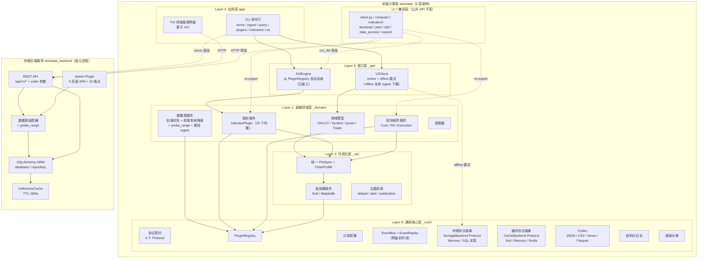
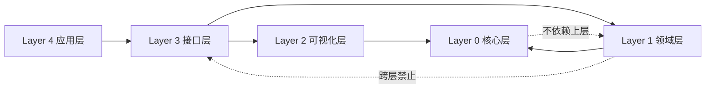
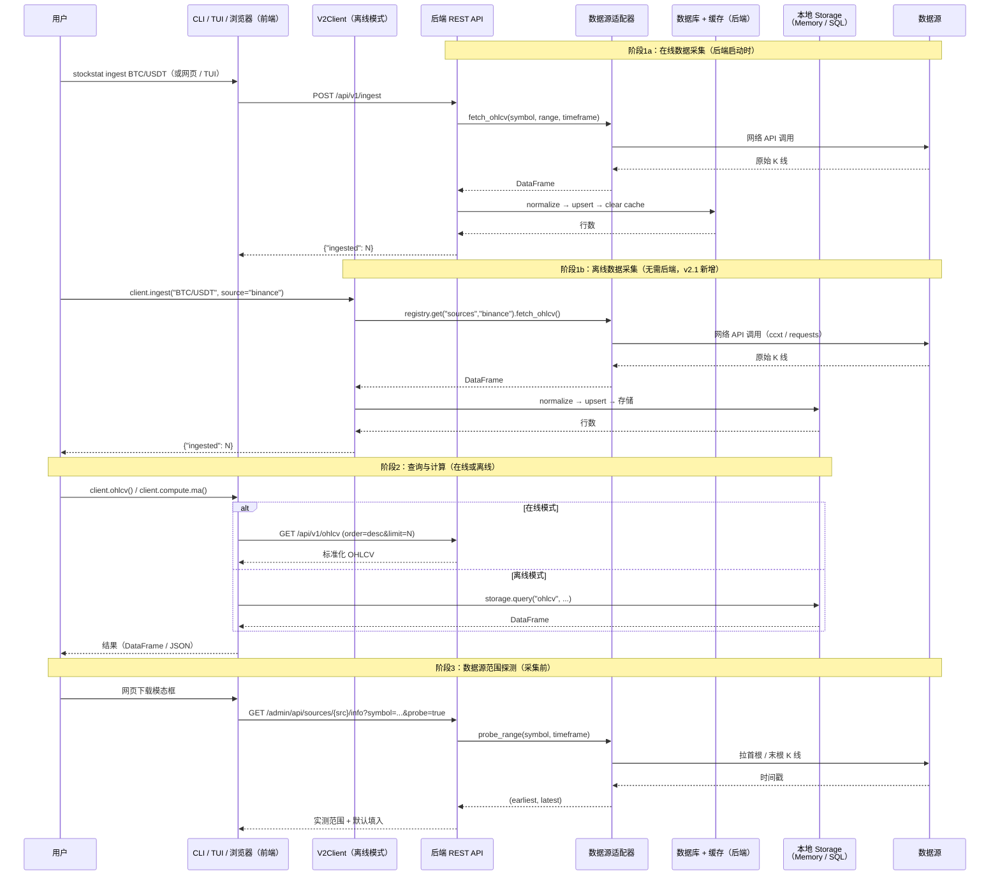
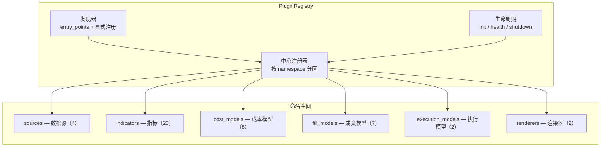
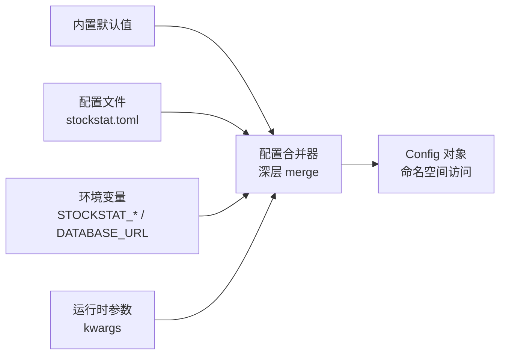
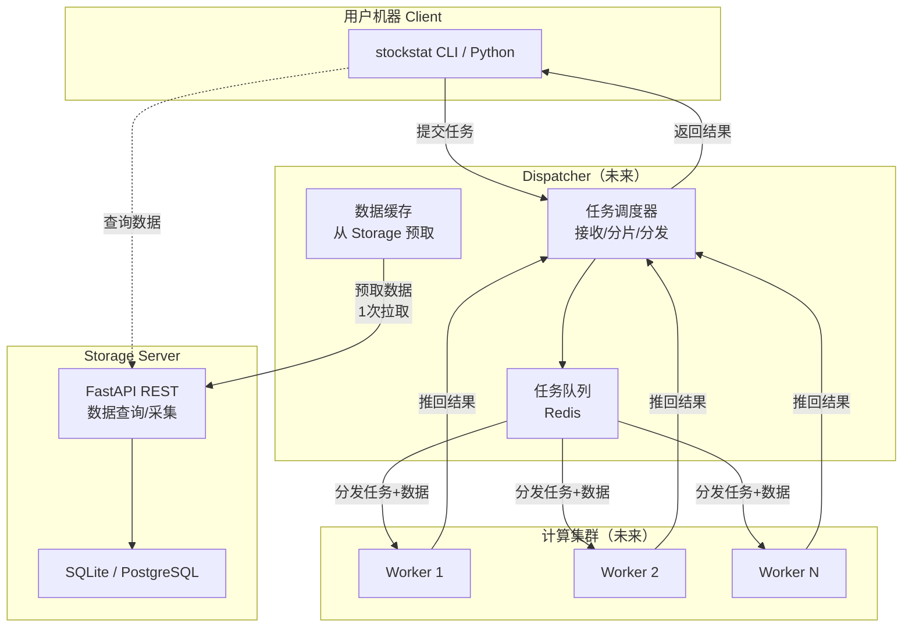

# StockStat — 可编程金融标的统计计算平台 设计报告

> **版本**：v2.1
> **日期**：2026-07-18
> **状态**：已实现（五层架构 + 存储后端独立部署 + DSL v2.0 接入 + 离线模式直接下载数据 + 分布式计算预留）

---

## 目录

1. [项目概述](#1-项目概述)
2. [总体架构](#2-总体架构)
3. [Layer 0：通用核心层 `_core`](#3-layer-0通用核心层-_core)
4. [Layer 1：金融领域层 `_domain`](#4-layer-1金融领域层-_domain)
5. [Layer 2：可视化层 `_viz`](#5-layer-2可视化层-_viz)
6. [Layer 3：接口层 `_api`](#6-layer-3接口层-_api)
7. [Layer 4：应用层 `app`](#7-layer-4应用层-app)
8. [存储后端设计](#8-存储后端设计)
9. [脚本语言设计](#9-脚本语言设计)
10. [API 规范](#10-api-规范)
11. [回测子系统设计](#11-回测子系统设计)
12. [管理界面](#12-管理界面)
13. [测试体系](#13-测试体系)
14. [技术栈选型](#14-技术栈选型)
15. [部署方案](#15-部署方案)
16. [分布式计算预留](#16-分布式计算预留)
17. [项目结构](#17-项目结构)
18. [开发路线图](#18-开发路线图)
- [附录 A：数据源兼容性矩阵](#附录-a数据源兼容性矩阵)
- [附录 B：OHLCV 数据量估算](#附录-bohlcv-数据量估算)
- [附录 C：v1.7 vs v2.0 逐项对比](#附录-c-v17-vs-v20-逐项对比)
- [附录 D：回测阶段实现文档索引](#附录-d-回测阶段实现文档索引)

---

## 1. 项目概述

### 1.1 项目目标

构建一个**用户可编程**的股票 / 加密货币标的统计量计算平台，核心能力包括：

- **统一数据接入**：兼容多数据源（股票 API、加密货币交易所、合成数据），对上层提供统一接口
- **可编程计算**：用户可通过 Python 库或自定义 DSL 编写统计计算逻辑
- **计算-存储分离**：存储后端（`stockstat_backend`）作为独立可部署服务，计算前端（`stockstat`）以库形式接入，可配置连接；为未来分布式计算 offload 预留
- **插件化扩展**：数据源、指标、成本模型、成交模型、执行模型、渲染器均为插件，支持自动发现
- **离线模式**：前端可不连后端，直接用本地存储运行计算 / 回测；**v2.1 新增：离线模式下可直接从数据源下载数据（通过 `PluginRegistry` 适配器），也可直接读取现有 SQLite 数据库文件**
- **可视化管理**：内置 TUI 与网页管理界面，无需写代码即可完成数据采集、浏览、K 线查看

### 1.2 设计原则

| 原则 | 说明 |
|------|------|
| **通用底** | 底层核心（`_core`）与金融领域无关，可独立复用于任何时序数据场景 |
| **领域分层** | 金融逻辑（`_domain`）构建在通用底之上，不反向依赖接口层 |
| **插件优先** | 所有可扩展点走统一 `PluginRegistry`，支持 `entry_points` 自动发现 |
| **协议优先** | 层间通过 `Protocol` 通信，实现可替换，无硬编码 `if-else` |
| **核心零硬依赖** | 计算 / 回测核心仅依赖 pandas / numpy / scipy；matplotlib、optuna、PyWavelets、lark、rich 走可选 extras |
| **计算-存储分离** | 前端库不绑定特定存储后端，通过 HTTP 或本地 Storage 协议访问数据 |
| **向后兼容** | v1.7 公共 API 零修改可用；`_core` / `_domain` / `_viz` / `_api` 以下划线开头为内部实现 |

### 1.3 核心功能清单

以下功能均已实现：

- 多数据源接入（yfinance 直连 / ccxt[Binance、Coinbase] / 合成数据）
- OHLCV 标准化存储（默认 SQLite，可选 TimescaleDB via Docker）
- 统一 REST API 查询（JSON / CSV；支持 `order=asc/desc` 双向分页）
- Python 计算库（pandas / numpy / scipy 集成）
- 表达式 DSL（SQL-like，基于 lark；**v2.0 已接入 `DslEngine` 从 `PluginRegistry` 自动反射**）
- 内置技术指标库（MA / EMA / MACD / RSI / KDJ / ATR / Bollinger / Beta / Sharpe / VaR …，共 23 项）
- 信号处理与非线性动力学模块（CWT / 谱熵 / 灰色关联 / GM(1,1) / 传递熵 / Hurst / 样本熵 / 排列熵）
- 自定义指标注册机制（v2.0 统一为 `IndicatorPlugin` 协议）
- 计算结果导出（JSON / CSV / DataFrame）
- 可选可视化层（协议化设计，统一 `PlotSpec` + `ChartProfile`；支持 heatmap / log 轴 / 子图 / 主题）
- 回测子系统（多标的 / 多 tf / 可插拔执行模型 / 可视化 / 分析工具 / 批量回测）
- **CLI 命令行**（serve / ingest / query / plugins / indicators / tui）
- **TUI 终端管理界面**（基于 `rich`，可降级纯文本）
- **网页管理界面**（Admin Plugin：5 页面 SPA，含懒加载 K 线图、下载模态框、数据源实测范围探测）
- **离线模式**（`V2Client` 本地 Storage 直接访问，无需 HTTP；v2.1 支持离线 `ingest()` 直接从数据源下载 + `SQLStorage` 读取现有 SQLite 文件）

### 1.4 包结构与部署关系

项目包含**两个独立 pip 包**，支持灵活的部署拓扑：

| 包 | 安装位置 | 职责 | 可独立部署？ |
|----|---------|------|------------|
| `stockstat-backend` | `backend/` | 存储后端服务（FastAPI + SQLAlchemy + 数据源适配器） | ✅ 独立进程 |
| `stockstat` | `frontend/` | 计算前端库（ComputeEngine + 回测 + DSL + 可视化 + CLI/TUI） | ✅ 用户机器 / 计算节点 |

**部署拓扑**（详见 [§15](#15-部署方案) 和 [§16](#16-分布式计算预留)）：

- **单机全栈**：后端 + 前端在同一台机器
- **存储-计算分离**：后端独立部署，前端远程 HTTP 查询
- **离线模式**：前端用本地 `MemoryStorage` 或 `SQLStorage`，无需后端；v2.1 支持离线直接从数据源下载数据
- **分布式计算**（预留）：前端提交计算任务到 Dispatcher → Worker 集群并行执行

---

## 2. 总体架构

### 2.1 架构总览

项目采用**双包 + 五层**架构：`stockstat_backend`（存储后端）和 `stockstat`（前端计算库，内部分五层）。



### 2.2 v1.7 兼容层与 v2.0 层的关系

v1.7 兼容层（`client.py` / `compute/` / `indicators/` / `backtest/` / `plot/` / `dsl/` / `data_access/` / `export/`）保持为**公共 API 入口**，内部逐步转发到 v2.0 层：

| 兼容层模块 | v2.0 接入状态 | 说明 |
|-----------|-------------|------|
| `client.py` → `run_dsl()` | ✅ **已接入** | 优先用 `_api/dsl/DslEngine`（从 `PluginRegistry` 自动反射 23 个函数），fallback 到 v1.7 `Evaluator`（15 个硬编码函数） |
| `client.py` → `ohlcv()` | ✅ **已增强** | 新增 `order` 参数，转发到 `DataClient` → HTTP |
| `client.py` → `compute` | ⚠️ v1.7 直接调用 | `ComputeEngine` 直接调 `indicators/*` 函数；`register()`/`call()` 走 v1.7 `compute/registry.py` |
| `client.py` → `backtest()` | ⚠️ v1.7 直接调用 | `BacktestEngine` 命令式循环（稳定，277 项测试覆盖） |
| `client.py` → `plot` | ⚠️ v1.7 直接调用 | 用 v1.7 `plot/base.PlotSpec`；`_viz/specs.PlotSpec` 作为并行能力存在 |
| `dsl/evaluator.py` | ⚠️ 保留为 fallback | v1.7 `Evaluator` + `_BUILTIN_FUNCS`，当 v2.0 层不可用时使用 |

**设计决策**：回测引擎保持命令式而非事件驱动，因为：
1. 命令式实现已稳定，有 277 项测试覆盖
2. 事件驱动重构是巨大工作量（28 个文件）
3. `EventBus` + `EventReplay` 已实现并保留，供未来实时流场景使用
4. 符合"渐进式迁移"原则——兼容层先行，逐步接入

### 2.3 层间依赖规则



**铁律**：

1. 上层依赖下层，下层不感知上层
2. 层间通过 `Protocol` 通信，不导入具体实现类
3. 跨层禁止：domain 不能直接调 api
4. v1.7 兼容层保持公共 API 不变，内部逐步转发到 v2.0 架构
5. **计算-存储分离**：`stockstat`（前端库）与 `stockstat_backend`（存储后端）是两个独立包
   - **在线模式**：前端通过 HTTP 调用后端 REST API
   - **离线模式**：前端 `V2Client` 直接使用 Layer 0 的 `MemoryStorage` / `SQLStorage`，无需后端；v2.1 支持离线 `ingest()` 通过 `PluginRegistry` 适配器直接从数据源下载数据
   - 前端 `_domain/sources/` 和 `_core/_compat.py` 通过 `try/except ImportError` 优雅降级，当后端未安装时自动使用前端本地适配器（`_LazySourcePlugin` 延迟实例化 ccxt/requests）

### 2.4 数据流



---

## 3. Layer 0：通用核心层 `_core`

> **设计原则**：与金融领域完全无关。处理时间序列、存储、缓存、序列化、插件、事件、配置等通用原语。

### 3.1 协议契约 `contracts/`

定义所有跨层通信的 `Protocol`（`typing.Protocol`），不含实现：

| 协议 | 职责 |
|------|------|
| `Plugin` | 通用插件协议（name / version / category / initialize / shutdown / health_check） |
| `StorageBackend` | 存储后端（query / write / upsert / delete / count / schema / health_check） |
| `CacheBackend` | 缓存后端（get / set / delete / exists / clear / health_check） |
| `Codec` | 序列化编解码（encode / decode / media_type） |
| `Renderer` | 渲染器（render / show / savefig / available） |
| `EventSubscriber` / `EventPublisher` | 事件订阅 / 发布 |

辅助数据结构：`DataSchema` / `FieldDef` / `PluginMetadata` / `PluginContext` / `Event`。

### 3.2 插件注册中心 `plugin/`



**核心能力**：命名空间分区、`entry_points` 自动发现、显式注册、依赖声明、生命周期管理、元数据查询。共 46 个内置插件。

**接入状态**：
- ✅ `DslEngine` 从 `PluginRegistry` 自动反射指标函数（已接入 `StockStatClient.run_dsl()`）
- ✅ CLI `stockstat plugins` / `stockstat indicators` 命令查询注册中心
- ⚠️ `ComputeEngine` 的 40+ 方法仍直接调用 `indicators/*` 函数（未通过 registry 调度）
- ⚠️ `entry_points` 自动发现能力已实现但未启用（`discover()` 从未被调用）

### 3.3 分层配置系统 `config/`



命名空间示例：`config.backend.database_url` / `config.cache.backend` / `config.proxy.enabled` / `config.frontend.host`。

v1.7 的所有环境变量（`DATABASE_URL` / `STOCKSTAT_*`）100% 兼容。

### 3.4 事件总线 + 数据流 `events/`

| 组件 | 职责 | 状态 |
|------|------|------|
| `EventBus` | 进程内 pub/sub，按主题路由；支持同步分发 | ✅ 已实现 |
| `Event` | 不可变事件对象（topic / payload / timestamp / source） | ✅ 已实现 |
| `EventReplay` | 从历史存储读取数据，按时序重放为事件流 | ✅ 已实现 |

**接入状态**：`EventBus` + `EventReplay` 已实现但**未被回测引擎使用**。当前回测引擎采用命令式 `for` 循环遍历 bar（稳定，277 项测试覆盖）。事件总线保留为**预留能力**，供未来实时数据流和事件驱动回测重构使用。

### 3.5 存储协议抽象 `storage/`

> Layer 0 的 `storage/` 定义 `StorageBackend` Protocol 及其实现，是**前端的存储抽象层**（非后端服务）。在线模式通过 HTTP 调用后端；离线模式直接使用 `MemoryStorage`。

| 实现 | 适用场景 | 状态 |
|------|---------|------|
| `MemoryStorage` | 测试 / 极小数据 / 离线模式 | ✅ 已实现 |
| `SQLStorage` | 默认（SQLite / PostgreSQL），通过 `_compat.py` 桥接后端 SQLAlchemy ORM | ✅ 已实现 |
| `TimescaleStorage` | 海量时序（Docker 部署，Hypertable） | ❌ 规划中 |
| `ParquetStorage` | 离线分析（只读快照） | ❌ 规划中 |

> `SQLStorage` 的所有方法通过 `_compat.py` 委托到后端 `ohlcv_repo`。`_compat.py` 使用 `try/except ImportError` 优雅降级——当后端未安装时，自动用 SQLAlchemy 独立建表。

### 3.6 缓存协议抽象 `cache/`

> Layer 0 的 `cache/` 定义 `CacheBackend` Protocol 及其实现。后端服务 `stockstat_backend` 有自己独立的 `InMemoryCache`（TTL=300s），与此处的协议抽象独立。

| 实现 | 说明 |
|------|------|
| `NullCache` | 不缓存（测试用） |
| `MemoryCache` | 进程内 TTL 缓存（默认，TTL=300s） |
| `RedisCache` | 分布式缓存（按 `config.cache.backend` 自动选择） |

### 3.7 序列化编解码 `codec/`

| Codec | media_type |
|-------|------------|
| `JsonCodec` | `application/json` |
| `CsvCodec` | `text/csv` |
| `ArrowCodec` | `application/vnd.apache.arrow.file` |
| `ParquetCodec` | `application/vnd.apache.parquet` |

### 3.8 日志与错误

| 组件 | 职责 |
|------|------|
| `StructuredLogger` | JSON 结构化日志 + 上下文绑定（`bind(symbol="BTC/USDT")`） |
| `AppError` | 带错误码、上下文、可恢复标志的异常基类 |
| 错误子类 | `DataNotFoundError` / `SymbolNotFoundError` / `AdapterError` / `InvalidParamsError` / `RateLimitedError` / `LookaheadError` / `PluginNotFoundError` |

---

## 4. Layer 1：金融领域层 `_domain`

### 4.1 领域模型 `models/`

| 模型 | 说明 |
|------|------|
| `OHLCV` | 单根 K 线（symbol / ts / OHLCV / source / timeframe） |
| `Symbol` | 已注册标的（unified_symbol / asset_type / base / quote / sources） |
| `Quote` | 实时报价（bid / ask / mid 自动计算） |
| `Trade` | 成交记录（price / qty / side） |

提供 `df_to_ohlcv_list()` / `ohlcv_list_to_df()` 双向转换。与存储解耦（不绑 ORM）。

### 4.2 数据源插件 `sources/`

`DataSourcePlugin` 包装数据源适配器，注册到 `PluginRegistry` 的 `sources` 命名空间。采用**后端优先 + 前端本地降级**策略：

1. **后端包已安装**：使用后端完整适配器（含 `fetch_symbols` / `probe_range` / `health_check`）
2. **后端包未安装**：自动注册前端本地适配器（`_LazySourcePlugin` 延迟实例化）：
   - `synthetic`：`_local_synthetic.py`（纯 Python，零依赖）
   - `yfinance`：前端本地 Yahoo API 适配器（依赖 `requests`，延迟导入）
   - `binance` / `coinbase`：前端本地 ccxt 适配器（依赖 `ccxt`，延迟导入）

| 适配器 | name | 网络 | 标的目录 | 时间粒度数 |
|--------|------|------|---------|-----------|
| `YahooDirectAdapter` | `yfinance` | 是 | 85 个常用标的 + 手动输入 | 12 种 |
| `CcxtAdapter("binance")` | `binance` | 是 | 4,498（全市场） | 16 种 |
| `CcxtAdapter("coinbase")` | `coinbase` | 是 | 1,183（全市场） | 7 种 |
| `SyntheticAdapter` | `synthetic` | 否 | 5 个示例 | 9 种 |

**`probe_range()` 协议**：每个适配器实现 `probe_range(symbol, timeframe) -> (earliest_iso, latest_iso)`，用于在采集前实测数据源中该标的的实际可用时间范围。

**`_LazySourcePlugin`**：后端未安装时使用。适配器实例在首次 `fetch_ohlcv()` 调用时才创建（延迟导入 ccxt/requests），缺失可选依赖时不报错，仅在实际使用时报错。

**Yahoo Finance 标的目录说明**：Yahoo Finance 没有公开的"列出所有标的"API，因此 `YahooDirectAdapter.fetch_symbols()` 返回 85 个精选常用标的。用户可通过网页管理界面的"手动输入标的"框下载任意有效 Yahoo ticker。

**离线 `ingest()` 能力**（v2.1 新增）：`V2Client(mode="offline")` 的 `ingest()` 不再 `raise RuntimeError`，而是通过 `registry.get("sources", source)` 获取适配器 → `fetch_ohlcv()` → 标准化 → `storage.upsert()`，直接将数据下载到本地存储。

### 4.3 指标插件 `indicators/`

`IndicatorPlugin` 协议包装 v1.7 指标函数，注册到 `indicators` 命名空间。23 个内置指标自动注册：

| 类别 | 指标 |
|------|------|
| 趋势 | `ma` / `ema` / `macd` |
| 震荡 | `rsi` / `kdj` |
| 波动 | `std` / `atr` / `bollinger` |
| 统计 | `corr` / `beta` / `sharpe` / `max_drawdown` / `var` |
| 变换 | `returns` / `log_returns` |
| 非线性 | `wavelet_decompose` / `spectral_entropy` / `grey_relation` / `gm11_predict` / `transfer_entropy` / `hurst_dfa` / `sample_entropy` / `permutation_entropy` |

**接入状态**：
- ✅ `DslEngine` 从 `PluginRegistry` 自动反射全部 23 个指标为 DSL 函数（已接入 `StockStatClient.run_dsl()`）
- ⚠️ `ComputeEngine` 的 40+ 方法仍直接调用 `indicators/*` 模块函数（未通过 registry 调度）

### 4.4 回测组件插件 `backtest/`

`BacktestComponentPlugin` 包装 v1.7 回测组件，注册到对应命名空间：

| 命名空间 | 组件数 | 清单 |
|---------|--------|------|
| `cost_models` | 8 | Percent / Fixed / Tiered / Min / StampDuty / Zero / MakerTaker / Binance |
| `fill_models` | 7 | NextOpen / NextClose / ThisClose / VWAP / WorstPrice / IntrabarLimit / IntrabarFillModel |
| `execution_models` | 2 | NextBarExecution / IntrabarExecution |

### 4.5 调度器 `scheduler/`

v1.7 为空 stub；v2.0 提供功能性实现：

- **on-demand**：`trigger_now(symbol, source, ...)` — 立即采集
- **cron**：`schedule_cron(symbol, cron_expr, ...)` — 定时采集
- **incremental**：`schedule_incremental(symbol, interval_hours=24)` — 增量更新

---

## 5. Layer 2：可视化层 `_viz`

### 5.1 统一 Spec 体系

`_viz/specs/` 提供统一的 `PlotSpec` + `ChartProfile` 预设：

| 组件 | 职责 |
|------|------|
| `PlotSpec` | 后端无关的绘图规格（series / subplots / markers / log 轴 / heatmap / figsize / theme） |
| `SeriesSpec` | 单条数据系列（kind: line / bar / scatter / fill / histogram / heatmap） |
| `SubplotSpec` | 子图面板 |
| `ChartProfile` | 命名预设，从 `BacktestResult` 构建 `PlotSpec` |

**6 个内置 `ChartProfile`**：`equity_curve` / `drawdown` / `trades_overlay` / `returns_distribution` / `monthly_heatmap` / `dashboard`

**接入状态**：`_viz` 层已实现但**未被 `StockStatClient` 主路径使用**。当前 `client.plot` 用 v1.7 `plot/base.PlotSpec`（无 `theme` 字段），回测可视化用 `backtest/chart_spec.py` 的 `BacktestChartSpec`。`_viz` 作为并行能力保留，供未来统一。

### 5.2 渲染器插件

| 渲染器 | 状态 |
|--------|------|
| `NullRenderer` | ✅ 零依赖兜底 |
| `MatplotlibRenderer` | ✅ 延迟导入 |
| `PlotlyRenderer` | 规划中 |

### 5.3 主题系统

| 主题 | 风格 |
|------|------|
| `default` | 白底，标准配色 |
| `dark` | 深色背景 |
| `publication` | 学术出版风格（小字号） |

---

## 6. Layer 3：接口层 `_api`

### 6.1 DSL 自动反射 `dsl/`（已接入）

`DslEngine` 从 `PluginRegistry` 自动加载所有已注册指标作为 DSL 函数，取代 v1.7 手动维护的 `_BUILTIN_FUNCS` 字典。

```python
engine = DslEngine(registry, client=client)
result = engine.eval('SELECT close, ma(close, 20) AS ma20 FROM ohlcv("BTC/USDT", "1d", ...)')
```

**接入路径**：`StockStatClient.run_dsl()` → 优先用 `_dsl_v2`（`DslEngine`，23 个函数）→ fallback 到 `_dsl`（v1.7 `Evaluator`，15 个函数）

注册新指标后调用 `engine.refresh()` 即可 DSL 可用。

### 6.2 V2Client（在线 + 离线）

```python
# 在线模式（连接后端 HTTP）
client = V2Client(mode="online", host="192.168.1.100", port=8000)

# 离线模式 — 内存存储
client = V2Client(mode="offline", storage=MemoryStorage())

# 离线模式 — 读取现有 SQLite 数据库文件
client = V2Client(mode="offline", storage=SQLStorage(database_url="sqlite:///stockstat.db"))
```

离线模式下全部功能本地运行：

| 功能 | 在线模式 | 离线模式 |
|------|---------|---------|
| `ohlcv()` | HTTP → 后端 REST API | `storage.query()` 本地查询 |
| `ingest()` | HTTP → 后端采集 | **`registry` 适配器 → `fetch_ohlcv()` → `storage.upsert()`（v2.1 新增）** |
| `compute` | 后端无关 | 本地 `ComputeEngine` |
| `run_dsl()` | `DslEngine`（HTTP 取数据） | `DslEngine`（本地 Storage 取数据） |
| `backtest()` | 后端无关 | 本地 `BacktestEngine` |
| `plot` | 后端无关 | 本地 `PlotAPI` |

**离线 `ingest()` 数据流**：
```
client.ingest("BTC/USDT", source="binance")
  → registry.get("sources", "binance")     # 从 PluginRegistry 获取适配器
  → adapter.fetch_ohlcv(symbol, ...)       # 直连 Binance API
  → normalize → storage.upsert("ohlcv", records)  # 写入本地 MemoryStorage / SQLStorage
  → return {"ingested": N}
```

**`SQLStorage` 读取现有数据库**：`SQLStorage(database_url="sqlite:///path/to/stockstat.db")` 可直接读取后端创建的 SQLite 文件，通过 `_compat.py` 委托到 `ohlcv_repo.query()`。`_compat.py` 在后端未安装时自动用独立 SQLAlchemy 建表。

---

## 7. Layer 4：应用层 `app`

### 7.1 CLI 命令行

```bash
stockstat serve --host 0.0.0.0 --port 8000     # 启动 API 服务器
stockstat ingest BTC/USDT --source binance      # 命令行采集
stockstat query BTC/USDT --limit 5              # 查询输出
stockstat plugins --namespace indicators        # 列出已注册插件
stockstat indicators --category nonlinear       # 列出指标
stockstat tui --host 192.168.1.100              # 启动 TUI 管理界面
```

### 7.2 TUI 终端管理界面

`stockstat tui` 提供交互式终端界面，基于 `rich`（可选安装 `pip install rich`），未安装时降级为纯文本菜单。详见 [§12.1](#121-tui-终端管理界面)。

### 7.3 服务器入口

`stockstat serve` 等价于 `python -m uvicorn stockstat_backend.app:app`，按配置启动 REST 服务，并条件挂载 Admin Plugin。

---

## 8. 存储后端设计

### 8.1 数据源适配器层

数据源适配器采用**插件化**设计，每个适配器继承 `DataSourceAdapter` 抽象基类。适配器管理逻辑提取到公开模块 `api/adapters.py`，供主路由和 admin plugin 共用。

**适配器基类协议**（`adapters/base.py`）：

```python
class DataSourceAdapter(ABC):
    @abstractmethod
    def fetch_ohlcv(self, symbol, start=None, end=None, timeframe="1d") -> pd.DataFrame: ...
    def fetch_symbols(self) -> list[dict]: ...           # 列出可用标的
    def supports(self, symbol: str) -> bool: ...          # 是否支持该标的
    def health_check(self) -> bool: ...                    # 数据源健康检查
    def probe_range(self, symbol, timeframe="1d") -> tuple[str|None, str|None]: ...  # 实测时间范围
```

### 8.2 代理支持

| 环境变量 | 默认值 | 说明 |
|----------|--------|------|
| `STOCKSTAT_PROXY_ENABLED` | `false` | 是否启用代理 |
| `STOCKSTAT_PROXY_TYPE` | `http` | 代理类型：`http` 或 `socks5` |
| `STOCKSTAT_PROXY_URL` | （按类型自动填充） | 代理地址 |

### 8.3 数据标准化层

`normalize_ohlcv()` 将异构原始数据统一为内部规范格式：时区统一 UTC、字段校验（OHLCV 必填）、清洗 dropna。

**统一数据模型**（SQLAlchemy ORM `OHLCV` 表）：

| 字段 | 类型 | 说明 |
|------|------|------|
| `id` | `Integer PK` | 自增主键 |
| `symbol` | `String(50)` | 统一符号 |
| `ts` | `DateTime(tz=True)` | UTC 时间戳 |
| `open/high/low/close` | `Float` | OHLC |
| `volume` | `Float` | 成交量 |
| `source` | `String(50)` | 数据来源 |
| `timeframe` | `String(10)` | 时间周期 |
| `ingested_at` | `DateTime(tz=True)` | 采集时间 |

**唯一约束**：`(symbol, ts, timeframe, source)` 联合唯一，保证 upsert 幂等。

### 8.4 存储引擎

| 部署模式 | `DATABASE_URL` | 特性 |
|---------|----------------|------|
| **默认（本地开发）** | `sqlite:///stockstat.db` | 零外部依赖，**关闭后重启自动读取先前数据** |
| **指定路径** | `sqlite:////data/stockstat.db` | 自定义数据库文件位置 |
| **Docker 生产** | `postgresql://...@db:5432/stockstat` | TimescaleDB + 数据卷持久化 |

### 8.5 查询与缓存策略

**Repository 查询**（`storage/repository.py`）支持 `order` 参数双向分页：
- `order="asc"`（默认）：从最早开始，返回最旧 N 条
- `order="desc"`：从最新开始，返回最近 N 条，但 DataFrame 内部仍按升序排列

**缓存策略**：默认 `InMemoryCache`（TTL=300s）。缓存键包含 `order` 参数，保证不同方向的查询独立缓存。

---

## 9. 脚本语言设计

提供**双模式**可编程接口：Python 库（全功能）+ DSL（轻量声明式）。

### 9.1 DSL 语法

```
query       : "SELECT" select_list "FROM" source ("WHERE" condition)? ("LIMIT" INT)?
source      : "ohlcv" "(" string ("," string)* ")"
?expr       : expr OP expr | func_call | NAME | NUMBER | STRING
func_call   : NAME "(" (expr ("," expr)*)? ("," kwarg)* ")"
```

### 9.2 DSL 函数（v2.0 自动反射）

`StockStatClient.run_dsl()` 优先使用 v2.0 `DslEngine`，从 `PluginRegistry` 自动反射全部 23 个已注册指标（比 v1.7 的 15 个多 8 个非线性指标）。当 v2.0 层不可用时，fallback 到 v1.7 `Evaluator`。

| 类别 | 函数 | v1.7 | v2.0 |
|------|------|------|------|
| 趋势 | `ma` / `ema` / `macd` | ✅ | ✅ |
| 震荡 | `rsi` | ✅ | ✅ |
| 波动 | `std` / `atr` / `bollinger` | ✅ | ✅ |
| 统计 | `corr` | ✅ | ✅ |
| 变换 | `returns` / `log_returns` | ✅ | ✅ |
| 聚合 | `max` / `min` / `mean` / `sum` / `count` | ✅ | ❌ |
| 非线性 | `wavelet_decompose` / `spectral_entropy` / ... | ❌ | ✅ |

---

## 10. API 规范

### 10.1 REST API 总览

| 端点 | 方法 | 说明 |
|------|------|------|
| `/api/v1/health` | GET | 健康检查（含代理状态） |
| `/api/v1/proxy` | GET | 查询代理配置 |
| `/api/v1/sources` | GET | 数据源列表（含代理状态） |
| `/api/v1/ingest` | POST | 触发数据采集 |
| `/api/v1/ohlcv` | GET | 查询 OHLCV 数据（json / csv；支持 `order`） |
| `/api/v1/symbols` | GET | 已注册符号列表 |
| `/api/v1/symbols/{symbol}` | GET | 符号详情 |

### 10.2 核心 API — `GET /api/v1/ohlcv`

| 参数 | 类型 | 必填 | 说明 |
|------|------|------|------|
| `symbol` | string | 是 | 统一符号 |
| `source` | string | 否 | 数据源；未指定时自动检测 |
| `start` / `end` | string | 否 | 时间范围 |
| `timeframe` | string | 否 | 默认 `1d` |
| `limit` | int | 否 | 返回条数上限 |
| `order` | string | 否 | `asc`（默认）/ `desc` |
| `format` | string | 否 | `json`（默认）/ `csv` |

Python 库 `StockStatClient.ohlcv()` 也支持 `order` 参数，转发到 REST API。

---

## 11. 回测子系统设计

> 回测子系统位于 `stockstat.backtest`（v1.7 兼容层，28 个文件），组件在 v2.0 注册到 `PluginRegistry`。

### 11.1 设计目标

| 目标 | 说明 |
|------|------|
| 可配置 | 自定义策略、多标的交易组、多时间尺度 K 线、复用计算库指标 |
| 可编程优先 | `Strategy` 基类 + `@strategy` 装饰器 + `IntrabarMixin` |
| 零硬依赖 | 核心仅依赖 pandas / numpy；optuna / matplotlib 走 extras |
| 未来函数防护 | `on_bar(t)` 只能访问 `≤ t` 数据；默认 `t+1` open 成交 |
| 可插拔执行 | `ExecutionModel` ABC：`NextBarExecution`（默认）/ `IntrabarExecution` |
| 向后兼容 | 所有新参数有默认值；现有代码零修改 |

### 11.2 引擎模型

当前回测引擎采用**命令式 `for` 循环**遍历 bar，而非事件驱动：

```python
for t in master_index:
    ctx.update_bar(t)
    strategy.on_bar(ctx)
    broker.match_orders(ctx)
```

**设计决策**：保持命令式而非重构为事件驱动，因为：
1. 命令式实现已稳定，有 277 项测试覆盖
2. 事件驱动重构是巨大工作量（28 个文件）
3. `EventBus` + `EventReplay` 已实现并保留，供未来实时流场景使用
4. 符合"渐进式迁移"原则

### 11.3 成本与成交模型

**成本模型**（8 种）：`PercentCost` / `FixedCost` / `TieredCost` / `MinCost` / `StampDutyCost` / `ZeroCost` / `MakerTakerCost` / `BinanceCost`（4 预设）

**成交模型**（7 种）：`NextOpenFill` / `NextCloseFill` / `ThisCloseFill` / `VWAPFill` / `WorstPriceFill` / `IntrabarLimitFill` / `IntrabarFillModel`

### 11.4 可插拔执行模型

`IntrabarExecution` 解决 5 项结构性差距：同 bar 入场+出场、成交时间追踪、SL 优先于 TP 等。

### 11.5 回测可视化

9 种图表类型：`equity_curve` / `drawdown` / `trades_overlay` / `returns_distribution` / `monthly_heatmap` / `yearly_returns` / `parameter_heatmap` / `underwater_curve` / `dashboard`。

---

## 12. 管理界面

### 12.1 TUI 终端管理界面

`stockstat tui` 提供交互式终端界面，基于 `rich`（可选安装 `pip install rich`），未安装时降级为纯文本菜单。

### 12.2 网页管理界面（Admin Plugin）

网页管理界面是一个**可插拔的独立 plugin**（`plugins/admin/`），通过 `AdminPlugin.mount(app)` 挂载到 FastAPI 应用。

**Plugin 包结构**：

```
backend/stockstat_backend/plugins/admin/
├── __init__.py    # 导出 AdminPlugin
├── plugin.py      # AdminPlugin.mount(app) / unmount(app)
├── router.py      # 15 个 API 端点（含 probe 参数）
├── web.py         # 42KB SPA HTML（5 页面，含懒加载 K 线图）
├── models.py      # IngestLog ORM（独立 DeclarativeBase）
├── utils.py       # mask_db_url / get_disk_usage（跨平台）
└── lock.py        # _ingest_lock / _batch_tasks（线程安全状态）
```

**SPA 网页前端特性**：概览仪表盘 / 数据源浏览（+手动输入标的）/ 本地标的（懒加载 K 线图）/ 配置管理 / 日志查看

**懒加载 K 线图**：初始加载最近 500 根 → 缩放时自动加载窗口外数据（300ms 防抖 + 时间戳去重）

**下载模态框**：`probe_range` 实测数据源范围 → 日期预填最大范围 → 动态时间粒度下拉

---

## 13. 测试体系

| 测试文件 | 覆盖范围 | 数量 |
|---------|---------|------|
| `test_v2_core.py` | 核心层 | 49 |
| `test_v2_domain.py` | 领域层 | 27 |
| `test_v2_viz.py` | 可视化层 | 23 |
| `test_v2_api.py` | 接口层（DSL 反射 / V2Client 离线 / CLI） | 17 |
| `test_frontend.py` | v1.7 指标 / DSL / 可视化 / 序列化 | 31 |
| `test_nonlinear.py` | 8 个非线性函数 + 3 个 PlotSpec 工厂 | 38 |
| `test_backtest_*.py`（17 个文件） | 回测全套 | 277 |
| `test_backend.py` | 后端 API / 适配器 / 存储 / 缓存 / 代理 | 15 |
| `test_integration.py` | 经典统计 + PAXG 周末相关性（真实数据） | 19 |
| `test_matplotlib_charts.py` | matplotlib 图表生成 | 10 |
| **合计** | | **506** |

---

## 14. 技术栈选型

| 层 | 技术 | 选型理由 |
|----|------|----------|
| 后端框架 | FastAPI | 原生 async，OpenAPI 文档，高性能 |
| ORM | SQLAlchemy 2.0 | 多后端切换，声明式模型 |
| 默认数据库 | SQLite | 零外部依赖，重启自动读取 |
| 生产数据库 | TimescaleDB (PostgreSQL 16) | Docker 部署，时序优化 |
| 缓存 | InMemoryCache（默认）/ Redis（可选） | 零依赖默认；生产可接 Redis |
| 计算核心 | pandas + numpy | 事实标准 |
| 统计扩展 | scipy | 谱熵、假设检验（核心依赖） |
| DSL 解析 | lark | EBNF 友好（可选 extras） |
| 数据传输 | JSON / CSV / Arrow / Parquet | v2.0 Codec 协议统一 |
| 可视化 | matplotlib（可选 extras） | 协议化适配，延迟导入 |
| K 线图 | lightweight-charts 4.2 | CDN 引入，SPA 内嵌，懒加载 |
| TUI 渲染 | rich（可选 extras） | 彩色表格，降级纯文本 |
| 部署 | Docker Compose | 一键部署后端服务栈 |

---

## 15. 部署方案

### 15.1 本地开发部署

```bash
cd backend && pip install -e .
cd frontend && pip install -e .
stockstat serve --host 0.0.0.0 --port 8000
```

### 15.2 网络远程部署（存储-计算分离）

后端独立部署在网络中的任意机器上，前端通过 HTTP 访问：

```python
from stockstat import StockStatClient
client = StockStatClient(host="192.168.1.100", port=8000)
```

### 15.3 离线模式（无需后端）

```python
from stockstat._api.client import V2Client
from stockstat._core.storage import MemoryStorage, SQLStorage

# 方式1：离线下载到内存
client = V2Client(mode="offline", storage=MemoryStorage())
client.ingest("BTC/USDT", source="binance", start="2024-01-01")  # 直接从 Binance 下载
df = client.ohlcv("BTC/USDT")  # 从内存读取

# 方式2：读取现有数据库文件
client = V2Client(mode="offline", storage=SQLStorage(database_url="sqlite:///stockstat.db"))
df = client.ohlcv("BTC/USDT")  # 直接读 SQLite 文件

# 方式3：离线下载 + 持久化到 SQLite
client = V2Client(mode="offline", storage=SQLStorage(database_url="sqlite:///my_data.db"))
client.ingest("AAPL", source="yfinance", start="2024-01-01")  # 下载并写入 SQLite
```

离线模式下 `ingest()` / `ohlcv()` / `compute` / `run_dsl()` / `backtest()` / `plot` 全部本地运行，无需 HTTP。

### 15.4 Docker 生产部署

```bash
docker compose up -d
```

---

## 16. 分布式计算预留

> 详见 [reports/COMPUTE_OFFLOAD_PLAN_CN.md](reports/COMPUTE_OFFLOAD_PLAN_CN.md) 和 [reports/COMPUTE_OFFLOAD_PLAN_V2_CN.md](reports/COMPUTE_OFFLOAD_PLAN_V2_CN.md)

### 16.1 设计目标

将重型计算任务（参数网格搜索、蒙特卡洛、大规模回测）offload 到网络上的计算节点，实现：
- **异步提交**：用户提交后不阻塞
- **并行加速**：多节点/多核并行执行
- **资源隔离**：计算不占用存储服务或用户机器资源
- **故障隔离**：计算崩溃不影响数据服务

### 16.2 三角色分离架构



### 16.3 当前架构与分布式的关系

当前架构已为分布式计算预留：
- **计算-存储分离**：前端通过 HTTP 查询后端，Worker 可同样方式查询
- **`StockStatClient` 可在 Worker 中复用**：Worker 安装 `stockstat` 包即可使用全部计算能力
- **`V2Client` 离线模式**：Worker 可用本地 `MemoryStorage` 加载 Dispatcher 分发的数据，无需直连 Storage
- **Codec 协议**：Arrow/Parquet 序列化支持高效数据传输
- **插件化**：Worker 自动发现指标/回测组件插件

### 16.4 部署场景演进

| 场景 | 描述 | 当前支持 |
|------|------|---------|
| A. 单机全栈 | Storage + Client + 计算在同一进程 | ✅ |
| B. 存储-计算分离 | Client 远程 HTTP 查询 Storage，本地计算 | ✅ |
| C. 离线模式 | Client 用本地 Storage，无需后端 | ✅ |
| D. 三角色分离 + 单计算节点 | Client → Dispatcher → Worker → Storage | ⏳ 规划中 |
| E. 计算集群 | Client → Dispatcher → [Workers] → Storage | ⏳ 规划中 |

---

## 17. 项目结构

```
StockStatistic/
├── backend/                              # 存储后端服务（独立部署）
│   ├── stockstat_backend/
│   │   ├── app.py                        # FastAPI 应用入口
│   │   ├── config.py                     # Settings + ProxyConfig
│   │   ├── api/
│   │   │   ├── routes.py                 # REST 路由（/api/v1/*，含 order）
│   │   │   └── adapters.py              # 公开适配器管理
│   │   ├── adapters/                     # 数据源适配器（+ probe_range）
│   │   ├── models/ohlcv.py               # ORM
│   │   ├── storage/                      # database / repository / cache
│   │   ├── normalizer/                   # 数据标准化
│   │   ├── plugins/admin/                # 网页管理界面 plugin
│   │   └── scheduler/                    # 调度器（stub）
│   ├── tests/                            # 15 项测试
│   └── pyproject.toml
│
├── frontend/                             # 计算前端库
│   ├── stockstat/
│   │   ├── __init__.py                   # 公共 API：StockStatClient
│   │   ├── client.py                     # v1.7 兼容层门面（run_dsl 已接入 v2.0）
│   │   ├── config.py                     # Config dataclass
│   │   ├── compute/                      # ComputeEngine（直接调用 indicators/*）
│   │   ├── indicators/                   # 指标实现
│   │   ├── backtest/                     # 回测引擎（28 文件，命令式）
│   │   ├── plot/                         # 可视化（v1.7 PlotSpec）
│   │   ├── dsl/                          # DSL 解析器（v1.7 Evaluator，fallback）
│   │   ├── data_access/                  # DataClient（httpx → REST，+ order）
│   │   ├── export/                       # 序列化
│   │   ├── _core/                        # Layer 0：通用核心
│   │   ├── _domain/                      # Layer 1：金融领域
│   │   │   ├── sources/                  #   数据源插件 + _LazySourcePlugin + _local_synthetic.py
│   │   │   ├── indicators/               #   IndicatorPlugin 协议（23 内置）
│   │   │   ├── backtest/                 #   回测组件插件
│   │   │   ├── models/                   #   OHLCV / Symbol / Quote / Trade
│   │   │   └── scheduler/                #   调度器
│   │   ├── _viz/                         # Layer 2：可视化（并行能力）
│   │   ├── _api/                         # Layer 3：接口（DslEngine 已接入）
│   │   └── app/                          # Layer 4：应用（CLI + TUI）
│   ├── tests/                            # 491 项测试
│   └── pyproject.toml
│
├── docker-compose.yml
├── docs/                                 # 使用文档 + 回测阶段文档 + 图表
├── reports/                              # 测试报告 + v2.0 实现报告 + 计算卸载规划
├── working/                              # PAXG 研究工作目录（v1~v7）
├── DESIGN.md / DESIGN_CN.md
├── README.md / README_CN.md
└── LICENSE                               # GPLv3
```

---

## 18. 开发路线图

| 阶段 | 内容 | 状态 |
|------|------|------|
| **P0~P4** | 存储后端 + 计算前端 + DSL + 指标库 + 可视化 | ✅ |
| **NL** | 信号处理与非线性动力学 | ✅ |
| **BT-0~14** | 回测子系统（接口→MVP→组合→多tf→成本→绩效→优化→intrabar） | ✅ |
| **BT-V0~V3** | 回测可视化 | ✅ |
| **v2.0 Phase 1~4** | 五层架构实现（_core / _domain / _viz / _api / app） | ✅ |
| **DSL 接入** | `StockStatClient.run_dsl()` → `DslEngine` 自动反射 | ✅ |
| **order 参数** | 双向分页查询（REST API + Python 库） | ✅ |
| **离线 ingest** | `V2Client` 离线模式直接从数据源下载 + `SQLStorage` 读现有 DB | ✅ |
| **Admin Plugin** | 网页管理界面 + 懒加载 K 线图 + probe_range | ✅ |
| **ComputeEngine 接入** | `ComputeEngine` 方法转发到 `PluginRegistry` | ⏳ |
| **可视化统一** | `client.plot` 切换到 `_viz/specs.PlotSpec` | ⏳ |
| **回测事件驱动** | `BacktestEngine` 重构为 `EventBus` + `EventReplay` | ⏳ |
| **entry_points 启用** | 第三方插件自动发现 | ⏳ |
| **分布式计算** | Dispatcher + Worker 集群 | ⏳ 规划中 |

---

## 附录 A：数据源兼容性矩阵

| 数据源 | 资产类型 | 网络 | 标的目录 | 时间粒度 | 范围探测 |
|--------|---------|------|---------|---------|---------|
| yfinance 直连 | 美股 / ETF / 指数 / 商品 / FX | 是 | 85 精选 + 手动输入 | 12 种 | ✅ Yahoo API 实测 |
| ccxt - Binance | 加密货币 | 是 | 4,498（1,479 USDT 对） | 16 种 | ✅ 首末 K 线实测 |
| ccxt - Coinbase | 加密货币 | 是 | 1,183（528 USD 对） | 7 种 | ✅ 首末 K 线实测 |
| SyntheticAdapter | 混合 | 否 | 5 个示例 | 9 种 | ✅ 固定范围 |

## 附录 B：OHLCV 数据量估算

| 范围 | 时间粒度 | 行数（1 年） | 存储估算 |
|------|---------|--------------|---------|
| 1 个标的 | 日线 | ~250 | ~2 KB |
| 1 个标的 | 1 分钟 | ~525,000 | ~15 MB |
| 1 个标的 | 1 秒（Binance） | ~31,536,000 | ~900 MB |
| Binance USDT 对（1,479） | 1 分钟 | ~776M | ~22 GB |

## 附录 C：v1.7 vs v2.0 逐项对比

| 维度 | v1.7 | v2.0 |
|------|------|------|
| **分层** | 2 层（backend / frontend） | 双包 + 五层（core / domain / viz / api / app） |
| **DSL** | `_BUILTIN_FUNCS` 硬编码 15 个 | `DslEngine` 从 `PluginRegistry` 自动反射 23 个（已接入） |
| **查询** | 仅 asc | `order=asc/desc` 双向分页（REST + Python 库） |
| **插件机制** | 适配器 if-elif / 指标 dict | 统一 PluginRegistry（46 个内置插件） |
| **存储** | 直接 SQLAlchemy ORM | StorageBackend Protocol（Memory / SQL） |
| **缓存** | InMemoryCache 唯一实现 | CacheBackend Protocol（Null / Memory / Redis） |
| **CLI** | 无 | serve / ingest / query / plugins / indicators / tui |
| **管理界面** | 无 | TUI + 网页 Admin Plugin |
| **离线模式** | 必须连 HTTP | V2Client 本地 Storage + 离线 ingest 直接下载 + SQLStorage 读现有 DB |
| **分布式预留** | 无 | 计算-存储分离 + Codec + 插件化（详见 §16） |
| **向后兼容** | — | v1.7 公共 API 零修改 |

## 附录 D：回测阶段实现文档索引

| 阶段 | 文档 | 测试 |
|------|------|------|
| BT-0~7 | [docs/backtest/BT0_CN.md](docs/backtest/BT0_CN.md) ~ [BT7_CN.md](docs/backtest/BT7_CN.md) | test_backtest_iface ~ strategies |
| BT-8~10 | [docs/backtest/BT8_CN.md](docs/backtest/BT8_CN.md) ~ [BT10_CN.md](docs/backtest/BT10_CN.md) | test_backtest_p0 / p1 / p2 |
| BT-11~14 | [docs/backtest/BT11_BT14_CN.md](docs/backtest/BT11_BT14_CN.md) | test_backtest_intrabar |
| BT-V0~V3 | [docs/backtest/BTV0_CN.md](docs/backtest/BTV0_CN.md) ~ [BTV3_CN.md](docs/backtest/BTV3_CN.md) | test_backtest_viz_* |
| BT-V Online | [docs/backtest/BT_VIZ_ONLINE_REPORT_CN.md](docs/backtest/BT_VIZ_ONLINE_REPORT_CN.md) | test_backtest_viz_online |

---

*v2.0 设计文档以代码实现为准。*
