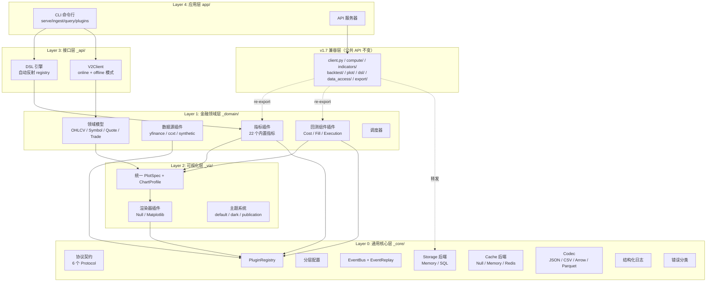
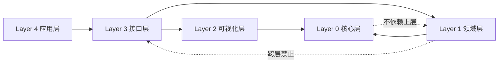
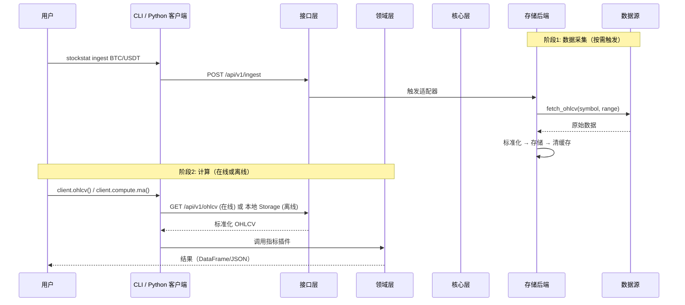
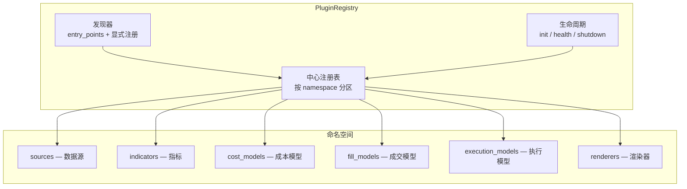
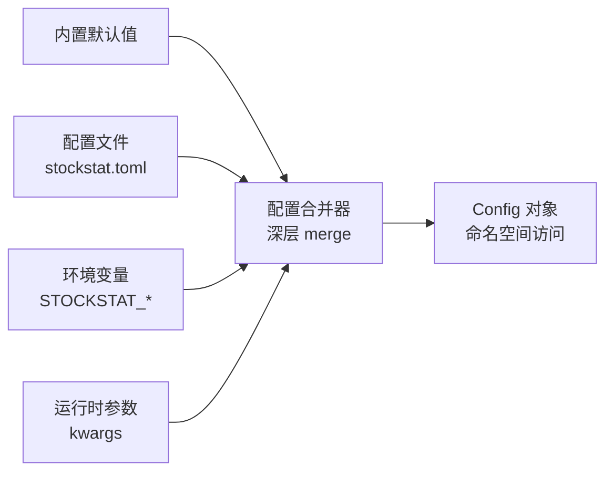

# StockStat — 可编程金融标的统计计算平台 设计报告

> **版本**: v2.0
> **日期**: 2026-07-18
> **状态**: 已实现（五层架构：通用核心 / 金融领域 / 可视化 / 接口 / 应用；含存储后端、计算前端、DSL 自动反射、信号处理与非线性动力学模块、回测子系统、可插拔执行模型、CLI、离线模式）

---

## 目录

1. [项目概述](#1-项目概述)
2. [总体架构（五层）](#2-总体架构五层)
3. [Layer 0：通用核心层 _core](#3-layer-0通用核心层-_core)
4. [Layer 1：金融领域层 _domain](#4-layer-1金融领域层-_domain)
5. [Layer 2：可视化层 _viz](#5-layer-2可视化层-_viz)
6. [Layer 3：接口层 _api](#6-layer-3接口层-_api)
7. [Layer 4：应用层 app](#7-layer-4应用层-app)
8. [存储后端设计](#8-存储后端设计)
9. [脚本语言设计](#9-脚本语言设计)
10. [API 规范](#10-api-规范)
11. [回测子系统设计](#11-回测子系统设计)
12. [测试体系](#12-测试体系)
13. [技术栈选型](#13-技术栈选型)
14. [部署方案](#14-部署方案)
15. [项目结构](#15-项目结构)
16. [开发路线图](#16-开发路线图)
- [附录 A: 数据源兼容性矩阵](#附录-a-数据源兼容性矩阵)
- [附录 B: OHLCV 数据量估算](#附录-b-ohlcv-数据量估算)
- [附录 C: v1.7 vs v2.0 逐项对比](#附录-c-v17-vs-v20-逐项对比)
- [附录 D: 回测阶段实现文档索引](#附录-d-回测阶段实现文档索引)

---

## 1. 项目概述

### 1.1 项目目标

构建一个**用户可编程**的股票/虚拟货币标的统计量计算平台，核心能力包括：

- **统一数据接入**：兼容多数据源（股票 API、加密货币交易所、合成数据），对上层提供统一接口
- **可编程计算**：用户可通过 Python 库 或自定义 DSL 编写统计计算逻辑
- **前后端分离**：存储后端作为独立可部署服务，计算前端以库形式接入，可配置连接
- **插件化扩展**：数据源、指标、成本模型、成交模型、执行模型、渲染器均为插件，支持自动发现
- **离线模式**：前端可不连后端，直接用本地存储运行计算/回测

### 1.2 设计原则

| 原则 | 说明 |
|------|------|
| **通用底** | 底层核心（`_core`）与金融领域无关，可独立复用于任何时序数据场景 |
| **领域分层** | 金融逻辑（`_domain`）构建在通用底之上，不反向依赖接口层 |
| **插件优先** | 所有可扩展点走统一 PluginRegistry，支持 `entry_points` 自动发现 |
| **事件驱动** | 统一历史回放与实时流为同一套事件模型 |
| **协议优先** | 层间通过 Protocol 通信，实现可替换，无硬编码 if-else |
| **核心零硬依赖** | 计算/回测核心仅依赖 pandas/numpy/scipy；matplotlib、optuna、PyWavelets、lark 走可选 extras |
| **向后兼容** | v1.7 公共 API 零修改可用；`_core`/`_domain`/`_viz`/`_api` 以下划线开头为内部实现 |

### 1.3 核心功能清单

以下功能均已实现：

- 多数据源接入（yfinance 直连 / ccxt[Binance、Coinbase] / 合成数据）
- OHLCV 标准化存储（默认 SQLite，可选 TimescaleDB via Docker）
- 统一 REST API 查询（JSON / CSV）
- Python 计算库（pandas/numpy/scipy 集成）
- 表达式 DSL（SQL-like，基于 lark；v2.0 支持从 PluginRegistry 自动反射函数）
- 内置技术指标库（MA / EMA / MACD / RSI / KDJ / ATR / Bollinger / Beta / Sharpe / VaR …）
- 信号处理与非线性动力学模块（CWT / 谱熵 / 灰色关联 / GM(1,1) / 传递熵 / Hurst / 样本熵 / 排列熵）
- 自定义指标注册机制（v2.0 统一为 IndicatorPlugin 协议）
- 计算结果导出（JSON / CSV / DataFrame）
- 可选可视化层（协议化设计，统一 PlotSpec + ChartProfile；支持 heatmap / log 轴 / 子图 / 主题）
- 回测子系统（多标的 / 多 tf / 可插拔执行模型 / 可视化 / 分析工具 / 批量回测）
- **CLI 命令行**（serve / ingest / query / plugins / indicators）
- **离线模式**（V2Client 本地 Storage 直接访问，无需 HTTP）
- 内存缓存（TTL=300s；v2.0 支持 Null/Memory/Redis 切换）

---

## 2. 总体架构（五层）

### 2.1 五层架构总览



### 2.2 层间依赖规则



**铁律**：
1. 上层依赖下层，下层不感知上层
2. 层间通过 Protocol 通信，不导入具体实现类
3. 跨层禁止：domain 不能直接调 api
4. v1.7 兼容层（`client.py` 等）保持公共 API 不变，内部可转发到新架构

### 2.3 数据流



---

## 3. Layer 0：通用核心层 _core

> **设计原则**：与金融领域完全无关。处理时间序列、存储、缓存、序列化、插件、事件、配置等通用原语。

### 3.1 协议契约 contracts/

定义所有跨层通信的 Protocol（`typing.Protocol`），不含实现：

| 协议 | 职责 |
|------|------|
| `Plugin` | 通用插件协议（name / version / category / initialize / shutdown / health_check） |
| `StorageBackend` | 存储后端（query / write / upsert / delete / count / schema / health_check） |
| `CacheBackend` | 缓存后端（get / set / delete / exists / clear / health_check） |
| `Codec` | 序列化编解码（encode / decode / media_type） |
| `Renderer` | 渲染器（render / show / savefig / available） |
| `EventSubscriber` / `EventPublisher` | 事件订阅/发布 |

### 3.2 插件注册中心 plugin/



**核心能力**：命名空间分区、`entry_points` 自动发现、显式注册、依赖声明、生命周期管理、元数据查询。

**与 v1.7 对比**：v1.7 适配器用 `if-elif` 硬编码路由（4 分支），指标用模块级 `_REGISTRY` 字典（无命名空间/元数据）；v2.0 统一为一套注册中心。

### 3.3 分层配置系统 config/



命名空间示例：`config.backend.database_url` / `config.cache.backend` / `config.proxy.enabled` / `config.frontend.host`。

v1.7 的所有环境变量（`DATABASE_URL` / `STOCKSTAT_*`）100% 兼容。

### 3.4 事件总线 + 数据流 events/

| 组件 | 职责 |
|------|------|
| `EventBus` | 进程内 pub/sub，按主题路由；支持同步分发 |
| `Event` | 不可变事件对象（topic / payload / timestamp / source） |
| `EventReplay` | 从历史存储读取数据，按时序重放为事件流（回测的基础） |

**关键设计**：回测 = `EventReplay` 从存储读取历史 bar → 发布到 EventBus → 策略订阅消费。策略代码无需区分历史/实时。

### 3.5 存储后端 storage/

| 实现 | 适用场景 |
|------|---------|
| `MemoryStorage` | 测试 / 极小数据 |
| `SQLStorage` | 默认（SQLite / PostgreSQL），通过 `_compat.py` 桥接 v1.7 SQLAlchemy ORM |
| `TimescaleStorage` | 海量时序（Docker 部署，Hypertable 可选启用） |
| `ParquetStorage` | 离线分析（只读快照） |

### 3.6 缓存 cache/

| 实现 | 说明 |
|------|------|
| `NullCache` | 不缓存（测试用） |
| `MemoryCache` | 进程内 TTL 缓存（默认） |
| `RedisCache` | 分布式缓存（按 `config.cache.backend` 自动选择） |

### 3.7 序列化编解码 codec/

| Codec | media_type |
|-------|------------|
| `JsonCodec` | `application/json` |
| `CsvCodec` | `text/csv` |
| `ArrowCodec` | `application/vnd.apache.arrow.file` |
| `ParquetCodec` | `application/vnd.apache.parquet` |

### 3.8 日志与错误

| 组件 | 职责 |
|------|------|
| `StructuredLogger` | JSON 结构化日志 + 上下文绑定（`bind(symbol="BTC/USDT")`） |
| `AppError` | 带错误码、上下文、可恢复标志的异常基类 |
| 错误子类 | `DataNotFoundError` / `SymbolNotFoundError` / `AdapterError` / `InvalidParamsError` / `RateLimitedError` / `LookaheadError` / `PluginNotFoundError` |

---

## 4. Layer 1：金融领域层 _domain

### 4.1 领域模型 models/

| 模型 | 说明 |
|------|------|
| `OHLCV` | 单根 K 线（symbol / ts / OHLCV / source / timeframe） |
| `Symbol` | 已注册标的（unified_symbol / asset_type / base / quote / sources） |
| `Quote` | 实时报价（bid / ask / mid 自动计算） |
| `Trade` | 成交记录（price / qty / side） |

提供 `df_to_ohlcv_list()` / `ohlcv_list_to_df()` 双向转换。与存储解耦（不绑 ORM）。

### 4.2 数据源插件 sources/

`DataSourcePlugin` 包装 v1.7 适配器，注册到 `PluginRegistry` 的 `sources` 命名空间。

| 适配器 | name | 网络 | 用途 |
|--------|------|------|------|
| `YahooDirectAdapter` | `yfinance` | 是 | 直连 Yahoo Finance API（路由默认） |
| `CcxtAdapter` | `binance` / `coinbase` | 是 | 通过 ccxt 接入 |
| `SyntheticAdapter` | `synthetic` | 否 | 固定种子合成数据（离线测试） |

**路由别名**：API 层接受 `source=binance`，内部映射为 `CcxtAdapter("binance")`。未指定时按符号自动检测：含 `/` → binance，否则 → yfinance。

### 4.3 指标插件 indicators/

`IndicatorPlugin` 协议包装 v1.7 指标函数，注册到 `indicators` 命名空间。22 个内置指标自动注册：

| 类别 | 指标 |
|------|------|
| 趋势 | ma / ema / macd |
| 震荡 | rsi / kdj |
| 波动 | std / atr / bollinger |
| 统计 | corr / beta / sharpe / max_drawdown / var / returns / log_returns |
| 非线性 | wavelet_decompose / spectral_entropy / grey_relation / gm11_predict / transfer_entropy / hurst_dfa / sample_entropy / permutation_entropy |

**关键改进**：v1.7 新增指标需改 3 处（函数 → ComputeEngine 方法 → DSL `_BUILTIN_FUNCS`）；v2.0 只需写一个 `IndicatorPlugin` 并注册，ComputeEngine 和 DSL 自动可用。

### 4.4 回测组件插件 backtest/

`BacktestComponentPlugin` 包装 v1.7 回测组件，注册到对应命名空间：

| 命名空间 | 组件数 | 清单 |
|---------|--------|------|
| `cost_models` | 8 | Percent / Fixed / Tiered / Min / StampDuty / Zero / MakerTaker / Binance |
| `fill_models` | 7 | NextOpen / NextClose / ThisClose / VWAP / WorstPrice / IntrabarLimit / IntrabarFillModel |
| `execution_models` | 2 | NextBarExecution / IntrabarExecution |

### 4.5 调度器 scheduler/

v1.7 为空 stub；v2.0 提供功能性实现：

- **on-demand**: `trigger_now(symbol, source, ...)` — 立即采集
- **cron**: `schedule_cron(symbol, cron_expr, ...)` — 定时采集
- **incremental**: `schedule_incremental(symbol, interval_hours=24)` — 增量更新

---

## 5. Layer 2：可视化层 _viz

### 5.1 统一 Spec 体系

v2.0 将 v1.7 的 `PlotSpec` + `BacktestChartSpec` 双轨统一为单一 `PlotSpec` + `ChartProfile` 预设：

| 组件 | 职责 |
|------|------|
| `PlotSpec` | 后端无关的绘图规格（series / subplots / markers / log 轴 / heatmap / figsize / theme） |
| `SeriesSpec` | 单条数据系列（kind: line/bar/scatter/fill/histogram/heatmap） |
| `SubplotSpec` | 子图面板 |
| `ChartProfile` | 命名预设，从 BacktestResult 构建 PlotSpec |

**6 个内置 ChartProfile**：

| Profile | 用途 |
|---------|------|
| `equity_curve` | 资金曲线 + 基准 |
| `drawdown` | 回撤填充区 |
| `trades_overlay` | 交易点标注 |
| `returns_distribution` | 收益分布直方图 |
| `monthly_heatmap` | 月度收益热力图 |
| `dashboard` | 2×2 综合仪表盘 |

### 5.2 渲染器插件

`RendererPlugin` 包装渲染器，注册到 `renderers` 命名空间：

| 渲染器 | 状态 |
|--------|------|
| `NullRenderer` | ✅ 零依赖兜底 |
| `MatplotlibRenderer` | ✅ 延迟导入 |
| `PlotlyRenderer` | 规划中（registry 已预留） |

### 5.3 主题系统

| 主题 | 风格 |
|------|------|
| `default` | 白底，标准配色 |
| `dark` | 深色背景 |
| `publication` | 学术出版风格（小字号） |

支持 `register_theme()` 自定义主题。

---

## 6. Layer 3：接口层 _api

### 6.1 DSL 自动反射 dsl/

`DslEngine` 从 `PluginRegistry` 自动加载所有已注册指标作为 DSL 函数，取代 v1.7 手动维护的 `_BUILTIN_FUNCS` 字典。

```python
engine = DslEngine(registry, client=client)
result = engine.eval('SELECT close, ma(close, 20) AS ma20 FROM ohlcv("BTC/USDT", "1d", ...)')
```

注册新指标后调用 `engine.refresh()` 即可 DSL 可用。

### 6.2 V2Client（在线 + 离线）

```python
# 在线模式（连接后端 HTTP）
client = V2Client(mode="online", host="192.168.1.100", port=8000)

# 离线模式（本地 Storage，无需后端）
client = V2Client(mode="offline", storage=MemoryStorage())
```

离线模式下 `ohlcv()` / `compute` / `run_dsl()` / `backtest()` / `plot` 全部本地运行。

---

## 7. Layer 4：应用层 app

### 7.1 CLI 命令行

```bash
stockstat serve --host 0.0.0.0 --port 8000     # 启动 API 服务器
stockstat ingest BTC/USDT --source binance      # 命令行采集
stockstat query BTC/USDT --limit 5              # 查询输出
stockstat plugins --namespace indicators        # 列出已注册插件
stockstat indicators --category nonlinear       # 列出指标
```

### 7.2 服务器入口

`stockstat serve` 等价于 `python -m uvicorn stockstat_backend.app:app`，按配置启动 REST 服务。

---

## 8. 存储后端设计

### 8.1 数据源适配器层

数据源适配器采用**插件化**设计，每个适配器继承 `DataSourceAdapter` 抽象基类。

**适配器实例化**（`api/routes.py`）：

```python
def _get_adapter(source: str):
    if source not in _adapters:
        proxies = settings.proxy.proxies
        if source == "yfinance":
            _adapters[source] = YahooDirectAdapter(proxy=proxies)
        elif source == "binance":
            _adapters[source] = CcxtAdapter("binance", proxies=proxies)
        elif source == "coinbase":
            _adapters[source] = CcxtAdapter("coinbase", proxies=proxies)
        elif source == "synthetic":
            _adapters[source] = SyntheticAdapter()
        else:
            raise HTTPException(status_code=400, detail=f"Unknown source: {source}")
    return _adapters[source]
```

### 8.2 代理支持

| 环境变量 | 默认值 | 说明 |
|----------|--------|------|
| `STOCKSTAT_PROXY_ENABLED` | `false` | 是否启用代理 |
| `STOCKSTAT_PROXY_TYPE` | `http` | 代理类型：`http` 或 `socks5` |
| `STOCKSTAT_PROXY_URL` | （按类型自动填充） | 代理地址 |

### 8.3 数据标准化层

`normalize_ohlcv()` 将异构原始数据统一为内部规范格式：时区统一 UTC、字段校验（OHLCV 必填）、清洗 dropna。

**统一数据模型**（SQLAlchemy ORM `OHLCV` 表）：

| 字段 | 类型 | 说明 |
|------|------|------|
| `id` | `Integer PK` | 自增主键 |
| `symbol` | `String(50)` | 统一符号 |
| `ts` | `DateTime(tz=True)` | UTC 时间戳 |
| `open/high/low/close` | `Float` | OHLC |
| `volume` | `Float` | 成交量 |
| `source` | `String(50)` | 数据来源 |
| `timeframe` | `String(10)` | 时间周期 |
| `ingested_at` | `DateTime(tz=True)` | 采集时间 |

**唯一约束**：`(symbol, ts, timeframe, source)` 联合唯一，保证 upsert 幂等。

### 8.4 存储引擎

| 部署模式 | `DATABASE_URL` | 特性 |
|---------|----------------|------|
| **默认（本地开发）** | `sqlite:///stockstat.db` | 零外部依赖，**关闭后重启自动读取先前数据** |
| **Docker 生产** | `postgresql://...@db:5432/stockstat` | TimescaleDB + 数据卷持久化 |

会话管理：模块级单例 `_engine` + `_SessionLocal`，懒初始化；`get_session()` 上下文管理器自动 commit/rollback/close。

### 8.5 缓存策略

默认 `InMemoryCache`（TTL=300s）。`POST /api/v1/ingest` 成功后 `cache.clear()` 全量清空。v2.0 的 `RedisCache` 可通过 `config.cache.backend = "redis"` 启用。

### 8.6 调度器

v2.0 提供功能性调度器（on-demand / cron / incremental），当前数据采集模式仍为按需触发——用户通过 `POST /api/v1/ingest` 或 `client.ingest(...)` 显式请求。

---

## 9. 脚本语言设计

提供**双模式**可编程接口：Python 库（全功能）+ DSL（轻量声明式）。

### 9.1 DSL 语法（实际实现的 BNF 概要）

```
query       : "SELECT" select_list "FROM" source ("WHERE" condition)? ("LIMIT" INT)?
source      : "ohlcv" "(" string ("," string)* ")"
?expr       : expr OP expr | func_call | NAME | NUMBER | STRING
func_call   : NAME "(" (expr ("," expr)*)? ("," kwarg)* ")"
```

> **能力边界**：仅支持 `SELECT ... FROM ... WHERE ... LIMIT`，不支持 `GROUP BY` / `ORDER BY` / `CASE WHEN`。

### 9.2 DSL 内置函数（v2.0 自动反射）

v2.0 的 `DslEngine` 从 `PluginRegistry` 自动加载所有已注册指标。当前 DSL 可用函数：

| 类别 | 函数 |
|------|------|
| 趋势 | `ma` / `ema` / `macd` |
| 震荡 | `rsi` |
| 波动 | `std` / `atr` / `bollinger` |
| 统计 | `corr` |
| 变换 | `returns` / `log_returns` |
| 聚合 | `max` / `min` / `mean` / `sum` / `count` |

---

## 10. API 规范

### 10.1 REST API 总览

| 端点 | 方法 | 说明 |
|------|------|------|
| `/api/v1/health` | GET | 健康检查（含代理状态） |
| `/api/v1/proxy` | GET | 查询代理配置 |
| `/api/v1/sources` | GET | 数据源列表（含代理状态） |
| `/api/v1/ingest` | POST | 触发数据采集 |
| `/api/v1/ohlcv` | GET | 查询 OHLCV 数据（json/csv） |
| `/api/v1/symbols` | GET | 已注册符号列表 |
| `/api/v1/symbols/{symbol}` | GET | 符号详情 |

### 10.2 核心 API — GET /api/v1/ohlcv

| 参数 | 类型 | 必填 | 说明 |
|------|------|------|------|
| `symbol` | string | 是 | 统一符号 |
| `source` | string | 否 | 数据源；未指定时自动检测 |
| `start` / `end` | string | 否 | 时间范围 |
| `timeframe` | string | 否 | 默认 `1d` |
| `limit` | int | 否 | 返回条数上限 |
| `format` | string | 否 | `json`（默认）/ `csv` |

### 10.3 核心 API — POST /api/v1/ingest

触发后端采集并存储。成功后清空缓存。响应：`{"symbol": "AAPL", "source": "yfinance", "ingested": 250}`

---

## 11. 回测子系统设计

> 回测子系统位于 `stockstat.backtest`（v1.7 兼容层），组件在 v2.0 注册到 `PluginRegistry`。

### 11.1 设计目标

| 目标 | 说明 |
|------|------|
| 可配置 | 自定义策略、多标的交易组、多时间尺度 K 线、复用计算库指标 |
| 可编程优先 | `Strategy` 基类 + `@strategy` 装饰器 + `IntrabarMixin` |
| 零硬依赖 | 核心仅依赖 pandas/numpy；optuna/matplotlib 走 extras |
| 未来函数防护 | `on_bar(t)` 只能访问 `≤ t` 数据；默认 `t+1` open 成交 |
| 可插拔执行 | `ExecutionModel` ABC：`NextBarExecution`（默认）/ `IntrabarExecution` |
| 向后兼容 | 所有新参数有默认值；现有代码零修改 |

### 11.2 核心接口签名

```python
class BacktestEngine:
    def __init__(self,
                 data: dict,                            # {symbol: {tf: df}} 或 Universe
                 strategy: Strategy,
                 initial_cash: float = 1_000_000.0,
                 cost_model: Optional[CostModel] = None,    # 默认 PercentCost()
                 fill_model: Optional[FillModel] = None,    # 默认 NextOpenFill()
                 benchmark: Optional[str] = None,
                 trade_on: str = "open",
                 allow_short: bool = False,
                 lookahead_audit: bool = False,
                 seed: int = 0,
                 compute_engine: Optional[ComputeEngine] = None,
                 periods_per_year: Optional[int] = None,
                 execution_model: Optional[ExecutionModel] = None): ...
    def run(self) -> BacktestResult: ...
```

### 11.3 成本与成交模型

**成本模型**（8 种，注册到 `cost_models` 命名空间）：PercentCost / FixedCost / TieredCost / MinCost / StampDutyCost / ZeroCost / MakerTakerCost / BinanceCost（4 预设）

**成交模型**（7 种，注册到 `fill_models` 命名空间）：NextOpenFill / NextCloseFill / ThisCloseFill / VWAPFill / WorstPriceFill / IntrabarLimitFill / IntrabarFillModel

### 11.4 可插拔执行模型

`ExecutionModel` 决定订单如何在 bar 内成交。`IntrabarExecution` 解决 5 项结构性差距：

| Gap | 解决方式 |
|-----|---------|
| Gap-1 成交时间追踪 | `Fill.sub_bar_ts` + `Fill.sub_bar_index` |
| Gap-2 同 bar 入场+出场 | parent bar 内完成全生命周期 |
| Gap-3 成交后退出扫描 | `define_exits()` + `_scan_exits()` |
| Gap-4 双向均成交→双取消 | `register_oco_mutual()` |
| Gap-5 SL 优先于 TP | `Order.priority` 字段 |

### 11.5 回测可视化

9 种图表类型：`equity_curve` / `drawdown` / `trades_overlay` / `returns_distribution` / `monthly_heatmap` / `yearly_returns` / `parameter_heatmap` / `underwater_curve` / `dashboard`。

### 11.6 分析工具

- `BacktestAnalyzer`：subperiod / regime / rolling / trade_analysis_by_exit
- `StrategyBatchRunner`：多策略 × 多费率批量回测
- `fee_sweep()` / `maker_taker_sweep()`
- `dca_equity()` DCA 基准

---

## 12. 测试体系

| 测试文件 | 覆盖范围 | 数量 |
|---------|---------|------|
| `test_v2_core.py` | 核心层（contracts/plugin/config/events/storage/cache/codec/errors/logging） | 49 |
| `test_v2_domain.py` | 领域层（models/sources/indicators/backtest/scheduler） | 27 |
| `test_v2_viz.py` | 可视化层（Spec/ChartProfile/renderers/themes） | 23 |
| `test_v2_api.py` | 接口层（DSL 反射/V2Client 离线/CLI） | 17 |
| `test_frontend.py` | v1.7 指标 / DSL / 可视化协议 / 序列化 | 31 |
| `test_nonlinear.py` | 8 个非线性函数 + 3 个 PlotSpec 工厂 | 37 |
| `test_backtest_*.py` (16 文件) | 回测全套（接口/MVP/组合/多tf/成本/绩效/优化/12策略/可视化/引擎增强/intrabar） | 261 |
| `test_backend.py` | 后端 API / 适配器 / 存储 / 缓存 / 代理 | 15 |
| `test_integration.py` | 经典统计 + PAXG 周末相关性（真实数据） | 17 |
| `test_matplotlib_charts.py` | matplotlib 图表生成 | 12 |
| **合计** | | **489** |

---

## 13. 技术栈选型

| 层 | 技术 | 选型理由 |
|----|------|----------|
| 后端框架 | FastAPI | 原生 async，OpenAPI 文档，高性能 |
| ORM | SQLAlchemy 2.0 | 多后端切换，声明式模型 |
| 默认数据库 | SQLite | 零外部依赖，重启自动读取 |
| 生产数据库 | TimescaleDB (PostgreSQL 16) | Docker 部署，时序优化 |
| 缓存 | InMemoryCache（默认）/ Redis（可选） | 零依赖默认；生产可接 Redis |
| 计算核心 | pandas + numpy | 事实标准 |
| 统计扩展 | scipy | 谱熵、假设检验（核心依赖） |
| DSL 解析 | lark | EBNF 友好（可选 extras） |
| 数据传输 | JSON / CSV / Arrow / Parquet | v2.0 Codec 协议统一 |
| 可视化 | matplotlib（可选 extras） | 协议化适配，延迟导入 |
| 部署 | Docker Compose | 一键部署后端服务栈 |

---

## 14. 部署方案

### 14.1 本地开发部署（默认 SQLite，零外部依赖）

```bash
# 1. 安装后端
cd backend && pip install -e .

# 2.（可选）开启代理
export STOCKSTAT_PROXY_ENABLED=true
export STOCKSTAT_PROXY_TYPE=http
export STOCKSTAT_PROXY_URL=http://127.0.0.1:8889

# 3. 启动 API 服务
python -m uvicorn stockstat_backend.app:app --host 0.0.0.0 --port 8000
# 或使用 v2.0 CLI:
stockstat serve --host 0.0.0.0 --port 8000

# 4. 安装前端库（另一个终端）
cd frontend && pip install -e .

# 5.（可选）安装 extras
pip install -e "frontend/[matplotlib]"       # 可视化
pip install -e "frontend/[dsl]"              # DSL 解析
pip install -e "frontend/[signal_processing]" # PyWavelets
```

### 14.2 网络远程部署（storage 服务单独部署在一台机器上）

后端服务可独立部署在网络中的任意机器上，其他机器通过 HTTP 访问：

```bash
# === 在 storage 服务器机器上（如 192.168.1.100）===
cd backend && pip install -e .
# 默认 SQLite，数据持久化到 stockstat.db 文件
# 关闭后重启自动读取先前下载的数据
python -m uvicorn stockstat_backend.app:app --host 0.0.0.0 --port 8000
```

```python
# === 在用户机器上 ===
from stockstat import StockStatClient
client = StockStatClient(host="192.168.1.100", port=8000)

# 通过 API 管理数据
client.ingest("BTC/USDT", source="binance", start="2024-01-01")  # 下载
data = client.ohlcv("BTC/USDT")                                   # 查询
symbols = client.symbols()                                        # 列出已下载标的
```

```bash
# 或通过 CLI
stockstat ingest BTC/USDT --source binance --start 2024-01-01
stockstat query BTC/USDT --limit 5
```

**数据持久化保证**：
- SQLite 模式：数据写入 `stockstat.db` 文件，服务关闭后文件保留，重启时 `Base.metadata.create_all()` 自动连接已有数据库
- Docker 模式：数据写入 `db_data` 卷，即使容器删除数据也在
- 进程内缓存（TTL=300s）重启时清空，但仅影响性能不影响数据

### 14.3 Docker 生产部署（TimescaleDB + Redis）

```yaml
# docker-compose.yml 核心结构
services:
  db:
    image: timescale/timescaledb:latest-pg16
    volumes: [db_data:/var/lib/postgresql/data]
    healthcheck: { test: ["CMD-SHELL", "pg_isready -U stockstat"] }
  redis:
    image: redis:7-alpine
    volumes: [redis_data:/data]
  api:
    build: ./backend
    ports: ["8000:8000"]
    environment:
      DATABASE_URL: postgresql://stockstat:${DB_PASSWORD}@db:5432/stockstat
      REDIS_URL: redis://redis:6379/0
    depends_on:
      db: { condition: service_healthy }
      redis: { condition: service_started }
  scheduler:
    build: ./backend
    command: python -c "import time; print('Scheduler stub'); time.sleep(3600)"
volumes:
  db_data:
  redis_data:
```

> **注意**：当前 `api` 服务代码使用 `InMemoryCache`，即使 `REDIS_URL` 已配置也不会自动接入 Redis（需扩展 `storage/cache.py`）。`scheduler` 为占位进程。

### 14.4 离线模式（无需后端）

v2.0 的 `V2Client` 支持离线模式，直接使用本地 Storage：

```python
from stockstat._api.client import V2Client
from stockstat._core.storage import MemoryStorage

client = V2Client(mode="offline", storage=MemoryStorage())
# ohlcv / compute / run_dsl / backtest / plot 全部本地运行
```

---

## 15. 项目结构

```
StockStatistic/
├── backend/                              # 存储后端服务（独立部署）
│   ├── stockstat_backend/
│   │   ├── app.py                        # FastAPI 应用入口
│   │   ├── config.py                     # Settings + ProxyConfig
│   │   ├── api/routes.py                 # REST 路由
│   │   ├── adapters/                     # 数据源适配器
│   │   ├── models/ohlcv.py               # ORM
│   │   ├── storage/                      # database / repository / cache
│   │   ├── normalizer/                   # 数据标准化
│   │   └── scheduler/                    # 调度器（v1.7 stub）
│   ├── tests/
│   └── pyproject.toml
│
├── frontend/                             # 计算前端库
│   ├── stockstat/
│   │   ├── __init__.py                   # 公共 API: StockStatClient
│   │   ├── client.py                     # v1.7 兼容层门面
│   │   ├── config.py                     # Config dataclass
│   │   ├── compute/                      # ComputeEngine
│   │   ├── indicators/                   # 指标实现（trend/osc/vol/stat/nonlinear）
│   │   ├── backtest/                     # 回测引擎（27 文件）
│   │   ├── plot/                         # 可视化（PlotSpec + matplotlib）
│   │   ├── dsl/                          # DSL 解析器
│   │   ├── data_access/                  # DataClient
│   │   ├── export/                       # 序列化
│   │   │
│   │   ├── _core/                        # Layer 0: 通用核心（v2.0）
│   │   │   ├── contracts/                #   6 个 Protocol
│   │   │   ├── plugin/                   #   PluginRegistry
│   │   │   ├── config/                   #   分层配置
│   │   │   ├── events/                   #   EventBus + EventReplay
│   │   │   ├── storage/                  #   Memory + SQL 存储
│   │   │   ├── cache/                    #   Null + Memory + Redis
│   │   │   ├── codec/                    #   JSON + CSV + Arrow + Parquet
│   │   │   ├── logging.py                #   结构化日志
│   │   │   ├── errors.py                 #   错误分类
│   │   │   └── _compat.py                #   v1.7 SQLAlchemy 桥接
│   │   │
│   │   ├── _domain/                      # Layer 1: 金融领域（v2.0）
│   │   │   ├── models/                   #   OHLCV / Symbol / Quote / Trade
│   │   │   ├── sources/                  #   数据源插件
│   │   │   ├── indicators/               #   IndicatorPlugin 协议
│   │   │   ├── backtest/                 #   回测组件插件
│   │   │   └── scheduler/                #   调度器
│   │   │
│   │   ├── _viz/                         # Layer 2: 可视化（v2.0）
│   │   │   ├── specs/                    #   统一 PlotSpec + ChartProfile
│   │   │   ├── renderers/                #   渲染器插件
│   │   │   └── themes/                   #   主题系统
│   │   │
│   │   ├── _api/                         # Layer 3: 接口（v2.0）
│   │   │   ├── dsl/                      #   DSL 自动反射引擎
│   │   │   └── client/                   #   V2Client（在线+离线）
│   │   │
│   │   └── app/                          # Layer 4: 应用（v2.0）
│   │       └── cli.py                    #   CLI 入口
│   │
│   ├── tests/                            # 489 项测试
│   │   ├── test_v2_core.py               #   49 核心层测试
│   │   ├── test_v2_domain.py             #   27 领域层测试
│   │   ├── test_v2_viz.py                #   23 可视化测试
│   │   ├── test_v2_api.py                #   17 接口层测试
│   │   ├── test_frontend.py              #   31 v1.7 前端测试
│   │   ├── test_nonlinear.py             #   37 非线性测试
│   │   ├── test_backtest_*.py            #   261 回测测试
│   │   ├── test_integration.py           #   17 集成测试
│   │   └── test_matplotlib_charts.py     #   12 图表测试
│   └── pyproject.toml
│
├── docker-compose.yml
├── docs/
│   ├── USAGE_CN.md / USAGE.md
│   ├── backtest/                         # 回测阶段文档
│   └── images/                           # 图表输出
├── reports/                              # 测试报告 + v2.0 实现报告
├── working/                              # PAXG 研究工作目录
├── DESIGN.md / DESIGN_CN.md
├── README.md / README_CN.md
└── LICENSE                               # GPLv3
```

---

## 16. 开发路线图

| 阶段 | 内容 | 状态 |
|------|------|------|
| **P0** | 存储后端 MVP（SQLAlchemy + yfinance/ccxt/synthetic + REST API） | ✅ |
| **P1** | 计算前端 MVP（StockStatClient + 5 核心指标） | ✅ |
| **P2** | DSL 解析器（lark + 15 内置函数） | ✅ |
| **P3** | 完整指标库（趋势/震荡/波动/统计） | ✅ |
| **P4** | 可视化层（PlotSpec + PlotRenderer + matplotlib） | ✅ |
| **NL** | 信号处理与非线性动力学（8 函数 + 3 PlotSpec 工厂） | ✅ |
| **BT-0~14** | 回测子系统（接口→MVP→组合→多tf→成本→绩效→优化→intrabar） | ✅ |
| **BT-V0~V3** | 回测可视化（9 图表 + dashboard） | ✅ |
| **v2.0 Phase 1** | 通用核心层 `_core`（contracts/plugin/config/events/storage/cache/codec） | ✅ |
| **v2.0 Phase 2** | 金融领域层 `_domain`（models/sources/indicators/backtest/scheduler） | ✅ |
| **v2.0 Phase 3** | 可视化层 `_viz`（统一 Spec + ChartProfile + renderers + themes） | ✅ |
| **v2.0 Phase 4** | 接口层 `_api`（DSL 自动反射 + V2Client 离线 + CLI） | ✅ |
| **后续** | 回测事件驱动重构 / 实时数据流 / Plotly 渲染器 / entry_points 发现 | ⏳ |

---

## 附录 A: 数据源兼容性矩阵

| 数据源 | 资产类型 | 网络 | 实现状态 | 历史深度 | 备注 |
|--------|---------|------|---------|---------|------|
| yfinance 直连 | 美股/ETF/指数 | 是 | ✅ | 10 年+ | 路由默认 |
| ccxt - Binance | 加密货币 | 是 | ✅ | 全历史 | `source=binance` |
| ccxt - Coinbase | 加密货币 | 是 | ✅ | 全历史 | `source=coinbase` |
| SyntheticAdapter | 混合 | 否 | ✅ | 按需 | 固定种子 |
| Alpha Vantage | 全球股票 | 是 | ❌ 规划中 | — | — |
| Tushare | A 股 | 是 | ❌ 规划中 | — | — |

## 附录 B: OHLCV 数据量估算

| 范围 | 时间粒度 | 行数（1 年） | 存储估算 |
|------|---------|--------------|---------|
| 1 个标的 | 日线 | ~250 | ~2 KB |
| 1 个标的 | 1 分钟 | ~525,000 | ~15 MB |
| Binance USDT 对（1,479） | 日线 | ~370,000 | ~3 MB |
| Binance USDT 对（1,479） | 1 分钟 | ~776M | ~22 GB |

> SQLite 适合单机小规模；GB 级建议切换 TimescaleDB + Hypertable 压缩（可缩减至 10%~20%）。

## 附录 C: v1.7 vs v2.0 逐项对比

| 维度 | v1.7 | v2.0 |
|------|------|------|
| **分层** | 2 层（backend / frontend） | 5 层（core / domain / viz / api / app） |
| **插件机制** | 适配器 if-elif / 指标 dict / 渲染器 if-elif | 统一 PluginRegistry + entry_points |
| **存储** | 直接 SQLAlchemy ORM | StorageBackend Protocol（Memory/SQL/Timescale/Parquet） |
| **缓存** | InMemoryCache 唯一实现 | CacheBackend Protocol（Null/Memory/Redis） |
| **序列化** | JSON/CSV 分散 3 处 | Codec 协议统一（+Arrow/Parquet） |
| **DSL 函数** | 手动维护 `_BUILTIN_FUNCS` 15 个 | 从 PluginRegistry 自动反射 |
| **Spec 体系** | PlotSpec + BacktestChartSpec 双轨 | 统一 PlotSpec + ChartProfile |
| **配置** | 环境变量散落 3 个 dataclass | 分层合并（默认→文件→环境→参数） |
| **CLI** | 无 | serve/ingest/query/plugins/indicators |
| **离线模式** | 必须连 HTTP | V2Client 本地 Storage |
| **新增指标改动** | 3 处 | 1 处（注册到 registry） |
| **向后兼容** | — | v1.7 公共 API 零修改 |

## 附录 D: 回测阶段实现文档索引

| 阶段 | 文档 | 测试 |
|------|------|------|
| BT-0~7 | [docs/backtest/BT0_CN.md](docs/backtest/BT0_CN.md) ~ [BT7_CN.md](docs/backtest/BT7_CN.md) | test_backtest_iface ~ strategies |
| BT-8~10 | [docs/backtest/BT8_CN.md](docs/backtest/BT8_CN.md) ~ [BT10_CN.md](docs/backtest/BT10_CN.md) | test_backtest_p0/p1/p2 |
| BT-11~14 | [docs/backtest/BT11_BT14_CN.md](docs/backtest/BT11_BT14_CN.md) | test_backtest_intrabar |
| BT-V0~V3 | [docs/backtest/BTV0_CN.md](docs/backtest/BTV0_CN.md) ~ [BTV3_CN.md](docs/backtest/BTV3_CN.md) | test_backtest_viz_* |
| BT-V Online | [docs/backtest/BT_VIZ_ONLINE_REPORT_CN.md](docs/backtest/BT_VIZ_ONLINE_REPORT_CN.md) | test_backtest_viz_online |

---

*v2.0 设计文档以代码实现为准。*
