# StockStat — 可编程金融标的统计计算平台 设计报告

> **版本**: v1.2  
> **日期**: 2026-07-15  
> **状态**: 设计阶段

---

## 目录

1. [项目概述](#1-项目概述)
2. [总体架构](#2-总体架构)
3. [存储后端设计](#3-存储后端设计)
4. [计算前端设计](#4-计算前端设计)
5. [脚本语言设计](#5-脚本语言设计)
6. [API 规范](#6-api-规范)
7. [测试用例](#7-测试用例)
8. [技术栈选型](#8-技术栈选型)
9. [部署方案](#9-部署方案)
10. [项目结构](#10-项目结构)
11. [开发路线图](#11-开发路线图)

---

## 1. 项目概述

### 1.1 项目目标

构建一个**用户可编程**的股票/虚拟货币标的统计量计算平台，核心能力包括：

- **统一数据接入**：兼容多数据源（股票交易所、加密货币交易所、第三方API），对上层提供统一接口
- **可编程计算**：用户可通过 Python 库 或自定义 DSL 编写统计计算逻辑
- **前后端分离**：存储后端作为独立可部署服务，计算前端以库形式接入，可配置连接
- **可扩展**：数据源适配器、指标算法均为插件化设计

### 1.2 设计原则

| 原则 | 说明 |
|------|------|
| **数据与计算分离** | 存储后端只负责数据采集、存储、查询；计算逻辑全部在前端库完成 |
| **统一抽象** | 不同数据源的数据经标准化层后，对外暴露一致的 OHLCV 模型 |
| **可编程优先** | 不内置固定策略，提供丰富的原语让用户自由组合 |
| **渐进式复杂度** | 简单查询用 DSL 一行搞定，复杂分析用 Python 库全功能实现 |
| **可复现** | 每次计算可记录数据快照版本与参数，保证结果可复现 |

### 1.3 核心功能清单

```
□ 多数据源接入（yfinance / Alpha Vantage / Tushare / ccxt / 自定义）
□ OHLCV 标准化存储（TimescaleDB）
□ 统一 REST API 查询
□ Python 计算库（pandas/numpy 集成）
□ 表达式 DSL（SQL-like 统计查询语言）
□ 内置技术指标库（MA / EMA / RSI / MACD / ATR / Beta / Sharpe …）
□ 自定义指标注册机制
□ 计算结果导出（JSON / CSV / DataFrame）
□ 可选可视化层（协议化设计，matplotlib 作为可选 extras，核心零依赖）
□ 数据缓存与增量更新
```

---

## 2. 总体架构

### 2.1 架构总览

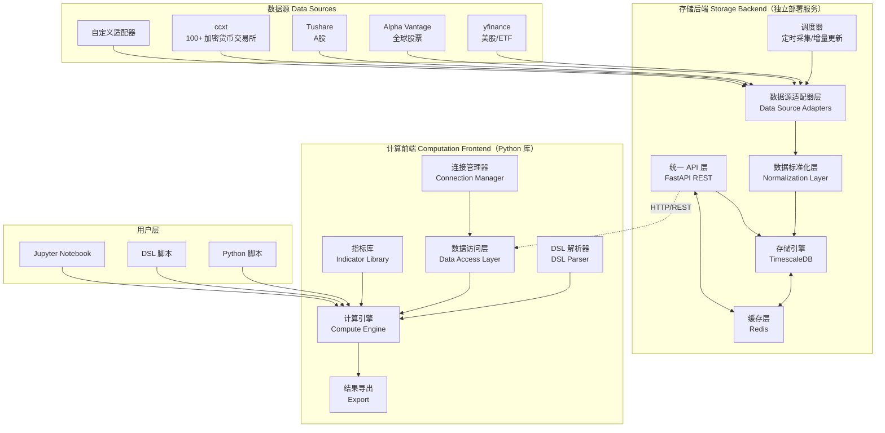

### 2.2 组件职责划分

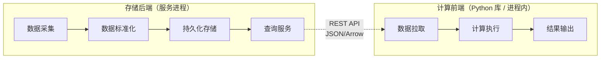

### 2.3 数据流

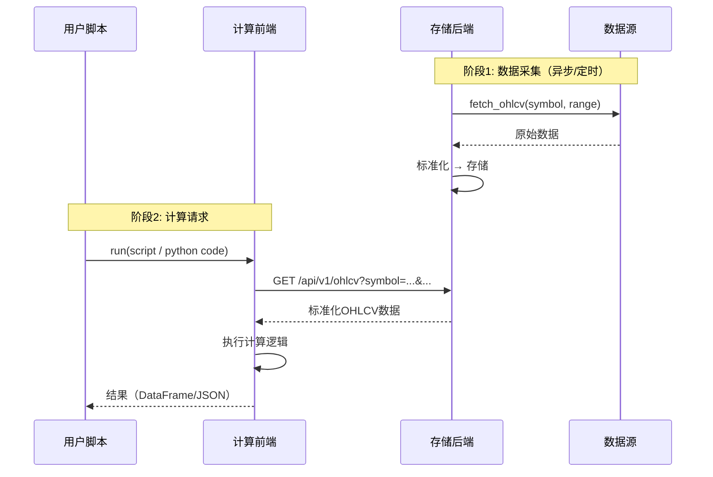

---

## 3. 存储后端设计

### 3.1 数据源适配器层

数据源适配器采用**插件化**设计，每个适配器实现统一接口，支持热注册。

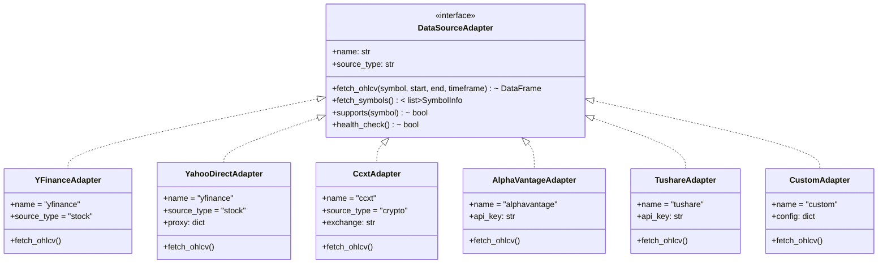

**适配器注册机制**：

```python
# 存储后端配置示例 (config.yaml)
data_sources:
  - name: yfinance
    type: stock
    enabled: true
    
  - name: binance
    type: crypto
    adapter: ccxt
    config:
      exchange: binance
      rate_limit: 10  # 请求/秒
    
  - name: alphavantage
    type: stock
    enabled: true
    config:
      api_key: ${ALPHA_VANTAGE_KEY}
    
  - name: tushare
    type: stock
    enabled: true
    config:
      api_key: ${TUSHARE_TOKEN}
      market: A股
```

### 3.1.1 代理支持

存储后端支持为所有数据源适配器配置 HTTP/SOCKS5 代理，**默认关闭**。开启后，所有对外的数据采集请求（yfinance、ccxt 等）均经由代理转发。

| 设计约束 | 说明 |
|----------|------|
| **默认关闭** | `STOCKSTAT_PROXY_ENABLED` 未设置或为 false 时，所有适配器直连 |
| **双协议支持** | 支持 `http` 和 `socks5` 两种代理类型 |
| **默认地址** | HTTP 默认 `http://127.0.0.1:8889`；SOCKS5 默认 `socks5://127.0.0.1:1089` |
| **统一注入** | 代理配置在适配器实例化时注入，对上层透明 |

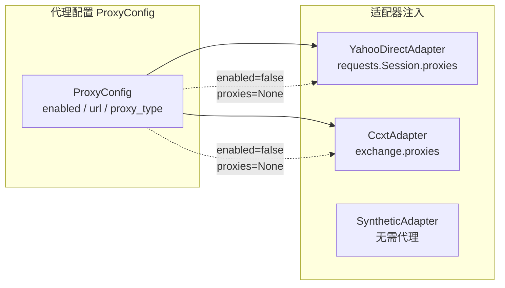

**环境变量配置**：

| 环境变量 | 默认值 | 说明 |
|----------|--------|------|
| `STOCKSTAT_PROXY_ENABLED` | `false` | 是否启用代理 |
| `STOCKSTAT_PROXY_TYPE` | `http` | 代理类型：`http` 或 `socks5` |
| `STOCKSTAT_PROXY_URL` | （按类型自动填充） | 代理地址，未设置时使用默认值 |

```bash
# 启用 HTTP 代理（默认地址）
export STOCKSTAT_PROXY_ENABLED=true
export STOCKSTAT_PROXY_TYPE=http
# STOCKSTAT_PROXY_URL 默认为 http://127.0.0.1:8889

# 启用 SOCKS5 代理（默认地址）
export STOCKSTAT_PROXY_ENABLED=true
export STOCKSTAT_PROXY_TYPE=socks5
# STOCKSTAT_PROXY_URL 默认为 socks5://127.0.0.1:1089

# 自定义代理地址
export STOCKSTAT_PROXY_ENABLED=true
export STOCKSTAT_PROXY_URL=http://192.168.1.100:8080
```

**REST API 查询代理状态**：

```
GET /api/v1/proxy
→ {"enabled": true, "url": "http://127.0.0.1:8889", "proxy_type": "http"}

GET /api/v1/health
→ {"status": "ok", "proxy": {"enabled": true, "url": "http://127.0.0.1:8889", "proxy_type": "http"}}
```

### 3.2 数据标准化层

不同数据源的原始数据格式各异，标准化层负责将其统一为内部规范格式。

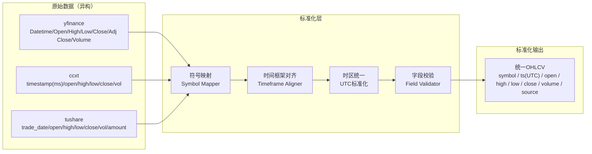

**统一数据模型**：

| 字段 | 类型 | 说明 |
|------|------|------|
| `symbol` | `VARCHAR` | 统一符号标识，如 `BTC/USDT`, `AAPL`, `600000.SH` |
| `ts` | `TIMESTAMPTZ` | UTC 时间戳 |
| `open` | `NUMERIC` | 开盘价 |
| `high` | `NUMERIC` | 最高价 |
| `low` | `NUMERIC` | 最低价 |
| `close` | `NUMERIC` | 收盘价 |
| `volume` | `NUMERIC` | 成交量 |
| `source` | `VARCHAR` | 数据来源标识 |
| `timeframe` | `VARCHAR` | 时间周期 `1m/5m/15m/1h/4h/1d/1w` |

**符号映射表**：

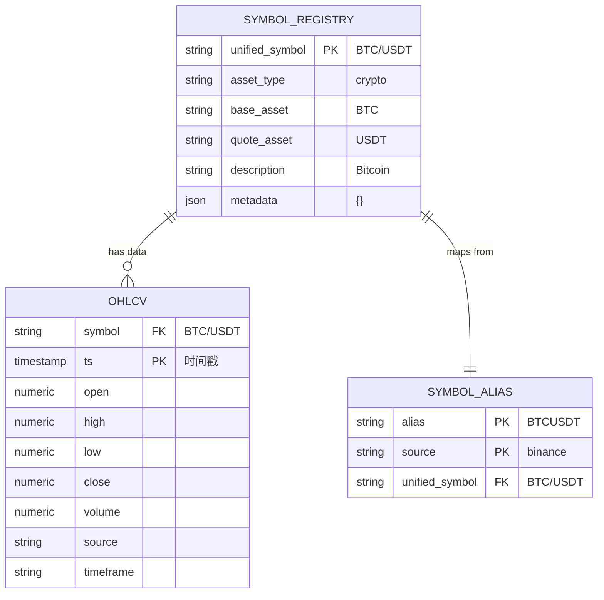

### 3.3 存储引擎

选用 **TimescaleDB**（PostgreSQL 时序扩展），理由：

- 原生 SQL，生态成熟
- Hypertable 自动按时间分区，查询高效
- 支持连续聚合（Continuous Aggregates），可预计算常用时间框架
- 与 Python 生态（pandas/SQLAlchemy）无缝对接

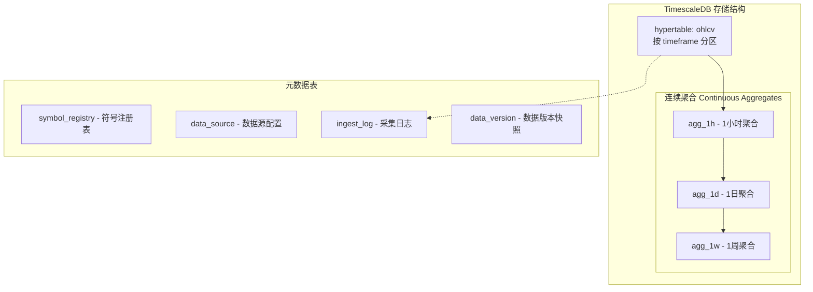

**Hypertable 创建 DDL**：

```sql
-- 创建 hypertable
CREATE TABLE ohlcv (
    symbol      VARCHAR(50)  NOT NULL,
    ts          TIMESTAMPTZ  NOT NULL,
    open        NUMERIC(20,8),
    high        NUMERIC(20,8),
    low         NUMERIC(20,8),
    close       NUMERIC(20,8),
    volume      NUMERIC(20,8),
    source      VARCHAR(50)  NOT NULL,
    timeframe   VARCHAR(10)  NOT NULL DEFAULT '1d',
    ingested_at TIMESTAMPTZ  DEFAULT NOW(),
    PRIMARY KEY (symbol, ts, timeframe)
);

SELECT create_hypertable('ohlcv', 'ts');

-- 索引
CREATE INDEX idx_ohlcv_symbol_ts ON ohlcv (symbol, ts DESC);
CREATE INDEX idx_ohlcv_timeframe ON ohlcv (timeframe);

-- 连续聚合：1日级别
CREATE MATERIALIZED VIEW ohlcv_1d
WITH (timescaledb.continuous) AS
SELECT
    symbol,
    time_bucket('1 day', ts) AS day,
    first(open, ts) AS open,
    max(high) AS high,
    min(low) AS low,
    last(close, ts) AS close,
    sum(volume) AS volume,
    source
FROM ohlcv
WHERE timeframe = '1m'
GROUP BY symbol, day, source;
```

### 3.4 调度器

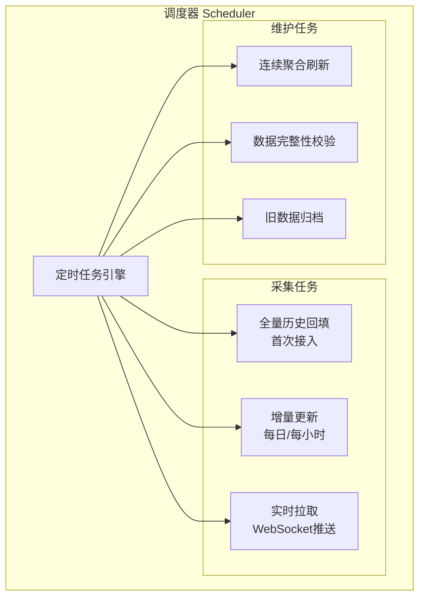

### 3.5 缓存策略

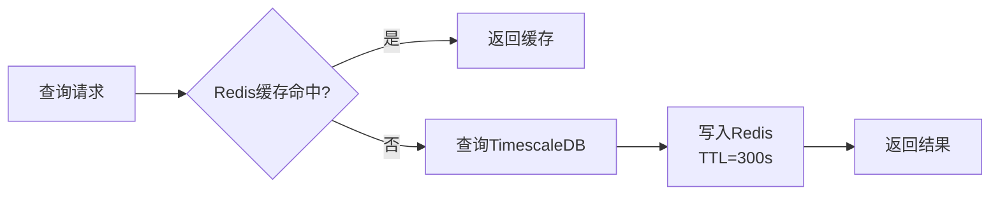

---

## 4. 计算前端设计

### 4.1 客户端架构

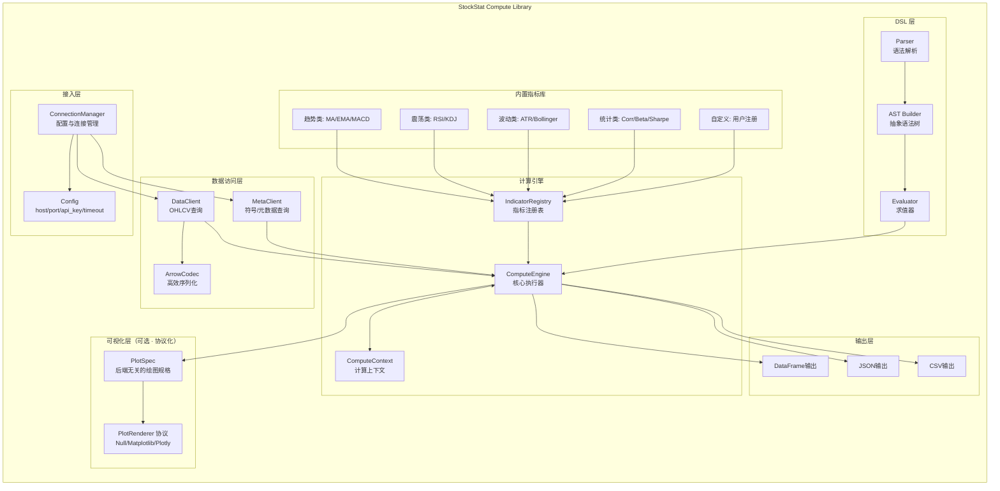

### 4.2 连接管理

```python
from stockstat import StockStatClient

# 方式1: 配置文件
client = StockStatClient.from_config("stockstat.yaml")

# 方式2: 直接配置
client = StockStatClient(
    host="localhost",
    port=8000,
    api_key="optional-key",
    timeout=30,
    cache_enabled=True
)

# 方式3: 环境变量
client = StockStatClient.from_env()
```

### 4.3 数据访问层

```python
# 获取OHLCV数据，返回 pandas DataFrame
data = client.ohlcv(
    symbol="PAXG/USDT",
    source="binance",
    start="2022-01-01",
    end="2024-12-31",
    timeframe="1d"
)
# DataFrame 列: open, high, low, close, volume (DatetimeIndex)

# 批量获取
data = client.ohlcv_batch(
    symbols=["BTC/USDT", "ETH/USDT", "PAXG/USDT"],
    start="2024-01-01",
    timeframe="1d"
)

# 获取可用符号列表
symbols = client.symbols(asset_type="crypto", source="binance")
```

### 4.4 计算引擎与指标注册

```python
from stockstat import indicator, ComputeContext

# 使用内置指标
sma = client.compute.ma(data.close, window=20)
rsi = client.compute.rsi(data.close, window=14)
beta = client.compute.beta(asset="AAPL", benchmark="^GSPC", window=60)

# 注册自定义指标
@indicator(name="weekend_gain_loss_corr", category="custom")
def weekend_monday_gain_loss(data: pd.DataFrame) -> dict:
    """
    计算 PAXG 周末涨跌幅与周一最大涨幅和最大跌幅的独立相关性。
    同时记录两者，避免选择偏差。
    """
    df = data.copy()
    df['weekday'] = df.index.weekday  # 0=Mon ... 6=Sun

    fridays = df[df.weekday == 4][['close']]
    sundays = df[df.weekday == 6][['close']]
    mondays = df[df.weekday == 0][['open', 'high', 'low', 'close']]

    pairs = []
    for mon_date, mon_row in mondays.iterrows():
        prev_fri = fridays.loc[:mon_date].tail(1)
        prev_sun = sundays.loc[:mon_date].tail(1)
        if len(prev_fri) > 0 and len(prev_sun) > 0:
            fri_c = prev_fri['close'].iloc[0]
            sun_c = prev_sun['close'].iloc[0]
            weekend_ret = (sun_c - fri_c) / fri_c
            mon_open = mon_row['open']
            max_gain = (mon_row['high'] - mon_open) / mon_open
            max_loss = (mon_row['low'] - mon_open) / mon_open
            pairs.append({'weekend_return': weekend_ret,
                          'max_gain': max_gain, 'max_loss': max_loss})

    result_df = pd.DataFrame(pairs)
    r_gain = result_df['weekend_return'].corr(result_df['max_gain'])
    r_loss = result_df['weekend_return'].corr(result_df['max_loss'])

    return {"r_gain": r_gain, "r_loss": r_loss, "n_samples": len(result_df)}

# 执行自定义指标
result = client.compute.call("weekend_gain_loss_corr", data=data)
```

### 4.5 可视化与 matplotlib 适配设计

#### 4.5.1 设计目标

可视化层遵循**核心零硬依赖**原则：核心计算库不依赖 matplotlib 或任何绘图库；当用户安装了 matplotlib 后，可自动启用增强绘图能力。

| 设计约束 | 说明 |
|----------|------|
| **零硬依赖** | `import stockstat` 不触发任何绘图库导入；`pyproject.toml` 的核心依赖不含 matplotlib |
| **协议抽象** | 定义 `PlotRenderer` 协议，多后端可插拔（matplotlib / plotly / 无渲染器） |
| **数据与渲染分离** | 计算引擎产出后端无关的 `PlotSpec`（绘图规格），由渲染器解释为具体图形 |
| **延迟导入** | matplotlib 仅在用户首次调用渲染时才被 `import`，缺失时优雅降级 |
| **可选 extras** | 通过 `pip install stockstat[matplotlib]` 拉取绘图依赖 |

#### 4.5.2 类设计

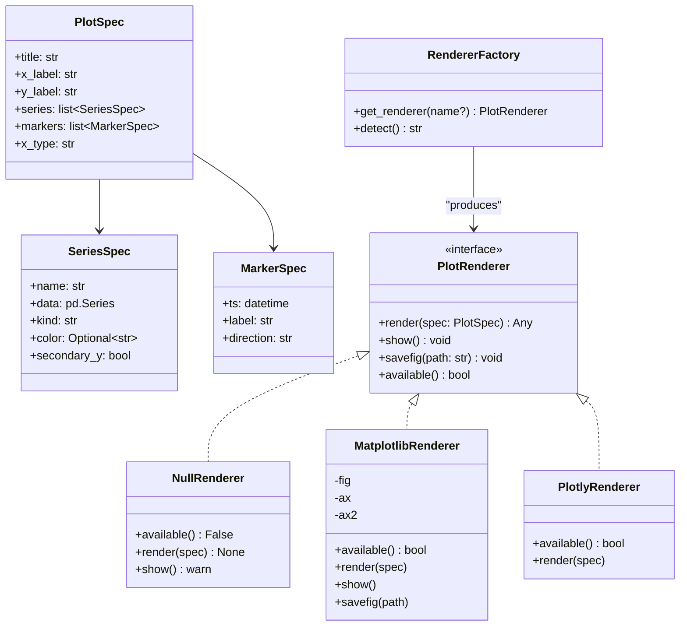

#### 4.5.3 模块组织与延迟导入

```
stockstat/
└── plot/
    ├── __init__.py          # 对外暴露 PlotSpec / plot() / get_renderer()
    ├── base.py              # PlotRenderer 协议 + NullRenderer 默认实现
    └── matplotlib_backend.py # matplotlib 适配（模块内延迟 import matplotlib）
```

`matplotlib_backend.py` 内部采用延迟导入，确保核心库导入链不被污染：

```python
# stockstat/plot/matplotlib_backend.py
from .base import PlotRenderer, PlotSpec

class MatplotlibRenderer(PlotRenderer):
    def __init__(self):
        self._plt = None   # 延迟到首次 render 时才导入

    def available(self) -> bool:
        try:
            import matplotlib  # noqa: F401
            return True
        except ImportError:
            return False

    def render(self, spec: PlotSpec):
        import matplotlib.pyplot as plt   # 仅在此处导入
        self._plt = plt
        fig, ax = plt.subplots()
        for s in spec.series:
            if s.kind == "line":
                ax.plot(s.data.index, s.data.values, label=s.name, color=s.color)
            elif s.kind == "bar":
                ax.bar(s.data.index, s.data.values, label=s.name, color=s.color)
        ax.set_title(spec.title)
        ax.legend()
        self.fig, self.ax = fig, ax
        return fig
```

#### 4.5.4 自动检测与优雅降级

`RendererFactory.detect()` 按优先级探测已安装的后端；若全部缺失，返回 `NullRenderer`，调用时仅发出告警而非抛异常。

```python
# stockstat/plot/__init__.py
from .base import NullRenderer, PlotSpec

def get_renderer(name: str | None = None) -> "PlotRenderer":
    if name is None:
        name = RendererFactory.detect()
    if name == "matplotlib":
        from .matplotlib_backend import MatplotlibRenderer
        return MatplotlibRenderer()
    if name == "plotly":
        from .plotly_backend import PlotlyRenderer
        return PlotlyRenderer()
    return NullRenderer()   # 安全兜底，零依赖可用
```

#### 4.5.5 使用方式

```python
from stockstat import StockStatClient

client = StockStatClient(host="localhost", port=8000)
data = client.ohlcv("BTC/USDT", start="2024-01-01", timeframe="1d")

# 方式A: 协议化绘图（推荐，后端无关）
spec = client.plot.spec(
    title="BTC/USDT 2024",
    series=[
        {"name": "close", "data": data.close, "kind": "line"},
        {"name": "ma20",  "data": data.close.rolling(20).mean(), "kind": "line"},
    ],
)
renderer = client.plot.get_renderer()     # 自动检测，缺失则 NullRenderer
renderer.render(spec)
renderer.savefig("btc.png")               # matplotlib 存在时生效

# 方式B: 直接把计算结果交给 matplotlib（用户自管依赖）
import matplotlib.pyplot as plt           # 用户自行导入
plt.plot(data.index, data.close)
plt.title("BTC/USDT")
plt.show()

# 方式C: 取回后端无关数据，自行选择任意绘图库
payload = spec.to_dict()                  # 纯 dict / JSON 可序列化
```

#### 4.5.6 依赖声明

`pyproject.toml` 采用可选 extras，核心安装不引入 matplotlib：

```toml
[project]
name = "stockstat"
dependencies = [
    "pandas>=2.0",
    "numpy>=1.24",
    "httpx>=0.27",
    "pyarrow>=15.0",
]

[project.optional-dependencies]
matplotlib = ["matplotlib>=3.8"]
plotly     = ["plotly>=5.20"]
plot       = ["stockstat[matplotlib]", "stockstat[plotly]"]
```

---

## 5. 脚本语言设计

提供**双模式**可编程接口：Python 库（全功能）+ DSL（轻量声明式）。

### 5.1 模式对比

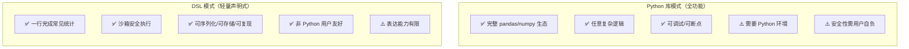

### 5.2 Python 库模式

完整的 Python API，适合复杂分析场景：

```python
from stockstat import StockStatClient
import pandas as pd

client = StockStatClient(host="localhost", port=8000)

# 获取数据
paxg = client.ohlcv("PAXG/USDT", start="2022-01-01", timeframe="1d")

# 自由计算
df = paxg.copy()
df['ret'] = df['close'].pct_change()
df['vol_20'] = df['ret'].rolling(20).std()
df['ma50'] = df['close'].rolling(50).mean()

# 任意 pandas 操作
result = df[df['vol_20'] > df['vol_20'].quantile(0.9)]
```

### 5.3 DSL 模式

设计为 **SQL-like 声明式统计查询语言**，语法贴近分析师直觉。

#### 5.3.1 语法设计

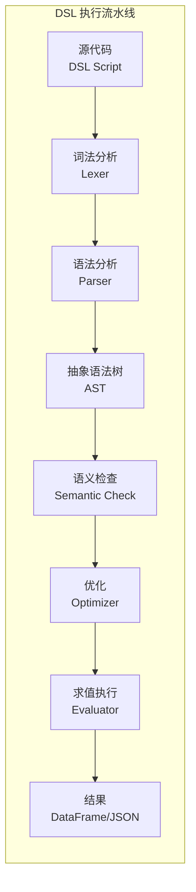

#### 5.3.2 语法规范

```
# DSL 语法 BNF 概要

query       ::= SELECT select_expr (',' select_expr)*
                FROM source
                [WHERE condition]
                [GROUP BY group_expr]
                [ORDER BY order_expr]
                [LIMIT n]

source      ::= ohlcv '(' symbol ',' timeframe ')'
              | ohlcv '(' symbol ',' timeframe ',' start ',' end ')'

select_expr ::= expr [AS alias]

expr        ::= function '(' expr (',' expr)* ')'
              | field
              | literal
              | expr operator expr

field       ::= 'open' | 'high' | 'low' | 'close' | 'volume'
              | 'returns' | 'log_returns'

function    ::= 'ma' | 'ema' | 'rsi' | 'macd' | 'std' | 'corr'
              | 'max' | 'min' | 'mean' | 'sum' | 'count'
              | 'rolling' | 'shift' | 'rank' | 'beta'
              | 'weekend_filter' | 'weekday_filter'
```

#### 5.3.3 DSL 示例

```sql
-- 示例1: 计算20日均线与收盘价
SELECT 
    close,
    ma(close, 20) AS ma20,
    ema(close, 12) AS ema12
FROM ohlcv("AAPL", "1d", "2024-01-01", "2024-12-31")

-- 示例2: 计算 RSI 超买超卖信号
SELECT 
    close,
    rsi(close, 14) AS rsi,
    CASE WHEN rsi(close, 14) > 70 THEN 'overbought'
         WHEN rsi(close, 14) < 30 THEN 'oversold'
         ELSE 'neutral' END AS signal
FROM ohlcv("BTC/USDT", "1d", "2024-01-01", "2024-12-31")

-- 示例3: PAXG 周末涨跌与周一高低差相关性
SELECT 
    corr(
        returns(close, filter=weekend_filter),
        spread(high, low, filter=weekday_filter(0))
    ) AS weekend_monday_corr
FROM ohlcv("PAXG/USDT", "1d", "2022-01-01", "2024-12-31")

-- 示例4: 多标的 Beta 计算
SELECT 
    beta(close, benchmark="^GSPC", window=60) AS beta_60d
FROM ohlcv("AAPL", "1d", "2024-01-01", "2024-12-31")
```

#### 5.3.4 DSL 内置函数清单

| 类别 | 函数 | 说明 |
|------|------|------|
| **趋势** | `ma(x, n)` | 简单移动平均 |
| | `ema(x, n)` | 指数移动平均 |
| | `macd(x, fast, slow, signal)` | MACD |
| **震荡** | `rsi(x, n)` | 相对强弱指数 |
| | `kdj(high, low, close, n)` | KDJ 指标 |
| **波动** | `std(x, n)` | 滚动标准差 |
| | `atr(high, low, close, n)` | 平均真实波幅 |
| | `bollinger(x, n, k)` | 布林带 |
| **统计** | `corr(x, y)` | 相关系数 |
| | `beta(x, benchmark)` | Beta 系数 |
| | `sharpe(returns, rf)` | 夏普比率 |
| | `max_drawdown(cumret)` | 最大回撤 |
| **变换** | `returns(x)` | 收益率序列 |
| | `log_returns(x)` | 对数收益率 |
| | `rolling(x, n, func)` | 滚动窗口 |
| | `shift(x, n)` | 位移 |
| | `rank(x)` | 排名 |
| **过滤** | `weekend_filter` | 周末过滤 |
| | `weekday_filter(n)` | 指定星期过滤 |
| | `spread(high, low)` | 高低差价 |

---

## 6. API 规范

### 6.1 REST API 总览

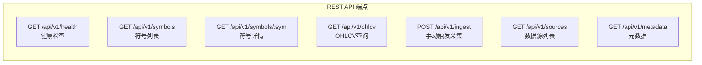

### 6.2 核心 API 定义

#### GET /api/v1/ohlcv

获取 OHLCV 数据，支持多种返回格式。

**请求参数**：

| 参数 | 类型 | 必填 | 说明 |
|------|------|------|------|
| `symbol` | string | 是 | 统一符号，如 `PAXG/USDT` |
| `source` | string | 否 | 指定数据源 |
| `start` | string (ISO date) | 否 | 开始时间 |
| `end` | string (ISO date) | 否 | 结束时间 |
| `timeframe` | string | 否 | 时间周期，默认 `1d` |
| `limit` | int | 否 | 返回条数上限 |
| `format` | string | 否 | `json` / `arrow` / `csv`，默认 `json` |

**响应示例** (JSON)：

```json
{
  "symbol": "PAXG/USDT",
  "source": "binance",
  "timeframe": "1d",
  "count": 731,
  "data": [
    {
      "ts": "2022-01-01T00:00:00Z",
      "open": 1812.50,
      "high": 1820.00,
      "low": 1805.00,
      "close": 1818.00,
      "volume": 15234.5
    }
  ]
}
```

**Apache Arrow 格式**（高效传输）：

```
GET /api/v1/ohlcv?symbol=PAXG/USDT&format=arrow
Accept: application/vnd.apache.arrow.file

→ 返回 Arrow IPC 格式二进制流，前端可直接零拷贝转 DataFrame
```

#### GET /api/v1/symbols

```json
{
  "count": 2,
  "symbols": [
    {
      "unified_symbol": "PAXG/USDT",
      "asset_type": "crypto",
      "base_asset": "PAXG",
      "quote_asset": "USDT",
      "sources": ["binance", "coinbase"],
      "description": "PAX Gold"
    },
    {
      "unified_symbol": "AAPL",
      "asset_type": "stock",
      "base_asset": "AAPL",
      "sources": ["yfinance", "alphavantage"],
      "description": "Apple Inc."
    }
  ]
}
```

### 6.3 错误处理

```json
{
  "error": {
    "code": "SYMBOL_NOT_FOUND",
    "message": "Symbol 'XXX/USDT' not found in registry",
    "details": {
      "symbol": "XXX/USDT"
    }
  }
}
```

| HTTP Code | Error Code | 说明 |
|-----------|-----------|------|
| 400 | `INVALID_PARAMS` | 参数校验失败 |
| 404 | `SYMBOL_NOT_FOUND` | 符号不存在 |
| 404 | `DATA_NOT_FOUND` | 无数据 |
| 429 | `RATE_LIMITED` | 限流 |
| 500 | `INTERNAL_ERROR` | 服务内部错误 |

---

## 7. 测试用例

### 7.1 经典股票统计测试用例

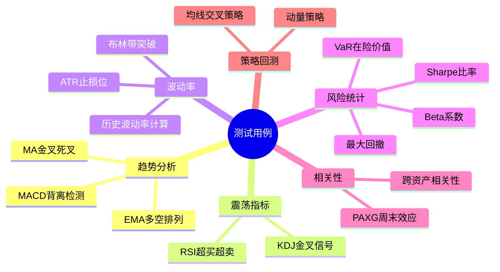

#### 用例 1: 移动平均线金叉/死叉

```python
"""测试 MA 金叉死叉信号的正确性"""
client = StockStatClient(host="localhost", port=8000)
data = client.ohlcv("AAPL", start="2024-01-01", timeframe="1d")

ma_short = data.close.rolling(5).mean()
ma_long = data.close.rolling(20).mean()

# 金叉：短均线上穿长均线
golden_cross = (ma_short > ma_long) & (ma_short.shift(1) <= ma_long.shift(1))
# 死叉：短均线下穿长均线
death_cross = (ma_short < ma_long) & (ma_short.shift(1) >= ma_long.shift(1))

assert golden_cross.sum() >= 0  # 至少不报错
assert death_cross.sum() >= 0
# 验证：金叉后短期收益率均值应为正
```

#### 用例 2: RSI 超买超卖检测

```python
"""RSI 值域 [0, 100]，>70 超买，<30 超卖"""
data = client.ohlcv("BTC/USDT", start="2024-01-01", timeframe="1d")
rsi = client.compute.rsi(data.close, window=14)

assert rsi.between(0, 100).all()
assert rsi.isna().sum() == 14  # 前14个为NaN
# 验证已知大涨日 RSI 应较高
```

#### 用例 3: Beta 系数计算

```python
"""Beta = Cov(Ri, Rm) / Var(Rm)"""
stock = client.ohlcv("AAPL", start="2023-01-01", timeframe="1d")
market = client.ohlcv("^GSPC", start="2023-01-01", timeframe="1d")

beta = client.compute.beta(
    asset=stock.close.pct_change(),
    benchmark=market.close.pct_change(),
    window=60
)

# AAPL 的 Beta 通常在 1.0~1.3 之间
assert 0.5 < beta.dropna().mean() < 2.0
```

#### 用例 4: 最大回撤

```python
"""最大回撤 = max(1 - P_t / max(P_0..P_t))"""
data = client.ohlcv("BTC/USDT", start="2023-01-01", timeframe="1d")
cumret = data.close / data.close.iloc[0]
running_max = cumret.cummax()
drawdown = (cumret - running_max) / running_max
max_dd = drawdown.min()

assert max_dd <= 0  # 回撤应为负数
assert max_dd >= -1  # 回撤不超过-100%
```

#### 用例 5: 夏普比率

```python
"""Sharpe = (E[R] - Rf) / std(R) * sqrt(252)"""
data = client.ohlcv("BTC/USDT", start="2023-01-01", timeframe="1d")
returns = data.close.pct_change().dropna()

sharpe = client.compute.sharpe(returns, risk_free=0.02, annualize=True)
# 高波动资产的 Sharpe 通常在 -1 ~ 3 之间
assert -5 < sharpe < 10
```

#### 用例 6: 布林带突破

```python
"""布林带 = MA ± k * std"""
data = client.ohlcv("ETH/USDT", start="2024-01-01", timeframe="1d")
upper, mid, lower = client.compute.bollinger(data.close, window=20, k=2)

# 上轨应始终 >= 中轨 >= 下轨
assert (upper >= mid).all()
assert (mid >= lower).all()
# 突破上轨的频率应较低（<10%）
breakout = (data.close > upper).sum() / len(data)
assert breakout < 0.15
```

#### 用例 7: 跨资产相关性

```python
"""BTC 与 ETH 应高度正相关"""
btc = client.ohlcv("BTC/USDT", start="2024-01-01", timeframe="1d")
eth = client.ohlcv("ETH/USDT", start="2024-01-01", timeframe="1d")

corr = btc.close.pct_change().corr(eth.close.pct_change())
assert corr > 0.7  # BTC/ETH 日收益率相关性通常 > 0.7
```

### 7.2 PAXG 周末涨跌与周一独立涨跌幅相关性

> **自定义测试用例**：统计 PAXG（PAX Gold，黄金锚定代币）周末涨跌幅与周一最大涨幅 `(最高-开盘)/开盘` 和最大跌幅 `(最低-开盘)/开盘` 之间的独立相关性。同时记录两者，避免按信号方向选择极值导致的选择偏差。

#### 7.2.1 分析逻辑

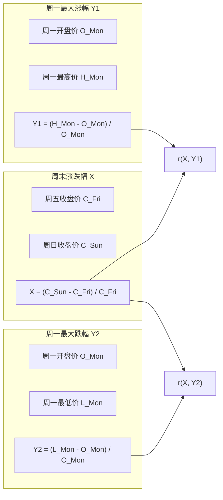

**假设**：PAXG 锚定黄金，周末传统黄金市场休市，PAXG 周末价格若发生偏离，可能适度预测周一日内极值。通过独立记录涨幅和跌幅，避免按信号方向选择极值导致的选择偏差。

#### 7.2.2 Python 实现

```python
"""
PAXG 周末涨跌与周一独立涨跌幅相关性测试。
同时记录 (最高-开盘)/开盘 和 (最低-开盘)/开盘。
"""
import pandas as pd
from scipy import stats
from stockstat import StockStatClient

client = StockStatClient(host="localhost", port=8000)

# ── 1. 获取 PAXG 日线数据 ──
paxg = client.ohlcv(
    symbol="PAXG/USDT", source="binance",
    start="2022-01-01", end="2024-12-31", timeframe="1d"
)

# ── 2. 标注星期几 ──
df = paxg.copy()
df['weekday'] = df.index.weekday

# ── 3. 提取周五收盘、周日收盘、周一 OHLC ──
fridays = df[df['weekday'] == 4][['close']].rename(columns={'close': 'fri_close'})
sundays = df[df['weekday'] == 6][['close']].rename(columns={'close': 'sun_close'})
mondays = df[df['weekday'] == 0][['open', 'high', 'low', 'close']].copy()

# ── 4. 构建周末-周一配对 ──
pairs = []
for mon_date, mon_row in mondays.iterrows():
    prev_fri = fridays.loc[:mon_date].tail(1)
    prev_sun = sundays.loc[:mon_date].tail(1)
    if len(prev_fri) > 0 and len(prev_sun) > 0:
        fri_close = prev_fri['fri_close'].iloc[0]
        sun_close = prev_sun['sun_close'].iloc[0]
        weekend_return = (sun_close - fri_close) / fri_close
        mon_open = mon_row['open']
        max_gain = (mon_row['high'] - mon_open) / mon_open
        max_loss = (mon_row['low'] - mon_open) / mon_open
        pairs.append({'weekend_return': weekend_return,
                      'max_gain': max_gain, 'max_loss': max_loss})

result_df = pd.DataFrame(pairs)

# ── 5. 计算独立相关性 ──
r_gain = result_df['weekend_return'].corr(result_df['max_gain'])
r_loss = result_df['weekend_return'].corr(result_df['max_loss'])
p_gain = stats.pearsonr(result_df['weekend_return'], result_df['max_gain'])[1]
p_loss = stats.pearsonr(result_df['weekend_return'], result_df['max_loss'])[1]

# ── 6. 分组对比 ──
up = result_df[result_df['weekend_return'] > 0]
dn = result_df[result_df['weekend_return'] < 0]

print(f"样本数:    {len(result_df)} (up={len(up)}, dn={len(dn)})")
print(f"r(涨幅):   {r_gain:.4f}  p={p_gain:.4f}")
print(f"r(跌幅):   {r_loss:.4f}  p={p_loss:.4f}")
print(f"信号>0: 涨幅={up['max_gain'].mean()*100:.4f}%, 跌幅={up['max_loss'].mean()*100:.4f}%")
print(f"信号<0: 涨幅={dn['max_gain'].mean()*100:.4f}%, 跌幅={dn['max_loss'].mean()*100:.4f}%")
```

#### 7.2.3 预期输出

```
样本数:    156 (up=76, dn=65)
r(涨幅):   0.2303  p=0.0038
r(跌幅):   -0.2004  p=0.0121
信号>0: 涨幅=0.7099%, 跌幅=-0.9070%
信号<0: 涨幅=0.5940%, 跌幅=-0.7435%
```

#### 7.2.4 测试断言

```python
def test_paxg_weekend_gain_loss(client):
    """PAXG 周末涨跌与周一独立涨跌幅测试"""
    result = compute_paxg_gain_loss(client)
    
    assert result['n_samples'] > 50, "样本数不足"
    assert -1 <= result['r_gain'] <= 1, "r(涨幅)越界"
    assert -1 <= result['r_loss'] <= 1, "r(跌幅)越界"
    
    # PAXG 波动应较小（黄金锚定）
    assert abs(result['up_gain_mean']) < 0.05
    assert abs(result['dn_loss_mean']) < 0.05
```

---

## 8. 技术栈选型

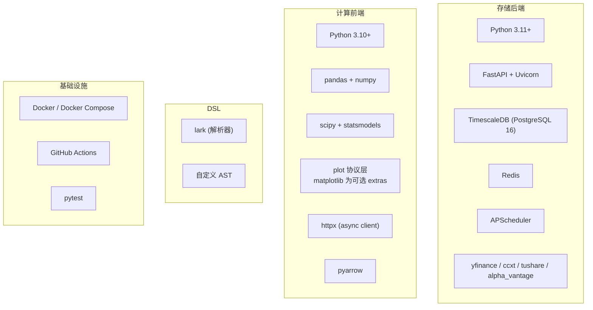

| 层 | 技术 | 选型理由 |
|----|------|----------|
| 后端框架 | FastAPI | 原生 async，自动生成 OpenAPI 文档，高性能 |
| 时序数据库 | TimescaleDB | PostgreSQL 兼容，Hypertable 高效时序查询，连续聚合 |
| 缓存 | Redis | 高速缓存查询结果，减轻 DB 压力 |
| 计算核心 | pandas + numpy | 事实标准，生态最全 |
| 统计扩展 | scipy + statsmodels | 假设检验、回归分析 |
| DSL 解析 | lark | Python 生态最成熟的解析器，EBNF 友好 |
| 数据传输 | Apache Arrow | 零拷贝列式传输，pandas 无缝对接 |
| 可视化 | matplotlib（可选 extras） | 协议化适配，延迟导入，核心零依赖，缺失时优雅降级 |
| 部署 | Docker Compose | 一键部署后端服务栈 |

---

## 9. 部署方案

### 9.1 存储后端独立部署

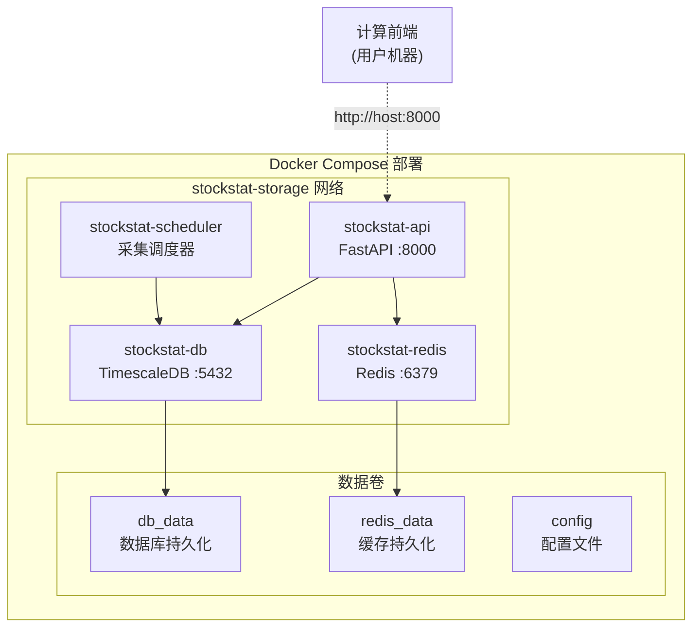

**docker-compose.yml 核心结构**：

```yaml
version: "3.9"
services:
  db:
    image: timescale/timescaledb:latest-pg16
    environment:
      POSTGRES_DB: stockstat
      POSTGRES_USER: stockstat
      POSTGRES_PASSWORD: ${DB_PASSWORD}
    ports:
      - "5432:5432"
    volumes:
      - db_data:/var/lib/postgresql/data

  redis:
    image: redis:7-alpine
    ports:
      - "6379:6379"
    volumes:
      - redis_data:/data

  api:
    build: ./backend
    ports:
      - "8000:8000"
    environment:
      DATABASE_URL: postgresql://stockstat:${DB_PASSWORD}@db:5432/stockstat
      REDIS_URL: redis://redis:6379/0
    depends_on:
      - db
      - redis

  scheduler:
    build: ./backend
    command: python -m stockstat.scheduler
    environment:
      DATABASE_URL: postgresql://stockstat:${DB_PASSWORD}@db:5432/stockstat
    depends_on:
      - db

volumes:
  db_data:
  redis_data:
```

### 9.2 计算前端安装

```bash
# 安装计算前端库
pip install stockstat

# 配置连接
export STOCKSTAT_HOST=localhost
export STOCKSTAT_PORT=8000

# 如需通过代理访问真实数据源（在后端机器上配置）
export STOCKSTAT_PROXY_ENABLED=true
export STOCKSTAT_PROXY_TYPE=http
export STOCKSTAT_PROXY_URL=http://127.0.0.1:8889
```

```python
# 或在代码中配置
from stockstat import StockStatClient
client = StockStatClient(host="your-server.com", port=8000)
```

---

## 10. 项目结构

```
StockStatistic/
├── backend/                         # 存储后端服务
│   ├── stockstat_backend/
│   │   ├── __init__.py
│   │   ├── app.py                   # FastAPI 应用入口
│   │   ├── config.py                # 配置管理
│   │   ├── api/
│   │   │   ├── __init__.py
│   │   │   ├── routes_ohlcv.py      # OHLCV 查询路由
│   │   │   ├── routes_symbols.py    # 符号管理路由
│   │   │   └── routes_health.py     # 健康检查路由
│   │   ├── adapters/                # 数据源适配器
│   │   │   ├── __init__.py
│   │   │   ├── base.py              # 适配器基类
│   │   │   ├── yfinance.py
│   │   │   ├── ccxt_adapter.py
│   │   │   ├── alphavantage.py
│   │   │   └── tushare.py
│   │   ├── models/                  # 数据模型
│   │   │   ├── __init__.py
│   │   │   ├── ohlcv.py
│   │   │   └── symbol.py
│   │   ├── storage/                 # 存储层
│   │   │   ├── __init__.py
│   │   │   ├── database.py          # DB 连接
│   │   │   ├── repository.py        # 数据仓库
│   │   │   └── cache.py             # Redis 缓存
│   │   ├── normalizer/              # 数据标准化
│   │   │   ├── __init__.py
│   │   │   ├── symbol_mapper.py
│   │   │   └── timeframe.py
│   │   └── scheduler/               # 调度器
│   │       ├── __init__.py
│   │       └── ingest.py
│   ├── alembic/                     # 数据库迁移
│   ├── tests/
│   ├── Dockerfile
│   └── pyproject.toml
│
├── frontend/                        # 计算前端库
│   ├── stockstat/
│   │   ├── __init__.py
│   │   ├── client.py                # StockStatClient 主入口
│   │   ├── config.py                # 连接配置
│   │   ├── connection.py            # 连接管理器
│   │   ├── data_access/             # 数据访问层
│   │   │   ├── __init__.py
│   │   │   ├── ohlcv.py
│   │   │   └── metadata.py
│   │   ├── compute/                 # 计算引擎
│   │   │   ├── __init__.py
│   │   │   ├── engine.py            # 核心引擎
│   │   │   ├── context.py           # 计算上下文
│   │   │   └── registry.py          # 指标注册表
│   │   ├── indicators/              # 内置指标库
│   │   │   ├── __init__.py
│   │   │   ├── trend.py             # MA/EMA/MACD
│   │   │   ├── oscillator.py        # RSI/KDJ
│   │   │   ├── volatility.py        # ATR/Bollinger
│   │   │   ├── statistics.py        # Corr/Beta/Sharpe
│   │   │   └── custom.py            # 自定义指标基类
│   │   ├── dsl/                     # DSL 解析器
│   │   │   ├── __init__.py
│   │   │   ├── grammar.lark         # 语法文件
│   │   │   ├── parser.py            # 解析器
│   │   │   ├── ast_nodes.py         # AST 节点
│   │   │   └── evaluator.py         # 求值器
│   │   ├── plot/                     # 可视化层（可选 · 协议化）
│   │   │   ├── __init__.py          # PlotSpec / get_renderer()
│   │   │   ├── base.py              # PlotRenderer 协议 + NullRenderer
│   │   │   └── matplotlib_backend.py # matplotlib 适配（延迟导入）
│   │   └── export/                  # 结果导出
│   │       ├── __init__.py
│   │       └── serializers.py
│   ├── tests/
│   │   ├── test_indicators.py
│   │   ├── test_dsl.py
│   │   ├── test_paxg_weekend.py     # PAXG 周末相关性测试
│   │   └── test_classic_stats.py    # 经典统计测试
│   └── pyproject.toml
│
├── docker-compose.yml               # 后端部署编排
├── docs/
│   └── DESIGN.md                    # 本设计报告
└── README.md
```

---

## 11. 开发路线图

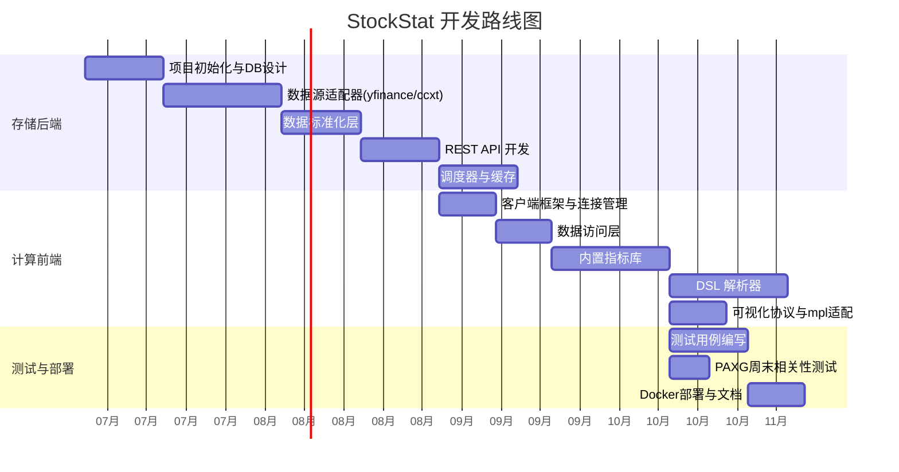

### 开发阶段

| 阶段 | 内容 | 产出 |
|------|------|------|
| **P0** | 存储后端 MVP | DB + yfinance/ccxt 适配器 + 基础 API |
| **P1** | 计算前端 MVP | Client + 数据访问 + 5个核心指标 |
| **P2** | DSL 解析器 | 语法文件 + 求值器 + 10个内置函数 |
| **P3** | 完整指标库 | 趋势/震荡/波动/统计 全套指标 |
| **P4** | 可视化层 | PlotSpec + PlotRenderer 协议 + matplotlib 适配（可选 extras） |
| **P5** | 测试与部署 | 全部测试用例 + Docker + 文档 |

---

## 附录 A: 数据源兼容性矩阵

| 数据源 | 资产类型 | 免费额度 | 实时支持 | 历史深度 | 适配难度 |
|--------|---------|---------|---------|---------|---------|
| yfinance | 美股/ETF | 免费 | 延迟15min | 10年+ | 低 |
| Alpha Vantage | 全球股票 | 25次/天 | 延迟15min | 20年+ | 低 |
| Tushare | A股 | 积分制 | 盘后 | 10年+ | 中 |
| ccxt (Binance) | 加密货币 | 免费 | 实时 | 全历史 | 低 |
| ccxt (Coinbase) | 加密货币 | 免费 | 实时 | 全历史 | 低 |

## 附录 B: OHLCV 数据量估算

| 标的范围 | 标的数 | 日均数据量 | 年数据量 | 存储估算 |
|---------|--------|-----------|---------|---------|
| 美股 Top 500 | 500 | 500 行 | 125K 行 | ~10 MB |
| A股全市场 | 5000 | 5000 行 | 1.25M 行 | ~100 MB |
| 加密货币 Top 200 | 200 | 200 行 | 50K 行 | ~5 MB |
| 加密1分钟数据(200标的) | 200 | 288K 行 | 73M 行 | ~5 GB |

> TimescaleDB 压缩后可缩减至原始体积的 10%~20%。

---

*本设计文档将随项目迭代持续更新。*
