# StockStat — 可编程金融标的统计计算平台 设计报告

> **版本**: v1.7
> **日期**: 2026-07-17
> **状态**: 已实现（含存储后端、计算前端、DSL、信号处理与非线性动力学模块、回测子系统、可插拔执行模型、可视化层、分析工具）

---

## 目录

1. [项目概述](#1-项目概述)
2. [总体架构](#2-总体架构)
3. [存储后端设计](#3-存储后端设计)
4. [计算前端设计](#4-计算前端设计)
5. [脚本语言设计](#5-脚本语言设计)
6. [API 规范](#6-api-规范)
7. [测试用例](#7-测试用例)
8. [技术栈选型](#8-技术栈选型)
9. [部署方案](#9-部署方案)
10. [项目结构](#10-项目结构)
11. [开发路线图](#11-开发路线图)
12. [回测子系统设计](#12-回测子系统设计)
- [附录 A: 数据源兼容性矩阵](#附录-a-数据源兼容性矩阵)
- [附录 B: OHLCV 数据量估算](#附录-b-ohlcv-数据量估算)
- [附录 C: 回测阶段实现文档索引](#附录-c-回测阶段实现文档索引)

---

## 1. 项目概述

### 1.1 项目目标

构建一个**用户可编程**的股票/虚拟货币标的统计量计算平台，核心能力包括：

- **统一数据接入**：兼容多数据源（股票 API、加密货币交易所、合成数据），对上层提供统一接口
- **可编程计算**：用户可通过 Python 库 或自定义 DSL 编写统计计算逻辑
- **前后端分离**：存储后端作为独立可部署服务，计算前端以库形式接入，可配置连接
- **可扩展**：数据源适配器、指标算法均为插件化设计

### 1.2 设计原则

| 原则 | 说明 |
|------|------|
| **数据与计算分离** | 存储后端只负责数据采集、存储、查询；计算逻辑全部在前端库完成 |
| **统一抽象** | 不同数据源的数据经标准化层后，对外暴露一致的 OHLCV 模型 |
| **可编程优先** | 不内置固定策略，提供丰富的原语让用户自由组合 |
| **渐进式复杂度** | 简单查询用 DSL 一行搞定，复杂分析用 Python 库全功能实现 |
| **可复现** | 每次计算可记录数据快照版本与参数，保证结果可复现 |
| **核心零硬依赖** | 计算/回测核心仅依赖 pandas/numpy/scipy；matplotlib、optuna、PyWavelets、lark 等走可选 extras |

### 1.3 核心功能清单

以下功能均已实现：

- 多数据源接入（yfinance 直连 / ccxt[Binance、Coinbase] / 合成数据）
- OHLCV 标准化存储（默认 SQLite，可选 TimescaleDB via Docker）
- 统一 REST API 查询（JSON / CSV）
- Python 计算库（pandas/numpy/scipy 集成）
- 表达式 DSL（SQL-like 声明式查询语言，基于 lark）
- 内置技术指标库（MA / EMA / MACD / RSI / KDJ / ATR / Bollinger / Beta / Sharpe / VaR …）
- 信号处理与非线性动力学模块（CWT / 谱熵 / 灰色关联 / GM(1,1) / 传递熵 / Hurst / 样本熵 / 排列熵）
- 自定义指标注册机制
- 计算结果导出（JSON / CSV / DataFrame）
- 可选可视化层（协议化设计，matplotlib 作为可选 extras，核心零依赖；支持 heatmap / log 轴 / 子图）
- 回测子系统（多标的 / 多 tf / 可插拔执行模型 / 可视化 / 分析工具 / 批量回测）
- 内存缓存（TTL=300s）

---

## 2. 总体架构

### 2.1 架构总览

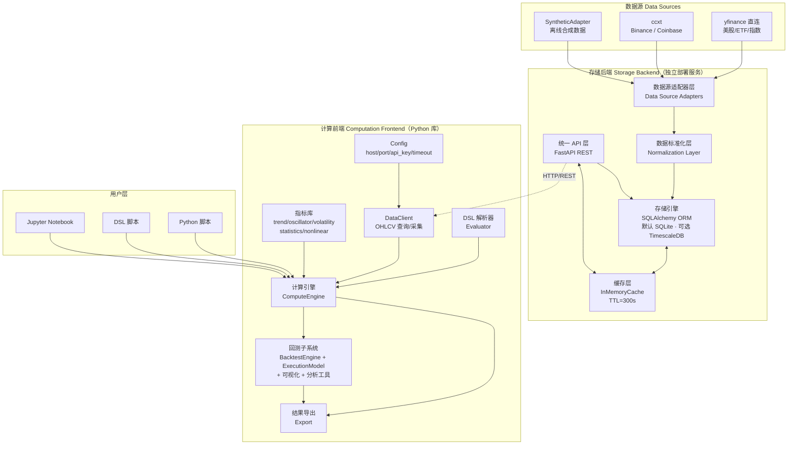

> **说明**：默认部署使用 SQLite + InMemoryCache，零外部依赖即可运行；Docker 生产部署可切换至 TimescaleDB + Redis（详见 §9）。调度器目前为占位 stub，规划中（详见 §3.6）。

### 2.2 组件职责划分

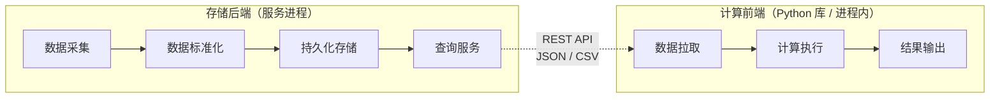

### 2.3 数据流

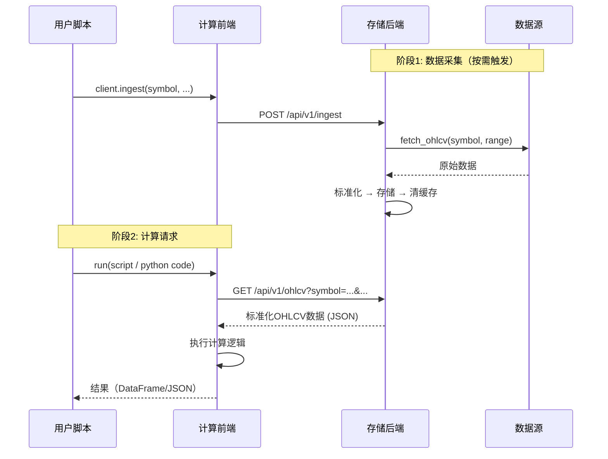

---

## 3. 存储后端设计

### 3.1 数据源适配器层

数据源适配器采用**插件化**设计，每个适配器继承 `DataSourceAdapter` 抽象基类，统一接口。

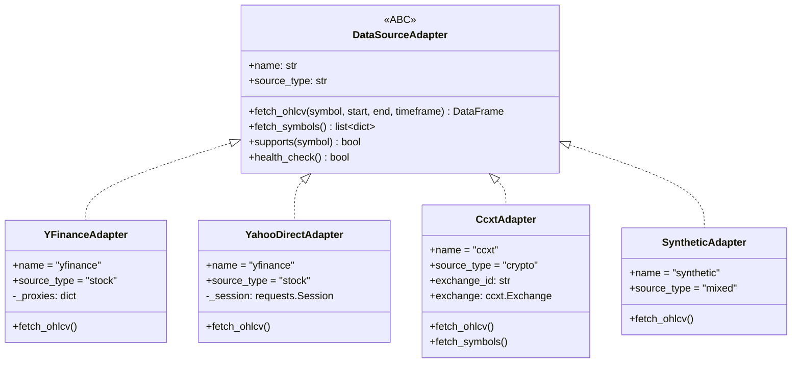

**适配器清单**：

| 适配器 | name | source_type | 网络 | 用途 |
|--------|------|-------------|------|------|
| `YahooDirectAdapter` | `yfinance` | stock | 是 | 直连 Yahoo Finance API（绕过 yfinance 库的 cookie/crumb 问题），路由默认采用 |
| `YFinanceAdapter` | `yfinance` | stock | 是 | 基于 `yfinance` 库的备选实现 |
| `CcxtAdapter` | `ccxt` | crypto | 是 | 通过 ccxt 接入 Binance / Coinbase，构造时传入 `exchange_id` |
| `SyntheticAdapter` | `synthetic` | mixed | 否 | 几何布朗运动生成的可复现合成数据（固定种子），用于离线测试 |

> **路由别名**：API 层接受 `source=binance` / `source=coinbase`，内部映射为 `CcxtAdapter("binance")` / `CcxtAdapter("coinbase")`。`source=synthetic` 映射为 `SyntheticAdapter`。未指定 `source` 时按符号自动检测：含 `/` 视为加密货币（binance），否则视为股票（yfinance）。

**适配器实例化**（`api/routes.py`）：

```python
def _get_adapter(source: str):
    if source not in _adapters:
        proxies = settings.proxy.proxies
        if source == "yfinance":
            _adapters[source] = YahooDirectAdapter(proxy=proxies)
        elif source == "binance":
            _adapters[source] = CcxtAdapter("binance", proxies=proxies)
        elif source == "coinbase":
            _adapters[source] = CcxtAdapter("coinbase", proxies=proxies)
        elif source == "synthetic":
            _adapters[source] = SyntheticAdapter()
        else:
            raise HTTPException(status_code=400, detail=f"Unknown source: {source}")
    return _adapters[source]
```

### 3.2 代理支持

存储后端支持为所有数据源适配器配置 HTTP/SOCKS5 代理，**默认关闭**。开启后，所有对外的数据采集请求（yfinance、ccxt 等）均经由代理转发。

| 设计约束 | 说明 |
|----------|------|
| **默认关闭** | `STOCKSTAT_PROXY_ENABLED` 未设置或为 false 时，所有适配器直连 |
| **双协议支持** | 支持 `http` 和 `socks5` 两种代理类型 |
| **默认地址** | HTTP 默认 `http://127.0.0.1:8889`；SOCKS5 默认 `socks5://127.0.0.1:1089` |
| **统一注入** | 代理配置在适配器实例化时注入（`proxies` 参数），对上层透明 |

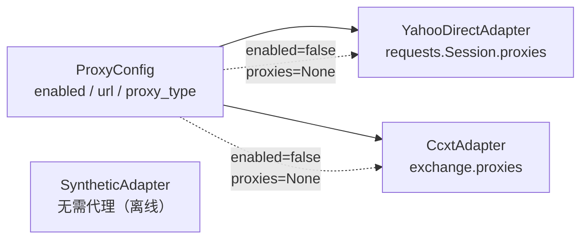

**环境变量配置**：

| 环境变量 | 默认值 | 说明 |
|----------|--------|------|
| `STOCKSTAT_PROXY_ENABLED` | `false` | 是否启用代理 |
| `STOCKSTAT_PROXY_TYPE` | `http` | 代理类型：`http` 或 `socks5` |
| `STOCKSTAT_PROXY_URL` | （按类型自动填充） | 代理地址，未设置时使用默认值 |

```bash
# 启用 HTTP 代理（默认地址）
export STOCKSTAT_PROXY_ENABLED=true
export STOCKSTAT_PROXY_TYPE=http
# STOCKSTAT_PROXY_URL 默认为 http://127.0.0.1:8889

# 启用 SOCKS5 代理（默认地址）
export STOCKSTAT_PROXY_ENABLED=true
export STOCKSTAT_PROXY_TYPE=socks5
# STOCKSTAT_PROXY_URL 默认为 socks5://127.0.0.1:1089

# 自定义代理地址
export STOCKSTAT_PROXY_ENABLED=true
export STOCKSTAT_PROXY_URL=http://192.168.1.100:8080
```

**REST API 查询代理状态**：

```
GET /api/v1/proxy
→ {"enabled": true, "url": "http://127.0.0.1:8889", "proxy_type": "http"}

GET /api/v1/health
→ {"status": "ok", "proxy": {"enabled": true, "url": "http://127.0.0.1:8889", "proxy_type": "http"}}
```

### 3.3 数据标准化层

不同数据源的原始数据格式各异，标准化层（`normalizer/normalizer.py`）负责将其统一为内部规范格式。

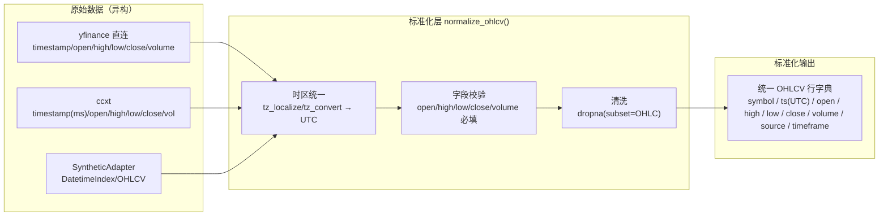

**统一数据模型**（SQLAlchemy ORM `OHLCV` 表）：

| 字段 | 类型 | 说明 |
|------|------|------|
| `id` | `Integer PK` | 自增主键 |
| `symbol` | `String(50)` | 统一符号标识，如 `BTC/USDT`, `AAPL`, `^GSPC` |
| `ts` | `DateTime(tz=True)` | UTC 时间戳 |
| `open` | `Float` | 开盘价 |
| `high` | `Float` | 最高价 |
| `low` | `Float` | 最低价 |
| `close` | `Float` | 收盘价 |
| `volume` | `Float` | 成交量 |
| `source` | `String(50)` | 数据来源标识 |
| `timeframe` | `String(10)` | 时间周期 `1m/5m/15m/1h/4h/1d/1w` |
| `ingested_at` | `DateTime(tz=True)` | 采集时间 |

**唯一约束**：`(symbol, ts, timeframe, source)` 联合唯一，保证同源同时段数据可 upsert 幂等。
**索引**：`(symbol, ts)` 复合索引 + `symbol`、`ts` 单字段索引。

**符号注册表**（`SymbolRegistry` 表）：

| 字段 | 类型 | 说明 |
|------|------|------|
| `unified_symbol` | `String(50) PK` | 统一符号，如 `BTC/USDT` |
| `asset_type` | `String(20)` | `crypto` / `stock` |
| `base_asset` | `String(30)` | 基础资产，如 `BTC` |
| `quote_asset` | `String(30)` | 报价资产，如 `USDT`（股票为空） |
| `description` | `String(200)` | 描述 |
| `sources` | `String(200)` | 数据源列表（CSV 字符串，如 `"binance,coinbase"`） |

> **简化设计说明**：当前未实现独立的 `SYMBOL_ALIAS` 别名表，符号多源支持通过 `sources` 字段以 CSV 形式存储。如未来需要细粒度的源级别名映射（如 `BTCUSDT@binance ↔ BTC/USDT`），可再引入别名表。

### 3.4 存储引擎

存储层基于 **SQLAlchemy 2.0 ORM**，通过 `DATABASE_URL` 切换后端：

| 部署模式 | `DATABASE_URL` | 特性 |
|---------|----------------|------|
| **默认（本地开发）** | `sqlite:///stockstat.db` | 零外部依赖，文件型数据库，`check_same_thread=False` |
| **Docker 生产** | `postgresql://...@db:5432/stockstat` | 通过 `timescale/timescaledb:latest-pg16` 镜像提供 PostgreSQL 兼容 + TimescaleDB 扩展 |

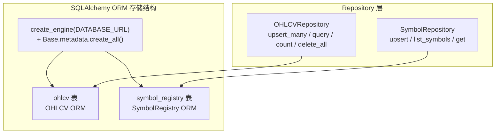

**会话管理**（`storage/database.py`）：

- 模块级单例 `_engine` + `_SessionLocal`，首次访问时懒初始化
- `get_session()` 上下文管理器：自动 commit / 异常 rollback / close
- `reset_engine()` 用于测试隔离

**OHLCV 表 DDL**（由 ORM 自动生成，等价 SQL）：

```sql
CREATE TABLE ohlcv (
    id          INTEGER  PRIMARY KEY AUTOINCREMENT,
    symbol      VARCHAR(50)  NOT NULL,
    ts          DATETIME     NOT NULL,
    open        FLOAT,
    high        FLOAT,
    low         FLOAT,
    close       FLOAT,
    volume      FLOAT,
    source      VARCHAR(50)  NOT NULL,
    timeframe   VARCHAR(10)  NOT NULL DEFAULT '1d',
    ingested_at DATETIME     DEFAULT CURRENT_TIMESTAMP,
    UNIQUE (symbol, ts, timeframe, source)
);
CREATE INDEX ix_ohlcv_symbol_ts ON ohlcv (symbol, ts);
```

> **TimescaleDB 部署说明**：Docker 部署使用 `timescale/timescaledb:latest-pg16` 镜像，提供 PostgreSQL 16 + TimescaleDB 扩展。当前 ORM 模型未启用 Hypertable 与连续聚合（Continuous Aggregates）；如需对海量 1 分钟数据做时序优化，可在 PostgreSQL 部署后手动执行 `create_hypertable('ohlcv','ts')` 并建立连续聚合视图，应用层无需改动。

### 3.5 缓存策略

默认采用**进程内内存缓存**（`InMemoryCache`），无需外部依赖：

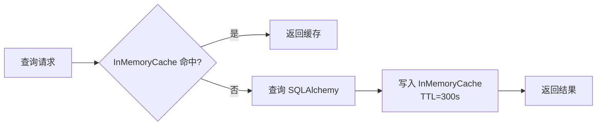

- **键**：由 `(symbol, source, start, end, timeframe, limit)` 序列化后 MD5 哈希
- **TTL**：300 秒（可通过 `Settings.cache_ttl` 配置）
- **失效**：`POST /api/v1/ingest` 成功后调用 `cache.clear()` 全量清空

> **Redis 说明**：`docker-compose.yml` 启动 `redis:7-alpine` 容器供生产部署使用，`pyproject.toml` 将 `redis>=5.0` 列为可选 extras。当前 `storage/cache.py` 仅实现 `InMemoryCache`；如需分布式缓存，可扩展 `cache.py` 接入 Redis（接口已对齐 `get/set/clear`）。

### 3.6 调度器

调度器模块（`stockstat_backend/scheduler/`）当前为**占位 stub**，未实现自动化的定时采集、增量更新、连续聚合刷新、数据完整性校验、旧数据归档等功能。

`docker-compose.yml` 中的 `scheduler` 服务以 `python -c "import time; print('Scheduler stub - implement APScheduler here'); time.sleep(3600)"` 形式运行，仅占位。

**当前数据采集模式**：按需触发——用户通过 `POST /api/v1/ingest` 或 `client.ingest(...)` 显式请求采集。

**规划能力**（未实现，路线图见 §11）：

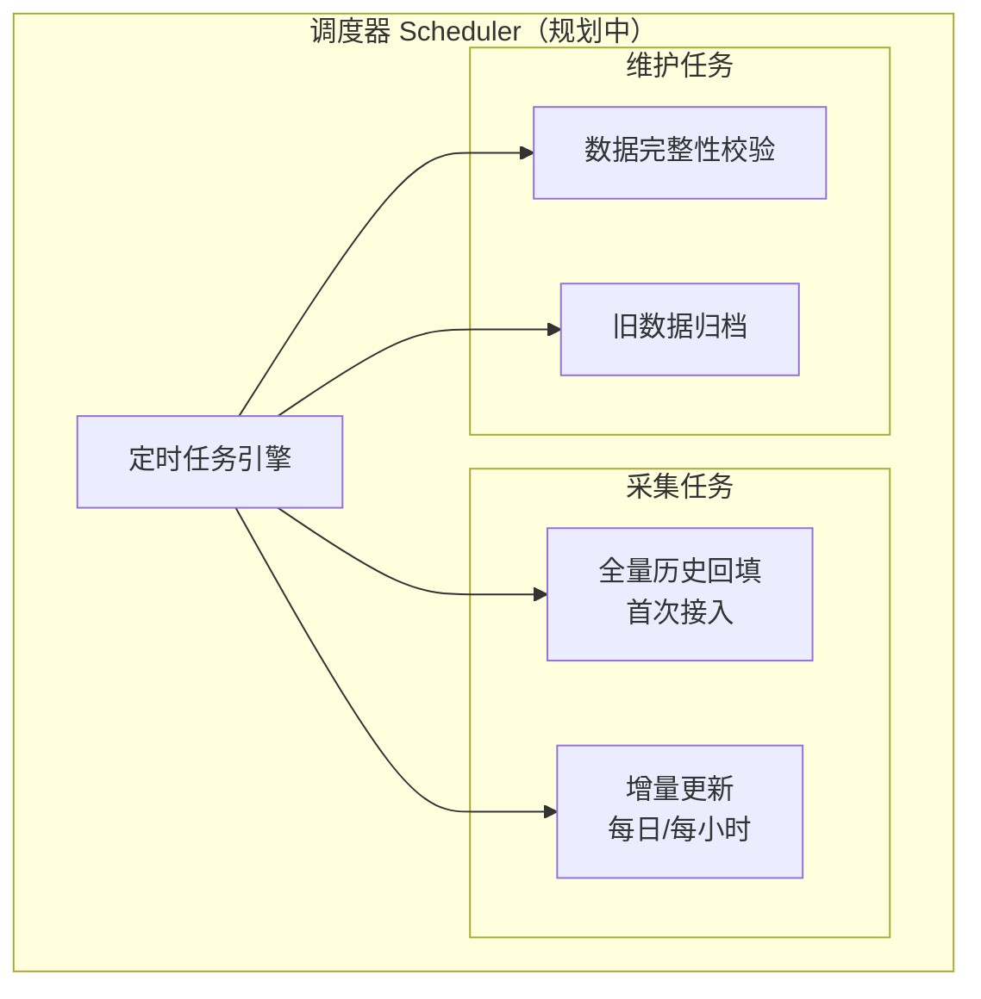

---

## 4. 计算前端设计

### 4.1 客户端架构

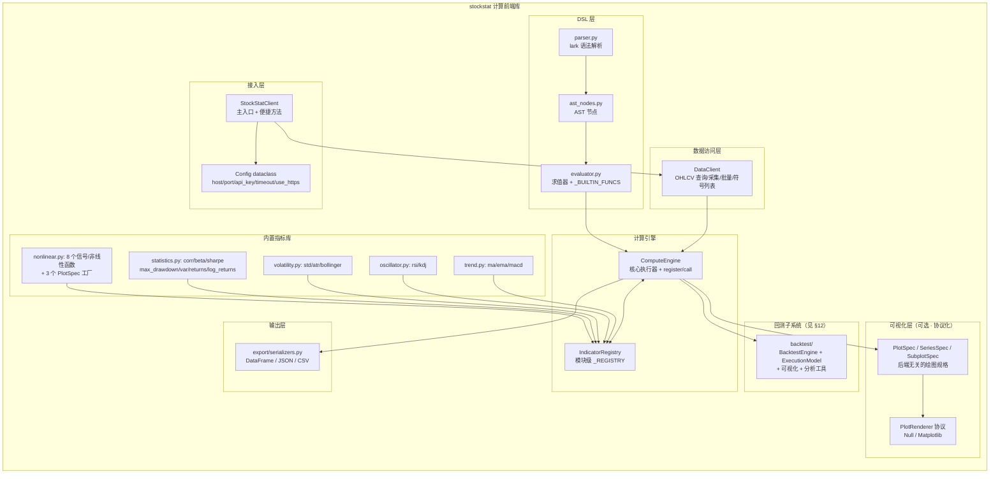

### 4.2 连接管理

`StockStatClient` 是用户唯一入口，提供三种构造方式：

```python
from stockstat import StockStatClient

# 方式1: 直接配置（最常用）
client = StockStatClient(
    host="localhost",
    port=8000,
    api_key="optional-key",
    timeout=30,
    cache_enabled=True,
    use_https=False,
)

# 方式2: 环境变量
client = StockStatClient.from_env()
#   读取 STOCKSTAT_HOST / STOCKSTAT_PORT / STOCKSTAT_API_KEY
#         STOCKSTAT_TIMEOUT / STOCKSTAT_USE_HTTPS

# 方式3: 字典配置
client = StockStatClient.from_dict({
    "host": "your-server.com", "port": 8000, "timeout": 30,
})
```

`Config` dataclass 持有连接参数，`base_url` 属性按 `use_https` 生成 `http(s)://host:port`。

### 4.3 数据访问层

`DataClient`（`data_access/ohlcv.py`）通过 `httpx` 调用后端 REST API，返回 pandas DataFrame：

```python
# 获取 OHLCV 数据，返回 pandas DataFrame（DatetimeIndex + OHLCV 列）
data = client.ohlcv(
    symbol="PAXG/USDT",
    source="binance",
    start="2022-01-01",
    end="2024-12-31",
    timeframe="1d",
)

# 批量获取（返回 dict[str, DataFrame]）
data = client.ohlcv_batch(
    symbols=["BTC/USDT", "ETH/USDT", "PAXG/USDT"],
    start="2024-01-01",
    timeframe="1d",
)

# 触发后端采集
client.ingest("AAPL", source="yfinance", start="2024-01-01", end="2024-12-31")

# 获取已注册符号列表
symbols = client.symbols(asset_type="crypto")

# 数据源列表与健康检查
client.sources()
client.health()
```

> **数据传输格式**：当前前端只解析 JSON（`/api/v1/ohlcv` 默认返回 JSON）。`pyarrow` 在依赖列表中，但未启用 Arrow IPC 二进制流传输；如需零拷贝优化，可扩展 `format=arrow` 端点与 `ArrowCodec`。

### 4.4 计算引擎与指标注册

`ComputeEngine`（`compute/engine.py`）以方法形式暴露全部内置指标，并通过 `register/call` 支持自定义指标：

```python
# 内置指标
sma = client.compute.ma(data.close, window=20)
rsi = client.compute.rsi(data.close, window=14)
upper, mid, lower = client.compute.bollinger(data.close, window=20, k=2.0)
beta = client.compute.beta(asset_returns, benchmark_returns, window=60)
sharpe = client.compute.sharpe(returns, risk_free=0.02, annualize=True)
dd = client.compute.max_drawdown(data.close)

# 注册自定义指标——方式 A：直接传函数
def weekend_monday_gain_loss(data):
    # ... 计算逻辑 ...
    return {"r_gain": 0.23, "r_loss": -0.20, "n_samples": 156}

client.compute.register("weekend_gain_loss_corr", weekend_monday_gain_loss, category="custom")
result = client.compute.call("weekend_gain_loss_corr", data=data)

# 注册自定义指标——方式 B：装饰器风格
@client.compute.register("my_indicator", category="custom")
def my_indicator(data):
    return data.close.mean()
```

> **API 说明**：`client.compute.register(name, func=None, category="custom")` 兼具直接注册与装饰器工厂两种用法。模块级 `compute/registry.py` 另提供 `@indicator(name, category)` 装饰器，但未在包顶层导出，推荐使用 `client.compute.register`。

### 4.5 可视化与 matplotlib 适配设计

#### 4.5.1 设计目标

可视化层遵循**核心零硬依赖**原则：核心计算库不依赖 matplotlib 或任何绘图库；当用户安装了 matplotlib 后，可自动启用增强绘图能力。

| 设计约束 | 说明 |
|----------|------|
| **零硬依赖** | `import stockstat` 不触发任何绘图库导入；核心依赖仅 pandas/numpy/scipy/httpx/pyarrow |
| **协议抽象** | 定义 `PlotRenderer` 协议，多后端可插拔（matplotlib / Null；plotly 规划中） |
| **数据与渲染分离** | 计算引擎产出后端无关的 `PlotSpec`（绘图规格），由渲染器解释为具体图形 |
| **延迟导入** | matplotlib 仅在用户首次调用渲染时才被 `import`，缺失时优雅降级为 `NullRenderer`（warn，不抛异常） |
| **可选 extras** | 通过 `pip install stockstat[matplotlib]` 拉取绘图依赖 |

#### 4.5.2 类设计

```mermaid
classDiagram
    class PlotSpec {
        +title: str
        +x_label: str
        +y_label: str
        +series: list~SeriesSpec~
        +markers: list~MarkerSpec~
        +subplots: list~SubplotSpec~
        +layout: tuple
        +figsize: tuple
        +log_x: bool
        +log_y: bool
        +add_series(...)
        +add_subplot(...)
        +to_dict() dict
    }
    class SeriesSpec {
        +name: str
        +data: Series|DataFrame|ndarray
        +kind: str  ~ line|bar|scatter|fill|histogram|heatmap
        +color: Optional~str~
        +secondary_y: bool
        +alpha: float
        +fill_to: Optional~float~
        +bins: int
        +cmap: Optional~str~
    }
    class SubplotSpec {
        +title: str
        +x_label: str
        +y_label: str
        +series: list~SeriesSpec~
        +log_x: bool
        +log_y: bool
        +share_x: bool
    }
    class PlotRenderer {
        <<protocol>>
        +render(spec: PlotSpec) Any
        +show() void
        +savefig(path: str) void
        +available() bool
    }
    class NullRenderer {
        +available() False
        +render(spec) None  ~ warn
    }
    class MatplotlibRenderer {
        -fig / -ax
        +available() bool
        +render(spec)
        +show()
        +savefig(path)
    }
    class RendererFactory {
        +detect() str  ~ matplotlib > plotly > null
        +get_renderer(name?) PlotRenderer
    }

    PlotRenderer <|.. NullRenderer
    PlotRenderer <|.. MatplotlibRenderer
    RendererFactory --> PlotRenderer : "produces"
    PlotSpec --> SeriesSpec
    PlotSpec --> SubplotSpec
    SubplotSpec --> SeriesSpec
```

#### 4.5.3 模块组织与延迟导入

```
stockstat/
└── plot/
    ├── __init__.py          # 暴露 PlotSpec / get_renderer()
    ├── base.py              # PlotRenderer 协议 + NullRenderer + RendererFactory + PlotSpec/SeriesSpec/SubplotSpec
    └── matplotlib_backend.py # matplotlib 适配（模块内延迟 import matplotlib）
```

`matplotlib_backend.py` 内部采用延迟导入，确保核心库导入链不被污染：

```python
# stockstat/plot/matplotlib_backend.py
class MatplotlibRenderer(PlotRenderer):
    def available(self) -> bool:
        try:
            import matplotlib  # noqa: F401
            return True
        except ImportError:
            return False

    def render(self, spec: PlotSpec):
        import matplotlib.pyplot as plt   # 仅在此处导入
        # ... 渲染逻辑（支持 line/bar/scatter/fill/histogram/heatmap/子图/log 轴）...
```

#### 4.5.4 自动检测与优雅降级

`RendererFactory.detect()` 按优先级探测已安装的后端（matplotlib → plotly → null）；若全部缺失，返回 `NullRenderer`，调用时仅发出告警而非抛异常。

```python
def get_renderer(name: str | None = None) -> PlotRenderer:
    if name is None:
        name = RendererFactory.detect()
    if name == "matplotlib":
        from .matplotlib_backend import MatplotlibRenderer
        return MatplotlibRenderer()
    if name == "plotly":
        try:
            from .plotly_backend import PlotlyRenderer  # 文件尚未实现，ImportError 时降级
            return PlotlyRenderer()
        except ImportError:
            return NullRenderer()
    return NullRenderer()   # 安全兜底，零依赖可用
```

> **Plotly 状态说明**：`RendererFactory` 已为 plotly 留出接入点，但 `plot/plotly_backend.py` 文件尚未实现；`pyproject.toml` 的 `plot` extras 当前仅包含 matplotlib。安装 plotly 后会触发 `ImportError` 降级为 `NullRenderer`。

#### 4.5.5 PlotSpec 增强（v1.7）

为支持信号处理与非线性动力学模块的可视化，`PlotSpec` 进行了**向后兼容的增强**，使所有模块（indicators、nonlinear、回测）共享同一套富绘图协议：

| 新增能力 | 字段 | 用途 |
|---------|------|------|
| **heatmap** | `SeriesSpec.kind="heatmap"` + `cmap` | CWT scalogram、参数网格热力图 |
| **log 轴** | `PlotSpec.log_x` / `log_y` | DFA 双对数图、PSD 对数图 |
| **子图** | `PlotSpec.subplots` + `SubplotSpec` + `layout` | 多面板仪表盘 |
| **fill** | `SeriesSpec.kind="fill"` + `fill_to` | 回撤填充图 |
| **histogram** | `SeriesSpec.kind="histogram"` + `bins` | 收益分布直方图 |
| **figsize** | `PlotSpec.figsize` | 自定义画布尺寸 |

`BacktestChartSpec`（回测专用，见 §12.13）保持独立，但新代码可直接用增强后的 `PlotSpec`。

#### 4.5.6 使用方式

```python
from stockstat import StockStatClient

client = StockStatClient(host="localhost", port=8000)
data = client.ohlcv("BTC/USDT", start="2024-01-01", timeframe="1d")

# 方式A: 协议化绘图（推荐，后端无关）
spec = client.plot.spec(
    title="BTC/USDT 2024",
    x_label="Date", y_label="Price",
    series=[
        {"name": "close", "data": data.close, "kind": "line"},
        {"name": "ma20",  "data": data.close.rolling(20).mean(), "kind": "line"},
    ],
)
renderer = client.plot.get_renderer()     # 自动检测，缺失则 NullRenderer
renderer.render(spec)
renderer.savefig("btc.png")               # matplotlib 存在时生效

# 方式B: 直接把计算结果交给 matplotlib（用户自管依赖）
import matplotlib.pyplot as plt
plt.plot(data.index, data.close)
plt.title("BTC/USDT"); plt.show()

# 方式C: 取回后端无关数据，自行选择任意绘图库
payload = spec.to_dict()                  # 纯 dict / JSON 可序列化
```

#### 4.5.7 依赖声明

`pyproject.toml` 采用可选 extras，核心安装不引入 matplotlib：

```toml
[project]
dependencies = [
    "pandas>=2.0",
    "numpy>=1.24",
    "httpx>=0.27",
    "pyarrow>=15.0",
    "scipy>=1.11",
]

[project.optional-dependencies]
matplotlib = ["matplotlib>=3.8"]
plotly     = ["plotly>=5.20"]
plot       = ["stockstat[matplotlib]"]
dsl        = ["lark>=1.1"]
dev        = ["pytest>=7.0"]
signal_processing = ["PyWavelets>=1.1"]
nonlinear  = ["stockstat[signal_processing]"]
```

### 4.6 信号处理与非线性动力学模块

#### 4.6.1 设计动机

PAXG 周末–周一规律研究发现经典统计的标量压缩范式丢弃了路径的频域结构、形态信息和非线性依赖。为此，前端库新增 `stockstat.indicators.nonlinear` 子模块，提供 8 个信号处理与非线性动力学函数。

#### 4.6.2 模块架构

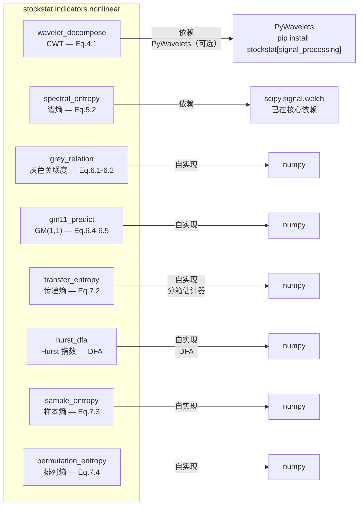

#### 4.6.3 函数清单

`ComputeEngine` 上暴露的方法名与 `nonlinear.py` 模块级函数名对照：

| `client.compute.*` 方法 | `nonlinear.py` 函数 | 公式 | 依赖 | 降级行为 |
|------|------|------|------|---------|
| `wavelet_decompose(signal, scales, wavelet)` | `wavelet_decompose` | CWT（式 4.1） | PyWavelets（可选） | 未安装时降级为 FFT 自实现 Morlet |
| `spectral_entropy(signal, fs, nperseg)` | `spectral_entropy` | 谱熵（式 5.2） | scipy.signal.welch | — |
| `grey_relation(x0, xi, rho)` | `grey_relation` | 灰色关联度（式 6.1–6.2） | numpy（自实现） | — |
| `gm11_predict(sequence)` | `gm11_predict` | GM(1,1) 预测（式 6.4–6.5） | numpy（自实现） | — |
| `transfer_entropy(x, y, k, n_bins)` | `transfer_entropy` | 传递熵（式 7.2） | numpy（自实现分箱估计器） | — |
| `hurst_dfa(signal)` | `hurst_dfa` | Hurst 指数（DFA） | numpy（自实现） | — |
| `sample_entropy(signal, m, r)` | `sample_entropy` | 样本熵（式 7.3） | numpy（自实现） | — |
| `permutation_entropy(signal, m, tau)` | `permutation_entropy` | 排列熵（式 7.4） | numpy（自实现） | — |

#### 4.6.4 依赖声明

| 组件 | 核心依赖 | 可选依赖 |
|------|---------|---------|
| `spectral_entropy` | scipy（已在核心依赖中） | — |
| `wavelet_decompose` | numpy（FFT 降级） | PyWavelets ≥ 1.1 |
| 其余 6 个函数 | numpy（自实现） | — |

```bash
# 安装完整信号处理能力
pip install stockstat[signal_processing]

# 或安装包含 PyWavelets 的完整套件
pip install stockstat[nonlinear]
```

#### 4.6.5 PlotSpec 工厂函数

`nonlinear.py` 提供 3 个返回 `PlotSpec` 的工厂函数，由 `ComputeEngine` 以不同方法名暴露：

| `nonlinear.py` 模块级函数 | `client.compute.*` 方法 | 返回 | 用途 |
|------|------|------|------|
| `wavelet_scalogram_spec(coef, scales, title, cmap)` | `wavelet_scalogram(coef, scales, title, cmap)` | `PlotSpec`（heatmap） | CWT 时频热力图 |
| `dfa_fit_spec(signal, title)` | `dfa_fit(signal, title)` | `PlotSpec`（log-log scatter+line） | DFA 双对数拟合图 + Hurst 标注 |
| `psd_spec(signal, fs, nperseg, title)` | `psd_plot(signal, fs, nperseg, title)` | `PlotSpec`（log-log line） | Welch PSD 频谱图 |

```python
# 示例：CWT scalogram 一行渲染
coef, scales = client.compute.wavelet_decompose(signal, scales=np.arange(1, 25))
spec = client.compute.wavelet_scalogram(coef, scales)  # 返回 PlotSpec
fig = client.plot.render(spec)  # 自动检测 matplotlib
```

#### 4.6.6 测试策略

`tests/test_nonlinear.py` 包含 37 个单元测试，覆盖：

- **已知性质验证**：白噪声 Hurst ≈ 0.5、纯音谱熵 < 1.0、常数序列样本熵 = 0
- **边界条件**：短序列（≤3 点）、常数序列、空输入
- **ComputeEngine 集成**：验证 11 个方法在 `client.compute` 上的可访问性
- **PlotSpec 工厂**：wavelet_scalogram / dfa_fit / psd_plot 返回正确的 PlotSpec
- **增强 PlotSpec**：heatmap、子图、log 轴、向后兼容性
- **MatplotlibRenderer**：heatmap 渲染、子图渲染

---

## 5. 脚本语言设计

提供**双模式**可编程接口：Python 库（全功能）+ DSL（轻量声明式）。

### 5.1 模式对比

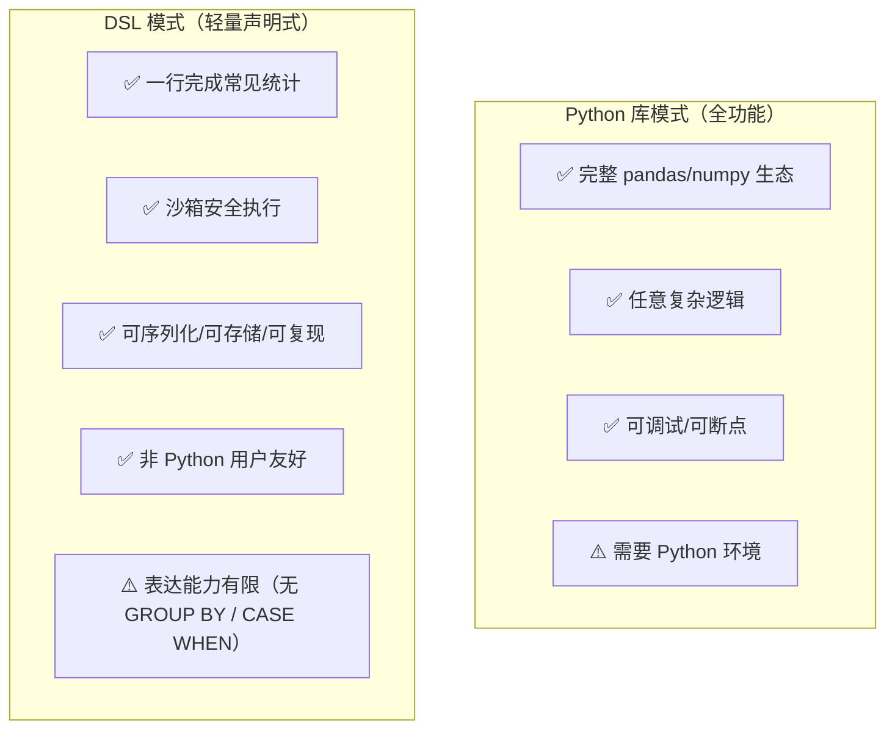

### 5.2 Python 库模式

完整的 Python API，适合复杂分析场景：

```python
from stockstat import StockStatClient
import pandas as pd

client = StockStatClient(host="localhost", port=8000)

# 获取数据
paxg = client.ohlcv("PAXG/USDT", start="2022-01-01", timeframe="1d")

# 自由计算
df = paxg.copy()
df['ret'] = df['close'].pct_change()
df['vol_20'] = df['ret'].rolling(20).std()
df['ma50'] = df['close'].rolling(50).mean()

# 任意 pandas 操作
result = df[df['vol_20'] > df['vol_20'].quantile(0.9)]
```

### 5.3 DSL 模式

设计为 **SQL-like 声明式统计查询语言**，基于 `lark` 解析器（需 `pip install stockstat[dsl]`）。

#### 5.3.1 语法设计

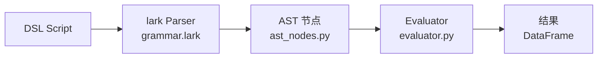

#### 5.3.2 语法规范（实际实现的 BNF 概要）

```
# frontend/stockstat/dsl/grammar.lark

start       : query
query       : "SELECT" select_list "FROM" source ("WHERE" condition)? ("LIMIT" INT)?
select_list : select_expr ("," select_expr)*
select_expr : expr ("AS" NAME)?
source      : "ohlcv" "(" string ("," string)* ")"
?expr       : expr OP expr       -> binop
            | func_call
            | NAME               -> name_ref
            | NUMBER             -> number
            | STRING             -> literal_string
func_call   : NAME "(" (expr ("," expr)*)? ("," kwarg)* ")"
kwarg       : NAME "=" expr
condition   : expr COMP expr

OP    : "+" | "-" | "*" | "/"
COMP  : ">" | "<" | ">=" | "<=" | "==" | "!="
```

> **能力边界**：当前 DSL 仅支持 `SELECT ... FROM ... WHERE ... LIMIT`，**不支持** `GROUP BY`、`ORDER BY`、`CASE WHEN`、子查询。`WHERE` 为行级布尔过滤，聚合须在 Python 库模式下完成。

#### 5.3.3 DSL 示例

```sql
-- 示例1: 计算 20 日均线与收盘价
SELECT
    close,
    ma(close, 20) AS ma20,
    ema(close, 12) AS ema12
FROM ohlcv("AAPL", "1d", "2024-01-01", "2024-12-31")

-- 示例2: RSI 超买过滤（行级 WHERE）
SELECT close, rsi(close, 14) AS rsi
FROM ohlcv("BTC/USDT", "1d", "2024-01-01", "2024-12-31")
WHERE rsi(close, 14) > 70
LIMIT 30

-- 示例3: 布林带三件套
SELECT
    close,
    bollinger(close, 20, 2.0) AS bands
FROM ohlcv("ETH/USDT", "1d", "2024-01-01", "2024-12-31")
LIMIT 50

-- 示例4: 关键字参数（kwarg 语法）
SELECT
    close,
    ma(close, window=20) AS ma20
FROM ohlcv("BTC/USDT", "1d", "2024-01-01", "2024-12-31")
```

#### 5.3.4 DSL 内置函数清单

实际在 `evaluator.py` 的 `_BUILTIN_FUNCS` 中注册的函数：

| 类别 | 函数 | 说明 |
|------|------|------|
| **趋势** | `ma(x, window)` | 简单移动平均 |
| | `ema(x, window)` | 指数移动平均 |
| | `macd(x, fast, slow, signal)` | MACD（返回三元组） |
| **震荡** | `rsi(x, window)` | 相对强弱指数 |
| **波动** | `std(x, window)` | 滚动标准差 |
| | `atr(high, low, close, window)` | 平均真实波幅 |
| | `bollinger(x, window, k)` | 布林带（返回三元组） |
| **统计** | `corr(x, y)` | 相关系数 |
| **变换** | `returns(x)` | 收益率序列 |
| | `log_returns(x)` | 对数收益率 |
| **聚合** | `max(x)` / `min(x)` / `mean(x)` / `sum(x)` / `count(x)` | 标量聚合 |

> **字段引用**：`open` / `high` / `low` / `close` / `volume` 直接取列；`returns` / `log_returns` 作为字段名时等价于 `returns(close)` / `log_returns(close)`。
> **未在 DSL 中暴露的指标**：`kdj` / `beta` / `sharpe` / `max_drawdown` / `rolling` / `shift` / `rank` / `weekend_filter` / `weekday_filter` / `spread` 当前仅在 Python 库模式可用，DSL 集成为后续工作。

---

## 6. API 规范

### 6.1 REST API 总览

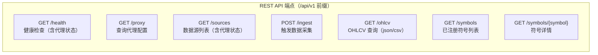

### 6.2 核心 API 定义

#### GET /api/v1/ohlcv

获取 OHLCV 数据，支持 JSON / CSV 两种返回格式。

**请求参数**：

| 参数 | 类型 | 必填 | 说明 |
|------|------|------|------|
| `symbol` | string | 是 | 统一符号，如 `PAXG/USDT` |
| `source` | string | 否 | 指定数据源；未指定时按符号自动检测 |
| `start` | string (ISO date) | 否 | 开始时间 |
| `end` | string (ISO date) | 否 | 结束时间 |
| `timeframe` | string | 否 | 时间周期，默认 `1d` |
| `limit` | int | 否 | 返回条数上限 |
| `format` | string | 否 | `json`（默认）/ `csv` |

**响应示例** (JSON)：

```json
{
  "symbol": "PAXG/USDT",
  "source": "binance",
  "timeframe": "1d",
  "count": 731,
  "data": [
    {
      "ts": "2022-01-01T00:00:00Z",
      "open": 1812.50,
      "high": 1820.00,
      "low": 1805.00,
      "close": 1818.00,
      "volume": 15234.5
    }
  ]
}
```

**CSV 格式**：

```
GET /api/v1/ohlcv?symbol=PAXG/USDT&format=csv
→ Response(media_type="text/csv")，首行为列名
```

> **Arrow 格式说明**：当前 `format=arrow` 未实现，仅 `json` 与 `csv` 可用。`pyproject.toml` 中的 `pyarrow` 依赖为计算前端所用，后端响应序列化尚未启用 Arrow IPC。

#### POST /api/v1/ingest

触发后端从数据源采集并存储 OHLCV 数据。

**请求参数**（Query）：

| 参数 | 类型 | 必填 | 说明 |
|------|------|------|------|
| `symbol` | string | 是 | 统一符号 |
| `source` | string | 否 | 数据源；未指定时自动检测 |
| `start` | string | 否 | 开始时间 |
| `end` | string | 否 | 结束时间 |
| `timeframe` | string | 否 | 默认 `1d` |

**响应**：

```json
{"symbol": "AAPL", "source": "yfinance", "ingested": 250}
```

采集成功后会清空缓存（`cache.clear()`）。

#### GET /api/v1/symbols

```json
{
  "count": 2,
  "symbols": [
    {
      "unified_symbol": "PAXG/USDT",
      "asset_type": "crypto",
      "base_asset": "PAXG",
      "quote_asset": "USDT",
      "sources": ["binance"],
      "description": null
    },
    {
      "unified_symbol": "AAPL",
      "asset_type": "stock",
      "base_asset": "AAPL",
      "quote_asset": null,
      "sources": ["yfinance"],
      "description": null
    }
  ]
}
```

### 6.3 错误处理

错误以 FastAPI 默认的 `{"detail": "..."}` 形式返回：

| HTTP Code | 触发场景 | 说明 |
|-----------|----------|------|
| 400 | `UNKNOWN_SOURCE` / 适配器不支持该符号 | 参数校验失败 |
| 404 | 查询的符号无数据 / 符号未注册 | `DATA_NOT_FOUND` / `SYMBOL_NOT_FOUND` |
| 502 | 适配器 `fetch_ohlcv` 抛异常 | 上游数据源失败 |

```python
# 示例：未采集过的符号查询
GET /api/v1/ohlcv?symbol=XXX/USDT
→ 404 {"detail": "No data for 'XXX/USDT'. Try POST /api/v1/ingest first."}
```

---

## 7. 测试用例

### 7.1 测试组织

| 测试文件 | 覆盖范围 | 运行条件 |
|---------|---------|---------|
| `backend/tests/test_backend.py` | 后端 API、适配器、存储、缓存、代理 | 部分需网络（真实数据） |
| `frontend/tests/test_frontend.py` | 内置指标（trend/oscillator/volatility/statistics）、DSL、可视化协议、序列化 | 离线 |
| `frontend/tests/test_nonlinear.py` | 8 个非线性函数 + 3 个 PlotSpec 工厂 + 增强 PlotSpec | 离线（37 用例） |
| `frontend/tests/test_integration.py` | 经典统计 + PAXG 周末相关性（真实数据） | 需后端 + 网络 |
| `frontend/tests/test_matplotlib_charts.py` | matplotlib 图表生成（输出至 `docs/images/`） | 需 matplotlib |
| `frontend/tests/test_backtest_*.py` | 回测子系统全套（见 §12 与附录 C） | 部分需网络 |

### 7.2 经典股票统计用例

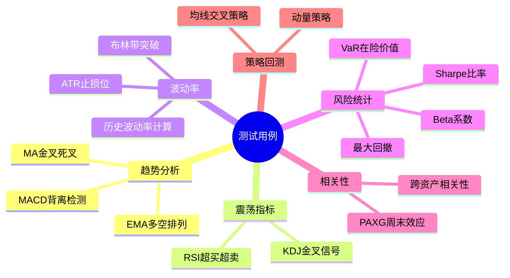

以下用例对应 `test_frontend.py` 与 `test_integration.py`：

#### 用例 1: 移动平均线金叉/死叉

```python
"""测试 MA 金叉死叉信号的正确性"""
client = StockStatClient(host="localhost", port=8000)
data = client.ohlcv("AAPL", start="2024-01-01", timeframe="1d")

ma_short = data.close.rolling(5).mean()
ma_long = data.close.rolling(20).mean()

# 金叉：短均线上穿长均线
golden_cross = (ma_short > ma_long) & (ma_short.shift(1) <= ma_long.shift(1))
# 死叉：短均线下穿长均线
death_cross = (ma_short < ma_long) & (ma_short.shift(1) >= ma_long.shift(1))

assert golden_cross.sum() >= 0  # 至少不报错
assert death_cross.sum() >= 0
```

#### 用例 2: RSI 超买超卖检测

```python
"""RSI 值域 [0, 100]，>70 超买，<30 超卖"""
data = client.ohlcv("BTC/USDT", start="2024-01-01", timeframe="1d")
rsi = client.compute.rsi(data.close, window=14)

assert rsi.between(0, 100).all()
assert rsi.isna().sum() == 14  # 前14个为NaN
```

#### 用例 3: Beta 系数计算

```python
"""Beta = Cov(Ri, Rm) / Var(Rm)"""
stock = client.ohlcv("AAPL", start="2023-01-01", timeframe="1d")
market = client.ohlcv("^GSPC", start="2023-01-01", timeframe="1d")

beta = client.compute.beta(
    asset=stock.close.pct_change(),
    benchmark=market.close.pct_change(),
    window=60
)
assert 0.5 < beta.dropna().mean() < 2.0  # AAPL Beta 通常在 1.0~1.3
```

#### 用例 4: 最大回撤

```python
"""最大回撤 = max(1 - P_t / max(P_0..P_t))"""
data = client.ohlcv("BTC/USDT", start="2023-01-01", timeframe="1d")
cumret = data.close / data.close.iloc[0]
running_max = cumret.cummax()
drawdown = (cumret - running_max) / running_max
max_dd = drawdown.min()

assert -1 <= max_dd <= 0
```

#### 用例 5: 夏普比率

```python
"""Sharpe = (E[R] - Rf) / std(R) * sqrt(252)"""
data = client.ohlcv("BTC/USDT", start="2023-01-01", timeframe="1d")
returns = data.close.pct_change().dropna()

sharpe = client.compute.sharpe(returns, risk_free=0.02, annualize=True)
assert -5 < sharpe < 10
```

#### 用例 6: 布林带突破

```python
"""布林带 = MA ± k * std"""
data = client.ohlcv("ETH/USDT", start="2024-01-01", timeframe="1d")
upper, mid, lower = client.compute.bollinger(data.close, window=20, k=2)

assert (upper >= mid).all()
assert (mid >= lower).all()
breakout = (data.close > upper).sum() / len(data)
assert breakout < 0.15
```

#### 用例 7: 跨资产相关性

```python
"""BTC 与 ETH 应高度正相关"""
btc = client.ohlcv("BTC/USDT", start="2024-01-01", timeframe="1d")
eth = client.ohlcv("ETH/USDT", start="2024-01-01", timeframe="1d")

corr = btc.close.pct_change().corr(eth.close.pct_change())
assert corr > 0.7
```

### 7.3 PAXG 周末涨跌与周一独立涨跌幅相关性

> **核心研究用例**：统计 PAXG（PAX Gold，黄金锚定代币）周末涨跌幅与周一最大涨幅 `(最高-开盘)/开盘` 和最大跌幅 `(最低-开盘)/开盘` 之间的独立相关性。同时记录两者，避免按信号方向选择极值导致的选择偏差。对应 `test_integration.py`。

#### 7.3.1 分析逻辑

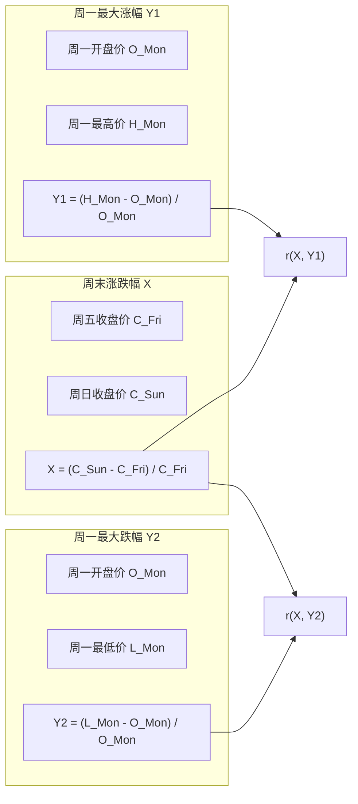

**假设**：PAXG 锚定黄金，周末传统黄金市场休市，PAXG 周末价格若发生偏离，可能适度预测周一日内极值。通过独立记录涨幅和跌幅，避免按信号方向选择极值导致的选择偏差。

#### 7.3.2 Python 实现

```python
"""
PAXG 周末涨跌与周一独立涨跌幅相关性测试。
同时记录 (最高-开盘)/开盘 和 (最低-开盘)/开盘。
"""
import pandas as pd
from scipy import stats
from stockstat import StockStatClient

client = StockStatClient(host="localhost", port=8000)

# ── 1. 获取 PAXG 日线数据 ──
paxg = client.ohlcv(
    symbol="PAXG/USDT", source="binance",
    start="2022-01-01", end="2024-12-31", timeframe="1d"
)

# ── 2. 标注星期几 ──
df = paxg.copy()
df['weekday'] = df.index.weekday

# ── 3. 提取周五收盘、周日收盘、周一 OHLC ──
fridays = df[df['weekday'] == 4][['close']].rename(columns={'close': 'fri_close'})
sundays = df[df['weekday'] == 6][['close']].rename(columns={'close': 'sun_close'})
mondays = df[df['weekday'] == 0][['open', 'high', 'low', 'close']].copy()

# ── 4. 构建周末-周一配对 ──
pairs = []
for mon_date, mon_row in mondays.iterrows():
    prev_fri = fridays.loc[:mon_date].tail(1)
    prev_sun = sundays.loc[:mon_date].tail(1)
    if len(prev_fri) > 0 and len(prev_sun) > 0:
        fri_close = prev_fri['fri_close'].iloc[0]
        sun_close = prev_sun['sun_close'].iloc[0]
        weekend_return = (sun_close - fri_close) / fri_close
        mon_open = mon_row['open']
        max_gain = (mon_row['high'] - mon_open) / mon_open
        max_loss = (mon_row['low'] - mon_open) / mon_open
        pairs.append({'weekend_return': weekend_return,
                      'max_gain': max_gain, 'max_loss': max_loss})

result_df = pd.DataFrame(pairs)

# ── 5. 计算独立相关性 ──
r_gain = result_df['weekend_return'].corr(result_df['max_gain'])
r_loss = result_df['weekend_return'].corr(result_df['max_loss'])
p_gain = stats.pearsonr(result_df['weekend_return'], result_df['max_gain'])[1]
p_loss = stats.pearsonr(result_df['weekend_return'], result_df['max_loss'])[1]

# ── 6. 分组对比 ──
up = result_df[result_df['weekend_return'] > 0]
dn = result_df[result_df['weekend_return'] < 0]

print(f"样本数:    {len(result_df)} (up={len(up)}, dn={len(dn)})")
print(f"r(涨幅):   {r_gain:.4f}  p={p_gain:.4f}")
print(f"r(跌幅):   {r_loss:.4f}  p={p_loss:.4f}")
print(f"信号>0: 涨幅={up['max_gain'].mean()*100:.4f}%, 跌幅={up['max_loss'].mean()*100:.4f}%")
print(f"信号<0: 涨幅={dn['max_gain'].mean()*100:.4f}%, 跌幅={dn['max_loss'].mean()*100:.4f}%")
```

#### 7.3.3 预期输出（真实数据 2022-2024）

```
样本数:    156 (up=76, dn=65)
r(涨幅):   0.2303  p=0.0038
r(跌幅):   -0.2004  p=0.0121
信号>0: 涨幅=0.7099%, 跌幅=-0.9070%
信号<0: 涨幅=0.5940%, 跌幅=-0.7435%
```

#### 7.3.4 测试断言

```python
def test_paxg_weekend_gain_loss(client):
    """PAXG 周末涨跌与周一独立涨跌幅测试"""
    result = compute_paxg_gain_loss(client)

    assert result['n_samples'] > 50, "样本数不足"
    assert -1 <= result['r_gain'] <= 1, "r(涨幅)越界"
    assert -1 <= result['r_loss'] <= 1, "r(跌幅)越界"

    # PAXG 波动应较小（黄金锚定）
    assert abs(result['up_gain_mean']) < 0.05
    assert abs(result['dn_loss_mean']) < 0.05
```

---

## 8. 技术栈选型

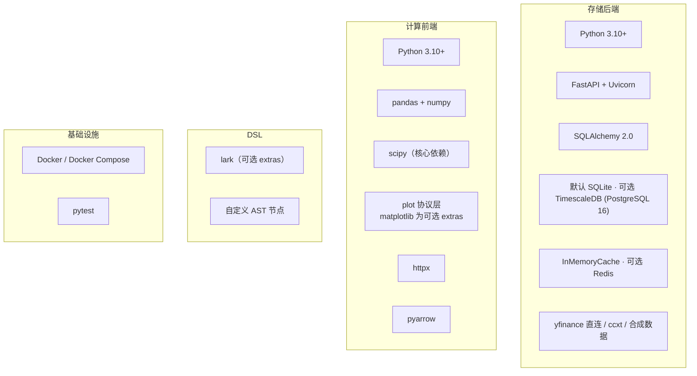

| 层 | 技术 | 选型理由 |
|----|------|----------|
| 后端框架 | FastAPI | 原生 async，自动生成 OpenAPI 文档，高性能 |
| ORM | SQLAlchemy 2.0 | 多后端切换（SQLite/PostgreSQL），声明式模型 |
| 默认数据库 | SQLite | 零外部依赖，本地开发即开即用 |
| 生产数据库 | TimescaleDB (PostgreSQL 16) | Docker 部署，时序优化（Hypertable 可选启用） |
| 缓存 | InMemoryCache（默认）/ Redis（可选） | 默认零依赖；生产可接入 Redis |
| 计算核心 | pandas + numpy | 事实标准，生态最全 |
| 统计扩展 | scipy | 谱熵、假设检验（核心依赖） |
| DSL 解析 | lark | Python 生态成熟的解析器，EBNF 友好（可选 extras） |
| 数据传输 | JSON / CSV | 当前实现；Arrow IPC 规划中 |
| 可视化 | matplotlib（可选 extras） | 协议化适配，延迟导入，核心零依赖，缺失时优雅降级 |
| 部署 | Docker Compose | 一键部署后端服务栈 |

---

## 9. 部署方案

### 9.1 本地开发部署（默认 SQLite，零外部依赖）

```bash
# 1. 安装后端
cd backend && pip install -e .

# 2.（可选）开启代理访问真实数据源
export STOCKSTAT_PROXY_ENABLED=true
export STOCKSTAT_PROXY_TYPE=http
export STOCKSTAT_PROXY_URL=http://127.0.0.1:8889

# 3. 启动 API 服务（默认 sqlite:///stockstat.db）
python -m uvicorn stockstat_backend.app:app --host 0.0.0.0 --port 8000

# 4. 安装前端库（另一个终端）
cd frontend && pip install -e .
```

### 9.2 Docker 生产部署（TimescaleDB + Redis）

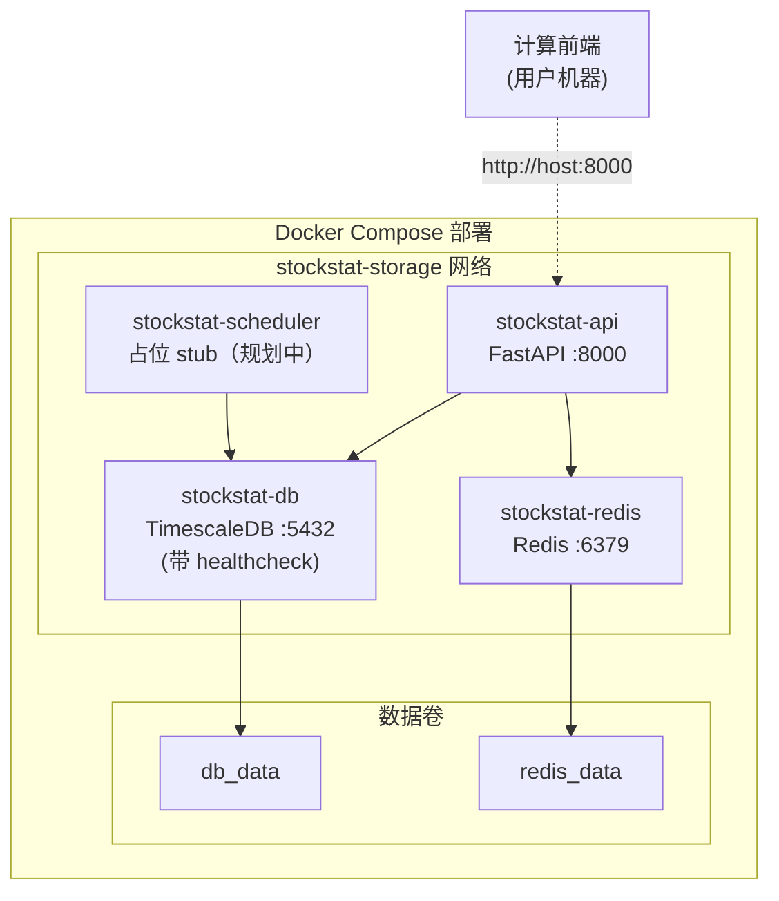

**docker-compose.yml 核心结构**（与仓库实际文件一致）：

```yaml
version: "3.9"
services:
  db:
    image: timescale/timescaledb:latest-pg16
    environment:
      POSTGRES_DB: stockstat
      POSTGRES_USER: stockstat
      POSTGRES_PASSWORD: ${DB_PASSWORD:-stockstat123}
    ports: ["5432:5432"]
    volumes: [db_data:/var/lib/postgresql/data]
    healthcheck:
      test: ["CMD-SHELL", "pg_isready -U stockstat"]
      interval: 10s
      timeout: 5s
      retries: 5

  redis:
    image: redis:7-alpine
    ports: ["6379:6379"]
    volumes: [redis_data:/data]

  api:
    build: ./backend
    ports: ["8000:8000"]
    environment:
      DATABASE_URL: postgresql://stockstat:${DB_PASSWORD:-stockstat123}@db:5432/stockstat
      REDIS_URL: redis://redis:6379/0
      STOCKSTAT_PROXY_ENABLED: ${PROXY_ENABLED:-false}
      STOCKSTAT_PROXY_TYPE: ${PROXY_TYPE:-http}
      STOCKSTAT_PROXY_URL: ${PROXY_URL:-http://127.0.0.1:8889}
    depends_on:
      db: { condition: service_healthy }
      redis: { condition: service_started }

  scheduler:
    build: ./backend
    command: python -c "import time; print('Scheduler stub - implement APScheduler here'); time.sleep(3600)"
    environment:
      DATABASE_URL: postgresql://stockstat:${DB_PASSWORD:-stockstat123}@db:5432/stockstat
    depends_on:
      db: { condition: service_healthy }

volumes:
  db_data:
  redis_data:
```

> **注意**：当前 `api` 服务的代码使用 `InMemoryCache`，即使 `REDIS_URL` 已配置也不会自动接入 Redis（需扩展 `storage/cache.py`）。`scheduler` 服务为占位进程，未实现真实调度逻辑。

### 9.3 计算前端安装

```bash
# 核心库
pip install stockstat

# 可选 extras
pip install stockstat[matplotlib]      # 可视化
pip install stockstat[dsl]             # DSL 解析（lark）
pip install stockstat[signal_processing]  # PyWavelets
pip install stockstat[backtest_full]   # 回测全套（matplotlib + optuna）

# 配置连接
export STOCKSTAT_HOST=localhost
export STOCKSTAT_PORT=8000
```

```python
# 或在代码中配置
from stockstat import StockStatClient
client = StockStatClient(host="your-server.com", port=8000)
```

---

## 10. 项目结构

以下为仓库实际文件树（与代码一一对应）：

```
StockStatistic/
├── backend/                              # 存储后端服务
│   ├── stockstat_backend/
│   │   ├── __init__.py
│   │   ├── app.py                        # FastAPI 应用入口
│   │   ├── config.py                     # Settings + ProxyConfig（环境变量驱动）
│   │   ├── api/
│   │   │   ├── __init__.py
│   │   │   └── routes.py                 # 全部 REST 路由（/health /proxy /sources /ingest /ohlcv /symbols）
│   │   ├── adapters/                     # 数据源适配器
│   │   │   ├── __init__.py
│   │   │   ├── base.py                   # DataSourceAdapter ABC
│   │   │   ├── yfinance.py               # 基于 yfinance 库
│   │   │   ├── yahoo_direct.py           # 直连 Yahoo Finance API（路由默认）
│   │   │   ├── ccxt_adapter.py           # ccxt 通用适配器（Binance/Coinbase）
│   │   │   └── synthetic.py              # 合成数据（离线测试）
│   │   ├── models/
│   │   │   ├── __init__.py
│   │   │   └── ohlcv.py                  # OHLCV + SymbolRegistry ORM
│   │   ├── storage/
│   │   │   ├── __init__.py
│   │   │   ├── database.py               # engine/session 单例
│   │   │   ├── repository.py             # OHLCVRepository + SymbolRepository
│   │   │   └── cache.py                  # InMemoryCache
│   │   ├── normalizer/
│   │   │   ├── __init__.py
│   │   │   └── normalizer.py             # normalize_ohlcv()
│   │   └── scheduler/                    # 占位目录（空，规划中）
│   ├── tests/
│   │   └── test_backend.py
│   ├── Dockerfile
│   └── pyproject.toml
│
├── frontend/                             # 计算前端库
│   ├── stockstat/
│   │   ├── __init__.py                   # 导出 StockStatClient
│   │   ├── client.py                     # StockStatClient 主入口 + PlotAPI
│   │   ├── config.py                     # Config dataclass
│   │   ├── data_access/
│   │   │   ├── __init__.py
│   │   │   └── ohlcv.py                  # DataClient（httpx）
│   │   ├── compute/
│   │   │   ├── __init__.py
│   │   │   ├── engine.py                 # ComputeEngine（含 8 个非线性方法 + 3 个 PlotSpec 工厂）
│   │   │   └── registry.py               # register / call_indicator / @indicator
│   │   ├── indicators/
│   │   │   ├── __init__.py
│   │   │   ├── trend.py                  # ma / ema / macd
│   │   │   ├── oscillator.py             # rsi / kdj
│   │   │   ├── volatility.py             # std / atr / bollinger
│   │   │   ├── statistics.py             # corr / beta / sharpe / max_drawdown / var / returns / log_returns
│   │   │   └── nonlinear.py              # 8 个非线性函数 + 3 个 PlotSpec 工厂
│   │   ├── dsl/
│   │   │   ├── __init__.py
│   │   │   ├── grammar.lark              # lark EBNF 语法
│   │   │   ├── parser.py                 # 解析器
│   │   │   ├── ast_nodes.py              # AST 节点
│   │   │   └── evaluator.py              # 求值器 + _BUILTIN_FUNCS
│   │   ├── plot/                         # 可视化层（可选 · 协议化）
│   │   │   ├── __init__.py
│   │   │   ├── base.py                   # PlotSpec/SeriesSpec/SubplotSpec + PlotRenderer 协议 + NullRenderer + RendererFactory
│   │   │   └── matplotlib_backend.py     # MatplotlibRenderer（延迟导入）
│   │   ├── backtest/                     # 回测子系统（见 §12）
│   │   │   ├── __init__.py
│   │   │   ├── engine.py
│   │   │   ├── execution_model.py
│   │   │   ├── context.py
│   │   │   ├── data_feed.py
│   │   │   ├── strategy.py
│   │   │   ├── orders.py
│   │   │   ├── broker.py
│   │   │   ├── portfolio.py
│   │   │   ├── cost_model.py
│   │   │   ├── fill_model.py
│   │   │   ├── intrabar.py
│   │   │   ├── sizing.py
│   │   │   ├── metrics.py
│   │   │   ├── result.py
│   │   │   ├── benchmark.py
│   │   │   ├── analyzer.py
│   │   │   ├── batch_runner.py
│   │   │   ├── fee_sweep.py
│   │   │   ├── optimizer.py
│   │   │   ├── walkforward.py
│   │   │   ├── montecarlo.py
│   │   │   ├── plot_adapter.py
│   │   │   ├── chart_spec.py
│   │   │   ├── chart_registry.py
│   │   │   ├── chart_factory.py
│   │   │   ├── null_charts.py
│   │   │   └── matplotlib_charts.py
│   │   └── export/
│   │       ├── __init__.py
│   │       └── serializers.py
│   ├── tests/
│   │   ├── test_frontend.py              # 指标 / DSL / 可视化协议 / 序化
│   │   ├── test_nonlinear.py             # 信号处理与非线性动力学（37 用例）
│   │   ├── test_integration.py           # 经典统计 + PAXG 周末（真实数据）
│   │   ├── test_matplotlib_charts.py     # 图表生成
│   │   ├── test_backtest_iface.py        # BT-0 接口骨架
│   │   ├── test_backtest_mvp.py          # BT-1 MVP
│   │   ├── test_backtest_portfolio.py    # BT-2 多标的/做空
│   │   ├── test_backtest_multitf.py      # BT-3 多 tf
│   │   ├── test_backtest_cost.py         # BT-4 成本模型
│   │   ├── test_backtest_metrics.py      # BT-5 绩效
│   │   ├── test_backtest_optimize.py     # BT-6 优化器
│   │   ├── test_backtest_strategies.py   # BT-7 12 策略
│   │   ├── test_backtest_p0.py           # BT-8
│   │   ├── test_backtest_p1.py           # BT-9
│   │   ├── test_backtest_p2.py           # BT-10
│   │   ├── test_backtest_intrabar.py     # BT-11/12 intrabar
│   │   ├── test_backtest_viz_iface.py    # BT-V0
│   │   ├── test_backtest_viz_mpl.py      # BT-V1
│   │   ├── test_backtest_viz_advanced.py # BT-V2
│   │   ├── test_backtest_viz_dashboard.py # BT-V3
│   │   └── test_backtest_viz_online.py   # BT-V Online
│   └── pyproject.toml
│
├── docker-compose.yml                    # 后端部署编排
├── docs/
│   ├── USAGE.md / USAGE_CN.md            # 使用指南
│   ├── backtest/                         # 回测阶段文档（见附录 C）
│   └── images/                           # 图表输出
├── reports/                              # 测试报告
├── working/                              # 研究工作目录（不入版本控制）
├── DESIGN.md / DESIGN_CN.md              # 设计报告（中英文）
├── README.md / README_CN.md              # 项目说明
└── LICENSE                               # GPLv3
```

---

## 11. 开发路线图

> 以下为已完成路线图回顾。截至 v1.7（2026-07-17），存储后端、计算前端、DSL、可视化、信号处理与非线性动力学模块、回测子系统（BT-0~BT-14 + BT-V0~V3）均已实现并通过测试。调度器、Arrow 传输、Plotly 后端为后续工作。

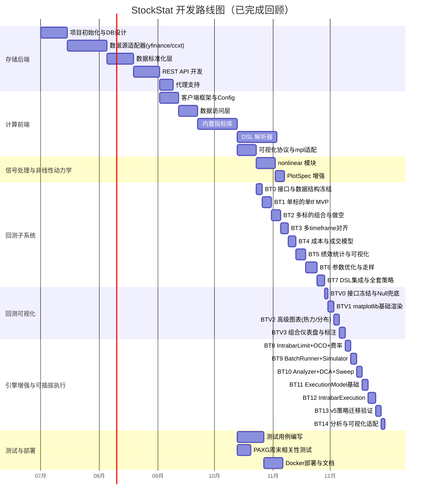

### 开发阶段

| 阶段 | 内容 | 产出 | 状态 |
|------|------|------|------|
| **P0** | 存储后端 MVP | SQLAlchemy ORM + yfinance/ccxt/synthetic 适配器 + 基础 API + InMemoryCache | ✅ |
| **P1** | 计算前端 MVP | StockStatClient + DataClient + 5 个核心指标 | ✅ |
| **P2** | DSL 解析器 | grammar.lark + parser + evaluator + 15 个内置函数 | ✅ |
| **P3** | 完整指标库 | 趋势/震荡/波动/统计 全套指标 | ✅ |
| **P4** | 可视化层 | PlotSpec + PlotRenderer 协议 + matplotlib 适配（可选 extras） | ✅ |
| **P5** | 测试与部署 | 全部测试用例 + Docker + 文档 | ✅ |
| **NL** | 信号处理与非线性动力学 | 8 个函数 + 3 个 PlotSpec 工厂 + PlotSpec 增强 | ✅ |
| **BT-0** | 回测接口冻结 | 核心 dataclass + 抽象基类签名 + 接口骨架测试 | ✅ |
| **BT-1** | 单标的 MVP | DataFeed/Portfolio/Broker/Context/Engine/Result + 双均线策略 | ✅ |
| **BT-2** | 多标的组合 | Universe + 做空 + 限价/止损单 + 仓位算法 + 配对交易 | ✅ |
| **BT-3** | 多 timeframe | {sym:{tf:df}} 对齐 + 未来函数审计 + 多 tf 共振策略 | ✅ |
| **BT-4** | 成本模型 | 手续费/滑点/印花税 + MakerTaker + Binance 4 预设 + 涨跌停 | ✅ |
| **BT-5** | 绩效与报告 | Sharpe/Sortino/Calmar + 回撤 + 交易明细 + PlotSpec 可视化 | ✅ |
| **BT-6** | 优化与走样 | 网格搜索 + optuna + Walk-forward + 蒙特卡洛（可选 extras） | ✅ |
| **BT-7** | DSL 集成 | 12 策略全套测试 + 文档 | ✅ |
| **BT-V0~V3** | 回测可视化 | BacktestChartSpec + Renderer 协议 + 9 图表 + dashboard | ✅ |
| **BT-8~10** | 引擎增强 P0/P1/P2 | IntrabarLimitFill + BatchRunner + Analyzer + DCA + fee_sweep | ✅ |
| **BT-11~14** | 可插拔执行 | ExecutionModel ABC + IntrabarExecution + IntrabarMixin + 策略迁移验证 | ✅ |
| **后续** | 调度器 / Arrow / Plotly / TimescaleDB Hypertable | 见各章节"规划中"说明 | ⏳ |

---

## 12. 回测子系统设计

> 回测子系统是计算前端的可选增强模块，位于 `frontend/stockstat/backtest/`，纯前端实现，不修改存储后端。本章节涵盖回测引擎核心、可插拔执行模型、可视化层、分析工具与批量回测的完整设计。

### 12.1 设计目标与原则

| 目标 | 说明 |
|------|------|
| **可配置** | 自定义策略函数、多标的交易组、多时间尺度 K 线、复用计算库指标 |
| **可编程优先** | 不内置固定策略，提供 Strategy 基类 + `@strategy` 函数装饰器 + `IntrabarMixin` 三种粒度 |
| **数据与计算分离** | 回测纯前端运行，数据经 `DataClient` 拉取后注入 `DataFeed` |
| **零硬依赖** | 核心仅依赖 pandas/numpy；optuna/matplotlib 走 extras |
| **未来函数防护** | 策略 `on_bar(t)` 只能访问 `≤ t` 数据；订单默认在 `t+1` open 成交；intrabar 模式下遮蔽 parent bar 的 close/high/low |
| **可复现** | seed + 数据快照版本号记录于 `BacktestResult` |
| **可插拔执行** | `ExecutionModel` ABC 支持 `NextBarExecution`（默认）和 `IntrabarExecution`（intrabar 子 bar 撮合） |
| **向后兼容** | 所有新参数有默认值，默认行为 = 既有行为；现有代码零修改 |

### 12.2 顶层架构

```mermaid
graph TB
    subgraph "用户策略代码 Strategy"
        US["on_bar(ctx):<br/>ctx.compute.rsi(...)<br/>ctx.broker.submit(...)<br/>ctx.intrabar_submit(...)<br/>define_exits(fill, ctx)"]
    end

    subgraph "回测核心 BacktestEngine"
        CTX["BacktestContext<br/>get/intrabar_submit<br/>compute/portfolio/history"]
        BRK["SimulatedBroker<br/>submit/cancel/submit_oco<br/>submit_oco_mutual"]
        DF["DataFeed + Universe<br/>多标的多 tf 对齐<br/>intrabar_slice()"]
        PF["Portfolio<br/>cash / positions<br/>apply_fill / mark_to_market"]
        EM["ExecutionModel<br/>NextBarExecution（默认）<br/>IntrabarExecution（intrabar 子 bar 撮合）"]
        RES["BacktestResult<br/>fills / equity / metrics<br/>chart() / render() / exit_reason_stats()"]
    end

    subgraph "成本与成交模型"
        CM["CostModel<br/>Percent/Fixed/Tiered/StampDuty<br/>MakerTaker/Binance（4 预设）"]
        FM["FillModel<br/>NextOpen/NextClose/VWAP<br/>IntrabarLimit/IntrabarFillModel"]
    end

    subgraph "可视化层（零硬依赖 · 延迟激活）"
        VIZ["BacktestChartSpec<br/>chart_registry / chart_factory<br/>Null / Matplotlib renderer"]
    end

    subgraph "分析工具"
        ANA["BacktestAnalyzer<br/>subperiod / regime / rolling<br/>StrategyBatchRunner / fee_sweep"]
    end

    US -->|读| CTX
    US -->|写订单| BRK
    US -->|intrabar 订单| EM
    CTX -->|提供对齐 bar| US
    BRK -->|推送成交| PF
    EM -->|撮合| BRK
    DF --> CTX
    DF --> EM
    PF --> CTX
    CM --> BRK
    FM --> EM
    RES --> VIZ
    RES --> ANA
```

### 12.3 模块划分

```
frontend/stockstat/backtest/
├── __init__.py              # 对外导出
├── engine.py                # BacktestEngine：主循环、事件分发、execution_model 参数
├── execution_model.py       # ExecutionModel ABC + NextBarExecution + IntrabarExecution
├── context.py               # BacktestContext：策略可见的世界 + intrabar_submit()
├── data_feed.py             # DataFeed + Universe + intrabar_slice()
├── strategy.py              # Strategy 基类、@strategy 装饰器、IntrabarMixin
├── orders.py                # Order/Fill 数据类（含 exit_reason、priority、sub_bar_ts）
├── broker.py                # SimulatedBroker（含 submit_oco / submit_oco_mutual）
├── portfolio.py             # Portfolio/Position
├── cost_model.py            # CostModel + Percent/Fixed/Tiered/StampDuty/MakerTaker/Binance
├── fill_model.py            # FillModel + NextOpen/Close/VWAP/IntrabarLimit/IntrabarFillModel
├── intrabar.py              # IntrabarSimulator（独立工具）
├── sizing.py                # 仓位规模算法
├── metrics.py               # 绩效聚合
├── result.py                # BacktestResult + exit_reason_stats()
├── benchmark.py             # buy_and_hold / dca_equity
├── analyzer.py              # BacktestAnalyzer：subperiod/regime/rolling
├── batch_runner.py          # StrategyBatchRunner + BatchResults
├── fee_sweep.py             # fee_sweep() / maker_taker_sweep()
├── optimizer.py             # 参数优化（可选 extras）
├── walkforward.py           # 走样分析（可选）
├── montecarlo.py            # 蒙特卡洛（可选）
├── plot_adapter.py          # equity/trades → PlotSpec（向后兼容）
├── chart_spec.py            # BacktestChartSpec 专用规格
├── chart_registry.py        # 图表类型注册表
├── chart_factory.py         # detect + get_chart_renderer
├── null_charts.py           # NullBacktestRenderer（零依赖兜底）
└── matplotlib_charts.py     # MatplotlibBacktestRenderer（延迟导入）
```

### 12.4 核心接口签名

```python
# strategy.py
class Strategy:
    """策略基类。子类重写钩子。"""
    def on_start(self, ctx: BacktestContext) -> None: ...
    def on_bar(self, ctx: BacktestContext) -> None: ...        # 主入口
    def on_bar_close(self, ctx: BacktestContext) -> None: ...
    def on_fill(self, fill: Fill, ctx: BacktestContext) -> None: ...

class IntrabarMixin:
    """可选 mixin：声明策略支持 intrabar 执行 + define_exits。"""
    def define_exits(self, entry_fill: Fill, ctx: BacktestContext) -> list[Order]: ...

def strategy(fn=None, *, name: str | None = None):
    """函数式策略装饰器：def on_bar(ctx) 简化写法。"""

# execution_model.py
class ExecutionModel(ABC):
    """订单执行模型：决定订单如何在 bar 内成交。"""
    def execute(self, engine, ctx, t, pending_orders) -> list[Fill]: ...
    @property
    def is_intrabar(self) -> bool: ...

class NextBarExecution(ExecutionModel):
    """默认：t 提交 → t+1 bar 成交。"""
    is_intrabar = False

class IntrabarExecution(ExecutionModel):
    """intrabar：parent bar 内子 bar 序列撮合。"""
    def __init__(self, intrabar_tf: str, parent_tf: str | None = None,
                 fill_model: IntrabarFillModel | None = None): ...
    def register_oco_mutual(self, order_a: Order, order_b: Order): ...
    is_intrabar = True

# context.py
class BacktestContext:
    now: pd.Timestamp
    current_bar: dict[str, pd.Series]
    def get(self, symbol: str, timeframe: str = "1d",
            lookback: int | None = None) -> pd.DataFrame: ...
    def intrabar_submit(self, order: Order) -> str: ...         # intrabar 下单
    def intrabar_submit_oco_mutual(self, a: Order, b: Order) -> tuple[str, str]: ...
    @property
    def compute(self) -> ComputeEngine: ...
    @property
    def broker(self) -> Broker: ...
    @property
    def portfolio(self) -> Portfolio: ...
    @property
    def history(self) -> ContextHistory: ...

# orders.py
@dataclass
class Order:
    symbol: str
    side: Literal["buy", "sell"]
    qty: float
    order_type: Literal["market","limit","stop","stop_limit","trailing_stop"] = "market"
    limit_price: float | None = None
    stop_price: float | None = None
    time_in_force: Literal["day","gtc","ioc"] = "gtc"
    tag: str = ""
    exit_reason: str = ""
    priority: int = 99          # 0=最高（SL），99=默认最低

@dataclass
class Fill:
    order_id: str
    symbol: str
    side: OrderSide | str
    qty: float
    price: float
    commission: float = 0.0
    slippage_cost: float = 0.0
    ts: object = None
    tag: str = ""
    exit_reason: str = ""
    sub_bar_ts: object = None   # intrabar 成交的子 bar 时间戳
    sub_bar_index: int = -1     # 子 bar 序列位置

# engine.py
class BacktestEngine:
    def __init__(self,
                 data: dict,                            # {symbol: {tf: df}} 或 Universe
                 strategy: Strategy,
                 initial_cash: float = 1_000_000.0,
                 cost_model: Optional[CostModel] = None,    # 默认 PercentCost()
                 fill_model: Optional[FillModel] = None,    # 默认 NextOpenFill()
                 benchmark: Optional[str] = None,
                 trade_on: str = "open",                    # "open" | "close"
                 allow_short: bool = False,
                 lookahead_audit: bool = False,
                 seed: int = 0,
                 compute_engine: Optional[ComputeEngine] = None,  # 默认自建空 ComputeEngine
                 periods_per_year: Optional[int] = None,
                 execution_model: Optional[ExecutionModel] = None):  # 默认 NextBarExecution
        ...
    def run(self) -> BacktestResult: ...
```

### 12.5 多 timeframe 对齐与未来函数防护

以**最低粒度 timeframe** 为驱动游标 `t`，更高 tf 的 bar 通过 `asof/ffill` 对齐到 `t`：

```python
# DataFeed 内部
master_index = union_of_all timestamps at finest tf
aligned[sym][tf] = df[sym][tf].reindex(master_index, method="ffill")

# Context.get(symbol, tf, lookback) 返回 ≤ t 切片（闭区间）
df = aligned[sym][tf].loc[:t]
return df.iloc[-lookback:] if lookback else df
```

- **未来函数防护**：策略 `on_bar(t)` 只能拿到 `≤ t` 数据；订单默认 `t+1` open 成交（`NextOpenFill`）
- **lookahead_audit**：可选运行时检测，访问 `> t` 数据抛 `LookaheadError`
- 指标计算基于 `≤ t` 切片，避免 lookahead

### 12.6 成本与成交模型

**成本模型**（`CostModel` ABC）：

| 模型 | 说明 |
|------|------|
| `PercentCost` | 默认：比例手续费 + 比例滑点（bps） |
| `FixedCost` | 固定每笔费用 |
| `TieredCost` | 阶梯费率（按交易额） |
| `MinCost` | 最小手续费兜底 |
| `StampDutyCost` | 印花税（股票卖出方） |
| `ZeroCost` | 零成本（测试用） |
| `MakerTakerCost` | Maker/Taker 区分：LIMIT→maker_rate，MARKET/STOP→taker_rate |
| `BinanceCost` | Binance 现货/合约 × BNB 抵扣（4 预设：`BINANCE_SPOT`/`_BNB`/`FUTURES`/`_BNB`） |

**成交模型**（`FillModel` ABC）：

| 模型 | 说明 |
|------|------|
| `NextOpenFill` | 默认：下一 bar open 成交，最强防未来函数 |
| `NextCloseFill` / `ThisCloseFill` | 其他成交时点（`ThisCloseFill` 有告警） |
| `VWAPFill` / `WorstPriceFill` | 模拟冲击成本 |
| `IntrabarLimitFill` | 限价单在盘中价格穿越限价水平时成交（检查 next_bar high/low） |
| `IntrabarFillModel` | 子 bar 序列扫描成交，返回 `IntrabarFillResult`（含 `sub_bar_ts`/`sub_bar_index`）；继承 `IntrabarLimitFill` |

### 12.7 仓位规模算法

`fixed_size / fixed_amount / percent_equity / kelly / atr_risk_budget`，由策略调用 `ctx.broker.submit(order)` 前计算 `qty`，或通过 `sizing` 辅助函数。

### 12.8 绩效指标

复用 `indicators.statistics` 与新增 `metrics.py`：

总收益、年化收益、Sharpe、Sortino、Calmar、Omega、信息比率、最大回撤、回撤持续/恢复时间、胜率、盈亏比、Profit Factor、期望值、连胜连跌、月度/年度热力、收益分布、VaR。

### 12.9 与既有模块集成

| 集成点 | 方式 |
|-------|------|
| `ComputeEngine` | `Context.compute` 直接持有 client 的 ComputeEngine；`BacktestEngine` 接受 `compute_engine` 参数 |
| 自定义指标 | `ctx.compute.register("divergence", fn)` → `ctx.compute.call(...)` |
| DSL | `Signal.from_dsl("SELECT ... WHERE rsi<30")` 信号生成（BT-7） |
| `indicators.statistics` | `metrics.py` 调用 sharpe/max_drawdown/var/returns |
| `plot` 协议 | `result.plot_equity()` 返回 PlotSpec，任意 renderer 渲染 |
| `export` | `result.to_csv()/to_json()` 复用 serializers |
| `data_access` | `DataFeed` 接受 DataFrame 或 client 懒加载 |

### 12.10 内置示例策略清单

12 个策略覆盖从简单到复杂，每个对应 `test_backtest_strategies.py` 测试用例：

| # | 策略 | 标的 | tf | 用到的指标/设计点 | 验证目标 |
|---|------|------|----|------------------|---------|
| 1 | 双均线交叉 | 单 | 单 | ma(5)×ma(20) | MVP 闭环 |
| 2 | 布林带突破 | 单 | 单 | bollinger | 限价单/止损 |
| 3 | RSI 超买超卖 | 单 | 单 | rsi | 反向开仓/止盈 |
| 4 | MACD 背离 | 单 | 单 | macd + 自定义指标 | register() |
| 5 | ATR 通道突破 | 单 | 单 | atr + Donchian | ATR 风险预算 |
| 6 | 网格交易 | 单 | 单 | 价格分档 | 多挂单/资金分桶 |
| 7 | 配对交易 | 多(2) | 单 | beta/corr + z-score | 多标的/做空对冲 |
| 8 | 风险平价 | 多(N) | 单 | beta/std | 定期再平衡 |
| 9 | 动量轮动 | 多(N) | 单 | 6月动量排名 | Top-K 调仓 |
| 10 | 多 tf 共振 | 单 | 多 | 日线 MA + 小时突破 | 多 tf 对齐 |
| 11 | PAXG 周末效应 | 单 | 单 | weekday 信号 | 事件驱动 |
| 12 | 马丁格尔 | 单 | 单 | 亏损翻倍 | 仓位限制/风险警示 |

### 12.11 依赖声明

```toml
[project.optional-dependencies]
backtest = ["stockstat"]                  # 核心回测（含 ExecutionModel + IntrabarExecution）
optimize = ["optuna>=3.5"]                # 参数优化
backtest_viz = ["stockstat[backtest]", "matplotlib>=3.8"]   # 回测可视化
backtest_full = ["stockstat[backtest]", "stockstat[optimize]",
                 "stockstat[matplotlib]", "matplotlib>=3.8"]
```

回测核心零硬依赖 matplotlib。所有增强纯 Python + pandas/numpy 实现。

### 12.12 可插拔执行模型

`ExecutionModel` 是回测引擎的核心抽象——决定订单如何在 bar 内成交。通过组合注入 `BacktestEngine`，支持两种执行模式而**不新增引擎类**。

**设计动机**：intrabar 子 bar 执行需要解决 5 项结构性差距——成交时间追踪（Gap-1）、同 bar 入场+出场（Gap-2）、成交后退出扫描（Gap-3）、双向均成交→双取消（Gap-4）、同 bar 内 SL 优先于 TP（Gap-5）。

```mermaid
graph TB
    subgraph "BacktestEngine（唯一引擎类）"
        ENG["execution_model 参数<br/>默认 NextBarExecution"]
        EM["ExecutionModel ABC"]
        NB["NextBarExecution<br/>默认：t→t+1 成交"]
        IB["IntrabarExecution<br/>intrabar 子 bar 撮合"]
    end

    subgraph "IntrabarExecution 内部"
        FILL["IntrabarFillModel<br/>子 bar 序列扫描 + 时间追踪"]
        SCAN["_scan_sub_bars<br/>预扫描→OCO检测→apply→退出扫描"]
        EXIT["_scan_exits<br/>limit/stop 逐bar + market close 收盘"]
        OCO["register_oco_mutual<br/>双向均成交→双取消"]
    end

    subgraph "策略层（duck typing）"
        STR["Strategy 基类（不变）"]
        MIX["IntrabarMixin（可选）<br/>define_exits()"]
    end

    ENG --> EM
    EM --> NB
    EM --> IB
    IB --> FILL
    IB --> SCAN
    SCAN --> EXIT
    SCAN --> OCO
    STR -.-> MIX
```

**5 项 Gap 的解决**：

| Gap | 解决方式 |
|-----|---------|
| Gap-1 | `Fill.sub_bar_ts` + `Fill.sub_bar_index` + `IntrabarFillModel.fill_with_timing()` |
| Gap-2 | `IntrabarExecution` 在 parent bar 内完成入场→退出全生命周期 |
| Gap-3 | duck typing 检测 `define_exits()` + `_scan_exits()` 前向扫描 |
| Gap-4 | `register_oco_mutual()` + 预扫描检测双向成交 |
| Gap-5 | `Order.priority` 字段 + 排序（SL priority=0 > TP priority=1） |

**向后兼容**：`execution_model=None` 默认 `NextBarExecution` = 既有行为。`ctx.intrabar_submit()` 在非 intrabar 模式下降级为 `broker.submit` + warning。现有策略代码零修改。

### 12.13 回测可视化

回测可视化子系统在回测核心之上叠加**零硬依赖**的可视化层：回测核心不依赖 matplotlib，但安装后自动激活丰富的回测专用图表。

**设计原则**：

| 原则 | 说明 |
|------|------|
| **回测核心零硬依赖** | `backtest/` 包导入不触发 matplotlib；`import stockstat.backtest` 永远成功 |
| **专用 spec 层** | `BacktestChartSpec`（回测专用），与通用 `PlotSpec` 平行，互不污染 |
| **延迟激活** | matplotlib 安装后通过 `matplotlib_charts` 模块延迟导入激活 |
| **协议化** | `BacktestChartRenderer` 协议，Null/Matplotlib 多后端可插拔 |

> **与通用 PlotSpec 的关系**：v1.7 增强后的通用 `PlotSpec` 已具备 heatmap / log 轴 / 子图 / fill / histogram 能力（见 §4.5.5），理论上可承载回测图表的全部需求。`BacktestChartSpec` 作为历史接口保留以向后兼容，新代码可直接使用增强的 `PlotSpec`。

**架构**：

```mermaid
graph TB
    subgraph "回测核心 backtest/（零 matplotlib 依赖）"
        RES["BacktestResult"]
        ADAPTER["plot_adapter.py<br/>基础 PlotSpec 构建器"]
        CHARTSPEC["chart_spec.py<br/>BacktestChartSpec 专用规格"]
        REG["chart_registry.py<br/>图表注册表"]
    end

    subgraph "通用 plot 协议（已有）"
        PS["PlotSpec"]
        PR["PlotRenderer<br/>Null/Matplotlib"]
    end

    subgraph "回测可视化后端（延迟导入 · 可选）"
        BCMPL["matplotlib_charts.py<br/>MatplotlibBacktestRenderer<br/>（matplotlib 安装后才激活）"]
        BCNULL["null_charts.py<br/>NullBacktestRenderer"]
        FACTORY["chart_factory.py<br/>detect + get_chart_renderer"]
    end

    RES --> ADAPTER --> PS
    RES --> CHARTSPEC
    CHARTSPEC --> REG
    REG --> FACTORY
    FACTORY --> BCMPL
    FACTORY --> BCNULL
    BCMPL -.->|延迟 import| PR
```

**图表类型清单**（9 种）：

| 图表 | 类型 | 用途 |
|------|------|------|
| `equity_curve` | 多 line + 基准 | 资金曲线对比 |
| `drawdown` | line + fill | 回撤填充区 |
| `trades_overlay` | line + scatter 标注 | 交易点叠加 |
| `returns_distribution` | histogram | 收益率分布 |
| `monthly_heatmap` | heatmap | 月度收益热力 |
| `yearly_returns` | bar | 年度收益对比 |
| `parameter_heatmap` | heatmap | 网格搜索参数热力 |
| `underwater_curve` | fill | 水下曲线（回撤持续） |
| `dashboard` | 多子图组合 | 综合仪表盘 |

**使用方式**：

```python
res = BacktestEngine(...).run()

# 一行渲染（自动检测 matplotlib，不可用时优雅降级）
res.render("equity_curve", path="equity.png")
res.render("dashboard", path="dashboard.png")

# 批量保存全部图表
out = res.render_all("./charts")

# 向后兼容——通用 PlotSpec（无 matplotlib 也能用）
spec = res.plot_equity()
```

### 12.14 分析工具与批量回测

**BacktestAnalyzer** — 回测后分析：

| 方法 | 用途 |
|------|------|
| `subperiod_metrics(result, split_dates)` | 按 split_dates 分割资金曲线计算子期间指标 |
| `regime_conditional_metrics(result, regime_series)` | 按状态序列分组计算指标 |
| `rolling_metric(result, metric, window)` | 滚动 Sharpe/波动率/回撤/收益 |
| `trade_analysis_by_exit(result)` | 按退出原因分组统计交易 |

**StrategyBatchRunner** — 多策略批量回测：

```python
runner = StrategyBatchRunner(data=data, initial_cash=10000, cost_model=BINANCE_SPOT)
results = runner.run_all({"ma_cross": s1, "rsi": s2})         # 多策略
results = runner.run_all_fees({"ma_cross": s1}, fee_models)    # 多策略 × 多费率
df = results.to_dataframe()                                    # 汇总 DataFrame
ranked = results.rank("sharpe")                                # 按 Sharpe 排名
```

**费率扫描**：

- `fee_sweep(data, strategy, commissions=[...])` — 均匀费率扫描
- `maker_taker_sweep(data, strategy, maker_rates=[...], taker_rates=[...])` — Maker×Taker 网格扫描

**基准**：

- `buy_and_hold(initial_cash, prices)` — 买入持有
- `dca_equity(initial_cash, prices, schedule="weekly")` — 定投基准（auto/weekly/monthly）

---

## 附录 A: 数据源兼容性矩阵

| 数据源 | 资产类型 | 网络 | 实现状态 | 历史深度 | 备注 |
|--------|---------|------|---------|---------|------|
| yfinance 直连（YahooDirectAdapter） | 美股/ETF/指数 | 是 | ✅ 已实现 | 10 年+ | 路由默认；绕过 yfinance 库 cookie/crumb 问题 |
| yfinance 库（YFinanceAdapter） | 美股/ETF/指数 | 是 | ✅ 已实现 | 10 年+ | 备选实现 |
| ccxt - Binance（CcxtAdapter） | 加密货币 | 是 | ✅ 已实现 | 全历史 | `source=binance` |
| ccxt - Coinbase（CcxtAdapter） | 加密货币 | 是 | ✅ 已实现 | 全历史 | `source=coinbase` |
| SyntheticAdapter | 混合 | 否 | ✅ 已实现 | 按需 | 固定种子合成数据 |
| Alpha Vantage | 全球股票 | 是 | ❌ 规划中 | — | 适配器类未实现 |
| Tushare | A 股 | 是 | ❌ 规划中 | — | 适配器类未实现 |

## 附录 B: OHLCV 数据量估算

| 标的范围 | 时间粒度 | 行数（1 年） | 存储估算 |
|---------|-----------|--------------|---------|
| 1 个标的 | 日线 | ~250 | ~2 KB |
| 1 个标的 | 1 分钟 | ~525,000 | ~15 MB |
| Binance USDT 对（1,479） | 日线 | ~370,000 | ~3 MB |
| Binance USDT 对（1,479） | 1 分钟 | ~776M | ~22 GB |
| Coinbase USD 对（528） | 日线 | ~132,000 | ~1 MB |
| Coinbase USD 对（528） | 1 分钟 | ~277M | ~8 GB |

> SQLite 适合单机小规模（万级行/百万级行）；当 1 分钟全市场数据量达 GB 级时，建议切换至 TimescaleDB（Docker 部署），并启用 Hypertable 压缩，可缩减至原始体积的 10%~20%。

## 附录 C: 回测阶段实现文档索引

回测核心（BT-0~BT-14）与回测可视化（BT-V0~BT-V3 + 在线验证）的阶段文档统一索引如下，存放于 `docs/backtest/`：

### C.1 回测核心（BT 系列）

| 阶段 | 文档 | 代码 | 测试 |
|------|------|------|------|
| BT-0 | [docs/backtest/BT0_CN.md](docs/backtest/BT0_CN.md) | `backtest/` 包骨架 + dataclass | `test_backtest_iface.py` |
| BT-1 | [docs/backtest/BT1_CN.md](docs/backtest/BT1_CN.md) | MVP 五大模块 | `test_backtest_mvp.py` |
| BT-2 | [docs/backtest/BT2_CN.md](docs/backtest/BT2_CN.md) | 多标的/做空/订单扩展 | `test_backtest_portfolio.py` |
| BT-3 | [docs/backtest/BT3_CN.md](docs/backtest/BT3_CN.md) | 多 tf 对齐/审计 | `test_backtest_multitf.py` |
| BT-4 | [docs/backtest/BT4_CN.md](docs/backtest/BT4_CN.md) | 成本/成交模型 | `test_backtest_cost.py` |
| BT-5 | [docs/backtest/BT5_CN.md](docs/backtest/BT5_CN.md) | 绩效/报告/可视化 | `test_backtest_metrics.py` |
| BT-6 | [docs/backtest/BT6_CN.md](docs/backtest/BT6_CN.md) | 优化/走样/蒙特卡洛 | `test_backtest_optimize.py` |
| BT-7 | [docs/backtest/BT7_CN.md](docs/backtest/BT7_CN.md) | DSL 集成/12 策略 | `test_backtest_strategies.py` |
| BT-8 | [docs/backtest/BT8_CN.md](docs/backtest/BT8_CN.md) | P0 致命修复：IntrabarLimitFill + MakerTakerCost + OCO | `test_backtest_p0.py` |
| BT-9 | [docs/backtest/BT9_CN.md](docs/backtest/BT9_CN.md) | P1 重要增强：IntrabarSimulator + BatchRunner + exit_reason | `test_backtest_p1.py` |
| BT-10 | [docs/backtest/BT10_CN.md](docs/backtest/BT10_CN.md) | P2 分析工具：DCA + Analyzer + fee_sweep | `test_backtest_p2.py` |
| BT-11 | [docs/backtest/BT11_BT14_CN.md](docs/backtest/BT11_BT14_CN.md) | ExecutionModel ABC + IntrabarFillModel + Fill/Order 字段扩展 | `test_backtest_intrabar.py` |
| BT-12 | 同上 | IntrabarExecution + IntrabarMixin + OCO mutual + 优先级 | `test_backtest_intrabar.py` |
| BT-13 | 同上 | v5 策略迁移（33 策略 × 4 费率 = 132 次回测验证） | `run_redo.py` |
| BT-14 | 同上 | 分析与可视化适配 | `plots_redo.py` |

### C.2 回测可视化（BT-V 系列 + 在线验证）

| 阶段 | 文档 | 代码 | 测试 |
|------|------|------|------|
| BT-V0 | [docs/backtest/BTV0_CN.md](docs/backtest/BTV0_CN.md) | `chart_spec.py` + `chart_registry.py` + `null_charts.py` + `chart_factory.py` | `test_backtest_viz_iface.py` |
| BT-V1 | [docs/backtest/BTV1_CN.md](docs/backtest/BTV1_CN.md) | `matplotlib_charts.py` 基础渲染 | `test_backtest_viz_mpl.py` |
| BT-V2 | [docs/backtest/BTV2_CN.md](docs/backtest/BTV2_CN.md) | histogram/heatmap/bar 高级图表 | `test_backtest_viz_advanced.py` |
| BT-V3 | [docs/backtest/BTV3_CN.md](docs/backtest/BTV3_CN.md) | dashboard 组合 + 交易标注 | `test_backtest_viz_dashboard.py` |
| BT-V Online | [docs/backtest/BT_VIZ_ONLINE_REPORT_CN.md](docs/backtest/BT_VIZ_ONLINE_REPORT_CN.md) | 真实数据在线验证 + 13 张图像 | `test_backtest_viz_online.py` |

---

*本设计文档随项目迭代持续更新，以代码实现为准。*
