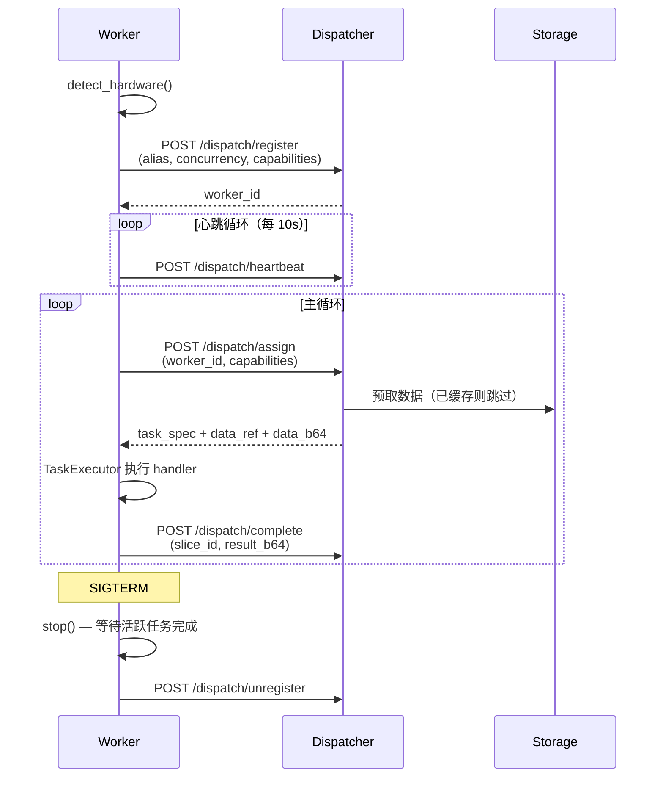
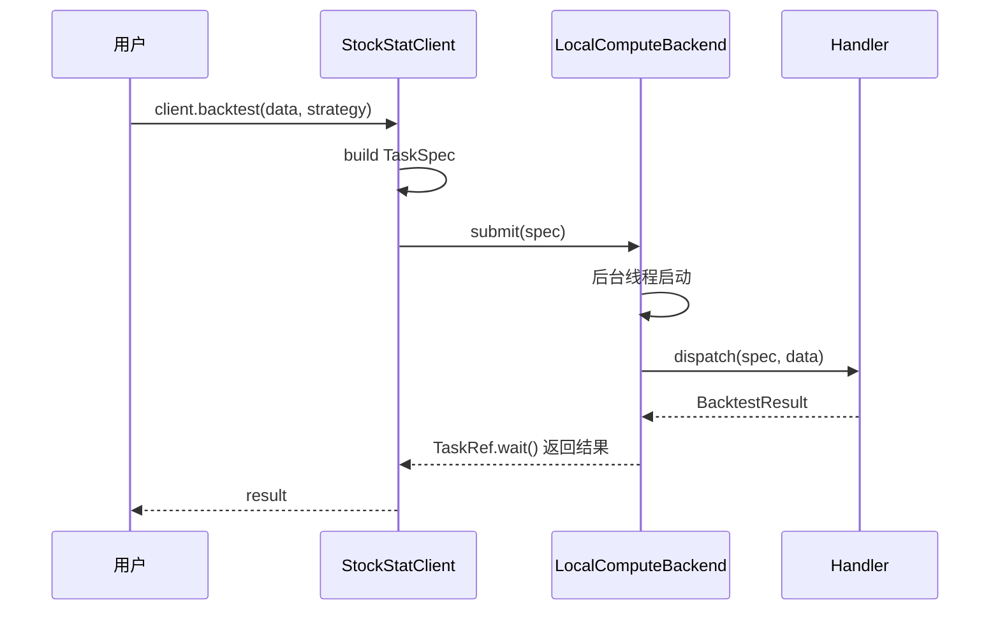
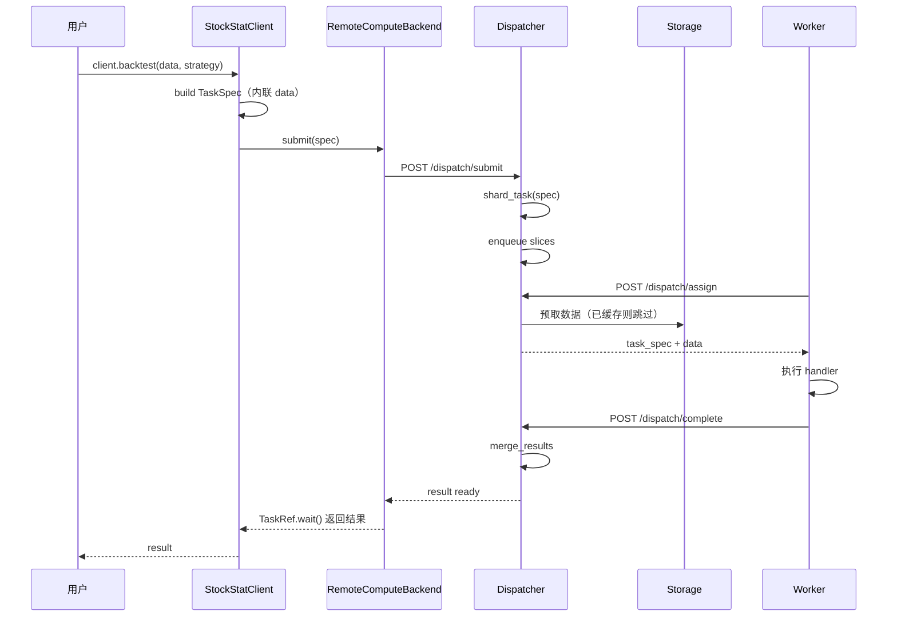
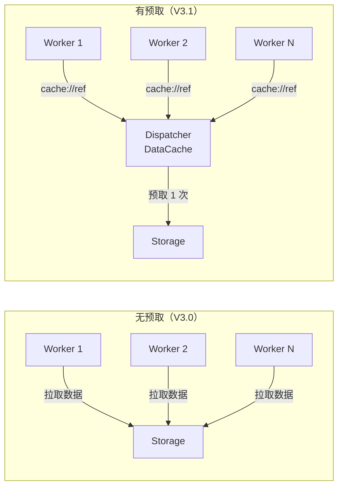
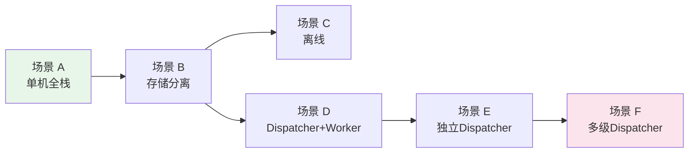

# StockStat V3.1 架构设计文档

> **版本**：v3.1（完全重构）
> **日期**：2026-07-26
> **状态**：已实现（882 项测试通过 + 1 跳过）
> **关联**：[README_CN.md](README_CN.md) | [USAGE_CN.md](docs/USAGE_CN.md) | [V31design/](V31design/)

---

## 目录

1. [设计目标与原则](#1-设计目标与原则)
2. [五模块架构总览](#2-五模块架构总览)
3. [Foundation 基础层](#3-foundation-基础层)
4. [Invocation 用户入口](#4-invocation-用户入口)
5. [Dispatcher 分发端](#5-dispatcher-分发端)
6. [Storage 存储端](#6-storage-存储端)
7. [Compute 计算端](#7-compute-计算端)
8. [通讯协议](#8-通讯协议)
9. [38 个原子任务](#9-38-个原子任务)
10. [关键数据流](#10-关键数据流)
11. [部署场景](#11-部署场景)
12. [测试体系](#12-测试体系)
13. [能力来源映射（图例）](#13-能力来源映射图例)

---

## 1. 设计目标与原则

### 1.1 设计目标

StockStat V3.1 的核心目标是把量化金融研究中反复出现的计算能力沉淀为一个**可编程、可分布式部署的能力底座**。研究者只需要声明"需要什么数据、做什么计算、如何分发"，平台负责把任务规范路由到合适的计算节点执行，并在过程中完成数据预取、分片、合并与容错。

| 目标 | 落地方式 |
|------|---------|
| 调用—分发—{存储、n×计算}可分离部署 | 5 大模块独立包，任意组合部署，从单机到多级集群平滑演进 |
| 覆盖量化研究全链路计算能力 | 38 个 task_type 覆盖回测 / 统计 / 信号 / 非线性 / 灰色 / ML / 组合风险 |
| 模块化增量实现 | Foundation 协议底座 + 4 业务模块独立演化，互不侵入 |
| 旧客户代码平滑迁移 | 功能等价迁移，V2 API 通过 `_compat.py` 包装，旧代码零修改 |
| 协议零改动扩展 | 新增能力 = 新增 handler + 注册，协议层、传输层、调度层均不改动 |
| 单机与分布式 API 一致 | 同一套 `StockStatClient` API，后端切换不改变调用代码 |

### 1.2 设计原则

| 原则 | 说明 |
|------|------|
| **协议优先** | 所有跨进程通信走 Foundation 协议层，业务模块不直接拼接字节 |
| **三层分离** | Codec / Message / Transport 独立可替换，正交组合 |
| **模块独立** | 5 大模块独立包，可单独发布升级，依赖方向单向（业务 → Foundation） |
| **计算与调用分离** | Invocation 不含计算逻辑，通过 `ComputeBackend` Protocol 解耦 |
| **数据路径与控制路径分离** | Dispatcher 预取数据 1 次并缓存，Storage 在计算期间空闲 |
| **原子任务化** | 38 个 task_type，每个 handler 自包含，新增能力不影响既有能力 |
| **协议不感知业务** | 协议只搬运字节，不关心 task_type 语义；handler 负责语义 |
| **优雅降级** | 可选依赖缺失时自动 fallback（如 PyWavelets → 自实现 Morlet） |

### 1.3 与 V3.0 的核心差异

V3.1 是一次完全重构，而非 V3.0 的增量改进。下表对比两个版本的关键差异：

| 维度 | V3.0 | V3.1 |
|------|------|------|
| 重构程度 | 核心零侵入 | **完全重构**（代码重新实现） |
| 兼容性 | 保留 v1.7/v2 行为 | **不考虑兼容**，功能等价迁移 |
| BacktestEngine 位置 | frontend 包内 | **Compute 模块**（重新实现，事件驱动） |
| 包结构 | 双包（frontend + backend） | **五模块独立包** |
| task_type 数量 | 6 | **38** |
| ComputeBackend | 兼容层（可选） | **唯一路径**（必须经过） |
| Dispatcher | Storage 插件（嵌入） | **独立包**，松耦合 Storage |
| Foundation | 嵌入 frontend `_core` | **独立包** `stockstat-foundation` |
| 数据预取 | 无 | **DataCache LRU 预取**，Storage 只访问 1 次 |
| 任务分片 | 无 | **4 种策略**（param/symbol/time/none） |

---

## 2. 五模块架构总览

V3.1 把系统切成"1 个协议底座 + 4 个业务模块"。Foundation 是 Layer 0，零业务依赖，只提供通信原语与契约；四个业务模块各自承担一类职责，通过 Foundation 的 Protocol 契约交互。


```mermaid
graph LR
    subgraph Found["Foundation 协议底座（Layer 0）"]
        F1["Envelope / TaskSpec"]
        F2["7 Codec / 5 Transport"]
        F3["7 Protocol 契约"]
        F4["13 异常 / Config / Plugin"]
    end
    subgraph Inv["Invocation 用户入口"]
        I1["StockStatClient"]
        I2["ComputeAPI"]
        I3["DSL / CLI / Viz"]
    end
    subgraph Disp["Dispatcher 分发端"]
        D1["TaskQueue / DataCache"]
        D2["WorkerRegistry"]
        D3["shard / merge"]
    end
    subgraph Stor["Storage 存储端"]
        S1["ORM / REST API"]
        S2["3 Adapters"]
        S3["Admin / Scheduler"]
    end
    subgraph Comp["Compute 计算端"]
        C1["Worker 进程"]
        C2["38 handler"]
        C3["BacktestEngine"]
    end
    Inv -->|"ComputeBackend 契约"| Comp
    Inv -->|"HTTP / StorageBackend 契约"| Stor
    Disp -->|"HTTP"| Stor
    Comp -->|"HTTP"| Disp
    Found -.->|"契约约束"| Inv
    Found -.->|"契约约束"| Disp
    Found -.->|"契约约束"| Stor
    Found -.->|"契约约束"| Comp
```

### 模块职责

| 模块 | 包名 | 职责 | 不含 |
|------|------|------|------|
| Foundation | `stockstat-foundation` | 协议 / 传输 / 契约 / 错误 / 配置 | 业务逻辑 |
| Invocation | `stockstat` | Client SDK / CLI / DSL / 可视化 | BacktestEngine / 计算逻辑 |
| Dispatcher | `stockstat-dispatcher` | 任务调度 / 数据预取 / 分片 / 合并 | 计算逻辑 / 数据持久化 |
| Storage | `stockstat-backend` | OHLCV 存储 / 查询 / 采集 | 计算逻辑 / 任务调度 |
| Compute | `stockstat-compute` | Worker / 38 handlers / BacktestEngine | 任务调度 / 数据持久化 |

### 模块边界铁律

依赖方向严格单向，违反任意一条都会破坏模块独立性：

> - **Foundation 零业务依赖**：不 import 任何业务模块（`stockstat` / `stockstat_compute` / `stockstat_backend` / `stockstat_dispatcher`）。
> - **四个业务模块必需依赖 Foundation**：通过 Protocol 契约交互，不直接访问对方内部实现。
> - **Invocation 与 Compute 互不依赖**：通过 `ComputeBackend` Protocol 解耦。Invocation 只定义"做什么"，Compute 只实现"怎么做"。
> - **Dispatcher 与 Storage 松耦合**：Dispatcher 通过 HTTP 或 `StorageBackend` Protocol 访问 Storage，不依赖 Storage 的 ORM 实现。

---

## 3. Foundation 基础层

Foundation 是整个平台的协议底座。它不包含任何业务逻辑，只提供跨进程通信所需的全部原语：消息信封、任务规范、编解码、传输、契约、错误与配置。

### 3.1 内部结构

```
stockstat_foundation/
├── contracts/          # 7 个 Protocol 契约
│   ├── compute.py      # ComputeBackend / TaskRef / TaskInfo / TaskState / TaskPriority
│   ├── transport.py    # Transport Protocol
│   ├── storage.py      # StorageBackend Protocol
│   ├── cache.py        # Cache Protocol
│   ├── codec.py        # Codec Protocol
│   ├── plugin.py       # Plugin Protocol
│   ├── renderer.py     # Renderer Protocol
│   └── events.py       # Event / EventSubscriber
├── protocol/           # 消息层
│   ├── envelope.py     # Envelope + Headers（JSON/Msgpack 自动检测）
│   ├── messages.py     # 28 消息类型 + TYPE_TO_PATH
│   ├── task.py         # TaskSpec 三段式（DataSpec + ComputeSpec + DispatchSpec）
│   └── retry.py        # RetryPolicy（指数退避）
├── codec/              # 7 个 Codec
│   ├── json_codec.py   # 默认编码，人类可读
│   ├── arrow_codec.py  # 列式二进制，适合 OHLCV 数据
│   ├── parquet_codec.py# 文件级列式存储
│   ├── csv_codec.py    # 表格文本
│   ├── cloudpickle_codec.py # Python 对象序列化（策略 / 模型）
│   ├── msgpack_codec.py# 紧凑二进制，高性能
│   └── raw_codec.py    # 透传 bytes
├── transport/          # 5 种 Transport
│   ├── in_process.py   # InProcessTransport + make_pair（单机默认）
│   ├── http.py         # HttpTransport（httpx，分布式默认）
│   ├── shared_memory.py# SharedMemoryTransport（mmap 零拷贝）
│   ├── redis.py        # RedisTransport（LPUSH/BRPOP，跨进程持久化）
│   └── tcp.py          # TcpTransport（length-prefixed 骨架）
├── errors.py           # 13 个异常类（AppError + 12 子类）
├── config.py           # Config + 18 环境变量
├── logging.py          # trace_id 透传（contextvars）
├── plugin/             # PluginRegistry
└── utils/              # estimate_data_size / choose_data_dispatch / Timeout / now_iso
```

### 3.2 Envelope 信封

所有节点间通信都封装在 `Envelope` 里。Envelope 携带协议标识、消息类型、唯一 ID、回复地址、消息头和负载：

```python
@dataclass
class Envelope:
    protocol: str = "stockstat-rpc"
    version: str = "1.0"
    type: str = ""                              # 消息类型，如 "task.submit"
    id: str = field(default_factory=lambda: str(uuid.uuid4()))
    reply_to: Optional[str] = None              # 回复目标信封 ID
    headers: Headers = field(default_factory=Headers)
    payload: Any = None
```

`Headers` 携带传输元数据：`content_type` / `data_codec` / `strategy_codec` / `encoding` / `priority` / `timeout` / `trace_id` / `data_ref` / `retry_count` / `protocol_version` / `accepted_codecs` / `accepted_encodings`。

编码规则：
- JSON 默认，msgpack 可选（通过 `headers.encoding` 切换）。
- `bytes` 类型 payload 自动 base64 编码并打上 `_payload_b64` 标记。
- decode 时自动检测：先尝试 JSON 解析，失败则 fallback 到 msgpack。

`Envelope.reply()` 方法构建回复信封，自动把 `reply_to` 设为当前信封的 ID，并透传 `trace_id` 与 `protocol_version`，保证全链路追踪。

### 3.3 TaskSpec 三段式

`TaskSpec` 是任务规范的统一格式，由三段组成——描述需要什么数据、做什么计算、如何分发：

```python
@dataclass
class TaskSpec:
    task_id: str
    data_spec: DataSpec           # 需要什么数据
    compute_spec: ComputeSpec     # 做什么计算
    dispatch_spec: DispatchSpec   # 如何分发
    trace_id: str = ""
    created_at: datetime = field(default_factory=datetime.utcnow)
    created_by: str = ""
```

| 段 | 字段（节选） | 说明 |
|----|-------------|------|
| `DataSpec` | symbols / timeframe / start / end / source | 描述数据需求；`cache_key()` 用 sha256 前 32 字节做缓存键 |
| `ComputeSpec` | task_type / strategy_ref / params / initial_cash / cost_model / param_grid / ... | 描述计算内容；`params` dict 承载 38 个 task_type 的特定参数 |
| `DispatchSpec` | split_strategy / max_workers / priority / timeout / retry_count / preemptable | 描述分发策略；`split_strategy` 决定分片方式 |

`TaskSpec` 提供 `to_dict()` / `from_dict()` / `to_json()` / `from_json()` 完整 roundtrip，保证跨进程传输时的序列化一致性。

### 3.4 Codec 编码层

7 个 Codec 实现统一的 `Codec` Protocol（`encode(data) -> bytes` / `decode(raw) -> data`）：

| Codec | 适用场景 | 依赖 |
|-------|---------|------|
| `JsonCodec` | 默认编码，人类可读，REST API | 无 |
| `ArrowCodec` | OHLCV 列式数据，零拷贝 | pyarrow |
| `ParquetCodec` | 文件级列式存储 | pyarrow |
| `CsvCodec` | 表格文本导出 | pandas |
| `CloudpickleCodec` | Python 对象（策略函数 / ML 模型） | cloudpickle |
| `MsgpackCodec` | 紧凑二进制，高性能消息 | msgpack |
| `RawCodec` | 透传 bytes，不做处理 | 无 |

`get_codec(name)` 与 `get_codec_for_content_type(content_type)` 提供工厂方法。

### 3.5 Transport 传输层

5 种 Transport 实现统一的 `Transport` Protocol（`send(envelope)` / `receive()` / `close()`）：

| Transport | 适用场景 | 特点 |
|-----------|---------|------|
| `InProcessTransport` | 单机全栈（场景 A） | `queue.Queue` 实现，`make_pair()` 返回收发两端 |
| `HttpTransport` | 分布式默认（场景 D/E/F） | 基于 httpx，REST 风格 |
| `SharedMemoryTransport` | 同机跨进程大文件 | mmap 零拷贝 |
| `RedisTransport` | 跨进程持久化队列 | LPUSH/BRPOP，支持多消费者 |
| `TcpTransport` | 自定义协议骨架 | length-prefixed framing |

`build_transport(kind, **kwargs)` 提供统一工厂。

### 3.6 错误体系

13 个异常类，全部继承自 `AppError`。每个异常携带 `code` / `message` / `context` / `recoverable` 四元组，可通过 `to_dict()` / `from_dict()` 跨进程传输：

| 异常类 | code | recoverable | 触发场景 |
|--------|------|-------------|---------|
| `AppError` | INTERNAL_ERROR | False | 基类 |
| `TaskError` | TASK_FAILED | False | 任务执行失败 |
| `TaskNotReadyError` | TASK_NOT_READY | True | 结果未就绪 |
| `TaskCancelledError` | TASK_CANCELLED | False | 任务被取消 |
| `TaskTimeoutError` | TASK_TIMEOUT | True | 任务超时 |
| `TaskNotFoundError` | TASK_NOT_FOUND | False | 任务不存在 |
| `ProtocolMismatchError` | PROTOCOL_MISMATCH | False | 协议版本不匹配 |
| `TransportError` | TRANSPORT_ERROR | True | 传输层错误 |
| `DispatcherUnavailableError` | DISPATCHER_UNAVAILABLE | True | Dispatcher 不可达 |
| `WorkerCapabilityError` | WORKER_CAPABILITY_INSUFFICIENT | True | Worker 不支持该 task_type |
| `StorageError` | STORAGE_ERROR | True | 存储层错误 |
| `ComputeError` | COMPUTE_FAILED | False | 计算层错误 |
| `ConfigError` | CONFIG_ERROR | False | 配置错误 |

### 3.7 Config 配置体系

`Config` 数据类合并环境变量与配置文件（JSON / TOML），提供 `from_env()` / `from_file()` / `copy(**overrides)` / `to_dict()` 方法。共 18 个环境变量覆盖全部配置项，详见 [使用文档 §20 环境变量参考](docs/USAGE_CN.md#20-环境变量参考)。

### 3.8 PluginRegistry

`PluginRegistry` 提供插件注册与查找机制，支持 Storage 的 Admin 面板、Dispatcher 插件等扩展点。

---

## 4. Invocation 用户入口

Invocation 是用户唯一需要直接面对的模块。它提供 Python SDK、CLI 和 DSL 三种入口，但自身不含任何计算逻辑——所有计算都委托给 `ComputeBackend`。

### 4.1 StockStatClient（纯调用者）

V3.1 的 Client **只调用**，不含 BacktestEngine。它的职责是数据访问、计算提交和结果消费：

```python
client = StockStatClient()
result = client.backtest(data, strategy)
# 内部：build TaskSpec → submit to ComputeBackend → wait → return
```

Client 构造时根据 `Config.default_backend` 选择后端：
- `local` → `LocalComputeBackend`（后台线程，透明同步）
- `remote` → `RemoteComputeBackend`（HTTP → Dispatcher）
- `auto` → `AutoComputeBackend`（按任务类型路由）

Client 提供三类方法：
- **数据访问**（透传 `DataClient`）：`ohlcv()` / `ingest()` / `list_symbols()`
- **计算便捷方法**：`backtest()` / `grid_search()` / `batch_backtest()` / `run_dsl()`
- **集群信息**：`cluster_info()`

### 4.2 ComputeAPI

`client.compute` 返回 `ComputeAPI` 实例，提供 40+ 指标便捷方法和高级任务提交：

```python
client.compute.ma(data.close, window=20)           # 本地即时
client.compute.rsi(data.close, window=14)
client.compute.macd(data.close, fast=12, slow=26, signal=9)
client.compute.remote("grid_search", data=data)     # 异步提交，返回 TaskRef
client.compute.cluster_info()                        # 集群拓扑
```

本地后端下，`_dispatch_indicator` 直接调用 `ComputeEngine`（绕过 TaskSpec，性能优化）；远程后端下，构建 `indicator` TaskSpec 提交。

高级统计任务（`correlation` / `hypothesis_test` / `spectral_analysis` / `transfer_entropy` 等）通过 `_submit_sync` 同步提交。

### 4.3 DataClient

`DataClient` 通过 HTTP 访问 Storage 的 REST API，支持 OHLCV 查询（Arrow 响应解码）、写入和标的列表。内置进程内缓存（`cache_enabled=True`），避免重复查询。

### 4.4 DSL 引擎

`DslEngine` 提供策略表达式 DSL，支持 `func(arg1, arg2, key=value)` 形式。内置 `buy_and_hold()` 和 `ma_cross(short=N, long=N)` 两种策略，也支持把未知函数名当作 indicator 调用：

```python
result = client.run_dsl("ma_cross(short=5, long=20)", data=data)
```

DSL 解析器（`DslParser`）生成 AST（`CallNode` / `NumberNode` / `StringNode` / `IdentifierNode`），求值器（`DslEngine._eval`）递归求值。策略通过 `compile_strategy()` 编译为 cloudpickle 引用。

### 4.5 可视化与导出

- **ChartSpec + MatplotlibRenderer**：声明式图表，`ChartSpec(title, chart_type, data)` → `MatplotlibRenderer().render(spec)` 返回 PNG bytes。`NullRenderer` 用于无 matplotlib 环境。
- **plot 模块**：`plot_equity_curve(equity_curve)` / `plot_drawdown(equity_curve)` 便捷函数。
- **ResultSerializer**：`to_json()` / `to_csv()` / `to_arrow()` / `to_parquet()` / `save(path, format)` 多格式导出。

### 4.6 V2 迁移辅助

`_compat.py` 把 V2 的顶层 API（`grid_search` / `batch_backtest` / `BacktestEngine` / `ComputeEngine`）包装为对 V3.1 Client 的调用，让旧代码零修改迁移。

---

## 5. Dispatcher 分发端

Dispatcher 是分布式场景的任务调度中枢。它接收 Client 提交的 TaskSpec，按策略分片，分发给空闲 Worker 执行，收集结果后合并返回。

### 5.1 核心组件

```
Dispatcher
├── TaskQueue          # 任务队列（Memory / Redis），支持 3 级优先级
├── WorkerRegistry     # Worker 注册/心跳/超时/统计/标签过滤
├── DataCache          # LRU 数据预取缓存 + 命中率统计
├── shard_task         # 任务分片（4 策略）
├── merge_results      # 结果合并（DataFrame 拼接 / 取第一个）
├── routes             # 14 个 REST 端点
├── cluster            # 多级 Dispatcher 拓扑
├── autoscaler         # Autoscaler 指标（scale_up/down 推荐）
└── history            # 任务历史（最近 1000 条）
```

### 5.2 TaskQueue

两种实现，通过 `build_queue(backend, redis_url)` 工厂选择：

| 实现 | 后端 | 优先级 | 持久化 | 适用 |
|------|------|--------|--------|------|
| `MemoryTaskQueue` | `queue.PriorityQueue` | 3 级（HIGH/NORMAL/LOW） | 否 | 单进程 Dispatcher |
| `RedisTaskQueue` | Redis LPUSH/BRPOP | 3 级（3 个 key 轮询） | 是 | 多进程 / 持久化 |

优先级通过 `DispatchSpec.priority` 控制：负值 = HIGH，零 = NORMAL，正值 = LOW。

### 5.3 WorkerRegistry

管理 Worker 生命周期：

- **注册**：Worker 启动时 `POST /dispatch/register`，携带 alias / concurrency / hardware / capabilities / labels / preemptable。
- **心跳**：Worker 每 10s 发送 `POST /dispatch/heartbeat`，更新 `last_heartbeat`。
- **超时**：后台线程每 10s 检查，超过 `offline_timeout`（默认 30s）标记为 offline，其任务重新入队。
- **统计**：`active_tasks` / `completed_tasks` / `failed_tasks` / `avg_task_duration_s`。
- **能力过滤**：`assign_task` 时按 `capabilities` 列表匹配 task_type。

### 5.4 DataCache（数据预取）

Dispatcher 在分发任务前，先从 Storage 预取所需数据并缓存。这是 V3.1 的关键优化——把 Storage 带宽从 ×N 降为 ×1：

数据来源优先级：
1. **缓存命中**：`cache_key` 匹配，返回 `cache://key` 引用。
2. **内联数据**：`ComputeSpec.params._inline_data` 存在，编码后缓存。
3. **Storage 拉取**：`DataSpec.symbols` 非空，从 Storage HTTP 拉取（Arrow 编码）。
4. **无数据**：编码 `None`。

缓存支持 `cache://` / `inline://` / `shm://` / `redis://` 四种引用协议。LRU 淘汰策略在超出 `max_size_mb`（默认 512MB）时触发。

### 5.5 数据路径与控制路径分离

| 路径 | 内容 | 带宽 | 频率 |
|------|------|------|------|
| 控制面（C ↔ D） | TaskSpec / 状态查询 | KB 级 | 多次 |
| 数据面（D ↔ S） | OHLCV 数据 | MB~GB 级 | **1 次**（缓存后复用） |
| 分发面（D ↔ W） | 任务 + 数据分片 | MB 级 | N 次（每个 Worker 一次） |

Storage 带宽从 ×N（每个 Worker 各自拉取）降为 ×1（Dispatcher 预取一次），大幅减轻 Storage 压力。

### 5.6 shard_task（任务分片）

`shard_task(spec)` 按 `DispatchSpec.split_strategy` 把一个 TaskSpec 拆成多个 slice：

| 策略 | 行为 | 适用 task_type |
|------|------|---------------|
| `none` / `auto` | 不分片，返回原 spec | 所有（默认） |
| `param_wise` | 按参数组合分片 | `grid_search`（param_grid 笛卡尔积）/ `batch_backtest`（策略×费率）/ `monte_carlo`（n_simulations 均分） |
| `symbol_wise` | 按标的分片 | 多标的任务 |
| `time_wise` | 按时间段分片 | 长周期任务（简化实现） |

每个 slice 的 `task_id` 加后缀 `-s{i}`，父任务通过 `rsplit("-s", 1)` 回溯。

### 5.7 merge_results（结果合并）

`merge_results(state)` 合并 N 个 slice 的部分结果：

- **DataFrame 类型**（`grid_search` / `batch_backtest` / `monte_carlo` / `bootstrap` / `permutation_test`）：`pd.concat(decoded, ignore_index=True)`。
- **混合类型**：返回列表。
- **默认**：取第一个 slice 的结果。

合并后用 `CloudpickleCodec` 编码为 bytes，存入 `state.merged_result_bytes`。

### 5.8 REST 端点

Dispatcher 暴露 14 个 REST 端点（`create_dispatcher_router`），分为四组：

| 组 | 端点 | 方法 | 说明 |
|----|------|------|------|
| Client 接口 | `/dispatch/submit` | POST | 提交任务 |
| | `/dispatch/status/{task_id}` | GET | 查询状态 |
| | `/dispatch/result/{task_id}` | GET | 获取结果（base64 cloudpickle） |
| | `/dispatch/cancel/{task_id}` | POST | 取消任务 |
| | `/dispatch/cluster` | GET | 集群拓扑 |
| | `/dispatch/autoscaler` | GET | Autoscaler 指标 |
| | `/dispatch/tasks/history` | GET | 任务历史 |
| Worker 接口 | `/dispatch/register` | POST | Worker 注册 |
| | `/dispatch/heartbeat` | POST | 心跳 |
| | `/dispatch/unregister/{worker_id}` | POST | 注销 |
| | `/dispatch/assign` | POST | 拉取任务 |
| | `/dispatch/complete` | POST | 回传结果 |
| | `/dispatch/fail` | POST | 回传失败 |
| | `/dispatch/partial` | POST | 流式部分结果 |

### 5.9 多级 Dispatcher 与 Autoscaler

- **cluster.py**：支持多级 Dispatcher 拓扑（场景 F），子 Dispatcher 向父 Dispatcher 注册，形成树状调度结构。
- **autoscaler.py**：`autoscaler_metrics()` 输出 `queue_depth` / `active_tasks` / `total_concurrency` / `available_concurrency` / `scale_up_recommended` / `scale_down_recommended`，供外部 Autoscaler 决策。

---

## 6. Storage 存储端

Storage 负责 OHLCV 数据的持久化、查询和采集。它是一个独立的 FastAPI 服务，通过 REST API 对外提供服务。

### 6.1 数据模型

两个 SQLAlchemy ORM 模型：

- **OHLCV**：复合主键 `(symbol, timeframe, timestamp)` + 2 个索引（`ix_ohlcv_symbol_tf_ts` / `ix_ohlcv_ts`）。字段：`open` / `high` / `low` / `close` / `volume`。
- **SymbolMetadata**：单主键 `(symbol)`。字段：`name` / `exchange` / `asset_class`（crypto/stock/forex/commodity）/ `first_seen` / `last_updated` / `metadata_json`。

数据库默认 SQLite（WAL 模式，适合开发），生产环境支持 PostgreSQL。

### 6.2 StorageBackendImpl + QueryCache

- **StorageBackendImpl**：封装 ORM 操作，提供 `fetch_ohlcv()` / `ingest_ohlcv()` / `list_symbols()` / `stats()` 等方法。
- **QueryCache**：查询缓存，避免重复 DB 查询。

### 6.3 REST API

Storage 暴露 5 组 REST 端点：

| 端点 | 方法 | 说明 | 响应格式 |
|------|------|------|---------|
| `/api/v1/ohlcv` | GET | 查询 OHLCV（支持多标的逗号分隔） | Arrow / JSON |
| `/api/v1/ohlcv` | POST | 写入 OHLCV（Header 传 symbol/timeframe） | JSON |
| `/api/v1/ohlcv/stats` | GET | OHLCV 数据统计 | JSON |
| `/api/v1/symbols` | GET | 标的列表 | JSON |
| `/api/v1/ingest` | POST | 从数据源采集 | JSON |
| `/health` | GET | 健康检查 | JSON |

GET `/api/v1/ohlcv` 默认返回 Arrow IPC 二进制（`application/vnd.apache.arrow.file`），通过 `?format=json` 切换为 JSON。

### 6.4 数据源适配器

3 个适配器实现统一的 `DataSource` 接口（`fetch_ohlcv(symbol, timeframe, start, end) -> DataFrame`）：

| 适配器 | name | 数据来源 | 依赖 |
|--------|------|---------|------|
| `BinanceAdapter` | binance | Binance klines API | httpx |
| `YFinanceAdapter` | yfinance | Yahoo Finance | yfinance（可选） |
| `SyntheticAdapter` | synthetic | GBM 模拟数据 | numpy |

`get_adapter(name)` 工厂函数按名称获取适配器。`SyntheticAdapter` 用几何布朗运动生成模拟 K 线，适合开发和测试。

### 6.5 Normalizer

`Normalizer` 负责字段映射与时区对齐，把不同数据源的列名统一为 `timestamp` / `open` / `high` / `low` / `close` / `volume`。

### 6.6 ScheduledCollector

`ScheduledCollector` 提供定时采集能力，按配置的 cron 表达式定期从数据源拉取最新数据并写入数据库。通过 `Config.scheduler_enabled` 启用。

### 6.7 Admin 管理面板

`plugins/admin/` 提供一个 Web 管理面板，通过 `Config.admin_enabled` 启用。支持查看数据统计、磁盘占用、Dispatcher 状态等。

---

## 7. Compute 计算端

Compute 是计算能力的承载者。它包含 BacktestEngine、ComputeEngine、38 个 handler 和 Worker 进程，是平台最"重"的模块。

### 7.1 BacktestEngine（V3.1 重新实现）

V3.1 的 BacktestEngine 是事件驱动、按 bar 推进的回测引擎，完全在 Compute 模块内重新实现（V3.0 在 frontend 内）：

```
BacktestEngine
├── Strategy / StrategyBase / Signal   # 策略接口
├── Portfolio                          # 现金 + 多 Position
├── Broker                             # 协调 Portfolio + CostModel + FillModel
├── CostModel                          # 10 个预定义费率
├── FillModel                          # 5 种成交模型 + 滑点
├── ExecutionModel                     # next_bar / intrabar
└── Metrics                            # 18 项回测指标
```

**执行流程**：
1. 数据规范化（列名映射、时间排序）。
2. 推断 `periods_per_year`（按 timeframe 频率）。
3. 逐 bar 推进：调用 `strategy.on_bar(i, bar, data, ctx)` 获取 Signal。
4. Broker 按 Signal 下单：CostModel 计算手续费，FillModel 决定成交价，ExecutionModel 决定触发时机。
5. Portfolio 更新持仓与权益。
6. 计算 18 项指标：`total_return` / `annual_return` / `sharpe` / `sortino` / `max_drawdown` / `calmar` / `volatility` / `win_rate` / `profit_factor` / `n_trades` / `n_winning` / `n_losing` / `avg_win` / `avg_loss` / `avg_trade` / `initial_cash` / `final_equity` / `periods_per_year`。

**CostModel（10 个预定义费率）**：

| 名称 | 费率 | 说明 |
|------|------|------|
| `default` | 0.1% | 默认 |
| `zero` | 0% | 无手续费 |
| `F1_SpotNoBNB` | 0.1% | 现货不用 BNB |
| `F2_SpotBNB` | 0.075% | 现货用 BNB |
| `F3_FutNoBNB` | 0.04% | 合约不用 BNB |
| `F4_FutBNB` | 0.018% | 合约用 BNB |
| `binance_spot` | 0.1% | Binance 现货 |
| `binance_futures_bnb` | 0.018% | Binance 合约 BNB |
| `binance_futures` | 0.04% | Binance 合约 |
| `stock` | 0.05% | 美股（最低 $5） |

`get_cost_model(name)` 也支持传入数字字符串作为自定义费率。

**FillModel（5 种成交模型）**：

| 名称 | 成交价 | 说明 |
|------|--------|------|
| `next_open` | 下一根 K 线 open | 默认 |
| `this_close` | 当前 K 线 close | |
| `next_close` | 下一根 K 线 close | |
| `intrabar_fill` | 下一根 (H+L+C)/3 | 近似 VWAP |
| `signal_price` | 信号价 | 限价单 |

`market` / `limit` 为别名。所有模型支持 `slippage_bps` 滑点（买入加价，卖出减价）。

### 7.2 ComputeEngine

`ComputeEngine` 提供 40+ 技术指标便捷方法，内部通过 `IndicatorRegistry` 注册表分派：

```python
engine = ComputeEngine()
sma = engine.ma(data.close, window=20)
macd_df = engine.macd(data.close, fast=12, slow=26, signal=9)
```

`IndicatorRegistry` 是类级别的注册表，`register_indicator(name, func)` 装饰器注册指标函数，`get(name)` 查找。`compute(name, *args, **params)` 是通用调用入口。

指标按类别组织在 5 个模块中：
- **trend.py**：MA/EMA/WMA/DEMA/TEMA/HMA/MACD/ADX/DPO/TRIX
- **oscillator.py**：RSI/KD/Williams%R/CCI/STOCH
- **volatility.py**：Bollinger/ATR/Keltner/Donchian/StdDev
- **statistics.py**：rolling_corr/rolling_beta/zscore/percentile/rolling_std/rolling_mean
- **nonlinear.py**：hurst_rs/sample_entropy/permutation_entropy

### 7.3 三种 ComputeBackend

| 实现 | 场景 | 行为 |
|------|------|------|
| `LocalComputeBackend` | 单机（场景 A/B/C） | `submit()` 在后台线程执行，`wait()` 阻塞等待，行为等价直调 |
| `RemoteComputeBackend` | 分布式（场景 D/E/F） | HTTP 提交到 Dispatcher → Worker 执行，`TaskRef.wait()` 轮询结果 |
| `AutoComputeBackend` | 混合 | `HEAVY_TYPES` → 远程，数据量超阈值 → 远程，其余 → 本地；远程不可达降级本地 |

`AutoComputeBackend.HEAVY_TYPES` = `{grid_search, batch_backtest, monte_carlo, bootstrap, permutation_test, walkforward, walkforward_cv, ml_train, deep_learning}`。

### 7.4 Worker 进程

Worker 是独立运行的计算节点，生命周期如下：


```mermaid
sequenceDiagram
    participant W as Worker
    participant D as Dispatcher
    participant S as Storage

    W->>W: detect_hardware()
    W->>D: POST /dispatch/register<br/>(alias, concurrency, capabilities)
    D-->>W: worker_id
    
    loop 心跳循环（每 10s）
        W->>D: POST /dispatch/heartbeat
    end
    
    loop 主循环
        W->>D: POST /dispatch/assign<br/>(worker_id, capabilities)
        D->>S: 预取数据（已缓存则跳过）
        D-->>W: task_spec + data_ref + data_b64
        W->>W: TaskExecutor 执行 handler
        W->>D: POST /dispatch/complete<br/>(slice_id, result_b64)
    end
    
    Note over W: SIGTERM
    W->>W: stop() — 等待活跃任务完成
    W->>D: POST /dispatch/unregister
```

Worker 内部使用 `ThreadPoolExecutor`（`max_workers=concurrency`）并发执行多个任务。`TaskExecutor` 负责解码数据、调用 `dispatch(spec, data, worker=worker)`、编码结果。支持 `on_progress` 回调，通过 `POST /dispatch/partial` 回传进度。

### 7.5 TaskExecutor 与 CheckpointStore

- **TaskExecutor**：Worker 内部的任务执行器，封装数据解码、handler 调用、结果编码、异常处理的完整流程。
- **CheckpointStore**：长时任务的检查点存储，支持断点续算（monte_carlo 等任务可通过 partial 结果恢复）。

### 7.6 38 个 Handler

Handler 是 38 个 task_type 的具体实现。每个 handler 是一个被 `@register("task_type")` 装饰的函数，接收 `(spec, data, *, on_progress=None)`，返回任意可序列化结果。

Handler 注册表 `HANDLERS` 是全局字典，`dispatch(spec, data, worker=on_progress)` 按 `task_type` 路由。`is_stream_aware(handler)` 检查 handler 签名是否声明 `Stream` 参数——如果是，数据以 `Stream` 对象传入（支持迭代模式与 `collect()` 模式）。

Handler 按类别组织在 7 个子包中，详见 [§9 38 个原子任务](#9-38-个原子任务)。

---

## 8. 通讯协议

### 8.1 三层协议栈

```
Layer 3: Transport    HTTP / InProcess / SHM / Redis / TCP
Layer 2: Message      Envelope (protocol/version/type/id/headers/payload)
Layer 1: Codec        JSON / Arrow / Parquet / CSV / Cloudpickle / Msgpack / Raw
```

三层正交：任意一层可独立替换。换传输不动消息格式，换编码不动传输，换消息类型不改编解码。

### 8.2 28 消息类型

Foundation 定义 28 个消息类型常量，按职责分为四组：

| 类别 | 数量 | 消息类型 |
|------|------|---------|
| 控制面（C ↔ D） | 11 | `task.submit` / `task.ack` / `task.status` / `task.status.reply` / `task.result` / `task.result.reply` / `task.cancel` / `task.progress` / `task.error` / `cluster.info` / `cluster.info.reply` |
| 调度面（D ↔ W） | 12 | `dispatch.assign` / `dispatch.ack` / `dispatch.complete` / `dispatch.partial` / `dispatch.fail` / `dispatch.heartbeat` / `dispatch.register` / `dispatch.unregister` / `dispatch.drain` / `dispatch.preempt` / `dispatch.resume` / `dispatch.preempt_rejected` |
| 数据面 | 3 | `data.fetch` / `data.stream` / `data.ref` |
| 服务发现 | 2 | `cluster.discover` / `cluster.discover.reply` |

`TYPE_TO_PATH` 映射消息类型到 REST 路径。`is_control(t)` / `is_dispatch(t)` / `is_data(t)` 提供分类判断。

### 8.3 RetryPolicy

`RetryPolicy` 定义重试策略：最大重试次数、指数退避基数、最大退避时间、可重试错误码集合。Dispatcher 在 `on_fail` 时检查 `error.retryable` 并按策略重试（最多 3 次）。

---

## 9. 38 个原子任务

平台将量化研究计算能力拆分为 38 个独立的 `task_type`，按类别分为 7 个 Tier。每个 handler 自包含，新增能力只需 `@register("new_type")` 装饰一个函数并放入对应子包：

| Tier | 类别 | 数量 | task_type | 默认分片策略 |
|------|------|------|-----------|-------------|
| 1 | 交易回测 | 6 | `indicator` `backtest` `grid_search` `batch_backtest` `monte_carlo` `walkforward` | none / param_wise / time_wise |
| 2 | 经典统计检验 | 8 | `correlation` `hypothesis_test` `bootstrap` `permutation_test` `chow_test` `survival_analysis` `ecdf` `multiple_testing` | none / param_wise |
| 3 | 信号处理 | 5 | `spectral_analysis` `wavelet` `spectral_entropy` `cross_spectrum` `filter_design` | none |
| 4 | 非线性动力学 | 7 | `mutual_information` `transfer_entropy` `hurst_exponent` `sample_entropy` `permutation_entropy` `rqa` `recurrence_plot` | none |
| 5 | 灰色系统 | 3 | `grey_relation` `gm11_predict` `grey_cluster` | none |
| 6 | 机器学习 | 7 | `ml_train` `ml_predict` `feature_importance` `walkforward_cv` `clustering` `dimension_reduction` `classification_metrics` | none / time_wise |
| 7 | 组合风险 | 2 | `risk_metrics` `regime_detection` | none |

> **协议零改动扩展**：新增 task_type = 新增 handler 文件 + `@register` 装饰。协议层、传输层、调度层均不改动。Worker 通过 `capabilities` 列表声明支持哪些 task_type，Dispatcher 按能力匹配分发。

---

## 10. 关键数据流

### 10.1 单机回测（场景 A）


```mermaid
sequenceDiagram
    participant U as 用户
    participant C as StockStatClient
    participant L as LocalComputeBackend
    participant H as Handler

    U->>C: client.backtest(data, strategy)
    C->>C: build TaskSpec
    C->>L: submit(spec)
    L->>L: 后台线程启动
    L->>H: dispatch(spec, data)
    H-->>L: BacktestResult
    L-->>C: TaskRef.wait() 返回结果
    C-->>U: result
```

### 10.2 分布式回测（场景 E）


```mermaid
sequenceDiagram
    participant U as 用户
    participant C as StockStatClient
    participant R as RemoteComputeBackend
    participant D as Dispatcher
    participant S as Storage
    participant W as Worker

    U->>C: client.backtest(data, strategy)
    C->>C: build TaskSpec（内联 data）
    C->>R: submit(spec)
    R->>D: POST /dispatch/submit
    D->>D: shard_task(spec)
    D->>D: enqueue slices
    
    W->>D: POST /dispatch/assign
    D->>S: 预取数据（已缓存则跳过）
    D-->>W: task_spec + data
    
    W->>W: 执行 handler
    W->>D: POST /dispatch/complete
    
    D->>D: merge_results
    D-->>R: result ready
    R-->>C: TaskRef.wait() 返回结果
    C-->>U: result
```

### 10.3 数据预取优化


```mermaid
graph LR
    subgraph 无预取["无预取（V3.0）"]
        W1["Worker 1"] -->|"拉取数据"| S1["Storage"]
        W2["Worker 2"] -->|"拉取数据"| S1
        W3["Worker N"] -->|"拉取数据"| S1
    end
    subgraph 有预取["有预取（V3.1）"]
        D2["Dispatcher<br/>DataCache"] -->|"预取 1 次"| S2["Storage"]
        W4["Worker 1"] -->|"cache://ref"| D2
        W5["Worker 2"] -->|"cache://ref"| D2
        W6["Worker N"] -->|"cache://ref"| D2
    end
```

---

## 11. 部署场景

V3.1 支持六种部署场景，从单机到多级集群：

| 场景 | Client | Dispatcher | Storage | Worker | 适用 |
|------|--------|-----------|---------|--------|------|
| A 单机全栈 | 同进程 | — | — | — | 开发 / 研究 |
| B 存储分离 | 远程HTTP | — | 独立 | Client本地 | 团队共享数据 |
| C 离线 | 本地 | — | 本地 | Client本地 | 无网络环境 |
| D Dispatcher+Worker | 远程HTTP | Storage同机 | 独立 | 远程 | 小型集群 |
| E 独立Dispatcher | 远程HTTP | 独立 | 独立 | 多节点 | 生产集群 |
| F 多级Dispatcher | 远程HTTP | 主+子 | 独立 | 多级 | 大规模集群 |


```mermaid
graph LR
    A["场景 A<br/>单机全栈"] --> B["场景 B<br/>存储分离"]
    B --> C["场景 C<br/>离线"]
    B --> D["场景 D<br/>Dispatcher+Worker"]
    D --> E["场景 E<br/>独立Dispatcher"]
    E --> F["场景 F<br/>多级Dispatcher"]
    style A fill:#e8f5e9
    style F fill:#fce4ec
```

各场景的具体配置与启动命令见 [使用文档 §17 部署场景](docs/USAGE_CN.md#17-部署场景)。

---

## 12. 测试体系

测试按模块组织，每个模块有独立的 `tests/` 目录：

| 层级 | 测试数 | 覆盖 |
|------|--------|------|
| Foundation 单元 | 184 | Envelope / TaskSpec / Codec / Transport / Errors / Config / Plugin |
| Storage 单元 | 98 + 1 跳过 | 模型 / Backend / API / Adapter / Normalizer / Scheduler |
| Compute 单元 | 235 | 指标 / 回测 / handlers / LocalBackend / RemoteBackend / Worker |
| Invocation 单元 | 119 | Client / ComputeAPI / DSL / Export / Viz / Compat |
| Dispatcher 单元 | 129 | Queue / Workers / Dispatcher / shard / merge / REST / Plugin |
| 演示测试 | 117 | 指标 / 回测 / 高级分析 / 分布式 / 图表生成 |
| **合计** | **882 + 1 跳过** | yfinance 为可选依赖，未安装时跳过 |

---

## 13. 能力来源映射（图例）

下表作为图例，记录每个 Tier 的能力来源场景，便于回溯验证。该映射仅作参考之用，平台本身的设计与实现不依赖于任何特定研究项目。

| 来源场景 | 研究内容 | task_type |
|----------|---------|-----------|
| v1 | Pearson/Spearman 相关 | correlation |
| v3 | 2×2 卡方 | hypothesis_test |
| v4 | 排列检验 / bootstrap / Chow | permutation_test / bootstrap / chow_test |
| v5 | 批量回测 | batch_backtest |
| v6 | 生存分析 / ECDF | survival_analysis / ecdf |
| v7-W | CWT / 小波相干 | wavelet |
| v7-E | Welch PSD / 谱熵 | spectral_analysis / spectral_entropy |
| v7-G | 灰色关联 / GM(1,1) | grey_relation / gm11_predict |
| v7-N1 | 互信息 | mutual_information |
| v7-N2 | 传递熵 | transfer_entropy |
| v7-N3 | Hurst 指数 | hurst_exponent |
| v7-N4 | 样本熵 / 排列熵 | sample_entropy / permutation_entropy |
| v7-N5 | 递归定量分析 | rqa / recurrence_plot |
| v7-F | ML 融合 / 前向验证 | ml_train / walkforward_cv / feature_importance |

---

*V3.1 架构设计文档。详细模块设计与分步实现报告见 [V31design/](V31design/)。*
