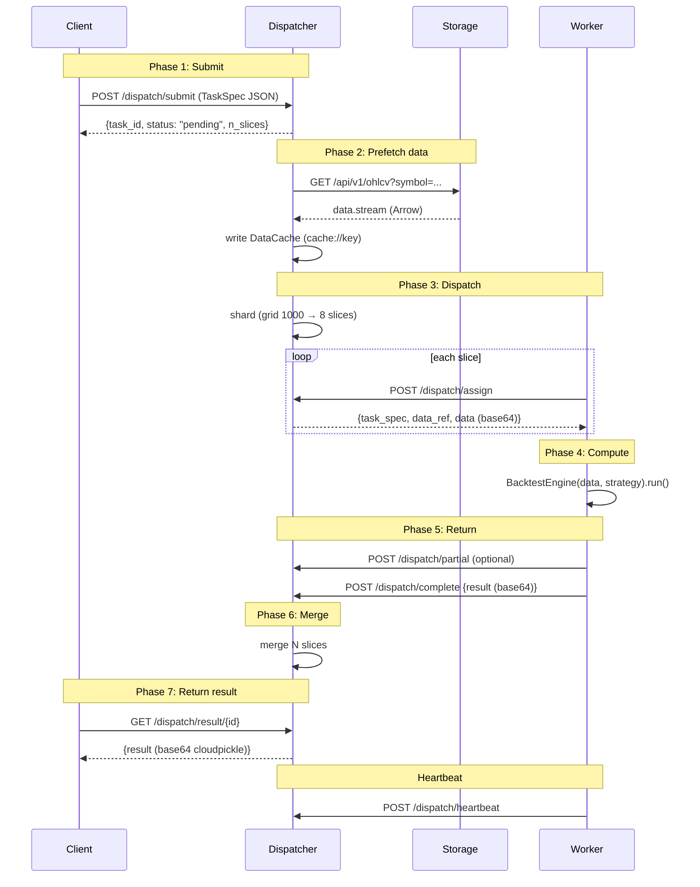

# StockStat V3 Communication Protocol Design

> **Version**: v3.0 (P0-P7 implemented)
> **Date**: 2026-07-19
> **Status**: ✅ Fully implemented, 922 tests passing
> **Related**: [DESIGN_ARCHITECTURE.md](DESIGN_ARCHITECTURE.md) | [DESIGN_V3_CN.md](DESIGN_V3_CN.md)

---

## Table of Contents

1. [Protocol Overview](#1-protocol-overview)
2. [Envelope](#2-envelope)
3. [Message Type Table](#3-message-type-table)
4. [TaskSpec Three-Section](#4-taskspec-three-section)
5. [Codec Layer](#5-codec-layer)
6. [Transport Layer](#6-transport-layer)
7. [Data Dispatch Strategies](#7-data-dispatch-strategies)
8. [Worker Registration and Heartbeat](#8-worker-registration-and-heartbeat)
9. [Task Lifecycle](#9-task-lifecycle)
10. [Error Handling and Retry](#10-error-handling-and-retry)
11. [Protocol Optimizations](#11-protocol-optimizations)
12. [Version Negotiation](#12-version-negotiation)
13. [HTTP Path Mapping](#13-http-path-mapping)
14. [Exception Classes](#14-exception-classes)
15. [Protocol Test Coverage](#15-protocol-test-coverage)

---

## 1. Protocol Overview

### 1.1 Design Goals

| Goal | Description |
|------|-------------|
| Transport-agnostic | Same message works over HTTP/TCP/SHM/Redis/InProcess |
| Language-agnostic | Control plane JSON; data plane Arrow / cloudpickle |
| Extensible | New task types / message types / Codecs / Transports require zero protocol changes |
| Composable | Multi-level Dispatcher cascade forwards messages as-is |
| Efficient | MessagePack optional, 15-30% bandwidth savings vs JSON |
| Observable | trace_id / headers.priority / data_ref propagated throughout |

### 1.2 Three-Layer Protocol Stack

```
┌─────────────────────────────────────┐
│ Layer 3: Transport                  │  How messages get from A to B
│ HTTP / TCP / SHM / Redis / InProcess│
├─────────────────────────────────────┤
│ Layer 2: Message (Envelope)         │  How bytes are wrapped as messages
│ protocol / version / type / headers │
├─────────────────────────────────────┤
│ Layer 1: Codec                      │  How payloads are serialized to bytes
│ JSON / Arrow / Cloudpickle / Msgpack│
└─────────────────────────────────────┘
```

**Iron rule**: Each layer independently replaceable. Adding a transport doesn't change message format, adding a codec doesn't change transport, adding a message type doesn't change codec/decode.

### 1.3 Implementation Location

| Layer | Module path | Main files |
|-------|-------------|------------|
| Codec | `frontend/stockstat/_core/codec/` | `__init__.py` (7 Codecs) |
| Message | `frontend/stockstat/_core/protocol/` | `envelope.py`, `messages.py`, `retry.py` |
| Transport | `frontend/stockstat/_core/transport/` | `in_process.py`, `http.py`, `shared_memory.py`, `redis.py` |

---

## 2. Envelope

### 2.1 Structure

```python
@dataclass
class Envelope:
    """Unified message envelope — V2 §12.3.

    All inter-node communication is wrapped in this structure. The envelope
    itself is always JSON- or Msgpack-serializable; payload is decoded
    according to headers.content_type.

    Fields:
        protocol: Always "stockstat-rpc" (protocol identifier)
        version: Protocol version (semver, e.g. "1.0")
        type: Message type (see §3)
        id: Unique message UUID v4
        reply_to: Original message ID (for async replies)
        headers: Metadata (see §2.2)
        payload: Message body (dict / bytes / str)
    """
    protocol: str = "stockstat-rpc"
    version: str = "1.0"
    type: str = ""
    id: str = field(default_factory=lambda: str(uuid.uuid4()))
    reply_to: Optional[str] = None
    headers: Headers = field(default_factory=Headers)
    payload: Any = None
```

### 2.2 Headers Fields

| Field | Default | Description |
|-------|---------|-------------|
| `content_type` | `application/json` | Payload MIME type |
| `data_codec` | `arrow` | Tabular data encoding (arrow/json/parquet) |
| `strategy_codec` | `cloudpickle` | Strategy function encoding (cloudpickle/json/none) |
| `encoding` | `json` | Envelope encoding (json/msgpack) |
| `priority` | `0` | 0 normal / -1 high / 1 low |
| `timeout` | `3600` | Timeout seconds |
| `trace_id` | `""` | Distributed tracing ID |
| `data_ref` | `""` | Data reference (shm://id / cache://key / inline:b64) |
| `retry_count` | `0` | Retry count |
| `protocol_version` | `1.0` | Protocol version (for negotiation) |
| `accepted_codecs` | `[]` | Client-declared supported codecs |
| `accepted_encodings` | `[]` | Client-declared supported envelope encodings |

### 2.3 Encoding

- **JSON** (default): human-readable, cross-language, debug-friendly
- **Msgpack** (V2 §13.5): compact binary, 15-30% smaller than JSON

```python
def encode(self) -> bytes:
    """Serialize per headers.encoding."""
    d = self.to_dict()
    # bytes payload auto base64-encoded
    if isinstance(d["payload"], (bytes, bytearray)):
        d["payload"] = base64.b64encode(d["payload"]).decode("ascii")
        d["_payload_b64"] = True

    if self.headers.encoding == "msgpack":
        import msgpack
        return msgpack.dumps(d, use_bin_type=True)
    return json.dumps(d, default=str).encode("utf-8")
```

### 2.4 Decode Auto-Detection

```python
@classmethod
def decode(cls, raw: bytes) -> "Envelope":
    """Auto-detect JSON vs Msgpack."""
    try:
        d = json.loads(raw.decode("utf-8"))   # try JSON first
    except (json.JSONDecodeError, UnicodeDecodeError):
        import msgpack
        d = msgpack.loads(raw, raw=False)     # fall back to msgpack
    # Restore base64 payload
    if d.get("_payload_b64") and isinstance(d.get("payload"), str):
        d["payload"] = base64.b64decode(d["payload"])
    return cls.from_dict(d)
```

**Key design**: JSON tried first (more common and cheaper), then msgpack fallback. msgpack byte streams aren't valid UTF-8, so `raw.decode("utf-8")` raises `UnicodeDecodeError`, triggering fallback.

### 2.5 Reply Helper

```python
def reply(self, type: str, payload=None, content_type="application/json") -> "Envelope":
    """Build a reply envelope with reply_to set to this envelope's id."""
    return Envelope(
        type=type,
        reply_to=self.id,
        headers=Headers(
            content_type=content_type,
            trace_id=self.headers.trace_id,  # propagate trace_id
            protocol_version=self.headers.protocol_version,
        ),
        payload=payload,
    )
```

---

## 3. Message Type Table

### 3.1 Control Plane (Client ↔ Dispatcher)

| `type` | Direction | `content_type` | Description |
|--------|-----------|----------------|-------------|
| `task.submit` | C → D | `application/vnd.stockstat.task+json` | Submit task (payload = TaskSpec) |
| `task.ack` | D → C | `application/json` | Confirm receipt, return task_id + estimate |
| `task.status` | C → D | `application/json` | Query status |
| `task.status.reply` | D → C | `application/json` | Return TaskInfo |
| `task.result` | C → D | `application/json` | Fetch result |
| `task.result.reply` | D → C | `application/vnd.stockstat.result+cloudpickle` | Return result (base64 cloudpickle) |
| `task.cancel` | C → D | `application/json` | Cancel task |
| `task.progress` | D → C (push) | `application/json` | Progress push (subscribe mode) |
| `task.error` | D → C | `application/json` | Error report |
| `cluster.info` | C → D | `application/json` | Query topology |
| `cluster.info.reply` | D → C | `application/json` | Return full topology |

### 3.2 Dispatch Plane (Dispatcher ↔ Worker)

| `type` | Direction | Description |
|--------|-----------|-------------|
| `dispatch.assign` | D → W | Assign task slice (incl. TaskSpec + data_ref + inline data) |
| `dispatch.ack` | W → D | Confirm slice receipt |
| `dispatch.complete` | W → D | Complete and return final result (base64 cloudpickle) |
| `dispatch.partial` | W → D | Stream partial result (V2 §13.2) |
| `dispatch.fail` | W → D | Failure report (incl. traceback) |
| `dispatch.heartbeat` | W → D | Heartbeat (incl. load) |
| `dispatch.register` | W → D | Worker register (incl. hardware + alias) |
| `dispatch.unregister` | W → D | Worker graceful shutdown |
| `dispatch.drain` | D → W | Notify graceful drain (V2 §13.4) |
| `dispatch.preempt` | D → W | Pause current task (V2 §13.3) |
| `dispatch.resume` | D → W | Resume preempted task |
| `dispatch.preempt_rejected` | W → D | Reject when preemption unsupported |

### 3.3 Data Plane (Large Data Transfer)

| `type` | Direction | Description |
|--------|-----------|-------------|
| `data.fetch` | D → S | Prefetch data request |
| `data.stream` | S → D | Data stream (Arrow IPC, chunked) |
| `data.ref` | D → W | Data reference (shm ID or Storage URL) |

### 3.4 Service Discovery (V2 §13.4)

| `type` | Direction | Description |
|--------|-----------|-------------|
| `cluster.discover` | W → S | Worker queries available Dispatchers |
| `cluster.discover.reply` | S → W | Return Dispatcher address list |

### 3.5 Type Groupings

```python
CONTROL_TYPES = {TASK_SUBMIT, TASK_ACK, TASK_STATUS, ...}  # 11 types
DISPATCH_TYPES = {DISPATCH_ASSIGN, DISPATCH_COMPLETE, ...}  # 12 types
DATA_TYPES = {DATA_FETCH, DATA_STREAM, DATA_REF}            # 3 types
DISCOVERY_TYPES = {CLUSTER_DISCOVER, CLUSTER_DISCOVER_REPLY}  # 2 types
ALL_TYPES = CONTROL_TYPES | DISPATCH_TYPES | DATA_TYPES | DISCOVERY_TYPES
```

---

## 4. TaskSpec Three-Section

### 4.1 Structure

```python
@dataclass
class TaskSpec:
    """Complete task specification — V2 §12.5 three-section.

    The unit of work submitted by a Client to a ComputeBackend.
    """
    task_id: str                        # UUID v4
    data_spec: DataSpec                 # What data is needed
    compute_spec: ComputeSpec           # What computation to run
    dispatch_spec: DispatchSpec = ...   # How to dispatch
    trace_id: str = ""                  # Distributed tracing ID
    created_at: datetime = ...          # Creation time
    created_by: str = ""                # Client identifier
```

### 4.2 DataSpec

```python
@dataclass
class DataSpec:
    """Describes what data a task needs — generic across all task types."""
    symbols: list[str]                  # ["BTC/USDT", "ETH/USDT"]
    timeframe: str = "1d"               # "1d" / "1h" / "5m"
    start: Optional[str] = None         # "2024-01-01"
    end: Optional[str] = None           # "2024-12-31"
    source: Optional[str] = None        # "binance" / "yfinance"

    def cache_key(self) -> str:
        """Stable hash for Dispatcher data cache (V2 §9.5)."""
        # sha256(symbols + timeframe + start + end + source)
```

### 4.3 ComputeSpec

```python
@dataclass
class ComputeSpec:
    """Describes what computation to run — dispatched by task_type."""
    task_type: str                      # indicator/backtest/grid_search/batch_backtest/monte_carlo/custom

    # ── Generic fields ──
    strategy_ref: Optional[str] = None  # "cloudpickle:base64..."
    strategy_codec: str = "cloudpickle"
    params: dict = ...                  # Task-type-specific params

    # ── Backtest-related ──
    initial_cash: float = 1_000_000.0
    cost_model: Optional[str] = None    # "binance_spot" / "binance_futures_bnb" / ...
    fill_model: Optional[str] = None    # "next_open" / "intrabar_fill" / ...
    execution_model: Optional[str] = None  # "next_bar" / "intrabar"
    benchmark: Optional[str] = None
    trade_on: str = "open"
    allow_short: bool = False
    periods_per_year: Optional[int] = None

    # ── grid_search ──
    param_grid: Optional[dict] = None
    metric: str = "sharpe"
    maximize: bool = True

    # ── batch_backtest ──
    strategies: Optional[dict] = None   # {name: strategy_ref}
    fee_models: Optional[list] = None

    # ── monte_carlo ──
    n_simulations: int = 1000
    seed: int = 0
```

### 4.4 DispatchSpec

```python
@dataclass
class DispatchSpec:
    """Describes how to dispatch — generic across all task types."""
    split_strategy: str = "auto"        # auto/param_wise/symbol_wise/time_wise/none
    max_workers: Optional[int] = None
    data_dispatch: str = "auto"         # auto/inline/shared_memory/stream/storage_ref
    priority: int = 0                   # 0/-1/1
    timeout: int = 3600                 # seconds
    retry_count: int = 0
    preemptable: bool = False           # V2 §13.3
```

### 4.5 Serialization

All three sections are JSON-serializable:

```python
spec = TaskSpec(...)
d = spec.to_dict()    # JSON dict
restored = TaskSpec.from_dict(d)  # roundtrip
```

Bytes payloads (like strategy cloudpickle) are referenced via `strategy_ref = "cloudpickle:base64..."`, not embedded in TaskSpec.

---

## 5. Codec Layer

### 5.1 Codec Registry

| Codec | media_type | Use case | Status |
|-------|-----------|----------|--------|
| `JsonCodec` | `application/json` | Control plane messages, TaskSpec | v2.1 existing |
| `ArrowCodec` | `application/vnd.apache.arrow.file` | Tabular data, backtest results | v2.1 existing |
| `ParquetCodec` | `application/vnd.apache.parquet` | Large data persistence | v2.1 existing |
| `CsvCodec` | `text/csv` | CSV export | v2.1 existing |
| `CloudpickleCodec` | `application/vnd.python.cloudpickle` | Strategy function closures | V3 P0 new |
| `MsgpackCodec` | `application/msgpack` | Efficient control plane | V3 P0 new |
| `RawCodec` | `application/octet-stream` | Binary passthrough | V3 P0 new |

### 5.2 CloudpickleCodec Implementation

```python
class CloudpickleCodec:
    name = "cloudpickle"
    media_type = "application/vnd.python.cloudpickle"

    def encode(self, data: Any) -> bytes:
        import cloudpickle
        return cloudpickle.dumps(data)

    def decode(self, raw: bytes) -> Any:
        import cloudpickle
        return cloudpickle.loads(raw)
```

Used to serialize user-provided strategy functions / objects (may capture closures).

### 5.3 Factory Functions

```python
def get_codec(name: str) -> Any:
    """Get a codec instance by name (json/arrow/cloudpickle/...)."""

def get_codec_for_content_type(content_type: str) -> Any:
    """Auto-select codec by MIME type."""
    ct = content_type.lower()
    if ct == "application/json": return JsonCodec()
    if ct.startswith("application/vnd.apache.arrow"): return ArrowCodec()
    if ct.startswith("application/vnd.python.cloudpickle"): return CloudpickleCodec()
    if ct == "application/msgpack": return MsgpackCodec()
    if ct.startswith("application/vnd.stockstat.result+"):
        sub = ct.split("+", 1)[1]
        return get_codec(sub)
    return JsonCodec()  # fallback
```

---

## 6. Transport Layer

### 6.1 Transport Protocol

```python
@runtime_checkable
class Transport(Protocol):
    name: str
    def send(self, envelope: Envelope) -> None: ...
    def receive(self, timeout: Optional[float] = None) -> Envelope: ...
    def request(self, envelope, timeout=None) -> Envelope: ...
    def send_data(self, data: bytes, content_type: str) -> str: ...
    def close(self) -> None: ...
```

### 6.2 Five Implementations

| Implementation | File | Use case | Status |
|----------------|------|----------|--------|
| `InProcessTransport` | `in_process.py` | Tests / single-machine | P1 ✅ |
| `HttpTransport` | `http.py` | Cross-machine default | P3 ✅ |
| `SharedMemoryTransport` | `shared_memory.py` | Same-host big data | P4 ✅ |
| `RedisTransport` | `redis.py` | Multi-Worker | P5 ✅ |
| `TcpTransport` | (not implemented) | High-performance LAN | V3.1+ |

### 6.3 InProcessTransport

```python
class InProcessTransport:
    """In-process transport — V3 P1.

    Messages flow through queue.Queue objects. Supports:
    - send (fire-and-forget)
    - receive (block with timeout)
    - request (send + wait for reply matched by reply_to)
    - reply (deliver reply to original sender's queue)
    """
    name = "in_process"

    def __init__(self, *, encode_envelopes: bool = False):
        self._inbox = queue.Queue()
        self._replies: dict[str, queue.Queue] = {}
        self._peer = None  # set by wire_to()

    def wire_to(self, peer): ...
    def send(self, envelope): ...
    def receive(self, timeout=None): ...
    def request(self, envelope, timeout=None): ...
    def reply(self, original, reply): ...
    def send_data(self, data, ct) -> str: return f"inline:{base64...}"
    def fetch_data(self, ref) -> bytes: ...


def make_pair(*, encode_envelopes=False):
    """Create a wired pair for bidirectional use."""
    a = InProcessTransport(encode_envelopes=encode_envelopes)
    b = InProcessTransport(encode_envelopes=encode_envelopes)
    a.wire_to(b)
    b.wire_to(a)
    return a, b
```

### 6.4 HttpTransport

```python
class HttpTransport:
    """HTTP transport — REST + JSON control plane."""
    name = "http"

    def __init__(self, base_url, *, timeout=30):
        self._base_url = base_url.rstrip("/")
        self._client = httpx.Client(timeout=timeout)

    def send(self, envelope):
        path = messages.TYPE_TO_PATH.get(envelope.type, "/dispatch/message")
        self._client.post(f"{self._base_url}{path}", content=envelope.encode(), ...)

    def request(self, envelope, timeout=None):
        path = messages.TYPE_TO_PATH.get(envelope.type, "/dispatch/message")
        resp = self._client.post(f"{self._base_url}{path}", ...)
        # Distinguish real Envelope response vs plain JSON response
        d = json.loads(resp.content.decode("utf-8"))
        if d.get("protocol") == "stockstat-rpc":
            return Envelope.decode(resp.content)
        return Envelope(type=f"{envelope.type}.reply",
                        reply_to=envelope.id, payload=d)

    def send_data(self, data, ct) -> str:
        return f"inline:{base64.b64encode(data).decode('ascii')}"

    # Direct REST helper methods
    def post_json(self, path, json_data) -> dict: ...
    def get_json(self, path, params=None) -> dict: ...
```

### 6.5 SharedMemoryTransport

```python
class SharedMemoryTransport:
    """Same-host zero-copy transport — V3 P4."""
    name = "shared_memory"

    def __init__(self, underlying=None, *, inline_threshold=10*1024*1024):
        self._underlying = underlying or InProcessTransport()
        self._inline_threshold = inline_threshold
        self._shm_registry: dict[str, object] = {}

    def send(self, envelope): self._underlying.send(envelope)
    def request(self, envelope, timeout=None): return self._underlying.request(envelope, timeout)

    def send_data(self, data, ct) -> str:
        if len(data) < self._inline_threshold:
            return f"inline:{base64...}"
        try:
            from multiprocessing import shared_memory
            shm = shared_memory.SharedMemory(name=f"ss_{uuid.uuid4().hex[:16]}",
                                              create=True, size=len(data))
            shm.buf[:len(data)] = data
            self._shm_registry[shm.name] = shm
            return f"shm://{shm.name}"
        except Exception:
            return f"inline:{base64...}"  # graceful fallback

    def fetch_data(self, data_ref) -> bytes:
        if data_ref.startswith("inline:"): return base64.b64decode(...)
        if data_ref.startswith("shm://"):
            shm_name = data_ref[len("shm://"):]
            if shm_name in self._shm_registry:
                return bytes(self._shm_registry[shm_name].buf)
            # Cross-process attach
            shm = shared_memory.SharedMemory(name=shm_name)
            data = bytes(shm.buf)
            shm.close()
            return data
```

### 6.6 RedisTransport

```python
class RedisTransport:
    """Redis lists + pub/sub transport — V3 P5."""
    name = "redis"

    def __init__(self, redis_url, *, node_id=None, queue_prefix="stockstat:node"):
        import redis
        self._r = redis.from_url(redis_url)
        self._node_id = node_id or f"node-{uuid.uuid4().hex[:8]}"
        self._my_queue = f"{queue_prefix}:{self._node_id}"
        self._replies = {}
        # Background thread listens and routes replies
        self._dispatcher = threading.Thread(target=self._dispatch_loop, daemon=True)
        self._dispatcher.start()

    def send(self, envelope):
        peer_id = envelope.reply_to or "dispatcher"
        self._r.lpush(f"{self._queue_prefix}:{peer_id}", envelope.encode())

    def receive(self, timeout=None):
        result = self._r.brpop(self._my_queue, timeout=int(timeout or 0))
        if result is None: return None
        _, raw = result
        return Envelope.decode(raw)

    def send_data(self, data, ct) -> str:
        ref_id = uuid.uuid4().hex
        self._r.set(f"stockstat:data:{ref_id}", data, ex=3600)
        return f"redis://{ref_id}"

    def fetch_data(self, data_ref) -> bytes:
        ref_id = data_ref[len("redis://"):]
        return self._r.get(f"stockstat:data:{ref_id}")
```

---

## 7. Data Dispatch Strategies

### 7.1 Four Strategies

| Strategy | `data_dispatch` | Data path | Encoding | Use case |
|----------|-----------------|-----------|----------|----------|
| Inline | `"inline"` | Dispatcher → Worker (with `dispatch.assign`) | base64 cloudpickle | < 10MB |
| Shared memory | `"shared_memory"` | Dispatcher writes shm → Worker reads by ID | raw bytes | Same host, any size |
| Storage ref | `"storage_ref"` | Worker directly fetches from Storage | HTTP + Arrow | > 100MB |
| Stream | `"stream"` | Dispatcher streams via WebSocket/TCP | Arrow IPC stream | 10-100MB |
| Auto | `"auto"` | Dispatcher picks by size + topology | — | Default |

### 7.2 Auto Selection

```python
SMALL_DATA_THRESHOLD = 10 * 1024 * 1024   # 10 MB
LARGE_DATA_THRESHOLD = 100 * 1024 * 1024  # 100 MB

def choose_data_dispatch(data_size, workers_same_host=False,
                         workers_can_reach_storage=False) -> str:
    if data_size < SMALL_DATA_THRESHOLD:
        return "inline"
    if workers_same_host:
        return "shared_memory"
    if data_size > LARGE_DATA_THRESHOLD and workers_can_reach_storage:
        return "storage_ref"
    return "stream"
```

### 7.3 Data Size Estimation

```python
def estimate_data_size(data) -> int:
    if isinstance(data, (bytes, bytearray)): return len(data)
    if isinstance(data, dict):
        # {symbol: {timeframe: DataFrame}}
        total = 0
        for v in data.values():
            if isinstance(v, dict):
                for df in v.values():
                    total += _estimate_df_size(df)
            else:
                total += _estimate_df_size(v)
        return total or 1024
    return _estimate_df_size(data)

def _estimate_df_size(df) -> int:
    if isinstance(df, pd.DataFrame):
        return df.memory_usage(deep=True).sum()
    return 1024
```

### 7.4 Stream Object (Duck Typing)

```python
class Stream:
    """Data stream — supports both iterative (chunk) and collect (full) modes.

    V2 §13.1: Worker detects via duck-typing whether handler accepts Stream
    (incremental) or DataFrame (full).
    """
    def __init__(self, chunks=None, data=None):
        self._chunks = chunks
        self._collected = data

    def __iter__(self):
        if self._chunks:
            for chunk in self._chunks:
                yield chunk
        elif self._collected is not None:
            yield self._collected

    def collect(self) -> Any:
        """Return full DataFrame (cached, idempotent)."""
        if self._collected is None and self._chunks:
            import pandas as pd
            self._collected = pd.concat(list(self._chunks))
        return self._collected

    @classmethod
    def from_data(cls, data) -> "Stream":
        """Wrap single chunk."""
        return cls(data=data)


def is_stream_aware(handler) -> bool:
    """Check if handler signature declares a Stream parameter."""
    sig = inspect.signature(handler)
    for param in sig.parameters.values():
        if param.annotation is Stream or "Stream" in str(param.annotation):
            return True
    return getattr(handler, "__stream_aware__", False)
```

---

## 8. Worker Registration and Heartbeat

### 8.1 Registration Message

Worker sends `dispatch.register` on startup:

```json
{
  "type": "dispatch.register",
  "payload": {
    "worker_id": "550e8400-e29b-41d4-a716-446655440000",
    "alias": "gpu-box-alpha",
    "address": "192.168.1.101",
    "port": 9100,
    "concurrency": 8,
    "hardware": {
      "cpu": {
        "model": "AMD Ryzen 9 7950X",
        "cores_physical": 16,
        "cores_logical": 32,
        "threads": 32,
        "freq_mhz": 4500
      },
      "memory": {"total_gb": 64.0, "available_gb": 48.5},
      "gpu": {"devices": [{"model": "NVIDIA RTX 4090", "vram_gb": 24.0}]},
      "disk": {"total_gb": 2000.0, "available_gb": 1500.0},
      "os": "Ubuntu 22.04",
      "python_version": "3.11.4"
    },
    "capabilities": ["indicator", "backtest", "grid_search", "batch_backtest", "monte_carlo"],
    "stockstat_version": "3.0.0",
    "labels": {"rack": "A-12", "zone": "datacenter-east"},
    "preemptable": true
  }
}
```

### 8.2 Heartbeat Message

Sent every 10 seconds:

```json
{
  "type": "dispatch.heartbeat",
  "payload": {
    "worker_id": "...",
    "alias": "gpu-box-alpha",
    "timestamp": "2026-07-19T10:30:00Z",
    "load": {
      "cpu_percent": 37.5,
      "memory_used_gb": 15.2,
      "memory_available_gb": 48.8,
      "gpu_percent": [85.0],
      "gpu_memory_used_gb": [18.5]
    },
    "active_tasks": 3,
    "completed_tasks": 156,
    "failed_tasks": 2,
    "avg_task_duration_s": 12.3,
    "status": "online"
  }
}
```

### 8.3 Worker State Machine

| status | Meaning | Dispatcher behavior |
|--------|---------|---------------------|
| `online` | Normal, accepting tasks | Normal dispatch |
| `busy` | Active tasks = concurrency | No new task dispatch |
| `draining` | Graceful drain in progress | Wait for active tasks to finish |
| `offline` | Heartbeat timeout (30s) or graceful exit | Remove + reassign tasks |

### 8.4 Heartbeat Timeout Detection

Dispatcher background thread checks all Workers every 10 seconds:

```python
def _check_loop(self):
    while True:
        time.sleep(10)
        self._workers.check_timeouts()

# WorkerRegistry.check_timeouts:
def check_timeouts(self) -> list[str]:
    now = time.time()
    timed_out = []
    for w in self._workers.values():
        if w.status in ("online", "busy"):
            if now - w.last_heartbeat > self._offline_timeout:
                w.status = "offline"
                timed_out.append(w.worker_id)
    return timed_out
```

---

## 9. Task Lifecycle

### 9.1 Complete Sequence



### 9.2 State Machine

```
pending -> running -> completed
   |         |
   |         |--> failed
   |         |
   |         +--> cancelled
   |
   +--> cancelled (pre-dispatch cancel)
```

### 9.3 Progress Push

Worker triggers `POST /dispatch/partial` via `on_progress(completed, total)` callback during long tasks:

```python
def on_progress(completed, total):
    if self._worker:
        self._worker._send_partial(spec.task_id, {
            "completed": completed,
            "total": total,
            "progress": completed / total if total > 0 else 0,
        })
```

Dispatcher caches in `state.stream_partials`. Client consumes via `task.stream_results()`.

---

## 10. Error Handling and Retry

### 10.1 Error Scenarios

| Scenario | Message | Handling |
|----------|---------|----------|
| Worker compute crash | `dispatch.fail` {error, traceback} | Mark FAILED; optional retry |
| Worker heartbeat timeout | No heartbeat 30s | Mark Worker offline; tasks can be reassigned |
| Worker timeout | `dispatch.complete` not received within timeout | Cancel slice, reassign |
| Dispatcher crash | Client poll timeout | Client retries to standby Dispatcher |
| Storage unreachable | `data.fetch` fails | Return `task.error` |
| Data decode failure | Worker fails to decode Arrow | `dispatch.fail` {error: "codec_error"} |
| Protocol incompatible | Negotiation fails | `task.error` {error_code: "PROTOCOL_MISMATCH"} |

### 10.2 Error Message Format

```json
{
  "type": "task.error",
  "headers": {"content_type": "application/json", "trace_id": "trace-xyz"},
  "payload": {
    "task_id": "task-2024-001",
    "slice_id": "slice-3",
    "error_code": "COMPUTE_FAILED",
    "error_message": "BacktestError: insufficient data for window=50",
    "traceback": "...",
    "retryable": true
  }
}
```

### 10.3 RetryPolicy

```python
@dataclass
class RetryPolicy:
    """Exponential backoff retry policy."""
    max_retries: int = 3
    backoff_base: float = 1.0       # initial delay
    backoff_factor: float = 2.0     # exponential factor
    max_backoff: float = 60.0       # upper bound

    def should_retry(self, error: dict, attempt: int) -> bool:
        if attempt >= self.max_retries:
            return False
        return error.get("retryable", False)

    def next_delay(self, attempt: int) -> float:
        delay = self.backoff_base * (self.backoff_factor ** attempt)
        return min(delay, self.max_backoff)
```

**Usage**:
```python
policy = RetryPolicy(max_retries=3, backoff_base=1.0)
if policy.should_retry(error, attempt=2):
    time.sleep(policy.next_delay(2))
    re_enqueue_slice()
```

---

## 11. Protocol Optimizations

### 11.1 Streaming Results (V2 §13.2)

Worker sends `dispatch.partial` after each chunk:

```
Worker → POST /dispatch/partial {slice_id, {progress: 0.25, completed: 25, total: 100}}
Worker → POST /dispatch/partial {slice_id, {progress: 0.5, completed: 50, total: 100}}
Worker → POST /dispatch/complete {result (base64)}
```

Client `task.stream_results()` iterates:

```python
def stream_results(self, task_id):
    state = self._get_state(task_id)
    self.wait(task_id)
    for p in state.partials:
        yield p
    if not state.partials or state.partials[-1] is not state.result:
        yield state.result
```

### 11.2 Duck Typing Detection (V2 §13.1)

Worker checks handler signature via `is_stream_aware(handler)`:

```python
def dispatch(spec, data, on_progress=None):
    handler = HANDLERS.get(spec.compute_spec.task_type)
    if is_stream_aware(handler):
        stream = Stream.from_data(data)
        return handler(spec, stream, on_progress=on_progress)
    return handler(spec, data, on_progress=on_progress)
```

### 11.3 Preemption (V2 §13.3)

```python
# Dispatcher.preempt(slice_id, worker_id)
state.info.state = TaskState.PENDING  # back to pending
state.assigned.pop(slice_id, None)
return {"status": "preempted"}

# Worker.preempt(slice_id) — cooperative
self._preempted.add(slice_id)
return True  # handler must periodically check and exit gracefully
```

**Key**: Python threads cannot be force-killed; handler must actively check `_preempted` and save checkpoint before exiting.

### 11.4 Elastic Scaling (V2 §13.4)

- `dispatch.drain` → Worker graceful drain
- `cluster.discover` → Worker auto-discovers Dispatcher
- Autoscaler monitors `/dispatch/autoscaler`:

```python
{
    "queue_depth": 15,
    "active_tasks": 8,
    "total_concurrency": 8,
    "available_concurrency": 0,
    "online_workers": 1,
    "scale_up_recommended": true,
    "scale_down_recommended": false
}
```

### 11.5 Protocol Slimming (V2 §13.5)

- `headers.encoding = "msgpack"` switches to MessagePack
- Heartbeat messages 15-30% smaller than JSON (limited for dict-heavy payloads)
- Binary data msgpack advantage more pronounced (no base64 expansion)

---

## 12. Version Negotiation

Client declares supported versions and encodings in `task.submit`:

```json
{
  "headers": {
    "protocol_version": "1.0",
    "accepted_codecs": ["arrow", "parquet", "json", "cloudpickle"],
    "accepted_encodings": ["json", "msgpack"]
  }
}
```

Dispatcher returns actual used version and codec in `task.ack`:

```json
{
  "type": "task.ack",
  "headers": {"protocol_version": "1.0", "content_type": "application/json"},
  "payload": {
    "task_id": "...",
    "status": "pending",
    "negotiated_codec": "arrow",
    "negotiated_encoding": "msgpack"
  }
}
```

On incompatibility, returns `task.error`:

```json
{
  "type": "task.error",
  "payload": {
    "error_code": "PROTOCOL_MISMATCH",
    "error_message": "Server cannot satisfy accepted_codecs=['protobuf']"
  }
}
```

**Current status**: Headers fields are defined and tested. Dispatcher currently doesn't enforce `accepted_codecs` (always replies JSON). Full negotiation requires extending routes.py.

---

## 13. HTTP Path Mapping

### 13.1 TYPE_TO_PATH

```python
TYPE_TO_PATH = {
    TASK_SUBMIT: "/dispatch/submit",
    TASK_STATUS: "/dispatch/status",
    TASK_RESULT: "/dispatch/result",
    TASK_CANCEL: "/dispatch/cancel",
    CLUSTER_INFO: "/dispatch/cluster",
    DISPATCH_REGISTER: "/dispatch/register",
    DISPATCH_HEARTBEAT: "/dispatch/heartbeat",
    DISPATCH_ASSIGN: "/dispatch/assign",
    DISPATCH_COMPLETE: "/dispatch/complete",
    DISPATCH_FAIL: "/dispatch/fail",
    DATA_FETCH: "/api/v1/ohlcv",
}
```

### 13.2 Complete REST API

| Message type | HTTP path | Method | Description |
|--------------|-----------|--------|-------------|
| `task.submit` | `/dispatch/submit` | POST | Submit TaskSpec |
| `task.status` | `/dispatch/status/{id}` | GET | Query status |
| `task.result` | `/dispatch/result/{id}` | GET | Get result |
| `task.cancel` | `/dispatch/cancel/{id}` | POST | Cancel task |
| `cluster.info` | `/dispatch/cluster` | GET | Cluster topology |
| `dispatch.register` | `/dispatch/register` | POST | Worker register |
| `dispatch.heartbeat` | `/dispatch/heartbeat` | POST | Worker heartbeat |
| `dispatch.unregister` | `/dispatch/unregister/{id}` | POST | Worker shutdown |
| `dispatch.assign` | `/dispatch/assign` | POST | Worker pull task |
| `dispatch.complete` | `/dispatch/complete` | POST | Return result |
| `dispatch.fail` | `/dispatch/fail` | POST | Report failure |
| `dispatch.partial` | `/dispatch/partial` | POST | Stream partial result |
| `dispatch.preempt` | `/dispatch/preempt/{slice_id}` | POST | Preempt task (P6) |
| `dispatch.resume` | `/dispatch/resume/{slice_id}` | POST | Resume task (P6) |
| `dispatch.drain` | `/dispatch/drain/{worker_id}` | POST | Notify Worker drain (P6) |
| `cluster.discover` | `/dispatch/discover` | GET | Service discovery (P6) |
| (Autoscaler) | `/dispatch/autoscaler` | GET | Autoscaler metrics (P6) |
| (Sub register) | `/dispatch/sub/register` | POST | Sub-dispatcher register (P7) |
| (Sub unregister) | `/dispatch/sub/unregister/{id}` | POST | Sub-dispatcher unregister (P7) |
| (Sub list) | `/dispatch/sub` | GET | List sub-dispatchers (P7) |
| (History) | `/dispatch/tasks/history` | GET | Task history (P7) |
| (Stats) | `/dispatch/tasks/stats` | GET | Task stats (P7) |
| (V2 compat) | `/api/v1/tasks` | POST/GET | V2 §10.2 compat |
| (V2 compat) | `/api/v1/tasks/{id}` | GET/DELETE | Status/cancel |
| (V2 compat) | `/api/v1/tasks/{id}/result` | GET | Result |
| (Admin) | `/admin/api/dispatcher/cluster` | GET | Admin topology (P7) |
| (Admin) | `/admin/api/dispatcher/tasks` | GET | Admin history (P7) |
| (Admin) | `/admin/api/dispatcher/stats` | GET | Admin stats (P7) |
| (Admin) | `/admin/api/dispatcher/autoscaler` | GET | Admin Autoscaler (P7) |

---

## 14. Exception Classes

### 14.1 Exception Hierarchy

```python
class AppError(Exception):
    """Base application error with error code and context."""
    code: str = "INTERNAL_ERROR"
    recoverable: bool = False

    def __init__(self, message="", code=None, context=None, recoverable=None):
        self.message = message or self.code
        if code is not None: self.code = code
        self.context = context or {}
        if recoverable is not None: self.recoverable = recoverable
```

### 14.2 V3 New Exceptions

| Exception | code | recoverable | Trigger scenario |
|-----------|------|-------------|------------------|
| `TaskError` | `TASK_FAILED` | False | `TaskRef.wait()` when task FAILED |
| `TaskNotReadyError` | `TASK_NOT_READY` | True | `TaskRef.result()` when not complete |
| `TaskCancelledError` | `TASK_CANCELLED` | False | Task cancelled |
| `TaskTimeoutError` | `TASK_TIMEOUT` | True | `wait(timeout)` timed out |
| `TaskNotFoundError` | `TASK_NOT_FOUND` | False | Unknown task_id |
| `ProtocolMismatchError` | `PROTOCOL_MISMATCH` | False | Protocol version incompatible |
| `TransportError` | `TRANSPORT_ERROR` | True | Transport failure (network/connection) |
| `DispatcherUnavailableError` | `DISPATCHER_UNAVAILABLE` | True | Dispatcher unreachable |
| `WorkerCapabilityError` | `WORKER_CAPABILITY_INSUFFICIENT` | True | No Worker supports task_type |

### 14.3 Serialization

```python
def to_dict(self) -> dict:
    return {
        "code": self.code,
        "message": self.message,
        "context": self.context,
        "recoverable": self.recoverable,
    }
```

---

## 15. Protocol Test Coverage

### 15.1 Test Files

| File | Tests | Coverage |
|------|-------|----------|
| `test_v3_protocol.py` | 50 | Envelope / TaskSpec / Headers / Codec / Messages / Errors |
| `test_v3_redis_cluster.py` | 17 + 6 skip | MsgpackCodec / Envelope msgpack / RedisTransport / RedisTaskQueue |
| `test_v3_shm_stream.py` | 34 | SharedMemory / Stream / duck-typing / data_dispatch / partial |
| `test_v3_preempt.py` | 36 | Checkpoint / preempt / drain / discover / RetryPolicy |
| `test_v3_multilevel.py` | 23 | SubDispatcher / TaskHistory / Admin routes |

### 15.2 Key Test Scenarios

#### 15.2.1 Envelope JSON + Msgpack roundtrip
```python
env = Envelope(type="task.submit",
               headers=Headers(encoding="msgpack", trace_id="t1"),
               payload={"x": 1})
raw = env.encode()  # msgpack bytes
restored = Envelope.decode(raw)
assert restored.headers.trace_id == "t1"
assert restored.payload["x"] == 1
```

#### 15.2.2 Protocol negotiation fields
```python
env = Envelope(
    type="task.submit",
    headers=Headers(
        accepted_codecs=["arrow", "cloudpickle"],
        accepted_encodings=["json", "msgpack"],
        protocol_version="1.0",
    ),
)
d = env.to_dict()
assert d["headers"]["accepted_codecs"] == ["arrow", "cloudpickle"]
```

#### 15.2.3 RetryPolicy exponential backoff
```python
p = RetryPolicy(backoff_base=1.0, backoff_factor=2.0, max_backoff=10.0)
assert p.next_delay(0) == 1.0
assert p.next_delay(1) == 2.0
assert p.next_delay(2) == 4.0
assert p.next_delay(10) == 10.0  # capped
assert p.should_retry({"retryable": True}, attempt=2) is True
assert p.should_retry({"retryable": True}, attempt=3) is False  # max reached
```

#### 15.2.4 data_dispatch auto selection
```python
assert choose_data_dispatch(1024) == "inline"
assert choose_data_dispatch(50*1024*1024, workers_same_host=True) == "shared_memory"
assert choose_data_dispatch(200*1024*1024, workers_can_reach_storage=True) == "storage_ref"
assert choose_data_dispatch(50*1024*1024, workers_same_host=False) == "stream"
```

---

*V3 communication protocol design follows the code implementation. This document summarizes the completed state, corresponding to P0-P7 fully delivered.*
