# StockStat v2.0 架构设计

> **版本**: v2.0（设计稿）
> **日期**: 2026-07-18
> **状态**: 设计中
> **理念**: 模块化 · 通用底 · 插件化 · 事件驱动
> **兼容性**: 与 v1.7 公共 API 完全兼容

---

## 目录

1. [设计理念与目标](#1-设计理念与目标)
2. [总体架构](#2-总体架构)
3. [Layer 0：通用核心层 stockstat.core](#3-layer-0通用核心层-stockstatcore)
4. [Layer 1：金融领域层 stockstat.domain](#4-layer-1金融领域层-stockstatdomain)
5. [Layer 2：可视化层 stockstat.viz](#5-layer-2可视化层-stockstatviz)
6. [Layer 3：接口层 stockstat.api](#6-layer-3接口层-stockstatapi)
7. [Layer 4：应用层 stockstat.app](#7-layer-4应用层-stockstatapp)
8. [关键机制设计](#8-关键机制设计)
9. [v1.7 vs v2.0 逐项对比](#9-v17-vs-v20-逐项对比)
10. [向后兼容策略](#10-向后兼容策略)
11. [迁移路径](#11-迁移路径)

---

## 1. 设计理念与目标

### 1.1 核心理念

| 理念 | 含义 |
|------|------|
| **通用底（Universal Base）** | 底层核心（时间序列、存储、缓存、插件、事件、配置）与金融领域无关，可独立复用于任何时序数据场景 |
| **领域分层（Domain Layering）** | 金融逻辑（OHLCV、指标、回测、数据源）构建在通用底之上，不反向依赖接口层 |
| **插件化（Plugin-First）** | 所有可扩展点（数据源、指标、成本模型、成交模型、执行模型、渲染器）走统一插件注册机制 |
| **事件驱动（Event-Driven）** | 统一历史回放与实时流处理为同一套事件模型，回测 = 历史事件重放 |
| **协议优先（Protocol-First）** | 层间通过 Protocol（抽象接口）通信，实现可替换；无硬编码的 if-else 分支 |

### 1.2 设计目标

| 目标 | v1.7 现状 | v2.0 目标 |
|------|----------|-----------|
| **模块化** | 前端/后端两层，内部扁平 | 五层架构，每层职责单一、可独立测试 |
| **可扩展** | 适配器/指标硬编码路由 | 全部插件化，entry_points 自动发现 |
| **可替换** | 存储/缓存绑定 SQLAlchemy/InMemory | 协议抽象，实现可热切换 |
| **可观测** | 无统一日志/指标 | 结构化日志 + 事件追踪 |
| **流式能力** | 仅请求-响应 | 事件总线 + 数据流（实时/历史统一） |
| **配置统一** | 环境变量散落各处 | 分层配置（默认→文件→环境→参数） |
| **向后兼容** | — | v1.7 公共 API 零修改可用 |

### 1.3 非目标

- 不引入新的编程语言或运行时（仍为 Python 3.10+）
- 不拆分为多个独立发行包（单包 `stockstat`，内部分层）
- 不引入重型框架（不依赖 Spring/Django 级别的 IoC 容器）
- 不改变 v1.7 的公共 API 签名

---

## 2. 总体架构

### 2.1 五层架构总览

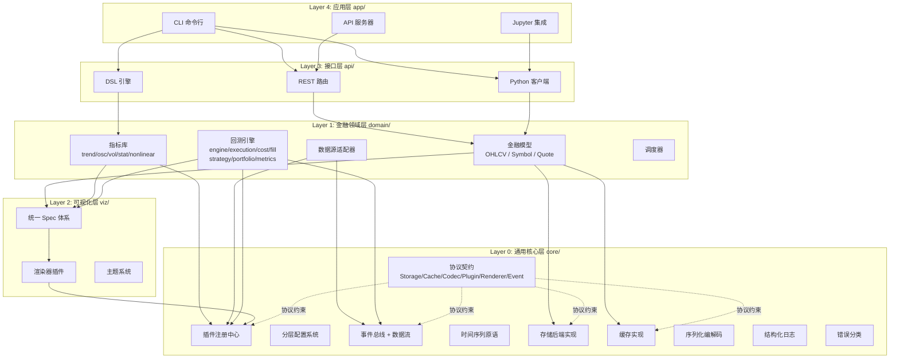

### 2.2 层间依赖规则

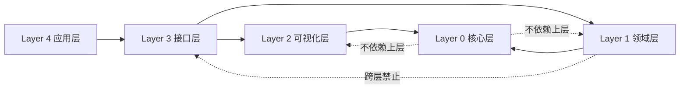

**铁律**：
1. **上层依赖下层**，下层不感知上层（core 不知道 domain 存在）
2. **层间通过 Protocol 通信**，不导入具体实现类
3. **跨层禁止**：domain 不能直接调 api；viz 不能调 domain 业务逻辑
4. **同层内**可自由组合，跨层必须走契约

### 2.3 包结构映射

v2.0 保持单包 `stockstat`，内部按 `_core / _domain / _viz / _api / app` 组织，对外通过兼容层（`client.py / compute/ / indicators/ / backtest/ / plot/ / dsl/`）保持 v1.7 API 不变。

```
stockstat/
├── __init__.py                  # 公共 API: StockStatClient
├── client.py                    # 兼容层：StockStatClient 门面
├── config.py                    # 兼容层：Config
├── compute/                     # 兼容层：re-export ComputeEngine
├── indicators/                  # 兼容层：re-export 指标模块
├── backtest/                    # 兼容层：re-export 回测模块
├── plot/                        # 兼容层：re-export 可视化
├── dsl/                         # 兼容层：re-export DSL
├── data_access/                 # 兼容层：re-export DataClient
├── export/                      # 兼容层：re-export 序列化
│
├── _core/                       # Layer 0: 通用核心（内部）
│   ├── contracts/               #   协议定义
│   ├── plugin/                  #   插件注册中心
│   ├── config/                  #   分层配置
│   ├── events/                  #   事件总线 + 数据流
│   ├── time/                    #   时间序列原语
│   ├── storage/                 #   存储后端实现
│   ├── cache/                   #   缓存实现
│   ├── codec/                   #   序列化编解码
│   ├── logging/                 #   结构化日志
│   └── errors/                  #   错误分类
│
├── _domain/                     # Layer 1: 金融领域（内部）
│   ├── models/                  #   OHLCV / Symbol / Quote / Trade
│   ├── sources/                 #   数据源适配器
│   ├── normalizer/              #   数据标准化
│   ├── indicators/              #   指标实现（实际代码）
│   ├── backtest/                #   回测引擎（实际代码）
│   └── scheduler/               #   调度器
│
├── _viz/                        # Layer 2: 可视化（内部）
│   ├── specs/                   #   统一 Spec 体系
│   ├── renderers/               #   渲染器实现
│   └── themes/                  #   主题与调色板
│
├── _api/                        # Layer 3: 接口（内部）
│   ├── rest/                    #   REST 服务器
│   ├── client/                  #   Python 客户端
│   └── dsl/                     #   DSL 引擎
│
└── app/                         # Layer 4: 应用
    ├── cli.py                   #   命令行入口
    └── server.py                #   服务器入口
```

---

## 3. Layer 0：通用核心层 stockstat.core

> **设计原则**：与金融领域完全无关。处理时间序列、存储、缓存、序列化、插件、事件、配置等通用原语。理论上可独立抽取为通用时序数据平台底座。

### 3.1 协议契约 contracts/

定义所有跨层通信的 Protocol（Python `typing.Protocol`），不含实现：

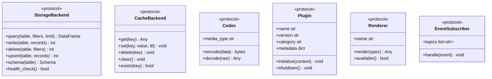

**与 v1.7 对比**：v1.7 无显式协议定义，层间直接导入具体类（如 `routes.py` 直接 `import YahooDirectAdapter`）；v2.0 全部走 Protocol，可替换实现。

### 3.2 插件注册中心 plugin/

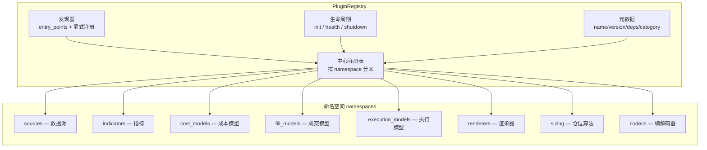

**核心能力**：

| 能力 | 说明 |
|------|------|
| **命名空间** | 插件按类别分区，避免名称冲突（`sources.yfinance` vs `indicators.ma`） |
| **自动发现** | 通过 setuptools `entry_points` 自动扫描已安装的插件包 |
| **显式注册** | `registry.register("indicators", "my_ind", MyIndicator())` |
| **依赖声明** | 插件可声明依赖的其他插件，注册中心解析加载顺序 |
| **生命周期** | `initialize(ctx)` / `health_check()` / `shutdown()` 统一管理 |
| **元数据查询** | `registry.list("indicators")` 返回所有已注册指标的元信息 |

**与 v1.7 对比**：v1.7 的适配器在 `routes.py` 用 `if-elif` 硬编码（4 个分支），指标用模块级 `_REGISTRY` 字典（无命名空间/元数据/发现机制）；v2.0 统一为一套注册中心，所有扩展点同构。

### 3.3 分层配置系统 config/

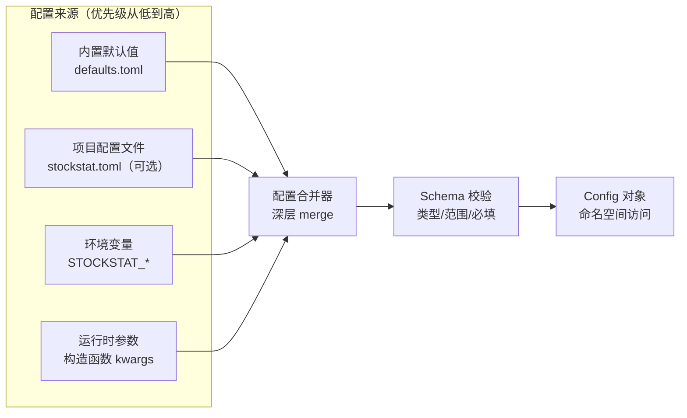

**命名空间示例**（逻辑结构）：

```
config.backend.database_url = "sqlite:///stockstat.db"
config.backend.cache.backend = "memory"          # memory | redis
config.backend.cache.ttl = 300
config.proxy.enabled = false
config.frontend.host = "localhost"
config.frontend.timeout = 30
config.backtest.default_initial_cash = 1_000_000
config.plot.default_renderer = "matplotlib"
config.plot.theme = "default"
```

**与 v1.7 对比**：v1.7 配置散落在 `Settings` / `ProxyConfig` / `Config` 三个 dataclass + 十几个环境变量，无文件配置、无校验、无分层；v2.0 统一为分层合并 + Schema 校验 + 命名空间访问。

### 3.4 事件总线 + 数据流 events/

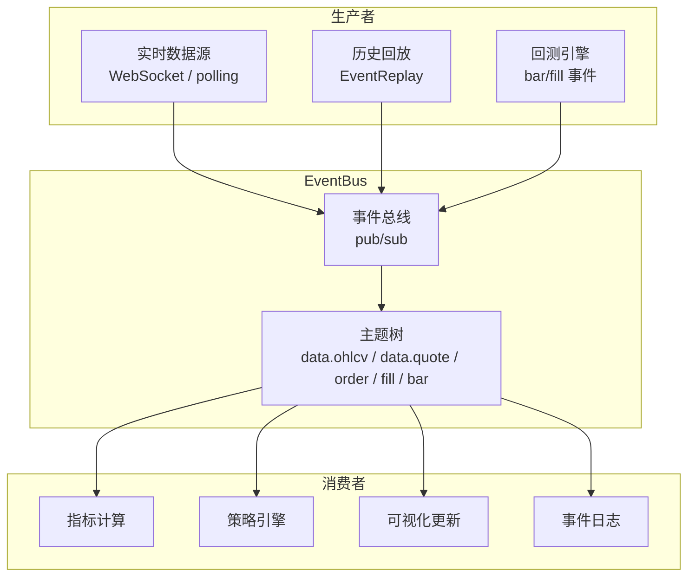

**核心抽象**：

| 组件 | 职责 |
|------|------|
| `EventBus` | 进程内 pub/sub，按主题路由；支持同步/异步分发 |
| `Event` | 不可变事件对象（topic / payload / timestamp / source） |
| `EventReplay` | 从历史存储读取数据，按时序重放为事件流（回测的基础） |
| `DataStream` | 高级抽象：持续的数据流，可 `subscribe()` / `transform()` / `window()` |

**关键设计：历史 = 回放，实时 = 流**

v1.7 中回测与实时查询是两套代码路径；v2.0 统一为：
- **回测** = `EventReplay` 从存储读取历史 bar → 发布到 EventBus → 策略订阅消费
- **实时** = 数据源 WebSocket → 发布到 EventBus → 策略/指标订阅消费
- 策略代码**无需区分**历史/实时，只订阅 `bar` 主题

### 3.5 时间序列原语 time/

| 组件 | 职责 | v1.7 对应 |
|------|------|-----------|
| `TimeIndex` | 多时间框架索引对齐（union / ffill / asof） | `DataFeed` 内部逻辑（未抽出） |
| `Resampler` | 时间框架重采样（1m→1d 聚合） | 无（依赖数据源原生） |
| `Timezone` | UTC 统一 + 本地化转换 | `normalizer.py` 内联 |
| `Calendar` | 交易日历（股票非 24×7） | 无 |

**改进**：v1.7 的时间对齐逻辑埋在 `backtest/data_feed.py` 内部，无法在回测外复用；v2.0 抽为通用原语，数据查询、指标计算、回测共用。

### 3.6 存储后端 storage/

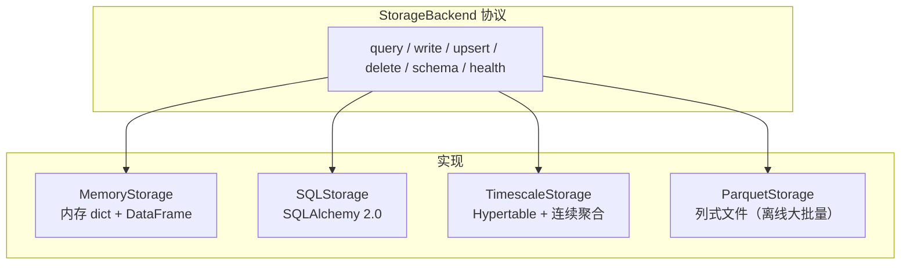

| 实现 | 适用场景 | v1.7 对应 |
|------|---------|-----------|
| `MemoryStorage` | 测试 / 极小数据 | 无（v1.7 只有 SQLite） |
| `SQLStorage` | 默认（SQLite / PostgreSQL） | v1.7 的 SQLAlchemy 路径 |
| `TimescaleStorage` | 海量时序（1 分钟全市场） | v1.7 Docker 部署但未启用 Hypertable |
| `ParquetStorage` | 离线分析（只读快照） | 无 |

**关键改进**：
- v1.7 的 `OHLCVRepository` 直接绑定 SQLAlchemy ORM；v2.0 的 Repository 调 `StorageBackend.query()` 协议，后端可切换
- Schema 驱动：定义数据 schema（字段/类型/索引），Storage 后端自动适配建表
- 迁移支持：`storage.migrate(from, to)` 跨后端迁移

### 3.7 缓存 cache/

| 实现 | 说明 | v1.7 对应 |
|------|------|-----------|
| `NullCache` | 不缓存（测试用） | 无 |
| `MemoryCache` | 进程内 TTL 缓存 | `InMemoryCache`（唯一实现） |
| `RedisCache` | 分布式缓存 | Docker 启动但代码未接入 |

**关键改进**：v1.7 的 `cache.py` 只有 `InMemoryCache`，`REDIS_URL` 配了也不生效；v2.0 按 `config.backend.cache.backend` 自动选择实现，Redis 真正可用。

### 3.8 序列化编解码 codec/

| Codec | media_type | v1.7 对应 |
|-------|------------|-----------|
| `JsonCodec` | `application/json` | 前端 `DataClient` 内联 |
| `CsvCodec` | `text/csv` | 后端 `routes.py` 内联 |
| `ArrowCodec` | `application/vnd.apache.arrow.file` | 依赖 pyarrow 但未实现 |
| `ParquetCodec` | `application/vnd.apache.parquet` | 无 |

**关键改进**：v1.7 序列化逻辑分散在 `routes.py`（CSV）、`DataClient`（JSON）、`export/serializers.py`（DataFrame→dict）三处；v2.0 统一为 Codec 协议，`format=arrow` 真正可用。

### 3.9 日志与错误

| 组件 | 职责 | v1.7 对应 |
|------|------|-----------|
| `StructuredLogger` | JSON 结构化日志 + 上下文（request_id / symbol / source） | 标准 `logging`（无结构化） |
| `ErrorRegistry` | 错误码注册 + 分类（`DATA_NOT_FOUND` / `ADAPTER_FAILED` / ...） | FastAPI 默认 `{"detail": "..."}` |
| `AppError` | 带错误码、上下文、可恢复标志的异常基类 | 裸 `HTTPException` / `KeyError` |

---

## 4. Layer 1：金融领域层 stockstat.domain

> **设计原则**：金融领域逻辑构建在通用核心之上。所有金融实体（OHLCV、指标、回测）都是核心协议的具体实现。

### 4.1 领域模型 models/

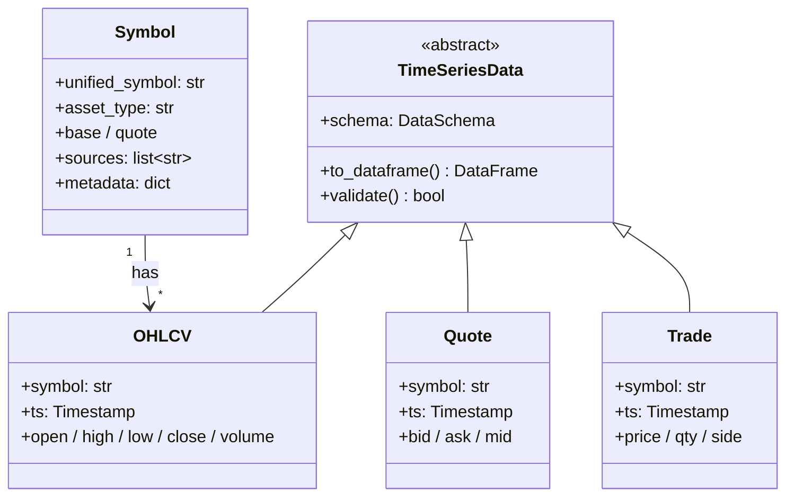

**与 v1.7 对比**：v1.7 只有 `OHLCV` 和 `SymbolRegistry` 两个 ORM 类；v2.0 以 `TimeSeriesData` 为基类，可扩展 Quote / Trade / OrderBook 等数据类型，且与存储解耦（`TimeSeriesData` 不绑 ORM）。

### 4.2 数据源适配器 sources/

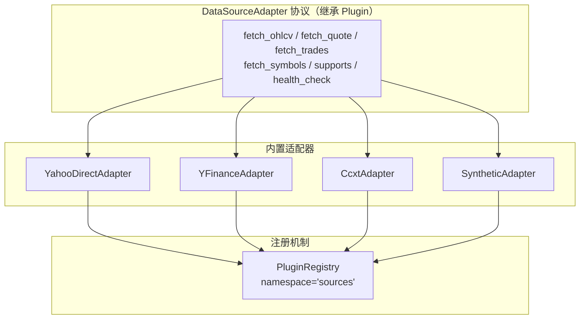

**与 v1.7 对比**：
- v1.7：`routes.py` 的 `_get_adapter()` 用 4 个 `if-elif` 硬编码路由，新增数据源需改路由代码
- v2.0：适配器自注册到 `PluginRegistry`，路由层 `registry.get("sources", source_name)` 动态查找，新增数据源只需写适配器类 + 注册，零路由改动

### 4.3 指标库 indicators/

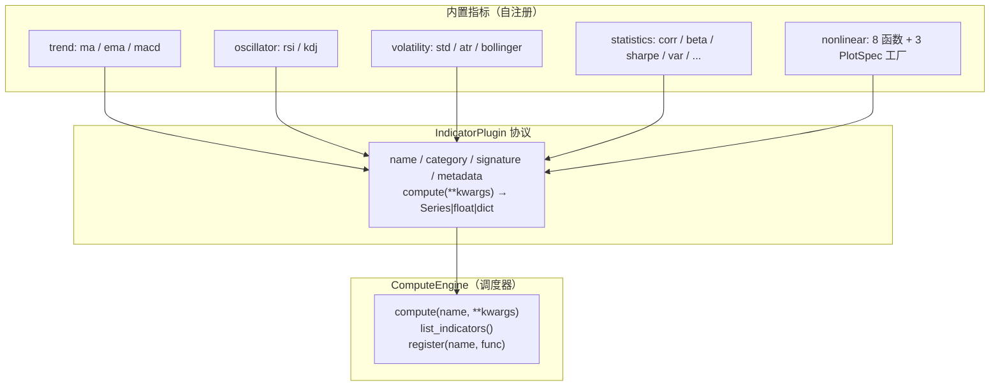

**与 v1.7 对比**：

| 维度 | v1.7 | v2.0 |
|------|------|------|
| **指标定义** | 模块级函数，`ComputeEngine` 手动为每个函数写一个方法（40+ 方法） | 实现 `IndicatorPlugin` 协议，自注册；`ComputeEngine` 是调度器，不手写方法 |
| **注册** | `register(name, func)` 存入模块级 dict | `registry.register("indicators", name, plugin)`，带元数据 |
| **发现** | 无 | `entry_points` 自动发现第三方指标包 |
| **元数据** | 只有 name + category | 增加 signature（参数类型）、output_type、dependencies |
| **组合** | 不支持 | 支持 pipeline：`ma(rsi(close, 14), 5)` 声明式组合 |
| **DSL 暴露** | 手动在 `_BUILTIN_FUNCS` 字典维护第二份列表 | DSL 引擎从 registry 自动加载所有指标的 signature |

**关键改进**：v1.7 新增一个指标需要改 3 处（写函数 → `ComputeEngine` 加方法 → `_BUILTIN_FUNCS` 加 DSL 映射）；v2.0 只需写一个 `IndicatorPlugin` 实现并注册，ComputeEngine 和 DSL 自动可用。

### 4.4 回测引擎 backtest/

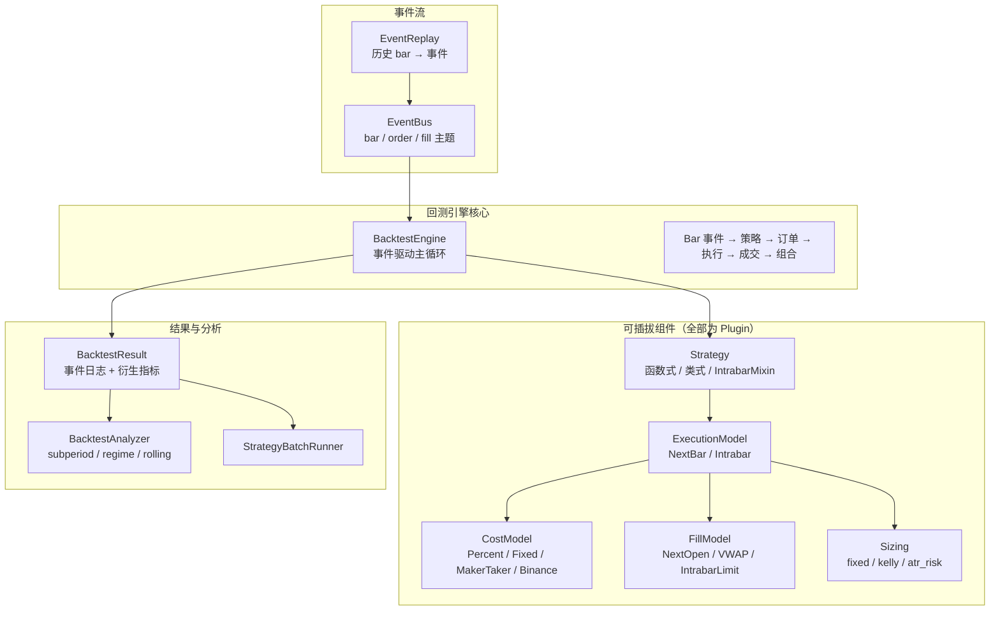

**与 v1.7 对比**：

| 维度 | v1.7 | v2.0 |
|------|------|------|
| **引擎模型** | 命令式 for 循环遍历 bar | 事件驱动：EventReplay → EventBus → 策略订阅 |
| **组件注册** | CostModel / FillModel / ExecutionModel 是类，无注册机制 | 全部实现 Plugin 协议，注册到 `registry` 对应命名空间 |
| **结果模型** | BacktestResult 内部存 fills 列表 + equity 序列 | BacktestResult = 事件日志（不可变）+ 惰性衍生指标 |
| **实时统一** | 回测与实时是两套路径 | 回测 = EventReplay（历史事件流）；实时 = DataSource 流；策略代码相同 |
| **文件组织** | 27 个文件扁平在 `backtest/` | 按 子包 组织：`engine/ execution/ cost/ fill/ strategy/ portfolio/ metrics/ analysis/` |

### 4.5 调度器 scheduler/

| 能力 | v1.7 | v2.0 |
|------|------|------|
| **状态** | 空目录 stub | 完整实现 |
| **触发模式** | 仅按需 `POST /ingest` | 按需 + 定时（cron）+ 事件驱动（数据源推送） |
| **任务** | 无 | 全量回填 / 增量更新 / 数据校验 / 归档 |
| **依赖** | — | 基于 `core/events` 的 EventBus 触发 |

---

## 5. Layer 2：可视化层 stockstat.viz

### 5.1 统一 Spec 体系

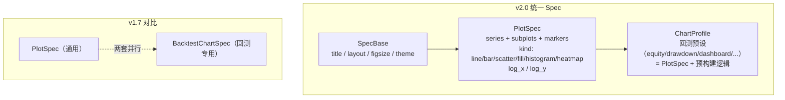

**关键改进**：

| 维度 | v1.7 | v2.0 |
|------|------|------|
| **Spec 数量** | 两套并行（`PlotSpec` + `BacktestChartSpec`），功能重叠 | 一套 `PlotSpec`；回测图表 = `ChartProfile`（PlotSpec 的预设 + 构建器） |
| **渲染器** | `RendererFactory` 硬编码 matplotlib/plotly/null 三分支 | 渲染器注册到 `registry`，自动发现 |
| **主题** | 无 | `Theme` 系统（default / dark / publication），Spec 引用主题名 |
| **序列化** | `to_dict()` 各自定义 | 统一 `SpecBase.to_dict()` + `SpecBase.from_dict()` |

### 5.2 渲染器插件

| 渲染器 | v1.7 | v2.0 |
|--------|------|------|
| `NullRenderer` | ✅ | ✅（注册到 registry） |
| `MatplotlibRenderer` | ✅ | ✅（注册到 registry） |
| `PlotlyRenderer` | ❌ 文件不存在 | ✅（可选 extras，自动发现） |
| `WebRenderer` | ❌ | 新增：输出 HTML/JSON 供前端渲染 |

---

## 6. Layer 3：接口层 stockstat.api

### 6.1 REST 服务器 rest/

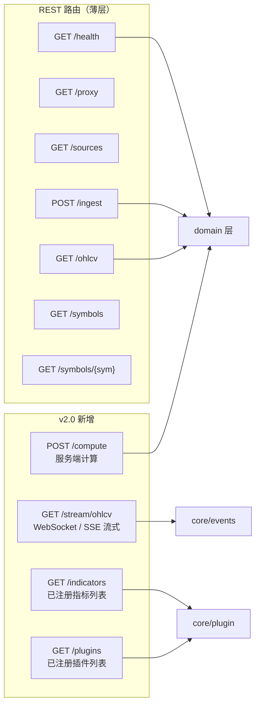

**与 v1.7 对比**：
- v1.7 路由直接导入 `YahooDirectAdapter` / `ohlcv_repo` / `cache` 等具体实现
- v2.0 路由是薄层，调用 domain 层接口；新增流式端点、指标查询端点、插件查询端点
- v1.7 的 `format` 参数只支持 json/csv；v2.0 通过 Codec 注册表自动支持 arrow/parquet

### 6.2 Python 客户端 client/

| 能力 | v1.7 | v2.0 |
|------|------|------|
| **同步 HTTP** | httpx 同步 | httpx 同步（兼容） |
| **异步 HTTP** | ❌ | httpx.AsyncClient（新增） |
| **流式订阅** | ❌ | WebSocket / SSE 客户端（新增） |
| **Codec 协商** | 只解析 JSON | Accept header 协商，支持 Arrow 零拷贝 |
| **离线模式** | ❌ | 本地 Storage 直接访问（不经 HTTP） |

**离线模式关键改进**：v1.7 前端必须连后端 HTTP 才能用；v2.0 客户端可配置 `mode="offline"`，直接用 `MemoryStorage` / `ParquetStorage` 加载数据，计算/回测/可视化全部本地运行，无需启动后端。

### 6.3 DSL 引擎 dsl/

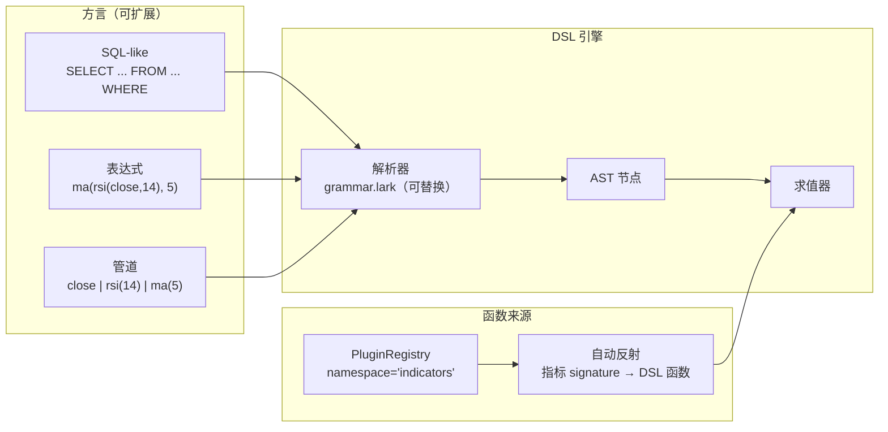

**与 v1.7 对比**：

| 维度 | v1.7 | v2.0 |
|------|------|------|
| **函数清单** | `_BUILTIN_FUNCS` 字典手动维护 15 个 | 从 `registry` 自动反射所有已注册指标的 signature |
| **语法** | 固定 SELECT-FROM-WHERE-LIMIT | 可插拔语法（SQL-like / 表达式 / 管道），默认 SQL-like |
| **新指标暴露** | 手动在 `_BUILTIN_FUNCS` 加映射 | 注册指标后 DSL 自动可用 |
| **能力** | 无 GROUP BY / ORDER BY / CASE WHEN | 可扩展（方言插件可增加语法结构） |

---

## 7. Layer 4：应用层 stockstat.app

### 7.1 CLI 命令行（新增）

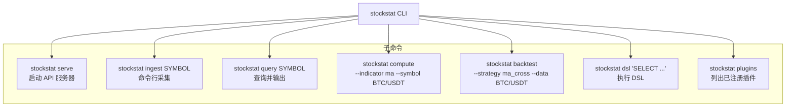

**v1.7 无 CLI**：所有操作必须写 Python 脚本或启动 HTTP 服务；v2.0 提供 CLI 一键操作。

### 7.2 服务器入口

统一 `stockstat serve` 命令，按配置启动 REST + 可选 WebSocket，替代 v1.7 的 `python -m uvicorn stockstat_backend.app:app`。

---

## 8. 关键机制设计

### 8.1 插件生命周期

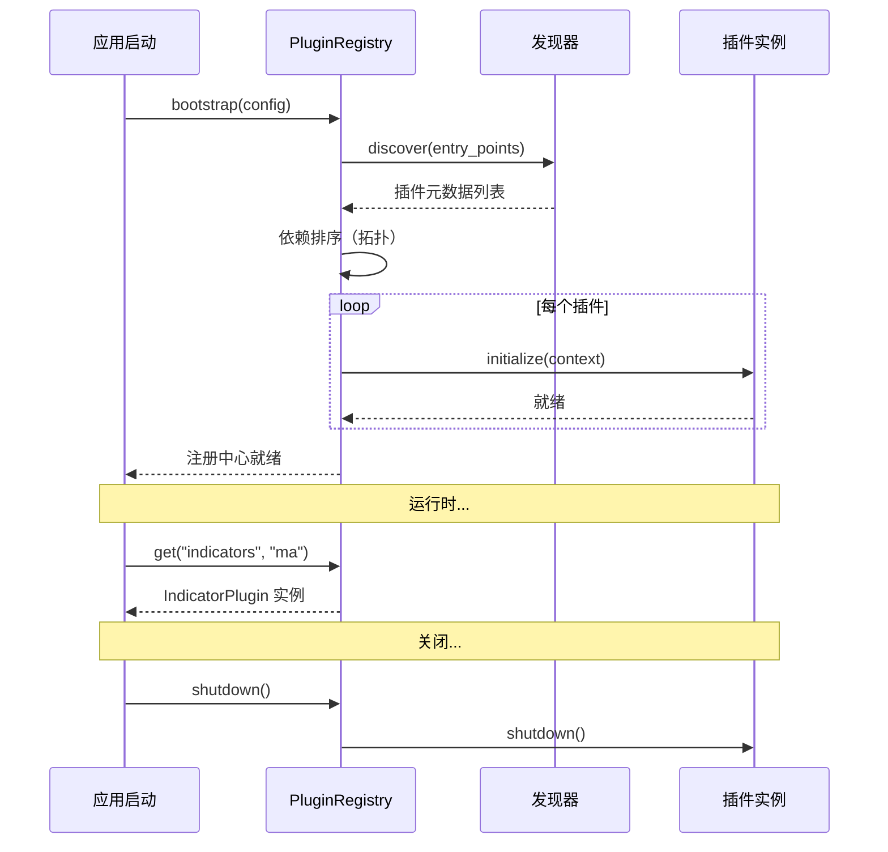

### 8.2 事件驱动回测流程

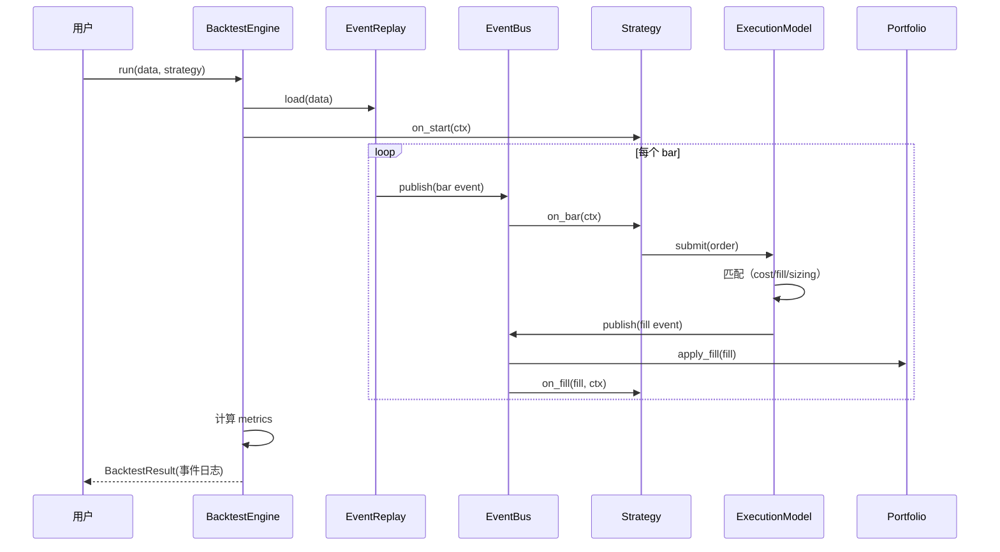

**与 v1.7 对比**：v1.7 的回测主循环是 `engine.py` 内 `for t in master_index:` 命令式遍历，策略、订单、成交都在同一函数内顺序处理；v2.0 拆为事件发布/订阅，每个组件独立响应事件，可测试性更强，且与实时流路径统一。

### 8.3 存储切换流程

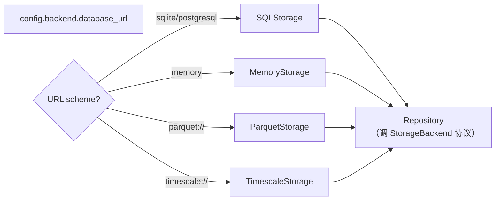

**与 v1.7 对比**：v1.7 切换数据库只改 `DATABASE_URL`，但代码路径相同（SQLAlchemy）；v2.0 可切换到完全不同的存储引擎（Parquet 文件 / 内存），Repository 层无感知。

### 8.4 配置加载流程

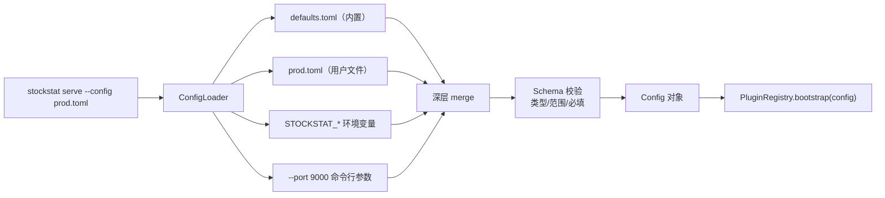

---

## 9. v1.7 vs v2.0 逐项对比

### 9.1 架构层面

| 维度 | v1.7 现状 | v2.0 设计 | 改进价值 |
|------|----------|-----------|---------|
| **分层** | 2 层（backend / frontend） | 5 层（core / domain / viz / api / app） | 职责清晰，可独立测试/替换 |
| **层间通信** | 直接导入具体类 | Protocol 协议 | 实现可替换，无硬编码分支 |
| **通用性** | 核心与金融逻辑混合 | 通用底（core）与金融领域（domain）分离 | core 可复用于非金融时序 |
| **包结构** | `stockstat_backend` + `stockstat` 两个包 | 单包 `stockstat`，内部分层 | 简化部署，兼容层保持 API |

### 9.2 插件机制

| 维度 | v1.7 | v2.0 |
|------|------|------|
| **数据源** | `routes.py` 4 个 if-elif 硬编码 | `PluginRegistry` namespace=`sources`，自动发现 |
| **指标** | 模块级 `_REGISTRY` dict，无元数据 | `IndicatorPlugin` 协议 + 元数据 + signature |
| **成本/成交/执行模型** | 类，无注册机制 | 全部 Plugin，注册到对应 namespace |
| **渲染器** | `RendererFactory` 3 分支 if-else | 注册到 registry，自动发现 |
| **第三方扩展** | 不支持 | entry_points 自动发现 |
| **新增指标改动** | 3 处（函数 + Engine 方法 + DSL 映射） | 1 处（写 IndicatorPlugin 并注册） |

### 9.3 存储与缓存

| 维度 | v1.7 | v2.0 |
|------|------|------|
| **存储抽象** | 无协议，直接 SQLAlchemy ORM | `StorageBackend` Protocol |
| **后端** | SQLite（默认）/ PostgreSQL（Docker） | Memory / SQL / TimescaleDB / Parquet |
| **缓存抽象** | 无协议，`InMemoryCache` 唯一实现 | `CacheBackend` Protocol |
| **缓存后端** | InMemory（Redis 配了不生效） | Null / Memory / Redis（按配置自动选择） |
| **序列化** | JSON/CSV 分散 3 处，Arrow 未实现 | Codec 协议统一，Arrow/Parquet 可用 |
| **数据类型** | 仅 OHLCV | `TimeSeriesData` 基类，可扩展 Quote/Trade |

### 9.4 计算与 DSL

| 维度 | v1.7 | v2.0 |
|------|------|------|
| **ComputeEngine** | 40+ 方法的扁平类 | 调度器，转发到 IndicatorPlugin |
| **指标元数据** | name + category | + signature / output_type / dependencies |
| **指标组合** | 不支持 | pipeline 声明式组合 |
| **DSL 函数** | 手动维护 15 个 | 从 registry 自动反射 |
| **DSL 语法** | 固定 SELECT-FROM-WHERE | 可插拔方言（SQL / 表达式 / 管道） |
| **DSL 能力** | 无 GROUP BY / ORDER BY | 方言插件可扩展 |

### 9.5 可视化

| 维度 | v1.7 | v2.0 |
|------|------|------|
| **Spec 体系** | PlotSpec + BacktestChartSpec 两套并行 | 统一 PlotSpec + ChartProfile 预设 |
| **渲染器** | matplotlib / null（plotly 未实现） | + plotly / web，全部注册到 registry |
| **主题** | 无 | Theme 系统（default / dark / publication） |
| **序列化** | 各自定义 to_dict | 统一 SpecBase.to_dict / from_dict |

### 9.6 回测

| 维度 | v1.7 | v2.0 |
|------|------|------|
| **引擎模型** | 命令式 for 循环 | 事件驱动（EventReplay → EventBus → 策略） |
| **实时统一** | 回测与实时两套路径 | 统一事件流（历史=回放，实时=流） |
| **组件注册** | ExecutionModel 可插拔，其余不可 | 全部 Plugin，注册到 registry |
| **结果模型** | fills 列表 + equity 序列 | 事件日志（不可变）+ 惰性衍生指标 |
| **文件组织** | 27 文件扁平 | 按 子包 组织 |

### 9.7 事件与流式

| 维度 | v1.7 | v2.0 |
|------|------|------|
| **事件系统** | 无 | EventBus + DataStream |
| **流式数据** | 仅请求-响应 | WebSocket / SSE 流式端点 |
| **实时回测统一** | 不支持 | 策略代码无需区分历史/实时 |

### 9.8 配置与运维

| 维度 | v1.7 | v2.0 |
|------|------|------|
| **配置来源** | 环境变量散落 3 个 dataclass | 分层合并（默认→文件→环境→参数） |
| **配置校验** | 无 | Schema 校验（类型/范围/必填） |
| **CLI** | 无 | `stockstat serve/ingest/query/compute/backtest/dsl/plugins` |
| **离线模式** | 必须连 HTTP | 本地 Storage 直接访问 |
| **日志** | 标准 logging | 结构化日志 + 上下文 |
| **错误** | 裸 HTTPException | 错误码注册 + AppError 分类 |
| **调度器** | 空 stub | 完整实现（定时/增量/校验/归档） |

### 9.9 文件结构对比

```
v1.7（扁平）                          v2.0（分层）
─────────────────────────             ──────────────────────────────────
stockstat/                            stockstat/
├── client.py                         ├── client.py          (兼容层)
├── config.py                         ├── config.py          (兼容层)
├── data_access/ohlcv.py              ├── data_access/       (兼容层)
├── compute/                          ├── compute/           (兼容层)
│   ├── engine.py    ← 40+ 方法       ├── indicators/        (兼容层)
│   └── registry.py  ← 全局 dict      ├── backtest/          (兼容层)
├── indicators/                       ├── plot/              (兼容层)
│   ├── trend.py                      ├── dsl/               (兼容层)
│   ├── oscillator.py                 ├── export/            (兼容层)
│   ├── volatility.py                 │
│   ├── statistics.py                 ├── _core/             ← 通用底（新）
│   └── nonlinear.py                  │   ├── contracts/
├── dsl/                              │   ├── plugin/
│   ├── grammar.lark                  │   ├── config/
│   ├── parser.py                     │   ├── events/
│   ├── ast_nodes.py                  │   ├── time/
│   └── evaluator.py  ← 手动函数表    │   ├── storage/
├── plot/                             │   ├── cache/
│   ├── base.py       ← PlotSpec      │   ├── codec/
│   └── matplotlib_backend.py         │   ├── logging/
├── backtest/         ← 27 文件扁平   │   └── errors/
│   ├── engine.py                    │
│   ├── execution_model.py            ├── _domain/           ← 金融领域
│   ├── context.py                    │   ├── models/
│   ├── data_feed.py                  │   ├── sources/
│   ├── strategy.py                   │   ├── normalizer/
│   ├── orders.py                     │   ├── indicators/
│   ├── broker.py                     │   ├── backtest/
│   ├── portfolio.py                  │   │   ├── engine/
│   ├── cost_model.py                 │   │   ├── execution/
│   ├── fill_model.py                 │   │   ├── cost/
│   ├── intrabar.py                   │   │   ├── fill/
│   ├── sizing.py                     │   │   ├── strategy/
│   ├── metrics.py                    │   │   ├── portfolio/
│   ├── result.py                     │   │   ├── metrics/
│   ├── benchmark.py                  │   │   └── analysis/
│   ├── analyzer.py                   │   └── scheduler/
│   ├── batch_runner.py               │
│   ├── fee_sweep.py                  ├── _viz/              ← 可视化
│   ├── optimizer.py                  │   ├── specs/
│   ├── walkforward.py                │   ├── renderers/
│   ├── montecarlo.py                 │   └── themes/
│   ├── plot_adapter.py               │
│   ├── chart_spec.py ← 第二套 Spec   ├── _api/              ← 接口
│   ├── chart_registry.py             │   ├── rest/
│   ├── chart_factory.py              │   ├── client/
│   ├── null_charts.py                │   └── dsl/
│   └── matplotlib_charts.py          │
└── export/serializers.py             └── app/
                                          ├── cli.py
                                          └── server.py
```

---

## 10. 向后兼容策略

### 10.1 公共 API 兼容矩阵

| v1.7 公共 API | v2.0 状态 | 兼容方式 |
|---------------|-----------|---------|
| `from stockstat import StockStatClient` | ✅ 不变 | `client.py` 兼容层门面 |
| `StockStatClient(host, port, ...)` | ✅ 不变 | 转发到 `_api/client/` |
| `client.ohlcv / ingest / symbols / sources / health` | ✅ 不变 | 转发到 `_api/client/` |
| `client.compute.ma / rsi / bollinger / ...`（40+ 方法） | ✅ 不变 | `ComputeEngine` 动态转发到 registry |
| `client.compute.register / call / list_indicators` | ✅ 不变 | 转发到 `PluginRegistry` |
| `client.run_dsl(...)` | ✅ 不变 | 转发到 `_api/dsl/` |
| `client.plot.spec / get_renderer / render` | ✅ 不变 | 转发到 `_viz/` |
| `client.backtest(data, strategy, ...)` | ✅ 不变 | 转发到 `_domain/backtest/` |
| `from stockstat.backtest import BacktestEngine, strategy, Order, ...` | ✅ 不变 | `backtest/__init__.py` re-export |
| `from stockstat.indicators import trend, oscillator, ...` | ✅ 不变 | `indicators/__init__.py` re-export |
| `from stockstat.plot.base import PlotSpec, get_renderer` | ✅ 不变 | `plot/base.py` re-export |
| `from stockstat.dsl.evaluator import Evaluator` | ✅ 不变 | `dsl/evaluator.py` re-export |
| 后端 `stockstat_backend.app:app` | ✅ 不变 | `app/server.py` 提供 FastAPI 实例别名 |
| 环境变量 `STOCKSTAT_*` / `DATABASE_URL` | ✅ 不变 | `config/` 自动读取环境变量 |

### 10.2 兼容层设计

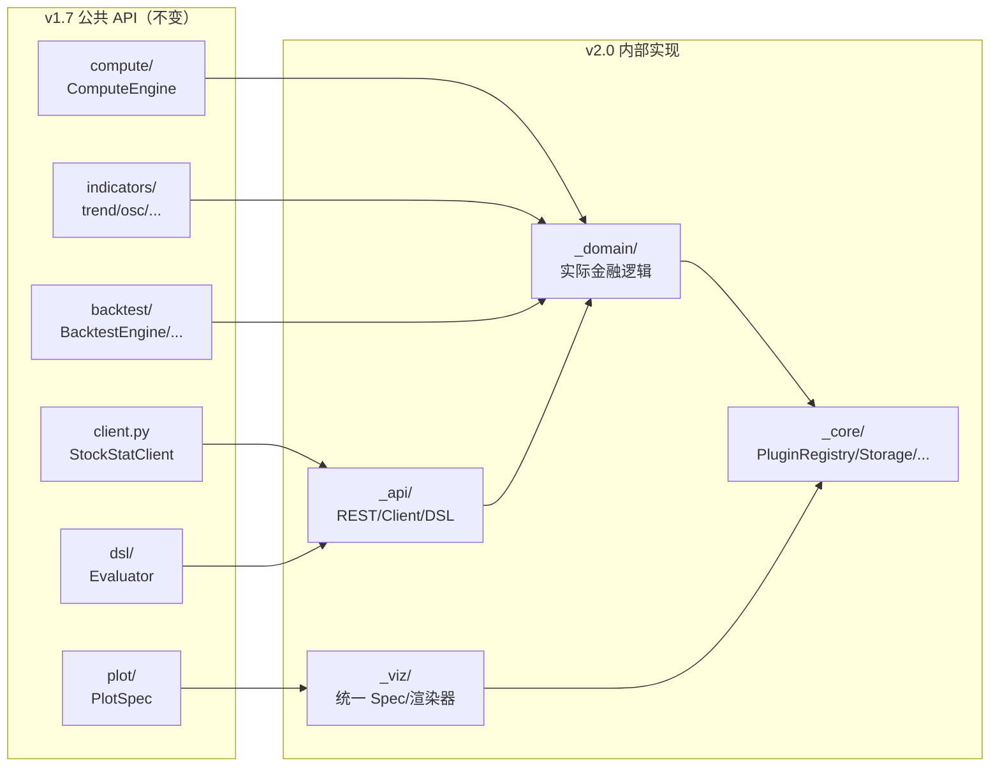

**兼容层规则**：
1. `client.py` / `compute/` / `indicators/` / `backtest/` / `plot/` / `dsl/` / `data_access/` / `export/` 保持为公共 API 入口
2. 这些模块内部改为 re-export 或薄代理，实际逻辑在 `_core / _domain / _viz / _api`
3. 以下划线开头的包（`_core` 等）为内部实现，不保证 API 稳定
4. v1.7 用户代码**零修改**即可升级

### 10.3 行为兼容

| 行为 | v1.7 | v2.0 | 兼容性 |
|------|------|------|--------|
| 默认存储 | SQLite | SQLite | ✅ |
| 默认缓存 | InMemoryCache TTL=300 | MemoryCache TTL=300 | ✅ |
| 默认渲染器 | matplotlib（缺失则 Null） | matplotlib（缺失则 Null） | ✅ |
| 默认执行模型 | NextBarExecution | NextBarExecution | ✅ |
| DSL 语法 | SELECT-FROM-WHERE-LIMIT | SELECT-FROM-WHERE-LIMIT（默认方言） | ✅ |
| 错误格式 | `{"detail": "..."}` | `{"detail": "..."}`（+ 可选 error_code） | ✅ |

---

## 11. 迁移路径

### 11.1 分阶段迁移

```mermaid
gantt
    title v2.0 迁移路线图
    dateFormat  YYYY-MM-DD
    axisFormat  %m/%y

    section 阶段 1：通用底抽取
    协议契约定义             :a1, 2026-08-01, 7d
    PluginRegistry           :a2, after a1, 10d
    分层配置系统              :a3, after a2, 7d
    Storage/Cache 协议+实现   :a4, after a3, 14d
    Codec 协议+实现           :a5, after a4, 5d
    事件总线+数据流           :a6, after a5, 10d

    section 阶段 2：领域层迁移
    数据源适配器插件化        :b1, after a6, 7d
    指标 IndicatorPlugin 化   :b2, after b1, 10d
    回测事件驱动重构          :b3, after b2, 14d
    调度器实现                :b4, after b3, 7d

    section 阶段 3：可视化统一
    统一 PlotSpec + ChartProfile :c1, after b3, 7d
    渲染器插件化              :c2, after c1, 5d
    主题系统                  :c3, after c2, 3d

    section 阶段 4：接口与应用
    DSL 自动反射              :d1, after c1, 7d
    REST 薄层重构             :d2, after d1, 5d
    CLI 实现                  :d3, after d2, 5d
    离线模式                  :d4, after d3, 5d

    section 阶段 5：兼容层与验证
    兼容层 re-export          :e1, after d4, 5d
    全量测试回归              :e2, after e1, 7d
```

### 11.2 迁移原则

1. **渐进式**：每个阶段独立可交付，不一次性重写
2. **兼容层先行**：先建 re-export 兼容层，再逐步将内部实现迁移到新架构
3. **测试驱动**：v1.7 的 390 项测试在迁移全程必须通过（兼容层的核心验收标准）
4. **双跑期**：关键路径（存储/回测）支持新旧实现并行运行，配置切换，对比结果一致后下线旧实现

### 11.3 风险与缓解

| 风险 | 缓解措施 |
|------|---------|
| 迁移破坏 v1.7 API | 兼容层 + 全量测试回归 |
| 事件驱动回测结果与命令式不一致 | 双跑期对比 PnL/Sharpe 误差 < 0.01% |
| 插件注册顺序导致初始化失败 | 依赖拓扑排序 + 循环依赖检测 |
| 性能回退（事件总线开销） | EventBus 支持同步直发模式（无队列） |
| 配置格式变更 | 环境变量 100% 兼容；文件配置为新增能力 |

---

## 附录：v2.0 设计决策摘要

| 决策 | 选择 | 理由 |
|------|------|------|
| 单包 vs 多包 | 单包 `stockstat`，内部分层 | 简化部署；兼容层保持 API |
| Protocol vs ABC | Protocol（`typing.Protocol`） | 无需继承，鸭子类型，更灵活 |
| 事件驱动 vs 命令式 | 事件驱动 | 统一历史/实时；可测试性强 |
| 插件发现 | entry_points + 显式注册 | 两者兼容；第三方可自动发现 |
| 配置格式 | TOML（默认）+ 环境变量 | TOML 类型友好；环境变量兼容 v1.7 |
| 统一 Spec | PlotSpec + ChartProfile | 消除双 Spec 重复；预设保留回测便利性 |
| 离线模式 | Storage 协议抽象 | 前端可直接用本地 Storage，无需 HTTP |

---

*v2.0 设计稿，待评审与迭代。以 v1.7 代码实现为兼容基线。*
