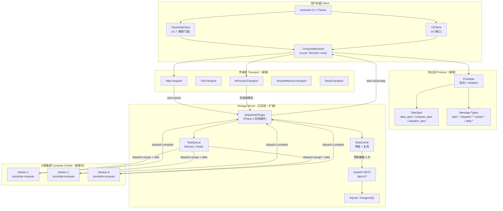
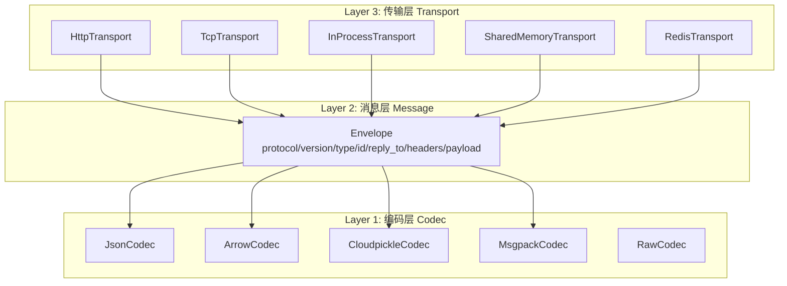
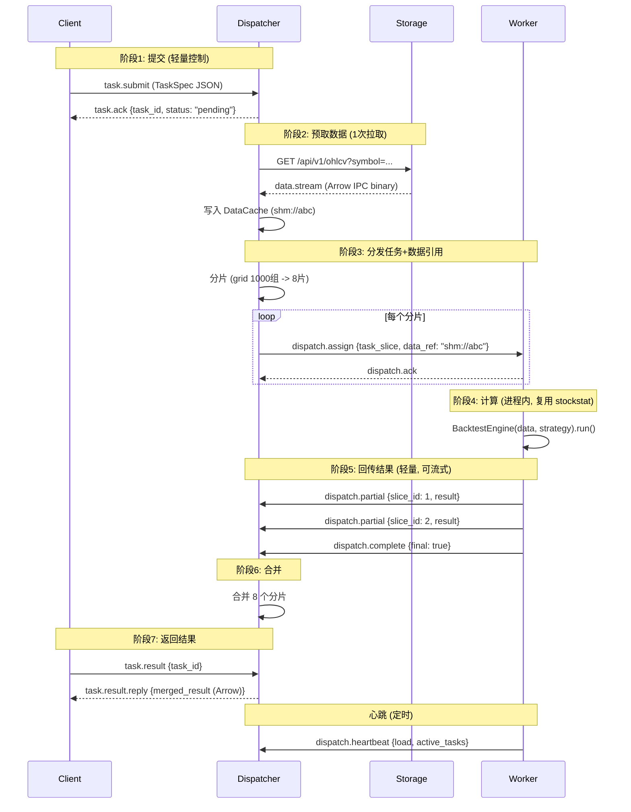
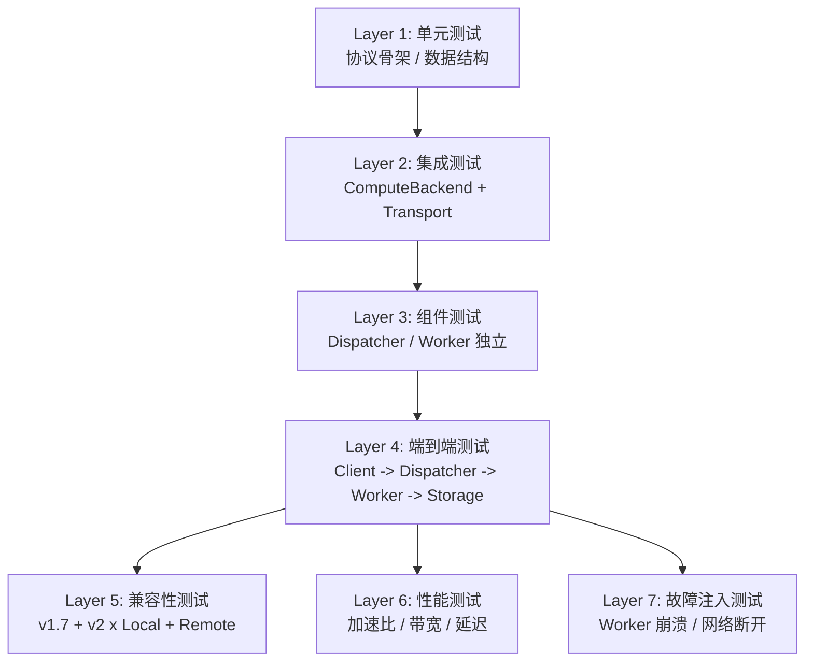

# StockStat 设计报告 V3 — 计算 Offload 与统一计算后端

> **版本**：v3.0（设计稿）
> **日期**：2026-07-19
> **状态**：设计中
> **前置文档**：
> - [DESIGN_CN.md](DESIGN_CN.md) v2.1（当前已实现）
> - [reports/COMPUTE_OFFLOAD_PLAN_CN.md](reports/COMPUTE_OFFLOAD_PLAN_CN.md) v1.0（三角色 offload 设想）
> - [reports/COMPUTE_OFFLOAD_PLAN_V2_CN.md](reports/COMPUTE_OFFLOAD_PLAN_V2_CN.md) v2.0（四角色 + 分层协议）
>
> **目的**：以实现 V1 设想（计算 offload 到分布式 Worker）与 V2 协议（Envelope / TaskSpec / 四角色 / 传输无关）为目标，结合当前 v2.1 已落地的五层架构与双包结构，给出 V3 的完整目标设计、**v1.7 / v2 接口兼容层（可脱耦）**、实现路线图与测试体系。

---

## 目录

1. [设计目标与原则](#1-设计目标与原则)
2. [V3 架构总览](#2-v3-架构总览)
3. [兼容层核心：ComputeBackend 协议](#3-兼容层核心computebackend-协议)
4. [v1.7 与 v2 接口的统一接入](#4-v17-与-v2-接口的统一接入)
5. [协议设计：Envelope 与 TaskSpec](#5-协议设计envelope-与-taskspec)
6. [消息类型表](#6-消息类型表)
7. [传输层抽象与实现](#7-传输层抽象与实现)
8. [ComputeBackend 三种实现](#8-computebackend-三种实现)
9. [Dispatcher 设计](#9-dispatcher-设计)
10. [Worker 设计](#10-worker-设计)
11. [任务处理器（Task Handlers）](#11-任务处理器task-handlers)
12. [数据分发策略](#12-数据分发策略)
13. [Worker 注册、心跳与集群拓扑](#13-worker-注册心跳与集群拓扑)
14. [任务生命周期](#14-任务生命周期)
15. [错误处理与重试](#15-错误处理与重试)
16. [协议优化（流式 / 抢占 / 弹性）](#16-协议优化流式--抢占--弹性)
17. [安全性](#17-安全性)
18. [部署场景](#18-部署场景)
19. [项目结构变更](#19-项目结构变更)
20. [实现路线图（分阶段）](#20-实现路线图分阶段)
21. [测试体系](#21-测试体系)
22. [向后兼容矩阵](#22-向后兼容矩阵)
23. [风险与缓解](#23-风险与缓解)
24. [术语表](#24-术语表)

---

## 1. 设计目标与原则

### 1.1 设计目标

V3 在 v2.1 五层架构基础上，新增**分布式计算层**，达成 V1 设想与 V2 协议的所有目标：

| 目标 | 来源 | V3 落地方式 |
|------|------|------------|
| 异步提交、不阻塞用户 | V1 §1.3 | `client.compute.remote()` 返回 `TaskRef`，用户继续工作 |
| 多节点 / 多核并行加速 | V1 §1.3 | Dispatcher 分片 + Worker 进程池 |
| 资源 / 故障隔离 | V1 §1.3 | 计算崩溃不影响 Storage / Client |
| 弹性扩展 | V1 §1.3 | Worker 自动发现 + drain + Autoscaler |
| 数据路径与控制路径分离 | V2 §1.2 | Dispatcher 预取数据，Storage 仅被访问 1 次 |
| 协议传输无关 | V2 §12.1 | Codec / Message / Transport 三层分离 |
| 任务类型可扩展 | V2 §12.11 | `task_type` + `compute_spec` schema，协议零改动 |
| 集群拓扑可观测 | V2 §12.13 | `cluster.info` + Worker 注册/心跳 |
| v1.7 / v2 接口零修改可用 | DESIGN_CN §1.2 | `ComputeBackend` 协议透明替换 |

### 1.2 设计原则

| 原则 | 说明 |
|------|------|
| **核心零侵入** | `BacktestEngine` / `ComputeEngine` / `grid_search` 等核心计算逻辑零修改；Worker 直接复用 |
| **协议优先** | 所有跨进程通信走 `Protocol`，无硬编码 `if transport == "http"` |
| **三层分离** | Codec（编码）/ Message（消息）/ Transport（传输）独立可替换 |
| **可脱耦兼容层** | v1.7 `StockStatClient` 与 v2 `V2Client` 共享同一 `ComputeBackend` 抽象，互不感知 |
| **渐进式迁移** | Phase 1 全部本地、Phase 2 单进程模拟、Phase 3 跨进程、Phase 4 跨机；每阶段可独立交付 |
| **测试即文档** | 每个 Phase 配套测试套件；兼容性测试覆盖 v1.7 + v2 双客户端 × Local / Remote 双后端 |
| **协议不感知业务** | 协议只搬运字节、路由消息；增量计算、抢占、弹性由 Worker 本地逻辑决定 |
| **向后兼容** | v1.7 公共 API 零修改；506 项已有测试全部通过；新增功能全部可选 |

### 1.3 与现有 v2.1 的关系

```
v2.1（已实现）                       v3.0（本设计）
─────────────────────────────────    ─────────────────────────────────
双包：backend + frontend             双包 + 新增 worker 包（stockstat-compute）
五层：_core/_domain/_viz/_api/app    五层不变；_core 新增 contracts/compute、
                                     compute/、protocol/、transport/ 子模块
Storage 协议抽象                      不变
Cache 协议抽象                        不变
Codec 协议（JSON/CSV/Arrow/Parquet） 不变；新增 cloudpickle / msgpack codec
PluginRegistry（46 插件）             不变；新增 task_handlers 命名空间
BacktestEngine（命令式）              不变；Worker 直接调用
ComputeEngine（直接调 indicators）    不变；Worker 直接调用
V2Client（online + offline）          新增 compute_backend 参数
StockStatClient（v1.7 兼容门面）      新增 compute_backend 参数
Admin Plugin（5 页面 SPA）            不变；新增 Task 监控页面（Phase 6）
```

**核心约束**：v3.0 不重构任何已稳定的代码。所有分布式能力通过**新增模块**实现，已稳定的 `BacktestEngine` / `ComputeEngine` / `indicators/*` 等核心计算路径零修改。

---

## 2. V3 架构总览

### 2.1 四角色 + 三层协议



### 2.2 关键设计决策

| 决策 | 选择 | 理由 |
|------|------|------|
| 计算逻辑位置 | **复用 `stockstat.backtest` / `stockstat.compute`** | 277 项回测测试 + 491 项前端测试已覆盖；零重构 |
| 兼容层位置 | `_core/contracts/compute.py` 定义 `ComputeBackend` Protocol | Layer 0 与领域无关；v1.7 / v2 都依赖 Layer 0 |
| Dispatcher 部署 | **Phase 1 作 Storage 插件**；Phase 3+ 支持独立部署 | 渐进式；Phase 1 零额外部署成本 |
| Worker 形态 | **独立包 `stockstat-compute`** | 资源隔离、独立扩展；依赖 `stockstat` 复用计算逻辑 |
| 队列方案 | Phase 1 内存队列；Phase 2 Redis；Phase 5 多级 | 已有 Redis 依赖；按规模渐进 |
| 序列化 | cloudpickle（策略）+ Arrow（数据）+ JSON（控制面） | V2 §6.2 已确定 |
| 协议分层 | Codec / Message / Transport 三层 | V2 §12.2 已确定 |
| 传输实现 | HTTP（默认）/ InProcess（测试）/ TCP / SHM / Redis | 覆盖所有部署场景 |

### 2.3 与 v2.1 五层架构的映射

V3 新增内容**全部落在 Layer 0 `_core`** 与**后端独立模块 `dispatcher/`**，不破坏五层依赖规则：

```
Layer 4 应用层 app/                  ← 新增 cluster / task CLI 子命令
   ↓
Layer 3 接口层 _api/                 ← V2Client / StockStatClient 接入 ComputeBackend
   ↓
Layer 2 可视化层 _viz/               ← 不变
   ↓
Layer 1 领域层 _domain/              ← 不变
   ↓
Layer 0 核心层 _core/                ← 新增 contracts/compute、compute、protocol、transport
```

**铁律保持**：Layer 1 不感知 Layer 0 的新增 compute 模块；Layer 0 不反向依赖 Layer 1 的策略 / 回测代码（Worker 是 Layer 0 协议的消费者，从外部安装 `stockstat` 后调用 Layer 1）。

---

## 3. 兼容层核心：ComputeBackend 协议

### 3.1 设计思路

v1.7 与 v2 的现有客户端最终都调用 `BacktestEngine(...).run()` / `ComputeEngine.<method>()` / `grid_search(...)` 等同步函数。V3 引入一个**位于 Layer 0 的 `ComputeBackend` Protocol**，将"在哪算"（本地 / 远程）与"算什么"（业务逻辑）解耦：

```
            ┌──────────────────────────────────────────┐
            │   StockStatClient（v1.7） / V2Client（v2）│
            │   - ohlcv() / ingest() / run_dsl()        │
            │   - backtest(data, strategy, **kw)        │
            │   - compute.ma() / compute.rsi() / ...    │
            └───────────────────┬──────────────────────┘
                                │ 委托
                                ▼
            ┌──────────────────────────────────────────┐
            │   ComputeBackend Protocol（Layer 0）      │
            │   - submit(spec: TaskSpec) -> TaskRef     │
            │   - get(task_id) -> TaskInfo              │
            │   - result(task_id) -> Any                │
            │   - wait(task_id, timeout) -> Any         │
            │   - cancel(task_id) -> bool               │
            │   - cluster_info() -> dict                │
            └───────────────────┬──────────────────────┘
                                │ 实现
                ┌───────────────┼───────────────┐
                ▼               ▼               ▼
        LocalComputeBackend  RemoteComputeBackend  AutoComputeBackend
        （直接调用 BacktestEngine）  （提交到 Dispatcher）  （按规模路由）
```

### 3.2 Protocol 定义

新增模块 `frontend/stockstat/_core/contracts/compute.py`：

```python
from __future__ import annotations
from dataclasses import dataclass, field
from datetime import datetime
from typing import Any, Optional, Protocol, runtime_checkable
from enum import Enum


class TaskState(str, Enum):
    PENDING = "pending"
    RUNNING = "running"
    COMPLETED = "completed"
    FAILED = "failed"
    CANCELLED = "cancelled"


@dataclass
class TaskInfo:
    """任务状态快照。"""
    task_id: str
    state: TaskState
    progress: float = 0.0          # 0.0 ~ 1.0
    created_at: datetime = field(default_factory=datetime.utcnow)
    started_at: Optional[datetime] = None
    finished_at: Optional[datetime] = None
    error: Optional[str] = None
    worker_id: Optional[str] = None
    slice_id: Optional[str] = None    # 多分片任务时标识当前分片


@dataclass
class TaskRef:
    """客户端持有的任务句柄。"""
    task_id: str
    backend: "ComputeBackend"        # 反向引用，便于 wait()/result()

    @property
    def state(self) -> TaskState:
        return self.backend.get(self.task_id).state

    @property
    def status(self) -> str:
        """v1 兼容字段（V1 规划用 status 字符串）。"""
        return self.state.value

    @property
    def id(self) -> str:
        return self.task_id

    def ready(self) -> bool:
        info = self.backend.get(self.task_id)
        return info.state in (TaskState.COMPLETED, TaskState.FAILED, TaskState.CANCELLED)

    def wait(self, timeout: Optional[float] = None) -> Any:
        """阻塞等待，返回结果（失败抛 TaskError）。"""
        return self.backend.wait(self.task_id, timeout=timeout)

    def result(self) -> Any:
        """非阻塞获取结果；未完成抛 TaskNotReadyError。"""
        return self.backend.result(self.task_id)

    def cancel(self) -> bool:
        return self.backend.cancel(self.task_id)

    def stream_results(self):
        """流式获取部分结果（V2 §13.2）。"""
        yield from self.backend.stream_results(self.task_id)


@runtime_checkable
class ComputeBackend(Protocol):
    """统一计算后端协议。

    所有实现必须支持：
    - submit(spec: TaskSpec) -> TaskRef    异步提交
    - get(task_id) -> TaskInfo             查询状态
    - result(task_id) -> Any               非阻塞取结果
    - wait(task_id, timeout) -> Any        阻塞等待
    - cancel(task_id) -> bool              取消
    - cluster_info() -> dict               集群拓扑（本地实现返回空）
    - stream_results(task_id)              流式结果迭代器

    三个实现：
    - LocalComputeBackend：进程内直接调用 BacktestEngine 等（默认）
    - RemoteComputeBackend：通过 Transport 提交到 Dispatcher
    - AutoComputeBackend：按任务规模自动路由
    """
    name: str

    def submit(self, spec: "TaskSpec") -> TaskRef: ...
    def get(self, task_id: str) -> TaskInfo: ...
    def result(self, task_id: str) -> Any: ...
    def wait(self, task_id: str, timeout: Optional[float] = None) -> Any: ...
    def cancel(self, task_id: str) -> bool: ...
    def cluster_info(self, **kwargs) -> dict: ...
    def stream_results(self, task_id: str): ...
```

### 3.3 TaskSpec 数据结构

新增模块 `frontend/stockstat/_core/contracts/task.py`，忠实落地 V2 §12.5 三段式：

```python
@dataclass
class DataSpec:
    """描述需要什么数据——任何任务类型通用。"""
    symbols: list[str]
    timeframe: str = "1d"
    start: Optional[str] = None
    end: Optional[str] = None
    source: Optional[str] = None


@dataclass
class DispatchSpec:
    """描述如何分发——任何任务类型通用。"""
    split_strategy: str = "auto"        # auto / param_wise / symbol_wise / time_wise / none
    max_workers: Optional[int] = None
    data_dispatch: str = "auto"         # auto / inline / shared_memory / stream / storage_ref
    priority: int = 0                   # 0 普通 / -1 高 / 1 低
    timeout: int = 3600                 # 秒
    retry_count: int = 0
    preemptable: bool = False           # 是否允许被高优任务抢占


@dataclass
class ComputeSpec:
    """描述做什么计算——按 task_type 分发到对应处理器。"""
    task_type: str                      # indicator / backtest / grid_search / batch_backtest / monte_carlo / custom
    # 通用字段
    strategy_ref: Optional[str] = None  # cloudpickle:base64... 或注册的策略名
    strategy_codec: str = "cloudpickle"
    params: dict = field(default_factory=dict)
    # 回测相关
    initial_cash: float = 1_000_000.0
    cost_model: Optional[str] = None    # 注册名，如 "binance_spot"
    fill_model: Optional[str] = None
    execution_model: Optional[str] = None
    benchmark: Optional[str] = None
    trade_on: str = "open"
    allow_short: bool = False
    periods_per_year: Optional[int] = None
    # grid_search
    param_grid: Optional[dict] = None
    metric: str = "sharpe"
    maximize: bool = True
    # batch_backtest
    strategies: Optional[dict] = None   # {name: strategy_ref}
    fee_models: Optional[list[str]] = None
    # monte_carlo
    n_simulations: int = 1000
    seed: int = 0


@dataclass
class TaskSpec:
    """完整任务规范——V2 §12.5 三段式。"""
    task_id: str                        # UUID v4
    data_spec: DataSpec
    compute_spec: ComputeSpec
    dispatch_spec: DispatchSpec = field(default_factory=DispatchSpec)
    trace_id: str = ""                  # 分布式追踪 ID
    created_at: datetime = field(default_factory=datetime.utcnow)
    created_by: str = ""                # Client 标识
```

### 3.4 脱耦要点

| 维度 | 脱耦方式 |
|------|---------|
| **v1.7 vs v2 客户端** | 二者都依赖 `ComputeBackend` Protocol，互不感知。v1.7 的 `StockStatClient` 和 v2 的 `V2Client` 各自维护自己的数据访问层（`DataClient` / `Storage`），但计算层都委托给 `ComputeBackend`。 |
| **业务 vs 协议** | `TaskSpec.compute_spec` 描述业务，`dispatch_spec` 描述调度，`Envelope.headers` 描述传输——三者独立演化。 |
| **传输 vs 消息** | `ComputeBackend` 只定义 `submit/get/result/wait`；`RemoteComputeBackend` 内部选择 Transport（HTTP / TCP / SHM），上层无感知。 |
| **本地 vs 远程** | `LocalComputeBackend` 与 `RemoteComputeBackend` 实现同一 Protocol；客户端代码零修改切换。 |
| **同步 vs 异步** | `client.backtest(...)` 走透明模式（同步阻塞）；`client.compute.remote(...)` 走显式异步模式（返回 `TaskRef`）。两者共享 `ComputeBackend`。 |

---

## 4. v1.7 与 v2 接口的统一接入

### 4.1 v1.7 `StockStatClient` 改造（最小侵入）

`frontend/stockstat/client.py` 仅新增**可选** `compute_backend` 参数，默认 `LocalComputeBackend()`，行为与 v2.1 完全一致：

```python
class StockStatClient:
    def __init__(
        self,
        host: str = "localhost",
        port: int = 8000,
        api_key: str = "",
        timeout: int = 30,
        cache_enabled: bool = True,
        use_https: bool = False,
        config: Optional[Config] = None,
        http_client=None,
        compute_backend: Optional["ComputeBackend"] = None,   # ← 新增
    ):
        # ... 原有初始化不变 ...
        from ._core.contracts.compute import ComputeBackend
        from ._core.compute.local import LocalComputeBackend
        self._compute_backend = compute_backend or LocalComputeBackend(
            client=self, data_client=self._data_client
        )

    @property
    def compute_backend(self) -> "ComputeBackend":
        return self._compute_backend

    @property
    def compute(self) -> "ComputeAPI":
        """ComputeAPI 同时提供本地方法和 remote() 入口。"""
        return self._compute_api  # ← ComputeAPI 增强（见 §4.3）

    def backtest(self, data, strategy, **kwargs):
        """透明模式：默认同步阻塞，返回 BacktestResult。

        若 compute_backend 是 RemoteComputeBackend：
        - 默认阻塞等待结果（行为与 v1.7 一致）
        - 若 kwargs['async_submit']=True，返回 TaskRef
        """
        async_submit = kwargs.pop("async_submit", False)
        if isinstance(self._compute_backend, LocalComputeBackend):
            # 本地路径：完全保留 v1.7 行为
            from .backtest import BacktestEngine
            kwargs.setdefault("compute_engine", self._compute)
            return BacktestEngine(data=data, strategy=strategy, **kwargs).run()
        # 远程路径：构建 TaskSpec 提交
        spec = build_backtest_task_spec(data, strategy, kwargs, trace_id=...)
        task_ref = self._compute_backend.submit(spec)
        if async_submit:
            return task_ref
        return task_ref.wait(timeout=kwargs.get("timeout", 3600))
```

**关键约束**：
- 默认 `compute_backend=None` → `LocalComputeBackend` → 完全走 v1.7 原路径，`BacktestEngine` 直接被调用
- 已有 277 项回测测试零修改通过
- 新增 `async_submit` 参数默认 `False`，不破坏现有调用

### 4.2 v2 `V2Client` 改造

`frontend/stockstat/_api/client/__init__.py` 同样新增可选参数：

```python
class V2Client:
    def __init__(self, mode: str = "online", *,
                 compute_backend: Optional["ComputeBackend"] = None,
                 **kwargs):
        # ... 原有 mode 处理不变 ...
        from ..._core.contracts.compute import ComputeBackend
        from ..._core.compute.local import LocalComputeBackend
        self._compute_backend = compute_backend or LocalComputeBackend(
            client=self, storage=self._storage, mode=self._mode
        )

    @property
    def compute_backend(self) -> "ComputeBackend":
        return self._compute_backend

    def backtest(self, data, strategy, **kwargs):
        async_submit = kwargs.pop("async_submit", False)
        if isinstance(self._compute_backend, LocalComputeBackend):
            # 离线模式原路径
            from ...backtest import BacktestEngine
            kwargs.setdefault("compute_engine", self.compute)
            return BacktestEngine(data=data, strategy=strategy, **kwargs).run()
        spec = build_backtest_task_spec(data, strategy, kwargs)
        task_ref = self._compute_backend.submit(spec)
        if async_submit:
            return task_ref
        return task_ref.wait(timeout=kwargs.get("timeout", 3600))
```

### 4.3 `ComputeAPI` 增强（`client.compute.remote()`）

`ComputeEngine` 保持原 40+ 方法不变；新增 `ComputeAPI` 包装层，提供 `remote()` 显式异步入口：

```python
class ComputeAPI:
    """统一计算入口：本地方法 + 远程提交。

    - client.compute.ma(...)           # 本地，即时返回（v1.7 行为）
    - client.compute.remote(...)       # 远程，返回 TaskRef
    - client.compute.cluster_info()    # 集群拓扑
    """

    def __init__(self, client, compute_engine, compute_backend):
        self._client = client
        self._engine = compute_engine       # 原 ComputeEngine（v1.7）
        self._backend = compute_backend     # ComputeBackend（v3）

    # ── 透传 ComputeEngine 全部方法（v1.7 行为不变）──
    def ma(self, data, window=20):
        return self._engine.ma(data, window)
    # ... 其余 40+ 方法透传 ...

    # ── V3 新增 ──
    def remote(self, task_type: str, *, data_spec=None, compute_spec=None,
               dispatch_spec=None, **kwargs) -> TaskRef:
        """显式异步提交——V1 §5.2 用户 API 落地。"""
        from ._core.contracts.task import TaskSpec, DataSpec, ComputeSpec, DispatchSpec
        import uuid
        spec = TaskSpec(
            task_id=str(uuid.uuid4()),
            data_spec=data_spec or DataSpec(symbols=kwargs.pop("symbols", [])),
            compute_spec=compute_spec or ComputeSpec(task_type=task_type, params=kwargs),
            dispatch_spec=dispatch_spec or DispatchSpec(),
        )
        return self._backend.submit(spec)

    def cluster_info(self, **kwargs) -> dict:
        return self._backend.cluster_info(**kwargs)
```

**`StockStatClient` 用法不变 + 新能力**：

```python
# v1.7 行为完全不变
client = StockStatClient(host="...", port=8000)
sma = client.compute.ma(data.close, window=20)
res = client.backtest(data, strategy, initial_cash=10000)

# V3 新能力（显式异步）
client = StockStatClient(
    host="...", port=8000,
    compute_backend=RemoteComputeBackend(dispatcher_url="http://dispatch:9000"),
)
task = client.compute.remote(
    "grid_search",
    data_spec=DataSpec(symbols=["BTC/USDT"], timeframe="1d", start="2024-01-01"),
    compute_spec=ComputeSpec(
        task_type="grid_search",
        strategy_ref=cloudpickle_dumps(ma_cross_strategy),
        param_grid={"short": [3, 5, 8], "long": [10, 20, 30]},
        metric="sharpe",
    ),
)
print(task.id, task.status)
result = task.wait(timeout=3600)

# 透明模式（远程但同步阻塞）
res = client.backtest(data, strategy)  # 内部 submit + wait
```

### 4.4 兼容性矩阵

| 客户端 | ComputeBackend | 行为 | v1.7 测试 | v2 测试 |
|--------|---------------|------|----------|---------|
| `StockStatClient` | `LocalComputeBackend`（默认） | 完全等同 v2.1 | 全部通过 | — |
| `StockStatClient` | `RemoteComputeBackend` | 透明同步 + 显式异步 | 新增兼容测试 | — |
| `V2Client(mode="online")` | `LocalComputeBackend`（默认） | 完全等同 v2.1 | — | 全部通过 |
| `V2Client(mode="online")` | `RemoteComputeBackend` | 透明同步 + 显式异步 | — | 新增兼容测试 |
| `V2Client(mode="offline")` | `LocalComputeBackend`（默认） | 完全等同 v2.1 | — | 全部通过 |
| `V2Client(mode="offline")` | `RemoteComputeBackend` | 离线数据 + 远程计算 | — | 新增兼容测试 |

---

## 5. 协议设计：Envelope 与 TaskSpec

### 5.1 三层协议栈

忠实落地 V2 §12.2，新增模块 `frontend/stockstat/_core/protocol/`：



### 5.2 Envelope 数据结构

新增 `frontend/stockstat/_core/protocol/envelope.py`：

```python
from dataclasses import dataclass, field
from typing import Any, Optional
import uuid


@dataclass
class Headers:
    """信封头——决定 payload 如何解码、消息如何路由。"""
    content_type: str = "application/json"
    data_codec: str = "arrow"             # arrow / json / parquet
    strategy_codec: str = "cloudpickle"   # cloudpickle / json / none
    encoding: str = "json"                # json / msgpack（控制面编码）
    priority: int = 0
    timeout: int = 3600
    trace_id: str = ""
    data_ref: str = ""                    # shm://id / storage://symbol / inline
    retry_count: int = 0
    # 协议协商
    protocol_version: str = "1.0"
    accepted_codecs: list[str] = field(default_factory=list)
    accepted_encodings: list[str] = field(default_factory=list)


@dataclass
class Envelope:
    """统一消息信封——V2 §12.3。

    所有节点间通信都包装在此结构中。信封本身永远是 JSON/Msgpack
    可序列化的；payload 按 headers.content_type 决定编码方式。
    """
    protocol: str = "stockstat-rpc"
    version: str = "1.0"
    type: str = ""                        # 见 §6 消息类型表
    id: str = field(default_factory=lambda: str(uuid.uuid4()))
    reply_to: Optional[str] = None
    headers: Headers = field(default_factory=Headers)
    payload: Any = None                   # bytes / str / dict

    def to_dict(self) -> dict: ...
    @classmethod
    def from_dict(cls, d: dict) -> "Envelope": ...
    def encode(self) -> bytes:
        """按 headers.encoding 选择 json / msgpack 序列化整个信封。"""
        ...
    @classmethod
    def decode(cls, raw: bytes) -> "Envelope": ...
```

### 5.3 编码层 Codec

复用 v2.1 已有 `_core/codec/`（JSON / CSV / Arrow / Parquet），新增：

| Codec | media_type | 用途 | 状态 |
|-------|-----------|------|------|
| `JsonCodec` | `application/json` | 控制面消息、TaskSpec | 已实现 |
| `ArrowCodec` | `application/vnd.apache.arrow.file` | 表格数据、回测结果 | 已实现 |
| `ParquetCodec` | `application/vnd.apache.parquet` | 大数据持久化 | 已实现 |
| `CloudpickleCodec` | `application/vnd.python.cloudpickle` | 策略函数闭包 | V3 新增 |
| `MsgpackCodec` | `application/msgpack` | 高效控制面（V2 §13.5） | V3 新增 |
| `RawCodec` | `application/octet-stream` | 二进制透传 | V3 新增 |

`CloudpickleCodec` 实现：

```python
class CloudpickleCodec:
    name = "cloudpickle"
    media_type = "application/vnd.python.cloudpickle"

    def encode(self, obj: Any) -> bytes:
        import cloudpickle
        return cloudpickle.dumps(obj)

    def decode(self, raw: bytes) -> Any:
        import cloudpickle
        return cloudpickle.loads(raw)
```

`MsgpackCodec` 在 `headers.encoding = "msgpack"` 时用于整个 Envelope 的序列化；默认 `json` 保持可读性。

### 5.4 协议版本协商

Client 在 `task.submit` 的 `headers` 中声明：

```json
{
  "headers": {
    "protocol_version": "1.0",
    "accepted_codecs": ["arrow", "parquet", "json"],
    "accepted_encodings": ["json", "msgpack"]
  }
}
```

Dispatcher 在 `task.ack` 中返回实际使用的版本与 codec；不兼容时返回 `task.error {error_code: "PROTOCOL_MISMATCH"}`。

---

## 6. 消息类型表

### 6.1 控制面（Client ↔ Dispatcher）

| `type` | 方向 | `content_type` | 说明 |
|--------|------|----------------|------|
| `task.submit` | C → D | `application/vnd.stockstat.task+json` | 提交任务（payload = TaskSpec） |
| `task.ack` | D → C | `application/json` | 确认接收，返回 task_id + 预估 |
| `task.status` | C → D | `application/json` | 查询状态 |
| `task.status.reply` | D → C | `application/json` | 返回 TaskInfo |
| `task.result` | C → D | `application/json` | 获取结果 |
| `task.result.reply` | D → C | `application/vnd.stockstat.result+<codec>` | 返回结果（Arrow / cloudpickle） |
| `task.cancel` | C → D | `application/json` | 取消任务 |
| `task.progress` | D → C（推送） | `application/json` | 进度推送（订阅模式） |
| `task.error` | D → C | `application/json` | 错误上报 |
| `cluster.info` | C → D | `application/json` | 查询集群拓扑 |
| `cluster.info.reply` | D → C | `application/json` | 返回完整拓扑 |

### 6.2 调度面（Dispatcher ↔ Worker）

| `type` | 方向 | 说明 |
|--------|------|------|
| `dispatch.assign` | D → W | 分配任务分片（含 TaskSpec + data_ref） |
| `dispatch.ack` | W → D | 确认接收分片 |
| `dispatch.complete` | W → D | 完成并回传最终结果 |
| `dispatch.partial` | W → D | 流式回传部分结果（V2 §13.2） |
| `dispatch.fail` | W → D | 失败上报 |
| `dispatch.heartbeat` | W → D | 心跳（含负载） |
| `dispatch.register` | W → D | Worker 注册（含硬件配置 + 别名） |
| `dispatch.unregister` | W → D | Worker 主动下线 |
| `dispatch.drain` | D → W | 通知优雅下线（V2 §13.4） |
| `dispatch.preempt` | D → W | 暂停当前任务（V2 §13.3） |
| `dispatch.resume` | D → W | 恢复被抢占的任务 |
| `dispatch.preempt_rejected` | W → D | 不支持抢占时拒绝 |

### 6.3 数据面（大数据传输）

| `type` | 方向 | 说明 |
|--------|------|------|
| `data.fetch` | D → S | 预取数据请求 |
| `data.stream` | S → D | 数据流（Arrow IPC，可分 chunk） |
| `data.ref` | D → W | 数据引用（共享内存 ID 或 Storage URL） |

### 6.4 服务发现

| `type` | 方向 | 说明 |
|--------|------|------|
| `cluster.discover` | W → S | Worker 查询可用 Dispatcher 列表（V2 §13.4） |
| `cluster.discover.reply` | S → W | 返回 Dispatcher 地址列表 |

---

## 7. 传输层抽象与实现

### 7.1 Transport Protocol

新增 `frontend/stockstat/_core/contracts/transport.py`：

```python
@runtime_checkable
class Transport(Protocol):
    """传输层抽象——消息如何从 A 到 B。

    与消息格式、编码方式完全解耦。每种传输只需实现 send/receive。
    """
    name: str

    def send(self, envelope: Envelope) -> None: ...
    def receive(self, timeout: Optional[float] = None) -> Envelope: ...
    def request(self, envelope: Envelope, timeout: Optional[float] = None) -> Envelope:
        """请求-响应模式：send 后等待 reply_to=envelope.id 的回复。"""
        ...
    def send_data(self, data: bytes, content_type: str) -> str:
        """发送大块数据，返回引用 ID（如 shm://xxx 或 inline:<base64>）。"""
        ...
    def close(self) -> None: ...
```

### 7.2 五种 Transport 实现

新增 `frontend/stockstat/_core/transport/`：

| 实现 | 文件 | 适用 | 状态 |
|------|------|------|------|
| `InProcessTransport` | `in_process.py` | 单进程模拟、单元测试 | Phase 1 |
| `HttpTransport` | `http.py` | 跨网段、默认部署 | Phase 2 |
| `TcpTransport` | `tcp.py` | 高性能局域网 | Phase 4 |
| `SharedMemoryTransport` | `shared_memory.py` | 同机零拷贝 | Phase 3 |
| `RedisTransport` | `redis.py` | 队列解耦、多 Worker | Phase 5 |

**`InProcessTransport`** 用于 Phase 1 单进程模拟，让 `RemoteComputeBackend` 在无 Dispatcher 进程的情况下也能工作（直接调用本地 Dispatcher 实例）。这是渐进式迁移的关键——让协议层先落地，传输层后替换。

```python
class InProcessTransport:
    """单进程传输——消息直接入队 / 出队，零序列化。

    用于：
    - 单元测试（不需要起 Dispatcher 进程）
    - Phase 1 集成测试（Client + Dispatcher + Worker 同进程）
    - 单机全栈部署（场景 A，性能等同本地调用）
    """
    name = "in_process"

    def __init__(self):
        self._queue = queue.Queue()
        self._replies = {}    # original_id -> reply envelope

    def send(self, envelope: Envelope) -> None:
        self._queue.put(envelope)

    def request(self, envelope: Envelope, timeout=None) -> Envelope:
        self.send(envelope)
        return self._wait_reply(envelope.id, timeout)

    # ...
```

**`HttpTransport`** 是默认跨机传输：

```python
class HttpTransport:
    """HTTP 传输——控制面走 REST，数据面走 multipart。"""
    name = "http"

    def __init__(self, base_url: str, *, timeout: int = 30):
        self._base_url = base_url
        self._timeout = timeout

    def send(self, envelope: Envelope) -> None:
        import httpx
        httpx.post(f"{self._base_url}/dispatch/submit",
                   content=envelope.encode(),
                   headers={"Content-Type": "application/json"})

    def request(self, envelope: Envelope, timeout=None) -> Envelope:
        import httpx
        path = _type_to_path(envelope.type)   # task.submit -> /dispatch/submit
        resp = httpx.post(f"{self._base_url}{path}",
                          content=envelope.encode(),
                          headers={"Content-Type": "application/json"},
                          timeout=timeout or self._timeout)
        return Envelope.decode(resp.content)

    def send_data(self, data: bytes, content_type: str) -> str:
        """数据面：POST 到 /dispatch/data，返回 data_ref。"""
        import httpx
        resp = httpx.post(f"{self._base_url}/dispatch/data",
                          content=data,
                          headers={"Content-Type": content_type})
        return resp.json()["data_ref"]
```

### 7.3 传输选择策略

`RemoteComputeBackend` 根据配置选择 Transport，**上层完全无感知**：

```python
class RemoteComputeBackend:
    def __init__(self, dispatcher_url: str = None, *,
                 transport: Transport = None,
                 transport_type: str = "auto"):
        if transport is not None:
            self._transport = transport
        elif transport_type == "auto":
            if dispatcher_url is None:
                self._transport = InProcessTransport()
            elif dispatcher_url.startswith("http"):
                self._transport = HttpTransport(dispatcher_url)
            elif dispatcher_url.startswith("tcp"):
                self._transport = TcpTransport(dispatcher_url)
            elif dispatcher_url.startswith("shm"):
                self._transport = SharedMemoryTransport()
            else:
                raise ValueError(f"Unknown transport: {dispatcher_url}")
```

---

## 8. ComputeBackend 三种实现

### 8.1 `LocalComputeBackend`（默认，零行为变更）

新增 `frontend/stockstat/_core/compute/local.py`：

```python
class LocalComputeBackend:
    """本地计算后端——直接调用 stockstat 核心计算逻辑。

    - submit() 在后台线程执行（同步语义但返回 TaskRef）
    - wait() 阻塞等待线程完成
    - result() 非阻塞获取（未完成抛 TaskNotReadyError）

    行为与 v2.1 完全一致：BacktestEngine / ComputeEngine / grid_search
    被直接调用，零修改。
    """
    name = "local"

    def __init__(self, client=None, data_client=None, storage=None, mode="online"):
        self._client = client
        self._data_client = data_client
        self._storage = storage
        self._mode = mode
        self._tasks: dict[str, _LocalTaskState] = {}
        self._lock = threading.Lock()

    def submit(self, spec: TaskSpec) -> TaskRef:
        state = _LocalTaskState(spec=spec, info=TaskInfo(
            task_id=spec.task_id, state=TaskState.PENDING,
        ))
        with self._lock:
            self._tasks[spec.task_id] = state
        # 后台线程执行（保留同步语义的同时支持 TaskRef 模式）
        t = threading.Thread(target=self._run_local, args=(state,), daemon=True)
        t.start()
        state.thread = t
        return TaskRef(task_id=spec.task_id, backend=self)

    def _run_local(self, state: "_LocalTaskState"):
        try:
            state.info.state = TaskState.RUNNING
            state.info.started_at = datetime.utcnow()
            result = _dispatch_to_handler(
                spec=state.spec,
                client=self._client,
                data_client=self._data_client,
                storage=self._storage,
            )
            state.result = result
            state.info.state = TaskState.COMPLETED
            state.info.progress = 1.0
        except Exception as e:
            state.error = e
            state.info.state = TaskState.FAILED
            state.info.error = str(e)
        finally:
            state.info.finished_at = datetime.utcnow()

    def get(self, task_id: str) -> TaskInfo:
        return self._tasks[task_id].info

    def wait(self, task_id: str, timeout=None) -> Any:
        state = self._tasks[task_id]
        state.thread.join(timeout=timeout)
        if state.thread.is_alive():
            raise TimeoutError(f"Task {task_id} not finished in {timeout}s")
        if state.info.state == TaskState.FAILED:
            raise TaskError(state.error)
        return state.result

    def result(self, task_id: str) -> Any:
        state = self._tasks[task_id]
        if state.info.state not in (TaskState.COMPLETED,):
            raise TaskNotReadyError(state.info.state)
        return state.result

    def cancel(self, task_id: str) -> bool:
        # 本地线程难以强制取消；标记为 CANCELLED，实际等待自然结束
        state = self._tasks.get(task_id)
        if state and state.info.state in (TaskState.PENDING, TaskState.RUNNING):
            state.info.state = TaskState.CANCELLED
            return True
        return False

    def cluster_info(self, **kwargs) -> dict:
        return {
            "dispatcher": {"id": "local", "alias": "in-process",
                           "status": "online", "queue_depth": 0},
            "workers": [{
                "worker_id": "local", "alias": "in-process",
                "status": "online", "concurrency": 1,
                "active_tasks": sum(1 for s in self._tasks.values()
                                    if s.info.state == TaskState.RUNNING),
                "capabilities": ["indicator", "backtest", "grid_search",
                                 "batch_backtest", "monte_carlo"],
            }],
            "stats": {"total_workers": 1, "online_workers": 1,
                      "total_concurrency": 1},
        }

    def stream_results(self, task_id: str):
        # 本地后端不支持流式，等完成后一次性 yield
        yield self.wait(task_id)
```

### 8.2 `RemoteComputeBackend`

新增 `frontend/stockstat/_core/compute/remote.py`：

```python
class RemoteComputeBackend:
    """远程计算后端——通过 Transport 提交到 Dispatcher。

    所有调用都封装为 Envelope，通过 Transport 传输。
    上层（StockStatClient / V2Client）完全无感知。
    """
    name = "remote"

    def __init__(self, dispatcher_url: str = None, *,
                 transport: Transport = None,
                 storage_url: str = None,    # 可选，用于直接查询数据
                 codec: str = "arrow"):
        self._transport = transport or _build_transport(dispatcher_url)
        self._storage_url = storage_url
        self._codec = codec
        self._cache: dict[str, TaskInfo] = {}

    def submit(self, spec: TaskSpec) -> TaskRef:
        env = Envelope(
            type="task.submit",
            headers=Headers(content_type="application/vnd.stockstat.task+json",
                            trace_id=spec.trace_id or spec.task_id,
                            timeout=spec.dispatch_spec.timeout),
            payload=spec.to_dict(),
        )
        reply = self._transport.request(env)
        ack = reply.payload  # {task_id, status: "pending", estimated_duration}
        return TaskRef(task_id=ack["task_id"], backend=self)

    def get(self, task_id: str) -> TaskInfo:
        env = Envelope(type="task.status",
                       headers=Headers(content_type="application/json"),
                       payload={"task_id": task_id})
        reply = self._transport.request(env)
        info = TaskInfo(**reply.payload)
        self._cache[task_id] = info
        return info

    def result(self, task_id: str) -> Any:
        env = Envelope(type="task.result",
                       headers=Headers(content_type="application/json"),
                       payload={"task_id": task_id})
        reply = self._transport.request(env)
        # 按 headers.content_type 解码
        codec = _get_codec_for_content_type(reply.headers.content_type)
        return codec.decode(reply.payload if isinstance(reply.payload, bytes)
                            else reply.payload.encode())

    def wait(self, task_id: str, timeout=None) -> Any:
        deadline = time.time() + (timeout or 3600)
        while time.time() < deadline:
            info = self.get(task_id)
            if info.state == TaskState.COMPLETED:
                return self.result(task_id)
            if info.state == TaskState.FAILED:
                raise TaskError(info.error)
            if info.state == TaskState.CANCELLED:
                raise TaskCancelledError(task_id)
            time.sleep(0.5)
        raise TimeoutError(f"Task {task_id} not finished in {timeout}s")

    def cancel(self, task_id: str) -> bool:
        env = Envelope(type="task.cancel",
                       headers=Headers(content_type="application/json"),
                       payload={"task_id": task_id})
        reply = self._transport.request(env)
        return reply.payload.get("cancelled", False)

    def cluster_info(self, **kwargs) -> dict:
        env = Envelope(type="cluster.info",
                       headers=Headers(content_type="application/json"),
                       payload=kwargs)
        reply = self._transport.request(env)
        return reply.payload

    def stream_results(self, task_id: str):
        """订阅模式：长连接或轮询 dispatch.partial。"""
        # Phase 1：轮询实现；Phase 3+ WebSocket 推送
        seen = 0
        while True:
            info = self.get(task_id)
            partials = self._fetch_partials(task_id, since=seen)
            for p in partials:
                yield p
                seen += 1
            if info.state in (TaskState.COMPLETED, TaskState.FAILED, TaskState.CANCELLED):
                if info.state == TaskState.COMPLETED:
                    yield self.result(task_id)
                break
            time.sleep(0.5)
```

### 8.3 `AutoComputeBackend`

新增 `frontend/stockstat/_core/compute/auto.py`——V1 场景 E 落地：

```python
class AutoComputeBackend:
    """自动路由后端——按任务规模选择本地或远程。

    路由规则：
    - data_spec 数据量 < 1MB 且 task_type in {indicator, backtest} -> 本地
    - data_spec 数据量 >= 1MB 或 task_type in {grid_search, batch_backtest, monte_carlo} -> 远程
    - 远程不可达（cluster_info 失败）-> 降级本地
    - 用户可通过 kwargs.force="local"|"remote" 显式指定
    """
    name = "auto"

    def __init__(self, local: LocalComputeBackend, remote: RemoteComputeBackend,
                 *, local_threshold_mb: float = 1.0):
        self._local = local
        self._remote = remote
        self._threshold = local_threshold_mb * 1024 * 1024

    def submit(self, spec: TaskSpec) -> TaskRef:
        backend = self._choose(spec)
        return backend.submit(spec)

    def _choose(self, spec: TaskSpec) -> ComputeBackend:
        # 1. 估算数据量
        data_size = _estimate_data_size(spec.data_spec)
        # 2. 任务类型偏好
        heavy_types = {"grid_search", "batch_backtest", "monte_carlo"}
        if spec.compute_spec.task_type in heavy_types:
            return self._remote
        if data_size > self._threshold:
            return self._remote
        return self._local

    # get / result / wait / cancel / cluster_info 委托到实际后端
    # （通过 task_id 反查记录的 backend）
```

---

## 9. Dispatcher 设计

### 9.1 模块位置

Phase 1 作为 **Storage 后端插件**（与 Storage 同机部署），新增 `backend/stockstat_backend/dispatcher/`：

```
backend/stockstat_backend/dispatcher/
├── __init__.py              # 导出 DispatcherPlugin
├── plugin.py                # DispatcherPlugin.mount(app) —— 挂载到 FastAPI
├── core.py                  # Dispatcher 主体（任务调度 + 状态管理）
├── queue.py                 # TaskQueue（Memory / Redis 实现）
├── prefetch.py              # 数据预取 + 缓存（DataCache）
├── dispatch.py              # 分片 + 分发策略（inline / shm / ref / stream）
├── merge.py                 # 结果合并
├── workers.py               # Worker 注册表 + 心跳监控
├── routes.py                # FastAPI 路由（/dispatch/* + /api/v1/tasks/*）
└── protocol.py              # Envelope 解析 + 消息分发
```

### 9.2 `DispatcherPlugin` 入口

```python
class DispatcherPlugin:
    """可挂载到 FastAPI 的 Dispatcher 插件。

    Phase 1：与 Storage 同进程，共享 SQLAlchemy 引擎
    Phase 3+：支持独立部署（自带 FastAPI app）
    """
    name = "dispatcher"
    version = "1.0"

    @staticmethod
    def mount(app, *, queue_backend: str = "memory",
              redis_url: str = None, data_cache_dir: str = None):
        from .core import Dispatcher
        from .routes import create_dispatcher_router
        from .queue import build_queue

        queue = build_queue(backend=queue_backend, redis_url=redis_url)
        dispatcher = Dispatcher(queue=queue, storage_app=app, ...)
        router = create_dispatcher_router(dispatcher)
        app.include_router(router)
        app.state.dispatcher = dispatcher

    @staticmethod
    def unmount(app):
        pass
```

### 9.3 `Dispatcher` 主体

```python
class Dispatcher:
    """任务调度器——V2 §2.1 核心。"""

    def __init__(self, queue: TaskQueue, storage_app, *,
                 storage_url: str = None, cache_dir: str = None):
        self._queue = queue
        self._storage_url = storage_url or "http://localhost:8000"
        self._cache = DataCache(cache_dir)        # 数据预取缓存
        self._workers = WorkerRegistry()          # Worker 注册表
        self._tasks: dict[str, _TaskState] = {}   # 任务状态
        self._lock = threading.Lock()
        # 启动调度线程
        self._scheduler_thread = threading.Thread(
            target=self._schedule_loop, daemon=True
        )
        self._scheduler_thread.start()

    # ── Client 接口（经 routes.py 转入）──

    def submit(self, spec: TaskSpec) -> dict:
        """接收 task.submit，返回 {task_id, status: pending}。"""
        with self._lock:
            self._tasks[spec.task_id] = _TaskState(
                spec=spec, info=TaskInfo(task_id=spec.task_id,
                                          state=TaskState.PENDING),
            )
        self._queue.enqueue(spec)
        return {"task_id": spec.task_id, "status": "pending"}

    def get_status(self, task_id: str) -> dict:
        return self._tasks[task_id].info.__dict__

    def get_result(self, task_id: str) -> bytes:
        state = self._tasks[task_id]
        if state.info.state != TaskState.COMPLETED:
            raise TaskNotReadyError(state.info.state)
        return state.merged_result

    def cancel(self, task_id: str) -> bool:
        state = self._tasks.get(task_id)
        if state is None:
            return False
        # 通知 Worker 取消
        for slice_id, worker_id in state.assigned_slices.items():
            self._send_to_worker(worker_id, Envelope(
                type="task.cancel",
                payload={"task_id": task_id, "slice_id": slice_id},
            ))
        state.info.state = TaskState.CANCELLED
        return True

    # ── Worker 接口 ──

    def register_worker(self, msg: dict) -> dict:
        wid = self._workers.register(msg)
        return {"worker_id": wid, "status": "registered"}

    def heartbeat(self, msg: dict):
        self._workers.update_heartbeat(msg)

    def assign_task(self, worker_id: str) -> Optional[Envelope]:
        """Worker 拉取任务——V2 §5 中的'拉模式'。"""
        spec = self._queue.dequeue(block=False)
        if spec is None:
            return None
        # 预取数据（如未缓存）
        data_ref = self._prepare_data(spec)
        # 分片（grid_search 1000 -> N 片）
        slices = self._split_task(spec)
        # 分配给此 Worker 第一个分片
        slice_spec = slices[0]
        return Envelope(
            type="dispatch.assign",
            headers=Headers(data_ref=data_ref, trace_id=spec.trace_id),
            payload={"task_spec": slice_spec.to_dict(), "data_ref": data_ref},
        )

    def on_complete(self, worker_id: str, slice_id: str, result: bytes):
        """Worker 完成分片回调。"""
        state = self._tasks[...]
        state.partial_results[slice_id] = result
        if len(state.partial_results) == state.total_slices:
            state.merged_result = self._merge(state.partial_results)
            state.info.state = TaskState.COMPLETED

    # ── 内部 ──

    def _prepare_data(self, spec: TaskSpec) -> str:
        """预取数据，返回 data_ref。

        - 命中缓存：直接返回 shm://id
        - 未命中：从 Storage 拉取 -> 写入共享内存 -> 返回 shm://id
        """
        cache_key = _data_cache_key(spec.data_spec)
        if self._cache.has(cache_key):
            return self._cache.get_ref(cache_key)
        # 从 Storage 拉取
        data = self._fetch_from_storage(spec.data_spec)
        return self._cache.put(cache_key, data)

    def _split_task(self, spec: TaskSpec) -> list[TaskSpec]:
        """按 dispatch_spec.split_strategy 分片。"""
        strategy = spec.dispatch_spec.split_strategy
        if strategy == "none" or strategy == "auto":
            return [spec]
        if strategy == "param_wise" and spec.compute_spec.param_grid:
            return _split_param_wise(spec)
        if strategy == "symbol_wise":
            return _split_symbol_wise(spec)
        return [spec]
```

### 9.4 `TaskQueue` 实现

```python
class TaskQueue(Protocol):
    """任务队列抽象。"""
    def enqueue(self, spec: TaskSpec) -> None: ...
    def dequeue(self, block: bool = True, timeout: float = None) -> Optional[TaskSpec]: ...
    def size(self) -> int: ...
    def clear(self) -> None: ...


class MemoryTaskQueue:
    """内存队列——Phase 1 默认，单进程 Dispatcher。"""
    def __init__(self):
        self._q = queue.PriorityQueue()  # 按 priority 排序
    # ...


class RedisTaskQueue:
    """Redis 队列——Phase 2+，多 Worker 跨进程。"""
    def __init__(self, redis_url: str, queue_name: str = "stockstat:tasks"):
        import redis
        self._r = redis.from_url(redis_url)
        self._queue_name = queue_name
    # 使用 LPUSH/BRPOP 实现队列；使用 ZADD 实现优先级
```

### 9.5 `DataCache`（数据预取 + 缓存）

```python
class DataCache:
    """Dispatcher 数据缓存——V2 §2.2 核心。

    - 命中率统计（cluster.info.cache_hit_rate）
    - LRU 淘汰
    - 支持共享内存 / 磁盘缓存
    """
    def __init__(self, cache_dir: str = None, max_size_mb: int = 1024):
        self._cache_dir = cache_dir
        self._max_size = max_size_mb * 1024 * 1024
        self._entries: dict[str, _CacheEntry] = {}
        self._hits = 0
        self._misses = 0

    def has(self, key: str) -> bool: ...
    def get_ref(self, key: str) -> str:
        """返回数据引用：shm://id 或 file://path。"""
        ...
    def put(self, key: str, data: bytes) -> str: ...
    @property
    def hit_rate(self) -> float:
        total = self._hits + self._misses
        return self._hits / total if total else 0.0
```

---

## 10. Worker 设计

### 10.1 独立包 `stockstat-compute`

新增 `worker/` 目录（与 `backend/` / `frontend/` 平级），打包为独立 pip 包：

```
worker/                                # stockstat-compute 包
├── stockstat_compute/
│   ├── __init__.py
│   ├── worker.py                      # Worker 进程主体
│   ├── executor.py                    # TaskSpec -> 调用 stockstat 核心计算
│   ├── register.py                    # 硬件检测 + 注册消息构建
│   ├── heartbeat.py                   # 心跳发送线程
│   ├── stream.py                      # Stream 对象（鸭子类型，V2 §13.1）
│   ├── cli.py                         # stockstat-compute CLI 入口
│   ├── tasks/                         # 任务类型处理器
│   │   ├── __init__.py                # 任务类型注册表
│   │   ├── indicator.py               # 指标计算
│   │   ├── backtest.py                # 单次回测
│   │   ├── grid_search.py             # 参数网格搜索（内部分片并行）
│   │   ├── batch_backtest.py          # 批量回测
│   │   └── monte_carlo.py             # 蒙特卡洛模拟
│   └── checkpoint.py                  # 任务状态检查点（V2 §13.3 抢占支持）
├── tests/                             # Worker 测试
└── pyproject.toml                     # 依赖: stockstat + cloudpickle + psutil
```

### 10.2 `Worker` 主体

```python
class Worker:
    """计算 Worker——V2 §2.3 角色。

    生命周期：
    1. 启动 -> 检测硬件 -> 发送 dispatch.register
    2. 主循环：心跳定时 -> 拉取任务 -> 执行 -> 回传结果
    3. 收到 dispatch.drain -> 等待现有任务完成 -> 发送 dispatch.unregister -> 退出
    """
    def __init__(self, dispatcher_url: str, *,
                 concurrency: int = None,
                 alias: str = None,
                 labels: dict = None,
                 capabilities: list[str] = None,
                 transport: Transport = None):
        self._transport = transport or _build_transport(dispatcher_url)
        self._concurrency = concurrency or os.cpu_count()
        self._alias = alias or f"{socket.gethostname()}-{os.getpid()}"
        self._labels = labels or {}
        self._capabilities = capabilities or [
            "indicator", "backtest", "grid_search",
            "batch_backtest", "monte_carlo",
        ]
        self._worker_id = str(uuid.uuid4())
        self._executor = ThreadPoolExecutor(max_workers=self._concurrency)
        self._active_tasks: dict[str, Future] = {}
        self._stopping = threading.Event()

    def start(self):
        self._register()
        self._start_heartbeat()
        try:
            while not self._stopping.is_set():
                self._poll_and_execute()
        finally:
            self._unregister()

    def _register(self):
        """发送 dispatch.register——V2 §12.13.2。"""
        msg = build_register_message(
            worker_id=self._worker_id,
            alias=self._alias,
            concurrency=self._concurrency,
            hardware=detect_hardware(),
            capabilities=self._capabilities,
            labels=self._labels,
        )
        self._transport.request(Envelope(
            type="dispatch.register",
            payload=msg,
        ))

    def _start_heartbeat(self):
        def beat():
            while not self._stopping.is_set():
                msg = build_heartbeat_message(
                    worker_id=self._worker_id,
                    load=get_current_load(),
                    active_tasks=len(self._active_tasks),
                )
                self._transport.send(Envelope(
                    type="dispatch.heartbeat", payload=msg,
                ))
                time.sleep(10)
        threading.Thread(target=beat, daemon=True).start()

    def _poll_and_execute(self):
        """请求任务分片。"""
        try:
            env = self._transport.request(Envelope(
                type="dispatch.assign",
                payload={"worker_id": self._worker_id},
            ), timeout=5)
        except TimeoutError:
            return  # 无任务，继续轮询

        if env.type != "dispatch.assign" or env.payload is None:
            return

        slice_spec = TaskSpec.from_dict(env.payload["task_spec"])
        data_ref = env.payload.get("data_ref")

        # 提交到线程池异步执行
        future = self._executor.submit(self._execute_slice, slice_spec, data_ref)
        self._active_tasks[slice_spec.task_id] = future
        future.add_done_callback(lambda f: self._on_slice_done(slice_spec, f))

    def _execute_slice(self, spec: TaskSpec, data_ref: str):
        """执行单个分片——核心调度入口。"""
        executor = TaskExecutor(worker=self)
        return executor.run(spec, data_ref=data_ref)

    def _on_slice_done(self, spec: TaskSpec, future: Future):
        self._active_tasks.pop(spec.task_id, None)
        try:
            result = future.result()
            self._transport.send(Envelope(
                type="dispatch.complete",
                headers=Headers(content_type="application/vnd.apache.arrow.file"),
                payload=result,
            ))
        except Exception as e:
            self._transport.send(Envelope(
                type="dispatch.fail",
                payload={"task_id": spec.task_id,
                         "error": str(e), "traceback": traceback.format_exc(),
                         "retryable": True},
            ))
```

### 10.3 `TaskExecutor`（任务执行器）

```python
class TaskExecutor:
    """按 task_type 分发到对应处理器。

    每个处理器复用 stockstat 核心计算逻辑，零重构。
    """

    def __init__(self, worker: "Worker"):
        self._worker = worker
        self._handlers = {
            "indicator": IndicatorTaskHandler(),
            "backtest": BacktestTaskHandler(),
            "grid_search": GridSearchTaskHandler(),
            "batch_backtest": BatchBacktestTaskHandler(),
            "monte_carlo": MonteCarloTaskHandler(),
        }

    def run(self, spec: TaskSpec, *, data_ref: str = None) -> bytes:
        # 1. 解析数据
        data = self._load_data(spec.data_spec, data_ref)
        # 2. 路由到处理器
        handler = self._handlers.get(spec.compute_spec.task_type)
        if handler is None:
            raise ValueError(f"Unknown task_type: {spec.compute_spec.task_type}")
        # 3. 鸭子类型检测：Stream vs DataFrame（V2 §13.1）
        if _is_stream_aware(handler):
            stream = Stream.from_data(data)
            result = handler.handle(spec, stream)
        else:
            result = handler.handle(spec, data)
        # 4. 序列化结果
        return _encode_result(result, codec="arrow")
```

### 10.4 硬件检测 `register.py`

```python
def detect_hardware() -> dict:
    """检测本机硬件配置——V2 §12.13.2 hardware 字段。"""
    import psutil
    import platform

    cpu = {
        "model": platform.processor() or "unknown",
        "cores_physical": psutil.cpu_count(logical=False) or 1,
        "cores_logical": psutil.cpu_count(logical=True) or 1,
        "threads": psutil.cpu_count(logical=True) or 1,
        "freq_mhz": int(psutil.cpu_freq().current) if psutil.cpu_freq() else 0,
    }
    mem = psutil.virtual_memory()
    memory = {
        "total_gb": round(mem.total / 1024**3, 1),
        "available_gb": round(mem.available / 1024**3, 1),
    }
    gpu_devices = _detect_gpu()   # 调用 nvidia-smi 或 pynvml
    disk = psutil.disk_usage("/")
    return {
        "cpu": cpu, "memory": memory,
        "gpu": {"devices": gpu_devices},
        "disk": {"total_gb": round(disk.total / 1024**3, 1),
                 "available_gb": round(disk.free / 1024**3, 1)},
        "os": platform.platform(),
        "python_version": platform.python_version(),
    }
```

### 10.5 CLI

```bash
# 启动 Worker（连接 Dispatcher）
stockstat-compute worker \
    --dispatcher-url http://192.168.1.100:9000 \
    --concurrency 8 \
    --alias "gpu-box-alpha" \
    --label rack=A-12 \
    --label zone=datacenter-east

# 查询当前 Worker 状态
stockstat-compute status

# 优雅下线（drain 后退出）
stockstat-compute drain
```

CLI 也支持配置文件 `stockstat-compute.toml`：

```toml
[worker]
alias = "gpu-box-alpha"
concurrency = 8
dispatcher_url = "http://192.168.1.100:9000"

[worker.labels]
rack = "A-12"
zone = "datacenter-east"
priority = "high"
```

---

## 11. 任务处理器（Task Handlers）

每个 handler 复用 `stockstat` 已有计算逻辑，零重构。

### 11.1 `IndicatorTaskHandler`

```python
class IndicatorTaskHandler:
    """指标计算任务——调用 ComputeEngine.<method>()。"""

    def handle(self, spec: TaskSpec, data: dict) -> Any:
        from stockstat.compute.engine import ComputeEngine
        engine = ComputeEngine(client=None)
        method_name = spec.compute_spec.params["method"]   # 如 "ma"
        method = getattr(engine, method_name)
        # data 是 {symbol: {timeframe: DataFrame}}
        sym = spec.data_spec.symbols[0]
        tf = spec.data_spec.timeframe
        series = data[sym][tf]["close"]
        kwargs = spec.compute_spec.params.get("kwargs", {})
        return method(series, **kwargs)
```

### 11.2 `BacktestTaskHandler`

```python
class BacktestTaskHandler:
    """单次回测任务——直接调用 BacktestEngine。

    完全复用 v1.7 已稳定的命令式回测引擎（277 项测试覆盖）。
    """

    def handle(self, spec: TaskSpec, data: dict) -> Any:
        from stockstat.backtest import (
            BacktestEngine, Strategy, CostModel, FillModel,
            NextOpenFill, PercentCost,
        )
        from stockstat.compute.engine import ComputeEngine

        # 1. 反序列化策略
        strategy = _deserialize_strategy(
            spec.compute_spec.strategy_ref,
            codec=spec.compute_spec.strategy_codec,
        )

        # 2. 构建成本/成交模型（从注册名）
        cost_model = _resolve_cost_model(spec.compute_spec.cost_model)
        fill_model = _resolve_fill_model(spec.compute_spec.fill_model)

        # 3. 构建 Engine 并运行
        engine = BacktestEngine(
            data=data,
            strategy=strategy,
            initial_cash=spec.compute_spec.initial_cash,
            cost_model=cost_model,
            fill_model=fill_model,
            benchmark=spec.compute_spec.benchmark,
            trade_on=spec.compute_spec.trade_on,
            allow_short=spec.compute_spec.allow_short,
            periods_per_year=spec.compute_spec.periods_per_year,
            compute_engine=ComputeEngine(client=None),
        )
        result = engine.run()

        # 4. 序列化 BacktestResult（Arrow 编码 equity/fills/trades）
        return _serialize_backtest_result(result)
```

### 11.3 `GridSearchTaskHandler`（分片并行）

```python
class GridSearchTaskHandler:
    """参数网格搜索——Worker 处理一个分片。

    Dispatcher 将 param_grid 切分为 N 片，每片分配给一个 Worker。
    Worker 在分片内串行执行（或本地多进程），完成后回传 partial 结果。
    Dispatcher 合并所有 partial。
    """

    def handle(self, spec: TaskSpec, data: dict) -> Any:
        from stockstat.backtest.optimizer import grid_search
        from stockstat.backtest import BacktestEngine

        # spec.compute_spec.params["param_slice"] 是分给本 Worker 的参数子集
        param_slice = spec.compute_spec.params["param_slice"]

        def make_engine(params):
            strategy = _deserialize_strategy(spec.compute_spec.strategy_ref)
            return BacktestEngine(
                data=data, strategy=strategy,
                initial_cash=spec.compute_spec.initial_cash,
                # ... 其他参数
            )

        results = grid_search(
            make_engine, param_slice,
            metric=spec.compute_spec.metric,
            maximize=spec.compute_spec.maximize,
        )
        # 返回本分片结果（DataFrame）
        return _serialize_grid_results(results)
```

### 11.4 `BatchBacktestTaskHandler`

```python
class BatchBacktestTaskHandler:
    """批量回测——Worker 处理 strategies x fee_models 的一个子集。"""

    def handle(self, spec: TaskSpec, data: dict) -> Any:
        from stockstat.backtest.batch_runner import StrategyBatchRunner

        strategies_slice = spec.compute_spec.params["strategies_slice"]
        fee_models_slice = spec.compute_spec.params["fee_models_slice"]

        runner = StrategyBatchRunner(data=data, ...)
        results = runner.run_all_fees(strategies_slice, fee_models_slice)
        return _serialize_batch_results(results)
```

### 11.5 `MonteCarloTaskHandler`

```python
class MonteCarloTaskHandler:
    """蒙特卡洛模拟——Worker 处理 n_simulations 的一个子集。"""

    def handle(self, spec: TaskSpec, data: dict) -> Any:
        from stockstat.backtest.montecarlo import monte_carlo_equity, bootstrap_returns
        # 先跑一次基准回测，拿到 returns
        # 然后对本分片的 n_simulations/n_workers 次模拟执行
        n_slice = spec.compute_spec.params["n_simulations_slice"]
        seed_offset = spec.compute_spec.params["seed_offset"]
        # ... 执行 ...
        return _serialize_monte_carlo_results(curves_slice)
```

### 11.6 自定义任务类型扩展

新增任务类型零协议改动：

```python
# 1. 实现 handler
class MyCustomHandler:
    def handle(self, spec: TaskSpec, data: dict) -> Any:
        ...

# 2. 在 Worker 注册
worker.register_handler("my_custom_task", MyCustomHandler())

# 3. Worker 在 dispatch.register 的 capabilities 中声明 "my_custom_task"

# 4. Client 提交时指定 task_type
client.compute.remote("my_custom_task", ...)
```

Dispatcher 按 `capabilities` 路由任务到支持的 Worker；协议、信封、传输层零改动。

---

## 12. 数据分发策略

### 12.1 四种策略（V2 §12.6 落地）

| 策略 | `data_dispatch` | 数据路径 | 编码 | 适用 |
|------|-----------------|---------|------|------|
| 随任务内联 | `"inline"` | Dispatcher -> Worker（随 `dispatch.assign`） | Arrow IPC | < 10MB，跨机 |
| 共享内存 | `"shared_memory"` | Dispatcher 写入 shm -> Worker 通过 ID 读取 | raw bytes | 同机，任意大小 |
| Storage 引用 | `"storage_ref"` | Worker 直接从 Storage 拉取 | HTTP + Arrow | > 100MB，Worker 可达 Storage |
| Dispatcher 流式 | `"stream"` | Dispatcher 通过 WebSocket/TCP 推流 | Arrow IPC stream | 10~100MB，跨机 |
| 自动 | `"auto"` | Dispatcher 按大小+拓扑自动选择 | — | 默认 |

### 12.2 自动选择逻辑

```python
def choose_data_dispatch(data_size: int, workers_same_host: bool,
                         workers_can_reach_storage: bool) -> str:
    if data_size < 10 * 1024 * 1024:                # < 10MB
        return "inline"
    elif workers_same_host:
        return "shared_memory"
    elif data_size > 100 * 1024 * 1024 and workers_can_reach_storage:
        return "storage_ref"
    else:
        return "stream"
```

### 12.3 `Stream` 对象（鸭子类型，V2 §13.1）

```python
class Stream:
    """数据流——同时支持迭代模式和收集模式。

    Worker 通过检查函数签名自动决定如何传入：
    - 签名声明 Stream -> 传 Stream 对象（增量计算）
    - 签名声明 pd.DataFrame -> 调用 stream.collect() 传完整 DataFrame
    """
    def __init__(self, chunks: Iterator[pd.DataFrame]):
        self._chunks = chunks
        self._buffer: Optional[pd.DataFrame] = None

    def __iter__(self):
        for chunk in self._chunks:
            yield chunk
            if self._buffer is not None:
                # 已被 collect 过，把剩余 chunk 也累积
                self._buffer = pd.concat([self._buffer, chunk])

    def collect(self) -> pd.DataFrame:
        if self._buffer is None:
            self._buffer = pd.concat(list(self._chunks))
        return self._buffer


def _is_stream_aware(handler) -> bool:
    """检查 handler.handle 的签名是否声明 Stream。"""
    import inspect
    sig = inspect.signature(handler.handle)
    for param in sig.parameters.values():
        if param.annotation is Stream:
            return True
    return getattr(handler, "__stream_aware__", False)
```

### 12.4 数据本地化与缓存复用

- Dispatcher 的 `DataCache` 缓存预取数据
- 相同 `data_spec` 的后续任务零拉取（`cache_hit_rate` 反映命中率）
- 缓存键 = `hash(symbols + timeframe + start + end + source)`
- LRU 淘汰，默认 1GB 上限

---

## 13. Worker 注册、心跳与集群拓扑

### 13.1 注册消息（V2 §12.13.2 落地）

Worker 启动时发送 `dispatch.register`，包含完整硬件配置和别名：

```json
{
  "type": "dispatch.register",
  "payload": {
    "worker_id": "550e8400-...",
    "alias": "gpu-box-alpha",
    "address": "192.168.1.101",
    "port": 9100,
    "concurrency": 8,
    "hardware": {
      "cpu": {"model": "AMD Ryzen 9 7950X", "cores_physical": 16, "cores_logical": 32, "threads": 32, "freq_mhz": 4500},
      "memory": {"total_gb": 64.0, "available_gb": 48.5},
      "gpu": {"devices": [{"model": "NVIDIA RTX 4090", "vram_gb": 24.0, "cuda_version": "12.1"}]},
      "disk": {"total_gb": 2000.0, "available_gb": 1500.0},
      "os": "Ubuntu 22.04",
      "python_version": "3.11.4"
    },
    "capabilities": ["indicator", "backtest", "grid_search", "batch_backtest", "monte_carlo"],
    "stockstat_version": "3.0.0",
    "labels": {"rack": "A-12", "zone": "datacenter-east", "priority": "high"}
  }
}
```

### 13.2 心跳消息（V2 §12.13.3）

每 10 秒发送 `dispatch.heartbeat`：

```json
{
  "type": "dispatch.heartbeat",
  "payload": {
    "worker_id": "...",
    "alias": "gpu-box-alpha",
    "timestamp": "2026-07-19T10:30:00Z",
    "load": {
      "cpu_percent": 37.5,
      "memory_used_gb": 15.2,
      "memory_available_gb": 48.8,
      "gpu_percent": [85.0],
      "gpu_memory_used_gb": [18.5]
    },
    "active_tasks": 3,
    "completed_tasks": 156,
    "failed_tasks": 2,
    "avg_task_duration_s": 12.3,
    "status": "online"
  }
}
```

### 13.3 Worker 状态机

| status | 含义 | Dispatcher 行为 |
|--------|------|----------------|
| `online` | 正常，接受任务 | 正常分发 |
| `busy` | 活动任务 = concurrency | 不再分发新任务 |
| `draining` | 优雅下线中 | 等待现有任务完成 |
| `offline` | 心跳超时（30s）或主动下线 | 从可用列表移除，其任务重新分配 |

### 13.4 集群查询 API

**Python Client**：

```python
topology = client.compute.cluster_info()

for w in topology["workers"]:
    print(f"{w['alias']:20s}  {w['status']:8s}  "
          f"CPU {w['hardware']['cpu']['cores_logical']}核  "
          f"内存 {w['hardware']['memory']['total_gb']}GB  "
          f"负载 {w['load']['cpu_percent']:.1f}%  "
          f"活动 {w['active_tasks']}/{w['concurrency']}")

# 按标签过滤
topology = client.compute.cluster_info(filter_labels={"zone": "datacenter-east"})
```

**CLI**：

```bash
stockstat cluster info                          # 查看集群拓扑
stockstat cluster info --filter zone=east       # 按标签过滤
stockstat cluster workers                       # 只列出 Worker
stockstat cluster stats                         # 只看汇总
```

输出示例：

```
Cluster Topology
═══════════════════════════════════════════════════════════════════════
Dispatcher: dispatch-primary @ 192.168.1.100:9000  [online, uptime 1d]
Queue: 3 pending | Cache: 120MB (85% hit rate)

Workers:
  Alias              Address            Status   CPU           Mem      GPU         Load   Active
  gpu-box-alpha      192.168.1.101:9100 online   32 threads    64 GB    RTX 4090    37.5%  3/8
  cpu-farm-beta      192.168.1.102:9100 online   64 threads    256 GB   —           0.0%   0/16

Stats:
  Workers: 2 online, 0 offline
  Concurrency: 21 available / 24 total
  Tasks: 3 active, 245 completed, 2 failed
  Queue wait: 1.2s avg
═══════════════════════════════════════════════════════════════════════
```

---

## 14. 任务生命周期

### 14.1 完整时序（V2 §12.8 落地）



### 14.2 状态机

```
pending -> running -> completed
   |         |
   |         |--> failed
   |         |
   |         +--> cancelled (Client 取消 / Worker 超时)
   |
   +--> cancelled (调度前取消)
```

### 14.3 进度推送

Worker 在长时间任务中定期发送 `task.progress`：

```json
{
  "type": "task.progress",
  "payload": {
    "task_id": "...",
    "slice_id": "slice-3",
    "completed": 125,
    "total": 1000,
    "progress": 0.125,
    "eta_seconds": 240
  }
}
```

Client 订阅后可显示进度条；未订阅则忽略。

---

## 15. 错误处理与重试

### 15.1 错误场景（V2 §12.9 落地）

| 场景 | 消息 | 处理 |
|------|------|------|
| Worker 计算崩溃 | `dispatch.fail` {error, traceback} | Dispatcher 重新分配分片给其他 Worker（最多 `retry_count` 次） |
| Worker 心跳超时 | 无心跳 30s | Dispatcher 标记 Worker `offline`，其任务重新分配 |
| Worker 超时 | `dispatch.complete` 未在 `timeout` 内到达 | Dispatcher 取消该分片，重新分配 |
| Dispatcher 崩溃 | Client 轮询 `task.status` 超时 | Client 向备用 Dispatcher 重试（多级模式） |
| Storage 不可达 | `data.fetch` 失败 | Dispatcher 返回 `task.error` 给 Client |
| 数据解码失败 | Worker 解码 Arrow 失败 | 返回 `dispatch.fail` {error: "codec_error"} |
| 协议不兼容 | 协商失败 | 返回 `task.error` {error_code: "PROTOCOL_MISMATCH"} |

### 15.2 错误消息格式

```json
{
  "type": "task.error",
  "headers": {"content_type": "application/json", "trace_id": "trace-xyz"},
  "payload": {
    "task_id": "task-2024-001",
    "slice_id": "slice-3",
    "error_code": "COMPUTE_FAILED",
    "error_message": "BacktestError: insufficient data for window=50",
    "traceback": "...",
    "retryable": true
  }
}
```

### 15.3 重试策略

```python
class RetryPolicy:
    max_retries: int = 3
    backoff_base: float = 1.0       # 指数退避基数
    backoff_factor: float = 2.0
    max_backoff: float = 60.0

    def should_retry(self, error: dict, attempt: int) -> bool:
        if attempt >= self.max_retries:
            return False
        return error.get("retryable", False)

    def next_delay(self, attempt: int) -> float:
        return min(self.backoff_base * (self.backoff_factor ** attempt),
                   self.max_backoff)
```

### 15.4 Client 侧异常类

新增 `frontend/stockstat/_core/errors.py` 扩展：

```python
class TaskError(AppError):
    """任务执行失败。"""
    error_code: str = "TASK_FAILED"

class TaskNotReadyError(AppError):
    """任务未完成，无法获取结果。"""
    error_code: str = "TASK_NOT_READY"

class TaskCancelledError(AppError):
    """任务被取消。"""
    error_code: str = "TASK_CANCELLED"

class TaskTimeoutError(AppError):
    """任务超时。"""
    error_code: str = "TASK_TIMEOUT"

class ProtocolMismatchError(AppError):
    """协议版本不兼容。"""
    error_code: str = "PROTOCOL_MISMATCH"
```

---

## 16. 协议优化（流式 / 抢占 / 弹性）

V2 §13 五项优化全部纳入 V3，按 Phase 渐进实现。

### 16.1 统一流式数据传输 + 鸭子类型（V2 §13.1）

- 协议层一律用 `data.stream` 分块推送（小数据 = 1 chunk）
- Worker 通过函数签名自动检测 Stream vs DataFrame
- `Stream` 对象支持迭代模式和 collect 模式
- **Phase 4 实现**

### 16.2 结果流式回传（V2 §13.2）

- `dispatch.partial` 消息类型已定义（见 §6.2）
- Worker 每完成一部分就推送 partial
- Client `task.stream_results()` 流式消费
- Dispatcher 可选：立即转发 or 缓冲后合并
- **Phase 4 实现**

### 16.3 任务优先级与抢占（V2 §13.3）

- `dispatch.preempt` / `dispatch.resume` 已定义
- Worker 在 `dispatch.register` 中声明 `preemptable: true/false`
- 支持 checkpoint 的任务类型（如 grid_search）可被抢占后恢复
- 不支持的任务类型返回 `dispatch.preempt_rejected`
- **Phase 6 实现**

### 16.4 Worker 弹性伸缩（V2 §13.4）

- `dispatch.drain` 通知 Worker 优雅下线
- `cluster.discover` 让 Worker 自动发现 Dispatcher
- Dispatcher 监控队列深度，触发 Autoscaler（K8s / Docker Swarm / 脚本）
- **Phase 7 实现**

### 16.5 协议瘦身：JSON -> MessagePack（V2 §13.5）

- `headers.encoding` 字段已定义
- 默认 JSON（可读）；生产环境协商切 MessagePack
- 心跳消息从 ~800 字节降到 ~300 字节
- **Phase 5 实现**

---

## 17. 安全性

### 17.1 威胁模型与缓解

| 风险 | 缓解 | 阶段 |
|------|------|------|
| Worker 执行恶意策略代码 | Worker 运行在隔离容器；策略经 cloudpickle 但仅信任已签名任务；`task.submit` 携带 `signature` header | Phase 4 |
| Dispatcher 数据泄露 | Dispatcher 不持久化原始数据；传输走 TLS；缓存 LRU 淘汰 | Phase 3 |
| 队列篡改 | Redis 密码；Dispatcher 验证任务签名 | Phase 2 |
| 资源耗尽 | Worker 单任务内存/CPU/超时限制；Dispatcher 队列限流 | Phase 3 |
| 未授权访问 | `Authorization: Bearer <api_key>` header；Dispatcher ACL | Phase 3 |
| Worker 伪装 | Worker 注册时携带共享 secret；Dispatcher 验证 | Phase 4 |

### 17.2 签名机制（Phase 4）

```python
# Client 签名
from hmac import HMAC
signature = HMAC(secret_key, envelope.encode(), "sha256").hexdigest()
envelope.headers["x-signature"] = signature

# Dispatcher / Worker 验证
expected = HMAC(secret_key, raw_bytes, "sha256").hexdigest()
if not hmac.compare_digest(signature, expected):
    raise ProtocolMismatchError("Invalid signature")
```

---

## 18. 部署场景

### 18.1 场景矩阵

| 场景 | Client | Dispatcher | Storage | Worker | 适用 |
|------|--------|-----------|---------|--------|------|
| A. 单机全栈 | 同进程 | 同进程 | 同进程 | 同进程 | 开发/小规模 |
| B. 存储-计算分离 | 远程 HTTP | — | 独立 | Client 本地 | 当前 v2.1 已支持 |
| C. 离线模式 | 本地 | — | 本地 | Client 本地 | v2.1 已支持 |
| D. Client -> Dispatcher(同机) -> Worker | 远程 | Storage 同机 | 独立 | 远程 | 个人/小团队 |
| E. Client -> Dispatcher(独立) -> Worker 集群 | 远程 | 独立 | 独立 | 多节点远程 | 大规模 |
| F. 多级 Dispatcher | 远程 | 主+子 | 独立 | 多级 Worker | 超大规模 |

### 18.2 场景 A：单机全栈（默认）

```python
# 全部 InProcessTransport，零网络开销
client = StockStatClient(
    compute_backend=RemoteComputeBackend(transport=InProcessTransport()),
)
# Dispatcher / Worker 都在同进程内自动启动
```

### 18.3 场景 D：Dispatcher 作为 Storage 插件

```bash
# 1. 启动 Storage + Dispatcher（同进程）
stockstat serve --host 0.0.0.0 --port 8000 --enable-dispatcher

# 2. 启动 Worker（另一台机器）
stockstat-compute worker --dispatcher-url http://storage:8000 --concurrency 8

# 3. Client 提交任务
client = StockStatClient(
    host="storage", port=8000,
    compute_backend=RemoteComputeBackend(dispatcher_url="http://storage:8000"),
)
```

### 18.4 场景 E：独立 Dispatcher + Worker 集群

```bash
# 1. 启动 Storage
stockstat serve --host 0.0.0.0 --port 8000

# 2. 启动 Dispatcher（独立进程）
stockstat-dispatcher \
    --storage-url http://storage:8000 \
    --listen 0.0.0.0:9000 \
    --queue-backend redis \
    --redis-url redis://redis:6379/0

# 3. 启动多个 Worker
stockstat-compute worker --dispatcher-url http://dispatcher:9000 --concurrency 8

# 4. Client
client = StockStatClient(
    compute_backend=RemoteComputeBackend(dispatcher_url="http://dispatcher:9000"),
)
```

### 18.5 Docker Compose 扩展

`docker-compose.yml` 新增 dispatcher / worker 服务：

```yaml
services:
  db: ...
  redis: ...
  api: ...
  dispatcher:
    build: ./backend
    command: stockstat-dispatcher --storage-url http://api:8000 --listen 0.0.0.0:9000 --queue-backend redis --redis-url redis://redis:6379/0
    ports: ["9000:9000"]
    depends_on: [api, redis]
  worker:
    build: ./worker
    deploy:
      replicas: 4
    command: stockstat-compute worker --dispatcher-url http://dispatcher:9000 --concurrency 8
    depends_on: [dispatcher]
```

---

## 19. 项目结构变更

### 19.1 整体结构

```
StockStatistic/
├── backend/                              # 存储后端服务（已实现 + 扩展）
│   ├── stockstat_backend/
│   │   ├── app.py                        # + 加载 DispatcherPlugin
│   │   ├── api/
│   │   │   ├── routes.py                 # 不变
│   │   │   └── compute_routes.py         # V3 新增 /api/v1/tasks/* 转发到 Dispatcher
│   │   ├── dispatcher/                   # V3 新增模块
│   │   │   ├── __init__.py
│   │   │   ├── plugin.py                 # DispatcherPlugin.mount(app)
│   │   │   ├── core.py                   # Dispatcher 主体
│   │   │   ├── queue.py                  # Memory / Redis 队列
│   │   │   ├── prefetch.py               # DataCache
│   │   │   ├── dispatch.py               # 分片 + 分发策略
│   │   │   ├── merge.py                  # 结果合并
│   │   │   ├── workers.py                # WorkerRegistry
│   │   │   ├── routes.py                 # /dispatch/* + /api/v1/tasks/*
│   │   │   └── protocol.py               # Envelope 解析
│   │   └── ...（其他不变）
│   └── pyproject.toml                    # + redis / cloudpickle 可选依赖
│
├── frontend/                             # 计算前端库（已实现 + 扩展）
│   ├── stockstat/
│   │   ├── client.py                     # + compute_backend 参数
│   │   ├── _core/
│   │   │   ├── contracts/
│   │   │   │   ├── compute.py            # V3 新增 ComputeBackend / TaskRef / TaskInfo
│   │   │   │   ├── task.py               # V3 新增 TaskSpec / DataSpec / ComputeSpec
│   │   │   │   ├── transport.py          # V3 新增 Transport Protocol
│   │   │   │   └── ...（其他不变）
│   │   │   ├── compute/                  # V3 新增 ComputeBackend 实现
│   │   │   │   ├── local.py              # LocalComputeBackend
│   │   │   │   ├── remote.py             # RemoteComputeBackend
│   │   │   │   ├── auto.py               # AutoComputeBackend
│   │   │   │   └── stream.py             # Stream 对象
│   │   │   ├── protocol/                 # V3 新增协议层
│   │   │   │   ├── envelope.py           # Envelope + Headers
│   │   │   │   ├── messages.py           # 消息类型常量
│   │   │   │   └── codec.py              # Codec 协商
│   │   │   ├── transport/                # V3 新增传输层
│   │   │   │   ├── in_process.py
│   │   │   │   ├── http.py
│   │   │   │   ├── tcp.py
│   │   │   │   ├── shared_memory.py
│   │   │   │   └── redis.py
│   │   │   └── ...（其他不变）
│   │   ├── _api/
│   │   │   ├── client/__init__.py        # + compute_backend 参数
│   │   │   ├── compute/                  # V3 新增 ComputeAPI（含 remote()）
│   │   │   │   └── __init__.py
│   │   │   └── ...（其他不变）
│   │   └── ...（其他不变）
│   └── pyproject.toml                    # + cloudpickle / msgpack 可选依赖
│
├── worker/                               # V3 新增独立包 stockstat-compute
│   ├── stockstat_compute/
│   │   ├── worker.py
│   │   ├── executor.py
│   │   ├── register.py
│   │   ├── heartbeat.py
│   │   ├── stream.py
│   │   ├── cli.py
│   │   ├── checkpoint.py
│   │   └── tasks/
│   │       ├── indicator.py
│   │       ├── backtest.py
│   │       ├── grid_search.py
│   │       ├── batch_backtest.py
│   │       └── monte_carlo.py
│   ├── tests/
│   └── pyproject.toml                    # 依赖: stockstat + cloudpickle + psutil
│
├── tests/                                # V3 跨包集成测试
│   ├── test_v3_protocol.py
│   ├── test_v3_compute_backend.py
│   ├── test_v3_dispatcher.py
│   ├── test_v3_worker.py
│   └── test_v3_e2e.py
│
├── DESIGN_V3_CN.md                       # 本文档
├── DESIGN_CN.md / DESIGN.md              # v2.1 已实现
└── ...
```

### 19.2 包依赖关系

```
stockstat-compute (worker)
   | depends on
   v
stockstat (frontend)                      # 复用 BacktestEngine / ComputeEngine
   | optional depends on
   v
stockstat_backend (backend)               # 仅 Dispatcher 需要后端 Storage

stockstat_backend
   | optional depends on
   v
stockstat                                 # 仅 _compat.py 优雅降级时需要
```

三个包都可独立安装：
- 用户只做分析：`pip install stockstat`
- 用户启动后端：`pip install stockstat-backend`
- 用户启动 Worker：`pip install stockstat-compute`

### 19.3 依赖清单扩展

`requirements.txt` 新增：

```
# ── V3 分布式计算可选依赖 ──
cloudpickle>=3.0       # 策略函数序列化
redis>=5.0             # 分布式队列（多 Worker 时）
psutil>=5.9            # Worker 硬件检测
msgpack>=1.0           # 控制面高效编码（可选）
```

前端 `pyproject.toml` 新增可选 extras：

```toml
[project.optional-dependencies]
# ... 已有 ...
compute = ["cloudpickle>=3.0"]
distributed = ["stockstat[compute]", "redis>=5.0", "psutil>=5.9"]
```

Worker `pyproject.toml`：

```toml
[project]
name = "stockstat-compute"
version = "0.1.0"
dependencies = [
    "stockstat>=0.1.0",
    "cloudpickle>=3.0",
    "psutil>=5.9",
    "pyarrow>=15.0",
]

[project.optional-dependencies]
redis = ["redis>=5.0"]
msgpack = ["msgpack>=1.0"]
gpu = ["pynvml>=11.0"]
```

---

## 20. 实现路线图（分阶段）

### 20.1 总体阶段

| 阶段 | 内容 | 周期 | 交付物 |
|------|------|------|--------|
| **P0** | 协议骨架（Contract / Envelope / TaskSpec） | 1 周 | 单元测试通过 |
| **P1** | `LocalComputeBackend` + `InProcessTransport` | 1 周 | 单进程模拟全链路 |
| **P2** | `DispatcherPlugin`（Memory 队列） + `Worker` 进程 | 2 周 | 跨进程任务执行 |
| **P3** | `HttpTransport` + 跨机部署 | 1 周 | 跨机任务执行 |
| **P4** | `SharedMemoryTransport` + 数据分发策略 + 流式 | 1 周 | 大数据场景优化 |
| **P5** | `RedisTaskQueue` + `RedisTransport` + MessagePack | 1 周 | 多 Worker 集群 |
| **P6** | 抢占 / 弹性 / 自动发现 | 2 周 | 生产级调度 |
| **P7** | 多级 Dispatcher + 监控面板 | 2 周 | 大规模生产 |

### 20.2 各阶段详细任务

#### P0：协议骨架（1 周）

**目标**：定义所有 Protocol 与数据结构，零行为变更。

**任务清单**：
- [ ] 新增 `frontend/stockstat/_core/contracts/compute.py`（`ComputeBackend` / `TaskRef` / `TaskInfo` / `TaskState`）
- [ ] 新增 `frontend/stockstat/_core/contracts/task.py`（`TaskSpec` / `DataSpec` / `ComputeSpec` / `DispatchSpec`）
- [ ] 新增 `frontend/stockstat/_core/contracts/transport.py`（`Transport` Protocol）
- [ ] 新增 `frontend/stockstat/_core/protocol/envelope.py`（`Envelope` / `Headers`）
- [ ] 新增 `frontend/stockstat/_core/protocol/messages.py`（消息类型常量表）
- [ ] 新增 `frontend/stockstat/_core/codec/cloudpickle.py`（`CloudpickleCodec`）
- [ ] 新增 `frontend/stockstat/_core/errors.py` 中的 Task 相关异常

**验收**：
- 所有新模块可独立 import
- 已有 506 项测试全部通过（零回归）
- 新增单元测试覆盖 Envelope 编解码、TaskSpec 序列化

#### P1：本地后端 + 单进程模拟（1 周）

**目标**：`LocalComputeBackend` + `InProcessTransport`，让 v1.7 / v2 客户端可透明使用 `compute_backend`。

**任务清单**：
- [ ] 实现 `frontend/stockstat/_core/compute/local.py`
- [ ] 实现 `frontend/stockstat/_core/transport/in_process.py`
- [ ] 在 `StockStatClient.__init__` / `V2Client.__init__` 新增 `compute_backend` 参数
- [ ] 实现 `ComputeAPI` 包装层（含 `remote()` / `cluster_info()`）
- [ ] 实现 `build_backtest_task_spec()` 等辅助函数（业务对象 -> TaskSpec）
- [ ] 实现 `_dispatch_to_handler()`（TaskSpec -> 调用 BacktestEngine 等）

**验收**：
- `StockStatClient()` 默认 `LocalComputeBackend`，277 项回测测试零修改通过
- `V2Client(mode="offline")` 默认 `LocalComputeBackend`，离线测试通过
- `client.compute.remote("backtest", ...)` 返回 `TaskRef`，`task.wait()` 返回 `BacktestResult`
- `client.backtest(data, strategy)` 远程模式与本地模式结果一致（数值比对）

#### P2：Dispatcher + Worker 跨进程（2 周）

**目标**：Dispatcher 作为 Storage 插件 + 独立 Worker 进程，跨进程任务执行。

**任务清单**：
- [ ] 实现 `backend/stockstat_backend/dispatcher/plugin.py`（`DispatcherPlugin.mount(app)`）
- [ ] 实现 `backend/stockstat_backend/dispatcher/core.py`（`Dispatcher` 主体）
- [ ] 实现 `backend/stockstat_backend/dispatcher/queue.py`（`MemoryTaskQueue`）
- [ ] 实现 `backend/stockstat_backend/dispatcher/prefetch.py`（`DataCache`）
- [ ] 实现 `backend/stockstat_backend/dispatcher/dispatch.py`（分片 + 分发）
- [ ] 实现 `backend/stockstat_backend/dispatcher/merge.py`（结果合并）
- [ ] 实现 `backend/stockstat_backend/dispatcher/workers.py`（`WorkerRegistry`）
- [ ] 实现 `backend/stockstat_backend/dispatcher/routes.py`（FastAPI 路由）
- [ ] 实现 `backend/stockstat_backend/api/compute_routes.py`（`/api/v1/tasks/*` 转发）
- [ ] 在 `app.py` 中条件加载 `DispatcherPlugin`
- [ ] 创建 `worker/` 包，实现 `stockstat_compute/worker.py`
- [ ] 实现 `TaskExecutor` + 5 个 TaskHandler（indicator / backtest / grid_search / batch / monte_carlo）
- [ ] 实现 `register.py`（硬件检测）+ `heartbeat.py`
- [ ] 实现 `cli.py`（`stockstat-compute worker` 命令）

**验收**：
- 启动 `stockstat serve --enable-dispatcher` + `stockstat-compute worker`，提交任务可执行
- 5 种任务类型每种至少 1 个集成测试通过
- `cluster_info()` 返回正确的 Worker 信息
- 心跳超时后 Worker 被标记 `offline`

#### P3：HTTP 跨机部署（1 周）

**目标**：`HttpTransport` 实现，Client / Dispatcher / Worker 可跨机部署。

**任务清单**：
- [ ] 实现 `frontend/stockstat/_core/transport/http.py`
- [ ] 实现 `RemoteComputeBackend`（基于 `HttpTransport`）
- [ ] 实现 `AutoComputeBackend`（按规模路由）
- [ ] Dispatcher 路由完善：`/dispatch/submit` / `/dispatch/status/{id}` / `/dispatch/result/{id}` / `/dispatch/workers` / `/dispatch/stats`
- [ ] Worker 通过 HTTP 长轮询拉取任务
- [ ] 跨机集成测试（docker compose 启动 4 服务）

**验收**：
- 跨机提交 1000 组 grid_search，加速比 >= 节点数 * 0.7
- `cluster_info` 在跨机环境下正确返回
- Storage 带宽占用：Dispatcher 预取 1 次，Worker 不直接访问 Storage

#### P4：共享内存 + 数据分发策略 + 流式（1 周）

**目标**：同机零拷贝分发，大数据流式传输，partial 结果流式回传。

**任务清单**：
- [ ] 实现 `frontend/stockstat/_core/transport/shared_memory.py`
- [ ] 实现 `Stream` 对象（鸭子类型检测）
- [ ] 实现 `dispatch.partial` 消息处理
- [ ] Client `task.stream_results()` 流式消费
- [ ] `data_dispatch = "auto"` 自动选择策略
- [ ] 大数据场景测试（50MB / 500MB / 3GB）

**验收**：
- 同机部署场景，大数据分发 < 1s
- `dispatch.partial` 在 grid_search 中按分片回传
- Stream 鸭子类型：Stream 签名 -> 增量；DataFrame 签名 -> 全量

#### P5：Redis 队列 + 多 Worker 集群（1 周）

**目标**：Redis 队列支持多 Worker，MessagePack 控制面编码。

**任务清单**：
- [ ] 实现 `backend/stockstat_backend/dispatcher/queue.py` 中的 `RedisTaskQueue`
- [ ] 实现 `frontend/stockstat/_core/transport/redis.py`
- [ ] 实现 `frontend/stockstat/_core/codec/msgpack.py`
- [ ] Envelope `headers.encoding` 协商机制
- [ ] docker-compose 完整栈（Storage + Dispatcher + Redis + 4 Worker）
- [ ] 多 Worker 负载均衡测试

**验收**：
- 4 Worker x 8 进程 = 32 并发，PAXG v5-redo 132 次回测 < 15s
- 心跳消息大小：JSON ~800B vs Msgpack ~300B
- 队列故障恢复：Redis 重启后任务不丢失

#### P6：抢占 / 弹性 / 自动发现（2 周）

**目标**：高优先级任务抢占、Worker 自动扩缩容。

**任务清单**：
- [ ] 实现 `dispatch.preempt` / `dispatch.resume`
- [ ] 实现 Worker `checkpoint.py`（grid_search 状态序列化）
- [ ] 实现 `dispatch.drain` 优雅下线
- [ ] 实现 `cluster.discover` Worker 自动发现
- [ ] Autoscaler 钩子（K8s / Docker Swarm / 脚本）
- [ ] 抢占场景测试

**验收**：
- 高优任务到达后，低优任务可在 5s 内被抢占
- 抢占后恢复，结果与未抢占一致（数值比对）
- 队列深度 > 阈值时触发扩容

#### P7：多级 Dispatcher + 监控面板（2 周）

**目标**：多级 Dispatcher 级联，Admin Plugin 新增 Task 监控页。

**任务清单**：
- [ ] 实现子 Dispatcher 注册与消息转发
- [ ] `cluster.info.reply` 含 `sub_dispatchers` 字段
- [ ] Admin Plugin 新增 Task 页面（实时队列 / Worker 拓扑 / 历史任务）
- [ ] WebSocket 推送任务进度
- [ ] 多级 Dispatcher 集成测试

**验收**：
- 主 Dispatcher `cluster_info` 返回完整全局拓扑
- Admin 页面可查看实时任务状态
- 100+ Worker 场景下查询延迟 < 1s

### 20.3 阶段交付物对照

| 阶段 | 场景支持 | 测试数（新增） |
|------|---------|---------------|
| P0 | 无（仅协议骨架） | ~30 |
| P1 | A 单机全栈（协议化） | ~40 |
| P2 | D 同机 Dispatcher + Worker | ~60 |
| P3 | E 跨机 Dispatcher + Worker | ~30 |
| P4 | D/E + 大数据 + 流式 | ~25 |
| P5 | E + 多 Worker 集群 | ~20 |
| P6 | E + 抢占 + 弹性 | ~25 |
| P7 | F 多级 + 监控 | ~20 |
| **合计** | | **~250** |

---

## 21. 测试体系

### 21.1 测试分层



### 21.2 测试文件清单

| 文件 | 阶段 | 测试数 | 覆盖范围 |
|------|------|--------|---------|
| `tests/test_v3_protocol.py` | P0 | 30 | Envelope 编解码 / TaskSpec 序列化 / Headers 协商 / Codec 切换 |
| `tests/test_v3_compute_backend.py` | P1 | 40 | LocalComputeBackend / InProcessTransport / ComputeAPI.remote() / build_task_spec |
| `tests/test_v3_dispatcher.py` | P2 | 35 | DispatcherPlugin / MemoryTaskQueue / DataCache / WorkerRegistry / 分片策略 |
| `tests/test_v3_worker.py` | P2 | 25 | Worker 启动/注册/心跳 / 5 种 TaskHandler / TaskExecutor 路由 |
| `tests/test_v3_http_transport.py` | P3 | 20 | HttpTransport / RemoteComputeBackend / AutoComputeBackend |
| `tests/test_v3_e2e.py` | P3 | 15 | Client -> Dispatcher -> Worker -> Storage 完整链路（5 种任务类型） |
| `tests/test_v3_shm_stream.py` | P4 | 20 | SharedMemoryTransport / Stream 鸭子类型 / dispatch.partial 流式回传 |
| `tests/test_v3_redis_cluster.py` | P5 | 20 | RedisTaskQueue / RedisTransport / MessagePack / 多 Worker 负载均衡 |
| `tests/test_v3_preempt.py` | P6 | 15 | 抢占/resume / checkpoint / drain / cluster.discover |
| `tests/test_v3_multilevel.py` | P7 | 15 | 多级 Dispatcher / cluster.info 级联 / Admin 监控页 |
| `tests/test_v3_compat.py` | 持续 | 20 | v1.7 StockStatClient + Local/Remote / v2 V2Client + Local/Remote |
| `tests/test_v3_perf.py` | P3+ | 10 | 加速比 / 带宽节省 / 心跳消息大小 |
| `tests/test_v3_fault.py` | P2+ | 15 | Worker 崩溃 / 心跳超时 / Dispatcher 重启 / 网络断开 |
| **合计** | | **~280** | |

### 21.3 关键测试用例示例

#### 21.3.1 协议骨架测试（P0）

```python
class TestEnvelope:
    def test_envelope_encode_decode_roundtrip(self):
        env = Envelope(
            type="task.submit",
            headers=Headers(content_type="application/json", trace_id="t1"),
            payload={"task_id": "abc"},
        )
        raw = env.encode()
        restored = Envelope.decode(raw)
        assert restored.type == "task.submit"
        assert restored.headers.trace_id == "t1"
        assert restored.payload["task_id"] == "abc"

    def test_envelope_msgpack_encoding(self):
        env = Envelope(type="dispatch.heartbeat",
                       headers=Headers(encoding="msgpack"),
                       payload={"cpu_percent": 37.5})
        raw = env.encode()
        assert len(raw) < len(env.encode())  # msgpack < json
        restored = Envelope.decode(raw)
        assert restored.payload["cpu_percent"] == 37.5

    def test_task_spec_three_section(self):
        spec = TaskSpec(
            task_id="t1",
            data_spec=DataSpec(symbols=["BTC/USDT"], timeframe="1d"),
            compute_spec=ComputeSpec(task_type="backtest", initial_cash=10000),
            dispatch_spec=DispatchSpec(timeout=60),
        )
        d = spec.to_dict()
        assert "data_spec" in d and "compute_spec" in d and "dispatch_spec" in d
```

#### 21.3.2 兼容性测试（关键）

```python
class TestCompatV17V2:
    """v1.7 StockStatClient 与 v2 V2Client 在 Local / Remote 后端下行为一致。"""

    @pytest.mark.parametrize("client_cls,kwargs", [
        (StockStatClient, {"host": "localhost", "port": 8000}),
        (V2Client, {"mode": "offline", "storage": MemoryStorage()}),
    ])
    @pytest.mark.parametrize("backend", ["local", "remote_inproc"])
    def test_backtest_same_result(self, client_cls, kwargs, backend, sample_data, ma_strategy):
        """同一回测在 4 种组合下结果数值一致。"""
        if backend == "local":
            cb = LocalComputeBackend()
        else:
            cb = RemoteComputeBackend(transport=InProcessTransport())
        client = client_cls(compute_backend=cb, **kwargs)

        result = client.backtest(sample_data, ma_strategy, initial_cash=10000)

        # 与基准结果对比
        baseline = _run_baseline_backtest(sample_data, ma_strategy)
        assert result.equity.equals(baseline.equity)
        assert len(result.fills) == len(baseline.fills)

    def test_v17_api_unchanged_with_default_backend(self):
        """默认 compute_backend=None 时，v1.7 行为零修改。"""
        client = StockStatClient()  # 默认 LocalComputeBackend
        # 调用 v1.7 全部公共 API，结果应与 v2.1 一致
        sma = client.compute.ma(pd.Series([1, 2, 3, 4, 5]), window=2)
        assert len(sma) == 5
```

#### 21.3.3 端到端测试

```python
class TestEndToEnd:
    """完整链路：Client -> Dispatcher -> Worker -> Storage。"""

    def test_grid_search_parallel_speedup(self, dispatcher_worker_stack):
        """1000 组 grid_search 在 4 Worker 下加速比 >= 3。"""
        client, dispatcher, workers = dispatcher_worker_stack(n_workers=4)

        spec = TaskSpec(
            task_id=str(uuid.uuid4()),
            data_spec=DataSpec(symbols=["BTC/USDT"], timeframe="1d",
                               start="2024-01-01"),
            compute_spec=ComputeSpec(
                task_type="grid_search",
                strategy_ref=cloudpickle.dumps(ma_cross_strategy),
                param_grid={"short": list(range(2, 22)),
                            "long": list(range(20, 70))},  # 1000 组
                metric="sharpe",
            ),
            dispatch_spec=DispatchSpec(split_strategy="param_wise", max_workers=4),
        )

        t0 = time.time()
        result = client.compute_backend.submit(spec).wait(timeout=300)
        parallel_time = time.time() - t0

        # 串行基线
        t0 = time.time()
        baseline = _run_serial_grid_search(...)
        serial_time = time.time() - t0

        speedup = serial_time / parallel_time
        assert speedup >= 3.0, f"Speedup {speedup} < 3"
        assert len(result) == 1000
```

#### 21.3.4 故障注入测试

```python
class TestFaultInjection:
    def test_worker_crash_task_reassigned(self, dispatcher_worker_stack):
        """Worker 执行中崩溃，Dispatcher 重新分配。"""
        client, dispatcher, workers = dispatcher_worker_stack(n_workers=2)

        spec = TaskSpec(
            task_id=str(uuid.uuid4()),
            data_spec=DataSpec(symbols=["BTC/USDT"], timeframe="1d"),
            compute_spec=ComputeSpec(task_type="backtest",
                                      strategy_ref=cloudpickle.dumps(slow_strategy)),
            dispatch_spec=DispatchSpec(timeout=60, retry_count=1),
        )
        task = client.compute_backend.submit(spec)

        # 等任务被分配后杀死一个 Worker
        time.sleep(0.5)
        workers[0].kill()

        # 任务应在另一个 Worker 上完成
        result = task.wait(timeout=60)
        assert result is not None

    def test_heartbeat_timeout_marks_offline(self, dispatcher_worker_stack):
        """心跳超时 30s 后 Worker 被标记 offline。"""
        client, dispatcher, workers = dispatcher_worker_stack(
            n_workers=1, heartbeat_interval=1, offline_timeout=3,
        )
        # 停止心跳
        workers[0]._stop_heartbeat()
        time.sleep(5)

        info = client.compute.cluster_info()
        assert info["workers"][0]["status"] == "offline"
```

### 21.4 性能基线

| 场景 | 串行基线 | V3 目标 | 验收指标 |
|------|---------|---------|---------|
| PAXG v5-redo（132 回测） | ~4 分钟 | < 15s（4 Worker x 8 进程） | 加速比 >= 16x |
| grid_search 1000 组 | ~50 分钟 | < 3 分钟（4x8） | 加速比 >= 16x |
| 蒙特卡洛 10000 次 | ~25 分钟 | < 2 分钟（4x8） | 加速比 >= 12x |
| Storage 带宽（50MB 数据 x 32 Worker） | v1: 1.6GB | v3: 50MB | 节省 >= 95% |
| 心跳消息大小（JSON vs Msgpack） | ~800B | ~300B | 减少 >= 60% |
| Dispatcher 预取延迟（50MB 局域网） | — | < 1s | — |
| `cluster_info` 查询延迟（100 Worker） | — | < 1s | — |

### 21.5 测试基础设施

```python
# tests/conftest.py
@pytest.fixture
def dispatcher_worker_stack():
    """启动 Dispatcher + N 个 Worker 的测试栈。

    Phase 1：InProcessTransport（同进程）
    Phase 3+：可选 HttpTransport（跨进程）
    """
    def _stack(n_workers=2, heartbeat_interval=10, offline_timeout=30,
               transport="in_process"):
        # 启动 Dispatcher
        dispatcher = Dispatcher(queue=MemoryTaskQueue(), ...)
        # 启动 N 个 Worker
        workers = [
            Worker(dispatcher_url=..., transport=transport,
                   concurrency=2, alias=f"test-worker-{i}")
            for i in range(n_workers)
        ]
        for w in workers:
            w.start_background()
        # 等待注册完成
        _wait_workers_registered(dispatcher, n_workers)
        # 返回 Client + Dispatcher + Workers
        client = StockStatClient(
            compute_backend=RemoteComputeBackend(transport=transport),
        )
        return client, dispatcher, workers
    return _stack


@pytest.fixture
def sample_data():
    """合成 OHLCV 数据，避免依赖网络。"""
    from stockstat._domain.sources._local_synthetic import SyntheticAdapter
    adapter = SyntheticAdapter()
    df = adapter.fetch_ohlcv("BTC/USDT", start="2024-01-01", end="2024-12-31")
    return {"BTC/USDT": {"1d": df}}
```

---

## 22. 向后兼容矩阵

### 22.1 公共 API 兼容性

| API | v2.1 行为 | V3 默认行为 | V3 显式启用后 | 兼容？ |
|-----|----------|------------|-------------|--------|
| `StockStatClient()` | HTTP 模式 | 同左（默认 LocalComputeBackend） | 远程：传 `compute_backend=` | 是 |
| `StockStatClient.backtest(data, strategy)` | 直接调 BacktestEngine | 同左 | 远程透明同步：返回 BacktestResult | 是 |
| `StockStatClient.compute.ma(...)` | 直接调 indicator | 同左 | 同左（compute_backend 不影响 compute.ma） | 是 |
| `StockStatClient.run_dsl(...)` | DslEngine | 同左 | 同左 | 是 |
| `StockStatClient.ohlcv(...)` | HTTP | 同左 | 同左 | 是 |
| `V2Client(mode="offline")` | 本地 Storage | 同左 | 远程：传 `compute_backend=` | 是 |
| `V2Client.backtest(...)` | 直接调 BacktestEngine | 同左 | 远程透明同步 | 是 |
| `BacktestEngine(...).run()` | 命令式回测 | 同左 | 同左（Worker 直接调用） | 是 |
| `ComputeEngine.<method>` | 直接调 indicator | 同左 | 同左（Worker 直接调用） | 是 |
| `grid_search(...)` | 串行 | 同左 | 同左（Worker 内串行；并行由 Dispatcher 分片） | 是 |
| `StrategyBatchRunner` | 串行 | 同左 | 同左 | 是 |
| `monte_carlo_equity(...)` | 串行 | 同左 | 同左 | 是 |
| CLI `stockstat serve` | 启动 Storage | 同左 | `--enable-dispatcher` 启动 Dispatcher | 是 |
| CLI `stockstat ingest/query/...` | 不变 | 不变 | 不变 | 是 |

### 22.2 新增 API

| API | 版本 | 说明 |
|-----|------|------|
| `StockStatClient(compute_backend=...)` | V3 | 注入 ComputeBackend |
| `V2Client(compute_backend=...)` | V3 | 注入 ComputeBackend |
| `client.compute.remote(task_type, ...)` | V3 | 显式异步提交 |
| `client.compute.cluster_info()` | V3 | 集群拓扑查询 |
| `client.backtest(..., async_submit=True)` | V3 | 异步回测（返回 TaskRef） |
| `task.wait(timeout)` / `task.result()` / `task.cancel()` | V3 | TaskRef 操作 |
| `task.stream_results()` | V3 (P4) | 流式结果 |
| CLI `stockstat cluster info/workers/stats` | V3 | 集群查询 |
| CLI `stockstat-compute worker` | V3 | 启动 Worker |
| CLI `stockstat-dispatcher` | V3 (P3) | 启动独立 Dispatcher |

### 22.3 配置兼容性

| 配置 | v2.1 | V3 |
|------|------|-----|
| `STOCKSTAT_HOST` / `STOCKSTAT_PORT` | 是 | 是，不变 |
| `DATABASE_URL` | 是 | 是，不变 |
| `STOCKSTAT_PROXY_*` | 是 | 是，不变 |
| `STOCKSTAT_ADMIN_ENABLED` | 是 | 是，不变 |
| `STOCKSTAT_DISPATCHER_ENABLED` | — | V3 新增，默认 false；true 时加载 DispatcherPlugin |
| `STOCKSTAT_DISPATCHER_URL` | — | V3 新增，Worker / Client 连接 Dispatcher |
| `STOCKSTAT_DISPATCHER_QUEUE` | — | V3 新增，`memory`（默认）/ `redis` |
| `REDIS_URL` | 是（已规划） | 是，启用 Redis 队列时使用 |

### 22.4 测试回归保证

V3 实现过程中，**每个 Phase 完成后必须运行全部已有 506 项测试**：

```bash
# 前端测试（491 项）
cd frontend && python -m pytest tests/ -v

# 后端测试（15 项）
cd backend && python -m pytest tests/ -v

# 总计 506 项必须全部通过
```

任何 Phase 引入回归即视为该 Phase 未完成。

---

## 23. 风险与缓解

### 23.1 技术风险

| 风险 | 概率 | 影响 | 缓解 |
|------|------|------|------|
| 协议设计过度复杂，落地周期长 | 中 | 高 | Phase 1 用 InProcessTransport 先跑通全链路；分阶段交付 |
| cloudpickle 跨版本不兼容 | 中 | 高 | Worker 与 Client 强制同版本；提供 `strategy_codec="json"` fallback |
| BacktestResult 序列化丢失信息 | 中 | 中 | Arrow 编码 equity/fills/trades；cloudpickle 编码 config；roundtrip 测试 |
| 共享内存跨平台兼容性（Windows） | 高 | 中 | Windows 用 `mmap`；优先支持 Linux；Windows 走 inline |
| Worker 心跳抖动导致误判 offline | 中 | 中 | 心跳间隔 10s + offline 阈值 30s（3 次未收到） |
| Dispatcher 单点故障 | 高 | 高 | Phase 7 多级 Dispatcher；Phase 1-6 接受单点（开发期可重启） |
| Redis 队列消息丢失 | 低 | 高 | Phase 5 用 `RPUSH` + `BRPOP` 可靠队列；ACK 后才删除 |

### 23.2 项目风险

| 风险 | 概率 | 影响 | 缓解 |
|------|------|------|------|
| 已有 506 项测试被破坏 | 中 | 高 | 每 Phase 跑全套回归；新增功能全部可选；默认行为零变更 |
| v1.7 / v2 接口冲突 | 低 | 高 | `ComputeBackend` 在 Layer 0，两个客户端独立接入；兼容测试覆盖 |
| Worker 包独立性不足 | 中 | 中 | `stockstat-compute` 仅依赖 `stockstat`，不依赖 `stockstat-backend` |
| 文档与实现脱节 | 中 | 中 | 设计文档以代码为准；每个 Phase 完成后更新 DESIGN_V3_CN |

### 23.3 运营风险

| 风险 | 概率 | 影响 | 缓解 |
|------|------|------|------|
| 用户部署复杂度上升 | 中 | 中 | 默认零部署（Phase 1 同进程）；进阶场景提供 docker-compose |
| Worker 节点管理成本 | 中 | 中 | `--alias` + `labels` 人可读；Admin 监控面板 |
| 资源浪费（Worker 空闲） | 中 | 低 | AutoComputeBackend 路由； Autoscaler 自动缩容 |

---

## 24. 术语表

| 术语 | 说明 |
|------|------|
| **ComputeBackend** | V3 兼容层核心 Protocol，抽象"在哪算"（本地 / 远程） |
| **Dispatcher** | 任务调度器，预取数据 + 分片 + 分发给 Worker |
| **Worker** | 计算节点，复用 `stockstat` 核心计算逻辑执行任务分片 |
| **Envelope** | 统一消息信封，封装所有节点间通信 |
| **TaskSpec** | 任务规范，三段式：data_spec / compute_spec / dispatch_spec |
| **TaskRef** | 客户端持有的任务句柄，支持 `wait()` / `result()` / `cancel()` |
| **Transport** | 传输层抽象，HTTP / TCP / SHM / Redis / InProcess 五种实现 |
| **Codec** | 编码层，JSON / Arrow / Parquet / Cloudpickle / Msgpack |
| **Stream** | 数据流对象，支持迭代模式（增量）与 collect 模式（全量） |
| **data_ref** | 数据引用，`shm://id` / `storage://symbol` / `inline:<base64>` |
| **dispatch_spec** | 任务调度规范，分片策略 / Worker 数 / 数据分发方式 |
| **cluster_info** | 集群拓扑查询，返回 Dispatcher + Workers + Stats |
| **InProcessTransport** | 单进程传输，用于测试和单机全栈部署 |
| **LocalComputeBackend** | 本地计算后端，直接调用 BacktestEngine（默认） |
| **RemoteComputeBackend** | 远程计算后端，通过 Transport 提交到 Dispatcher |
| **AutoComputeBackend** | 自动路由后端，按任务规模选择本地或远程 |
| **TaskHandler** | 任务类型处理器，每种 task_type 对应一个 handler |
| **WorkerRegistry** | Worker 注册表，跟踪注册 / 心跳 / 状态 |
| **DataCache** | Dispatcher 数据缓存，预取 + LRU + 命中率统计 |
| **drain** | Worker 优雅下线，等待现有任务完成后退出 |
| **preempt** | 高优任务抢占低优任务，配合 checkpoint 恢复 |

---

## 附录 A：V3 与 V1/V2 offload 规划对照

| 维度 | V1 设想 | V2 协议 | V3 落地 |
|------|---------|---------|---------|
| 角色数 | 3（Client/Storage/Worker） | 4（+Dispatcher） | 4（同 V2） |
| Storage 带宽 | xN | x1 | x1（Dispatcher 预取） |
| 协议分层 | 无 | Codec/Message/Transport | 同 V2，全部实现 |
| Envelope | 无 | JSON 信封 + Headers | 同 V2，加 msgpack 编码 |
| TaskSpec | 无 | 三段式 | 同 V2 |
| 任务类型 | 5 种 | 5 种 + 可扩展 | 同 V2 |
| 数据分发 | Worker 自拉 | inline/shm/ref/stream | 同 V2 + auto 选择 |
| Worker 注册 | 无 | register + heartbeat | 同 V2，加 alias / labels |
| 集群查询 | 无 | cluster.info | 同 V2 |
| 流式结果 | 无 | dispatch.partial | 同 V2 |
| 抢占 | 无 | preempt/resume | 同 V2 |
| 弹性伸缩 | 无 | drain + discover | 同 V2 |
| 编码优化 | 无 | JSON -> Msgpack | 同 V2 |
| 兼容层 | 无 | 无 | **ComputeBackend Protocol（V3 独有）** |
| 复用核心 | 不明确 | 不明确 | **BacktestEngine / ComputeEngine 零修改** |
| 渐进式 | 5 Phase | 6 Phase | 8 Phase（更细粒度） |
| 测试覆盖 | 未规划 | 未规划 | ~280 项分 7 层 |

## 附录 B：V3 与 v2.1 DESIGN_CN 对照

| 维度 | v2.1 | V3 |
|------|------|-----|
| 包数 | 2（backend + frontend） | 3（+ stockstat-compute） |
| 五层架构 | 已实现 | 不变 |
| 双客户端 | StockStatClient + V2Client | 同左，新增 compute_backend 参数 |
| Storage 协议 | Memory / SQL | 不变 |
| Cache 协议 | Null / Memory / Redis | 不变 |
| Codec | JSON / CSV / Arrow / Parquet | + Cloudpickle / Msgpack / Raw |
| PluginRegistry | 46 插件 | 不变 |
| BacktestEngine | 命令式 | 不变（Worker 直接调用） |
| 离线模式 | V2Client mode=offline | 不变 |
| Admin Plugin | 5 页面 SPA | + Task 监控页（P7） |
| 部署场景 | A/B/C | + D/E/F |
| 测试数 | 506 | 506 + ~280 = ~786 |
| 分布式预留 | "§16 规划中" | **本设计落地** |

## 附录 C：实施前确认清单

在动手实施 V3 之前，需确认以下前置条件：

- [ ] v2.1 全部 506 项测试通过（基线建立）
- [ ] `cloudpickle` 加入前端 optional extras（`pip install stockstat[compute]`）
- [ ] `psutil` 加入 Worker 依赖
- [ ] 决定 Worker 包目录位置（建议 `worker/` 与 `backend/` `frontend/` 平级）
- [ ] 决定是否引入 `redis` 作为 Phase 5 强依赖（建议保持可选）
- [ ] 决定 Windows 平台支持程度（共享内存跨平台兼容性风险）
- [ ] 决定首版 MessagePack 是否启用（默认 JSON 可读性更好）
- [ ] 决定 Admin Plugin Task 监控页是否纳入首版（建议 P7）

---

*v3.0 设计文档以未来代码实现为准；本文件为规划稿，会随 Phase 推进持续更新。*
