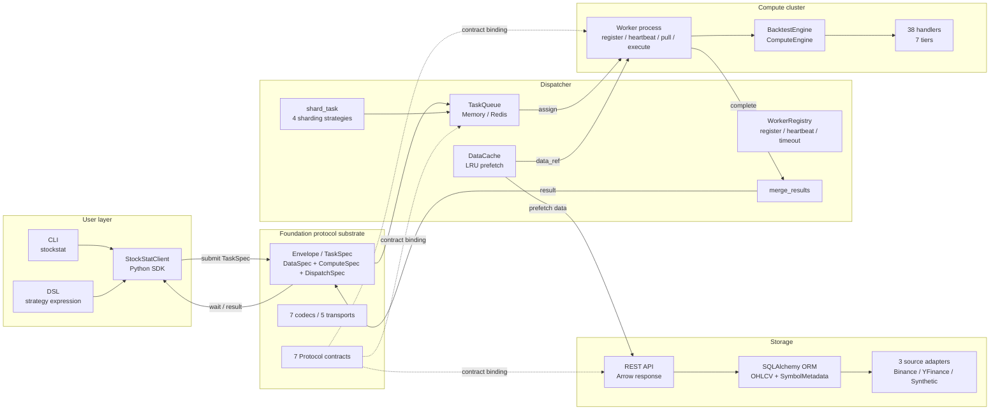
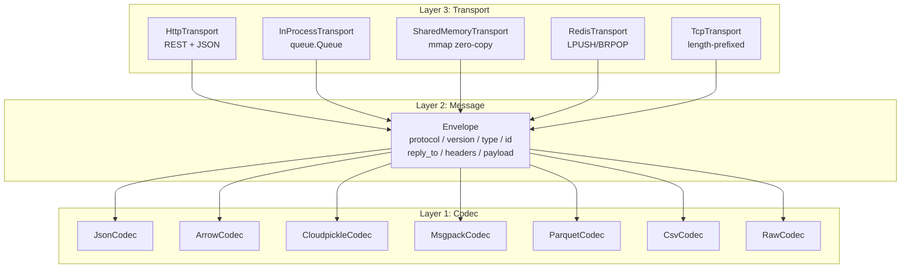
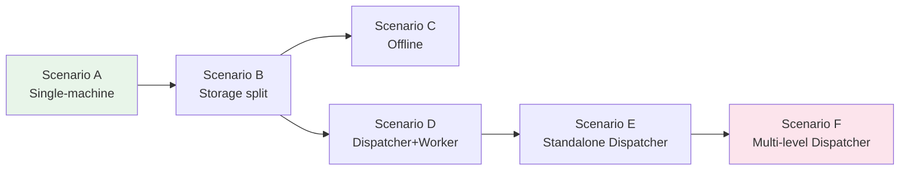

# StockStat V3.1 — Programmable Financial Statistics Platform

> **Version**: v3.1 (complete rewrite) | **Test baseline**: 882 passed + 1 skipped | **Handlers**: 38 atomic compute tasks
> **Architecture**: Invocation—Dispatcher—{Storage, N×Compute} separable deployment

StockStat is a **programmable statistical computing platform** for quantitative finance research. It encapsulates the full research pipeline — from data ingestion, technical indicator computation, and strategy backtesting, to advanced statistical analysis (nonlinear dynamics / signal processing / grey systems / machine learning) — into a unified, programmable, distributable capability substrate. Researchers only need to care about *what* to compute, without worrying about *where* the computation runs, *how* data is moved, or *how* results are returned.

V3.1 is a **complete rewrite** of V3.0. The entire system is split into five independently installable, deployable, and evolvable module packages, unified by a protocol substrate (Foundation) that handles cross-process communication and task dispatch. The 38 computational capabilities commonly needed in research are atomized into independent `task_type`s, each backed by a handler; adding a new capability only requires registering a new handler, without touching the protocol, dispatch, or transport layers. This design allows the platform to continuously absorb new research methods without disrupting the core architecture.

---

## Overall Architecture

The diagram below shows the deployment relationships and data/control flows among the five V3.1 modules. The user initiates calls through the Invocation layer; the task specification (TaskSpec) is encapsulated through the Foundation protocol layer, then distributed by the Dispatcher to one or more Workers for execution. Before dispatching, the Dispatcher prefetches the required data from Storage, so that Storage only needs to be accessed once during the entire computation period.


```mermaid
graph LR
    subgraph User["User layer"]
        U_CLI["CLI<br/>stockstat"]
        U_CLIENT["StockStatClient<br/>Python SDK"]
        U_DSL["DSL<br/>strategy expression"]
    end
    subgraph Found["Foundation protocol substrate"]
        F_ENV["Envelope / TaskSpec<br/>DataSpec + ComputeSpec + DispatchSpec"]
        F_CODEC["7 codecs / 5 transports"]
        F_CONTRACT["7 Protocol contracts"]
    end
    subgraph Disp["Dispatcher"]
        D_QUEUE["TaskQueue<br/>Memory / Redis"]
        D_WORKERS["WorkerRegistry<br/>register / heartbeat / timeout"]
        D_CACHE["DataCache<br/>LRU prefetch"]
        D_SHARD["shard_task<br/>4 sharding strategies"]
        D_MERGE["merge_results"]
    end
    subgraph Stor["Storage"]
        S_ORM["SQLAlchemy ORM<br/>OHLCV + SymbolMetadata"]
        S_REST["REST API<br/>Arrow response"]
        S_ADAPTER["3 source adapters<br/>Binance / YFinance / Synthetic"]
    end
    subgraph Comp["Compute cluster"]
        C_WORKER["Worker process<br/>register / heartbeat / pull / execute"]
        C_ENGINE["BacktestEngine<br/>ComputeEngine"]
        C_HANDLERS["38 handlers<br/>7 tiers"]
    end

    U_CLI --> U_CLIENT
    U_DSL --> U_CLIENT
    U_CLIENT -->|"submit TaskSpec"| F_ENV
    F_ENV --> D_QUEUE
    D_SHARD --> D_QUEUE
    D_CACHE -->|"prefetch data"| S_REST
    S_REST --> S_ORM
    S_ORM --> S_ADAPTER
    D_QUEUE -->|"assign"| C_WORKER
    D_CACHE -->|"data_ref"| C_WORKER
    C_WORKER --> C_ENGINE
    C_ENGINE --> C_HANDLERS
    C_WORKER -->|"complete"| D_MERGE
    D_MERGE -->|"result"| F_ENV
    F_ENV -->|"wait / result"| U_CLIENT
    F_CONTRACT -.->|"contract binding"| D_QUEUE
    F_CONTRACT -.->|"contract binding"| C_WORKER
    F_CONTRACT -.->|"contract binding"| S_REST
```

---

## Core Features

### Five Independent Module Packages

The platform is partitioned into "one protocol substrate + four business modules." Each module is an independent Python package with its own `pyproject.toml`, test suite, and release cycle. Modules interact exclusively through Foundation-defined Protocol contracts — there are no direct business-code dependencies between them.

| Module | Package | Responsibility | Optional deps |
|--------|---------|----------------|---------------|
| **Foundation** | `stockstat-foundation` | Protocol substrate: Envelope / TaskSpec / 7 codecs / 5 transports / 7 Protocol contracts / 13 exceptions / Config | pyarrow, cloudpickle, msgpack, redis |
| **Invocation** | `stockstat` | User entry: StockStatClient / ComputeAPI (40+ indicator methods) / DSL / CLI / visualization / V2 compat | matplotlib |
| **Dispatcher** | `stockstat-dispatcher` | Task scheduling hub: TaskQueue / WorkerRegistry / DataCache / shard_task / merge_results / 14 REST endpoints | redis |
| **Storage** | `stockstat-backend` | Data warehouse: SQLAlchemy ORM / REST API / 3 source adapters / Normalizer / Scheduler / Admin | psycopg2, yfinance |
| **Compute** | `stockstat-compute` | Compute engine: BacktestEngine / ComputeEngine / 38 handlers / Local+Remote+Auto Backend / Worker process | scikit-learn, PyWavelets, nolds |

### 38 Atomic Compute Tasks

The platform decomposes common quantitative-research computational capabilities into 38 independent `task_type`s, organized into 7 tiers by category. Each `task_type` is a self-contained handler that receives a `TaskSpec` and data, then returns a result. The table below also provides a capability-provenance mapping (legend) for tracing each capability's validation scenario.

| Tier | Category | Count | task_type | Provenance mapping (legend) |
|------|----------|-------|-----------|----------|
| 1 | Backtesting | 6 | `indicator` `backtest` `grid_search` `batch_backtest` `monte_carlo` `walkforward` | v5 batch backtest scenario |
| 2 | Classical stat tests | 8 | `correlation` `hypothesis_test` `bootstrap` `permutation_test` `chow_test` `survival_analysis` `ecdf` `multiple_testing` | v1–v6 classical statistics |
| 3 | Signal processing | 5 | `spectral_analysis` `wavelet` `spectral_entropy` `cross_spectrum` `filter_design` | v7 W/E routes |
| 4 | Nonlinear dynamics | 7 | `mutual_information` `transfer_entropy` `hurst_exponent` `sample_entropy` `permutation_entropy` `rqa` `recurrence_plot` | v7 N route |
| 5 | Grey systems | 3 | `grey_relation` `gm11_predict` `grey_cluster` | v7 G route |
| 6 | Machine learning | 7 | `ml_train` `ml_predict` `feature_importance` `walkforward_cv` `clustering` `dimension_reduction` `classification_metrics` | v7 F route |
| 7 | Portfolio risk | 2 | `risk_metrics` `regime_detection` | General portfolio risk |

### Distributed Computing

The Client decouples from the Compute module via the `ComputeBackend` Protocol, supporting three transparently swappable backends. Regardless of which backend is chosen, the user code remains identical — the same API returns immediately in single-machine mode and automatically becomes an async submission in distributed mode:

- **LocalComputeBackend** (default): single-machine full-stack; executes in a background thread; behavior is equivalent to calling the compute engine directly.
- **RemoteComputeBackend**: submits tasks via HTTP to the Dispatcher, which distributes them to a Worker cluster. Suitable for compute-heavy workloads that need horizontal scaling (batch backtests, Monte Carlo, grid search).
- **AutoComputeBackend**: routes automatically by task type and data size. Heavy tasks (`grid_search` / `batch_backtest` / `monte_carlo` / `ml_train`, etc.) go remote; light tasks go local; falls back to local when the remote is unreachable.

### Three-Layer Protocol Stack

All cross-process communication flows through Foundation's three-layer protocol stack. The three layers are mutually independent: swap the transport without touching the message format; swap the codec without touching the transport; swap the message type without touching the codec. This orthogonal design lets the platform flexibly replace communication implementations without breaking existing code.


```mermaid
graph TB
    subgraph "Layer 3: Transport"
        T_HTTP["HttpTransport<br/>REST + JSON"]
        T_MEM["InProcessTransport<br/>queue.Queue"]
        T_SHM["SharedMemoryTransport<br/>mmap zero-copy"]
        T_REDIS["RedisTransport<br/>LPUSH/BRPOP"]
        T_TCP["TcpTransport<br/>length-prefixed"]
    end
    subgraph "Layer 2: Message"
        M_ENV["Envelope<br/>protocol / version / type / id<br/>reply_to / headers / payload"]
    end
    subgraph "Layer 1: Codec"
        C_JSON["JsonCodec"]
        C_ARROW["ArrowCodec"]
        C_PICKLE["CloudpickleCodec"]
        C_MSGPACK["MsgpackCodec"]
        C_PARQUET["ParquetCodec"]
        C_CSV["CsvCodec"]
        C_RAW["RawCodec"]
    end
    T_HTTP --> M_ENV
    T_MEM --> M_ENV
    T_SHM --> M_ENV
    T_REDIS --> M_ENV
    T_TCP --> M_ENV
    M_ENV --> C_JSON
    M_ENV --> C_ARROW
    M_ENV --> C_PICKLE
    M_ENV --> C_MSGPACK
    M_ENV --> C_PARQUET
    M_ENV --> C_CSV
    M_ENV --> C_RAW
```

---

## Project Structure

```
StockStatistic/
├── packages/                          # V3.1 five module packages
│   ├── foundation/                    # stockstat-foundation (protocol substrate)
│   │   ├── pyproject.toml
│   │   ├── stockstat_foundation/
│   │   │   ├── __init__.py            # public API exports
│   │   │   ├── errors.py              # 13 exception classes (AppError + 12 subclasses)
│   │   │   ├── config.py              # Config + 18 env vars
│   │   │   ├── logging.py             # trace_id propagation (contextvars)
│   │   │   ├── contracts/             # 7 Protocol contracts
│   │   │   │   ├── compute.py         #   ComputeBackend / TaskRef / TaskInfo / TaskState
│   │   │   │   ├── transport.py       #   Transport Protocol
│   │   │   │   ├── storage.py         #   StorageBackend Protocol
│   │   │   │   ├── cache.py           #   Cache Protocol
│   │   │   │   ├── codec.py           #   Codec Protocol
│   │   │   │   ├── plugin.py          #   Plugin Protocol
│   │   │   │   ├── renderer.py        #   Renderer Protocol
│   │   │   │   └── events.py          #   Event / EventSubscriber
│   │   │   ├── protocol/              # message layer
│   │   │   │   ├── envelope.py        #   Envelope + Headers
│   │   │   │   ├── messages.py        #   28 message types + TYPE_TO_PATH
│   │   │   │   ├── task.py            #   TaskSpec three-part spec
│   │   │   │   └── retry.py           #   RetryPolicy
│   │   │   ├── codec/                 # 7 codecs
│   │   │   ├── transport/             # 5 transports
│   │   │   ├── plugin/                # PluginRegistry
│   │   │   └── utils/                 # serialization helpers / timing
│   │   └── tests/                     # unit tests
│   │
│   ├── storage/                       # stockstat-backend (storage)
│   │   ├── stockstat_backend/
│   │   │   ├── __init__.py
│   │   │   ├── app.py                 # StorageApp FastAPI factory
│   │   │   ├── cli.py                 # serve / init-db / ingest / list-symbols
│   │   │   ├── models/                # OHLCV + SymbolMetadata ORM
│   │   │   ├── storage/               # ORM wrapper + StorageBackendImpl + QueryCache
│   │   │   ├── api/                   # REST routes (ohlcv / symbols / health / ingest)
│   │   │   ├── adapters/              # Binance / YFinance / Synthetic adapters
│   │   │   ├── normalizer/            # field mapping + timezone alignment
│   │   │   ├── scheduler/             # scheduled collection
│   │   │   └── plugins/admin/         # Admin panel
│   │   └── tests/                     # unit tests
│   │
│   ├── compute/                       # stockstat-compute (compute)
│   │   ├── stockstat_compute/
│   │   │   ├── __init__.py
│   │   │   ├── cli.py                 # worker / list-handlers / hardware
│   │   │   ├── executor.py            # TaskExecutor
│   │   │   ├── register.py            # detect_hardware / get_current_load
│   │   │   ├── checkpoint.py          # CheckpointStore
│   │   │   ├── worker.py              # Worker process (register/heartbeat/pull/execute/return)
│   │   │   ├── backend/               # Local / Remote / Auto ComputeBackend
│   │   │   ├── backtest/              # BacktestEngine (re-implemented)
│   │   │   │   ├── engine.py          #   event-driven bar-by-bar engine
│   │   │   │   ├── result.py          #   BacktestResult / Metrics / Trade
│   │   │   │   ├── strategy.py        #   Strategy / StrategyBase / Signal
│   │   │   │   ├── cost_model.py      #   10 fee models
│   │   │   │   ├── fill_model.py      #   5 fill models + slippage
│   │   │   │   ├── execution_model.py #   next_bar / intrabar
│   │   │   │   ├── broker.py          #   Broker (coordinates Portfolio + Cost + Fill)
│   │   │   │   ├── portfolio.py       #   Portfolio / Position
│   │   │   │   ├── metrics.py         #   18 backtest metrics
│   │   │   │   ├── batch_runner.py    #   batch backtest
│   │   │   │   ├── grid_search.py     #   grid search
│   │   │   │   ├── montecarlo.py      #   Monte Carlo engine
│   │   │   │   └── walkforward.py     #   walk-forward validation
│   │   │   ├── compute_engine/        # ComputeEngine + IndicatorRegistry
│   │   │   ├── indicators/            # 40+ technical indicators
│   │   │   │   ├── trend.py           #   MA/EMA/WMA/DEMA/TEMA/HMA/MACD/ADX/DPO/TRIX
│   │   │   │   ├── oscillator.py      #   RSI/KD/Williams%R/CCI/STOCH
│   │   │   │   ├── volatility.py      #   Bollinger/ATR/Keltner/Donchian/StdDev
│   │   │   │   ├── statistics.py      #   rolling_corr/beta/zscore/percentile
│   │   │   │   └── nonlinear.py       #   hurst_rs/sample_entropy/permutation_entropy
│   │   │   └── handlers/              # 38 task_type handlers
│   │   │       ├── _base.py           #   Stream / register / dispatch
│   │   │       ├── backtest/          #   Tier 1 (6)
│   │   │       ├── stats/             #   Tier 2 (8)
│   │   │       ├── signal/            #   Tier 3 (5)
│   │   │       ├── nonlinear/         #   Tier 4 (7)
│   │   │       ├── grey/              #   Tier 5 (3)
│   │   │       ├── ml/                #   Tier 6 (7)
│   │   │       └── portfolio/         #   Tier 7 (2)
│   │   └── tests/                     # unit tests
│   │
│   ├── invocation/                    # stockstat (user entry)
│   │   ├── stockstat/
│   │   │   ├── __init__.py
│   │   │   ├── client.py              # StockStatClient (pure caller)
│   │   │   ├── compute_api.py         # ComputeAPI (40+ indicator methods + remote)
│   │   │   ├── _compat.py             # V2 legacy API migration helper
│   │   │   ├── data_access/           # DataClient (HTTP access to Storage)
│   │   │   ├── dsl/                   # DSL engine (parser + evaluator)
│   │   │   ├── app/                   # CLI (7 command groups)
│   │   │   ├── export/                # ResultSerializer (JSON/CSV/Arrow/Parquet)
│   │   │   ├── _viz/                  # ChartSpec + MatplotlibRenderer
│   │   │   └── plot/                  # plot_equity_curve / plot_drawdown
│   │   └── tests/                     # unit tests
│   │
│   └── dispatcher/                    # stockstat-dispatcher (dispatch)
│       ├── stockstat_dispatcher/
│       │   ├── __init__.py
│       │   ├── core.py                # Dispatcher main body
│       │   ├── queue.py               # MemoryTaskQueue / RedisTaskQueue
│       │   ├── workers.py             # WorkerRegistry / WorkerRecord
│       │   ├── prefetch.py            # DataCache (LRU + hit rate)
│       │   ├── shard.py               # shard_task (4 strategies)
│       │   ├── merge.py               # merge_results
│       │   ├── routes.py              # 14 REST endpoints
│       │   ├── plugin.py              # DispatcherPlugin (mount on Storage)
│       │   ├── app.py                 # DispatcherApp (standalone deployment)
│       │   ├── cluster.py             # multi-level Dispatcher topology
│       │   ├── autoscaler.py          # Autoscaler metrics
│       │   ├── history.py             # task history
│       │   └── cli.py                 # serve / cluster
│       └── tests/                     # unit tests
│
├── tests/                             # demo tests + chart generation
│   ├── conftest.py
│   ├── generate_all_plots.py          # generates 12 demo charts
│   ├── test_demo_indicators.py        # indicators + 3 charts
│   ├── test_demo_backtest.py          # backtest + 2 charts
│   ├── test_demo_advanced.py          # Tier 2-7 + 7 charts
│   └── test_demo_distributed.py       # distributed E2E
│
├── docs/                              # user docs
│   ├── USAGE_CN.md                    # usage guide (Chinese)
│   ├── USAGE.md                       # usage guide (English)
│   └── images/                        # demo charts (12 PNGs)
│
├── V31design/                         # design docs + implementation reports
│   ├── designV31/                     # architecture design (8 docs)
│   └── realizeV31/                    # phased implementation plans + P{N}_REPORT.md
│
├── README_CN.md / README.md           # project readme
├── DESIGN_CN.md / DESIGN.md           # architecture design
└── LICENSE                            # GPLv3
```

---

## Quick Start

### Installation

V3.1 uses multi-package publishing. The most common approach is editable installation — installing the five module packages in editable mode so changes take effect immediately. If you only use it as a library, installing the `invocation` package suffices; it will automatically pull in the necessary dependencies.

```bash
# Option 1: editable install of all five modules (recommended for contributors)
pip install -e packages/foundation
pip install -e packages/storage
pip install -e packages/compute
pip install -e packages/invocation
pip install -e packages/dispatcher

# Option 2: user install (entry package only; pulls in deps automatically)
pip install -e packages/invocation

# Optional extras: enable as needed
pip install -e packages/storage[postgres]     # PostgreSQL driver
pip install -e packages/compute[ml]           # scikit-learn + xgboost
pip install -e packages/compute[signal]       # PyWavelets (wavelet transform)
pip install -e packages/compute[nonlinear]    # nolds (nonlinear analysis)
pip install -e packages/foundation[redis]     # Redis transport
pip install -e packages/foundation[msgpack]   # Msgpack codec
pip install matplotlib                         # visualization
```

> When optional dependencies are missing, the affected features degrade gracefully. For example, without PyWavelets installed, the `wavelet` handler automatically falls back to a self-implemented Morlet CWT; without redis, `RedisTransport` raises a clear `ImportError` with installation instructions. This ensures core functionality always works under minimal dependencies.

### Verify Installation

```python
import stockstat_foundation, stockstat_compute, stockstat_backend
import stockstat_dispatcher, stockstat
print("All V3.1 packages OK")
print("Foundation:", stockstat_foundation.__version__)
print("Handlers:", len(stockstat_compute.ALL_TASK_TYPES))  # 38
```

### Single-Machine Full-Stack (Scenario A, default)

In a single-machine scenario, no services need to be started. `StockStatClient()` defaults to `LocalComputeBackend`; all computation happens in-process, and the API is identical to the distributed mode:

```python
from stockstat import StockStatClient
from stockstat_compute import Signal

client = StockStatClient()

# Compute technical indicators
sma = client.compute.ma(data.close, window=20)
rsi = client.compute.rsi(data.close, window=14)

# Backtest
def buy_and_hold(i, bar, data, ctx):
    if i == 0:
        return Signal(timestamp=bar["timestamp"], symbol="TEST", side="buy")
    return None

result = client.backtest(data, buy_and_hold, initial_cash=10000)
print(result.summary())
# BacktestResult(strategy='backtest', symbol='TEST')
#   total_return: 105.79%
#   sharpe: 0.627
#   max_drawdown: -27.84%
#   n_trades: 1
#   final_equity: 20579.07
```

### Distributed Deployment (Scenario E)

When the compute scale exceeds a single machine, Storage, Dispatcher, and Worker can be deployed to separate nodes. The Client only needs to switch `compute_backend` to `RemoteComputeBackend`; the rest of the code stays unchanged:

```bash
# Terminal 1: start Storage service
stockstat-backend serve --host 0.0.0.0 --port 8000

# Terminal 2: start Dispatcher (standalone process)
stockstat-dispatcher serve \
    --storage-url http://localhost:8000 \
    --listen 0.0.0.0:9000

# Terminal 3: start Worker (can launch multiple)
stockstat-compute worker \
    --dispatcher-url http://localhost:9000 \
    --concurrency 8 \
    --alias "compute-node-1"
```

```python
from stockstat import StockStatClient
from stockstat_compute.backend.remote import RemoteComputeBackend

client = StockStatClient(
    storage_url="http://localhost:8000",
    compute_backend=RemoteComputeBackend("http://localhost:9000"),
)

# Transparent sync: API is identical to single-machine
result = client.backtest(data, strategy, initial_cash=10000)

# Explicit async: returns TaskRef, can poll or wait
task = client.compute.remote("grid_search", data=data,
    compute_spec=ComputeSpec(
        task_type="grid_search",
        param_grid={"short": [3, 5, 8], "long": [10, 20, 30]},
        metric="sharpe",
    ))
print(task.id, task.status)  # UUID + "pending"
result = task.wait(timeout=3600)
```

---

## Deployment Scenarios

V3.1 supports six deployment scenarios, from single-machine to multi-level clusters, covering all needs from development to production. The scenarios are progressive — starting from A, you can split out Storage, Dispatcher, or Worker as needed to evolve to higher levels.

| Scenario | Client | Dispatcher | Storage | Worker | Use case |
|----------|--------|-----------|---------|--------|----------|
| **A** Single-machine | in-process | — | — | — | Dev / research |
| **B** Storage split | remote HTTP | — | standalone | Client local | Shared team data |
| **C** Offline | local | — | local | Client local | No-network env |
| **D** Dispatcher+Worker | remote HTTP | co-located w/ Storage | standalone | remote | Small cluster |
| **E** Standalone Dispatcher | remote HTTP | standalone | standalone | multi-node | Production cluster |
| **F** Multi-level Dispatcher | remote HTTP | parent+child | standalone | multi-level | Large-scale cluster |


```mermaid
graph LR
    A["Scenario A<br/>Single-machine"] --> B["Scenario B<br/>Storage split"]
    B --> C["Scenario C<br/>Offline"]
    B --> D["Scenario D<br/>Dispatcher+Worker"]
    D --> E["Scenario E<br/>Standalone Dispatcher"]
    E --> F["Scenario F<br/>Multi-level Dispatcher"]
    style A fill:#e8f5e9
    style F fill:#fce4ec
```

For specific startup commands and Client configuration per scenario, see [Usage Guide §17 Deployment Scenarios](docs/USAGE.md#17-deployment-scenarios).

---

## Demo Charts

The following charts are generated by `tests/generate_all_plots.py` (synthetic data) and showcase the output capabilities of each V3.1 module:

<details open>
<summary><b>Technical Indicators</b></summary>

| Close + MA + Bollinger | RSI overbought/oversold |
|:---:|:---:|
|  |  |

| MACD histogram + signal line |
|:---:|
|  |

</details>

<details open>
<summary><b>Backtesting</b></summary>

| Equity curve + drawdown | Batch backtest Sharpe comparison |
|:---:|:---:|
|  |  |

</details>

<details open>
<summary><b>Statistical Analysis</b></summary>

| Correlation scatter (Pearson r + fit line) |
|:---:|
|  |

</details>

<details open>
<summary><b>Signal Processing</b></summary>

| Welch PSD | Wavelet time-frequency heatmap (CWT) |
|:---:|:---:|
|  |  |

</details>

<details open>
<summary><b>Nonlinear Dynamics</b></summary>

| Hurst DFA fit | Recurrence Plot |
|:---:|:---:|
|  |  |

</details>

<details open>
<summary><b>Machine Learning</b></summary>

| K-Means clustering (k=3) | PCA 2D reduction |
|:---:|:---:|
|  |  |

</details>

---

## Running Tests

```bash
# Generate demo charts (12 PNGs)
python tests/generate_all_plots.py

# Demo tests (chart generation + functional verification)
python -m pytest tests/ -v                # 117 tests

# Per-package unit tests
python -m pytest packages/foundation/tests/ -v   # 184 tests
python -m pytest packages/storage/tests/ -v      # 98 tests + 1 skipped
python -m pytest packages/compute/tests/ -v      # 235 tests
python -m pytest packages/invocation/tests/ -v   # 119 tests
python -m pytest packages/dispatcher/tests/ -v   # 129 tests
```

**Total: 882 tests passed + 1 skipped** (yfinance is an optional dependency; its tests are skipped when not installed).

---

## Documentation

| Document | Description |
|----------|-------------|
| [Usage Guide (Chinese)](docs/USAGE_CN.md) | Detailed usage guide covering all APIs, CLI, REST endpoints, each with examples and explanations |
| [Usage Guide (English)](docs/USAGE.md) | English usage guide |
| [Architecture Design (Chinese)](DESIGN_CN.md) | V3.1 complete architecture design (with mermaid diagrams and key data flows) |
| [Architecture Design (English)](DESIGN.md) | English architecture design document |
| [V31design/](V31design/) | Complete design docs + phased implementation reports (9 P{N}_REPORT.md files) |

---

## License

This project is open-sourced under the **GNU General Public License v3.0** — see [LICENSE](LICENSE).

Copyright (C) 2026 RESBI

## Disclaimer

This software is for **educational and research purposes only** and does **not** constitute any financial, investment, or trading advice. Users are solely responsible for their own investment decisions and should consult a qualified financial professional before making any investment.

## Acknowledgements

The development of this project was assisted by **GLM-5.2** (provided by Zhipu AI), including code implementation, architecture design, and documentation. The final content has been reviewed and is maintained by the author.
