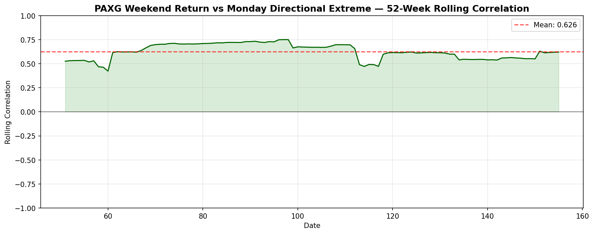

# StockStat — 可编程金融标的统计计算平台

用户可编程的股票/加密货币统计计算平台，存储后端与计算前端分离。

## 快速开始

### 方式 A：本地开发（SQLite，无需 Docker）

```bash
# 1. 安装后端
cd backend
pip install -e .

# 2.（可选）开启代理以访问真实数据源
export STOCKSTAT_PROXY_ENABLED=true
export STOCKSTAT_PROXY_TYPE=http
export STOCKSTAT_PROXY_URL=http://127.0.0.1:8889

# 3. 启动 API 服务
python -m uvicorn stockstat_backend.app:app --host 0.0.0.0 --port 8000

# 4. 安装前端库（另一个终端）
cd frontend
pip install -e .
```

### 方式 B：Docker（生产部署）

```bash
docker compose up -d
# API 可通过 http://localhost:8000 访问
```

## 代理配置

后端支持 HTTP/SOCKS5 代理访问真实数据源。**默认关闭**。

| 环境变量 | 默认值 | 说明 |
|----------|--------|------|
| `STOCKSTAT_PROXY_ENABLED` | `false` | 是否启用代理 |
| `STOCKSTAT_PROXY_TYPE` | `http` | 代理类型：`http` 或 `socks5` |
| `STOCKSTAT_PROXY_URL` | 按类型自动 | HTTP: `http://127.0.0.1:8889`，SOCKS5: `socks5://127.0.0.1:1089` |

```bash
# HTTP 代理（默认地址）
export STOCKSTAT_PROXY_ENABLED=true
export STOCKSTAT_PROXY_TYPE=http

# SOCKS5 代理（默认地址）
export STOCKSTAT_PROXY_ENABLED=true
export STOCKSTAT_PROXY_TYPE=socks5

# 自定义代理
export STOCKSTAT_PROXY_ENABLED=true
export STOCKSTAT_PROXY_URL=http://192.168.1.100:8080
```

## 使用方式

### 1. 采集数据

```python
from stockstat import StockStatClient

client = StockStatClient(host="localhost", port=8000)

# 股票数据（Yahoo Finance）
client.ingest("AAPL", source="yfinance", start="2024-01-01", end="2024-12-31")
client.ingest("^GSPC", source="yfinance", start="2023-01-01", end="2024-12-31")

# 加密货币数据（Binance）
client.ingest("BTC/USDT", source="binance", start="2024-01-01", end="2024-12-31")
client.ingest("ETH/USDT", source="binance", start="2024-01-01", end="2024-12-31")
client.ingest("PAXG/USDT", source="binance", start="2022-01-01", end="2024-12-31")

# 自动检测数据源（股票→yfinance，加密货币→binance）
client.ingest("MSFT", start="2024-01-01", end="2024-06-30")
```

### 2. 查询 OHLCV 数据

```python
data = client.ohlcv("AAPL", start="2024-01-01", timeframe="1d")
#                    open    high     low   close     volume
# ts
# 2024-01-02  187.15  188.44  183.89  184.25  82488700
# 2024-01-03  184.22  185.88  183.43  184.40  58414500
```

### 3. 计算指标

```python
sma = client.compute.ma(data.close, window=20)
rsi = client.compute.rsi(data.close, window=14)
upper, mid, lower = client.compute.bollinger(data.close, window=20, k=2.0)
beta = client.compute.beta(asset_returns, benchmark_returns, window=60)
sharpe = client.compute.sharpe(returns, risk_free=0.02, annualize=True)
dd = client.compute.max_drawdown(data.close)
```

### 4. DSL 查询

```python
result = client.run_dsl('''
    SELECT close, ma(close, 20) AS ma20, rsi(close, 14) AS rsi
    FROM ohlcv("BTC/USDT", "1d", "2024-01-01", "2024-12-31")
    LIMIT 30
''')
```

## matplotlib 可视化

核心库**零硬依赖** matplotlib。可选安装：

```bash
pip install -e "frontend/[matplotlib]"
```

### 协议化绘图

```python
spec = client.plot.spec(
    title="BTC Close + MA20",
    x_label="日期", y_label="价格",
    series=[
        {"name": "close", "data": data.close, "kind": "line"},
        {"name": "ma20", "data": data.close.rolling(20).mean(), "kind": "line", "color": "red"},
    ],
)
renderer = client.plot.get_renderer()  # 自动检测 matplotlib
renderer.render(spec)
renderer.savefig("btc.png")
```

### 经典统计图表（真实数据生成）

#### 收盘价 + MA + 布林带


#### RSI 超买超卖区域


#### MACD 柱状图 + 信号线


#### 回撤图


#### Beta 散点图（AAPL vs 标普500）


#### BTC vs ETH 滚动相关性


#### 标准化价格对比


### PAXG 周末涨跌 vs 周一方向性极值

核心分析：PAXG（黄金锚定代币）周末涨跌幅（横轴：周五收盘→周日收盘）与周一**方向性极值**（纵轴：按周末方向选取 — 涨取 `(最高-开盘)/开盘`，跌取 `(最低-开盘)/开盘`）。真实数据 2022-2024。

#### 散点图 + 回归线


**结果**：Pearson r = 0.58，p 值 ≈ 0 — 强统计显著正相关。周末上涨 → 周一平均冲高 +0.71%；周末下跌 → 周一平均下探 -0.74%。

#### 按周末涨跌方向分组的平均周一极值


#### 52周滚动相关性


## 数据源

| 数据源 | 类型 | 需联网 | 说明 |
|--------|------|--------|------|
| `yfinance` | 股票 | 是 | Yahoo Finance 直连 API（推荐走代理） |
| `binance` | 加密货币 | 是 | Binance via ccxt（推荐走代理） |
| `coinbase` | 加密货币 | 是 | Coinbase via ccxt（推荐走代理） |
| `synthetic` | 混合 | 否 | 合成数据，用于离线测试 |

## REST API

| 端点 | 方法 | 说明 |
|------|------|------|
| `/api/v1/health` | GET | 健康检查（含代理状态） |
| `/api/v1/proxy` | GET | 查询代理配置 |
| `/api/v1/sources` | GET | 数据源列表 |
| `/api/v1/ingest` | POST | 采集标的数据 |
| `/api/v1/ohlcv` | GET | 查询 OHLCV 数据（json/csv） |
| `/api/v1/symbols` | GET | 已注册符号列表 |

## 运行测试

```bash
# 后端测试（真实数据 + 代理）
cd backend && python -m pytest tests/test_backend.py -v

# 前端单元测试（指标、DSL、可视化）
cd frontend && python -m pytest tests/test_frontend.py -v

# 集成测试（真实数据：经典统计 + PAXG 周末相关性）
cd frontend && python -m pytest tests/test_integration.py -v -s

# matplotlib 图表测试（生成图片到 docs/images/）
cd frontend && python -m pytest tests/test_matplotlib_charts.py -v
```

## 可用指标

| 类别 | 函数 | 说明 |
|------|------|------|
| 趋势 | `ma(x, window)` | 简单移动平均 |
| | `ema(x, window)` | 指数移动平均 |
| | `macd(x, fast, slow, signal)` | MACD（返回3条线） |
| 震荡 | `rsi(x, window)` | 相对强弱指数 |
| | `kdj(high, low, close, window)` | KDJ（返回3条线） |
| 波动 | `std(x, window)` | 滚动标准差 |
| | `atr(high, low, close, window)` | 平均真实波幅 |
| | `bollinger(x, window, k)` | 布林带（返回3条线） |
| 统计 | `corr(x, y)` | Pearson 相关系数 |
| | `beta(asset, benchmark, window)` | 滚动 Beta |
| | `sharpe(returns, risk_free, annualize)` | 夏普比率 |
| | `max_drawdown(close)` | 最大回撤 |
| | `var(returns, confidence)` | 历史在险价值 |
| 变换 | `returns(x)` | 收益率 |
| | `log_returns(x)` | 对数收益率 |

## 文档

- [使用文档](docs/USAGE_CN.md) — 详细示例与预期结果
- [设计报告](docs/DESIGN_CN.md) — 完整架构设计
- [测试报告](reports/TEST_REPORT.md) — 测试结果

## 配置

| 环境变量 | 默认值 | 说明 |
|----------|--------|------|
| `DATABASE_URL` | `sqlite:///stockstat.db` | 数据库连接字符串 |
| `STOCKSTAT_PROXY_ENABLED` | `false` | 启用代理 |
| `STOCKSTAT_PROXY_TYPE` | `http` | `http` 或 `socks5` |
| `STOCKSTAT_PROXY_URL` | 自动 | 代理地址 |
| `STOCKSTAT_HOST` | `localhost` | 前端默认主机 |
| `STOCKSTAT_PORT` | `8000` | 前端默认端口 |

---

## 开源许可证

本项目基于 **GNU General Public License v3.0** 开源 — 详见 [LICENSE](LICENSE) 文件。

Copyright (C) 2026 RESBI

本程序是自由软件：你可以根据自由软件基金会发布的 GNU 通用公共许可证（第3版或更高版本）的条款重新分发和/或修改它。

本程序的发布是希望它能有用，但不提供任何保证；甚至不提供适销性或特定用途适用性的暗示保证。详情请参阅 GNU 通用公共许可证。

---

## 声明

本项目——包括所有源代码、文档、测试用例和图表——均由 **GLM-5.2**（模型 ID：`taitest/glm-5.2`，智谱 AI 驱动的 AI 助手）完整设计、实现和编写。

所有代码通过与用户的迭代对话生成，经自动化测试套件验证，并使用真实市场数据（Yahoo Finance + Binance，通过代理）进行了验证。
