# StockStat V3.1 — 可编程金融统计计算平台

> **版本**：v3.1（完全重构） | **测试基线**：882 项通过 + 1 跳过 | **Handler 数**：38 个原子计算任务
> **架构**：调用—分发—{存储、n×计算}可分离部署

StockStat 是一个面向量化金融研究的**可编程统计计算平台**。它把从数据采集、技术指标计算、策略回测，到高级统计分析（非线性动力学 / 信号处理 / 灰色系统 / 机器学习）的完整研究链路，统一封装成一套可编程、可分布式部署的能力底座。研究者只需要关心"做什么计算"，而不必关心"计算在哪里执行、数据如何搬运、结果如何回传"。

V3.1 在 V3.0 基础上做了**完全重构**。整个系统被拆分为五个可独立安装、独立部署、独立演化的模块包，通过统一的协议底座（Foundation）实现跨进程通信与任务分发。研究中常用的 38 种计算能力被原子化为独立的 `task_type`，每种能力对应一个 handler；新增一种能力只需要注册一个 handler，而无需改动协议层、调度层或传输层。这一设计让平台可以在不触碰核心架构的前提下持续吸收新的研究方法。

---

## 整体架构

下图展示 V3.1 五大模块的部署关系与数据/控制流向。用户通过 Invocation 层发起调用，任务规范（TaskSpec）经由 Foundation 协议层封装后，被 Dispatcher 分发到一个或多个 Worker 执行；Dispatcher 在分发前会从 Storage 预取所需数据，使得 Storage 在整个计算期间只需要被访问一次。

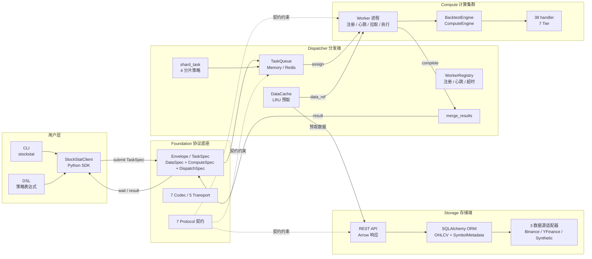
```mermaid
graph LR
    subgraph User["用户层"]
        U_CLI["CLI<br/>stockstat"]
        U_CLIENT["StockStatClient<br/>Python SDK"]
        U_DSL["DSL<br/>策略表达式"]
    end
    subgraph Found["Foundation 协议底座"]
        F_ENV["Envelope / TaskSpec<br/>DataSpec + ComputeSpec + DispatchSpec"]
        F_CODEC["7 Codec / 5 Transport"]
        F_CONTRACT["7 Protocol 契约"]
    end
    subgraph Disp["Dispatcher 分发端"]
        D_QUEUE["TaskQueue<br/>Memory / Redis"]
        D_WORKERS["WorkerRegistry<br/>注册 / 心跳 / 超时"]
        D_CACHE["DataCache<br/>LRU 预取"]
        D_SHARD["shard_task<br/>4 分片策略"]
        D_MERGE["merge_results"]
    end
    subgraph Stor["Storage 存储端"]
        S_ORM["SQLAlchemy ORM<br/>OHLCV + SymbolMetadata"]
        S_REST["REST API<br/>Arrow 响应"]
        S_ADAPTER["3 数据源适配器<br/>Binance / YFinance / Synthetic"]
    end
    subgraph Comp["Compute 计算集群"]
        C_WORKER["Worker 进程<br/>注册 / 心跳 / 拉取 / 执行"]
        C_ENGINE["BacktestEngine<br/>ComputeEngine"]
        C_HANDLERS["38 handler<br/>7 Tier"]
    end

    U_CLI --> U_CLIENT
    U_DSL --> U_CLIENT
    U_CLIENT -->|"submit TaskSpec"| F_ENV
    F_ENV --> D_QUEUE
    D_SHARD --> D_QUEUE
    D_CACHE -->|"预取数据"| S_REST
    S_REST --> S_ORM
    S_ORM --> S_ADAPTER
    D_QUEUE -->|"assign"| C_WORKER
    D_CACHE -->|"data_ref"| C_WORKER
    C_WORKER --> C_ENGINE
    C_ENGINE --> C_HANDLERS
    C_WORKER -->|"complete"| D_MERGE
    D_MERGE -->|"result"| F_ENV
    F_ENV -->|"wait / result"| U_CLIENT
    F_CONTRACT -.->|"契约约束"| D_QUEUE
    F_CONTRACT -.->|"契约约束"| C_WORKER
    F_CONTRACT -.->|"契约约束"| S_REST
```

---

## 核心特性

### 五模块独立包

平台按"协议底座 + 四个业务模块"的方式切分，每个模块都是一个独立的 Python 包，拥有自己的 `pyproject.toml`、测试套件和发布周期。模块之间只通过 Foundation 定义的 Protocol 契约交互，不存在任何直接的业务代码依赖。

| 模块 | 包名 | 职责 | 可选依赖 |
|------|------|------|---------|
| **Foundation** | `stockstat-foundation` | 协议底座：Envelope / TaskSpec / 7 Codec / 5 Transport / 7 Protocol 契约 / 13 异常类 / Config | pyarrow, cloudpickle, msgpack, redis |
| **Invocation** | `stockstat` | 用户入口：StockStatClient / ComputeAPI（40+ 指标方法）/ DSL / CLI / 可视化 / V2 兼容 | matplotlib |
| **Dispatcher** | `stockstat-dispatcher` | 任务调度中枢：TaskQueue / WorkerRegistry / DataCache / shard_task / merge_results / 14 REST 端点 | redis |
| **Storage** | `stockstat-backend` | 数据仓库：SQLAlchemy ORM / REST API / 3 数据源适配器 / Normalizer / Scheduler / Admin | psycopg2, yfinance |
| **Compute** | `stockstat-compute` | 计算引擎：BacktestEngine / ComputeEngine / 38 handler / Local+Remote+Auto Backend / Worker 进程 | scikit-learn, PyWavelets, nolds |

### 38 个原子计算任务

平台将量化研究中常见的计算能力拆分为 38 个独立的 `task_type`，按实现类别分为 7 个 Tier。每个 `task_type` 都是一个自包含的 handler，接收 `TaskSpec` 与数据，返回结果。下表同时给出每个 Tier 的能力来源映射（图例），便于回溯每项能力的验证场景。

| Tier | 类别 | 数量 | task_type | 能力来源映射（图例） |
|------|------|------|-----------|----------|
| 1 | 交易回测 | 6 | `indicator` `backtest` `grid_search` `batch_backtest` `monte_carlo` `walkforward` | v5 批量回测场景 |
| 2 | 经典统计检验 | 8 | `correlation` `hypothesis_test` `bootstrap` `permutation_test` `chow_test` `survival_analysis` `ecdf` `multiple_testing` | v1~v6 经典统计链路 |
| 3 | 信号处理 | 5 | `spectral_analysis` `wavelet` `spectral_entropy` `cross_spectrum` `filter_design` | v7 W/E 路线 |
| 4 | 非线性动力学 | 7 | `mutual_information` `transfer_entropy` `hurst_exponent` `sample_entropy` `permutation_entropy` `rqa` `recurrence_plot` | v7 N 路线 |
| 5 | 灰色系统 | 3 | `grey_relation` `gm11_predict` `grey_cluster` | v7 G 路线 |
| 6 | 机器学习 | 7 | `ml_train` `ml_predict` `feature_importance` `walkforward_cv` `clustering` `dimension_reduction` `classification_metrics` | v7 F 路线 |
| 7 | 组合风险 | 2 | `risk_metrics` `regime_detection` | 通用组合风险 |

### 分布式计算

Client 通过 `ComputeBackend` Protocol 与 Compute 模块解耦，支持三种后端透明切换。无论选择哪种后端，用户代码完全一致——同一套 API，单机下即时返回，分布式下自动变为异步提交：

- **LocalComputeBackend**（默认）：单机全栈，后台线程执行，行为等价于直接调用计算引擎。
- **RemoteComputeBackend**：通过 HTTP 把任务提交到 Dispatcher，由 Dispatcher 分发给 Worker 集群执行。适合需要横向扩展的重型计算（如批量回测、蒙特卡洛、网格搜索）。
- **AutoComputeBackend**：按任务类型与数据规模自动路由。重型任务（`grid_search` / `batch_backtest` / `monte_carlo` / `ml_train` 等）走远程，轻型任务走本地；远程不可达时自动降级到本地。

### 三层协议栈

所有跨进程通信都走 Foundation 的三层协议栈。三层之间相互独立：换传输不动消息格式，换编码不动传输，换消息类型不改编解码。这种正交设计让平台可以在不破坏既有代码的前提下，灵活替换通信实现。

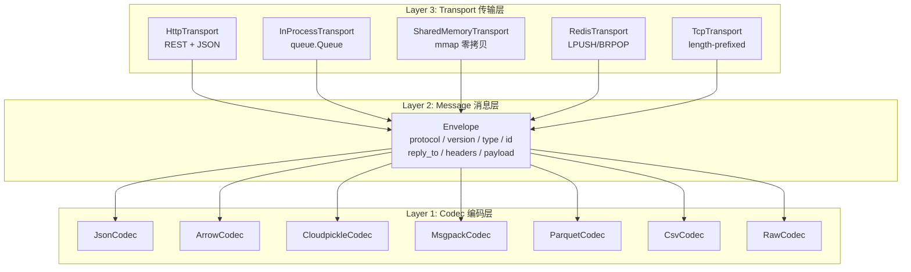
```mermaid
graph TB
    subgraph "Layer 3: Transport 传输层"
        T_HTTP["HttpTransport<br/>REST + JSON"]
        T_MEM["InProcessTransport<br/>queue.Queue"]
        T_SHM["SharedMemoryTransport<br/>mmap 零拷贝"]
        T_REDIS["RedisTransport<br/>LPUSH/BRPOP"]
        T_TCP["TcpTransport<br/>length-prefixed"]
    end
    subgraph "Layer 2: Message 消息层"
        M_ENV["Envelope<br/>protocol / version / type / id<br/>reply_to / headers / payload"]
    end
    subgraph "Layer 1: Codec 编码层"
        C_JSON["JsonCodec"]
        C_ARROW["ArrowCodec"]
        C_PICKLE["CloudpickleCodec"]
        C_MSGPACK["MsgpackCodec"]
        C_PARQUET["ParquetCodec"]
        C_CSV["CsvCodec"]
        C_RAW["RawCodec"]
    end
    T_HTTP --> M_ENV
    T_MEM --> M_ENV
    T_SHM --> M_ENV
    T_REDIS --> M_ENV
    T_TCP --> M_ENV
    M_ENV --> C_JSON
    M_ENV --> C_ARROW
    M_ENV --> C_PICKLE
    M_ENV --> C_MSGPACK
    M_ENV --> C_PARQUET
    M_ENV --> C_CSV
    M_ENV --> C_RAW
```

---

## 项目结构

```
StockStatistic/
├── packages/                          # V3.1 五大模块包
│   ├── foundation/                    # stockstat-foundation（协议底座）
│   │   ├── pyproject.toml
│   │   ├── stockstat_foundation/
│   │   │   ├── __init__.py            # 公共 API 导出
│   │   │   ├── errors.py              # 13 个异常类（AppError + 12 子类）
│   │   │   ├── config.py              # Config + 18 环境变量
│   │   │   ├── logging.py             # trace_id 透传（contextvars）
│   │   │   ├── contracts/             # 7 个 Protocol 契约
│   │   │   │   ├── compute.py         #   ComputeBackend / TaskRef / TaskInfo / TaskState
│   │   │   │   ├── transport.py       #   Transport Protocol
│   │   │   │   ├── storage.py         #   StorageBackend Protocol
│   │   │   │   ├── cache.py           #   Cache Protocol
│   │   │   │   ├── codec.py           #   Codec Protocol
│   │   │   │   ├── plugin.py          #   Plugin Protocol
│   │   │   │   ├── renderer.py        #   Renderer Protocol
│   │   │   │   └── events.py          #   Event / EventSubscriber
│   │   │   ├── protocol/              # 消息层
│   │   │   │   ├── envelope.py        #   Envelope + Headers
│   │   │   │   ├── messages.py        #   28 消息类型 + TYPE_TO_PATH
│   │   │   │   ├── task.py            #   TaskSpec 三段式
│   │   │   │   └── retry.py           #   RetryPolicy
│   │   │   ├── codec/                 # 7 个 Codec
│   │   │   ├── transport/             # 5 种 Transport
│   │   │   ├── plugin/                # PluginRegistry
│   │   │   └── utils/                 # 序列化辅助 / 计时
│   │   └── tests/                     # 单元测试
│   │
│   ├── storage/                       # stockstat-backend（存储端）
│   │   ├── stockstat_backend/
│   │   │   ├── __init__.py
│   │   │   ├── app.py                 # StorageApp FastAPI 工厂
│   │   │   ├── cli.py                 # serve / init-db / ingest / list-symbols
│   │   │   ├── models/                # OHLCV + SymbolMetadata ORM
│   │   │   ├── storage/               # ORM 封装 + StorageBackendImpl + QueryCache
│   │   │   ├── api/                   # REST 路由（ohlcv / symbols / health / ingest）
│   │   │   ├── adapters/              # Binance / YFinance / Synthetic 适配器
│   │   │   ├── normalizer/            # 字段映射 + 时区对齐
│   │   │   ├── scheduler/             # 定时采集
│   │   │   └── plugins/admin/         # Admin 管理面板
│   │   └── tests/                     # 单元测试
│   │
│   ├── compute/                       # stockstat-compute（计算端）
│   │   ├── stockstat_compute/
│   │   │   ├── __init__.py
│   │   │   ├── cli.py                 # worker / list-handlers / hardware
│   │   │   ├── executor.py            # TaskExecutor
│   │   │   ├── register.py            # detect_hardware / get_current_load
│   │   │   ├── checkpoint.py          # CheckpointStore
│   │   │   ├── worker.py              # Worker 进程（注册/心跳/拉取/执行/回传）
│   │   │   ├── backend/               # Local / Remote / Auto ComputeBackend
│   │   │   ├── backtest/              # BacktestEngine（重新实现）
│   │   │   │   ├── engine.py          #   事件驱动 bar-by-bar 引擎
│   │   │   │   ├── result.py          #   BacktestResult / Metrics / Trade
│   │   │   │   ├── strategy.py        #   Strategy / StrategyBase / Signal
│   │   │   │   ├── cost_model.py      #   10 个费率模型
│   │   │   │   ├── fill_model.py      #   5 种成交模型 + 滑点
│   │   │   │   ├── execution_model.py #   next_bar / intrabar
│   │   │   │   ├── broker.py          #   Broker（协调 Portfolio + Cost + Fill）
│   │   │   │   ├── portfolio.py       #   Portfolio / Position
│   │   │   │   ├── metrics.py         #   18 项回测指标
│   │   │   │   ├── batch_runner.py    #   批量回测
│   │   │   │   ├── grid_search.py     #   网格搜索
│   │   │   │   ├── montecarlo.py      #   蒙特卡洛引擎
│   │   │   │   └── walkforward.py     #   前向验证
│   │   │   ├── compute_engine/        # ComputeEngine + IndicatorRegistry
│   │   │   ├── indicators/            # 40+ 技术指标
│   │   │   │   ├── trend.py           #   MA/EMA/WMA/DEMA/TEMA/HMA/MACD/ADX/DPO/TRIX
│   │   │   │   ├── oscillator.py      #   RSI/KD/Williams%R/CCI/STOCH
│   │   │   │   ├── volatility.py      #   Bollinger/ATR/Keltner/Donchian/StdDev
│   │   │   │   ├── statistics.py      #   rolling_corr/beta/zscore/percentile
│   │   │   │   └── nonlinear.py       #   hurst_rs/sample_entropy/permutation_entropy
│   │   │   └── handlers/              # 38 个 task_type handler
│   │   │       ├── _base.py           #   Stream / register / dispatch
│   │   │       ├── backtest/          #   Tier 1（6 个）
│   │   │       ├── stats/             #   Tier 2（8 个）
│   │   │       ├── signal/            #   Tier 3（5 个）
│   │   │       ├── nonlinear/         #   Tier 4（7 个）
│   │   │       ├── grey/              #   Tier 5（3 个）
│   │   │       ├── ml/                #   Tier 6（7 个）
│   │   │       └── portfolio/         #   Tier 7（2 个）
│   │   └── tests/                     # 单元测试
│   │
│   ├── invocation/                    # stockstat（用户入口）
│   │   ├── stockstat/
│   │   │   ├── __init__.py
│   │   │   ├── client.py              # StockStatClient（纯调用者）
│   │   │   ├── compute_api.py         # ComputeAPI（40+ 指标方法 + remote）
│   │   │   ├── _compat.py             # V2 旧 API 迁移辅助
│   │   │   ├── data_access/           # DataClient（HTTP 访问 Storage）
│   │   │   ├── dsl/                   # DSL 引擎（parser + evaluator）
│   │   │   ├── app/                   # CLI（7 组命令）
│   │   │   ├── export/                # ResultSerializer（JSON/CSV/Arrow/Parquet）
│   │   │   ├── _viz/                  # ChartSpec + MatplotlibRenderer
│   │   │   └── plot/                  # plot_equity_curve / plot_drawdown
│   │   └── tests/                     # 单元测试
│   │
│   └── dispatcher/                    # stockstat-dispatcher（分发端）
│       ├── stockstat_dispatcher/
│       │   ├── __init__.py
│       │   ├── core.py                # Dispatcher 主体
│       │   ├── queue.py               # MemoryTaskQueue / RedisTaskQueue
│       │   ├── workers.py             # WorkerRegistry / WorkerRecord
│       │   ├── prefetch.py            # DataCache（LRU + 命中率）
│       │   ├── shard.py               # shard_task（4 策略）
│       │   ├── merge.py               # merge_results
│       │   ├── routes.py              # 14 个 REST 端点
│       │   ├── plugin.py              # DispatcherPlugin（挂载到 Storage）
│       │   ├── app.py                 # DispatcherApp（独立部署）
│       │   ├── cluster.py             # 多级 Dispatcher 拓扑
│       │   ├── autoscaler.py          # Autoscaler 指标
│       │   ├── history.py             # 任务历史
│       │   └── cli.py                 # serve / cluster
│       └── tests/                     # 单元测试
│
├── tests/                             # 演示测试 + 图表生成
│   ├── conftest.py
│   ├── generate_all_plots.py          # 生成 12 张演示图表
│   ├── test_demo_indicators.py        # 指标 + 3 图表
│   ├── test_demo_backtest.py          # 回测 + 2 图表
│   ├── test_demo_advanced.py          # Tier 2-7 + 7 图表
│   └── test_demo_distributed.py       # 分布式 E2E
│
├── docs/                              # 用户文档
│   ├── USAGE_CN.md                    # 使用文档（中文）
│   ├── USAGE.md                       # 使用文档（英文）
│   └── images/                        # 演示图表（12 张 PNG）
│
├── V31design/                         # 设计文档 + 实现报告
│   ├── designV31/                     # 架构设计（8 份）
│   └── realizeV31/                    # 分步实现规划 + P{N}_REPORT.md
│
├── README_CN.md / README.md           # 项目说明
├── DESIGN_CN.md / DESIGN.md           # 架构设计
└── LICENSE                            # GPLv3
```

---

## 快速开始

### 安装

V3.1 采用多包发布。最常见的方式是开发安装——把五个模块包以可编辑模式装进当前环境。如果只作为库使用，安装 `invocation` 包即可，它会自动拉取必要的依赖。

```bash
# 方式一：开发安装（五大模块，推荐贡献者使用）
pip install -e packages/foundation
pip install -e packages/storage
pip install -e packages/compute
pip install -e packages/invocation
pip install -e packages/dispatcher

# 方式二：用户安装（仅用户入口，自动拉取依赖）
pip install -e packages/invocation

# 可选 extras：按需启用
pip install -e packages/storage[postgres]     # PostgreSQL 驱动
pip install -e packages/compute[ml]           # scikit-learn + xgboost
pip install -e packages/compute[signal]       # PyWavelets（小波变换）
pip install -e packages/compute[nonlinear]    # nolds（非线性分析）
pip install -e packages/foundation[redis]     # Redis 传输
pip install -e packages/foundation[msgpack]   # Msgpack 编码
pip install matplotlib                         # 可视化
```

> 未安装可选依赖时相关功能会优雅降级。例如 PyWavelets 未安装时，`wavelet` handler 自动 fallback 为自实现的 Morlet CWT；redis 未安装时 `RedisTransport` 抛出清晰的 `ImportError` 并提示安装命令。这保证核心功能在最小依赖下始终可用。

### 验证安装

```python
import stockstat_foundation, stockstat_compute, stockstat_backend
import stockstat_dispatcher, stockstat
print("All V3.1 packages OK")
print("Foundation:", stockstat_foundation.__version__)
print("Handlers:", len(stockstat_compute.ALL_TASK_TYPES))  # 38
```

### 单机全栈（场景 A，默认）

单机场景下无需启动任何服务。`StockStatClient()` 默认使用 `LocalComputeBackend`，所有计算在进程内完成，API 与分布式模式完全一致：

```python
from stockstat import StockStatClient
from stockstat_compute import Signal

client = StockStatClient()

# 计算技术指标
sma = client.compute.ma(data.close, window=20)
rsi = client.compute.rsi(data.close, window=14)

# 回测
def buy_and_hold(i, bar, data, ctx):
    if i == 0:
        return Signal(timestamp=bar["timestamp"], symbol="TEST", side="buy")
    return None

result = client.backtest(data, buy_and_hold, initial_cash=10000)
print(result.summary())
# BacktestResult(strategy='backtest', symbol='TEST')
#   total_return: 105.79%
#   sharpe: 0.627
#   max_drawdown: -27.84%
#   n_trades: 1
#   final_equity: 20579.07
```

### 分布式部署（场景 E）

当计算规模超出单机能力时，可以把 Storage、Dispatcher、Worker 分别部署到不同节点。Client 只需把 `compute_backend` 切换为 `RemoteComputeBackend`，其余代码一字不改：

```bash
# Terminal 1: 启动 Storage 服务
stockstat-backend serve --host 0.0.0.0 --port 8000

# Terminal 2: 启动 Dispatcher（独立进程）
stockstat-dispatcher serve \
    --storage-url http://localhost:8000 \
    --listen 0.0.0.0:9000

# Terminal 3: 启动 Worker（可启动多个）
stockstat-compute worker \
    --dispatcher-url http://localhost:9000 \
    --concurrency 8 \
    --alias "compute-node-1"
```

```python
from stockstat import StockStatClient
from stockstat_compute.backend.remote import RemoteComputeBackend

client = StockStatClient(
    storage_url="http://localhost:8000",
    compute_backend=RemoteComputeBackend("http://localhost:9000"),
)

# 透明同步：API 与单机完全一致
result = client.backtest(data, strategy, initial_cash=10000)

# 显式异步：返回 TaskRef，可轮询或等待
task = client.compute.remote("grid_search", data=data,
    compute_spec=ComputeSpec(
        task_type="grid_search",
        param_grid={"short": [3, 5, 8], "long": [10, 20, 30]},
        metric="sharpe",
    ))
print(task.id, task.status)  # UUID + "pending"
result = task.wait(timeout=3600)
```

---

## 部署场景

V3.1 支持六种部署场景，从单机到多级集群，覆盖开发到生产的全部需求。场景之间是渐进关系——从 A 出发，按需拆出 Storage、Dispatcher、Worker 即可演进到更高级别。

| 场景 | Client | Dispatcher | Storage | Worker | 适用 |
|------|--------|-----------|---------|--------|------|
| **A** 单机全栈 | 同进程 | — | — | — | 开发 / 研究 |
| **B** 存储分离 | 远程HTTP | — | 独立 | Client本地 | 团队共享数据 |
| **C** 离线 | 本地 | — | 本地 | Client本地 | 无网络环境 |
| **D** Dispatcher+Worker | 远程HTTP | Storage同机 | 独立 | 远程 | 小型集群 |
| **E** 独立Dispatcher | 远程HTTP | 独立 | 独立 | 多节点 | 生产集群 |
| **F** 多级Dispatcher | 远程HTTP | 主+子 | 独立 | 多级 | 大规模集群 |

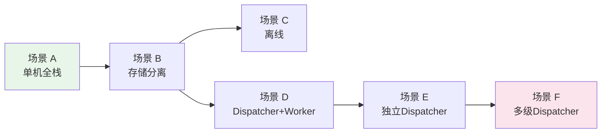
```mermaid
graph LR
    A["场景 A<br/>单机全栈"] --> B["场景 B<br/>存储分离"]
    B --> C["场景 C<br/>离线"]
    B --> D["场景 D<br/>Dispatcher+Worker"]
    D --> E["场景 E<br/>独立Dispatcher"]
    E --> F["场景 F<br/>多级Dispatcher"]
    style A fill:#e8f5e9
    style F fill:#fce4ec
```

各场景的具体启动命令与 Client 配置见 [使用文档 §17 部署场景](docs/USAGE_CN.md#17-部署场景)。

---

## 演示图表

以下图表由 `tests/generate_all_plots.py` 生成（合成数据），展示了 V3.1 各模块的输出能力：

<details open>
<summary><b>技术指标</b></summary>

| 收盘价 + MA + 布林带 | RSI 超买超卖 |
|:---:|:---:|
| 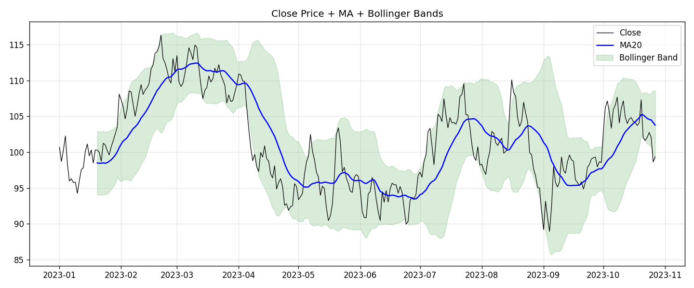 | 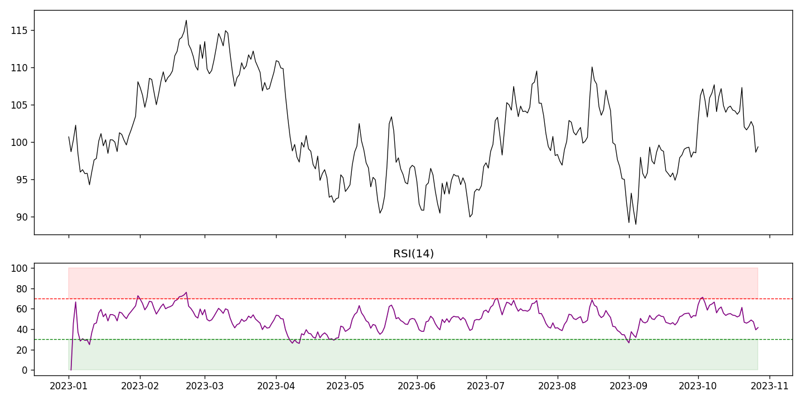 |

| MACD 柱状图 + 信号线 |
|:---:|
| 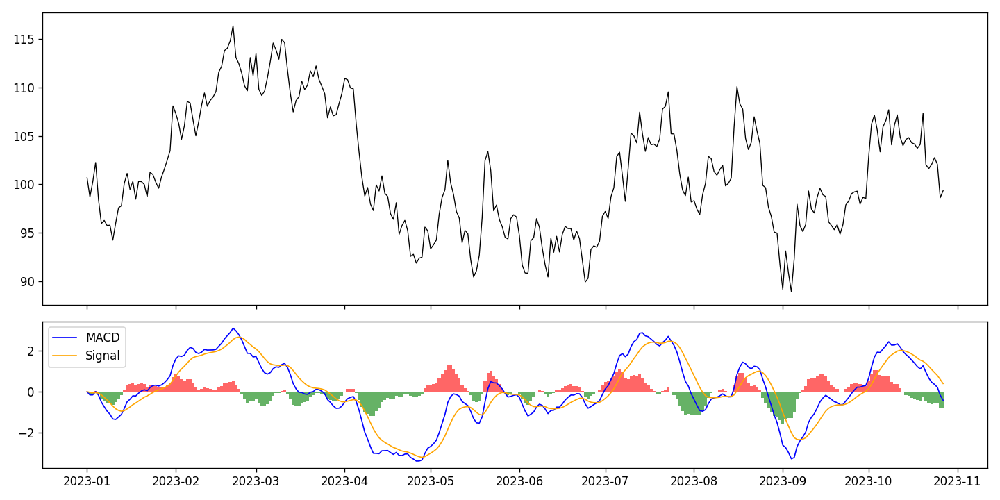 |

</details>

<details open>
<summary><b>回测</b></summary>

| 资金曲线 + 回撤 | 批量回测 Sharpe 对比 |
|:---:|:---:|
| 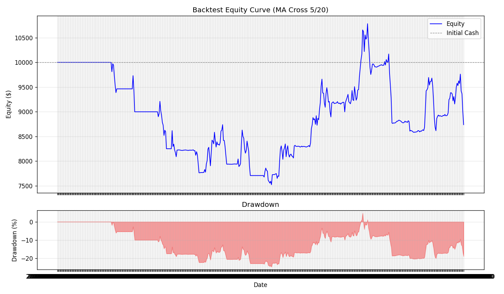 | 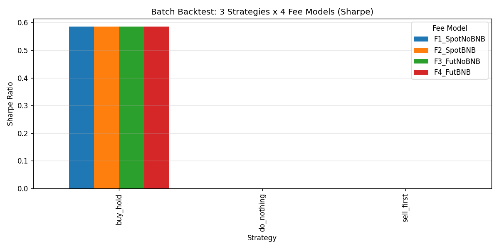 |

</details>

<details open>
<summary><b>统计分析</b></summary>

| 相关性散点图（Pearson r + 拟合线） |
|:---:|
| 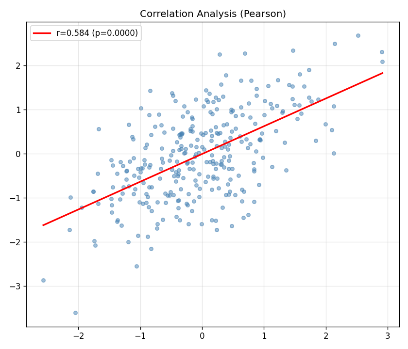 |

</details>

<details open>
<summary><b>信号处理</b></summary>

| Welch 频谱密度 | 小波时频热力图（CWT） |
|:---:|:---:|
| 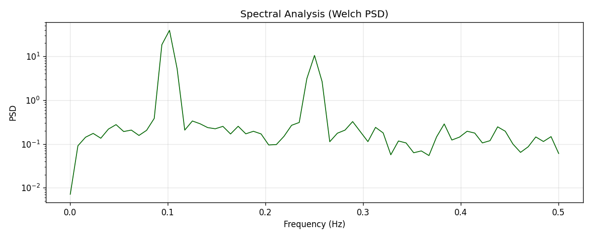 | 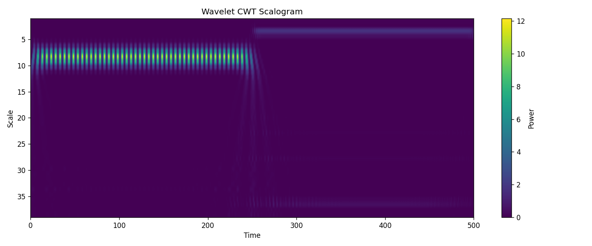 |

</details>

<details open>
<summary><b>非线性动力学</b></summary>

| Hurst DFA 拟合 | 递归图（Recurrence Plot） |
|:---:|:---:|
| 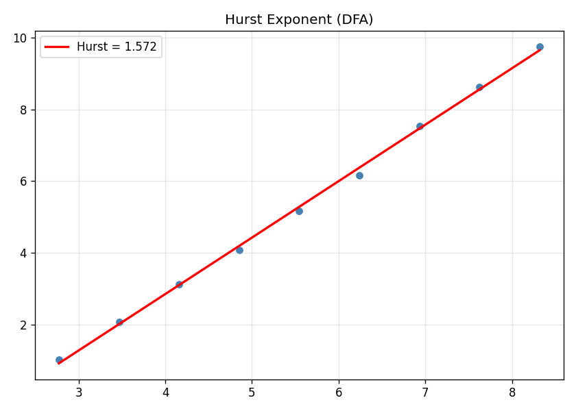 | 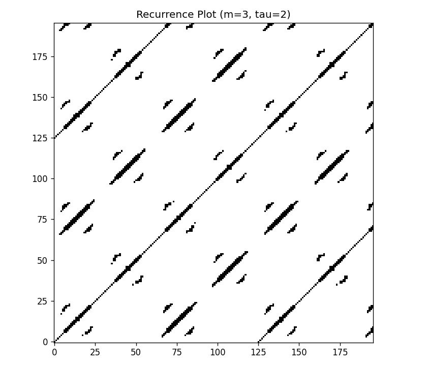 |

</details>

<details open>
<summary><b>机器学习</b></summary>

| K-Means 聚类（k=3） | PCA 二维降维 |
|:---:|:---:|
| 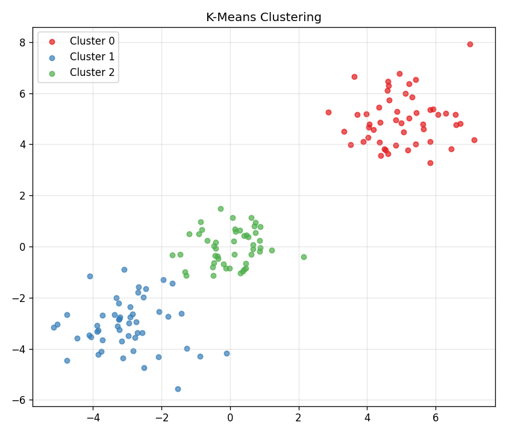 | 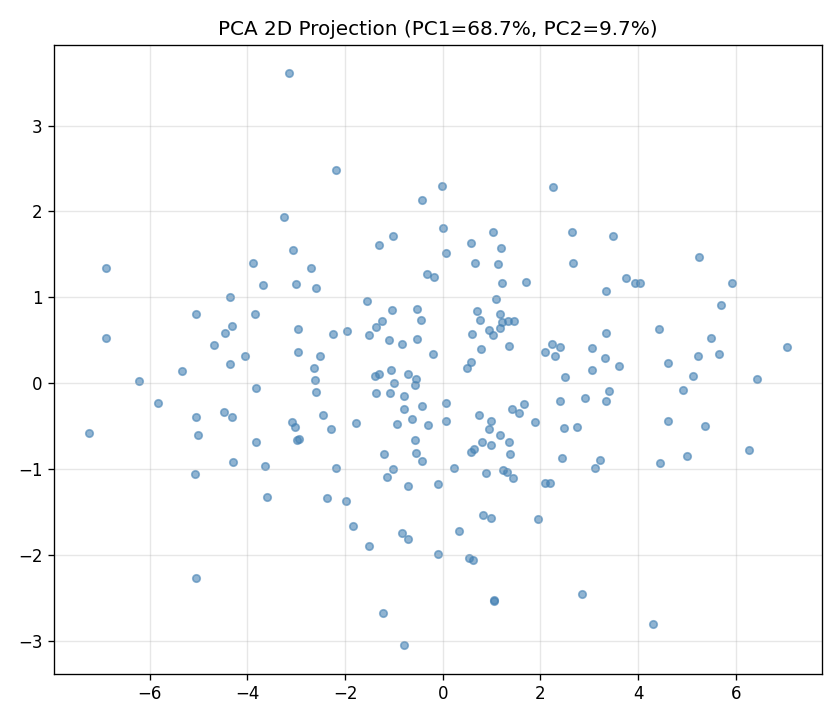 |

</details>

---

## 运行测试

```bash
# 生成演示图表（12 张 PNG）
python tests/generate_all_plots.py

# 演示测试（含图表生成 + 功能验证）
python -m pytest tests/ -v                # 117 项

# 各包单元测试
python -m pytest packages/foundation/tests/ -v   # 184 项
python -m pytest packages/storage/tests/ -v      # 98 项 + 1 跳过
python -m pytest packages/compute/tests/ -v      # 235 项
python -m pytest packages/invocation/tests/ -v   # 119 项
python -m pytest packages/dispatcher/tests/ -v   # 129 项
```

**总计：882 项测试通过 + 1 跳过**（yfinance 为可选依赖，未安装时跳过对应测试）。

---

## 文档

| 文档 | 说明 |
|------|------|
| [使用文档（中文）](docs/USAGE_CN.md) | 详细使用指南，覆盖全部 API、CLI、REST 端点，每个接口均有示例与阐释 |
| [使用文档（英文）](docs/USAGE.md) | English usage guide |
| [架构设计（中文）](DESIGN_CN.md) | V3.1 完整架构设计（含 mermaid 图与关键数据流） |
| [架构设计（英文）](DESIGN.md) | Architecture design document |
| [V31design/](V31design/) | 完整设计文档 + 分步实现报告（9 份 P{N}_REPORT.md） |

---

## 开源许可证

本项目基于 **GNU General Public License v3.0** 开源 — 详见 [LICENSE](LICENSE)。

Copyright (C) 2026 RESBI

## 声明与免责声明

本软件仅供**学习和研究目的**使用，**不构成**任何财务、投资或交易建议。用户对自己的投资决策负全部责任，在做出任何投资前应咨询合格的财务专业人士。
