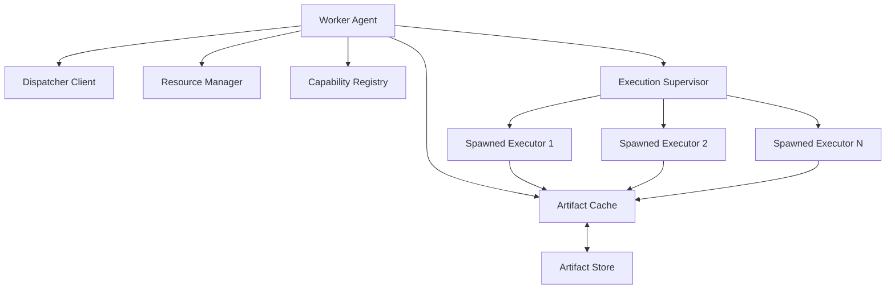
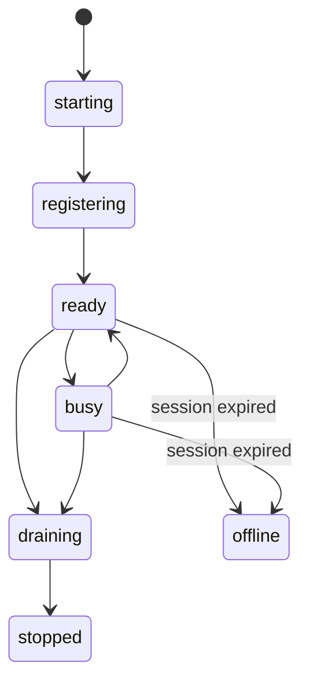
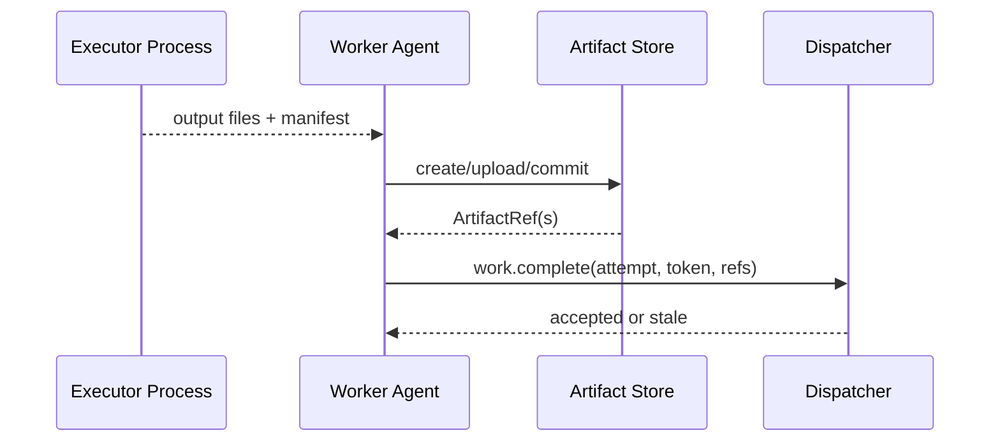

# StockStat V3.1 Compute 架构设计

> 大模块：Worker Agent、执行沙箱与 Artifact 数据面
> 日期：2026-07-20
> 状态：V3.1 设计稿
> 上位文档：[DESIGN_ARCH_V31.md](DESIGN_ARCH_V31.md)
> 依赖文档：[DESIGN_ARCH_FINANCE_V31.md](DESIGN_ARCH_FINANCE_V31.md) | [DESIGN_PROT_V31.md](DESIGN_PROT_V31.md)

## 1. 模块定位

Compute 模块由可横向扩展的 Worker 节点组成。每个 Worker 包含一个轻量 Agent 和若干隔离执行进程：

- Agent 与 Dispatcher 注册、领取租约、续租、上报状态。
- Agent 解析 ArtifactRef 并管理本地缓存。
- Executor Process 加载金融 Kernel 和能力模块，执行一个 WorkUnit。
- 结果先写 Artifact Store，再以受 fencing 保护的 complete 消息提交。

Worker 不保存 Job 权威状态，不直接查询可变市场数据库，不承担任务归并的控制逻辑。

## 2. 纠正 V3 Worker 模型

| V3 现状 | V3.1 决策 |
|---|---|
| CPU 密集任务使用 `ThreadPoolExecutor` | Agent 使用 spawn 进程池/独立子进程 |
| HTTP 每轮新建 client | 长连接 client，支持 backoff 和连接复用 |
| 无 backpressure，轮询可超出 capacity | claim 请求显式携带 free slots/resources |
| 内联 base64 cloudpickle 数据 | ArtifactRef + Arrow 下载/本地 mmap |
| 任意 cloudpickle 策略 | 签名策略包或受限 declarative strategy |
| complete 无 lease token | attempt + fencing token 条件提交 |
| 抢占只在 set 中记标志 | cancel/checkpoint control 贯穿子进程 |
| Checkpoint 全局内存 dict | Checkpoint Artifact 持久化 |
| capability 只有任务名字 | capability ID/version + schema + kernel compatibility |
| Worker 依赖完整前端包 | Worker 依赖 Contracts + Kernel + 能力包 |

## 3. 包结构

建议新建 `services/worker/`，发布名 `stockstat-worker`：

```text
services/worker/
├── pyproject.toml
└── stockstat_worker/
    ├── cli.py
    ├── config.py
    ├── agent.py
    ├── identity.py
    ├── dispatcher_client.py
    ├── heartbeat.py
    ├── leases.py
    ├── resources.py
    ├── capabilities.py
    ├── cache/
    │   ├── artifacts.py
    │   └── eviction.py
    ├── execution/
    │   ├── supervisor.py
    │   ├── process.py
    │   ├── context.py
    │   ├── cancellation.py
    │   └── limits.py
    ├── artifacts/
    │   ├── resolver.py
    │   └── publisher.py
    └── telemetry.py
```

金融算法位于独立 `packages/kernel/stockstat_kernel/`，详见 `DESIGN_ARCH_FINANCE_V31.md`。

## 4. Worker 内部架构



## 5. Worker 生命周期



步骤：

1. 加载显式 allowlist 能力。
2. 检测 CPU、内存、GPU、scratch 和 Kernel build。
3. 加载或创建持久 Worker identity。
4. 向 Dispatcher 注册并获得 `worker_session_id`、heartbeat/lease 参数。
5. 按 free capacity 领取 WorkLease。
6. 下载/验证输入 Artifact。
7. 启动子进程执行。
8. 周期续租、上报进度和资源使用。
9. 发布结果 Artifact 并 complete。
10. drain 时停止领取新任务，等待或取消现有 Attempt。

## 6. 身份与注册

Worker identity 分两层：

| 标识 | 生命周期 |
|---|---|
| `worker_id` | 节点配置持久保存，重启保持 |
| `worker_session_id` | 每次 Agent 启动新建，防旧进程继续上报 |

注册内容：

```text
worker_id
worker_session_id
alias
agent_version
kernel_build_id
python_abi
platform
resources_total
capabilities[]
labels
artifact_access_modes
cache_capacity
security_attestation(optional)
```

Dispatcher 返回：

```text
accepted protocol
heartbeat interval
lease defaults
max claim batch
worker token/session expiry
server time
```

## 7. Capacity 与资源管理

### 7.1 Slot 不是唯一资源

Worker 维护资源 reservation：

- CPU cores。
- Memory bytes。
- GPU device/VRAM。
- Scratch disk。
- Executor process count。

领取 WorkUnit 前先本地判断可承载资源。Dispatcher 同时做全局匹配，形成双重保护。

### 7.2 默认执行器

| 任务 | 默认执行方式 |
|---|---|
| 指标/统计 | spawn process |
| 回测 | spawn process |
| 参数组合 batch | spawn process，每进程串行小 batch |
| Monte Carlo shard | spawn process，numpy 可释放 GIL 但仍按进程隔离 |
| GPU 模型 | 指定 GPU 的独立长期 process，可后续实现 |
| 数据下载/上传 | Agent async I/O，不占计算 slot |
| 数据源采集 | 专用 I/O Worker pool 或 Storage Command Worker，不与 CPU 回测 slot 混用 |

使用 `spawn` 而非依赖 `fork`，保证 Windows 与 Linux 语义接近，并避免继承不安全连接状态。

### 7.3 线程控制

每个 Executor 设置 BLAS/OpenMP 线程数，防止 `N processes x N BLAS threads` 过度订阅：

```text
OMP_NUM_THREADS
MKL_NUM_THREADS
OPENBLAS_NUM_THREADS
NUMEXPR_NUM_THREADS
```

默认按 WorkUnit `cpu_cores` 分配。

## 8. Claim 与 Lease

Worker 使用长轮询：

```text
POST /internal/v31/work/claim
free_resources + capability_versions + cache_hints
```

Dispatcher 可返回 0..N 个 WorkLease。Agent 只有在本地 reservation 成功后确认启动；无法启动时立即 `work.release`，不等待 lease 到期。

Lease renew：

- renew 周期小于 TTL 的 1/3。
- 每个 Attempt 独立 token。
- renew 携带进度、checkpoint ref、资源快照。
- Dispatcher 响应可携带 `continue/cancel/checkpoint_and_stop`。
- Agent 与 Dispatcher 暂时断开时允许短 grace；超过 lease expiry 后子进程结果不得提交为有效结果。

## 9. 执行上下文

Executor 接收只读 `ExecutionContext`：

```text
job_id
stage_id
work_unit_id
attempt_id
capability_id/version
executor_role
parameters
input_artifacts
partition
deadline_at
random_seed
resource_limits
checkpoint_ref
trace_context
```

能力 Executor 的标准接口：

```python
class CapabilityExecutor(Protocol):
    def execute(
        self,
        context: ExecutionContext,
        inputs: ResolvedInputs,
        reporter: ProgressReporter,
    ) -> ExecutionOutput: ...
```

`ExecutionOutput` 只含小型 manifest 和待发布文件/Arrow streams，不返回任意 Python 对象给 Agent。

Worker 以 `(capability_id, capability_version, executor_role)` 选择入口。`executor_role` 由 Planner 写入 WorkLease，首版仅允许 `execute` 和 `reduce`；Client 不能在 JobSpec 中选择它。能力没有对应 role 时，Worker 拒绝启动并返回 capability mismatch。

## 10. Artifact 解析与缓存

### 10.1 Resolver

对于每个输入 Artifact：

1. 查本地 content-addressed cache。
2. 命中则校验 metadata/digest。
3. 未命中则使用 download session 拉取到临时文件。
4. 校验 size 和 sha256。
5. 原子 rename 到 cache。
6. 按输入模式提供 mmap、Arrow batches 或文件路径。

### 10.2 Cache key

缓存键为 digest，不是 Job ID。相同数据快照可被不同 Job 和 WorkUnit 复用。

### 10.3 Eviction

LRU + pin：

- 活跃 Attempt 输入被 pin。
- 上传中的输出被 pin。
- 热点 Snapshot 可有短 TTL pin。
- cache 超限先删除无 pin、最久未用对象。

## 11. 结果发布

正确顺序：



若 `work.complete` 响应丢失，Agent 使用相同 completion ID 重试。若 Dispatcher 返回 stale，Artifact 成为暂时无引用对象，后续由 GC 回收。

## 12. 进度、日志与流式结果

进度是小型事件：

```text
fraction
completed_units
total_units
message
metrics
checkpoint_ref
```

大型 partial result 不通过 heartbeat/renew 内联。若任务需要逐批结果：

1. Worker 发布 partial Artifact。
2. 上报 `work.partial`，包含 ArtifactRef 和 monotonic `partial_sequence`。
3. Dispatcher 写 JobEvent。
4. Client 订阅后按需下载。

日志：

- 子进程 stdout/stderr 捕获到结构化日志。
- 限制单 Attempt 日志量。
- 完整日志可作为受控 Artifact。
- 公共事件只包含摘要。

## 13. 取消与检查点

Agent 收到取消后：

1. 设置共享 cancellation token。
2. 能力在安全点检查。
3. 若要求 checkpoint，Executor 写 checkpoint 输出。
4. grace period 到期后终止子进程。
5. Windows 使用 terminate/job object；Linux 可使用 process group/cgroup。
6. 上报 cancelled 或 checkpointed。

首版不承诺对任意策略行级抢占。回测可在 bar 边界检查取消，但完整恢复需要序列化 Broker/Portfolio/Strategy 状态，延后实现。参数搜索和 Monte Carlo 在 item/batch 边界天然可恢复。

## 14. 安全与隔离

### 14.1 策略执行

- 只加载签名策略包。
- 入口点和依赖 lock manifest 明确。
- Worker trust policy 可禁用用户策略，只运行 builtins。
- 包解压防 path traversal。
- 禁止从控制消息反序列化 pickle。

### 14.2 进程隔离

首版最低要求：

- 独立子进程。
- 受限工作目录。
- 环境变量 allowlist。
- CPU/memory/deadline 限制。
- 非 root 容器运行。
- 生产可使用容器/cgroup；Windows 使用 Job Objects。

网络隔离按能力配置：普通回测/指标 Executor 默认不需要外网。

### 14.3 Secret

策略任务默认无 secret。需要数据源凭证的 ingestion capability 通过短期 secret injection，日志和 result 不得回传 secret。

## 15. 能力发现与版本

Worker 启动时从显式配置或 entry points 加载能力。任何加载失败必须让该能力不注册并产生显式启动诊断，不能静默跳过。

能力注册示例：

```text
finance.indicator.compute@1.0
finance.timeseries.analyze@1.0
finance.backtest.run@1.0
finance.simulation.resample@1.0
finance.experiment.search@1.0
finance.experiment.batch@1.0
finance.validation.walk_forward@1.0
finance.data.ingest@1.0
```

Reducer 是所属金融 capability 的内部 WorkUnit/Executor 角色，不额外暴露一个用户可提交的通用 `*.reduce` capability。Worker 注册每个 capability version 支持的 `executor_roles`。Worker 可同时安装多个 major 版本，但一个 WorkUnit 精确指定版本和 role。

## 16. 本地与远程一致性

Local Worker 与 Remote Worker 使用同一个 Agent/Supervisor/Kernel。区别：

- ControlChannel 为 embedded 或 HTTP。
- ArtifactStore 为 local filesystem 或 S3-compatible。
- 资源规模不同。

禁止新增“LocalExecutor 直接返回 Python 对象”路径。测试可在同进程启动 Agent，但 Executor 仍默认在 spawn 子进程中运行。

## 17. 测试策略

### 17.1 Agent 单元测试

- 注册 payload。
- free resource reservation/release。
- claim backpressure。
- heartbeat/renew backoff。
- drain 状态。
- stale session 处理。

### 17.2 Process tests

- spawn 执行与结果文件。
- child crash/segfault 模拟。
- timeout kill。
- memory limit。
- cancellation grace。
- BLAS thread env。
- Windows/Linux 差异合同。

### 17.3 Lease tests

- renew 成功。
- 网络中断超过 TTL。
- complete 重试。
- 旧 token 被拒绝。
- release 后重新分配。

### 17.4 Artifact tests

- cache 命中不重复下载。
- digest mismatch。
- partial download 清理。
- mmap/Arrow batch 输入。
- result upload 成功后 complete。

### 17.5 金融执行 parity

- 23 指标与旧实现 golden 对比。
- 代表回测逐字段对比。
- Grid/Monte Carlo 分片重试后结果不变。
- 固定 seed 在 Worker 数变化时保持定义好的确定性。

### 17.6 故障注入

- 执行中 Agent 被 kill。
- 子进程被 kill，Agent 仍存活。
- Artifact Store 暂不可用。
- Dispatcher complete 响应丢失。
- 磁盘 cache 满。
- capability package 加载失败。

## 18. 验收标准

- CPU 密集任务使用进程隔离，不使用线程池作为主要并行方式。
- Worker 仅按空闲资源领取任务。
- 所有工作受 Lease/fencing 保护。
- 大数据通过 Artifact 下载和 cache，不通过 base64 JSON。
- Worker 不直连可变 OHLCV 数据库。
- 用户策略不通过 cloudpickle 跨网执行。
- Local/Remote Worker 使用相同执行路径和能力包。
