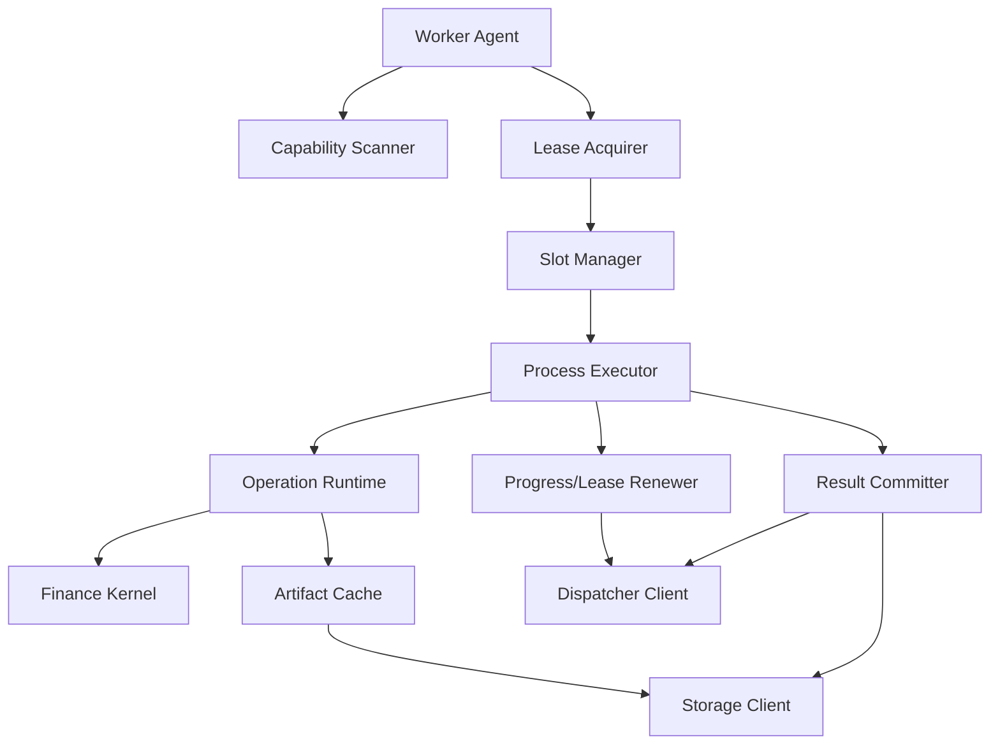
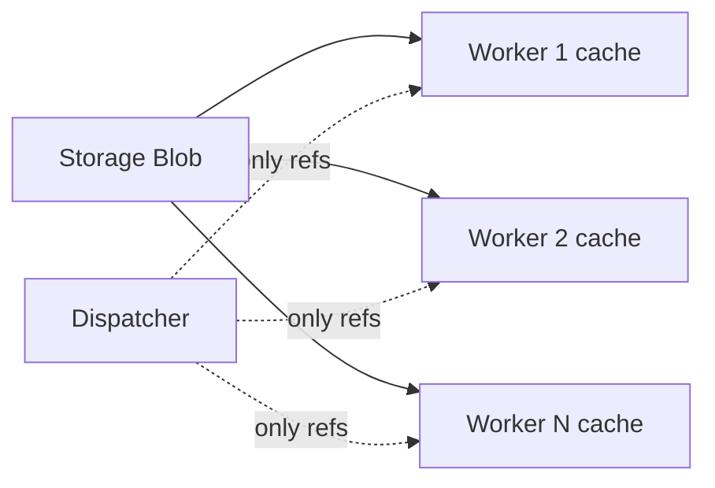
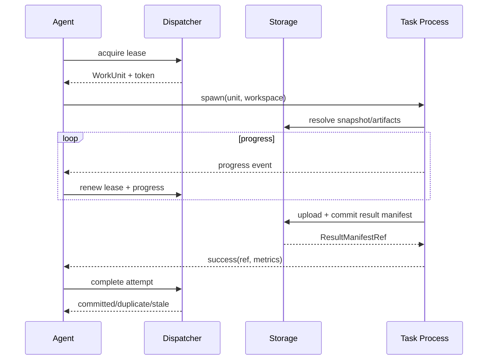

# StockStat V3.1 Compute Worker 架构设计

> 大模块：Compute（可独立部署的金融计算执行面）
> 版本：V3.1 设计稿
> 关联：[DESIGN_ARCH_FINANCE_V31.md](DESIGN_ARCH_FINANCE_V31.md)、[DESIGN_ARCH_DISPATCHER_V31.md](DESIGN_ARCH_DISPATCHER_V31.md)

## 1. 模块定位

Compute Worker 从 Dispatcher 获取有租约的 WorkUnit，从 Storage 读取不可变输入，在隔离执行器中调用 Finance Kernel，将结果先提交到 Storage，再向 Dispatcher 提交 ResultManifestRef。

Worker 是可横向扩展的无共享执行节点。它不保存 Job 最终状态，不自行分片，不直接接受 Client 请求，也不把结果内容通过 Dispatcher 回传。

## 2. V3 Worker 的主要问题

| 问题 | 影响 | V3.1 处理 |
|---|---|---|
| CPU 任务用 `ThreadPoolExecutor` | GIL 下难以多核加速 | 进程执行器/隔离子进程 |
| Worker 与 Dispatcher 只用临时 HTTP 调用 | 连接复用差、租约不完整 | 长生命周期 client + lease protocol |
| 数据通过 assignment base64 内联 | 带宽和内存浪费 | 直接读取 Snapshot/Artifact |
| cloudpickle 任意策略 | 安全和版本风险 | 签名 StrategyBundle |
| cancel/preempt 只标记 set | 运行任务不停 | 子进程可终止 + cooperative token |
| 所有 capability 默认宣称支持 | 与安装依赖不一致 | 启动时自检后注册 |
| handler 注册表与 ComputeSpec 耦合 | 新能力修改共享文件 | operation capability package |
| 进程内 checkpoint dict | 不可恢复 | 首期确定性重跑；后续 Artifact checkpoint |

## 3. Worker 内部结构



### 3.1 Worker Agent

负责注册、心跳、获取 lease、drain 和进程管理。Agent 自身不 import 重型金融依赖，以减少主进程崩溃面。

### 3.2 Operation Runtime

子进程加载指定 capability 包、解析 WorkUnit、加载输入、调用 executor、生成 artifacts 和 metrics。

### 3.3 Artifact Cache

按 digest 缓存 Snapshot partitions、StrategyBundle 和常用模型。缓存是只读加临时上传区，不能成为唯一结果存储。

## 4. 包与能力

建议基础包 `stockstat-worker`，能力包按需安装：

```text
services/worker/
└── stockstat_worker/
    ├── agent.py
    ├── registration.py
    ├── leases.py
    ├── slots.py
    ├── process_executor.py
    ├── runtime.py
    ├── cache.py
    ├── sandbox.py
    ├── telemetry.py
    └── cli.py

packages/capabilities/
├── stockstat-cap-basic
├── stockstat-cap-statistics
├── stockstat-cap-backtest
├── stockstat-cap-signal
├── stockstat-cap-experiment
└── stockstat-cap-render
```

首期也可以将能力包放在 monorepo 内统一发布，但注册边界保持独立。

## 5. Capability 扫描

Worker 启动时只注册真正可执行的 operation：

1. 发现受信任 capability entry points。
2. 校验 contract 和 kernel 版本。
3. 运行轻量 self-test。
4. 检查可选依赖和外部 runtime。
5. 生成 capability manifest digest。
6. 注册 operation、实现版本、资源 profile 和 security profile。

示例：未安装 PyWavelets 时，Worker 不应宣称完整 `feature.spectral@1`。如果 Finance Kernel 提供明确的 fallback 实现，则注册 descriptor 中标记实现变体和版本。

## 6. 执行隔离

### 6.1 默认进程模型

每个 slot 对应一个独立任务子进程，而不是长期复用的任意 Python 状态进程。首期建议：

- Agent 主进程。
- `spawn` 创建任务子进程，Windows/Linux 一致。
- 每个任务独立临时目录。
- 完成后退出子进程，避免用户策略污染后续任务。
- 对只含内置纯函数的轻任务，后续可增加受控常驻进程池优化。

### 6.2 资源限制

| 资源 | 机制 |
|---|---|
| CPU | slot 数 + OS/container quota |
| 内存 | container/cgroup/job object；软监控 + 硬终止 |
| 时间 | execution timeout |
| 临时盘 | task workspace quota |
| 网络 | 默认仅允许 Storage；策略网络禁用 |
| 文件 | 只读输入，独立写目录 |

Windows 本地开发可用 Job Object 或进程监控实现有限控制；生产 Linux 推荐容器/cgroup。

### 6.3 StrategyBundle

用户策略属于不可信代码：

- 校验 digest 和签名。
- 解压到任务目录，防路径穿越。
- 只允许 manifest 声明入口。
- 依赖使用预构建环境或受控 lock，不在运行时任意 `pip install` 公网包。
- 默认禁网。
- 运行用户无特权。

## 7. Slot 与并发

### 7.1 Slot 类型

Worker 可以声明多个资源池：

```json
{
  "pools": [
    {"name": "cpu-small", "slots": 4, "memory_mb_per_slot": 2048},
    {"name": "cpu-large", "slots": 1, "memory_mb_per_slot": 16384}
  ]
}
```

首期不在单个 Worker 内做复杂 bin packing。Unit 指定 resource class，Agent 只在对应 pool 有空闲 slot 时 acquire。

### 7.2 CPU 密集任务

回测、CWT、重采样和 Monte Carlo 使用进程并行。避免 Worker 外层 N 进程、operation 内层再开 N 进程造成过度订阅：

- 默认 operation 内部单线程/单进程。
- BLAS/OpenMP 线程数由 slot 配置限制。
- 并行由 Dispatcher 的 WorkUnit 分片承担。
- 明确允许内部并行的 operation 在 descriptor 中声明。

## 8. 数据加载

### 8.1 SnapshotResolver

执行前：

1. 获取 snapshot manifest。
2. 校验 operation 需要的 instrument/timeframe/fields。
3. 检查本地 digest cache。
4. 并发下载缺失 partitions。
5. 校验 digest。
6. 使用 Arrow Dataset/Parquet predicate pushdown 读取需要的范围。
7. 转为 Kernel 接受的受控 table/frame。

### 8.2 不经过 Dispatcher

数据链路：



Storage 出口仍可能被 N Worker 下载，但通过不可变快照、Worker 本地缓存、共享对象存储和调度 cache affinity 解决，而不是让 Dispatcher 永久成为 N 倍中转瓶颈。对于同一 Job 的相同数据：

- 同机多进程共享 Worker 节点缓存。
- 跨机 Worker 各下载一次，而不是每个 task 下载一次。
- 大规模部署可用对象存储/CDN/局域网缓存。

这比 V2 “Dispatcher 预取后 N 次分发”更符合 Storage 与计算完全独立部署，同时保留 Storage 只读、内容寻址和复用优势。

## 9. WorkUnit 生命周期



## 10. Progress 与 partial

Operation Runtime 使用结构化 progress API：

```python
ctx.progress.update(completed=125, total=1000, phase="backtest")
ctx.progress.publish_partial(artifact_ref)
ctx.cancellation.raise_if_requested()
```

Agent 节流发送，例如最多每秒一次，防止 100 Worker 产生过量小消息。

partial 必须先写 Storage。Agent 不在心跳中嵌入表格。

## 11. 取消与故障

### 11.1 取消

- Agent 在 lease renew 响应中收到 `cancel_requested`。
- 先发送 cooperative cancellation 到子进程。
- grace period 后强制终止子进程。
- 清理未 committed upload session 和 workspace。
- 向 Dispatcher 报告 cancelled。

### 11.2 Agent 崩溃

Lease 到期后 Dispatcher 重试。已上传但未通知的 Artifact 由 retention/GC 清理，或新 attempt 可按 digest 复用。

### 11.3 子进程崩溃

Agent 捕获 exit code、资源指标和受控 stderr，生成诊断 Artifact，再报告分类错误。

### 11.4 Storage 短暂失败

结果 upload/commit 在 lease 有效期内做有限重试，并继续 renew lease。超过 deadline 报 storage error，由 Dispatcher 决定重试 Unit。

## 12. 确定性

Worker 必须避免执行位置影响结果：

- random seed 来自 WorkUnit。
- sample ID 映射固定。
- 输入 partition 排序固定。
- 参数 canonical 化。
- merge 不依赖完成顺序。
- 环境版本进入 result manifest。
- BLAS 非确定性 operation 必须标记并设置容差。

## 13. 缓存

### 13.1 缓存对象

- Dataset partitions。
- StrategyBundle。
- 模型 bundle。
- 只读公共派生特征（可选）。

### 13.2 淘汰

LRU + size quota，正在执行引用的 entry pin。digest 不匹配立即删除并重新下载。

### 13.3 调度提示

Worker 注册不上传完整缓存清单；可周期报告 Top-N 热数据 digest 或 Bloom filter。Scheduler 只将其作为软 affinity。

## 14. Worker CLI

```bash
stockstat-worker run \
  --dispatcher-url http://dispatcher:9000 \
  --storage-url http://storage:8000 \
  --alias cpu-node-a \
  --pool cpu-small=4x2GB \
  --pool cpu-large=1x16GB \
  --cache-dir /var/cache/stockstat \
  --workspace-dir /var/lib/stockstat-worker
```

管理命令：

- `stockstat-worker capabilities`
- `stockstat-worker self-test`
- `stockstat-worker drain`
- `stockstat-worker cache stats`
- `stockstat-worker cache prune`

## 15. Worker 类型

### 15.1 LocalWorker

与 SDK 同进程的 Agent 组合，但 operation 仍在子进程执行，可真实测试取消、资源隔离和序列化边界。

### 15.2 TrustedWorker

只执行内置 capability，不接受用户 StrategyBundle，适合指标、统计和公共服务。

### 15.3 StrategyWorker

允许签名 StrategyBundle，使用更强隔离。

### 15.4 Future GPU Worker

只在有真实 `ml.train`、option simulation 或 GPU operation 后增加，不为“可能使用 GPU”提前复杂化首期调度。

## 16. 测试要求

### 16.1 单元与组件

- capability 扫描和缺依赖降级。
- slot 上限和 pool 匹配。
- snapshot cache 命中/校验/淘汰。
- StrategyBundle 签名、入口和安全解压。
- progress 节流。
- result 两阶段提交。

### 16.2 进程与资源

- CPU 任务真实使用多进程。
- 任务超时终止。
- 取消 grace + kill。
- OOM/exit code 分类。
- workspace 隔离和清理。
- BLAS 线程不过度订阅。

### 16.3 故障注入

- Agent 被 kill，lease 回收。
- 子进程完成后 Agent 在 complete 前崩溃。
- Storage 上传中断。
- stale attempt 晚到。
- Dispatcher 响应丢失导致 complete 重发。

### 16.4 金融一致性

- 同 WorkUnit 在 LocalWorker、单远程 Worker、多 Worker 上结果一致。
- PAXG batch、grid、Monte Carlo、walk-forward 分片数改变时结果一致。

## 17. 结论

V3.1 Worker 以“租约执行 + 内容寻址数据 + 进程隔离 + 结果先入 Storage”为核心，把计算资源与调用、Dispatcher 和 Storage 真正分离。它仍然紧贴金融 operation，不演化为任意代码集群。
