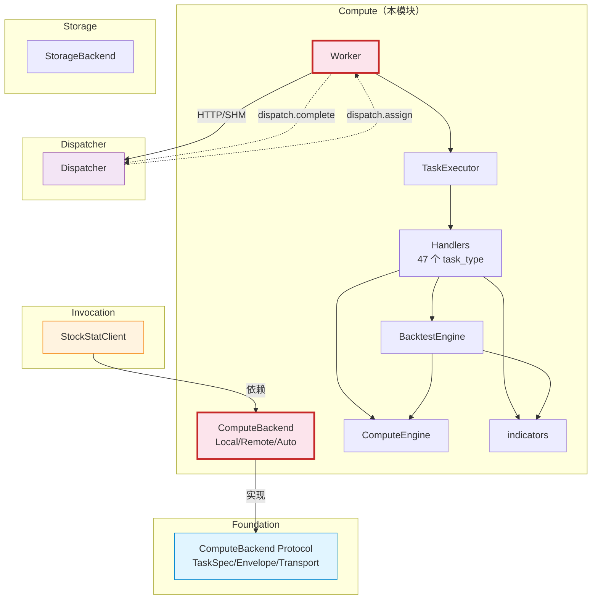

# DESIGN_ARCH_COMPUTE_V31 — 计算端架构设计

> **模块**：Compute（计算端）
> **版本**：v3.1
> **日期**：2026-07-24
> **状态**：设计稿
> **关联**：
> - [DESIGN_ARCH_V31.md](DESIGN_ARCH_V31.md) — 总设计
> - [DESIGN_ARCH_FOUNDATION_V31.md](DESIGN_ARCH_FOUNDATION_V31.md) — 基础层
> - [DESIGN_GENERALIZE.md](DESIGN_GENERALIZE.md) — 47 个 task_type 清单
>
> **核心使命**：承载 V3.1 的**全部金融计算能力**——BacktestEngine、ComputeEngine、47 个 task_type handler。提供三种 ComputeBackend 实现（Local/Remote/Auto）+ Worker 进程。**这是 V3.1 最重的模块**，从 V2/V3 迁移全部计算逻辑。

---

## 目录

1. [模块定位与边界](#1-模块定位与边界)
2. [内部结构](#2-内部结构)
3. [ComputeBackend 三种实现](#3-computebackend-三种实现)
4. [Worker 进程](#4-worker-进程)
5. [TaskExecutor 任务执行器](#5-taskexecutor-任务执行器)
6. [Handler 注册表](#6-handler-注册表)
7. [Tier 1 回测类 Handlers](#7-tier-1-回测类-handlers)
8. [Tier 2 统计检验 Handlers](#8-tier-2-统计检验-handlers)
9. [Tier 3 信号处理 Handlers](#9-tier-3-信号处理-handlers)
10. [Tier 4 非线性动力学 Handlers](#10-tier-4-非线性动力学-handlers)
11. [Tier 5 灰色系统 Handlers](#11-tier-5-灰色系统-handlers)
12. [Tier 6 机器学习 Handlers](#12-tier-6-机器学习-handlers)
13. [Tier 7 组合风险 Handlers](#13-tier-7-组合风险-handlers)
14. [BacktestEngine 迁移](#14-backtestengine-迁移)
15. [ComputeEngine 与 indicators](#15-computeengine-与-indicators)
16. [硬件检测与 Checkpoint](#16-硬件检测与-checkpoint)
17. [CLI](#17-cli)
18. [测试体系](#18-测试体系)

---

## 1. 模块定位与边界

### 1.1 Compute 是什么

Compute 是 V3.1 的**计算引擎**，承载：

- **ComputeBackend 三实现**：LocalComputeBackend / RemoteComputeBackend / AutoComputeBackend
- **Worker 进程**：独立运行的计算节点
- **TaskExecutor**：路由 TaskSpec 到对应 handler
- **47 个 task_type handler**：覆盖回测/统计/信号/非线性/灰色/ML/组合风险
- **BacktestEngine**：从 V2 迁移的完整回测引擎
- **ComputeEngine**：指标计算引擎
- **indicators 库**：40+ 技术指标
- **硬件检测**：psutil
- **Checkpoint**：抢占恢复

### 1.2 Compute 不是什么

| 不是 | 理由 |
|------|------|
| 不含任务调度 | 由 Dispatcher 负责 |
| 不含数据持久化 | 由 Storage 负责 |
| 不含用户接口 | 由 Invocation 负责 |
| 不含协议定义 | 由 Foundation 负责 |

### 1.3 与 V2/V3 的关键差异

| 维度 | V2/V3 | V3.1 |
|------|-------|------|
| BacktestEngine 位置 | `frontend/stockstat/backtest/` | **Compute 模块** |
| ComputeEngine 位置 | `frontend/stockstat/compute/` | **Compute 模块** |
| indicators 位置 | `frontend/stockstat/indicators/` | **Compute 模块** |
| handler 数量 | 6（V3） | **47**（V3.1） |
| ComputeBackend | 在 frontend `_core` | 在 Compute 模块（实现 Foundation Protocol） |
| Worker 包 | `stockstat-compute`（独立） | **保留独立包** |

### 1.4 核心设计原则

> **计算与调用分离**：Invocation 不持有 BacktestEngine，通过 ComputeBackend 提交任务。
>
> **handler 原子化**：每个 task_type 对应一个独立 handler，新增能力 = 新增 handler，协议零改动。
>
> **本地/远程透明**：LocalComputeBackend 与 RemoteComputeBackend 实现同一 Protocol，结果一致。

---

## 2. 内部结构

```
packages/compute/stockstat_compute/
├── __init__.py                  # 导出 Worker, TaskExecutor, ComputeBackend 实现
├── backend/                     # ComputeBackend 三实现
│   ├── __init__.py
│   ├── local.py                 # LocalComputeBackend
│   ├── remote.py                # RemoteComputeBackend
│   └── auto.py                  # AutoComputeBackend
├── worker.py                    # Worker 进程
├── executor.py                  # TaskExecutor
├── register.py                  # 硬件检测（psutil）
├── checkpoint.py                # Checkpoint 存储
├── cli.py                       # stockstat-compute CLI
├── handlers/                    # 47 个 task_type handler
│   ├── __init__.py              # HANDLERS 注册表 + dispatch()
│   ├── _base.py                 # Handler 基类 + Stream + is_stream_aware
│   ├── backtest/                # Tier 1 回测类
│   │   ├── __init__.py
│   │   ├── indicator.py
│   │   ├── backtest.py
│   │   ├── grid_search.py
│   │   ├── batch_backtest.py
│   │   ├── monte_carlo.py
│   │   └── walkforward.py
│   ├── stats/                   # Tier 2 统计检验
│   │   ├── __init__.py
│   │   ├── correlation.py
│   │   ├── hypothesis.py
│   │   ├── bootstrap.py
│   │   ├── permutation.py
│   │   ├── chow.py
│   │   ├── survival.py
│   │   ├── ecdf.py
│   │   └── multiple_testing.py
│   ├── signal/                  # Tier 3 信号处理
│   │   ├── __init__.py
│   │   ├── spectral.py
│   │   ├── wavelet.py
│   │   ├── spectral_entropy.py
│   │   ├── cross_spectrum.py
│   │   └── filter.py
│   ├── nonlinear/               # Tier 4 非线性动力学
│   │   ├── __init__.py
│   │   ├── mutual_info.py
│   │   ├── transfer_entropy.py
│   │   ├── hurst.py
│   │   ├── sample_entropy.py
│   │   ├── permutation_entropy.py
│   │   ├── rqa.py
│   │   └── recurrence_plot.py
│   ├── grey/                    # Tier 5 灰色系统
│   │   ├── __init__.py
│   │   ├── grey_relation.py
│   │   ├── gm11.py
│   │   └── grey_cluster.py
│   ├── ml/                      # Tier 6 机器学习
│   │   ├── __init__.py
│   │   ├── train.py
│   │   ├── predict.py
│   │   ├── feature_importance.py
│   │   ├── walkforward_cv.py
│   │   ├── clustering.py
│   │   ├── dim_reduction.py
│   │   └── classification_metrics.py
│   └── portfolio/               # Tier 7 组合风险
│       ├── __init__.py
│       ├── optimization.py
│       ├── risk.py
│       ├── factor.py
│       ├── cointegration.py
│       ├── regime.py
│       └── stress.py
├── backtest/                    # BacktestEngine（从 V2 迁移）
│   ├── __init__.py
│   ├── engine.py                # BacktestEngine 主体
│   ├── broker.py                # Broker
│   ├── portfolio.py             # Portfolio
│   ├── orders.py                # Orders
│   ├── metrics.py               # 回测指标
│   ├── analyzer.py              # 分析器
│   ├── cost_model.py            # 手续费模型
│   ├── fill_model.py            # 成交模型
│   ├── execution_model.py       # 执行模型
│   ├── intrabar.py              # Intrabar 模拟
│   ├── montecarlo.py            # 蒙特卡洛引擎
│   ├── walkforward.py           # 前向验证
│   ├── optimizer.py             # 优化器
│   ├── fee_sweep.py             # 费率扫描
│   ├── batch_runner.py          # 批量运行器
│   ├── strategy.py              # 策略基类
│   ├── sizing.py                # 仓位管理
│   ├── benchmark.py             # 基准
│   ├── result.py                # BacktestResult
│   └── charts/                  # 回测图表
│       ├── chart_spec.py
│       ├── chart_factory.py
│       ├── chart_registry.py
│       ├── matplotlib_charts.py
│       ├── null_charts.py
│       └── plot_adapter.py
├── compute_engine/              # ComputeEngine（从 V2 迁移）
│   ├── __init__.py
│   ├── engine.py                # ComputeEngine 主体
│   └── registry.py              # 指标注册表
└── indicators/                  # 指标库（从 V2 迁移）
    ├── __init__.py
    ├── trend.py                 # MA/EMA/MACD/ADX/...
    ├── oscillator.py            # RSI/KD/...
    ├── volatility.py            # Bollinger/ATR/...
    ├── statistics.py            # rolling_corr/zscore/...
    └── nonlinear.py             # 非线性指标（已有）
```

### 2.1 依赖关系


```mermaid
graph TB
    subgraph "Compute（本模块）"
        CB[ComputeBackend<br/>Local/Remote/Auto]
        W[Worker]
        EX[TaskExecutor]
        H[Handlers<br/>47 个 task_type]
        BE[BacktestEngine]
        CE[ComputeEngine]
        IND[indicators]
    end

    subgraph "Foundation"
        F[ComputeBackend Protocol<br/>TaskSpec/Envelope/Transport]
    end

    subgraph "Dispatcher"
        D[Dispatcher]
    end

    subgraph "Storage"
        S[StorageBackend]
    end

    subgraph "Invocation"
        I[StockStatClient]
    end

    I -->|依赖| CB
    CB -->|实现| F
    W -->|HTTP/SHM| D
    W --> EX
    EX --> H
    H --> BE
    H --> CE
    H --> IND
    BE --> CE
    BE --> IND

    D -.->|dispatch.assign| W
    W -.->|dispatch.complete| D

    style CB fill:#fce4ec,stroke:#c62828,stroke-width:3px
    style W fill:#fce4ec,stroke:#c62828,stroke-width:3px
    style F fill:#e1f5ff,stroke:#0288d1
    style D fill:#f3e5f5,stroke:#7b1fa2
    style I fill:#fff3e0,stroke:#f57c00
```

---

## 3. ComputeBackend 三种实现

### 3.1 LocalComputeBackend

```python
# backend/local.py
class LocalComputeBackend:
    """本地计算后端 — 进程内直接调用 handler。

    - submit() 在后台线程执行
    - wait() 阻塞等待
    - result() 非阻塞获取

    行为等价于 V2/V3 的直接调用 BacktestEngine。
    """
    name = "local"

    def __init__(self, client=None, data_client=None, storage=None, mode="online"):
        self._client = client
        self._data_client = data_client
        self._storage = storage
        self._mode = mode
        self._tasks: dict[str, _LocalTaskState] = {}
        self._lock = threading.Lock()

    def submit(self, spec: TaskSpec) -> TaskRef:
        state = _LocalTaskState(spec=spec, info=TaskInfo(
            task_id=spec.task_id, state=TaskState.PENDING))
        with self._lock:
            self._tasks[spec.task_id] = state
        t = threading.Thread(target=self._run_local, args=(state,), daemon=True)
        t.start()
        state.thread = t
        return TaskRef(task_id=spec.task_id, backend=self)

    def _run_local(self, state: _LocalTaskState):
        try:
            state.info.state = TaskState.RUNNING
            state.info.started_at = datetime.utcnow()
            result = dispatch_to_handler(
                spec=state.spec,
                client=self._client,
                data_client=self._data_client,
                storage=self._storage,
            )
            state.result = result
            state.info.state = TaskState.COMPLETED
            state.info.progress = 1.0
        except Exception as e:
            state.error = e
            state.info.state = TaskState.FAILED
            state.info.error = str(e)
        finally:
            state.info.finished_at = datetime.utcnow()

    def get(self, task_id: str) -> TaskInfo:
        return self._tasks[task_id].info

    def wait(self, task_id: str, timeout=None) -> Any:
        state = self._tasks[task_id]
        state.thread.join(timeout=timeout)
        if state.thread.is_alive():
            raise TaskTimeoutError(f"Task {task_id} not finished in {timeout}s")
        if state.info.state == TaskState.FAILED:
            raise TaskError(state.error)
        return state.result

    def result(self, task_id: str) -> Any:
        state = self._tasks[task_id]
        if state.info.state != TaskState.COMPLETED:
            raise TaskNotReadyError(state.info.state.value)
        return state.result

    def cancel(self, task_id: str) -> bool:
        state = self._tasks.get(task_id)
        if state and state.info.state in (TaskState.PENDING, TaskState.RUNNING):
            state.info.state = TaskState.CANCELLED
            return True
        return False

    def cluster_info(self, **kwargs) -> dict:
        return {
            "dispatcher": {"id": "local", "alias": "in-process",
                           "status": "online", "queue_depth": 0},
            "workers": [{
                "worker_id": "local", "alias": "in-process",
                "status": "online", "concurrency": 1,
                "active_tasks": sum(1 for s in self._tasks.values()
                                    if s.info.state == TaskState.RUNNING),
                "capabilities": ALL_TASK_TYPES,
            }],
            "stats": {"total_workers": 1, "online_workers": 1,
                      "total_concurrency": 1},
        }

    def stream_results(self, task_id: str):
        yield self.wait(task_id)

    # ── 本地便捷方法（供 Invocation 直接调用）──

    def compute_indicator(self, name: str, data, **params) -> Any:
        """本地直接计算指标（绕过 TaskSpec，性能优化）。"""
        from ..compute_engine import ComputeEngine
        engine = ComputeEngine()
        method = getattr(engine, name)
        return method(data, **params)
```

### 3.2 RemoteComputeBackend

```python
# backend/remote.py
class RemoteComputeBackend:
    """远程计算后端 — 通过 Transport 提交到 Dispatcher。"""
    name = "remote"

    def __init__(self, dispatcher_url: str = None, *,
                 transport: Transport = None,
                 storage_url: str = None,
                 codec: str = "arrow"):
        self._transport = transport or build_transport(dispatcher_url)
        self._storage_url = storage_url
        self._codec = codec
        self._cache: dict[str, TaskInfo] = {}

    def submit(self, spec: TaskSpec) -> TaskRef:
        env = Envelope(
            type="task.submit",
            headers=Headers(
                content_type="application/vnd.stockstat.task+json",
                trace_id=spec.trace_id or spec.task_id,
                timeout=spec.dispatch_spec.timeout,
            ),
            payload=spec.to_dict(),
        )
        reply = self._transport.request(env)
        ack = reply.payload
        return TaskRef(task_id=ack["task_id"], backend=self)

    def get(self, task_id: str) -> TaskInfo:
        env = Envelope(type="task.status",
                       headers=Headers(content_type="application/json"),
                       payload={"task_id": task_id})
        reply = self._transport.request(env)
        info = TaskInfo(**reply.payload)
        self._cache[task_id] = info
        return info

    def result(self, task_id: str) -> Any:
        env = Envelope(type="task.result",
                       headers=Headers(content_type="application/json"),
                       payload={"task_id": task_id})
        reply = self._transport.request(env)
        codec = get_codec_for_content_type(reply.headers.content_type)
        payload = reply.payload
        if isinstance(payload, str):
            payload = base64.b64decode(payload)
        return codec.decode(payload)

    def wait(self, task_id: str, timeout=None) -> Any:
        deadline = time.time() + (timeout or 3600)
        while time.time() < deadline:
            info = self.get(task_id)
            if info.state == TaskState.COMPLETED:
                return self.result(task_id)
            if info.state == TaskState.FAILED:
                raise TaskError(info.error)
            if info.state == TaskState.CANCELLED:
                raise TaskCancelledError(task_id)
            time.sleep(0.5)
        raise TaskTimeoutError(f"Task {task_id} not finished in {timeout}s")

    def cancel(self, task_id: str) -> bool:
        env = Envelope(type="task.cancel",
                       headers=Headers(content_type="application/json"),
                       payload={"task_id": task_id})
        reply = self._transport.request(env)
        return reply.payload.get("cancelled", False)

    def cluster_info(self, **kwargs) -> dict:
        env = Envelope(type="cluster.info",
                       headers=Headers(content_type="application/json"),
                       payload=kwargs)
        reply = self._transport.request(env)
        return reply.payload

    def stream_results(self, task_id: str):
        seen = 0
        while True:
            info = self.get(task_id)
            partials = self._fetch_partials(task_id, since=seen)
            for p in partials:
                yield p
                seen += 1
            if info.state in (TaskState.COMPLETED, TaskState.FAILED, TaskState.CANCELLED):
                if info.state == TaskState.COMPLETED:
                    yield self.result(task_id)
                break
            time.sleep(0.5)
```

### 3.3 AutoComputeBackend

```python
# backend/auto.py
class AutoComputeBackend:
    """自动路由后端 — 按任务规模选择本地或远程。

    路由规则：
    - data_spec 数据量 < 1MB 且 task_type in {indicator, backtest} → 本地
    - task_type in {grid_search, batch_backtest, monte_carlo, bootstrap,
                    permutation_test, walkforward_cv} → 远程
    - 远程不可达 → 降级本地
    """
    name = "auto"

    HEAVY_TYPES = {
        "grid_search", "batch_backtest", "monte_carlo", "bootstrap",
        "permutation_test", "walkforward", "walkforward_cv",
        "ml_train", "deep_learning",
    }

    def __init__(self, local: LocalComputeBackend, remote: RemoteComputeBackend,
                 *, local_threshold_mb: float = 1.0):
        self._local = local
        self._remote = remote
        self._threshold = local_threshold_mb * 1024 * 1024
        self._routing: dict[str, str] = {}  # task_id -> backend_name

    def submit(self, spec: TaskSpec) -> TaskRef:
        backend = self._choose(spec)
        self._routing[spec.task_id] = backend.name
        return backend.submit(spec)

    def _choose(self, spec: TaskSpec) -> ComputeBackend:
        # 1. 显式指定
        force = spec.dispatch_spec.data_dispatch  # 复用字段（hack）
        # 2. 任务类型偏好
        if spec.compute_spec.task_type in self.HEAVY_TYPES:
            return self._remote
        # 3. 数据量估算
        data_size = estimate_data_size(spec.data_spec)
        if data_size > self._threshold:
            return self._remote
        return self._local

    def get(self, task_id): return self._route(task_id).get(task_id)
    def result(self, task_id): return self._route(task_id).result(task_id)
    def wait(self, task_id, timeout=None):
        return self._route(task_id).wait(task_id, timeout)
    def cancel(self, task_id): return self._route(task_id).cancel(task_id)

    def _route(self, task_id: str) -> ComputeBackend:
        name = self._routing.get(task_id, "local")
        return self._local if name == "local" else self._remote

    def cluster_info(self, **kwargs):
        return self._remote.cluster_info(**kwargs)

    def stream_results(self, task_id):
        yield from self._route(task_id).stream_results(task_id)
```

---

## 4. Worker 进程

### 4.1 Worker 类

```python
# worker.py
class Worker:
    """Compute Worker — 独立运行的计算节点。

    生命周期：
        启动 → detect_hardware() → POST /dispatch/register
                            ↓
            心跳线程（10s）→ POST /dispatch/heartbeat
                            ↓
            主循环 → POST /dispatch/assign → 执行 → POST /dispatch/complete
                            ↓
            SIGTERM → stop() → 等待活跃任务 → POST /dispatch/unregister → 退出
    """

    def __init__(self, dispatcher_url: str, *,
                 concurrency: Optional[int] = None,
                 alias: Optional[str] = None,
                 labels: Optional[dict] = None,
                 capabilities: Optional[list[str]] = None,
                 preemptable: bool = False,
                 poll_interval: float = 1.0,
                 heartbeat_interval: float = 10.0):
        self._url = dispatcher_url.rstrip("/")
        self._concurrency = concurrency or os.cpu_count()
        self._alias = alias or f"{socket.gethostname()}-{os.getpid()}"
        self._labels = labels or {}
        self._capabilities = capabilities or ALL_TASK_TYPES
        self._preemptable = preemptable
        self._poll_interval = poll_interval
        self._heartbeat_interval = heartbeat_interval
        self._executor_pool = ThreadPoolExecutor(max_workers=self._concurrency)
        self._active_futures: dict[str, Future] = {}
        self._stopping = threading.Event()
        self._draining = False
        self._preempted: set[str] = set()
        self._worker_id: Optional[str] = None
        self._http = httpx.Client(timeout=30)
        self._executor = TaskExecutor(worker=self)

    def start(self) -> None:
        """阻塞入口（CLI 主循环）。"""
        self._register()
        self._start_heartbeat()
        try:
            while not self._stopping.is_set():
                if self._draining and not self._active_futures:
                    break
                self._poll_and_execute()
                self._stopping.wait(self._poll_interval)
        finally:
            self._unregister()
            self._http.close()

    def start_background(self) -> None:
        """后台线程（测试/嵌入）。"""
        t = threading.Thread(target=self.start, daemon=True)
        t.start()

    def stop(self) -> None:
        self._stopping.set()

    def drain(self) -> None:
        self._draining = True

    def preempt(self, slice_id: str) -> bool:
        self._preempted.add(slice_id)
        return True

    def resume(self, slice_id: str) -> bool:
        self._preempted.discard(slice_id)
        return True

    def join(self, timeout: float = 10.0) -> None:
        self._stopping.set()
        # 等待活跃任务完成
        for future in list(self._active_futures.values()):
            future.result(timeout=timeout)

    def wait_registered(self, timeout: float = 10.0) -> bool:
        deadline = time.time() + timeout
        while time.time() < deadline:
            if self._worker_id:
                return True
            time.sleep(0.1)
        return False

    # ── 内部方法 ──

    def _register(self):
        hardware = detect_hardware()
        resp = self._http.post(f"{self._url}/dispatch/register", json={
            "worker_id": str(uuid.uuid4()),
            "alias": self._alias,
            "address": socket.gethostname(),
            "port": 0,
            "concurrency": self._concurrency,
            "hardware": hardware,
            "capabilities": self._capabilities,
            "stockstat_version": __version__,
            "labels": self._labels,
            "preemptable": self._preemptable,
        })
        self._worker_id = resp.json()["worker_id"]

    def _start_heartbeat(self):
        def loop():
            while not self._stopping.is_set():
                try:
                    self._send_heartbeat()
                except Exception:
                    pass
                self._stopping.wait(self._heartbeat_interval)
        t = threading.Thread(target=loop, daemon=True)
        t.start()

    def _send_heartbeat(self):
        load = get_current_load()
        self._http.post(f"{self._url}/dispatch/heartbeat", json={
            "worker_id": self._worker_id,
            "alias": self._alias,
            "timestamp": datetime.utcnow().isoformat(),
            "load": load,
            "active_tasks": len(self._active_futures),
            "completed_tasks": getattr(self, "_completed", 0),
            "failed_tasks": getattr(self, "_failed", 0),
            "status": "draining" if self._draining else "online",
        })

    def _poll_and_execute(self):
        if len(self._active_futures) >= self._concurrency:
            return  # 满负载
        resp = self._http.post(f"{self._url}/dispatch/assign", json={
            "worker_id": self._worker_id,
            "capabilities": self._capabilities,
        })
        assignment = resp.json()
        if assignment.get("task_spec") is None:
            return  # 无任务
        # 提交到线程池
        future = self._executor_pool.submit(self._execute, assignment)
        slice_id = assignment["task_spec"]["task_id"]
        self._active_futures[slice_id] = future

    def _execute(self, assignment: dict):
        slice_id = assignment["task_spec"]["task_id"]
        try:
            result = self._executor.run(assignment)
            self._send_complete(slice_id, result)
        except Exception as e:
            self._send_fail(slice_id, e)
        finally:
            self._active_futures.pop(slice_id, None)

    def _send_complete(self, slice_id: str, result: dict):
        from stockstat_foundation import CloudpickleCodec
        import base64
        result_bytes = CloudpickleCodec().encode(result["result"])
        self._http.post(f"{self._url}/dispatch/complete", json={
            "worker_id": self._worker_id,
            "slice_id": slice_id,
            "result": base64.b64encode(result_bytes).decode("ascii"),
        })

    def _send_fail(self, slice_id: str, error: Exception):
        import traceback
        self._http.post(f"{self._url}/dispatch/fail", json={
            "worker_id": self._worker_id,
            "slice_id": slice_id,
            "error": {
                "error_code": "COMPUTE_FAILED",
                "error_message": str(error),
                "traceback": traceback.format_exc(),
                "retryable": False,
            },
        })
```

---

## 5. TaskExecutor 任务执行器

### 5.1 类定义

```python
# executor.py
class TaskExecutor:
    """任务执行器 — 路由 TaskSpec 到对应 handler。"""

    def __init__(self, worker: Optional["Worker"] = None):
        self._worker = worker

    def run(self, assignment: dict) -> dict:
        """执行任务分派。

        assignment = {
            "task_spec": {...},
            "data_ref": "cache://...",
            "data": "base64...",
            "data_codec": "cloudpickle",
        }
        """
        from stockstat_foundation import TaskSpec, CloudpickleCodec
        import base64
        import time

        spec = TaskSpec.from_dict(assignment["task_spec"])
        # 解码数据
        data = None
        if assignment.get("data"):
            data_bytes = base64.b64decode(assignment["data"])
            data = CloudpickleCodec().decode(data_bytes)

        # 执行
        start = time.time()
        result = dispatch(spec, data, worker=self._worker)
        duration = time.time() - start

        return {
            "slice_id": spec.task_id,
            "result": result,
            "result_codec": "cloudpickle",
            "duration_s": duration,
        }
```

### 5.2 dispatch 函数

```python
# handlers/__init__.py
from typing import Callable, Optional
import inspect

HANDLERS: dict[str, Callable] = {}


def register(task_type: str):
    """handler 注册装饰器。"""
    def decorator(func):
        HANDLERS[task_type] = func
        return func
    return decorator


def dispatch(spec: TaskSpec, data: Any = None, *,
             worker: Optional["Worker"] = None) -> Any:
    """路由 TaskSpec 到对应 handler。"""
    task_type = spec.compute_spec.task_type
    handler = HANDLERS.get(task_type)
    if handler is None:
        raise WorkerCapabilityError(
            f"No handler for task_type: {task_type}",
            code="WORKER_CAPABILITY_INSUFFICIENT")

    # Stream 鸭子类型检测
    if is_stream_aware(handler):
        stream = Stream.from_data(data)
        return handler(spec, stream, on_progress=_make_progress(worker, spec))
    return handler(spec, data, on_progress=_make_progress(worker, spec))


def _make_progress(worker, spec):
    """构建进度回调。"""
    def on_progress(completed, total):
        if worker is not None:
            worker._send_partial(spec.task_id, {
                "completed": completed, "total": total,
                "progress": completed / total if total > 0 else 0,
            })
    return on_progress


ALL_TASK_TYPES = list(HANDLERS.keys())
```

---

## 6. Handler 注册表

### 6.1 Handler 基类

```python
# handlers/_base.py
from typing import Any, Optional, Callable
import inspect


class Stream:
    """数据流 — 同时支持迭代模式与 collect 模式。

    V2 §13.1: Worker 通过检查函数签名自动决定如何传入：
    - 签名声明 Stream → 传 Stream 对象（增量计算）
    - 签名声明 pd.DataFrame → 调用 stream.collect() 传完整 DataFrame
    """
    def __init__(self, chunks=None, data=None):
        self._chunks = chunks
        self._collected = data

    def __iter__(self):
        if self._chunks:
            for chunk in self._chunks:
                yield chunk
        elif self._collected is not None:
            yield self._collected

    def collect(self) -> Any:
        if self._collected is None and self._chunks:
            import pandas as pd
            self._collected = pd.concat(list(self._chunks))
        return self._collected

    @classmethod
    def from_data(cls, data) -> "Stream":
        return cls(data=data)


def is_stream_aware(handler: Callable) -> bool:
    """检查 handler 签名是否声明 Stream 参数。"""
    sig = inspect.signature(handler)
    for param in sig.parameters.values():
        if param.annotation is Stream or "Stream" in str(param.annotation):
            return True
    return getattr(handler, "__stream_aware__", False)
```

### 6.2 Handler 签名规范

所有 handler 遵循统一签名：

```python
@register("task_type_name")
def handler_name(
    spec: TaskSpec,
    data: Any,                      # 已解码的输入数据
    *,
    on_progress: Optional[Callable] = None,  # 进度回调
) -> Any:
    """handler 文档。"""
    ...
```

**约定**：
- `spec`：完整 TaskSpec（含 compute_spec.params）
- `data`：从 data_ref/inline 解码后的 Python 对象
- `on_progress`：可选进度回调，长任务应定期调用
- 返回值：任意可序列化对象（DataFrame/dict/float/list）

---

## 7. Tier 1 回测类 Handlers

### 7.1 indicator handler

```python
# handlers/backtest/indicator.py
@register("indicator")
def handle_indicator(spec: TaskSpec, data, *, on_progress=None):
    """技术指标计算。"""
    cs = spec.compute_spec
    name = cs.params.get("indicator_name")
    if not name:
        raise ValueError("params.indicator_name required")
    from ...compute_engine import ComputeEngine
    engine = ComputeEngine()
    method = getattr(engine, name, None)
    if method is None:
        raise ValueError(f"Unknown indicator: {name}")
    params = {k: v for k, v in cs.params.items() if k != "indicator_name"}
    return method(data, **params)
```

### 7.2 backtest handler

```python
# handlers/backtest/backtest.py
@register("backtest")
def handle_backtest(spec: TaskSpec, data, *, on_progress=None):
    """单次策略回测。"""
    cs = spec.compute_spec
    from ...backtest import BacktestEngine
    from stockstat_foundation import CloudpickleCodec
    import base64

    # 解码策略
    if cs.strategy_ref and cs.strategy_ref.startswith("cloudpickle:"):
        strategy_bytes = base64.b64decode(cs.strategy_ref[len("cloudpickle:"):])
        strategy = CloudpickleCodec().decode(strategy_bytes)
    elif cs.strategy_ref and cs.strategy_ref.startswith("registry:"):
        from ...backtest import StrategyRegistry
        strategy = StrategyRegistry.get(cs.strategy_ref[len("registry:"):])
    else:
        raise ValueError("Invalid strategy_ref")

    # 构建 BacktestEngine
    engine = BacktestEngine(
        data=data,
        strategy=strategy,
        initial_cash=cs.initial_cash,
        cost_model=cs.cost_model,
        fill_model=cs.fill_model,
        execution_model=cs.execution_model,
        benchmark=cs.benchmark,
        trade_on=cs.trade_on,
        allow_short=cs.allow_short,
        periods_per_year=cs.periods_per_year,
        **cs.params,
    )
    return engine.run()
```

### 7.3 grid_search handler

```python
# handlers/backtest/grid_search.py
@register("grid_search")
def handle_grid_search(spec: TaskSpec, data, *, on_progress=None):
    """参数网格搜索（分片后每片处理一组参数）。"""
    cs = spec.compute_spec
    from ...backtest import BacktestEngine
    from stockstat_foundation import CloudpickleCodec
    import base64
    import pandas as pd
    import itertools

    # 解码策略
    strategy_bytes = base64.b64decode(cs.strategy_ref[len("cloudpickle:"):])
    strategy_cls = CloudpickleCodec().decode(strategy_bytes)

    # 笛卡尔积
    keys = list(cs.param_grid.keys())
    values = list(cs.param_grid.values())
    combos = list(itertools.product(*values))

    results = []
    total = len(combos)
    for i, combo in enumerate(combos):
        params = dict(zip(keys, combo))
        strategy = strategy_cls(**params)
        engine = BacktestEngine(
            data=data, strategy=strategy,
            initial_cash=cs.initial_cash,
            cost_model=cs.cost_model,
            # ... 其余参数 ...
        )
        result = engine.run()
        row = {**params}
        row[cs.metric] = getattr(result.metrics, cs.metric, None)
        results.append(row)
        if on_progress:
            on_progress(i + 1, total)

    return pd.DataFrame(results)
```

### 7.4 batch_backtest handler

```python
# handlers/backtest/batch_backtest.py
@register("batch_backtest")
def handle_batch_backtest(spec: TaskSpec, data, *, on_progress=None):
    """批量策略回测（策略 × 费率）。"""
    cs = spec.compute_spec
    from ...backtest import BacktestEngine
    from stockstat_foundation import CloudpickleCodec
    import base64
    import pandas as pd

    results = []
    fee_models = cs.fee_models or [None]
    strategies = cs.strategies or {}
    total = len(strategies) * len(fee_models)

    idx = 0
    for name, strat_ref in strategies.items():
        strat_bytes = base64.b64decode(strat_ref[len("cloudpickle:"):])
        strategy = CloudpickleCodec().decode(strat_bytes)
        for fee in fee_models:
            engine = BacktestEngine(
                data=data, strategy=strategy,
                initial_cash=cs.initial_cash,
                cost_model=fee,
                # ... 其余参数 ...
            )
            result = engine.run()
            row = {
                "strategy": name, "fee_model": fee or "default",
                "total_return": result.metrics.total_return,
                "sharpe": result.metrics.sharpe,
                "max_drawdown": result.metrics.max_drawdown,
                # ... 其余指标 ...
            }
            results.append(row)
            idx += 1
            if on_progress:
                on_progress(idx, total)

    return pd.DataFrame(results)
```

### 7.5 monte_carlo / walkforward

类似结构，略。

---

## 8. Tier 2 统计检验 Handlers

### 8.1 correlation handler

```python
# handlers/stats/correlation.py
@register("correlation")
def handle_correlation(spec: TaskSpec, data, *, on_progress=None):
    """相关分析。"""
    from scipy import stats
    import numpy as np
    import pandas as pd

    cs = spec.compute_spec
    method = cs.params.get("method", "pearson")
    x = cs.params.get("x", data.get("x") if isinstance(data, dict) else data)
    y = cs.params.get("y", data.get("y") if isinstance(data, dict) else None)

    if method == "pearson":
        r, p = stats.pearsonr(x, y)
    elif method == "spearman":
        r, p = stats.spearmanr(x, y)
    elif method == "kendall":
        r, p = stats.kendalltau(x, y)
    else:
        raise ValueError(f"Unknown method: {method}")

    # 置信区间（Fisher z 变换）
    n = len(x)
    z = np.arctanh(r)
    se = 1 / np.sqrt(n - 3)
    ci_lower = np.tanh(z - 1.96 * se)
    ci_upper = np.tanh(z + 1.96 * se)

    return {
        "method": method, "r": r, "p_value": p, "n": n,
        "ci_lower": ci_lower, "ci_upper": ci_upper,
    }
```

### 8.2 hypothesis_test handler

```python
# handlers/stats/hypothesis.py
@register("hypothesis_test")
def handle_hypothesis_test(spec: TaskSpec, data, *, on_progress=None):
    """假设检验。"""
    from scipy import stats
    cs = spec.compute_spec
    test = cs.params.get("test")
    alpha = cs.params.get("alpha", 0.05)

    if test == "t_test":
        # 单样本/双样本/配对
        x = cs.params.get("x", data)
        y = cs.params.get("y")
        if y is None:
            stat, p = stats.ttest_1samp(x, cs.params.get("popmean", 0))
        else:
            stat, p = stats.ttest_ind(x, y)
        return {"test": test, "statistic": stat, "p_value": p, "alpha": alpha}
    elif test == "chi2_independence":
        import numpy as np
        table = np.array(cs.params.get("table", data))
        stat, p, dof, expected = stats.chi2_contingency(table)
        # Cramér's V
        n = table.sum()
        v = np.sqrt(stat / (n * (min(table.shape) - 1)))
        return {"test": test, "statistic": stat, "p_value": p,
                "dof": dof, "cramers_v": v}
    elif test == "ks_test":
        x = cs.params.get("x", data)
        y = cs.params.get("y")
        stat, p = stats.ks_2samp(x, y) if y is not None else stats.kstest(x, "norm")
        return {"test": test, "statistic": stat, "p_value": p}
    # ... 其余检验 ...
```

### 8.3 survival_analysis handler

```python
# handlers/stats/survival.py
@register("survival_analysis")
def handle_survival(spec: TaskSpec, data, *, on_progress=None):
    """生存分析。"""
    cs = spec.compute_spec
    method = cs.params.get("method", "kaplan_meier")

    if method == "kaplan_meelier":
        # 自实现 KM 或依赖 lifelines
        try:
            from lifelines import KaplanMeierFitter
            durations = data["duration"]
            events = data["event"]
            kmf = KaplanMeierFitter()
            kmf.fit(durations, events)
            return {
                "survival_curve": kmf.survival_function_.to_dict(),
                "median_survival": kmf.median_survival_time_,
            }
        except ImportError:
            # 自实现 KM（~30 行 numpy）
            return _kaplan_meier_numpy(data["duration"], data["event"])
    # ... 其余方法 ...
```

### 8.4 其余统计 handler

`bootstrap` / `permutation_test` / `chow_test` / `ecdf` / `multiple_testing` 结构类似，每个 handler 封装对应统计算法。

---

## 9. Tier 3 信号处理 Handlers

### 9.1 wavelet handler

```python
# handlers/signal/wavelet.py
@register("wavelet")
def handle_wavelet(spec: TaskSpec, data, *, on_progress=None):
    """小波分析。"""
    cs = spec.compute_spec
    method = cs.params.get("method", "cwt")
    wavelet = cs.params.get("wavelet", "morl")
    scales = cs.params.get("scales", list(range(1, 25)))

    signal = np.asarray(data, dtype=float)

    if method == "cwt":
        try:
            import pywt
            coeffs, freqs = pywt.cwt(signal, scales, wavelet)
            power = np.abs(coeffs) ** 2
            # 频带能量
            bands = _compute_band_energies(power, scales)
            return {
                "coefficients": coeffs.tolist(),
                "power": power.tolist(),
                "scales": scales,
                "band_energies": bands,
                "spectral_centroid": _spectral_centroid(power, scales),
            }
        except ImportError:
            # fallback 自实现 Morlet CWT
            coeffs = _morlet_cwt_numpy(signal, scales)
            ...
    elif method == "coherence":
        # 小波相干
        x, y = signal, cs.params.get("y")
        ...
```

### 9.2 spectral_analysis handler

```python
# handlers/signal/spectral.py
@register("spectral_analysis")
def handle_spectral(spec: TaskSpec, data, *, on_progress=None):
    """频谱分析。"""
    from scipy import signal as scipy_signal
    cs = spec.compute_spec
    method = cs.params.get("method", "welch")
    nperseg = cs.params.get("nperseg", 256)
    noverlap = cs.params.get("noverlap", nperseg // 2)

    x = np.asarray(data, dtype=float)
    if method == "welch":
        freqs, psd = scipy_signal.welch(x, nperseg=nperseg, noverlap=noverlap)
    elif method == "fft":
        psd = np.abs(np.fft.fft(x)) ** 2
        freqs = np.fft.fftfreq(len(x))
    # 频带能量
    bands = _compute_frequency_bands(freqs, psd)
    return {
        "frequencies": freqs.tolist(),
        "psd": psd.tolist(),
        "total_energy": float(np.sum(psd)),
        "band_energies": bands,
        "spectral_centroid": float(np.sum(freqs * psd) / np.sum(psd)),
        "peak_freq": float(freqs[np.argmax(psd)]),
    }
```

---

## 10. Tier 4 非线性动力学 Handlers

### 10.1 transfer_entropy handler（PAXG v7 关键）

```python
# handlers/nonlinear/transfer_entropy.py
@register("transfer_entropy")
def handle_transfer_entropy(spec: TaskSpec, data, *, on_progress=None):
    """传递熵 — PAXG v7 N2 关键假设。"""
    cs = spec.compute_spec
    k = cs.params.get("k", 1)
    l = cs.params.get("l", 1)
    bins = cs.params.get("bins", 4)

    x = np.asarray(data["x"] if isinstance(data, dict) else data, dtype=float)
    y = np.asarray(data["y"] if isinstance(data, dict) else cs.params["y"], dtype=float)

    te_forward = _transfer_entropy(x, y, k, l, bins)
    te_backward = _transfer_entropy(y, x, k, l, bins)
    net_te = te_forward - te_backward

    # 置换检验
    n_perm = cs.params.get("n_permutations", 100)
    null_dist = []
    for i in range(n_perm):
        x_shuffled = np.random.permutation(x)
        null_dist.append(_transfer_entropy(x_shuffled, y, k, l, bins))
        if on_progress:
            on_progress(i + 1, n_perm)

    p_value = np.mean(np.array(null_dist) >= te_forward)
    return {
        "te_forward": te_forward,
        "te_backward": te_backward,
        "net_te": net_te,
        "null_distribution": null_dist,
        "p_value": p_value,
        "significant": p_value < 0.05,
    }


def _transfer_entropy(x, y, k=1, l=1, bins=4):
    """传递熵 T_{x→y}（分箱估计器，~60 行 numpy）。"""
    # ... 自实现 ...
```

### 10.2 hurst_exponent handler

```python
# handlers/nonlinear/hurst.py
@register("hurst_exponent")
def handle_hurst(spec: TaskSpec, data, *, on_progress=None):
    """Hurst 指数（DFA 法）。"""
    cs = spec.compute_spec
    method = cs.params.get("method", "dfa")
    x = np.asarray(data, dtype=float)

    if method == "dfa":
        hurst, log_R, log_n, r2 = _dfa(x)
    elif method == "rs":
        hurst, log_R, log_n, r2 = _rs_analysis(x)

    return {
        "hurst": hurst,
        "log_R": log_R.tolist(),
        "log_n": log_n.tolist(),
        "fit_r2": r2,
        "method": method,
    }


def _dfa(x):
    """去趋势波动分析（~40 行 numpy）。"""
    # ... 自实现 ...
```

### 10.3 其余非线性 handler

`mutual_information` / `sample_entropy` / `permutation_entropy` / `rqa` / `recurrence_plot` 结构类似。

---

## 11. Tier 5 灰色系统 Handlers

### 11.1 grey_relation handler

```python
# handlers/grey/grey_relation.py
@register("grey_relation")
def handle_grey_relation(spec: TaskSpec, data, *, on_progress=None):
    """灰色关联分析。"""
    cs = spec.compute_spec
    rho = cs.params.get("rho", 0.5)

    x0 = np.asarray(data["reference"], dtype=float)
    sequences = data["sequences"]
    if isinstance(sequences, dict):
        sequences = list(sequences.values())
    sequences = [np.asarray(s, dtype=float) for s in sequences]

    relation_degrees = []
    for xi in sequences:
        # 初值化
        x0_norm = x0 / x0[0]
        xi_norm = xi / xi[0]
        delta = np.abs(x0_norm - xi_norm)
        d_min, d_max = delta.min(), delta.max()
        xi_coef = (d_min + rho * d_max) / (delta + rho * d_max)
        r = xi_coef.mean()
        relation_degrees.append(r)

    return {
        "relation_degrees": relation_degrees,
        "rank": np.argsort(relation_degrees)[::-1].tolist(),
        "rho": rho,
    }
```

### 11.2 gm11_predict handler

```python
# handlers/grey/gm11.py
@register("gm11_predict")
def handle_gm11(spec: TaskSpec, data, *, on_progress=None):
    """GM(1,1) 灰色预测。"""
    cs = spec.compute_spec
    n_ahead = cs.params.get("n_ahead", 1)

    x0 = np.asarray(data, dtype=float)
    # AGO
    x1 = np.cumsum(x0)
    # 最小二乘估计 [a, b]
    B = np.column_stack([-0.5 * (x1[:-1] + x1[1:]), np.ones(len(x0) - 1)])
    Y = x0[1:]
    ab = np.linalg.inv(B.T @ B) @ B.T @ Y
    a, b = ab
    # 预测
    n = len(x0)
    x1_pred = np.array([(x0[0] - b / a) * np.exp(-a * k) + b / a
                        for k in range(n + n_ahead)])
    x0_pred = np.diff(np.concatenate([[x0[0]], x1_pred]))

    # 误差
    mape = np.mean(np.abs((x0 - x0_pred[:n]) / x0)) * 100
    mae = np.mean(np.abs(x0 - x0_pred[:n]))
    rmse = np.sqrt(np.mean((x0 - x0_pred[:n]) ** 2))

    return {
        "predicted": x0_pred[n:].tolist(),
        "params_a_b": [a, b],
        "mape": mape, "mae": mae, "rmse": rmse,
    }
```

---

## 12. Tier 6 机器学习 Handlers

### 12.1 ml_train handler

```python
# handlers/ml/train.py
@register("ml_train")
def handle_ml_train(spec: TaskSpec, data, *, on_progress=None):
    """机器学习训练。"""
    from sklearn.ensemble import RandomForestRegressor, RandomForestClassifier
    from sklearn.model_selection import cross_val_score
    from stockstat_foundation import CloudpickleCodec
    import base64

    cs = spec.compute_spec
    model_type = cs.params.get("model_type", "random_forest")
    cv = cs.params.get("cv", 5)

    X = np.asarray(data["X"] if isinstance(data, dict) else data)
    y = np.asarray(data["y"] if isinstance(data, dict) else cs.params["y"])
    is_classifier = cs.params.get("task", "regression") == "classification"

    if model_type == "random_forest":
        hyperparams = cs.params.get("hyperparams", {"n_estimators": 100})
        if is_classifier:
            model = RandomForestClassifier(**hyperparams)
        else:
            model = RandomForestRegressor(**hyperparams)
    # ... 其余模型 ...

    # 交叉验证
    scores = cross_val_score(model, X, y, cv=cv)
    model.fit(X, y)

    # 序列化模型
    model_bytes = CloudpickleCodec().encode(model)
    return {
        "model_ref": f"cloudpickle:{base64.b64encode(model_bytes).decode('ascii')}",
        "cv_scores": scores.tolist(),
        "cv_mean": float(scores.mean()),
        "cv_std": float(scores.std()),
        "feature_importance": dict(zip(
            cs.params.get("feature_names", range(X.shape[1])),
            model.feature_importances_.tolist(),
        )),
    }
```

---

## 13. Tier 7 组合风险 Handlers

### 13.1 risk_metrics handler

```python
# handlers/portfolio/risk.py
@register("risk_metrics")
def handle_risk_metrics(spec: TaskSpec, data, *, on_progress=None):
    """风险度量。"""
    cs = spec.compute_spec
    confidence = cs.params.get("confidence", 0.95)
    window = cs.params.get("window", 252)

    returns = np.asarray(data, dtype=float)
    # VaR
    var = np.percentile(returns, (1 - confidence) * 100)
    # CVaR
    cvar = returns[returns <= var].mean()
    # 最大回撤
    cumulative = np.cumprod(1 + returns)
    peak = np.maximum.accumulate(cumulative)
    drawdown = (cumulative - peak) / peak
    max_dd = drawdown.min()
    # Sharpe
    sharpe = returns.mean() / returns.std() * np.sqrt(252)
    # Sortino
    downside = returns[returns < 0]
    sortino = returns.mean() / downside.std() * np.sqrt(252)
    # Calmar
    calmar = (cumulative[-1] ** (252 / len(returns)) - 1) / abs(max_dd)

    return {
        "var": var, "cvar": cvar, "max_drawdown": max_dd,
        "sharpe": sharpe, "sortino": sortino, "calmar": calmar,
        "volatility": returns.std() * np.sqrt(252),
    }
```

---

## 14. BacktestEngine 迁移

### 14.1 迁移策略

V2 的 BacktestEngine 是**成熟稳定**的核心组件（277 项测试覆盖），V3.1 **整体迁移**到 Compute 模块：

| V2 路径 | V3.1 路径 |
|---------|----------|
| `frontend/stockstat/backtest/engine.py` | `packages/compute/stockstat_compute/backtest/engine.py` |
| `frontend/stockstat/backtest/broker.py` | `packages/compute/stockstat_compute/backtest/broker.py` |
| ... 其余 backtest 文件 ... | 同名迁移 |

### 14.2 迁移原则

1. **代码零修改**：BacktestEngine 及其依赖文件**整体复制**，不重构
2. **测试同步迁移**：277 项回测测试迁移到 Compute 包
3. **接口不变**：`BacktestEngine(data, strategy, **kw).run()` 签名不变
4. **handler 调用**：`handle_backtest` 内部调用 `BacktestEngine(...).run()`

### 14.3 BacktestEngine 文件清单

```
backtest/
├── engine.py              # BacktestEngine 主体
├── broker.py              # Broker（订单执行）
├── portfolio.py           # Portfolio（持仓管理）
├── orders.py              # Order 类型
├── metrics.py             # 回测指标（Sharpe/MaxDD/...）
├── analyzer.py            # 结果分析器
├── cost_model.py          # 手续费模型（binance_spot/...）
├── fill_model.py          # 成交模型（next_open/intrabar_fill/...）
├── execution_model.py     # 执行模型（next_bar/intrabar）
├── intrabar.py            # Intrabar 模拟（sub-bar 价格路径）
├── montecarlo.py          # 蒙特卡洛引擎
├── walkforward.py         # 前向验证
├── optimizer.py           # 参数优化器
├── fee_sweep.py           # 费率扫描
├── batch_runner.py        # 批量运行器
├── strategy.py            # Strategy 基类
├── sizing.py              # 仓位管理
├── benchmark.py           # 基准对比
├── result.py              # BacktestResult 数据类
├── context.py             # 回测上下文
├── data_feed.py           # 数据馈送
└── charts/                # 回测图表
    ├── chart_spec.py
    ├── chart_factory.py
    ├── chart_registry.py
    ├── matplotlib_charts.py
    ├── null_charts.py
    └── plot_adapter.py
```

---

## 15. ComputeEngine 与 indicators

### 15.1 ComputeEngine

```python
# compute_engine/engine.py
class ComputeEngine:
    """指标计算引擎 — 40+ 技术指标。

    从 V2 迁移，接口不变：
        engine = ComputeEngine()
        sma = engine.ma(data.close, window=20)
    """
    def ma(self, data, window: int = 20): ...
    def ema(self, data, window: int = 12): ...
    def rsi(self, data, window: int = 14): ...
    def macd(self, data, fast=12, slow=26, signal=9): ...
    def bollinger(self, data, window=20, std=2.0): ...
    def atr(self, data, window=14): ...
    # ... 其余 40+ 方法 ...
```

### 15.2 indicators 库

```
indicators/
├── trend.py          # MA/EMA/WMA/DEMA/TEMA/HMA/MACD/ADX/DPO/Trix
├── oscillator.py     # RSI/KD/Williams%R/CCI/STOCH
├── volatility.py     # Bollinger/ATR/Keltner/Donchian/StdDev
├── statistics.py     # rolling_corr/rolling_beta/zscore/percentile
└── nonlinear.py      # 非线性指标（已有，PAXG v7 用）
```

---

## 16. 硬件检测与 Checkpoint

### 16.1 detect_hardware

```python
# register.py
def detect_hardware() -> dict:
    """V2 §12.13.2: 检测 CPU/mem/GPU/disk/OS/Python。"""
    import psutil
    import platform

    cpu = {
        "model": platform.processor(),
        "cores_physical": psutil.cpu_count(logical=False),
        "cores_logical": psutil.cpu_count(logical=True),
        "threads": psutil.cpu_count(logical=True),
        "freq_mhz": psutil.cpu_freq().current if psutil.cpu_freq() else 0,
    }
    mem = psutil.virtual_memory()
    memory = {
        "total_gb": mem.total / (1024**3),
        "available_gb": mem.available / (1024**3),
    }
    disk = psutil.disk_usage("/")
    return {
        "cpu": cpu,
        "memory": memory,
        "gpu": {"devices": _detect_gpu()},
        "disk": {
            "total_gb": disk.total / (1024**3),
            "available_gb": disk.free / (1024**3),
        },
        "os": platform.platform(),
        "python_version": platform.python_version(),
    }


def get_current_load() -> dict:
    """获取当前负载（心跳用）。"""
    import psutil
    mem = psutil.virtual_memory()
    return {
        "cpu_percent": psutil.cpu_percent(),
        "memory_used_gb": mem.used / (1024**3),
        "memory_available_gb": mem.available / (1024**3),
        "gpu_percent": _gpu_load(),
        "gpu_memory_used_gb": _gpu_mem(),
    }


def _detect_gpu():
    """检测 NVIDIA GPU（可选）。"""
    try:
        import pynvml
        pynvml.nvmlInit()
        devices = []
        for i in range(pynvml.nvmlDeviceGetCount()):
            handle = pynvml.nvmlDeviceGetHandleByIndex(i)
            name = pynvml.nvmlDeviceGetName(handle)
            devices.append({"model": name, "vram_gb": 0})
        pynvml.nvmlShutdown()
        return devices
    except Exception:
        return []
```

### 16.2 Checkpoint

```python
# checkpoint.py
class CheckpointStore:
    """Checkpoint 存储 — 进程内 dict（V3.1 可扩展为 Redis）。"""

    def __init__(self):
        self._store: dict[str, bytes] = {}

    def save(self, slice_id: str, state: bytes):
        self._store[slice_id] = state

    def load(self, slice_id: str) -> Optional[bytes]:
        return self._store.get(slice_id)

    def delete(self, slice_id: str):
        self._store.pop(slice_id, None)
```

---

## 17. CLI

```bash
# 启动 Worker
stockstat-compute worker \
    --dispatcher-url http://dispatcher:9000 \
    --concurrency 8 \
    --alias "gpu-box-alpha" \
    --label rack=A-12 \
    --label zone=datacenter-east \
    --preemptable

# 环境变量
STOCKSTAT_DISPATCHER_URL=http://dispatcher:9000 \
STOCKSTAT_WORKER_CONCURRENCY=8 \
STOCKSTAT_WORKER_ALIAS=gpu-box-alpha \
stockstat-compute worker

# 指定 capabilities（限制 Worker 只处理某些 task_type）
stockstat-compute worker \
    --dispatcher-url http://dispatcher:9000 \
    --capabilities backtest,grid_search,batch_backtest
```

### 17.1 CLI 实现

```python
# cli.py
import click


@click.group()
def cli():
    """StockStat Compute CLI."""


@cli.command("worker")
@click.option("--dispatcher-url", required=True)
@click.option("--concurrency", type=int, default=None)
@click.option("--alias", default=None)
@click.option("--label", multiple=True)
@click.option("--capabilities", default=None)
@click.option("--preemptable", is_flag=True)
def worker_cmd(dispatcher_url, concurrency, alias, label, capabilities, preemptable):
    """启动 Worker。"""
    labels = {}
    for l in label:
        k, v = l.split("=", 1)
        labels[k] = v
    caps = capabilities.split(",") if capabilities else None

    from .worker import Worker
    w = Worker(
        dispatcher_url=dispatcher_url,
        concurrency=concurrency,
        alias=alias,
        labels=labels,
        capabilities=caps,
        preemptable=preemptable,
    )
    try:
        w.start()
    except KeyboardInterrupt:
        w.stop()
        w.join()
```

---

## 18. 测试体系

### 18.1 测试分层

| 测试文件 | 测试数 | 覆盖 |
|---------|--------|------|
| `test_local_backend.py` | 30 | LocalComputeBackend / submit/wait/result/cancel |
| `test_remote_backend.py` | 25 | RemoteComputeBackend / Transport 集成 |
| `test_auto_backend.py` | 15 | AutoComputeBackend / 路由规则 / 降级 |
| `test_worker.py` | 25 | Worker 生命周期 / 心跳 / 注册 / drain |
| `test_executor.py` | 20 | TaskExecutor / dispatch / Stream 检测 |
| `test_handlers_backtest.py` | 40 | indicator/backtest/grid_search/batch_backtest/monte_carlo |
| `test_handlers_stats.py` | 35 | correlation/hypothesis/bootstrap/permutation/survival/ecdf/... |
| `test_handlers_signal.py` | 25 | spectral/wavelet/spectral_entropy/cross_spectrum |
| `test_handlers_nonlinear.py` | 30 | mi/transfer_entropy/hurst/sample_entropy/permutation_entropy/rqa |
| `test_handlers_grey.py` | 15 | grey_relation/gm11/grey_cluster |
| `test_handlers_ml.py` | 20 | ml_train/ml_predict/feature_importance/walkforward_cv/clustering |
| `test_handlers_portfolio.py` | 15 | risk_metrics/regime_detection |
| `test_backtest_engine.py` | 277 | **从 V2 迁移**（零修改） |
| `test_compute_engine.py` | 38 | **从 V2 迁移** |
| `test_e2e.py` | 15 | Client → Dispatcher → Worker 完整链路 |
| `test_paxg_compat.py` | 10 | PAXG v5-redo 132 回测结果一致性 |
| **合计** | **635** | |

### 18.2 关键测试场景

```python
# LocalComputeBackend 透明模式
backend = LocalComputeBackend()
spec = TaskSpec(
    task_id="test-001",
    data_spec=DataSpec(symbols=[]),
    compute_spec=ComputeSpec(task_type="backtest", params={...}),
)
task = backend.submit(spec)
result = task.wait(timeout=60)
assert isinstance(result, BacktestResult)

# 本地/远程结果一致性
local_result = local_backend.submit(spec).wait()
remote_result = remote_backend.submit(spec).wait()
pd.testing.assert_frame_equal(local_result.equity, remote_result.equity)

# PAXG v5-redo 一致性
spec = TaskSpec(
    task_id="paxg-v5-redo",
    data_spec=DataSpec(symbols=["PAXG/USDT"], timeframe="1d"),
    compute_spec=ComputeSpec(
        task_type="batch_backtest",
        strategies={...},
        fee_models=["F1_SpotNoBNB", "F4_FutBNB"],
    ),
)
result = backend.submit(spec).wait()
assert len(result) == 132  # 33 策略 × 4 费率

# 传递熵（PAXG v7 N2）
spec = TaskSpec(
    task_id="te-test",
    data_spec=DataSpec(symbols=[]),
    compute_spec=ComputeSpec(
        task_type="transfer_entropy",
        params={"k": 1, "l": 1, "n_permutations": 100},
    ),
)
result = backend.submit(spec).wait()
assert "te_forward" in result
assert "p_value" in result

# Worker 注册与心跳
worker = Worker(dispatcher_url="http://dispatcher:9000", concurrency=4)
worker.start_background()
assert worker.wait_registered(timeout=10)

# Handler 注册表完整性
from stockstat_compute.handlers import HANDLERS
expected_types = {"indicator", "backtest", "grid_search", ...}  # 47 个
assert set(HANDLERS.keys()) >= expected_types
```

---

## 19. 总结

Compute 是 V3.1 的**计算引擎**，承载：

| 能力 | 实现 |
|------|------|
| ComputeBackend | Local / Remote / Auto 三实现 |
| Worker 进程 | 注册/心跳/拉取/执行/回传 |
| TaskExecutor | 路由 TaskSpec 到 handler |
| 47 个 handler | 回测6 / 统计8 / 信号5 / 非线性7 / 灰色3 / ML7 / 组合6 / 预留5 |
| BacktestEngine | 从 V2 整体迁移（零修改） |
| ComputeEngine | 40+ 指标方法 |
| indicators 库 | 趋势/振荡/波动/统计/非线性 |
| 硬件检测 | psutil + GPU |
| Checkpoint | 进程内 dict（可扩展 Redis） |

**核心设计原则**：
1. **计算与调用分离** — Invocation 不持有 BacktestEngine
2. **handler 原子化** — 47 个 task_type，新增能力零协议改动
3. **本地/远程透明** — 同一 ComputeBackend Protocol
4. **BacktestEngine 零修改迁移** — 277 项测试保持通过

**与 V2/V3 的关键差异**：
- V2/V3 的 BacktestEngine 在 frontend → V3.1 在 **Compute 模块**
- V3 的 6 个 handler → V3.1 的 **47 个**
- V3 的 ComputeBackend 在 `_core` → V3.1 在 **Compute 模块**（实现 Foundation Protocol）

---

*本文件定义 Compute 模块的完整架构。协议细节见 [DESIGN_PROT_V31.md](DESIGN_PROT_V31.md)，整体集成见 [DESIGN_ARCH_V31.md](DESIGN_ARCH_V31.md)。*
