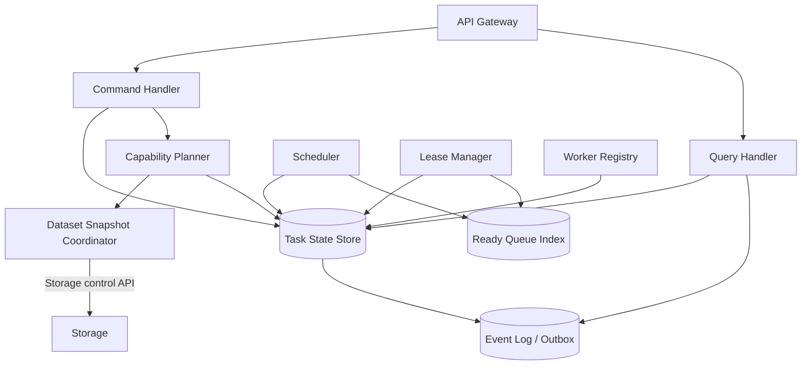
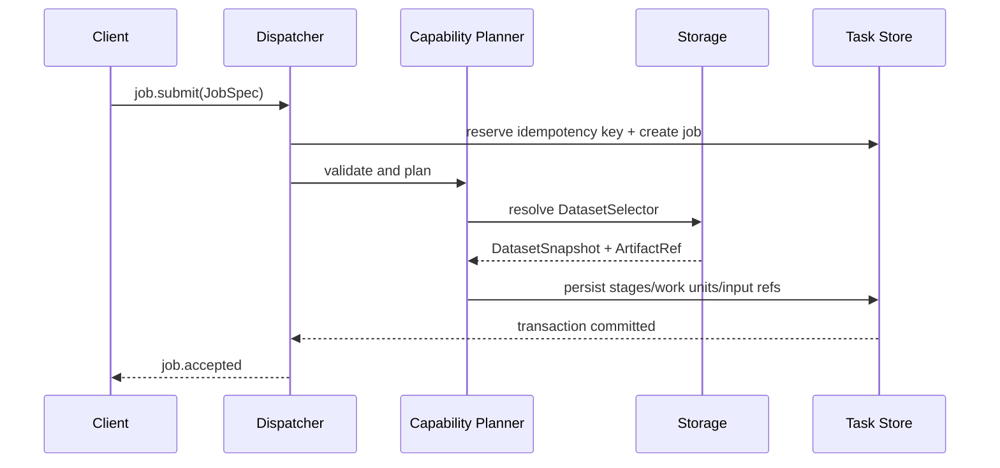
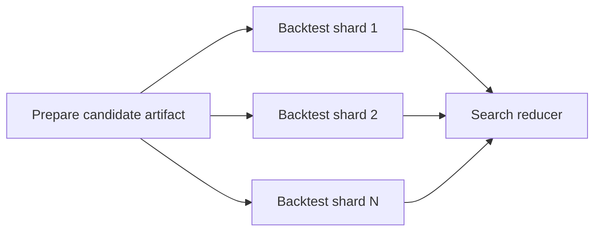
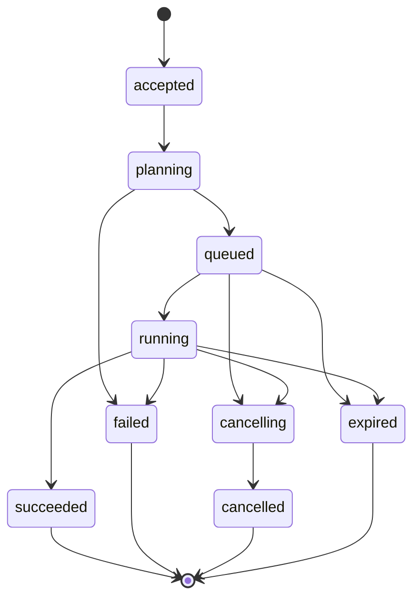
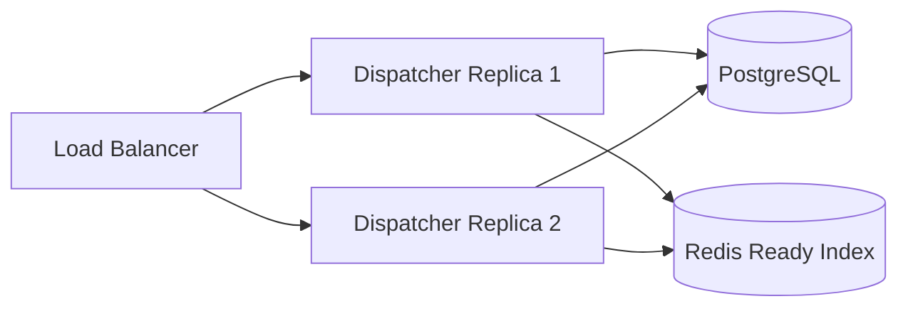

# StockStat V3.1 Dispatcher 架构设计

> 大模块：任务规划、调度与持久状态
> 日期：2026-07-20
> 状态：V3.1 设计稿
> 上位文档：[DESIGN_ARCH_V31.md](DESIGN_ARCH_V31.md)
> 协议文档：[DESIGN_PROT_V31.md](DESIGN_PROT_V31.md)

## 1. 模块定位

Dispatcher 是 `调用 -> 分发 -> {存储、n*计算}` 架构中的控制核心。它负责把一个金融 Job 解析为可执行计划，协调 Storage 固定输入快照，向 Worker 发放有租约的 WorkUnit，持久化状态和事件，并在所有 Stage 完成后发布最终 Result Manifest。

Dispatcher 不负责：

- 保存 OHLCV 主数据。
- 代理大块数据传输。
- 在自身进程中运行 pandas、指标、回测或大型归并。
- 执行用户策略代码。
- 通过进程内 dict 作为任务事实来源。

## 2. 从 V3 实现中纠正的问题

| V3 现状 | V3.1 决策 |
|---|---|
| `Dispatcher` 单类包含提交、分片、预取、Worker、合并、历史、Autoscaler | 拆为 Gateway、Planner、Scheduler、Lease Manager、State Store、Event Log |
| 任务状态保存在 `_tasks` dict | 所有状态持久化到 Task Store |
| Redis Queue 与内存 TaskState 不一致 | 队列是派生调度索引，数据库是事实来源 |
| `task_id-sN` 推断父任务 | 显式 `job_id/stage_id/work_unit_id/attempt_id` |
| Worker 离线只改状态，不可靠回收任务 | Lease 到期后以 fencing token 创建新 Attempt |
| retry 只有 TODO | 明确 attempt、退避、错误分类和最大尝试次数 |
| complete 可重复提交且无防旧结果覆盖 | `attempt_id + lease_token` 条件提交，幂等完成 |
| Dispatcher 解码 cloudpickle 并 `pd.concat` | Reducer 作为专用 WorkUnit，在 Worker 中归并 Artifact |
| 数据拉取失败吞异常并返回空数据 | 规划/快照失败是显式终态错误 |
| 多级 Dispatcher 仅登记拓扑 | V3.1 首版不做树；一个逻辑 Dispatcher 可多副本 HA |
| 抢占只改状态，未通知 Worker | 首版用取消/租约失效；仅可检查点能力支持暂停恢复 |

## 3. 内部组件



### 3.1 API Gateway

- 验证认证、授权、协议版本和请求大小。
- 解析 Contracts 模型。
- 执行 idempotency lookup。
- 将命令交给 Command Handler。
- 提供 Job 查询、事件 SSE、Worker 管理和能力查询。
- 不读取大型 Artifact 内容。

### 3.2 Command Handler

处理 `submit/cancel/retry` 等命令。每个命令在单个数据库事务中更新状态并写入 Outbox 事件，避免“状态已变但事件丢失”。

### 3.3 Capability Planner

按 `capability_id@version` 查找金融 Planner：

1. 校验参数 schema。
2. 解析输入绑定。
3. 请求 Storage 固定 DatasetSnapshot。
4. 生成 Stage DAG。
5. 生成带内部 `executor_role` 的初始 WorkUnit。
6. 计算资源请求、分片和 Reducer。
7. 将完整计划持久化。

Planner 是扩展金融能力的主要控制面扩展点。Dispatcher 核心不写 `if task_type == "grid_search"`。

### 3.4 Scheduler

Scheduler 只处理已规划的 WorkUnit：

- 依赖已满足。
- 状态为 `ready`。
- 当前时间已过 `not_before`。
- Job 未取消、未过 deadline。

Scheduler 根据 Worker capability、资源、标签、数据局部性和公平性选择候选。Worker 采用 pull + lease 模式，避免 Dispatcher 必须反向连接任意 Worker。

### 3.5 Lease Manager

Lease 是 V3.1 可靠执行的核心：

- Worker 领取 WorkUnit 时创建 Attempt。
- 返回 `lease_token`、`lease_expires_at` 和 `heartbeat_after_seconds`。
- Worker 定期续租。
- 完成、失败、进度和检查点消息都必须携带 Attempt 与 token。
- token 过期或不匹配时返回 `STALE_ATTEMPT`。
- Lease 到期后，WorkUnit 可按策略重新进入 ready。

### 3.6 Worker Registry

保存：

- Worker identity、session、状态。
- 能力 ID 和版本。
- 资源总量与实时可用量。
- Kernel build、Python ABI、平台。
- 标签、数据可达性和本地 Artifact cache 摘要。

Worker heartbeat 与 WorkLease renew 可合并为一次请求，但 Worker 身份心跳和每个 Attempt 的租约状态在模型上分离。

### 3.7 State Store

首版推荐 PostgreSQL；单机模式使用 SQLite adapter。两者实现同一 Store 接口和事务语义测试。

主要表：

```text
jobs
job_inputs
stages
work_units
attempts
job_results
artifacts
workers
worker_sessions
job_events
idempotency_keys
ingest_schedules
outbox
```

Redis 可作 ready queue 和短期 presence 加速层，但不是 Job 真相来源。

### 3.8 Ingest Schedule Trigger

为迁移现有 on-demand/cron 触发和 incremental 采集能力，Dispatcher 提供一个严格受限的采集触发器：

- Schedule 只允许创建 `finance.data.ingest` Job。
- Trigger 只支持 `manual`、`interval`、`cron`；`incremental` 属于 ingestion 参数。
- 每个触发时点使用 `schedule_id + scheduled_at` 生成幂等键。
- 持久化 `next_run_at/last_run_at/enabled`，多 Dispatcher 副本通过条件更新避免重复触发。
- 默认不补跑长时间停机期间的全部历史窗口；catch-up 策略显式配置。
- 不允许用户通过该接口定义任意 Stage DAG。

## 4. Job 规划

### 4.1 规划时序



### 4.2 规划失败

以下错误在任何 WorkUnit 发放前使 Job 进入 `rejected` 或 `failed`：

- 能力不存在或版本不支持。
- 参数 schema 错误。
- 数据 selector 无法解析。
- 输入 Artifact 不存在或摘要错误。
- 没有允许的策略包。
- 计划超过配置上限，例如 1000 万个参数组合。

`rejected` 表示请求从未成为可执行 Job；`failed` 表示 Job 已接受但规划或准备阶段失败。具体边界在协议文档中固定。

## 5. 金融计划示例

### 5.1 单次指标

```text
Stage 1: indicator.compute (1..N WorkUnits by symbol/indicator)
Stage 2: finance.indicator.compute internal reducer (only when partitioned)
```

窗口指标按时间分片时，Planner 计算 overlap；Executor 输出有效范围；Reducer 校验无缺口和重复。

### 5.2 单次回测

通常为单 WorkUnit。只有策略和数据语义允许时才按标的分片；不能默认按时间切回测，因为跨窗口持仓、现金和订单状态不可独立归并。

### 5.3 Grid Search



每个 Backtest WorkUnit 可处理一个小 batch 的参数组合，以平衡调度开销和尾延迟。batch 大小由 Planner 根据历史耗时和目标 WorkUnit 时长估算。

### 5.4 Monte Carlo

```text
baseline backtest -> returns artifact -> simulation shards -> quantile reducer
```

每个 shard 有确定的 simulation range 和 seed stream，不因重试改变随机样本。

### 5.5 Walk-forward

每个窗口是独立 Stage 子图。若窗口内含选参，则生成嵌套的内部计划模板，但不向用户暴露通用 DAG API。

### 5.6 数据采集

`finance.data.ingest` Planner 将 source、instrument、range 和 incremental watermark 展开为一个或多个 I/O WorkUnit。每个批次使用稳定 `ingest_batch_id`，Storage upsert 幂等；采集 Schedule 只负责定时创建这种 Job。

## 6. 调度策略

### 6.1 必要匹配

Worker 必须同时满足：

- capability ID/version。
- Kernel compatibility。
- CPU、内存、GPU、scratch 下限。
- 任务要求的标签或安全域。
- Artifact 可达性。

### 6.2 候选评分

首版可采用可解释加权评分：

```text
score = locality_bonus
      + free_resource_score
      + capability_warm_score
      - active_load_penalty
      - recent_failure_penalty
      - fairness_penalty
```

不在首版实现复杂机器学习调度器。

### 6.3 公平性与优先级

优先级采用数值越大越高的直觉语义，避免 V3 `-1` 高优的反直觉设计。

建议：

- `priority` 范围 `0..100`，默认 50。
- 同一租户内 priority queue。
- 跨租户使用 weighted fair queue。
- 可配置每用户最大运行 Job、最大 WorkUnit 和资源额度。
- 高优先级默认只影响等待队列，不强制抢占运行中的不可检查点任务。

### 6.4 数据局部性

Worker heartbeat 可报告缓存 Artifact 的 Bloom filter 或最近热点摘要。Scheduler 优先把引用相同大型数据快照的 WorkUnit 分给已缓存节点，减少 Dispatcher 到 Worker 的重复分发。

Storage 出口仍只需为一个不可变 Artifact 生成一次；多个 Worker 可通过共享 Artifact Store、局部缓存或 peer/cache 层读取，而不是每次查询主数据库。

## 7. 状态机

### 7.1 Job 状态



### 7.2 WorkUnit 状态

```text
blocked -> ready -> leased -> running -> succeeded
                    |          |-> failed_retryable -> ready
                    |          |-> failed_terminal
                    |          |-> cancelled
                    |-> lease_expired -> ready
```

### 7.3 Attempt 状态

Attempt 是不可回退的审计记录：`leased -> running -> succeeded|failed|expired|cancelled|stale`。

## 8. 幂等、重复与 exactly-once 边界

系统提供：

- Job submit 的效果幂等。
- Work completion 的条件幂等。
- Artifact upload 的内容幂等。
- 事件的 at-least-once 投递和 sequence 去重。

系统不承诺 Worker 计算物理 exactly-once。Lease 过期可能导致两个 Attempt 短暂并行，但只有持有当前 fencing token 的 Attempt 可提交为有效结果。金融计算应尽量无外部副作用；需要写入的任务使用幂等 Artifact/Storage commit。

## 9. 取消、超时和检查点

### 9.1 取消

`job.cancel`：

1. Job 进入 `cancelling`。
2. 未租约 WorkUnit 标记 cancelled。
3. 活跃 Attempt 收到 cancellation flag；Worker 在 renew 响应中获知。
4. 支持协作取消的 Executor 终止并确认。
5. grace period 后租约不再续期，迟到完成被 fencing 拒绝。
6. 所有 WorkUnit 终止后 Job 进入 `cancelled`。

### 9.2 Deadline

Job 和 WorkUnit 使用绝对 `deadline_at`。Dispatcher 不依赖 Client 持久在线。deadline 到期后不再发新租约，并请求取消运行 Attempt。

### 9.3 Checkpoint

只有 capability descriptor 声明 `checkpoint_mode` 的能力可保存检查点。Checkpoint 是 ArtifactRef，必须绑定：

- capability/version。
- work_unit_id。
- attempt_id。
- input snapshot digests。
- checkpoint sequence。

首批建议仅对参数搜索 batch、模拟 batch 和模型训练支持检查点；单次轻量指标不需要。

## 10. Reducer 架构

V3 Dispatcher 在内存中反序列化并归并结果，造成内存和业务耦合。V3.1 中 Reducer 是能力模块提供的 Executor：

- Reducer 仍属于原 capability 版本，是计划中的内部 WorkUnit role，不成为用户可提交的通用 `*.reduce` capability。
- Planner 将 Reducer WorkUnit 的 `executor_role` 固定为 `reduce`；普通 WorkUnit 固定为 `execute`。
- 输入为上游 ArtifactRef 列表。
- 输出为类型化聚合 Artifact。
- 可在普通 Worker 或高内存 Worker 上执行。
- 可分层归并，避免一次读取上万个分片。
- Dispatcher 只跟踪依赖和 Result Manifest。

例外：极小 JSON 标量的计数、状态和进度可在 Dispatcher 聚合；金融大型结果不在 Dispatcher 聚合。

## 11. 事件与可观测性

所有状态变化写 `job_events`：

```text
job.accepted
job.planning
job.queued
job.running
job.progress
stage.started
stage.completed
work.leased
work.started
work.checkpointed
work.retry_scheduled
work.succeeded
work.failed
job.succeeded
job.failed
job.cancelled
```

事件含单 Job 单调 `sequence`。SSE、Admin、CLI 和审计均读取同一事件日志，不再各自维护历史列表。

日志/指标：

- OpenTelemetry trace：`job_id/stage_id/work_unit_id/attempt_id`。
- Prometheus metrics：队列等待、运行时长、重试、lease expiry、Worker 资源、Artifact 吞吐。
- 结构化日志不直接包含策略源代码、token 或大参数。

## 12. 高可用与部署

### 12.1 单逻辑 Dispatcher，多副本

首版生产拓扑：



所有副本无本地权威状态。Scheduler 使用数据库条件更新或 advisory lock 保证同一 WorkUnit 不被重复创建有效租约。

### 12.2 多级 Dispatcher

V3.1 不首发多级树。原因：

- 当前真实规模尚未证明需要 100+ Worker。
- V3 的多级实现没有任务转发语义。
- HA、lease、Artifact 数据路径应先稳定。

未来若跨地域需要联邦调度，使用显式 federation contract，而不是修改 `reply_to` 原样转发所有消息。

## 13. 安全

- Client 与 Worker 使用不同身份和 scopes。
- Worker 只能领取允许能力和安全域的任务。
- Strategy package 必须签名并在 allowlist/trust policy 下执行。
- Dispatcher 不反序列化 pickle。
- Job 参数大小、Stage 数和 fan-out 有配额。
- Worker 完成回调必须验证 worker session、attempt 和 lease token。
- Admin 操作写审计事件。

## 14. 测试策略

### 14.1 状态机模型测试

- 所有合法/非法迁移。
- cancel 与 complete 竞争。
- deadline 与 renew 竞争。
- lease expiry 与迟到 complete。
- retry exhaustion。
- Dispatcher 重启后恢复。

### 14.2 Planner contract tests

每个金融 capability 有固定输入 JobSpec 与期望计划：Stage 数、WorkUnit 数、依赖、seed、overlap、Reducer。

### 14.3 多副本测试

- 两个 Scheduler 并行争抢同一 ready WorkUnit，只能产生一个当前有效 Lease。
- Outbox 重放不丢事件。
- Redis 清空后可从 PostgreSQL 重建 ready index。

### 14.4 故障注入

- Storage snapshot 超时。
- Worker 领取后崩溃。
- Worker 完成响应丢失并重发。
- Artifact 上传成功但 complete 前崩溃。
- 数据库短暂不可用。
- 大量 capability 不匹配 WorkUnit 不造成队列饥饿。

### 14.5 性能目标

| 指标 | 首版目标 |
|---|---|
| 已持久化 Job submit P95 | < 100 ms，不含数据上传 |
| Work lease P95 | < 50 ms |
| 100 Worker heartbeat/renew | 稳定无任务状态锁争用 |
| 10 万 WorkUnit 状态查询 | 分页和索引下可用 |
| Dispatcher 重启恢复 | 不丢 Job，自动回收过期 lease |

## 15. 验收标准

- Dispatcher 进程不导入 pandas/BacktestEngine。
- Job、Stage、WorkUnit、Attempt 全部持久化并可审计。
- Worker 丢失后任务能通过 Lease 自动重试。
- 迟到 Attempt 不能覆盖新结果。
- Redis/内存队列丢失不导致 Job 丢失。
- 所有大型结果归并通过 Reducer WorkUnit 完成。
- 单机 SQLite 与生产 PostgreSQL 通过相同状态机合同测试。
