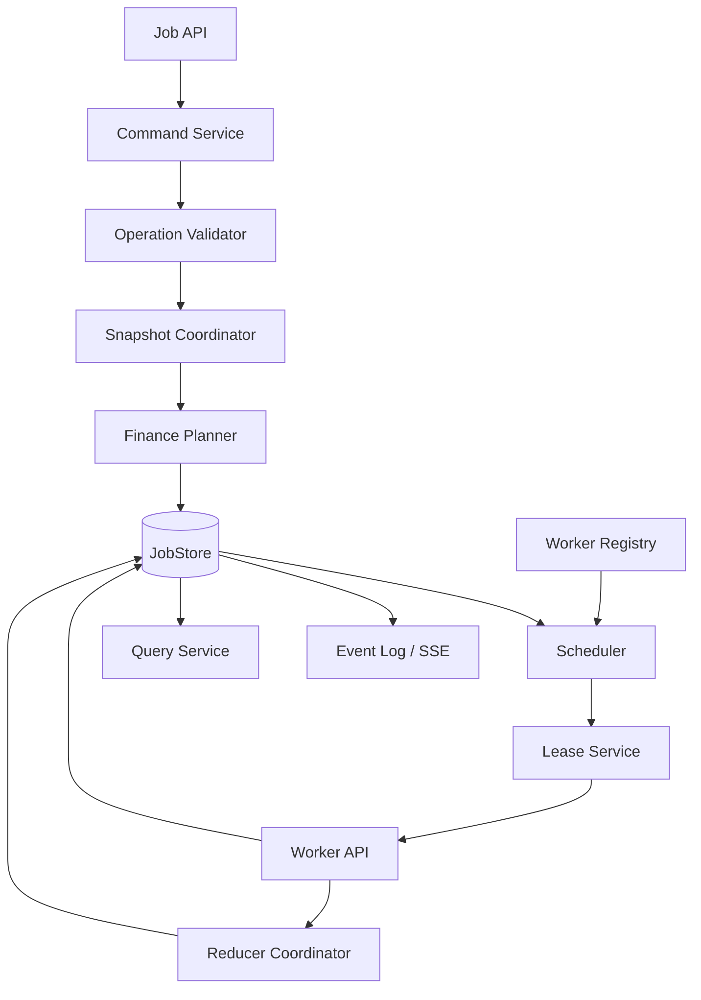
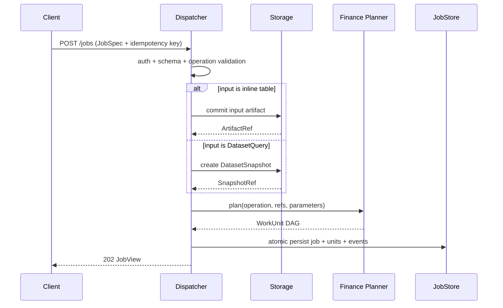
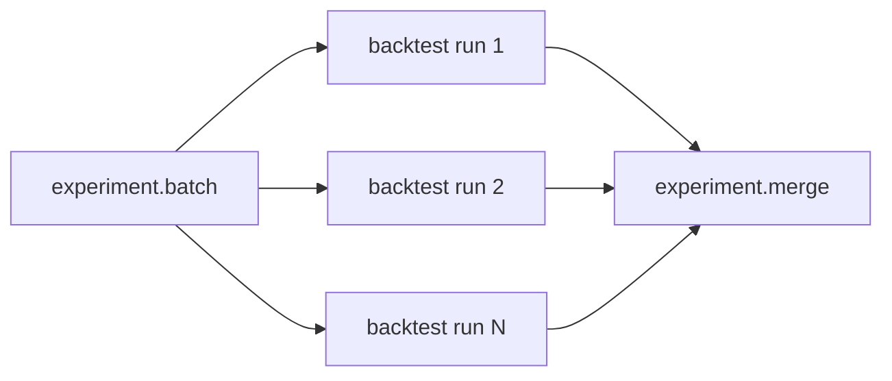
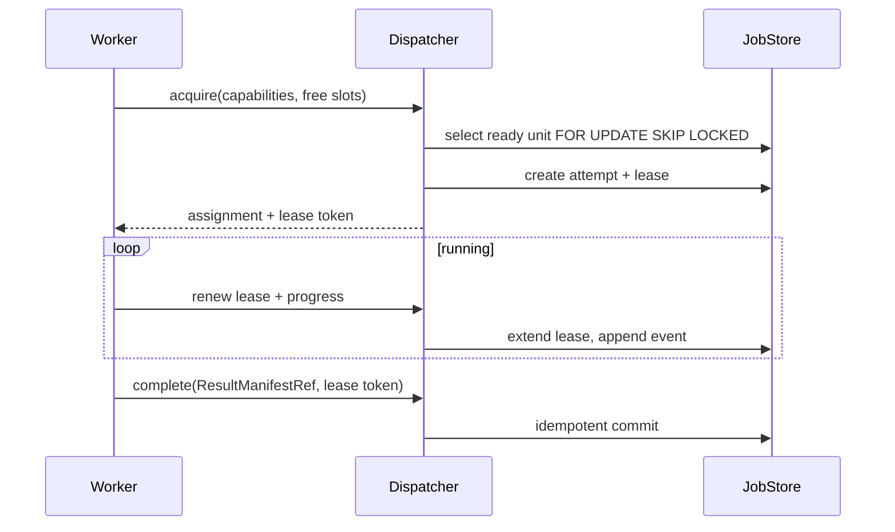

# StockStat V3.1 Dispatcher 架构设计

> 大模块：Dispatcher（金融任务控制面）
> 版本：V3.1 设计稿
> 关联：[DESIGN_ARCH_FOUNDATION_V31.md](DESIGN_ARCH_FOUNDATION_V31.md)、[DESIGN_ARCH_COMPUTE_V31.md](DESIGN_ARCH_COMPUTE_V31.md)、[DESIGN_PROT_V31.md](DESIGN_PROT_V31.md)

## 1. 模块定位

Dispatcher 是 V3.1 的金融任务控制面，负责接收 Job、校验 operation、创建数据快照、规划 WorkUnit、匹配 Worker、管理租约与重试、聚合结果引用，并向调用方提供状态和事件。

Dispatcher 明确不负责：

- 存放或转发 OHLCV/DataFrame 大数据。
- 执行指标、统计或回测算法。
- cloudpickle 解码用户策略。
- 持久化最终结果内容。
- 提供任意函数或任意 DAG 执行。

## 2. V3 Dispatcher 的结构性问题

V3 已验证 Client -> Dispatcher -> Worker 的基本图景，但实现仍是原型：

| 问题 | 影响 | V3.1 处理 |
|---|---|---|
| Job/Worker/历史在进程内 dict | Dispatcher 重启丢任务 | 持久化 JobStore |
| slice ID 通过字符串 `-s` 推导父任务 | 脆弱、不可版本化 | 显式 job_id/unit_id |
| 先出队后执行，无正式 lease | Worker 丢失时状态不清 | 租约 + attempt |
| fail 直接使整个任务失败 | 无真实重试 | 错误分类 + attempt policy |
| complete 可重复回调 | 可能重复合并 | attempt token + 幂等 commit |
| Dispatcher 内联和解码数据/结果 | 内存、带宽、版本耦合 | 只传 ArtifactRef |
| `auto` 分片缺少业务 planner | 任务类型硬编码 | operation-specific Planner |
| 多级 Dispatcher 仅登记拓扑 | 复杂度先于需求 | V3.1 首期不做级联 |
| 抢占只是状态标记 | 语义虚假 | 首期做取消/租约；可恢复抢占后置 |

## 3. 内部组件

建议独立服务：`stockstat-dispatcher`。



### 3.1 组件职责

| 组件 | 职责 |
|---|---|
| Job API | 提交、查询、取消、事件流 |
| Command Service | 幂等、权限、状态迁移事务 |
| Operation Validator | 参数 schema、输入类型、策略权限 |
| Snapshot Coordinator | 向 Storage 创建/解析 DatasetSnapshot |
| Finance Planner | 将复合 Job 展开为 WorkUnit DAG |
| JobStore | Job、Unit、Attempt、Lease、Event 持久化 |
| Worker Registry | capability、资源、版本、健康状态 |
| Scheduler | ready unit 与 Worker 匹配、公平性和优先级 |
| Lease Service | 发放、续租、过期回收 |
| Reducer Coordinator | 创建 merge/rank/aggregate unit |
| Query Service | 只读视图和集群信息 |
| Event Log | 可恢复进度订阅和审计 |

## 4. JobStore

### 4.1 首期技术选择

- 本地模式：SQLite。
- 独立部署：PostgreSQL。
- 队列不以 Redis 作为唯一事实源。
- 可选 Redis 只用于唤醒、短期通知或缓存，Job 状态以关系数据库为准。

这样避免“Redis 队列有任务但 Dispatcher 状态丢失”或反向不一致。

### 4.2 核心表

| 表 | 关键字段 |
|---|---|
| `jobs` | job_id、tenant、operation、state、state_version、spec、result_ref |
| `work_units` | unit_id、job_id、operation、dependencies、state、partition、requirements |
| `attempts` | attempt_id、unit_id、worker_id、state、started/finished、error |
| `leases` | lease_id、attempt_id、token_hash、expires_at、renewed_at |
| `workers` | worker_id、session_id、capabilities、resources、status、last_seen |
| `job_events` | event_id、job_id、sequence、type、payload、created_at |
| `idempotency_keys` | tenant、scope、key、resource_id、request_digest |

### 4.3 事务边界

关键操作必须单事务：

- 接受 Job + 写 accepted event。
- 创建 WorkUnit DAG + Job 转 queued。
- 发放 lease + 创建 attempt + unit 转 leased。
- complete 校验 token + attempt/unit 转 succeeded + 写 event。
- lease 过期 + attempt lost + unit 重回 ready 或 failed。
- cancel 标记 + 阻止新 lease。

## 5. Job 提交流程



Planner 失败时 Job 进入 `failed`，错误分类为 validation/data/planning，不产生可执行 Unit。

## 6. Planner

### 6.1 Planner 接口

```python
class Planner(Protocol):
    operation: str
    def plan(self, job: JobSpec, context: PlanningContext) -> ExecutionPlan: ...
```

Planner 属于 Finance capability 包，Dispatcher 通过注册表调用。Dispatcher 核心不硬编码 `if task_type == grid_search`。

### 6.2 典型计划

#### 单指标/单回测

```text
one execute unit
```

#### Batch



#### Grid Search

```text
canonical parameter combinations -> groups of backtest units -> rank unit
```

#### Monte Carlo

```text
global sample IDs -> deterministic sample ranges -> quantile merge unit
```

#### Walk-forward

```text
chronological windows -> independent validation units -> ordered merge unit
```

### 6.3 计划约束

- DAG 必须无环。
- Unit 数量有上限，防止参数爆炸。
- 输入引用必须已 committed。
- 每个 Unit 的 capability 和资源需求必须可计算。
- Merge 规则必须显式 operation 化。
- 用户不能直接提交内部 merge operation。

## 7. 调度模型

### 7.1 Worker Pull + Lease

V3.1 首期沿用 Worker 拉模式，但补全租约：



### 7.2 为什么不首选推模式

- Worker 常在 NAT 或防火墙后。
- Dispatcher 无需维护到每个 Worker 的长连接。
- Pull 天然表达可用 slot。
- HTTP 容易部署和测试。

### 7.3 匹配条件

硬约束：

- operation capability 及主版本。
- kernel/API 兼容范围。
- CPU arch/Python runtime（StrategyBundle 时）。
- 内存、临时盘、GPU。
- 安全 profile。
- 数据可达性标签（必要时）。

软评分：

- 已缓存 snapshot/artifact digest。
- 空闲 slot。
- 历史 operation 吞吐。
- 队列等待时间。
- zone/affinity。

### 7.4 优先级与公平性

`priority` 使用 0-100，数值越大越优先。调度排序建议：

```text
effective_priority = base_priority + aging_bonus - tenant_penalty
```

- aging 防止低优先任务饥饿。
- tenant 配额防止单用户占满集群。
- 首期不做运行中强制抢占。
- 高优先任务只优先获得新空闲 slot。

## 8. Lease、重试与至多一次提交

### 8.1 执行语义

底层是 at-least-once execution：Worker 失联后 Unit 可能重新执行。系统通过以下机制提供“结果提交至多一次”效果：

- 每次执行有唯一 attempt_id 和 lease token。
- 只有当前有效 attempt 可以提交。
- ResultManifest 先在 Storage committed。
- complete 以 `(attempt_id, manifest_digest)` 幂等。
- 旧 attempt 晚到的 complete 返回 `STALE_LEASE`，不覆盖结果。

### 8.2 重试规则

| 错误类别 | 行为 |
|---|---|
| validation/finance/code | 不重试 |
| resource | 换更大资源 Worker，受 policy 限制 |
| execution/storage/internal | 指数退避重试 |
| protocol/security | 不重试并隔离 Worker |
| lease expired | 新 attempt，旧 attempt 作废 |

重试次数属于 Job policy，但 operation descriptor 可设置上限。

### 8.3 Backoff

```text
delay = min(max_delay, base * 2^attempt + jitter)
```

不在 Worker 内睡眠重试；Dispatcher 设置 `not_before`，避免占用执行 slot。

## 9. 取消、超时与后续抢占

### 9.1 首期取消

- queued/ready Unit 直接取消。
- leased/running Unit 设置 cancel_requested。
- Worker 在 lease renew 时收到取消标记，终止子进程。
- 超过 grace period 后作废 lease。
- 已 committed 但 Job 取消竞态按 state_version 决定最终状态。

### 9.2 超时

区分：

- queue timeout。
- execution timeout。
- lease timeout。
- Job deadline。

### 9.3 抢占后置

只有 operation 声明 checkpoint protocol 后才支持可恢复抢占。V3.1 首期不把“线程无法暂停”的占位实现称为抢占。

## 10. Reducer 与结果合并

Reducer 不是 Dispatcher 进程内 `pd.concat`。它是普通 WorkUnit：

- 输入为多个 ResultManifestRef。
- 在 Worker 上执行 merge/rank/aggregate operation。
- 输出新的 ResultManifestRef。

好处：

- Dispatcher 不加载大结果。
- 合并失败可以重试。
- 合并过程有资源声明和 lineage。
- 大型 experiment table 可分层归并。

## 11. Worker 注册与健康

Worker 注册包含：

- worker_id 与本次 session_id。
- operation capabilities + implementation versions。
- resource totals。
- execution slots。
- labels/zone。
- kernel/protocol 支持范围。
- cache 摘要（可选 Bloom/Top-N digest）。
- security profiles。

心跳只报告变化快的字段，不重复完整硬件信息。

Worker 状态：`starting`、`online`、`busy`、`draining`、`offline`、`quarantined`。

## 12. 集群拓扑与扩缩容

### 12.1 首期单 Dispatcher 逻辑集群

支持一个 Dispatcher 服务实例或共享数据库的有限多副本，但只有一个逻辑调度域。暂不实现主/子 Dispatcher 级联。

### 12.2 HA 演进

当需要多副本：

- API 副本无状态。
- Scheduler 使用数据库抢锁或 leader lease。
- Worker acquire 可到任意副本。
- JobStore 保证唯一 lease。

### 12.3 Autoscaler 指标

输出事实指标，不直接输出过于简化的 true/false 建议：

- ready units by resource class。
- oldest queue age。
- arrival/completion rate。
- active/available slots。
- lease expiry rate。
- data cache hit hints。
- estimated CPU seconds backlog。

外部 Autoscaler 根据部署环境决定扩缩容。

## 13. 可观测性

### 13.1 Job 事件

事件包括：

- accepted、planned、queued。
- unit_ready、unit_leased、unit_started。
- progress、partial_available。
- retry_scheduled、worker_lost。
- cancelling、cancelled。
- succeeded、failed。

每个 Job 的 sequence 单调递增，SSE 断线可通过 `Last-Event-ID` 恢复。

### 13.2 指标

- submit latency。
- planning latency。
- queue wait。
- execution duration by operation。
- retry/error counts。
- stale completion count。
- active leases。
- JobStore transaction latency。

### 13.3 日志

日志必须带 `trace_id/job_id/unit_id/attempt_id/worker_id`，禁止只输出自由文本。

## 14. 部署模式

### 14.1 本地组合

Dispatcher 使用 SQLite JobStore，并与本地 Storage/Worker 组合在一个进程，但仍走内部端口接口和相同状态机。

### 14.2 独立服务

```text
Client -> Dispatcher API
Dispatcher -> PostgreSQL JobStore
Dispatcher -> Storage API
Workers -> Dispatcher Worker API
Workers -> Storage data API
```

### 14.3 多 Worker

不同 Worker pool 可以只安装部分 capability，例如：

- `cpu-basic`：指标、统计、渲染。
- `cpu-backtest`：回测、搜索、模拟。
- `signal`：PyWavelets/sklearn/非线性。
- `gpu-ml`：未来 ML/GPU operation。

## 15. 安全

- Client 与 Worker 使用不同凭据和权限域。
- Worker lease token 短期有效且绑定 attempt。
- Dispatcher 不接受 Worker 自报的任意 result URL，只接受已在指定 Storage committed 的 ArtifactRef。
- Worker capability 由注册和镜像/包清单共同验证。
- 多租户下 Job query、events、results 都做 tenant scope。
- 请求限流、Unit 数量上限、参数空间上限。

## 16. 测试要求

### 16.1 状态与事务

- 每条允许/禁止状态迁移。
- 并发相同 idempotency key。
- 两 Worker 竞争同一 Unit，只发一个 lease。
- lease 过期重新分配。
- stale complete 被拒绝。
- complete 重发幂等。
- Dispatcher 重启恢复 queued/running Job。

### 16.2 Planner

- batch/grid/Monte Carlo/walk-forward DAG golden tests。
- 参数组合 canonical 顺序。
- DAG 上限和环检测。
- merge unit 依赖正确。

### 16.3 调度

- capability/resource 匹配。
- priority + aging。
- tenant 公平性。
- cache affinity 只是软约束。
- draining Worker 不获得新 lease。

### 16.4 故障注入

- Worker 执行中断电。
- Storage commit 后 complete 前断线。
- complete 后响应丢失并重发。
- JobStore 短暂不可用。
- 取消与完成并发。

## 17. 结论

V3.1 Dispatcher 是持久、轻量、金融感知但算法无关的控制面。它通过 operation planner、WorkUnit DAG、租约、attempt 和结果引用，把调用、分发、存储、N 个计算节点真正解耦，同时避免提前引入多级级联、虚假抢占和通用工作流复杂度。
