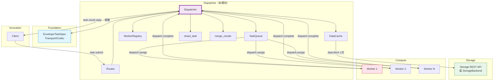
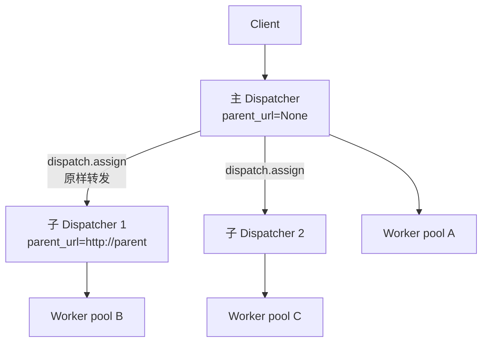

# DESIGN_ARCH_DISPATCHER_V31 — 分发端架构设计

> **模块**：Dispatcher（分发端）
> **版本**：v3.1
> **日期**：2026-07-24
> **状态**：设计稿
> **关联**：
> - [DESIGN_ARCH_V31.md](DESIGN_ARCH_V31.md) — 总设计
> - [DESIGN_ARCH_FOUNDATION_V31.md](DESIGN_ARCH_FOUNDATION_V31.md) — 基础层
> - [DESIGN_PROT_V31.md](DESIGN_PROT_V31.md) — 通讯协议
>
> **核心使命**：作为 COMPUTE_OFFLOAD_PLAN_V2_CN §2 四角色架构的**中枢**，实现"数据路径与控制路径分离"——一次性从 Storage 预取数据，分发给 N 个 Worker，合并结果。**不含任何业务计算逻辑**，只负责任务调度、数据中转、结果合并、集群管理。

---

## 目录

1. [模块定位与边界](#1-模块定位与边界)
2. [内部结构](#2-内部结构)
3. [Dispatcher 主体](#3-dispatcher-主体)
4. [任务队列 TaskQueue](#4-任务队列-taskqueue)
5. [Worker 注册表 WorkerRegistry](#5-worker-注册表-workerregistry)
6. [数据预取 DataCache](#6-数据预取-datacache)
7. [任务分片 shard_task](#7-任务分片-shard_task)
8. [结果合并 merge_results](#8-结果合并-merge_results)
9. [调度策略与优先级](#9-调度策略与优先级)
10. [抢占与 Checkpoint](#10-抢占与-checkpoint)
11. [多级 Dispatcher 拓扑](#11-多级-dispatcher-拓扑)
12. [Autoscaler 弹性伸缩](#12-autoscaler-弹性伸缩)
13. [REST API](#13-rest-api)
14. [部署形态](#14-部署形态)
15. [测试体系](#15-测试体系)

---

## 1. 模块定位与边界

### 1.1 Dispatcher 是什么

Dispatcher 是 V3.1 的**任务调度中枢**，承载：

- **任务接收**：从 Client 接收 TaskSpec（`task.submit`）
- **数据预取**：从 Storage 一次性拉取数据，缓存复用（`data.fetch`）
- **任务分片**：将重型任务切分为 N 个 slice（`shard_task`）
- **任务分发**：将 slice + 数据分发给 Worker（`dispatch.assign`）
- **结果合并**：收集 Worker 回传的部分结果，合并为完整结果（`merge_results`）
- **Worker 管理**：注册/心跳/超时检测/能力路由
- **集群拓扑**：`cluster.info` 查询
- **多级级联**：子 Dispatcher 注册与拓扑聚合
- **弹性伸缩**：Autoscaler 指标输出

### 1.2 Dispatcher 不是什么

| 不是 | 理由 |
|------|------|
| 不含计算逻辑 | 不执行 backtest/indicator/任何 task_type handler |
| 不含数据持久化 | OHLCV 存储在 Storage |
| 不含用户接口 | 无 CLI/Client SDK |
| 不感知 task_type 语义 | 只按 `dispatch_spec.split_strategy` 分片，不关心"这是回测还是小波" |

### 1.3 与 V3 的关键差异

| 维度 | V3 | V3.1 |
|------|----|------|
| 包归属 | 嵌入 `backend/stockstat_backend/dispatcher/` | **独立包 `stockstat-dispatcher`** |
| 部署形态 | Storage 插件（同机） | 独立包，可作 Storage 插件或独立部署 |
| 与 Storage 关系 | 强耦合（共享 SQLAlchemy） | **松耦合**（通过 HTTP 或 StorageBackend Protocol） |
| 业务感知 | V3 的 Dispatcher 不感知 task_type | V3.1 同样不感知，但分片策略更丰富 |

### 1.4 核心设计原则（来自 COMPUTE_OFFLOAD_PLAN_V2_CN）

> **数据路径与控制路径分离**：
> - 控制面（Client ↔ Dispatcher）：轻量 JSON，KB 级
> - 数据面（Dispatcher ↔ Storage）：一次性拉取，MB~GB 级
> - 分发面（Dispatcher ↔ Worker）：数据 + 任务，按策略选择 inline/shm/stream/ref
>
> **Storage 带宽从 ×N 降为 ×1**：N 个 Worker 不直接访问 Storage，Dispatcher 预取一次后分发给所有 Worker。

---

## 2. 内部结构

```
packages/dispatcher/stockstat_dispatcher/
├── __init__.py                  # 导出 Dispatcher, DispatcherPlugin, DispatcherApp
├── app.py                       # DispatcherApp（独立 FastAPI 应用）
├── plugin.py                    # DispatcherPlugin（挂载到 Storage 的 FastAPI）
├── core.py                      # Dispatcher 主体（状态管理 + 调度循环）
├── queue.py                     # TaskQueue（Memory / Redis）
├── workers.py                   # WorkerRegistry（注册/心跳/超时/统计）
├── prefetch.py                  # DataCache（LRU + 命中率）
├── shard.py                     # shard_task（param_wise/symbol_wise/time_wise）
├── merge.py                     # merge_results（按 task_type 合并）
├── routes.py                    # FastAPI 路由（/dispatch/* + /api/v1/tasks/*）
├── cluster.py                   # 多级 Dispatcher 拓扑
├── autoscaler.py                # Autoscaler 指标
├── history.py                   # 任务历史记录
└── cli.py                       # stockstat-dispatcher CLI
```

### 2.1 依赖关系


```mermaid
graph TB
    subgraph "Dispatcher（本模块）"
        D[Dispatcher]
        Q[TaskQueue]
        WR[WorkerRegistry]
        DC[DataCache]
        SH[shard_task]
        MG[merge_results]
        RT[Routes]
    end

    subgraph "Foundation"
        F[Envelope/TaskSpec<br/>Transport/Codec]
    end

    subgraph "Storage"
        S[Storage REST API<br/>或 StorageBackend]
    end

    subgraph "Compute"
        W1[Worker 1]
        W2[Worker 2]
        WN[Worker N]
    end

    subgraph "Invocation"
        C[Client]
    end

    C -->|task.submit| RT
    RT --> D
    D --> Q
    D --> DC
    DC -->|data.fetch 1次| S
    D --> SH
    D --> MG
    D --> WR

    Q -->|dispatch.assign| W1
    Q -->|dispatch.assign| W2
    Q -->|dispatch.assign| WN

    W1 -->|dispatch.complete| D
    W2 -->|dispatch.complete| D
    WN -->|dispatch.complete| D

    D -->|task.result.reply| C

    D -->|依赖| F

    style D fill:#f3e5f5,stroke:#7b1fa2,stroke-width:3px
    style F fill:#e1f5ff,stroke:#0288d1
    style S fill:#e8f5e9,stroke:#388e3c
    style W1 fill:#fce4ec,stroke:#c62828
```

---

## 3. Dispatcher 主体

### 3.1 类定义

```python
# core.py
from __future__ import annotations
import threading
import time
from datetime import datetime
from typing import Optional
from stockstat_foundation import (
    TaskSpec, TaskInfo, TaskState, Envelope, Headers,
    Config, Transport, StorageBackend,
)


class Dispatcher:
    """Central task dispatcher — V3.1 核心。

    职责：
    1. 接收 Client 提交的 TaskSpec
    2. 从 Storage 预取数据（1 次）
    3. 分片为 N 个 slice
    4. 分发给 Worker（按 capability 路由）
    5. 收集部分结果，合并为完整结果
    6. 返回给 Client

    不含：
    - 业务计算逻辑（Worker 负责）
    - 数据持久化（Storage 负责）
    """

    def __init__(
        self,
        *,
        queue: Optional["TaskQueue"] = None,
        storage_url: Optional[str] = None,
        storage_backend: Optional[StorageBackend] = None,
        cache_dir: Optional[str] = None,
        cache_size_mb: int = 512,
        offline_timeout: float = 30.0,
        alias: str = "dispatch-primary",
        parent_url: Optional[str] = None,
        config: Optional[Config] = None,
    ):
        self._config = config or Config.from_env()
        self._queue = queue or self._build_queue()
        self._storage_url = storage_url
        self._storage_backend = storage_backend  # 可选，直连 Storage
        self._cache = DataCache(cache_dir, max_size_mb=cache_size_mb)
        self._workers = WorkerRegistry(offline_timeout=offline_timeout)
        self._tasks: dict[str, _TaskState] = {}
        self._lock = threading.Lock()
        self._alias = alias
        self._parent_url = parent_url
        self._sub_dispatchers: dict[str, dict] = {}
        self._task_history: list[dict] = []
        self._history_max = 1000
        self._started_at = datetime.utcnow()

        # 后台线程
        self._checker = threading.Thread(target=self._check_loop, daemon=True)
        self._checker.start()

    def _build_queue(self) -> "TaskQueue":
        """根据 config 选择队列实现。"""
        if self._config.dispatcher_queue == "redis":
            if not self._config.redis_url:
                raise ValueError("redis_url required for redis queue")
            return RedisTaskQueue(self._config.redis_url)
        return MemoryTaskQueue()

    # ── Client 接口（经 routes.py 转入）──

    def submit(self, spec: TaskSpec) -> dict:
        """接收 task.submit，返回 {task_id, status, n_slices}。"""
        with self._lock:
            self._tasks[spec.task_id] = _TaskState(
                spec=spec,
                info=TaskInfo(
                    task_id=spec.task_id,
                    state=TaskState.PENDING,
                    n_slices=1,
                ),
            )
        # 分片
        slices = shard_task(spec)
        self._tasks[spec.task_id].slices = slices
        self._tasks[spec.task_id].info.n_slices = len(slices)
        # 入队
        for slice_spec in slices:
            self._queue.enqueue(slice_spec)
        return {
            "task_id": spec.task_id,
            "status": "pending",
            "n_slices": len(slices),
        }

    def get_status(self, task_id: str) -> dict:
        state = self._tasks.get(task_id)
        if state is None:
            raise TaskNotFoundError(f"Task {task_id} not found")
        info = state.info
        return {
            "task_id": info.task_id,
            "state": info.state.value,
            "progress": info.progress,
            "n_slices": info.n_slices,
            "completed_slices": info.completed_slices,
            "worker_id": info.worker_id,
            "error": info.error,
            "created_at": info.created_at.isoformat(),
            "started_at": info.started_at.isoformat() if info.started_at else None,
            "finished_at": info.finished_at.isoformat() if info.finished_at else None,
        }

    def get_result(self, task_id: str) -> bytes:
        state = self._tasks.get(task_id)
        if state is None:
            raise TaskNotFoundError(f"Task {task_id} not found")
        if state.info.state != TaskState.COMPLETED:
            raise TaskNotReadyError(state.info.state.value)
        return state.merged_result_bytes

    def cancel(self, task_id: str) -> bool:
        state = self._tasks.get(task_id)
        if state is None:
            return False
        # 通知 Worker 取消
        for slice_id, worker_id in state.assigned_slices.items():
            self._send_to_worker(worker_id, Envelope(
                type="task.cancel",
                payload={"task_id": task_id, "slice_id": slice_id},
            ))
        state.info.state = TaskState.CANCELLED
        state.info.finished_at = datetime.utcnow()
        self._record_history(state)
        return True

    # ── Worker 接口 ──

    def register_worker(self, msg: dict) -> dict:
        wid = self._workers.register(msg)
        return {"worker_id": wid, "status": "registered"}

    def heartbeat(self, msg: dict):
        self._workers.update_heartbeat(msg)

    def unregister_worker(self, worker_id: str):
        self._workers.unregister(worker_id)

    def assign_task(self, worker_id: str, capabilities: list[str]) -> Optional[dict]:
        """Worker 拉取任务 — capability 过滤。"""
        # 循环出队直到找到匹配 capability 的 slice
        skipped = []
        while True:
            spec = self._queue.dequeue(block=False)
            if spec is None:
                # 把跳过的重新入队
                for s in skipped:
                    self._queue.enqueue(s)
                return None
            task_type = spec.compute_spec.task_type
            if task_type in capabilities or "custom" in capabilities:
                # 匹配，准备分发
                return self._prepare_assignment(spec, worker_id)
            skipped.append(spec)

    def _prepare_assignment(self, spec: TaskSpec, worker_id: str) -> dict:
        """准备任务分派：预取数据 + 编码。"""
        # 1. 预取数据（如未缓存）
        data_ref = self._prefetch_data(spec)
        # 2. 更新任务状态
        parent_id = spec.task_id.rsplit("-s", 1)[0] if "-s" in spec.task_id else spec.task_id
        parent_state = self._tasks.get(parent_id)
        if parent_state:
            parent_state.assigned_slices[spec.task_id] = worker_id
            if parent_state.info.state == TaskState.PENDING:
                parent_state.info.state = TaskState.RUNNING
                parent_state.info.started_at = datetime.utcnow()
            parent_state.info.worker_id = worker_id
        # 3. Worker 计数
        self._workers.increment_active(worker_id)
        # 4. 编码数据（base64 cloudpickle）
        data_bytes = self._cache.fetch_bytes(data_ref)
        data_b64 = base64.b64encode(data_bytes).decode("ascii")
        return {
            "task_spec": spec.to_dict(),
            "data_ref": data_ref,
            "data": data_b64,
            "data_codec": "cloudpickle",
        }

    def on_complete(self, worker_id: str, slice_id: str, result_b64: str):
        """Worker 回传结果。"""
        result_bytes = base64.b64decode(result_b64)
        parent_id = slice_id.rsplit("-s", 1)[0] if "-s" in slice_id else slice_id
        state = self._tasks.get(parent_id)
        if state is None:
            return
        state.partial_results[slice_id] = result_bytes
        state.info.completed_slices += 1
        state.info.progress = state.info.completed_slices / state.info.n_slices
        self._workers.decrement_active(worker_id, completed=True)
        # 检查是否全部完成
        if state.info.completed_slices == state.info.n_slices:
            state.merged_result_bytes = merge_results(state)
            state.info.state = TaskState.COMPLETED
            state.info.finished_at = datetime.utcnow()
            state.info.progress = 1.0
            self._record_history(state)

    def on_fail(self, worker_id: str, slice_id: str, error: dict):
        """Worker 上报失败。"""
        parent_id = slice_id.rsplit("-s", 1)[0] if "-s" in slice_id else slice_id
        state = self._tasks.get(parent_id)
        if state is None:
            return
        state.info.state = TaskState.FAILED
        state.info.error = error.get("error_message", "Unknown error")
        state.info.finished_at = datetime.utcnow()
        self._workers.decrement_active(worker_id, completed=False, failed=True)
        # 重试（如可重试）
        if error.get("retryable", False) and state.info.retry_count < 3:
            state.info.retry_count += 1
            state.info.state = TaskState.PENDING
            self._queue.enqueue(state.spec)
        else:
            self._record_history(state)

    def on_partial(self, slice_id: str, partial: dict):
        """Worker 流式部分结果。"""
        parent_id = slice_id.rsplit("-s", 1)[0] if "-s" in slice_id else slice_id
        state = self._tasks.get(parent_id)
        if state is None:
            return
        state.stream_partials.append(partial)

    # ── 数据预取 ──

    def _prefetch_data(self, spec: TaskSpec) -> str:
        """从 Storage 预取数据，返回 data_ref。"""
        cache_key = spec.data_spec.cache_key()
        # 命中缓存？
        if ref := self._cache.get_ref(cache_key):
            return ref
        # 未命中：从 Storage 拉取
        data = self._fetch_from_storage(spec.data_spec)
        data_bytes = CloudpickleCodec().encode(data)
        return self._cache.put(cache_key, data_bytes)

    def _fetch_from_storage(self, data_spec: DataSpec) -> Any:
        """从 Storage 拉取数据（HTTP 或直连）。"""
        if self._storage_backend is not None:
            # 直连 Storage（同进程或 StorageBackend Protocol）
            return self._storage_backend.fetch_ohlcv(
                symbols=data_spec.symbols,
                timeframe=data_spec.timeframe,
                start=data_spec.start,
                end=data_spec.end,
                source=data_spec.source,
            )
        # HTTP 访问 Storage
        import httpx
        from stockstat_foundation import ArrowCodec
        params = {
            "symbol": ",".join(data_spec.symbols),
            "timeframe": data_spec.timeframe,
        }
        if data_spec.start: params["start"] = data_spec.start
        if data_spec.end: params["end"] = data_spec.end
        resp = httpx.get(f"{self._storage_url}/api/v1/ohlcv", params=params)
        return ArrowCodec().decode(resp.content)

    # ── 集群信息 ──

    def cluster_info(self, **kwargs) -> dict:
        return {
            "dispatcher": {
                "id": self._alias,
                "alias": self._alias,
                "address": self._storage_url or "in-process",
                "status": "online",
                "uptime_s": (datetime.utcnow() - self._started_at).total_seconds(),
                "queue_depth": self._queue.size(),
                "cache_size_mb": self._cache.size_mb(),
                "cache_hit_rate": self._cache.hit_rate(),
            },
            "workers": self._workers.list_workers(**kwargs),
            "sub_dispatchers": list(self._sub_dispatchers.values()),
            "stats": self._workers.stats(),
        }

    # ── 后台线程 ──

    def _check_loop(self):
        """心跳超时检测。"""
        while True:
            time.sleep(10)
            timed_out = self._workers.check_timeouts()
            for worker_id in timed_out:
                # 重新分配该 Worker 的任务
                self._reassign_worker_tasks(worker_id)

    def _reassign_worker_tasks(self, worker_id: str):
        """Worker 超时后，重新分配其任务。"""
        for state in self._tasks.values():
            for slice_id, wid in list(state.assigned_slices.items()):
                if wid == worker_id:
                    del state.assigned_slices[slice_id]
                    self._queue.enqueue(state.slices_by_id[slice_id])

    def _record_history(self, state: _TaskState):
        """记录任务历史。"""
        self._task_history.append({
            "task_id": state.info.task_id,
            "task_type": state.spec.compute_spec.task_type,
            "state": state.info.state.value,
            "created_at": state.info.created_at.isoformat(),
            "started_at": state.info.started_at.isoformat() if state.info.started_at else None,
            "finished_at": state.info.finished_at.isoformat() if state.info.finished_at else None,
            "duration_s": (state.info.finished_at - state.info.started_at).total_seconds()
                          if state.info.started_at and state.info.finished_at else None,
            "worker_id": state.info.worker_id,
            "error": state.info.error,
            "trace_id": state.spec.trace_id,
        })
        if len(self._task_history) > self._history_max:
            self._task_history = self._task_history[-self._history_max:]
```

### 3.2 _TaskState 内部结构

```python
@dataclass
class _TaskState:
    spec: TaskSpec
    info: TaskInfo
    slices: list[TaskSpec] = field(default_factory=list)
    slices_by_id: dict[str, TaskSpec] = field(default_factory=dict)
    assigned_slices: dict[str, str] = field(default_factory=dict)  # slice_id -> worker_id
    partial_results: dict[str, bytes] = field(default_factory=dict)
    merged_result_bytes: bytes = b""
    stream_partials: list[dict] = field(default_factory=list)
```

---

## 4. 任务队列 TaskQueue

### 4.1 Protocol

```python
# queue.py
class TaskQueue(Protocol):
    """任务队列抽象。"""
    def enqueue(self, spec: TaskSpec) -> None: ...
    def dequeue(self, block: bool = True, timeout: Optional[float] = None) -> Optional[TaskSpec]: ...
    def size(self) -> int: ...
    def clear(self) -> None: ...
```

### 4.2 MemoryTaskQueue

```python
class MemoryTaskQueue:
    """进程内队列 — queue.Queue + 优先级支持。"""
    name = "memory"

    def __init__(self):
        # 优先级队列：priority 越小越优先（-1 高，0 普通，1 低）
        self._queue = queue.PriorityQueue()

    def enqueue(self, spec: TaskSpec):
        priority = spec.dispatch_spec.priority
        self._queue.put((priority, spec.task_id, spec))

    def dequeue(self, block=False, timeout=None):
        try:
            _, _, spec = self._queue.get(block=block, timeout=timeout)
            return spec
        except queue.Empty:
            return None

    def size(self) -> int:
        return self._queue.qsize()
```

### 4.3 RedisTaskQueue

```python
class RedisTaskQueue:
    """Redis 队列 — 跨进程持久化 + 优先级。"""
    name = "redis"

    def __init__(self, redis_url: str, queue_key: str = "stockstat:tasks"):
        import redis
        self._r = redis.from_url(redis_url)
        self._queue_key = queue_key
        # 三个优先级列表
        self._high_key = f"{queue_key}:high"
        self._normal_key = f"{queue_key}:normal"
        self._low_key = f"{queue_key}:low"

    def enqueue(self, spec: TaskSpec):
        from stockstat_foundation import JsonCodec
        data = JsonCodec().encode(spec.to_dict())
        priority = spec.dispatch_spec.priority
        if priority < 0:
            self._r.lpush(self._high_key, data)
        elif priority > 0:
            self._r.lpush(self._low_key, data)
        else:
            self._r.lpush(self._normal_key, data)

    def dequeue(self, block=False, timeout=None):
        # 优先级顺序：high → normal → low
        for key in [self._high_key, self._normal_key, self._low_key]:
            data = self._r.rpop(key)
            if data is not None:
                from stockstat_foundation import JsonCodec
                return TaskSpec.from_dict(JsonCodec().decode(data))
        if block:
            result = self._r.brpop(
                [self._high_key, self._normal_key, self._low_key],
                timeout=int(timeout or 0))
            if result:
                _, data = result
                from stockstat_foundation import JsonCodec
                return TaskSpec.from_dict(JsonCodec().decode(data))
        return None

    def size(self) -> int:
        return sum(self._r.llen(k) for k in
                   [self._high_key, self._normal_key, self._low_key])
```

### 4.4 build_queue 工厂

```python
def build_queue(backend: str = "memory", redis_url: str = None) -> TaskQueue:
    if backend == "redis":
        if not redis_url:
            raise ValueError("redis_url required for redis queue")
        return RedisTaskQueue(redis_url)
    return MemoryTaskQueue()
```

---

## 5. Worker 注册表 WorkerRegistry

### 5.1 WorkerRecord

```python
# workers.py
@dataclass
class WorkerRecord:
    worker_id: str
    alias: str
    address: str
    port: int
    concurrency: int
    hardware: dict
    capabilities: list[str]
    stockstat_version: str
    labels: dict
    preemptable: bool
    status: str = "online"          # online/busy/draining/offline
    last_heartbeat: float = field(default_factory=time.time)
    active_tasks: int = 0
    completed_tasks: int = 0
    failed_tasks: int = 0
    avg_task_duration_s: float = 0.0
    registered_at: datetime = field(default_factory=datetime.utcnow)
    last_load: dict = field(default_factory=dict)
```

### 5.2 WorkerRegistry

```python
class WorkerRegistry:
    """Worker 注册表 — 注册/心跳/超时/统计。"""

    def __init__(self, offline_timeout: float = 30.0):
        self._workers: dict[str, WorkerRecord] = {}
        self._offline_timeout = offline_timeout
        self._lock = threading.Lock()

    def register(self, msg: dict) -> str:
        """Worker 注册，返回 worker_id。"""
        wid = msg.get("worker_id") or str(uuid.uuid4())
        with self._lock:
            self._workers[wid] = WorkerRecord(
                worker_id=wid,
                alias=msg.get("alias", wid),
                address=msg.get("address", ""),
                port=msg.get("port", 0),
                concurrency=msg.get("concurrency", 1),
                hardware=msg.get("hardware", {}),
                capabilities=msg.get("capabilities", []),
                stockstat_version=msg.get("stockstat_version", ""),
                labels=msg.get("labels", {}),
                preemptable=msg.get("preemptable", False),
            )
        return wid

    def update_heartbeat(self, msg: dict):
        """更新心跳。"""
        wid = msg["worker_id"]
        with self._lock:
            w = self._workers.get(wid)
            if w is None: return
            w.last_heartbeat = time.time()
            w.last_load = msg.get("load", {})
            w.active_tasks = msg.get("active_tasks", 0)
            w.completed_tasks = msg.get("completed_tasks", w.completed_tasks)
            w.failed_tasks = msg.get("failed_tasks", w.failed_tasks)
            w.avg_task_duration_s = msg.get("avg_task_duration_s", w.avg_task_duration_s)
            w.status = msg.get("status", "online")
            if w.active_tasks >= w.concurrency and w.status == "online":
                w.status = "busy"
            elif w.active_tasks < w.concurrency and w.status == "busy":
                w.status = "online"

    def unregister(self, worker_id: str):
        with self._lock:
            if worker_id in self._workers:
                self._workers[worker_id].status = "offline"

    def increment_active(self, worker_id: str):
        with self._lock:
            w = self._workers.get(worker_id)
            if w:
                w.active_tasks += 1
                if w.active_tasks >= w.concurrency:
                    w.status = "busy"

    def decrement_active(self, worker_id: str, completed: bool = True, failed: bool = False):
        with self._lock:
            w = self._workers.get(worker_id)
            if w:
                w.active_tasks = max(0, w.active_tasks - 1)
                if completed: w.completed_tasks += 1
                if failed: w.failed_tasks += 1
                if w.active_tasks < w.concurrency and w.status == "busy":
                    w.status = "online"

    def check_timeouts(self) -> list[str]:
        """检测心跳超时的 Worker。"""
        now = time.time()
        timed_out = []
        with self._lock:
            for w in self._workers.values():
                if w.status in ("online", "busy"):
                    if now - w.last_heartbeat > self._offline_timeout:
                        w.status = "offline"
                        timed_out.append(w.worker_id)
        return timed_out

    def list_workers(self, *, include_offline: bool = False,
                     include_hardware: bool = True,
                     filter_labels: Optional[dict] = None) -> list[dict]:
        """列出 Worker。"""
        result = []
        with self._lock:
            for w in self._workers.values():
                if w.status == "offline" and not include_offline:
                    continue
                if filter_labels:
                    if not all(w.labels.get(k) == v for k, v in filter_labels.items()):
                        continue
                d = {
                    "worker_id": w.worker_id,
                    "alias": w.alias,
                    "address": w.address,
                    "port": w.port,
                    "status": w.status,
                    "concurrency": w.concurrency,
                    "active_tasks": w.active_tasks,
                    "completed_tasks": w.completed_tasks,
                    "failed_tasks": w.failed_tasks,
                    "avg_task_duration_s": w.avg_task_duration_s,
                    "last_heartbeat": datetime.utcfromtimestamp(w.last_heartbeat).isoformat(),
                    "capabilities": w.capabilities,
                    "stockstat_version": w.stockstat_version,
                    "labels": w.labels,
                    "load": w.last_load,
                }
                if include_hardware:
                    d["hardware"] = w.hardware
                result.append(d)
        return result

    def stats(self) -> dict:
        with self._lock:
            total = len(self._workers)
            online = sum(1 for w in self._workers.values() if w.status == "online")
            busy = sum(1 for w in self._workers.values() if w.status == "busy")
            offline = sum(1 for w in self._workers.values() if w.status == "offline")
            total_concurrency = sum(w.concurrency for w in self._workers.values())
            available_concurrency = sum(
                max(0, w.concurrency - w.active_tasks) for w in self._workers.values()
                if w.status in ("online", "busy"))
            active_tasks = sum(w.active_tasks for w in self._workers.values())
            total_completed = sum(w.completed_tasks for w in self._workers.values())
            total_failed = sum(w.failed_tasks for w in self._workers.values())
        return {
            "total_workers": total,
            "online_workers": online,
            "busy_workers": busy,
            "offline_workers": offline,
            "total_concurrency": total_concurrency,
            "available_concurrency": available_concurrency,
            "active_tasks": active_tasks,
            "total_completed": total_completed,
            "total_failed": total_failed,
        }
```

---

## 6. 数据预取 DataCache

### 6.1 设计

DataCache 是 Dispatcher 的**数据中转站**——从 Storage 一次性拉取数据，缓存复用，分发给所有 Worker。

```python
# prefetch.py
class DataCache:
    """数据预取缓存 — LRU + 命中率统计。

    缓存键：DataSpec.cache_key() = sha256(symbols+timeframe+start+end+source)
    缓存值：bytes（cloudpickle 编码的数据）
    淘汰策略：LRU，按 max_size_mb 限制
    """

    def __init__(self, cache_dir: Optional[str] = None, *, max_size_mb: int = 512):
        self._cache_dir = cache_dir
        self._max_size_bytes = max_size_mb * 1024 * 1024
        self._cache: dict[str, _CacheEntry] = {}  # 内存缓存
        self._total_size = 0
        self._hits = 0
        self._misses = 0
        self._lock = threading.Lock()
        # 可选磁盘缓存
        if cache_dir:
            import os
            os.makedirs(cache_dir, exist_ok=True)

    def get_ref(self, key: str) -> Optional[str]:
        """获取数据引用（不返回数据本身，仅返回 cache://key）。"""
        with self._lock:
            entry = self._cache.get(key)
            if entry is None:
                self._misses += 1
                return None
            self._hits += 1
            entry.last_access = time.time()
            return f"cache://{key}"

    def fetch_bytes(self, ref: str) -> bytes:
        """根据 data_ref 获取数据 bytes。"""
        if ref.startswith("cache://"):
            key = ref[len("cache://"):]
            return self._cache[key].data
        if ref.startswith("inline:"):
            import base64
            return base64.b64decode(ref[len("inline:"):])
        raise ValueError(f"Unknown data_ref: {ref}")

    def put(self, key: str, data: bytes) -> str:
        """存入数据，返回 cache://key 引用。"""
        with self._lock:
            # LRU 淘汰
            while self._total_size + len(data) > self._max_size_bytes and self._cache:
                self._evict_lru()
            self._cache[key] = _CacheEntry(data=data, size=len(data),
                                            last_access=time.time())
            self._total_size += len(data)
            return f"cache://{key}"

    def _evict_lru(self):
        """淘汰最久未访问的条目。"""
        if not self._cache:
            return
        oldest_key = min(self._cache, key=lambda k: self._cache[k].last_access)
        entry = self._cache.pop(oldest_key)
        self._total_size -= entry.size

    def size_mb(self) -> float:
        return self._total_size / (1024 * 1024)

    def hit_rate(self) -> float:
        total = self._hits + self._misses
        return self._hits / total if total > 0 else 0.0

    def invalidate(self, key: str):
        with self._lock:
            entry = self._cache.pop(key, None)
            if entry:
                self._total_size -= entry.size

    def clear(self):
        with self._lock:
            self._cache.clear()
            self._total_size = 0


@dataclass
class _CacheEntry:
    data: bytes
    size: int
    last_access: float
```

### 6.2 缓存命中率优化

| 场景 | 命中率 | 优化 |
|------|--------|------|
| 同一数据集多次 grid_search | 高 | 缓存复用 |
| 不同 symbol 的 batch_backtest | 低 | 每 symbol 独立缓存 |
| PAXG v5-redo 132 次回测 | 高 | 33 策略共用同一 PAXG 数据 |

---

## 7. 任务分片 shard_task

### 7.1 分片策略

```python
# shard.py
def shard_task(spec: TaskSpec) -> list[TaskSpec]:
    """将 TaskSpec 分片为 N 个 slice。

    策略由 spec.dispatch_spec.split_strategy 决定：
    - none/auto：不分片，返回 [spec]
    - param_wise：按 param_grid 切分（grid_search/batch_backtest）
    - symbol_wise：按 symbol 切分（多标的回测）
    - time_wise：按时间窗口切分（walkforward/大范围回测）
    """
    strategy = spec.dispatch_spec.split_strategy
    if strategy in ("none", "auto", ""):
        return [spec]
    if strategy == "param_wise":
        return _shard_param_wise(spec)
    if strategy == "symbol_wise":
        return _shard_symbol_wise(spec)
    if strategy == "time_wise":
        return _shard_time_wise(spec)
    return [spec]


def _shard_param_wise(spec: TaskSpec) -> list[TaskSpec]:
    """按参数网格切分。

    grid_search: param_grid 笛卡尔积 → N 个 chunk
    batch_backtest: strategies × fee_models 笛卡尔积 → N 个 chunk
    """
    cs = spec.compute_spec
    if cs.task_type == "grid_search" and cs.param_grid:
        # 笛卡尔积
        keys = list(cs.param_grid.keys())
        values = list(cs.param_grid.values())
        combos = list(itertools.product(*values))
        # 分组为 chunks（每 chunk max_workers 个组合）
        max_workers = spec.dispatch_spec.max_workers or 1
        chunk_size = max(1, len(combos) // max_workers) if max_workers else len(combos)
        chunks = [combos[i:i+chunk_size] for i in range(0, len(combos), chunk_size)]
        slices = []
        for i, chunk in enumerate(chunks):
            sub_grid = {k: [combo[j] for combo in chunk]
                        for j, k in enumerate(keys)}
            slice_spec = _clone_slice(spec, f"-s{i}", param_grid=sub_grid)
            slices.append(slice_spec)
        return slices
    if cs.task_type == "batch_backtest" and cs.strategies:
        # strategies × fee_models 笛卡尔积
        fee_models = cs.fee_models or [None]
        combos = [(s, f) for s in cs.strategies for f in fee_models]
        max_workers = spec.dispatch_spec.max_workers or 1
        chunk_size = max(1, len(combos) // max_workers)
        chunks = [combos[i:i+chunk_size] for i in range(0, len(combos), chunk_size)]
        slices = []
        for i, chunk in enumerate(chunks):
            sub_strategies = {name: ref for (name, _), _ in [(c, None) for c in chunk] for name, ref in [(c[0], cs.strategies[c[0]])]}
            sub_fees = list(set(c[1] for c in chunk))
            slice_spec = _clone_slice(spec, f"-s{i}",
                                       strategies=sub_strategies,
                                       fee_models=sub_fees)
            slices.append(slice_spec)
        return slices
    return [spec]


def _shard_symbol_wise(spec: TaskSpec) -> list[TaskSpec]:
    """按 symbol 切分 — 每标的一个 slice。"""
    symbols = spec.data_spec.symbols
    if len(symbols) <= 1:
        return [spec]
    slices = []
    for i, sym in enumerate(symbols):
        sub_data = DataSpec(symbols=[sym], timeframe=spec.data_spec.timeframe,
                            start=spec.data_spec.start, end=spec.data_spec.end,
                            source=spec.data_spec.source)
        slice_spec = _clone_slice(spec, f"-s{i}", data_spec=sub_data)
        slices.append(slice_spec)
    return slices


def _shard_time_wise(spec: TaskSpec) -> list[TaskSpec]:
    """按时间窗口切分。"""
    # 简化实现：均分时间范围
    return [spec]


def _clone_slice(spec: TaskSpec, suffix: str, **overrides) -> TaskSpec:
    """克隆 TaskSpec 为 slice，添加后缀。"""
    import copy
    new_spec = copy.deepcopy(spec)
    new_spec.task_id = f"{spec.task_id}{suffix}"
    for k, v in overrides.items():
        if k == "data_spec":
            new_spec.data_spec = v
        elif k == "param_grid":
            new_spec.compute_spec.param_grid = v
        elif k == "strategies":
            new_spec.compute_spec.strategies = v
        elif k == "fee_models":
            new_spec.compute_spec.fee_models = v
    return new_spec
```

### 7.2 分片策略选择

| task_type | 推荐 split_strategy | 理由 |
|-----------|---------------------|------|
| `indicator` | none | 单次计算，无需分片 |
| `backtest` | none | 单次回测，无需分片 |
| `grid_search` | param_wise | 参数组合可并行 |
| `batch_backtest` | param_wise | 策略×费率可并行 |
| `monte_carlo` | param_wise | simulation index 可并行 |
| `walkforward` | time_wise | 时间窗口可并行 |
| `bootstrap` | param_wise | resample index 可并行 |
| `permutation_test` | param_wise | permutation index 可并行 |
| `walkforward_cv` | time_wise | fold 可并行 |
| 其他统计/信号/非线性 | none | 单次计算 |

---

## 8. 结果合并 merge_results

### 8.1 合并策略

```python
# merge.py
def merge_results(state: _TaskState) -> bytes:
    """合并 N 个 slice 的部分结果为完整结果。

    策略按 task_type：
    - grid_search/batch_backtest：DataFrame 拼接
    - monte_carlo/bootstrap：DataFrame 拼接
    - 其他：取第一个（单 slice 场景）
    """
    from stockstat_foundation import CloudpickleCodec
    task_type = state.spec.compute_spec.task_type
    partials = list(state.partial_results.values())

    if len(partials) == 1:
        return partials[0]

    # 解码所有部分结果
    codec = CloudpickleCodec()
    decoded = [codec.decode(p) for p in partials]

    if task_type in ("grid_search", "batch_backtest", "monte_carlo",
                      "bootstrap", "permutation_test"):
        # DataFrame 拼接
        import pandas as pd
        if all(isinstance(d, pd.DataFrame) for d in decoded):
            merged = pd.concat(decoded, ignore_index=True)
            return codec.encode(merged)
    # 默认：返回第一个
    return partials[0]
```

---

## 9. 调度策略与优先级

### 9.1 优先级

```python
# dispatch_spec.priority
# -1: 高优先级（交互式任务，用户等待）
#  0: 普通（默认）
#  1: 低优先级（批量任务）
```

### 9.2 能力路由

Dispatcher 按 Worker 的 `capabilities` 路由任务：

```python
# Worker 注册时声明
capabilities = ["indicator", "backtest", "grid_search", "batch_backtest",
                "monte_carlo", "correlation", "hypothesis_test", ...]

# Dispatcher assign_task 时过滤
if task_type in worker.capabilities or "custom" in worker.capabilities:
    # 匹配
```

### 9.3 负载均衡

```python
# Worker 拉模式（pull-based）
# Worker 空闲时主动 POST /dispatch/assign
# Dispatcher 按优先级出队，capability 过滤
# 自然负载均衡：快 Worker 多拉，慢 Worker 少拉
```

---

## 10. 抢占与 Checkpoint

### 10.1 抢占协议

```python
# core.py
def preempt(self, slice_id: str, worker_id: str) -> dict:
    """抢占任务 — 通知 Worker 暂停。"""
    state = self._tasks.get(slice_id.rsplit("-s", 1)[0])
    if state is None:
        return {"status": "not_found"}
    # 发送 preempt 消息
    self._send_to_worker(worker_id, Envelope(
        type="dispatch.preempt",
        payload={"slice_id": slice_id},
    ))
    state.info.state = TaskState.PENDING
    state.assigned_slices.pop(slice_id, None)
    return {"status": "preempted"}

def resume(self, slice_id: str, worker_id: str) -> dict:
    """恢复被抢占的任务。"""
    self._send_to_worker(worker_id, Envelope(
        type="dispatch.resume",
        payload={"slice_id": slice_id},
    ))
    return {"status": "resumed"}
```

### 10.2 Checkpoint

Checkpoint 由 Worker 实现（见 COMPUTE_ARCH_V31 §7），Dispatcher 不感知 checkpoint 内容，只负责转发 `preempt` / `resume` 消息。

---

## 11. 多级 Dispatcher 拓扑

### 11.1 拓扑结构


```mermaid
graph TB
    C[Client] --> D1[主 Dispatcher<br/>parent_url=None]
    D1 -->|dispatch.assign<br/>原样转发| D2[子 Dispatcher 1<br/>parent_url=http://parent]
    D1 -->|dispatch.assign| D3[子 Dispatcher 2]
    D2 --> W1[Worker pool B]
    D3 --> W2[Worker pool C]
    D1 --> W0[Worker pool A]
```

### 11.2 子 Dispatcher 注册

```python
# cluster.py
def register_sub_dispatcher(self, msg: dict) -> dict:
    """子 Dispatcher 注册。"""
    sub_id = msg["sub_id"]
    self._sub_dispatchers[sub_id] = {
        "id": sub_id,
        "alias": msg.get("alias", sub_id),
        "address": msg["address"],
        "parent_url": msg.get("parent_url"),
        "status": "online",
        "registered_at": datetime.utcnow().isoformat(),
        "worker_count": msg.get("worker_count", 0),
        "total_concurrency": msg.get("total_concurrency", 0),
    }
    return {"status": "registered", "sub_id": sub_id}

def unregister_sub_dispatcher(self, sub_id: str):
    if sub_id in self._sub_dispatchers:
        self._sub_dispatchers[sub_id]["status"] = "offline"
```

### 11.3 cluster.info 多级聚合

```python
def cluster_info(self, **kwargs) -> dict:
    # 本级信息
    info = {
        "dispatcher": {...},
        "workers": self._workers.list_workers(**kwargs),
        "sub_dispatchers": list(self._sub_dispatchers.values()),
        "stats": self._workers.stats(),
    }
    # 可选：向子 Dispatcher 转发查询（级联聚合）
    if kwargs.get("include_sub_workers"):
        for sub in self._sub_dispatchers.values():
            if sub["status"] == "online":
                sub_info = self._fetch_sub_cluster(sub["address"], **kwargs)
                info["workers"].extend(sub_info.get("workers", []))
                info["stats"]["total_workers"] += sub_info["stats"]["total_workers"]
    return info
```

---

## 12. Autoscaler 弹性伸缩

### 12.1 指标输出

```python
# autoscaler.py
def autoscaler_metrics(self) -> dict:
    """Autoscaler 指标 — 供外部扩缩容决策。"""
    stats = self._workers.stats()
    return {
        "queue_depth": self._queue.size(),
        "active_tasks": stats["active_tasks"],
        "total_concurrency": stats["total_concurrency"],
        "available_concurrency": stats["available_concurrency"],
        "online_workers": stats["online_workers"],
        "scale_up_recommended": (
            self._queue.size() > 20 and stats["available_concurrency"] == 0
        ),
        "scale_down_recommended": (
            self._queue.size() == 0 and stats["available_concurrency"] > 0
            and all(w.active_tasks == 0 for w in self._workers._workers.values())
        ),
    }
```

### 12.2 drain 通知

```python
def drain_worker(self, worker_id: str) -> dict:
    """通知 Worker 优雅下线。"""
    self._send_to_worker(worker_id, Envelope(
        type="dispatch.drain",
        payload={"worker_id": worker_id},
    ))
    return {"status": "draining"}
```

---

## 13. REST API

### 13.1 完整路由表

| 端点 | 方法 | 说明 |
|------|------|------|
| `/dispatch/submit` | POST | Client 提交 TaskSpec |
| `/dispatch/status/{id}` | GET | 查询任务状态 |
| `/dispatch/result/{id}` | GET | 获取任务结果（base64 cloudpickle） |
| `/dispatch/cancel/{id}` | POST | 取消任务 |
| `/dispatch/cluster` | GET | 集群拓扑 |
| `/dispatch/register` | POST | Worker 注册 |
| `/dispatch/heartbeat` | POST | Worker 心跳 |
| `/dispatch/unregister/{id}` | POST | Worker 主动下线 |
| `/dispatch/assign` | POST | Worker 拉取任务 |
| `/dispatch/complete` | POST | Worker 回传结果 |
| `/dispatch/fail` | POST | Worker 上报失败 |
| `/dispatch/partial` | POST | Worker 流式部分结果 |
| `/dispatch/preempt/{slice_id}` | POST | 抢占任务 |
| `/dispatch/resume/{slice_id}` | POST | 恢复任务 |
| `/dispatch/drain/{worker_id}` | POST | 通知 Worker 下线 |
| `/dispatch/discover` | GET | 服务发现 |
| `/dispatch/autoscaler` | GET | Autoscaler 指标 |
| `/dispatch/sub/register` | POST | 子 Dispatcher 注册 |
| `/dispatch/sub/unregister/{id}` | POST | 子 Dispatcher 注销 |
| `/dispatch/sub` | GET | 列出子 Dispatcher |
| `/dispatch/tasks/history` | GET | 任务历史 |
| `/dispatch/tasks/stats` | GET | 任务统计 |
| `/api/v1/tasks` | POST/GET | V2 兼容路由 |
| `/api/v1/tasks/{id}` | GET/DELETE | 状态/取消 |
| `/api/v1/tasks/{id}/result` | GET | 结果 |

### 13.2 routes.py 实现

```python
# routes.py
from fastapi import APIRouter, Request, HTTPException
from fastapi.responses import JSONResponse

def create_dispatcher_router(dispatcher: Dispatcher) -> APIRouter:
    router = APIRouter()

    @router.post("/dispatch/submit")
    async def submit_task(req: Request):
        body = await req.json()
        spec = TaskSpec.from_dict(body)
        result = dispatcher.submit(spec)
        return result

    @router.get("/dispatch/status/{task_id}")
    async def get_status(task_id: str):
        try:
            return dispatcher.get_status(task_id)
        except TaskNotFoundError:
            raise HTTPException(404, "Task not found")

    @router.get("/dispatch/result/{task_id}")
    async def get_result(task_id: str):
        try:
            result_bytes = dispatcher.get_result(task_id)
            import base64
            return {
                "task_id": task_id,
                "state": "completed",
                "result_codec": "cloudpickle",
                "result": base64.b64encode(result_bytes).decode("ascii"),
            }
        except TaskNotReadyError as e:
            raise HTTPException(409, str(e))
        except TaskNotFoundError:
            raise HTTPException(404, "Task not found")

    @router.post("/dispatch/cancel/{task_id}")
    async def cancel_task(task_id: str):
        success = dispatcher.cancel(task_id)
        return {"cancelled": success}

    @router.get("/dispatch/cluster")
    async def cluster_info(include_offline: bool = False,
                           include_hardware: bool = True):
        return dispatcher.cluster_info(
            include_offline=include_offline,
            include_hardware=include_hardware,
        )

    @router.post("/dispatch/register")
    async def register_worker(req: Request):
        msg = await req.json()
        return dispatcher.register_worker(msg)

    @router.post("/dispatch/heartbeat")
    async def heartbeat(req: Request):
        msg = await req.json()
        dispatcher.heartbeat(msg)
        return {"status": "ok"}

    @router.post("/dispatch/assign")
    async def assign_task(req: Request):
        msg = await req.json()
        assignment = dispatcher.assign_task(
            msg["worker_id"], msg.get("capabilities", []))
        if assignment is None:
            return {"task_spec": None}
        return assignment

    @router.post("/dispatch/complete")
    async def complete_task(req: Request):
        msg = await req.json()
        dispatcher.on_complete(
            msg["worker_id"], msg["slice_id"], msg["result"])
        return {"status": "ok"}

    @router.post("/dispatch/fail")
    async def fail_task(req: Request):
        msg = await req.json()
        dispatcher.on_fail(
            msg["worker_id"], msg["slice_id"], msg["error"])
        return {"status": "ok"}

    @router.post("/dispatch/partial")
    async def partial_result(req: Request):
        msg = await req.json()
        dispatcher.on_partial(msg["slice_id"], msg["partial"])
        return {"status": "ok"}

    @router.get("/dispatch/autoscaler")
    async def autoscaler():
        return dispatcher.autoscaler_metrics()

    @router.get("/dispatch/tasks/history")
    async def task_history(limit: int = 100, state: str = None):
        history = dispatcher._task_history[-limit:]
        if state:
            history = [h for h in history if h["state"] == state]
        return {"history": history, "total": len(dispatcher._task_history)}

    # ... 其余路由 ...

    return router
```

---

## 14. 部署形态

### 14.1 作为 Storage 插件（场景 C）

```python
# plugin.py
class DispatcherPlugin:
    """可挂载到 Storage FastAPI 的 Dispatcher 插件。"""
    name = "dispatcher"
    version = "1.0"

    @staticmethod
    def mount(app, *, queue_backend: str = "memory",
              redis_url: str = None, cache_dir: str = None,
              cache_size_mb: int = 512, storage_app=None,
              alias: str = "dispatch-primary"):
        from .core import Dispatcher
        from .queue import build_queue
        from .routes import create_dispatcher_router

        queue = build_queue(backend=queue_backend, redis_url=redis_url)
        dispatcher = Dispatcher(
            queue=queue,
            storage_app=storage_app,
            cache_dir=cache_dir,
            cache_size_mb=cache_size_mb,
            alias=alias,
        )
        router = create_dispatcher_router(dispatcher)
        app.include_router(router)
        app.state.dispatcher = dispatcher
        return dispatcher

    @staticmethod
    def unmount(app):
        if hasattr(app.state, "dispatcher"):
            del app.state.dispatcher
```

### 14.2 独立部署（场景 D/E）

```python
# app.py
class DispatcherApp:
    """独立 Dispatcher FastAPI 应用。"""

    @staticmethod
    def create(*, storage_url: str, queue_backend: str = "memory",
               redis_url: str = None, listen: str = "0.0.0.0:9000",
               alias: str = "dispatch-primary",
               parent_url: str = None) -> "FastAPI":
        from fastapi import FastAPI
        from .core import Dispatcher
        from .queue import build_queue
        from .routes import create_dispatcher_router

        app = FastAPI(title="StockStat Dispatcher")
        queue = build_queue(backend=queue_backend, redis_url=redis_url)
        dispatcher = Dispatcher(
            queue=queue,
            storage_url=storage_url,
            alias=alias,
            parent_url=parent_url,
        )
        router = create_dispatcher_router(dispatcher)
        app.include_router(router)
        app.state.dispatcher = dispatcher
        return app
```

### 14.3 CLI

```bash
# 独立启动 Dispatcher
stockstat-dispatcher \
    --storage-url http://storage:8000 \
    --listen 0.0.0.0:9000 \
    --queue-backend redis \
    --redis-url redis://redis:6379/0 \
    --alias dispatch-primary

# 作为 Storage 插件（Storage 启动时加载）
STOCKSTAT_DISPATCHER_ENABLED=true stockstat serve --host 0.0.0.0 --port 8000
```

### 14.4 Docker Compose

```yaml
services:
  dispatcher:
    build: ./packages/dispatcher
    command: stockstat-dispatcher
      --storage-url http://api:8000
      --listen 0.0.0.0:9000
      --queue-backend redis
      --redis-url redis://redis:6379/0
    ports: ["9000:9000"]
    depends_on: [api, redis]
```

---

## 15. 测试体系

### 15.1 测试分层

| 测试文件 | 测试数 | 覆盖 |
|---------|--------|------|
| `test_queue.py` | 20 | MemoryTaskQueue / RedisTaskQueue / 优先级 / build_queue |
| `test_workers.py` | 25 | WorkerRegistry / 心跳 / 超时 / 统计 / 标签过滤 |
| `test_data_cache.py` | 20 | DataCache / LRU / 命中率 / invalidate |
| `test_shard.py` | 25 | shard_task / param_wise / symbol_wise / time_wise |
| `test_merge.py` | 15 | merge_results / DataFrame 拼接 |
| `test_dispatcher.py` | 40 | submit/get_status/get_result/cancel/assign/complete/fail |
| `test_routes.py` | 30 | REST API / 错误处理 / 兼容路由 |
| `test_cluster.py` | 20 | 子 Dispatcher 注册 / cluster.info 聚合 |
| `test_autoscaler.py` | 10 | 指标计算 / scale_up/down 推荐 |
| `test_e2e.py` | 15 | Client → Dispatcher → Worker 完整链路 |
| **合计** | **220** | |

### 15.2 关键测试场景

```python
# 任务生命周期
dispatcher = Dispatcher(storage_url="http://storage:8000")
spec = TaskSpec(
    task_id="test-001",
    data_spec=DataSpec(symbols=["BTC/USDT"]),
    compute_spec=ComputeSpec(task_type="backtest"),
)
result = dispatcher.submit(spec)
assert result["status"] == "pending"

# Worker 注册
dispatcher.register_worker({
    "worker_id": "w1", "alias": "test-worker",
    "concurrency": 4, "capabilities": ["backtest", "indicator"],
})

# Worker 拉取任务
assignment = dispatcher.assign_task("w1", ["backtest", "indicator"])
assert assignment is not None
assert assignment["task_spec"]["task_id"] == "test-001"

# Worker 回传结果
dispatcher.on_complete("w1", "test-001", base64.b64encode(b"result").decode())
status = dispatcher.get_status("test-001")
assert status["state"] == "completed"

# 数据预取缓存
dispatcher._prefetch_data(spec)
assert dispatcher._cache.hit_rate() == 0.0
dispatcher._prefetch_data(spec)  # 第二次命中
assert dispatcher._cache.hit_rate() == 0.5

# 分片
spec = TaskSpec(
    task_id="grid-001",
    data_spec=DataSpec(symbols=["BTC/USDT"]),
    compute_spec=ComputeSpec(
        task_type="grid_search",
        param_grid={"short": [3, 5, 8, 10], "long": [10, 20, 30, 50]},
    ),
    dispatch_spec=DispatchSpec(split_strategy="param_wise", max_workers=4),
)
slices = shard_task(spec)
assert len(slices) == 4  # 4 个 chunk

# PAXG v5-redo 场景
spec = TaskSpec(
    task_id="paxg-v5-redo",
    data_spec=DataSpec(symbols=["PAXG/USDT"], timeframe="1d"),
    compute_spec=ComputeSpec(
        task_type="batch_backtest",
        strategies={f"S{i}": cloudpickle_dumps(s) for i, s in enumerate(strategies)},
        fee_models=["F1_SpotNoBNB", "F4_FutBNB"],
    ),
    dispatch_spec=DispatchSpec(split_strategy="param_wise", max_workers=8),
)
slices = shard_task(spec)
assert len(slices) <= 8
# 合并后应有 132 行（33 策略 × 4 费率）
```

---

## 16. 总结

Dispatcher 是 V3.1 的**任务调度中枢**，承载：

| 能力 | 实现 |
|------|------|
| 任务接收 | `submit()` + REST `/dispatch/submit` |
| 数据预取 | `DataCache`（LRU + 命中率） |
| 任务分片 | `shard_task`（param_wise/symbol_wise/time_wise） |
| 任务分发 | `assign_task`（capability 路由 + 优先级） |
| 结果合并 | `merge_results`（按 task_type 合并） |
| Worker 管理 | `WorkerRegistry`（注册/心跳/超时/统计） |
| 集群拓扑 | `cluster.info`（含子 Dispatcher 聚合） |
| 抢占 | `preempt`/`resume`（协作式） |
| 弹性伸缩 | `Autoscaler` 指标 + `drain` |
| 多级级联 | 子 Dispatcher 注册 + 拓扑聚合 |
| 部署 | Storage 插件 或 独立进程 |

**核心设计原则**：
1. **数据路径与控制路径分离** — Storage 只被访问 1 次
2. **协议零业务感知** — Dispatcher 不执行任何 task_type handler
3. **松耦合 Storage** — HTTP 或 StorageBackend Protocol
4. **独立部署** — 可作 Storage 插件或独立进程

**与 V3 的关键差异**：
- V3 嵌入 backend → V3.1 **独立包**
- V3 强耦合 Storage → V3.1 **松耦合**（HTTP 或 Protocol）
- V3 的 Dispatcher 在 backend 包 → V3.1 在 `stockstat-dispatcher` 包

---

*本文件定义 Dispatcher 模块的完整架构。Worker 实现见 [DESIGN_ARCH_COMPUTE_V31.md](DESIGN_ARCH_COMPUTE_V31.md)，协议细节见 [DESIGN_PROT_V31.md](DESIGN_PROT_V31.md)。*
