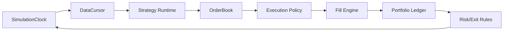
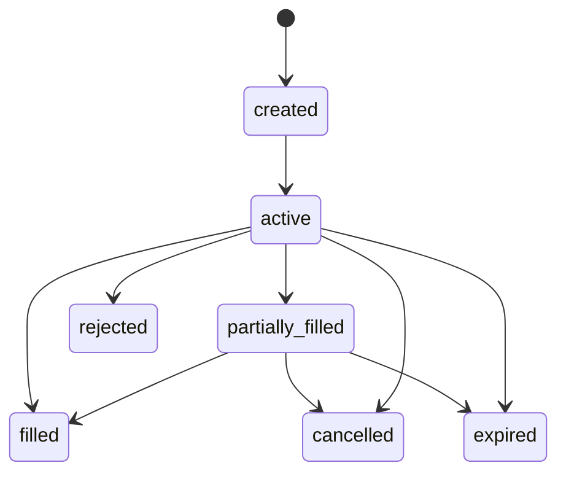

# StockStat V3.1 Finance Kernel 架构设计

> 大模块：Finance Kernel（金融数据模型与确定性计算内核）
> 版本：V3.1 设计稿
> 关联：[DESIGN_GENERALIZE.md](DESIGN_GENERALIZE.md)、[DESIGN_ARCH_COMPUTE_V31.md](DESIGN_ARCH_COMPUTE_V31.md)

## 1. 模块定位

Finance Kernel 是 V3.1 的金融业务核心。它包含市场数据模型、指标、统计推断、信号处理、回测、实验展开所需的纯计算能力。它不处理网络、不管理 Job 状态、不访问远程 Storage、不启动线程池，也不关心任务是在本地还是远程 Worker 上执行。

V3.1 允许旧客户代码迁移到新设计，但不保留旧类内部结构。迁移目标是结果语义等价，而不是继续维护 `ComputeEngine`、`BacktestEngine`、`PluginRegistry`、`ComputeBackend` 等旧实现形态。

## 2. 核心设计理念

### 2.1 金融内核先于分布式框架

Dispatcher 和 Worker 只能调度已定义的金融 operation。金融内核不为了适配队列而改变算法接口。

### 2.2 确定性优先

给定相同数据快照、参数、策略代码和随机种子，内核必须产生相同结果。浮点允许范围由 operation 明确，不能依赖 Worker 数量改变随机序列。

### 2.3 数据与执行显式建模

时间尺度、时区、交易日历、成本、成交、订单优先级、session 边界和未来函数规则必须显式进入模型，不能隐藏在全局变量或 DataFrame 约定中。

### 2.4 研究中间产物是一等结果

信号表、统计检验表、路径特征、参数试验表和验证窗口结果都必须能作为 Artifact 被后续任务复用，不能只存在于 Python 脚本局部变量。

## 3. 包结构

建议独立包：`stockstat-kernel`。

```text
packages/kernel/
└── stockstat_kernel/
    ├── market/
    │   ├── instruments.py
    │   ├── calendars.py
    │   ├── schemas.py
    │   ├── frames.py
    │   └── quality.py
    ├── features/
    │   ├── indicators.py
    │   ├── transforms.py
    │   ├── path.py
    │   ├── spectral.py
    │   └── nonlinear.py
    ├── statistics/
    │   ├── descriptive.py
    │   ├── hypothesis.py
    │   ├── regression.py
    │   ├── resampling.py
    │   ├── survival.py
    │   └── multiple_testing.py
    ├── backtest/
    │   ├── kernel.py
    │   ├── clock.py
    │   ├── strategy.py
    │   ├── orders.py
    │   ├── execution.py
    │   ├── fills.py
    │   ├── costs.py
    │   ├── portfolio.py
    │   ├── risk.py
    │   └── results.py
    ├── experiment/
    │   ├── batch.py
    │   ├── search.py
    │   ├── simulation.py
    │   └── validation.py
    ├── render/
    │   └── specs.py
    └── operations/
        ├── registry.py
        ├── builtin.py
        └── executors.py
```

## 4. 金融数据模型

### 4.1 InstrumentId

统一标的格式：

```text
{asset_class}:{venue}:{native_symbol}
crypto:binance:PAXG/USDT
equity:yahoo:AAPL
index:yahoo:^GSPC
fx:yahoo:EURUSD=X
```

不能只用 `PAXG/USDT`，否则多交易所、多资产和复权语义不可唯一确定。

### 4.2 MarketTable

标准长表 schema：

| 字段 | 类型 | 必填 | 说明 |
|---|---|---|---|
| `ts` | timestamp[us, UTC] | 是 | bar 或事件时间 |
| `instrument` | string | 是 | `InstrumentId` |
| `timeframe` | string | 是 | `1m`、`1h`、`1d` 等 |
| `open/high/low/close` | float64 | OHLCV 时是 | 价格 |
| `volume` | float64 | 是 | 成交量 |
| `source_revision` | string | 是 | 源数据修订 |
| `quality_flags` | uint32 | 是 | 缺失、补值、异常等 |

内核入口可以将 Arrow Table 转换为受控的 pandas 视图，但 schema 校验发生在转换前。

### 4.3 交易日历与 session

PAXG 等 7x24 资产和传统股票/期货的 session 规则不同。Kernel 提供：

- `CalendarId`。
- session open/close。
- holiday 和 early close。
- UTC 与交易所本地时区转换。
- 跨 session 持仓和订单有效期。

PAXG v5-v31 中尚未迁移的 Friday-close 到 Monday、Monday 到 Wednesday、精确六小时退出，都要求 session 和绝对时间成为内核一等概念。

## 5. Operation Registry

Finance Kernel 内部使用显式 operation 注册表，而不是全局通用插件中心。

```python
registry.register(
    operation="backtest.run@1",
    parameter_model=BacktestParameters,
    executor=run_backtest,
    descriptor=OperationDescriptor(...),
)
```

注册表只负责：

- 参数校验。
- operation 到 executor 的映射。
- operation 元数据查询。
- 实现版本和 capability 导出。

它不负责自动扫描任意 entry point、生命周期管理、服务发现或网络传输。

## 6. 指标、特征与统计

### 6.1 指标接口

指标 operation 接受列引用和参数，不接受任意 Python callable：

```json
{
  "indicators": [
    {"id": "trend.ma", "inputs": ["close"], "params": {"window": 20}, "output": "ma20"},
    {"id": "volatility.atr", "inputs": ["high", "low", "close"], "params": {"window": 14}, "output": "atr14"}
  ]
}
```

首批覆盖现有 23 个指标与非线性函数。

### 6.2 PAXG 特征支持

PAXG v1-v7 所需特征应提供可复用实现：

| 类别 | 特征 |
|---|---|
| 方向 | weekend return、full/mid OLS slope |
| 波动率 | range、realized volatility、volume ratio |
| 周一结果 | max gain/loss、gap、full-day return、intraday vol、range |
| 路径 | high/low hour、up-first、first extreme hour、窗口分类 |
| 频域 | CWT band energy、Welch PSD、spectral entropy、peak frequency |
| 灰色系统 | grey relation、GM(1,1) |
| 非线性 | mutual information、transfer entropy、Hurst/DFA、sample/permutation entropy、RQA |
| 预测验证 | 注册随机森林/线性基线、时间前向切分、train/test 指标和特征重要性 |

### 6.3 统计结果 schema

统计 operation 输出统一表，不只返回数值：

| 字段 | 说明 |
|---|---|
| `test_id` | 检验标识 |
| `method` | Pearson、chi-square、bootstrap 等 |
| `statistic` | 统计量 |
| `p_value` | 原始 p 值 |
| `adjusted_p_value` | 校正值，可空 |
| `effect_size` | r、Cramér's V、HR 等 |
| `ci_low/ci_high` | 置信区间 |
| `n` | 样本数 |
| `seed` | 随机检验种子 |
| `warnings` | 假设违反、样本不足等 |

## 7. 回测内核重构

### 7.1 目标

V3.1 回测内核需要完整覆盖现有功能，并修复当前执行语义分散在 Engine、Broker、FillModel、ExecutionModel、Strategy duck typing 中的问题。

### 7.2 统一事件时钟

新内核使用确定性 SimulationClock，而不是将“事件驱动”理解为通用 EventBus：



SimulationClock 明确处理：

- parent bar 和 intrabar 的时间推进。
- session open/close。
- 绝对时间和持有时长触发器。
- 多标的事件排序。
- 同一时间戳内的稳定优先级。

### 7.3 订单与生命周期

订单状态：



订单模型支持：

- market、limit、stop、stop-limit。
- GTC、DAY、IOC、FOK、绝对到期时间、持有时长到期。
- OCO first-fill-cancels-other。
- mutual OCO 双触及处理策略。
- parent-child、entry-exit group。
- order priority 和同 bar 冲突策略。

### 7.4 ExecutionPolicy

不再用“FillModel + ExecutionModel”两个部分重叠的抽象。使用单一 `ExecutionPolicy`，其配置包含：

| 部分 | 说明 |
|---|---|
| `clock_mode` | next_bar、same_bar、intrabar |
| `price_rule` | next_open、next_close、vwap、limit、worst_price |
| `ambiguity_rule` | 同 bar TP/SL 都触及时的保守/乐观/路径规则 |
| `partial_fill_rule` | 全成或部分成交 |
| `latency_model` | 默认零，后续微观结构扩展 |
| `session_rule` | 收盘撤单、跨 session 保留等 |

### 7.5 策略接口

策略包采用明确入口点：

```python
class StrategyProtocol(Protocol):
    def on_start(self, ctx): ...
    def on_event(self, ctx, event): ...
    def on_fill(self, ctx, fill): ...
    def on_end(self, ctx): ...
```

函数式策略通过 SDK 迁移工具包装为模块包。生产远程执行不通过 cloudpickle 传闭包。

### 7.6 未来函数防护

- Strategy 在事件时间只能访问 `<= now` 的数据视图。
- parent bar 事件开始时不能访问其未来 high/low/close。
- intrabar 模式按照子 bar 逐步解锁字段。
- 所有 DatasetSnapshot 带时间范围，执行器拒绝越界查询。
- 测试提供带诱饵未来值的数据，确保策略无法读取。

### 7.7 BacktestResult

结果拆成资产清单：

```text
backtest_result/
├── summary.json
├── equity.parquet
├── returns.parquet
├── orders.parquet
├── fills.parquet
├── positions.parquet
├── realized.parquet
├── benchmark.parquet
├── metrics.json
└── diagnostics.json
```

这样分析指标、渲染和比较任务可以只读取需要的成员。

## 8. 实验能力与分布式边界

Finance Kernel 提供纯函数式 planner helpers 和 merge helpers，但不自己启动并行：

| 复合 operation | Planner 展开 |
|---|---|
| batch | 多个独立 backtest unit + merge |
| grid search | 参数组合 backtest unit + rank |
| Monte Carlo | 确定 seed 区间 simulation unit + quantile merge |
| walk-forward | window unit + chronological merge |
| fee sweep | cost configuration unit + compare |
| predictive validation | chronological split + registered model executor + validation result |

### 8.1 确定性分片

Monte Carlo 不能使用“每个 Worker 自己 seed + worker index”，否则 Worker 数改变结果。规则：

```text
global sample id: 0..N-1
sample seed = H(job_seed, sample_id)
shard only assigns sample-id ranges
```

Grid search 使用 canonical 参数组合排序。Batch 使用 canonical run_id。合并结果与完成顺序无关。

## 9. 代码资产与安全

### 9.1 内置组件

指标、成本、执行、渲染等内置组件通过稳定 ID 引用，例如：

- `cost.binance@1`
- `execution.intrabar@1`
- `indicator.hurst_dfa@1`

### 9.2 StrategyBundle

用户策略以代码资产提交：

```text
strategy-bundle.zip
├── manifest.json
├── src/strategies.py
├── requirements.lock
└── signature.json
```

manifest 包含入口点、API 版本、允许依赖和 digest。Worker 在隔离进程/容器中执行。

### 9.3 本地开发便利

`StockStat.local()` 可以接受本地模块路径并自动构建 StrategyBundle，但生成后的任务仍引用 bundle digest。这样用户体验简洁，同时不污染生产协议。

## 10. 旧功能迁移映射

| 旧入口 | V3.1 迁移目标 |
|---|---|
| `client.compute.ma(series, 20)` | `session.features.indicators(table, specs=[...])` 或本地 kernel 函数 |
| `client.run_dsl(...)` | `session.query.select(...)`；DSL 作为可选编译前端 |
| `client.backtest(data, strategy)` | `session.backtests.run(snapshot_or_table, strategy_bundle, parameters)` |
| `grid_search(make_engine, grid)` | `session.experiments.grid_search(...)` |
| `StrategyBatchRunner` | `session.experiments.batch(...)` |
| `monte_carlo_equity` | `session.simulations.bootstrap(...)` |
| `walk_forward` | `session.validation.walk_forward(...)` |
| `PlotSpec/render` | `session.render.chart(...)` 或本地 renderer |

迁移工具可以扫描旧代码并生成建议，但不在 V3.1 runtime 内保留旧门面。

## 11. PAXG v1-v7 完整验收

V3.1 Finance Kernel 的核心验收基线：

### 11.1 研究等价

- v1 选择偏差相关性复现。
- v2 独立涨跌幅相关性复现。
- v3 路径顺序卡方复现。
- v4 排列、自助、Chow、状态、衰减、分位复现。
- v6 时序窗口、生存分析和多重校正复现。
- v7 CWT、PSD、灰色、TE、Hurst 和熵复现。
- v7 随机森林 F 融合的样本内/样本外 `R²`、分类准确率和特征重要性通过受控 `validation.predictive@1` 复现。

### 11.2 回测等价

- 52 策略全部有 V3.1 原生表达，不再保留 7 个 `analysis_only` 缺口。
- 52 x 4 费率矩阵全部成功。
- B1 买入持有、B2 周一定投、B3 价格曲线收益统一执行并进入比较结果。
- 关键策略 S21、S45、S48、S51、S9 的 total return、fills、trade count 和 drawdown 与 redo 基线一致。
- 对旧实现中有定义差异的指标，例如 Sharpe 采样频率，V3.1 明确唯一公式并记录迁移差异。

## 12. 测试体系

| 测试层 | 内容 |
|---|---|
| 数学单元 | 已知序列、教科书结果、边界条件 |
| 属性测试 | 单调性、尺度不变性、seed 确定性 |
| Golden | PAXG 信号表、统计表、回测结果摘要 |
| Lookahead | 诱饵未来数据、parent/intrabar 可见性 |
| 执行语义 | TP/SL 冲突、OCO、跨 session、精确时间退出 |
| 分片一致性 | 1/2/4/8 分片结果相同 |
| 环境一致性 | Windows/Linux、单进程/多进程误差范围 |

## 13. 结论

Finance Kernel 是 V3.1 能否“完全重构但功能不丢失”的关键。它通过明确的金融数据模型、确定性 operation、统一执行时钟和资产化结果，把当前分散在指标库、脚本、回测类和 Worker handler 中的逻辑重新组织为可独立测试、可本地执行、可远程调度的金融计算内核。
