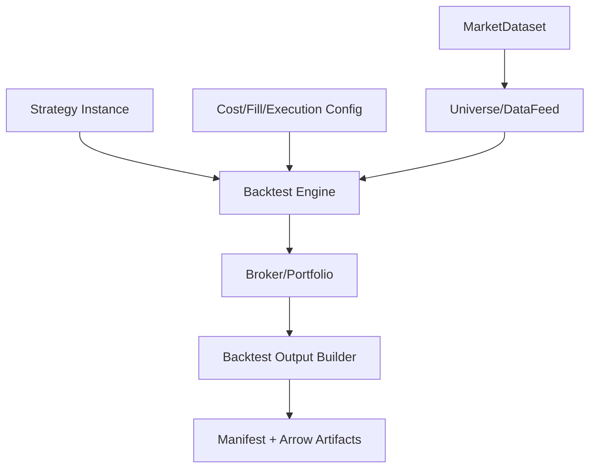

# StockStat V3.1 Finance Kernel 架构设计

> 大模块：金融领域模型、能力模块与结果合同
> 日期：2026-07-20
> 状态：V3.1 设计稿
> 上位文档：[DESIGN_ARCH_V31.md](DESIGN_ARCH_V31.md)
> 范围文档：[DESIGN_GENERALIZE.md](DESIGN_GENERALIZE.md)

## 1. 模块定位

Finance Kernel 是 StockStat 的金融价值核心，提供：

- 规范市场数据视图。
- 指标、统计和非线性时序分析。
- 策略模型。
- 回测执行、成本、成交和组合状态。
- 搜索、批量、Monte Carlo、Walk-forward 所需的原子 Executor 与 Reducer。
- 类型化金融结果和可复现 Manifest。

Kernel 不包含 SDK、HTTP、数据库、队列、Worker 注册或 Dispatcher 状态机。

数据采集 `finance.data.ingest` 属于金融能力目录，但其 Executor 位于 Storage/专用 I/O capability 包，不属于数值 Kernel。Kernel 只消费采集后固定的 DatasetSnapshot。

## 2. 重构目标

V3.1 不是把现有 `frontend/stockstat/backtest` 和 `indicators` 原样复制到 Worker，而是把它们重组为一个无网络、无服务依赖、可被 Worker 和单元测试直接调用的领域内核。

关键修正：

| 当前问题 | V3.1 目标 |
|---|---|
| v1.7 实现、V2 wrapper、V3 handler 三层并存 | 一个领域实现，一个能力 adapter |
| ComputeEngine 直接方法与 PluginRegistry 重复 | 单一 Indicator Catalog |
| cost/fill/execution 在 handler 中硬编码 dict | 版本化 Component Catalog |
| `ComputeSpec` 汇集所有任务字段 | 每个能力独立参数 schema |
| grid/batch 重复构建回测 | 单次 Backtest Executor + Planner fan-out |
| 结果依赖 cloudpickle | 规范 Result Manifest + Arrow Artifacts |
| 回测 `np.random.seed` 修改全局状态 | 每任务显式 RNG |
| 可视化混在 BacktestResult | 结果与渲染分离，SDK/Admin 渲染 |

## 3. 包结构

建议新建 `packages/kernel/`，发布名 `stockstat-kernel`：

```text
packages/kernel/
├── pyproject.toml
└── stockstat_kernel/
    ├── __init__.py
    ├── version.py
    ├── market/
    │   ├── frames.py
    │   ├── universe.py
    │   ├── timeframe.py
    │   └── validation.py
    ├── catalog/
    │   ├── capabilities.py
    │   ├── indicators.py
    │   └── components.py
    ├── indicators/
    │   ├── trend.py
    │   ├── oscillator.py
    │   ├── volatility.py
    │   ├── statistics.py
    │   └── nonlinear.py
    ├── backtest/
    │   ├── engine.py
    │   ├── context.py
    │   ├── strategy.py
    │   ├── broker.py
    │   ├── portfolio.py
    │   ├── orders.py
    │   ├── costs.py
    │   ├── fills.py
    │   ├── execution.py
    │   ├── metrics.py
    │   └── results.py
    ├── experiments/
    │   ├── candidates.py
    │   ├── reducers.py
    │   ├── simulation.py
    │   └── validation.py
    ├── capabilities/
    │   ├── indicator_compute.py
    │   ├── timeseries_analyze.py
    │   ├── backtest_run.py
    │   ├── simulation_resample.py
    │   ├── experiment_reduce.py
    │   └── walk_forward_reduce.py
    └── serialization/
        ├── market.py
        ├── backtest.py
        └── manifests.py
```

## 4. 依赖规则

Kernel 基础依赖：

- `stockstat-contracts`。
- pandas、numpy、scipy、pyarrow。

可选能力依赖：

- PyWavelets。
- optuna，仅 Candidate Planner/Invocation 使用，不进入基础回测 Executor。
- 未来 cvxpy、scikit-learn、torch 按能力 extras 分包。

Kernel 不依赖：

- FastAPI/httpx。
- SQLAlchemy/Redis。
- Storage/Dispatcher/Worker 包。
- matplotlib/plotly（核心结果不渲染）。

## 5. 市场数据视图

### 5.1 输入边界

Worker 将 Arrow Artifact 解析为 `MarketDataset`：

```text
MarketDataset
├── snapshot_manifest
├── instruments
├── timeframes
├── tables / batch streams
└── quality metadata
```

Kernel 不自行查询数据。

### 5.2 Universe

`Universe` 继续支持 `{instrument -> {timeframe -> frame}}` 的概念，但公共构造和内部验证重新设计：

- InstrumentRef 明确 venue/source。
- index 必须 UTC、升序、唯一。
- 必需列和 dtype 明确。
- 多时间尺度父子关系显式。
- 读取窗口不允许未来数据。
- 数据快照 ID 全程保留。

### 5.3 流式与物化

能力 descriptor 声明输入模式。指标可支持 RecordBatch streaming；现有回测首版采用 materialized Universe，避免伪装成流式但内部仍全量收集。

## 6. Indicator Catalog

### 6.1 单一目录

V3.1 使用一个 `IndicatorDescriptor` + callable 目录，SDK、DSL、Planner 和 Executor 从同一 descriptor 生成各自视图。

Descriptor 示例字段：

```text
id: ma
version: 1.0
category: trend
inputs: [series]
parameters: {window: integer >= 1}
outputs: [series]
warmup: window - 1
partitioning: symbol, time_with_overlap
deterministic: true
```

不再有 `ComputeEngine.ma()` 直接实现、`IndicatorPlugin` wrapper 和 DSL 函数字典三份注册信息。

### 6.2 首批迁移清单

必须迁移现有 23 个计算项：

```text
ma, ema, macd, rsi, kdj, std, atr, bollinger,
corr, beta, sharpe, max_drawdown, var,
returns, log_returns,
wavelet_decompose, spectral_entropy, grey_relation, gm11_predict,
transfer_entropy, hurst_dfa, sample_entropy, permutation_entropy
```

PlotSpec factory 不属于指标能力输出；由 SDK 可视化模块基于结果构建。

## 7. Backtest Engine

### 7.1 首版执行模型

保留已验证的命令式 bar loop 语义，而不是为了架构美观立即改成事件驱动。完全重构指包与边界重构，不意味着无证据改变成熟金融语义。



### 7.2 显式配置

`BacktestParameters` 独立 schema：

```text
initial_cash
benchmark
trade_on
allow_short
lookahead_audit
random_seed
periods_per_year
cost_model: ComponentRef
fill_model: ComponentRef
execution_model: ComponentRef
risk_limits(optional future)
```

不能接受任意 `**kwargs` 穿透协议。

### 7.3 RNG

每次执行创建局部 `numpy.random.Generator`。Strategy Context 若需要随机数，从 Context 获取，禁止修改进程全局 seed。

### 7.4 Lookahead 与时间边界

必须保留和强化：

- 默认 t 决策、t+1 成交语义。
- `ThisCloseFill` 等潜在未来函数模式显式标记和审计。
- 多 timeframe 只能读取 `<= now` 完成的 bar。
- intrabar 父子 bar 对齐验证。
- snapshot 数据在 Job 中不可变化。

### 7.5 Component Catalog

成本、成交和执行组件通过版本化 descriptor 注册：

```text
cost.percent@1
cost.fixed@1
cost.tiered@1
cost.min@1
cost.stamp_duty@1
cost.zero@1
cost.maker_taker@1
cost.binance@1

fill.next_open@1
fill.next_close@1
fill.this_close@1
fill.vwap@1
fill.worst_price@1
fill.intrabar_limit@1
fill.intrabar@1

execution.next_bar@1
execution.intrabar@1
```

参数由各组件 schema 验证，不在 handler 中手写字符串映射。

## 8. Strategy 模型

### 8.1 StrategyRef

```text
kind: builtin | python_package | declarative
name
version
artifact_ref(optional)
entrypoint(optional)
config_schema
config
digest
signature
```

### 8.2 Python Strategy Package

策略包包含：

- wheel 或受控 source bundle。
- `module:factory` entrypoint。
- 依赖 lock manifest。
- StockStat Kernel compatibility。
- config schema。
- 内容 digest 和签名。

Worker 在隔离环境中加载。策略 factory 接收显式 config 和 Kernel API，不依赖 Client 对象。

### 8.3 迁移旧 `@strategy`

保留相似编程模型：

```python
class MaCross(Strategy):
    def __init__(self, short: int, long: int): ...
    def on_bar(self, ctx): ...
```

或模块级 factory：

```python
def build(config) -> Strategy:
    return MaCross(**config)
```

旧函数装饰器可由迁移工具转换为模块实现；不为远程执行保留闭包捕获。

## 9. Backtest Result 合同

最终结果由 Manifest 引用多个 Artifact：

```text
BacktestResultManifest
├── capability/kernel/strategy versions
├── dataset_snapshot_ids
├── parameters
├── metrics
├── equity_artifact
├── fills_artifact
├── trades_artifact
├── positions_artifact
├── benchmark_artifact(optional)
├── realized_history_artifact(optional)
├── warnings
└── reproducibility
```

表格 schema 固定版本：

- Equity：`ts, equity, cash, market_value`。
- Fill：`order_id, instrument, side, qty, price, commission, slippage, ts, tag, exit_reason`。
- Position snapshot：instrument、qty、avg_cost、realized_pnl、unrealized_pnl。

SDK 可构建新的 `BacktestResult` 视图，但 wire 上不发送 Python 类实例。

## 10. Experiments

### 10.1 原子化原则

以下旧功能不再各自拥有独立执行引擎：

- `grid_search`。
- `StrategyBatchRunner`。
- `fee_sweep`。
- `maker_taker_sweep`。
- Walk-forward 中的单次测试。

它们都复用 `finance.backtest.run`，由 Planner 构造多个 WorkUnit。

### 10.2 Candidate Artifact

参数组合先规范化为 Candidate Table Artifact：

```text
candidate_id
parameter_json
seed
group metadata
```

每个回测 WorkUnit 处理一个 candidate batch，并输出 Trial Summary + 可选详细 Backtest Result refs。

### 10.3 Search Reducer

Reducer 负责：

- 合并 Trial Summary。
- 校验 candidate 完整性和重复。
- 按 objective 排序。
- 处理 NaN/失败 trial 策略。
- 生成 best parameters 和 ranking Artifact。

### 10.4 Monte Carlo

`finance.simulation.resample` 接收 returns Artifact、simulation range、方法和 seed stream。Reducer 计算 quantiles、drawdown 分布、破产概率等，不要求保留全部路径；是否保存路径由 output policy 决定。

### 10.5 Walk-forward

窗口 Planner 定义 train/test 区间。首版迁移现有仅测试窗口执行语义；后续可增加窗口内选参、purging 和 embargo。

## 11. 未来金融能力接入

按 `DESIGN_GENERALIZE.md`，未来能力包可放在独立 extras：

```text
stockstat-kernel-factor
stockstat-kernel-risk
stockstat-kernel-portfolio
stockstat-kernel-ml
stockstat-kernel-execution
```

它们复用 Contracts、Worker Runtime、Artifact 和 Dispatcher Planner 接口，不需要改 Job/Lease 协议。

## 12. 可视化与导出

Kernel 输出数据，不渲染图。SDK/Admin 提供：

- 统一 PlotSpec。
- Backtest chart profiles。
- matplotlib/Plotly renderer。
- JSON/CSV/Parquet 导出。

PlotSpec 自身若需持久化，必须是 JSON schema + ArtifactRef，不内嵌 pandas 对象。

## 13. 数值兼容策略

V3.1 不承诺对象 pickle 字节兼容，承诺金融结果兼容等级：

| 等级 | 适用 | 标准 |
|---|---|---|
| Exact | 确定性指标、订单、fills | dtype/NaN 规范后逐值一致 |
| Tolerance | 浮点指标、metrics | 明确 `rtol/atol` |
| Statistical | Monte Carlo | 固定 seed exact；不同并行布局按分布性质验收 |
| Structural | 图表/Manifest | schema、字段、引用完整 |

每个能力 descriptor 指定 determinism 与 comparison policy。

## 14. 测试体系

### 14.1 Unit tests

- 每个指标边界、NaN、短窗口和 dtype。
- Broker/Portfolio/Order 状态机。
- Cost/Fill/Execution 组件。
- Lookahead audit。
- Result serialization。

### 14.2 Golden migration tests

从现有 V3 生成冻结输入和输出：

- 23 指标。
- 代表单/多标的、多 tf、intrabar 回测。
- 8 成本模型、7 fill、2 execution。
- PAXG 代表策略与费率组合。
- Grid、batch、Monte Carlo、Walk-forward。

Golden 需保存为 Arrow/JSON 等稳定格式，不保存旧 Python pickle 作为唯一 oracle。

### 14.3 Metamorphic tests

- 零成本结果不劣于正成本的同一成交路径。
- 价格整体缩放下百分比收益不变。
- 参数搜索单 Worker 与多 Worker ranking 一致。
- WorkUnit 重试不改变固定 seed 结果。
- 时间分片 indicator 归并与全量计算一致。

### 14.4 Property tests

- Portfolio 现金/持仓/权益守恒。
- 禁止未允许的负仓位。
- OHLC 不变量。
- Fill 时间不早于 Order 可成交时间。
- 结果表时间排序和唯一性。

### 14.5 Performance tests

- 单次 Kernel 性能不显著低于旧实现。
- 进程启动和 Arrow decode 开销有基线。
- 参数 batch 大小调优。
- 大数据 materialization 峰值内存。

## 15. 验收标准

- 只有一个指标目录和一个回测领域实现。
- Kernel 无网络、数据库、队列和 UI 依赖。
- 所有任务使用独立类型化参数 schema。
- 远程结果不用 cloudpickle 表达。
- 搜索、批量、Monte Carlo 和 Walk-forward 复用原子能力。
- 当前金融功能有完整迁移矩阵和 golden parity。
- 新金融能力可通过 Planner/Executor/Reducer 模块增加，而不改底层协议。
