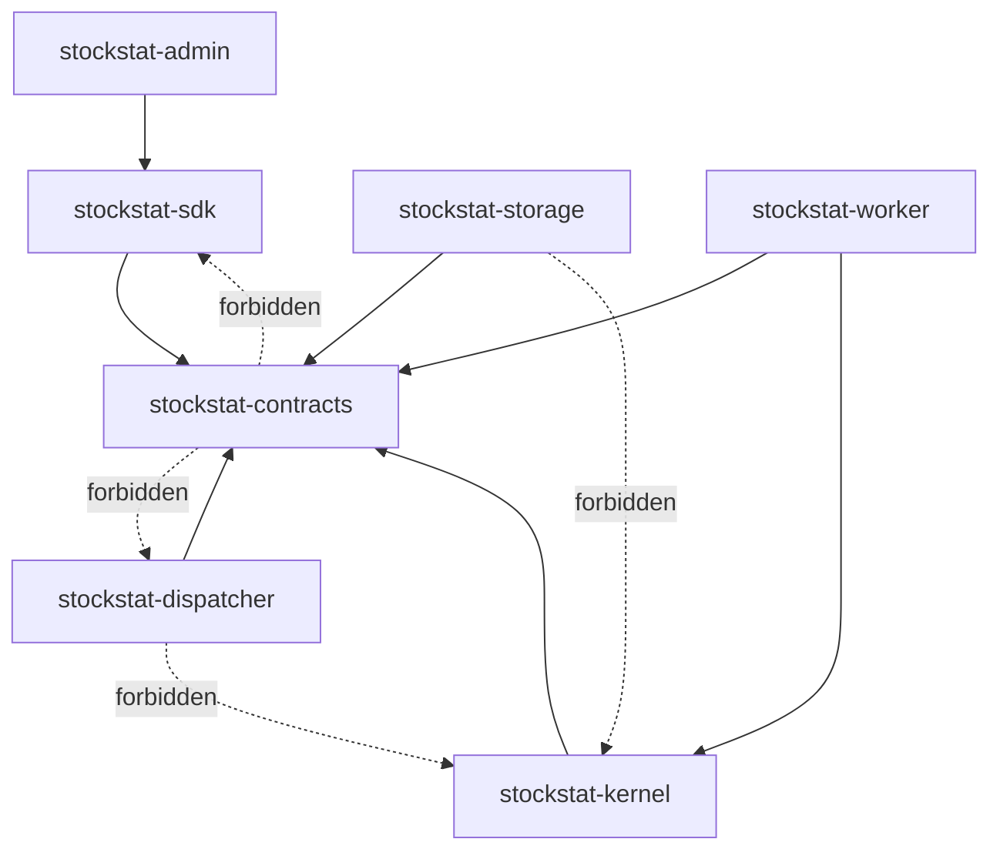

# StockStat V3.1 Foundation 架构设计

> 大模块：共享底层与契约
> 日期：2026-07-20
> 状态：V3.1 设计稿
> 上位文档：[DESIGN_ARCH_V31.md](DESIGN_ARCH_V31.md)
> 协议文档：[DESIGN_PROT_V31.md](DESIGN_PROT_V31.md)

## 1. 模块定位

Foundation 是 Invocation、Dispatcher、Storage、Compute 与 Finance 共同依赖的唯一底层。它不是通用分布式框架，而是 StockStat 金融任务系统的稳定词汇表和边界契约。

Foundation 解决以下问题：

- 所有角色使用同一套 Job、WorkUnit、Attempt、Artifact 和金融数据标识。
- SDK 与服务端对参数、结果、错误和版本有相同理解。
- 各部署包不通过导入对方实现共享代码。
- 新金融能力可增加 schema 与模块，不修改传输骨架。
- 本地嵌入式拓扑与跨机拓扑可用同一组合同测试。

## 2. 完全重构约束

V3.1 Foundation 不从以下旧目录导入任何实现：

```text
frontend/stockstat/
backend/stockstat_backend/
worker/stockstat_compute/
```

旧目录在迁移期仅承担三项作用：

1. 生成行为基线和 golden artifacts。
2. 提供旧 API 到新 API 的迁移样例。
3. 在 V3.1 切换前运行黑盒结果对比。

V3.1 新包不得使用 `_compat.py`、fallback import、双客户端转发或 `isinstance(LocalComputeBackend)` 等兼容手段。

## 3. 包边界

建议新建独立包 `packages/contracts/`，发布名为 `stockstat-contracts`：

```text
packages/contracts/
├── pyproject.toml
└── stockstat_contracts/
    ├── __init__.py
    ├── ids.py
    ├── time.py
    ├── errors.py
    ├── envelope.py
    ├── jobs.py
    ├── work.py
    ├── artifacts.py
    ├── datasets.py
    ├── capabilities.py
    ├── events.py
    ├── resources.py
    ├── finance/
    │   ├── instruments.py
    │   ├── market_data.py
    │   ├── strategies.py
    │   ├── backtest.py
    │   ├── indicators.py
    │   ├── experiments.py
    │   └── results.py
    └── schema/
        ├── registry.py
        └── canonical_json.py
```

依赖目标：

- Python 标准库。
- 一个明确固定 major 版本的 schema/validation 库；推荐 Pydantic v2。
- 不依赖 pandas、numpy、scipy、FastAPI、SQLAlchemy、Redis、httpx 或云 SDK。

## 4. 依赖规则



铁律：

| 规则 | 说明 |
|---|---|
| Contracts 不依赖实现包 | 防止共享底层反向耦合服务 |
| Dispatcher 不依赖 Kernel | 调度器不加载 pandas 或执行金融算法 |
| Storage 不依赖 Kernel | 数据服务不执行回测和指标 |
| Worker 不依赖 Dispatcher 实现 | 只通过协议客户端交互 |
| SDK 不导入服务私有模块 | 本地模式通过公开嵌入式装配包组合 |
| Finance schema 不携带 Python 对象 | 所有跨边界字段可验证、可序列化 |

## 5. 核心实体

### 5.1 Job

Job 是用户可观察的业务任务，具有稳定 `job_id`。Job 不等于队列消息，也不等于 Worker 执行单元。

```text
JobSpec
├── metadata
├── operation
├── inputs[]
├── execution
└── outputs
```

Job 的状态、生命周期和幂等语义详见 `DESIGN_PROT_V31.md`。

### 5.2 Stage

Stage 是 Planner 生成的有依赖关系的计划节点，例如参数生成、N 个回测、结果归并。Stage 只存在于 Dispatcher 的执行计划中，不直接暴露为用户必须管理的对象。

### 5.3 WorkUnit

WorkUnit 是可独立租约、重试和完成的最小执行单元。它包含：

- `work_unit_id`。
- 所属 `job_id` 与 `stage_id`。
- 能力 ID 和版本。
- Planner 生成的内部 `executor_role`，首版固定为 `execute` 或 `reduce`。
- 输入 Artifact 引用。
- 已解析参数。
- 资源请求。
- 分片信息。
- 输出合同。

WorkUnit 不通过修改 `job_id` 后缀模拟父子关系。

`executor_role` 不是公共 capability ID，也不允许 Client 在 JobSpec 中指定。它只在持久执行计划和 WorkLease 中出现，使同一 capability 包能够选择普通 Executor 或 Reducer Executor，同时避免开放任意内部处理器调用。该字段参与 plan digest。

### 5.4 Attempt

Attempt 表示 WorkUnit 的一次实际执行。重试会创建新的 `attempt_id`，并获得新的 fencing token。旧 Attempt 的迟到结果不得覆盖新 Attempt。

### 5.5 Artifact

Artifact 是不可变二进制或结构化结果。大数据、策略包、模型、回测明细、检查点和中间结果都通过 Artifact 传递。

Artifact 的身份以内容摘要为核心，而不是某台机器的临时文件路径。

## 6. 标识设计

| 标识 | 建议 | 说明 |
|---|---|---|
| `message_id` | UUIDv7 | 消息唯一性和时间排序 |
| `job_id` | UUIDv7 | 用户任务 |
| `stage_id` | UUIDv7 | 计划阶段 |
| `work_unit_id` | UUIDv7 | 原子执行单元 |
| `attempt_id` | UUIDv7 | 一次执行尝试 |
| `worker_id` | 持久 UUID | Worker 实例身份 |
| `artifact_id` | UUIDv7 | 元数据身份 |
| `sha256` | 64 位 hex | Artifact 内容身份 |
| `dataset_snapshot_id` | UUIDv7 | 固定数据快照 |

不得再通过解析 `{task_id}-s3` 推断父任务。

## 7. 时间与区间语义

统一规则：

- 所有协议时间使用 RFC 3339 UTC，例如 `2026-07-20T10:30:00.123456Z`。
- 市场数据内部使用 Arrow `timestamp[us, tz=UTC]`。
- 时间范围默认半开区间 `[start, end)`，避免相邻分片重复。
- `deadline_at` 表示绝对截止时间，`timeout_seconds` 只作为 SDK 辅助输入。
- 事件排序以 `sequence` 为主、`occurred_at` 为辅，不能依赖不同机器时钟完全同步。

## 8. 金融标识与市场数据 schema

### 8.1 InstrumentRef

```json
{
  "asset_class": "crypto",
  "symbol": "BTC/USDT",
  "venue": "binance",
  "currency": "USDT"
}
```

迁移期允许 SDK 接收旧字符串符号，但进入协议前必须解析为 `InstrumentRef`。不能让 Storage、Dispatcher 与 Worker 各自猜测数据源。

### 8.2 Timeframe

Timeframe 使用规范字符串：`1s`、`1m`、`5m`、`1h`、`1d`。Contracts 提供解析和标准化，不在各数据源中重复维护。

### 8.3 Canonical OHLCV

| 字段 | Arrow 类型 | 约束 |
|---|---|---|
| `ts` | `timestamp[us, tz=UTC]` | 严格升序，快照内唯一 |
| `instrument` | `string` 或字典编码 | 规范 Instrument key |
| `timeframe` | `string` | 规范 Timeframe |
| `open/high/low/close` | `float64` | 有限数，价格非负 |
| `volume` | `float64` | 默认非负，缺失策略显式记录 |
| `source` | `string` | 数据来源 |
| `ingest_batch_id` | `string` | 数据谱系 |

首版继续使用 `float64` 以保证现有指标和回测迁移；精确 Decimal 仅用于未来需要的账务边界，不在首版混入 pandas 核心。

## 9. DatasetSelector 与 DatasetSnapshot

`DatasetSelector` 描述用户想要的数据，`DatasetSnapshot` 描述实际参与计算的不可变数据。

Selector 关键字段：

```text
instruments[]
timeframe
start
end
fields[]
source_policy
adjustment
calendar
as_of
snapshot_policy
```

Snapshot Manifest 关键字段：

```text
dataset_snapshot_id
resolved_instruments[]
resolved_range
row_count
schema_ref
artifact_ref
source_versions[]
ingest_batch_ids[]
created_at
sha256
```

默认 `snapshot_policy=pin_on_submit`：Storage 在规划阶段生成或复用不可变 Arrow Artifact。后续数据库写入不会改变运行中的 Job。

## 10. ArtifactRef

规范结构：

```json
{
  "artifact_id": "0190...",
  "kind": "market_data_snapshot",
  "media_type": "application/vnd.apache.arrow.stream",
  "codec": "arrow-ipc-stream",
  "size_bytes": 52428800,
  "sha256": "...",
  "schema_ref": "stockstat.market.ohlcv/1",
  "locator": "artifact://sha256/...",
  "expires_at": null
}
```

约束：

- 控制面只传 `ArtifactRef`，不传 base64 大对象。
- `locator` 是逻辑定位符；具体下载 URL 由 Storage/Data Exchange 临时签发。
- Artifact 完成上传后不可原地修改。
- 相同内容可去重，但 Artifact 元数据仍可记录不同业务用途和保留策略。
- 下载后必须校验 `size_bytes` 与 `sha256`。

## 11. OperationSpec 与能力目录

`OperationSpec` 结构：

```json
{
  "capability_id": "finance.backtest.run",
  "capability_version": "1.0",
  "parameters": {},
  "result_schema": "stockstat.result.backtest/1"
}
```

Contracts 中只保存 descriptor 和参数 schema，不保存 Executor 实现。

能力版本独立于协议版本：

- 协议 `3.1` 可同时承载 `finance.backtest.run@1.0` 与 `@2.0`。
- Worker 注册具体能力版本。
- Dispatcher Planner 选择与 Job 匹配的版本。
- SDK 可默认使用最新稳定版本，也允许用户固定版本以复现实验。

## 12. ResourceSpec

```text
cpu_cores
memory_bytes
gpu_count
gpu_memory_bytes
scratch_bytes
labels
exclusive
```

V3.1 的资源模型保持有限：CPU、内存、GPU、临时磁盘和标签。不会首版引入任意拓扑约束语言。

资源值既可由用户给出上限，也可由 Planner 根据数据规模和能力 descriptor 估算。Dispatcher 最终写入已解析 `ResourceSpec`。

## 13. 错误模型

统一错误对象：

```json
{
  "code": "WORKER_LOST",
  "category": "infrastructure",
  "message": "worker heartbeat expired during attempt",
  "retryable": true,
  "details": {},
  "causes": [],
  "trace_id": "..."
}
```

错误分类：

| category | 示例 | 默认重试 |
|---|---|---|
| `validation` | 参数、schema、能力版本错误 | 否 |
| `data` | 数据不存在、快照失败、数据质量错误 | 视错误码 |
| `compute` | 算法异常、数值异常、策略异常 | 默认否 |
| `infrastructure` | Worker 丢失、网络中断、暂时存储失败 | 是 |
| `cancelled` | 用户取消、deadline 到期 | 否 |
| `security` | 签名失败、无权限、代码包不可信 | 否 |

服务不得把原始 Python traceback 作为公共错误主体返回。traceback 进入受控日志，公共错误通过 `error_id` 关联。

## 14. Canonical JSON 与摘要

幂等键、缓存键和签名需要稳定序列化。Foundation 提供 Canonical JSON：

- UTF-8。
- 对象键按字典序。
- 无无意义空白。
- 时间先规范为 UTC RFC 3339。
- 浮点禁止 NaN/Infinity。
- 不使用 Python `default=str` 隐式序列化。

Job 语义摘要不包含 `message_id`、`sent_at` 等传输字段；包含已固定的 operation、parameters、input snapshots 和 kernel version。

## 15. 配置模型

Foundation 只定义配置 schema，不读取环境变量或文件。读取与合并由各应用包完成。

建议公共段：

```text
identity
endpoints
timeouts
protocol
artifact_policy
observability
security
```

避免复用 V2 中一个 `Config` 同时描述客户端、存储、代理、Dispatcher 和 Worker 的方式。

## 16. 测试策略

### 16.1 Schema 测试

- 每个公开模型 valid/invalid fixtures。
- JSON round-trip。
- 未知字段策略测试。
- 半开时间区间和 UTC 规范测试。
- NaN/Infinity 拒绝测试。

### 16.2 Golden protocol 测试

每种核心消息保存 canonical JSON fixture，变更时必须显式审阅。禁止因字段顺序、默认值或 datetime 格式产生非预期漂移。

### 16.3 Dependency tests

- 导入 `stockstat_contracts` 不得加载 pandas、numpy、FastAPI、SQLAlchemy。
- 使用 import graph 测试阻止 Contracts 反向依赖。
- Dispatcher 和 Storage 包不得导入 `stockstat_kernel`。

### 16.4 Property tests

- ID 唯一性和可排序性。
- Canonical JSON 稳定性。
- Artifact 摘要篡改检测。
- 时间分片无重叠、无缺口。

## 17. 验收标准

- Contracts 包可独立安装和导入。
- 所有公开 schema 有版本标识和 golden fixture。
- Job、WorkUnit、Attempt、Artifact 身份完全分离。
- OHLCV、策略、回测结果等金融 schema 能表达现有功能。
- 任意服务间共享信息均可由 Contracts 表达，无需导入对方实现。
- 不存在 `Any` 型公共 payload、pickle payload 或静默 fallback。
