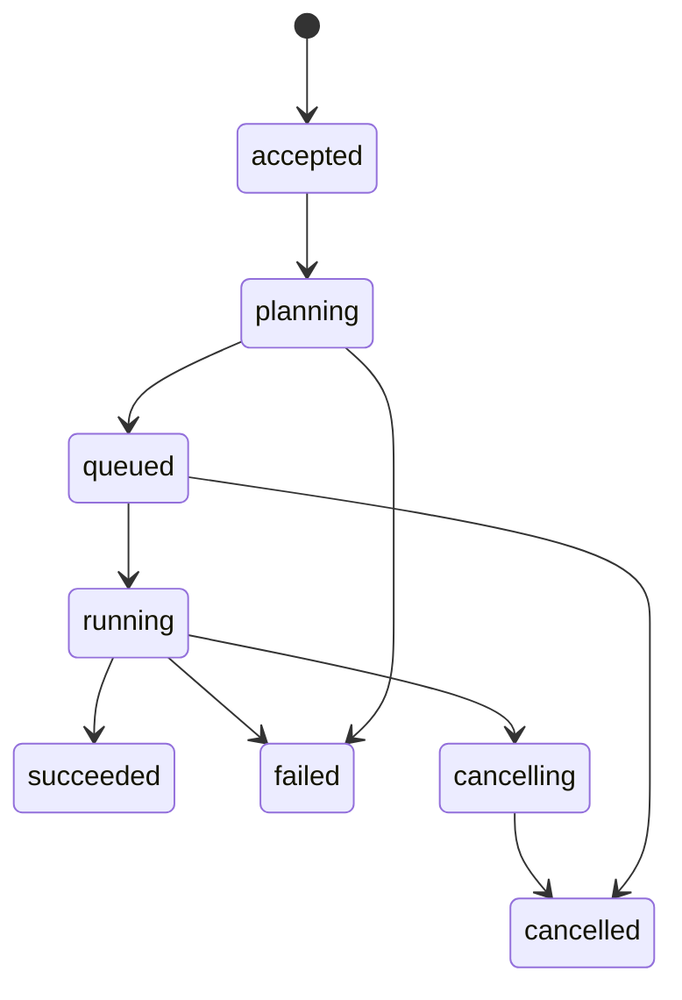
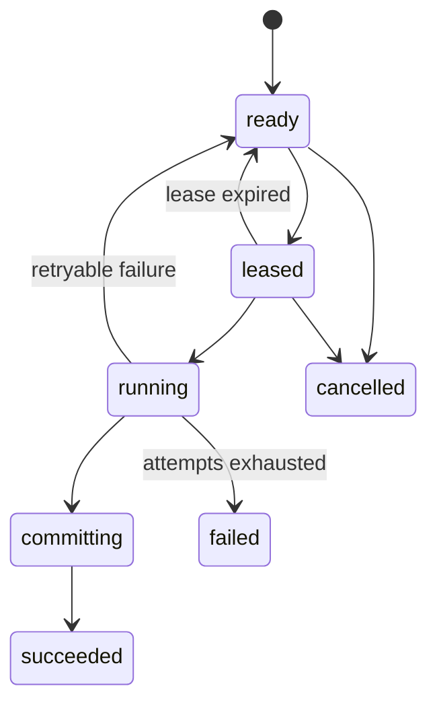

# StockStat V3.1 Foundation 架构设计

> 大模块：Foundation（共享契约与运行基础）
> 版本：V3.1 设计稿
> 关联：[DESIGN_ARCH_V31.md](DESIGN_ARCH_V31.md)、[DESIGN_PROT_V31.md](DESIGN_PROT_V31.md)

## 1. 模块定位

Foundation 是所有进程唯一可以共同依赖的底层包，负责定义稳定数据契约、标识、内容寻址、operation 元数据、错误模型和可观测上下文。它不实现 HTTP 服务、不访问数据库、不执行金融算法，也不包含 V2/V3 兼容代码。

Foundation 的核心目标是让以下执行路径共享同一语义：

- SDK 进程内本地执行。
- SDK 到独立 Dispatcher。
- Dispatcher 到独立 Storage。
- Dispatcher 到一个或多个 Worker。
- Worker 之间不同硬件、不同能力包的执行。

## 2. 设计原则

| 原则 | 约束 |
|---|---|
| 契约小而稳定 | 只定义跨模块真正共享的数据，不承载算法实现 |
| 类型化 operation | 每个 operation 有独立参数和结果 schema |
| 大对象引用化 | 市场数据、策略包和结果通过 `ArtifactRef` 传递 |
| 内容寻址 | 可复用资产以 digest 标识，支持缓存和完整性验证 |
| 规范化编码 | JSON 使用 canonical 规则，时间统一 UTC，浮点规则明确 |
| 失败可分类 | 业务失败、数据失败、资源失败、基础设施失败分开 |
| 不兼容旧内部接口 | 不复用 V3 `TaskSpec`、`ComputeBackend`、`Envelope` 类 |

## 3. 包边界

建议独立包：`stockstat-contracts`。

```text
packages/contracts/
├── pyproject.toml
└── stockstat_contracts/
    ├── ids.py
    ├── time.py
    ├── canonical.py
    ├── artifacts.py
    ├── datasets.py
    ├── operations.py
    ├── jobs.py
    ├── workers.py
    ├── events.py
    ├── errors.py
    ├── auth.py
    └── schemas/
        ├── common/
        ├── market/
        ├── statistics/
        ├── backtest/
        ├── experiment/
        └── validation/
```

依赖限制：

- 允许：Python 标准库、轻量 schema 库。
- 禁止：pandas、numpy、scipy、SQLAlchemy、FastAPI、httpx、Redis client、cloudpickle。
- 所有服务依赖 `stockstat-contracts`，`stockstat-contracts` 不依赖任何服务或金融实现包。

## 4. 核心标识

### 4.1 标识种类

| 标识 | 语义 | 生成方 |
|---|---|---|
| `request_id` | 单次 API 请求 | 调用方或网关 |
| `trace_id` | 一条端到端调用链 | 首个调用方 |
| `job_id` | 用户可见金融任务 | Dispatcher |
| `unit_id` | Planner 生成的执行单元 | Dispatcher |
| `attempt_id` | WorkUnit 的一次执行尝试 | Dispatcher |
| `worker_id` | Worker 实例 | Worker |
| `snapshot_id` | 不可变数据快照 | Storage |
| `artifact_id` | 不可变结果资产 | Storage |
| `lease_id` | 某次 WorkUnit 租约 | Dispatcher |

外部可见 ID 建议使用 UUIDv7，兼顾全局唯一和时间排序。内容地址使用 `sha256:<hex>`，不与资源 ID 混用。

### 4.2 幂等键

所有创建型请求支持 `idempotency_key`。Dispatcher 以 `(tenant_id, operation, idempotency_key)` 唯一约束防止重复 Job。Storage 的采集和资产提交也必须有独立幂等键。

## 5. ArtifactRef

### 5.1 为什么必须引用化

V3 将 DataFrame 和 BacktestResult cloudpickle 后 base64 放入 HTTP JSON，存在以下问题：

- base64 增加约 33% 体积。
- Dispatcher 成为大数据和大结果中转站。
- Python 对象与库版本强耦合。
- 无法独立校验分区、schema 和 lineage。
- 结果状态与结果数据生命周期耦合。

V3.1 统一使用 `ArtifactRef`：

```json
{
  "artifact_id": "art_019b...",
  "kind": "feature_table",
  "media_type": "application/vnd.apache.parquet",
  "schema_id": "feature-table@1",
  "digest": "sha256:8a1f...",
  "size_bytes": 184203,
  "location": "artifact://art_019b...",
  "created_at": "2026-07-21T00:00:00Z"
}
```

`location` 是逻辑地址，不直接暴露后端文件路径。具体下载地址通过 Storage 解析或签发短期 URL。

### 5.2 资产清单

一个逻辑结果可以由多个文件组成，使用 `ArtifactManifest`：

```json
{
  "manifest_version": 1,
  "kind": "backtest_result",
  "members": [
    {"name": "equity", "ref": {"artifact_id": "..."}},
    {"name": "returns", "ref": {"artifact_id": "..."}},
    {"name": "fills", "ref": {"artifact_id": "..."}},
    {"name": "orders", "ref": {"artifact_id": "..."}},
    {"name": "metrics", "ref": {"artifact_id": "..."}}
  ]
}
```

## 6. DatasetSnapshot

### 6.1 快照语义

`DatasetSnapshot` 是不可变、可复现的输入数据视图。它不是 SQL 查询字符串，也不是“当前数据库里符合条件的数据”的动态引用。

```json
{
  "snapshot_id": "snap_019b...",
  "kind": "market_table",
  "query": {
    "instruments": ["crypto:binance:PAXG/USDT"],
    "timeframes": ["1d", "1h"],
    "start": "2020-08-28T00:00:00Z",
    "end": "2026-07-16T00:00:00Z",
    "fields": ["open", "high", "low", "close", "volume"],
    "adjustment": "raw",
    "timezone": "UTC"
  },
  "partitions": [
    {
      "instrument": "crypto:binance:PAXG/USDT",
      "timeframe": "1h",
      "ref": {"artifact_id": "art_..."},
      "rows": 51520,
      "min_ts": "2020-08-28T00:00:00Z",
      "max_ts": "2026-07-15T23:00:00Z"
    }
  ],
  "lineage": {
    "source_revisions": ["binance:PAXG/USDT:1h:rev_..."],
    "normalizer_version": "ohlcv@1.0.0"
  },
  "digest": "sha256:..."
}
```

### 6.2 快照不变量

- 快照创建后内容不能被覆盖。
- 相同 canonical query 和相同 source revision 应产生相同 digest。
- 所有时间戳为 UTC ISO 8601。
- schema、时区、调整方式、交易日历和质量策略均进入 digest。
- 下游 Job 只依赖 `snapshot_id` 或其 manifest digest。

## 7. OperationDescriptor

每个可执行能力注册一个 `OperationDescriptor`：

| 字段 | 说明 |
|---|---|
| `operation` | 如 `backtest.run@1` |
| `parameter_schema` | 参数 schema ID |
| `input_kinds` | 允许的输入资产类型 |
| `output_kinds` | 输出类型 |
| `deterministic` | 给定输入、参数、环境是否确定 |
| `splittable` | 是否可拆成多个 WorkUnit |
| `merge_operation` | 合并所用 operation |
| `resource_profile` | 默认 CPU/内存/临时盘/GPU 类别 |
| `security_profile` | 内置代码、签名包、受信任本地等 |
| `implementation_version` | 执行实现版本 |

operation 名称包含主版本。破坏参数或结果语义时新增 `@2`，不在同名 schema 中偷偷改变语义。

## 8. Job 与 WorkUnit 契约

### 8.1 JobSpec

Job 是用户意图：

```json
{
  "operation": "backtest.run@1",
  "inputs": {
    "market": {"snapshot_id": "snap_..."},
    "strategy": {"artifact_id": "art_strategy_..."}
  },
  "parameters": {
    "initial_cash": 10000,
    "allow_short": true,
    "cost_model": {"id": "cost.binance", "params": {"venue": "spot"}},
    "fill_model": {"id": "fill.intrabar", "params": {}},
    "execution_model": {
      "id": "execution.intrabar",
      "params": {"parent_tf": "1d", "intrabar_tf": "1h"}
    }
  },
  "policy": {
    "priority": 50,
    "deadline": null,
    "max_attempts": 2,
    "result_retention_days": 30
  }
}
```

### 8.2 WorkUnitSpec

WorkUnit 是 Planner 的内部产物，客户端不能直接构造：

```json
{
  "unit_id": "unit_...",
  "job_id": "job_...",
  "operation": "backtest.run@1",
  "inputs": {"market": {"snapshot_id": "snap_..."}},
  "parameters": {"...": "..."},
  "partition": {"index": 0, "count": 1},
  "requires": {
    "capabilities": ["backtest.run@1", "execution.intrabar"],
    "cpu_cores": 1,
    "memory_mb": 1024,
    "gpu": false
  },
  "environment": {
    "kernel_version": "3.1.0",
    "strategy_digest": "sha256:..."
  }
}
```

### 8.3 ResultManifest

WorkUnit 完成时返回小型清单，不返回大对象：

```json
{
  "unit_id": "unit_...",
  "attempt_id": "attempt_...",
  "outputs": {
    "result": {"artifact_id": "art_manifest_..."}
  },
  "metrics": {
    "duration_ms": 1821,
    "peak_memory_mb": 184
  },
  "environment_digest": "sha256:..."
}
```

## 9. 状态模型

### 9.1 JobState



### 9.2 WorkUnitState



状态迁移由 Dispatcher 持久化，并带单调递增的 `state_version`，防止乱序回调覆盖新状态。

## 10. 错误模型

### 10.1 错误分类

| category | 示例 | 默认可重试 |
|---|---|---|
| `validation` | 参数 schema 不合法 | 否 |
| `data` | 缺数据、schema 不匹配、质量失败 | 视错误码 |
| `finance` | 资金不足、未知成本模型、未来函数违规 | 否 |
| `code` | 策略入口不存在、依赖缺失 | 否 |
| `resource` | OOM、临时盘不足、GPU 不足 | 是，可换 Worker |
| `execution` | Worker 进程崩溃、超时 | 是 |
| `storage` | Artifact 上传失败、快照不可达 | 是 |
| `protocol` | 版本、签名、摘要不匹配 | 否 |
| `internal` | 未分类服务错误 | 有限重试 |

### 10.2 ErrorInfo

错误不得只传递 traceback 字符串：

```json
{
  "code": "DATA_SNAPSHOT_INCOMPLETE",
  "category": "data",
  "message": "PAXG/USDT 1h snapshot has 4 missing partitions",
  "retryable": false,
  "details": {"snapshot_id": "snap_...", "missing": 4},
  "cause_id": "err_..."
}
```

traceback 作为受权限控制的诊断 Artifact 保存，不默认返回给所有客户端。

## 11. Canonical 编码

为了保证 digest、幂等和跨进程一致性：

- JSON key 按字典序。
- UTF-8，无 BOM。
- 时间戳统一 UTC，并使用 `Z`。
- 不允许 NaN/Infinity 出现在控制面 JSON。
- decimal/货币参数使用字符串或明确精度模型。
- schema 未声明的字段默认拒绝，不静默忽略。
- 大整数不得通过 JavaScript 不安全 number 表达。

## 12. 环境指纹

可复现任务必须记录：

| 字段 | 内容 |
|---|---|
| `kernel_version` | 金融内核版本 |
| `operation_impl_version` | operation 实现版本 |
| `python_version` | Python 版本 |
| `platform` | OS/arch |
| `dependency_lock_digest` | 依赖锁摘要 |
| `code_bundle_digest` | 策略/模型代码摘要 |
| `random_seed` | 随机种子 |
| `snapshot_digest` | 输入数据摘要 |

这些字段共同形成 `environment_digest`，进入结果 lineage。

## 13. 本地与远程一致性

Foundation 不定义 `LocalComputeBackend` 与 `RemoteComputeBackend` 两套语义。它只定义 `JobService` 契约：

- 本地 Session 使用 InProcess JobService 实现。
- 远程 Session 使用 HTTP JobService 实现。
- 两者接收同一 JobSpec、返回同一 JobView、生成同一 ResultManifest。

本地模式不是绕过协议直接调用内核，而是把相同的 Dispatcher、Storage 和 Worker 端口组合在同一进程内。这使本地测试真正覆盖远程语义。

## 14. 测试要求

### 14.1 契约测试

- 所有 schema 的合法/非法 fixture。
- canonical JSON 和 digest golden test。
- Job/WorkUnit/Artifact roundtrip。
- 状态机允许与禁止迁移。
- 错误分类与 retryable 判定。
- 未知字段、缺失字段和版本冲突。

### 14.2 兼容规则

V3.1 内部第一版可以快速演进，但一旦 P4 对外 SDK 开始使用：

- `@1` schema 只能增加有默认值且不改变语义的字段。
- 破坏性变更新增 operation 主版本。
- 旧 schema 的读取支持期至少覆盖一个 V3.1 次版本周期。

这不是 V2/V3 向后兼容，而是 V3.1 自身契约纪律。

## 15. 结论

Foundation 的价值不在于抽象数量，而在于把“金融任务如何被唯一描述、如何引用数据、如何持久化状态、如何验证结果”统一起来。只要这组契约稳定，Storage、Dispatcher、Worker、SDK 和金融能力包就可以独立实现、独立部署和增量扩展。
