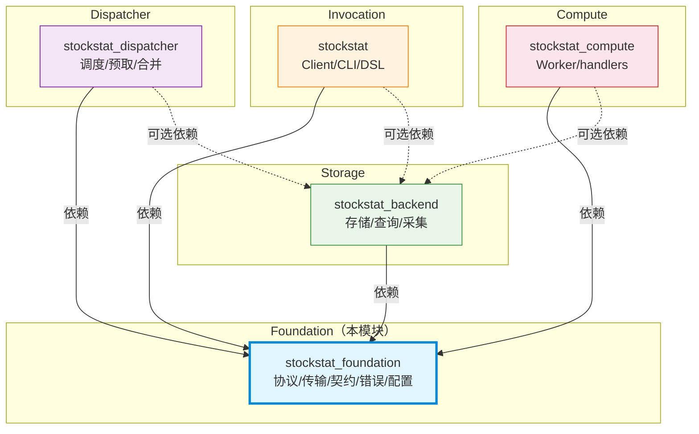
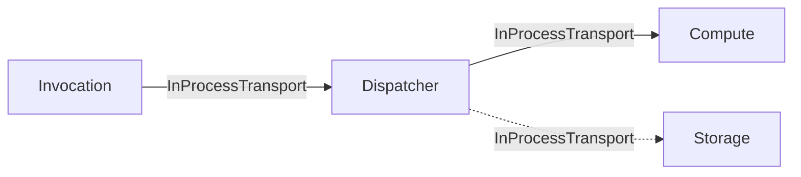
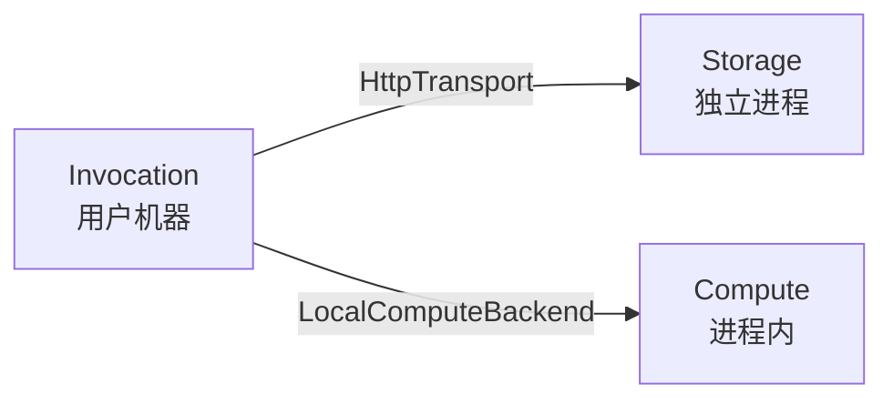
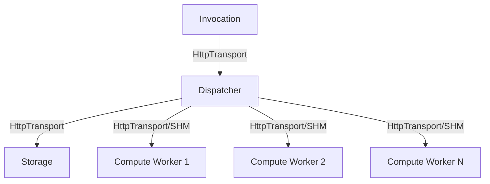

# DESIGN_ARCH_FOUNDATION_V31 — 基础层架构设计

> **模块**：Foundation（基础层）
> **版本**：v3.1
> **日期**：2026-07-24
> **状态**：设计稿
> **关联**：
> - [DESIGN_ARCH_V31.md](DESIGN_ARCH_V31.md) — 总设计
> - [DESIGN_PROT_V31.md](DESIGN_PROT_V31.md) — 通讯协议
> - [DESIGN_GENERALIZE.md](DESIGN_GENERALIZE.md) — 任务原子化清单
>
> **核心使命**：提供"协议骨架 + 传输抽象 + 契约定义"，使 Invocation / Dispatcher / Storage / Compute 四个业务模块**互不感知实现细节**，任意模块可独立更新维护。

---

## 目录

1. [模块定位与边界](#1-模块定位与边界)
2. [内部结构](#2-内部结构)
3. [契约层 Contracts](#3-契约层-contracts)
4. [协议层 Protocol](#4-协议层-protocol)
5. [编码层 Codec](#5-编码层-codec)
6. [传输层 Transport](#6-传输层-transport)
7. [错误体系 Errors](#7-错误体系-errors)
8. [配置体系 Config](#8-配置体系-config)
9. [插件体系 Plugin](#9-插件体系-plugin)
10. [与业务模块的依赖关系](#10-与业务模块的依赖关系)
11. [部署形态](#11-部署形态)
12. [演进策略](#12-演进策略)

---

## 1. 模块定位与边界

### 1.1 Foundation 是什么

Foundation 是 V3.1 的**协议与契约底座**，承载：
- 跨进程通信所需的**消息信封**（Envelope）
- 任务规范**三段式**（TaskSpec = DataSpec + ComputeSpec + DispatchSpec）
- **编码层**（JSON / Arrow / Cloudpickle / Msgpack / Raw）
- **传输层抽象与实现**（InProcess / HTTP / SHM / Redis / TCP）
- 各业务模块的 **Protocol 契约**（ComputeBackend / Transport / Storage / Cache）
- **错误体系**（AppError + V3.1 异常层次）
- **配置体系**（Config + 环境变量）
- **插件注册表**（PluginRegistry）

### 1.2 Foundation 不是什么

| 不是 | 理由 |
|------|------|
| 不含业务逻辑 | 无 BacktestEngine / ComputeEngine / 指标算法 |
| 不含数据持久化 | 无 SQLAlchemy / OHLCV 模型 |
| 不含任务调度 | 无队列 / Worker 注册 / 心跳 |
| 不含用户接口 | 无 CLI / TUI / Client SDK |
| 不感知 task_type | 协议只搬运字节，不关心"这是回测还是小波分析" |

### 1.3 设计铁律

> **Foundation 是 Layer 0，零业务依赖**。它只定义"消息如何包装、如何编码、如何传输、如何抛错"，不定义"算什么、存什么、调什么"。
>
> **反向依赖禁止**：Foundation 不 import 任何业务模块（Invocation / Dispatcher / Storage / Compute）。

---

## 2. 内部结构

```
packages/foundation/stockstat_foundation/
├── __init__.py                  # 导出公共 API
├── contracts/                   # Protocol 契约（runtime_checkable）
│   ├── __init__.py
│   ├── compute.py               # ComputeBackend / TaskRef / TaskInfo / TaskState
│   ├── transport.py             # Transport Protocol
│   ├── storage.py               # StorageBackend Protocol（Storage 模块实现）
│   ├── cache.py                 # Cache Protocol
│   ├── codec.py                 # Codec Protocol
│   ├── renderer.py              # Renderer Protocol（Viz 用）
│   ├── plugin.py                # Plugin Protocol
│   └── events.py                # Event Protocol（预留）
├── protocol/                    # 消息层
│   ├── __init__.py
│   ├── envelope.py              # Envelope + Headers
│   ├── messages.py              # 消息类型常量 + TYPE_TO_PATH
│   ├── task.py                  # TaskSpec / DataSpec / ComputeSpec / DispatchSpec
│   └── retry.py                 # RetryPolicy
├── codec/                       # 编码层
│   ├── __init__.py              # CodecRegistry + get_codec + 7 个 Codec
│   ├── json_codec.py
│   ├── arrow_codec.py
│   ├── parquet_codec.py
│   ├── csv_codec.py
│   ├── cloudpickle_codec.py
│   ├── msgpack_codec.py
│   └── raw_codec.py
├── transport/                   # 传输层
│   ├── __init__.py              # TransportRegistry + build_transport
│   ├── in_process.py            # InProcessTransport + make_pair
│   ├── http.py                  # HttpTransport
│   ├── shared_memory.py         # SharedMemoryTransport
│   ├── redis.py                 # RedisTransport
│   └── tcp.py                   # TcpTransport（预留骨架）
├── errors.py                    # AppError + V3.1 异常层次（12 个异常类）
├── config.py                    # Config + 环境变量解析
├── logging.py                   # 统一日志（trace_id 透传）
├── plugin/                      # 插件注册表
│   └── __init__.py              # PluginRegistry
└── utils/
    ├── __init__.py
    ├── serialization.py         # 通用序列化辅助
    └── timing.py                # 计时 / 超时辅助
```

### 2.1 与 V3 的差异

| 维度 | V3 | V3.1 |
|------|----|------|
| 包归属 | 嵌入 `frontend/stockstat/_core/` | **独立包 `stockstat-foundation`** |
| 依赖方向 | `_core` 被前端所有层依赖 | Foundation 被四个业务模块独立依赖 |
| 业务感知 | `_core` 含 compute/ 模块（业务） | Foundation **零业务**，compute 移至 Compute 模块 |
| 部署 | 随 frontend 安装 | 任意模块按需 `pip install stockstat-foundation` |

---

## 3. 契约层 Contracts

### 3.1 ComputeBackend Protocol

ComputeBackend 是 Invocation 与 Compute 之间的**唯一桥梁**。Invocation 持有 ComputeBackend 引用，不感知是本地还是远程。

```python
# contracts/compute.py
from __future__ import annotations
from dataclasses import dataclass, field
from datetime import datetime
from typing import Any, Optional, Protocol, runtime_checkable
from enum import Enum


class TaskState(str, Enum):
    PENDING = "pending"
    RUNNING = "running"
    COMPLETED = "completed"
    FAILED = "failed"
    CANCELLED = "cancelled"


@dataclass
class TaskInfo:
    """任务状态快照。"""
    task_id: str
    state: TaskState
    progress: float = 0.0
    created_at: datetime = field(default_factory=datetime.utcnow)
    started_at: Optional[datetime] = None
    finished_at: Optional[datetime] = None
    error: Optional[str] = None
    worker_id: Optional[str] = None
    slice_id: Optional[str] = None
    n_slices: int = 1
    completed_slices: int = 0


@dataclass
class TaskRef:
    """客户端持有的任务句柄。"""
    task_id: str
    backend: "ComputeBackend"

    @property
    def state(self) -> TaskState:
        return self.backend.get(self.task_id).state

    @property
    def status(self) -> str:
        return self.state.value

    @property
    def id(self) -> str:
        return self.task_id

    def ready(self) -> bool:
        info = self.backend.get(self.task_id)
        return info.state in (TaskState.COMPLETED, TaskState.FAILED, TaskState.CANCELLED)

    def wait(self, timeout: Optional[float] = None) -> Any:
        return self.backend.wait(self.task_id, timeout=timeout)

    def result(self) -> Any:
        return self.backend.result(self.task_id)

    def cancel(self) -> bool:
        return self.backend.cancel(self.task_id)

    def stream_results(self):
        yield from self.backend.stream_results(self.task_id)

    def info(self) -> TaskInfo:
        return self.backend.get(self.task_id)


@runtime_checkable
class ComputeBackend(Protocol):
    """统一计算后端协议。

    三种实现（位于 Compute 模块）：
    - LocalComputeBackend：进程内直接调用 handler
    - RemoteComputeBackend：通过 Transport 提交到 Dispatcher
    - AutoComputeBackend：按规模路由
    """
    name: str

    def submit(self, spec: "TaskSpec") -> TaskRef: ...
    def get(self, task_id: str) -> TaskInfo: ...
    def result(self, task_id: str) -> Any: ...
    def wait(self, task_id: str, timeout: Optional[float] = None) -> Any: ...
    def cancel(self, task_id: str) -> bool: ...
    def cluster_info(self, **kwargs) -> dict: ...
    def stream_results(self, task_id: str): ...
```

### 3.2 Transport Protocol

```python
# contracts/transport.py
@runtime_checkable
class Transport(Protocol):
    """传输层抽象 — 消息如何从 A 到 B。"""
    name: str

    def send(self, envelope: "Envelope") -> None: ...
    def receive(self, timeout: Optional[float] = None) -> "Envelope": ...
    def request(self, envelope: "Envelope", timeout: Optional[float] = None) -> "Envelope": ...
    def reply(self, original: "Envelope", reply: "Envelope") -> None: ...
    def send_data(self, data: bytes, content_type: str) -> str: ...
    def fetch_data(self, data_ref: str) -> bytes: ...
    def close(self) -> None: ...
```

### 3.3 StorageBackend Protocol

Storage 模块实现的契约，供 Dispatcher / Compute 直接访问数据（绕过 HTTP）：

```python
# contracts/storage.py
@runtime_checkable
class StorageBackend(Protocol):
    """存储后端协议 — OHLCV 数据访问抽象。"""
    name: str

    def fetch_ohlcv(self, symbols: list[str], timeframe: str,
                    start: Optional[str] = None, end: Optional[str] = None,
                    source: Optional[str] = None) -> Any: ...
    def ingest_ohlcv(self, symbol: str, timeframe: str, data: Any) -> int: ...
    def list_symbols(self) -> list[str]: ...
    def get_metadata(self, symbol: str) -> dict: ...
```

### 3.4 Cache Protocol

```python
# contracts/cache.py
@runtime_checkable
class Cache(Protocol):
    """缓存协议 — LRU / TTL / 命中率统计。"""
    name: str

    def get(self, key: str) -> Optional[Any]: ...
    def put(self, key: str, value: Any, ttl: Optional[int] = None) -> None: ...
    def get_ref(self, key: str) -> Optional[str]: ...   # 数据引用模式
    def invalidate(self, key: str) -> None: ...
    def stats(self) -> dict: ...
```

### 3.5 Codec Protocol

```python
# contracts/codec.py
@runtime_checkable
class Codec(Protocol):
    """编码协议 — 字节 ↔ Python 对象。"""
    name: str
    media_type: str

    def encode(self, data: Any) -> bytes: ...
    def decode(self, raw: bytes) -> Any: ...
```

### 3.6 Plugin Protocol

```python
# contracts/plugin.py
@runtime_checkable
class Plugin(Protocol):
    """插件协议 — 可挂载到 FastAPI 或独立运行。"""
    name: str
    version: str

    def mount(self, app: Any, **kwargs) -> None: ...
    def unmount(self, app: Any) -> None: ...
```

---

## 4. 协议层 Protocol

### 4.1 Envelope 信封

忠实落地 COMPUTE_OFFLOAD_PLAN_V2_CN §12.3，所有节点间通信的统一包装：

```python
# protocol/envelope.py
@dataclass
class Headers:
    content_type: str = "application/json"
    data_codec: str = "arrow"
    strategy_codec: str = "cloudpickle"
    encoding: str = "json"               # json / msgpack
    priority: int = 0                    # 0 普通 / -1 高 / 1 低
    timeout: int = 3600
    trace_id: str = ""
    data_ref: str = ""                   # shm:// / cache:// / inline:b64 / redis://
    retry_count: int = 0
    protocol_version: str = "1.0"
    accepted_codecs: list[str] = field(default_factory=list)
    accepted_encodings: list[str] = field(default_factory=list)


@dataclass
class Envelope:
    protocol: str = "stockstat-rpc"
    version: str = "1.0"
    type: str = ""
    id: str = field(default_factory=lambda: str(uuid.uuid4()))
    reply_to: Optional[str] = None
    headers: Headers = field(default_factory=Headers)
    payload: Any = None

    def to_dict(self) -> dict: ...
    @classmethod
    def from_dict(cls, d: dict) -> "Envelope": ...
    def encode(self) -> bytes: ...        # 按 headers.encoding 选择 json/msgpack
    @classmethod
    def decode(cls, raw: bytes) -> "Envelope": ...  # 自动检测
    def reply(self, type: str, payload=None, content_type="application/json") -> "Envelope": ...
```

**关键设计**（与 V3 一致，已验证可靠）：
- bytes payload 自动 base64 编码（`_payload_b64` 标记）
- decode 自动检测 JSON vs Msgpack（JSON 先尝试，失败 fallback msgpack）
- `reply()` 透传 `trace_id` 和 `protocol_version`

### 4.2 TaskSpec 三段式

V3.1 的 TaskSpec 在 V3 基础上**扩展 ComputeSpec 以支持 47 个 task_type**（见 DESIGN_GENERALIZE §12）：

```python
# protocol/task.py
@dataclass
class DataSpec:
    """描述需要什么数据 — 任何任务类型通用。"""
    symbols: list[str]
    timeframe: str = "1d"
    start: Optional[str] = None
    end: Optional[str] = None
    source: Optional[str] = None

    def cache_key(self) -> str:
        """sha256(symbols + timeframe + start + end + source) 前 32 字节"""
        ...


@dataclass
class DispatchSpec:
    """描述如何分发 — 任何任务类型通用。"""
    split_strategy: str = "auto"     # auto/param_wise/symbol_wise/time_wise/none
    max_workers: Optional[int] = None
    data_dispatch: str = "auto"      # auto/inline/shared_memory/stream/storage_ref
    priority: int = 0
    timeout: int = 3600
    retry_count: int = 0
    preemptable: bool = False


@dataclass
class ComputeSpec:
    """描述做什么计算 — 按 task_type 分发到对应 handler。

    V3.1 扩展点：params dict 承载 47 个 task_type 的特定参数，
    避免为每个 task_type 新增专用字段。
    """
    task_type: str                   # 见 DESIGN_GENERALIZE §11 注册表
    strategy_ref: Optional[str] = None
    strategy_codec: str = "cloudpickle"
    params: dict = field(default_factory=dict)

    # 回测类共用字段（保留 V3 兼容语义）
    initial_cash: float = 1_000_000.0
    cost_model: Optional[str] = None
    fill_model: Optional[str] = None
    execution_model: Optional[str] = None
    benchmark: Optional[str] = None
    trade_on: str = "open"
    allow_short: bool = False
    periods_per_year: Optional[int] = None

    # 网格搜索/批量共用
    param_grid: Optional[dict] = None
    metric: str = "sharpe"
    maximize: bool = True
    strategies: Optional[dict] = None
    fee_models: Optional[list] = None

    # 蒙特卡洛共用
    n_simulations: int = 1000
    seed: int = 0


@dataclass
class TaskSpec:
    """完整任务规范 — V2 §12.5 三段式。"""
    task_id: str
    data_spec: DataSpec
    compute_spec: ComputeSpec
    dispatch_spec: DispatchSpec = field(default_factory=DispatchSpec)
    trace_id: str = ""
    created_at: datetime = field(default_factory=datetime.utcnow)
    created_by: str = ""

    def to_dict(self) -> dict: ...
    @classmethod
    def from_dict(cls, d: dict) -> "TaskSpec": ...
```

### 4.3 消息类型常量

V3.1 消息类型表完全继承 V3（已验证），见 [DESIGN_PROT_V31.md §3](DESIGN_PROT_V31.md) 完整定义。Foundation 只定义常量与 `TYPE_TO_PATH` 映射：

```python
# protocol/messages.py
TASK_SUBMIT = "task.submit"
TASK_ACK = "task.ack"
TASK_STATUS = "task.status"
TASK_STATUS_REPLY = "task.status.reply"
TASK_RESULT = "task.result"
TASK_RESULT_REPLY = "task.result.reply"
TASK_CANCEL = "task.cancel"
TASK_PROGRESS = "task.progress"
TASK_ERROR = "task.error"
CLUSTER_INFO = "cluster.info"
CLUSTER_INFO_REPLY = "cluster.info.reply"

DISPATCH_ASSIGN = "dispatch.assign"
DISPATCH_ACK = "dispatch.ack"
DISPATCH_COMPLETE = "dispatch.complete"
DISPATCH_PARTIAL = "dispatch.partial"
DISPATCH_FAIL = "dispatch.fail"
DISPATCH_HEARTBEAT = "dispatch.heartbeat"
DISPATCH_REGISTER = "dispatch.register"
DISPATCH_UNREGISTER = "dispatch.unregister"
DISPATCH_DRAIN = "dispatch.drain"
DISPATCH_PREEMPT = "dispatch.preempt"
DISPATCH_RESUME = "dispatch.resume"
DISPATCH_PREEMPT_REJECTED = "dispatch.preempt_rejected"

DATA_FETCH = "data.fetch"
DATA_STREAM = "data.stream"
DATA_REF = "data.ref"

CLUSTER_DISCOVER = "cluster.discover"
CLUSTER_DISCOVER_REPLY = "cluster.discover.reply"

TYPE_TO_PATH = {
    TASK_SUBMIT: "/dispatch/submit",
    TASK_STATUS: "/dispatch/status",
    TASK_RESULT: "/dispatch/result",
    TASK_CANCEL: "/dispatch/cancel",
    CLUSTER_INFO: "/dispatch/cluster",
    DISPATCH_REGISTER: "/dispatch/register",
    DISPATCH_HEARTBEAT: "/dispatch/heartbeat",
    DISPATCH_UNREGISTER: "/dispatch/unregister",
    DISPATCH_ASSIGN: "/dispatch/assign",
    DISPATCH_COMPLETE: "/dispatch/complete",
    DISPATCH_FAIL: "/dispatch/fail",
    DISPATCH_PARTIAL: "/dispatch/partial",
    DISPATCH_PREEMPT: "/dispatch/preempt",
    DISPATCH_RESUME: "/dispatch/resume",
    DISPATCH_DRAIN: "/dispatch/drain",
    CLUSTER_DISCOVER: "/dispatch/discover",
    DATA_FETCH: "/api/v1/ohlcv",
}
```

### 4.4 RetryPolicy

```python
# protocol/retry.py
@dataclass
class RetryPolicy:
    max_retries: int = 3
    backoff_base: float = 1.0
    backoff_factor: float = 2.0
    max_backoff: float = 60.0

    def should_retry(self, error: dict, attempt: int) -> bool: ...
    def next_delay(self, attempt: int) -> float: ...
```

---

## 5. 编码层 Codec

### 5.1 Codec 注册表

| Codec | media_type | 用途 | 依赖 |
|-------|-----------|------|------|
| `JsonCodec` | `application/json` | 控制面、TaskSpec | 标准库 |
| `ArrowCodec` | `application/vnd.apache.arrow.file` | 表格数据 | pyarrow |
| `ParquetCodec` | `application/vnd.apache.parquet` | 大数据持久化 | pyarrow |
| `CsvCodec` | `text/csv` | CSV 导出 | pandas |
| `CloudpickleCodec` | `application/vnd.python.cloudpickle` | 策略闭包 | cloudpickle |
| `MsgpackCodec` | `application/msgpack` | 高效控制面 | msgpack（可选） |
| `RawCodec` | `application/octet-stream` | 二进制透传 | 标准库 |

### 5.2 工厂函数

```python
# codec/__init__.py
def get_codec(name: str) -> Codec:
    """按名称获取 codec：json/arrow/cloudpickle/..."""

def get_codec_for_content_type(content_type: str) -> Codec:
    """按 MIME 自动选择 codec。"""
    ct = content_type.lower()
    if ct == "application/json": return JsonCodec()
    if ct.startswith("application/vnd.apache.arrow"): return ArrowCodec()
    if ct.startswith("application/vnd.python.cloudpickle"): return CloudpickleCodec()
    if ct == "application/msgpack": return MsgpackCodec()
    if ct.startswith("application/vnd.stockstat.result+"):
        return get_codec(ct.split("+", 1)[1])
    return JsonCodec()  # fallback
```

### 5.3 可选依赖优雅降级

```python
class CloudpickleCodec:
    name = "cloudpickle"
    media_type = "application/vnd.python.cloudpickle"

    def encode(self, data):
        try:
            import cloudpickle
        except ImportError as e:
            raise ImportError(
                "CloudpickleCodec requires 'cloudpickle'. "
                "Install with: pip install stockstat-foundation[compute]"
            ) from e
        return cloudpickle.dumps(data)

    def decode(self, raw):
        import cloudpickle
        return cloudpickle.loads(raw)
```

---

## 6. 传输层 Transport

### 6.1 五种实现

| 实现 | 文件 | 适用 | 状态 |
|------|------|------|------|
| `InProcessTransport` | `in_process.py` | 测试 / 单机全栈 | P1 ✅ |
| `HttpTransport` | `http.py` | 跨机默认 | P2 ✅ |
| `SharedMemoryTransport` | `shared_memory.py` | 同机大数据 | P3 ✅ |
| `RedisTransport` | `redis.py` | 多 Worker 队列解耦 | P4 ✅ |
| `TcpTransport` | `tcp.py` | 高性能 LAN | 预留骨架 |

### 6.2 TransportRegistry + 工厂

```python
# transport/__init__.py
def build_transport(url: Optional[str] = None, *,
                    transport: Optional[Transport] = None,
                    transport_type: str = "auto") -> Transport:
    """根据 URL scheme 自动选择 Transport。"""
    if transport is not None:
        return transport
    if url is None or transport_type == "in_process":
        return InProcessTransport()
    if url.startswith("http://") or url.startswith("https://"):
        return HttpTransport(url)
    if url.startswith("shm://"):
        return SharedMemoryTransport()
    if url.startswith("redis://") or url.startswith("rediss://"):
        return RedisTransport(url)
    if url.startswith("tcp://"):
        return TcpTransport(url)
    raise ValueError(f"Unknown transport for URL: {url}")
```

### 6.3 InProcessTransport

```python
class InProcessTransport:
    """单进程传输 — queue.Queue + reply 路由。"""
    name = "in_process"

    def __init__(self, *, encode_envelopes: bool = False):
        self._inbox = queue.Queue()
        self._replies: dict[str, queue.Queue] = {}
        self._peer = None

    def wire_to(self, peer) -> None:
        """双向绑定（make_pair 辅助）。"""
        self._peer = peer

    def send(self, envelope): ...
    def receive(self, timeout=None): ...
    def request(self, envelope, timeout=None): ...
    def reply(self, original, reply): ...
    def send_data(self, data, ct) -> str:
        return f"inline:{base64.b64encode(data).decode('ascii')}"
    def fetch_data(self, data_ref) -> bytes: ...


def make_pair(*, encode_envelopes=False) -> tuple[InProcessTransport, InProcessTransport]:
    """创建双向绑定的传输对（测试用）。"""
    a = InProcessTransport(encode_envelopes=encode_envelopes)
    b = InProcessTransport(encode_envelopes=encode_envelopes)
    a.wire_to(b)
    b.wire_to(a)
    return a, b
```

### 6.4 HttpTransport

```python
class HttpTransport:
    """HTTP 传输 — REST + JSON 控制面。"""
    name = "http"

    def __init__(self, base_url: str, *, timeout: int = 30):
        self._base_url = base_url.rstrip("/")
        self._timeout = timeout
        self._client = httpx.Client(timeout=timeout)

    def send(self, envelope):
        path = messages.TYPE_TO_PATH.get(envelope.type, "/dispatch/message")
        self._client.post(f"{self._base_url}{path}",
                          content=envelope.encode(),
                          headers={"Content-Type": "application/json"})

    def request(self, envelope, timeout=None):
        path = messages.TYPE_TO_PATH.get(envelope.type, "/dispatch/message")
        resp = self._client.post(f"{self._base_url}{path}",
                                 content=envelope.encode(),
                                 headers={"Content-Type": "application/json"},
                                 timeout=timeout or self._timeout)
        # 区分 Envelope 响应 vs 普通 JSON
        try:
            d = json.loads(resp.content.decode("utf-8"))
            if d.get("protocol") == "stockstat-rpc":
                return Envelope.decode(resp.content)
            return Envelope(type=f"{envelope.type}.reply",
                            reply_to=envelope.id, payload=d)
        except (json.JSONDecodeError, UnicodeDecodeError):
            return Envelope(payload=resp.content)

    def send_data(self, data, ct) -> str:
        return f"inline:{base64.b64encode(data).decode('ascii')}"

    def fetch_data(self, data_ref) -> bytes: ...

    # 直连 REST 辅助（Dispatcher/Storage 内部用）
    def post_json(self, path, json_data) -> dict: ...
    def get_json(self, path, params=None) -> dict: ...
```

### 6.5 SharedMemoryTransport

```python
class SharedMemoryTransport:
    """同机零拷贝 — 控制面走 underlying，数据面走 mmap。"""
    name = "shared_memory"

    def __init__(self, underlying: Optional[Transport] = None, *,
                 inline_threshold: int = 10 * 1024 * 1024):
        self._underlying = underlying or InProcessTransport()
        self._inline_threshold = inline_threshold
        self._shm_registry: dict[str, object] = {}

    def send(self, envelope): self._underlying.send(envelope)
    def request(self, envelope, timeout=None):
        return self._underlying.request(envelope, timeout)

    def send_data(self, data, ct) -> str:
        if len(data) < self._inline_threshold:
            return f"inline:{base64...}"
        try:
            from multiprocessing import shared_memory
            shm = shared_memory.SharedMemory(
                name=f"ss_{uuid.uuid4().hex[:16]}",
                create=True, size=len(data))
            shm.buf[:len(data)] = data
            self._shm_registry[shm.name] = shm
            return f"shm://{shm.name}"
        except Exception:
            return f"inline:{base64...}"  # 优雅降级

    def fetch_data(self, data_ref) -> bytes:
        if data_ref.startswith("inline:"): return base64.b64decode(...)
        if data_ref.startswith("shm://"):
            shm_name = data_ref[len("shm://"):]
            if shm_name in self._shm_registry:
                return bytes(self._shm_registry[shm_name].buf)
            # 跨进程 attach
            from multiprocessing import shared_memory
            shm = shared_memory.SharedMemory(name=shm_name)
            data = bytes(shm.buf)
            shm.close()
            return data
```

### 6.6 RedisTransport

```python
class RedisTransport:
    """Redis 列表 + pub/sub 传输。"""
    name = "redis"

    def __init__(self, redis_url: str, *, node_id: Optional[str] = None,
                 queue_prefix: str = "stockstat:node"):
        import redis
        self._r = redis.from_url(redis_url)
        self._node_id = node_id or f"node-{uuid.uuid4().hex[:8]}"
        self._my_queue = f"{queue_prefix}:{self._node_id}"
        self._queue_prefix = queue_prefix
        self._replies = {}
        # 后台线程监听并路由回复
        self._dispatcher = threading.Thread(target=self._dispatch_loop, daemon=True)
        self._dispatcher.start()

    def send(self, envelope):
        peer_id = envelope.reply_to or "dispatcher"
        self._r.lpush(f"{self._queue_prefix}:{peer_id}", envelope.encode())

    def receive(self, timeout=None):
        result = self._r.brpop(self._my_queue, timeout=int(timeout or 0))
        if result is None: return None
        _, raw = result
        return Envelope.decode(raw)

    def send_data(self, data, ct) -> str:
        ref_id = uuid.uuid4().hex
        self._r.set(f"stockstat:data:{ref_id}", data, ex=3600)
        return f"redis://{ref_id}"

    def fetch_data(self, data_ref) -> bytes:
        ref_id = data_ref[len("redis://"):]
        return self._r.get(f"stockstat:data:{ref_id}")
```

---

## 7. 错误体系 Errors

### 7.1 异常层次

```python
# errors.py
class AppError(Exception):
    """基础应用错误 — 携带 code + context + recoverable。"""
    code: str = "INTERNAL_ERROR"
    recoverable: bool = False

    def __init__(self, message="", code=None, context=None, recoverable=None):
        self.message = message or self.code
        if code is not None: self.code = code
        self.context = context or {}
        if recoverable is not None: self.recoverable = recoverable
        super().__init__(self.message)

    def to_dict(self) -> dict:
        return {"code": self.code, "message": self.message,
                "context": self.context, "recoverable": self.recoverable}


class TaskError(AppError):
    code = "TASK_FAILED"
    recoverable = False

class TaskNotReadyError(AppError):
    code = "TASK_NOT_READY"
    recoverable = True

class TaskCancelledError(AppError):
    code = "TASK_CANCELLED"
    recoverable = False

class TaskTimeoutError(AppError):
    code = "TASK_TIMEOUT"
    recoverable = True

class TaskNotFoundError(AppError):
    code = "TASK_NOT_FOUND"
    recoverable = False

class ProtocolMismatchError(AppError):
    code = "PROTOCOL_MISMATCH"
    recoverable = False

class TransportError(AppError):
    code = "TRANSPORT_ERROR"
    recoverable = True

class DispatcherUnavailableError(AppError):
    code = "DISPATCHER_UNAVAILABLE"
    recoverable = True

class WorkerCapabilityError(AppError):
    code = "WORKER_CAPABILITY_INSUFFICIENT"
    recoverable = True

class StorageError(AppError):
    code = "STORAGE_ERROR"
    recoverable = True

class ComputeError(AppError):
    code = "COMPUTE_FAILED"
    recoverable = False

class ConfigError(AppError):
    code = "CONFIG_ERROR"
    recoverable = False
```

### 7.2 错误序列化

所有 AppError 子类可通过 `to_dict()` 序列化为 JSON，嵌入 `task.error` 消息的 payload：

```json
{
  "type": "task.error",
  "payload": {
    "task_id": "...",
    "error_code": "COMPUTE_FAILED",
    "error_message": "BacktestError: insufficient data for window=50",
    "context": {"task_type": "backtest", "symbol": "BTC/USDT"},
    "recoverable": false,
    "traceback": "...",
    "retryable": false
  }
}
```

---

## 8. 配置体系 Config

### 8.1 Config 类

```python
# config.py
@dataclass
class Config:
    """全局配置 — 环境变量 + 配置文件合并。"""
    # Invocation
    client_mode: str = "online"          # online / offline
    default_backend: str = "local"       # local / remote / auto

    # Dispatcher
    dispatcher_url: Optional[str] = None
    dispatcher_queue: str = "memory"     # memory / redis
    dispatcher_cache_dir: Optional[str] = None
    dispatcher_cache_size_mb: int = 512

    # Storage
    storage_url: Optional[str] = None
    database_url: str = "sqlite:///stockstat.db"
    admin_enabled: bool = False

    # Compute
    worker_concurrency: Optional[int] = None  # 默认 os.cpu_count()
    worker_alias: Optional[str] = None
    worker_preemptable: bool = False

    # Transport
    transport_timeout: int = 30
    redis_url: Optional[str] = None

    # Protocol
    protocol_version: str = "1.0"
    default_encoding: str = "json"       # json / msgpack

    @classmethod
    def from_env(cls) -> "Config":
        """从环境变量加载（STOCKSTAT_* 前缀）。"""
        ...

    @classmethod
    def from_file(cls, path: str) -> "Config":
        """从 TOML/JSON 配置文件加载。"""
        ...
```

### 8.2 环境变量

| 变量 | 默认 | 说明 |
|------|------|------|
| `STOCKSTAT_CLIENT_MODE` | `online` | online / offline |
| `STOCKSTAT_DEFAULT_BACKEND` | `local` | local / remote / auto |
| `STOCKSTAT_DISPATCHER_URL` | — | Dispatcher 地址 |
| `STOCKSTAT_DISPATCHER_QUEUE` | `memory` | memory / redis |
| `STOCKSTAT_DISPATCHER_CACHE_DIR` | — | 数据缓存目录 |
| `STOCKSTAT_STORAGE_URL` | — | Storage 地址 |
| `STOCKSTAT_DATABASE_URL` | `sqlite:///stockstat.db` | 数据库 URL |
| `STOCKSTAT_ADMIN_ENABLED` | `false` | Admin 面板 |
| `STOCKSTAT_WORKER_CONCURRENCY` | CPU 核数 | Worker 并发 |
| `STOCKSTAT_WORKER_ALIAS` | `hostname-pid` | Worker 别名 |
| `STOCKSTAT_WORKER_PREEMPTABLE` | `false` | 支持抢占 |
| `STOCKSTAT_REDIS_URL` | — | Redis 连接 |
| `STOCKSTAT_PROTOCOL_VERSION` | `1.0` | 协议版本 |
| `STOCKSTAT_DEFAULT_ENCODING` | `json` | 默认编码 |

---

## 9. 插件体系 Plugin

### 9.1 PluginRegistry

```python
# plugin/__init__.py
class PluginRegistry:
    """插件注册表 — Dispatcher / Admin / 自定义插件挂载点。"""
    def __init__(self):
        self._plugins: dict[str, Plugin] = {}

    def register(self, plugin: Plugin) -> None: ...
    def unregister(self, name: str) -> None: ...
    def get(self, name: str) -> Optional[Plugin]: ...
    def list(self) -> list[str]: ...
    def mount_all(self, app: Any, **kwargs) -> None:
        """挂载所有已注册插件到 FastAPI app。"""
        for plugin in self._plugins.values():
            plugin.mount(app, **kwargs)
```

### 9.2 内置插件命名空间

| 命名空间 | 提供者 | 用途 |
|---------|--------|------|
| `dispatcher` | Dispatcher 模块 | 任务调度插件 |
| `admin` | Storage 模块 | 管理面板 |
| `task_handlers` | Compute 模块 | handler 注册（非 FastAPI 插件） |

---

## 10. 与业务模块的依赖关系

### 10.1 依赖图


```mermaid
graph TB
    subgraph "Foundation（本模块）"
        F[stockstat_foundation<br/>协议/传输/契约/错误/配置]
    end

    subgraph "Invocation"
        I[stockstat<br/>Client/CLI/DSL]
    end

    subgraph "Dispatcher"
        D[stockstat_dispatcher<br/>调度/预取/合并]
    end

    subgraph "Storage"
        S[stockstat_backend<br/>存储/查询/采集]
    end

    subgraph "Compute"
        C[stockstat_compute<br/>Worker/handlers]
    end

    I -->|依赖| F
    D -->|依赖| F
    S -->|依赖| F
    C -->|依赖| F

    C -.->|可选依赖| S
    D -.->|可选依赖| S
    I -.->|可选依赖| S

    style F fill:#e1f5ff,stroke:#0288d1,stroke-width:3px
    style I fill:#fff3e0,stroke:#f57c00
    style D fill:#f3e5f5,stroke:#7b1fa2
    style S fill:#e8f5e9,stroke:#388e3c
    style C fill:#fce4ec,stroke:#c62828
```

### 10.2 依赖矩阵

| 模块 ↓ 依赖 → | Foundation | Invocation | Dispatcher | Storage | Compute |
|--------------|-----------|-----------|-----------|---------|---------|
| **Foundation** | — | ❌ | ❌ | ❌ | ❌ |
| **Invocation** | ✅ 必需 | — | ❌ | 可选 | 可选 |
| **Dispatcher** | ✅ 必需 | ❌ | — | 可选 | ❌ |
| **Storage** | ✅ 必需 | ❌ | ❌ | — | ❌ |
| **Compute** | ✅ 必需 | ❌ | ❌ | 可选 | — |

**关键约束**：
- Foundation **零业务依赖**（铁律）
- 四个业务模块**必需依赖 Foundation**
- Storage 是**被依赖方**（Dispatcher / Compute 可能直接访问数据，绕过 HTTP）
- Compute 与 Invocation **互不依赖**（通过 ComputeBackend Protocol 解耦）

### 10.3 包安装矩阵

```bash
# 仅做分析（用户机器）
pip install stockstat                    # = foundation + invocation

# 启动存储服务
pip install stockstat-backend            # = foundation + storage

# 启动调度服务
pip install stockstat-dispatcher         # = foundation + dispatcher

# 启动计算 Worker
pip install stockstat-compute            # = foundation + compute + invocation（复用算法）

# 全栈单机
pip install stockstat[all]               # 全部
```

---

## 11. 部署形态

Foundation 本身**不部署为独立进程**，它作为依赖被四个业务模块引入。但它的传输层支持所有部署组合：

### 11.1 单机全栈（场景 A）


```mermaid
graph LR
    I[Invocation] -->|InProcessTransport| D[Dispatcher]
    D -->|InProcessTransport| C[Compute]
    D -.->|InProcessTransport| S[Storage]
```

- 所有模块同进程
- Transport 全部 InProcess
- 零网络开销

### 11.2 存储分离（场景 B）


```mermaid
graph LR
    I[Invocation<br/>用户机器] -->|HttpTransport| S[Storage<br/>独立进程]
    I -->|LocalComputeBackend| C[Compute<br/>进程内]
```

### 11.3 四角色分离（场景 C/D/E）


```mermaid
graph TB
    I[Invocation] -->|HttpTransport| D[Dispatcher]
    D -->|HttpTransport| S[Storage]
    D -->|HttpTransport/SHM| C1[Compute Worker 1]
    D -->|HttpTransport/SHM| C2[Compute Worker 2]
    D -->|HttpTransport/SHM| CN[Compute Worker N]
```

---

## 12. 演进策略

### 12.1 协议版本演进

| 演进类型 | 策略 | 示例 |
|---------|------|------|
| 增加字段 | 直接加，旧端忽略 | v1.1 增加 `headers.gpu_required` |
| 增加 message type | 直接加，旧端不处理 | v1.1 增加 `task.heartbeat` |
| 增加 task_type | 直接加，按 capability 路由 | 新增 `bayesian_inference` |
| 增加 Codec | 通过 `content_type` 协商 | 增加 `protobuf` codec |
| 增加 Transport | 配置选择 | 增加 `TcpTransport` |
| 破坏性变更 | 升 `version`，双版本过渡 | v2.0 改 Envelope 结构 |

### 12.2 Foundation 单独升级

Foundation 作为独立包，可单独发布新版本。业务模块通过 `stockstat-foundation>=1.0` 约束版本。升级时：
1. Foundation 保证**语义化版本**（semver）
2. 小版本升级（1.0 → 1.1）：新增字段/消息类型，旧业务模块无感知
3. 大版本升级（1.x → 2.0）：破坏性变更，业务模块需同步迁移

### 12.3 可选依赖管理

```toml
# packages/foundation/pyproject.toml
[project]
name = "stockstat-foundation"
version = "1.0.0"
dependencies = [
    "httpx>=0.24",
]

[project.optional-dependencies]
arrow = ["pyarrow>=14.0"]
cloudpickle = ["cloudpickle>=3.0"]
msgpack = ["msgpack>=1.0"]
redis = ["redis>=5.0"]
compute = ["stockstat-foundation[arrow,cloudpickle]"]
distributed = ["stockstat-foundation[arrow,cloudpickle,msgpack,redis]"]
all = ["stockstat-foundation[distributed]"]
```

未安装可选依赖时：
- `ArrowCodec` / `CloudpickleCodec` / `MsgpackCodec` / `RedisTransport` 抛 `ImportError` 并提示安装命令
- 其他功能正常工作

---

## 13. 测试体系

### 13.1 单元测试（Foundation 内部）

| 测试文件 | 测试数 | 覆盖 |
|---------|--------|------|
| `test_envelope.py` | 25 | Envelope 编解码 / Headers / reply / base64 payload |
| `test_task_spec.py` | 20 | TaskSpec 三段式 / to_dict / from_dict / roundtrip |
| `test_codec.py` | 30 | 7 个 Codec / 工厂函数 / 优雅降级 |
| `test_transport.py` | 35 | InProcess / HTTP / SHM / Redis / build_transport |
| `test_errors.py` | 15 | 12 个异常类 / to_dict / 继承 |
| `test_config.py` | 12 | 环境变量 / 配置文件 / 默认值 |
| `test_messages.py` | 10 | 消息类型常量 / TYPE_TO_PATH |
| **合计** | **147** | |

### 13.2 关键测试场景

```python
# Envelope JSON + Msgpack roundtrip
env = Envelope(type="task.submit",
               headers=Headers(encoding="msgpack", trace_id="t1"),
               payload={"x": 1})
raw = env.encode()
restored = Envelope.decode(raw)
assert restored.headers.trace_id == "t1"
assert restored.payload["x"] == 1

# TaskSpec roundtrip
spec = TaskSpec(
    task_id="test-001",
    data_spec=DataSpec(symbols=["BTC/USDT"], timeframe="1d"),
    compute_spec=ComputeSpec(task_type="backtest",
                             params={"initial_cash": 10000}),
)
d = spec.to_dict()
restored = TaskSpec.from_dict(d)
assert restored.compute_spec.task_type == "backtest"

# InProcessTransport 双向通信
a, b = make_pair()
a.send(Envelope(type="task.submit", payload={"test": 1}))
received = b.receive(timeout=1.0)
assert received.type == "task.submit"

# SharedMemory 零拷贝
shm_t = SharedMemoryTransport()
ref = shm_t.send_data(b"x" * (20 * 1024 * 1024), "application/octet-stream")
assert ref.startswith("shm://")
data = shm_t.fetch_data(ref)
assert len(data) == 20 * 1024 * 1024
```

---

## 14. 总结

Foundation 是 V3.1 的**协议底座**，承载：

| 能力 | 实现 |
|------|------|
| 跨进程通信 | Envelope + 5 种 Transport |
| 任务规范 | TaskSpec 三段式（支持 47 个 task_type） |
| 编码 | 7 种 Codec（含可选依赖优雅降级） |
| 契约 | 6 个 Protocol（ComputeBackend/Transport/Storage/Cache/Codec/Plugin） |
| 错误 | 12 个异常类（AppError 层次） |
| 配置 | Config + 14 个环境变量 |
| 插件 | PluginRegistry |

**核心设计原则**：
1. **零业务依赖** — Foundation 不 import 任何业务模块
2. **协议零感知业务** — 协议只搬运字节，不关心 task_type
3. **可选依赖优雅降级** — arrow/cloudpickle/msgpack/redis 未安装时清晰报错
4. **独立发布** — semver 版本管理，业务模块按需升级

**与 V3 的关键差异**：
- V3 的 `_core` 嵌入 frontend → V3.1 的 Foundation 是**独立包**
- V3 的 `_core` 含 compute/ 业务模块 → V3.1 的 Foundation **纯协议**
- V3 的 ComputeBackend 在 `_core/contracts/` → V3.1 在 Foundation `contracts/`（位置变了，语义一致）

---

*本文件定义 Foundation 模块的完整架构。详细协议字段见 [DESIGN_PROT_V31.md](DESIGN_PROT_V31.md)，整体集成见 [DESIGN_ARCH_V31.md](DESIGN_ARCH_V31.md)。*
