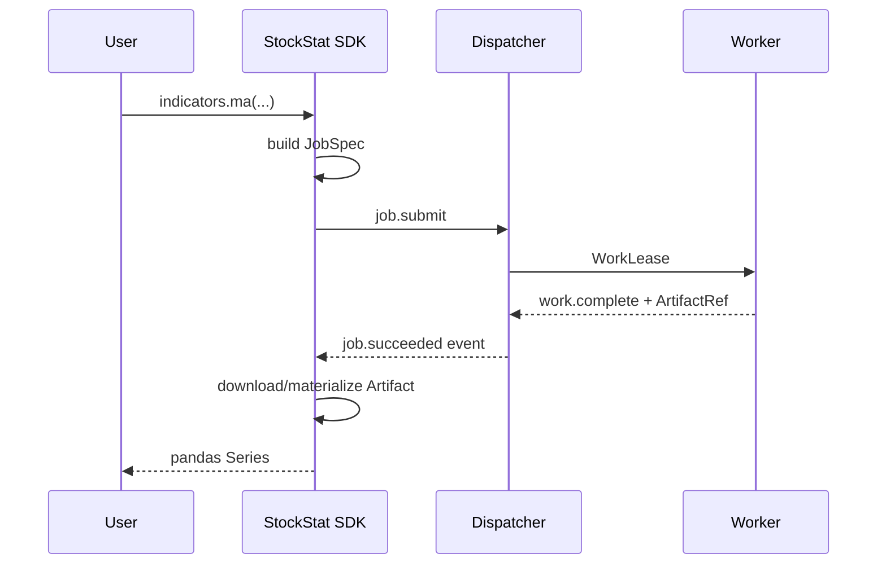
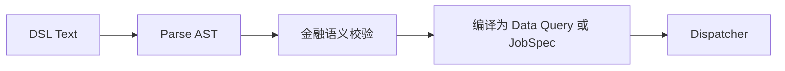
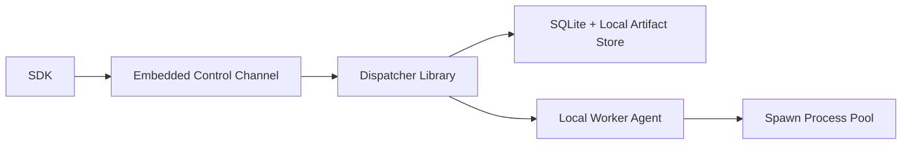

# StockStat V3.1 Invocation 架构设计

> 大模块：Python SDK、CLI、DSL 与调用网关
> 日期：2026-07-20
> 状态：V3.1 设计稿
> 上位文档：[DESIGN_ARCH_V31.md](DESIGN_ARCH_V31.md)
> 依赖文档：[DESIGN_ARCH_FOUNDATION_V31.md](DESIGN_ARCH_FOUNDATION_V31.md) | [DESIGN_PROT_V31.md](DESIGN_PROT_V31.md)

## 1. 模块职责

Invocation 将用户意图转换为类型化的 Storage 请求或金融 Job，并把异步任务、事件和 Artifact 还原成金融友好的 Python 结果。

Invocation 包含：

- 公共 Python SDK。
- 同步与异步任务句柄。
- 金融命名空间 API。
- CLI。
- DSL 编译器。
- Artifact 上传、下载与本地缓存。
- 本地嵌入式拓扑装配入口。
- 旧代码迁移工具和迁移报告。

Invocation 不包含：

- 指标和回测算法实现。
- 调度策略和任务状态持久化。
- OHLCV 数据库访问实现。
- Worker 线程池或进程池。

## 2. 一个调用模型

V3.1 删除以下分叉：

- `StockStatClient` 与 `V2Client` 双客户端。
- online/offline 两套方法实现。
- `LocalComputeBackend` 直调金融核心。
- `RemoteComputeBackend` 走 Dispatcher。
- `AutoComputeBackend` 在客户端猜测任务规模。
- `backtest()` 特判本地后端。

统一入口为 `StockStat` Session：

```python
from stockstat import StockStat

# 嵌入式单机拓扑
ss = StockStat.local(path="stockstat.db")

# 分离部署拓扑
ss = StockStat.connect("https://dispatcher.example.com", token="...")
```

`local()` 与 `connect()` 返回相同接口。差异只在 Session 内部使用的 `ControlChannel` 和 `ArtifactChannel` Adapter。

## 3. 同步与异步语义

所有计算调用先构造 Job。同步 API 只是 `submit + wait + materialize` 的语法糖。

```python
# 同步
ma = ss.indicators.ma(series, window=20)

# 同一个能力的异步形式
job = ss.indicators.submit(
    "ma",
    input=series,
    window=20,
)
ma = job.wait().as_series()
```

内部链路必须相同：



同步调用不得绕过 Dispatcher 和 Worker Runtime，即使所有组件位于同一进程或同一台机器。

## 4. SDK 包结构

建议新建 `packages/sdk/`，发布名继续使用 `stockstat`，但代码为全新实现：

```text
packages/sdk/
├── pyproject.toml
└── stockstat/
    ├── __init__.py
    ├── session.py
    ├── config.py
    ├── channels/
    │   ├── control.py
    │   ├── artifacts.py
    │   ├── http.py
    │   └── embedded.py
    ├── jobs/
    │   ├── handle.py
    │   ├── events.py
    │   └── result.py
    ├── data/
    │   ├── api.py
    │   ├── selectors.py
    │   └── frames.py
    ├── indicators/
    │   └── api.py
    ├── backtests/
    │   └── api.py
    ├── experiments/
    │   └── api.py
    ├── risk/
    │   └── api.py
    ├── portfolio/
    │   └── api.py
    ├── dsl/
    │   ├── parser.py
    │   ├── compiler.py
    │   └── diagnostics.py
    ├── artifacts/
    │   ├── upload.py
    │   ├── download.py
    │   └── cache.py
    ├── migration/
    │   ├── scanner.py
    │   ├── strategy_packager.py
    │   └── report.py
    └── cli/
        ├── main.py
        ├── data.py
        ├── jobs.py
        ├── cluster.py
        └── migrate.py
```

## 5. 公共 API

### 5.1 Data API

```python
bars = ss.data.ohlcv(
    "BTC/USDT",
    venue="binance",
    timeframe="1h",
    start="2024-01-01",
    end="2025-01-01",
)

ingest_job = ss.data.ingest(
    "BTC/USDT",
    source="binance",
    timeframe="1h",
    start="2024-01-01",
)
ingest_job.wait()
```

现有数据管理功能的对应入口一并保留：

```python
frames = ss.data.ohlcv_batch(["BTC/USDT", "ETH/USDT"], timeframe="1h")
instruments = ss.data.instruments(asset_class="crypto")
sources = ss.data.sources()
health = ss.data.health()

# 仅面向数据采集的有限计划，不开放通用 DAG/cron 工作流。
schedule = ss.data.schedule_ingest(
    "BTC/USDT",
    source="binance",
    timeframe="1h",
    interval="1h",
    mode="incremental",
)
```

`IngestSchedule` 每次触发都创建普通的 `finance.data.ingest` Job；调度、事件、重试和审计与手工采集一致。它只支持 `manual`、`interval`、`cron` 三类 trigger；`incremental` 是采集范围模式，不是第四类 trigger。该接口不演化为通用任务编排器。

小型查询可直接 materialize 为 DataFrame。大型查询默认返回 `DatasetHandle`：

```python
dataset = ss.data.dataset(selector)
df = dataset.collect(limit=100_000)
for batch in dataset.iter_batches():
    ...
```

### 5.2 Indicator API

支持本地对象和 Storage selector 两种输入：

```python
# 迁移友好的 Series 输入，SDK 上传为临时 Arrow Artifact
rsi = ss.indicators.rsi(df["close"], window=14)

# 避免数据先下载到 Client
job = ss.indicators.submit(
    "rsi",
    input=ss.data.selector("BTC/USDT", timeframe="1h"),
    column="close",
    window=14,
)
```

### 5.3 Backtest API

```python
strategy = ss.strategies.package(
    "research.strategies:ma_cross",
    config={"short": 5, "long": 20},
)

job = ss.backtests.submit(
    data=ss.data.selector("BTC/USDT", timeframe="1d"),
    strategy=strategy,
    initial_cash=10_000,
    cost_model={"name": "binance_spot", "params": {}},
    fill_model={"name": "next_open", "params": {}},
)

result = job.wait().as_backtest()
print(result.metrics)
```

`ss.backtests.run(...)` 提供同步语法糖，但仍经过完整 Job 链路。

### 5.4 Experiment API

```python
search = ss.experiments.grid_search(
    base_backtest={...},
    parameters={"short": [3, 5, 8], "long": [10, 20, 30]},
    objective={"metric": "sharpe", "direction": "maximize"},
)
result = search.wait().as_search_result()
```

批量、费率扫描、Monte Carlo、Walk-forward 和 Optuna 使用明确的金融 API，不暴露任意 DAG 构造器。

## 6. JobHandle

`JobHandle` 只保存 `job_id`、Session 引用和最近状态缓存，不保存服务端 Python 对象。

建议接口：

```python
class JobHandle:
    id: str

    def status(self) -> JobStatus: ...
    def wait(self, timeout: float | None = None) -> JobResult: ...
    def cancel(self, reason: str = "") -> CancelReceipt: ...
    def events(self, after: int | None = None): ...
    def result(self) -> JobResult: ...
    def artifacts(self) -> list[ArtifactRef]: ...
```

语义：

- `result()` 在未完成时抛 `JobNotReadyError`。
- `wait()` 的客户端 timeout 不等于取消服务端 Job。
- `cancel()` 是幂等命令，返回当前取消状态。
- `events()` 使用 SSE 或 Embedded EventChannel，并支持从 sequence 续读。
- 进度来自持久事件，不依赖内存列表。

## 7. JobResult 与惰性物化

服务端结果始终是 Manifest + ArtifactRef。SDK 提供金融结果视图：

| 视图 | 主要属性 |
|---|---|
| `IndicatorResult` | `series`、`metadata` |
| `BacktestResult` | `equity`、`fills`、`trades`、`positions`、`metrics`、`config` |
| `SearchResult` | `ranking`、`best_parameters`、`trial(job_id)` |
| `BatchResult` | `summary`、`result_refs` |
| `SimulationResult` | `quantiles`、`paths`、`statistics` |

大表默认惰性下载。访问 `result.equity` 时 SDK 才获取相应 Artifact，避免 `wait()` 一次性下载全部回测明细。

## 8. Artifact 输入处理

### 8.1 小型 Python 输入

当用户传入 Series/DataFrame：

1. SDK 验证 index、时区和字段。
2. 编码为 Arrow IPC。
3. 计算 SHA-256。
4. 请求上传 session。
5. 上传 Artifact。
6. JobSpec 只引用 ArtifactRef。

### 8.2 策略输入

远程策略不使用 cloudpickle。支持：

| 类型 | 说明 |
|---|---|
| Builtin | 内核内置、版本化策略 ID |
| Python package | wheel/source bundle + entrypoint + lock manifest |
| Declarative | 受限策略表达式，由 SDK 编译为 schema |

开发期 `StockStat.local()` 可提供显式 `unsafe_python_object` 调试功能，但该能力不进入远程协议、默认关闭，也不作为迁移验收路径。

## 9. DSL 设计位置

DSL 是 Invocation 编译器，而不是 Dispatcher 解释器。



收益：

- Dispatcher 不依赖 Lark。
- DSL 与 Python API 产生相同 JobSpec。
- 新能力通过 descriptor 暴露给 DSL 编译器。
- 语法错误和类型错误在 Client 侧提供精确位置。
- 不保留 V2 的硬编码 Evaluator 与 Registry Evaluator 双实现。

## 10. Embedded Topology

`StockStat.local()` 不等于直接调用 Kernel。它通过装配包启动真实模块：



建议装配包 `stockstat-local`，依赖 Dispatcher、Storage、Worker 和 Kernel。SDK 基础包不强依赖这些服务实现。

本地模式要求：

- 使用相同 Job/Stage/WorkUnit/Attempt 状态机。
- Worker 使用进程执行 CPU 密集任务。
- Artifact 仍以 Arrow/Manifest 表达。
- 可选跳过网络字节复制，但必须通过相同接口和合同。
- 合同测试可启用“强制序列化模式”，验证本地对象在远程边界也可 round-trip。

## 11. 调用网关

公开 HTTP API 由 Dispatcher 的 Gateway 子模块提供。SDK 不直接访问 Dispatcher 数据库，也不直接调用 Worker。

控制路径：

```text
SDK -> Gateway -> Command Handler -> Planner/Scheduler
```

数据路径：

```text
SDK -> Gateway 获取 upload/download session
SDK <-> Storage/Artifact endpoint 传输 Arrow bytes
```

Gateway 不代理大型二进制，避免重现 Storage/Dispatcher 带宽耦合。

## 12. 自动路由的归属

V3 的 `AutoComputeBackend` 在 Client 侧按粗略大小选择本地或远程。V3.1 删除该实现。

新规则：

- `StockStat.local()` 明确选择本地拓扑。
- `StockStat.connect()` 明确选择远程拓扑。
- 在远程集群内，任务大小、数据局部性和 Worker 选择由 Dispatcher Planner/Scheduler 决定。
- SDK 可提供显式 `execution.target="local"|"cluster"` 给混合 Session，但不自行估算资源。

## 13. CLI

建议命令：

```text
stockstat data ingest
stockstat data query
stockstat job submit
stockstat job status
stockstat job events
stockstat job cancel
stockstat job result
stockstat cluster workers
stockstat cluster capabilities
stockstat artifact inspect
stockstat strategy package
stockstat migrate scan
stockstat migrate verify
stockstat local serve
```

CLI 调用 SDK，不复制 HTTP 客户端逻辑。

## 14. 旧代码迁移

### 14.1 客户端迁移映射

| 旧调用 | 新调用 | 迁移性质 |
|---|---|---|
| `StockStatClient(...)` | `StockStat.connect(...)` | 构造方式替换 |
| `V2Client(mode="offline")` | `StockStat.local(...)` | 拓扑替换 |
| `client.ohlcv(...)` | `ss.data.ohlcv(...)` | 命名空间迁移 |
| `client.ingest(...)` | `ss.data.ingest(...).wait()` | 采集变为持久 Job |
| `client.compute.ma(...)` | `ss.indicators.ma(...)` | 可机械迁移 |
| `client.backtest(...)` | `ss.backtests.run(...)` | 同步语义保留 |
| `client.compute.remote(...)` | 对应命名空间 `.submit(...)` | 弱类型入口改为类型化入口 |
| `task.wait/result/cancel` | `JobHandle.wait/result/cancel` | 语义相近 |
| `V2Client.run_dsl()` | `ss.dsl.execute()` | 单一编译器 |
| `BacktestResult.render()` | `result.render()` 或 Admin | Artifact 惰性物化 |

### 14.2 策略迁移

旧 `@strategy` 函数迁移要求：

- 函数位于可导入模块，不依赖 notebook 临时闭包。
- 捕获变量改为显式 config。
- 依赖通过 package manifest 声明。
- 使用 `stockstat strategy package module:function` 生成签名 Artifact。
- 本地和远程使用同一个 StrategyRef。

Notebook 用户可由迁移工具生成模块模板；无法静态提取的动态闭包会给出明确诊断，不静默 cloudpickle。

### 14.3 完全迁移的定义

“旧客户代码能完全迁移”定义为：

1. 每个公开功能有新 API 对应项。
2. 代表性脚本可通过明确代码修改迁移，不要求旧 import 原样运行。
3. 相同数据、参数、种子下满足结果等价策略。
4. 旧策略可重构为受控策略包执行。
5. 迁移工具可发现不支持的动态行为并生成报告。

### 14.4 迁移期解释器隔离

旧包和新 SDK 最终都使用 `import stockstat`，因此迁移期禁止把两个 distribution 安装在同一 Python 环境。仓库使用独立解释器：

```text
.venv-legacy  -> 当前 frontend/backend/worker，仅用于生成 oracle
.venv-v31     -> packages/services 新实现
```

旧/新 parity 通过子进程、Arrow/JSON fixtures 和差异报告交换结果，不通过在同一进程中导入两套 `stockstat` 实现。P9 切换时新 SDK 才接管正式 distribution/import 名。

## 15. 错误与诊断

SDK 将协议错误映射为稳定异常：

```text
StockStatError
├── ValidationError
├── DataNotFoundError
├── CapabilityUnavailableError
├── JobNotFoundError
├── JobNotReadyError
├── JobFailedError
├── JobCancelledError
├── DeadlineExceededError
├── ArtifactIntegrityError
└── AuthenticationError
```

异常包含 `code`、`job_id`、`error_id`、`trace_id` 和可公开 details，不依赖服务端异常类路径。

## 16. 测试策略

### 16.1 API contract tests

- 每个金融 facade 生成预期 JobSpec golden fixture。
- 同步和异步形式生成相同 operation/input/execution 语义。
- Local 与 HTTP Channel 的响应模型一致。

### 16.2 Artifact tests

- Series/DataFrame Arrow round-trip。
- 时区、MultiIndex、NaN 策略和 dtype 测试。
- 分块上传、断点重传和 SHA-256 校验。
- 惰性下载确保未访问属性时不下载大 Artifact。

### 16.3 Migration tests

- 当前 README/USAGE 中所有 Python 示例建立 V3.1 对应版本。
- PAXG 研究脚本至少选取代表性完整迁移。
- 旧 23 指标、回测、批量、搜索、Monte Carlo、Walk-forward 均有迁移案例。
- 扫描器能识别旧 imports、双客户端、cloudpickle 策略和本地数据库用法。

### 16.4 Embedded/remote parity

同一 JobSpec 分别通过 Embedded Channel 和 HTTP Channel 执行，比较 Manifest、核心数值和 Artifact schema。

## 17. 验收标准

- 公共入口只有一个 `StockStat` Session。
- 同步调用没有直调 Kernel 的隐藏路径。
- SDK 不包含调度和金融算法实现。
- DSL 与 Python facade 编译到同一 JobSpec。
- 大对象不进入 JSON 控制消息。
- 现有公开功能均有迁移映射和至少一个可运行迁移测试。
- `StockStat.local()` 与 `StockStat.connect()` 除构造方式外使用同一 API。
