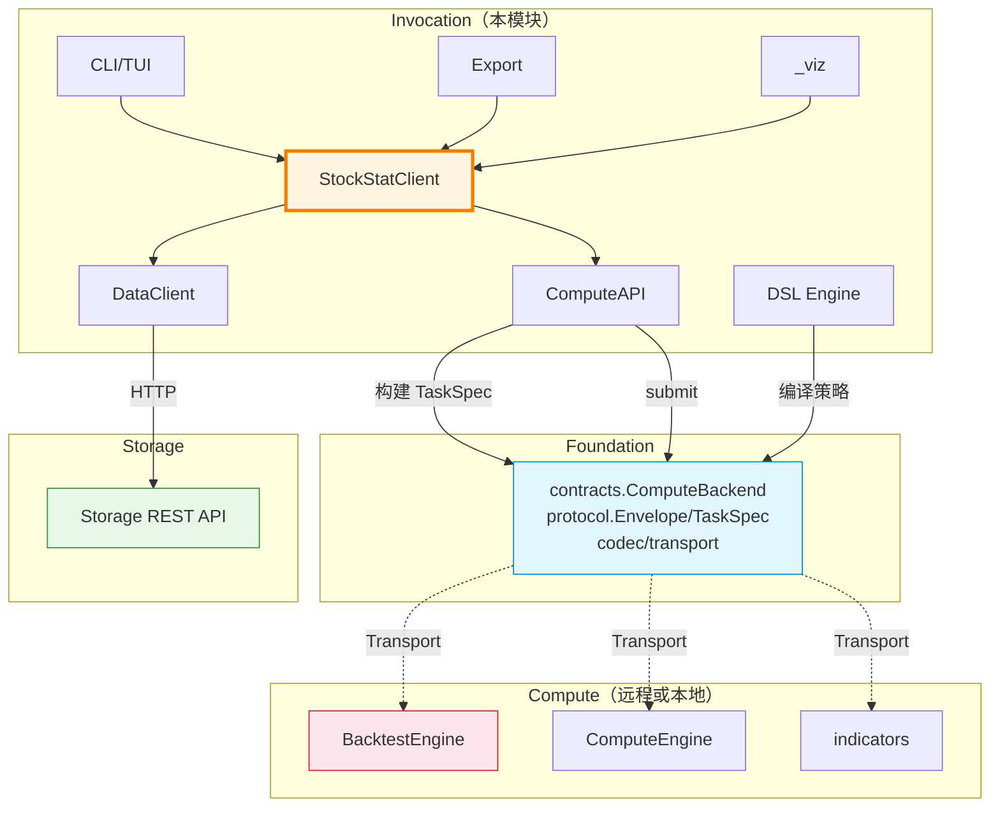

# DESIGN_ARCH_INVOCATION_V31 — 用户入口层架构设计

> **模块**：Invocation（用户入口 / 调用端）
> **版本**：v3.1
> **日期**：2026-07-24
> **状态**：设计稿
> **关联**：
> - [DESIGN_ARCH_V31.md](DESIGN_ARCH_V31.md) — 总设计
> - [DESIGN_ARCH_FOUNDATION_V31.md](DESIGN_ARCH_FOUNDATION_V31.md) — 基础层
> - [DESIGN_GENERALIZE.md](DESIGN_GENERALIZE.md) — 任务原子化清单
>
> **核心使命**：提供用户与系统交互的**唯一入口**——构建 TaskSpec、提交到 ComputeBackend、消费结果。**不含任何计算逻辑**（BacktestEngine / ComputeEngine 移至 Compute 模块），通过 ComputeBackend Protocol 与 Compute 解耦。

---

## 目录

1. [模块定位与边界](#1-模块定位与边界)
2. [内部结构](#2-内部结构)
3. [StockStatClient 重构](#3-stockstatclient-重构)
4. [ComputeAPI 设计](#4-computeapi-设计)
5. [DataClient 数据访问](#5-dataclient-数据访问)
6. [DSL 引擎](#6-dsl-引擎)
7. [CLI 命令](#7-cli-命令)
8. [TUI 交互终端](#8-tui-交互终端)
9. [Export 序列化](#9-export-序列化)
10. [可视化层 _viz](#10-可视化层-_viz)
11. [旧客户代码迁移路径](#11-旧客户代码迁移路径)
12. [部署形态](#12-部署形态)
13. [测试体系](#13-测试体系)

---

## 1. 模块定位与边界

### 1.1 Invocation 是什么

Invocation 是用户与系统交互的**唯一入口**，承载：

- **Client SDK**：`StockStatClient` —— Python 用户的主接口
- **ComputeAPI**：`client.compute.*` —— 本地轻量计算 + 远程任务提交
- **DataClient**：`client.ohlcv()` / `client.ingest()` —— 数据访问
- **DSL 引擎**：策略 DSL 解析与求值
- **CLI**：`stockstat` 命令行
- **TUI**：交互式终端
- **Export**：结果序列化（JSON/CSV/Parquet）
- **可视化**：ChartSpec + matplotlib 渲染

### 1.2 Invocation 不是什么

| 不是 | 理由 |
|------|------|
| 不含 BacktestEngine | 移至 Compute 模块，通过 ComputeBackend 调用 |
| 不含 ComputeEngine | 同上 |
| 不含指标算法 | 通过 `indicator` task_type 提交到 Compute |
| 不含任务调度 | 由 Dispatcher 负责 |
| 不含数据持久化 | 由 Storage 负责 |
| 不含协议实现 | 由 Foundation 提供 |

### 1.3 与 V2/V3 的关键差异

| 维度 | V2/V3 | V3.1 |
|------|-------|------|
| BacktestEngine 位置 | `frontend/stockstat/backtest/` | **Compute 模块** |
| ComputeEngine 位置 | `frontend/stockstat/compute/` | **Compute 模块** |
| 指标算法位置 | `frontend/stockstat/indicators/` | **Compute 模块** |
| Client 计算方式 | 直接调 BacktestEngine | 通过 ComputeBackend 提交 TaskSpec |
| 兼容性 | V3 保留 v1.7 行为 | **完全重构**，旧 API 迁移而非兼容 |

**核心变化**：V2/V3 的 Client 既"调用"又"计算"（BacktestEngine 在进程内），V3.1 的 Client **只调用**，计算全部委托给 ComputeBackend。

---

## 2. 内部结构

```
packages/invocation/stockstat/
├── __init__.py                   # 导出 StockStatClient + 公共 API
├── client.py                     # StockStatClient（重构）
├── compute_api.py                # ComputeAPI（client.compute）
├── data_access/                  # DataClient（HTTP / Storage 直连）
│   ├── __init__.py
│   └── ohlcv.py
├── dsl/                          # DSL 引擎
│   ├── __init__.py
│   ├── parser.py
│   ├── evaluator.py
│   └── ast_nodes.py
├── plot/                         # 绘图基础（_viz 的简化版）
│   ├── __init__.py
│   ├── base.py
│   └── matplotlib_backend.py
├── _viz/                         # 可视化层（ChartSpec / Renderer）
│   ├── __init__.py
│   ├── specs/
│   └── renderers/
├── export/                       # 序列化
│   ├── __init__.py
│   └── serializers.py
├── app/                          # CLI / TUI
│   ├── __init__.py
│   ├── cli.py
│   └── tui.py
└── _compat.py                    # V2 旧 API 迁移辅助（可选）
```

### 2.1 依赖关系


```mermaid
graph TB
    subgraph "Invocation（本模块）"
        C[StockStatClient]
        CA[ComputeAPI]
        DC[DataClient]
        DSL[DSL Engine]
        CLI[CLI/TUI]
        EXP[Export]
        VIZ[_viz]
    end

    subgraph "Foundation"
        F[contracts.ComputeBackend<br/>protocol.Envelope/TaskSpec<br/>codec/transport]
    end

    subgraph "Compute（远程或本地）"
        BE[BacktestEngine]
        CE[ComputeEngine]
        IND[indicators]
    end

    subgraph "Storage"
        S[Storage REST API]
    end

    C --> CA
    C --> DC
    CA -->|构建 TaskSpec| F
    CA -->|submit| F
    DC -->|HTTP| S
    DSL -->|编译策略| F
    CLI --> C
    EXP --> C
    VIZ --> C

    F -.->|Transport| BE
    F -.->|Transport| CE
    F -.->|Transport| IND

    style C fill:#fff3e0,stroke:#f57c00,stroke-width:3px
    style F fill:#e1f5ff,stroke:#0288d1
    style BE fill:#fce4ec,stroke:#c62828
    style S fill:#e8f5e9,stroke:#388e3c
```

---

## 3. StockStatClient 重构

### 3.1 设计理念

V3.1 的 StockStatClient 是**纯调用者**：
- 构建 TaskSpec 提交给 ComputeBackend
- 通过 DataClient 访问 Storage（HTTP 或直连）
- 不直接持有 BacktestEngine / ComputeEngine

### 3.2 类定义

```python
# client.py
from __future__ import annotations
from typing import Optional, Any
from stockstat_foundation import (
    ComputeBackend, TaskRef, TaskInfo, TaskState,
    TaskSpec, DataSpec, ComputeSpec, DispatchSpec,
    Config, Transport, build_transport,
)


class StockStatClient:
    """StockStat V3.1 用户入口。

    职责：
    - 数据访问（ohlcv / ingest / list_symbols）
    - 计算提交（backtest / compute / remote）
    - 结果消费（wait / result / stream）

    不含：
    - BacktestEngine / ComputeEngine（在 Compute 模块）
    - 任务调度（在 Dispatcher 模块）
    - 数据持久化（在 Storage 模块）

    用法：
        # 默认本地后端（单机全栈）
        client = StockStatClient()
        result = client.backtest(data, strategy)

        # 远程后端（分布式）
        client = StockStatClient(
            storage_url="http://storage:8000",
            compute_backend=RemoteComputeBackend("http://dispatcher:9000"),
        )
        task = client.compute.remote("grid_search", ...)
        result = task.wait()
    """

    def __init__(
        self,
        host: str = "localhost",
        port: int = 8000,
        *,
        storage_url: Optional[str] = None,
        compute_backend: Optional[ComputeBackend] = None,
        config: Optional[Config] = None,
        http_client=None,
        cache_enabled: bool = True,
        use_https: bool = False,
        timeout: int = 30,
    ):
        self._config = config or Config.from_env()
        self._storage_url = storage_url or f"{'https' if use_https else 'http'}://{host}:{port}"

        # DataClient（HTTP 访问 Storage）
        from .data_access import DataClient
        self._data_client = DataClient(
            base_url=self._storage_url,
            http_client=http_client,
            timeout=timeout,
            cache_enabled=cache_enabled,
        )

        # ComputeBackend（默认 LocalComputeBackend，在 Compute 模块实现）
        if compute_backend is None:
            compute_backend = self._build_default_backend()
        self._compute_backend = compute_backend

        # ComputeAPI（client.compute）
        from .compute_api import ComputeAPI
        self._compute_api = ComputeAPI(
            client=self,
            data_client=self._data_client,
            compute_backend=self._compute_backend,
        )

    def _build_default_backend(self) -> ComputeBackend:
        """根据 config.default_backend 选择后端。"""
        backend_type = self._config.default_backend
        if backend_type == "local":
            from stockstat_compute import LocalComputeBackend
            return LocalComputeBackend(client=self, data_client=self._data_client)
        elif backend_type == "remote":
            from stockstat_compute import RemoteComputeBackend
            url = self._config.dispatcher_url or self._storage_url
            return RemoteComputeBackend(dispatcher_url=url)
        elif backend_type == "auto":
            from stockstat_compute import AutoComputeBackend, LocalComputeBackend, RemoteComputeBackend
            local = LocalComputeBackend(client=self, data_client=self._data_client)
            remote = RemoteComputeBackend(
                dispatcher_url=self._config.dispatcher_url or self._storage_url)
            return AutoComputeBackend(local=local, remote=remote)
        else:
            raise ValueError(f"Unknown backend type: {backend_type}")

    # ── 数据访问（透传 DataClient）──

    @property
    def data(self) -> "DataClient":
        return self._data_client

    def ohlcv(self, symbol: str, timeframe: str = "1d",
              start: Optional[str] = None, end: Optional[str] = None,
              source: Optional[str] = None) -> Any:
        """查询 OHLCV 数据。"""
        return self._data_client.ohlcv(symbol, timeframe, start, end, source)

    def ingest(self, symbol: str, timeframe: str, data: Any) -> int:
        """写入 OHLCV 数据。"""
        return self._data_client.ingest(symbol, timeframe, data)

    def list_symbols(self) -> list[str]:
        return self._data_client.list_symbols()

    # ── 计算访问 ──

    @property
    def compute(self) -> "ComputeAPI":
        return self._compute_api

    @property
    def compute_backend(self) -> ComputeBackend:
        return self._compute_backend

    def backtest(self, data, strategy, **kwargs) -> Any:
        """透明模式回测 — 默认同步阻塞，返回 BacktestResult。

        若 async_submit=True，返回 TaskRef。
        """
        async_submit = kwargs.pop("async_submit", False)
        spec = self._compute_api.build_backtest_task_spec(
            data=data, strategy=strategy, **kwargs)
        task_ref = self._compute_backend.submit(spec)
        if async_submit:
            return task_ref
        return task_ref.wait(timeout=kwargs.get("timeout", 3600))

    def run_dsl(self, expression: str, data=None, **kwargs) -> Any:
        """执行 DSL 表达式。"""
        from .dsl import DslEngine
        engine = DslEngine(client=self)
        return engine.evaluate(expression, data=data, **kwargs)

    # ── 集群信息 ──

    def cluster_info(self, **kwargs) -> dict:
        return self._compute_backend.cluster_info(**kwargs)
```

### 3.3 关键设计决策

| 决策 | 选择 | 理由 |
|------|------|------|
| BacktestEngine 位置 | Compute 模块 | 计算与调用分离 |
| 默认后端 | `LocalComputeBackend` | 单机全栈场景零配置 |
| 远程后端 | 显式传入或 config | 分布式场景显式配置 |
| 透明模式 | `backtest()` 默认同步 | 与 v1.7 行为一致，便于迁移 |
| 异步模式 | `compute.remote()` 或 `async_submit=True` | 显式异步 |

---

## 4. ComputeAPI 设计

### 4.1 设计理念

ComputeAPI 是 `client.compute` 的实现，提供：
- **本地轻量计算**：毫秒级指标直接计算（`client.compute.ma()`）
- **远程任务提交**：重型任务异步提交（`client.compute.remote()`）
- **集群查询**：`client.compute.cluster_info()`

### 4.2 类定义

```python
# compute_api.py
from __future__ import annotations
from typing import Any, Optional
import uuid
from stockstat_foundation import (
    TaskSpec, DataSpec, ComputeSpec, DispatchSpec,
    TaskRef, ComputeBackend,
)


class ComputeAPI:
    """统一计算入口。

    - client.compute.ma(...)         # 本地轻量指标（即时返回）
    - client.compute.remote(...)     # 远程任务提交（返回 TaskRef）
    - client.compute.cluster_info()  # 集群拓扑
    """

    def __init__(self, client, data_client, compute_backend: ComputeBackend):
        self._client = client
        self._data_client = data_client
        self._backend = compute_backend

    # ── 本地轻量指标（直接调 Compute 模块的 ComputeEngine）──
    # 这些方法在 LocalComputeBackend 场景下直接执行；
    # 在 RemoteComputeBackend 场景下提交 indicator task_type。

    def ma(self, data, window: int = 20) -> Any:
        """简单移动平均。"""
        return self._dispatch_indicator("ma", data, window=window)

    def ema(self, data, window: int = 12) -> Any:
        return self._dispatch_indicator("ema", data, window=window)

    def rsi(self, data, window: int = 14) -> Any:
        return self._dispatch_indicator("rsi", data, window=window)

    def macd(self, data, fast: int = 12, slow: int = 26, signal: int = 9) -> Any:
        return self._dispatch_indicator("macd", data, fast=fast, slow=slow, signal=signal)

    def bollinger(self, data, window: int = 20, std: float = 2.0) -> Any:
        return self._dispatch_indicator("bollinger", data, window=window, std=std)

    def atr(self, data, window: int = 14) -> Any:
        return self._dispatch_indicator("atr", data, window=window)

    # ... 其余 40+ 指标方法透传 ...

    def _dispatch_indicator(self, name: str, data, **params) -> Any:
        """本地后端直接计算；远程后端提交 indicator task。"""
        from stockstat_foundation import LocalComputeBackend
        if isinstance(self._backend, LocalComputeBackend):
            # 本地路径：直接调 ComputeEngine
            return self._backend.compute_indicator(name, data, **params)
        # 远程路径：构建 TaskSpec 提交
        spec = TaskSpec(
            task_id=str(uuid.uuid4()),
            data_spec=DataSpec(symbols=[]),  # 数据内联
            compute_spec=ComputeSpec(
                task_type="indicator",
                params={"indicator_name": name, **params},
            ),
        )
        task_ref = self._backend.submit(spec)
        return task_ref.wait()

    # ── 显式异步提交 ──

    def remote(
        self,
        task_type: str,
        *,
        data_spec: Optional[DataSpec] = None,
        compute_spec: Optional[ComputeSpec] = None,
        dispatch_spec: Optional[DispatchSpec] = None,
        **kwargs,
    ) -> TaskRef:
        """显式异步提交 — 返回 TaskRef。

        用法：
            task = client.compute.remote(
                "grid_search",
                data_spec=DataSpec(symbols=["BTC/USDT"], timeframe="1d"),
                compute_spec=ComputeSpec(
                    task_type="grid_search",
                    strategy_ref=cloudpickle_dumps(strategy),
                    param_grid={"short": [3, 5, 8], "long": [10, 20, 30]},
                    metric="sharpe",
                ),
            )
            result = task.wait(timeout=3600)
        """
        spec = TaskSpec(
            task_id=str(uuid.uuid4()),
            data_spec=data_spec or DataSpec(symbols=kwargs.pop("symbols", [])),
            compute_spec=compute_spec or ComputeSpec(task_type=task_type, params=kwargs),
            dispatch_spec=dispatch_spec or DispatchSpec(),
            trace_id=str(uuid.uuid4()),
            created_by="StockStatClient",
        )
        return self._backend.submit(spec)

    # ── 统计/信号/非线性等高级任务的便捷方法 ──

    def correlation(self, x, y, method: str = "pearson") -> Any:
        """相关分析。"""
        return self._submit_stats("correlation", x=x, y=y, method=method)

    def hypothesis_test(self, data, test: str, **params) -> Any:
        return self._submit_stats("hypothesis_test", data=data, test=test, **params)

    def spectral_analysis(self, signal_data, method: str = "welch", **params) -> Any:
        return self._submit_stats("spectral_analysis", signal=signal_data,
                                  method=method, **params)

    def transfer_entropy(self, x, y, k: int = 1, l: int = 1) -> Any:
        return self._submit_stats("transfer_entropy", x=x, y=y, k=k, l=l)

    def mutual_information(self, x, y, estimator: str = "ksg") -> Any:
        return self._submit_stats("mutual_information", x=x, y=y, estimator=estimator)

    def _submit_stats(self, task_type: str, **params) -> Any:
        """统计类任务便捷提交（同步等待结果）。"""
        spec = TaskSpec(
            task_id=str(uuid.uuid4()),
            data_spec=DataSpec(symbols=[]),
            compute_spec=ComputeSpec(task_type=task_type, params=params),
        )
        task_ref = self._backend.submit(spec)
        return task_ref.wait()

    # ── 集群信息 ──

    def cluster_info(self, **kwargs) -> dict:
        return self._backend.cluster_info(**kwargs)

    # ── TaskSpec 构建辅助 ──

    def build_backtest_task_spec(self, data, strategy, **kwargs) -> TaskSpec:
        """构建 backtest TaskSpec。"""
        from stockstat_foundation import cloudpickle_dumps
        import uuid

        async_submit = kwargs.pop("async_submit", False)
        timeout = kwargs.pop("timeout", 3600)

        # 数据内联或引用
        data_spec = DataSpec(symbols=kwargs.pop("symbols", []))
        if hasattr(data, "to_dict"):
            # DataFrame 等结构 → 内联
            kwargs["_inline_data"] = data

        return TaskSpec(
            task_id=str(uuid.uuid4()),
            data_spec=data_spec,
            compute_spec=ComputeSpec(
                task_type="backtest",
                strategy_ref=f"cloudpickle:{cloudpickle_dumps(strategy)}",
                initial_cash=kwargs.get("initial_cash", 1_000_000.0),
                cost_model=kwargs.get("cost_model"),
                fill_model=kwargs.get("fill_model"),
                execution_model=kwargs.get("execution_model"),
                benchmark=kwargs.get("benchmark"),
                trade_on=kwargs.get("trade_on", "open"),
                allow_short=kwargs.get("allow_short", False),
                periods_per_year=kwargs.get("periods_per_year"),
                params=kwargs,
            ),
            dispatch_spec=DispatchSpec(timeout=timeout),
            trace_id=str(uuid.uuid4()),
            created_by="StockStatClient",
        )
```

### 4.3 本地 vs 远程的透明切换

```python
# 场景 A：单机全栈（默认）
client = StockStatClient()  # LocalComputeBackend
sma = client.compute.ma(data.close, window=20)        # 直接调 ComputeEngine
result = client.backtest(data, strategy)               # 直接调 BacktestEngine

# 场景 B：分布式
client = StockStatClient(
    storage_url="http://storage:8000",
    compute_backend=RemoteComputeBackend("http://dispatcher:9000"),
)
sma = client.compute.ma(data.close, window=20)        # 提交 indicator task（透明）
result = client.backtest(data, strategy)               # 提交 backtest task（透明同步）

# 场景 C：显式异步
task = client.compute.remote("grid_search", ...)
result = task.wait(timeout=3600)
```

---

## 5. DataClient 数据访问

### 5.1 设计

DataClient 是 Invocation 访问 Storage 的 HTTP 客户端：

```python
# data_access/ohlcv.py
class DataClient:
    """OHLCV 数据访问客户端。"""

    def __init__(self, base_url: str, *, http_client=None,
                 timeout: int = 30, cache_enabled: bool = True):
        self._base_url = base_url.rstrip("/")
        self._http = http_client or httpx.Client(timeout=timeout)
        self._cache_enabled = cache_enabled
        self._cache: dict[str, Any] = {}

    def ohlcv(self, symbol: str, timeframe: str = "1d",
              start: Optional[str] = None, end: Optional[str] = None,
              source: Optional[str] = None) -> "pd.DataFrame":
        """查询 OHLCV 数据。"""
        cache_key = f"{symbol}:{timeframe}:{start}:{end}:{source}"
        if self._cache_enabled and cache_key in self._cache:
            return self._cache[cache_key]

        params = {"symbol": symbol, "timeframe": timeframe}
        if start: params["start"] = start
        if end: params["end"] = end
        if source: params["source"] = source

        resp = self._http.get(f"{self._base_url}/api/v1/ohlcv", params=params)
        resp.raise_for_status()

        # Arrow 解码
        from stockstat_foundation import ArrowCodec
        df = ArrowCodec().decode(resp.content)

        if self._cache_enabled:
            self._cache[cache_key] = df
        return df

    def ingest(self, symbol: str, timeframe: str, data) -> int:
        """写入 OHLCV 数据。"""
        from stockstat_foundation import ArrowCodec
        body = ArrowCodec().encode(data)
        resp = self._http.post(
            f"{self._base_url}/api/v1/ohlcv",
            content=body,
            headers={"Content-Type": "application/vnd.apache.arrow.file",
                     "X-Symbol": symbol, "X-Timeframe": timeframe},
        )
        return resp.json().get("rows_written", 0)

    def list_symbols(self) -> list[str]:
        resp = self._http.get(f"{self._base_url}/api/v1/symbols")
        return resp.json().get("symbols", [])
```

---

## 6. DSL 引擎

### 6.1 设计

DSL 引擎解析策略表达式，编译为可执行策略或 TaskSpec：

```python
# dsl/evaluator.py
class DslEngine:
    """策略 DSL 引擎。

    用法：
        result = client.run_dsl(
            "backtest(ma_cross(short=5, long=20), initial_cash=10000)",
            data=btc_data,
        )
    """

    def __init__(self, client):
        self._client = client
        from .parser import DslParser
        self._parser = DslParser()

    def evaluate(self, expression: str, data=None, **kwargs) -> Any:
        ast = self._parser.parse(expression)
        return self._eval(ast, data=data, **kwargs)

    def compile_strategy(self, expression: str) -> str:
        """编译 DSL 为 cloudpickle 策略引用。"""
        ast = self._parser.parse(expression)
        strategy = self._build_strategy(ast)
        from stockstat_foundation import cloudpickle_dumps
        return f"cloudpickle:{cloudpickle_dumps(strategy)}"
```

### 6.2 DSL 语法示例

```dsl
# 简单指标
sma(close, 20)

# 回测
backtest(ma_cross(short=5, long=20), initial_cash=10000, cost_model="binance_spot")

# 网格搜索
grid_search(
    ma_cross(short=?, long=?),
    param_grid={short: [3, 5, 8], long: [10, 20, 30]},
    metric="sharpe",
)
```

---

## 7. CLI 命令

### 7.1 命令结构

```bash
# 数据命令
stockstat data fetch BTC/USDT --timeframe 1d --start 2024-01-01
stockstat data list
stockstat data ingest --file btc.csv --symbol BTC/USDT --timeframe 1d

# 计算命令
stockstat compute indicator ma --window 20 --symbol BTC/USDT
stockstat compute backtest --strategy ma_cross.py --initial-cash 10000
stockstat compute grid-search --strategy ma_cross.py --param-grid grid.json

# 任务命令（分布式）
stockstat task submit --spec task.json
stockstat task status <task_id>
stockstat task result <task_id>
stockstat task cancel <task_id>
stockstat task list

# 集群命令
stockstat cluster info
stockstat cluster workers
stockstat cluster stats

# 服务命令
stockstat serve --host 0.0.0.0 --port 8000     # 启动 Storage
stockstat dispatcher --storage-url http://storage:8000  # 启动 Dispatcher
stockstat worker --dispatcher-url http://dispatcher:9000  # 启动 Worker

# 配置命令
stockstat config show
stockstat config set dispatcher_url http://dispatcher:9000
```

### 7.2 CLI 实现

```python
# app/cli.py
import click


@click.group()
def cli():
    """StockStat V3.1 CLI."""


@cli.group()
def data():
    """数据管理。"""


@data.command("fetch")
@click.argument("symbol")
@click.option("--timeframe", default="1d")
@click.option("--start")
@click.option("--end")
def data_fetch(symbol, timeframe, start, end):
    from ..client import StockStatClient
    client = StockStatClient()
    df = client.ohlcv(symbol, timeframe, start, end)
    click.echo(df.to_string())


@cli.group()
def compute():
    """计算任务。"""


@compute.command("backtest")
@click.option("--strategy", required=True)
@click.option("--symbol", required=True)
@click.option("--initial-cash", default=1000000, type=float)
def compute_backtest(strategy, symbol, initial_cash):
    from ..client import StockStatClient
    client = StockStatClient()
    data = client.ohlcv(symbol)
    # 加载策略
    strategy_obj = _load_strategy(strategy)
    result = client.backtest(data, strategy_obj, initial_cash=initial_cash)
    click.echo(f"Result: {result.summary()}")


@cli.group()
def task():
    """任务管理。"""


@task.command("status")
@click.argument("task_id")
def task_status(task_id):
    from ..client import StockStatClient
    client = StockStatClient()
    info = client.compute_backend.get(task_id)
    click.echo(f"Task {task_id}: {info.state.value} ({info.progress*100:.1f}%)")
```

---

## 8. TUI 交互终端

### 8.1 设计

TUI 提供交互式终端界面，用于探索性分析：

```python
# app/tui.py
class StockStatTUI:
    """交互式终端。

    功能：
    - 数据浏览（symbol 列表、OHLCV 预览）
    - 计算交互（输入 DSL，实时显示结果）
    - 任务监控（查看运行中的任务、进度）
    - 集群拓扑（Worker 列表、负载）
    """

    def __init__(self, client):
        self._client = client

    def run(self):
        """启动 TUI 主循环。"""
        ...
```

---

## 9. Export 序列化

### 9.1 序列化器

```python
# export/serializers.py
class ResultSerializer:
    """结果序列化 — 支持多种格式导出。"""

    @staticmethod
    def to_json(result: Any) -> str:
        """序列化为 JSON。"""

    @staticmethod
    def to_csv(result: Any) -> str:
        """序列化为 CSV。"""

    @staticmethod
    def to_parquet(result: Any) -> bytes:
        """序列化为 Parquet。"""

    @staticmethod
    def to_arrow(result: Any) -> bytes:
        """序列化为 Arrow IPC。"""
```

---

## 10. 可视化层 _viz

### 10.1 设计

V3.1 的可视化层简化为：
- **ChartSpec**：声明式图表规范（数据 + 类型 + 参数）
- **Renderer**：渲染器协议（matplotlib 实现）
- **PlotAdapter**：回测结果适配器

```python
# _viz/specs/__init__.py
@dataclass
class ChartSpec:
    """声明式图表规范。"""
    title: str
    chart_type: str          # line / bar / scatter / heatmap / candlestick
    data: Any
    params: dict = field(default_factory=dict)
    theme: str = "default"


# _viz/renderers/__init__.py
class MatplotlibRenderer:
    """matplotlib 渲染器。"""
    def render(self, spec: ChartSpec) -> bytes:
        """渲染为 PNG bytes。"""
        ...
```

---

## 11. 旧客户代码迁移路径

V3.1 完全重构，但保证**功能等价迁移**。下表列出 V2 旧 API 到 V3.1 新 API 的映射：

### 11.1 客户端构造

```python
# V2 旧
from stockstat import StockStatClient
client = StockStatClient(host="storage", port=8000)

# V3.1 新（等价）
from stockstat import StockStatClient
client = StockStatClient(storage_url="http://storage:8000")
# 或
client = StockStatClient(host="storage", port=8000)  # 参数兼容
```

### 11.2 数据访问

```python
# V2 旧
df = client.ohlcv("BTC/USDT", "1d", "2024-01-01")

# V3.1 新（完全相同）
df = client.ohlcv("BTC/USDT", "1d", "2024-01-01")
```

### 11.3 指标计算

```python
# V2 旧
sma = client.compute.ma(data.close, window=20)

# V3.1 新（完全相同，本地后端透明）
sma = client.compute.ma(data.close, window=20)
```

### 11.4 回测

```python
# V2 旧
result = client.backtest(data, strategy, initial_cash=10000)

# V3.1 新（完全相同，本地后端透明）
result = client.backtest(data, strategy, initial_cash=10000)

# V3.1 新（异步）
task = client.backtest(data, strategy, initial_cash=10000, async_submit=True)
result = task.wait()
```

### 11.5 网格搜索

```python
# V2 旧
from stockstat import grid_search
result = grid_search(data, strategy, param_grid={...}, metric="sharpe")

# V3.1 新（通过 ComputeAPI）
task = client.compute.remote(
    "grid_search",
    data_spec=DataSpec(symbols=["BTC/USDT"], timeframe="1d"),
    compute_spec=ComputeSpec(
        task_type="grid_search",
        strategy_ref=cloudpickle_dumps(strategy),
        param_grid={"short": [3, 5, 8], "long": [10, 20, 30]},
        metric="sharpe",
    ),
)
result = task.wait()
```

### 11.6 迁移辅助

提供 `_compat.py` 模块，封装常见 V2 调用为 V3.1 等价形式：

```python
# _compat.py
def grid_search(data, strategy, param_grid, metric="sharpe", **kwargs):
    """V2 兼容包装 — 内部提交 grid_search task。"""
    from stockstat_foundation import cloudpickle_dumps
    client = StockStatClient()
    task = client.compute.remote(
        "grid_search",
        compute_spec=ComputeSpec(
            task_type="grid_search",
            strategy_ref=f"cloudpickle:{cloudpickle_dumps(strategy)}",
            param_grid=param_grid,
            metric=metric,
            **kwargs,
        ),
    )
    return task.wait()
```

### 11.7 迁移矩阵

| V2 旧 API | V3.1 新 API | 迁移难度 |
|----------|------------|---------|
| `StockStatClient(host, port)` | `StockStatClient(host, port)` | 零修改 |
| `client.ohlcv(...)` | `client.ohlcv(...)` | 零修改 |
| `client.compute.ma(...)` | `client.compute.ma(...)` | 零修改 |
| `client.backtest(...)` | `client.backtest(...)` | 零修改 |
| `client.backtest(..., async_submit=True)` | 新增 | 新能力 |
| `grid_search(...)` | `client.compute.remote("grid_search", ...)` | 中等（用 _compat 零修改） |
| `batch_backtest(...)` | `client.compute.remote("batch_backtest", ...)` | 中等 |
| `BacktestEngine(...).run()` | `client.backtest(...)` 或直接用 Compute 模块 | 中等 |
| `ComputeEngine.<method>` | `client.compute.<method>` | 零修改 |

---

## 12. 部署形态

### 12.1 单机全栈（场景 A）

```python
# 全部默认，零配置
client = StockStatClient()
# → LocalComputeBackend
# → DataClient → http://localhost:8000（或直连 Storage）
```

### 12.2 存储分离（场景 B）

```python
client = StockStatClient(storage_url="http://storage:8000")
# → LocalComputeBackend（计算在本地）
# → DataClient → http://storage:8000
```

### 12.3 分布式（场景 C/D/E）

```python
from stockstat_compute import RemoteComputeBackend
client = StockStatClient(
    storage_url="http://storage:8000",
    compute_backend=RemoteComputeBackend("http://dispatcher:9000"),
)
# → RemoteComputeBackend（计算提交到 Dispatcher）
# → DataClient → http://storage:8000
```

### 12.4 离线模式

```python
client = StockStatClient(
    config=Config(client_mode="offline", database_url="sqlite:///local.db"),
)
# → LocalComputeBackend
# → DataClient 直连本地 SQLite（绕过 HTTP）
```

---

## 13. 测试体系

### 13.1 测试分层

| 测试文件 | 测试数 | 覆盖 |
|---------|--------|------|
| `test_client.py` | 30 | StockStatClient 构造 / 默认后端 / 透明模式 |
| `test_compute_api.py` | 40 | ComputeAPI 本地/远程切换 / 47 task_type 便捷方法 |
| `test_data_client.py` | 20 | DataClient HTTP / 缓存 / Arrow 解码 |
| `test_dsl.py` | 25 | DSL 解析 / 求值 / 策略编译 |
| `test_cli.py` | 20 | CLI 命令 / 参数解析 / 输出格式 |
| `test_compat.py` | 15 | V2 旧 API 迁移验证 |
| `test_export.py` | 10 | 序列化器 / 格式转换 |
| `test_viz.py` | 10 | ChartSpec / Renderer |
| **合计** | **170** | |

### 13.2 关键测试场景

```python
# 透明模式 — 本地后端
client = StockStatClient()
result = client.backtest(data, strategy, initial_cash=10000)
assert isinstance(result, BacktestResult)

# 异步模式
task = client.backtest(data, strategy, async_submit=True)
assert isinstance(task, TaskRef)
result = task.wait(timeout=60)
assert isinstance(result, BacktestResult)

# 远程后端透明切换
client_local = StockStatClient()
client_remote = StockStatClient(compute_backend=RemoteComputeBackend(...))
# 同一 API，不同后端
result_local = client_local.compute.ma(data.close, window=20)
result_remote = client_remote.compute.ma(data.close, window=20)
pd.testing.assert_series_equal(result_local, result_remote)

# V2 迁移验证
from stockstat._compat import grid_search
result = grid_search(data, strategy, param_grid={...})
assert isinstance(result, pd.DataFrame)

# PAXG v5-redo 场景
client = StockStatClient()
task = client.compute.remote(
    "batch_backtest",
    compute_spec=ComputeSpec(
        task_type="batch_backtest",
        strategies={f"S{i}": cloudpickle_dumps(s) for i, s in enumerate(strategies)},
        fee_models=["F1_SpotNoBNB", "F4_FutBNB"],
    ),
)
result = task.wait(timeout=3600)
assert len(result) == 33 * 4  # 132 次回测
```

---

## 14. 总结

Invocation 是 V3.1 的**用户入口**，承载：

| 能力 | 实现 |
|------|------|
| Client SDK | `StockStatClient`（重构，纯调用者） |
| 计算访问 | `ComputeAPI`（本地轻量 + 远程异步） |
| 数据访问 | `DataClient`（HTTP / 直连） |
| DSL 引擎 | 策略表达式解析与编译 |
| CLI | `stockstat` 命令（data/compute/task/cluster/serve） |
| TUI | 交互式终端 |
| Export | JSON/CSV/Parquet/Arrow 序列化 |
| 可视化 | ChartSpec + matplotlib Renderer |

**核心设计原则**：
1. **纯调用者** — Invocation 不含 BacktestEngine/ComputeEngine，通过 ComputeBackend 解耦
2. **透明切换** — 本地/远程后端通过同一 API，用户无感知
3. **迁移友好** — V2 旧 API 零修改或通过 `_compat.py` 包装
4. **任务原子化** — 所有计算归约为 TaskSpec + task_type

**与 V2/V3 的关键差异**：
- V2/V3 的 Client 既调用又计算 → V3.1 的 Client **只调用**
- V2/V3 的 BacktestEngine 在 frontend → V3.1 在 **Compute 模块**
- V2/V3 的兼容层（ComputeBackend）是"可选" → V3.1 是**唯一路径**

---

*本文件定义 Invocation 模块的完整架构。计算后端实现见 [DESIGN_ARCH_COMPUTE_V31.md](DESIGN_ARCH_COMPUTE_V31.md)，数据存储见 [DESIGN_ARCH_STORAGE_V31.md](DESIGN_ARCH_STORAGE_V31.md)。*
