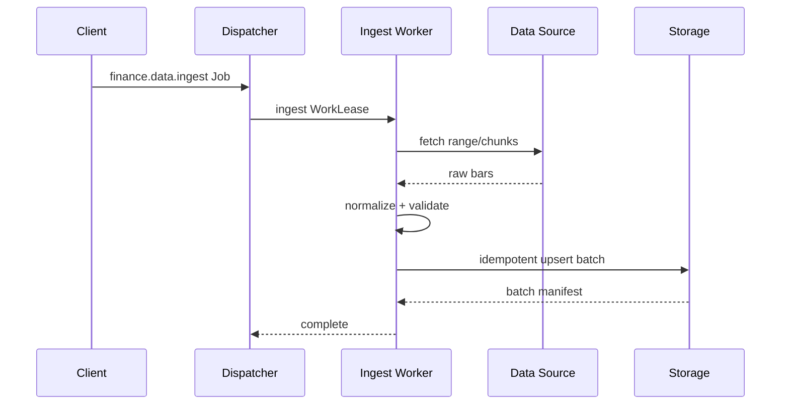
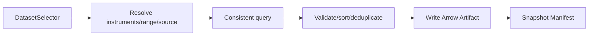
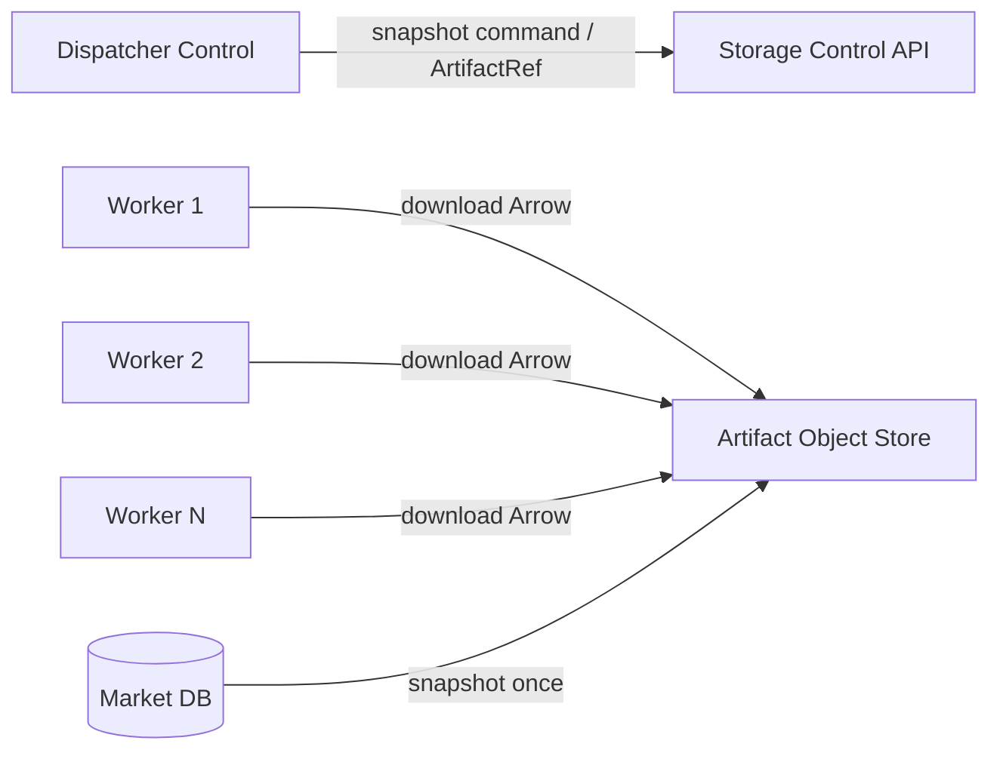

# StockStat V3.1 Storage 架构设计

> 大模块：金融数据、不可变 Artifact 与数据交换
> 日期：2026-07-20
> 状态：V3.1 设计稿
> 上位文档：[DESIGN_ARCH_V31.md](DESIGN_ARCH_V31.md)
> 依赖文档：[DESIGN_ARCH_FOUNDATION_V31.md](DESIGN_ARCH_FOUNDATION_V31.md) | [DESIGN_PROT_V31.md](DESIGN_PROT_V31.md)

## 1. 模块定位

Storage 是 V3.1 中独立可部署的数据角色，负责两类不同但相关的数据：

1. 可查询、可增量更新的金融数据集，例如 OHLCV 和未来的 corporate actions、fundamentals、order book。
2. 不可变、内容寻址的 Artifact，例如数据快照、策略包、模型、检查点、回测明细和归并结果。

Storage 不承担任务队列和金融计算，不因 Worker 数增加而重复执行数据库查询。

## 2. 服务边界

建议发布包 `stockstat-storage`，内部拆为：

```text
services/storage/
├── pyproject.toml
└── stockstat_storage/
    ├── app.py
    ├── config.py
    ├── commands/
    │   ├── ingest.py
    │   ├── snapshot.py
    │   └── artifacts.py
    ├── queries/
    │   ├── ohlcv.py
    │   ├── symbols.py
    │   └── datasets.py
    ├── catalog/
    │   ├── instruments.py
    │   ├── datasets.py
    │   └── lineage.py
    ├── market/
    │   ├── normalizer.py
    │   ├── repository.py
    │   └── validators.py
    ├── artifacts/
    │   ├── metadata.py
    │   ├── local.py
    │   ├── s3.py
    │   ├── sessions.py
    │   └── gc.py
    ├── adapters/
    │   ├── base.py
    │   ├── binance.py
    │   ├── coinbase.py
    │   ├── yahoo.py
    │   └── synthetic.py
    └── api/
        ├── control.py
        └── data.py
```

## 3. 数据库与对象存储分工

| 数据 | 存储介质 | 理由 |
|---|---|---|
| Instrument catalog | SQLite/PostgreSQL | 可查询元数据 |
| OHLCV 小规模本地 | SQLite | 零依赖单机 |
| OHLCV 生产 | PostgreSQL/TimescaleDB | 增量写入和时间范围查询 |
| Artifact metadata | SQLite/PostgreSQL | 引用、保留、谱系、权限 |
| Artifact bytes 本地 | 文件系统 content-addressed store | 简单、高效 |
| Artifact bytes 生产 | S3/MinIO 等对象存储 | 多 Worker 共享、可扩展 |
| 热缓存 | Worker/Storage 本地磁盘 | 降低重复下载 |

数据库不是大型回测结果和数据快照的 blob 仓库。对象存储也不代替可查询的 OHLCV 主表。

## 4. 市场数据模型

### 4.1 当前范围

V3.1 首次迁移必须覆盖：

- OHLCV。
- Symbol/Instrument catalog。
- 数据源、venue、timeframe。
- ingest batch 和数据谱系。
- 数据范围查询和分页/批量读取。

### 4.2 OHLCV 唯一性

建议逻辑唯一键：

```text
(instrument_id, timeframe, ts, source_id, adjustment_version)
```

相较当前 `(symbol, ts, timeframe, source)`，Instrument catalog 可消除字符串符号歧义，并为公司行动调整留版本位。

### 4.3 时间和排序

- 所有写入先规范为 UTC。
- 查询默认升序。
- `limit` 与 cursor 分页显式指定方向。
- 计算快照使用 `[start, end)`。
- 输入重复、时间逆序和 OHLC 不变量错误必须有数据质量事件，不静默 drop。

## 5. Ingestion

Ingestion 是持久金融 Job，而不是同步 HTTP 请求中执行完整下载：



数据源适配器可作为专用 I/O Worker capability，也可由 Storage 服务内部执行。首版为减少包数，可由 Storage Command Worker 执行，但仍通过 Job 状态和批次审计。

Ingestion 要求：

- 每次采集有 `ingest_batch_id`。
- 支持 cursor/range 分块和断点恢复。
- upsert 幂等。
- 记录 source request range、实际 range、row count、reject count。
- 代理、速率限制和数据源错误显式分类。
- `probe_range` 成为 source capability metadata，而非 Admin 私有逻辑。

## 6. Dataset Snapshot

### 6.1 为什么需要快照

直接让多个 Worker 从可变数据库查询会导致：

- Storage 查询和出口压力随 Worker 数增长。
- 同一 Job 的不同分片可能看到不同数据版本。
- 重试时结果不可复现。
- 数据 cache key 无法证明内容一致。

V3.1 在 Job 规划时将 Selector 固定为 DatasetSnapshot。

### 6.2 快照过程



步骤：

1. 规范化 selector。
2. 在一致性边界内查询数据。
3. 校验 schema、排序和唯一性。
4. 编码为 Arrow IPC stream/file。
5. 计算 sha256，原子提交 Artifact。
6. 写 DatasetSnapshot Manifest 和 lineage。
7. 返回 ArtifactRef 给 Dispatcher。

### 6.3 快照复用

规范 selector + 数据版本水位相同，可复用已有 snapshot。不能只用 selector 文本作为 cache key，因为相同范围的数据可能在后续 ingest 后发生变化。

建议语义摘要包含：

- 规范 selector。
- 相关 ingest batch high-water marks。
- schema version。
- normalization version。
- adjustment version。

## 7. Artifact Store

### 7.1 写入协议

大型 Artifact 使用两阶段提交：

1. `create_upload` 返回 `upload_id`、分块约束和临时 URL/endpoint。
2. Producer 上传 bytes。
3. `commit_upload` 携带 size、sha256、media type、schema ref。
4. Storage 校验并将临时对象原子发布为 immutable Artifact。

重复 commit 返回同一结果。未 commit 的临时上传由 GC 回收。

### 7.2 读取协议

Consumer 先获取 Artifact metadata，再获得限时下载地址。Worker 下载后验证 digest，并可写入本地 cache。

### 7.3 Artifact 种类

```text
market_data_snapshot
uploaded_dataframe
strategy_bundle
model_bundle
work_result
job_result
checkpoint
log_bundle
plot
report
```

### 7.4 引用与保留

Artifact 引用来自 Job input、Work result、Job result、Checkpoint 或用户 pin。GC 只删除：

- 无活动引用。
- 超过 retention。
- 无 legal/audit pin。
- 不属于进行中 upload。

结果删除和 Artifact 删除分离，避免删除 Job 元数据时意外破坏仍被其他 Job 复用的数据快照。

## 8. 数据路径

### 8.1 控制与数据分离



这里的“Storage 只拉取一次”应理解为：主数据库只执行一次一致查询并生成一个不可变 Artifact。Worker 读取可以由对象存储/CDN/节点 cache 扩展，不再反复查询主数据库。

### 8.2 同机优化

同机部署时，Artifact locator 可解析到本地 content-addressed 文件；Worker 使用 mmap/Arrow memory map。共享内存仅用于极短生命周期临时对象，不作为协议必须支持的独立传输类型。

### 8.3 大数据流

Arrow IPC stream 支持 batch 迭代。Worker 的 `DataResolver` 决定以 batch iterator 或 materialized table 提供给 Executor。协议始终是 Artifact byte stream，不通过函数注解猜测业务是否“stream aware”。

能力 descriptor 明确输入消费模式：

- `materialized`。
- `record_batch_stream`。
- `either`。

这是能力合同，不是 Transport 对业务的硬编码。

## 9. 查询 API

### 9.1 用户查询

首版支持：

```text
GET /v31/data/ohlcv
GET /v31/data/instruments
GET /v31/data/instruments/{id}
POST /v31/data/datasets/resolve
GET /v31/data/snapshots/{id}
```

大查询返回 Dataset/Artifact handle，而不是无限大的 JSON。JSON 仅用于小结果和调试；Arrow 是标准表格路径；CSV 是导出格式，不是内部计算格式。

### 9.2 内部控制 API

Dispatcher 使用内部授权 scope：

```text
POST /internal/v31/snapshots
POST /internal/v31/artifacts/uploads
POST /internal/v31/artifacts/uploads/{id}/commit
GET  /internal/v31/artifacts/{id}
POST /internal/v31/artifacts/{id}/download-session
```

## 10. 本地模式

`StockStat.local(path=...)` 组合：

- SQLite market/task metadata。
- 本地 filesystem Artifact store。
- 相同 SnapshotService。
- 相同 ArtifactRef 和 digest 校验。

不得为离线模式再实现一套 `MemoryStorage/SQLStorage` 公共 API 分支。测试可使用 InMemory repository adapter，但生产本地模式默认 SQLite + 文件 Artifact，保证重启可恢复。

## 11. 缓存层次

| 层 | 内容 | 一致性 |
|---|---|---|
| Query cache | 小型查询结果 | ingest 后按版本失效 |
| Snapshot cache | selector + data watermark -> snapshot | 不可变，可长期复用 |
| Object store | Artifact bytes | 内容寻址 |
| Worker cache | Artifact bytes | digest 校验，LRU |
| SDK cache | 下载结果 | digest 校验，用户可清理 |

缓存键不使用 Python pickle 或不稳定 dict 字符串。

## 12. 数据质量与谱系

Snapshot Manifest 至少记录：

- Instrument、source、timeframe、范围。
- 行数、首末时间、schema。
- ingest batch IDs。
- normalization 版本。
- 缺失、重复、乱序和异常值统计。
- Artifact digest。

金融计算结果 Manifest 引用 snapshot ID，使用户能从回测结果追溯到具体数据内容。

## 13. 安全

- Artifact upload/download 使用短期凭证。
- 路径由服务生成，拒绝用户提供任意 filesystem path。
- 对象大小、分块数和 media type 有限额。
- 策略包和模型包经过签名、hash 和恶意内容扫描。
- Storage 不执行上传代码。
- 不在公开 API 返回数据库 URL、对象存储密钥或本地路径。
- 租户 Artifact 逻辑隔离，digest 去重不泄露其他租户存在性。

## 14. 测试策略

### 14.1 Repository tests

- SQLite 和 PostgreSQL 合同一致。
- OHLCV upsert 幂等。
- UTC、范围、分页和 source filter。
- 并发 ingest 与 snapshot 一致性。

### 14.2 Snapshot tests

- 相同 watermark 复用相同内容。
- 新 ingest 后生成新 snapshot。
- Arrow schema/digest 稳定。
- 50MB/500MB 数据分 batch 写入，不爆内存。
- 半开区间无重复边界。

### 14.3 Artifact tests

- create/upload/commit/download round-trip。
- 重复 commit 幂等。
- digest/size 不匹配拒绝。
- 未完成 upload GC。
- 引用计数和 retention。
- LocalFS 与 S3-compatible adapter 合同一致。

### 14.4 故障测试

- 上传中断与续传。
- commit 响应丢失后重试。
- 数据库写入成功但 object publish 失败。
- 对象存在但 metadata 丢失的 reconciliation。
- Storage 重启后 Snapshot/Artifact 可继续读取。

### 14.5 带宽验收

对一个 50MB 数据集、32 个计算 slot：

- 主数据库查询/快照生成一次。
- 不向每个 WorkUnit 重新执行数据库查询。
- Worker cache 命中后不重复下载相同 digest。
- Dispatcher 控制面不承载 50MB base64 payload。

## 15. 验收标准

- Storage 与 Dispatcher 可独立部署和扩缩容。
- OHLCV 查询、采集和现有 SQLite 数据迁移均有实现计划。
- 所有计算输入在执行前固定为 DatasetSnapshot 或 ArtifactRef。
- 大型数据不进入 JSON/Redis 控制队列。
- Artifact 不可变、可校验、可恢复、可 GC。
- 单机和生产使用相同 Storage 合同，仅 adapter 不同。
