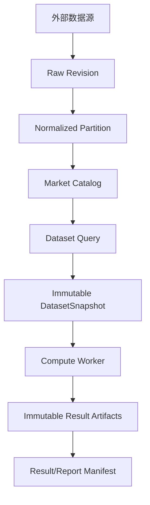
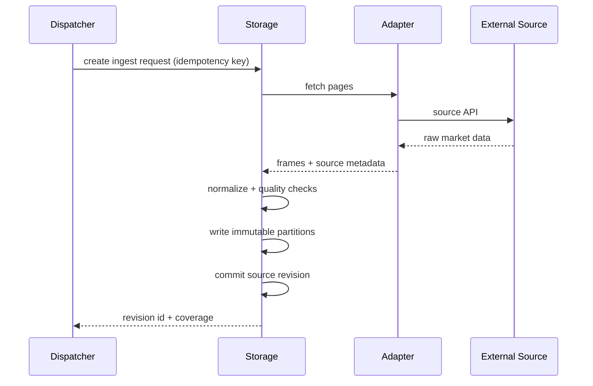
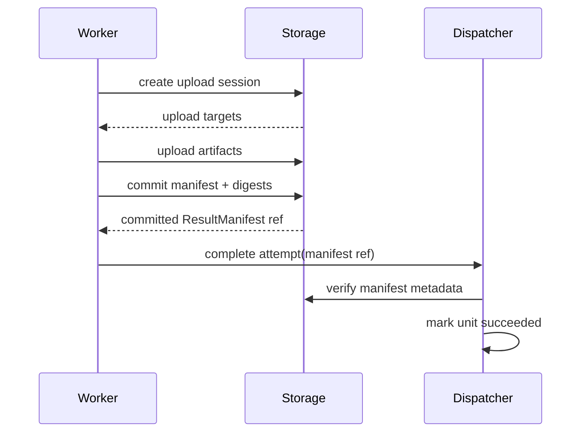

# StockStat V3.1 Storage 架构设计

> 大模块：Storage（市场数据、快照与结果资产服务）
> 版本：V3.1 设计稿
> 关联：[DESIGN_ARCH_FOUNDATION_V31.md](DESIGN_ARCH_FOUNDATION_V31.md)、[DESIGN_PROT_V31.md](DESIGN_PROT_V31.md)

## 1. 模块定位

Storage 是 V3.1 唯一负责持久化金融数据和计算资产的服务。它同时服务两类数据：

1. 可更新的市场数据目录和源修订。
2. 不可变的 DatasetSnapshot、StrategyBundle、ResultManifest、图表和报告 Artifact。

Storage 不调度 Worker、不执行回测、不合并实验结果，也不承担 Job 状态机。Dispatcher 只持有资源 ID 和小型元数据，不存放大块数据。

## 2. 从 V3 暴露的问题出发

当前实现的问题：

- OHLCV 查询直接返回大 JSON，Arrow 能力没有成为主路径。
- Dispatcher DataCache 使用进程内 dict，重启丢失。
- 同进程查询路径与 repository 返回类型存在脆弱耦合。
- Worker assignment 将数据 cloudpickle + base64 内联。
- 结果由 Dispatcher 内存保存并再次 cloudpickle。
- 任务历史只保留内存最近 1000 条。
- 数据快照没有 source revision，研究无法证明输入未变化。

V3.1 将数据和结果统一建模为可寻址资产，消除 Dispatcher 的数据中转职责。

## 3. 服务内部结构

建议独立服务包：`stockstat-storage`。

```text
services/storage/
└── stockstat_storage/
    ├── api/
    │   ├── market.py
    │   ├── snapshots.py
    │   ├── artifacts.py
    │   └── admin.py
    ├── catalog/
    │   ├── instruments.py
    │   ├── revisions.py
    │   ├── datasets.py
    │   └── lineage.py
    ├── ingest/
    │   ├── adapters.py
    │   ├── normalizer.py
    │   ├── planner.py
    │   └── quality.py
    ├── blobs/
    │   ├── base.py
    │   ├── filesystem.py
    │   ├── s3.py
    │   └── signed_urls.py
    ├── metadata/
    │   ├── models.py
    │   └── repository.py
    └── app.py
```

## 4. 逻辑数据分层



### 4.1 Raw Revision

每次采集产生源修订记录：

- source、instrument、timeframe。
- 请求范围和实际范围。
- adapter version。
- 原始响应摘要或分页摘要。
- ingest 时间和幂等键。
- 规范化输出分区列表。

### 4.2 Normalized Partition

按 `instrument/timeframe/date-range/revision` 分区，默认 Parquet + ZSTD。市场数据表推荐 Arrow schema，便于 Python、Rust、Java 等读取。

### 4.3 DatasetSnapshot

Snapshot 只引用已存在的 normalized partitions，不复制时可使用 manifest；必要时可生成合并或重分区的物化文件。

### 4.4 Artifact

Artifact 是不可变 blob + metadata。重复 digest 可去重，但不同 artifact_id 可以引用同一 blob，以保留不同 lineage 和权限。

## 5. 存储后端

### 5.1 元数据存储

| 环境 | 建议 |
|---|---|
| 本地/测试 | SQLite |
| 单机生产 | PostgreSQL |
| 集群 | PostgreSQL HA |

元数据包含 instrument catalog、source revision、snapshot、artifact、lineage、retention 和 ACL，不存大 DataFrame。

### 5.2 Blob 存储

| 环境 | 实现 |
|---|---|
| 本地 | content-addressed filesystem |
| Docker/局域网 | MinIO/S3 compatible |
| 云 | S3/OSS/COS 等适配器 |

逻辑路径示例：

```text
blobs/sha256/8a/1f/8a1f...
```

不使用用户输入文件名作为真实路径。

## 6. 市场数据采集

### 6.1 支持范围

V3.1 首批保留当前数据源：

- Yahoo Finance。
- Binance via ccxt。
- Coinbase via ccxt。
- Synthetic。

### 6.2 采集流程



采集可以是 Storage 内部异步作业，也可以由具有 `market.ingest@1` capability 的专用 ingest Worker 执行。V3.1 首期为了减少组件数量，优先由 Storage 执行；协议仍使用资源式 ingest request，未来可外置。

### 6.3 幂等与增量

- upsert 不再逐行查询。
- 以分区或数据库原生批量写入完成。
- 相同 idempotency key 返回已有 ingest request。
- 增量采集基于已提交 revision 的最大时间戳。
- 数据源回补或修订生成新 revision，不覆盖旧 revision。

## 7. 数据质量

Snapshot 创建前可指定 `quality_policy`：

| 检查 | 示例 |
|---|---|
| schema | OHLCV 字段和类型 |
| uniqueness | instrument + timeframe + ts 唯一 |
| monotonicity | 时间单调 |
| completeness | 按日历计算缺失 bar |
| price consistency | low <= open/close <= high |
| nonnegative | volume >= 0 |
| outlier | 可配置跳变标记，不默认删除 |
| timezone | 必须 UTC |

质量结果写入 manifest，策略可以选择拒绝、警告或允许带 flag 的数据。

## 8. Snapshot 创建

### 8.1 DatasetQuery

DatasetQuery 支持金融范围，不支持任意 SQL：

```json
{
  "instruments": ["crypto:binance:PAXG/USDT", "crypto:binance:BTC/USDT"],
  "timeframes": ["1d", "1h"],
  "start": "2020-08-28T00:00:00Z",
  "end": "2026-07-16T00:00:00Z",
  "fields": ["open", "high", "low", "close", "volume"],
  "revision_policy": "latest_before_snapshot",
  "adjustment": "raw",
  "timezone": "UTC",
  "quality_policy": "research_strict@1"
}
```

### 8.2 创建算法

1. 校验 query。
2. 解析 instrument 与 revision。
3. 检查覆盖范围。
4. 计算 canonical query digest。
5. 若相同 query + revisions 已有 snapshot，直接返回。
6. 生成 partition manifest，必要时物化。
7. 写入 lineage 和 digest。
8. 原子提交 snapshot metadata。

### 8.3 一致读取

Worker 获取 Snapshot 时必须先读取 manifest，再按 manifest 下载分区。Storage 在 snapshot 提交后不得改变成员列表。

## 9. Worker 数据访问

### 9.1 控制面与数据面

Dispatcher assignment 只包含 `snapshot_id` 和 artifact refs。Worker 向 Storage 请求：

- manifest 元数据。
- 分区下载 URL 或本地解析信息。
- 结果 upload session。

### 9.2 数据本地化

Worker 维护内容寻址本地缓存：

```text
worker-cache/
└── sha256/<digest>
```

下载前检查 digest，下载后校验 digest。多个 Job 使用同一 snapshot 时零重复下载。

### 9.3 同机优化

当 Storage 与 Worker 同机：

- 仍通过 ArtifactRef 表达。
- Storage 可以返回受控 `file` locator。
- Worker 只读 mmap/Arrow，不复制到 Dispatcher。
- 不把共享内存 ID 写入跨机持久协议。

共享内存是运行时优化，不是数据模型。

## 10. 结果写入协议

### 10.1 两阶段提交

Worker 不直接宣告成功后再上传结果。顺序必须是：



这样 Dispatcher 永远不会记录指向未完成上传的“成功结果”。

### 10.2 部分结果

长任务可以提交 `partial manifest`：

- 每个 partial 有递增 `sequence`。
- partial Artifact 不可变。
- 最终 manifest 引用或汇总所有 partial。
- 进度事件只携带 partial ref，不携带大结果。

## 11. Lineage

每个派生资产记录：

- parent snapshot/artifact refs。
- operation 和参数 digest。
- Job/WorkUnit/attempt。
- code bundle digest。
- kernel/environment digest。
- 创建时间和创建主体。

PAXG 的 `signals.parquet`、统计汇总、180/208 次回测表、Monte Carlo 和 walk-forward 结果都可以沿 lineage 回到原始 Binance revision。

## 12. 保留与垃圾回收

### 12.1 引用计数不是唯一依据

Job 删除不应立即删除共享快照。GC 使用：

- retention policy。
- manifest 引用图。
- pin 标记。
- legal/research hold。
- 最近访问时间。

### 12.2 默认策略

| 资产 | 默认 |
|---|---|
| 原始市场 revision | 长期保留或显式归档 |
| DatasetSnapshot | 90 天，无引用后可 GC |
| 中间 partial | Job 结束后 7 天 |
| 最终结果 | 30 天，可配置 |
| chart/report | 跟随结果 manifest |
| 失败诊断 | 14 天，受权限控制 |

## 13. 权限与安全

- Artifact 下载需要 token 或短期 signed URL。
- StrategyBundle 与市场数据 ACL 分开。
- Worker 只能访问其 lease 所需的 refs。
- file locator 仅同机可信部署启用。
- 上传 session 限制大小、media type 和 digest。
- 防止 zip slip、路径穿越和超大解压。
- 敏感 traceback 和代码资产不向普通只读用户暴露。

## 14. 部署模式

### 14.1 本地一体化

```text
SQLite metadata + local blob filesystem
```

### 14.2 单独 Storage

```text
Storage API + PostgreSQL + local/S3 blob
```

### 14.3 集群

```text
N Storage API replicas + PostgreSQL HA + S3/MinIO
```

Storage API 应尽量无状态，采集任务的协调状态放元数据库。

## 15. API 边界摘要

详细字段见 `DESIGN_PROT_V31.md`，Storage 资源包括：

- `/v31/instruments`
- `/v31/ingests`
- `/v31/revisions`
- `/v31/snapshots`
- `/v31/artifacts`
- `/v31/upload-sessions`
- `/v31/lineage/{resource_id}`

## 16. 测试要求

### 16.1 功能测试

- 四数据源采集和标准化。
- 增量采集、回补和 revision。
- Snapshot 幂等创建。
- 多标的/多 tf manifest。
- Artifact upload/commit/download。
- digest 错误拒绝。
- lineage 完整性。
- retention/GC。

### 16.2 并发与故障

- 同一 ingest key 并发提交只执行一次。
- 上传中断不生成 committed manifest。
- Storage 重启后 snapshot 和 artifact 可读。
- 多 Worker 同时下载同一资产。
- PostgreSQL 和 blob 短暂不可达后的安全恢复。

### 16.3 性能基线

目标不是先追求极限，而是消除 V3 的结构性浪费：

- 控制面响应不含 base64 大数据。
- 相同 snapshot 第二次 Worker 使用命中本地缓存。
- 50MB 数据不经过 Dispatcher 进程。
- Parquet/Arrow 读取结果与 JSON 基线数值一致。

## 17. 结论

V3.1 Storage 通过 revision、snapshot、artifact 和 lineage 把“数据库查询结果”提升为可复现的金融数据资产。Dispatcher 因此可以保持轻量控制面，Worker 可以直接复用数据和结果，Storage、计算节点和调用端也能真正分离部署。
