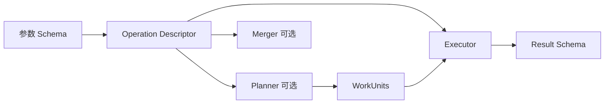
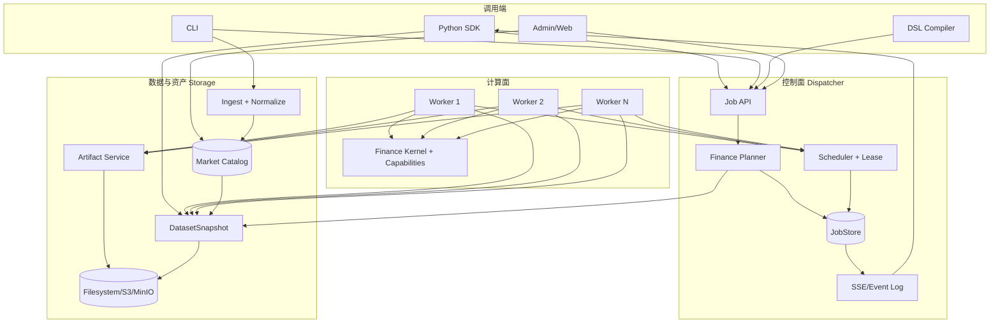
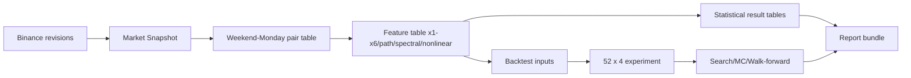
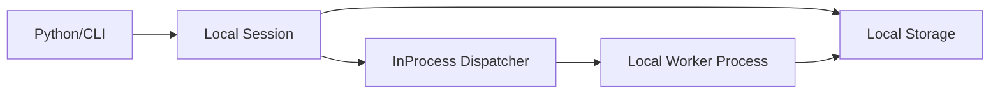
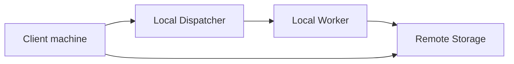
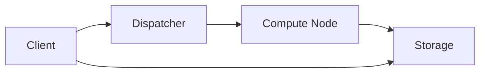
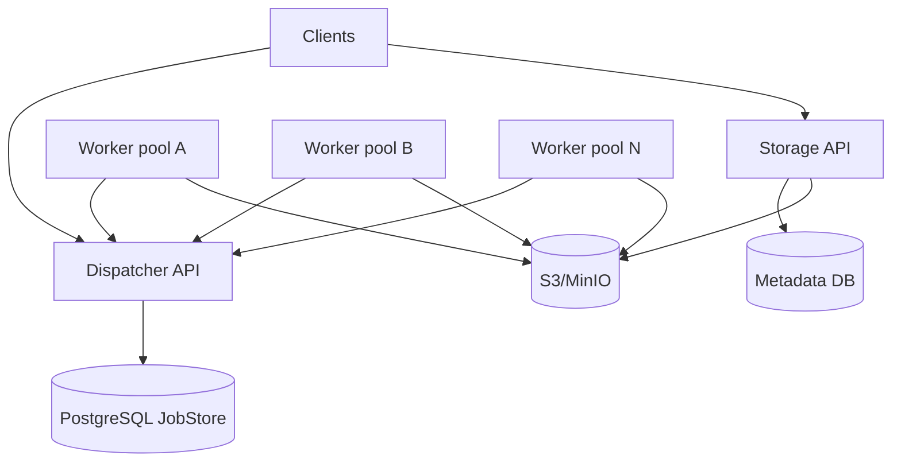
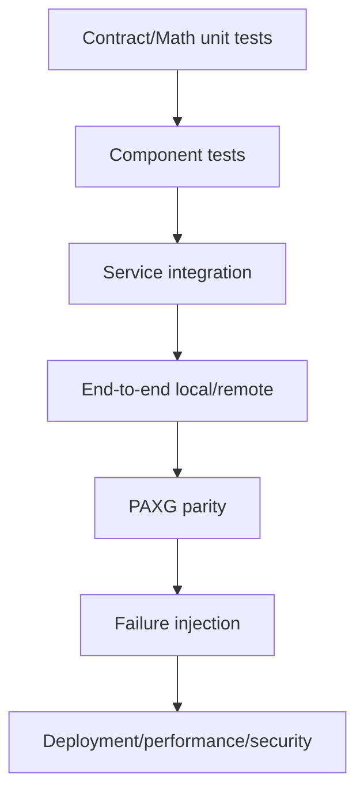

# StockStat V3.1 总体架构设计

> 版本：V3.1 设计稿
> 日期：2026-07-21
> 状态：完全重构目标设计
> 目标：以调用 -> 分发 -> {存储、N x 计算} 可分离部署为手段，实现当前全部金融功能并建立可增量扩展的共用底层

## 1. 文档范围

本文件汇总 V3.1 的整体设计、关键取舍、模块关系、部署图景、功能迁移和实现原则。细节分别见：

| 文档 | 详细内容 |
|---|---|
| [DESIGN_GENERALIZE.md](DESIGN_GENERALIZE.md) | 金融原子任务目录、未来扩展与禁止过度泛化 |
| [DESIGN_ARCH_FOUNDATION_V31.md](DESIGN_ARCH_FOUNDATION_V31.md) | Job、WorkUnit、Artifact、Snapshot、错误和状态契约 |
| [DESIGN_ARCH_FINANCE_V31.md](DESIGN_ARCH_FINANCE_V31.md) | 金融数据模型、指标、统计、回测和实验内核 |
| [DESIGN_ARCH_STORAGE_V31.md](DESIGN_ARCH_STORAGE_V31.md) | 市场数据 revision、Snapshot、Artifact 和 lineage |
| [DESIGN_ARCH_DISPATCHER_V31.md](DESIGN_ARCH_DISPATCHER_V31.md) | Planner、持久状态、调度、租约、重试与事件 |
| [DESIGN_ARCH_COMPUTE_V31.md](DESIGN_ARCH_COMPUTE_V31.md) | Worker capability、进程隔离、缓存和结果提交 |
| [DESIGN_ARCH_INVOCATION_V31.md](DESIGN_ARCH_INVOCATION_V31.md) | SDK、CLI、DSL、Admin 与旧客户迁移 |
| [DESIGN_PROT_V31.md](DESIGN_PROT_V31.md) | HTTP/JSON、SSE、Artifact 和 Worker lease 协议 |

## 2. 设计背景

### 2.1 V2 的设计初衷

V2 建立了计算-存储分离、数据源、指标、DSL、回测、离线模式和插件预留。其重要理念是：

- 用户可编程金融计算。
- 存储后端可独立部署。
- 金融功能应模块化。
- 本地、在线和离线都可用。
- 回测和指标是平台核心，不是外部附属脚本。

### 2.2 Offload V1/V2 的设计初衷

两份计算卸载方案提出：

- 重任务异步提交。
- 多 Worker 并行。
- Client、Dispatcher、Storage、Worker 四角色。
- 控制路径和数据路径分离。
- Dispatcher 规划、分片和合并。
- Worker 能力注册、心跳、弹性。

### 2.3 V3 的实现价值和限制

V3 用兼容层和增量模块快速验证了 offload 链路，证明了四角色图景可落地。但其设计目标是“核心零侵入、兼容旧代码”，因此产生了 V3.1 需要主动打破的限制：

| 限制 | 表现 |
|---|---|
| 旧结构主导新架构 | Worker 直接依赖旧 `stockstat` 内部 handler |
| 两套执行路径 | 本地直接调用，远程构建 TaskSpec |
| 单体任务模型 | `ComputeSpec` 堆积互斥字段和 params |
| 大对象穿控制面 | cloudpickle + base64 数据和结果 |
| 控制面不持久 | task/worker/history 主要在内存 |
| 原型调度 | 无完整 lease、attempt、真实重试和幂等完成 |
| 线程执行 CPU 任务 | 多核加速受 GIL 和过度订阅影响 |
| 扩展过宽 | custom task、五 Transport、多级 Dispatcher 先于真实金融需求 |
| 数据不可复现 | 查询条件不是不可变 Snapshot |
| 结果不可资产化 | Dispatcher 内存对象难以独立分析和长期追溯 |

### 2.4 V3.1 的任务

V3.1 不在 V3 上继续打补丁，而是：

- 完全重写包和服务边界。
- 不兼容 V2/V3 内部类和协议。
- 完整迁移当前用户功能。
- 以金融 Job 和数据资产为中心。
- 先完成可靠单调度域，再考虑大规模级联。

## 3. 顶层目标与非目标

### 3.1 目标

1. 实现全部当前功能：采集、查询、指标、DSL、统计、非线性、回测、intrabar、可视化、批量、搜索、模拟、验证和管理。
2. PAXG v1-v7 研究可以完全以 V3.1 原生 API 重做。
3. 52 个 v5 策略全部可迁移，包括当前 v5-v31 中尚不能表达的 7 个跨 session/精确时间策略。
4. 本地、独立 Storage、独立 Dispatcher、多个 Worker 的业务代码一致。
5. Dispatcher 重启不丢任务，Worker 丢失可安全重试。
6. 大数据和大结果不经过 Dispatcher。
7. 新金融 operation 可增量接入，不修改共享单体 spec。
8. 所有研究结果可追溯到输入数据 revision、代码和环境。

### 3.2 非目标

- 不兼容旧内部 import、类或 wire protocol。
- 不做任意 Python 函数远程执行平台。
- 不做任意 DAG 工作流引擎。
- 不在首期实现多级 Dispatcher 级联。
- 不在首期实现可恢复抢占和复杂 GPU 调度。
- 不同时维护 HTTP/TCP/Redis/SHM 五套应用传输。
- 不把所有未来量化算法预置成字段。

## 4. 核心设计结论

### 4.1 “共用底层”是什么

共用底层不是 V2 的领域无关 `_core`，也不是 V3 的通用 Transport。V3.1 共用底层由以下稳定原语构成：

- `DatasetSnapshot`：不可变金融输入。
- `ArtifactRef/Manifest`：不可变结果和代码资产。
- `JobSpec`：用户金融意图。
- `WorkUnitSpec`：Planner 生成的执行单元。
- `OperationDescriptor`：能力、schema 和资源元数据。
- `Lease/Attempt`：可靠执行和重试。
- `ResultManifest`：结果提交和 lineage。
- `JobEvent`：状态、进度和审计。

### 4.2 “功能模块化增量实现”是什么

每个新功能以 operation capability 接入：



一个轻任务可以只有 schema + executor；一个复杂实验可以增加 planner + merge operation。Dispatcher 核心、Storage 和 SDK 基础层不因新算法修改。

### 4.3 兼容的对象是功能，不是代码结构

V3.1 提供：

- 旧功能到新 API 的映射。
- 旧研究脚本扫描工具。
- PAXG 和测试 fixture 的结果 parity。
- 明确的指标定义差异报告。

V3.1 不提供长期 `StockStatClient`/`V2Client`/`ComputeBackend` 兼容 shim。否则完全重构会再次被旧形态绑架。

## 5. 总体架构



## 6. 模块边界

| 模块 | 包/服务 | 依赖 | 不得依赖 |
|---|---|---|---|
| Foundation | `stockstat-contracts` | 轻量 schema | pandas、服务实现、Kernel |
| Finance Kernel | `stockstat-kernel` | contracts、pandas/numpy/scipy | Dispatcher、Storage、HTTP |
| Storage | `stockstat-storage` | contracts、DB/blob、adapters | Kernel 回测、Dispatcher 内部 |
| Dispatcher | `stockstat-dispatcher` | contracts、planner capability、JobStore client | pandas 大结果、旧 frontend |
| Worker | `stockstat-worker` | contracts、Kernel/capabilities、service clients | Client API、JobStore DB |
| Invocation | `stockstat` SDK | contracts、HTTP/InProcess clients | Worker 实现、服务数据库 |

依赖图：

```mermaid
flowchart BT
    C[stockstat-contracts]
    K[stockstat-kernel] --> C
    S[stockstat-storage] --> C
    D[stockstat-dispatcher] --> C
    D --> K: planner metadata only
    W[stockstat-worker] --> C
    W --> K
    SDK[stockstat SDK] --> C
```

Dispatcher 对 Kernel 的依赖应限制为 planner/descriptor 包，可进一步拆成 `stockstat-finance-plans`，避免加载 pandas/scipy。实现时按包体和启动时间决定是否拆分。

## 7. 数据流与控制流

### 7.1 控制流

```text
Client -> Dispatcher: JobSpec
Worker -> Dispatcher: acquire/renew/complete lease
Dispatcher -> Client: JobView + SSE events
```

### 7.2 数据流

```text
Data source -> Storage -> DatasetSnapshot -> Worker cache
Worker -> Storage -> ResultManifest -> Client/Reducer
```

### 7.3 关键不变量

- Dispatcher 不下载完整 DatasetSnapshot。
- Dispatcher 不解码 BacktestResult/DataFrame。
- Worker 完成前，ResultManifest 必须已在 Storage committed。
- Job 成功只引用 committed final manifest。
- Client 下载需要的结果成员，不强制拉取全部结果。

## 8. 任务模型

### 8.1 原子 Job

一个 operation 对应一个或少量 WorkUnit，例如指标、统计检验、单回测。

### 8.2 复合 Job

Batch、grid search、Monte Carlo、walk-forward 由 Planner 展开 DAG。对用户仍是一个 Job。

### 8.3 Reducer 是普通计算

结果合并、排名和分位汇总在 Worker 上执行，不在 Dispatcher 内存中执行。

### 8.4 可靠执行

```mermaid
flowchart LR
    R[ready] --> L[leased]
    L --> X[running]
    X --> C[commit artifacts]
    C --> S[succeeded]
    L --> R: lease expired
    X --> R: retryable failure
    X --> F[failed]: attempts exhausted
```

底层允许重复执行，但 lease token 和幂等 complete 防止旧结果覆盖。

## 9. 金融能力覆盖

### 9.1 市场数据

- 多数据源采集。
- OHLCV 标准化和 UTC。
- instrument catalog、coverage 和 quality。
- 在线、远程、离线本地 runtime。
- JSON/CSV 之外以 Arrow/Parquet 为主数据格式。

### 9.2 指标与研究计算

- 当前全部经典指标。
- CWT、PSD、谱熵、灰色关联、GM(1,1)。
- TE、Hurst/DFA、样本熵、排列熵、RQA。
- 经典统计、重采样、多重校正、survival、滚动/分段分析。
- 注册模型族的时间前向预测验证，用于复现 v7 样本外检验。

### 9.3 回测

- 多标的、多 tf。
- next-bar 与 intrabar。
- 跨 session 持仓。
- 精确时间事件和 time-in-force。
- 完整订单生命周期、OCO、TP/SL、trailing stop。
- 成本、maker/taker、BNB、滑点。
- 未来函数防护。
- 结果资产和图表。

### 9.4 实验

- 策略 x 费率 x 参数矩阵。
- grid/random/Bayesian search。
- Monte Carlo/bootstrap/order shuffle。
- walk-forward、subperiod、regime、negative control。

详细 operation 清单见 `DESIGN_GENERALIZE.md`。

## 10. PAXG v1-v7 作为设计验收基准

PAXG 工作目录证明平台需要支持完整研究闭环，而不是只有指标和回测两个粗粒度任务。

### 10.1 数据与派生资产



### 10.2 完整迁移标准

- 307 个样本和输入范围一致。
- 研究统计量在容差内一致。
- 52 个策略均为 V3.1 native。
- 4 费率模型全部运行。
- B1 买入持有、B2 周一定投、B3 价格曲线收益统一运行和比较。
- 代表策略交易行为一致。
- 分片数改变不改变结果。
- 所有输出有 lineage。
- 原生目录不 import V2/V3 包。

## 11. 部署场景

### 11.1 场景 A：本地一体化



用途：开发、小规模研究、离线使用。仍使用 JobStore、lease、Artifact 和子进程边界。

### 11.2 场景 B：Storage 分离，本地计算



用途：团队共享数据，计算仍在用户机器。

### 11.3 场景 C：独立 Dispatcher + 单 Worker 节点



用途：个人/小团队把计算 offload 到高性能机器。

### 11.4 场景 D：独立服务 + N Worker



用途：批量回测、参数搜索和大规模研究。

### 11.5 场景 E：受信任与策略 Worker 分池

```text
basic/statistics workers: 只执行内置代码
strategy workers: 执行签名 StrategyBundle，强隔离
future gpu workers: 只执行明确 GPU operation
```

## 12. 协议选择

V3.1 规范：

- HTTP/JSON 控制面。
- SSE Job 事件。
- Arrow/Parquet/StrategyBundle Artifact 数据面。
- Worker Pull + Lease。
- InProcess service adapter 用于本地。

详细字段和 API 见 `DESIGN_PROT_V31.md`。

## 13. 项目结构目标

```text
StockStatistic/
├── packages/
│   ├── contracts/                 # stockstat-contracts
│   ├── kernel/                    # stockstat-kernel
│   ├── sdk/                       # stockstat
│   └── capabilities/              # operation capability packages
├── services/
│   ├── storage/                   # stockstat-storage
│   ├── dispatcher/                # stockstat-dispatcher
│   └── worker/                    # stockstat-worker
├── apps/
│   └── admin/                     # 可选 Web UI
├── tests/
│   ├── contracts/
│   ├── kernel/
│   ├── services/
│   ├── e2e/
│   ├── deployments/
│   ├── parity/
│   └── performance/
├── examples/
├── working/
├── V31design/
│   ├── designV31/
│   └── realizeV31/
└── legacy/ or removed at cutover
```

实现期间新代码不得 import 当前 `frontend/stockstat`、`backend/stockstat_backend/dispatcher` 或 `worker/stockstat_compute`。旧代码只作为行为基线和 parity oracle。

## 14. 关键决策记录

### 14.1 为什么不用 V3 的 ComputeBackend 兼容层

兼容层让旧 Client 决定本地/远程路径，导致业务调用分叉。V3.1 使用统一 Session + JobService，本地只是服务组合方式。

### 14.2 为什么不让 Dispatcher 预取并转发所有数据

V2 方案成功解决 Storage 被每个 task 重复拉取的问题，但 Dispatcher 会成为长期数据中转和内存瓶颈。V3.1 使用不可变 Snapshot + Worker 节点缓存 + 对象存储：同一节点只下载一次，Dispatcher 始终轻量。小规模同机部署可由 Storage 返回 file/mmap locator，仍不经过 Dispatcher。

### 14.3 为什么不保留统一 Envelope

资源式 HTTP 已提供请求、响应、状态码、认证和缓存语义。统一 Envelope 会重复这些机制，并把 GET/POST/SSE/上传都压成一个泛化消息。V3.1 统一的是 DTO 和资源，不是裸信封。

### 14.4 为什么 JobStore 不以 Redis 队列为事实源

金融实验可能运行数小时，状态、重试、审计和结果 lineage 比极端队列吞吐更重要。关系数据库事务更适合首期可靠性；Redis 可做通知优化。

### 14.5 为什么 CPU Worker 用进程

当前核心基于 Python/pandas/numpy，策略也可能包含 Python 循环。线程不能可靠提供多核并行，且无法安全终止。子进程是正确默认。

### 14.6 为什么先不做多级 Dispatcher

当前真实规模和 PAXG 任务远未要求 100+ Worker。单调度域的持久性、租约和幂等完成是前置条件。多级级联不能替代这些基础可靠性。

### 14.7 为什么禁止任意 custom task

平台扩展目标是金融能力增量，不是任意远程代码执行。类型化 operation 才能校验、规划、缓存、审计和迁移。

## 15. 安全模型

### 15.1 信任域

| 主体 | 信任 |
|---|---|
| Client | 已认证用户，可提交允许的 Job |
| Dispatcher | 控制面可信 |
| Storage | 数据资产可信服务 |
| Trusted Worker | 执行内置 operation |
| Strategy Worker | 执行受控用户代码，隔离 |
| StrategyBundle | 默认不可信，需 digest/签名 |

### 15.2 主要措施

- TLS、Bearer/OIDC、Worker mTLS/credential。
- tenant scope、Job/Artifact ACL。
- 短期 lease/upload/download token。
- 策略禁网、无特权、资源限额。
- 大小和 DAG 数量配额。
- traceback 作为受控 Artifact。

## 16. 可观测性

- W3C trace context。
- Job/unit/attempt/worker 结构化日志。
- Job event log + SSE。
- queue wait、execution、storage、retry、lease 指标。
- Snapshot/Artifact lineage 图。
- Admin 页面只读公开 API。

## 17. 测试总体策略

### 17.1 测试金字塔



### 17.2 必要测试域

- schema、canonical、状态机。
- 金融数学和执行语义。
- Storage revision/snapshot/artifact。
- Dispatcher lease/retry/idempotency。
- Worker 进程、取消、资源隔离。
- SDK local/remote parity。
- PAXG v1-v7 和 52 x 4 回测。
- Dispatcher 重启、Worker 丢失、网络断开、重复 complete。
- 数据不经过 Dispatcher 的性能断言。

详细分步测试见 `../realizeV31/P1.md` 至 `P9.md`。

## 18. 迁移与切换

### 18.1 并行开发，不并行架构

实现期允许新旧代码同时存在用于对比，但新代码不依赖旧代码。旧系统仅提供：

- fixture。
- golden output。
- 旧客户脚本样本。

### 18.2 切换标准

1. 当前功能矩阵全部有 V3.1 实现。
2. PAXG parity 通过。
3. local/remote/multi-worker 部署测试通过。
4. migration guide 和 scanner 完成。
5. 安全、故障和性能基线通过。
6. 新 README/USAGE 只使用 V3.1 API。
7. 删除旧 runtime 和兼容层。

### 18.3 不兼容声明

- 旧 Python import 需要迁移。
- V3 Job ID 和结果不可直接由 V3.1 继续执行。
- V3 cloudpickle strategy_ref 需要重建 StrategyBundle。
- 旧 SQLite OHLCV 可以通过一次性 importer 导入新 Storage revision；这是数据迁移，不是运行时兼容。

## 19. 实现路线摘要

| Phase | 主题 | 可交付闭环 |
|---|---|---|
| P1 | contracts 和仓库骨架 | schema/digest/state 基线 |
| P2 | Storage 数据与资产 | ingest -> snapshot -> artifact 本地闭环 |
| P3 | Finance 基础计算 | 指标/统计/PAXG 研究计算本地闭环 |
| P4 | Dispatcher + Local Session | durable Job -> local Worker -> result |
| P5 | 独立 Worker 与远程部署 | Client -> Dispatcher -> Worker -> Storage |
| P6 | 全新回测内核 | 52 策略全部 native + parity |
| P7 | 复合实验与 N Worker | batch/grid/MC/walk-forward 分布式 |
| P8 | SDK/CLI/DSL/Admin/迁移 | 用户功能和旧代码迁移完整 |
| P9 | 硬化、性能、切换 | 生产基线和删除旧 runtime |

总计划见 `../realizeV31/README.md`。

## 20. 最终图景

V3.1 的最终系统不是“旧计算库外面套一层远程队列”，而是一个以金融数据资产和类型化 operation 为中心的任务计算平台：

- 调用端表达金融意图。
- Dispatcher 可靠规划和分发。
- Storage 提供可复现快照和结果资产。
- N 个 Worker 独立扩展计算能力。
- Finance Kernel 在本地和远程使用相同语义。
- 新金融能力按 operation 模块增量接入。

这实现了 `调用 -> 分发 -> {存储、N x 计算}` 的可分离部署目标，同时保持 StockStat 对当前金融研究、统计和回测功能的专注，不将项目过度泛化。
