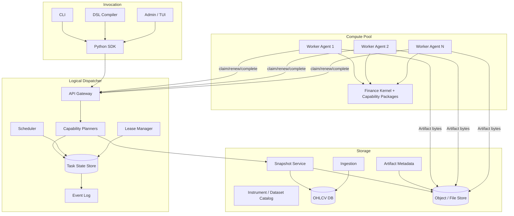
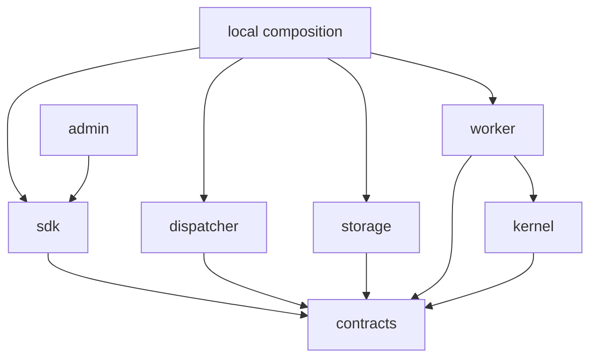
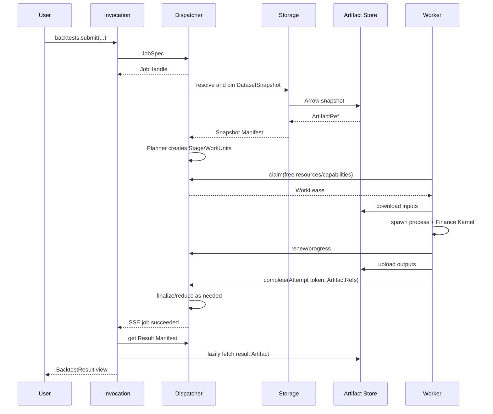
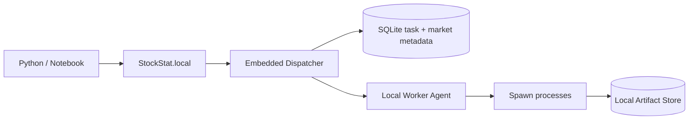
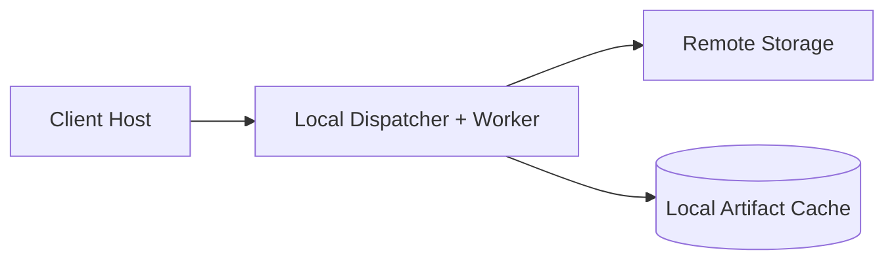
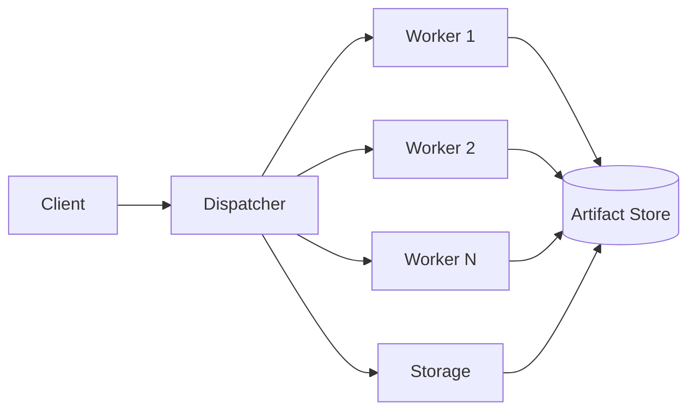
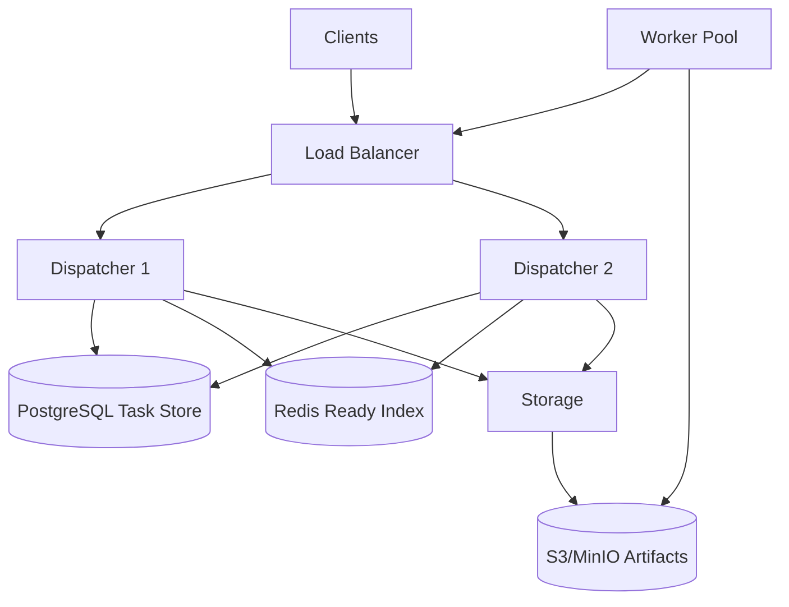
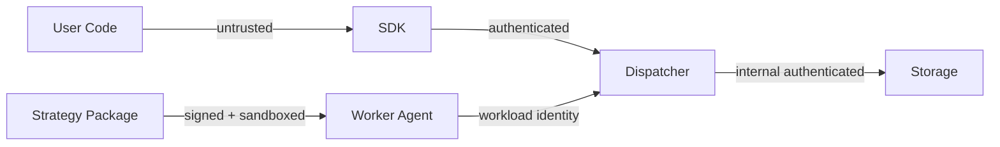
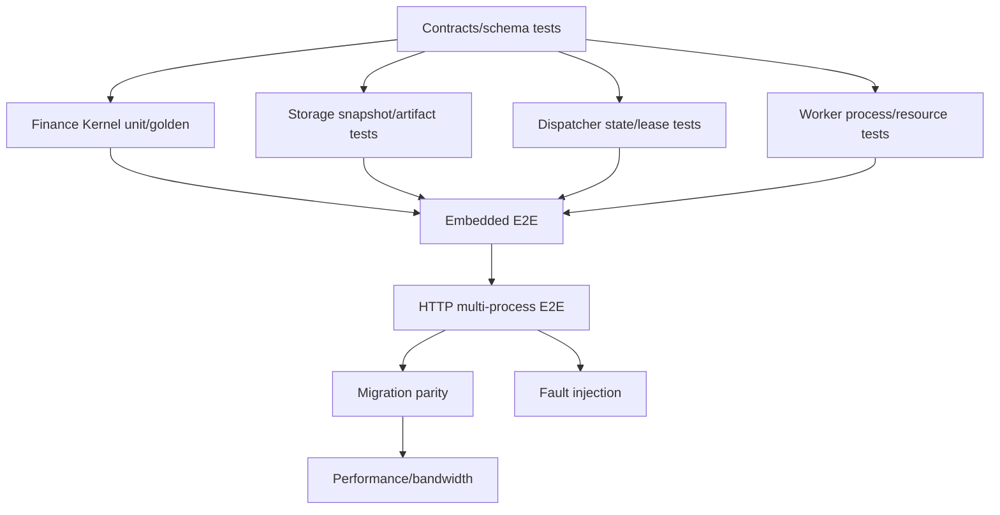

# StockStat V3.1 总体架构设计

> 版本：V3.1
> 日期：2026-07-20
> 状态：目标设计，待按 [V3.1 分步实现计划](../realizeV31/README.md) 实施
> 设计性质：相对 V2/V3 完全重构，不提供运行时向后兼容层

## 1. 执行摘要

V3.1 将 StockStat 重构为一套紧贴金融工具的任务计算架构：

```text
调用 Invocation
    -> 分发 Dispatcher
        -> Storage（数据快照与 Artifact）
        -> N x Compute Worker（金融原子任务）
```

核心不是再增加一个 `ComputeBackend` 适配层，而是建立唯一执行模型：

```text
Job -> Plan -> Stage -> WorkUnit -> Attempt -> Artifact -> Result Manifest
```

无论用户选择同步调用、异步调用、单机部署、存储分离还是多 Worker 集群，都进入同一模型。单机模式仅把真实模块嵌入式组合，不再保留“直接调用 BacktestEngine”的旁路。

V3.1 保留并深化早期 offload 设计的正确初衷：

- 计算、存储、调用解耦。
- 重计算异步化、多核/多节点并行。
- Storage 主数据库只为一个数据快照读取一次，而不是被 N 个 Worker 重复查询。
- 控制路径与大数据路径分离。
- 协议不硬编码具体金融算法。
- Worker 可独立扩缩容和故障隔离。

V3.1 放弃 V3 为兼容而形成的实现折中：

- 双客户端和多套调用路径。
- 巨型弱类型 `ComputeSpec`。
- Dispatcher 与 Storage 插件式耦合。
- 线程池执行 CPU 密集任务。
- 任务状态进程内保存。
- cloudpickle/base64 跨网传策略、数据和结果。
- 无 lease 的队列消费与不完整 retry。
- 在 Dispatcher 进程中加载 pandas 并归并金融结果。

## 2. 设计输入与继承关系

本设计基于以下文档与实现审视：

| 输入 | 应继承的思想 | V3.1 修正 |
|---|---|---|
| `DESIGN_CN.md` | 可编程金融平台、数据源、指标、回测、离线能力 | 不继承五层和兼容层的历史目录 |
| `COMPUTE_OFFLOAD_PLAN_CN.md` | Client/Storage/Worker 分离、异步与多进程 | Queue 不放在 Storage，Worker 不重复查询主库 |
| `COMPUTE_OFFLOAD_PLAN_V2_CN.md` | 独立 Dispatcher、控制/数据分离、统一信封、流式/弹性思想 | 数据统一为 Artifact；可靠性采用 lease/fencing；协议不过度抽象 Transport |
| `DESIGN_V3_CN.md` | 四角色、任务句柄、能力注册、部署场景 | 删除兼容层与旁路，完全重构包和状态模型 |
| `DESIGN_ARCHITECTURE_CN.md` | 已暴露的真实模块和限制 | 不把“已有测试通过”当作新架构边界 |
| `DESIGN_PROTOCOL_CN.md` | 消息分类、trace、错误分类、Worker metadata | 删除 bytes/Any payload、自动 codec、cloudpickle wire contract |
| 当前代码 | 金融功能行为基线 | 旧代码仅作 black-box oracle，不被新包导入 |

## 3. 项目使命与范围

### 3.1 使命

提供一套可编程、可复现、可本地或分布式部署的金融数据与计算工具，首要面向：

- 市场数据采集和查询。
- 指标、统计、信号处理和非线性分析。
- 单次和批量回测。
- 参数搜索、Monte Carlo、Walk-forward。
- 后续因子、风险、组合、标注和模型能力。

### 3.2 非目标

- 通用 Airflow/Ray/Spark 替代品。
- 任意函数远程执行平台。
- 实时交易 OMS/EMS 首版实现。
- 任意 DAG 用户编辑器。
- 为假设的跨语言 Worker 牺牲当前 Python/pandas 交付速度。
- 首版多地域联邦调度。

金融能力边界详见 [DESIGN_GENERALIZE.md](DESIGN_GENERALIZE.md)。

## 4. 设计原则

| 原则 | 具体约束 |
|---|---|
| 单一执行语义 | 本地/远程、同步/异步都创建 Job |
| 金融领域优先 | 扩展单位是类型化金融能力，不是 custom callable |
| 服务可独立部署 | Invocation、Dispatcher、Storage、Worker 可拆分 |
| 共享底层而非共享实现 | 角色共享 Contracts，不互相导入服务实现 |
| 控制/数据分离 | JSON 只传控制；数据与结果走 Artifact |
| 不可变输入 | Job 执行使用 DatasetSnapshot/ArtifactRef |
| 可靠而非表面异步 | 持久状态、Lease、Attempt、fencing、幂等 |
| 计算进程隔离 | CPU 任务使用 spawn 子进程，异常不拖垮 Agent |
| 显式版本 | 协议、能力、schema、Kernel、策略分别版本化 |
| 可复现 | 数据、代码、配置、seed 和计划 digest 可追溯 |
| 最小正确泛化 | 不提前实现通用 DAG、多级 Dispatcher、任意 Transport |
| 迁移而非兼容 | 提供 API 对应、工具与数值验证，不保留旧运行路径 |

## 5. 总体逻辑架构



### 5.1 四个部署角色，六个代码模块

| 部署角色 | 代码模块 | 职责 |
|---|---|---|
| Client | Invocation + Contracts | 用户 API、CLI、DSL、结果物化 |
| Dispatcher | Dispatcher + Contracts + Planner 部分 | Job/计划/调度/租约/事件 |
| Storage | Storage + Contracts | 数据、快照、Artifact |
| Worker | Compute Agent + Finance Kernel + Contracts | 领取并执行 WorkUnit |

Foundation 是共享代码模块，Finance Kernel 是 Worker 主要业务实现；它们不是独立网络角色。

## 6. 模块报告索引

| 报告 | 详细内容 |
|---|---|
| [DESIGN_ARCH_FOUNDATION_V31.md](DESIGN_ARCH_FOUNDATION_V31.md) | Contracts、实体、ID、时间、数据与 Artifact schema、错误和依赖规则 |
| [DESIGN_ARCH_INVOCATION_V31.md](DESIGN_ARCH_INVOCATION_V31.md) | SDK、同步/异步、DSL、Local 组合、迁移工具 |
| [DESIGN_ARCH_DISPATCHER_V31.md](DESIGN_ARCH_DISPATCHER_V31.md) | Planner、Scheduler、Lease、状态库、HA、Reducer 编排 |
| [DESIGN_ARCH_STORAGE_V31.md](DESIGN_ARCH_STORAGE_V31.md) | OHLCV、Ingestion、DatasetSnapshot、Artifact Store、缓存与谱系 |
| [DESIGN_ARCH_COMPUTE_V31.md](DESIGN_ARCH_COMPUTE_V31.md) | Worker Agent、进程模型、资源、租约、缓存、安全和结果提交 |
| [DESIGN_ARCH_FINANCE_V31.md](DESIGN_ARCH_FINANCE_V31.md) | 指标、回测、策略、实验、结果合同与数值兼容 |
| [DESIGN_PROT_V31.md](DESIGN_PROT_V31.md) | 全部通信消息、HTTP/SSE/Artifact、错误、幂等和 Lease 协议 |

本总文档只回答跨模块问题；模块内实现细节以上述报告为准。

## 7. 目标仓库结构

在迁移完成前，新旧代码可并存；V3.1 新代码全部位于明确新目录：

```text
StockStatistic/
├── packages/
│   ├── contracts/               # stockstat-contracts
│   ├── kernel/                  # stockstat-kernel
│   ├── sdk/                     # stockstat 公共 SDK（全新）
│   └── local/                   # stockstat-local 嵌入式装配
├── services/
│   ├── dispatcher/              # stockstat-dispatcher
│   ├── storage/                 # stockstat-storage
│   └── worker/                  # stockstat-worker
├── apps/
│   └── admin/                   # 可选管理界面
├── tests_v31/
│   ├── contracts/
│   ├── kernel/
│   ├── services/
│   ├── e2e/
│   ├── migration/
│   ├── fault/
│   └── performance/
├── legacy/                      # 最终切换时可移动旧代码；实现期先保持原位
└── V31design/
    ├── designV31/
    │   ├── DESIGN_GENERALIZE.md
    │   ├── DESIGN_PROT_V31.md
    │   ├── DESIGN_ARCH_*_V31.md
    │   └── DESIGN_ARCH_V31.md
    └── realizeV31/
        ├── README.md
        └── P1.md ... P9.md
```

### 7.1 依赖图



关键禁止边：

- Dispatcher -> Kernel。
- Storage -> Kernel。
- Contracts -> 任意上层。
- SDK -> 服务私有模块。
- V3.1 新包 -> 旧 `frontend/backend/worker`。

### 7.2 迁移期包名隔离

旧、新 SDK 都以 `stockstat` 作为最终 import 名。实现期使用 `.venv-legacy` 和 `.venv-v31` 两套隔离环境；旧/新结果通过子进程和 Arrow/JSON fixtures 比较，禁止在一个解释器中同时安装或导入两套 package。P9 切换后新 SDK 才接管正式发布名。

## 8. 核心实体与答题思路

### 8.1 为什么不再用一个 TaskSpec

V3 的 TaskSpec 同时承担用户 Job、分片任务和执行尝试，导致：

- 分片通过改 task ID 实现。
- retry 无独立身份。
- 状态只能挂在一个 TaskInfo 上。
- 多 Stage 任务难表达。

V3.1 拆分：

| 实体 | 回答的问题 |
|---|---|
| Job | 用户要完成什么金融目标 |
| Plan/Stage | 为完成目标需要哪些有依赖步骤 |
| WorkUnit | 可独立调度的最小工作是什么 |
| Attempt | 这份工作第几次由谁执行 |
| Artifact | 输入/输出数据在哪里且内容是什么 |

### 8.2 为什么要 DatasetSnapshot

早期 offload 的目标是 Storage 出口从 xN 降到 x1。V3 实际实现仍把 Dispatcher cache 中的同一 bytes base64 内联给每个 Worker，且快照内容没有正式版本。

V3.1 的回答：主数据库一次查询生成不可变 Arrow Artifact；Worker 获取同一 digest，可由对象存储和节点 cache 扩展。这样既满足 x1 主库查询，又不让 Dispatcher 成为所有 bytes 的串行中转。

### 8.3 为什么采用 pull + lease

Worker 往往位于 NAT、容器或动态节点，pull 易部署。仅 pull queue 不能解决 Worker 领取后死亡、重复完成和迟到结果，因此增加：

- Attempt identity。
- 租约 TTL/renew。
- 单调 generation。
- opaque token。
- 条件 complete。

系统接受 at-least-once 物理执行，但保证只有当前 Attempt 能生效。

### 8.4 为什么 Reducer 也在 Worker

参数搜索、批量回测和 Monte Carlo 的归并本身可能消耗大量内存和 pandas。若在 Dispatcher 中归并，调度控制面会被业务计算拖垮。V3.1 将归并定义为类型化金融 WorkUnit，Dispatcher 只编排依赖。

### 8.5 为什么不保留任意 custom task

金融项目需要可复现和安全。`custom + dict + cloudpickle` 无法形成稳定 schema、资源估算、权限、迁移和结果合同。扩展方式改为安装式金融 capability 模块。具体边界见 `DESIGN_GENERALIZE.md`。

## 9. 端到端任务生命周期



详细消息见 `DESIGN_PROT_V31.md`。

## 10. 数据路径与流式设计

### 10.1 三类数据

| 类别 | 例子 | 路径 |
|---|---|---|
| 控制数据 | JobSpec、状态、进度、错误 | JSON ControlChannel |
| 表格/模型/策略 bytes | OHLCV、equity、fills、wheel、checkpoint | ArtifactChannel |
| 事件 | progress、partial ref、terminal | EventChannel/SSE |

### 10.2 “统一流式”的落地方式

V2 规划建议所有数据都可表示为 stream，小数据一个 chunk。V3.1 接受该思想，但把 stream 放在 Artifact byte layer：

- Arrow IPC stream 天然由 RecordBatch 构成。
- 小数据可以一个 batch。
- 大数据多个 batch。
- Executor 输入模式由 capability descriptor 声明，不靠函数注解猜测。
- 传统回测首版明确 materialize；增量指标可直接 batch stream。

### 10.3 同机零拷贝

本地模式优先 local content-addressed file + Arrow mmap。相较把共享内存当公开协议，该方式：

- 生命周期可管理。
- 重启后可恢复。
- Windows/Linux 更统一。
- 可通过 digest cache 复用。

极短临时数据可在 adapter 内使用共享内存，但不泄露到 JobSpec。

## 11. 金融能力模型

### 11.1 首批能力

```text
finance.data.ingest
finance.indicator.compute
finance.timeseries.analyze
finance.backtest.run
finance.simulation.resample
finance.experiment.search
finance.experiment.batch
finance.validation.walk_forward
```

### 11.2 建议增量能力

```text
finance.label.generate
finance.factor.evaluate
finance.portfolio.construct
finance.risk.evaluate
```

### 11.3 扩展结构

每项能力提供：

- Descriptor/schema。
- Dispatcher Planner。
- Worker Executor。
- 可选 Reducer。
- Golden/contract tests。
- 版本与资源 profile。

详细设计见 `DESIGN_ARCH_FINANCE_V31.md` 和 `DESIGN_GENERALIZE.md`。

## 12. 部署拓扑

### 12.1 A：单机嵌入式



特点：零外部服务，但不是直调旁路；重启可恢复 Job 和 Artifact。

### 12.2 B：Storage 分离，本地计算



适合共享数据、个人计算。Local Dispatcher 请求 Remote Storage 快照。

### 12.3 C：完整四角色分离



### 12.4 D：Dispatcher HA + Worker 集群



### 12.5 不首发多级 Dispatcher

首版用一个逻辑 Dispatcher 多副本覆盖大多数规模。多级树只有在跨地域、独立安全域或 100+ 节点真实需求出现后，以 federation 设计单独引入。

## 13. 持久化与一致性

### 13.1 事实来源

| 事实 | 权威存储 |
|---|---|
| Job/Stage/Work/Attempt | Dispatcher Task Store |
| JobEvent | Event Log/Task Store |
| Worker session | Task Store + 可选 presence cache |
| OHLCV/Instrument | Storage DB |
| Snapshot/Artifact metadata | Storage metadata DB |
| Artifact bytes | LocalFS/S3-compatible |
| Ready queue | 可重建派生索引 |

### 13.2 事务边界

- Job 状态变化与 event/outbox 同事务。
- Work complete 以当前 attempt/generation 条件更新。
- Artifact bytes commit 先完成，Dispatcher 再引用。
- Snapshot manifest 只在 Artifact 原子发布后可见。
- Redis 丢失可从 Task Store 重建。

## 14. 安全模型

### 14.1 信任边界



### 14.2 核心决策

- 不反序列化网络 pickle/cloudpickle。
- 策略是签名包/受限声明式定义。
- Worker 子进程/容器隔离。
- 默认计算任务无外网和 secrets。
- Artifact 短期上传/下载凭证。
- Client/Worker/Admin scopes 分离。
- 租约 token 不进日志。
- 参数、fan-out、资源和保留期有配额。

## 15. 可观测与管理

### 15.1 统一数据源

Admin、CLI 和 SDK 全部基于：

- Job Query API。
- 持久 JobEvent。
- Cluster/capability API。
- Prometheus/OpenTelemetry。

不再由 Admin 持有 Dispatcher 对象引用或读取进程内 history。

### 15.2 管理能力

```text
Job 列表/状态/事件/错误/结果
Worker 列表/资源/capabilities/drain
队列与租约统计
Snapshot/Artifact/缓存命中
Ingestion 批次和数据质量
Autoscaler 指标
审计日志
```

Web UI 可后置，但 API 与事件在核心阶段即实现。

## 16. API 迁移与功能覆盖

### 16.1 迁移策略

V3.1 不要求旧 import 原样可运行，而要求旧功能完整有新路径。迁移由三部分组成：

1. 文档化 API 对照。
2. `stockstat migrate` 扫描与策略打包工具。
3. 旧/新黑盒结果一致性测试。

### 16.2 功能迁移矩阵

| 旧功能 | V3.1 模块/能力 | 状态要求 |
|---|---|---|
| yfinance/binance/coinbase/synthetic | Storage adapters/ingestion | 必须 |
| OHLCV SQLite/PG 查询 | Storage market repository | 必须 |
| on-demand/cron 触发与 incremental 采集 | IngestSchedule -> finance.data.ingest Job | 必须，限定数据采集 |
| 在线/离线 | connect/local topology | 必须 |
| 23 指标 | Indicator Catalog + capability | 必须 |
| DSL | Invocation compiler | 必须 |
| 单次回测 | backtest.run | 必须 |
| 多标的/多 tf | Finance Kernel | 必须 |
| cost/fill/execution | Component Catalog | 必须 |
| intrabar | Finance Kernel | 必须 |
| metrics/analyzer | Result/analysis | 必须 |
| grid/Optuna | experiment.search | 必须，Optuna 可后续阶段完成 |
| batch/fee sweep | experiment.batch | 必须 |
| Monte Carlo | simulation.resample plan | 必须 |
| Walk-forward | validation.walk_forward | 必须 |
| 可视化/导出 | SDK/Admin result consumers | 必须 |
| TUI/Admin | 新 API consumer | 可在核心切换后完成 UI |
| cluster/task API | Job/Cluster API | 必须 |
| V3 preempt/checkpoint | lease cancel + capability checkpoint | 先对适合能力真实实现 |

Invocation 详细映射见 `DESIGN_ARCH_INVOCATION_V31.md`。

## 17. 测试总纲

V3.1 不以“旧测试零修改通过”为目标，因为新架构和 API 是破坏性重构。测试目标是功能和金融结果等价，并证明分布式可靠性。



### 17.1 测试不变量

- 相同固定输入和版本下 Local/Remote 结果一致。
- Worker 数变化不改变确定性任务结果。
- Worker 崩溃不丢 Job，过期 Attempt 不污染结果。
- Dispatcher 重启不丢状态。
- Storage 主数据库不因 WorkUnit 数重复查询同一 Snapshot。
- 控制消息无大型 base64。
- 远程边界无 pickle。
- PAXG 代表研究结果满足定义的数值兼容策略。

各阶段文件见 [P1](../realizeV31/P1.md) 至 [P9](../realizeV31/P9.md)。

## 18. 技术选型

### 18.1 首版建议

| 领域 | 选择 | 理由 |
|---|---|---|
| Python | 3.11/3.12，项目固定一条支持矩阵 | spawn、多包、类型生态成熟 |
| Schema | Pydantic v2 | JSON schema、严格验证 |
| External/Internal HTTP | FastAPI + httpx | 现有团队熟悉，OpenAPI |
| Events | SSE | 单向进度简单、可断点续读 |
| Data format | Arrow IPC | pandas 互操作、分 batch、跨语言标准 |
| Archive | Parquet | 压缩和离线分析 |
| Task Store | SQLite local / PostgreSQL prod | 单机零依赖 + 生产事务 |
| Ready index | DB 首版，可选 Redis | 先保证正确，规模后优化 |
| Artifact store | LocalFS / S3-compatible | 本地与集群覆盖 |
| Worker parallel | multiprocessing spawn | CPU 隔离、跨平台 |
| Trace/metrics | OpenTelemetry + Prometheus | 标准可观测 |
| Packaging | wheel + entry points + allowlist | 金融能力和策略版本化 |

### 18.2 暂不采用

- Celery：Task/Attempt/Artifact/金融 Planner 语义仍需自建，收益有限。
- Ray：会把部署和对象存储模型绑定到框架，当前先稳定领域合同。
- gRPC/Protobuf：首版 JSON + Arrow 已满足，后续性能证据明确再加。
- Kafka：当前事件量和持久需求由 PostgreSQL outbox/SSE 足够承担。
- Kubernetes CRD：Autoscaler 通过标准 metrics/hook，不绑定调度核心。

## 19. 关键风险与缓解

| 风险 | 影响 | 缓解 |
|---|---|---|
| 完全重构范围大 | 交付周期和回归风险 | 按 vertical slice 分阶段，每阶段有退出条件 |
| 策略不再 cloudpickle | Notebook 迁移成本 | 策略打包 CLI、模块模板、明确诊断、local unsafe 仅调试 |
| Arrow schema 设计不完整 | 结果丢字段 | 先冻结现有功能 golden，逐能力定义 schema |
| 进程启动开销 | 小指标延迟 | Worker 进程池、batch、热进程；仍不绕过任务链路 |
| SQLite 与 PG 差异 | 本地/生产漂移 | Store contract tests，避免依赖 PG 私有语义 |
| Lease 复杂度 | 状态 bug | 模型测试、条件更新、故障注入 |
| Artifact orphan | 存储增长 | 引用/retention/GC/reconciliation |
| 数据 Snapshot 成本 | 首次延迟 | content-addressed 复用、增量快照后续优化 |
| 旧数值结果漂移 | 用户不信任 | 能力级 comparison policy + PAXG/golden |
| 过度泛化 | 延误金融功能 | 明确非目标和 V3.1 首批能力清单 |

## 20. 架构决策记录摘要

| ADR | 决策 | 结论 |
|---|---|---|
| ADR-01 | 兼容层还是重构 | 完全重构，迁移工具替代兼容层 |
| ADR-02 | 本地是否直调 Kernel | 否，本地组合真实 Dispatcher/Worker |
| ADR-03 | 大数据如何传 | ArtifactRef + Arrow，不进控制消息 |
| ADR-04 | Worker 并行 | spawn 进程，不以线程池为 CPU 并行 |
| ADR-05 | 可靠性 | WorkLease + Attempt + fencing |
| ADR-06 | 策略序列化 | 签名包/声明式，不用 cloudpickle wire |
| ADR-07 | 结果合并 | Reducer WorkUnit，不在 Dispatcher 合并 pandas |
| ADR-08 | 多级 Dispatcher | V3.1 首版不实现，先单逻辑服务 HA |
| ADR-09 | 扩展机制 | 金融 capability 模块，不支持任意 custom task |
| ADR-10 | 协议 | JSON control + SSE + Arrow Artifact；Embedded 等价适配 |

## 21. 实施原则

实施不在现有 V3 路径上继续打补丁。应：

1. 先冻结旧行为和金融 golden。
2. 新建 V3.1 包和服务目录，并在隔离解释器中开发。
3. 从 Contracts、Artifact、单一原子任务 vertical slice 开始。
4. Embedded 单机先跑通完整真实链路。
5. 再加入 HTTP、多进程、持久状态和多 Worker。
6. 逐项迁移金融能力。
7. 完成迁移工具、文档和部署验证后切换公共包。
8. 切换后删除旧运行代码，不长期双轨维护。

详细分步计划见 [V3.1 分步实现计划](../realizeV31/README.md)。

## 22. 最终验收定义

V3.1 架构完成必须同时满足：

- 一个公共 SDK、一个 Job 模型、一个金融 Kernel。
- Invocation、Dispatcher、Storage、Worker 可分离部署。
- 单机模式也走真实 Job/Lease/Artifact 链路。
- 持久 Job/Stage/Work/Attempt 状态可在重启后恢复。
- Worker 崩溃可重试，旧 Attempt 结果被 fencing。
- 大型数据和结果不经 Dispatcher JSON/base64 中转。
- 现有金融功能全部迁移到类型化能力。
- 旧客户代码有明确迁移路径和自动诊断工具。
- 本地/远程金融结果通过能力级 parity 验收。
- 新增因子、风险、组合等能力不需要修改底层通讯协议。
