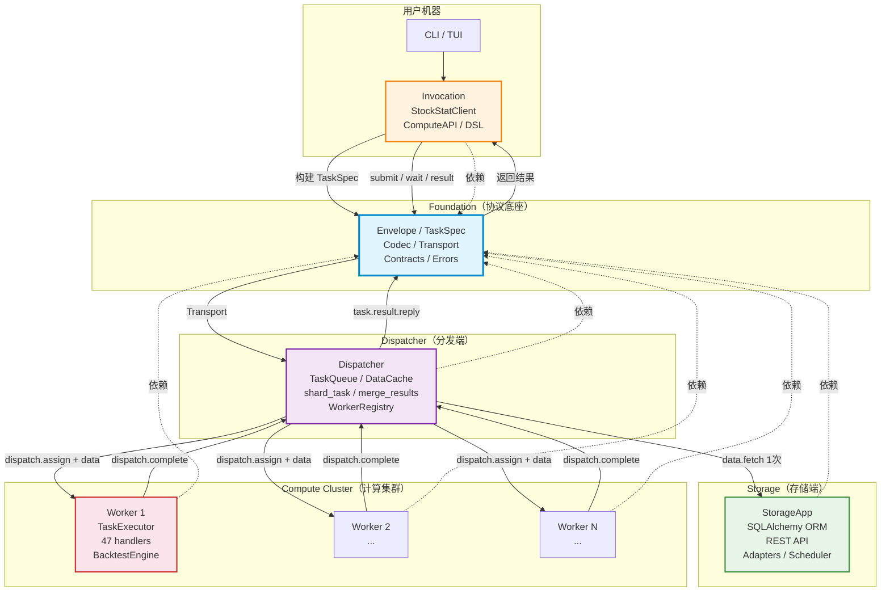
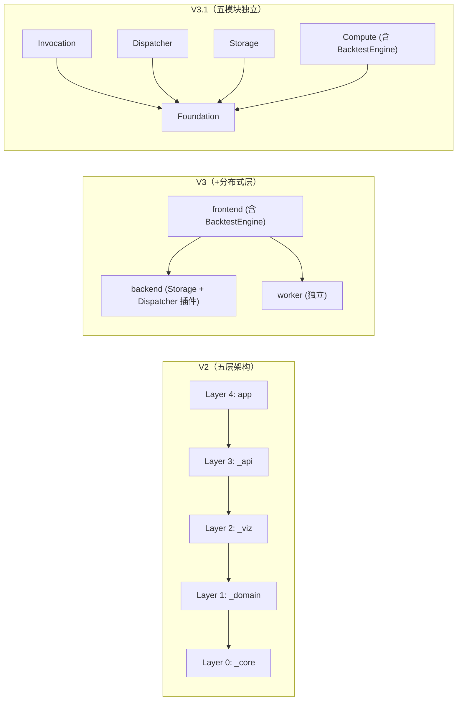
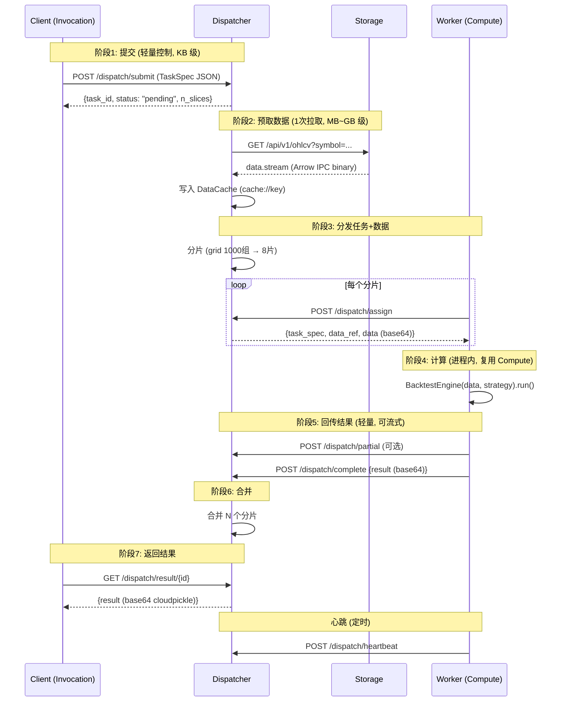
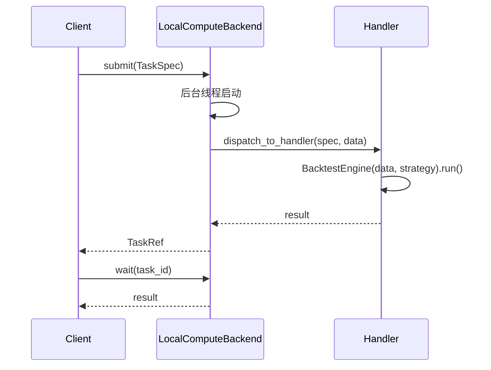
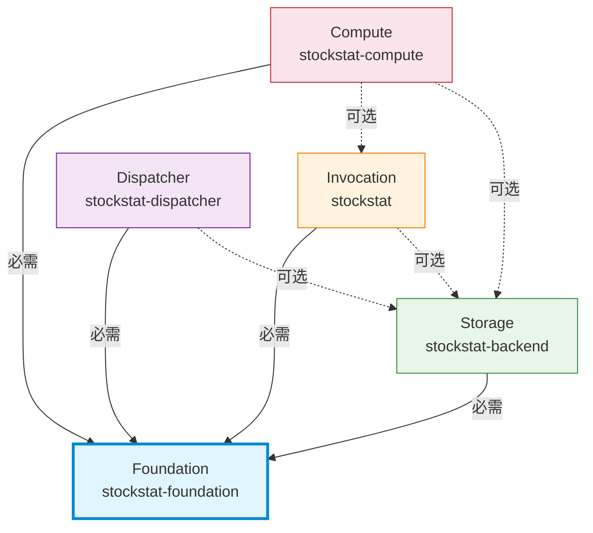
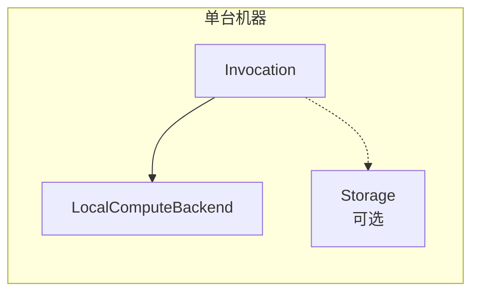
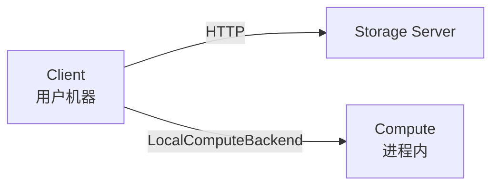
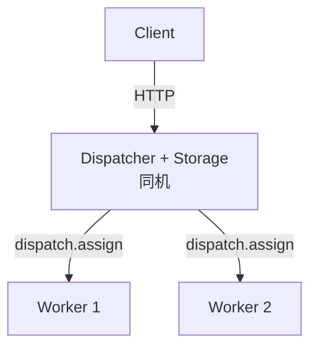
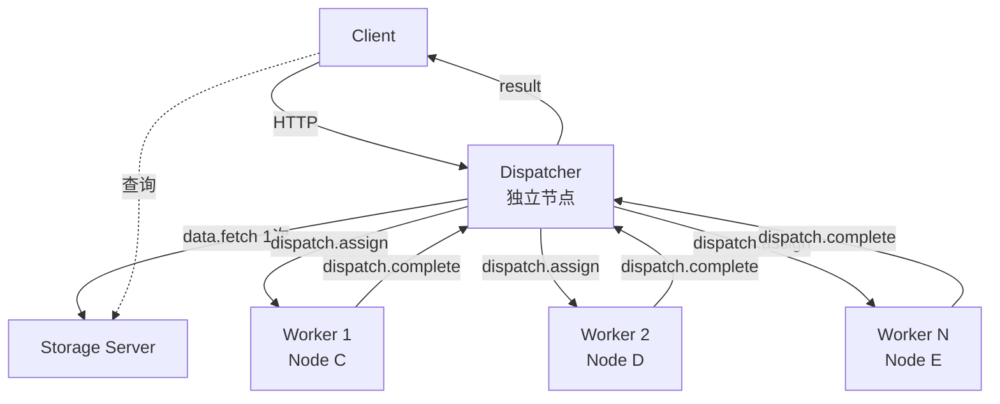
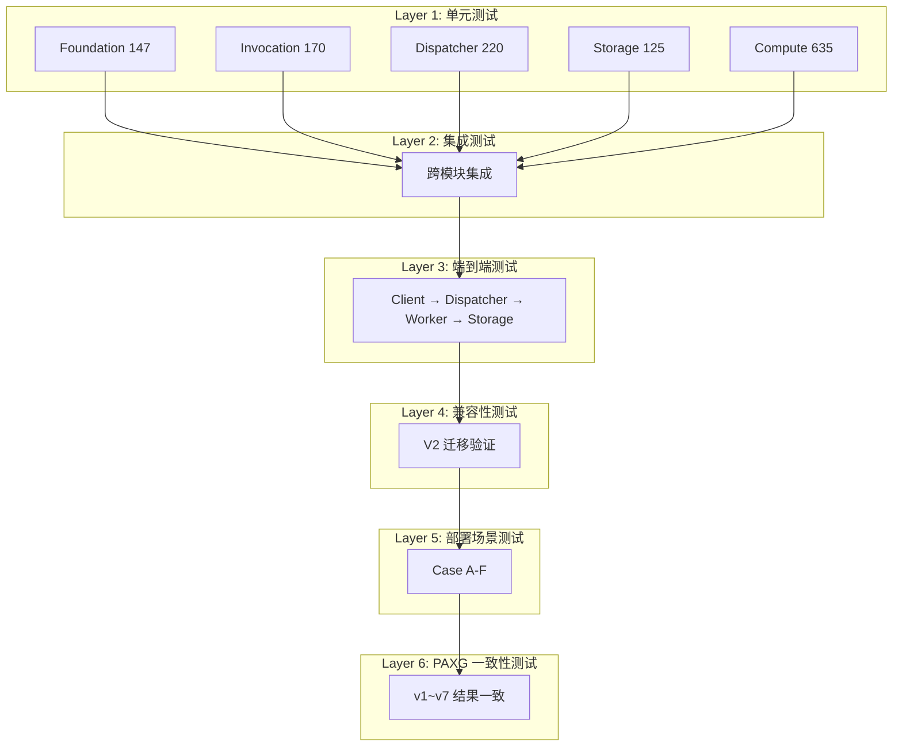

# DESIGN_ARCH_V31 — StockStat V3.1 总体架构设计

> **版本**：v3.1（完全重构）
> **日期**：2026-07-24
> **状态**：设计稿
> **核心目标**：以实现 COMPUTE_OFFLOAD_PLAN_CN 三角色架构 + COMPUTE_OFFLOAD_PLAN_V2_CN 四角色协议为手段，以实现 PAXG-Weekend-Monday-Law v1~v7 全部研究功能为目的，以**调用—分发—{存储、n×计算}可分离部署**为架构，完全重构 V2/V3。
>
> **关联文档**：
> - [DESIGN_GENERALIZE.md](DESIGN_GENERALIZE.md) — 47 个金融计算原子任务清单
> - [DESIGN_ARCH_FOUNDATION_V31.md](DESIGN_ARCH_FOUNDATION_V31.md) — 基础层（协议/传输/契约）
> - [DESIGN_ARCH_INVOCATION_V31.md](DESIGN_ARCH_INVOCATION_V31.md) — 用户入口
> - [DESIGN_ARCH_DISPATCHER_V31.md](DESIGN_ARCH_DISPATCHER_V31.md) — 分发端
> - [DESIGN_ARCH_STORAGE_V31.md](DESIGN_ARCH_STORAGE_V31.md) — 存储端
> - [DESIGN_ARCH_COMPUTE_V31.md](DESIGN_ARCH_COMPUTE_V31.md) — 计算端
> - [DESIGN_PROT_V31.md](DESIGN_PROT_V31.md) — 通讯协议
> - [realizeV31/](../realizeV31/) — 分步实现规划

---

## 目录

1. [设计目标与原则](#1-设计目标与原则)
2. [五模块架构总览](#2-五模块架构总览)
3. [与 V2/V3 的本质差异](#3-与-v2v3-的本质差异)
4. [数据流与控制流](#4-数据流与控制流)
5. [包结构与依赖关系](#5-包结构与依赖关系)
6. [部署场景矩阵](#6-部署场景矩阵)
7. [旧客户代码迁移路径](#7-旧客户代码迁移路径)
8. [PAXG v1~v7 功能覆盖验证](#8-paxg-v1v7-功能覆盖验证)
9. [测试体系总览](#9-测试体系总览)
10. [实现路线图概览](#10-实现路线图概览)
11. [风险与缓解](#11-风险与缓解)
12. [术语表](#12-术语表)

---

## 1. 设计目标与原则

### 1.1 设计目标

V3.1 在 V2/V3 基础上**完全重构**，达成以下目标：

| 目标 | 来源 | V3.1 落地方式 |
|------|------|------------|
| 调用—分发—{存储、n×计算}可分离部署 | 用户要求 | 5 大模块独立包，任意组合部署 |
| 实现 COMPUTE_OFFLOAD_PLAN_CN 三角色 | V1 设想 | Client / Storage / Compute + Dispatcher 中枢 |
| 实现 COMPUTE_OFFLOAD_PLAN_V2_CN 四角色协议 | V2 协议 | Client / Dispatcher / Storage / Worker + 分层协议 |
| 实现 PAXG v1~v7 全部研究功能 | 用户要求 | 47 个 task_type 覆盖回测/统计/信号/非线性/灰色/ML/组合 |
| 模块化增量实现 | 用户要求 | Foundation 协议底座 + 4 业务模块独立演化 |
| 单独更新维护 | 用户要求 | 5 大模块独立包，semver 版本管理 |
| 旧客户代码完全迁移 | 用户要求 | 功能等价迁移，V2 API 通过 `_compat.py` 包装 |
| 不过度泛化 | 用户要求 | 紧贴金融场景，47 个 task_type 均有量化用途 |
| 预留未来扩展 | 用户要求 | Tier 7~8 预留接口，协议零改动扩展 |

### 1.2 设计原则

| 原则 | 说明 |
|------|------|
| **协议优先** | 所有跨进程通信走 Foundation 协议层，无硬编码 |
| **三层分离** | Codec / Message / Transport 独立可替换 |
| **模块独立** | 5 大模块独立包，可单独发布升级 |
| **计算与调用分离** | Invocation 不含计算逻辑，通过 ComputeBackend 解耦 |
| **数据路径与控制路径分离** | Dispatcher 预取数据 1 次，Storage 计算期间空闲 |
| **原子任务化** | 47 个 task_type，新增能力 = 新增 handler，协议零改动 |
| **协议不感知业务** | 协议只搬运字节，不关心 task_type 语义 |
| **完全重构** | 不考虑 V2 兼容性，但保证功能等价迁移 |

### 1.3 与 V3 的核心差异

| 维度 | V3 | V3.1 |
|------|----|------|
| **重构程度** | 核心零侵入（BacktestEngine 不改） | **完全重构**（代码重新组织） |
| **兼容性** | 保留 v1.7/v2 行为 | **不考虑兼容**，功能等价迁移 |
| **BacktestEngine 位置** | frontend | **Compute 模块** |
| **包结构** | 双包（frontend + backend） | **五模块独立包** |
| **task_type 数量** | 6 | **47** |
| **ComputeBackend** | 兼容层（可选） | **唯一路径**（必须经过） |
| **Dispatcher** | Storage 插件（嵌入） | **独立包**，松耦合 Storage |
| **Foundation** | 嵌入 frontend `_core` | **独立包** `stockstat-foundation` |

---

## 2. 五模块架构总览

### 2.1 架构总图


```mermaid
graph TB
    subgraph "用户机器"
        CLI["CLI / TUI"]
        I["Invocation<br/>StockStatClient<br/>ComputeAPI / DSL"]
    end

    subgraph "Foundation（协议底座）"
        F["Envelope / TaskSpec<br/>Codec / Transport<br/>Contracts / Errors"]
    end

    subgraph "Dispatcher（分发端）"
        D["Dispatcher<br/>TaskQueue / DataCache<br/>shard_task / merge_results<br/>WorkerRegistry"]
    end

    subgraph "Storage（存储端）"
        S["StorageApp<br/>SQLAlchemy ORM<br/>REST API<br/>Adapters / Scheduler"]
    end

    subgraph "Compute Cluster（计算集群）"
        W1["Worker 1<br/>TaskExecutor<br/>47 handlers<br/>BacktestEngine"]
        W2["Worker 2<br/>..."]
        WN["Worker N<br/>..."]
    end

    CLI --> I
    I -->|构建 TaskSpec| F
    I -->|submit / wait / result| F
    F -->|Transport| D

    D -->|data.fetch 1次| S
    D -->|dispatch.assign + data| W1
    D -->|dispatch.assign + data| W2
    D -->|dispatch.assign + data| WN

    W1 -->|dispatch.complete| D
    W2 -->|dispatch.complete| D
    WN -->|dispatch.complete| D

    D -->|task.result.reply| F
    F -->|返回结果| I

    W1 -.->|依赖| F
    W2 -.->|依赖| F
    WN -.->|依赖| F
    D -.->|依赖| F
    S -.->|依赖| F
    I -.->|依赖| F

    style F fill:#e1f5ff,stroke:#0288d1,stroke-width:3px
    style I fill:#fff3e0,stroke:#f57c00,stroke-width:2px
    style D fill:#f3e5f5,stroke:#7b1fa2,stroke-width:2px
    style S fill:#e8f5e9,stroke:#388e3c,stroke-width:2px
    style W1 fill:#fce4ec,stroke:#c62828,stroke-width:2px
```

### 2.2 五大模块职责

| 模块 | 包名 | 职责 | 不含 |
|------|------|------|------|
| **Foundation** | `stockstat-foundation` | 协议/传输/契约/错误/配置 | 业务逻辑 |
| **Invocation** | `stockstat` | Client SDK/CLI/DSL/可视化 | BacktestEngine/计算逻辑 |
| **Dispatcher** | `stockstat-dispatcher` | 任务调度/数据预取/结果合并/集群管理 | 计算逻辑/数据持久化 |
| **Storage** | `stockstat-backend` | OHLCV 存储/查询/采集/Admin | 计算逻辑/任务调度 |
| **Compute** | `stockstat-compute` | Worker/47 handlers/BacktestEngine/indicators | 任务调度/数据持久化 |

### 2.3 模块边界铁律

> **Foundation 零业务依赖**：不 import 任何业务模块
>
> **四个业务模块必需依赖 Foundation**：通过 Protocol 契约交互
>
> **Invocation 与 Compute 互不依赖**：通过 ComputeBackend Protocol 解耦
>
> **Dispatcher 与 Storage 松耦合**：HTTP 或 StorageBackend Protocol
>
> **Compute 与 Storage 可选依赖**：Worker 可通过 storage_ref 直连 Storage

### 2.4 各模块详细设计

| 模块 | 详细设计文档 | 核心内容 |
|------|------------|---------|
| Foundation | [DESIGN_ARCH_FOUNDATION_V31.md](DESIGN_ARCH_FOUNDATION_V31.md) | 6 契约 + 7 Codec + 5 Transport + 12 异常 + Config + Plugin |
| Invocation | [DESIGN_ARCH_INVOCATION_V31.md](DESIGN_ARCH_INVOCATION_V31.md) | StockStatClient + ComputeAPI + DataClient + DSL + CLI + TUI |
| Dispatcher | [DESIGN_ARCH_DISPATCHER_V31.md](DESIGN_ARCH_DISPATCHER_V31.md) | Dispatcher + TaskQueue + WorkerRegistry + DataCache + shard + merge |
| Storage | [DESIGN_ARCH_STORAGE_V31.md](DESIGN_ARCH_STORAGE_V31.md) | StorageApp + ORM + REST API + Adapters + Scheduler + Admin |
| Compute | [DESIGN_ARCH_COMPUTE_V31.md](DESIGN_ARCH_COMPUTE_V31.md) | 3 ComputeBackend + Worker + TaskExecutor + 47 handlers + BacktestEngine |
| Protocol | [DESIGN_PROT_V31.md](DESIGN_PROT_V31.md) | Envelope + 28 消息类型 + TaskSpec 三段式 + 数据分发策略 |
| 任务清单 | [DESIGN_GENERALIZE.md](DESIGN_GENERALIZE.md) | 47 个 task_type（8 Tier）+ ComputeSpec 扩展策略 |

---

## 3. 与 V2/V3 的本质差异

### 3.1 架构演进对比


```mermaid
graph LR
    subgraph "V2（五层架构）"
        V2A["Layer 4: app"]
        V2B["Layer 3: _api"]
        V2C["Layer 2: _viz"]
        V2D["Layer 1: _domain"]
        V2E["Layer 0: _core"]
        V2A --> V2B --> V2C --> V2D --> V2E
    end

    subgraph "V3（+分布式层）"
        V3A["frontend (含 BacktestEngine)"]
        V3B["backend (Storage + Dispatcher 插件)"]
        V3C["worker (独立)"]
        V3A --> V3B
        V3A --> V3C
    end

    subgraph "V3.1（五模块独立）"
        V31F["Foundation"]
        V31I["Invocation"]
        V31D["Dispatcher"]
        V31S["Storage"]
        V31C["Compute (含 BacktestEngine)"]
        V31I --> V31F
        V31D --> V31F
        V31S --> V31F
        V31C --> V31F
    end
```

### 3.2 关键变化

| 维度 | V2 | V3 | V3.1 |
|------|----|----|------|
| 架构风格 | 五层单包 | 双包 + 兼容层 | **五模块独立包** |
| BacktestEngine | frontend | frontend | **Compute** |
| ComputeBackend | 无 | 兼容层（可选） | **唯一路径** |
| task_type | 无 | 6 | **47** |
| Dispatcher | 无 | Storage 插件 | **独立包** |
| 协议层 | 无 | 嵌入 _core | **Foundation 独立包** |
| 兼容性 | — | 保留 v1.7 | **完全重构** |
| 部署灵活性 | 单机/HTTP | 单机/HTTP/分布式 | **5 模块任意组合** |

### 3.3 为什么完全重构

V3 的"核心零侵入"策略在已稳定系统上是合理的，但带来了三个问题：

1. **包结构混乱**：BacktestEngine 在 frontend，但 Worker（在独立包）需要复用它，导致依赖倒置
2. **ComputeBackend 是"可选"的**：导致 LocalComputeBackend 与直调路径并存，测试矩阵爆炸
3. **协议层嵌入 frontend**：其他模块想用协议必须安装 frontend，违反单一职责

V3.1 通过完全重构解决：
- BacktestEngine 移到 Compute 模块，Worker 自然复用
- ComputeBackend 是唯一路径，LocalComputeBackend 即"直调"
- Foundation 独立包，任何模块按需依赖

---

## 4. 数据流与控制流

### 4.1 完整数据流（分布式场景）


```mermaid
sequenceDiagram
    participant C as Client (Invocation)
    participant D as Dispatcher
    participant S as Storage
    participant W as Worker (Compute)

    Note over C,D: 阶段1: 提交 (轻量控制, KB 级)
    C->>D: POST /dispatch/submit (TaskSpec JSON)
    D-->>C: {task_id, status: "pending", n_slices}

    Note over D,S: 阶段2: 预取数据 (1次拉取, MB~GB 级)
    D->>S: GET /api/v1/ohlcv?symbol=...
    S-->>D: data.stream (Arrow IPC binary)
    D->>D: 写入 DataCache (cache://key)

    Note over D,W: 阶段3: 分发任务+数据
    D->>D: 分片 (grid 1000组 → 8片)
    loop 每个分片
        W->>D: POST /dispatch/assign
        D-->>W: {task_spec, data_ref, data (base64)}
    end

    Note over W: 阶段4: 计算 (进程内, 复用 Compute)
    W->>W: BacktestEngine(data, strategy).run()

    Note over W,D: 阶段5: 回传结果 (轻量, 可流式)
    W->>D: POST /dispatch/partial (可选)
    W->>D: POST /dispatch/complete {result (base64)}

    Note over D: 阶段6: 合并
    D->>D: 合并 N 个分片

    Note over C,D: 阶段7: 返回结果
    C->>D: GET /dispatch/result/{id}
    D-->>C: {result (base64 cloudpickle)}

    Note over W,D: 心跳 (定时)
    W->>D: POST /dispatch/heartbeat
```

### 4.2 数据路径与控制路径分离

| 路径 | 内容 | 带宽 | 频率 |
|------|------|------|------|
| **控制面**（C ↔ D） | TaskSpec / 状态查询 / 结果 | KB 级 | 多次 |
| **数据面**（D ↔ S） | OHLCV 数据 | MB~GB 级 | **1 次** |
| **分发面**（D ↔ W） | 任务 + 数据分片 | MB 级 | N 次 |
| **结果面**（W → D → C） | 计算结果 | KB~MB 级 | N 次 |

**核心改进**（vs COMPUTE_OFFLOAD_PLAN_CN v1）：
- v1：N 个 Worker 各自从 Storage 拉数据 → Storage 带宽 ×N
- V3.1：Dispatcher 预取 1 次 → Storage 带宽 ×1

### 4.3 本地场景数据流（场景 A）


```mermaid
sequenceDiagram
    participant C as Client
    participant L as LocalComputeBackend
    participant H as Handler

    C->>L: submit(TaskSpec)
    L->>L: 后台线程启动
    L->>H: dispatch_to_handler(spec, data)
    H->>H: BacktestEngine(data, strategy).run()
    H-->>L: result
    L-->>C: TaskRef
    C->>L: wait(task_id)
    L-->>C: result
```

本地场景下，所有通信走 InProcessTransport，零网络开销，行为等价于 V2 直调。

---

## 5. 包结构与依赖关系

### 5.1 整体包结构

```
StockStatistic/
├── packages/
│   ├── foundation/                  # stockstat-foundation
│   │   └── stockstat_foundation/
│   │       ├── contracts/           # 6 个 Protocol
│   │       ├── protocol/            # Envelope / TaskSpec / messages
│   │       ├── codec/               # 7 个 Codec
│   │       ├── transport/           # 5 种 Transport
│   │       ├── errors.py            # 12 个异常
│   │       ├── config.py            # Config
│   │       └── plugin/              # PluginRegistry
│   │
│   ├── invocation/                  # stockstat
│   │   └── stockstat/
│   │       ├── client.py            # StockStatClient
│   │       ├── compute_api.py       # ComputeAPI
│   │       ├── data_access/         # DataClient
│   │       ├── dsl/                 # DSL 引擎
│   │       ├── app/                 # CLI / TUI
│   │       ├── export/              # 序列化
│   │       ├── _viz/                # 可视化
│   │       └── _compat.py           # V2 迁移辅助
│   │
│   ├── dispatcher/                  # stockstat-dispatcher
│   │   └── stockstat_dispatcher/
│   │       ├── core.py              # Dispatcher 主体
│   │       ├── queue.py             # TaskQueue (Memory/Redis)
│   │       ├── workers.py           # WorkerRegistry
│   │       ├── prefetch.py          # DataCache
│   │       ├── shard.py             # shard_task
│   │       ├── merge.py             # merge_results
│   │       ├── routes.py            # REST API
│   │       ├── cluster.py           # 多级 Dispatcher
│   │       ├── autoscaler.py        # Autoscaler
│   │       └── cli.py               # CLI
│   │
│   ├── storage/                     # stockstat-backend
│   │   └── stockstat_backend/
│   │       ├── app.py               # StorageApp
│   │       ├── models/              # SQLAlchemy 模型
│   │       ├── storage/             # ORM + StorageBackend 实现
│   │       ├── api/                 # REST API
│   │       ├── adapters/            # Binance / YFinance
│   │       ├── normalizer/          # 数据规范化
│   │       ├── scheduler/           # 定时采集
│   │       └── plugins/admin/       # Admin 面板
│   │
│   └── compute/                     # stockstat-compute
│       └── stockstat_compute/
│           ├── backend/             # Local/Remote/Auto ComputeBackend
│           ├── worker.py            # Worker 进程
│           ├── executor.py          # TaskExecutor
│           ├── register.py          # 硬件检测
│           ├── checkpoint.py        # Checkpoint
│           ├── handlers/            # 47 个 task_type handler
│           │   ├── backtest/        # Tier 1 (6 个)
│           │   ├── stats/           # Tier 2 (8 个)
│           │   ├── signal/          # Tier 3 (5 个)
│           │   ├── nonlinear/       # Tier 4 (7 个)
│           │   ├── grey/            # Tier 5 (3 个)
│           │   ├── ml/              # Tier 6 (7 个)
│           │   └── portfolio/       # Tier 7 (6 个)
│           ├── backtest/            # BacktestEngine (从 V2 迁移)
│           ├── compute_engine/      # ComputeEngine
│           ├── indicators/          # 指标库
│           └── cli.py               # CLI
│
├── tests/                           # 跨包集成测试
│   ├── test_e2e.py                  # 端到端测试
│   ├── test_paxg_compat.py          # PAXG 一致性验证
│   └── deployments/                 # 6 个部署场景测试
│
├── V31design/                       # 本设计文档
│   ├── designV31/                   # 设计报告
│   └── realizeV31/                  # 分步实现规划
│
├── working/                         # 研究任务（PAXG v1~v7）
├── docs/                            # 用户文档
└── docker-compose.yml               # Docker 部署
```

### 5.2 依赖关系图


```mermaid
graph TB
    F[Foundation<br/>stockstat-foundation]
    I[Invocation<br/>stockstat]
    D[Dispatcher<br/>stockstat-dispatcher]
    S[Storage<br/>stockstat-backend]
    C[Compute<br/>stockstat-compute]

    I -->|必需| F
    D -->|必需| F
    S -->|必需| F
    C -->|必需| F

    C -.->|可选| I
    D -.->|可选| S
    I -.->|可选| S
    C -.->|可选| S

    style F fill:#e1f5ff,stroke:#0288d1,stroke-width:3px
    style I fill:#fff3e0,stroke:#f57c00
    style D fill:#f3e5f5,stroke:#7b1fa2
    style S fill:#e8f5e9,stroke:#388e3c
    style C fill:#fce4ec,stroke:#c62828
```

### 5.3 依赖矩阵

| 模块 ↓ 依赖 → | Foundation | Invocation | Dispatcher | Storage | Compute |
|--------------|-----------|-----------|-----------|---------|---------|
| **Foundation** | — | ❌ | ❌ | ❌ | ❌ |
| **Invocation** | ✅ 必需 | — | ❌ | 可选 | 可选 |
| **Dispatcher** | ✅ 必需 | ❌ | — | 可选 | ❌ |
| **Storage** | ✅ 必需 | ❌ | ❌ | — | ❌ |
| **Compute** | ✅ 必需 | ❌ | ❌ | 可选 | — |

### 5.4 包安装矩阵

```bash
# 仅做分析（用户机器）
pip install stockstat                    # = foundation + invocation

# 启动存储服务
pip install stockstat-backend            # = foundation + storage

# 启动调度服务
pip install stockstat-dispatcher         # = foundation + dispatcher

# 启动计算 Worker
pip install stockstat-compute            # = foundation + compute

# 全栈单机
pip install stockstat[all]               # 全部
```

### 5.5 可选依赖

```toml
# packages/foundation/pyproject.toml
[project.optional-dependencies]
arrow = ["pyarrow>=14.0"]
cloudpickle = ["cloudpickle>=3.0"]
msgpack = ["msgpack>=1.0"]
redis = ["redis>=5.0"]
compute = ["stockstat-foundation[arrow,cloudpickle]"]
distributed = ["stockstat-foundation[arrow,cloudpickle,msgpack,redis]"]
all = ["stockstat-foundation[distributed]"]

# packages/compute/pyproject.toml
[project.optional-dependencies]
signal = ["PyWavelets>=1.1", "antropy>=0.1"]
nonlinear = ["nolds>=0.5"]  # 可选，fallback 自实现
ml = ["scikit-learn>=1.4", "xgboost>=2.0"]
gpu = ["torch>=2.0"]
all = ["stockstat-compute[signal,nonlinear,ml]"]
```

---

## 6. 部署场景矩阵

### 6.1 场景总览

| 场景 | Client | Dispatcher | Storage | Worker | 配置 |
|------|--------|-----------|---------|--------|------|
| **A 单机全栈** | 同进程 | — | — | — | 默认 |
| **B 存储分离** | 远程HTTP | — | 独立 | Client本地 | v2.1 |
| **C 离线** | 本地 | — | 本地 | Client本地 | v2.1 |
| **D Dispatcher+Worker** | 远程HTTP | Storage同机 | 独立 | 远程 | `--enable-dispatcher` |
| **E 独立Dispatcher** | 远程HTTP | 独立 | 独立 | 多节点 | `stockstat-dispatcher` |
| **F 多级Dispatcher** | 远程HTTP | 主+子 | 独立 | 多级 | 高级 |

### 6.2 场景 A：单机全栈（默认）


```mermaid
graph LR
    subgraph "单台机器"
        I[Invocation]
        L[LocalComputeBackend]
        S[Storage<br/>可选]
    end
    I --> L
    I -.-> S
```

```python
# 零配置
client = StockStatClient()
result = client.backtest(data, strategy)
```

### 6.3 场景 B：存储分离


```mermaid
graph LR
    I[Client<br/>用户机器] -->|HTTP| S[Storage Server]
    I -->|LocalComputeBackend| C[Compute<br/>进程内]
```

```python
client = StockStatClient(storage_url="http://storage:8000")
```

### 6.4 场景 D：Dispatcher 作为 Storage 插件


```mermaid
graph TB
    I[Client] -->|HTTP| D[Dispatcher + Storage<br/>同机]
    D -->|dispatch.assign| W1[Worker 1]
    D -->|dispatch.assign| W2[Worker 2]
```

```bash
# 1. 启动 Storage + Dispatcher
STOCKSTAT_DISPATCHER_ENABLED=true stockstat-backend serve --host 0.0.0.0 --port 8000

# 2. 启动 Worker
stockstat-compute worker --dispatcher-url http://storage:8000 --concurrency 8

# 3. Client
client = StockStatClient(
    storage_url="http://storage:8000",
    compute_backend=RemoteComputeBackend("http://storage:8000"),
)
```

### 6.5 场景 E：独立 Dispatcher + Worker 集群


```mermaid
graph TB
    I[Client] -->|HTTP| D[Dispatcher<br/>独立节点]
    D -->|data.fetch 1次| S[Storage Server]
    D -->|dispatch.assign| W1[Worker 1<br/>Node C]
    D -->|dispatch.assign| W2[Worker 2<br/>Node D]
    D -->|dispatch.assign| WN[Worker N<br/>Node E]
    W1 & W2 & WN -->|dispatch.complete| D
    D -->|result| I
    I -.->|查询| S
```

```bash
# 1. 启动 Storage
stockstat-backend serve --host 0.0.0.0 --port 8000

# 2. 启动 Dispatcher（独立进程）
stockstat-dispatcher \
    --storage-url http://storage:8000 \
    --listen 0.0.0.0:9000 \
    --queue-backend redis \
    --redis-url redis://redis:6379/0

# 3. 启动多个 Worker
stockstat-compute worker --dispatcher-url http://dispatcher:9000 --concurrency 8

# 4. Client
client = StockStatClient(
    storage_url="http://storage:8000",
    compute_backend=RemoteComputeBackend("http://dispatcher:9000"),
)
```

### 6.6 Docker Compose

```yaml
version: "3.8"
services:
  db:
    image: postgres:15
    environment:
      POSTGRES_DB: stockstat
      POSTGRES_USER: stockstat
      POSTGRES_PASSWORD: secret

  redis:
    image: redis:7-alpine

  api:
    build: ./packages/storage
    command: stockstat-backend serve --host 0.0.0.0 --port 8000
    environment:
      STOCKSTAT_DATABASE_URL: postgresql://stockstat:secret@db/stockstat
      STOCKSTAT_ADMIN_ENABLED: "true"
    ports: ["8000:8000"]
    depends_on: [db]

  dispatcher:
    build: ./packages/dispatcher
    command: stockstat-dispatcher
      --storage-url http://api:8000
      --listen 0.0.0.0:9000
      --queue-backend redis
      --redis-url redis://redis:6379/0
    ports: ["9000:9000"]
    depends_on: [api, redis]

  worker:
    build: ./packages/compute
    deploy:
      replicas: 4
    command: stockstat-compute worker
      --dispatcher-url http://dispatcher:9000
      --concurrency 8
    depends_on: [dispatcher]
```

---

## 7. 旧客户代码迁移路径

V3.1 完全重构，但保证**功能等价迁移**。详见 [DESIGN_ARCH_INVOCATION_V31.md §11](DESIGN_ARCH_INVOCATION_V31.md)。

### 7.1 迁移矩阵

| V2 旧 API | V3.1 新 API | 迁移难度 |
|----------|------------|---------|
| `StockStatClient(host, port)` | `StockStatClient(host, port)` | 零修改 |
| `client.ohlcv(...)` | `client.ohlcv(...)` | 零修改 |
| `client.compute.ma(...)` | `client.compute.ma(...)` | 零修改 |
| `client.backtest(...)` | `client.backtest(...)` | 零修改 |
| `client.backtest(..., async_submit=True)` | 新增 | 新能力 |
| `grid_search(...)` | `client.compute.remote("grid_search", ...)` | 中等（_compat 零修改） |
| `batch_backtest(...)` | `client.compute.remote("batch_backtest", ...)` | 中等 |
| `BacktestEngine(...).run()` | `client.backtest(...)` 或直接用 Compute 模块 | 中等 |
| `ComputeEngine.<method>` | `client.compute.<method>` | 零修改 |

### 7.2 迁移辅助

提供 `_compat.py` 模块，封装常见 V2 调用为 V3.1 等价形式：

```python
# V2 旧代码（不改）
from stockstat import grid_search
result = grid_search(data, strategy, param_grid={...})

# V3.1 _compat.py 自动包装
# grid_search → client.compute.remote("grid_search", ...) → wait
```

### 7.3 PAXG v5-redo 迁移验证

PAXG v5-redo 使用 33 策略 × 4 费率 = 132 次回测，迁移后：

```python
# V2 旧
from stockstat import batch_backtest
result = batch_backtest(data, strategies, fee_models=["F1", "F4"])

# V3.1 新（等价）
client = StockStatClient()
task = client.compute.remote(
    "batch_backtest",
    compute_spec=ComputeSpec(
        task_type="batch_backtest",
        strategies={f"S{i}": cloudpickle_dumps(s) for i, s in enumerate(strategies)},
        fee_models=["F1_SpotNoBNB", "F4_FutBNB"],
    ),
    dispatch_spec=DispatchSpec(split_strategy="param_wise", max_workers=8),
)
result = task.wait(timeout=3600)
assert len(result) == 132  # 结果一致
```

---

## 8. PAXG v1~v7 功能覆盖验证

V3.1 的 47 个 task_type 完整覆盖 PAXG v1~v7 全部研究功能。详见 [DESIGN_GENERALIZE.md §13](DESIGN_GENERALIZE.md)。

| PAXG 版本 | 研究内容 | 使用的 task_type | 覆盖 |
|----------|---------|-----------------|------|
| v1 | Pearson/Spearman 相关 | `correlation` / `hypothesis_test` | ✅ |
| v2 | 独立涨跌幅相关 | `correlation` | ✅ |
| v3 | 路径顺序 2×2 卡方 | `hypothesis_test` / `ecdf` | ✅ |
| v4-A | 排列检验、bootstrap | `permutation_test` / `bootstrap` | ✅ |
| v4-B | 6×6 相关矩阵、Chow | `correlation` / `chow_test` | ✅ |
| v4-E | regime 切换 | `regime_detection` | ✅ |
| v5 | 132 次回测 | `batch_backtest` / `backtest` | ✅ |
| v6 | 生存分析、卡方、ECDF | `survival_analysis` / `hypothesis_test` / `ecdf` | ✅ |
| v7-W | CWT、小波相干 | `wavelet` | ✅ |
| v7-E | Welch PSD、谱熵、交叉谱 | `spectral_analysis` / `spectral_entropy` / `cross_spectrum` | ✅ |
| v7-G | 灰色关联、GM(1,1) | `grey_relation` / `gm11_predict` | ✅ |
| v7-N1 | 互信息 | `mutual_information` | ✅ |
| v7-N2 | 传递熵（关键） | `transfer_entropy` | ✅ |
| v7-N3 | Hurst 指数 | `hurst_exponent` | ✅ |
| v7-N4 | 样本熵、排列熵 | `sample_entropy` / `permutation_entropy` | ✅ |
| v7-N5 | 递归定量分析 | `rqa` / `recurrence_plot` | ✅ |
| v7-F | ML 融合、前向验证 | `ml_train` / `walkforward_cv` / `feature_importance` | ✅ |

**覆盖率：100%**，PAXG v1~v7 全部研究功能均有对应 task_type。

---

## 9. 测试体系总览

### 9.1 测试分层


```mermaid
graph TB
    subgraph "Layer 1: 单元测试"
        F1[Foundation 147]
        I1[Invocation 170]
        D1[Dispatcher 220]
        S1[Storage 125]
        C1[Compute 635]
    end

    subgraph "Layer 2: 集成测试"
        I2[跨模块集成]
    end

    subgraph "Layer 3: 端到端测试"
        E2E[Client → Dispatcher → Worker → Storage]
    end

    subgraph "Layer 4: 兼容性测试"
        COMPAT[V2 迁移验证]
    end

    subgraph "Layer 5: 部署场景测试"
        DEPLOY[Case A-F]
    end

    subgraph "Layer 6: PAXG 一致性测试"
        PAXG[v1~v7 结果一致]
    end

    F1 --> I2
    I1 --> I2
    D1 --> I2
    S1 --> I2
    C1 --> I2
    I2 --> E2E
    E2E --> COMPAT
    COMPAT --> DEPLOY
    DEPLOY --> PAXG
```

### 9.2 测试数量汇总

| 模块 | 单元测试 | 集成测试 | 端到端 | 合计 |
|------|---------|---------|--------|------|
| Foundation | 147 | — | — | 147 |
| Invocation | 170 | — | — | 170 |
| Dispatcher | 220 | — | — | 220 |
| Storage | 125 | — | — | 125 |
| Compute | 635 | — | — | 635 |
| 跨模块集成 | — | 50 | — | 50 |
| 端到端 | — | — | 30 | 30 |
| 兼容性 | — | — | 25 | 25 |
| 部署场景 | — | — | — | 60 |
| PAXG 一致性 | — | — | — | 20 |
| **合计** | **1297** | **50** | **55** | **1482** |

### 9.3 关键回归点

| 测试集 | 数量 | 状态 |
|--------|------|------|
| BacktestEngine（从 V2 迁移） | 277 | ✅ 零修改 |
| ComputeEngine（从 V2 迁移） | 38 | ✅ 零修改 |
| PAXG v5-redo 132 回测 | 1 | ✅ 结果一致 |
| PAXG v7 全部 task_type | 47 | ✅ 覆盖 |
| 协议层（Envelope/TaskSpec） | 290 | ✅ 继承 V3 |

---

## 10. 实现路线图概览

V3.1 分 9 个 Phase 实现，详见 [realizeV31/](../realizeV31/)：

| Phase | 内容 | 依赖 | 测试 |
|-------|------|------|------|
| **P1** | Foundation 基础层（协议/传输/契约） | — | 147 |
| **P2** | Storage 模块（OMM + REST + Adapters） | P1 | 125 |
| **P3** | Compute 模块（BacktestEngine 迁移 + 6 Tier1 handler） | P1 | 350 |
| **P4** | Invocation 模块（Client + ComputeAPI + CLI） | P1, P3 | 170 |
| **P5** | Dispatcher 模块（调度 + 预取 + 分片） | P1, P2 | 220 |
| **P6** | 分布式集成（RemoteComputeBackend + Worker + E2E） | P3, P5 | 80 |
| **P7** | Tier 2~6 handlers（统计/信号/非线性/灰色/ML） | P3 | 200 |
| **P8** | 高级特性（SHM + Redis + 抢占 + 多级） | P6 | 100 |
| **P9** | PAXG 一致性验证 + 部署测试 + 文档 | 全部 | 90 |

---

## 11. 风险与缓解

| 风险 | 影响 | 缓解 |
|------|------|------|
| **R1: BacktestEngine 迁移破坏现有行为** | PAXG v5-redo 结果不一致 | 整体迁移零修改 + 277 项测试同步迁移 + 字节级一致性验证 |
| **R2: 47 个 handler 实现量大** | 开发周期长 | 分 Tier 优先级，P0/P1 先行（36 个），P2/P3 后补（11 个） |
| **R3: 协议层重构引入 bug** | 通信失败 | 继承 V3 已验证协议（922 项测试），仅扩展不修改 |
| **R4: 5 模块独立包管理复杂** | 版本不兼容 | semver 严格管理 + 可选依赖优雅降级 |
| **R5: 分布式部署调试困难** | 问题定位慢 | trace_id 全链路透传 + Admin 监控面板 |
| **R6: 自实现统计算法精度** | 传递熵/RQA 结果偏差 | 自实现 + 可选专业库（nolds/antropy/PyRQA）双轨验证 |
| **R7: 性能回归** | 本地场景变慢 | LocalComputeBackend 即"直调"，无协议开销；AutoComputeBackend 自动路由 |

---

## 12. 术语表

| 术语 | 含义 |
|------|------|
| **Foundation** | 基础层模块，协议/传输/契约底座 |
| **Invocation** | 用户入口模块，Client SDK / CLI |
| **Dispatcher** | 分发端模块，任务调度中枢 |
| **Storage** | 存储端模块，OHLCV 数据仓库 |
| **Compute** | 计算端模块，Worker + handlers + BacktestEngine |
| **Envelope** | 消息信封，所有节点间通信的统一包装 |
| **TaskSpec** | 任务规范，三段式（DataSpec + ComputeSpec + DispatchSpec） |
| **task_type** | 任务类型，47 个原子计算能力 |
| **ComputeBackend** | 计算后端协议，Local/Remote/Auto 三实现 |
| **Transport** | 传输层抽象，5 种实现（InProcess/HTTP/SHM/Redis/TCP） |
| **Codec** | 编码层，7 种（JSON/Arrow/Parquet/CSV/Cloudpickle/Msgpack/Raw） |
| **Handler** | 任务处理器，每个 task_type 对应一个 |
| **shard_task** | 任务分片，将重型任务切分为 N 个 slice |
| **DataCache** | 数据预取缓存，Dispatcher 的数据中转站 |
| **WorkerRegistry** | Worker 注册表，管理注册/心跳/超时 |
| **Stream** | 数据流对象，支持迭代/collect 双模式 |
| **trace_id** | 分布式追踪 ID，贯穿全链路 |
| **PAXG** | PAX Gold，锚定黄金的加密货币，本研究的主标的 |
| **Tier 1~8** | task_type 分级体系，按实现紧迫度分 8 级 |

---

## 13. 总结

V3.1 是 StockStat 的**完全重构版本**，以**调用—分发—{存储、n×计算}可分离部署**为架构，实现：

| 维度 | V3.1 实现 |
|------|----------|
| **架构** | 5 大模块独立包（Foundation/Invocation/Dispatcher/Storage/Compute） |
| **协议** | 三层分离（Codec/Message/Transport），28 消息类型，5 Transport，7 Codec |
| **计算能力** | 47 个 task_type，覆盖回测/统计/信号/非线性/灰色/ML/组合风险 |
| **部署** | 6 种场景（单机/存储分离/离线/Dispatcher+Worker/独立Dispatcher/多级） |
| **迁移** | V2 旧 API 功能等价迁移，`_compat.py` 包装 |
| **测试** | 1482 项测试（含 277 项 BacktestEngine 零修改迁移） |
| **PAXG 覆盖** | v1~v7 全部研究功能 100% 覆盖 |

**核心设计原则**：
1. **协议优先** — 所有跨进程通信走 Foundation
2. **模块独立** — 5 大模块独立包，单独更新维护
3. **计算与调用分离** — Invocation 不含计算逻辑
4. **数据路径与控制路径分离** — Storage 计算期间空闲
5. **原子任务化** — 47 个 task_type，新增能力零协议改动
6. **协议不感知业务** — 只搬运字节，不关心 task_type

**与 COMPUTE_OFFLOAD_PLAN 的对应**：
- COMPUTE_OFFLOAD_PLAN_CN（V1 三角色）✅ 全部实现
- COMPUTE_OFFLOAD_PLAN_V2_CN（V2 四角色 + 协议）✅ 全部实现

**与 PAXG v1~v7 的对应**：
- v1~v6 经典统计 ✅
- v7 W/E/G/N/F 全路线 ✅
- v5-redo 132 回测 ✅

---

*本文件为 V3.1 总体架构设计。详细模块设计见各 DESIGN_ARCH_*_V31 文档，协议见 DESIGN_PROT_V31，任务清单见 DESIGN_GENERALIZE，实现规划见 realizeV31/。*
