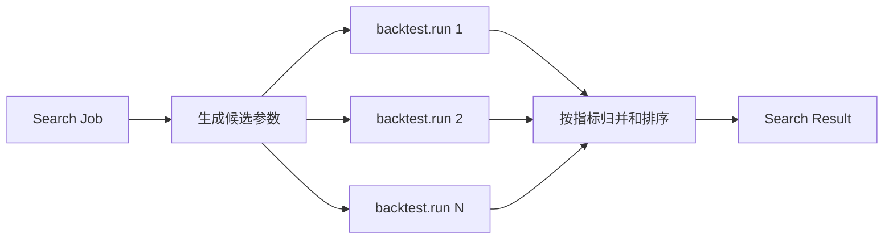
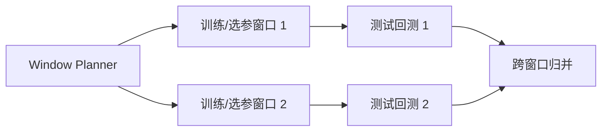

# StockStat V3.1 金融计算能力泛化边界

> 版本：V3.1 设计稿
> 日期：2026-07-20
> 状态：架构输入文档
> 关联：[DESIGN_ARCH_FINANCE_V31.md](DESIGN_ARCH_FINANCE_V31.md) | [DESIGN_ARCH_V31.md](DESIGN_ARCH_V31.md)

## 1. 文档目的

本文回答两个问题：

1. StockStat 在指标计算、回测之外，还应支持哪些同等级的金融计算原子能力。
2. 如何为未来能力留出接口，同时避免把项目扩张为通用 DAG、通用 ETL 或通用分布式计算框架。

V3.1 的泛化对象不是“任意 Python 函数”，而是具有明确金融输入、金融参数、金融结果和可验证计算语义的任务能力。协议负责稳定搬运任务、数据引用和结果引用；金融能力模块负责定义任务语义、分片方式和归并方式。

## 2. 从现有功能得到的边界

当前代码已证明以下能力属于项目核心功能面：

| 功能面 | 当前实现 | V3.1 归属 |
|---|---|---|
| OHLCV 采集、规范化、查询 | `backend/stockstat_backend` | Storage 数据服务 |
| 23 个技术与统计指标 | `frontend/stockstat/indicators` | 原子任务 `finance.indicator.compute` |
| 8 个信号处理与非线性方法 | `indicators/nonlinear.py` | 原子任务 `finance.timeseries.analyze` |
| 单次回测 | `backtest/BacktestEngine` | 原子任务 `finance.backtest.run` |
| 网格搜索、Optuna | `backtest/optimizer.py` | 复合计划 `finance.experiment.search` |
| 批量策略与费率扫描 | `batch_runner.py`、`fee_sweep.py` | 复合计划 `finance.experiment.batch` |
| 蒙特卡洛 | `backtest/montecarlo.py` | 原子模拟 + 复合归并 |
| Walk-forward | `backtest/walkforward.py` | 复合计划 `finance.validation.walk_forward` |
| DSL | `dsl/`、`_api/dsl/` | 调用层编译器，不是 Worker 任意代码入口 |
| 图表与导出 | `plot/`、`_viz/`、`export/` | 结果消费模块，默认不进入调度核心 |

V3.1 必须保留这些语义，但不保留 V2/V3 的目录、类层次或兼容分支。

## 3. 泛化原则

### 3.1 金融任务优先

只有满足以下条件的能力才进入共享任务目录：

| 条件 | 要求 |
|---|---|
| 金融语义明确 | 输入和输出可用金融术语描述，而不是 `Any -> Any` |
| 可复现 | 数据快照、参数、随机种子、代码版本可以固定 |
| 可验证 | 有数值基线、统计性质或业务不变量可测试 |
| 可调度 | 能声明 CPU、内存、GPU、数据局部性等资源需求 |
| 可分片或明确不可分片 | 分片边界和归并语义由能力模块定义 |
| 可版本化 | 参数 schema、输出 schema、算法版本有独立版本号 |

### 3.2 不把协议做成业务对象仓库

协议只认识以下稳定原语：

- `JobSpec`：用户提交的金融任务。
- `InputBinding`：数据选择器或不可变 Artifact 引用。
- `OperationSpec`：能力 ID、能力版本和类型化参数。
- `ExecutionPolicy`：优先级、超时、重试、资源和分片偏好。
- `ArtifactRef`：不可变输入、输出、策略包或检查点引用。
- `WorkLease`：Worker 对一个执行尝试的限时租约。

协议不认识 MA 的窗口、回测的成交规则、HRP 的 linkage 方法或 triple-barrier 的阈值。这些字段属于对应能力 schema。

### 3.3 原子任务与复合任务分离

原子任务是一个 Worker 可在一次 `WorkUnit` 中完成并提交结果的最小业务单元。复合任务由 Dispatcher 的金融 Planner 展开为多个原子任务和归并阶段。

| 类型 | 示例 | 设计方式 |
|---|---|---|
| 原子任务 | 单次指标、单次回测、一个参数组合、一个情景批次 | Worker Executor |
| 复合任务 | 网格搜索、批量回测、Walk-forward、Monte Carlo 全集 | Planner fan-out/fan-in |
| 数据命令 | 采集、快照、查询、导出 | Storage Command/Query |
| 展示任务 | 图表渲染、报表生成 | SDK/Admin 消费 Artifact；必要时可成为专用能力 |

这避免为 `grid_search`、`batch_backtest`、`fee_sweep` 分别复制一套回测逻辑。

## 4. V3.1 原子能力目录

### 4.1 时间序列指标与变换

能力 ID：`finance.indicator.compute`

适用内容：

- 趋势指标：MA、EMA、MACD。
- 震荡指标：RSI、KDJ。
- 波动指标：STD、ATR、Bollinger。
- 收益变换：简单收益、对数收益、累计收益。
- 滚动统计：相关、Beta、滚动 Sharpe、滚动波动率。

典型分片：按标的或互不依赖的指标集合分片。带窗口的时间分片必须携带 overlap，归并时裁掉重叠区。

典型结果：Arrow `Series/Table` Artifact，加上指标名、算法版本、窗口、warm-up 长度和空值策略。

### 4.2 统计检验与时序分析

能力 ID：`finance.timeseries.analyze`

常见能力：

- 平稳性检验：ADF、KPSS。
- 自相关与偏自相关：ACF、PACF、Ljung-Box。
- 协整与配对关系：Engle-Granger、Johansen。
- 结构变化：CUSUM、变点检测、Bayesian Online Change Point Detection。
- 频域与时频分析：PSD、CWT、小波能量。
- 非线性复杂度：Hurst、样本熵、排列熵、谱熵、传递熵。
- 因果与领先关系：Granger causality、transfer entropy。

这类任务与“指标计算”同级，区别是结果通常包含统计量、置信区间、p 值、诊断表或矩阵，而非单条指标序列。

### 4.3 信号生成与样本标注

能力 ID：`finance.signal.generate` 与 `finance.label.generate`

常见能力：

- 阈值、交叉、突破、均值回归等规则信号。
- CUSUM event filter。
- Triple-barrier labeling。
- Trend-scanning labels。
- Meta-labeling 的 primary side + outcome label。
- 并发样本权重、时间衰减权重和 uniqueness 计算。

这是现代金融机器学习流程中的基础层。标注结果必须携带事件时间、观察终点、标签定义版本和避免未来函数的数据边界。

### 4.4 单次回测与交易仿真

能力 ID：`finance.backtest.run`

覆盖当前全部语义：

- 多标的、多时间尺度。
- 成本、滑点、Maker/Taker、印花税和 Binance 费率。
- Next-bar 与 intrabar 执行。
- 限价、止损、止盈、VWAP 和最差价成交。
- Long/short、仓位与资产组合状态。
- Lookahead audit、固定随机种子。

一个原子回测只运行一个已解析的策略配置、数据快照和执行配置。批量、参数搜索、费率扫描均由复合 Planner 展开。

### 4.5 投资组合构建与再平衡

能力 ID：`finance.portfolio.construct`

常见方法：

- 等权、波动率倒数、风险平价。
- 均值-方差、最小方差、最大 Sharpe。
- Black-Litterman。
- HRP/HERC 等层次风险配置。
- CVaR/Expected Shortfall 约束优化。
- 换手、交易成本、仓位上下限、行业和因子暴露约束。

输入通常是预期收益、协方差、当前持仓、约束和价格；输出是目标权重、订单建议、优化诊断和约束残差。

### 4.6 风险、情景与压力测试

能力 ID：`finance.risk.evaluate` 与 `finance.scenario.run`

常见能力：

- Historical/parametric/Monte Carlo VaR 与 Expected Shortfall。
- 风险贡献、边际风险贡献、成分 VaR。
- 因子暴露、特异风险和相关性冲击。
- 历史情景重放、自定义价格/波动率/利率冲击。
- 流动性折扣和交易成本压力。
- 衍生品扩展时的 Greeks 与情景 PnL。

风险结果必须记录估值时点、持仓快照、市场数据快照和置信水平，不能只返回一个无上下文数字。

### 4.7 因子研究与横截面评估

能力 ID：`finance.factor.evaluate`

常见能力：

- 因子暴露计算、winsorize、标准化和行业/市值中性化。
- Rank IC、Pearson IC、ICIR。
- 分层组合、long-short spread、换手和容量分析。
- Fama-MacBeth 横截面回归。
- 因子相关、正交化和冗余检测。
- 多重检验控制与 Deflated Sharpe Ratio。

分片通常按日期横截面或因子集合进行，归并阶段负责时间序列统计和显著性汇总。

### 4.8 模型训练与推断

能力 ID：`finance.model.fit` 与 `finance.model.infer`

常见能力：

- ARIMA/ETS、GARCH、状态空间与 Kalman filter。
- HMM/Markov switching 市场状态识别。
- 线性、树模型、Boosting 和概率预测。
- 深度时序模型、Transformer 类模型的训练与批量推断。
- 概率校准、预测区间和不确定性估计。

V3.1 只预留受控模型包和训练 Artifact，不内置任意 ML 平台。模型训练任务必须输出模型 Artifact、特征 schema、训练数据快照、随机种子和评估报告。

### 4.9 重采样与随机模拟

能力 ID：`finance.simulation.resample`

常见能力：

- IID bootstrap、block bootstrap、stationary bootstrap。
- 收益路径、成交顺序和参数扰动模拟。
- Copula 或相关结构下的多资产情景。
- Brownian/GBM、jump diffusion 和随机波动率路径。

每个 WorkUnit 负责一段确定的 simulation index 区间，并通过 `base_seed + shard_index` 产生可重复且不重叠的随机流。

### 4.10 执行仿真与交易成本分析

能力 ID：`finance.execution.simulate` 与 `finance.tca.evaluate`

常见能力：

- TWAP/VWAP/POV 执行仿真。
- Implementation shortfall。
- 冲击、滑点、延迟和成交概率模型。
- 订单簿重放与盘口深度敏感性。
- Arrival price、participation rate 和 benchmark 对比。

此能力建立在更细粒度行情或订单簿数据上，属于后续扩展，不要求 V3.1 首次切换时全部落地。

## 5. 复合金融计划

### 5.1 参数搜索

`finance.experiment.search` 不是新的回测 Executor，而是以下 DAG：



候选生成可为 grid、random、Bayesian/Optuna。Bayesian 搜索允许 Planner 分批提出 trial，但实际单次评估仍是 `finance.backtest.run`。

### 5.2 批量回测与费率扫描

`strategies x datasets x fee_models x execution_models` 被展开为独立回测 WorkUnit。归并结果是一张指标表和各回测结果 Artifact 的引用，不重复传输所有资金曲线。

### 5.3 Walk-forward 与 Purged CV

常见计划：



未来金融机器学习验证可加入 purging、embargo 和 CPCV，但这些是 `finance.validation.*` 的参数，不进入通用调度协议。

### 5.4 Monte Carlo 风险评估

基线回测、收益提取、模拟分片和分位数归并是不同 Stage。Dispatcher 只保存 Stage 依赖和 Artifact 引用，Worker 不需要知道整张 DAG。

## 6. V3.1 首批范围

### 6.1 必须实现

| 能力 | 原因 |
|---|---|
| `finance.data.ingest` | 覆盖现有 on-demand/cron 触发与 incremental 数据采集 |
| `finance.indicator.compute` | 覆盖现有指标与非线性计算 |
| `finance.timeseries.analyze` | 承接统计与高级时序能力 |
| `finance.backtest.run` | 项目核心金融仿真能力 |
| `finance.simulation.resample` | 承接现有 Monte Carlo |
| `finance.experiment.search` | 承接 grid/Optuna |
| `finance.experiment.batch` | 承接批量与费率扫描 |
| `finance.validation.walk_forward` | 承接现有 walk-forward |

### 6.2 建议作为 V3.1 增量验证

| 能力 | 首个最小实现 |
|---|---|
| `finance.label.generate` | CUSUM + triple-barrier |
| `finance.factor.evaluate` | Rank IC + 分层收益 |
| `finance.portfolio.construct` | 等权 + 风险平价 + 最小方差 |
| `finance.risk.evaluate` | Historical VaR/ES + 风险贡献 |

### 6.3 仅预留，不在首次切换中实现

- 深度学习训练集群。
- 实时交易订单路由。
- 完整衍生品定价库。
- 任意语言 Worker。
- 通用用户 DAG 编辑器。
- 任意 Python 函数上传执行。

## 7. 能力模块契约

每个能力模块必须提供两部分实现：

| 部分 | 部署位置 | 职责 |
|---|---|---|
| `CapabilityDescriptor` | Contracts/Dispatcher/SDK | ID、版本、输入/参数/结果 schema、资源提示 |
| `CapabilityPlanner` | Dispatcher | 校验、解析快照、分片、Stage/WorkUnit 生成、Reducer 选择 |
| `CapabilityExecutor` | Worker | 加载输入 Artifact，执行一个 WorkUnit，提交输出 Artifact |
| `CapabilityReducer` | Worker 或 Dispatcher 触发的专用 WorkUnit | 类型化归并，不在 Dispatcher 进程中加载大型 pandas 对象 |

建议描述字段：

```text
capability_id
capability_version
parameter_schema
input_contracts
output_contracts
partitioning_modes
reducer_id
determinism
checkpoint_mode
default_resource_profile
supported_kernel_versions
```

## 8. 数据和结果约束

### 8.1 数据输入

金融任务输入只允许两类：

| 类型 | 用途 |
|---|---|
| `DatasetSelector` | 由 Storage 在规划时解析并固定为不可变快照 |
| `ArtifactRef` | SDK 上传、本任务前一 Stage 输出或已有模型/策略 Artifact |

不得把 DataFrame、策略闭包或结果对象直接 base64 放进控制消息。

### 8.2 结果输出

结果必须由小型 Manifest 和一个或多个 Artifact 组成。示例：

| 任务 | Manifest | Artifact |
|---|---|---|
| 指标 | 指标名、参数、warm-up、行数 | Arrow Series/Table |
| 回测 | 指标、配置、数据快照、策略版本 | equity、fills、trades、positions |
| 搜索 | 最优参数、排序指标、trial 数 | ranking table、各 trial result refs |
| 风险 | 估值时点、置信度、方法 | scenario pnl、risk contributions |
| 模型 | 特征 schema、训练摘要 | model bundle、metrics、predictions |

## 9. 扩展机制

### 9.1 安装式扩展而非消息式扩展

新增金融能力需要安装匹配版本的能力包：

1. Dispatcher 安装 descriptor/planner 部分。
2. Worker 安装 executor/reducer 部分。
3. Worker 注册时声明 `capability_id@version`。
4. Dispatcher 只向版本兼容的 Worker 发放 WorkLease。

能力包可通过 Python entry point 发现，但生产环境使用显式 allowlist。发现失败必须显式报错，不能像现有 `PluginRegistry.discover()` 一样静默吞掉异常。

### 9.2 策略与模型不是任务类型

策略、模型、成本模型和成交模型是任务参数中引用的版本化 Artifact 或注册组件，不应为每个策略创建一个新 `task_type`。

### 9.3 Schema 演进

- 增加可选字段：能力 schema minor 版本升级。
- 改变字段语义或默认值：能力 major 版本升级。
- 相同能力 major 版本必须保持结果核心语义稳定。
- Dispatcher 与 Worker 按能力版本协商，不能只比较整个 StockStat 包版本。

## 10. 防止过度泛化的明确决策

| 不采用的设计 | 原因 |
|---|---|
| `task_type="custom"` + 任意 dict | 无法验证、安全隔离困难、结果不可复现 |
| 通用 DAG DSL | 当前复合关系有限，内部 Planner 足够 |
| Dispatcher 动态 `getattr()` 调任意函数 | 能力和参数无法版本化 |
| 所有任务共享一个巨大 `ComputeSpec` | 字段互斥、校验弱、演进会持续膨胀 |
| 任意 cloudpickle 闭包跨网执行 | 远程代码执行风险和 Python 版本耦合 |
| 为未来 Go/Rust Worker 立即引入 Protobuf 全栈 | 当前内核为 Python/pandas，先稳定 JSON + Arrow 合同 |
| 将可视化纳入每个计算 Worker | 增加无关依赖；默认由 SDK/Admin 消费结果 Artifact |
| 首版实现多级 Dispatcher 树 | 当前规模无需求；先实现一个逻辑 Dispatcher 的持久化与 HA |

## 11. 结论

V3.1 的可扩展性来自“金融能力模块 + 类型化 schema + Planner/Executor/Reducer”三件事，而不是把系统改造成任意计算平台。现有指标、回测、搜索、批量、Monte Carlo 和 Walk-forward 都能映射到该模型；因子、风险、组合、标注和模型任务也能在不修改底层通信协议的前提下增量接入。

最终边界是：共享底层提供可靠任务和数据原语，金融模块提供有约束的计算语义，用户 API 提供金融友好的调用方式。
