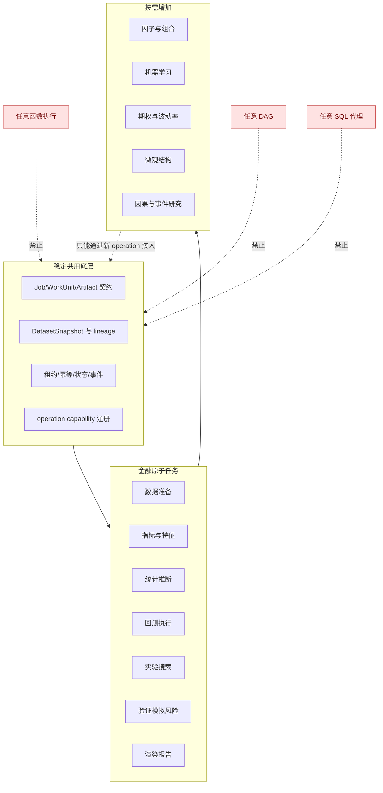

# StockStat V3.1 金融计算能力泛化边界

> 版本：V3.1 设计稿
> 日期：2026-07-21
> 状态：用于约束 V3.1 完全重构
> 关联文档：[DESIGN_ARCH_V31.md](DESIGN_ARCH_V31.md)、[DESIGN_PROT_V31.md](DESIGN_PROT_V31.md)

## 1. 文档目的

V3.1 需要在不丢失现有金融功能的前提下，为未来增加计算能力预留稳定边界。这里的“泛化”不是把 StockStat 做成任意代码执行平台、通用工作流引擎或通用 MapReduce 框架，而是把当前已经反复出现的金融研究步骤抽象成可组合、可调度、可复现的金融原子任务。

本文件回答四个问题：

1. 哪些能力应成为 V3.1 的基础原子任务。
2. 哪些能力只作为后续扩展点预留。
3. 新能力通过什么标准接入共用底层。
4. 哪些抽象明确禁止进入 V3.1 核心。

## 2. 来自当前项目的真实需求

### 2.1 已实现的用户功能

当前项目已经具备以下金融能力，V3.1 必须提供等价迁移目标：

| 能力域 | 现有功能 |
|---|---|
| 市场数据 | yfinance、Binance、Coinbase、Synthetic；OHLCV 采集、标准化、查询、离线读取 |
| 指标与变换 | MA、EMA、MACD、RSI、KDJ、ATR、Bollinger、收益率、Beta、Sharpe、VaR 等 |
| 信号处理 | CWT、Welch PSD、谱熵、灰色关联、GM(1,1) |
| 非线性分析 | 互信息相关需求、传递熵、Hurst/DFA、样本熵、排列熵、简化 RQA |
| 统计研究 | Pearson、Spearman、t 检验、Welch 检验、卡方、排列检验、自助法、Chow 检验、滚动统计、分位分组 |
| 回测 | 多标的、多时间尺度、成本模型、成交模型、NextBar、intrabar、OCO、止盈止损、做空 |
| 实验 | 批量策略、费率矩阵、网格搜索、Optuna、Monte Carlo、walk-forward |
| 结果 | 指标表、资金曲线、fills、trades、图表、CSV/JSON/Arrow/Parquet 导出 |
| 使用入口 | Python、CLI、DSL、TUI、Web Admin、本地/在线/离线/远程计算 |

### 2.2 PAXG v1-v7 暴露的研究流程

PAXG 研究不是单一回测，而是一条完整的金融研究链：


这条链条要求平台不仅“能算”，还必须保留：

- 输入数据版本和时间范围。
- 每个派生数据集的来源与参数。
- 随机算法的种子与分片规则。
- 策略代码、成本模型、执行模型和运行环境版本。
- 中间结果和最终结果的可追溯关系。
- 本地与远程执行的一致语义。

## 3. V3.1 的有限泛化原则

### 3.1 原则一：围绕金融数据资产泛化

V3.1 的输入输出不是任意 Python 对象，而是有限的金融资产类型：

| 资产类型 | 典型内容 |
|---|---|
| `market_table` | OHLCV、quote、trade、order book 等标准市场数据 |
| `feature_table` | 指标、信号、标签、横截面暴露、状态变量 |
| `event_table` | 财报、宏观、公司行动、交易日历事件 |
| `model_bundle` | 已注册模型或受控 Python 模块包 |
| `backtest_result` | equity、returns、fills、orders、positions、metrics |
| `experiment_table` | 参数、指标、状态、失败原因、排名 |
| `simulation_table` | 情景、路径、分位数、风险统计 |
| `chart_spec` | 与渲染器无关的金融图表规格 |
| `report_bundle` | 表格、图表、元数据和报告清单 |

### 3.2 原则二：围绕金融操作泛化

每个任务必须有稳定的金融语义，例如“计算指标”“执行回测”“做排列检验”，而不是“调用任意函数”。

### 3.3 原则三：组合发生在 Job 层，不发生在协议层

协议只传递类型化 Job、WorkUnit 和 ArtifactRef。复杂研究流程由 Planner 把复合 Job 展开为原子任务 DAG，不在 Envelope 中嵌入通用脚本语言。

### 3.4 原则四：扩展靠能力包，不靠核心字段膨胀

V3 的 `ComputeSpec` 同时容纳回测、网格、批量、Monte Carlo 字段，继续扩展会形成大量互斥可选字段。V3.1 改为按操作定义独立参数模型：

```text
indicator.compute@1        -> IndicatorParameters
statistics.hypothesis@1    -> HypothesisParameters
backtest.run@1             -> BacktestParameters
experiment.grid_search@1   -> GridSearchParameters
validation.walk_forward@1  -> WalkForwardParameters
```

新操作新增自己的参数模型、执行器、分片器、合并器和结果模型，不修改其他操作。

## 4. V3.1 首批基础原子任务

### 4.1 数据准备原子任务

| operation | 目的 | 主要输出 |
|---|---|---|
| `market.ingest@1` | 从受支持数据源采集并标准化市场数据 | 数据修订记录 |
| `dataset.snapshot@1` | 按标的、时间尺度、范围和质量规则冻结数据 | `DatasetSnapshot` |
| `dataset.align@1` | 时区、交易日历、频率和多标的时间轴对齐 | `market_table` |
| `dataset.resample@1` | OHLCV 重采样和聚合 | `market_table` |
| `dataset.join@1` | 受控的多表时间对齐连接 | `market_table`/`feature_table` |
| `dataset.window@1` | 构造滚动窗口、事件窗口、周末-周一配对 | `feature_table` |
| `dataset.quality@1` | 缺失、重复、跳变、覆盖和完整性检查 | 质量报告 |

这些任务不是通用 ETL。它们只支持明确的金融时间序列规则、市场日历和受控连接语义。

### 4.2 指标与特征原子任务

| operation | 目的 | 当前映射 |
|---|---|---|
| `indicator.compute@1` | 单个或一组技术/统计指标 | MA、RSI、ATR、Beta、Sharpe 等 |
| `feature.transform@1` | 收益率、对数收益、标准化、滞后、差分 | PAXG x1-x6 基础 |
| `feature.path@1` | 极值顺序、时序、路径形态和窗口特征 | v3、v6 |
| `feature.spectral@1` | CWT、PSD、频带能量、谱熵 | v7 W/E |
| `feature.nonlinear@1` | TE、Hurst、熵、RQA、灰色关联 | v7 G/N |
| `feature.cross_section@1` | 排名、分位数组、行业/资产内标准化 | 后续横截面研究 |

### 4.3 统计推断原子任务

| operation | 目的 | 说明 |
|---|---|---|
| `statistics.describe@1` | 描述统计、相关矩阵、分组汇总 | 必须记录样本数与缺失规则 |
| `statistics.hypothesis@1` | t、Welch、卡方、KS、log-rank、Chow | 每种检验有独立参数 schema |
| `statistics.regression@1` | OLS、稳健标准误、分段/滚动回归 | 输出系数、诊断和残差资产 |
| `statistics.multiple_testing@1` | Bonferroni、BH-FDR 等 | 输入为检验结果表 |
| `resampling.permutation@1` | 排列检验 | seed、次数、统计量必须固定 |
| `resampling.bootstrap@1` | percentile/BCa 等自助法 | 支持可确定分片 |
| `statistics.survival@1` | KM、log-rank、风险比 | 支撑 v6 类型分析 |

统计任务与指标计算同等级：都是可独立执行、可缓存、可复用的金融研究原子。

### 4.4 回测与执行原子任务

| operation | 目的 | 输出 |
|---|---|---|
| `backtest.run@1` | 单策略、单配置确定性回测 | `backtest_result` |
| `backtest.replay@1` | 事件流或订单簿回放 | `backtest_result` |
| `backtest.analyze@1` | 从已有回测结果重新计算指标 | metrics/artifacts |
| `backtest.compare@1` | 多结果对齐比较和基准比较 | comparison table |

`backtest.run@1` 必须覆盖当前功能，包括：

- 多标的和多时间尺度。
- session 跨越持仓。
- NextBar 和 intrabar 执行。
- 精确时间退出和 time-in-force。
- market、limit、stop、stop-limit、OCO 和 mutual OCO。
- 成交时间、订单优先级、止盈止损、移动止损。
- maker/taker、BNB 折扣、滑点、固定/比例/阶梯成本。
- 做空、仓位管理、未来函数防护和确定性随机种子。

### 4.5 实验与搜索原子任务

| operation | 目的 | 分片维度 |
|---|---|---|
| `experiment.batch@1` | 策略 x 费率 x 标的 x 配置矩阵 | run |
| `experiment.grid_search@1` | 笛卡尔参数搜索 | parameter combination |
| `experiment.random_search@1` | 固定 seed 的随机搜索 | trial range |
| `experiment.bayesian_search@1` | Optuna 类优化 | study/trial |
| `experiment.rank@1` | 指标排名、Pareto 筛选 | table partition |

搜索任务本身不直接运行策略逻辑。Planner 把它们展开为多个 `backtest.run@1`，再由合并单元产生排名结果。

### 4.6 验证与稳健性原子任务

| operation | 目的 |
|---|---|
| `validation.walk_forward@1` | 训练/验证窗口前向推进 |
| `validation.purged_cv@1` | Purged K-Fold 与 embargo，避免时序泄漏 |
| `validation.subperiod@1` | 子期间稳定性 |
| `validation.regime@1` | 高低波动、趋势、流动性状态分层 |
| `validation.sensitivity@1` | 参数、费率、滑点和数据质量敏感性 |
| `validation.negative_control@1` | BTC 类阴性对照或 placebo 检验 |
| `validation.predictive@1` | 注册模型族的时间前向预测验证，用于 v7 样本外增量检验 |

### 4.7 模拟、风险与情景原子任务

| operation | 目的 |
|---|---|
| `simulation.bootstrap_paths@1` | 收益重采样和资金路径 |
| `simulation.order_shuffle@1` | 成交顺序重排 |
| `simulation.monte_carlo@1` | 参数化或经验分布模拟 |
| `risk.metrics@1` | VaR、CVaR、回撤、暴露、集中度 |
| `risk.stress@1` | 费率、滑点、价格跳变、流动性冲击 |
| `risk.scenario@1` | 预定义市场情景重放 |

### 4.8 表达与导出原子任务

| operation | 目的 |
|---|---|
| `render.chart@1` | 从结果资产生成 ChartSpec 或图片 |
| `render.dashboard@1` | 组合多个图表与表格 |
| `export.table@1` | CSV/JSON/Arrow/Parquet |
| `report.assemble@1` | 生成包含引用和 lineage 的报告包 |

渲染和报告任务可以部署到普通 CPU Worker，不应嵌入 Storage 或 Dispatcher。

## 5. 未来常见量化能力预留

以下能力与指标、统计推断、回测处于同一基础层级，但不要求 V3.1 首批全部实现。预留的是操作注册、输入输出模型和 Worker capability，不是预先加入空字段。

### 5.1 横截面与组合

| operation 候选 | 用途 |
|---|---|
| `factor.compute@1` | 因子暴露、IC、RankIC、分层收益 |
| `factor.neutralize@1` | 行业、市值、Beta 中性化 |
| `portfolio.optimize@1` | 均值方差、风险平价、最小方差、CVaR 优化 |
| `portfolio.rebalance@1` | 调仓、换手和约束处理 |
| `attribution.performance@1` | Brinson、因子归因、交易成本归因 |

### 5.2 机器学习研究

| operation 候选 | 用途 |
|---|---|
| `ml.dataset_split@1` | 时序安全的训练/验证/测试切分 |
| `ml.train@1` | 受控模型族训练 |
| `ml.predict@1` | 模型推理 |
| `ml.evaluate@1` | 前向验证、校准、漂移和特征稳定性 |
| `ml.explain@1` | permutation importance、SHAP 类解释 |

机器学习任务必须强制记录数据快照、特征 schema、切分方法、随机种子和环境摘要，避免 v7 中样本内过拟合被误判为预测力。

首批 `validation.predictive@1` 只迁移现有 v7 所需的 linear baseline、随机森林回归/分类和 chronological split。它输出验证结果，不建立可部署模型服务，也不接受任意 estimator；完整训练、模型资产和推理生命周期仍属于后续 `ml.*` operation。

### 5.3 衍生品与波动率

| operation 候选 | 用途 |
|---|---|
| `option.price@1` | Black-Scholes、树模型、Monte Carlo 定价 |
| `option.greeks@1` | Delta/Gamma/Vega/Theta/Rho |
| `volatility.surface@1` | 隐含波动率曲面拟合与插值 |
| `option.strategy_backtest@1` | 跨式、宽跨式、价差等 |

这类能力是 PAXG v4 波动率发现潜在经济变现路径，但需要期权数据模型后再落地。

### 5.4 微观结构与高频

| operation 候选 | 用途 |
|---|---|
| `microstructure.features@1` | spread、imbalance、order flow、impact |
| `orderbook.replay@1` | L2/L3 订单簿回放 |
| `execution.tca@1` | VWAP/TWAP/arrival price 成本分析 |
| `execution.simulate@1` | 延迟、排队、部分成交模拟 |

### 5.5 因果、事件与制度研究

| operation 候选 | 用途 |
|---|---|
| `event_study.run@1` | 财报、政策、休市和上市事件窗口 |
| `causal.did@1` | 双重差分 |
| `causal.synthetic_control@1` | 合成控制 |
| `causal.placebo@1` | placebo 与伪事件检验 |

## 6. 新能力接入标准

一个新 operation 进入核心目录前必须满足全部条件：

1. 有明确的金融语义和用户场景。
2. 输入可表达为 DatasetSnapshot、ArtifactRef 或小型 JSON 参数。
3. 输出可表达为现有资产类型，或新增一个金融资产 schema。
4. 参数模型独立、可校验、可版本化。
5. 能声明资源需求、确定性、可分片性和合并规则。
6. 有本地与远程执行一致性测试。
7. 有至少一个真实金融 fixture 或研究用例。
8. 不要求 Dispatcher 理解其业务算法。
9. 不以任意 Python 对象序列化作为唯一互操作方式。

能力描述建议如下：

```json
{
  "operation": "statistics.hypothesis@1",
  "input_kinds": ["feature_table"],
  "output_kinds": ["experiment_table"],
  "deterministic": true,
  "splittable": false,
  "merge_strategy": null,
  "resource_classes": ["cpu-small"],
  "implementation_version": "1.0.0"
}
```

## 7. 明确禁止的过度泛化

### 7.1 不做任意函数远程执行

生产协议不提供 `custom(function_bytes, args)`。原因：

- 无法稳定校验输入输出。
- 无法规划分片和资源。
- cloudpickle 与 Python/依赖版本强耦合。
- 扩大远程代码执行和供应链风险。
- 结果难以跨语言、跨版本和长期复现。

开发环境可以提供受信任的 `python_bundle`，但必须是有 digest、入口点、依赖锁和安全策略的代码资产。

### 7.2 不做任意 DAG 编排平台

V3.1 的 DAG 只由已注册金融 operation 构成。用户不能提交 shell、SQL、HTTP 和 Python 任意节点混合的通用工作流。

### 7.3 不做通用数据库代理

Storage 服务暴露金融数据集和 Artifact API，不暴露任意 SQL。复杂查询通过类型化 DatasetQuery 表达。

### 7.4 不预置所有未来算法字段

不在 `JobSpec` 中加入 `gpu_required`、`model_name`、`option_type`、`factor_neutralize` 等未来字段。资源由 `ExecutionPolicy` 和 capability 约束表达，业务参数属于对应 operation schema。

### 7.5 不承诺跨语言执行任意策略

控制面和数据资产应跨语言可读，但 Python 策略执行仍可以是 Python Worker 专属 capability。跨语言 Worker 只执行它明确实现的 operation。

## 8. 泛化边界图



## 9. 结论

V3.1 的“通用”应理解为：

- 同一套调用、分发、数据快照、结果资产和任务状态底层可以承载多个金融计算 operation。
- 新金融能力通过独立参数 schema 和 capability 增量接入。
- 复杂研究由原子任务组合而成。
- 不把金融平台稀释成任意代码执行和通用工作流系统。

这一边界既能覆盖当前 StockStat 和 PAXG v1-v7 的全部功能，也为因子、组合、机器学习、期权和微观结构预留了真实可实现的扩展路径。
