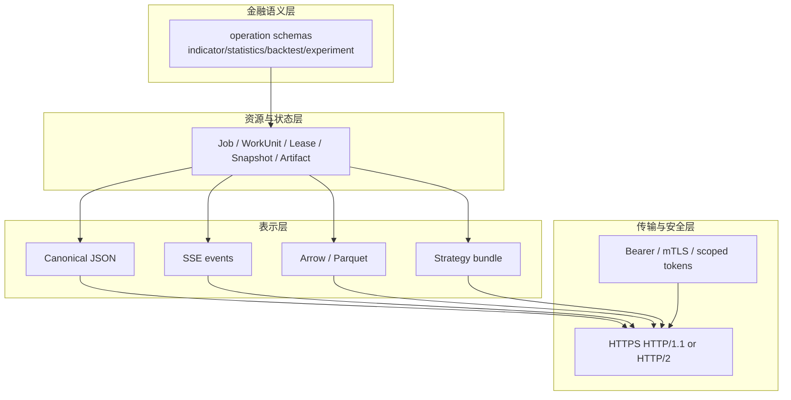
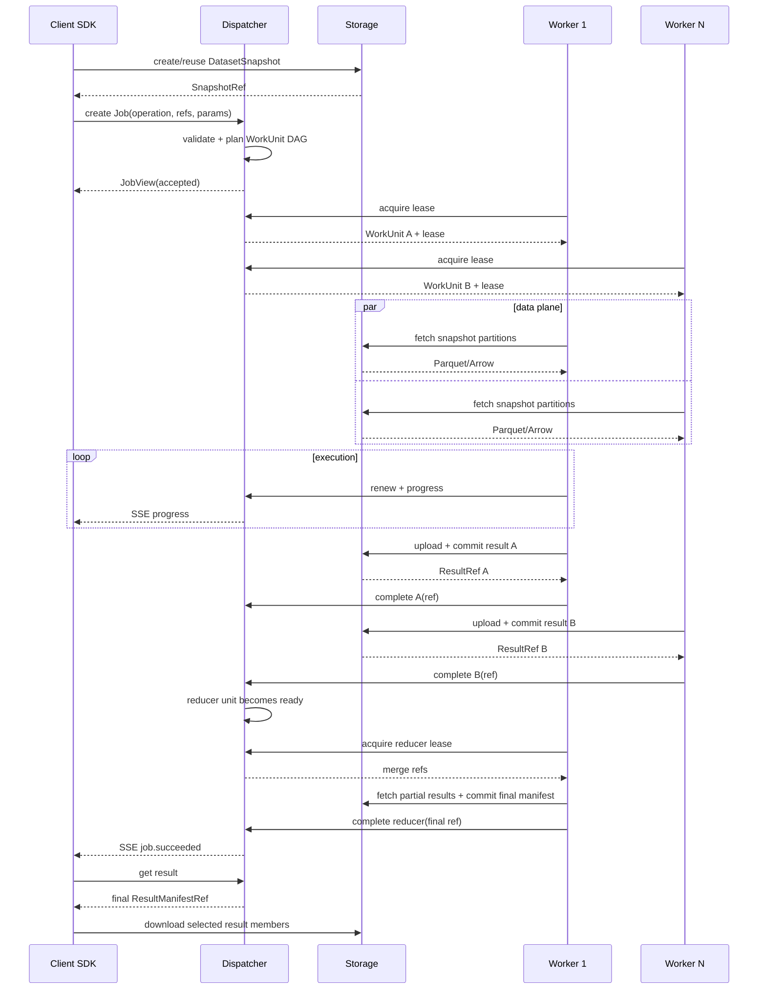

# StockStat V3.1 通信协议设计

> 版本：V3.1 设计稿
> 日期：2026-07-21
> 状态：完全重构协议，不兼容 V2/V3 Envelope/TaskSpec
> 关联：[DESIGN_ARCH_V31.md](DESIGN_ARCH_V31.md)、[DESIGN_ARCH_FOUNDATION_V31.md](DESIGN_ARCH_FOUNDATION_V31.md)

## 1. 协议目标

V3.1 协议服务于明确的金融任务架构：

```text
调用 Client -> 分发 Dispatcher -> {存储 Storage, N x 计算 Worker}
```

协议必须保证：

- Client 只提交金融 Job，不感知 Worker 和队列。
- Dispatcher 只传递控制信息和资源引用。
- Storage 承载不可变 DatasetSnapshot 和 Artifact。
- Worker 用租约获取 WorkUnit，直接读写 Storage。
- 本地组合与远程部署使用相同 DTO 和状态语义。
- 支持异步状态、取消、进度、partial、重试和断线恢复。
- 支持 PAXG v1-v7 所需的指标、统计、回测、搜索、模拟和验证 operation。

## 2. 与 V3 协议的取舍

### 2.1 保留的设计初衷

- Client、Dispatcher、Storage、Worker 四角色。
- 数据路径与控制路径分离。
- 任务类型可扩展。
- Worker capability、注册和健康状态。
- 异步任务、流式进度和结果引用。
- 本地/远程执行共享语义。

### 2.2 不保留的实现形态

| V3 设计 | V3.1 决策 | 原因 |
|---|---|---|
| 所有通信统一 `Envelope` | 使用资源式 HTTP DTO | HTTP 已提供方法、状态码、header、路由 |
| `TaskSpec(DataSpec/ComputeSpec/DispatchSpec)` | `JobSpec` + operation-specific parameters | 避免单体 ComputeSpec 字段膨胀 |
| 通用 `Transport` 五实现 | 首期规范 HTTP + InProcess service adapter | 当前真实部署不需要同时维护 TCP/Redis/SHM 消息栈 |
| cloudpickle/base64 数据和结果 | ArtifactRef + Arrow/Parquet | 体积、复现、安全、跨版本 |
| RedisTransport 兼作消息层 | Redis 不作为协议 | 队列实现不泄露给 Client/Worker 契约 |
| WebSocket 规划 | SSE 作为 Job 单向事件流 | Client 主要需要服务端推送，SSE 更简单可恢复 |
| 子 Dispatcher 消息原样转发 | 首期无级联 | 先完成单逻辑调度域的可靠性 |
| JSON/MessagePack 协商 | 控制面固定 JSON | 降低实现和调试复杂度，数据面已二进制化 |

### 2.3 核心判断

“协议与业务解耦”不等于“所有业务共享一个无类型 payload”。V3.1 以稳定资源模型和 operation schema 解耦：

- 通用层知道 Job、WorkUnit、Lease、ArtifactRef。
- 金融 operation 各自拥有参数 schema。
- HTTP API 不需要理解指标或回测算法。
- Dispatcher Planner 通过 operation 注册增量扩展。

## 3. 协议分层



## 4. 基础约定

### 4.1 URL 与版本

- 基础路径：`/v31`。
- 协议代号：`stockstat-v31`。
- HTTP 响应 header：`StockStat-Protocol: 3.1`。
- operation 独立版本：`backtest.run@1`。
- `/v31` 不表示 V3.1 每个补丁都换路径；破坏 HTTP 资源语义时才新增路径版本。

### 4.2 时间

- 所有控制面时间为 RFC 3339 UTC：`2026-07-21T12:34:56.123Z`。
- 不接受无时区时间。
- 业务交易所时区通过显式 `calendar_id/timezone` 表达。

### 4.3 ID

- 外部资源 ID 使用 UUIDv7 的带前缀字符串：`job_...`、`unit_...`。
- digest 格式：`sha256:<lowercase hex>`。
- ID 区分大小写，服务端生成 ID 使用小写。

### 4.4 JSON

- `Content-Type: application/json`。
- UTF-8。
- 禁止 NaN/Infinity。
- 金额或要求固定精度的参数使用 decimal string。
- 未声明字段默认返回 `400 SCHEMA_UNKNOWN_FIELD`。
- 响应可以增加可选字段；客户端必须忽略自己不使用的未知响应字段。

### 4.5 分页

列表 API 使用 cursor：

```json
{
  "items": [],
  "next_cursor": "opaque-token-or-null"
}
```

不使用 offset 作为大表默认分页方式。

### 4.6 请求关联

请求 headers：

| Header | 必填 | 说明 |
|---|---|---|
| `Authorization` | 远程是 | Bearer token 或 Worker credential |
| `Idempotency-Key` | 创建资源时是 | 调用方生成，作用域见各 API |
| `X-Request-ID` | 否 | 调用方请求 ID，缺失时服务端生成 |
| `Traceparent` | 否 | W3C Trace Context |
| `StockStat-Protocol` | 是 | `3.1` |

响应回显 `X-Request-ID` 和 trace 信息。

## 5. 内容类型

| 内容 | media type | 用途 |
|---|---|---|
| 控制面 | `application/json` | Job、Worker、Lease、manifest metadata |
| 事件流 | `text/event-stream` | Job progress/events |
| Arrow IPC | `application/vnd.apache.arrow.file` | 小型/交互式列式资产 |
| Parquet | `application/vnd.apache.parquet` | 市场快照和持久化表 |
| StrategyBundle | `application/vnd.stockstat.strategy+zip` | 策略代码资产 |
| 原始二进制 | `application/octet-stream` | 已声明 schema 的其他资产 |

控制面不嵌入大于服务配置阈值的二进制和 base64。

## 6. 通用资源引用

### 6.1 ArtifactRef

```json
{
  "artifact_id": "art_019b0f...",
  "kind": "experiment_table",
  "media_type": "application/vnd.apache.parquet",
  "schema_id": "experiment-table@1",
  "digest": "sha256:8a1f...",
  "size_bytes": 184203,
  "location": "artifact://art_019b0f...",
  "created_at": "2026-07-21T12:00:00Z"
}
```

### 6.2 SnapshotRef

```json
{
  "snapshot_id": "snap_019b0f...",
  "kind": "market_table",
  "digest": "sha256:7c21...",
  "schema_id": "market-snapshot@1"
}
```

### 6.3 CodeRef

```json
{
  "artifact_id": "art_strategy_...",
  "kind": "strategy_bundle",
  "digest": "sha256:...",
  "entrypoint": "strategies:WeekendRangeStrategy",
  "strategy_api": "strategy@1"
}
```

## 7. Client -> Dispatcher Job API

### 7.1 创建 Job

`POST /v31/jobs`

Headers：

```text
Idempotency-Key: paxg-v5-batch-20260721
StockStat-Protocol: 3.1
```

请求：

```json
{
  "operation": "backtest.run@1",
  "inputs": {
    "market": {
      "snapshot_id": "snap_019b0f..."
    },
    "strategy": {
      "artifact_id": "art_strategy_..."
    }
  },
  "parameters": {
    "initial_cash": 10000.0,
    "allow_short": true,
    "periods_per_year": 52,
    "cost_model": {
      "id": "cost.binance@1",
      "params": {
        "venue": "futures",
        "bnb_discount": true,
        "slippage": 0.0
      }
    },
    "execution_policy": {
      "id": "execution.intrabar@1",
      "params": {
        "parent_tf": "1d",
        "intrabar_tf": "1h",
        "ambiguity_rule": "conservative"
      }
    }
  },
  "policy": {
    "priority": 50,
    "max_attempts": 2,
    "execution_timeout_seconds": 600,
    "deadline": null,
    "result_retention_days": 30,
    "labels": {
      "research": "PAXG-v5"
    }
  },
  "client": {
    "name": "stockstat-python",
    "version": "3.1.0"
  }
}
```

响应：`202 Accepted`

```json
{
  "job_id": "job_019b0f...",
  "operation": "backtest.run@1",
  "state": "accepted",
  "state_version": 1,
  "created_at": "2026-07-21T12:00:00Z",
  "links": {
    "self": "/v31/jobs/job_019b0f...",
    "events": "/v31/jobs/job_019b0f.../events",
    "result": "/v31/jobs/job_019b0f.../result"
  }
}
```

幂等规则：

- 同租户、同 `Idempotency-Key`、同 request digest：返回原 Job，`200 OK` 或相同 `202` 语义。
- 同 key、不同 request digest：`409 IDEMPOTENCY_KEY_REUSED`。

### 7.2 JobView

`GET /v31/jobs/{job_id}`

```json
{
  "job_id": "job_...",
  "operation": "experiment.grid_search@1",
  "state": "running",
  "state_version": 14,
  "progress": {
    "completed_units": 24,
    "total_units": 64,
    "fraction": 0.375,
    "phase": "backtest"
  },
  "counts": {
    "ready": 16,
    "leased": 8,
    "running": 8,
    "succeeded": 24,
    "failed": 0,
    "cancelled": 0
  },
  "created_at": "...",
  "started_at": "...",
  "finished_at": null,
  "result": null,
  "error": null
}
```

### 7.3 列表

`GET /v31/jobs?state=running&operation=backtest.run@1&cursor=...&limit=100`

支持 tenant 范围内过滤，不允许普通用户跨租户查询。

### 7.4 取消

`POST /v31/jobs/{job_id}/cancel`

请求：

```json
{
  "reason": "user_requested"
}
```

响应：

- `202`：取消已请求。
- `200`：Job 已 cancelled。
- `409 JOB_TERMINAL`：已经 succeeded/failed，不能取消。

取消请求本身幂等。

### 7.5 结果

`GET /v31/jobs/{job_id}/result`

未完成：`409 JOB_NOT_SUCCEEDED`。

完成：

```json
{
  "job_id": "job_...",
  "state": "succeeded",
  "manifest": {
    "artifact_id": "art_manifest_...",
    "kind": "backtest_result",
    "digest": "sha256:...",
    "media_type": "application/json",
    "schema_id": "backtest-result-manifest@1",
    "size_bytes": 1832,
    "location": "artifact://art_manifest_...",
    "created_at": "..."
  },
  "summary": {
    "total_return": 0.003725,
    "max_drawdown": -0.012,
    "trades": 24
  }
}
```

summary 是可选小型索引，不替代 manifest。

## 8. Job 事件流

### 8.1 SSE 端点

`GET /v31/jobs/{job_id}/events`

Headers：

```text
Accept: text/event-stream
Last-Event-ID: 103
```

响应示例：

```text
id: 104
event: unit.succeeded
data: {"job_id":"job_...","unit_id":"unit_...","sequence":104,"progress":{"completed_units":25,"total_units":64,"fraction":0.390625}}

id: 105
event: partial.available
data: {"job_id":"job_...","sequence":105,"artifact":{"artifact_id":"art_partial_...","kind":"experiment_table"}}

id: 106
event: job.succeeded
data: {"job_id":"job_...","sequence":106,"result":{"artifact_id":"art_manifest_..."}}

```

### 8.2 事件类型

| event | 说明 |
|---|---|
| `job.accepted` | 已接受 |
| `job.planning` | 规划中 |
| `job.queued` | 可调度 |
| `unit.leased` | Unit 分配 |
| `unit.started` | Worker 开始执行 |
| `unit.progress` | 结构化进度 |
| `partial.available` | partial Artifact 可读 |
| `unit.retry_scheduled` | 已安排重试 |
| `unit.succeeded` | Unit 完成 |
| `unit.failed` | Unit 终态失败 |
| `job.cancelling` | 取消中 |
| `job.cancelled` | 已取消 |
| `job.succeeded` | Job 成功 |
| `job.failed` | Job 失败 |

### 8.3 恢复规则

- `sequence` 对单 Job 单调递增。
- `Last-Event-ID` 小于最早保留事件时返回 `410 EVENT_CURSOR_EXPIRED`，客户端改用 JobView 获取快照后重新订阅。
- SSE 仅作为通知，事实状态以 JobView/JobStore 为准。

## 9. Client -> Storage API

### 9.1 Instrument 与 coverage

- `GET /v31/instruments`
- `GET /v31/instruments/{instrument_id}`
- `GET /v31/instruments/{instrument_id}/coverage`

### 9.2 采集请求

`POST /v31/ingests`

```json
{
  "source": "binance",
  "instrument": "crypto:binance:PAXG/USDT",
  "timeframe": "1h",
  "start": "2020-08-28T00:00:00Z",
  "end": "2026-07-16T00:00:00Z",
  "mode": "upsert_revision"
}
```

返回 ingest resource；调用方可轮询或由 Dispatcher 包装为 `market.ingest@1` Job。

### 9.3 创建 Snapshot

`POST /v31/snapshots`

```json
{
  "query": {
    "instruments": [
      "crypto:binance:PAXG/USDT",
      "crypto:binance:BTC/USDT"
    ],
    "timeframes": ["1d", "1h"],
    "start": "2020-08-28T00:00:00Z",
    "end": "2026-07-16T00:00:00Z",
    "fields": ["open", "high", "low", "close", "volume"],
    "revision_policy": "latest_before_snapshot",
    "adjustment": "raw",
    "timezone": "UTC",
    "quality_policy": "research_strict@1"
  },
  "materialization": "manifest"
}
```

响应 `201 Created` 或幂等返回现有 snapshot。

### 9.4 Snapshot manifest

`GET /v31/snapshots/{snapshot_id}`

返回 partitions、schema、lineage、digest 和统计摘要。

## 10. Artifact 数据面

### 10.1 读取 Artifact 元数据

`GET /v31/artifacts/{artifact_id}`

返回 ArtifactRef 和成员/lineage 摘要。

### 10.2 获取下载 locator

`POST /v31/artifacts/{artifact_id}/download`

请求：

```json
{
  "preferred_protocols": ["https", "file"],
  "expires_in_seconds": 300
}
```

响应：

```json
{
  "locator": {
    "protocol": "https",
    "url": "https://blob/...signed...",
    "expires_at": "..."
  },
  "digest": "sha256:...",
  "size_bytes": 184203
}
```

`file` 只对同机可信 Worker 返回；Client 默认只得到 HTTPS。

### 10.3 创建上传 session

`POST /v31/upload-sessions`

```json
{
  "owner": {
    "attempt_id": "attempt_...",
    "lease_id": "lease_..."
  },
  "artifacts": [
    {
      "name": "equity",
      "kind": "market_table",
      "media_type": "application/vnd.apache.parquet",
      "schema_id": "equity-table@1",
      "size_bytes": 81234,
      "digest": "sha256:..."
    }
  ]
}
```

Storage 返回每个成员的 upload target。

### 10.4 上传与 commit

1. Worker 对 target 使用 `PUT` 上传 bytes。
2. `POST /v31/upload-sessions/{upload_id}/commit` 提交 manifest。
3. Storage 校验 size、digest、schema 和 owner lease scope。
4. 成功返回 committed ArtifactManifestRef。

未 commit 的上传不对其他调用方可见。

## 11. Worker 注册协议

### 11.1 注册

`POST /v31/workers/register`

```json
{
  "worker_id": "worker_019b...",
  "session_id": "wsess_019b...",
  "alias": "cpu-node-a",
  "agent_version": "3.1.0",
  "protocol_versions": ["3.1"],
  "kernel_version": "3.1.0",
  "capability_manifest_digest": "sha256:...",
  "capabilities": [
    {
      "operation": "backtest.run@1",
      "implementation_version": "1.0.0",
      "security_profiles": ["builtin", "signed_strategy"],
      "resource_classes": ["cpu-small", "cpu-large"]
    },
    {
      "operation": "statistics.hypothesis@1",
      "implementation_version": "1.0.0",
      "security_profiles": ["builtin"],
      "resource_classes": ["cpu-small"]
    }
  ],
  "resources": {
    "cpu": {"architecture": "x86_64", "logical_cores": 16},
    "memory_mb": 65536,
    "temporary_disk_mb": 200000,
    "gpus": []
  },
  "pools": [
    {"name": "cpu-small", "slots": 6, "memory_mb_per_slot": 4096},
    {"name": "cpu-large", "slots": 1, "memory_mb_per_slot": 24576}
  ],
  "labels": {"zone": "lab-a"}
}
```

响应：

```json
{
  "registration_id": "wreg_...",
  "heartbeat_interval_seconds": 10,
  "lease_defaults": {
    "duration_seconds": 30,
    "renew_after_seconds": 10
  },
  "server_time": "..."
}
```

相同 worker_id 新 session 注册时，旧 session 进入 offline；旧 session 的后续请求被拒绝。

### 11.2 心跳

`POST /v31/workers/{worker_id}/heartbeat`

```json
{
  "session_id": "wsess_...",
  "sequence": 81,
  "status": "online",
  "pools": [
    {"name": "cpu-small", "free_slots": 4, "running": 2},
    {"name": "cpu-large", "free_slots": 1, "running": 0}
  ],
  "load": {
    "cpu_percent": 31.2,
    "memory_used_mb": 12031,
    "temporary_disk_free_mb": 180223
  },
  "cache": {
    "size_bytes": 1048576000,
    "hot_digests": ["sha256:...", "sha256:..."]
  }
}
```

心跳不续租具体 attempt；每个 lease 必须单独 renew，避免 Agent 活着但任务子进程已死时错误续租。

## 12. Worker Lease API

### 12.1 获取任务

`POST /v31/workers/{worker_id}/leases/acquire`

```json
{
  "session_id": "wsess_...",
  "pool": "cpu-small",
  "free_slots": 2,
  "max_assignments": 2,
  "accepted_operations": ["backtest.run@1", "statistics.hypothesis@1"],
  "cache_hints": ["sha256:..."]
}
```

无任务：`204 No Content`，可带 `Retry-After: 1`。

有任务：`200 OK`

```json
{
  "assignments": [
    {
      "lease": {
        "lease_id": "lease_...",
        "attempt_id": "attempt_...",
        "token": "opaque-secret",
        "expires_at": "2026-07-21T12:00:30Z",
        "renew_after_seconds": 10
      },
      "unit": {
        "unit_id": "unit_...",
        "job_id": "job_...",
        "operation": "backtest.run@1",
        "inputs": {
          "market": {"snapshot_id": "snap_..."},
          "strategy": {"artifact_id": "art_strategy_..."}
        },
        "parameters": {"...": "..."},
        "partition": {"index": 3, "count": 16},
        "requires": {
          "resource_class": "cpu-small",
          "security_profile": "signed_strategy"
        },
        "environment": {
          "kernel_version": "3.1.0",
          "operation_implementation": "1.0.0",
          "random_seed": 1782381
        }
      }
    }
  ]
}
```

### 12.2 开始执行

`POST /v31/attempts/{attempt_id}/start`

Header：`X-Lease-Token: opaque-secret`

```json
{
  "worker_id": "worker_...",
  "session_id": "wsess_...",
  "started_at": "...",
  "runtime": {
    "pid": 4312,
    "workspace_id": "task-..."
  }
}
```

### 12.3 续租

`POST /v31/leases/{lease_id}/renew`

```json
{
  "attempt_id": "attempt_...",
  "progress": {
    "completed": 125,
    "total": 1000,
    "fraction": 0.125,
    "phase": "simulation"
  },
  "metrics": {
    "cpu_seconds": 8.2,
    "memory_mb": 731
  }
}
```

响应：

```json
{
  "expires_at": "...",
  "cancel_requested": false,
  "job_deadline": null
}
```

错误：

- `409 STALE_LEASE`：已被新 attempt 取代。
- `410 LEASE_EXPIRED`：不可再续。
- `409 JOB_CANCELLING`：应终止。

### 12.4 progress/partial

高频 progress 随 renew 发送。需要立即公布 partial 时：

`POST /v31/attempts/{attempt_id}/partials`

```json
{
  "sequence": 3,
  "artifact": {"artifact_id": "art_partial_..."},
  "summary": {"completed_trials": 250}
}
```

### 12.5 完成

`POST /v31/attempts/{attempt_id}/complete`

```json
{
  "lease_id": "lease_...",
  "unit_id": "unit_...",
  "result": {"artifact_id": "art_result_manifest_..."},
  "result_digest": "sha256:...",
  "metrics": {
    "duration_ms": 1821,
    "cpu_seconds": 1.73,
    "peak_memory_mb": 184
  },
  "environment_digest": "sha256:..."
}
```

响应：

- `200 {"status":"committed"}`。
- 重发相同 digest：`200 {"status":"duplicate"}`。
- 相同 attempt 不同 digest：`409 ATTEMPT_RESULT_CONFLICT`。
- 旧 lease：`409 STALE_LEASE`。

### 12.6 失败

`POST /v31/attempts/{attempt_id}/fail`

```json
{
  "lease_id": "lease_...",
  "error": {
    "code": "RESOURCE_MEMORY_EXCEEDED",
    "category": "resource",
    "message": "task exceeded 4096 MB",
    "retryable": true,
    "details": {"peak_memory_mb": 4281},
    "diagnostic_artifact_id": "art_diag_..."
  },
  "metrics": {
    "duration_ms": 4812,
    "peak_memory_mb": 4281
  }
}
```

Worker 提供 `retryable` 是建议，Dispatcher 以错误码、operation policy 和 attempt 数最终判断。

### 12.7 cancelled

`POST /v31/attempts/{attempt_id}/cancelled`

表示 Worker 已响应取消并清理。

## 13. Job 与 WorkUnit 状态

### 13.1 JobState

| 状态 | 终态 | 说明 |
|---|---|---|
| `accepted` | 否 | 已持久化 |
| `planning` | 否 | 解析快照和 DAG |
| `queued` | 否 | 至少有 ready 或等待依赖 Unit |
| `running` | 否 | 至少一个 Unit running/succeeded，Job 未完成 |
| `cancelling` | 否 | 停止新 lease，等待运行单元终止 |
| `cancelled` | 是 | 取消完成 |
| `succeeded` | 是 | 最终 manifest committed |
| `failed` | 是 | 不可恢复失败 |

### 13.2 WorkUnitState

| 状态 | 说明 |
|---|---|
| `blocked` | 等待依赖 |
| `ready` | 可调度 |
| `leased` | 已发 lease，未 start |
| `running` | 已 start |
| `committing` | 结果写 Storage 中，可选内部状态 |
| `succeeded` | 成功 |
| `failed` | attempts 耗尽 |
| `cancelled` | 被取消 |

### 13.3 AttemptState

`created`、`started`、`succeeded`、`failed`、`lost`、`cancelled`、`stale`。

## 14. Operation 参数协议

### 14.1 参数 schema

Job 顶层稳定，`parameters` 按 operation 校验。示例：

#### Indicator

```json
{
  "operation": "indicator.compute@1",
  "parameters": {
    "indicators": [
      {
        "id": "trend.ma@1",
        "inputs": ["close"],
        "params": {"window": 20},
        "output": "ma20"
      }
    ]
  }
}
```

#### Hypothesis

```json
{
  "operation": "statistics.hypothesis@1",
  "parameters": {
    "tests": [
      {"id": "x4-range", "method": "pearson", "x": "x4_range", "y": "monday_range"},
      {"id": "path", "method": "chi_square", "x": "signal_sign", "y": "path_up_first"}
    ],
    "missing": "drop_pairwise"
  }
}
```

#### Grid Search

```json
{
  "operation": "experiment.grid_search@1",
  "inputs": {
    "market": {"snapshot_id": "snap_..."},
    "strategy": {"artifact_id": "art_strategy_..."}
  },
  "parameters": {
    "base_backtest": {"...": "BacktestParameters"},
    "parameter_space": {
      "short": [3, 5, 8],
      "long": [10, 20, 30]
    },
    "objective": {"metric": "sharpe", "direction": "maximize"},
    "batch_size": 4
  }
}
```

### 14.2 schema 发现

`GET /v31/operations`

`GET /v31/operations/{operation}`

返回 descriptor 和 parameter/result schema refs，供 SDK/CLI/Admin 展示。普通用户不能注册新 operation；安装 capability 包后由服务端发布。

## 15. 错误协议

### 15.1 Problem 响应

错误响应采用统一结构：

```json
{
  "type": "https://stockstat.dev/problems/schema-validation",
  "title": "Job parameters are invalid",
  "status": 400,
  "code": "SCHEMA_VALIDATION_FAILED",
  "detail": "execution_policy.params.intrabar_tf is required",
  "instance": "/v31/jobs",
  "request_id": "req_...",
  "trace_id": "...",
  "retryable": false,
  "errors": [
    {
      "path": "parameters.execution_policy.params.intrabar_tf",
      "message": "field required"
    }
  ]
}
```

### 15.2 主要状态码

| HTTP | 场景 |
|---|---|
| `400` | schema/参数错误 |
| `401` | 未认证 |
| `403` | 无权限 |
| `404` | 资源不存在或不可见 |
| `409` | 状态冲突、stale lease、幂等冲突 |
| `410` | lease/event cursor 已过期 |
| `413` | 请求或 Artifact 超限 |
| `415` | media type 不支持 |
| `422` | 金融语义校验失败，例如数据范围不足 |
| `429` | 限流/配额 |
| `500` | 内部错误 |
| `503` | 依赖服务不可用 |

### 15.3 错误码稳定性

客户端根据 `code` 而非英文 message 分支。message 可改进，code 在同一协议主版本中保持稳定。

## 16. 安全协议

### 16.1 Client

- HTTPS。
- Bearer/OIDC token。
- tenant、role、scope。
- 典型 scope：`jobs:submit`、`jobs:read`、`market:write`、`artifacts:read`。

### 16.2 Worker

- 推荐 mTLS + worker credential。
- 注册 credential 与普通 Client token 分离。
- lease token 绑定 attempt、worker session 和过期时间。
- upload session 绑定 lease scope。

### 16.3 StrategyBundle

- digest 必须匹配。
- 生产要求签名或可信发行者。
- manifest 声明 strategy API 和入口。
- Worker 选择 `signed_strategy` capability 才能获取此 Unit。

### 16.4 重放防护

- Idempotency-Key 防创建重放。
- lease token 短期且 attempt 单次提交。
- 上传 commit 带 digest。
- Worker sequence 防旧 session 心跳覆盖。

## 17. 版本演进

### 17.1 三种版本

| 层级 | 示例 | 何时升级 |
|---|---|---|
| HTTP protocol | `3.1` | 资源/认证/状态语义破坏变化 |
| operation | `backtest.run@1` | 参数或结果金融语义破坏变化 |
| schema | `backtest-result-manifest@1` | 资产 schema 破坏变化 |

### 17.2 兼容增加

- 响应增加可选字段。
- 新增 operation。
- 新增 capability/resource class。
- 新增 Artifact kind。

### 17.3 破坏变更

- 参数含义改变。
- 状态机含义改变。
- 结果字段单位/定义改变。
- 订单撮合语义改变。

此时新增 operation/schema 主版本，不依赖“旧端忽略未知字段”掩盖语义变化。

### 17.4 协商

首期不做复杂 codec 协商。Worker 注册明确支持的 protocol versions；不支持 `3.1` 时注册失败 `PROTOCOL_VERSION_UNSUPPORTED`。

## 18. 本地 InProcess 协议

Local Session 不需要把每个 DTO 真正编码成 HTTP，但必须实现相同 service interfaces：

```python
class JobService(Protocol):
    def create_job(request, context) -> JobView: ...
    def get_job(job_id, context) -> JobView: ...
    def cancel_job(job_id, context) -> JobView: ...
    def stream_events(job_id, after, context): ...

class StorageService(Protocol):
    def create_snapshot(request, context) -> SnapshotView: ...
    def get_artifact(artifact_id, context) -> ArtifactView: ...
```

要求：

- DTO 与远程 JSON schema 相同。
- 状态机、幂等、租约和 Artifact commit 不得绕过。
- 集成测试可启用 `serialize_boundaries=true`，强制 canonical JSON roundtrip。

不再设计通用 `Transport.send/receive`，因为应用需要的是资源服务语义，而不是裸消息管道。

## 19. 完整时序



## 20. 协议测试

### 20.1 Contract tests

- OpenAPI/JSON schema golden。
- 合法和非法 JobSpec。
- operation 参数 schema。
- Error Problem schema。
- SSE event schema 和 sequence。
- Artifact/Snapshot manifest roundtrip。

### 20.2 Idempotency

- create Job 同 key 同 body。
- 同 key 不同 body 冲突。
- complete 重发。
- Artifact commit 重发。
- cancel 重发。

### 20.3 Lease

- acquire 竞争。
- renew 成功/过期/stale。
- Worker session 替换。
- complete 与 lease expiry 竞态。
- cancel 与 complete 竞态。

### 20.4 数据面

- digest 校验。
- 上传中断和 commit 原子性。
- signed URL 过期。
- file locator 权限。
- 50MB/500MB 资产不经过 Dispatcher。

### 20.5 Local/Remote parity

同一 JobSpec 在 InProcess 和 HTTP 部署：

- 状态序列等价。
- 最终 manifest schema 等价。
- 金融结果数值等价。
- 错误码等价。

## 21. 结论

V3.1 协议不再追求“裸消息传输的最大通用性”，而是为金融任务提供更严格、更可靠的资源协议。HTTP/JSON 控制面、SSE 事件流、Artifact 数据面、operation schema 和 Worker lease 共同实现调用、分发、存储与 N 个计算节点的独立部署，并为本地组合提供完全一致的执行语义。
