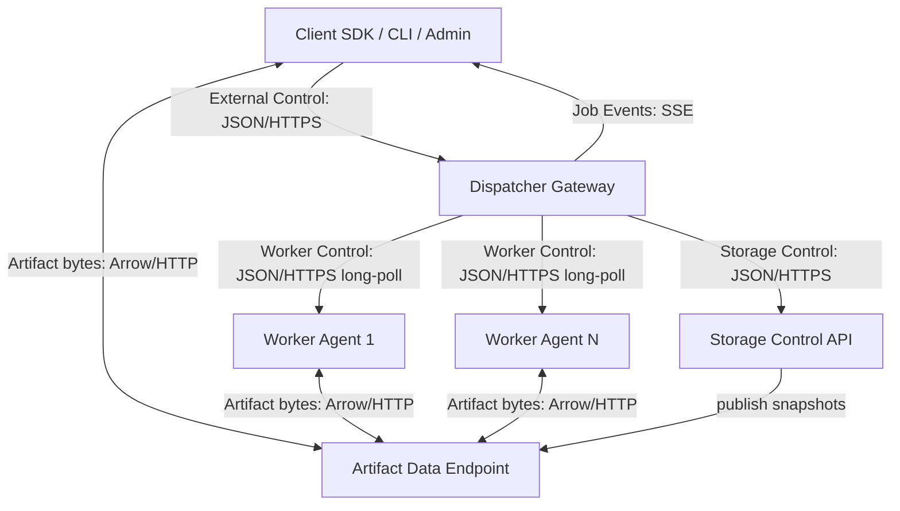
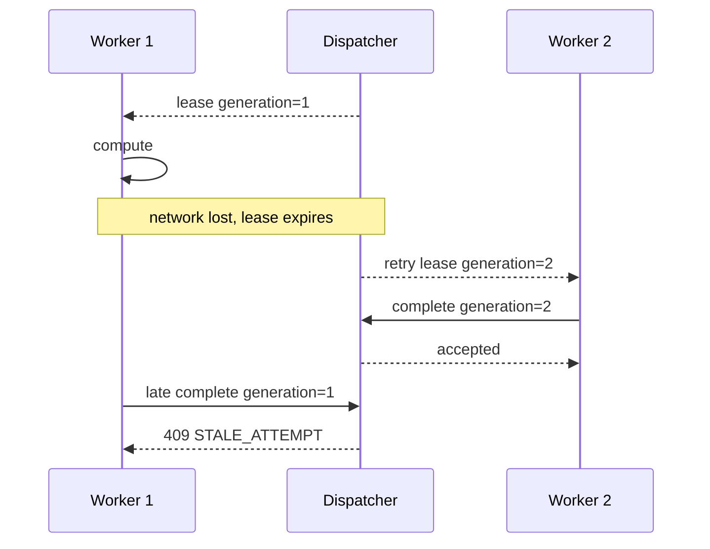
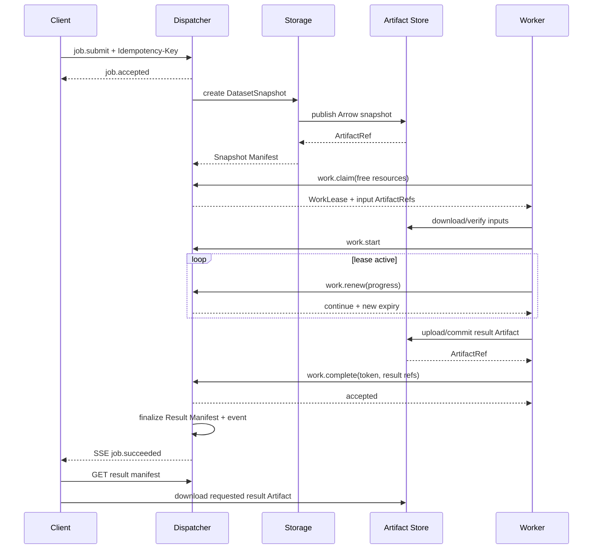
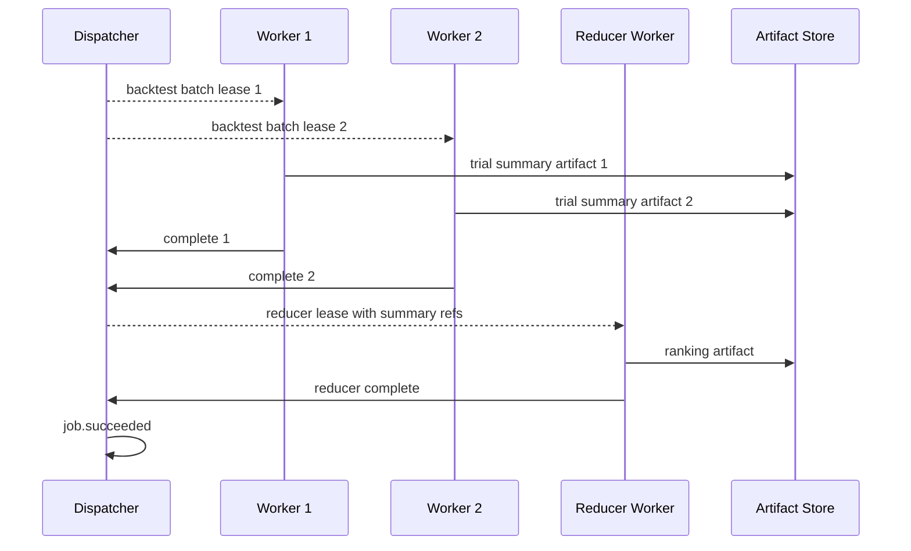

# StockStat V3.1 通讯协议设计

> 协议版本：3.1
> 日期：2026-07-20
> 状态：V3.1 设计稿
> 关联：[DESIGN_ARCH_V31.md](DESIGN_ARCH_V31.md) | [DESIGN_ARCH_FOUNDATION_V31.md](DESIGN_ARCH_FOUNDATION_V31.md)

## 1. 目标与范围

V3.1 协议服务于一个明确的金融任务架构：

```text
调用 Client -> 分发 Dispatcher -> {Storage, N x Worker}
```

协议目标：

| 目标 | V3.1 方式 |
|---|---|
| 调用与部署解耦 | HTTP Channel 与 Embedded Channel 使用同一 Contracts |
| 控制/事件/数据分离 | JSON 控制、SSE 事件、Arrow/Artifact 字节流 |
| 大数据不穿控制队列 | 控制消息只携带 ArtifactRef |
| 可靠重试 | WorkUnit/Attempt 分离，Lease + fencing token |
| 幂等 | submit、upload commit、complete 均有稳定幂等键 |
| 金融任务可扩展 | capability ID/version + 独立参数 schema |
| 可复现 | DatasetSnapshot、策略/Kernel 版本、seed 全量记录 |
| 可观察 | trace、JobEvent sequence、结构化错误 |
| 安全 | 无跨网 pickle；策略包签名；Client/Worker 独立身份 |

不在首版协议范围内：

- 任意用户 DAG 协议。
- 任意 Python 函数 RPC。
- 多级 Dispatcher 原样消息转发。
- Redis pub/sub 作为公开节点协议。
- 共享内存 URI 作为跨机合同。
- 自动猜测 JSON/MessagePack 编码。

## 2. 协议平面



### 2.1 External Control Plane

方向：Client ↔ Dispatcher。

内容：Job 提交、查询、取消、结果、能力和集群查询。消息小、类型化、可幂等。

### 2.2 Worker Control Plane

方向：Worker ↔ Dispatcher。

内容：注册、心跳、claim、lease renew、进度、partial 引用、complete、fail、release。Worker 采用 pull 模式，Dispatcher 不要求反向连接 Worker。

### 2.3 Storage Control Plane

方向：Dispatcher/Client/Worker ↔ Storage。

内容：Dataset selector 解析、Snapshot 创建、Artifact upload/download session 和 metadata。大型 bytes 不在此平面的 JSON body 中。

### 2.4 Event Plane

方向：Dispatcher → Client。

首版使用 Server-Sent Events。事件来自持久 JobEvent Log，可按 sequence 续读；轮询 Job status 是降级路径。

### 2.5 Artifact Data Plane

方向：Producer/Consumer ↔ Artifact endpoint。

内容：Arrow、Parquet、策略 bundle、模型、检查点和其他不可变 bytes。支持分块、Range、摘要校验和对象存储签名 URL。

## 3. 逻辑 Channel

协议定义 Channel，而不是把每个底层中间件都暴露成业务 Transport。

| Channel | 生产实现 | 本地实现 | 语义 |
|---|---|---|---|
| `ControlChannel` | HTTPS JSON | Embedded function adapter | request/response command/query |
| `EventChannel` | SSE over HTTPS | Embedded event iterator | 持久事件流 |
| `ArtifactChannel` | HTTPS/object store | Local filesystem/mmap | 不可变 bytes 上传下载 |

Redis、PostgreSQL notify、内存 queue、S3 SDK 和共享内存是服务内部 adapter，不改变 Job/Lease/Artifact 协议。

Embedded Channel 可在性能模式中省略实际 HTTP，但必须经过相同 Pydantic model 和 command handler。合同测试提供强制 JSON/Arrow round-trip 模式，防止本地路径依赖不可序列化对象。

## 4. ControlMessage 信封

所有 JSON 控制请求、响应和持久事件使用统一逻辑信封：

```json
{
  "protocol": "stockstat-control",
  "protocol_version": "3.1",
  "message_type": "job.submit",
  "message_id": "0190f4e6-9e1e-7b0a-a7b1-9b22bcb3cf17",
  "correlation_id": null,
  "causation_id": null,
  "sent_at": "2026-07-20T10:30:00.123456Z",
  "deadline_at": null,
  "trace": {
    "traceparent": "00-...-...-01",
    "tracestate": null
  },
  "content_schema": "stockstat.job.submit/1",
  "content": {}
}
```

### 4.1 字段定义

| 字段 | 必填 | 说明 |
|---|---|---|
| `protocol` | 是 | 固定 `stockstat-control` |
| `protocol_version` | 是 | 控制协议 major.minor，首版 `3.1` |
| `message_type` | 是 | 稳定消息类型 |
| `message_id` | 是 | UUIDv7，单条消息唯一 |
| `correlation_id` | 否 | 请求/响应关联，响应指向请求 message ID |
| `causation_id` | 否 | 事件因果来源，例如 complete 导致 job.succeeded |
| `sent_at` | 是 | RFC 3339 UTC |
| `deadline_at` | 否 | 消息处理绝对 deadline，不代表 Job deadline |
| `trace` | 否 | W3C trace context |
| `content_schema` | 是 | payload schema ID/major |
| `content` | 是 | 对应 schema 的 JSON object |

除 `/v31/meta`、原始市场数据响应和 Artifact bytes endpoint 外，所有 JSON 控制响应以及所有 POST 控制请求都使用 `ControlMessage`。GET 请求通过 path/query 表达查询，响应仍使用 `ControlMessage`。

为提高可读性，本文后续多数“请求/响应”示例只展示 `content`；实现时必须包入第 4 节信封。Endpoint 与 `message_type` 必须匹配，不允许把 `work.complete` 发送到 Job submit 路径。

### 4.2 明确删除的 V3 Headers

| V3 字段 | V3.1 处理 |
|---|---|
| `data_codec` | 放入 ArtifactRef metadata |
| `strategy_codec` | 策略用 StrategyRef，不支持 cloudpickle codec |
| `encoding` | HTTP `Content-Type` 显式协商；首版 JSON |
| `data_ref` | 放入输入绑定中的 ArtifactRef |
| `retry_count` | Attempt/ExecutionPolicy 持久字段 |
| `priority` | JobSpec.execution.priority |
| `timeout` | Job deadline / WorkUnit deadline |
| `accepted_codecs` | `/meta` 和 HTTP Accept 协商，不每条消息重复 |
| `reply_to` | 使用 correlation/causation，不承担路由目标语义 |

### 4.3 JSON 约束

- UTF-8。
- `Content-Type: application/vnd.stockstat.control+json; version=3.1`。
- 最大控制消息默认 1 MiB。
- 禁止 NaN、Infinity、bytes、Python repr 和 `default=str`。
- Canonical JSON 用于摘要、签名和幂等冲突检测。
- 未知 major schema 拒绝；同 major 的未知可选字段按 schema 策略处理。
- 首版不自动检测 MessagePack。未来若需要，使用明确 media type 和版本协商。

## 5. 协议发现与版本协商

### 5.1 Meta endpoint

```text
GET /v31/meta
```

响应：

```json
{
  "service": "dispatcher",
  "service_version": "3.1.0",
  "protocol_versions": ["3.1"],
  "control_media_types": ["application/vnd.stockstat.control+json"],
  "event_media_types": ["text/event-stream"],
  "artifact_media_types": [
    "application/vnd.apache.arrow.stream",
    "application/vnd.apache.parquet",
    "application/vnd.stockstat.manifest+json",
    "application/octet-stream"
  ],
  "limits": {
    "max_control_bytes": 1048576,
    "max_job_inputs": 64,
    "max_job_fanout": 100000
  }
}
```

### 5.2 版本规则

- 协议 major 不兼容时拒绝。
- minor 只允许增加可选字段、消息类型和 endpoint。
- 行为破坏性变化升级协议 major。
- 金融能力版本独立协商，不随协议 minor 自动变化。
- Artifact schema 也独立版本化。

请求可携带：

```text
StockStat-Protocol-Version: 3.1
Accept: application/vnd.stockstat.control+json; version=3.1
```

## 6. JobSpec

### 6.1 `job.submit`

```json
{
  "protocol": "stockstat-control",
  "protocol_version": "3.1",
  "message_type": "job.submit",
  "message_id": "0190...",
  "sent_at": "2026-07-20T10:30:00Z",
  "content_schema": "stockstat.job.submit/1",
  "content": {
    "name": "BTC MA cross grid search",
    "operation": {
      "capability_id": "finance.experiment.search",
      "capability_version": "1.0",
      "parameters": {
        "method": "grid",
        "base_operation": {
          "capability_id": "finance.backtest.run",
          "capability_version": "1.0",
          "parameters": {
            "strategy": {
              "kind": "python_package",
              "name": "ma-cross",
              "version": "1.0.0",
              "entrypoint": "research.strategies:build",
              "artifact": {"artifact_id": "...", "sha256": "..."},
              "config": {}
            },
            "initial_cash": 10000.0,
            "cost_model": {"id": "cost.binance_spot", "version": "1", "params": {}},
            "fill_model": {"id": "fill.next_open", "version": "1", "params": {}}
          }
        },
        "parameter_space": {
          "short": [3, 5, 8],
          "long": [10, 20, 30]
        },
        "objective": {"metric": "sharpe", "direction": "maximize"}
      }
    },
    "inputs": [
      {
        "name": "market_data",
        "dataset": {
          "instruments": [
            {"asset_class": "crypto", "symbol": "BTC/USDT", "venue": "binance"}
          ],
          "timeframe": "1d",
          "start": "2024-01-01T00:00:00Z",
          "end": "2025-01-01T00:00:00Z",
          "source_policy": {"mode": "exact", "source": "binance"},
          "snapshot_policy": "pin_on_submit"
        }
      }
    ],
    "execution": {
      "priority": 50,
      "deadline_at": "2026-07-20T12:30:00Z",
      "max_attempts": 3,
      "retry_backoff": {"initial_seconds": 1, "factor": 2, "max_seconds": 60},
      "resources": null,
      "worker_labels": {},
      "partitioning": {"mode": "auto"}
    },
    "outputs": {
      "retain_for_seconds": 2592000,
      "detail_level": "standard",
      "emit_partials": true
    },
    "tags": {"project": "paxg-research"}
  }
}
```

### 6.2 Job submit 规则

- `job_id` 由 Dispatcher 生成。
- Client 使用 HTTP `Idempotency-Key`；不把自生成 task ID 当幂等保障。
- `operation.parameters` 由 capability schema 校验。
- `inputs` 只能是 DatasetSelector 或完整 ArtifactRef。
- DataFrame/Series 必须先上传，再提交 ArtifactRef。
- Job submit 接受后不依赖 Client 保持连接。
- `execution.partitioning` 是偏好；最终计划由 Capability Planner 决定。

### 6.3 Idempotency-Key

作用域：`principal + endpoint + key`。

行为：

| 情况 | 响应 |
|---|---|
| 首次 key | 创建 Job，202 |
| 相同 key + 相同 canonical request | 返回同一 Job，200/202 |
| 相同 key + 不同 request digest | 409 `IDEMPOTENCY_CONFLICT` |
| key 超过保留期 | 可视为新请求，保留期由 meta 声明 |

## 7. Job 消息与 HTTP API

### 7.1 Endpoint 表

| 方法 | 路径 | 消息/结果 | 状态码 |
|---|---|---|---|
| `POST` | `/v31/jobs` | `job.submit` -> `job.accepted/rejected` | 202/4xx |
| `GET` | `/v31/jobs/{job_id}` | `job.status.reply` | 200/404 |
| `POST` | `/v31/jobs/{job_id}/cancel` | `job.cancel` -> receipt | 202/200 |
| `GET` | `/v31/jobs/{job_id}/events` | SSE JobEvent | 200 |
| `GET` | `/v31/jobs/{job_id}/result` | Result Manifest | 200/409/404 |
| `GET` | `/v31/jobs` | 分页 Job summary | 200 |
| `GET` | `/v31/capabilities` | 可用金融能力 | 200 |
| `GET` | `/v31/cluster` | Worker/资源聚合 | 200 |
| `POST` | `/v31/workers/{worker_id}/drain` | 管理命令 | 202 |
| `POST` | `/v31/data/ingest-schedules` | 创建有限数据采集计划 | 201 |
| `GET` | `/v31/data/ingest-schedules` | 查询采集计划 | 200 |
| `PATCH` | `/v31/data/ingest-schedules/{id}` | 启停/修改采集计划 | 200 |

### 7.2 `job.accepted`

```json
{
  "message_type": "job.accepted",
  "correlation_id": "<submit-message-id>",
  "content_schema": "stockstat.job.accepted/1",
  "content": {
    "job_id": "0190...",
    "state": "accepted",
    "revision": 1,
    "submitted_at": "2026-07-20T10:30:00.200000Z",
    "status_url": "/v31/jobs/0190...",
    "events_url": "/v31/jobs/0190.../events",
    "result_url": "/v31/jobs/0190.../result"
  }
}
```

### 7.3 `job.status.reply`

```json
{
  "job_id": "0190...",
  "state": "running",
  "revision": 14,
  "progress": {
    "fraction": 0.375,
    "completed_weight": 3.0,
    "total_weight": 8.0,
    "message": "3/8 parameter batches complete"
  },
  "stages": [
    {"stage_id": "...", "name": "backtests", "state": "running", "progress": 0.375}
  ],
  "created_at": "...",
  "started_at": "...",
  "finished_at": null,
  "deadline_at": "...",
  "error": null,
  "result": null
}
```

### 7.4 Job 状态

稳定枚举：

```text
accepted
planning
queued
running
cancelling
succeeded
failed
cancelled
expired
```

终态：`succeeded/failed/cancelled/expired`。

### 7.5 取消

请求：

```json
{
  "message_type": "job.cancel",
  "content_schema": "stockstat.job.cancel/1",
  "content": {"reason": "user requested", "grace_seconds": 10}
}
```

语义：

- 幂等。
- 已终态返回当前终态，不重写结果。
- 接受取消不等于立即完成取消。
- Client wait timeout 不自动发送 cancel。
- `cancelling` 期间可能仍有 Worker 清理和 checkpoint。

### 7.6 IngestSchedule

采集计划不是通用工作流协议，只能触发 `finance.data.ingest`：

```json
{
  "name": "BTC hourly incremental",
  "ingest": {
    "instrument": {"asset_class": "crypto", "symbol": "BTC/USDT", "venue": "binance"},
    "source": "binance",
    "timeframe": "1h",
    "mode": "incremental"
  },
  "trigger": {
    "type": "interval",
    "seconds": 3600,
    "timezone": "UTC"
  },
  "catch_up": "latest_only",
  "enabled": true
}
```

每个触发实例创建普通 Job，并使用 `schedule_id + scheduled_at` 作为内部幂等键。支持 `manual`、`interval`、`cron` 三种 trigger；不接受任意 capability、任意 DAG 或用户代码。

## 8. JobEvent 与 SSE

### 8.1 Event schema

```json
{
  "sequence": 42,
  "job_id": "0190...",
  "event_type": "work.succeeded",
  "occurred_at": "2026-07-20T10:35:00Z",
  "stage_id": "...",
  "work_unit_id": "...",
  "attempt_id": "...",
  "progress": {"fraction": 0.5},
  "artifact_refs": [],
  "error": null,
  "details": {}
}
```

### 8.2 SSE 映射

```text
id: 42
event: work.succeeded
data: {ControlMessage JSON}
```

Client 使用 `Last-Event-ID: 42` 续读。Dispatcher 至少保证单 Job sequence 严格递增。

### 8.3 事件投递语义

- at-least-once。
- Client 按 sequence 去重。
- 断线重连可续读。
- 事件过保留期返回 410 `EVENT_CURSOR_EXPIRED`，Client 获取当前 Job status 后从最新 sequence 继续。
- `job.succeeded` 事件发布前，Result Manifest 必须已经持久可读。

### 8.4 Partial result

Partial result 只在事件中放 ArtifactRef：

```json
{
  "event_type": "work.partial",
  "details": {"partial_sequence": 3},
  "artifact_refs": [
    {"artifact_id": "...", "kind": "trial_summary_partial", "sha256": "..."}
  ]
}
```

禁止把几 MB DataFrame 直接放在 SSE data 中。

## 9. Result Manifest

### 9.1 通用结构

```json
{
  "job_id": "0190...",
  "capability": {"id": "finance.backtest.run", "version": "1.0"},
  "result_schema": "stockstat.result.backtest/1",
  "created_at": "2026-07-20T10:40:00Z",
  "summary": {
    "metrics": {"total_return": 0.12, "sharpe": 1.34}
  },
  "artifacts": {
    "equity": {"artifact_id": "...", "sha256": "...", "schema_ref": "stockstat.backtest.equity/1"},
    "fills": {"artifact_id": "...", "sha256": "...", "schema_ref": "stockstat.backtest.fills/1"}
  },
  "reproducibility": {
    "dataset_snapshot_ids": ["..."],
    "strategy_digest": "...",
    "kernel_build_id": "...",
    "random_seed": 0,
    "plan_digest": "..."
  },
  "warnings": []
}
```

### 9.2 返回规则

- Job 未成功：409 `JOB_RESULT_NOT_READY`，错误中包含当前状态。
- Result Manifest 为小型 JSON，可直接返回。
- Artifact 内容按需下载。
- Result Manifest schema 由能力定义，通用外壳不限制金融字段。

## 10. Worker 注册协议

### 10.1 Endpoint

```text
POST /internal/v31/workers/register
```

### 10.2 `worker.register`

```json
{
  "message_type": "worker.register",
  "content_schema": "stockstat.worker.register/1",
  "content": {
    "worker_id": "persistent-worker-uuid",
    "worker_session_id": "0190...",
    "alias": "cpu-farm-beta",
    "agent_version": "3.1.0",
    "kernel_build_id": "sha256:...",
    "python_abi": "cp312",
    "platform": "linux-x86_64",
    "resources": {
      "cpu_cores": 32,
      "memory_bytes": 137438953472,
      "scratch_bytes": 1099511627776,
      "gpus": []
    },
    "capabilities": [
      {
        "capability_id": "finance.backtest.run",
        "versions": ["1.0"],
        "executor_roles": ["execute"],
        "checkpoint_modes": ["none"],
        "input_modes": ["materialized"]
      },
      {
        "capability_id": "finance.indicator.compute",
        "versions": ["1.0"],
        "executor_roles": ["execute", "reduce"],
        "checkpoint_modes": ["none"],
        "input_modes": ["materialized", "record_batch_stream"]
      }
    ],
    "labels": {"zone": "east", "pool": "cpu"},
    "artifact_access_modes": ["https"],
    "cache": {"capacity_bytes": 536870912000}
  }
}
```

### 10.3 `worker.registered`

```json
{
  "worker_id": "...",
  "worker_session_id": "...",
  "state": "ready",
  "heartbeat_interval_seconds": 10,
  "default_lease_ttl_seconds": 60,
  "max_claim_batch": 4,
  "session_expires_at": "...",
  "server_time": "..."
}
```

### 10.4 注册验证

- `worker_id` 与凭证绑定。
- 同一 `worker_id` 新 session 注册后，旧 session 的 heartbeat/complete 被拒绝。
- capability 加载失败的项不得注册。
- 不仅比较整个 StockStat version，还比较 capability version、Kernel build 和 Python ABI。
- 同一注册项中的所有 `versions` 必须具有相同 executor/checkpoint/input modes；不同则拆为多个注册项。

## 11. Worker heartbeat 与 desired state

### 11.1 Endpoint

```text
POST /internal/v31/workers/heartbeat
```

### 11.2 请求

```json
{
  "worker_id": "...",
  "worker_session_id": "...",
  "observed_at": "...",
  "state": "busy",
  "resources_free": {
    "cpu_cores": 12,
    "memory_bytes": 68719476736,
    "scratch_bytes": 900000000000,
    "gpus": []
  },
  "active_attempt_ids": ["..."],
  "cache_summary": {
    "bytes_used": 1000000000,
    "hot_artifact_digests": ["sha256:..."]
  },
  "metrics": {
    "cpu_percent": 62.5,
    "memory_used_bytes": 50000000000
  }
}
```

### 11.3 响应

```json
{
  "accepted": true,
  "desired_state": "ready",
  "commands": [],
  "next_heartbeat_seconds": 10,
  "server_time": "..."
}
```

Admin drain 后，下一次 heartbeat 返回 `desired_state="draining"`。取消具体 Attempt 主要通过 lease renew 响应传达。

## 12. Work claim 与 WorkLease

### 12.1 Endpoint

```text
POST /internal/v31/work/claim
```

这是长轮询请求。无工作时可返回 200 空列表和 retry hint，或 204；统一 SDK adapter 推荐 200 typed reply。

### 12.2 `work.claim`

```json
{
  "worker_id": "...",
  "worker_session_id": "...",
  "max_items": 2,
  "wait_seconds": 20,
  "resources_free": {
    "cpu_cores": 8,
    "memory_bytes": 34359738368,
    "scratch_bytes": 100000000000,
    "gpus": []
  },
  "cache_hints": ["sha256:dataset-a"]
}
```

### 12.3 `work.claim.reply`

```json
{
  "leases": [
    {
      "job_id": "...",
      "stage_id": "...",
      "work_unit_id": "...",
      "attempt_id": "...",
      "lease_generation": 3,
      "lease_token": "opaque-secret-token",
      "lease_expires_at": "2026-07-20T10:31:00Z",
      "renew_after_seconds": 20,
      "work": {
        "capability": {"id": "finance.backtest.run", "version": "1.0"},
        "executor_role": "execute",
        "parameters": {},
        "inputs": [
          {"name": "market_data", "artifact": {"artifact_id": "...", "sha256": "..."}}
        ],
        "partition": {"index": 3, "count": 8, "payload": {}},
        "resources": {"cpu_cores": 1, "memory_bytes": 2147483648},
        "random_seed": 1003,
        "deadline_at": "...",
        "checkpoint": null,
        "output_contract": {"result_schema": "stockstat.result.backtest-trial/1"}
      }
    }
  ],
  "retry_after_ms": 250,
  "server_time": "..."
}
```

### 12.4 Lease 字段语义

| 字段 | 作用 |
|---|---|
| `attempt_id` | 本次实际执行身份 |
| `lease_generation` | WorkUnit 单调 fencing 值 |
| `lease_token` | 认证本次租约的 opaque secret |
| `lease_expires_at` | 未续租则失效 |
| `renew_after_seconds` | 建议续租周期 |

`lease_token` 不得记录到普通日志或事件。

`executor_role` 是 Dispatcher Planner 生成的内部执行角色，首版只能是 `execute` 或 `reduce`。它不出现在公共 JobSpec 中，也不构成独立 capability；该字段持久化并参与 plan digest，Worker 必须同时校验 capability version 和 role。

## 13. Attempt 消息

所有 Attempt 请求公共字段：

```json
{
  "worker_id": "...",
  "worker_session_id": "...",
  "attempt_id": "...",
  "work_unit_id": "...",
  "lease_generation": 3,
  "lease_token": "..."
}
```

### 13.1 `work.start`

Endpoint：

```text
POST /internal/v31/attempts/{attempt_id}/start
```

附加字段：`started_at`、`executor_pid`、已解析输入 digests。重复 start 幂等。

### 13.2 `work.renew`

Endpoint：

```text
POST /internal/v31/attempts/{attempt_id}/renew
```

请求附加：

```json
{
  "progress": {"fraction": 0.4, "completed_units": 40, "total_units": 100},
  "resources_used": {"cpu_percent": 95, "memory_bytes": 1000000000},
  "checkpoint": null,
  "last_partial_sequence": 2
}
```

响应：

```json
{
  "accepted": true,
  "lease_expires_at": "...",
  "action": "continue",
  "reason": null
}
```

`action`：

```text
continue
cancel
checkpoint_and_stop
```

### 13.3 `work.partial`

Endpoint：

```text
POST /internal/v31/attempts/{attempt_id}/partial
```

附加字段：

```json
{
  "partial_sequence": 3,
  "artifacts": [{"artifact_id": "...", "sha256": "..."}],
  "summary": {"completed_trials": 25}
}
```

同一 Attempt 的 `partial_sequence` 单调递增；重复 sequence + 相同 digest 幂等，内容冲突返回 409。

### 13.4 `work.complete`

Endpoint：

```text
POST /internal/v31/attempts/{attempt_id}/complete
```

请求：

```json
{
  "completion_id": "0190...",
  "completed_at": "...",
  "result": {
    "result_schema": "stockstat.result.backtest-trial/1",
    "summary": {"sharpe": 1.23},
    "artifacts": [{"artifact_id": "...", "sha256": "..."}]
  },
  "stats": {
    "duration_ms": 12345,
    "cpu_time_ms": 12000,
    "peak_memory_bytes": 1000000000
  }
}
```

响应：

```json
{
  "accepted": true,
  "work_unit_state": "succeeded",
  "job_state": "running"
}
```

条件：

- Attempt 是 WorkUnit 当前有效 Attempt。
- generation/token/session 匹配。
- Artifact 已 commit 且 digest 可查。
- result schema 匹配 output contract。

重复 `completion_id` 返回同一 ack。旧 Attempt 返回 409 `STALE_ATTEMPT`，不得改变 Job。

### 13.5 `work.fail`

Endpoint：

```text
POST /internal/v31/attempts/{attempt_id}/fail
```

请求：

```json
{
  "failure_id": "0190...",
  "failed_at": "...",
  "error": {
    "code": "NUMERICAL_FAILURE",
    "category": "compute",
    "message": "covariance matrix is not positive semidefinite",
    "retryable": false,
    "details": {},
    "causes": []
  },
  "log_artifact": {"artifact_id": "...", "sha256": "..."},
  "checkpoint": null
}
```

Dispatcher 结合 worker suggestion、错误分类和 ExecutionPolicy 决定：

- `retry_scheduled`，返回 `not_before`。
- `work_failed_terminal`。
- `job_failed`。

### 13.6 `work.release`

Worker 在尚未开始、无法满足本地资源或输入准备暂时失败时释放租约：

```text
POST /internal/v31/attempts/{attempt_id}/release
```

释放不计为计算失败，但有频率限制和调度惩罚，避免 Worker 不断领取后拒绝。

## 14. Lease 与故障语义

### 14.1 Lease 到期



### 14.2 Worker heartbeat 丢失

Worker session offline 不必立即使所有 Lease 失效；以每个 Lease expiry 为准。这样短暂 heartbeat 抖动不误杀正在续租的 Attempt。若 heartbeat 与 renew 共用连接全部中断，Lease 自然到期。

### 14.3 Dispatcher 重启

Lease、Attempt 和 expiry 持久化。新副本恢复后：

- 未到期 Lease 继续有效。
- Worker 可继续 renew。
- 已到期 Lease 由 reaper 重新排队。
- complete 仍按 generation 条件提交。

### 14.4 Artifact 上传完成但 complete 未提交

Artifact 暂时无 Job 引用。Worker 重试 complete；若 Attempt 最终 stale，Artifact 按 orphan retention GC。

## 15. Storage Snapshot 协议

### 15.1 创建快照

Endpoint：

```text
POST /internal/v31/snapshots
```

请求：

```json
{
  "request_id": "0190...",
  "selector": {
    "instruments": [{"asset_class": "crypto", "symbol": "BTC/USDT", "venue": "binance"}],
    "timeframe": "1h",
    "start": "2024-01-01T00:00:00Z",
    "end": "2025-01-01T00:00:00Z",
    "fields": ["open", "high", "low", "close", "volume"],
    "source_policy": {"mode": "exact", "source": "binance"},
    "snapshot_policy": "pin_on_submit"
  },
  "purpose": {"job_id": "...", "input_name": "market_data"}
}
```

响应可能同步返回已存在 snapshot，或 202 返回 preparation handle。首版建议小/中数据同步构建，大数据内部异步但 Dispatcher 等待状态，不把 Storage preparation 暴露为新的用户 Job。

### 15.2 Snapshot response

```json
{
  "dataset_snapshot_id": "...",
  "selector_digest": "sha256:...",
  "artifact": {
    "artifact_id": "...",
    "kind": "market_data_snapshot",
    "media_type": "application/vnd.apache.arrow.stream",
    "codec": "arrow-ipc-stream",
    "size_bytes": 52428800,
    "sha256": "...",
    "schema_ref": "stockstat.market.ohlcv/1",
    "locator": "artifact://sha256/..."
  },
  "row_count": 44000,
  "resolved_range": {"start": "...", "end": "..."},
  "lineage": {"ingest_batch_ids": ["..."]},
  "created_at": "..."
}
```

## 16. Artifact 协议

### 16.1 ArtifactRef

完整字段：

```json
{
  "artifact_id": "0190...",
  "kind": "work_result",
  "media_type": "application/vnd.apache.arrow.stream",
  "codec": "arrow-ipc-stream",
  "compression": "zstd",
  "size_bytes": 123456,
  "sha256": "64-hex",
  "schema_ref": "stockstat.backtest.equity/1",
  "locator": "artifact://sha256/64-hex",
  "created_at": "...",
  "expires_at": null
}
```

控制消息中的简写 ArtifactRef 至少包含 `artifact_id` 和 `sha256`；服务端可补全 metadata。

### 16.2 上传

1. `POST /internal/v31/artifacts/uploads`。
2. 响应 `upload_id`、`part_size`、upload URL。
3. `PUT`/multipart 上传 bytes。
4. `POST /internal/v31/artifacts/uploads/{upload_id}/commit`。
5. Storage 校验并返回 ArtifactRef。

Commit 请求：

```json
{
  "commit_id": "0190...",
  "kind": "work_result",
  "media_type": "application/vnd.apache.arrow.stream",
  "codec": "arrow-ipc-stream",
  "compression": "zstd",
  "size_bytes": 123456,
  "sha256": "...",
  "schema_ref": "stockstat.backtest.equity/1",
  "lineage": {
    "job_id": "...",
    "work_unit_id": "...",
    "attempt_id": "...",
    "input_artifact_digests": ["..."]
  }
}
```

### 16.3 下载

1. `POST /internal/v31/artifacts/{artifact_id}/download-session`。
2. 返回限时 URL、size、digest、headers。
3. Consumer 使用 HTTP Range/streaming 下载。
4. Consumer 校验 size 和 SHA-256。

### 16.4 数据 media types

| media type | 用途 |
|---|---|
| `application/vnd.apache.arrow.stream` | 默认表格流 |
| `application/vnd.apache.arrow.file` | 可 mmap 的固定 Arrow 文件 |
| `application/vnd.apache.parquet` | 归档/分析结果 |
| `application/vnd.stockstat.manifest+json` | 结果、快照、策略 manifest |
| `application/vnd.python.wheel` | Python 策略 wheel |
| `application/zip` | 受控 source/model bundle |
| `application/octet-stream` | 其他明确 schema 的 bytes |

### 16.5 不允许的路径

- JSON base64 DataFrame。
- Redis value 保存大型 DataFrame 作为主路径。
- `file://` 路径跨主机传递。
- `shm://` 由远程 Client 构造。
- cloudpickle strategy/result。

本地 ArtifactChannel 可在内部把 logical Artifact 映射到文件/mmap，但不会改变 ArtifactRef 公共语义。

## 17. Cluster 与 capability 查询

### 17.1 `/v31/capabilities`

返回金融能力，而非 Python handler 名：

```json
{
  "capabilities": [
    {
      "id": "finance.backtest.run",
      "versions": ["1.0"],
      "parameter_schema": "stockstat.finance.backtest.run.params/1",
      "result_schema": "stockstat.result.backtest/1",
      "available_workers": 4,
      "resource_profiles": ["cpu"]
    }
  ]
}
```

### 17.2 `/v31/cluster`

```json
{
  "dispatcher": {
    "logical_id": "cluster-main",
    "service_version": "3.1.0",
    "replicas": 2,
    "state": "healthy"
  },
  "workers": [
    {
      "worker_id": "...",
      "alias": "cpu-farm-beta",
      "state": "ready",
      "last_heartbeat_at": "...",
      "resources_total": {},
      "resources_free": {},
      "capabilities": ["finance.backtest.run@1.0"],
      "labels": {"zone": "east"},
      "active_attempts": 3
    }
  ],
  "summary": {
    "ready_workers": 4,
    "draining_workers": 0,
    "queued_work_units": 12,
    "leased_work_units": 8
  }
}
```

敏感硬件详情只对授权 Admin 返回。普通 Client 只需可用能力和聚合资源。

## 18. 错误协议

### 18.1 Error object

```json
{
  "code": "STALE_ATTEMPT",
  "category": "infrastructure",
  "message": "attempt no longer owns the current work lease",
  "retryable": false,
  "error_id": "0190...",
  "trace_id": "...",
  "details": {
    "attempt_id": "...",
    "work_unit_id": "..."
  },
  "causes": []
}
```

### 18.2 Error response

错误也使用 ControlMessage：

```json
{
  "message_type": "error",
  "correlation_id": "<request message id>",
  "content_schema": "stockstat.error/1",
  "content": {"error": {}}
}
```

### 18.3 HTTP 状态映射

| HTTP | 典型错误 |
|---|---|
| 400 | malformed request、时间范围错误 |
| 401 | 未认证 |
| 403 | scope/租户/策略包不允许 |
| 404 | Job/Artifact/Worker 不存在 |
| 409 | idempotency conflict、result not ready、stale attempt、state conflict |
| 410 | event cursor/artifact 已过保留期 |
| 413 | 控制消息或上传超过限额 |
| 422 | capability 参数 schema 验证失败 |
| 429 | quota/rate limit |
| 500 | 未分类内部错误 |
| 503 | 暂时不可用，可按 Retry-After 重试 |

### 18.4 关键错误码

```text
PROTOCOL_VERSION_UNSUPPORTED
MESSAGE_SCHEMA_INVALID
CAPABILITY_NOT_FOUND
CAPABILITY_VERSION_UNAVAILABLE
CAPABILITY_PARAMETER_INVALID
IDEMPOTENCY_CONFLICT
JOB_NOT_FOUND
JOB_RESULT_NOT_READY
JOB_ALREADY_TERMINAL
DATA_NOT_FOUND
DATA_SNAPSHOT_FAILED
ARTIFACT_NOT_FOUND
ARTIFACT_INTEGRITY_FAILED
ARTIFACT_UPLOAD_INCOMPLETE
WORKER_SESSION_STALE
WORKER_CAPABILITY_MISMATCH
RESOURCE_INSUFFICIENT
LEASE_EXPIRED
STALE_ATTEMPT
ATTEMPT_ALREADY_COMPLETED
COMPUTE_FAILED
NUMERICAL_FAILURE
DEADLINE_EXCEEDED
QUOTA_EXCEEDED
UNAUTHORIZED_STRATEGY
```

## 19. 重试策略

### 19.1 Client 重试

安全重试：

- `GET` 查询。
- 带 Idempotency-Key 的 `POST /jobs`。
- 幂等 cancel。
- upload part。
- commit_id 固定的 Artifact commit。

Client 仅对网络失败、429、503 和标记 retryable 的 infrastructure error 自动退避。参数/金融计算错误不自动重试。

### 19.2 Worker 重试

- heartbeat/claim 可无限带 jitter 退避，但 session 过期后重新注册。
- renew 在 lease 到期前积极重试；过期后停止提交有效结果。
- complete/fail 使用固定 completion/failure ID 重试。
- Artifact upload 按 upload session 续传。

### 19.3 Dispatcher Work 重试

新重试创建新 Attempt 和 generation。`max_attempts` 包含首次 Attempt。退避时间写入 `not_before`，服务重启后不丢失。

错误默认策略：

| category | 默认 |
|---|---|
| validation/security | terminal |
| data not found/quality | terminal |
| numerical/strategy exception | terminal，除非 capability 明确 |
| worker lost/lease expired | retry |
| artifact/storage transient | retry |
| deadline exceeded | terminal expired |

## 20. 安全协议

### 20.1 传输安全

- 跨机强制 TLS。
- Worker 建议 mTLS 或短期 workload token。
- Client 使用 OAuth2/JWT/API token。
- Embedded Channel 使用进程内身份，不跳过授权单元测试。

### 20.2 Scope

建议 scopes：

```text
jobs:submit
jobs:read
jobs:cancel
artifacts:upload
artifacts:read
data:read
data:ingest
cluster:read
cluster:admin
worker:register
worker:claim
worker:complete
```

### 20.3 策略包

- StrategyRef 包含 digest 和 signature metadata。
- Dispatcher 验证提交者权限和 trust policy。
- Worker 下载后再次校验 digest/signature。
- 策略包不能通过 JSON inline 或 pickle 发送。

### 20.4 Replay 防护

- message ID 用于审计，不单独充当认证。
- Worker lease token 有 session、attempt、expiry 绑定。
- complete 的 completion ID 幂等，但仍需当前 fencing 条件。
- 签名 upload/download URL 短期有效。

## 21. 可观测性

### 21.1 Trace

使用 W3C Trace Context。Span 层次：

```text
job.submit
job.plan
dataset.snapshot
stage.execute
work.claim
attempt.execute
artifact.download
artifact.upload
work.complete
job.finalize
```

### 21.2 Metrics

统一低基数标签，不能把 `job_id` 作为 Prometheus label。关键指标：

```text
jobs_submitted_total
jobs_terminal_total{state,capability}
job_queue_wait_seconds
job_duration_seconds
work_units_ready
work_lease_seconds
work_retries_total{reason}
stale_attempt_completions_total
worker_resources_free
artifact_bytes_uploaded_total
artifact_bytes_downloaded_total
snapshot_cache_hits_total
```

### 21.3 日志

结构化日志字段可含 IDs 和 digest，不含 lease token、认证 token、策略源码或大型参数。完整 traceback 受限保存并通过 `error_id` 关联。

## 22. 协议时序

### 22.1 完整任务



### 22.2 参数搜索 fan-out/fan-in



## 23. Embedded 映射

| 逻辑协议 | Embedded 实现 |
|---|---|
| `/v31/jobs` | 直接调用 Dispatcher Command Handler |
| SSE | 读取本地 Event Log iterator |
| Snapshot API | 调用 Storage service object |
| Artifact upload | 原子写本地 content-addressed 文件 |
| Work claim | Local Worker Agent 调相同 Lease service |
| Arrow download | 本地文件/mmap |

Embedded 模式不允许：

- 跳过 Job/Work 状态机。
- 直接调用 `BacktestEngine` 返回对象。
- 使用不同错误类型和结果结构。
- 忽略 Artifact digest。

## 24. 协议测试

### 24.1 Schema/golden tests

- 每种消息 valid/invalid fixture。
- ControlMessage canonical JSON。
- JobSpec、Worker register、WorkLease、complete、error golden files。
- 未知 major/minor 字段行为。

### 24.2 HTTP conformance

- content type/version。
- 状态码与 Error object。
- Idempotency-Key。
- ETag/revision 可选并发查询。
- SSE reconnect/Last-Event-ID。
- Range download。

### 24.3 Lease model tests

- claim/renew/complete 正常链路。
- lease expiry 后 retry generation 增加。
- 迟到 complete 返回 stale。
- complete 响应丢失后相同 completion ID 重试。
- cancel/complete race。

### 24.4 Artifact tests

- multipart upload/commit。
- digest mismatch。
- Range 和断点续传。
- orphan GC。
- Arrow schema round-trip。

### 24.5 Cross-channel tests

同一 fixture 经 HTTP 和 Embedded Channel：

- 生成相同状态变化。
- 返回相同 Error code。
- Result Manifest 语义一致。
- 强制序列化模式下无隐藏 Python 对象。

### 24.6 Security tests

- Worker session replay。
- lease token 泄露防日志测试。
- 未授权 Artifact read。
- Strategy digest/signature 篡改。
- zip slip/path traversal。
- 超大控制消息和 fan-out 限额。

## 25. 与 V3 协议的关键差异

| V3 | V3.1 |
|---|---|
| Envelope payload 可为 bytes/Any | Control content 仅类型化 JSON |
| JSON 自动 fallback Msgpack | 显式 media type，不自动猜测 |
| cloudpickle 策略和结果 | 策略包 + Result Manifest/Arrow |
| base64 内联 DataFrame | ArtifactRef + byte stream |
| `TaskSpec` 巨型 ComputeSpec | capability-specific schema |
| task/slice ID 后缀 | Job/Stage/WorkUnit/Attempt 独立 ID |
| Worker heartbeat 代表任务所有权 | 每个 Attempt 独立 Lease |
| retry_count 字段但无可靠实现 | generation/fencing + 持久 retry policy |
| Dispatcher 内存合并 Python 对象 | Reducer WorkUnit 合并 Artifacts |
| Redis/SHM 被当作公开 Transport | Redis/SHM 仅内部 adapter |
| progress 轮询内存列表 | 持久事件 + SSE sequence |
| 多级消息原样转发设想 | 首版单逻辑 Dispatcher HA |

## 26. 验收标准

- 所有跨进程控制内容为版本化 JSON schema。
- 所有大型数据通过 ArtifactRef 和字节流传输。
- Job submit、Artifact commit、Work complete 可安全重试。
- Worker 所有结果提交受 current Attempt fencing 保护。
- Client 可用 SSE 断线续读进度和 partial refs。
- HTTP 与 Embedded Channel 通过同一协议合同套件。
- 协议不包含具体指标、回测参数字段，也不接受任意 custom payload。
