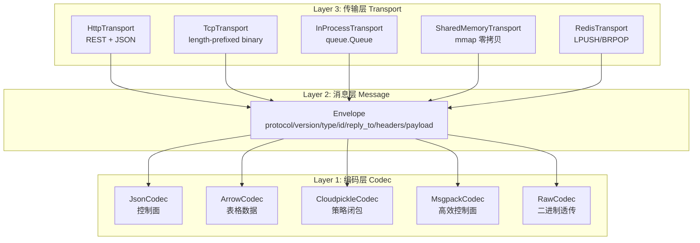
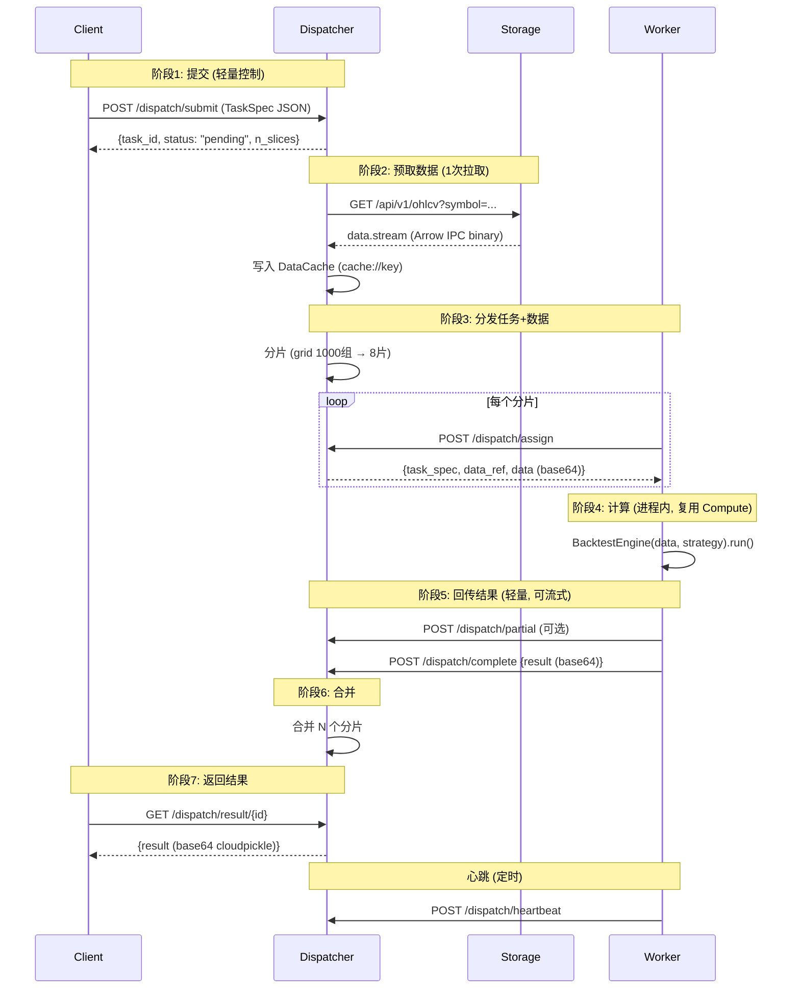

# DESIGN_PROT_V31 — StockStat V3.1 通讯协议设计

> **版本**：v3.1
> **日期**：2026-07-24
> **状态**：设计稿
> **关联**：
> - [DESIGN_ARCH_V31.md](DESIGN_ARCH_V31.md) — 总设计
> - [DESIGN_ARCH_FOUNDATION_V31.md](DESIGN_ARCH_FOUNDATION_V31.md) — 基础层
> - [COMPUTE_OFFLOAD_PLAN_V2_CN.md](../../reports/COMPUTE_OFFLOAD_PLAN_V2_CN.md) — V2 协议设想
>
> **核心使命**：忠实落地 COMPUTE_OFFLOAD_PLAN_V2_CN §12~§13 的协议设计——**传输无关、语言无关、可扩展、可组合**。V3.1 协议在 V3 基础上扩展 task_type 至 47 个，但**消息格式零改动**。

---

## 目录

1. [协议总览](#1-协议总览)
2. [Envelope 信封](#2-envelope-信封)
3. [消息类型表](#3-消息类型表)
4. [TaskSpec 三段式](#4-taskspec-三段式)
5. [Codec 编码层](#5-codec-编码层)
6. [Transport 传输层](#6-transport-传输层)
7. [数据分发策略](#7-数据分发策略)
8. [Worker 注册与心跳](#8-worker-注册与心跳)
9. [任务生命周期](#9-任务生命周期)
10. [错误处理与重试](#10-错误处理与重试)
11. [协议优化](#11-协议优化)
12. [版本协商](#12-版本协商)
13. [HTTP 路径映射](#13-http-路径映射)
14. [异常类](#14-异常类)
15. [协议测试覆盖](#15-协议测试覆盖)

---

## 1. 协议总览

### 1.1 设计目标

| 目标 | 说明 | V3.1 落地 |
|------|------|----------|
| 传输无关 | 同一套消息可在 HTTP/TCP/SHM/Redis/InProcess 上传输 | 5 种 Transport 实现 |
| 语言无关 | 控制面 JSON；数据面 Arrow / cloudpickle | JSON + Arrow + cloudpickle |
| 可扩展 | 新增任务类型/消息类型/Codec/Transport 零协议改动 | 47 个 task_type，协议不变 |
| 可组合 | 多级 Dispatcher 级联时消息原样转发 | 子 Dispatcher 注册 + 拓扑聚合 |
| 高效 | MessagePack 可选，比 JSON 节省 15-30% 带宽 | MsgpackCodec |
| 可观测 | trace_id / headers.priority / data_ref 全程透传 | Headers 字段 |

### 1.2 三层协议栈


```mermaid
graph TB
    subgraph "Layer 3: 传输层 Transport"
        T_HTTP["HttpTransport<br/>REST + JSON"]
        T_TCP["TcpTransport<br/>length-prefixed binary"]
        T_MEM["InProcessTransport<br/>queue.Queue"]
        T_SHM["SharedMemoryTransport<br/>mmap 零拷贝"]
        T_REDIS["RedisTransport<br/>LPUSH/BRPOP"]
    end

    subgraph "Layer 2: 消息层 Message"
        M_ENV["Envelope<br/>protocol/version/type/id/reply_to/headers/payload"]
    end

    subgraph "Layer 1: 编码层 Codec"
        C_JSON["JsonCodec<br/>控制面"]
        C_ARROW["ArrowCodec<br/>表格数据"]
        C_PICKLE["CloudpickleCodec<br/>策略闭包"]
        C_MSGPACK["MsgpackCodec<br/>高效控制面"]
        C_RAW["RawCodec<br/>二进制透传"]
    end

    T_HTTP --> M_ENV
    T_TCP --> M_ENV
    T_MEM --> M_ENV
    T_SHM --> M_ENV
    T_REDIS --> M_ENV
    M_ENV --> C_JSON
    M_ENV --> C_ARROW
    M_ENV --> C_PICKLE
    M_ENV --> C_MSGPACK
    M_ENV --> C_RAW
```

**三层分离铁律**：
- **编码层**：决定"载荷如何序列化为字节"——与传输无关
- **消息层**：决定"字节如何包装为有意义的消息"——与编码无关
- **传输层**：决定"消息如何在节点间移动"——与消息内容无关

> 任何一层可独立替换：换传输不动消息格式，换编码不动传输，换消息类型不改编解码。

### 1.3 与 V3 协议的关系

V3.1 协议**完全继承** V3 的 Envelope / Headers / 消息类型表 / Transport / Codec 设计（已验证 922 项测试通过）。V3.1 的扩展点：

| 维度 | V3 | V3.1 |
|------|----|------|
| task_type 数量 | 6 | **47**（见 DESIGN_GENERALIZE） |
| ComputeSpec.params | 无 | **新增**（承载 47 个 task_type 的特定参数） |
| 消息类型 | 28 个 | **不变**（28 个） |
| Envelope 结构 | 不变 | **不变** |
| Transport | 5 种 | **不变**（5 种） |
| Codec | 7 种 | **不变**（7 种） |

**核心结论**：V3.1 的协议扩展是**业务层扩展**（更多 task_type），**协议层零改动**。这正是 COMPUTE_OFFLOAD_PLAN_V2_CN §12.11 "通用性保证"的体现。

---

## 2. Envelope 信封

### 2.1 结构

所有节点间通信都包装在统一信封中。信封本身永远是 JSON 或 Msgpack 可序列化的；payload 按 `headers.content_type` 决定编码方式。

```python
@dataclass
class Envelope:
    """统一消息信封 — COMPUTE_OFFLOAD_PLAN_V2_CN §12.3。

    Fields:
        protocol: Always "stockstat-rpc" (协议标识)
        version: 协议版本 (semver, e.g. "1.0")
        type: 消息类型 (见 §3)
        id: 唯一消息 UUID v4
        reply_to: 原始消息 ID (异步回复)
        headers: 元数据 (见 §2.2)
        payload: 消息体 (dict / bytes / str)
    """
    protocol: str = "stockstat-rpc"
    version: str = "1.0"
    type: str = ""
    id: str = field(default_factory=lambda: str(uuid.uuid4()))
    reply_to: Optional[str] = None
    headers: Headers = field(default_factory=Headers)
    payload: Any = None
```

### 2.2 Headers 字段

| 字段 | 类型 | 默认 | 说明 |
|------|------|------|------|
| `content_type` | str | `application/json` | 载荷 MIME 类型（决定解码方式） |
| `data_codec` | str | `arrow` | 表格数据编码：arrow / json / parquet |
| `strategy_codec` | str | `cloudpickle` | 策略函数编码：cloudpickle / json / none |
| `encoding` | str | `json` | 信封编码：json / msgpack |
| `priority` | int | `0` | 0 普通 / -1 高 / 1 低 |
| `timeout` | int | `3600` | 超时秒数 |
| `trace_id` | str | `""` | 分布式追踪 ID（贯穿全链路） |
| `data_ref` | str | `""` | 数据引用：shm://id / cache://key / inline:b64 / redis://id |
| `retry_count` | int | `0` | 重试次数 |
| `protocol_version` | str | `1.0` | 协议版本（协商用） |
| `accepted_codecs` | list | `[]` | Client 声明支持的 codec |
| `accepted_encodings` | list | `[]` | Client 声明支持的 envelope 编码 |

### 2.3 信封示例

**task.submit 消息**：

```json
{
  "protocol": "stockstat-rpc",
  "version": "1.0",
  "type": "task.submit",
  "id": "550e8400-e29b-41d4-a716-446655440000",
  "reply_to": null,
  "headers": {
    "content_type": "application/vnd.stockstat.task+json",
    "data_codec": "arrow",
    "strategy_codec": "cloudpickle",
    "encoding": "json",
    "priority": 0,
    "timeout": 3600,
    "trace_id": "trace-abc-123",
    "data_ref": "",
    "retry_count": 0,
    "protocol_version": "1.0",
    "accepted_codecs": ["arrow", "cloudpickle", "json"],
    "accepted_encodings": ["json", "msgpack"]
  },
  "payload": {
    "task_id": "task-2024-001",
    "data_spec": {...},
    "compute_spec": {...},
    "dispatch_spec": {...}
  }
}
```

### 2.4 编码方式

- **JSON**（默认）：人可读，跨语言，调试友好
- **Msgpack**（V2 §13.5）：紧凑二进制，比 JSON 小 15-30%

```python
def encode(self) -> bytes:
    """按 headers.encoding 选择序列化方式。"""
    d = self.to_dict()
    # bytes payload 自动 base64 编码
    if isinstance(d["payload"], (bytes, bytearray)):
        d["payload"] = base64.b64encode(d["payload"]).decode("ascii")
        d["_payload_b64"] = True
    if self.headers.encoding == "msgpack":
        import msgpack
        return msgpack.dumps(d, use_bin_type=True)
    return json.dumps(d, default=str).encode("utf-8")
```

### 2.5 解码自动检测

```python
@classmethod
def decode(cls, raw: bytes) -> "Envelope":
    """自动检测 JSON vs Msgpack。"""
    try:
        d = json.loads(raw.decode("utf-8"))   # try JSON first
    except (json.JSONDecodeError, UnicodeDecodeError):
        import msgpack
        d = msgpack.loads(raw, raw=False)     # fall back to msgpack
    # 还原 base64 payload
    if d.get("_payload_b64") and isinstance(d.get("payload"), str):
        d["payload"] = base64.b64decode(d["payload"])
    return cls.from_dict(d)
```

**关键设计**：JSON 先尝试（更常见且成本低），失败再尝试 msgpack。msgpack 字节流不是合法 UTF-8，所以 `raw.decode("utf-8")` 会抛 `UnicodeDecodeError`，触发 fallback。

### 2.6 reply 辅助方法

```python
def reply(self, type: str, payload=None, content_type="application/json") -> "Envelope":
    """构建回复信封，reply_to 设为当前信封的 id。"""
    return Envelope(
        type=type,
        reply_to=self.id,
        headers=Headers(
            content_type=content_type,
            trace_id=self.headers.trace_id,  # 透传 trace_id
            protocol_version=self.headers.protocol_version,
        ),
        payload=payload,
    )
```

---

## 3. 消息类型表

### 3.1 控制面（Client ↔ Dispatcher）

| `type` | 方向 | `content_type` | 说明 |
|--------|------|----------------|------|
| `task.submit` | C → D | `application/vnd.stockstat.task+json` | 提交任务（payload = TaskSpec） |
| `task.ack` | D → C | `application/json` | 确认接收，返回 task_id + 预估 |
| `task.status` | C → D | `application/json` | 查询状态 |
| `task.status.reply` | D → C | `application/json` | 返回 TaskInfo |
| `task.result` | C → D | `application/json` | 获取结果 |
| `task.result.reply` | D → C | `application/vnd.stockstat.result+cloudpickle` | 返回结果（base64 cloudpickle） |
| `task.cancel` | C → D | `application/json` | 取消任务 |
| `task.progress` | D → C（推送） | `application/json` | 进度推送（订阅模式） |
| `task.error` | D → C | `application/json` | 错误上报 |
| `cluster.info` | C → D | `application/json` | 查询集群拓扑与节点信息 |
| `cluster.info.reply` | D → C | `application/json` | 返回完整集群拓扑 |

### 3.2 调度面（Dispatcher ↔ Worker）

| `type` | 方向 | 说明 |
|--------|------|------|
| `dispatch.assign` | D → W | 分配任务分片（含 TaskSpec + data_ref + 内联 data） |
| `dispatch.ack` | W → D | 确认接收分片 |
| `dispatch.complete` | W → D | 完成并回传最终结果（base64 cloudpickle） |
| `dispatch.partial` | W → D | 流式回传部分结果（V2 §13.2） |
| `dispatch.fail` | W → D | 失败上报（含 traceback） |
| `dispatch.heartbeat` | W → D | 心跳（含负载） |
| `dispatch.register` | W → D | Worker 注册（含硬件配置 + 别名） |
| `dispatch.unregister` | W → D | Worker 主动下线 |
| `dispatch.drain` | D → W | 通知优雅下线（V2 §13.4） |
| `dispatch.preempt` | D → W | 暂停当前任务（V2 §13.3） |
| `dispatch.resume` | D → W | 恢复被抢占的任务 |
| `dispatch.preempt_rejected` | W → D | 不支持抢占时拒绝 |

### 3.3 数据面（大数据传输）

| `type` | 方向 | 说明 |
|--------|------|------|
| `data.fetch` | D → S | 预取数据请求 |
| `data.stream` | S → D | 数据流（Arrow IPC，可分 chunk） |
| `data.ref` | D → W | 数据引用（共享内存 ID 或 Storage URL） |

### 3.4 服务发现（V2 §13.4）

| `type` | 方向 | 说明 |
|--------|------|------|
| `cluster.discover` | W → S | Worker 查询可用 Dispatcher 列表 |
| `cluster.discover.reply` | S → W | 返回 Dispatcher 地址列表 |

### 3.5 类型分组

```python
CONTROL_TYPES = {TASK_SUBMIT, TASK_ACK, TASK_STATUS, TASK_STATUS_REPLY,
                 TASK_RESULT, TASK_RESULT_REPLY, TASK_CANCEL, TASK_PROGRESS,
                 TASK_ERROR, CLUSTER_INFO, CLUSTER_INFO_REPLY}  # 11 个

DISPATCH_TYPES = {DISPATCH_ASSIGN, DISPATCH_ACK, DISPATCH_COMPLETE,
                  DISPATCH_PARTIAL, DISPATCH_FAIL, DISPATCH_HEARTBEAT,
                  DISPATCH_REGISTER, DISPATCH_UNREGISTER, DISPATCH_DRAIN,
                  DISPATCH_PREEMPT, DISPATCH_RESUME, DISPATCH_PREEMPT_REJECTED}  # 12 个

DATA_TYPES = {DATA_FETCH, DATA_STREAM, DATA_REF}  # 3 个

DISCOVERY_TYPES = {CLUSTER_DISCOVER, CLUSTER_DISCOVER_REPLY}  # 2 个

ALL_TYPES = CONTROL_TYPES | DISPATCH_TYPES | DATA_TYPES | DISCOVERY_TYPES  # 28 个


def is_control(t: str) -> bool: return t in CONTROL_TYPES
def is_dispatch(t: str) -> bool: return t in DISPATCH_TYPES
def is_data(t: str) -> bool: return t in DATA_TYPES
```

---

## 4. TaskSpec 三段式

### 4.1 结构

`task.submit` 的 payload 是一个 TaskSpec JSON，描述"算什么"但不描述"怎么传"：

```python
@dataclass
class TaskSpec:
    """完整任务规范 — V2 §12.5 三段式。"""
    task_id: str                        # UUID v4
    data_spec: DataSpec                 # 需要什么数据
    compute_spec: ComputeSpec           # 做什么计算
    dispatch_spec: DispatchSpec = ...   # 如何分发
    trace_id: str = ""                  # 分布式追踪 ID
    created_at: datetime = ...          # 创建时间
    created_by: str = ""                # Client 标识
```

### 4.2 DataSpec

```python
@dataclass
class DataSpec:
    """描述需要什么数据 — 任何 task_type 通用。"""
    symbols: list[str]                  # ["BTC/USDT", "ETH/USDT"]
    timeframe: str = "1d"               # "1d" / "1h" / "5m"
    start: Optional[str] = None         # "2024-01-01"
    end: Optional[str] = None           # "2024-12-31"
    source: Optional[str] = None        # "binance" / "yfinance"

    def cache_key(self) -> str:
        """Stable hash for Dispatcher data cache (V2 §9.5)。"""
        # sha256(symbols + timeframe + start + end + source) 前 32 字节
```

### 4.3 ComputeSpec

V3.1 的 ComputeSpec 在 V3 基础上**新增 `params` dict**，承载 47 个 task_type 的特定参数：

```python
@dataclass
class ComputeSpec:
    """描述做什么计算 — 按 task_type 分发到对应 handler。

    V3.1 扩展点：params dict 承载 47 个 task_type 的特定参数，
    避免为每个 task_type 新增专用字段。
    """
    task_type: str                      # 见 DESIGN_GENERALIZE §11 注册表
    strategy_ref: Optional[str] = None  # "cloudpickle:base64..." / "registry:name" / "dsl:expr"
    strategy_codec: str = "cloudpickle"
    params: dict = field(default_factory=dict)  # 任务类型特定参数

    # ── 回测类共用字段（保留 V3 语义）──
    initial_cash: float = 1_000_000.0
    cost_model: Optional[str] = None    # "binance_spot" / "binance_futures_bnb"
    fill_model: Optional[str] = None    # "next_open" / "intrabar_fill"
    execution_model: Optional[str] = None  # "next_bar" / "intrabar"
    benchmark: Optional[str] = None
    trade_on: str = "open"
    allow_short: bool = False
    periods_per_year: Optional[int] = None

    # ── grid_search/batch_backtest 共用 ──
    param_grid: Optional[dict] = None
    metric: str = "sharpe"
    maximize: bool = True
    strategies: Optional[dict] = None   # {name: strategy_ref}
    fee_models: Optional[list] = None

    # ── monte_carlo 共用 ──
    n_simulations: int = 1000
    seed: int = 0
```

**`params` dict 示例**：

| task_type | params 示例 |
|-----------|------------|
| `indicator` | `{"indicator_name": "rsi", "window": 14}` |
| `correlation` | `{"method": "pearson", "x": [...], "y": [...]}` |
| `hypothesis_test` | `{"test": "chi2_independence", "table": [[...]]}` |
| `wavelet` | `{"method": "cwt", "wavelet": "morl", "scales": [1,2,...]}` |
| `transfer_entropy` | `{"k": 1, "l": 1, "bins": 4, "n_permutations": 100}` |
| `grey_relation` | `{"rho": 0.5}` |
| `ml_train` | `{"model_type": "random_forest", "hyperparams": {"n_estimators": 100}}` |

### 4.4 DispatchSpec

```python
@dataclass
class DispatchSpec:
    """描述如何分发 — 任何 task_type 通用。"""
    split_strategy: str = "auto"        # auto/param_wise/symbol_wise/time_wise/none
    max_workers: Optional[int] = None
    data_dispatch: str = "auto"         # auto/inline/shared_memory/stream/storage_ref
    priority: int = 0                   # 0/-1/1
    timeout: int = 3600                 # 秒
    retry_count: int = 0
    preemptable: bool = False           # V2 §13.3
```

### 4.5 完整 TaskSpec 示例

```json
{
  "task_id": "task-2024-001",
  "data_spec": {
    "symbols": ["BTC/USDT"],
    "timeframe": "1d",
    "start": "2024-01-01",
    "end": "2024-12-31",
    "source": "binance"
  },
  "compute_spec": {
    "task_type": "grid_search",
    "strategy_ref": "cloudpickle:base64...",
    "strategy_codec": "cloudpickle",
    "params": {},
    "initial_cash": 1000000,
    "cost_model": "binance_spot",
    "param_grid": {
      "short": [3, 5, 8, 10],
      "long": [10, 20, 30, 50]
    },
    "metric": "sharpe",
    "maximize": true
  },
  "dispatch_spec": {
    "split_strategy": "param_wise",
    "max_workers": 8,
    "data_dispatch": "auto",
    "priority": 0,
    "timeout": 3600,
    "retry_count": 0,
    "preemptable": false
  },
  "trace_id": "trace-abc-123",
  "created_at": "2026-07-24T10:00:00Z",
  "created_by": "StockStatClient"
}
```

### 4.6 序列化

所有三段都是 JSON 可序列化的：

```python
spec = TaskSpec(...)
d = spec.to_dict()              # JSON dict
restored = TaskSpec.from_dict(d)  # roundtrip
```

bytes 载荷（如策略 cloudpickle）通过 `strategy_ref = "cloudpickle:base64..."` 引用，不嵌入 TaskSpec。

---

## 5. Codec 编码层

### 5.1 Codec 注册表

| Codec | media_type | 用途 | 依赖 | 状态 |
|-------|-----------|------|------|------|
| `JsonCodec` | `application/json` | 控制面、TaskSpec | 标准库 | ✅ |
| `ArrowCodec` | `application/vnd.apache.arrow.file` | 表格数据 | pyarrow | ✅ |
| `ParquetCodec` | `application/vnd.apache.parquet` | 大数据持久化 | pyarrow | ✅ |
| `CsvCodec` | `text/csv` | CSV 导出 | pandas | ✅ |
| `CloudpickleCodec` | `application/vnd.python.cloudpickle` | 策略闭包 | cloudpickle | ✅ |
| `MsgpackCodec` | `application/msgpack` | 高效控制面 | msgpack | ✅ |
| `RawCodec` | `application/octet-stream` | 二进制透传 | 标准库 | ✅ |

### 5.2 工厂函数

```python
def get_codec(name: str) -> Codec:
    """按名称获取 codec。"""

def get_codec_for_content_type(content_type: str) -> Codec:
    """按 MIME 自动选择 codec。"""
    ct = content_type.lower()
    if ct == "application/json": return JsonCodec()
    if ct.startswith("application/vnd.apache.arrow"): return ArrowCodec()
    if ct.startswith("application/vnd.python.cloudpickle"): return CloudpickleCodec()
    if ct == "application/msgpack": return MsgpackCodec()
    if ct.startswith("application/vnd.stockstat.result+"):
        return get_codec(ct.split("+", 1)[1])
    return JsonCodec()  # fallback
```

### 5.3 可选依赖优雅降级

```python
class CloudpickleCodec:
    name = "cloudpickle"
    media_type = "application/vnd.python.cloudpickle"

    def encode(self, data):
        try:
            import cloudpickle
        except ImportError as e:
            raise ImportError(
                "CloudpickleCodec requires 'cloudpickle'. "
                "Install with: pip install stockstat-foundation[compute]"
            ) from e
        return cloudpickle.dumps(data)
```

---

## 6. Transport 传输层

### 6.1 Transport Protocol

```python
@runtime_checkable
class Transport(Protocol):
    name: str
    def send(self, envelope: Envelope) -> None: ...
    def receive(self, timeout: Optional[float] = None) -> Envelope: ...
    def request(self, envelope: Envelope, timeout: Optional[float] = None) -> Envelope: ...
    def reply(self, original: Envelope, reply: Envelope) -> None: ...
    def send_data(self, data: bytes, content_type: str) -> str: ...
    def fetch_data(self, data_ref: str) -> bytes: ...
    def close(self) -> None: ...
```

### 6.2 五种实现

| 实现 | 适用 | 特点 | 状态 |
|------|------|------|------|
| `InProcessTransport` | 测试 / 单机 | queue.Queue，零序列化 | ✅ |
| `HttpTransport` | 跨机默认 | REST + JSON，httpx | ✅ |
| `SharedMemoryTransport` | 同机大数据 | mmap 零拷贝 | ✅ |
| `RedisTransport` | 多 Worker | pub/sub 解耦 | ✅ |
| `TcpTransport` | 高性能 LAN | length-prefixed binary | 预留 |

### 6.3 InProcessTransport

```python
class InProcessTransport:
    """单进程传输 — queue.Queue + reply 路由。"""
    name = "in_process"

    def __init__(self, *, encode_envelopes: bool = False):
        self._inbox = queue.Queue()
        self._replies: dict[str, queue.Queue] = {}
        self._peer = None

    def wire_to(self, peer): self._peer = peer
    def send(self, envelope): ...
    def receive(self, timeout=None): ...
    def request(self, envelope, timeout=None): ...
    def reply(self, original, reply): ...
    def send_data(self, data, ct) -> str:
        return f"inline:{base64.b64encode(data).decode('ascii')}"
    def fetch_data(self, data_ref) -> bytes: ...


def make_pair(*, encode_envelopes=False):
    """创建双向绑定的传输对（测试用）。"""
    a = InProcessTransport(encode_envelopes=encode_envelopes)
    b = InProcessTransport(encode_envelopes=encode_envelopes)
    a.wire_to(b)
    b.wire_to(a)
    return a, b
```

### 6.4 HttpTransport

```python
class HttpTransport:
    """HTTP 传输 — REST + JSON 控制面。"""
    name = "http"

    def __init__(self, base_url: str, *, timeout: int = 30):
        self._base_url = base_url.rstrip("/")
        self._client = httpx.Client(timeout=timeout)

    def request(self, envelope, timeout=None):
        path = messages.TYPE_TO_PATH.get(envelope.type, "/dispatch/message")
        resp = self._client.post(
            f"{self._base_url}{path}",
            content=envelope.encode(),
            headers={"Content-Type": "application/json"},
            timeout=timeout or self._timeout,
        )
        # 区分 Envelope 响应 vs 普通 JSON
        try:
            d = json.loads(resp.content.decode("utf-8"))
            if d.get("protocol") == "stockstat-rpc":
                return Envelope.decode(resp.content)
            return Envelope(type=f"{envelope.type}.reply",
                            reply_to=envelope.id, payload=d)
        except (json.JSONDecodeError, UnicodeDecodeError):
            return Envelope(payload=resp.content)

    def send_data(self, data, ct) -> str:
        return f"inline:{base64.b64encode(data).decode('ascii')}"
```

### 6.5 SharedMemoryTransport

```python
class SharedMemoryTransport:
    """同机零拷贝 — 控制面走 underlying，数据面走 mmap。"""
    name = "shared_memory"

    def __init__(self, underlying=None, *, inline_threshold=10*1024*1024):
        self._underlying = underlying or InProcessTransport()
        self._inline_threshold = inline_threshold
        self._shm_registry: dict[str, object] = {}

    def send_data(self, data, ct) -> str:
        if len(data) < self._inline_threshold:
            return f"inline:{base64...}"
        try:
            from multiprocessing import shared_memory
            shm = shared_memory.SharedMemory(
                name=f"ss_{uuid.uuid4().hex[:16]}",
                create=True, size=len(data))
            shm.buf[:len(data)] = data
            self._shm_registry[shm.name] = shm
            return f"shm://{shm.name}"
        except Exception:
            return f"inline:{base64...}"  # 优雅降级

    def fetch_data(self, data_ref) -> bytes:
        if data_ref.startswith("inline:"): return base64.b64decode(...)
        if data_ref.startswith("shm://"):
            shm_name = data_ref[len("shm://"):]
            if shm_name in self._shm_registry:
                return bytes(self._shm_registry[shm_name].buf)
            # 跨进程 attach
            from multiprocessing import shared_memory
            shm = shared_memory.SharedMemory(name=shm_name)
            data = bytes(shm.buf)
            shm.close()
            return data
```

### 6.6 RedisTransport

```python
class RedisTransport:
    """Redis 列表 + pub/sub 传输。"""
    name = "redis"

    def __init__(self, redis_url, *, node_id=None, queue_prefix="stockstat:node"):
        import redis
        self._r = redis.from_url(redis_url)
        self._node_id = node_id or f"node-{uuid.uuid4().hex[:8]}"
        self._my_queue = f"{queue_prefix}:{self._node_id}"
        self._replies = {}
        self._dispatcher = threading.Thread(target=self._dispatch_loop, daemon=True)
        self._dispatcher.start()

    def send(self, envelope):
        peer_id = envelope.reply_to or "dispatcher"
        self._r.lpush(f"{self._queue_prefix}:{peer_id}", envelope.encode())

    def receive(self, timeout=None):
        result = self._r.brpop(self._my_queue, timeout=int(timeout or 0))
        if result is None: return None
        _, raw = result
        return Envelope.decode(raw)

    def send_data(self, data, ct) -> str:
        ref_id = uuid.uuid4().hex
        self._r.set(f"stockstat:data:{ref_id}", data, ex=3600)
        return f"redis://{ref_id}"

    def fetch_data(self, data_ref) -> bytes:
        ref_id = data_ref[len("redis://"):]
        return self._r.get(f"stockstat:data:{ref_id}")
```

### 6.7 选择策略

```python
def build_transport(url: Optional[str] = None, *,
                    transport: Optional[Transport] = None,
                    transport_type: str = "auto") -> Transport:
    if transport is not None: return transport
    if url is None or transport_type == "in_process":
        return InProcessTransport()
    if url.startswith("http://") or url.startswith("https://"):
        return HttpTransport(url)
    if url.startswith("shm://"):
        return SharedMemoryTransport()
    if url.startswith("redis://") or url.startswith("rediss://"):
        return RedisTransport(url)
    if url.startswith("tcp://"):
        return TcpTransport(url)
    raise ValueError(f"Unknown transport for URL: {url}")
```

---

## 7. 数据分发策略

### 7.1 四种策略

| 策略 | `data_dispatch` | 数据路径 | 编码 | 适用 |
|------|-----------------|---------|------|------|
| 随任务内联 | `"inline"` | Dispatcher → Worker（随 `dispatch.assign`） | base64 cloudpickle | < 10MB |
| 共享内存 | `"shared_memory"` | Dispatcher 写入 shm → Worker 通过 ID 读取 | raw bytes | 同机，任意大小 |
| Storage 引用 | `"storage_ref"` | Worker 直接从 Storage 拉取 | HTTP + Arrow | > 100MB |
| Dispatcher 流式 | `"stream"` | Dispatcher 通过 WebSocket/TCP 推流 | Arrow IPC stream | 10~100MB |
| 自动 | `"auto"` | Dispatcher 按大小+拓扑自动选择 | — | 默认 |

### 7.2 自动选择

```python
SMALL_DATA_THRESHOLD = 10 * 1024 * 1024   # 10 MB
LARGE_DATA_THRESHOLD = 100 * 1024 * 1024  # 100 MB


def choose_data_dispatch(data_size: int, workers_same_host: bool = False,
                         workers_can_reach_storage: bool = False) -> str:
    if data_size < SMALL_DATA_THRESHOLD:
        return "inline"
    if workers_same_host:
        return "shared_memory"
    if data_size > LARGE_DATA_THRESHOLD and workers_can_reach_storage:
        return "storage_ref"
    return "stream"


def resolve_data_dispatch(spec_dispatch: str, data_size: int, ...) -> str:
    """如果 spec 显式指定（非 'auto'），原样返回；否则用 choose_data_dispatch。"""
    if spec_dispatch in ("auto", "", None):
        return choose_data_dispatch(data_size, ...)
    return spec_dispatch
```

### 7.3 数据大小估算

```python
def estimate_data_size(data) -> int:
    if isinstance(data, (bytes, bytearray)): return len(data)
    if isinstance(data, dict):
        total = 0
        for v in data.values():
            if isinstance(v, dict):
                for df in v.values():
                    total += _estimate_df_size(df)
            else:
                total += _estimate_df_size(v)
        return total or 1024
    return _estimate_df_size(data)


def _estimate_df_size(df) -> int:
    if isinstance(df, pd.DataFrame):
        return df.memory_usage(deep=True).sum()
    return 1024
```

### 7.4 Stream 对象（鸭子类型）

```python
class Stream:
    """数据流 — 同时支持迭代模式与 collect 模式。

    V2 §13.1: Worker 通过检查函数签名自动决定如何传入：
    - 签名声明 Stream → 传 Stream 对象（增量计算）
    - 签名声明 pd.DataFrame → 调用 stream.collect() 传完整 DataFrame
    """
    def __init__(self, chunks=None, data=None):
        self._chunks = chunks
        self._collected = data

    def __iter__(self):
        if self._chunks:
            for chunk in self._chunks:
                yield chunk
        elif self._collected is not None:
            yield self._collected

    def collect(self) -> Any:
        """返回完整 DataFrame（缓存，幂等）。"""
        if self._collected is None and self._chunks:
            import pandas as pd
            self._collected = pd.concat(list(self._chunks))
        return self._collected

    @classmethod
    def from_data(cls, data) -> "Stream":
        return cls(data=data)


def is_stream_aware(handler) -> bool:
    """检查 handler 签名是否声明 Stream 参数。"""
    sig = inspect.signature(handler)
    for param in sig.parameters.values():
        if param.annotation is Stream or "Stream" in str(param.annotation):
            return True
    return getattr(handler, "__stream_aware__", False)
```

---

## 8. Worker 注册与心跳

### 8.1 注册消息 `dispatch.register`

Worker 首次启动时向 Dispatcher 发送注册消息：

```json
{
  "type": "dispatch.register",
  "id": "msg-uuid",
  "headers": {"content_type": "application/json"},
  "payload": {
    "worker_id": "550e8400-e29b-41d4-a716-446655440000",
    "alias": "gpu-box-alpha",
    "address": "192.168.1.101",
    "port": 9100,
    "concurrency": 8,
    "hardware": {
      "cpu": {
        "model": "AMD Ryzen 9 7950X",
        "cores_physical": 16,
        "cores_logical": 32,
        "threads": 32,
        "freq_mhz": 4500
      },
      "memory": {"total_gb": 64.0, "available_gb": 48.5},
      "gpu": {"devices": [{"model": "NVIDIA RTX 4090", "vram_gb": 24.0}]},
      "disk": {"total_gb": 2000.0, "available_gb": 1500.0},
      "os": "Ubuntu 22.04",
      "python_version": "3.11.4"
    },
    "capabilities": ["indicator", "backtest", "grid_search", "batch_backtest",
                     "monte_carlo", "correlation", "hypothesis_test",
                     "spectral_analysis", "wavelet", "transfer_entropy",
                     "mutual_information", "hurst_exponent", "sample_entropy",
                     "permutation_entropy", "rqa", "grey_relation", "gm11_predict",
                     "ml_train", "ml_predict", "risk_metrics", ...],
    "stockstat_version": "3.1.0",
    "labels": {"rack": "A-12", "zone": "datacenter-east"},
    "preemptable": true
  }
}
```

**字段说明**：

| 字段 | 类型 | 必填 | 说明 |
|------|------|------|------|
| `worker_id` | string | 是 | Worker 唯一 ID |
| `alias` | string | 否 | 用户自定义别名（便于人读） |
| `address` | string | 是 | Worker 监听地址 |
| `port` | int | 是 | Worker 监听端口 |
| `concurrency` | int | 是 | 最大并发任务数 |
| `hardware` | object | 是 | 硬件配置（见上） |
| `capabilities` | list[string] | 是 | 支持的 task_type 列表 |
| `stockstat_version` | string | 是 | Worker 安装的 stockstat 版本 |
| `labels` | dict | 否 | 用户自定义标签 |
| `preemptable` | bool | 否 | 是否支持抢占 |

### 8.2 心跳消息 `dispatch.heartbeat`

每 10 秒发送：

```json
{
  "type": "dispatch.heartbeat",
  "id": "msg-uuid",
  "headers": {"content_type": "application/json"},
  "payload": {
    "worker_id": "...",
    "alias": "gpu-box-alpha",
    "timestamp": "2026-07-24T10:30:00Z",
    "load": {
      "cpu_percent": 37.5,
      "memory_used_gb": 15.2,
      "memory_available_gb": 48.8,
      "gpu_percent": [85.0],
      "gpu_memory_used_gb": [18.5],
      "disk_available_gb": 1498.0
    },
    "active_tasks": 3,
    "completed_tasks": 156,
    "failed_tasks": 2,
    "avg_task_duration_s": 12.3,
    "status": "online"
  }
}
```

### 8.3 Worker 状态机

| status | 含义 | Dispatcher 行为 |
|--------|------|----------------|
| `online` | 正常，接受任务 | 正常分发 |
| `busy` | 活动任务 = concurrency | 不再分发新任务 |
| `draining` | 优雅下线中 | 等待现有任务完成 |
| `offline` | 心跳超时（30s）或主动下线 | 从可用列表移除，其任务重新分配 |

### 8.4 心跳超时检测

Dispatcher 后台线程每 10 秒检查所有 Worker：

```python
def check_timeouts(self) -> list[str]:
    now = time.time()
    timed_out = []
    for w in self._workers.values():
        if w.status in ("online", "busy"):
            if now - w.last_heartbeat > self._offline_timeout:
                w.status = "offline"
                timed_out.append(w.worker_id)
    return timed_out
```

---

## 9. 任务生命周期

### 9.1 完整时序


```mermaid
sequenceDiagram
    participant C as Client
    participant D as Dispatcher
    participant S as Storage
    participant W as Worker

    Note over C,D: 阶段1: 提交 (轻量控制)
    C->>D: POST /dispatch/submit (TaskSpec JSON)
    D-->>C: {task_id, status: "pending", n_slices}

    Note over D,S: 阶段2: 预取数据 (1次拉取)
    D->>S: GET /api/v1/ohlcv?symbol=...
    S-->>D: data.stream (Arrow IPC binary)
    D->>D: 写入 DataCache (cache://key)

    Note over D,W: 阶段3: 分发任务+数据
    D->>D: 分片 (grid 1000组 → 8片)
    loop 每个分片
        W->>D: POST /dispatch/assign
        D-->>W: {task_spec, data_ref, data (base64)}
    end

    Note over W: 阶段4: 计算 (进程内, 复用 Compute)
    W->>W: BacktestEngine(data, strategy).run()

    Note over W,D: 阶段5: 回传结果 (轻量, 可流式)
    W->>D: POST /dispatch/partial (可选)
    W->>D: POST /dispatch/complete {result (base64)}

    Note over D: 阶段6: 合并
    D->>D: 合并 N 个分片

    Note over C,D: 阶段7: 返回结果
    C->>D: GET /dispatch/result/{id}
    D-->>C: {result (base64 cloudpickle)}

    Note over W,D: 心跳 (定时)
    W->>D: POST /dispatch/heartbeat
```

### 9.2 状态机

```
pending -> running -> completed
   |         |
   |         |--> failed
   |         |
   |         +--> cancelled (Client 取消 / Worker 超时)
   |
   +--> cancelled (调度前取消)
```

### 9.3 进度推送

Worker 在长时间任务中通过 `on_progress(completed, total)` 回调：

```python
def on_progress(completed, total):
    if self._worker:
        self._worker._send_partial(spec.task_id, {
            "completed": completed,
            "total": total,
            "progress": completed / total if total > 0 else 0,
        })
```

Dispatcher 缓存在 `state.stream_partials`，Client 通过 `task.stream_results()` 消费。

---

## 10. 错误处理与重试

### 10.1 错误场景

| 场景 | 消息 | 处理 |
|------|------|------|
| Worker 计算崩溃 | `dispatch.fail` {error, traceback} | 标记 FAILED；可选重试 |
| Worker 心跳超时 | 无心跳 30s | 标记 Worker offline；其任务可重新分配 |
| Worker 超时 | `dispatch.complete` 未在 timeout 内到达 | 取消该分片，重新分配 |
| Dispatcher 崩溃 | Client 轮询超时 | Client 向备用 Dispatcher 重试 |
| Storage 不可达 | `data.fetch` 失败 | 返回 `task.error` |
| 数据解码失败 | Worker 解码 Arrow 失败 | `dispatch.fail` {error: "codec_error"} |
| 协议不兼容 | 协商失败 | `task.error` {error_code: "PROTOCOL_MISMATCH"} |
| 无 Worker 支持该 task_type | capability 不匹配 | `task.error` {error_code: "WORKER_CAPABILITY_INSUFFICIENT"} |

### 10.2 错误消息格式

```json
{
  "type": "task.error",
  "headers": {"content_type": "application/json", "trace_id": "trace-xyz"},
  "payload": {
    "task_id": "task-2024-001",
    "slice_id": "slice-3",
    "error_code": "COMPUTE_FAILED",
    "error_message": "BacktestError: insufficient data for window=50",
    "context": {"task_type": "backtest", "symbol": "BTC/USDT"},
    "recoverable": false,
    "traceback": "...",
    "retryable": false
  }
}
```

### 10.3 RetryPolicy

```python
@dataclass
class RetryPolicy:
    """Exponential backoff retry policy。"""
    max_retries: int = 3
    backoff_base: float = 1.0
    backoff_factor: float = 2.0
    max_backoff: float = 60.0

    def should_retry(self, error: dict, attempt: int) -> bool:
        if attempt >= self.max_retries:
            return False
        return error.get("retryable", False)

    def next_delay(self, attempt: int) -> float:
        delay = self.backoff_base * (self.backoff_factor ** attempt)
        return min(delay, self.max_backoff)
```

**用法**：

```python
policy = RetryPolicy(max_retries=3, backoff_base=1.0)
if policy.should_retry(error, attempt=2):
    time.sleep(policy.next_delay(2))
    re_enqueue_slice()
```

---

## 11. 协议优化

### 11.1 流式结果（V2 §13.2）

Worker 每完成一部分发送 `dispatch.partial`：

```
Worker → POST /dispatch/partial {slice_id, {progress: 0.25, completed: 25, total: 100}}
Worker → POST /dispatch/partial {slice_id, {progress: 0.5, completed: 50, total: 100}}
Worker → POST /dispatch/complete {result (base64)}
```

Client `task.stream_results()` 迭代消费：

```python
def stream_results(self, task_id):
    state = self._get_state(task_id)
    self.wait(task_id)
    for p in state.partials:
        yield p
    if not state.partials or state.partials[-1] is not state.result:
        yield state.result
```

### 11.2 鸭子类型检测（V2 §13.1）

Worker 通过 `is_stream_aware(handler)` 检查 handler 签名：

```python
def dispatch(spec, data, on_progress=None):
    handler = HANDLERS.get(spec.compute_spec.task_type)
    if is_stream_aware(handler):
        stream = Stream.from_data(data)
        return handler(spec, stream, on_progress=on_progress)
    return handler(spec, data, on_progress=on_progress)
```

### 11.3 抢占（V2 §13.3）

```python
# Dispatcher.preempt(slice_id, worker_id)
state.info.state = TaskState.PENDING  # 回到 pending
state.assigned.pop(slice_id, None)
return {"status": "preempted"}

# Worker.preempt(slice_id) — 协作式
self._preempted.add(slice_id)
return True  # handler 必须定期检查并优雅退出
```

**关键**：Python 线程无法强制 kill，handler 必须主动检查 `_preempted` 并保存 checkpoint 后退出。

### 11.4 弹性伸缩（V2 §13.4）

- `dispatch.drain` → Worker 优雅下线
- `cluster.discover` → Worker 自动发现 Dispatcher
- Autoscaler 监控 `/dispatch/autoscaler`：

```json
{
    "queue_depth": 15,
    "active_tasks": 8,
    "total_concurrency": 8,
    "available_concurrency": 0,
    "online_workers": 1,
    "scale_up_recommended": true,
    "scale_down_recommended": false
}
```

### 11.5 协议瘦身（V2 §13.5）

- `headers.encoding = "msgpack"` 切换为 MessagePack
- 心跳消息比 JSON 小 15-30%
- 大数据（含二进制）msgpack 优势更明显（不需 base64 膨胀）

---

## 12. 版本协商

Client 在 `task.submit` 声明支持的版本和编码：

```json
{
  "headers": {
    "protocol_version": "1.0",
    "accepted_codecs": ["arrow", "parquet", "json", "cloudpickle"],
    "accepted_encodings": ["json", "msgpack"]
  }
}
```

Dispatcher 在 `task.ack` 返回实际使用的版本与 codec：

```json
{
  "type": "task.ack",
  "headers": {
    "protocol_version": "1.0",
    "content_type": "application/json"
  },
  "payload": {
    "task_id": "...",
    "status": "pending",
    "negotiated_codec": "arrow",
    "negotiated_encoding": "msgpack"
  }
}
```

不兼容时返回 `task.error`：

```json
{
  "type": "task.error",
  "payload": {
    "error_code": "PROTOCOL_MISMATCH",
    "error_message": "Server cannot satisfy accepted_codecs=['protobuf']"
  }
}
```

---

## 13. HTTP 路径映射

### 13.1 TYPE_TO_PATH

```python
TYPE_TO_PATH = {
    TASK_SUBMIT: "/dispatch/submit",
    TASK_STATUS: "/dispatch/status",
    TASK_RESULT: "/dispatch/result",
    TASK_CANCEL: "/dispatch/cancel",
    CLUSTER_INFO: "/dispatch/cluster",
    DISPATCH_REGISTER: "/dispatch/register",
    DISPATCH_HEARTBEAT: "/dispatch/heartbeat",
    DISPATCH_UNREGISTER: "/dispatch/unregister",
    DISPATCH_ASSIGN: "/dispatch/assign",
    DISPATCH_COMPLETE: "/dispatch/complete",
    DISPATCH_FAIL: "/dispatch/fail",
    DISPATCH_PARTIAL: "/dispatch/partial",
    DISPATCH_PREEMPT: "/dispatch/preempt",
    DISPATCH_RESUME: "/dispatch/resume",
    DISPATCH_DRAIN: "/dispatch/drain",
    CLUSTER_DISCOVER: "/dispatch/discover",
    DATA_FETCH: "/api/v1/ohlcv",
}
```

### 13.2 完整 REST API

| 消息类型 | HTTP 路径 | 方法 | 说明 |
|---------|----------|------|------|
| `task.submit` | `/dispatch/submit` | POST | 提交 TaskSpec |
| `task.status` | `/dispatch/status/{id}` | GET | 查询状态 |
| `task.result` | `/dispatch/result/{id}` | GET | 获取结果 |
| `task.cancel` | `/dispatch/cancel/{id}` | POST | 取消任务 |
| `cluster.info` | `/dispatch/cluster` | GET | 集群拓扑 |
| `dispatch.register` | `/dispatch/register` | POST | Worker 注册 |
| `dispatch.heartbeat` | `/dispatch/heartbeat` | POST | Worker 心跳 |
| `dispatch.unregister` | `/dispatch/unregister/{id}` | POST | Worker 下线 |
| `dispatch.assign` | `/dispatch/assign` | POST | Worker 拉取任务 |
| `dispatch.complete` | `/dispatch/complete` | POST | 回传结果 |
| `dispatch.fail` | `/dispatch/fail` | POST | 上报失败 |
| `dispatch.partial` | `/dispatch/partial` | POST | 流式部分结果 |
| `dispatch.preempt` | `/dispatch/preempt/{slice_id}` | POST | 抢占任务 |
| `dispatch.resume` | `/dispatch/resume/{slice_id}` | POST | 恢复任务 |
| `dispatch.drain` | `/dispatch/drain/{worker_id}` | POST | 通知 Worker 下线 |
| `cluster.discover` | `/dispatch/discover` | GET | 服务发现 |
| (Autoscaler) | `/dispatch/autoscaler` | GET | Autoscaler 指标 |
| (Sub register) | `/dispatch/sub/register` | POST | 子 Dispatcher 注册 |
| (Sub unregister) | `/dispatch/sub/unregister/{id}` | POST | 子 Dispatcher 注销 |
| (Sub list) | `/dispatch/sub` | GET | 列出子 Dispatcher |
| (History) | `/dispatch/tasks/history` | GET | 任务历史 |
| (Stats) | `/dispatch/tasks/stats` | GET | 任务统计 |
| (V2 compat) | `/api/v1/tasks` | POST/GET | V2 §10.2 兼容 |
| (V2 compat) | `/api/v1/tasks/{id}` | GET/DELETE | 状态/取消 |
| (V2 compat) | `/api/v1/tasks/{id}/result` | GET | 结果 |
| (Admin) | `/admin/api/dispatcher/cluster` | GET | Admin 拓扑 |
| (Admin) | `/admin/api/dispatcher/tasks` | GET | Admin 历史 |
| (Admin) | `/admin/api/dispatcher/stats` | GET | Admin 统计 |
| (Admin) | `/admin/api/dispatcher/autoscaler` | GET | Admin Autoscaler |
| (Storage) | `/api/v1/ohlcv` | GET | OHLCV 查询 |
| (Storage) | `/api/v1/ohlcv` | POST | OHLCV 写入 |
| (Storage) | `/api/v1/symbols` | GET | 标的列表 |
| (Storage) | `/health` | GET | 健康检查 |

---

## 14. 异常类

### 14.1 异常类层次

```python
class AppError(Exception):
    """Base application error with error code and context."""
    code: str = "INTERNAL_ERROR"
    recoverable: bool = False

    def __init__(self, message="", code=None, context=None, recoverable=None):
        self.message = message or self.code
        if code is not None: self.code = code
        self.context = context or {}
        if recoverable is not None: self.recoverable = recoverable
```

### 14.2 V3.1 异常

| 异常 | code | recoverable | 触发场景 |
|------|------|------------|---------|
| `TaskError` | `TASK_FAILED` | False | `TaskRef.wait()` 当任务 FAILED |
| `TaskNotReadyError` | `TASK_NOT_READY` | True | `TaskRef.result()` 当未完成 |
| `TaskCancelledError` | `TASK_CANCELLED` | False | 任务被取消 |
| `TaskTimeoutError` | `TASK_TIMEOUT` | True | `wait(timeout)` 超时 |
| `TaskNotFoundError` | `TASK_NOT_FOUND` | False | 未知 task_id |
| `ProtocolMismatchError` | `PROTOCOL_MISMATCH` | False | 协议版本不兼容 |
| `TransportError` | `TRANSPORT_ERROR` | True | 传输失败（网络/连接） |
| `DispatcherUnavailableError` | `DISPATCHER_UNAVAILABLE` | True | Dispatcher 不可达 |
| `WorkerCapabilityError` | `WORKER_CAPABILITY_INSUFFICIENT` | True | 无 Worker 支持该 task_type |
| `StorageError` | `STORAGE_ERROR` | True | Storage 访问失败 |
| `ComputeError` | `COMPUTE_FAILED` | False | 计算失败 |
| `ConfigError` | `CONFIG_ERROR` | False | 配置错误 |

### 14.3 序列化

```python
def to_dict(self) -> dict:
    return {
        "code": self.code,
        "message": self.message,
        "context": self.context,
        "recoverable": self.recoverable,
    }
```

---

## 15. 协议测试覆盖

### 15.1 测试文件

| 测试文件 | 测试数 | 覆盖 |
|---------|--------|------|
| `test_envelope.py` | 25 | Envelope 编解码 / Headers / reply / base64 payload |
| `test_task_spec.py` | 20 | TaskSpec 三段式 / to_dict / from_dict / roundtrip |
| `test_messages.py` | 10 | 消息类型常量 / TYPE_TO_PATH / 分组 |
| `test_codec.py` | 30 | 7 个 Codec / 工厂函数 / 优雅降级 |
| `test_transport.py` | 35 | InProcess / HTTP / SHM / Redis / build_transport |
| `test_errors.py` | 15 | 12 个异常类 / to_dict / 继承 |
| `test_data_dispatch.py` | 15 | choose_data_dispatch / estimate_data_size / Stream |
| `test_retry.py` | 10 | RetryPolicy / 指数退避 |
| `test_version_negotiation.py` | 8 | 协议协商 / PROTOCOL_MISMATCH |
| `test_http_paths.py` | 12 | TYPE_TO_PATH 映射 / REST API |
| `test_redis_cluster.py` | 17 + 6 skip | MsgpackCodec / RedisTransport / RedisTaskQueue |
| `test_shm_stream.py` | 34 | SharedMemory / Stream / duck-typing / partial |
| `test_preempt.py` | 36 | Checkpoint / preempt / drain / discover |
| `test_multilevel.py` | 23 | SubDispatcher / TaskHistory / Admin routes |
| **合计** | **290** | |

### 15.2 关键测试场景

#### 15.2.1 Envelope JSON + Msgpack roundtrip

```python
env = Envelope(type="task.submit",
               headers=Headers(encoding="msgpack", trace_id="t1"),
               payload={"x": 1})
raw = env.encode()  # msgpack bytes
restored = Envelope.decode(raw)
assert restored.headers.trace_id == "t1"
assert restored.payload["x"] == 1
```

#### 15.2.2 协议协商字段

```python
env = Envelope(
    type="task.submit",
    headers=Headers(
        accepted_codecs=["arrow", "cloudpickle"],
        accepted_encodings=["json", "msgpack"],
        protocol_version="1.0",
    ),
)
d = env.to_dict()
assert d["headers"]["accepted_codecs"] == ["arrow", "cloudpickle"]
```

#### 15.2.3 RetryPolicy 指数退避

```python
p = RetryPolicy(backoff_base=1.0, backoff_factor=2.0, max_backoff=10.0)
assert p.next_delay(0) == 1.0
assert p.next_delay(1) == 2.0
assert p.next_delay(2) == 4.0
assert p.next_delay(10) == 10.0  # capped
assert p.should_retry({"retryable": True}, attempt=2) is True
assert p.should_retry({"retryable": True}, attempt=3) is False  # max reached
```

#### 15.2.4 data_dispatch 自动选择

```python
assert choose_data_dispatch(1024) == "inline"
assert choose_data_dispatch(50*1024*1024, workers_same_host=True) == "shared_memory"
assert choose_data_dispatch(200*1024*1024, workers_can_reach_storage=True) == "storage_ref"
assert choose_data_dispatch(50*1024*1024, workers_same_host=False) == "stream"
```

#### 15.2.5 TaskSpec roundtrip（含 47 个 task_type）

```python
for task_type in ALL_TASK_TYPES:
    spec = TaskSpec(
        task_id=f"test-{task_type}",
        data_spec=DataSpec(symbols=["BTC/USDT"]),
        compute_spec=ComputeSpec(task_type=task_type, params={"test": True}),
    )
    d = spec.to_dict()
    restored = TaskSpec.from_dict(d)
    assert restored.compute_spec.task_type == task_type
    assert restored.compute_spec.params["test"] is True
```

#### 15.2.6 Stream 鸭子类型检测

```python
def stream_handler(spec, data: Stream, on_progress=None):
    return data.collect()

def df_handler(spec, data, on_progress=None):
    return data

assert is_stream_aware(stream_handler) is True
assert is_stream_aware(df_handler) is False
```

---

## 16. 协议演进策略

### 16.1 演进类型

| 演进类型 | 策略 | 示例 |
|---------|------|------|
| 增加字段 | 直接加，旧端忽略 | v1.1 增加 `headers.gpu_required` |
| 增加消息类型 | 直接加，旧端不处理 | v1.1 增加 `task.heartbeat` 类型 |
| 增加 task_type | 直接加，按 capability 路由 | 新增 `bayesian_inference` |
| 增加 Codec | 通过 `content_type` 协商 | 增加 `protobuf` codec |
| 增加 Transport | 配置选择 | 增加 `TcpTransport` |
| 破坏性变更 | 升 `version`，双版本过渡 | v2.0 改 Envelope 结构 |

### 16.2 V3.1 的协议扩展实践

V3.1 从 V3 的 6 个 task_type 扩展到 47 个，**协议层零改动**：

1. `task_type` 字段已存在（V3），新增 task_type 只是值的变化
2. `ComputeSpec.params` dict 已支持任意参数（V3.1 新增字段，有默认值 `{}`，旧端忽略）
3. 消息类型表不变（28 个）
4. Envelope/Headers/Transport/Codec 不变

这验证了 COMPUTE_OFFLOAD_PLAN_V2_CN §12.11 "通用性保证"的设计——**协议不感知业务语义**。

---

## 17. 总结

V3.1 通讯协议**完全继承 V3**（已验证 922 项测试），并在业务层扩展：

| 维度 | V3 | V3.1 |
|------|----|------|
| Envelope | 不变 | 不变 |
| Headers | 不变 | 不变 |
| 消息类型 | 28 个 | 28 个（不变） |
| Transport | 5 种 | 5 种（不变） |
| Codec | 7 种 | 7 种（不变） |
| task_type | 6 个 | **47 个**（业务扩展） |
| ComputeSpec | 专用字段 | +`params` dict（通用） |

**核心设计原则**：
1. **协议不感知业务** — 只搬运字节、路由消息
2. **三层分离** — Codec / Message / Transport 独立可替换
3. **传输无关** — 同一消息走 HTTP/SHM/Redis/InProcess
4. **可扩展** — 新增 task_type/Codec/Transport 零协议改动
5. **可组合** — 多级 Dispatcher 消息原样转发

**与 COMPUTE_OFFLOAD_PLAN_V2_CN 的对应**：
- §12.2 三层协议栈 ✅
- §12.3 Envelope 信封 ✅
- §12.4 消息类型表 ✅
- §12.5 TaskSpec 三段式 ✅
- §12.6 数据分发策略 ✅
- §12.7 传输层映射 ✅
- §12.8 生命周期消息流 ✅
- §12.9 错误处理 ✅
- §12.10 多级级联 ✅
- §12.11 通用性保证 ✅
- §12.12 版本演进 ✅
- §12.13 集群拓扑查询 ✅
- §13.1 流式 + 鸭子类型 ✅
- §13.2 结果流式回传 ✅
- §13.3 优先级与抢占 ✅
- §13.4 弹性伸缩 ✅
- §13.5 协议瘦身 ✅

---

*本文件定义 V3.1 通讯协议的完整设计。实现见 [DESIGN_ARCH_FOUNDATION_V31.md](DESIGN_ARCH_FOUNDATION_V31.md)，整体架构见 [DESIGN_ARCH_V31.md](DESIGN_ARCH_V31.md)。*
