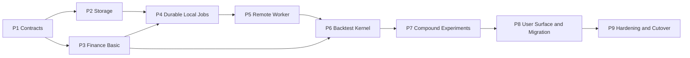

# StockStat V3.1 实现总路线

> 版本：V3.1 实现规划
> 日期：2026-07-21
> 状态：待实现
> 设计基线：[../designV31/DESIGN_ARCH_V31.md](../designV31/DESIGN_ARCH_V31.md)

## 1. 规划目的

本目录把 V3.1 目标架构拆成九个可独立验收的实现阶段。每个阶段必须形成可运行闭环，并通过阶段门禁后再进入下一阶段。实现顺序优先消除架构风险，而不是先堆叠全部金融功能或 UI。

V3.1 的最终调用链为：

```text
调用端 -> Dispatcher -> {Storage, N x Worker}
```

实现期间必须保持以下约束：

- 新代码不 import 当前 `frontend/stockstat`、`backend/stockstat_backend/dispatcher` 或 `worker/stockstat_compute`。
- 旧代码只作为行为基线、fixture 和 golden oracle。
- 不兼容 V2/V3 内部类、包结构和 wire protocol。
- 大表、市场数据、策略包和计算结果只通过 Snapshot/Artifact 数据面传递。
- 本地模式不得绕过 JobStore、lease、Worker 子进程和 Artifact commit。
- 新功能以独立 operation schema、descriptor、planner、executor 和 merger 接入。
- 不引入任意 Python 函数远程执行、任意 DAG、任意 SQL 或多级 Dispatcher。

## 2. 设计输入

| 文档 | 实现约束 |
|---|---|
| [总体架构](../designV31/DESIGN_ARCH_V31.md) | 模块边界、部署方式、功能迁移和切换条件 |
| [泛化边界](../designV31/DESIGN_GENERALIZE.md) | 首批 operation、未来扩展和禁止事项 |
| [Foundation](../designV31/DESIGN_ARCH_FOUNDATION_V31.md) | DTO、状态、digest、错误和环境指纹 |
| [Finance Kernel](../designV31/DESIGN_ARCH_FINANCE_V31.md) | 金融数据模型、研究计算和回测语义 |
| [Storage](../designV31/DESIGN_ARCH_STORAGE_V31.md) | revision、snapshot、artifact、lineage 和数据面 |
| [Dispatcher](../designV31/DESIGN_ARCH_DISPATCHER_V31.md) | Planner、JobStore、lease、retry 和 reducer |
| [Compute Worker](../designV31/DESIGN_ARCH_COMPUTE_V31.md) | capability、进程隔离、缓存和结果提交 |
| [Invocation](../designV31/DESIGN_ARCH_INVOCATION_V31.md) | SDK、CLI、DSL、Admin 和迁移入口 |
| [通信协议](../designV31/DESIGN_PROT_V31.md) | HTTP/JSON、SSE、Worker 和 Artifact 协议 |

## 3. 阶段依赖



P2 和 P3 可以在 P1 稳定后并行开发。P6 可以提前开发纯回测内核，但其正式阶段门禁必须在 P5 的真实远程执行链上通过。

## 4. 阶段摘要

| Phase | 主题 | 主要闭环 | 详细计划 |
|---|---|---|---|
| P1 | Contracts 与仓库骨架 | schema -> canonical digest -> 状态验证 | [P1.md](P1.md) |
| P2 | Storage 数据与资产 | ingest/import -> revision -> snapshot -> artifact | [P2.md](P2.md) |
| P3 | Finance 基础计算 | snapshot/table -> feature/statistics result | [P3.md](P3.md) |
| P4 | Durable Local Jobs | SDK submit -> durable Dispatcher -> LocalWorker -> result | [P4.md](P4.md) |
| P5 | 独立 Worker 与远程部署 | Client -> Dispatcher -> Worker -> Storage | [P5.md](P5.md) |
| P6 | 全新回测内核 | StrategyBundle -> deterministic intrabar backtest | [P6.md](P6.md) |
| P7 | 复合实验与 N Worker | plan DAG -> parallel units -> reducer -> final result | [P7.md](P7.md) |
| P8 | SDK/CLI/DSL/Admin/迁移 | 完整用户入口和旧客户功能迁移 | [P8.md](P8.md) |
| P9 | 硬化、性能与切换 | 故障、安全、性能、部署和删除旧 runtime | [P9.md](P9.md) |

## 5. 目标仓库结构

```text
packages/
├── contracts/
├── kernel/
├── sdk/
└── capabilities/
services/
├── storage/
├── dispatcher/
└── worker/
apps/
└── admin/
tests/
├── contracts/
├── kernel/
├── services/
├── e2e/
├── deployments/
├── parity/
├── failure/
├── security/
└── performance/
examples/
working/
└── PAXG-Weekend-Monday-Law-v31-native/
```

目录在对应阶段按需创建，不在 P1 创建没有实现内容的空包。包名和服务边界一旦进入 P4 公共 SDK 测试，不再随意重命名。

## 6. 跨阶段实现规则

### 6.1 契约优先

每个 operation 的实现顺序固定为：

1. 定义参数、输入、输出和错误 schema。
2. 定义 descriptor、实现版本、确定性和资源需求。
3. 实现纯 Kernel 或 executor。
4. 实现 planner/merger，仅在 operation 确实可分片时增加。
5. 增加本地、远程、失败和 parity 测试。
6. 发布到 operation discovery 和 SDK。

### 6.2 测试优先级

测试不只验证 happy path。每个阶段至少覆盖：

- 合法和非法契约。
- 重启后的持久性。
- 幂等请求和重复回调。
- 取消、超时或中断。
- digest、schema 和权限错误。
- 本地与远程等价性。
- 金融结果和分片确定性。

### 6.3 资产规则

- 测试 fixture 可以小，但必须使用真实 Arrow/Parquet schema。
- 任何超过控制面阈值的数据不得 base64 进入 JSON。
- 所有最终结果必须有 committed manifest。
- PAXG golden 必须记录输入文件 digest，不能只记录路径。
- 随机计算必须记录全局 seed 和 sample ID 规则。

### 6.4 依赖规则

| 包 | 允许 | 禁止 |
|---|---|---|
| contracts | 标准库、轻量 schema | pandas、numpy、HTTP、数据库 |
| kernel | contracts、numpy/pandas/scipy 和明确可选依赖 | Dispatcher、Storage、HTTP |
| storage | contracts、DB/blob/adapter | 回测 Kernel、JobStore |
| dispatcher | contracts、planner metadata、DB、Storage client | pandas、大结果解码 |
| worker | contracts、Kernel/capabilities、服务 client | Client facade、JobStore DB |
| sdk | contracts、HTTP/InProcess client | Worker runtime、服务数据库 |

通过静态 import 测试和包安装测试强制这些边界。

## 7. 测试通道

| Lane | 触发 | 内容 |
|---|---|---|
| fast | 每次提交 | contracts、纯数学、状态机、SDK 单元 |
| component | 每次提交 | SQLite、filesystem、单服务 API、Worker 子进程 |
| integration | 合并请求 | Dispatcher + Storage + Worker、PostgreSQL/MinIO |
| parity | 合并请求或 nightly | 旧指标 golden、PAXG 研究和代表回测 |
| deployment | nightly | local、storage-separated、remote、N Worker |
| failure | nightly | kill/restart/network/duplicate/stale/cancel races |
| performance | nightly/release | 数据面、缓存、并行扩展和控制面内存 |
| security | release | ACL、token、bundle、上传、路径和配额 |

平台差异测试至少覆盖 Windows 本地开发和 Linux 容器。生产级资源隔离、安全和性能门禁以 Linux 为准。

## 8. PAXG 验收链

PAXG v1-v7 是功能迁移的主验收用例，不是唯一单元测试来源。

| 阶段 | PAXG 证据 |
|---|---|
| P2 | 冻结 PAXG/BTC 1d/1h 输入，产生有 revision 和 digest 的 Snapshot |
| P3 | 构造 307 个 weekend-Monday 样本，复现 v1-v4、v6、v7 统计、非线性和前向预测验证 |
| P4 | 基础统计 Job 在 durable local runtime 完成并可重启恢复 |
| P5 | 同一研究 Job 在远程 Worker 上结果一致，数据不经过 Dispatcher |
| P6 | 52 个策略全部 native，完成 52 x 4 费率矩阵和关键策略 parity |
| P7 | grid、Monte Carlo、walk-forward 在 1/2/4/8 分片下结果一致 |
| P8 | 原生研究目录只使用公开 V3.1 SDK/CLI，不 import 服务或旧包 |
| P9 | 全链故障、性能、安全和部署门禁通过，输出完整 lineage 报告 |

固定研究基线：

- 时间范围：2020-08-28 至 2026-07-15/16。
- PAXG 1d：2,148 行。
- PAXG 1h：51,520 行。
- weekend-Monday 样本：307。
- 策略目录：52。
- 费率模型：4。
- 完整回测矩阵：208 次，不允许保留 `analysis_only`。
- 研究基准：B1 买入持有、B2 周一定投、B3 价格曲线收益，与策略结果统一比较。
- 代表策略：S9、S21、S45、S48、S51。

现有 `working/PAXG-Weekend-Monday-Law-v5-v31` 的 45 x 4 结果可作为中间 oracle，但不是最终验收，因为其中 7 个策略尚未原生表达。

## 9. 阶段完成定义

一个阶段只有同时满足以下条件才能标记完成：

1. 计划中所有必需交付物已实现，没有用占位类或跳过测试代替。
2. 阶段测试在干净环境可重复运行。
3. 新包可以从各自构建产物独立安装，未依赖源码目录偶然可见性。
4. 本阶段新增公开 schema 和 operation 有版本、示例和错误定义。
5. 失败路径不会产生虚假成功、悬空 manifest 或不可恢复状态。
6. 文档、OpenAPI/schema golden 和实现一致。
7. 没有新增对 V2/V3 runtime 的 import。
8. 阶段门禁证据保存在测试报告或 CI artifact 中。

## 10. 变更纪律

- `@1` operation 在 P4 首个 SDK 消费前可以调整；P4 后破坏语义必须新增主版本。
- PAXG golden 变更必须附公式或执行语义差异说明，不能直接覆盖期望值。
- 浮点容差按 operation 定义，不使用全局宽松容差掩盖回归。
- 失败测试发现架构缺口时优先修复基础层，不在 SDK 增加特殊分支。
- 不为尚无真实 operation 的 GPU、多级调度、checkpoint 或多 Transport 增加占位基础设施。

## 11. 切换原则

P1-P8 期间新旧代码可以并存，但只有 V3.1 新代码接受功能开发。P9 达到切换门禁后：

1. 将主 README、安装、示例和容器入口切到 V3.1。
2. 标记旧服务和包停止支持，不继续双写或双维护。
3. 提供数据 importer 和代码迁移报告，不提供长期 runtime shim。
4. 删除旧 Dispatcher/Worker/兼容层及其部署入口。
5. 保留 golden fixtures、研究报告和必要的历史文档。

## 12. 不按阶段实现的内容

以下内容不属于 P1-P9 首次切换范围：

- 多级 Dispatcher 级联。
- 任意函数、shell、HTTP、SQL 混合工作流。
- 可恢复抢占和通用 checkpoint。
- 任意未签名 Python 闭包远程执行。
- 同时维护 TCP、Redis、共享内存等应用协议。
- 没有真实用例的 GPU 调度。
- 完整因子、组合、ML、期权和订单簿平台。

这些能力只有满足 [泛化边界](../designV31/DESIGN_GENERALIZE.md) 中的新 operation 接入标准后，才在 V3.1 后续版本单独规划。
