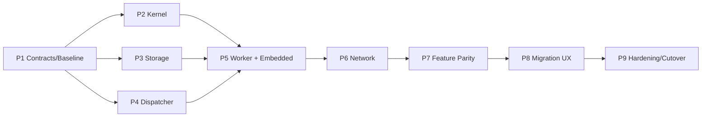

# StockStat V3.1 分步实现与测试计划

> 日期：2026-07-20
> 目标设计：[../designV31/DESIGN_ARCH_V31.md](../designV31/DESIGN_ARCH_V31.md)
> 通讯协议：[../designV31/DESIGN_PROT_V31.md](../designV31/DESIGN_PROT_V31.md)

## 1. 使用方式

本目录是 V3.1 完全重构的实施门禁。每个 `P*.md` 是一个独立验收阶段；必须满足当前阶段退出条件后才能进入下一阶段。

实施期间遵循：

- 旧 `frontend/`、`backend/`、`worker/` 保持可运行，用于生成和复核行为基线。
- 新代码仅写入 V3.1 新目录，不通过兼容导入调用旧实现。
- 每阶段包含实现、测试、文档和可运行演示，不把验证集中到最后。
- 每阶段先做最小正确 vertical slice，再扩展覆盖。
- P9 切换前不删除旧代码；P9 切换后不长期双轨维护。
- 旧、新 SDK 都使用 `stockstat` import 名，实施期固定使用 `.venv-legacy` 与 `.venv-v31`，不得同环境安装。
- 阶段中发现协议或架构冲突时，先更新对应设计文档和 ADR，再修改代码。

## 2. 阶段总览

| 阶段 | 主题 | 核心产出 | 主要门禁 |
|---|---|---|---|
| [P1](P1.md) | 基线与 Contracts | 新包骨架、协议 schema、legacy golden | 无跨层依赖、schema/golden 稳定 |
| [P2](P2.md) | Finance Kernel | 单一指标目录、单次回测内核、规范结果 | 现有指标/代表回测 parity |
| [P3](P3.md) | Storage 与 Artifact | OHLCV、快照、LocalFS/S3 adapter、迁移器 | 主库一次快照、Artifact 完整性 |
| [P4](P4.md) | 持久 Dispatcher | Job/Stage/Work/Attempt、Planner、事件、幂等 | 重启恢复、状态机/竞争正确 |
| [P5](P5.md) | Worker 与 Embedded E2E | spawn Worker、Lease/fencing、`StockStat.local()` | 崩溃重试、旧 Attempt 拒绝、本地完整链路 |
| [P6](P6.md) | 网络与多节点 | HTTP/SSE、真实多进程、多 Worker 部署 | 非 TestClient E2E、事件续读、带宽目标 |
| [P7](P7.md) | 金融功能完整迁移 | 搜索、批量、Monte Carlo、Walk-forward、完整回测 | 当前功能矩阵全部 parity |
| [P8](P8.md) | SDK、DSL 与客户迁移 | 公共 API、CLI、策略打包、迁移扫描、结果/可视化 | README/PAXG 迁移、无旧运行时依赖 |
| [P9](P9.md) | 生产加固与切换 | PG/Redis/S3、HA、安全、可观测、发布切换 | chaos/perf/security/go-no-go 全通过 |

## 3. 依赖关系



P2、P3、P4 在人员允许时可部分并行，但共享 Contracts 的任何修改必须先合入 P1 并更新 golden schema。

## 4. 通用测试层

每个阶段按适用范围增加以下测试：

| 层 | 目标目录 | 内容 |
|---|---|---|
| Contract | `tests_v31/contracts/` | schema、canonical JSON、golden、依赖边界 |
| Kernel | `tests_v31/kernel/` | 金融算法、状态机、数值 parity |
| Component | `tests_v31/services/` | Storage/Dispatcher/Worker 单组件 |
| Embedded E2E | `tests_v31/e2e/test_embedded_*` | 无网络完整链路 |
| Network E2E | `tests_v31/e2e/test_network_*` | 真实端口与独立进程 |
| Migration | `tests_v31/migration/` | 旧/新 API 和结果对比 |
| Fault | `tests_v31/fault/` | crash、超时、重复、恢复、网络分区 |
| Performance | `tests_v31/performance/` | 延迟、吞吐、内存、带宽、加速比 |
| Security | `tests_v31/security/` | 权限、签名、反序列化、路径与配额 |

## 5. Golden 数据规范

Golden 不使用旧 pickle 作为唯一真值。建议格式：

```text
tests_v31/fixtures/
├── market/*.arrow
├── indicators/*.{arrow,json}
├── backtests/*/
│   ├── manifest.json
│   ├── equity.arrow
│   ├── fills.arrow
│   └── metrics.json
├── experiments/*.json
└── protocol/*.json
```

每个 fixture 记录：

- 生成用旧 commit。
- Python、pandas、numpy 版本。
- 数据摘要。
- 参数和随机种子。
- comparison policy。
- 已知平台差异。

## 6. 通用完成定义

每个阶段完成必须同时满足：

- 实现任务全部完成。
- 本阶段新增测试全通过。
- 受影响的此前阶段测试全通过。
- 无未解释的 skip 或 xfail。
- 新公开 schema/API 有文档和 fixture。
- 新服务可通过明确命令启动和停止。
- 资源、线程、临时文件和子进程测试后无泄漏。
- 已知限制写入当前阶段文档，不以 TODO 冒充完成。

## 7. 目标测试命令

具体命令在创建 workspace 配置时固定，目标形式为：

```bash
python -m pytest tests_v31/contracts -q
python -m pytest tests_v31/kernel -q
python -m pytest tests_v31/services -q
python -m pytest tests_v31/e2e -q
python -m pytest tests_v31/migration -q
python -m pytest tests_v31/fault -q
python -m pytest tests_v31/performance -q
python -m pytest tests_v31/security -q
```

CI 应提供 Linux 主验证，Windows 覆盖 Embedded、spawn Worker、LocalFS Artifact 与基础网络 E2E。生产 adapter 集成测试使用容器服务运行 PostgreSQL、Redis 和 MinIO。
