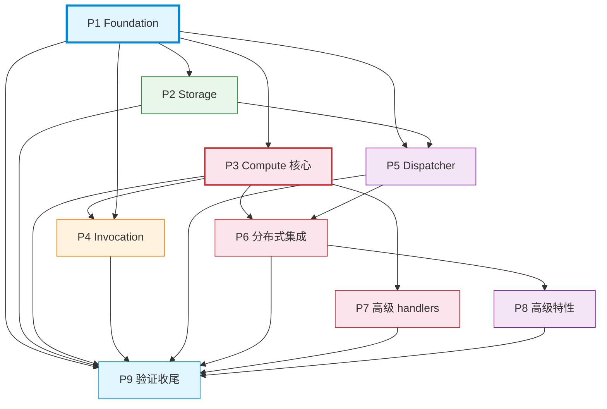

# realizeV31 — StockStat V3.1 分步实现规划

> **版本**：v3.1
> **日期**：2026-07-24
> **状态**：规划稿
> **关联**：[../designV31/](../designV31/) — 架构设计文档
>
> **目的**：将 V3.1 完全重构拆解为 9 个可独立交付的 Phase，每 Phase 有明确的目标、依赖、实现内容、测试计划和验收标准。

---

## 目录

1. [总览](#1-总览)
2. [Phase 依赖关系](#2-phase-依赖关系)
3. [各 Phase 概览](#3-各-phase-概览)
4. [里程碑](#4-里程碑)
5. [测试策略](#5-测试策略)
6. [回滚策略](#6-回滚策略)

---

## 1. 总览

V3.1 分 9 个 Phase，按"协议底座 → 存储端 → 计算端 → 用户入口 → 分发端 → 分布式集成 → 高级 handler → 高级特性 → 验证"的顺序交付：

| Phase | 名称 | 主要内容 | 依赖 | 预计耗时 | 测试数 |
|-------|------|---------|------|---------|--------|
| **P1** | Foundation | 协议/传输/契约/错误/配置 | — | 1.5 周 | 147 |
| **P2** | Storage | ORM + REST + Adapters + Admin | P1 | 1 周 | 125 |
| **P3** | Compute 核心 | BacktestEngine 迁移 + Tier 1 handlers + LocalBackend | P1 | 2 周 | 350 |
| **P4** | Invocation | Client + ComputeAPI + DSL + CLI + _compat | P1, P3 | 1.5 周 | 170 |
| **P5** | Dispatcher | 调度 + 预取 + 分片 + 合并 + Worker 管理 | P1, P2 | 2 周 | 220 |
| **P6** | 分布式集成 | RemoteBackend + Worker + AutoBackend + E2E | P3, P5 | 1.5 周 | 80 |
| **P7** | 高级 handlers | Tier 2~6（统计/信号/非线性/灰色/ML） | P3 | 2.5 周 | 200 |
| **P8** | 高级特性 | SHM + Redis + 抢占 + 多级 + 流式 | P6 | 2 周 | 100 |
| **P9** | 验证与收尾 | PAXG 一致性 + 部署测试 + 文档 + Tier 7 | 全部 | 1.5 周 | 90 |
| **合计** | | | | **15.5 周** | **1482** |

---

## 2. Phase 依赖关系


```mermaid
graph TB
    P1[P1 Foundation]
    P2[P2 Storage]
    P3[P3 Compute 核心]
    P4[P4 Invocation]
    P5[P5 Dispatcher]
    P6[P6 分布式集成]
    P7[P7 高级 handlers]
    P8[P8 高级特性]
    P9[P9 验证收尾]

    P1 --> P2
    P1 --> P3
    P3 --> P4
    P1 --> P4
    P1 --> P5
    P2 --> P5
    P3 --> P6
    P5 --> P6
    P3 --> P7
    P6 --> P8
    P1 --> P9
    P2 --> P9
    P3 --> P9
    P4 --> P9
    P5 --> P9
    P6 --> P9
    P7 --> P9
    P8 --> P9

    style P1 fill:#e1f5ff,stroke:#0288d1,stroke-width:3px
    style P2 fill:#e8f5e9,stroke:#388e3c
    style P3 fill:#fce4ec,stroke:#c62828,stroke-width:2px
    style P4 fill:#fff3e0,stroke:#f57c00
    style P5 fill:#f3e5f5,stroke:#7b1fa2
    style P6 fill:#fce4ec,stroke:#c62828
    style P7 fill:#fce4ec,stroke:#c62828
    style P8 fill:#f3e5f5,stroke:#7b1fa2
    style P9 fill:#e1f5ff,stroke:#0288d1
```

**关键路径**：P1 → P3 → P4 → P6 → P9（最长依赖链）

**可并行**：
- P2 与 P3 可并行（都依赖 P1）
- P5 与 P4 可并行（P5 依赖 P1+P2，P4 依赖 P1+P3）
- P7 与 P8 可并行（P7 依赖 P3，P8 依赖 P6）

---

## 3. 各 Phase 概览

### P1 — Foundation 基础层

- **目标**：建立协议底座，提供 Envelope/TaskSpec/Transport/Codec/Contracts
- **详见**：[P1.md](P1.md)
- **关键产出**：`stockstat-foundation` 包

### P2 — Storage 存储端

- **目标**：OHLCV 数据持久化、查询、采集
- **详见**：[P2.md](P2.md)
- **关键产出**：`stockstat-backend` 包

### P3 — Compute 核心（BacktestEngine + Tier 1）

- **目标**：迁移 BacktestEngine + 实现 6 个 Tier 1 handler + LocalComputeBackend
- **详见**：[P3.md](P3.md)
- **关键产出**：`stockstat-compute` 包（核心部分）

### P4 — Invocation 用户入口

- **目标**：StockStatClient + ComputeAPI + DSL + CLI + V2 迁移辅助
- **详见**：[P4.md](P4.md)
- **关键产出**：`stockstat` 包

### P5 — Dispatcher 分发端

- **目标**：任务调度、数据预取、分片、合并、Worker 管理
- **详见**：[P5.md](P5.md)
- **关键产出**：`stockstat-dispatcher` 包

### P6 — 分布式集成

- **目标**：RemoteComputeBackend + Worker 进程 + AutoBackend + 端到端测试
- **详见**：[P6.md](P6.md)
- **关键产出**：完整分布式链路

### P7 — 高级 handlers（Tier 2~6）

- **目标**：实现 31 个高级 task_type（统计/信号/非线性/灰色/ML）
- **详见**：[P7.md](P7.md)
- **关键产出**：PAXG v7 全部计算能力

### P8 — 高级特性

- **目标**：SHM 传输 + Redis 队列 + 抢占/恢复 + 多级 Dispatcher + 流式结果
- **详见**：[P8.md](P8.md)
- **关键产出**：生产级分布式能力

### P9 — 验证与收尾

- **目标**：PAXG v1~v7 一致性验证 + 6 部署场景测试 + Tier 7 预留 + 文档
- **详见**：[P9.md](P9.md)
- **关键产出**：生产就绪版本

---

## 4. 里程碑

| 里程碑 | 完成 Phase | 能力 | 对应 PAXG |
|--------|-----------|------|----------|
| **M1: 协议就绪** | P1 | 跨进程通信能力 | — |
| **M2: 存储就绪** | P2 | OHLCV 数据服务 | v1~v7 数据基础 |
| **M3: 单机回测** | P3, P4 | 本地 BacktestEngine + Client | v5-redo 132 回测 |
| **M4: 分布式回测** | P5, P6 | Dispatcher + Worker 集群 | v5-redo 并行加速 |
| **M5: 统计能力** | P7 | 统计/信号/非线性/灰色/ML | v7 全路线 |
| **M6: 生产就绪** | P8, P9 | SHM/Redis/抢占/多级 + 验证 | 全部 PAXG |

---

## 5. 测试策略

### 5.1 测试金字塔

```
                    ┌─────────────┐
                    │  PAXG 一致性  │  ← 20 项（端到端结果一致）
                    ├─────────────┤
                    │  部署场景    │  ← 60 项（Case A-F）
                    ├─────────────┤
                    │  端到端测试  │  ← 55 项（Client → Dispatcher → Worker）
                    ├─────────────┤
                    │  集成测试    │  ← 50 项（跨模块）
                    ├─────────────┤
                    │  单元测试    │  ← 1297 项（模块内部）
                    └─────────────┘
```

### 5.2 关键回归测试

每个 Phase 完成后必须通过的回归测试：

| Phase | 回归测试 |
|-------|---------|
| P1 | Foundation 147 项单元测试 |
| P2 | Storage 125 项 + P1 回归 |
| P3 | **BacktestEngine 277 项**（从 V2 迁移，零修改）+ P1 回归 |
| P4 | Invocation 170 项 + **PAXG v5-redo 132 回测** + P1~P3 回归 |
| P5 | Dispatcher 220 项 + P1~P3 回归 |
| P6 | E2E 80 项 + **本地/远程结果一致性** + P1~P5 回归 |
| P7 | Tier 2~6 handlers 200 项 + P1~P6 回归 |
| P8 | 高级特性 100 项 + P1~P7 回归 |
| P9 | **PAXG v1~v7 全部研究复现** + 部署场景 60 项 + 全量回归 |

### 5.3 持续集成

```bash
# 每个 Phase 的 CI 流程
pytest tests/foundation/ -v              # P1
pytest tests/storage/ -v                 # P2
pytest tests/compute/ -v                 # P3
pytest tests/invocation/ -v              # P4
pytest tests/dispatcher/ -v              # P5
pytest tests/e2e/ -v                     # P6
pytest tests/handlers_advanced/ -v       # P7
pytest tests/advanced/ -v                # P8
pytest tests/paxg_compat/ -v             # P9
pytest tests/deployments/ -v             # P9

# 全量回归
pytest tests/ -v --tb=short
```

---

## 6. 回滚策略

### 6.1 Phase 级回滚

每个 Phase 是独立的 git 分支，失败时可回滚到上一 Phase：

```bash
# 假设 P3 失败，回滚到 P2
git checkout v31-p2-stable
# 修复后重新开始 P3
```

### 6.2 模块级回滚

5 大模块独立包，可单独回滚：

```bash
# Foundation 回滚（影响所有模块）
pip install stockstat-foundation==1.0.0  # 降级

# Compute 回滚（不影响 Storage/Dispatcher）
pip install stockstat-compute==1.0.0
```

### 6.3 功能开关

高风险特性通过配置开关控制：

```bash
STOCKSTAT_DISPATCHER_ENABLED=false       # 关闭 Dispatcher
STOCKSTAT_DISPATCHER_QUEUE=memory        # 用内存队列（不用 Redis）
STOCKSTAT_DEFAULT_BACKEND=local          # 强制本地后端
```

---

## 7. 详细 Phase 文档

| Phase | 文档 |
|-------|------|
| P1 | [P1.md](P1.md) |
| P2 | [P2.md](P2.md) |
| P3 | [P3.md](P3.md) |
| P4 | [P4.md](P4.md) |
| P5 | [P5.md](P5.md) |
| P6 | [P6.md](P6.md) |
| P7 | [P7.md](P7.md) |
| P8 | [P8.md](P8.md) |
| P9 | [P9.md](P9.md) |

---

*本文件为 V3.1 分步实现规划总览。各 Phase 详细内容见对应 P*.md 文件。*
