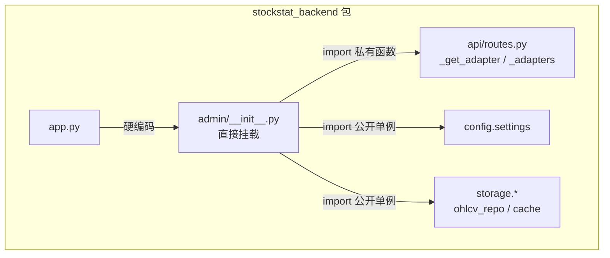
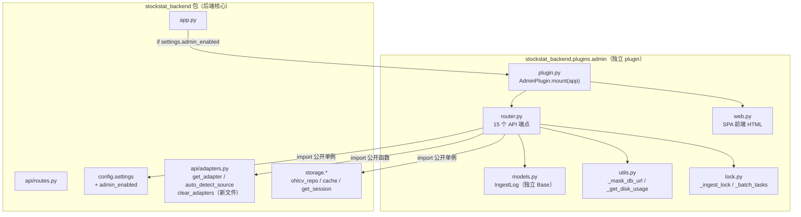

# StockStat Admin Plugin 设计与实现文档

> **版本**: v1.0
> **日期**: 2026-07-18
> **状态**: 设计中
> **关联**: DESIGN_V2_CN §12.2 网页管理界面；WEB_ADMIN_DESIGN_CN.md

---

## 目录

1. [设计目标](#1-设计目标)
2. [现状分析](#2-现状分析)
3. [Plugin 化架构设计](#3-plugin-化架构设计)
4. [后端接口暴露](#4-后端接口暴露)
5. [Admin Plugin 包结构](#5-admin-plugin-包结构)
6. [API 端点清单](#6-api-端点清单)
7. [功能逐项可行性](#7-功能逐项可行性)
8. [请求冲突处理](#8-请求冲突处理)
9. [可配置挂载](#9-可配置挂载)
10. [向后兼容性](#10-向后兼容性)
11. [实现路径](#11-实现路径)

---

## 1. 设计目标

将网页管理界面从后端硬编码挂载重构为**可插拔的独立 plugin**，实现：

| 目标 | 说明 |
|------|------|
| **可配置开关** | 通过环境变量/配置文件控制是否加载 admin plugin |
| **物理隔离** | admin 代码在后端包内的独立子包中，不侵入主路由 `routes.py` |
| **最小后端改动** | 后端仅暴露 3 个已有函数的公开版本，零行为变更 |
| **功能完整** | 重构后支持全部 16 项管理功能，无功能损失 |
| **独立 ORM** | IngestLog 表使用独立 DeclarativeBase，不修改后端的 `models/ohlcv.py` |

---

## 2. 现状分析

### 2.1 当前实现

```
backend/stockstat_backend/
├── app.py                 ← 硬编码 mount_admin(app)
├── api/routes.py          ← _get_adapter / _auto_detect_source / _adapters（私有）
├── admin/__init__.py      ← 1094 行，直接 import 后端内部模块
├── config.py              ← settings 全局单例
├── storage/               ← database / repository / cache
├── models/ohlcv.py        ← 后端 ORM
└── adapters/              ← 数据源适配器
```

### 2.2 问题

| 问题 | 严重性 | 说明 |
|------|--------|------|
| `app.py` 硬编码挂载 | 中 | 无法关闭 admin，生产部署可能不想暴露管理界面 |
| 直接 import `_get_adapter` | 高 | 私有函数，后端重构时可能改名/删除，admin 跟着崩 |
| 直接操作 `_adapters` 字典 | 高 | 代理更新时直接改 `routes.py` 的内部状态，耦合 |
| admin 与后端同包 | 低 | 物理上在 `admin/` 子目录，但不是独立包，无法单独安装 |

### 2.3 admin 对后端的依赖关系

admin 当前导入 8 个后端符号：

| 导入来源 | 符号 | 用途 | 可见性 |
|---------|------|------|--------|
| `config` | `settings` | 读 DB URL / 代理 / 缓存 TTL | ✅ 公开（全局单例） |
| `storage.database` | `get_engine` | 健康检查（`SELECT 1`） | ✅ 公开 |
| `storage.database` | `get_session` | DB 事务 | ✅ 公开 |
| `storage.repository` | `ohlcv_repo` | 查询/计数/删除 OHLCV | ✅ 公开 |
| `storage.repository` | `symbol_repo` | 查询/注册标的 | ✅ 公开 |
| `storage.cache` | `cache` | 缓存查看/清空 | ✅ 公开 |
| `api.routes` | `_get_adapter` | 获取数据源适配器 | ❌ 私有（下划线前缀） |
| `api.routes` | `_auto_detect_source` | 自动检测数据源 | ❌ 私有（下划线前缀） |
| `api.routes` | `_adapters` | 适配器缓存（代理更新时清空） | ❌ 私有（模块级 dict） |

**6 个已公开，3 个需暴露。**

---

## 3. Plugin 化架构设计

### 3.1 架构对比

**重构前（硬编码）：**



**重构后（plugin）：**



### 3.2 核心设计决策

| 决策 | 选择 | 理由 |
|------|------|------|
| plugin 物理位置 | `backend/stockstat_backend/plugins/admin/` | 在后端包内但独立子包；不需要单独 pip install |
| 挂载方式 | `app.py` 中 `if settings.admin_enabled` 条件调用 | 可配置开关；生产可关闭 |
| 适配器访问 | 后端新增 `api/adapters.py` 公开接口 | 不改 `routes.py` 行为，只提取公开包装 |
| ORM 隔离 | plugin 自己的 `DeclarativeBase` | 不侵入后端 `models/ohlcv.py` |
| 配置 | `settings.admin_enabled`（新字段，默认 `True`） | 向后兼容（默认开启） |

---

## 4. 后端接口暴露

### 4.1 新增文件 `api/adapters.py`

将 `routes.py` 中的私有适配器管理逻辑提取为公开接口：

```python
# stockstat_backend/api/adapters.py

"""Public adapter management API.

Extracted from routes.py to allow plugins (e.g. admin) to access
data source adapters without importing private symbols.
"""
from __future__ import annotations

from typing import Optional

from ..config import settings
from ..adapters.yahoo_direct import YahooDirectAdapter
from ..adapters.ccxt_adapter import CcxtAdapter
from ..adapters.synthetic import SyntheticAdapter

# Module-level adapter cache (same dict as routes.py)
_adapters: dict = {}


def get_adapter(source: str):
    """Get or create a data source adapter by name.

    Cached per source name. Uses current proxy settings.
    """
    if source not in _adapters:
        proxies = settings.proxy.proxies
        if source == "yfinance":
            _adapters[source] = YahooDirectAdapter(proxy=proxies)
        elif source == "binance":
            _adapters[source] = CcxtAdapter("binance", proxies=proxies)
        elif source == "coinbase":
            _adapters[source] = CcxtAdapter("coinbase", proxies=proxies)
        elif source == "synthetic":
            _adapters[source] = SyntheticAdapter()
        else:
            raise ValueError(f"Unknown source: {source}")
    return _adapters[source]


def auto_detect_source(symbol: str) -> str:
    """Auto-detect data source from symbol format.

    Symbols containing '/' → binance (crypto)
    Symbols without '/' → yfinance (stock)
    """
    if "/" in symbol:
        return "binance"
    return "yfinance"


def clear_adapters():
    """Clear all cached adapters.

    Called after proxy configuration changes to force adapter
    rebuild with new proxy settings on next access.
    """
    _adapters.clear()
```

### 4.2 `routes.py` 改动

`routes.py` 中将 `_get_adapter` / `_auto_detect_source` / `_adapters` 替换为从 `adapters.py` 导入：

```python
# routes.py 改动（仅 import 行）
# 删除:
#   _adapters = {}
#   def _get_adapter(source): ...
#   def _auto_detect_source(symbol): ...

# 替换为:
from .adapters import get_adapter as _get_adapter, auto_detect_source as _auto_detect_source, clear_adapters
```

**行为完全不变**——`routes.py` 内部继续用 `_get_adapter` / `_auto_detect_source`，只是定义移到了 `adapters.py`。`_adapters` 字典也在 `adapters.py` 中，`routes.py` 和 `admin plugin` 共享同一个缓存。

### 4.3 `config.py` 改动

`Settings` 新增 `admin_enabled` 字段：

```python
@dataclass
class Settings:
    # ... 现有字段 ...
    admin_enabled: bool = field(
        default_factory=lambda: os.environ.get(
            "STOCKSTAT_ADMIN_ENABLED", "true"
        ).lower() in ("1", "true", "yes", "on")
    )
```

环境变量 `STOCKSTAT_ADMIN_ENABLED=false` 可关闭 admin。默认 `true` 保证向后兼容。

---

## 5. Admin Plugin 包结构

```
backend/stockstat_backend/plugins/
├── __init__.py                    # plugins 包入口
└── admin/                         # admin plugin
    ├── __init__.py                # 公开导出: AdminPlugin
    ├── plugin.py                  # AdminPlugin 类: mount(app) / unmount(app)
    ├── router.py                  # 15 个 API 端点（从现有 admin/__init__.py 迁移）
    ├── web.py                     # SPA 前端 HTML 字符串（从现有迁移）
    ├── models.py                  # IngestLog ORM（独立 _AdminBase）
    ├── utils.py                   # _mask_db_url / _get_disk_usage / _log_operation
    └── lock.py                    # _ingest_lock / _batch_tasks（线程安全状态）
```

### 5.1 各文件职责

| 文件 | 职责 | 行数估计 |
|------|------|---------|
| `plugin.py` | `AdminPlugin` 类：`mount(app)` 挂载路由+HTML；`unmount(app)` 卸载 | ~30 |
| `router.py` | 15 个 API 端点（health/config/proxy/cache/disk/symbols/sources/ingest/batch/logs/stats） | ~400 |
| `web.py` | 27KB SPA HTML 字符串 | ~600 |
| `models.py` | `IngestLog` ORM + `_AdminBase` + `_ensure_log_table()` | ~40 |
| `utils.py` | `_mask_db_url()` / `_get_disk_usage()` / `_log_operation()` | ~60 |
| `lock.py` | `_ingest_lock` (threading.Lock) / `_batch_tasks` dict | ~10 |

### 5.2 AdminPlugin 类设计

```python
# plugins/admin/plugin.py

class AdminPlugin:
    """Web admin interface plugin.

    Mountable on any FastAPI app. Provides:
    - REST API at /admin/api/*
    - Web UI at /admin/

    Controlled by settings.admin_enabled (default: true).
    """

    name = "admin"
    version = "1.0"

    @staticmethod
    def mount(app) -> None:
        """Mount admin routes and web UI on the app."""
        from .router import create_admin_router
        from .web import ADMIN_HTML
        from fastapi.responses import HTMLResponse

        router = create_admin_router()
        app.include_router(router)

        @app.get("/admin", response_class=HTMLResponse)
        @app.get("/admin/", response_class=HTMLResponse)
        async def admin_ui():
            return HTMLResponse(content=ADMIN_HTML)

    @staticmethod
    def unmount(app) -> None:
        """Remove admin routes from the app (for testing)."""
        # FastAPI doesn't natively support route removal;
        # in practice, just don't call mount() if disabled.
        pass
```

### 5.3 app.py 改动

```python
# app.py

def create_app() -> FastAPI:
    app = FastAPI(...)
    app.include_router(router)

    # Conditionally mount admin plugin
    from .config import settings
    if settings.admin_enabled:
        from .plugins.admin import AdminPlugin
        AdminPlugin.mount(app)

    return app
```

---

## 6. API 端点清单

plugin 化后全部 15 个端点保持不变：

| 端点 | 方法 | 功能 | 依赖 |
|------|------|------|------|
| `/admin/api/health` | GET | DB + 缓存 + 代理状态 | `settings` / `get_engine` / `cache` |
| `/admin/api/config` | GET | 配置查看 | `settings` |
| `/admin/api/proxy` | PUT | 代理在线修改 | `settings` + `clear_adapters()` |
| `/admin/api/cache` | GET | 缓存信息 | `cache` |
| `/admin/api/cache` | DELETE | 清空缓存 | `cache` |
| `/admin/api/disk` | GET | 磁盘空间 | `os.statvfs`/`ctypes` |
| `/admin/api/symbols` | GET | 本地标的列表 | `ohlcv_repo` / `symbol_repo` / `get_session` |
| `/admin/api/symbols/{symbol:path}` | DELETE | 删除标的数据 | `ohlcv_repo` / `symbol_repo` / `get_session` / `cache` |
| `/admin/api/sources` | GET | 数据源列表 | 硬编码 |
| `/admin/api/sources/{source}/symbols` | GET | 浏览数据源目录 | `get_adapter()` / `symbol_repo` |
| `/admin/api/sources/{source}/info` | GET | 数据源时间范围 | 硬编码 + `ohlcv_repo` |
| `/admin/api/ingest` | POST | 采集数据 | `get_adapter()` / `auto_detect_source()` / `normalize_ohlcv` / `ohlcv_repo` / `cache` |
| `/admin/api/ingest/batch` | POST | 批量采集 | 同上 + 线程 |
| `/admin/api/ingest/progress/{batch_id}` | GET | 批量进度 | `_batch_tasks` |
| `/admin/api/stats` | GET | 聚合统计 | `ohlcv_repo` / `symbol_repo` |
| `/admin/api/logs` | GET | 采集历史 | `IngestLog` / `get_session` |

---

## 7. 功能逐项可行性

| # | 功能 | 依赖 | plugin 可行？ | 说明 |
|---|------|------|-------------|------|
| 1 | 健康检查 | `settings`/`get_engine`/`cache` | ✅ | 全局单例，直接 import |
| 2 | 配置查看 | `settings` | ✅ | 全局单例 |
| 3 | 代理在线修改 | `settings` + `clear_adapters()` | ✅ | 新增 `clear_adapters()` 公开函数 |
| 4 | 缓存查看/清空 | `cache` | ✅ | 全局单例 |
| 5 | 磁盘监控 | `os`/`ctypes` | ✅ | 无后端依赖 |
| 6 | 本地标的列表 | `ohlcv_repo`/`symbol_repo`/`get_session` | ✅ | 全局单例 |
| 7 | 删除标的数据 | `ohlcv_repo`/`symbol_repo`/`cache` | ✅ | 全局单例 |
| 8 | 数据源列表 | 硬编码 | ✅ | 无依赖 |
| 9 | 浏览数据源目录 | `get_adapter()` | ✅ | 新公开函数 |
| 10 | 数据源时间范围 | 硬编码 + `ohlcv_repo` | ✅ | 全局单例 |
| 11 | 采集数据 | `get_adapter()`/`auto_detect_source()`/`normalize_ohlcv` | ✅ | 新公开函数 |
| 12 | 批量采集 | 同 11 + 线程 | ✅ | 同上 |
| 13 | 批量进度 | `_batch_tasks` | ✅ | plugin 内部状态 |
| 14 | 采集历史日志 | `IngestLog`/`get_session` | ✅ | 独立 ORM + 全局单例 |
| 15 | 聚合统计 | `ohlcv_repo`/`symbol_repo` | ✅ | 全局单例 |
| 16 | K 线图/导出 CSV | 前端 fetch `/api/v1/ohlcv` | ✅ | 走现有公开端点 |

**16/16 功能完全可行。**

---

## 8. 请求冲突处理

plugin 化后冲突处理机制不变：

| 机制 | 位置 | 说明 |
|------|------|------|
| `_ingest_lock` (threading.Lock) | `plugins/admin/lock.py` | 串行化所有 ingest/delete 操作（SQLite 写安全） |
| `_batch_tasks` dict | `plugins/admin/lock.py` | 批量任务进度跟踪（batch_id → 状态） |
| `clear_adapters()` | `api/adapters.py` | 代理更新时原子清空适配器缓存 |
| `_ensure_log_table()` | `plugins/admin/models.py` | 首次调用时创建 IngestLog 表（线程安全标志 `_log_table_created`） |

### 8.1 并发场景分析

| 场景 | 冲突点 | 处理 |
|------|--------|------|
| 两个用户同时 ingest 同一标的 | SQLite 写锁冲突 | `_ingest_lock` 串行化 |
| 用户 ingest + 另一用户删除同一标的 | 读写冲突 | `_ingest_lock` 串行化（ingest 和 delete 共用同一锁） |
| 代理更新 + 正在 ingest | 适配器被清空 | `clear_adapters()` 只清缓存不清当前正在用的实例；下一个请求才重建 |
| 批量 ingest + 单个 ingest | 锁竞争 | 批量 ingest 在后台线程中也需要获取 `_ingest_lock` |
| 前端刷新 + 后台批量任务 | 读读不冲突 | 无需处理 |

### 8.2 代理更新的原子性

```
用户 PUT /admin/api/proxy
  → settings.proxy = ProxyConfig(...)      # 原子赋值（Python GIL 保证）
  → clear_adapters()                        # 清空 _adapters 字典
  → 下次 get_adapter() 时用新 proxy 重建     # 惰性重建

正在执行的 ingest:
  → 已持有 adapter 实例引用                  # 不受 clear 影响
  → 用旧 proxy 完成当前请求                  # 安全
  → 下次请求用新 proxy                       # 自动切换
```

---

## 9. 可配置挂载

### 9.1 配置方式

```bash
# 默认开启（向后兼容）
python -m uvicorn stockstat_backend.app:app

# 关闭 admin
STOCKSTAT_ADMIN_ENABLED=false python -m uvicorn stockstat_backend.app:app

# Docker
docker run -e STOCKSTAT_ADMIN_ENABLED=false ...
```

### 9.2 配置优先级

```
环境变量 STOCKSTAT_ADMIN_ENABLED
  ↓
Settings.admin_enabled 字段（默认 true）
  ↓
app.py 中 if settings.admin_enabled: AdminPlugin.mount(app)
```

### 9.3 运行时不可切换

admin 的挂载在 `create_app()` 时决定（FastAPI 启动时）。运行时修改 `settings.admin_enabled` 不会立即生效——需要重启服务。这是 FastAPI 的固有限制（路由在启动时注册），不是 plugin 设计的缺陷。

---

## 10. 向后兼容性

| 维度 | 重构前 | 重构后 | 兼容？ |
|------|--------|--------|--------|
| `/admin/` 访问 | ✅ 可访问 | ✅ 可访问（默认开启） | ✅ |
| `/admin/api/*` 端点 | 15 个 | 15 个（完全相同） | ✅ |
| 前端 SPA | 不变 | 不变（迁移到 `web.py`） | ✅ |
| `routes.py` 行为 | `_get_adapter` etc. | 改为从 `adapters.py` import，行为不变 | ✅ |
| `_adapters` 缓存 | `routes.py` 模块级 | `adapters.py` 模块级（同一 dict） | ✅ |
| 环境变量 | 无 `STOCKSTAT_ADMIN_ENABLED` | 新增，默认 `true` | ✅ |
| IngestLog 表 | `admin/__init__.py` 内 | `plugins/admin/models.py` 内（独立 Base） | ✅ |
| 后端测试 | 15 passed | 15 passed（行为不变） | ✅ |

**零破坏性变更。** 所有现有 API、前端行为、测试用例在重构后保持不变。

---

## 11. 实现路径

### 11.1 步骤总览


### 11.2 详细步骤

#### Step 1: 后端暴露公开接口

**文件**: `backend/stockstat_backend/api/adapters.py`（新建）

将 `routes.py` 中的 `_get_adapter` / `_auto_detect_source` / `_adapters` 提取到 `adapters.py`，函数名去掉下划线前缀，新增 `clear_adapters()`。

**文件**: `backend/stockstat_backend/api/routes.py`（修改）

删除 `_get_adapter` / `_auto_detect_source` / `_adapters` 的定义，改为从 `adapters.py` import。内部代码继续用 `_get_adapter` / `_auto_detect_source` 名称（通过 import as）。

**文件**: `backend/stockstat_backend/config.py`（修改）

`Settings` 新增 `admin_enabled` 字段。

**改动量**: 1 个新文件 + 2 个文件各改 ~5 行

#### Step 2: 创建 plugins/admin 包

**文件**:
```
backend/stockstat_backend/plugins/__init__.py          (空)
backend/stockstat_backend/plugins/admin/__init__.py    (导出 AdminPlugin)
backend/stockstat_backend/plugins/admin/plugin.py      (AdminPlugin 类)
backend/stockstat_backend/plugins/admin/router.py      (15 端点)
backend/stockstat_backend/plugins/admin/web.py         (SPA HTML)
backend/stockstat_backend/plugins/admin/models.py      (IngestLog)
backend/stockstat_backend/plugins/admin/utils.py       (工具函数)
backend/stockstat_backend/plugins/admin/lock.py        (锁 + 批量任务)
```

#### Step 3: 迁移代码

将现有 `admin/__init__.py`（1094 行）按职责拆分到上述文件：

| 源（admin/__init__.py 中的内容） | 目标文件 |
|------|---------|
| `IngestLog` / `_AdminBase` / `_ensure_log_table` / `_log_operation` | `models.py` |
| `_mask_db_url` / `_get_disk_usage` | `utils.py` |
| `_ingest_lock` / `_batch_tasks` / `_log_table_created` | `lock.py` |
| `_ADMIN_HTML` 字符串 | `web.py`（重命名为 `ADMIN_HTML`） |
| `create_admin_router()` 函数 | `router.py` |
| `mount_admin()` 函数 → `AdminPlugin` 类 | `plugin.py` |

迁移时将所有 `from stockstat_backend.api.routes import _get_adapter` 改为 `from stockstat_backend.api.adapters import get_adapter`。

#### Step 4: app.py 条件挂载

```python
def create_app() -> FastAPI:
    app = FastAPI(...)
    app.include_router(router)

    from .config import settings
    if settings.admin_enabled:
        from .plugins.admin import AdminPlugin
        AdminPlugin.mount(app)

    return app
```

#### Step 5: 删除旧文件

```bash
rm backend/stockstat_backend/admin/__init__.py
# 如果 admin/ 目录变空，也删除
rmdir backend/stockstat_backend/admin/
```

#### Step 6: 测试 + 文档

- 运行 `test_backend.py`（15 测试）验证后端行为不变
- 运行 admin API 集成测试（18 测试）验证 plugin 功能完整
- 验证 `STOCKSTAT_ADMIN_ENABLED=false` 时 `/admin/` 返回 404
- 更新 DESIGN_CN / README_CN / USAGE_CN

### 11.3 改动量估算

| 步骤 | 新增文件 | 修改文件 | 删除文件 | 改动行数 |
|------|---------|---------|---------|---------|
| Step 1 | 1 (adapters.py) | 2 (routes.py, config.py) | 0 | ~40 |
| Step 2 | 7 (plugins/admin/*) | 0 | 0 | ~20 (骨架) |
| Step 3 | 0 | 7 (填充代码) | 0 | ~1100 (迁移) |
| Step 4 | 0 | 1 (app.py) | 0 | ~5 |
| Step 5 | 0 | 0 | 1 (admin/__init__.py) | -1094 |
| Step 6 | 0 | 3 (文档) | 0 | ~100 |
| **合计** | 8 | 13 | 1 | ~净 +180 |

### 11.4 风险评估

| 风险 | 概率 | 影响 | 缓解 |
|------|------|------|------|
| `routes.py` import 改动引入 bug | 低 | 后端全部 API 不可用 | 运行 `test_backend.py` 全量回归 |
| IngestLog 表迁移后丢失旧日志 | 低 | 历史日志不可查 | 表名不变 (`admin_ingest_log`)，数据保留 |
| plugin import 循环依赖 | 中 | 启动报错 | `plugin.py` 中所有 import 延迟到 `mount()` 内 |
| `STOCKSTAT_ADMIN_ENABLED` 未设置 | 无 | — | 默认 `true`，向后兼容 |

---

## 12. 总结

| 维度 | 结论 |
|------|------|
| **功能完整性** | 16/16 功能完全可实现 |
| **后端改动量** | 1 新文件 + 2 文件各改 ~5 行（仅可见性调整，零行为变更） |
| **向后兼容** | 100%——所有 API/前端/测试不变 |
| **可配置性** | `STOCKSTAT_ADMIN_ENABLED` 环境变量控制（默认开启） |
| **物理隔离** | `plugins/admin/` 独立子包，不侵入 `routes.py` |
| **ORM 隔离** | 独立 `DeclarativeBase`，不修改后端 `models/` |
| **并发安全** | `threading.Lock` + `clear_adapters()` 机制不变 |
