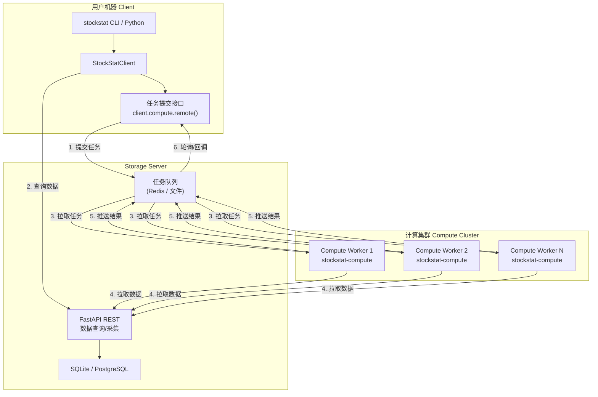
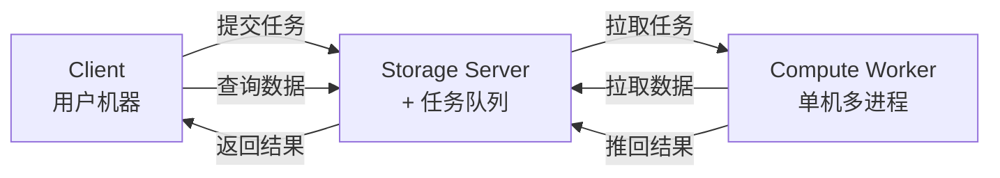
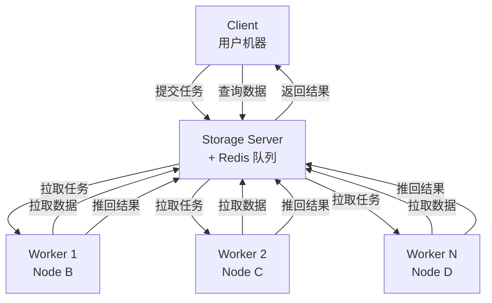

# StockStat 计算 Offload 规划报告

> **版本**: v1.0（规划稿）
> **日期**: 2026-07-18
> **状态**: 设计中
> **关联**: DESIGN_V2_CN §2 五层架构

---

## 1. 背景与动机

### 1.1 当前架构

StockStat v2.0 的计算在**前端库进程内**完成：

```
用户机器                          Storage Server
┌──────────┐   HTTP 查询数据     ┌──────────┐
│  Client   │ ──────────────────> │  FastAPI  │
│  (计算)   │ <────────────────── │  + SQLite │
│  pandas   │                     └──────────┘
│  backtest │
└──────────┘
```

### 1.2 瓶颈场景

| 场景 | 计算量 | 本地耗时（典型） | 问题 |
|------|--------|-----------------|------|
| 参数网格搜索 | 1000 组 × 回测 | 30~60 分钟 | 阻塞用户终端 |
| 蒙特卡洛模拟 | 10000 次 reshuffle | 15~30 分钟 | CPU 满载 |
| 大规模回测 | 5 年 1 分钟线 + intrabar | 10~20 分钟 | 内存溢出风险 |
| 多策略批量 | 50 策略 × 4 费率 = 200 次 | 20~40 分钟 | 串行执行 |
| PAXG v5-redo | 33 策略 × 4 费率 = 132 次 | 3~5 分钟 | 可接受但有优化空间 |

### 1.3 目标

将重型计算任务 **offload** 到网络上的计算节点（单机或集群），实现：
- **异步提交**：用户提交后不阻塞，继续其他工作
- **并行加速**：多节点/多核并行执行参数搜索
- **资源隔离**：计算不占用 storage server 或用户机器资源
- **故障隔离**：计算崩溃不影响数据服务
- **弹性扩展**：按需增减计算节点

---

## 2. 架构设计

### 2.1 三角色分离架构



### 2.2 数据流详解

```
1. 用户提交任务 → Storage Server 的任务队列
2. 用户/Worker 按需从 Storage Server 拉取数据
3. Compute Worker 从队列拉取任务
4. Worker 从 Storage Server 拉取所需数据
5. Worker 执行计算，将结果推回队列
6. 用户轮询或接收回调获取结果
```

### 2.3 组件定义

| 组件 | 部署位置 | 职责 | 依赖 |
|------|---------|------|------|
| **Storage Server** | 网络 Node A | 数据存储 + 查询 + 采集 + 任务队列 | stockstat-backend |
| **Compute Worker** | 网络 Node B/C/... | 拉取任务 → 拉取数据 → 计算 → 推回结果 | stockstat + stockstat-compute |
| **Client** | 用户机器 | 提交任务 + 查询结果 + 本地轻量计算 | stockstat |

---

## 3. 部署场景

### 3.1 场景 A：单机全栈（当前默认）

```
┌─────────────────────────────┐
│  单台机器                    │
│  ┌─ Storage Server (:8000)  │
│  ├─ Compute (进程内)         │
│  └─ Client (Jupyter/CLI)    │
└─────────────────────────────┘
```

- 所有角色在同一进程，无网络开销
- 适合开发/小规模分析
- 当前 v2.0 已支持

### 3.2 场景 B：Storage + Client 分离（当前已支持）

```
┌──────────────┐       ┌──────────────┐
│  用户机器     │  HTTP │  Storage      │
│  Client      │ ────> │  Server       │
│  (本地计算)   │       │  (:8000)      │
└──────────────┘       └──────────────┘
```

- Storage 单独部署，Client 远程查询数据
- 计算仍在 Client 本地
- 适合小团队共享数据
- 当前 v2.0 已支持

### 3.3 场景 C：三角色分离 + 单计算节点



- 计算 offload 到一台高性能机器
- Worker 可多进程并行（`--concurrency 8`）
- 适合个人/小团队的参数搜索/蒙特卡洛
- 串行 → 并行加速比 ≈ 核心数

### 3.4 场景 D：三角色分离 + 计算集群



- 多节点并行计算
- 适合大规模批量回测/参数搜索
- 加速比 ≈ 节点数 × 核心数（通信开销 < 10% 时）
- Redis 队列保证任务不丢失、负载均衡

### 3.5 场景 E：混合模式

```
用户机器
├── 轻量计算 → 本地执行（即时返回）
└── 重量计算 → 提交到集群（异步返回）
    ├── 参数搜索 (1000 组) → 集群并行
    └── 单次回测 → 本地或单 Worker
```

- Client 自动判断：小任务本地、大任务远程
- 用户也可手动指定 `local=True/False`

---

## 4. 并发与多访问支持

### 4.1 Storage Server 并发

| 维度 | 当前 v2.0 | Offload 方案 |
|------|----------|-------------|
| **并发查询** | FastAPI async + SQLite（读并发 OK，写串行） | 不变 |
| **并发写入** | SQLite 串行写入（WAL 模式可改善） | Worker 写结果走队列，不直接写 DB |
| **连接数** | SQLite 无连接池限制 | PostgreSQL 支持连接池 |
| **建议** | ≤ 10 并发用户用 SQLite；> 10 用 PostgreSQL | 同左 |

### 4.2 Compute Worker 并发

| 模式 | 并发度 | 适用 |
|------|--------|------|
| 单 Worker 单进程 | 1 | 调试 |
| 单 Worker 多进程 | N（CPU 核心数） | 场景 C |
| 多 Worker 多进程 | M 节点 × N 核 | 场景 D |

### 4.3 任务队列并发控制

| 机制 | 说明 |
|------|------|
| **任务分片** | 参数搜索 1000 组自动分为 N 个子任务，每 Worker 拉一个 |
| **结果合并** | 全部子任务完成后，Storage Server 合并结果 |
| **超时重试** | 单个子任务超时自动重新分配给其他 Worker |
| **优先级** | 交互式任务（用户等待）优先于批量任务 |

---

## 5. 任务类型与 API 设计

### 5.1 支持的任务类型

| 任务类型 | 描述 | 输入 | 输出 |
|---------|------|------|------|
| `indicator` | 远程指标计算 | symbol + indicator name + params | Series / float |
| `backtest` | 单次回测 | data spec + strategy + config | BacktestResult |
| `grid_search` | 参数网格搜索 | data spec + strategy + param grid | DataFrame |
| `batch_backtest` | 批量回测 | data spec + strategies + fee models | DataFrame |
| `monte_carlo` | 蒙特卡洛模拟 | data spec + strategy + n_simulations | DataFrame |

### 5.2 用户 API（Client 侧）

```python
from stockstat import StockStatClient

client = StockStatClient(host="storage-server", port=8000)

# ── 本地计算（即时返回，当前已支持）──
sma = client.compute.ma(data.close, window=20)
res = client.backtest(data, strategy, initial_cash=10000)

# ── 远程计算（异步提交，v3.0 新增）──

# 提交参数搜索任务
task = client.compute.remote(
    "grid_search",
    data_spec={"symbol": "BTC/USDT", "start": "2024-01-01", "timeframe": "1d"},
    strategy=ma_cross_strategy,
    param_grid={"short": [3, 5, 8, 10], "long": [10, 20, 30, 50]},
    metric="sharpe",
)
print(f"Task ID: {task.id}")
print(f"Status: {task.status}")  # pending → running → completed

# 轮询结果
result = task.wait(timeout=3600)  # 阻塞等待
# 或
if task.ready():
    result = task.result()

# 提交批量回测
task2 = client.compute.remote(
    "batch_backtest",
    data_spec={"symbol": "PAXG/USDT", "start": "2022-01-01"},
    strategies={"S1": s1, "S2": s2, "S3": s3},
    fee_models=["F1_SpotNoBNB", "F4_FutBNB"],
)
```

### 5.3 Worker API（计算节点侧）

```bash
# 启动计算 Worker
stockstat-compute worker \
    --storage-host storage-server \
    --storage-port 8000 \
    --concurrency 8

# Worker 自动：
# 1. 连接 Storage Server 的任务队列
# 2. 拉取待处理任务
# 3. 从 Storage Server 拉取所需数据
# 4. 执行计算（复用 stockstat.backtest / stockstat.compute）
# 5. 推送结果到队列
# 6. 拉取下一个任务
```

---

## 6. 技术选型

### 6.1 任务队列

| 方案 | 优点 | 缺点 | 适用 |
|------|------|------|------|
| **Redis + 自实现队列** | 轻量，已有 Redis 依赖 | 需自行实现可靠性 | 场景 C |
| **Celery + Redis/RabbitMQ** | 成熟，自动重试/监控 | 依赖重，配置复杂 | 场景 D |
| **Dramatiq + Redis** | 比 Celery 轻量 | 生态小 | 场景 C/D |
| **文件队列（SQLite）** | 零依赖 | 性能差，不适合多 Worker | 调试 |

**建议**：Phase 1 用 Redis + 自实现轻量队列（< 200 行代码）；Phase 2 如需复杂调度再引入 Celery。

### 6.2 序列化

| 方案 | 任务序列化 | 结果序列化 |
|------|-----------|-----------|
| 策略函数 | cloudpickle（支持闭包/装饰器） | — |
| 参数/配置 | JSON | JSON |
| OHLCV 数据 | Arrow IPC（零拷贝） | — |
| 回测结果 | Pickle（BacktestResult 含 DataFrame） | Pickle / Arrow |

### 6.3 Worker 进程模型

| 模型 | 说明 |
|------|------|
| **多进程** | `multiprocessing.Pool`，每个进程独立 GIL |
| **进程池** | 固定大小进程池，任务队列分发 |
| **建议** | 单 Worker 用 `--concurrency N` 控制进程数；多 Worker 每个节点一个进程池 |

---

## 7. 数据传输优化

### 7.1 数据本地化

```
问题：Worker 每次任务都从 Storage Server 拉取数据 → 网络瓶颈

优化：
1. Worker 本地缓存常用数据（如 BTC/USDT 日线）
2. 任务描述包含 data_spec，Worker 按需拉取
3. 大批量任务（如 grid_search）只拉取一次数据，N 次计算复用
```

### 7.2 增量传输

```
对于时间序列数据：
1. Worker 记录已缓存的最新时间戳
2. 每次只拉取增量数据（since last_cached_ts）
3. 合并到本地缓存
```

---

## 8. 应用 Case 量化分析

### 8.1 Case 1: PAXG v5-redo（132 次回测）

| 维度 | 本地串行 | 单 Worker 8 进程 | 4 节点 × 8 进程 |
|------|---------|-----------------|----------------|
| 耗时 | ~4 分钟 | ~35 秒 | ~10 秒 |
| 加速比 | 1× | ~7× | ~24× |
| 通信开销 | 0 | < 5% | < 10% |

### 8.2 Case 2: 参数网格搜索（1000 组）

| 维度 | 本地串行 | 单 Worker 8 进程 | 4 节点 × 8 进程 |
|------|---------|-----------------|----------------|
| 耗时 | ~50 分钟 | ~7 分钟 | ~2 分钟 |
| 加速比 | 1× | ~7× | ~25× |

### 8.3 Case 3: 蒙特卡洛 10000 次

| 维度 | 本地串行 | 单 Worker 8 进程 | 4 节点 × 8 进程 |
|------|---------|-----------------|----------------|
| 耗时 | ~25 分钟 | ~4 分钟 | ~1 分钟 |
| 加速比 | 1× | ~6× | ~22× |

---

## 9. 安全性考虑

| 风险 | 缓解 |
|------|------|
| Worker 执行恶意策略代码 | Worker 运行在隔离容器/沙箱中；策略代码经 cloudpickle 序列化，仅信任已签名的任务 |
| 任务队列被篡改 | Redis 配置密码；Worker 验证任务签名 |
| 数据泄露 | Worker → Storage 走 TLS；Worker 不持久化原始数据 |
| 资源耗尽 | Worker 设置单任务内存/CPU/超时限制 |

---

## 10. 实现路线图

| 阶段 | 内容 | 预计 |
|------|------|------|
| **Phase 1** | Redis 任务队列 + 单 Worker 多进程 | 2 周 |
| **Phase 2** | Client 侧 `remote()` API + 任务轮询 | 1 周 |
| **Phase 3** | Worker 数据本地缓存 + 增量传输 | 1 周 |
| **Phase 4** | 多 Worker 集群 + 负载均衡 + 超时重试 | 2 周 |
| **Phase 5** | Web Admin 任务监控面板 | 1 周 |

### 10.1 新增包结构

```
stockstat-compute/                    # 独立包
├── worker.py                         # Worker 进程
├── queue.py                          # Redis 任务队列
├── tasks/
│   ├── indicator.py                  # 远程指标计算
│   ├── backtest.py                   # 远程回测
│   ├── grid_search.py               # 参数网格搜索（分片并行）
│   └── batch.py                      # 批量回测
├── cache.py                          # 数据本地缓存
└── pyproject.toml                    # 依赖: stockstat + redis + cloudpickle
```

### 10.2 Storage Server 新增端点

| 端点 | 方法 | 说明 |
|------|------|------|
| `/api/v1/tasks` | POST | 提交计算任务 |
| `/api/v1/tasks/{id}` | GET | 查询任务状态 |
| `/api/v1/tasks/{id}/result` | GET | 获取任务结果 |
| `/api/v1/tasks` | GET | 列出所有任务 |
| `/api/v1/tasks/{id}` | DELETE | 取消任务 |

---

## 11. 总结

| 决策 | 选择 | 理由 |
|------|------|------|
| 独立包 vs 插件 | 独立包 `stockstat-compute` | 资源隔离、独立扩展、故障隔离 |
| 队列方案 | Redis + 轻量自实现 | 已有 Redis 依赖；Phase 2 可升级 Celery |
| 序列化 | cloudpickle + Arrow | 支持闭包策略；零拷贝数据传输 |
| 并发模型 | 多进程池 | 绕过 GIL；`--concurrency` 控制 |
| 数据传输 | 按需拉取 + 本地缓存 | 减少网络 I/O |
| 部署 | 每计算节点一个 Worker 进程 | 横向扩展简单 |

**核心原则**：计算 offload 是一个独立的 **分布式计算层**，不嵌入 StockStat 核心库，而是作为外围服务消费 StockStat 的 API。这保证了核心库的简洁性，同时提供了无限横向扩展能力。
