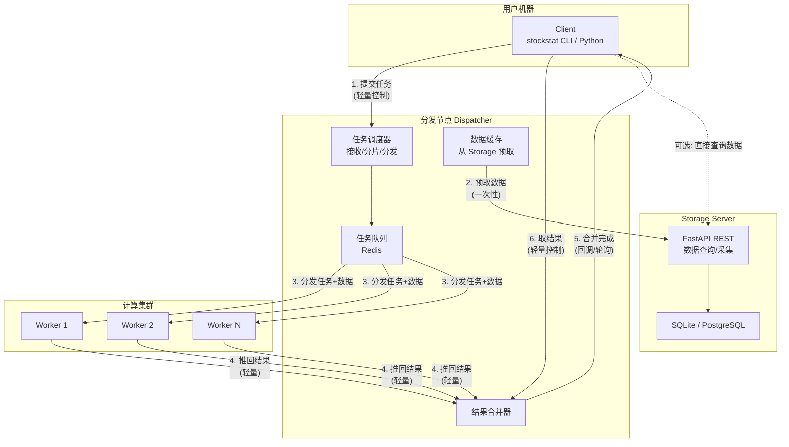
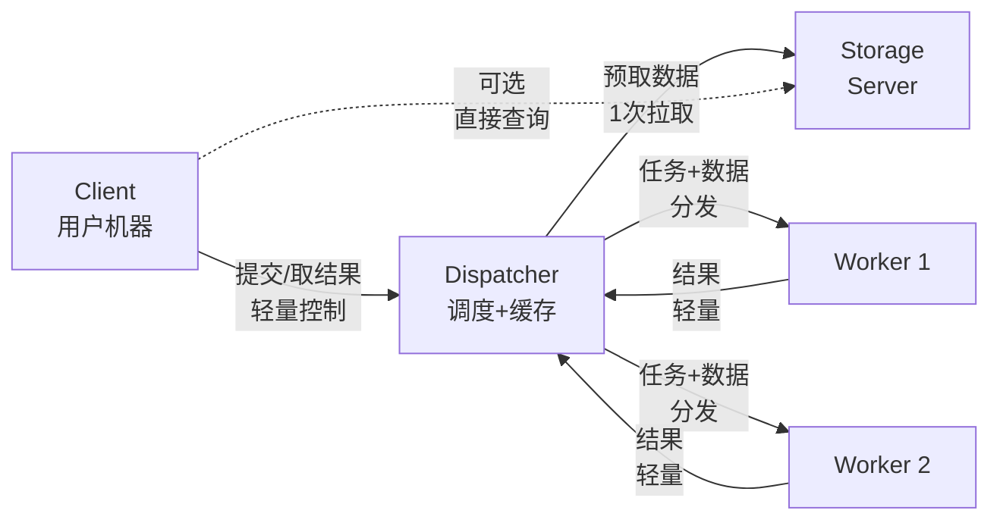
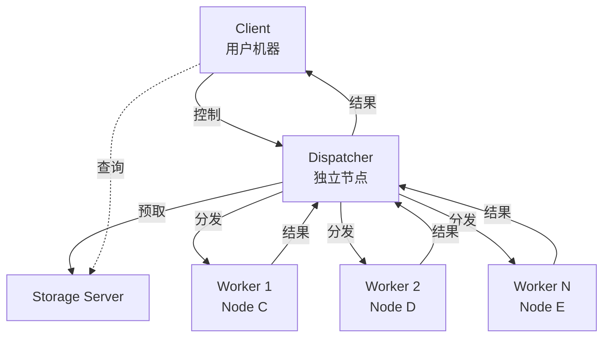
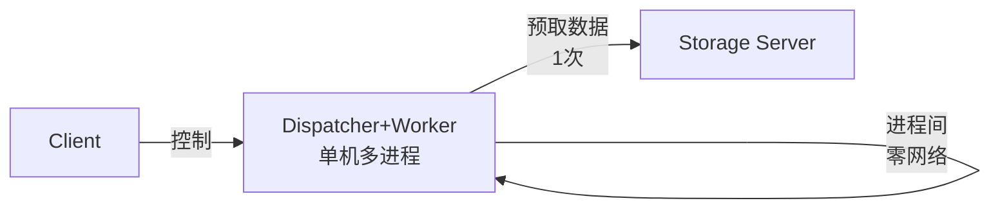
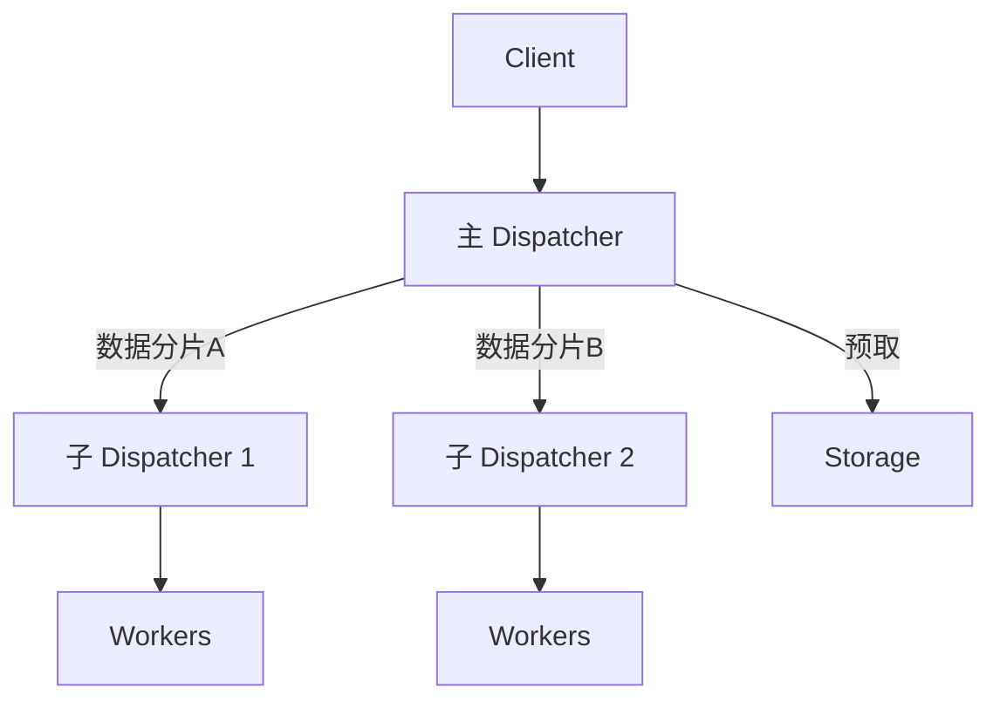
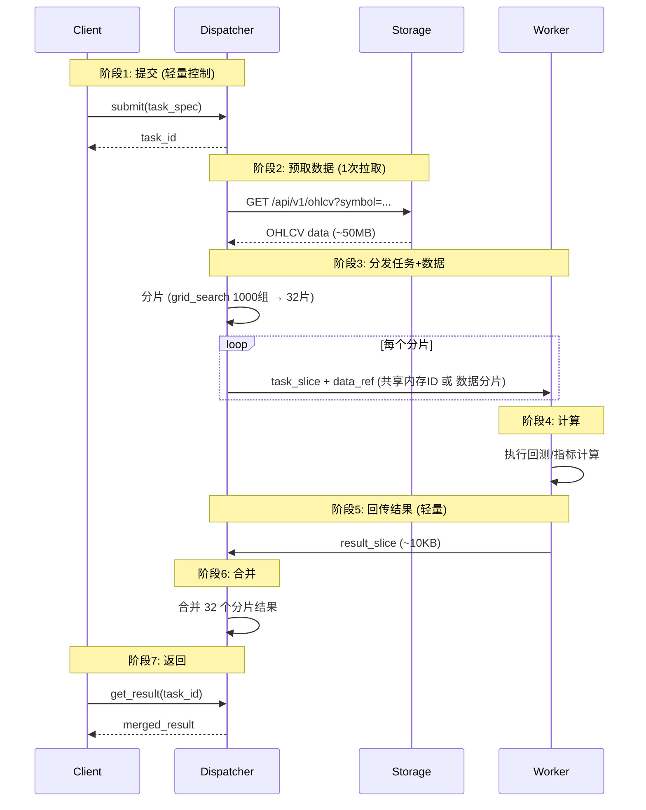
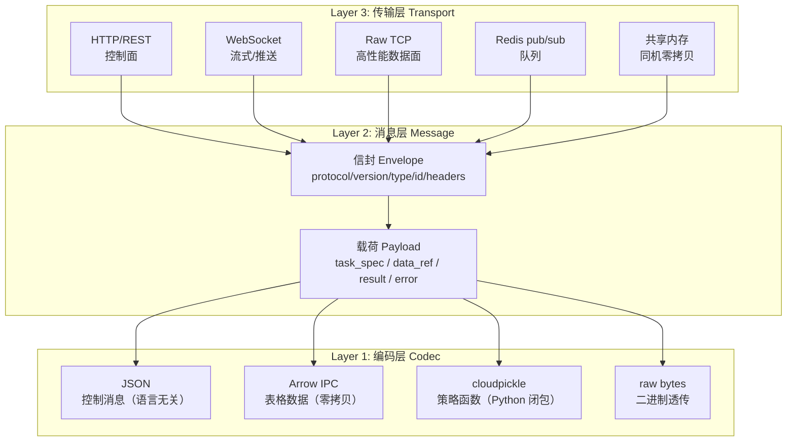
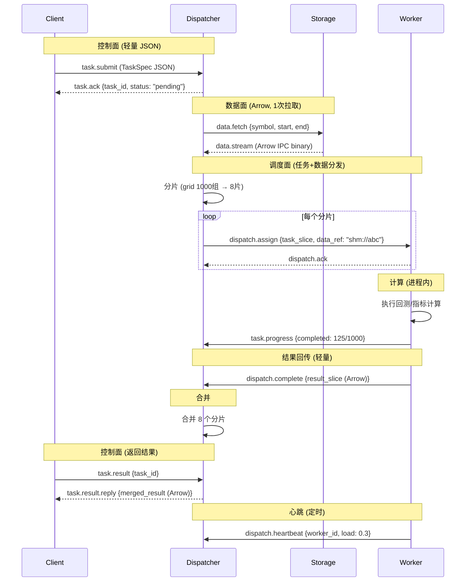
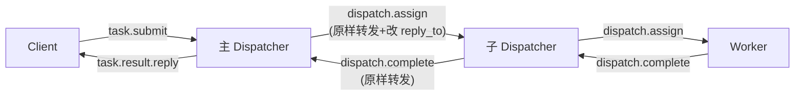
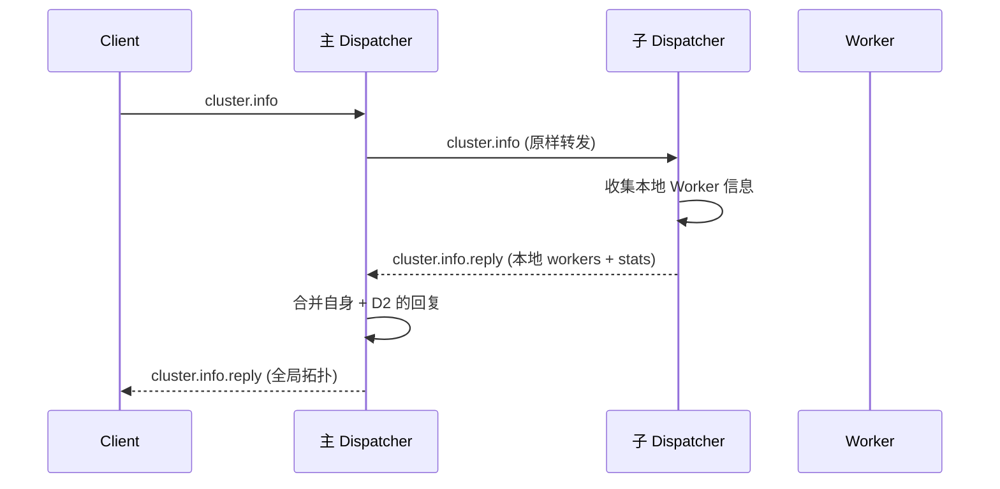

# StockStat 计算 Offload 规划报告 v2

> **版本**: v2.0（修订稿）
> **日期**: 2026-07-18
> **状态**: 设计中
> **修订**: v1 的 Storage Server 兼任任务队列导致带宽瓶颈；v2 引入独立分发节点，数据路径与控制路径分离

---

## 1. 问题分析

### 1.1 v1 方案的带宽瓶颈

```
Client ──提交任务──> Storage Server (兼任队列)
                        │
Worker1 ──拉数据──────>│  ← Storage 出口带宽被 N 个 Worker 瓜分
Worker2 ──拉数据──────>│
WorkerN ──拉数据──────>│
                        │
Worker1 ──推结果──────>│
Client  ──取结果──────>│  ← 用户查询也走同一带宽
```

**问题**：
- Storage Server 同时承担**数据查询服务**和**任务队列**两个角色
- N 个 Worker 并行拉取数据时，Storage 的网络出口带宽被 N 倍放大
- 用户查询与 Worker 数据拉取竞争同一带宽
- 5 年 BTC/USDT 1h 数据 ~50MB，4 节点 × 8 Worker = 32 并发拉取 → 峰值 ~1.6GB 同时传输
- Storage Server 的上行带宽（典型 1Gbps）在 8+ Worker 时即饱和

### 1.2 目标

- **数据路径与控制路径分离**：任务调度走轻量控制通道，数据拉取走独立通道
- **消除 Storage 带宽瓶颈**：Worker 不直接从 Storage 拉取全量数据
- **保持故障隔离**：计算崩溃不影响 Storage
- **保持弹性扩展**：按需增减计算节点

---

## 2. 架构设计

### 2.1 四角色架构



### 2.2 关键设计：数据随任务分发

v2 的核心改进是 **Dispatcher 预取数据并随任务一起分发给 Worker**：

```
v1: Worker 各自从 Storage 拉数据 (N 次全量拉取)
v2: Dispatcher 一次性从 Storage 拉取数据 → 随任务分发给各 Worker (1 次拉取, N 次本地分发)
```

| 路径 | v1 方案 | v2 方案 |
|------|---------|---------|
| Storage → 计算的数据传输 | N 次（每 Worker 独立拉取） | **1 次**（Dispatcher 预取） |
| Storage 出口带宽占用 | ×N | **×1** |
| 任务分发 | 任务描述（轻量） | 任务描述 + 数据分片 |
| Worker → 结果收集 | 推回 Storage | 推回 Dispatcher |

### 2.3 角色定义

| 角色 | 部署位置 | 职责 | 带宽特征 |
|------|---------|------|---------|
| **Client** | 用户机器 | 提交任务 + 取结果 + 本地轻量计算 | 轻量控制（KB 级） |
| **Dispatcher** | 网络 Node B（或与 Storage 同机） | 任务调度 + 数据预取 + 结果合并 | 中量（一次性数据拉取 + 任务分发） |
| **Storage Server** | 网络 Node A | 数据存储 + 查询 + 采集 | 不受计算影响（只被 Dispatcher 拉取 1 次） |
| **Compute Worker** | 网络 Node C/D/... | 接收任务+数据 → 计算 → 推回结果 | 局域网内（Dispatcher ↔ Worker） |

---

## 3. 部署场景

### 3.1 场景 A：单机全栈（当前默认，无需 offload）

```
┌─────────────────────────────┐
│  单台机器                    │
│  Storage + Client + 计算     │
│  全部进程内，无网络开销       │
└─────────────────────────────┘
```

### 3.2 场景 B：Storage + Client 分离（当前已支持）

```
Client ──HTTP──> Storage Server
  (本地计算)
```

### 3.3 场景 C：Client → Dispatcher → [Workers] → Storage

**三机分离（最常见 offload 场景）**：



- Dispatcher 可与 Storage 部署在同一台机器（共享局域网，预取走 localhost）
- Worker 节点与 Dispatcher 在同一局域网
- Storage 只被 Dispatcher 拉取 1 次，不被 Worker 直接访问
- **适合**：个人/小团队，1~8 个 Worker

### 3.4 场景 D：Dispatcher 独立部署 + 计算集群



- Dispatcher 独立部署在高带宽节点上
- 适合大规模集群（8+ Worker）
- Dispatcher 成为数据中转站，需要高上行带宽

### 3.5 场景 E：Dispatcher + Worker 合并（超轻量部署）



- Dispatcher 和 Worker 运行在同一台机器
- Dispatcher 预取数据后通过共享内存/进程间队列分发给本地 Worker 进程
- **零网络开销**分发（共享内存）
- 适合：单台高性能计算节点，8~32 核

### 3.6 场景 F：多级 Dispatcher（超大规模）



- 主 Dispatcher 预取全部数据，分片下发给子 Dispatcher
- 每个子 Dispatcher 管理一组 Worker
- 适合 100+ Worker 的超大规模集群

---

## 4. 带宽分析

### 4.1 数据量估算

| 数据集 | 大小 | 说明 |
|--------|------|------|
| BTC/USDT 5年日线 | ~500 KB | ~1300 行 |
| BTC/USDT 5年1h | ~50 MB | ~44000 行 |
| BTC/USDT 5年1m | ~3 GB | ~260万行 |
| PAXG+BTC+ETH 3年1h | ~150 MB | 3标的×3年×1h |

### 4.2 v1 vs v2 带宽对比

以 4 节点 × 8 Worker = 32 并发，计算 PAXG v5-redo（132 次回测，数据 ~50MB）为例：

| 路径 | v1 方案 | v2 方案 |
|------|---------|---------|
| Storage → Worker 数据传输 | 50MB × 32 = **1.6 GB** | 50MB × 1 = **50 MB**（Dispatcher 预取） |
| Storage 出口峰值带宽 | 1.6 GB / 并发窗口 | 50 MB / 一次性拉取 |
| Worker → 结果回传 | 132 × ~10KB = ~1.3 MB | 132 × ~10KB = ~1.3 MB（相同） |
| Client ↔ 控制通道 | ~10 KB | ~10 KB（相同） |
| **Storage 被占用时间** | 整个计算期间 | 仅预取阶段（数秒） |

### 4.3 Dispatcher 分发带宽

Dispatcher 将数据分发给 Worker 时：

| 分发方式 | 带宽 | 延迟 |
|---------|------|------|
| 局域网 TCP | 1Gbps（典型） | < 1ms |
| 共享内存（同机） | ~10 GB/s | ~0ms |
| RDMA（InfiniBand） | 10~100 Gbps | < 0.1ms |

- 场景 C/E（同机或局域网）：50MB 数据分发 < 1 秒
- 场景 D（跨网段）：Dispatcher 需要高上行带宽

### 4.4 结论

| 维度 | v1 | v2 |
|------|----|----|
| Storage 带宽压力 | ×N（N 个 Worker 独立拉取） | ×1（Dispatcher 预取一次） |
| Storage 可用性 | 计算期间带宽被占用 | 计算期间不受影响 |
| 用户查询受影响 | 是（与 Worker 竞争带宽） | 否（Storage 空闲） |
| 数据传输总量 | N × 全量 | 1 × 全量 + N × 分片 |

---

## 5. 任务生命周期



### 5.1 数据分发策略

Dispatcher 预取数据后，根据 Worker 拓扑选择分发策略：

| 策略 | 适用场景 | 实现 |
|------|---------|------|
| **共享内存** | Dispatcher + Worker 同机 | 数据写入 `SharedMemory`，Worker 通过 ID 访问，零拷贝 |
| **本地分发** | 同局域网 | Dispatcher 将数据分片随任务一起发送（TCP） |
| **引用传递** | Worker 可直接访问 Storage | 任务只含 data_spec，Worker 按需从 Storage 拉取（退回 v1 模式） |
| **混合** | 大数据用引用，小数据随任务 | Dispatcher 判断数据大小，< 10MB 随任务分发，> 10MB 用引用 |

```python
# Dispatcher 自动选择策略
def dispatch(task, data):
    if data.size < 10 * 1024 * 1024:  # < 10MB
        return DispatchStrategy.WITH_DATA  # 数据随任务
    elif self.workers_same_host:
        return DispatchStrategy.SHARED_MEMORY  # 共享内存
    else:
        return DispatchStrategy.REFERENCE  # Worker 自行从 Storage 拉取
```

---

## 6. 并发与多访问支持

### 6.1 Storage Server 并发

| 维度 | v2 方案 |
|------|---------|
| **被计算影响的程度** | 几乎为零（只被 Dispatcher 预取 1 次） |
| **并发查询** | FastAPI async，不受计算影响 |
| **并发写入** | 采集与计算完全分离 |
| **建议** | SQLite ≤ 10 并发用户；PostgreSQL > 10 |

### 6.2 Dispatcher 并发

| 维度 | 说明 |
|------|------|
| **任务并发** | 多个 Client 可同时提交任务，Dispatcher 排队调度 |
| **数据缓存** | Dispatcher 缓存预取的数据，相同数据集的后续任务零拉取 |
| **分发并发** | 同时向 N 个 Worker 分发任务+数据 |
| **合并并发** | 多个任务的结果合并互不阻塞 |

### 6.3 Worker 并发

| 模式 | 并发度 | 适用 |
|------|--------|------|
| 单 Worker 单进程 | 1 | 调试 |
| 单 Worker 多进程 | N（CPU 核心数） | 场景 C/E |
| 多 Worker 多进程 | M × N | 场景 D |
| 多级 Dispatcher | M × N × L | 场景 F |

---

## 7. 应用 Case 量化分析

### 7.1 Case 1: PAXG v5-redo（132 次回测，~50MB 数据）

| 维度 | v1 (Storage 兼队列) | v2 (Dispatcher 分发) |
|------|--------------------|-----------------------|
| Storage 带宽 | 50MB × 32 = 1.6 GB | 50MB × 1 = 50 MB |
| 预取耗时 | — | ~0.5s（局域网） |
| 分发耗时 | — | ~0.5s（共享内存）或 ~2s（局域网 TCP） |
| 计算耗时 (8进程) | ~35s | ~35s（相同） |
| **总耗时** | ~40s | ~36s（多 1s 预取+分发） |
| Storage 可用性 | 计算期间带宽被占 | 计算期间完全空闲 |

### 7.2 Case 2: 参数网格搜索（1000 组，~50MB 数据）

| 维度 | v1 | v2 |
|------|----|----|
| Storage 带宽 | 50MB × 32 = 1.6 GB | 50MB × 1 = 50 MB |
| **总耗时** (4节点×8进程) | ~2min | ~2min（计算时间相同） |
| Storage 影响 | 2分钟带宽被占 | 仅 0.5 秒预取 |

### 7.3 Case 3: 大数据回测（5年1分钟线 ~3GB）

| 维度 | v1 | v2 |
|------|----|----|
| Storage 带宽 | 3GB × 8 = 24 GB | 3GB × 1 = 3 GB |
| 预取耗时 | — | ~30s（千兆局域网） |
| 分发策略 | — | 共享内存（同机）或引用传递（跨机） |
| **关键优势** | Storage 带宽 24GB 瓶颈 | Storage 仅传 3GB，之后完全空闲 |

### 7.4 带宽节省总结

| 场景 | 数据量 | Worker 数 | v1 Storage 带宽 | v2 Storage 带宽 | 节省 |
|------|--------|-----------|----------------|----------------|------|
| PAXG v5-redo | 50MB | 32 | 1.6 GB | 50 MB | 97% |
| 参数搜索 | 50MB | 32 | 1.6 GB | 50 MB | 97% |
| 大数据回测 | 3 GB | 8 | 24 GB | 3 GB | 87% |
| 多标的批量 | 150 MB | 16 | 2.4 GB | 150 MB | 94% |

---

## 8. 技术选型

### 8.1 Dispatcher 实现

| 组件 | 方案 | 说明 |
|------|------|------|
| 任务队列 | Redis（轻量）或内存队列（同机） | Dispatcher 内置队列管理 |
| 数据预取 | HTTP from Storage → 内存/共享内存 | 一次性拉取，缓存复用 |
| 数据分发 | 共享内存（同机）/ TCP（跨机）/ 引用（大数据） | 自动策略选择 |
| 结果合并 | 内存合并 → 序列化返回 | Dispatcher 合并后通知 Client |
| 序列化 | cloudpickle（策略函数）+ Arrow（数据） | 与 v1 相同 |

### 8.2 Dispatcher 部署形态

| 形态 | 说明 | 适用 |
|------|------|------|
| **与 Storage 同机** | Dispatcher 作为 Storage 的一个插件/子进程 | 场景 C，简单部署 |
| **独立节点** | Dispatcher 单独部署在高带宽机器上 | 场景 D，大规模集群 |
| **与 Worker 同机** | Dispatcher + Worker 合并为单进程多线程 | 场景 E，超轻量 |
| **多级** | 主 Dispatcher + 子 Dispatcher | 场景 F，超大规模 |

### 8.3 Dispatcher 作为插件 vs 独立包

| 维度 | Storage 插件 | 独立包 |
|------|-------------|--------|
| 部署 | 与 Storage 同机，零额外部署 | 独立部署 |
| 数据预取 | localhost（极快） | 走网络 |
| 资源隔离 | 共享 Storage 的 CPU/内存 | 独立资源 |
| 适用 | ≤ 8 Worker | 任意规模 |

**建议**：Phase 1 做成 Storage 插件（`_domain/dispatcher/`），与 Storage 同机部署；Phase 2 支持独立部署模式。

---

## 9. 用户 API

### 9.1 Client 侧

```python
from stockstat import StockStatClient

client = StockStatClient(host="storage-server", port=8000)

# ── 本地计算（即时返回）──
sma = client.compute.ma(data.close, window=20)
res = client.backtest(data, strategy, initial_cash=10000)

# ── 远程计算（提交到 Dispatcher）──

# 提交参数搜索
task = client.compute.remote(
    "grid_search",
    data_spec={"symbol": "BTC/USDT", "start": "2024-01-01", "timeframe": "1d"},
    strategy=ma_cross_strategy,
    param_grid={"short": [3, 5, 8], "long": [10, 20, 30]},
    metric="sharpe",
    # 可指定 Dispatcher 地址（默认走 Storage 转发）
    # dispatcher="dispatcher-host:9000",
)
print(f"Task: {task.id}, Status: {task.status}")

# 等待结果
result = task.wait(timeout=3600)
# 或轮询
if task.ready():
    result = task.result()
```

### 9.2 Dispatcher 侧

```bash
# 方式1：作为 Storage 插件运行（同机）
# Storage 启动时自动加载 Dispatcher

# 方式2：独立部署
stockstat-dispatcher \
    --storage-host storage-server \
    --storage-port 8000 \
    --listen 0.0.0.0:9000 \
    --data-cache-dir /tmp/stockstat-cache
```

### 9.3 Worker 侧

```bash
# 启动 Worker，连接 Dispatcher
stockstat-compute worker \
    --dispatcher-host dispatcher-server \
    --dispatcher-port 9000 \
    --concurrency 8
```

---

## 10. 完整对比：v1 vs v2

| 维度 | v1 (Storage 兼队列) | v2 (Dispatcher 分发) |
|------|--------------------|-----------------------|
| **角色数** | 3 (Client/Storage/Worker) | 4 (Client/Dispatcher/Storage/Worker) |
| **Storage 带宽压力** | ×N Worker | ×1 Dispatcher |
| **Storage 可用性** | 计算期间受影响 | 不受影响 |
| **数据传输** | Worker 各自拉取 | Dispatcher 预取+分发 |
| **部署复杂度** | 低（Storage 兼队列） | 中（多一个 Dispatcher） |
| **扩展性** | 受限于 Storage 带宽 | 受限于 Dispatcher 带宽（可多级） |
| **数据缓存** | 无 | Dispatcher 缓存，后续任务零拉取 |
| **适合规模** | ≤ 4 Worker | 任意（多级 Dispatcher） |
| **故障隔离** | 计算崩溃影响 Storage 队列 | 计算崩溃不影响 Storage |

---

## 11. 实现路线图

| 阶段 | 内容 | 预计 |
|------|------|------|
| **Phase 1** | Dispatcher 作为 Storage 插件 + 内存队列 + 共享内存分发 | 2 周 |
| **Phase 2** | Client 侧 `remote()` API + 任务轮询 | 1 周 |
| **Phase 3** | 独立 Dispatcher 部署模式 + TCP 分发 | 1 周 |
| **Phase 4** | Worker 数据本地缓存 + 增量预取 | 1 周 |
| **Phase 5** | 多级 Dispatcher + 负载均衡 | 2 周 |
| **Phase 6** | Web Admin 任务监控面板 | 1 周 |

### 11.1 新增包结构

```
# Phase 1: Dispatcher 作为 Storage 插件
backend/stockstat_backend/dispatcher/
├── __init__.py              # Dispatcher 核心
├── queue.py                 # 任务队列（Redis / 内存）
├── prefetch.py              # 数据预取 + 缓存
├── dispatch.py              # 任务分发（共享内存 / TCP / 引用）
└── merge.py                 # 结果合并

# Phase 3+: 独立包
stockstat-compute/           # Worker 独立包
├── worker.py                # Worker 进程
├── tasks/
│   ├── backtest.py
│   ├── grid_search.py
│   └── batch.py
├── cache.py                 # 数据本地缓存
└── pyproject.toml
```

### 11.2 新增 API 端点

**Storage Server（转发给 Dispatcher 插件）**：

| 端点 | 方法 | 说明 |
|------|------|------|
| `/api/v1/tasks` | POST | 提交计算任务 |
| `/api/v1/tasks/{id}` | GET | 查询任务状态 |
| `/api/v1/tasks/{id}/result` | GET | 获取任务结果 |
| `/api/v1/tasks` | GET | 列出所有任务 |
| `/api/v1/tasks/{id}` | DELETE | 取消任务 |

**Dispatcher（独立部署时）**：

| 端点 | 方法 | 说明 |
|------|------|------|
| `/dispatch/submit` | POST | 接收任务 |
| `/dispatch/status/{id}` | GET | 查询状态 |
| `/dispatch/result/{id}` | GET | 获取结果 |
| `/dispatch/workers` | GET | Worker 列表 + 健康 |
| `/dispatch/stats` | GET | 队列统计 |

---

## 12. 通信协议设计

### 12.1 设计目标

| 目标 | 说明 |
|------|------|
| **最大通用性** | 协议不绑定特定计算类型；回测、指标、网格搜索、自定义任务均走同一套消息格式 |
| **传输无关** | 同一套消息可在 HTTP、WebSocket、TCP socket、Redis pub/sub、共享内存上传输 |
| **语言无关** | 控制面用 JSON（任何语言可解析）；数据面用 Arrow（跨语言列式格式） |
| **可扩展** | 新增任务类型不需要改协议；新增传输通道不需要改消息格式 |
| **可组合** | 多级 Dispatcher 级联时，消息可原样转发 |

### 12.2 协议分层



**三层分离原则**：
- **编码层**：决定"载荷如何序列化为字节"——与传输无关
- **消息层**：决定"字节如何包装为有意义的消息"——与编码无关
- **传输层**：决定"消息如何在节点间移动"——与消息内容无关

任何一层可独立替换：换传输不动消息格式，换编码不动传输。

### 12.3 消息信封 Envelope

所有节点间通信都包装在统一信封中。信封本身是 JSON（任何语言可解析），载荷部分按 `content_type` 指示的编码方式解码。

```json
{
  "protocol": "stockstat-rpc",
  "version": "1.0",
  "type": "task.submit",
  "id": "550e8400-e29b-41d4-a716-446655440000",
  "reply_to": "client-abc-123",
  "headers": {
    "content_type": "application/vnd.stockstat.task+json",
    "data_codec": "arrow",
    "strategy_codec": "cloudpickle",
    "priority": 0,
    "timeout": 3600,
    "trace_id": "trace-xyz-789"
  },
  "payload": "<base64 or raw bytes depending on transport>"
}
```

**信封字段定义**：

| 字段 | 类型 | 必填 | 说明 |
|------|------|------|------|
| `protocol` | string | 是 | 固定 `"stockstat-rpc"`，标识协议 |
| `version` | string | 是 | 协议版本（语义化，如 `"1.0"`） |
| `type` | string | 是 | 消息类型（见 §12.4 消息类型表） |
| `id` | string | 是 | 消息唯一 ID（UUID v4） |
| `reply_to` | string | 否 | 回复目标 ID（用于异步回调） |
| `headers` | object | 是 | 元数据头（见下表） |
| `payload` | bytes/string | 是 | 载荷（按 `content_type` 编码） |

**Headers 字段**：

| 字段 | 类型 | 默认 | 说明 |
|------|------|------|------|
| `content_type` | string | — | 载荷的 MIME 类型（决定解码方式） |
| `data_codec` | string | `"arrow"` | 表格数据的编码格式：`arrow` / `json` / `parquet` |
| `strategy_codec` | string | `"cloudpickle"` | 策略函数的编码格式：`cloudpickle` / `json` / `none` |
| `priority` | int | `0` | 任务优先级（0=普通，-1=高，1=低） |
| `timeout` | int | `3600` | 超时秒数 |
| `trace_id` | string | `""` | 分布式追踪 ID（贯穿全链路） |
| `data_ref` | string | `""` | 数据引用（`shm://id` / `storage://symbol` / `inline`） |
| `retry_count` | int | `0` | 重试次数 |

### 12.4 消息类型表

所有消息类型共用同一信封，通过 `type` 字段区分：

| `type` | 方向 | `content_type` | 说明 |
|--------|------|----------------|------|
| **控制面（轻量 JSON）** | | | |
| `task.submit` | Client → Dispatcher | `application/vnd.stockstat.task+json` | 提交任务 |
| `task.ack` | Dispatcher → Client | `application/json` | 确认接收，返回 task_id |
| `task.status` | Client → Dispatcher | `application/json` | 查询状态 |
| `task.status.reply` | Dispatcher → Client | `application/json` | 返回状态 |
| `task.result` | Client → Dispatcher | `application/json` | 获取结果 |
| `task.result.reply` | Dispatcher → Client | `application/vnd.stockstat.result+<codec>` | 返回结果 |
| `task.cancel` | Client → Dispatcher | `application/json` | 取消任务 |
| `task.progress` | Worker → Dispatcher → Client | `application/json` | 进度推送 |
| `task.error` | Worker → Dispatcher → Client | `application/json` | 错误上报 |
| `cluster.info` | Client → Dispatcher | `application/json` | 查询集群拓扑与节点信息 |
| `cluster.info.reply` | Dispatcher → Client | `application/json` | 返回完整集群拓扑 |
| **调度面（Dispatcher ↔ Worker）** | | | |
| `dispatch.assign` | Dispatcher → Worker | `application/vnd.stockstat.task+json` | 分配任务分片 |
| `dispatch.ack` | Worker → Dispatcher | `application/json` | 确认接收分片 |
| `dispatch.complete` | Worker → Dispatcher | `application/vnd.stockstat.result+<codec>` | 完成并回传结果 |
| `dispatch.fail` | Worker → Dispatcher | `application/json` | 失败上报 |
| `dispatch.heartbeat` | Worker → Dispatcher | `application/json` | 心跳（含硬件配置 + 负载） |
| `dispatch.register` | Worker → Dispatcher | `application/json` | Worker 注册（首次上线，含完整硬件信息） |
| `dispatch.unregister` | Worker → Dispatcher | `application/json` | Worker 主动下线 |
| **数据面（大块数据传输）** | | | |
| `data.fetch` | Dispatcher → Storage | `application/json` | 预取数据请求 |
| `data.stream` | Storage → Dispatcher | `application/vnd.apache.arrow.file` | 数据流（Arrow） |
| `data.ref` | Dispatcher → Worker | `application/json` | 数据引用（共享内存 ID 或 Storage URL） |

### 12.5 任务规范 TaskSpec

`task.submit` 的载荷是一个 TaskSpec JSON，描述"算什么"但不描述"怎么传"：

```json
{
  "task_type": "grid_search",
  "task_id": "task-2024-001",
  "data_spec": {
    "symbols": ["BTC/USDT"],
    "timeframe": "1d",
    "start": "2024-01-01",
    "end": "2024-12-31",
    "source": "binance"
  },
  "compute_spec": {
    "strategy_ref": "cloudpickle:base64...",
    "param_grid": {
      "short": [3, 5, 8, 10],
      "long": [10, 20, 30, 50]
    },
    "metric": "sharpe",
    "initial_cash": 10000,
    "cost_model": "binance_spot"
  },
  "dispatch_spec": {
    "split_strategy": "param_wise",
    "max_workers": 8,
    "data_dispatch": "auto"
  }
}
```

**TaskSpec 三段式结构**：

| 段 | 职责 | 通用性 |
|---|------|--------|
| `data_spec` | 描述需要什么数据（symbol/tf/range） | 任何任务类型通用 |
| `compute_spec` | 描述做什么计算（策略/参数/配置） | 按 `task_type` 分发到对应处理器 |
| `dispatch_spec` | 描述如何分发（分片策略/Worker 数/数据传输方式） | 任何任务类型通用 |

**新增任务类型只需**：定义新的 `task_type` + 对应的 `compute_spec` schema + Worker 侧处理器。协议、信封、传输层零改动。

### 12.6 数据传输策略

Dispatcher 根据 `dispatch_spec.data_dispatch` 和数据大小选择传输方式：

| 策略 | `data_dispatch` | 数据路径 | 编码 | 适用 |
|------|-----------------|---------|------|------|
| **随任务内联** | `"inline"` | Dispatcher → Worker（随 `dispatch.assign` 消息） | Arrow IPC | < 10MB，跨机 |
| **共享内存** | `"shared_memory"` | Dispatcher 写入 shm → Worker 通过 ID 读取 | raw bytes | 同机，任意大小 |
| **Storage 引用** | `"storage_ref"` | Worker 直接从 Storage 拉取 | HTTP + Arrow | > 100MB，Worker 可达 Storage |
| **Dispatcher 流式** | `"stream"` | Dispatcher 通过 WebSocket/TCP 推流 | Arrow IPC stream | 10~100MB，跨机 |
| **自动** | `"auto"` | Dispatcher 按数据大小+拓扑自动选择 | — | 默认 |

```python
# Dispatcher 自动选择逻辑
def choose_data_dispatch(data_size: int, workers_same_host: bool,
                         workers_can_reach_storage: bool) -> str:
    if data_size < 10 * 1024 * 1024:  # < 10MB
        return "inline"
    elif workers_same_host:
        return "shared_memory"
    elif data_size > 100 * 1024 * 1024 and workers_can_reach_storage:
        return "storage_ref"
    else:
        return "stream"
```

### 12.7 传输层映射

同一套消息可映射到不同传输协议：

| 传输 | 控制面 | 数据面 | 心跳 | 适用场景 |
|------|--------|--------|------|---------|
| **HTTP/REST** | POST/GET | multipart / base64 | 无 | 简单部署，跨网段 |
| **WebSocket** | JSON frame | binary frame | ping/pong | 实时进度推送 |
| **Raw TCP** | length-prefixed JSON | length-prefixed binary | 定时 | 高性能局域网 |
| **Redis pub/sub** | publish/subscribe | — | TTL | 队列解耦 |
| **共享内存** | `multiprocessing.Queue` | `SharedMemory` | 进程存活 | 同机零拷贝 |
| **gRPC**（规划） | protobuf | streaming | health check | 强类型场景 |

**传输无关的实现**：消息层定义 `Transport` 协议，各传输实现该协议：

```python
class Transport(Protocol):
    """传输层抽象——消息如何从 A 到 B。"""
    def send(self, envelope: Envelope) -> None: ...
    def receive(self, timeout: float = None) -> Envelope: ...
    def send_data(self, data: bytes, content_type: str) -> str: ...
    """返回数据引用 ID（如 shm://xxx 或 inline）"""
```

每种传输实现 `Transport`：

| 实现 | `send` | `send_data` |
|------|--------|-------------|
| `HttpTransport` | POST body = JSON(envelope) | multipart upload |
| `WebSocketTransport` | JSON frame | binary frame |
| `TcpTransport` | `[4-byte len][JSON]` | `[4-byte len][binary]` |
| `SharedMemoryTransport` | `multiprocessing.Queue` | `SharedMemory` + 返回 `shm://id` |
| `RedisTransport` | `LPUSH queue_name JSON` | 不支持大数据（用引用） |

### 12.8 生命周期消息流



### 12.9 错误处理协议

| 场景 | 消息 | 处理 |
|------|------|------|
| Worker 计算崩溃 | `dispatch.fail` {error, traceback} | Dispatcher 重新分配分片给其他 Worker |
| Worker 心跳超时 | 无心跳 30s | Dispatcher 标记 Worker 离线，重新分配其任务 |
| Worker 超时 | `dispatch.complete` 未在 `timeout` 内到达 | Dispatcher 取消该分片，重新分配 |
| Dispatcher 崩溃 | Client 轮询 `task.status` 超时 | Client 向备用 Dispatcher 重试（多级模式） |
| Storage 不可达 | `data.fetch` 失败 | Dispatcher 返回 `task.error` 给 Client |
| 数据解码失败 | Worker 解码 Arrow 失败 | 返回 `dispatch.fail` {error: "codec_error"} |

**错误消息格式**：

```json
{
  "type": "task.error",
  "id": "msg-uuid",
  "headers": {"content_type": "application/json", "trace_id": "trace-xyz"},
  "payload": {
    "task_id": "task-2024-001",
    "slice_id": "slice-3",
    "error_code": "COMPUTE_FAILED",
    "error_message": "BacktestError: insufficient data for window=50",
    "traceback": "...",
    "retryable": true
  }
}
```

### 12.10 多级 Dispatcher 级联

多级 Dispatcher 时，消息原样转发，只需修改 `reply_to` 和 `headers.trace_id`：



- `trace_id` 贯穿全链路，任何一级可记录日志
- 主 Dispatcher 不需要知道子 Dispatcher 的 Worker 拓扑
- 消息格式在所有级别完全相同

### 12.11 通用性保证

| 维度 | 设计 | 通用性体现 |
|------|------|-----------|
| **任务类型** | `task_type` 字段 + 可扩展 `compute_spec` | 新增 `"monte_carlo"` 只需定义 compute_spec schema + Worker 处理器，协议零改动 |
| **数据格式** | `data_codec` header | 同一任务可按 Arrow/JSON/Parquet 传输，Worker 按 header 自动解码 |
| **策略编码** | `strategy_codec` header | Python 用 cloudpickle，未来 Go/Rust Worker 可用 JSON schema |
| **传输方式** | `Transport` 协议抽象 | 同一套消息走 HTTP/WebSocket/TCP/SHM/Redis，上层无感知 |
| **数据分发** | `data_dispatch` 字段 | inline/shm/stream/ref 四策略自动选择，覆盖任意数据大小+拓扑 |
| **多级级联** | 消息原样转发 | 主/子 Dispatcher 消息格式完全相同，无限级联 |
| **跨语言** | 信封=JSON，数据=Arrow | 控制面任何语言可解析；数据面 Arrow 是跨语言标准 |
| **版本兼容** | `version` 字段 | 新版本可增加字段，旧版本忽略未知字段（前向兼容） |

### 12.12 协议版本演进策略

| 演进类型 | 策略 | 示例 |
|---------|------|------|
| **增加字段** | 直接加，旧端忽略 | v1.1 增加 `headers.gpu_required` |
| **增加消息类型** | 直接加，旧端不处理 | v1.1 增加 `task.heartbeat` 类型 |
| **增加 task_type** | 直接加，Dispatcher 按能力路由 | v1.1 增加 `"monte_carlo"` |
| **增加 Codec** | 直接加，通过 `content_type` 协商 | v1.1 增加 `"msgpack"` codec |
| **增加 Transport** | 直接加，配置选择 | v1.1 增加 gRPC transport |
| **破坏性变更** | 升 `version`，双版本过渡 | v2.0 改变 Envelope 结构 |

**协商机制**：Client 在 `task.submit` 的 `headers` 中声明支持的 `protocol_version` 和 `codecs`；Dispatcher 在 `task.ack` 中返回实际使用的版本和 codec。如不兼容，Dispatcher 返回 `task.error` {error_code: "PROTOCOL_MISMATCH"}。

### 12.13 集群拓扑查询与节点信息

#### 12.13.1 设计目标

Client 需要获取计算集群的完整拓扑信息，用于：
- **任务规划**：根据可用 Worker 数和硬件能力决定分片粒度
- **资源选优**：将 GPU 任务发送到有 GPU 的 Worker；将大内存任务发送到高内存 Worker
- **负载监控**：查看各节点实时负载，避免向过载节点提交任务
- **故障排查**：确认哪些节点在线/离线，哪些能力可用

#### 12.13.2 Worker 注册消息 `dispatch.register`

Worker 首次启动时向 Dispatcher 发送注册消息，包含完整硬件配置和自定义别名：

```json
{
  "type": "dispatch.register",
  "id": "msg-uuid",
  "headers": {"content_type": "application/json"},
  "payload": {
    "worker_id": "worker-01",
    "alias": "gpu-box-alpha",
    "address": "192.168.1.101",
    "port": 9100,
    "concurrency": 8,
    "hardware": {
      "cpu": {
        "model": "AMD Ryzen 9 7950X",
        "cores_physical": 16,
        "cores_logical": 32,
        "threads": 32,
        "freq_mhz": 4500
      },
      "memory": {
        "total_gb": 64.0,
        "available_gb": 48.5
      },
      "gpu": {
        "devices": [
          {"model": "NVIDIA RTX 4090", "vram_gb": 24.0, "cuda_version": "12.1"}
        ]
      },
      "disk": {
        "total_gb": 2000.0,
        "available_gb": 1500.0
      },
      "os": "Ubuntu 22.04",
      "python_version": "3.11.4"
    },
    "capabilities": ["backtest", "grid_search", "indicator", "monte_carlo", "gpu_compute"],
    "stockstat_version": "2.0.0",
    "labels": {
      "rack": "A-12",
      "zone": "datacenter-east",
      "priority": "high"
    }
  }
}
```

**字段说明**：

| 字段 | 类型 | 必填 | 说明 |
|------|------|------|------|
| `worker_id` | string | 是 | Worker 唯一 ID（UUID 或主机名+PID） |
| `alias` | string | 否 | **用户自定义机器别名**（如 `"gpu-box-alpha"`），便于人读；未设置时用 `worker_id` |
| `address` | string | 是 | Worker 监听地址 |
| `port` | int | 是 | Worker 监听端口 |
| `concurrency` | int | 是 | Worker 最大并发任务数（通常 = 逻辑 CPU 线程数） |
| `hardware` | object | 是 | 硬件配置（见下表） |
| `capabilities` | list[string] | 是 | 支持的任务类型列表 |
| `stockstat_version` | string | 是 | Worker 安装的 stockstat 版本 |
| `labels` | dict | 否 | 用户自定义标签（rack/zone/priority 等），Dispatcher 可按标签路由 |

**`hardware` 字段**：

| 子字段 | 属性 | 说明 |
|--------|------|------|
| `cpu` | `model` | CPU 型号字符串 |
| | `cores_physical` | 物理核心数 |
| | `cores_logical` | 逻辑核心数（含超线程） |
| | `threads` | 线程数（= 逻辑核心数，显式声明便于跨语言解析） |
| | `freq_mhz` | 基础频率 MHz |
| `memory` | `total_gb` | 总内存 GB |
| | `available_gb` | 可用内存 GB（注册时快照） |
| `gpu` | `devices` | GPU 设备列表（无 GPU 时为空数组） |
| | `.model` | GPU 型号 |
| | `.vram_gb` | 显存 GB |
| | `.cuda_version` | CUDA 版本 |
| `disk` | `total_gb` | 磁盘总容量 GB |
| | `available_gb` | 可用磁盘 GB |
| `os` | — | 操作系统 |
| `python_version` | — | Python 版本 |

#### 12.13.3 Worker 心跳消息 `dispatch.heartbeat`

注册后，Worker 定期（默认 10s）发送心跳，携带实时负载信息：

```json
{
  "type": "dispatch.heartbeat",
  "id": "msg-uuid",
  "headers": {"content_type": "application/json"},
  "payload": {
    "worker_id": "worker-01",
    "alias": "gpu-box-alpha",
    "timestamp": "2026-07-18T10:30:00Z",
    "load": {
      "cpu_percent": 37.5,
      "memory_used_gb": 15.2,
      "memory_available_gb": 48.8,
      "gpu_percent": [85.0],
      "gpu_memory_used_gb": [18.5],
      "disk_available_gb": 1498.0
    },
    "active_tasks": 3,
    "completed_tasks": 156,
    "failed_tasks": 2,
    "avg_task_duration_s": 12.3,
    "status": "online"
  }
}
```

**心跳负载字段**：

| 字段 | 说明 |
|------|------|
| `load.cpu_percent` | CPU 使用率 %（0~100） |
| `load.memory_used_gb` | 已用内存 GB |
| `load.memory_available_gb` | 可用内存 GB（实时） |
| `load.gpu_percent` | 各 GPU 使用率 %（列表，对应 `devices` 顺序） |
| `load.gpu_memory_used_gb` | 各 GPU 已用显存 GB |
| `load.disk_available_gb` | 可用磁盘 GB（实时） |
| `active_tasks` | 当前正在执行的任务数 |
| `completed_tasks` | 累计完成任务数 |
| `failed_tasks` | 累计失败任务数 |
| `avg_task_duration_s` | 平均任务耗时秒 |
| `status` | `"online"` / `"busy"` / `"draining"` |

**Worker 状态定义**：

| status | 含义 | Dispatcher 行为 |
|--------|------|----------------|
| `online` | 正常，接受任务 | 正常分发 |
| `busy` | 活动任务 = concurrency | 不再分发新任务 |
| `draining` | 优雅下线中，不接受新任务 | 等待现有任务完成后标记 `offline` |
| `offline` | 心跳超时或主动下线 | 从可用 Worker 列表移除 |

#### 12.13.4 集群查询消息 `cluster.info`

Client 向 Dispatcher 查询集群拓扑：

**请求**：

```json
{
  "type": "cluster.info",
  "id": "msg-uuid",
  "headers": {"content_type": "application/json"},
  "payload": {
    "include_offline": false,
    "include_hardware": true,
    "include_labels": true,
    "filter_labels": {"zone": "datacenter-east"}
  }
}
```

| 请求字段 | 说明 |
|---------|------|
| `include_offline` | 是否包含离线节点（默认 false） |
| `include_hardware` | 是否包含硬件配置（默认 true） |
| `include_labels` | 是否包含自定义标签（默认 true） |
| `filter_labels` | 按标签过滤（只返回匹配的 Worker） |

**响应** `cluster.info.reply`：

```json
{
  "type": "cluster.info.reply",
  "id": "msg-uuid",
  "headers": {"content_type": "application/json"},
  "payload": {
    "dispatcher": {
      "id": "dispatcher-01",
      "alias": "dispatch-primary",
      "address": "192.168.1.100:9000",
      "status": "online",
      "uptime_s": 86400,
      "queue_depth": 3,
      "cache_size_mb": 120.5,
      "cache_hit_rate": 0.85
    },
    "workers": [
      {
        "worker_id": "worker-01",
        "alias": "gpu-box-alpha",
        "address": "192.168.1.101:9100",
        "status": "online",
        "concurrency": 8,
        "active_tasks": 3,
        "completed_tasks": 156,
        "failed_tasks": 2,
        "avg_task_duration_s": 12.3,
        "last_heartbeat": "2026-07-18T10:30:00Z",
        "capabilities": ["backtest", "grid_search", "indicator", "monte_carlo", "gpu_compute"],
        "stockstat_version": "2.0.0",
        "hardware": {
          "cpu": {"model": "AMD Ryzen 9 7950X", "cores_physical": 16, "cores_logical": 32, "threads": 32, "freq_mhz": 4500},
          "memory": {"total_gb": 64.0, "available_gb": 48.8},
          "gpu": {"devices": [{"model": "NVIDIA RTX 4090", "vram_gb": 24.0, "cuda_version": "12.1"}]},
          "disk": {"total_gb": 2000.0, "available_gb": 1498.0},
          "os": "Ubuntu 22.04",
          "python_version": "3.11.4"
        },
        "load": {
          "cpu_percent": 37.5,
          "memory_used_gb": 15.2,
          "memory_available_gb": 48.8,
          "gpu_percent": [85.0],
          "gpu_memory_used_gb": [18.5]
        },
        "labels": {"rack": "A-12", "zone": "datacenter-east", "priority": "high"}
      },
      {
        "worker_id": "worker-02",
        "alias": "cpu-farm-beta",
        "address": "192.168.1.102:9100",
        "status": "online",
        "concurrency": 16,
        "active_tasks": 0,
        "completed_tasks": 89,
        "failed_tasks": 0,
        "avg_task_duration_s": 8.7,
        "last_heartbeat": "2026-07-18T10:29:58Z",
        "capabilities": ["backtest", "monte_carlo"],
        "stockstat_version": "2.0.0",
        "hardware": {
          "cpu": {"model": "Intel Xeon Gold 6338", "cores_physical": 32, "cores_logical": 64, "threads": 64, "freq_mhz": 2000},
          "memory": {"total_gb": 256.0, "available_gb": 240.0},
          "gpu": {"devices": []},
          "disk": {"total_gb": 4000.0, "available_gb": 3800.0},
          "os": "Ubuntu 22.04",
          "python_version": "3.11.4"
        },
        "load": {
          "cpu_percent": 0.0,
          "memory_used_gb": 2.1,
          "memory_available_gb": 253.9,
          "gpu_percent": [],
          "gpu_memory_used_gb": []
        },
        "labels": {"rack": "B-05", "zone": "datacenter-east", "priority": "normal"}
      }
    ],
    "sub_dispatchers": [
      {
        "id": "sub-dispatcher-01",
        "alias": "dispatch-west",
        "address": "192.168.2.100:9000",
        "status": "online",
        "worker_count": 4,
        "total_concurrency": 32
      }
    ],
    "stats": {
      "total_workers": 2,
      "online_workers": 2,
      "offline_workers": 0,
      "total_concurrency": 24,
      "available_concurrency": 21,
      "active_tasks": 3,
      "total_completed": 245,
      "total_failed": 2,
      "queue_depth": 3,
      "avg_queue_wait_s": 1.2
    }
  }
}
```

#### 12.13.5 响应字段完整定义

**`dispatcher` 对象**：

| 字段 | 说明 |
|------|------|
| `id` / `alias` | Dispatcher 标识与自定义别名 |
| `address` | 监听地址 |
| `status` | `online` / `degraded` / `offline` |
| `uptime_s` | 运行时长秒 |
| `queue_depth` | 当前队列中待处理任务数 |
| `cache_size_mb` | 数据缓存大小 MB |
| `cache_hit_rate` | 缓存命中率（0~1） |

**`workers[]` 数组元素**：

| 字段 | 说明 |
|------|------|
| `worker_id` / `alias` | Worker 标识与**自定义机器别名** |
| `address` / `port` | 网络地址 |
| `status` | `online` / `busy` / `draining` / `offline` |
| `concurrency` | 最大并发数 |
| `active_tasks` | 当前执行中任务数 |
| `completed_tasks` / `failed_tasks` | 累计统计 |
| `avg_task_duration_s` | 平均任务耗时 |
| `last_heartbeat` | 最后心跳时间 |
| `capabilities` | 支持的任务类型 |
| `stockstat_version` | stockstat 版本 |
| `hardware` | 完整硬件配置（同 §12.13.2） |
| `load` | 实时负载（同 §12.13.3 心跳） |
| `labels` | 用户自定义标签 |

**`sub_dispatchers[]` 数组元素**（多级 Dispatcher 时）：

| 字段 | 说明 |
|------|------|
| `id` / `alias` | 子 Dispatcher 标识 |
| `address` | 子 Dispatcher 地址 |
| `status` | 在线状态 |
| `worker_count` | 该子级管理的 Worker 数 |
| `total_concurrency` | 该子级总并发能力 |

**`stats` 聚合统计**：

| 字段 | 说明 |
|------|------|
| `total_workers` / `online_workers` / `offline_workers` | Worker 计数 |
| `total_concurrency` / `available_concurrency` | 总并发 / 可用并发（= 总 - 活动任务） |
| `active_tasks` | 全集群正在执行的任务数 |
| `total_completed` / `total_failed` | 全集群累计统计 |
| `queue_depth` | Dispatcher 队列深度 |
| `avg_queue_wait_s` | 平均队列等待时间秒 |

#### 12.13.6 多级 Dispatcher 级联查询



- 主 Dispatcher 向所有子 Dispatcher 转发 `cluster.info`
- 各子 Dispatcher 返回本地 Worker 列表和统计
- 主 Dispatcher 合并后返回全局视图（含 `sub_dispatchers` 字段）
- Client 一次查询获取全集群拓扑

#### 12.13.7 用户 API

**Python Client**：

```python
# 查询集群拓扑
topology = client.compute.cluster_info()

# 查看所有 Worker
for w in topology["workers"]:
    print(f"{w['alias']:20s}  {w['status']:8s}  "
          f"CPU {w['hardware']['cpu']['cores_logical']}核  "
          f"内存 {w['hardware']['memory']['total_gb']}GB  "
          f"负载 {w['load']['cpu_percent']:.1f}%  "
          f"活动任务 {w['active_tasks']}/{w['concurrency']}")

# 按标签过滤
topology = client.compute.cluster_info(filter_labels={"zone": "datacenter-east"})

# 只看在线节点，不含硬件详情（轻量）
topology = client.compute.cluster_info(include_hardware=False)

# 查看集群汇总
stats = topology["stats"]
print(f"集群: {stats['online_workers']} 节点在线, "
      f"可用并发 {stats['available_concurrency']}/{stats['total_concurrency']}, "
      f"队列 {stats['queue_depth']} 任务")
```

**CLI**：

```bash
stockstat cluster info                          # 查看集群拓扑
stockstat cluster info --filter zone=east       # 按标签过滤
stockstat cluster info --no-hardware            # 轻量查询（不含硬件）
stockstat cluster workers                       # 只列出 Worker
stockstat cluster stats                         # 只看汇总统计
```

输出示例：

```
Cluster Topology
═══════════════════════════════════════════════════════════════════════
Dispatcher: dispatch-primary @ 192.168.1.100:9000  [online, uptime 1d]
Queue: 3 pending | Cache: 120MB (85% hit rate)

Workers:
  Alias              Address            Status   CPU           Mem      GPU         Load   Active
  gpu-box-alpha      192.168.1.101:9100 online   32 threads    64 GB    RTX 4090    37.5%  3/8
  cpu-farm-beta      192.168.1.102:9100 online   64 threads    256 GB   —           0.0%   0/16

Sub-Dispatchers:
  dispatch-west      192.168.2.100:9000 online   4 workers, 32 concurrency

Stats:
  Workers: 2 online, 0 offline
  Concurrency: 21 available / 24 total
  Tasks: 3 active, 245 completed, 2 failed
  Queue wait: 1.2s avg
═══════════════════════════════════════════════════════════════════════
```

#### 12.13.8 Worker 别名配置

Worker 启动时通过 `--alias` 参数指定自定义机器别名：

```bash
stockstat-compute worker \
    --dispatcher-host 192.168.1.100 \
    --dispatcher-port 9000 \
    --concurrency 8 \
    --alias "gpu-box-alpha"
```

或在配置文件中指定：

```toml
# stockstat-compute.toml
[worker]
alias = "gpu-box-alpha"
concurrency = 8
labels = {rack = "A-12", zone = "datacenter-east", priority = "high"}
```

别名用于：
- `cluster.info.reply` 中的显示（人可读）
- Client 按别名筛选 Worker
- CLI `stockstat cluster workers` 输出
- 日志中标识节点（比 IP 更易识别）

未设置别名时，回退到 `worker_id`（通常是 `hostname-pid` 格式）。

---

## 13. 协议优化设计

本节针对 §12 通信协议在实际场景中暴露的通用性不足，提出五项优化。每项优化的核心原则是**减少协议对业务语义的感知**——协议只管"搬运字节和路由消息"，不关心"这个任务能不能增量计算""这个结果有多大""Worker 够不够用"。

### 13.1 统一流式数据传输 + Worker 鸭子类型检测

#### 问题

§12.6 的数据分发策略需要 Dispatcher 预先知道"这个任务类型是否支持增量计算"（`streaming_capable` 字段），才能决定是否走流式推送。这意味着每新增一种任务类型，都要在 Worker 注册时声明是否支持流式——协议侵入了业务语义。

#### 优化思路

**协议层一律用 `data.stream` 分块推送**，不管任务类型、不管数据大小。小数据 = 1 个 chunk，大数据 = N 个 chunk。Dispatcher 不需要知道 Worker 会怎么处理这些 chunk。

**Worker 层通过鸭子类型自动检测**用户计算函数的意图：

- 如果函数接受 `Stream` 对象（可迭代的 chunk 流）→ Worker 边收边算，逐 chunk 喂给函数
- 如果函数接受 `DataFrame`（传统签名）→ Worker 自动缓存全部 chunk 后拼接为完整 DataFrame 再调用

检测方式：检查函数签名中参数的类型注解，或检查函数是否声明了 `__stream_aware__` 标记。Worker 自动路由，用户不需要做任何额外声明。

**Stream 对象**同时支持两种消费模式：
- **迭代模式**：`for chunk in stream` → 逐块产出 DataFrame，适用于滑动窗口指标等增量计算
- **收集模式**：`stream.collect()` → 等待全部 chunk 到齐返回完整 DataFrame，适用于回测等全量计算

用户只选择消费方式，Worker 自动适配。协议层零改动——`data.stream` 消息格式不变，只是不再需要 `streaming_capable` 字段。

#### 通用性收益

| 维度 | 优化前 | 优化后 |
|------|--------|--------|
| 新增任务类型 | 需在 Worker 注册时声明 `streaming_capable` | 零声明，Worker 自动检测 |
| 协议对业务感知 | 需知道"这个任务能不能增量" | 完全不感知 |
| 数据大小适配 | `auto` 策略判断 inline/stream/ref | 统一 stream（1 chunk 或 N chunk） |
| 首个结果延迟（大数据） | 等全量传完才开始计算 | 增量函数可毫秒级产出首结果 |

### 13.2 结果流式回传

#### 问题

当前 `dispatch.complete` 是一次性回传全部结果。参数网格搜索 1000 组的结果可能是一个几 MB 的 DataFrame，一次性回传在大结果场景下有延迟。

#### 优化思路

引入 `dispatch.partial` 消息类型，Worker 每完成一部分就推送部分结果：

```
Worker 完成 slice 1/10 → dispatch.partial {slice_id: 1, result: ...}
Worker 完成 slice 2/10 → dispatch.partial {slice_id: 2, result: ...}
...
Worker 完成 slice 10/10 → dispatch.complete {final: true}
```

Dispatcher 收到 `partial` 后：
- 立即转发给 Client（如果 Client 订阅了流式结果）
- 或缓存到合并缓冲区，等 `complete` 后一次性返回

Client 侧选择消费方式：
- **阻塞等待**：`task.wait()` → 等全部完成，拿完整结果（默认）
- **流式消费**：`for partial in task.stream_results()` → 逐片获取，边收边展示

**通用性体现**：协议不关心结果内容是什么——`partial` 的 payload 格式与 `complete` 完全相同，只是多了一个 `slice_id` 标识。Worker 自己决定是否分片回传（如果结果很小，一个 `complete` 就够了，不发 `partial`）。

### 13.3 任务优先级与抢占

#### 问题

当前协议有 `priority` 字段（0=普通，-1=高），但 Worker 没有"暂停低优先级任务、让高优先级任务插队"的机制。一个耗时 30 分钟的低优先级任务占着 Worker 时，紧急的高优先级任务只能排队等待。

#### 优化思路

引入 `dispatch.preempt` 消息类型，Dispatcher 通知 Worker 暂停当前任务：

```
高优先级任务到达 → Dispatcher 检查是否有正在执行的低优先级任务
  → 有：发送 dispatch.preempt {task_id: low-priority-task}
       Worker 保存当前状态（checkpoint）→ 暂停 → 接收高优先级任务
  → 高优先级任务完成后：发送 dispatch.resume {task_id: low-priority-task}
       Worker 从 checkpoint 恢复 → 继续执行
```

**checkpoint 机制**：Worker 定期将计算状态序列化（每 N 秒或每 M 次迭代），保存到本地磁盘或 Dispatcher 缓存。恢复时反序列化继续。

**通用性体现**：
- 协议只定义 `preempt` / `resume` 两个消息，不关心 checkpoint 的内容格式
- 不支持 checkpoint 的任务类型（如无状态指标计算）收到 `preempt` 后可以直接拒绝（返回 `dispatch.preempt_rejected`），Dispatcher 改为等其他 Worker
- Worker 在注册时声明 `preemptable: true/false`，表示是否支持抢占

### 13.4 Worker 弹性伸缩与自动发现

#### 问题

当前 Worker 需要启动时通过 `--dispatcher-host` 显式指定 Dispatcher 地址。新增 Worker 需要手动启动进程。无法根据队列深度自动扩容。

#### 优化思路

**自动发现**：Worker 启动时不指定 Dispatcher，而是通过以下方式发现：
- **配置文件**：`stockstat-compute.toml` 中写入 Dispatcher 列表
- **DNS / 服务发现**：`stockstat-dispatcher.local` 解析到 Dispatcher 地址
- **Storage 转发**：Worker 先连接 Storage Server，Storage 返回已注册的 Dispatcher 列表

**弹性伸缩**：Dispatcher 监控队列深度，触发扩缩容：

```
队列深度 > 阈值（如 20 任务） → 触发扩容
  → 通知 Autoscaler（K8s / Docker Swarm / 自定义脚本）启动新 Worker
  → 新 Worker 自动发现 Dispatcher → 注册 → 开始消费任务

队列深度 = 0 持续 N 分钟 → 触发缩容
  → Dispatcher 向空闲 Worker 发送 dispatch.drain
  → Worker 等待现有任务完成 → 发送 dispatch.unregister → 退出
```

**新增消息类型**：

| 消息 | 方向 | 说明 |
|------|------|------|
| `dispatch.drain` | Dispatcher → Worker | 通知 Worker 停止接收新任务（优雅下线） |
| `cluster.discover` | Worker → Storage | 查询可用 Dispatcher 地址列表 |
| `cluster.discover.reply` | Storage → Worker | 返回 Dispatcher 地址列表 |

**通用性体现**：协议只定义"发现"和"排水"两个语义，不关心 Autoscaler 的具体实现（K8s / Docker / 脚本均可）。

### 13.5 协议瘦身：控制面 JSON → MessagePack

#### 问题

当前控制面消息全用 JSON。JSON 的文本格式在大量小消息场景下（如心跳每 10s 一次 × 100 个 Worker = 10 msg/s）有冗余——一个心跳消息的 JSON 约 800 字节，但实际有效信息只有约 200 字节。

#### 优化思路

将控制面消息的默认编码从 JSON 改为 MessagePack：

| 维度 | JSON | MessagePack |
|------|------|-------------|
| 心跳消息大小 | ~800 字节 | ~300 字节 |
| 解析速度 | 慢（文本解析） | 快（二进制直读） |
| 跨语言 | ✅ 任何语言 | ✅ 任何语言 |
| 人可读 | ✅ | ❌（需工具解析） |

**兼容策略**：
- 信封 `headers` 中增加 `encoding: "msgpack"` 字段
- 默认仍用 JSON（兼容性优先）；Dispatcher 和 Worker 协商后可切换 MessagePack
- 数据面（Arrow）不受影响
- 开发/调试时用 JSON（可读）；生产部署时配置切 MessagePack（效率）

**通用性体现**：编码选择是传输层优化，不影响消息格式和语义。未来如需 Protobuf 或 CBOR，同样通过 `encoding` 字段切换。

---

## 14. 安全性

| 风险 | 缓解 |
|------|------|
| Worker 执行恶意策略 | 隔离容器；策略经 cloudpickle，仅信任已签名任务 |
| Dispatcher 数据泄露 | Dispatcher 不持久化原始数据；传输走 TLS |
| 队列篡改 | Redis 密码；Dispatcher 验证任务签名 |
| 资源耗尽 | Worker 单任务内存/CPU/超时限制；Dispatcher 队列限流 |

---

## 15. 总结

| 决策 | 选择 | 理由 |
|------|------|------|
| 架构 | 4 角色（Client/Dispatcher/Storage/Worker） | 数据路径与控制路径分离 |
| Dispatcher 部署 | Phase 1 作 Storage 插件；Phase 3 独立部署 | 渐进式，先简后扩展 |
| 数据分发 | 统一流式推送（§13.1 优化）；小数据 1 chunk，大数据 N chunk | 协议不感知业务语义 |
| 增量计算 | Worker 鸭子类型检测（Stream vs DataFrame） | 零协议改动，零用户声明 |
| 结果回传 | 支持 partial 流式 + complete 一次性 | 大结果场景降低首结果延迟 |
| 任务调度 | priority + preempt/resume + checkpoint | 高优先级任务可抢占 |
| 弹性伸缩 | 自动发现 + drain + Autoscaler | 按队列深度自动扩缩容 |
| 控制面编码 | JSON（默认）→ MessagePack（协商后） | 调试用 JSON，生产用 MessagePack |
| 队列 | Redis（跨机）/ 内存队列（同机） | 轻量，已有 Redis 依赖 |
| 数据面编码 | Arrow IPC | 零拷贝列式传输 |
| 策略序列化 | cloudpickle | 支持 Python 闭包 |
| Worker | 独立包 `stockstat-compute` | 资源隔离、独立扩展 |

**核心改进**：引入 Dispatcher 将 Storage 的带宽压力从 ×N 降为 ×1，使 Storage 在计算期间完全空闲，同时支持数据缓存复用和多级扩展。

**协议优化核心原则**：协议只管"搬运字节和路由消息"，不侵入业务语义（不感知任务能否增量、结果多大、Worker 怎么伸缩）。所有业务判断由 Worker 或 Dispatcher 的本地逻辑完成，协议只提供通用的传输和路由原语。
