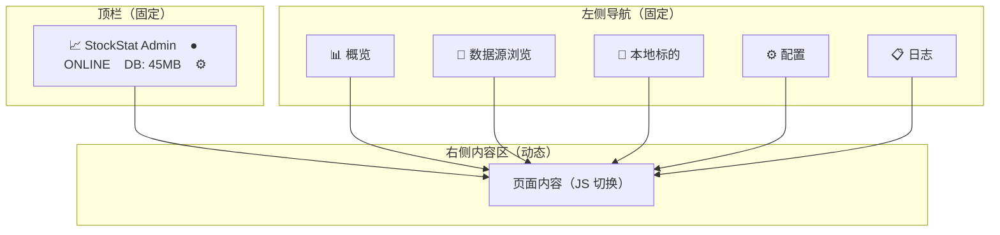

# StockStat 网页管理界面设计报告

> **版本**: v1.0
> **日期**: 2026-07-18
> **状态**: 设计中
> **关联**: DESIGN_V2_CN §12.2 网页管理界面

---

## 目录

1. [设计目标与约束](#1-设计目标与约束)
2. [页面结构与导航逻辑](#2-页面结构与导航逻辑)
3. [页面详细设计](#3-页面详细设计)
4. [跨页面交互设计](#4-跨页面交互设计)
5. [后端 API 端点规划](#5-后端-api-端点规划)
6. [前端技术方案](#6-前端技术方案)
7. [功能可行性矩阵](#7-功能可行性矩阵)
8. [不纳入管理界面的功能](#8-不纳入管理界面的功能)

---

## 1. 设计目标与约束

### 1.1 目标

为 StockStat Storage Server 提供一个浏览器可访问的管理界面，覆盖以下功能域：

- **数据管理**：浏览数据源目录、搜索标的、下载/删除/补全数据
- **数据查看**：K 线图展示、时间窗口截选、数据预览
- **服务运维**：配置查看/修改、缓存管理、磁盘监控、健康状态
- **操作审计**：采集历史日志

### 1.2 技术约束

| 约束 | 说明 | 应对 |
|------|------|------|
| 无 Node 构建链 | 项目无前端构建工具链 | 原生 HTML+JS+CSS，CDN 引入图表库 |
| 单 HTML 文件 | 由 FastAPI `HTMLResponse` 返回 | SPA 架构，JS 切换页面 |
| 后端 FastAPI | 管理端点挂 `/admin/api/` | 已有基础，追加端点 |
| 大目录（4498 条） | Binance 全量标的 | 后端分页 + 前端搜索过滤 |
| K 线图数据量 | 5年1h ~44000行 | 默认加载最近 200 根，滚动动态加载 |

### 1.3 设计原则

| 原则 | 说明 |
|------|------|
| **操作就近** | 管理操作（删除/下载）紧挨被操作对象，不跳页 |
| **渐进信息** | 列表 → 点击 → 详情 → K线图，逐层深入 |
| **职责分离** | 数据源浏览（发现+下载）与本地标的（查看+管理）分页 |
| **轻量优先** | 不引入重计算（回测/指标计算）到管理界面 |

---

## 2. 页面结构与导航逻辑

### 2.1 整体布局



### 2.2 导航顺序

导航顺序遵循**数据生命周期**：

```
概览（全局状态） → 数据源浏览（发现+下载） → 本地标的（查看+管理） → 配置（运维） → 日志（审计）
```

用户的典型操作流程：

1. 进**概览**看状态 → 发现 BTC/USDT 数据过期
2. 进**本地标的**点 BTC/USDT → K 线图截选缺失范围 → "补全此范围"
3. 或进**数据源浏览**搜 BTC → "补全" → 选时间范围下载
4. 回**概览**确认更新
5. 偶尔进**配置**改代理或清缓存
6. 出问题时进**日志**查错误

用户最多点 2 次导航即可到达目标操作。

### 2.3 顶栏设计

```
┌─────────────────────────────────────────────────────────┐
│  📈 StockStat Admin              ● ONLINE   DB: 45MB  ⚙ │
└─────────────────────────────────────────────────────────┘
```

| 区域 | 内容 | 行为 |
|------|------|------|
| 左侧 | Logo + 名称 | 点击回概览页 |
| 中间 | 服务状态指示 | `● ONLINE`（绿）/ `● DEGRADED`（黄）/ `● OFFLINE`（红），每 10s 自动刷新 |
| 右侧 | DB 大小 + ⚙ 图标 | 点击跳转配置页 |

---

## 3. 页面详细设计

### 3.1 📊 概览（Dashboard）

**定位**：管理界面首页，一眼掌握全局状态。

```
┌────────────────────────────────────────────────────────┐
│  📊 概览                                                │
├────────────────────────────────────────────────────────┤
│                                                        │
│  ┌─────────┐ ┌─────────┐ ┌─────────┐ ┌──────────┐    │
│  │   5     │ │ 12,847  │ │ 312 MB  │ │ ●在线    │    │
│  │ 已下标的 │ │ 总行数   │ │ 磁盘占用 │ │ 服务状态  │    │
│  └─────────┘ └─────────┘ └─────────┘ └──────────┘    │
│                                                        │
│  ┌──────────────────────────┐ ┌──────────────────┐    │
│  │ 按数据源分布               │ │ 最近采集记录       │    │
│  │ binance   3 (60%)  ████   │ │ PAXG/USDT  5min前 │    │
│  │ yfinance  2 (40%)  ███    │ │ BTC/USDT   1h前   │    │
│  │                          │ │ AAPL       2h前   │    │
│  └──────────────────────────┘ └──────────────────┘    │
│                                                        │
│  ┌──────────────────────────────────────────────────┐  │
│  │ 数据覆盖时间轴（甘特图）                           │  │
│  │ BTC/USDT  ████████████████████████  2022-2024    │  │
│  │ ETH/USDT  ████████████████          2023-2024    │  │
│  │ AAPL       ████████████████████      2023-2024    │  │
│  │ PAXG/USDT ████████████████████████  2022-2024    │  │
│  └──────────────────────────────────────────────────┘  │
└────────────────────────────────────────────────────────┘
```

**组件**：

| 组件 | 数据来源 | 刷新策略 |
|------|---------|---------|
| 统计卡片（标的数/行数/磁盘/状态） | `/admin/api/stats` + `/admin/api/health` | 进入页面时加载 |
| 按数据源分布 | `/admin/api/stats` (`symbols_by_source`) | 进入页面时加载 |
| 最近采集记录 | `/admin/api/logs?limit=5`（新增端点） | 进入页面时加载 |
| 数据覆盖甘特图 | `/admin/api/symbols`（含 earliest/latest） | 进入页面时加载 |

**甘特图设计**：
- 横轴为时间范围（全局 earliest ~ latest）
- 每行一个标的，色块表示数据覆盖时段
- 点击某行 → 跳转本地标的页并选中该标的
- 纯 CSS flex 实现（色块宽度 = 覆盖时长 / 全局时长 × 100%），不需要图表库

**合理性**：
- 统计卡片放最顶部是管理后台标准模式（Grafana/Vercel/Railway）
- 按数据源分布用进度条而非饼图——小尺寸下标签更清晰
- 甘特图是本界面的独特价值——一眼看出数据覆盖完整性和缺口

### 3.2 📁 数据源浏览（Source Browser）

**定位**：浏览各数据源的可用标的目录，搜索并下载。

```
┌────────────────────────────────────────────────────────┐
│  📁 数据源浏览                                          │
├────────────────────────────────────────────────────────┤
│                                                        │
│  数据源: [Binance ▾]  搜索: [BTC_______]  类型: [全部▾] │
│                                                        │
│  ┌──────────────────────────────────────────────────┐  │
│  │ 标的           类型    已下载  操作                │  │
│  ├──────────────────────────────────────────────────┤  │
│  │ BTC/USDT      crypto   ✅     [查看] [补全]      │  │
│  │ ETH/USDT      crypto   ✅     [查看] [补全]      │  │
│  │ SOL/USDT      crypto   —      [下载]             │  │
│  │ ADA/USDT      crypto   —      [下载]             │  │
│  │ ...                                             │  │
│  │  < 1 2 3 ... 150 >    每页: [50▾]               │  │
│  └──────────────────────────────────────────────────┘  │
│                                                        │
│  ┌──────────────────────────────────────────────────┐  │
│  │ ☑ SOL/USDT  ☑ ADA/USDT  ☑ DOT/USDT              │  │
│  │ 已选 3 个标的                                      │  │
│  │ 时间范围: [2024-01-01] 至 [2024-12-31]            │  │
│  │ 时间粒度: [1d ▾]                                  │  │
│  │ [批量下载]  进度: ████████░░ 80% (2/3)           │  │
│  └──────────────────────────────────────────────────┘  │
└────────────────────────────────────────────────────────┘
```

**交互流程**：

```
选择数据源 → 加载标的目录（分页）
     │
     ├─ 搜索过滤 → 后端按关键字过滤
     │
     ├─ 点击"下载"（未下载标的）
     │    └─ 弹出时间范围选择 → 确认 → POST /admin/api/ingest → 进度提示
     │
     ├─ 点击"补全"（已下载标的）
     │    └─ 后端比对本地最新时间戳 → 只下载缺失部分 → 进度提示
     │
     ├─ 点击"查看"（已下载标的）
     │    └─ 跳转本地标的页，选中该标的
     │
     └─ 勾选多个 + 批量下载
          └─ 底部固定栏出现 → 选时间范围 → 批量 POST → SSE 进度推送
```

**"已下载"标注实现**：
- 后端一次 `symbol_repo.list_symbols()` 拿到全部本地标的集合
- 对目录中的每个标的，O(1) 查找集合交集
- 不逐条查数据库，避免 N 次 DB 查询

**分页**：
- Binance 4498 条，每页 50 条 = 90 页
- 后端 `GET /admin/api/sources/{source}/symbols?page=1&size=50&search=BTC`
- 前端分页器 + 搜索框

**批量下载进度**：
- 后端逐个调用 `ingest`，通过 SSE 推送进度
- 前端 `EventSource` 接收，渲染进度条
- 比 WebSocket 简单，无需双向通信

**合理性**：
- 数据源浏览页的职责是"发现和下载"，不显示 K 线图——4498 条列表 + K 线图在同一页会非常慢
- "已下载"标注用集合交集，O(n) 一次完成
- 批量下载在底部固定栏——勾选后才出现，不占常驻空间

### 3.3 💾 本地标的（Local Symbols）

**定位**：浏览已下载标的，查看 K 线图，截选时间范围，进行数据管理。

```
┌────────────────────────────────────────────────────────┐
│  💾 本地标的                                            │
├──────────────────────┬─────────────────────────────────┤
│  标的列表              │  BTC/USDT                       │
│                      │  binance · crypto · 1d · 366行   │
│  🔍 [搜索____]       │  2024-01-01 ~ 2024-12-31        │
│                      │                                 │
│  ▸ BTC/USDT  ✅     │  ┌─────────────────────────┐    │
│  ▸ ETH/USDT  ✅     │  │    K 线图                │    │
│  ▸ PAXG/USDT ✅     │  │                         │    │
│  ▸ AAPL      ✅     │  │  [lightweight-charts]   │    │
│  ▸ ^GSPC     ✅     │  │                         │    │
│                      │  │  ◄range selector►       │    │
│                      │  │  [2024-03]──[2024-09]   │    │
│                      │  └─────────────────────────┘    │
│                      │                                 │
│                      │  截选范围: 2024-03-01 ~ 2024-09 │
│                      │  [补全此范围] [导出CSV]         │
│                      │                                 │
│                      │  ┌─────────────────────────┐    │
│                      │  │ 数据预览 (最近 20 行)    │    │
│                      │  │ ts        open  close  │    │
│                      │  │ 12-30    98000  97500  │    │
│                      │  │ 12-31    97500  97200  │    │
│                      │  └─────────────────────────┘    │
│                      │                                 │
│                      │  [删除此标的数据] [重新下载]     │
└──────────────────────┴─────────────────────────────────┘
```

**布局**：左右分栏（列表 + 详情），经典文件管理器布局。

**K 线图**：
- 使用 TradingView lightweight-charts（45KB，CDN 引入）
- 内置 range selector，用户拖拽选择时间段
- 默认加载最近 200 根 K 线；用户滚动/缩放时动态加载更多
- 支持 candlestick（K 线）和 volume（成交量副图）

**截选后操作**：

| 操作 | 说明 | 后端端点 |
|------|------|---------|
| 补全此范围 | 下载截选范围内缺失的数据 | `POST /admin/api/ingest`（带 start/end） |
| 导出 CSV | 导出截选范围内的数据 | `GET /api/v1/ohlcv?format=csv&start=...&end=...` |

**数据预览表格**：
- 显示最近 20 行原始 OHLCV
- 调试场景刚需（"数据到底长什么样"）

**危险操作**：
- `[删除此标的数据]` 放最底部，与浏览区拉开距离
- 点击后弹确认框，显示标的和行数
- 删除后左侧列表自动刷新

**合理性**：
- 左右分栏比"列表页→跳转详情页"少一次跳转，切换标的时 K 线图局部刷新
- K 线图在右侧而非全屏——左侧列表需始终可见
- 危险操作放最底部避免误点
- `[重新下载]` 在删除旁——删除后可立即重新下载，不需跳转数据源页

### 3.4 ⚙ 配置（Settings）

**定位**：查看和修改服务配置。

```
┌────────────────────────────────────────────────────────┐
│  ⚙ 配置                                                │
├────────────────────────────────────────────────────────┤
│                                                        │
│  ┌─ 数据库 ──────────────────────────────────────────┐ │
│  │ 当前路径: sqlite:///data/stockstat/stockstat.db  │ │
│  │ 状态: ● 已连接                                    │ │
│  │ 提示: 修改路径需重启服务生效                        │ │
│  │ [修改路径]                                        │ │
│  └──────────────────────────────────────────────────┘ │
│                                                        │
│  ┌─ 代理 ────────────────────────────────────────────┐ │
│  │ 启用: [●开关]                                     │ │
│  │ 类型: [HTTP ▾]                                    │ │
│  │ 地址: [http://127.0.0.1:8889        ]             │ │
│  │ [保存并应用] ← 立即生效，重建适配器                │ │
│  └──────────────────────────────────────────────────┘ │
│                                                        │
│  ┌─ 缓存 ────────────────────────────────────────────┐ │
│  │ 类型: InMemoryCache                               │ │
│  │ TTL: 300秒                                        │ │
│  │ 当前键数: 12                                      │ │
│  │ 命中率: 85%                                       │ │
│  │ [清空缓存]                                        │ │
│  └──────────────────────────────────────────────────┘ │
│                                                        │
│  ┌─ 磁盘 ────────────────────────────────────────────┐ │
│  │ 总容量: 500 GB                                    │ │
│  │ 已用: 312 GB (62%)                                │ │
│  │ 数据库文件: 45 MB                                 │ │
│  │ ████████████████░░░░░░░░░  62%                    │ │
│  └──────────────────────────────────────────────────┘ │
└────────────────────────────────────────────────────────┘
```

**四个配置卡片**：

| 卡片 | 可修改？ | 生效方式 | 理由 |
|------|---------|---------|------|
| 数据库 | 仅查看路径 | 修改后重启生效 | engine 单例热切换有数据不一致风险 |
| 代理 | 可在线修改 | 立即生效 | 只影响新建 HTTP 连接，不涉及连接池 |
| 缓存 | 仅查看 + 清空 | 清空立即生效 | 缓存是性能优化，不展示内部结构 |
| 磁盘 | 仅查看 | — | `os.statvfs` 获取 |

**代理在线修改实现**：
- 修改 `settings.proxy` 的 `enabled`/`type`/`url`
- 清空 `_adapters` 缓存（下次请求自动用新代理重建适配器）
- 不需要重启服务

**DB 路径修改**：
- 在网页上修改后写入环境变量或配置文件
- 提示"请重启服务生效"
- 不做热切换——SQLAlchemy engine 热切换会导致请求中途连接池失效

**合理性**：
- 四个卡片纵向排列，各自独立——用户通常只改一个配置
- DB 路径和代理的生效方式不同，因为风险等级不同
- 磁盘信息放配置页而非概览页——概览已有数字卡片，配置页展示更详细

### 3.5 📋 日志（Logs）

**定位**：查看采集历史和系统事件。

```
┌────────────────────────────────────────────────────────┐
│  📋 日志                                                │
├────────────────────────────────────────────────────────┤
│                                                        │
│  类型: [全部▾] 标的: [_____] 时间: [今天▾]  [刷新]      │
│                                                        │
│  ┌──────────────────────────────────────────────────┐  │
│  │ 时间         标的        操作    行数   状态      │  │
│  ├──────────────────────────────────────────────────┤  │
│  │ 10:30:15    PAXG/USDT   采集    1095   ✅成功    │  │
│  │ 10:25:03    BTC/USDT    采集     366   ✅成功    │  │
│  │ 10:10:00    SOL/USDT    采集       0   ❌失败    │  │
│  │ 09:45:00    BTC/USDT    删除    -366   ✅成功    │  │
│  │ ...                                              │  │
│  └──────────────────────────────────────────────────┘  │
│  < 1 2 3 >                                             │
└────────────────────────────────────────────────────────┘
```

**需要后端新增 `ingest_log` 表**：

| 字段 | 类型 | 说明 |
|------|------|------|
| `id` | Integer PK | 自增 |
| `timestamp` | DateTime | 操作时间 |
| `symbol` | String | 标的 |
| `action` | String | `ingest` / `delete` / `config_change` |
| `rows_affected` | Integer | 影响行数（删除为负） |
| `status` | String | `success` / `failed` |
| `error_message` | String | 错误信息（失败时） |
| `source` | String | 数据源 |
| `timeframe` | String | 时间粒度 |

**合理性**：
- 日志页放最后——不是高频操作，但出问题时必须能查
- 失败行红色标注——用户最关心失败的操作
- 需要新增日志表——轻量（9 列），不影响性能

---

## 4. 跨页面交互设计

| 场景 | 触发 | 跳转目标 | 说明 |
|------|------|---------|------|
| 概览→标的详情 | 点击甘特图某行 | 本地标的页 + 选中该标的 | 缩短操作路径 |
| 数据源→本地标的 | 点击"查看" | 本地标的页 + 选中该标的 | 已下载标的快速查看 |
| 本地标的→补全 | K 线图截选 + "补全此范围" | 就地完成（不跳转） | 弹确认 → 后台下载 → 进度提示 |
| 本地标的→删除 | "删除此标的数据" | 就地完成 | 确认框 → 删除 → 列表刷新 |
| 任何页面→概览 | 点击顶栏 logo | 概览页 | 标准返回首页 |
| 任何页面→配置 | 点击顶栏 ⚙ 图标 | 配置页 | 快捷运维 |

---

## 5. 后端 API 端点规划

### 5.1 已有端点（无需新增）

| 端点 | 方法 | 用途 |
|------|------|------|
| `/admin/api/health` | GET | 服务健康 + DB + 缓存 + 代理状态 |
| `/admin/api/config` | GET | 配置查看（DB URL 脱敏） |
| `/admin/api/symbols` | GET | 本地标的列表（含行数/时间范围） |
| `/admin/api/symbols/{symbol}` | DELETE | 删除标的数据 |
| `/admin/api/ingest` | POST | 采集数据 |
| `/admin/api/stats` | GET | 聚合统计 |
| `/admin/api/sources` | GET | 数据源列表 |

### 5.2 需新增端点

| 端点 | 方法 | 用途 | 说明 |
|------|------|------|------|
| `/admin/api/sources/{source}/symbols` | GET | 浏览数据源标的目录 | 分页+搜索；`page`/`size`/`search` 参数；标注已下载 |
| `/admin/api/proxy` | PUT | 在线修改代理配置 | 修改 `settings.proxy` + 清空 `_adapters` |
| `/admin/api/cache` | GET | 缓存详情 | 键数/命中率/TTL |
| `/admin/api/cache` | DELETE | 清空缓存 | `cache.clear()` |
| `/admin/api/disk` | GET | 磁盘空间 | `os.statvfs` → 总量/已用/可用 |
| `/admin/api/logs` | GET | 采集历史日志 | 分页+过滤；`action`/`symbol`/`date` 参数 |
| `/admin/api/ingest/batch` | POST | 批量采集 | 接收标的列表 + 时间范围；SSE 推进度 |
| `/admin/api/ingest/progress` | GET (SSE) | 批量采集进度 | `text/event-stream` |

### 5.3 端点与页面对应关系

```
概览页 ← /admin/api/stats + /admin/api/health + /admin/api/logs?limit=5 + /admin/api/symbols
数据源浏览 ← /admin/api/sources + /admin/api/sources/{source}/symbols
本地标的 ← /admin/api/symbols + /api/v1/ohlcv (K线数据) + /admin/api/ingest (补全)
配置 ← /admin/api/config + /admin/api/proxy(PUT) + /admin/api/cache + /admin/api/disk
日志 ← /admin/api/logs
```

---

## 6. 前端技术方案

### 6.1 技术选型

| 组件 | 方案 | 大小 | 引入方式 |
|------|------|------|---------|
| K 线图 | [lightweight-charts](https://github.com/tradingview/lightweight-charts) | ~45KB | CDN `<script>` |
| 样式 | 原生 CSS（暗色主题） | ~8KB | 内联 `<style>` |
| 交互 | 原生 JS（无框架） | 0 | 内联 `<script>` |
| 分页 | 原生 JS 分页器 | 0 | 自实现 |
| 进度推送 | SSE（EventSource） | 0 | 浏览器原生 |
| 图标 | Unicode emoji | 0 | 无依赖 |

**为什么不用 Vue/React**：项目无 Node 构建链，引入框架需要构建工具。原生 JS + CSS 对于 5 个页面的 SPA 完全够用，且单 HTML 文件由 FastAPI 直接返回，部署零配置。

### 6.2 SPA 路由

```javascript
// 单 HTML 文件内，JS 切换页面
const pages = {
    dashboard: renderDashboard,
    source: renderSourceBrowser,
    local: renderLocalSymbols,
    config: renderConfig,
    logs: renderLogs,
};

function navigate(page, params) {
    document.getElementById('content').innerHTML = '';
    pages[page](params);
    // 更新导航高亮
    document.querySelectorAll('.nav-item').forEach(el => el.classList.remove('active'));
    document.querySelector(`[data-page="${page}"]`).classList.add('active');
}
```

URL 不变化（单页应用），但支持浏览器后退通过 `history.pushState` 实现（可选）。

### 6.3 K 线图集成

```javascript
// CDN 引入
// <script src="https://unpkg.com/lightweight-charts/dist/lightweight-charts.standalone.production.js"></script>

function renderChart(containerId, ohlcvData) {
    const chart = LightweightCharts.createChart(document.getElementById(containerId), {
        width: 800, height: 400,
        layout: { background: { color: '#0f1419' }, textColor: '#e0e0e0' },
        timeScale: { timeVisible: true, secondsVisible: false },
    });

    const candleSeries = chart.addCandlestickSeries({
        upColor: '#26a69a', downColor: '#ef5350',
        borderUpColor: '#26a69a', borderDownColor: '#ef5350',
        wickUpColor: '#26a69a', wickDownColor: '#ef5350',
    });

    candleSeries.setData(ohlcvData.map(d => ({
        time: d.ts, open: d.open, high: d.high, low: d.low, close: d.close,
    })));

    // Volume 副图
    const volumeSeries = chart.addHistogramSeries({
        color: '#4fc3f7', priceFormat: { type: 'volume' },
        priceScaleId: '', scaleMargins: { top: 0.8, bottom: 0 },
    });
    volumeSeries.setData(ohlcvData.map(d => ({
        time: d.ts, value: d.volume, color: d.close >= d.open ? '#26a69a80' : '#ef535080',
    })));

    // Range selector 内置
    chart.timeScale().fitContent();
}
```

**数据加载策略**：
- 默认加载最近 200 根（`/api/v1/ohlcv?symbol=...&limit=200`）
- 用户缩放/滚动时，按可见范围动态加载更多（`start`/`end` 参数）

### 6.4 批量下载进度（SSE）

```javascript
function batchIngest(symbols, start, end, timeframe) {
    const eventSource = new EventSource(
        `/admin/api/ingest/progress?batch_id=${batchId}`
    );

    eventSource.onmessage = function(event) {
        const data = JSON.parse(event.data);
        // {completed: 2, total: 3, current: "ADA/USDT", status: "success"}
        updateProgressBar(data.completed, data.total);
        appendLog(`${data.current}: ${data.status}`);
    };

    eventSource.addEventListener('done', function(event) {
        eventSource.close();
        showNotification('批量下载完成');
    });
}
```

---

## 7. 功能可行性矩阵

### 7.1 管理类

| # | 功能 | 可行性 | 依赖 | 开发量 |
|---|------|--------|------|--------|
| 1 | DB 路径查看 | ✅ 已实现 | `/admin/api/config` | — |
| 2 | DB 路径修改 | ⚠️ 需重启 | 写配置文件 + 提示重启 | 小 |
| 3 | 代理配置查看 | ✅ 已实现 | `/admin/api/config` | — |
| 4 | 代理配置修改 | ✅ 可行 | 修改 `settings.proxy` + 清空 `_adapters` | 小 |
| 5 | 浏览 source 标的目录 | ✅ 可行 | `adapter.fetch_symbols()` + 分页 | 小 |
| 6 | 搜索标的 | ✅ 可行 | 后端过滤 | 小 |
| 7 | 下载指定时间段数据 | ✅ 已实现 | `/admin/api/ingest` | — |
| 8 | 服务状态 | ✅ 已实现 | `/admin/api/health` | — |
| 9 | 批量下载 | ✅ 可行 | 循环 ingest + SSE 进度 | 中 |
| 10 | 删除标的数据 | ✅ 已实现 | `DELETE /admin/api/symbols/{symbol}` | — |
| 11 | 数据导出 CSV | ✅ 可行 | `GET /api/v1/ohlcv?format=csv` | 小 |
| 12 | 缓存管理 | ✅ 可行 | `cache._store` + `cache.clear()` | 小 |
| 13 | 磁盘空间监控 | ✅ 可行 | `os.statvfs` | 小 |

### 7.2 查看类

| # | 功能 | 可行性 | 依赖 | 开发量 |
|---|------|--------|------|--------|
| 14 | source 目录标注已下载 | ✅ 可行 | 集合交集 | 小 |
| 15 | 本地标的列表 | ✅ 已实现 | `/admin/api/symbols` | — |
| 16 | K 线图展示 | ✅ 可行 | lightweight-charts CDN | 中 |
| 17 | K 线图时间窗口截选 | ✅ 可行 | 图表库内置 range selector | 小 |
| 18 | 截选后补全 | ✅ 可行 | 截选范围传给 ingest | 小 |
| 19 | 截选后导出 | ✅ 可行 | `GET /api/v1/ohlcv?format=csv&start=...&end=...` | 小 |
| 20 | 数据预览表格 | ✅ 可行 | `GET /api/v1/ohlcv?limit=20` | 小 |
| 21 | 数据覆盖甘特图 | ✅ 可行 | symbols earliest/latest + CSS | 中 |
| 22 | 数据完整性检查 | ✅ 可行 | 交易日历比对 | 中 |

### 7.3 审计类

| # | 功能 | 可行性 | 依赖 | 开发量 |
|---|------|--------|------|--------|
| 23 | 采集历史日志 | ✅ 可行 | 新增 `ingest_log` 表 | 中 |
| 24 | 日志过滤搜索 | ✅ 可行 | 后端分页+过滤 | 小 |
| 25 | 数据源健康检测 | ✅ 可行 | `adapter.health_check()` | 小 |

### 7.4 发散类

| # | 功能 | 可行性 | 价值 | 开发量 |
|---|------|--------|------|--------|
| 26 | 暗色/亮色主题切换 | ✅ 可行 | 体验 | 小 |
| 27 | 数据对比（双标的叠加） | ✅ 可行 | 分析便利 | 中 |
| 28 | 数据增量更新（一键全更新） | ✅ 可行 | 维护便利 | 中 |
| 29 | 从 K 线图直接回测 | ⚠️ 不建议 | 高价值但重 | 大 |
| 30 | 多用户/权限 | ⚠️ 后续 | 安全 | 中 |

---

## 8. 不纳入管理界面的功能

| 功能 | 原因 | 替代方案 |
|------|------|---------|
| 回测 | 耗时长，阻塞 HTTP 请求 | 走 offload 协议，Client 侧异步提交 |
| 指标计算 | 需后端安装 stockstat 前端库 | 走 Client 侧 `client.compute` |
| DB 路径热切换 | 数据不一致风险 | 改配置后重启服务 |
| 多用户/权限 | 当前单用户场景够用 | 后续用 FastAPI middleware + basic auth |

**管理界面的定位**：数据管理 + 服务运维，不是计算平台。重计算走 offload 协议异步提交。

---

## 9. 实现优先级

| 优先级 | 功能 | 理由 |
|--------|------|------|
| **P0** | source 标的目录浏览 + 搜索 + 标注已下载 | 核心需求，开发量小 |
| **P0** | K 线图展示 + 时间窗口截选 | 核心需求，前端图表库 |
| **P0** | 批量下载 + 进度条 | 核心需求 |
| **P0** | 数据覆盖甘特图 | 概览页核心价值 |
| **P1** | 代理在线修改 | 常见运维需求 |
| **P1** | 磁盘空间监控 | 运维需求 |
| **P1** | 缓存管理 | 运维需求 |
| **P1** | 采集历史日志 | 可追溯性 |
| **P2** | 数据完整性检查 | 高级运维 |
| **P2** | 截选后导出 CSV | 分析便利 |
| **P2** | 数据对比（双标的叠加） | 分析便利 |
| **P3** | 暗色/亮色主题切换 | 体验 |
| **P3** | 数据增量更新（一键全更新） | 维护便利 |
