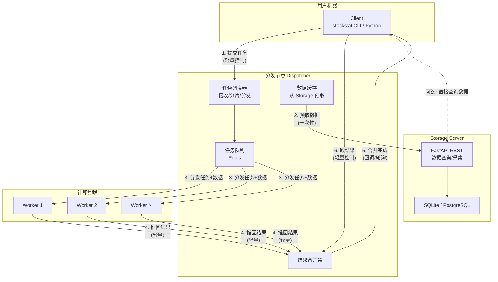
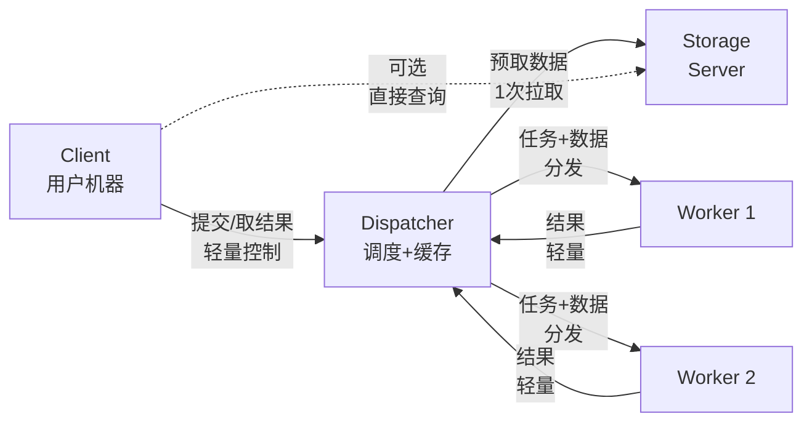
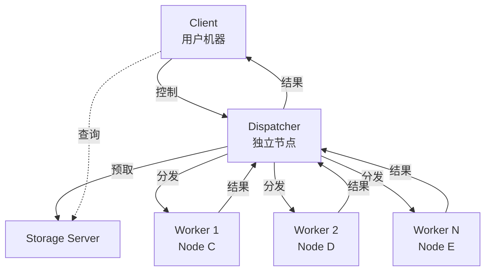
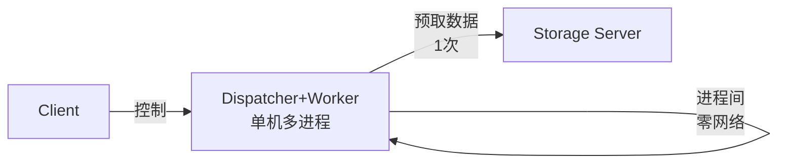
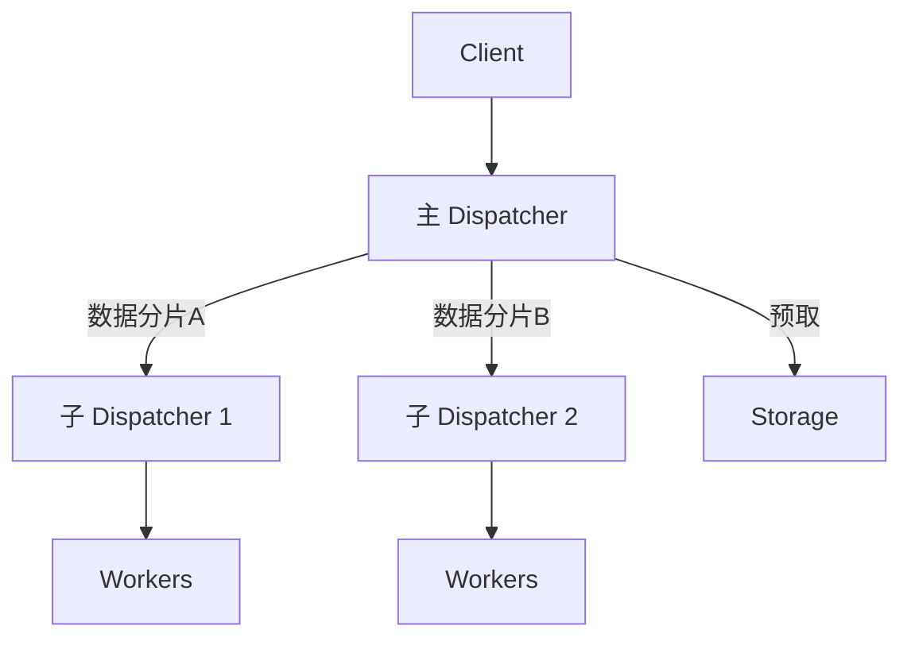
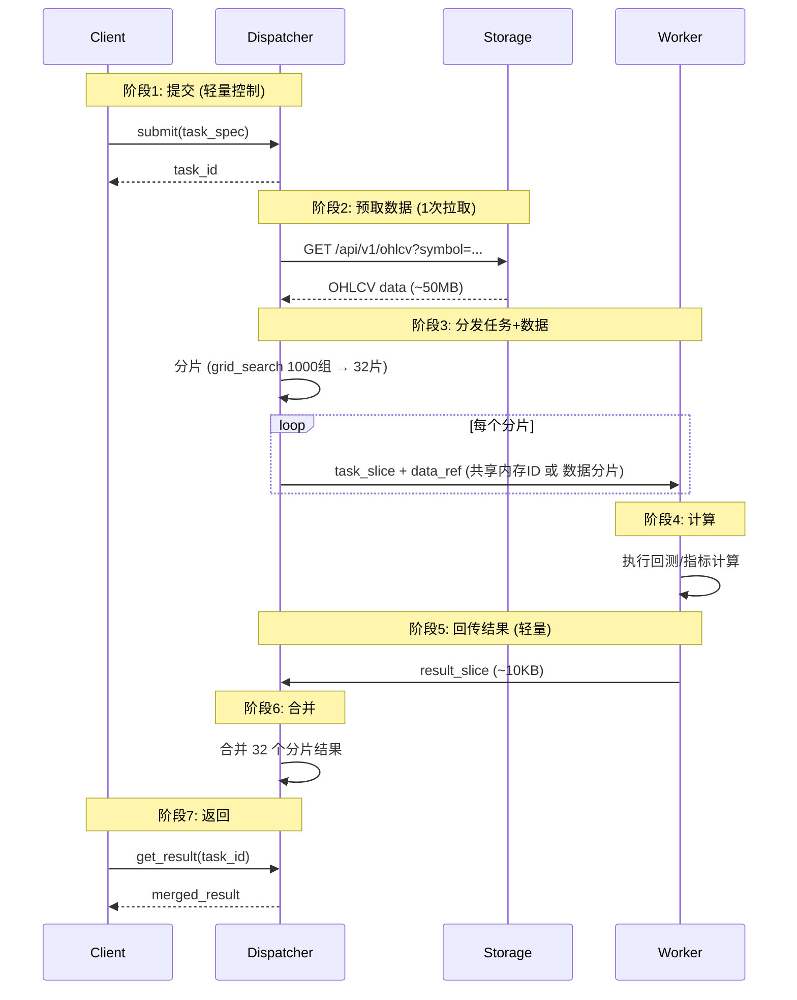
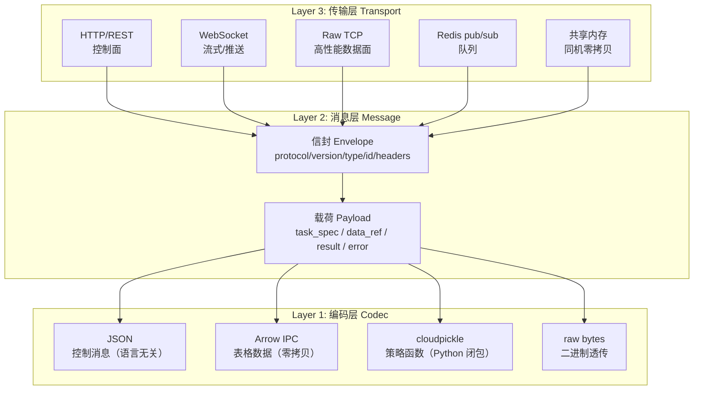
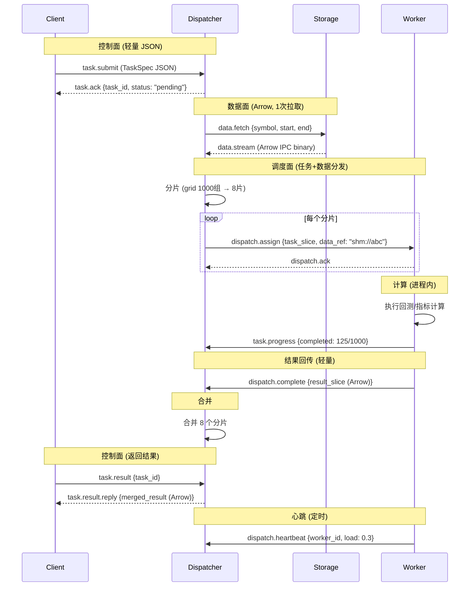
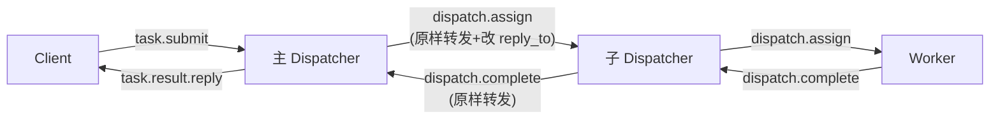

# StockStat 计算 Offload 规划报告 v2

> **版本**: v2.0（修订稿）
> **日期**: 2026-07-18
> **状态**: 设计中
> **修订**: v1 的 Storage Server 兼任任务队列导致带宽瓶颈；v2 引入独立分发节点，数据路径与控制路径分离

---

## 1. 问题分析

### 1.1 v1 方案的带宽瓶颈

```
Client ──提交任务──> Storage Server (兼任队列)
                        │
Worker1 ──拉数据──────>│  ← Storage 出口带宽被 N 个 Worker 瓜分
Worker2 ──拉数据──────>│
WorkerN ──拉数据──────>│
                        │
Worker1 ──推结果──────>│
Client  ──取结果──────>│  ← 用户查询也走同一带宽
```

**问题**：
- Storage Server 同时承担**数据查询服务**和**任务队列**两个角色
- N 个 Worker 并行拉取数据时，Storage 的网络出口带宽被 N 倍放大
- 用户查询与 Worker 数据拉取竞争同一带宽
- 5 年 BTC/USDT 1h 数据 ~50MB，4 节点 × 8 Worker = 32 并发拉取 → 峰值 ~1.6GB 同时传输
- Storage Server 的上行带宽（典型 1Gbps）在 8+ Worker 时即饱和

### 1.2 目标

- **数据路径与控制路径分离**：任务调度走轻量控制通道，数据拉取走独立通道
- **消除 Storage 带宽瓶颈**：Worker 不直接从 Storage 拉取全量数据
- **保持故障隔离**：计算崩溃不影响 Storage
- **保持弹性扩展**：按需增减计算节点

---

## 2. 架构设计

### 2.1 四角色架构



### 2.2 关键设计：数据随任务分发

v2 的核心改进是 **Dispatcher 预取数据并随任务一起分发给 Worker**：

```
v1: Worker 各自从 Storage 拉数据 (N 次全量拉取)
v2: Dispatcher 一次性从 Storage 拉取数据 → 随任务分发给各 Worker (1 次拉取, N 次本地分发)
```

| 路径 | v1 方案 | v2 方案 |
|------|---------|---------|
| Storage → 计算的数据传输 | N 次（每 Worker 独立拉取） | **1 次**（Dispatcher 预取） |
| Storage 出口带宽占用 | ×N | **×1** |
| 任务分发 | 任务描述（轻量） | 任务描述 + 数据分片 |
| Worker → 结果收集 | 推回 Storage | 推回 Dispatcher |

### 2.3 角色定义

| 角色 | 部署位置 | 职责 | 带宽特征 |
|------|---------|------|---------|
| **Client** | 用户机器 | 提交任务 + 取结果 + 本地轻量计算 | 轻量控制（KB 级） |
| **Dispatcher** | 网络 Node B（或与 Storage 同机） | 任务调度 + 数据预取 + 结果合并 | 中量（一次性数据拉取 + 任务分发） |
| **Storage Server** | 网络 Node A | 数据存储 + 查询 + 采集 | 不受计算影响（只被 Dispatcher 拉取 1 次） |
| **Compute Worker** | 网络 Node C/D/... | 接收任务+数据 → 计算 → 推回结果 | 局域网内（Dispatcher ↔ Worker） |

---

## 3. 部署场景

### 3.1 场景 A：单机全栈（当前默认，无需 offload）

```
┌─────────────────────────────┐
│  单台机器                    │
│  Storage + Client + 计算     │
│  全部进程内，无网络开销       │
└─────────────────────────────┘
```

### 3.2 场景 B：Storage + Client 分离（当前已支持）

```
Client ──HTTP──> Storage Server
  (本地计算)
```

### 3.3 场景 C：Client → Dispatcher → [Workers] → Storage

**三机分离（最常见 offload 场景）**：



- Dispatcher 可与 Storage 部署在同一台机器（共享局域网，预取走 localhost）
- Worker 节点与 Dispatcher 在同一局域网
- Storage 只被 Dispatcher 拉取 1 次，不被 Worker 直接访问
- **适合**：个人/小团队，1~8 个 Worker

### 3.4 场景 D：Dispatcher 独立部署 + 计算集群



- Dispatcher 独立部署在高带宽节点上
- 适合大规模集群（8+ Worker）
- Dispatcher 成为数据中转站，需要高上行带宽

### 3.5 场景 E：Dispatcher + Worker 合并（超轻量部署）



- Dispatcher 和 Worker 运行在同一台机器
- Dispatcher 预取数据后通过共享内存/进程间队列分发给本地 Worker 进程
- **零网络开销**分发（共享内存）
- 适合：单台高性能计算节点，8~32 核

### 3.6 场景 F：多级 Dispatcher（超大规模）



- 主 Dispatcher 预取全部数据，分片下发给子 Dispatcher
- 每个子 Dispatcher 管理一组 Worker
- 适合 100+ Worker 的超大规模集群

---

## 4. 带宽分析

### 4.1 数据量估算

| 数据集 | 大小 | 说明 |
|--------|------|------|
| BTC/USDT 5年日线 | ~500 KB | ~1300 行 |
| BTC/USDT 5年1h | ~50 MB | ~44000 行 |
| BTC/USDT 5年1m | ~3 GB | ~260万行 |
| PAXG+BTC+ETH 3年1h | ~150 MB | 3标的×3年×1h |

### 4.2 v1 vs v2 带宽对比

以 4 节点 × 8 Worker = 32 并发，计算 PAXG v5-redo（132 次回测，数据 ~50MB）为例：

| 路径 | v1 方案 | v2 方案 |
|------|---------|---------|
| Storage → Worker 数据传输 | 50MB × 32 = **1.6 GB** | 50MB × 1 = **50 MB**（Dispatcher 预取） |
| Storage 出口峰值带宽 | 1.6 GB / 并发窗口 | 50 MB / 一次性拉取 |
| Worker → 结果回传 | 132 × ~10KB = ~1.3 MB | 132 × ~10KB = ~1.3 MB（相同） |
| Client ↔ 控制通道 | ~10 KB | ~10 KB（相同） |
| **Storage 被占用时间** | 整个计算期间 | 仅预取阶段（数秒） |

### 4.3 Dispatcher 分发带宽

Dispatcher 将数据分发给 Worker 时：

| 分发方式 | 带宽 | 延迟 |
|---------|------|------|
| 局域网 TCP | 1Gbps（典型） | < 1ms |
| 共享内存（同机） | ~10 GB/s | ~0ms |
| RDMA（InfiniBand） | 10~100 Gbps | < 0.1ms |

- 场景 C/E（同机或局域网）：50MB 数据分发 < 1 秒
- 场景 D（跨网段）：Dispatcher 需要高上行带宽

### 4.4 结论

| 维度 | v1 | v2 |
|------|----|----|
| Storage 带宽压力 | ×N（N 个 Worker 独立拉取） | ×1（Dispatcher 预取一次） |
| Storage 可用性 | 计算期间带宽被占用 | 计算期间不受影响 |
| 用户查询受影响 | 是（与 Worker 竞争带宽） | 否（Storage 空闲） |
| 数据传输总量 | N × 全量 | 1 × 全量 + N × 分片 |

---

## 5. 任务生命周期



### 5.1 数据分发策略

Dispatcher 预取数据后，根据 Worker 拓扑选择分发策略：

| 策略 | 适用场景 | 实现 |
|------|---------|------|
| **共享内存** | Dispatcher + Worker 同机 | 数据写入 `SharedMemory`，Worker 通过 ID 访问，零拷贝 |
| **本地分发** | 同局域网 | Dispatcher 将数据分片随任务一起发送（TCP） |
| **引用传递** | Worker 可直接访问 Storage | 任务只含 data_spec，Worker 按需从 Storage 拉取（退回 v1 模式） |
| **混合** | 大数据用引用，小数据随任务 | Dispatcher 判断数据大小，< 10MB 随任务分发，> 10MB 用引用 |

```python
# Dispatcher 自动选择策略
def dispatch(task, data):
    if data.size < 10 * 1024 * 1024:  # < 10MB
        return DispatchStrategy.WITH_DATA  # 数据随任务
    elif self.workers_same_host:
        return DispatchStrategy.SHARED_MEMORY  # 共享内存
    else:
        return DispatchStrategy.REFERENCE  # Worker 自行从 Storage 拉取
```

---

## 6. 并发与多访问支持

### 6.1 Storage Server 并发

| 维度 | v2 方案 |
|------|---------|
| **被计算影响的程度** | 几乎为零（只被 Dispatcher 预取 1 次） |
| **并发查询** | FastAPI async，不受计算影响 |
| **并发写入** | 采集与计算完全分离 |
| **建议** | SQLite ≤ 10 并发用户；PostgreSQL > 10 |

### 6.2 Dispatcher 并发

| 维度 | 说明 |
|------|------|
| **任务并发** | 多个 Client 可同时提交任务，Dispatcher 排队调度 |
| **数据缓存** | Dispatcher 缓存预取的数据，相同数据集的后续任务零拉取 |
| **分发并发** | 同时向 N 个 Worker 分发任务+数据 |
| **合并并发** | 多个任务的结果合并互不阻塞 |

### 6.3 Worker 并发

| 模式 | 并发度 | 适用 |
|------|--------|------|
| 单 Worker 单进程 | 1 | 调试 |
| 单 Worker 多进程 | N（CPU 核心数） | 场景 C/E |
| 多 Worker 多进程 | M × N | 场景 D |
| 多级 Dispatcher | M × N × L | 场景 F |

---

## 7. 应用 Case 量化分析

### 7.1 Case 1: PAXG v5-redo（132 次回测，~50MB 数据）

| 维度 | v1 (Storage 兼队列) | v2 (Dispatcher 分发) |
|------|--------------------|-----------------------|
| Storage 带宽 | 50MB × 32 = 1.6 GB | 50MB × 1 = 50 MB |
| 预取耗时 | — | ~0.5s（局域网） |
| 分发耗时 | — | ~0.5s（共享内存）或 ~2s（局域网 TCP） |
| 计算耗时 (8进程) | ~35s | ~35s（相同） |
| **总耗时** | ~40s | ~36s（多 1s 预取+分发） |
| Storage 可用性 | 计算期间带宽被占 | 计算期间完全空闲 |

### 7.2 Case 2: 参数网格搜索（1000 组，~50MB 数据）

| 维度 | v1 | v2 |
|------|----|----|
| Storage 带宽 | 50MB × 32 = 1.6 GB | 50MB × 1 = 50 MB |
| **总耗时** (4节点×8进程) | ~2min | ~2min（计算时间相同） |
| Storage 影响 | 2分钟带宽被占 | 仅 0.5 秒预取 |

### 7.3 Case 3: 大数据回测（5年1分钟线 ~3GB）

| 维度 | v1 | v2 |
|------|----|----|
| Storage 带宽 | 3GB × 8 = 24 GB | 3GB × 1 = 3 GB |
| 预取耗时 | — | ~30s（千兆局域网） |
| 分发策略 | — | 共享内存（同机）或引用传递（跨机） |
| **关键优势** | Storage 带宽 24GB 瓶颈 | Storage 仅传 3GB，之后完全空闲 |

### 7.4 带宽节省总结

| 场景 | 数据量 | Worker 数 | v1 Storage 带宽 | v2 Storage 带宽 | 节省 |
|------|--------|-----------|----------------|----------------|------|
| PAXG v5-redo | 50MB | 32 | 1.6 GB | 50 MB | 97% |
| 参数搜索 | 50MB | 32 | 1.6 GB | 50 MB | 97% |
| 大数据回测 | 3 GB | 8 | 24 GB | 3 GB | 87% |
| 多标的批量 | 150 MB | 16 | 2.4 GB | 150 MB | 94% |

---

## 8. 技术选型

### 8.1 Dispatcher 实现

| 组件 | 方案 | 说明 |
|------|------|------|
| 任务队列 | Redis（轻量）或内存队列（同机） | Dispatcher 内置队列管理 |
| 数据预取 | HTTP from Storage → 内存/共享内存 | 一次性拉取，缓存复用 |
| 数据分发 | 共享内存（同机）/ TCP（跨机）/ 引用（大数据） | 自动策略选择 |
| 结果合并 | 内存合并 → 序列化返回 | Dispatcher 合并后通知 Client |
| 序列化 | cloudpickle（策略函数）+ Arrow（数据） | 与 v1 相同 |

### 8.2 Dispatcher 部署形态

| 形态 | 说明 | 适用 |
|------|------|------|
| **与 Storage 同机** | Dispatcher 作为 Storage 的一个插件/子进程 | 场景 C，简单部署 |
| **独立节点** | Dispatcher 单独部署在高带宽机器上 | 场景 D，大规模集群 |
| **与 Worker 同机** | Dispatcher + Worker 合并为单进程多线程 | 场景 E，超轻量 |
| **多级** | 主 Dispatcher + 子 Dispatcher | 场景 F，超大规模 |

### 8.3 Dispatcher 作为插件 vs 独立包

| 维度 | Storage 插件 | 独立包 |
|------|-------------|--------|
| 部署 | 与 Storage 同机，零额外部署 | 独立部署 |
| 数据预取 | localhost（极快） | 走网络 |
| 资源隔离 | 共享 Storage 的 CPU/内存 | 独立资源 |
| 适用 | ≤ 8 Worker | 任意规模 |

**建议**：Phase 1 做成 Storage 插件（`_domain/dispatcher/`），与 Storage 同机部署；Phase 2 支持独立部署模式。

---

## 9. 用户 API

### 9.1 Client 侧

```python
from stockstat import StockStatClient

client = StockStatClient(host="storage-server", port=8000)

# ── 本地计算（即时返回）──
sma = client.compute.ma(data.close, window=20)
res = client.backtest(data, strategy, initial_cash=10000)

# ── 远程计算（提交到 Dispatcher）──

# 提交参数搜索
task = client.compute.remote(
    "grid_search",
    data_spec={"symbol": "BTC/USDT", "start": "2024-01-01", "timeframe": "1d"},
    strategy=ma_cross_strategy,
    param_grid={"short": [3, 5, 8], "long": [10, 20, 30]},
    metric="sharpe",
    # 可指定 Dispatcher 地址（默认走 Storage 转发）
    # dispatcher="dispatcher-host:9000",
)
print(f"Task: {task.id}, Status: {task.status}")

# 等待结果
result = task.wait(timeout=3600)
# 或轮询
if task.ready():
    result = task.result()
```

### 9.2 Dispatcher 侧

```bash
# 方式1：作为 Storage 插件运行（同机）
# Storage 启动时自动加载 Dispatcher

# 方式2：独立部署
stockstat-dispatcher \
    --storage-host storage-server \
    --storage-port 8000 \
    --listen 0.0.0.0:9000 \
    --data-cache-dir /tmp/stockstat-cache
```

### 9.3 Worker 侧

```bash
# 启动 Worker，连接 Dispatcher
stockstat-compute worker \
    --dispatcher-host dispatcher-server \
    --dispatcher-port 9000 \
    --concurrency 8
```

---

## 10. 完整对比：v1 vs v2

| 维度 | v1 (Storage 兼队列) | v2 (Dispatcher 分发) |
|------|--------------------|-----------------------|
| **角色数** | 3 (Client/Storage/Worker) | 4 (Client/Dispatcher/Storage/Worker) |
| **Storage 带宽压力** | ×N Worker | ×1 Dispatcher |
| **Storage 可用性** | 计算期间受影响 | 不受影响 |
| **数据传输** | Worker 各自拉取 | Dispatcher 预取+分发 |
| **部署复杂度** | 低（Storage 兼队列） | 中（多一个 Dispatcher） |
| **扩展性** | 受限于 Storage 带宽 | 受限于 Dispatcher 带宽（可多级） |
| **数据缓存** | 无 | Dispatcher 缓存，后续任务零拉取 |
| **适合规模** | ≤ 4 Worker | 任意（多级 Dispatcher） |
| **故障隔离** | 计算崩溃影响 Storage 队列 | 计算崩溃不影响 Storage |

---

## 11. 实现路线图

| 阶段 | 内容 | 预计 |
|------|------|------|
| **Phase 1** | Dispatcher 作为 Storage 插件 + 内存队列 + 共享内存分发 | 2 周 |
| **Phase 2** | Client 侧 `remote()` API + 任务轮询 | 1 周 |
| **Phase 3** | 独立 Dispatcher 部署模式 + TCP 分发 | 1 周 |
| **Phase 4** | Worker 数据本地缓存 + 增量预取 | 1 周 |
| **Phase 5** | 多级 Dispatcher + 负载均衡 | 2 周 |
| **Phase 6** | Web Admin 任务监控面板 | 1 周 |

### 11.1 新增包结构

```
# Phase 1: Dispatcher 作为 Storage 插件
backend/stockstat_backend/dispatcher/
├── __init__.py              # Dispatcher 核心
├── queue.py                 # 任务队列（Redis / 内存）
├── prefetch.py              # 数据预取 + 缓存
├── dispatch.py              # 任务分发（共享内存 / TCP / 引用）
└── merge.py                 # 结果合并

# Phase 3+: 独立包
stockstat-compute/           # Worker 独立包
├── worker.py                # Worker 进程
├── tasks/
│   ├── backtest.py
│   ├── grid_search.py
│   └── batch.py
├── cache.py                 # 数据本地缓存
└── pyproject.toml
```

### 11.2 新增 API 端点

**Storage Server（转发给 Dispatcher 插件）**：

| 端点 | 方法 | 说明 |
|------|------|------|
| `/api/v1/tasks` | POST | 提交计算任务 |
| `/api/v1/tasks/{id}` | GET | 查询任务状态 |
| `/api/v1/tasks/{id}/result` | GET | 获取任务结果 |
| `/api/v1/tasks` | GET | 列出所有任务 |
| `/api/v1/tasks/{id}` | DELETE | 取消任务 |

**Dispatcher（独立部署时）**：

| 端点 | 方法 | 说明 |
|------|------|------|
| `/dispatch/submit` | POST | 接收任务 |
| `/dispatch/status/{id}` | GET | 查询状态 |
| `/dispatch/result/{id}` | GET | 获取结果 |
| `/dispatch/workers` | GET | Worker 列表 + 健康 |
| `/dispatch/stats` | GET | 队列统计 |

---

## 12. 通信协议设计

### 12.1 设计目标

| 目标 | 说明 |
|------|------|
| **最大通用性** | 协议不绑定特定计算类型；回测、指标、网格搜索、自定义任务均走同一套消息格式 |
| **传输无关** | 同一套消息可在 HTTP、WebSocket、TCP socket、Redis pub/sub、共享内存上传输 |
| **语言无关** | 控制面用 JSON（任何语言可解析）；数据面用 Arrow（跨语言列式格式） |
| **可扩展** | 新增任务类型不需要改协议；新增传输通道不需要改消息格式 |
| **可组合** | 多级 Dispatcher 级联时，消息可原样转发 |

### 12.2 协议分层



**三层分离原则**：
- **编码层**：决定"载荷如何序列化为字节"——与传输无关
- **消息层**：决定"字节如何包装为有意义的消息"——与编码无关
- **传输层**：决定"消息如何在节点间移动"——与消息内容无关

任何一层可独立替换：换传输不动消息格式，换编码不动传输。

### 12.3 消息信封 Envelope

所有节点间通信都包装在统一信封中。信封本身是 JSON（任何语言可解析），载荷部分按 `content_type` 指示的编码方式解码。

```json
{
  "protocol": "stockstat-rpc",
  "version": "1.0",
  "type": "task.submit",
  "id": "550e8400-e29b-41d4-a716-446655440000",
  "reply_to": "client-abc-123",
  "headers": {
    "content_type": "application/vnd.stockstat.task+json",
    "data_codec": "arrow",
    "strategy_codec": "cloudpickle",
    "priority": 0,
    "timeout": 3600,
    "trace_id": "trace-xyz-789"
  },
  "payload": "<base64 or raw bytes depending on transport>"
}
```

**信封字段定义**：

| 字段 | 类型 | 必填 | 说明 |
|------|------|------|------|
| `protocol` | string | 是 | 固定 `"stockstat-rpc"`，标识协议 |
| `version` | string | 是 | 协议版本（语义化，如 `"1.0"`） |
| `type` | string | 是 | 消息类型（见 §12.4 消息类型表） |
| `id` | string | 是 | 消息唯一 ID（UUID v4） |
| `reply_to` | string | 否 | 回复目标 ID（用于异步回调） |
| `headers` | object | 是 | 元数据头（见下表） |
| `payload` | bytes/string | 是 | 载荷（按 `content_type` 编码） |

**Headers 字段**：

| 字段 | 类型 | 默认 | 说明 |
|------|------|------|------|
| `content_type` | string | — | 载荷的 MIME 类型（决定解码方式） |
| `data_codec` | string | `"arrow"` | 表格数据的编码格式：`arrow` / `json` / `parquet` |
| `strategy_codec` | string | `"cloudpickle"` | 策略函数的编码格式：`cloudpickle` / `json` / `none` |
| `priority` | int | `0` | 任务优先级（0=普通，-1=高，1=低） |
| `timeout` | int | `3600` | 超时秒数 |
| `trace_id` | string | `""` | 分布式追踪 ID（贯穿全链路） |
| `data_ref` | string | `""` | 数据引用（`shm://id` / `storage://symbol` / `inline`） |
| `retry_count` | int | `0` | 重试次数 |

### 12.4 消息类型表

所有消息类型共用同一信封，通过 `type` 字段区分：

| `type` | 方向 | `content_type` | 说明 |
|--------|------|----------------|------|
| **控制面（轻量 JSON）** | | | |
| `task.submit` | Client → Dispatcher | `application/vnd.stockstat.task+json` | 提交任务 |
| `task.ack` | Dispatcher → Client | `application/json` | 确认接收，返回 task_id |
| `task.status` | Client → Dispatcher | `application/json` | 查询状态 |
| `task.status.reply` | Dispatcher → Client | `application/json` | 返回状态 |
| `task.result` | Client → Dispatcher | `application/json` | 获取结果 |
| `task.result.reply` | Dispatcher → Client | `application/vnd.stockstat.result+<codec>` | 返回结果 |
| `task.cancel` | Client → Dispatcher | `application/json` | 取消任务 |
| `task.progress` | Worker → Dispatcher → Client | `application/json` | 进度推送 |
| `task.error` | Worker → Dispatcher → Client | `application/json` | 错误上报 |
| **调度面（Dispatcher ↔ Worker）** | | | |
| `dispatch.assign` | Dispatcher → Worker | `application/vnd.stockstat.task+json` | 分配任务分片 |
| `dispatch.ack` | Worker → Dispatcher | `application/json` | 确认接收分片 |
| `dispatch.complete` | Worker → Dispatcher | `application/vnd.stockstat.result+<codec>` | 完成并回传结果 |
| `dispatch.fail` | Worker → Dispatcher | `application/json` | 失败上报 |
| `dispatch.heartbeat` | Worker → Dispatcher | `application/json` | 心跳 |
| **数据面（大块数据传输）** | | | |
| `data.fetch` | Dispatcher → Storage | `application/json` | 预取数据请求 |
| `data.stream` | Storage → Dispatcher | `application/vnd.apache.arrow.file` | 数据流（Arrow） |
| `data.ref` | Dispatcher → Worker | `application/json` | 数据引用（共享内存 ID 或 Storage URL） |

### 12.5 任务规范 TaskSpec

`task.submit` 的载荷是一个 TaskSpec JSON，描述"算什么"但不描述"怎么传"：

```json
{
  "task_type": "grid_search",
  "task_id": "task-2024-001",
  "data_spec": {
    "symbols": ["BTC/USDT"],
    "timeframe": "1d",
    "start": "2024-01-01",
    "end": "2024-12-31",
    "source": "binance"
  },
  "compute_spec": {
    "strategy_ref": "cloudpickle:base64...",
    "param_grid": {
      "short": [3, 5, 8, 10],
      "long": [10, 20, 30, 50]
    },
    "metric": "sharpe",
    "initial_cash": 10000,
    "cost_model": "binance_spot"
  },
  "dispatch_spec": {
    "split_strategy": "param_wise",
    "max_workers": 8,
    "data_dispatch": "auto"
  }
}
```

**TaskSpec 三段式结构**：

| 段 | 职责 | 通用性 |
|---|------|--------|
| `data_spec` | 描述需要什么数据（symbol/tf/range） | 任何任务类型通用 |
| `compute_spec` | 描述做什么计算（策略/参数/配置） | 按 `task_type` 分发到对应处理器 |
| `dispatch_spec` | 描述如何分发（分片策略/Worker 数/数据传输方式） | 任何任务类型通用 |

**新增任务类型只需**：定义新的 `task_type` + 对应的 `compute_spec` schema + Worker 侧处理器。协议、信封、传输层零改动。

### 12.6 数据传输策略

Dispatcher 根据 `dispatch_spec.data_dispatch` 和数据大小选择传输方式：

| 策略 | `data_dispatch` | 数据路径 | 编码 | 适用 |
|------|-----------------|---------|------|------|
| **随任务内联** | `"inline"` | Dispatcher → Worker（随 `dispatch.assign` 消息） | Arrow IPC | < 10MB，跨机 |
| **共享内存** | `"shared_memory"` | Dispatcher 写入 shm → Worker 通过 ID 读取 | raw bytes | 同机，任意大小 |
| **Storage 引用** | `"storage_ref"` | Worker 直接从 Storage 拉取 | HTTP + Arrow | > 100MB，Worker 可达 Storage |
| **Dispatcher 流式** | `"stream"` | Dispatcher 通过 WebSocket/TCP 推流 | Arrow IPC stream | 10~100MB，跨机 |
| **自动** | `"auto"` | Dispatcher 按数据大小+拓扑自动选择 | — | 默认 |

```python
# Dispatcher 自动选择逻辑
def choose_data_dispatch(data_size: int, workers_same_host: bool,
                         workers_can_reach_storage: bool) -> str:
    if data_size < 10 * 1024 * 1024:  # < 10MB
        return "inline"
    elif workers_same_host:
        return "shared_memory"
    elif data_size > 100 * 1024 * 1024 and workers_can_reach_storage:
        return "storage_ref"
    else:
        return "stream"
```

### 12.7 传输层映射

同一套消息可映射到不同传输协议：

| 传输 | 控制面 | 数据面 | 心跳 | 适用场景 |
|------|--------|--------|------|---------|
| **HTTP/REST** | POST/GET | multipart / base64 | 无 | 简单部署，跨网段 |
| **WebSocket** | JSON frame | binary frame | ping/pong | 实时进度推送 |
| **Raw TCP** | length-prefixed JSON | length-prefixed binary | 定时 | 高性能局域网 |
| **Redis pub/sub** | publish/subscribe | — | TTL | 队列解耦 |
| **共享内存** | `multiprocessing.Queue` | `SharedMemory` | 进程存活 | 同机零拷贝 |
| **gRPC**（规划） | protobuf | streaming | health check | 强类型场景 |

**传输无关的实现**：消息层定义 `Transport` 协议，各传输实现该协议：

```python
class Transport(Protocol):
    """传输层抽象——消息如何从 A 到 B。"""
    def send(self, envelope: Envelope) -> None: ...
    def receive(self, timeout: float = None) -> Envelope: ...
    def send_data(self, data: bytes, content_type: str) -> str: ...
    """返回数据引用 ID（如 shm://xxx 或 inline）"""
```

每种传输实现 `Transport`：

| 实现 | `send` | `send_data` |
|------|--------|-------------|
| `HttpTransport` | POST body = JSON(envelope) | multipart upload |
| `WebSocketTransport` | JSON frame | binary frame |
| `TcpTransport` | `[4-byte len][JSON]` | `[4-byte len][binary]` |
| `SharedMemoryTransport` | `multiprocessing.Queue` | `SharedMemory` + 返回 `shm://id` |
| `RedisTransport` | `LPUSH queue_name JSON` | 不支持大数据（用引用） |

### 12.8 生命周期消息流



### 12.9 错误处理协议

| 场景 | 消息 | 处理 |
|------|------|------|
| Worker 计算崩溃 | `dispatch.fail` {error, traceback} | Dispatcher 重新分配分片给其他 Worker |
| Worker 心跳超时 | 无心跳 30s | Dispatcher 标记 Worker 离线，重新分配其任务 |
| Worker 超时 | `dispatch.complete` 未在 `timeout` 内到达 | Dispatcher 取消该分片，重新分配 |
| Dispatcher 崩溃 | Client 轮询 `task.status` 超时 | Client 向备用 Dispatcher 重试（多级模式） |
| Storage 不可达 | `data.fetch` 失败 | Dispatcher 返回 `task.error` 给 Client |
| 数据解码失败 | Worker 解码 Arrow 失败 | 返回 `dispatch.fail` {error: "codec_error"} |

**错误消息格式**：

```json
{
  "type": "task.error",
  "id": "msg-uuid",
  "headers": {"content_type": "application/json", "trace_id": "trace-xyz"},
  "payload": {
    "task_id": "task-2024-001",
    "slice_id": "slice-3",
    "error_code": "COMPUTE_FAILED",
    "error_message": "BacktestError: insufficient data for window=50",
    "traceback": "...",
    "retryable": true
  }
}
```

### 12.10 多级 Dispatcher 级联

多级 Dispatcher 时，消息原样转发，只需修改 `reply_to` 和 `headers.trace_id`：



- `trace_id` 贯穿全链路，任何一级可记录日志
- 主 Dispatcher 不需要知道子 Dispatcher 的 Worker 拓扑
- 消息格式在所有级别完全相同

### 12.11 通用性保证

| 维度 | 设计 | 通用性体现 |
|------|------|-----------|
| **任务类型** | `task_type` 字段 + 可扩展 `compute_spec` | 新增 `"monte_carlo"` 只需定义 compute_spec schema + Worker 处理器，协议零改动 |
| **数据格式** | `data_codec` header | 同一任务可按 Arrow/JSON/Parquet 传输，Worker 按 header 自动解码 |
| **策略编码** | `strategy_codec` header | Python 用 cloudpickle，未来 Go/Rust Worker 可用 JSON schema |
| **传输方式** | `Transport` 协议抽象 | 同一套消息走 HTTP/WebSocket/TCP/SHM/Redis，上层无感知 |
| **数据分发** | `data_dispatch` 字段 | inline/shm/stream/ref 四策略自动选择，覆盖任意数据大小+拓扑 |
| **多级级联** | 消息原样转发 | 主/子 Dispatcher 消息格式完全相同，无限级联 |
| **跨语言** | 信封=JSON，数据=Arrow | 控制面任何语言可解析；数据面 Arrow 是跨语言标准 |
| **版本兼容** | `version` 字段 | 新版本可增加字段，旧版本忽略未知字段（前向兼容） |

### 12.12 协议版本演进策略

| 演进类型 | 策略 | 示例 |
|---------|------|------|
| **增加字段** | 直接加，旧端忽略 | v1.1 增加 `headers.gpu_required` |
| **增加消息类型** | 直接加，旧端不处理 | v1.1 增加 `task.heartbeat` 类型 |
| **增加 task_type** | 直接加，Dispatcher 按能力路由 | v1.1 增加 `"monte_carlo"` |
| **增加 Codec** | 直接加，通过 `content_type` 协商 | v1.1 增加 `"msgpack"` codec |
| **增加 Transport** | 直接加，配置选择 | v1.1 增加 gRPC transport |
| **破坏性变更** | 升 `version`，双版本过渡 | v2.0 改变 Envelope 结构 |

**协商机制**：Client 在 `task.submit` 的 `headers` 中声明支持的 `protocol_version` 和 `codecs`；Dispatcher 在 `task.ack` 中返回实际使用的版本和 codec。如不兼容，Dispatcher 返回 `task.error` {error_code: "PROTOCOL_MISMATCH"}。

---

## 13. 安全性

| 风险 | 缓解 |
|------|------|
| Worker 执行恶意策略 | 隔离容器；策略经 cloudpickle，仅信任已签名任务 |
| Dispatcher 数据泄露 | Dispatcher 不持久化原始数据；传输走 TLS |
| 队列篡改 | Redis 密码；Dispatcher 验证任务签名 |
| 资源耗尽 | Worker 单任务内存/CPU/超时限制；Dispatcher 队列限流 |

---

## 14. 总结

| 决策 | 选择 | 理由 |
|------|------|------|
| 架构 | 4 角色（Client/Dispatcher/Storage/Worker） | 数据路径与控制路径分离 |
| Dispatcher 部署 | Phase 1 作 Storage 插件；Phase 3 独立部署 | 渐进式，先简后扩展 |
| 数据分发 | 共享内存（同机）/ TCP（跨机）/ 引用（大数据） | 自动策略选择 |
| 队列 | Redis（跨机）/ 内存队列（同机） | 轻量，已有 Redis 依赖 |
| 序列化 | cloudpickle + Arrow | 支持闭包策略；零拷贝数据 |
| Worker | 独立包 `stockstat-compute` | 资源隔离、独立扩展 |

**核心改进**：引入 Dispatcher 将 Storage 的带宽压力从 ×N 降为 ×1，使 Storage 在计算期间完全空闲，同时支持数据缓存复用和多级扩展。
